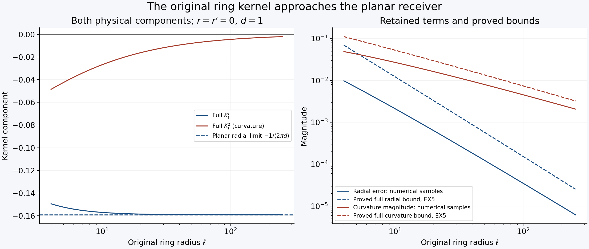
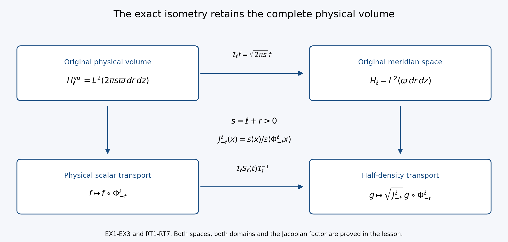

# The original ring kernel and its unstable spectral space

[Lesson 31](compact-vortices-and-the-full-weighted-euler-generator.md)
constructed a compact planar vortex with an actual unstable eigenmode and
proved its full weighted Euler generator. This lesson constructs the
three-dimensional ring receiver and transfers that spectral space to an
actual ring, keeping the original physical coordinates, signs and volume.

The first part derives the full Newton and Biot–Savart kernels, including
the axis behavior and curvature terms. An exact angular integral gives a
bound uniform in the ring radius. We prove convergence to the planar
receiver in operator norm, keeping both the corrected velocity and
vorticity. This also strengthens the bound for the stretching operator.

The second part constructs the full transport group with its Jacobian
factor and proves its precise domain. The contour comparison then gives
an actual growing three-dimensional mode, its pressure and the original
force holding its background stationary. The last exercise strengthens
the comparison to preserve the entire enclosed algebraic multiplicity.

The human source is Dallas Albritton, Elia Brué and Maria Colombo,
[*Non-uniqueness of Leray solutions of the forced Navier–Stokes equations*,
arXiv:2112.03116v1](https://arxiv.org/abs/2112.03116v1), original main.tex
991–1632. Its printed axis boundary condition and transport-flow formula
receive explicit corrections below, each with its full replacement map.
The unstable planar input has already been constructed in lessons 29–31;
no assumed unstable ring substitutes for the transfer proved here.

Keep the actual original radius \(R\), stream function \(\Psi\),
background vorticity \(g_R\), weight \(\varpi\), eigenvalue
\(\lambda_R\) and eigenmode from lesson 31. Its equations CP1–CP32,
WG1–WG23 and EX14–EX18 give the complete incoming proofs.
The ring radius \(\ell\) is a new physical parameter; the original time,
amplitude and viscosity are retained throughout all receiving maps.

Five solved exercises give the exact physical-volume isometry, retained
curvature kernel, full background-gradient correction, original Euler
and viscous forces, and complete algebraic spectral count. This lesson
proves the Euler spectral transfer. The following viscous and nonlinear
steps remain to be constructed. Author self-check only; no independent
review or novelty claim is asserted.

## RK1. Keep the physical three-dimensional objects

Fix the actual radius \(R\geq4\), the original compact radial stream function \(\Psi\), and the actual ring radius \(\ell\geq2R\). Write

\[
s=\ell+r>0,\qquad X=(s\cos\theta,s\sin\theta,z),\qquad
dX=s\,dr\,d\theta\,dz,\qquad D_\ell=\{(r,z):r>-\ell\}.
\tag{RK1}
\]

Use exactly the weight \(\varpi\) of WG1: it equals one on \(B_R\), is at least one everywhere, and equals \((1+r^2+z^2)^{50}\) outside \(B_{2R}\). Put \(H=L^2(\varpi\,dr\,dz)\) and \(H_\ell=L^2(D_\ell,\varpi\,dr\,dz)\). Restriction is \(P_\ell:H\to H_\ell\); zero extension is \(E_\ell:H_\ell\to H\). Their norms are one and \(P_\ell E_\ell=I\), whereas \(E_\ell P_\ell\) is multiplication by \(1_{D_\ell}\). These are different maps with the stated domains.

For \(\omega\in H_\ell\), the physical vorticity is

\[
\Omega(X)=-\omega(r,z)e_\theta,\qquad e_\theta=(-\sin\theta,\cos\theta,0).
\tag{RK2}
\]

In particular the source scalar is minus the physical swirl component. Define

\[
A_\ell=\sup_{D_\ell}\frac{\ell+r}{\varpi(r,z)},\qquad
J_{\ell,2}=\int_{D_\ell}\frac{(\ell+r)^2}{\varpi(r,z)}\,dr\,dz.
\]

Both are finite: \(\ell+r\leq\ell+|(r,z)|\), and the weight has the stated power outside a finite disk. Exact cylindrical integration and Cauchy–Schwarz give

\[
\|\Omega\|_{L^2(\mathbb R^3)}^2
=2\pi\int_{D_\ell}(\ell+r)|\omega|^2\,dr\,dz
\leq2\pi A_\ell\|\omega\|_{H_\ell}^2,
\quad
\|\Omega\|_1\leq2\pi J_{\ell,2}^{1/2}\|\omega\|_{H_\ell}.
\tag{RK3}
\]

Distributional divergence vanishes even when the scalar has no trace on the axis. Indeed its pairing with the gradient of a compact smooth test function is
\(-\int\omega(r,z)\partial_\theta\phi(X)\,dr\,d\theta\,dz=0\), by integration over the complete circle. Absolute integrability follows from RK3. No axis boundary term is discarded.

## RK2. Construct the actual Newton and velocity maps

Retain the original Newton multiplier and the whole physical kernel:

\[
\mathcal A(X)=\frac1{4\pi}\int_{\mathbb R^3}\frac{\Omega(Y)}{|X-Y|}\,dY,
\qquad
u(X)=\frac1{4\pi}\int_{\mathbb R^3}
\frac{\Omega(Y)\mathbin{\times}(X-Y)}{|X-Y|^3}\,dY.
\tag{RK4}
\]

The first integral is absolutely convergent: on a unit ball use Cauchy–Schwarz and \(\int_{|Z|<1}|Z|^{-2}dZ=4\pi\); outside it use \(\|\Omega\|_1\). Its distributional curl is the second kernel. The latter is first defined for smooth compact inputs and then by the local estimates proved below, or equivalently by its Fourier multiplier. These definitions agree by approximation.

With \(\widehat f(\xi)=\int e^{-iX\cdot\xi}f(X)dX\) and inverse multiplier \((2\pi)^{-3}\),

\[
\widehat u(\xi)=\frac{i\xi\times\widehat\Omega(\xi)}{|\xi|^2},\qquad
\operatorname{div}u=0,\qquad\operatorname{curl}u=\Omega,
\qquad\|\nabla u\|_2^2=\|\Omega\|_2^2.
\tag{RK5}
\]

Here \(\xi\cdot\widehat\Omega=0\) by RK2, so
\(|\xi\times\widehat\Omega|^2=|\xi|^2|\widehat\Omega|^2\); applying Plancherel with its full factor proves the last identity and the curl formula. Also \(u\in L^2\): on \(|\xi|\leq1\), its squared multiplier is bounded by \(\|\Omega\|_1^2|\xi|^{-2}\), whose integral is \(4\pi\|\Omega\|_1^2\); on the complement use \(\|\Omega\|_2\). This fixes the physical receiver uniquely among \(L^2\) velocities having the stated curl and divergence. The Fourier transform of their difference is annihilated by both cross and dot products with \(\xi\), hence vanishes almost everywhere. There is no arbitrary constant velocity in this class.

Smooth scalars compactly supported inside \(D_\ell\) are dense in \(H_\ell\): first truncate to compact subsets away from the axis and infinity, then mollify where the weight is smooth and bounded above and below. RK3 makes the resulting physical vorticities converge in both \(L^1\) and \(L^2\). Thus all these identities pass to every \(\omega\in H_\ell\).

Rotational symmetry and the odd sine integrals give \(\mathcal A=\psi e_\theta\) and no azimuthal velocity. For \(x=(r,z)\), \(y=(r',z')\), set

\[
s'=\ell+r',\quad d^2=(r-r')^2+(z-z')^2,\quad
D(\vartheta)^2=d^2+2ss'(1-\cos\vartheta).
\]

The full potential and both velocity components at the original meridian are

\[
\psi(r,z)=-\frac1{4\pi}\int_{D_\ell}s'\omega(r',z')
\int_0^{2\pi}\frac{\cos\vartheta}{D(\vartheta)}\,d\vartheta\,dr'\,dz',
\tag{RK6}
\]

\[
\begin{pmatrix}u^r\\u^z\end{pmatrix}(x)
=\int_{D_\ell}K_\ell(x,y)\omega(y)\,dy,
\quad
K_\ell(x,y)=\frac{s'}{4\pi}\int_0^{2\pi}
\frac{\begin{pmatrix}-(z-z')\cos\vartheta\\ s\cos\vartheta-s'\end{pmatrix}}
{D(\vartheta)^3}\,d\vartheta.
\tag{RK7}
\]

For verification, at \(X=(s,0,z)\), \(Y=(s'\cos\vartheta,s'\sin\vartheta,z')\), the vorticity is \((\omega\sin\vartheta,-\omega\cos\vartheta,0)\). Its cross product with \(X-Y\) has first and third components \(-\omega(z-z')\cos\vartheta\) and \(\omega(s\cos\vartheta-s')\); its second component integrates to zero. Thus both signs and the factor \(s'\) in RK7 come from RK4, not a two-dimensional replacement.

Differentiating the physical vector potential gives

\[
u^r=-\psi_z,\qquad u^z=\psi_r+\frac{\psi}{s},\qquad
\left(\partial_r^2+\frac1s\partial_r-\frac1{s^2}+\partial_z^2\right)\psi=\omega.
\tag{RK8}
\]

The equation follows from \(-\Delta\mathcal A=\Omega\), including the angular derivative of \(e_\theta\). The physical divergence is \((\partial_r+s^{-1})u^r+\partial_zu^z=0\); its physical curl is \(-\omega e_\theta\), retaining both curvature terms in RK8.

## RK3. Prove the axis condition and the source correction

For a smooth physical potential of the form \(\psi(s,z)e_\theta\), smoothness at \(s=0\) means locally

\[
\psi(s,z)=s\,a(s^2,z),\qquad a\text{ smooth}.
\tag{RK9}
\]

Here is the exact smoothness argument. On the line \((X_1,X_2)=(s,0)\), the second component of the potential is a smooth odd function of signed \(s\), by rotation through \(\pi\). Division by \(s\) is smooth by the integral identity \(F(s)/s=\int_0^1F'(ts)dt\), and the quotient is even. An even smooth function is smooth in \(s^2\) on the closed half-line: Taylor's formula to arbitrary even order writes it as a polynomial in \(s^2\) with a remainder whose derivatives have the required orders at zero. Rotation then recovers the potential as \(a(X_1^2+X_2^2,z)(-X_2,X_1,0)\). Conversely this Cartesian formula is smooth and has precisely the asserted meridian component. In particular \(\psi(0,z)=0\), while \(\partial_s\psi(0,z)=a(0,z)\) need not vanish. For nonsmooth inputs the receiver is defined by RK4–RK8 and the density argument, not by imposing a pointwise trace that may not exist.

An actual compact counterexample to the printed normal-derivative condition is obtained by taking any \(\chi\in C_c^\infty(\mathbb R)\) equal to one near zero, putting \(q=s^2+z^2\), and defining

\[
\psi=s\chi(q),\qquad
u^r=-2sz\chi'(q),\qquad
u^z=2\chi(q)+2s^2\chi'(q),\qquad
\omega=10s\chi'(q)+4sq\chi''(q).
\tag{RK10}
\]

The Cartesian potential \((-X_2\chi(q),X_1\chi(q),0)\), velocity and vorticity are smooth and compactly supported. Direct differentiation gives every term in RK10 and \(\Delta(\psi e_\theta)=\omega e_\theta\). This compact potential is exactly RK4: its difference from that Newton potential is a harmonic vector distribution tending to zero at infinity, hence zero. To justify the last implication, the difference is a smooth harmonic function, its values equal averages over arbitrarily large spheres, and the decaying bound forces those averages to zero. Yet \(\partial_s\psi(0,z)=\chi(z^2)\), equal to one near \(z=0\). The outward normal at the half-plane boundary is \(-\partial_s\), so its normal derivative is nonzero as well. Thus source lines 1040 and 1449 exclude genuine smooth physical inputs when read literally. RK9 and the full Newton receiver supply the exact replacement, without changing the source sign convention or differential expression.

## RK4. Prove a uniform kernel bound in the original coordinates

For \(s,s'>0\) and \(d>0\), the meridian numerator \(N\) of RK7 satisfies

\[
D(\vartheta)^2-|N(\vartheta)|^2
=(s^2+(z-z')^2)\sin^2\vartheta\geq0.
\]

Consequently \(|K_\ell(x,y)|\leq(s'/(4\pi))\int_0^{2\pi}D(\vartheta)^{-2}d\vartheta\). The angular integral is exact:

\[
\int_0^{2\pi}\frac{d\vartheta}{d^2+2ss'(1-\cos\vartheta)}
=\frac{2\pi}{d\sqrt{d^2+4ss'}}.
\tag{RK11}
\]

To prove it, split the circle at \(\pi\) and use \(t=\tan(\vartheta/2)\). The combined real-line integral is
\(2\int_{-\infty}^{\infty}[d^2+(d^2+4ss')t^2]^{-1}dt\); the antiderivative is the corresponding arctangent, giving RK11 with its full factor. Since
\(d^2+4ss'=(s+s')^2+(z-z')^2\geq(s')^2\), it follows that

\[
|K_\ell(x,y)|\leq\frac{s'}{2d\sqrt{d^2+4ss'}}\leq\frac1{2d}.
\tag{RK12}
\]

This bound holds on the entire meridian half-plane, uniformly in the original ring radius. It retains the full physical kernel before estimating it. It does not assert a global two-dimensional energy norm for the physical velocity.

Let \(J_\varpi=\int_{\mathbb R^2}\varpi^{-1}\), finite by WG2. For every physical cutoff length \(h>0\), split the dominating kernel at \(|x-y|=h\). Its inner \(L^1\) norm is \(\pi h\); its outer supremum is \(1/(2h)\). Young's inequality, the area \(|B_R|=\pi R^2\), and Cauchy–Schwarz therefore give

\[
\|\mathrm{BS}_\ell\omega\|_{L^2(B_R)}
\leq\pi h\|E_\ell\omega\|_2+
\frac{\sqrt\pi R}{2h}\|E_\ell\omega\|_1
\leq C_{R,h}\|\omega\|_{H_\ell},
\quad
C_{R,h}=\pi h+\frac{\sqrt\pi R}{2h}J_\varpi^{1/2}.
\tag{RK13}
\]

No zero-circulation assumption is imposed. Young's step follows directly by integrating translations of the input against the nonnegative inner kernel and applying the triangle inequality in \(L^2\). Thus it applies equally to vector components and complex inputs.

## RK5. Compare the full kernels quantitatively

The planar receiver has kernel
\(K_\infty(x,y)=(-(z-z'),r-r')/(2\pi d^2)\), by WG3. Keep both terms of the ring kernel by putting \(a=\sqrt{ss'}\), \(c=\sqrt{s'/s}\) and

\[
J_0(a,d)=\int_0^{2a}\frac{dv}{(d^2+v^2)^{3/2}\sqrt{1-v^2/(4a^2)}},\qquad
J_2(a,d)=\int_0^{2a}\frac{v^2\,dv}{(d^2+v^2)^{3/2}\sqrt{1-v^2/(4a^2)}}.
\]

The substitution \(v=2a\sin(\vartheta/2)\), with both halves of the circle included, gives exactly

\[
K_\ell^r=-\frac{c(z-z')}{2\pi}J_0+
\frac{c(z-z')}{4\pi a^2}J_2,
\qquad
K_\ell^z=\frac{c(r-r')}{2\pi}J_0-\frac{1}{4\pi a}J_2.
\tag{RK14}
\]

In particular the second vertical term is not discarded as a change of stream constant. It is the physical curvature contribution.

We have the explicit bounds

\[
\left|J_0(a,d)-\frac1{d^2}\right|
\leq\frac{\frac14\operatorname{arsinh}(a/d)+\pi+\frac12}{a^2},
\qquad
0\leq J_2(a,d)\leq\frac2{\sqrt3}\operatorname{arsinh}(a/d)+\pi.
\tag{RK15}
\]

For their proof, on \(0\leq v\leq a\) use
\((1-v^2/(4a^2))^{-1/2}\leq2/\sqrt3\) and
\((1-v^2/(4a^2))^{-1/2}-1\leq v^2/(4a^2)\). The second inequality follows on writing its left side as \(u/[\sqrt{1-u}(1+\sqrt{1-u})]\) with \(0\leq u\leq1/4\); the denominator is at least one. Also
\(v^2(d^2+v^2)^{-3/2}\leq(d^2+v^2)^{-1/2}\), whose integral is \(\operatorname{arsinh}(a/d)\). On \([a,2a]\), bound the integrands of \(J_0\) and \(J_2\) respectively by \(a^{-3}\) and \(a^{-1}\) times the square-root factor. That factor has integral \(2\pi a/3\leq\pi a\) over this interval. Finally the omitted tail of \(\int_0^\infty(d^2+v^2)^{-3/2}dv=d^{-2}\) is bounded by \(\int_a^\infty v^{-3}dv=1/(2a^2)\). These three regions prove RK15.

Fix \(A\geq2R\), \(\ell\geq2A\), and \(0<\delta\leq A+R\). For \(x\in B_R\), \(y\in B_A\), \(d\geq\delta\), set
\(b=\ell-A\), \(D_A=A+R\), and \(H_{\ell,A,\delta}=\operatorname{arsinh}((\ell+A)/\delta)\). Then \(a\in[b,\ell+A]\), \(c\leq\sqrt3\), and
\(|c-1|\leq|r-r'|/(2b)\). RK14–RK15 prove

\[
|K_\ell(x,y)-K_\infty(x,y)|\leq F_{\ell,A,\delta},
\tag{RK16}
\]

where every contribution is retained in

\[
F_{\ell,A,\delta}=
\frac1{4\pi b}
+\frac{\sqrt3 D_A}{2\pi b^2}\left(\frac14H_{\ell,A,\delta}+\pi+\frac12\right)
+\left(\frac{\sqrt3D_A}{4\pi b^2}+\frac1{4\pi b}\right)
\left(\frac2{\sqrt3}H_{\ell,A,\delta}+\pi\right).
\tag{RK17}
\]

Indeed the coefficient error contributes \(|c-1|/(2\pi d)\leq1/(4\pi b)\); the \(J_0\) error contributes the second summand; the two \(J_2\) errors contribute the last two coefficients. For fixed \(A,\delta\), the whole bound tends to zero as \(\ell\to\infty\).

The near diagonal is controlled without a pointwise convergence assertion there: RK12 and the exact planar magnitude give the dominating kernel \((\pi+1)/(2\pi|x-y|)\), whose integral on the \(\delta\)-disk is \((\pi+1)\delta\). For the remaining compact region, Cauchy–Schwarz in \(B_A\), followed by integration in \(B_R\), gives operator norm at most \(\pi RA F_{\ell,A,\delta}\).

For the exterior input \(f1_{|y|>A}\), the exact source weight gives

\[
\|f1_{|y|>A}\|_2\leq(1+A^2)^{-25}\|f\|_H,
\qquad
\|f1_{|y|>A}\|_1\leq\sqrt{\frac\pi{49}}(1+A^2)^{-49/2}\|f\|_H.
\tag{RK18}
\]

The last reciprocal integral is \(2\pi\int_A^\infty\rho(1+\rho^2)^{-50}d\rho=\pi(1+A^2)^{-49}/49\). Applying RK13 and its planar counterpart to the respective restricted tails proves the complete bound

\[
\begin{split}
\|\mathrm{BS}_\ell P_\ell-\mathrm{BS}_{2d}\|_{H\to L^2(B_R)}
\leq{}&(\pi+1)\delta+\pi RA F_{\ell,A,\delta}\\
&+(\pi+1)h(1+A^2)^{-25}
+\frac{(\pi+1)R}{2\sqrt\pi h}\sqrt{\frac\pi{49}}(1+A^2)^{-49/2}.
\end{split}
\tag{RK19}
\]

Here \(B_A\subset D_\ell\), while both original exterior contributions are included in the last line; no extension across the physical axis has been equated to an original physical input. Given any positive tolerance, first fix \(h>0\), choose \(A\geq2R\) to make the last line small, then choose \(\delta>0\) to make its first summand small, and finally choose \(\ell\geq2A\) using RK17. This proves genuine operator-norm convergence with explicit finite bounds.

## RK6. Receive the corrected background and compact coupling

The actual corrected background from EX14–EX18 is

\[
\bar U_\ell=(-\Psi_z,\Psi_r+\Psi/s),\qquad
\bar\omega_\ell=g_R+\Psi_r/s-\Psi/s^2,
\quad
\operatorname{div}_{2d}\bar U_\ell=\Psi_z/s=-\bar U_\ell^r/s.
\tag{RK20}
\]

All are supported in \(B_R\). Keep the full generator decomposition of the source, with its original signs:

\[
\begin{split}
M_\ell f&=-\bar U_\ell\cdot\nabla f-\tfrac12(\operatorname{div}_{2d}\bar U_\ell)f,\\
K_\ell^{\rm op}f&=-\mathrm{BS}_\ell[f]\cdot\nabla\bar\omega_\ell,\\
S_\ell f&=s^{-1}\mathrm{BS}_\ell[f]^r\bar\omega_\ell
+s^{-1}\bar U_\ell^r f+\tfrac12(\operatorname{div}_{2d}\bar U_\ell)f.
\end{split}
\tag{RK21}
\]

The superscript distinguishes the coupling operator from the two-variable kernel. The sum is exactly the negative linearized vorticity expression in source line 1035. The domain remains the distributional transport domain; a complete proof of its generator properties is a subsequent step.

For fixed \(\ell\), the receiver is locally compact from \(H_\ell\) into \(L^2(B_R)\). RK13 bounds the velocity locally. RK5 and cylindrical integration bound its meridional derivatives on \(B_{R+1}\) by

\[
\int_{B_{R+1}}|\nabla_{r,z}(u^r,u^z)|^2\,dr\,dz
\leq\frac{\|\nabla u\|_{L^2(\mathbb R^3)}^2}{2\pi(\ell-R-1)}
\leq\frac{A_\ell}{\ell-R-1}\|\omega\|_{H_\ell}^2.
\tag{RK22}
\]

The denominator is positive since \(\ell\geq2R\) and \(R\geq4\). The full Cartesian gradient includes these meridional terms and additional nonnegative angular terms, so none is assigned a false sign. Multiplying by a smooth cutoff equal to one on \(B_R\), supported in \(B_{R+1}\), gives bounded \(H^1\) functions on a fixed square. Periodize them on a larger square; the complete Fourier sum has tail bounded by the inverse squared frequency cutoff times the gradient norm, and every finite Fourier projection has finite-dimensional bounded image. A diagonal subsequence therefore converges strongly in \(L^2\). This is the explicit compactness argument of WG9 with the actual RK22 constant. Multiplication by \(\nabla\bar\omega_\ell\) proves compactness of \(K_\ell^{\rm op}\).

Write \(\varepsilon_\ell\) for the RK19 bound and \(C^{(2)}_{R,h}=h+R J_\varpi^{1/2}/(2\sqrt\pi h)\), the planar local bound from WG3. The exact difference is

\[
\begin{split}
E_\ell K_\ell^{\rm op}P_\ell-K_\infty^{\rm op}
={}&-\big(\mathrm{BS}_\ell P_\ell-\mathrm{BS}_{2d}\big)\cdot\nabla\bar\omega_\ell\\
&-\mathrm{BS}_{2d}\cdot\nabla(\bar\omega_\ell-g_R),
\end{split}
\]

where both outputs are supported in \(B_R\), so \(E_\ell\) makes no alteration there. Thus

\[
\|E_\ell K_\ell^{\rm op}P_\ell-K_\infty^{\rm op}\|
\leq\varepsilon_\ell\|\nabla\bar\omega_\ell\|_\infty
+C^{(2)}_{R,h}\|\nabla(\Psi_r/s-\Psi/s^2)\|_\infty\longrightarrow0.
\tag{RK23}
\]

Convergence of the second term follows by differentiating both original correction terms; every derivative of \(s^{-j}\) retains its factor \(-j s^{-j-1}\), and \(s\geq\ell-R\) on the fixed support. This supplies the background-gradient contribution in addition to the two velocity maps compared in the source.

Finally, retain all three terms of \(S_\ell\) in RK21. Equation RK20 proves their exact coefficient identity
\(s^{-1}\bar U_\ell^r+\tfrac12\operatorname{div}_{2d}\bar U_\ell=\bar U_\ell^r/(2s)\). Therefore the original three-term operator satisfies

\[
\|S_\ell\|_{H_\ell\to H_\ell}
\leq\frac{\|\bar\omega_\ell\|_\infty C_{R,h}+\tfrac12\|\bar U_\ell^r\|_\infty}{\ell-R},
\qquad
\|\bar\omega_\ell\|_\infty\leq\|g_R\|_\infty+
\frac{\|\Psi_r\|_\infty}{\ell-R}+\frac{\|\Psi\|_\infty}{(\ell-R)^2}.
\tag{RK24}
\]

All constants on the right are explicitly defined and bounded independently of \(\ell\). This proves an \(O((\ell-R)^{-1})\) estimate for this actual compact background, strengthening the source's sufficient \(O(\ell^{-1/3})\) estimate. It follows from the full original kernel and physical volume; no change of time, amplitude, viscosity or coordinates is used. The kernel comparison and both compact and small terms are now ready for the exact transport-group and contour calculation. They alone do not assert a ring eigenvalue.

## RT1. Construct the exact complete flow

Keep the actual radius \(R\geq4\), stream function \(\Psi\), weight \(\varpi\), and ring radius \(\ell\geq2R\). Define on the whole original meridian plane

\[
V_\ell(r,z)=\left(-\Psi_z,\Psi_r+\frac{\Psi}{\ell+r}\right)
\quad\hbox{on }B_R,\qquad V_\ell=0\quad\hbox{off }B_R,
\qquad V_\infty=(-\Psi_z,\Psi_r).
\tag{RT1}
\]

Every derivative matches zero at the boundary, because the original \(\Psi\) is smooth and compactly supported there and \(\ell+r\geq\ell-R>0\). Thus the extensions are smooth, bounded and globally Lipschitz, with bounded derivatives of all orders. No value of the quotient near the physical axis is used in this extension. Picard iteration gives a unique flow \(\Phi_t^\ell\) for every real time: bounded velocity prevents finite escape, and the derivative equation \(\partial_tD\Phi_t^\ell=(DV_\ell)(\Phi_t^\ell)D\Phi_t^\ell\) gives a smooth diffeomorphism with inverse \(\Phi_{-t}^\ell\). Points outside \(B_R\) are fixed. A point inside cannot cross its boundary in finite time: uniqueness backward from a boundary point, whose complete trajectory is fixed, rules out such a crossing. Hence \(B_R\) and its complement are invariant.

The actual two-dimensional divergence and Jacobian are

\[
d_\ell=\operatorname{div}_{2d}V_\ell=\frac{\Psi_z}{\ell+r}=-\frac{V_\ell^r}{\ell+r},\qquad
J_t^\ell(x)=\det D\Phi_t^\ell(x)
=\exp\left(\int_0^t d_\ell(\Phi_\tau^\ell(x))\,d\tau\right).
\tag{RT2}
\]

The determinant formula follows by differentiating the determinant in the matrix ODE, initially at the identity and thereafter by invertibility. Along a trajectory in \(B_R\), \(s_t=\ell+(\Phi_t^\ell(x))_r\) satisfies \(\partial_t\log s_t=V_\ell^r/s_t=-d_\ell\). Therefore

\[
J_t^\ell(x)=\frac{\ell+r}{\ell+(\Phi_t^\ell(x))_r},\qquad
\frac{\ell-R}{\ell+R}\leq J_t^\ell(x)\leq\frac{\ell+R}{\ell-R}
\quad(x\in B_R).
\tag{RT3}
\]

Outside \(B_R\), the exact Jacobian is one, including at points where \(\ell+r\) is zero or negative; the quotient in RT3 is asserted only on the indicated invariant disk. For the planar flow \(\Phi_t^\infty\), \(d_\infty=0\) and \(J_t^\infty=1\).

## RT2. Prove the full transport group and its precise domain

On \(H=L^2(\varpi\,dr\,dz)\), put

\[
T_\ell(t)f(x)=\sqrt{J_{-t}^\ell(x)}\,f(\Phi_{-t}^\ell(x)).
\tag{RT4}
\]

The positive square root is fixed. The original weight is constant one on the moving disk and all other points are fixed, so \(\varpi(\Phi_t^\ell x)=\varpi(x)\). Changing variables \(y=\Phi_{-t}^\ell x\), with its entire Jacobian, gives
\(\|T_\ell(t)f\|_H^2=\int |f(y)|^2\varpi(y)dy\). The flow composition and determinant chain rule prove \(T_\ell(t+u)=T_\ell(t)T_\ell(u)\) and \(T_\ell(0)=I\). Uniform continuity on compact sets proves strong continuity for compact smooth inputs. Their density in \(H\), obtained by truncation and local mollification, and the exact norm one extend it to all inputs.

Differentiation on compact smooth functions gives the original half-density operator

\[
M_\ell f=-V_\ell\cdot\nabla f-\frac12d_\ell f,
\qquad
\mathcal D_\ell=\{f\in H:V_\ell\cdot\nabla f\in L^2(B_R)\text{ in distributions}\}.
\tag{RT5}
\]

This is precisely the generator domain, not only a convenient core. First suppose the difference quotient of RT4 converges to \(g\) in \(H\). Pair it with a compact smooth test function and differentiate the dual pullback. Integration by parts, using \(V_\ell\cdot\nabla\varpi=0\), identifies \(g=-V_\ell\cdot\nabla f-d_\ell f/2\) as a distribution. Since the bounded coefficient \(d_\ell\) is supported in \(B_R\), this puts \(f\) in exactly \(\mathcal D_\ell\).

Conversely take \(f\in\mathcal D_\ell\) and set \(g\) equal to the right side of RT5. It belongs to \(H\). For a compact smooth test \(h\), the function \(T_\ell(-t)h\) is again compact and smooth. Differentiating the pairing \(\langle T_\ell(t)f,h\rangle=\langle f,T_\ell(-t)h\rangle\) and using the distributional formula gives \(\langle T_\ell(t)g,h\rangle\). Integration in time and density of these tests prove the actual Bochner identity

\[
T_\ell(t)f-f=\int_0^tT_\ell(\tau)g\,d\tau.
\tag{RT6}
\]

Its quotient tends to \(g\) by strong continuity. This proves the reverse domain inclusion. It also proves closure: if \(f_n\to f\) and \(M_\ell f_n\to g\) in \(H\), the distributional formula passes to the limit, so \(f\in\mathcal D_\ell\) and \(M_\ell f=g\). Compact smooth functions belong to the domain and are dense, so it is densely defined.

The exact resolvents are

\[
\begin{split}
R_\ell^0(\lambda)f&=\int_0^\infty e^{-\lambda t}T_\ell(t)f\,dt&& (\operatorname{Re}\lambda>0),\\
R_\ell^0(\lambda)f&=-\int_{-\infty}^0e^{-\lambda t}T_\ell(t)f\,dt&& (\operatorname{Re}\lambda<0),\\
\|R_\ell^0(\lambda)\|&\leq|\operatorname{Re}\lambda|^{-1}.&&
\end{split}
\tag{RT7}
\]

Absolute Bochner convergence follows from unitarity. Differentiating after a time translation in RT4 shows that the integral belongs to the difference-quotient domain and satisfies \((\lambda-M_\ell)R_\ell^0f=f\). For domain inputs, integrate the derivative of \(e^{-\lambda t}T_\ell(t)f\), using RT6 and the exponentially vanishing endpoint, to obtain the other inverse identity. Thus RT7 is a two-sided inverse on the exact domain.

The operator is skew-adjoint. Differentiating the preserved inner product proves skew symmetry on its generator domain. If \(h\in D(M_\ell^*)\), testing its defining identity against compact smooth functions identifies \(-M_\ell^*h\) with the distributional expression in RT5; hence \(h\in\mathcal D_\ell\) by the domain equivalence just proved. Skew symmetry supplies the converse inclusion and \(M_\ell^*=-M_\ell\). The same argument with \(V_\infty\), \(d_\infty=0\), constructs the planar transport \(M_\infty\).

The source formula at main.tex1248–1249 requires both the backward flow and the square-root Jacobian in RT4 for its declared negative half-density operator. In particular the unweighted pullback alone does not generate the operator at source1066 when \(d_\ell\ne0\). The exact calculation above repairs that map. The displayed difference at source1253 also repeats the same transport operator; its receiving difference here is \(R_\ell^0-R_\infty^0\).

## RT3. Keep restriction, extension and the zero exterior block

Let \(Q_\ell=E_\ell P_\ell\), the orthogonal projection in \(H\) onto functions supported in \(D_\ell\). The flow is fixed near and beyond the physical axis, so it commutes with \(Q_\ell\). Consequently

\[
\begin{gathered}
\mathcal D_\ell=(I-Q_\ell)H\ \oplus\ E_\ell D(M_\ell^{\rm phys}),
\\
M_\ell=0\ \oplus\ M_\ell^{\rm phys},
\\
D(M_\ell^{\rm phys})=\{f\in H_\ell:V_\ell\cdot\nabla f\in L^2(B_R)\}.
\end{gathered}
\tag{RT8}
\]

There is no axis distribution in this formula: \(V_\ell\) vanishes on an open neighborhood of the boundary of \(D_\ell\). Define the full common-space generator

\[
L_\ell=M_\ell+E_\ell K_\ell^{\rm op}P_\ell+E_\ell S_\ell P_\ell
\quad\hbox{on }\mathcal D_\ell,
\qquad
L_\infty=M_\infty+K_\infty^{\rm op}.
\tag{RT9}
\]

Every bounded extra output is supported in \(B_R\subset D_\ell\). Thus its exact block form is \(L_\ell=0\oplus L_\ell^{\rm phys}\). For \(\lambda\ne0\),

\[
(\lambda-L_\ell)^{-1}
=\lambda^{-1}(I-Q_\ell)+E_\ell(\lambda-L_\ell^{\rm phys})^{-1}P_\ell
\tag{RT10}
\]

whenever either inverse exists, and it exists on one side if and only if it exists on the other. This follows by multiplication on both blocks, keeping their domains from RT8. The boundedness of one inverse implies that of its compressed block and conversely the displayed direct sum is bounded. Therefore the spectra agree away from zero, and eigenvectors and all generalized eigenvectors for nonzero eigenvalues correspond by \(E_\ell,P_\ell\). Indeed the exterior block of \((L_\ell-\lambda)^k f=0\) is \((-\lambda)^k(I-Q_\ell)f=0\), forcing that component to vanish.

## RT4. Prove strong resolvent convergence with all factors

Put \(L_V=\|DV_\infty\|_\infty\) and \(\delta_\ell=\|\Psi\|_\infty/(\ell-R)\). Comparing the two integral flow equations and applying the integral Grönwall estimate yields

\[
\sup_x|\Phi_t^\ell(x)-\Phi_t^\infty(x)|
\leq\delta_\ell |t|e^{L_V|t|}.
\tag{RT11}
\]

The estimate follows directly by iterating \(e(t)\leq\delta_\ell|t|+L_V\int_0^{|t|}e(\tau)d\tau\); the exponential series bounds every iterate, including \(L_V=0\). For \(x\in B_R\), RT3 also gives
\(\sqrt{J_{-t}^\ell}\leq\sqrt3\) and

\[
|\sqrt{J_{-t}^\ell(x)}-1|
=\frac{|r-(\Phi_{-t}^\ell(x))_r|}
{\sqrt{\ell+(\Phi_{-t}^\ell(x))_r}\,[\sqrt{\ell+r}+\sqrt{\ell+(\Phi_{-t}^\ell(x))_r}]}
\leq\frac R{\ell-R}.
\tag{RT12}
\]

Both flow differences vanish outside the disk, where the Jacobians equal one. For compact smooth \(f\), \(|t|\leq T\), the triangle inequality therefore proves

\[
\|(T_\ell(t)-T_\infty(t))f\|_H
\leq\sqrt\pi R\left[
\sqrt3\|\nabla f\|_\infty\delta_\ell T e^{L_VT}
+\frac R{\ell-R}\|f\|_\infty\right].
\tag{RT13}
\]

For any \(a>0\), splitting the resolvent integral at the actual time \(T>0\), and using the norm two bound for the difference on its remaining tail, gives uniformly on \(\operatorname{Re}\lambda\geq a\)

\[
\|(R_\ell^0(\lambda)-R_\infty^0(\lambda))f\|_H
\leq W_{\ell,T,a}(f),
\tag{RT14}
\]

where

\[
W_{\ell,T,a}(f)=\frac{1-e^{-aT}}a\sqrt\pi R
\left[\sqrt3\|\nabla f\|_\infty\delta_\ell T e^{L_VT}
+\frac R{\ell-R}\|f\|_\infty\right]
+\frac{2e^{-aT}}a\|f\|_H.
\tag{RT15}
\]

For any positive tolerance choose \(T\) first and then \(\ell\) to make this bound small. Density of compact smooth functions and the uniform bound \(2/a\) extend strong convergence, uniformly on that entire half-plane, to every fixed \(f\in H\). This is strong convergence, not an unsupported operator-norm convergence of the two transport resolvents.

The compact coupling supplies the needed norm convergence. Set \(K=K_\infty^{\rm op}\). Given \(\eta>0\), compactness gives a finite \(\eta/2\)-net of \(K\)'s unit-ball image. Approximate its centers by compact smooth functions within \(\eta/2\), and let \(G\) be their finite span. Orthogonal projection onto \(G\) therefore satisfies \(\|K-\Pi_GK\|\leq\eta\). Choose an orthonormal basis \(g_1,\ldots,g_m\) of \(G\); each is still compact and smooth. Write
\(F=\Pi_GK=\sum_{j=1}^m g_j\alpha_j\), with bounded functionals \(\alpha_j(f)=\langle Kf,g_j\rangle\). This is an auxiliary finite-rank approximation of the same original operator; it does not rescale the original eigenmode or physical background. Then

\[
\sup_{\operatorname{Re}\lambda\geq a}
\|(R_\ell^0-R_\infty^0)(\lambda)K\|
\leq\frac{2\eta}a+\sum_{j=1}^m\|\alpha_j\|W_{\ell,T,a}(g_j)
=:\Delta_\ell.
\tag{RT16}
\]

Choosing \(\eta\), then \(T\), then \(\ell\), makes \(\Delta_\ell\) arbitrarily small. All functionals, finite-dimensional ranges and residual norms in this argument have explicit domains and norms.

## RT5. Preserve domains in both perturbation factorizations

Take the actual unstable eigenvalue \(\lambda_\infty=\lambda_R\) of lesson31 and its actual smooth compact eigenvorticity \(f_*\ne0\), without altering its amplitude. Put \(N=\|f_*\|_H>0\). For any prescribed \(0<\varepsilon<\operatorname{Re}\lambda_\infty\), the proved isolation in WG18–WG22 allows a circle

\[
\Gamma=\{\lambda:|\lambda-\lambda_\infty|=\rho\},\quad
0<\rho<\min\{\varepsilon,\operatorname{Re}\lambda_\infty/2\},\quad
a=\operatorname{Re}\lambda_\infty-\rho>0,
\tag{RT17}
\]

whose closed disk contains no other spectrum of \(L_\infty\). Its contour resolvent norm \(L_*\) is finite by continuity and compactness. Put \(H_*=1+L_*\|K\|\). On \(\Gamma\),

\[
D_\infty=I-R_\infty^0K,\qquad
D_\infty^{-1}=I+(\lambda-L_\infty)^{-1}K,\qquad
\|D_\infty^{-1}\|\leq H_*.
\tag{RT18}
\]

Multiplication of the two expressions verifies the inverse using the resolvent equation. Whenever \(H_*\Delta_\ell<1/2\), Neumann inversion of
\(D_\ell=D_\infty-(R_\ell^0-R_\infty^0)K\) gives
\(\|D_\ell^{-1}\|\leq2H_*\). This factor and its inverse preserve the precise unbounded domain \(\mathcal D_\ell\): \(R_\ell^0K\) maps all of \(H\) into that domain, and \(x=D_\ell^{-1}y\) satisfies \(x=y+R_\ell^0Kx\). Thus if \(y\) is in the domain so is \(x\), and the forward statement is immediate. Consequently

\[
A_\ell=M_\ell+K,\qquad
R_{A_\ell}(\lambda)=D_\ell^{-1}R_\ell^0(\lambda),\qquad
\|R_{A_\ell}(\lambda)\|\leq B_*:=\frac{2H_*}{a}
\tag{RT19}
\]

is an actual two-sided inverse on \(\mathcal D_\ell\). These operators are closed because the coupling is bounded and \(M_\ell\) is closed.

The inverse difference identity, with its order retained, is
\(D_\ell^{-1}-D_\infty^{-1}=D_\ell^{-1}(R_\ell^0-R_\infty^0)K D_\infty^{-1}\). It gives for the actual \(f_*\)

\[
\sup_{\lambda\in\Gamma}\|(R_{A_\ell}(\lambda)-R_{L_\infty}(\lambda))f_*\|
\leq2H_*W_{\ell,T,a}(f_*)+\frac{2H_*^2\Delta_\ell}{a}N.
\tag{RT20}
\]

Now keep the complete receiving difference from RK23–RK24:

\[
\begin{split}
D_\ell^{\rm rem}&=E_\ell K_\ell^{\rm op}P_\ell-K+E_\ell S_\ell P_\ell,\\
d_\ell^{\rm rem}&=\varepsilon_\ell\|\nabla\bar\omega_\ell\|_\infty
+C^{(2)}_{R,h}\|\nabla(\Psi_r/s-\Psi/s^2)\|_\infty\\
&\quad+\frac{\|\bar\omega_\ell\|_\infty C_{R,h}+\frac12\|V_\ell^r\|_\infty}{\ell-R},
\qquad\|D_\ell^{\rm rem}\|\leq d_\ell^{\rm rem}\longrightarrow0.
\end{split}
\tag{RT21}
\]

Here \(\varepsilon_\ell\) is the full two-parameter cutoff bound RK19, chosen to tend to zero by its stated order of choices; \(h>0\) is kept fixed. The notation \(d_\ell^{\rm rem}\) is different from the physical divergence \(d_\ell\) in RT2. If \(B_*d_\ell^{\rm rem}<1/2\), then

\[
\begin{split}
\lambda-L_\ell&=(\lambda-A_\ell)(I-R_{A_\ell}D_\ell^{\rm rem}),\\
R_{L_\ell}&=(I-R_{A_\ell}D_\ell^{\rm rem})^{-1}R_{A_\ell},\\
\|R_{L_\ell}\|&\leq2B_*,\qquad
\|R_{L_\ell}-R_{A_\ell}\|\leq2B_*^2d_\ell^{\rm rem}.
\end{split}
\tag{RT22}
\]

This inverse also preserves the domain by \(x=y+R_{A_\ell}D_\ell^{\rm rem}x\). No multiplication of formal unbounded expressions is used without that domain statement.

## RT6. Prove that a nonzero contour produces an actual eigenvalue

First the required spectral type is established. Let \(\sigma_\ell=\|E_\ell S_\ell P_\ell\|\), which tends to zero by RK24, and \(N_\ell=M_\ell+E_\ell S_\ell P_\ell\) on \(\mathcal D_\ell\). For \(\operatorname{Re}\lambda>\sigma_\ell\), factoring relative to \(M_\ell\) gives an inverse of norm at most \((\operatorname{Re}\lambda-\sigma_\ell)^{-1}\). Its holomorphy follows from the convergent local resolvent series. The remaining coupling \(C_\ell=E_\ell K_\ell^{\rm op}P_\ell\) is compact by RK22. Thus

\[
\lambda-L_\ell=(\lambda-N_\ell)(I-R_{N_\ell}(\lambda)C_\ell).
\tag{RT23}
\]

For completeness, the compact analytic argument is the full finite-dimensional calculation, applied to the present actual maps. Near any \(\lambda_0\) in this half-plane, approximate \(B(\lambda)=R_{N_\ell}(\lambda)C_\ell\) by a fixed finite-rank \(JL\) so that \(E(\lambda)=B(\lambda)-JL\) has norm below one half throughout a neighborhood. Define \(V=(I-E)^{-1}J\) and the finite matrix \(F=I-LV\). Then

\[
I-B=(I-E)(I-VL),\qquad
(I-VL)^{-1}=I+VF^{-1}L.
\tag{RT24}
\]

These identities follow by multiplication; the determinant inverse gives a meromorphic inverse whenever \(\det F\) is not identically zero. Moreover \(x\mapsto Lx\) and \(c\mapsto Vc\) are inverse maps of the kernels: if \((I-VL)x=0\), then \(x=VLx\), and if \(Fc=0\), then \(LVc=c\). The inverse of \(I-E\) in the first factor does not change this kernel. Hence determinant zeros are actual eigenvectors, not merely a range obstruction.

There is an invertible point at every sufficiently large positive real \(\lambda\), since \(\|B(\lambda)\|\leq\|C_\ell\|/(\operatorname{Re}\lambda-\sigma_\ell)<1\). To extend meromorphic invertibility to the whole connected half-plane, consider the set of points possessing a neighborhood with such a meromorphic inverse. It is nonempty and open. At any point of its closure use RT24 on a small connected disk. That disk intersects an already meromorphic neighborhood and contains an invertible point there, since poles are isolated. Its finite determinant is therefore not identically zero. RT24 extends the meromorphic inverse through the disk. The set is closed, hence is the whole half-plane. Consequently every spectral point there is isolated and is an eigenvalue.

Each has finite algebraic multiplicity as well. Around one such point choose a small contour within the half-plane. The difference
\(R_{L_\ell}-R_{N_\ell}=R_{L_\ell}C_\ell R_{N_\ell}\) is compact. The contour integral of \(R_{N_\ell}\) is zero. Thus the spectral contour integral is compact. The resolvent identity
\(R(\lambda)R(\mu)=[R(\mu)-R(\lambda)]/(\lambda-\mu)\), integrated on two nested contours, proves that this integral is a projection: the inner-pole term contributes one copy and the other contributes zero. Its range is finite-dimensional, because an infinite orthonormal sequence in the range would contradict compactness. Integrating \(L_\ell R(\lambda)=\lambda R(\lambda)-I\) in the graph norm shows its range lies in the domain and is invariant. Every eigenvalue of the finite-dimensional restriction must be the enclosed point, since the contour acts on any eigenvector by its winding number. Cayley–Hamilton then makes the shifted restriction nilpotent. Conversely the exact finite resolvent expansion
\(R(\lambda)f=\sum_{j=0}^{k-1}(L_\ell-\lambda_0)^jf/(\lambda-\lambda_0)^{j+1}\) on any generalized eigenvector telescopes after multiplication by \(\lambda-L_\ell\); integration fixes that vector. This proves that the finite range is exactly the entire generalized eigenspace.

Choose \(\ell\) sufficiently large that \(\sigma_\ell<a/2\), both strict Neumann inequalities above hold, and

\[
\rho\left[
2B_*^2d_\ell^{\rm rem}N+2H_*W_{\ell,T,a}(f_*)
+\frac{2H_*^2\Delta_\ell}{a}N\right]<\frac N2.
\tag{RT25}
\]

Such an actual finite radius exists: choose the finite-rank tolerance \(\eta\), then the time cutoff \(T\), then the kernel tail and diagonal cutoffs from RK19, and finally \(\ell\) so that all retained bounds are below the fixed positive tolerances. Each displayed bound remains valid for every larger \(\ell\); alternatively their eventual convergence gives a common finite lower threshold. The actual eigenmode amplitude \(N\) has not been replaced by one.

Define \(\mathcal P_\ell=(2\pi i)^{-1}\int_\Gamma R_{L_\ell}(\lambda)d\lambda\), with positive orientation. Since \(R_{L_\infty}(\lambda)f_*=(\lambda-\lambda_\infty)^{-1}f_*\), its planar counterpart satisfies \(\mathcal P_\infty f_*=f_*\). RT20 and RT22, including the circle length \(2\pi\rho\), imply

\[
\|\mathcal P_\ell f_*-f_*\|_H<\frac N2,
\qquad \mathcal P_\ell f_*\ne0.
\tag{RT26}
\]

If the circle's interior contained no spectrum, the resolvent would be holomorphic throughout it and its contour integral would be zero, contradicting RT26. Hence it contains a spectral point \(\lambda_\ell\). Its real part is at least \(a>\sigma_\ell\), so the just-proved finite-dimensional reduction makes it an actual eigenvalue of finite algebraic multiplicity. RT10 transfers it to the physical half-plane operator and its actual eigenvector \(\omega_\ell\ne0\). In the original, unchanged time variable,

\[
|\lambda_\ell-\lambda_\infty|<\rho<\varepsilon,
\qquad\operatorname{Re}\lambda_\ell>\operatorname{Re}\lambda_\infty-\varepsilon>0,
\qquad L_\ell^{\rm phys}\omega_\ell=\lambda_\ell\omega_\ell.
\tag{RT27}
\]

This proves the full actual ring spectral transfer from the already constructed planar unstable vortex, with no assumed unstable ring profile. Exercise5 proves the stronger operator-norm convergence of these contour projections, including the required adjoint transport estimate and compact-left product. The entire enclosed algebraic multiplicity is therefore retained for every sufficiently large original ring radius, even when the eigenvalues split.

## RT7. Receive the physical three-dimensional mode exactly

All coefficients and outputs in the physical generator vanish off \(B_R\). The eigenvalue equation and \(\lambda_\ell\ne0\) therefore force \(\omega_\ell=0\) there. The actual physical mode

\[
\Omega_\ell(X)=-\omega_\ell(r,z)e_\theta,\qquad
u_\ell=\mathrm{BS}_{3d}[\Omega_\ell],\qquad
\|\Omega_\ell\|_2^2=2\pi\int_{B_R}(\ell+r)|\omega_\ell|^2\,dr\,dz
\tag{RT28}
\]

has compact toroidal vorticity, \(\Omega_\ell\in L^1\cap L^2\), and \(u_\ell\in H^1(\mathbb R^3)\) by RK3–RK5. It is nonzero because its curl is the nonzero \(\Omega_\ell\). No compact support is asserted for its velocity and no smoothness beyond the proved class is inserted.

Let \(\bar u_\ell(X)=V_\ell^r(r,z)e_r+V_\ell^z(r,z)e_z\) be the actual smooth compact divergence-free three-dimensional background. It is an actual stationary forced Euler solution with its original meridian pressure retained. Namely take the radial pressure \(p_R\) of CP14, including its given additive constant and derivative \(p_R'(\rho)=\rho\zeta_R(\rho)^2\), and set \(\bar p_\ell(X)=p_R(\sqrt{r^2+z^2})\). It is constant near the physical axis and outside the supporting torus, so is smooth as a function of the Cartesian point. Define

\[
\bar f_\ell=\bar u_\ell\cdot\nabla\bar u_\ell+\nabla\bar p_\ell.
\tag{RT28a}
\]

This is a smooth compact force, with all components and its comparison to the original planar steady equation calculated in Exercise 4 below. It makes the background exactly stationary with the retained pressure; it is not an assertion that this corrected ring is an unforced steady Euler solution. The force is held fixed in the linearization, so its variation is zero. For the original scalar convention, the physical linearized vorticity equation is exactly

\[
\partial_t\omega=-V_\ell\cdot\nabla\omega
-u\cdot\nabla\bar\omega_\ell
+\frac{V_\ell^r}{s}\omega+\frac{u^r}{s}\bar\omega_\ell.
\tag{RT29}
\]

To verify every curvature sign, for any axisymmetric no-swirl velocity \(w=w^re_r+w^ze_z\) and azimuthal field \(b e_\theta\), direct angular differentiation gives
\((b e_\theta\cdot\nabla)w=b w^r e_\theta/s\), while \((w\cdot\nabla)(b e_\theta)=(w\cdot\nabla b)e_\theta\). Substitute \(b=-\omega\) and \(\bar b=-\bar\omega_\ell\) into the full linearized curl equation
\(\partial_t\Omega+\bar u\cdot\nabla\Omega+u\cdot\nabla\bar\Omega=\bar\Omega\cdot\nabla u+\Omega\cdot\nabla\bar u\). Multiplication by \(-1\) produces RT29 and precisely RK21. Thus \(e^{\lambda_\ell t}\Omega_\ell\) solves the physical linearized curl equation in distributions.

The full velocity residual
\(F=\lambda_\ell u_\ell+\bar u_\ell\cdot\nabla u_\ell+u_\ell\cdot\nabla\bar u_\ell\) belongs to \(L^2\) and has zero curl by RT29 and the actual curl identities. Define its pressure gradient by

\[
\widehat\pi(\xi)=\frac{i\xi\cdot\widehat F(\xi)}{|\xi|^2}\quad(\xi\ne0),
\qquad \nabla\pi=-F,
\qquad\lambda_\ell u_\ell+\bar u_\ell\cdot\nabla u_\ell+u_\ell\cdot\nabla\bar u_\ell+\nabla\pi=0.
\tag{RT30}
\]

The Fourier expression defines a tempered distribution: near zero, Cauchy–Schwarz and the integrability of \(|\xi|^{-2}\) in three dimensions make it locally integrable; at infinity it is tempered by its weighted \(L^2\) bound. Since \(\xi\times\widehat F=0\), its gradient multiplier equals \(-\widehat F\) almost everywhere. This proves the asserted pressure and permits the original arbitrary spatial constant; no force or pressure term is omitted. The complex mode has exact norm \(\|e^{\lambda_\ell t}\Omega_\ell\|_2^2=e^{2\operatorname{Re}\lambda_\ell t}\|\Omega_\ell\|_2^2\). Its real and imaginary parts each solve the real linearized equation, with the exact identity

\[
\|\operatorname{Re}(e^{\lambda_\ell t}\Omega_\ell)\|_2^2+
\|\operatorname{Im}(e^{\lambda_\ell t}\Omega_\ell)\|_2^2
=e^{2\operatorname{Re}\lambda_\ell t}\|\Omega_\ell\|_2^2.
\tag{RT31}
\]

No unjustified factor of one half is assigned to either real component of this general ring mode. The proved compact smooth background, positive-real-part eigenvalue, full physical mode, pressure and exact growth identity now provide the inputs for the source's Euler-to-viscous spectral transfer. That next construction must retain its original amplitude prefactor, diffusion, dilation, domains and force before a Navier–Stokes or nonlinear claim is made.

## Two pictures of the original kernel and volume map

RK6–RK19 and Exercise 2 retain the complete angular kernel. Here the
original points have \(r=r'=0\) and \(z-z'=d=1\), while the ring radius
runs from \(4\) to \(256\). Solid curves are numerical quadrature samples
of the exact RK14 integrals, with their recorded errors; dashed curves
are the proved bounds in EX5 or the exact planar limit. The vertical
curvature term is nonzero at every finite radius. These are kernel
samples, not computed vortex eigenvalues. The
[reproducible source](../assets/original-ring-kernel-and-volume.py) and
[sample values](../assets/original-ring-kernel-samples.json) are included.

RT1–RT7 and Exercise 1 prove every map in this diagram. The physical
measure is \(2\pi s\varpi\,dr\,dz\), with \(s=\ell+r>0\).
The isometry multiplies by \(\sqrt{2\pi s}\). Conjugating the physical
pullback supplies precisely the square-root Jacobian factor; the full
generator domains correspond as well. The same
[figure source](../assets/original-ring-kernel-and-volume.py) creates
this diagram. Human comparison for both figures: Albritton–Brué–Colombo,
original main.tex1033–1043, 1066 and 1240–1257, with the corrections proved
in this lesson.

## Five solved exercises

### Exercise 1. Prove the exact map between physical transport and the half-density group

Let \(s=\ell+r\), and retain the physical scalar Hilbert space
\(H_\ell^{\rm vol}=L^2(D_\ell,2\pi s\varpi\,dr\,dz)\).
Construct an isometry to \(H_\ell\), calculate the conjugated transport generator, and recover the whole factor in RT4.

**Solution.** The actual maps and their norms are

\[
\mathcal I_\ell f=\sqrt{2\pi s}\,f,
\qquad\mathcal I_\ell^{-1}g=(2\pi s)^{-1/2}g,
\qquad\|\mathcal I_\ell f\|_{H_\ell}^2
=2\pi\int_{D_\ell}s\varpi|f|^2=\|f\|_{H_\ell^{\rm vol}}^2.
\tag{EX1}
\]

They are defined on their entire stated spaces even though their multipliers need not be bounded on a different, unweighted space. The flow preserves \(s\,dr\,dz\) by RT3 and preserves \(\varpi\), so the physical transport group is \(S_\ell(t)f=f\circ\Phi_{-t}^\ell\), unitary on \(H_\ell^{\rm vol}\). Direct multiplication gives

\[
\mathcal I_\ell S_\ell(t)\mathcal I_\ell^{-1}g
=\sqrt{\frac{s}{s(\Phi_{-t}^\ell x)}}\,g(\Phi_{-t}^\ell x)
=T_\ell(t)g.
\tag{EX2}
\]

For a compact smooth function supported away from the axis, compute the full derivative before combining terms:

\[
\begin{split}
\mathcal I_\ell(-V_\ell\cdot\nabla)\mathcal I_\ell^{-1}g
&=-V_\ell\cdot\nabla g+\frac{V_\ell^r}{2s}g\\
&=-V_\ell\cdot\nabla g-\frac12d_\ell g=M_\ell^{\rm phys}g.
\end{split}
\tag{EX3}
\]

This is the precise morphism between the physical-volume transport and the half-density presentation. The equality of the full generator domains follows directly from EX2 and the definition by convergent difference quotients: an isometry takes such a quotient to the conjugate quotient and preserves its convergence. Thus it is not limited to the test functions used for the displayed differentiation. In particular both the physical Jacobian and the factor \(2\pi\) remain in the map. The original vorticity generator additionally contains its two stretching contributions and the velocity coupling in RK21; EX3 does not discard them.

### Exercise 2. Retain the curvature term in the exact angular kernel

For two points with the same original meridian coordinate \(r=r'=0\), but \(z-z'=d>0\), compute both components of \(K_\ell\). Prove that the vertical component is nonzero for every finite \(\ell\), and derive their limits as \(\ell\to\infty\). What lower bound does this impose on a constant in a uniform estimate \(|K_\ell(x,y)|\leq C/|x-y|\)?

**Solution.** Here \(s=s'=a=\ell\) and \(c=1\). Equation RK14, including both angular integrals, gives

\[
K_\ell^r=-\frac d{2\pi}J_0(\ell,d)+\frac d{4\pi\ell^2}J_2(\ell,d),
\qquad K_\ell^z=-\frac1{4\pi\ell}J_2(\ell,d).
\tag{EX4}
\]

The integrand defining \(J_2\) is strictly positive for \(0<v<2\ell\), so its integral is positive and \(K_\ell^z<0\). This is a genuine curvature velocity contribution for a scalar input at the chosen meridian position. Its full original integral remains present even though it tends to zero in the large-ring comparison.

Using RK15 gives the explicit bounds

\[
\begin{split}
\left|K_\ell^r+\frac1{2\pi d}\right|
&\leq\frac d{2\pi\ell^2}
\left(\frac14\operatorname{arsinh}(\ell/d)+\pi+\frac12\right)
+\frac d{4\pi\ell^2}
\left(\frac2{\sqrt3}\operatorname{arsinh}(\ell/d)+\pi\right),\\
0<-K_\ell^z&\leq\frac1{4\pi\ell}
\left(\frac2{\sqrt3}\operatorname{arsinh}(\ell/d)+\pi\right).
\end{split}
\tag{EX5}
\]

For fixed \(d>0\), both right sides tend to zero, since \(\operatorname{arsinh}t=\log(t+\sqrt{1+t^2})\). Thus the full ring kernel tends to \((-1/(2\pi d),0)\) at these original points. Any uniform constant \(C\) in the question must satisfy \(C\geq1/(2\pi)\), by multiplying by \(d\) and taking that limit. The proved universal value \(C=1/2\) from RK12 lies above this necessary lower bound; no claim of its optimality is made.

### Exercise 3. Bound the entire corrected background-gradient term

Prove an explicit uniform bound for the gradient correction used in RK23 and RT21, with all contributions from \(\Psi_r/s-\Psi/s^2\) retained.

**Solution.** Differentiate each summand in its original coordinates:

\[
\begin{split}
\partial_r(\bar\omega_\ell-g_R)
&=\frac{\Psi_{rr}}s-\frac{2\Psi_r}{s^2}+\frac{2\Psi}{s^3},\\
\partial_z(\bar\omega_\ell-g_R)
&=\frac{\Psi_{rz}}s-\frac{\Psi_z}{s^2}.
\end{split}
\tag{EX6}
\]

Equivalently, the exact vector is \(s^{-1}(\Psi_{rr},\Psi_{rz})-s^{-2}(2\Psi_r,\Psi_z)+s^{-3}(2\Psi,0)\). Its support is \(B_R\), and \(s\geq\ell-R\) there. The triangle inequality gives

\[
\|\nabla(\bar\omega_\ell-g_R)\|_\infty
\leq\frac{\|\nabla\Psi_r\|_\infty}{\ell-R}
+\frac{\|(2\Psi_r,\Psi_z)\|_\infty}{(\ell-R)^2}
+\frac{2\|\Psi\|_\infty}{(\ell-R)^3}
=:G_\ell.
\tag{EX7}
\]

Thus \(\|\nabla\bar\omega_\ell\|_\infty\leq\|\nabla g_R\|_\infty+G_\ell\). Substitution in the exact two-term coupling difference proves

\[
\|E_\ell K_\ell^{\rm op}P_\ell-K_\infty^{\rm op}\|
\leq\varepsilon_\ell(\|\nabla g_R\|_\infty+G_\ell)
+C^{(2)}_{R,h}G_\ell.
\tag{EX8}
\]

Every derivative, sign and original curvature power has first appeared in EX6; the norm estimate follows from those complete terms. This supplies a directly usable finite bound in RT21. Convergence of the two velocity receivers alone would omit the last term of EX8.

### Exercise 4. Compute the force that holds the actual corrected ring stationary

Retain the original planar steady pressure \(p_R\) and all constants in it. Compute the full three-dimensional stationary Euler force for the corrected ring, then compute the additional force needed at any fixed original viscosity \(\nu>0\). Finally retain a positive amplitude prefactor \(\beta\) without changing time or coordinates.

**Solution.** Put \(U=(-\Psi_z,\Psi_r)\), \(v=(0,\Psi/s)\), so \(V_\ell=U+v\). The exact planar steady identity is \(U\cdot\nabla U+\nabla p_R=0\). The no-swirl three-dimensional convective components equal the meridional directional derivatives; there is no azimuthal centrifugal term because that velocity component is identically zero. Consequently the complete force before evaluating any cancellation is

\[
\bar f_\ell^{E}=U\cdot\nabla v+v\cdot\nabla U+v\cdot\nabla v.
\tag{EX9}
\]

Its radial component is \(-\Psi\Psi_{zz}/s\). Its vertical component, with all four differentiations displayed, is

\[
-\Psi_z\left(\frac{\Psi_r}s-\frac{\Psi}{s^2}\right)
+\frac{\Psi_r\Psi_z}s+\frac{\Psi\Psi_{rz}}s+\frac{\Psi\Psi_z}{s^2}
=\frac{\Psi\Psi_{rz}}s+\frac{2\Psi\Psi_z}{s^2}.
\tag{EX10}
\]

Both expressions are smooth and supported in the same meridian disk. In Cartesian space they yield a smooth compact toroidal force; the whole ring stays away from the axis. For example the exact displayed components imply

\[
\|\bar f_\ell^E\|_\infty
\leq\frac{\|\Psi\|_\infty\|(-\Psi_{zz},\Psi_{rz})\|_\infty}{\ell-R}
+\frac{2\|\Psi\|_\infty\|\Psi_z\|_\infty}{(\ell-R)^2}.
\tag{EX11}
\]

For the original Navier–Stokes equation
\(\partial_tu+u\cdot\nabla u+\nabla p=\nu\Delta u+f\), the full force is

\[
\bar f_\ell^\nu=\bar f_\ell^E-\nu\Delta_{3d}\bar u_\ell.
\tag{EX12}
\]

Writing \(g_R=\Psi_{rr}+\Psi_{zz}\), the full cylindrical vector Laplacian has components

\[
\begin{split}
(\Delta_{3d}\bar u_\ell)^r
&=(\partial_r^2+s^{-1}\partial_r+\partial_z^2-s^{-2})(-\Psi_z)
=-(g_R)_z-\frac{\Psi_{rz}}s+\frac{\Psi_z}{s^2},\\
(\Delta_{3d}\bar u_\ell)^z
&=(\partial_r^2+s^{-1}\partial_r+\partial_z^2)(\Psi_r+\Psi/s)
=(g_R)_r+\frac{\Psi_{rr}+g_R}s-\frac{\Psi_r}{s^2}+\frac{\Psi}{s^3}.
\end{split}
\tag{EX13}
\]

Thus the complete original-viscosity force is

\[
\begin{split}
(\bar f_\ell^\nu)^r
&=-\frac{\Psi\Psi_{zz}}s+\nu(g_R)_z+\nu\frac{\Psi_{rz}}s-\nu\frac{\Psi_z}{s^2},\\
(\bar f_\ell^\nu)^z
&=\frac{\Psi\Psi_{rz}}s+\frac{2\Psi\Psi_z}{s^2}
-\nu(g_R)_r-\nu\frac{\Psi_{rr}+g_R}s
+\nu\frac{\Psi_r}{s^2}-\nu\frac{\Psi}{s^3}.
\end{split}
\tag{EX14}
\]

The leading diffusion contributions \(\nu(g_R)_z\) and \(-\nu(g_R)_r\) survive the large-ring comparison. They cannot be hidden inside the small Euler force. Both the Euler and viscous force identities keep \(\bar p_\ell=p_R(\sqrt{r^2+z^2})\), including its original additive constant.

For \(\bar u_{\ell,\beta}=\beta\bar u_\ell\), choose the complete background pressure \(\bar p_{\ell,\beta}=\beta^2\bar p_\ell\). Direct substitution, with the original \(\nu\) unchanged, gives

\[
\bar f_{\ell,\beta}^{\nu}
=\beta^2\bar f_\ell^E-\nu\beta\Delta_{3d}\bar u_\ell.
\tag{EX15}
\]

The Euler linearized generator scales by \(\beta\), hence its actual eigenvalue by \(\beta\), while the physical eigenvector may be kept fixed and its perturbation pressure scales by \(\beta\). The viscous term keeps \(\nu\Delta\), so this Euler identity alone does not prove viscous spectral persistence. This exact comparison identifies the next calculation rather than assuming that missing result.

### Exercise 5. Preserve the whole algebraic spectral count, not only one mode

Show that the contour projections in RT26 converge in operator norm and eventually have equal finite rank. Retain the original circle and all its enclosed algebraic multiplicity. Explain which extra estimate is needed beyond strong resolvent convergence.

**Solution.** For \(\operatorname{Re}\lambda\geq a\), the adjoint of the transport resolvent has the exact integral

\[
(R_\ell^0(\lambda))^*f
=\int_0^\infty e^{-\overline\lambda t}T_\ell(-t)f\,dt.
\tag{EX16}
\]

The same RT13 estimate holds at negative times, and the groups remain unitary. Splitting this integral at \(T\) therefore proves the same strong estimate RT14–RT15 for the adjoint difference. By the finite-rank construction of RT16 applied to \(K^*\), there is an explicit bound tending to zero,

\[
\sup_{\operatorname{Re}\lambda\geq a}
\|K(R_\ell^0-R_\infty^0)(\lambda)\|
=\sup_{\operatorname{Re}\lambda\geq a}
\|(R_\ell^0-R_\infty^0)(\lambda)^*K^*\|
\leq\widetilde\Delta_\ell\longrightarrow0.
\tag{EX17}
\]

Explicitly, if \(K^*=\sum_{j=1}^{\widetilde m}\widetilde g_j\widetilde\alpha_j+E\) with \(\|E\|\leq\widetilde\eta\) and compact smooth \(\widetilde g_j\), then
\(\widetilde\Delta_\ell=2\widetilde\eta/a+\sum_j\|\widetilde\alpha_j\|W_{\ell,\widetilde T,a}(\widetilde g_j)\). Choose \(\widetilde\eta\), then \(\widetilde T\), then \(\ell\), exactly as before. This is the additional compact-left estimate; compactness with strong convergence on the wrong side would not prove it.

For the reference resolvent retain the exact correction

\[
R_{A_\ell}-R_\ell^0
=D_\ell^{-1}R_\ell^0K R_\ell^0.
\tag{EX18}
\]

The three-factor difference inside this expression is exactly
\((R_\ell^0-R_\infty^0)K R_\ell^0+R_\infty^0K(R_\ell^0-R_\infty^0)\). Its norm is at most \((\Delta_\ell+\widetilde\Delta_\ell)/a\). Also RT18–RT20 give
\(\|D_\ell^{-1}-D_\infty^{-1}\|\leq2H_*^2\Delta_\ell\). Therefore

\[
\|(R_{A_\ell}-R_\ell^0)-(R_{L_\infty}-R_\infty^0)\|
\leq\frac{2H_*}{a}(\Delta_\ell+\widetilde\Delta_\ell)
+\frac{2H_*^2\|K\|}{a^2}\Delta_\ell
\quad(\lambda\in\Gamma).
\tag{EX19}
\]

Each transport resolvent is holomorphic throughout the original circle's disk because its real part is positive. Their contour integrals are zero. Combining EX19 with the full remaining perturbation bound RT22 proves

\[
\|\mathcal P_\ell-\mathcal P_\infty\|
\leq\rho\left[
2B_*^2d_\ell^{\rm rem}
+\frac{2H_*}{a}(\Delta_\ell+\widetilde\Delta_\ell)
+\frac{2H_*^2\|K\|}{a^2}\Delta_\ell\right]
\longrightarrow0.
\tag{EX20}
\]

This preserves the full nonorthogonal projection and its original contour constants; it does not replace it by an orthogonal spectral projection. Both projections have finite rank by the complete compact-contour argument RT6, which also applies if the circle encloses several isolated eigenvalues: the base resolvent is holomorphic throughout the disk, the correction is compact, and the same nested-contour identity proves idempotence.

Choose \(\ell\) large enough that the right side of EX20 is less than one. If \(v\in\operatorname{ran}\mathcal P_\infty\) and \(\mathcal P_\ell v=0\), then
\(\|v\|=\|(\mathcal P_\infty-\mathcal P_\ell)v\|<\|v\|\) unless \(v=0\). Thus \(\mathcal P_\ell\) injects that finite-dimensional range into \(\operatorname{ran}\mathcal P_\ell\). Interchanging the two projections proves the reverse dimension inequality. Hence

\[
\dim\operatorname{ran}\mathcal P_\ell
=\dim\operatorname{ran}\mathcal P_\infty.
\tag{EX21}
\]

The finite-dimensional restriction of each full generator to its contour range has exactly the enclosed eigenvalues. For each such point, the finite generalized eigenspace is the whole corresponding full generalized eigenspace by the telescoping resolvent argument of RT6. The primary decomposition of a finite matrix, obtained by the relatively prime factors of its characteristic polynomial and their Bézout identity, splits the contour range into these generalized eigenspaces. Thus EX21 is equality of the entire enclosed algebraic spectral count, allowing eigenvalue splitting and nontrivial Jordan blocks. It strengthens RT27 without claiming individual eigenvalues stay simple or that their numerical values are known.

Strong convergence alone would not suffice for this conclusion: on a Hilbert space with an orthonormal sequence \(e_0,e_1,\ldots\), the projections onto \(\operatorname{span}\{e_0,e_n\}\) converge strongly to the projection onto \(\operatorname{span}\{e_0\}\), since the \(n\)-th coefficient of every square-summable sequence tends to zero, while their ranks remain two. The exact compact-left estimate EX17 and the full contour computation EX18–EX20 supply the missing operation here.

## Continue to the original viscous spectral transfer

The actual compact planar instability now has a complete three-dimensional
ring receiver. Its growing spectral space survives with its whole enclosed
algebraic count. The pressure, physical-volume map, axis condition and
stationary background force are all explicit. The eigenvorticity is compact
and square-integrable; the velocity has the proved full physical Sobolev
regularity. No stronger eigenmode regularity has been assumed.

The next calculation must retain the source amplitude prefactor, original
viscosity and self-similar dilation, and prove the full viscous domain and
spectral transfer before constructing the nonlinear forced Leray solutions.
The later smooth-forcing, Alpöge–Buckmaster, OpenAI and workbench lessons
remain part of the assigned series.
