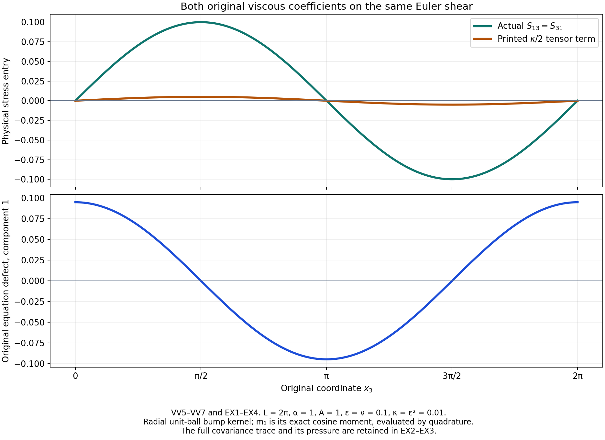
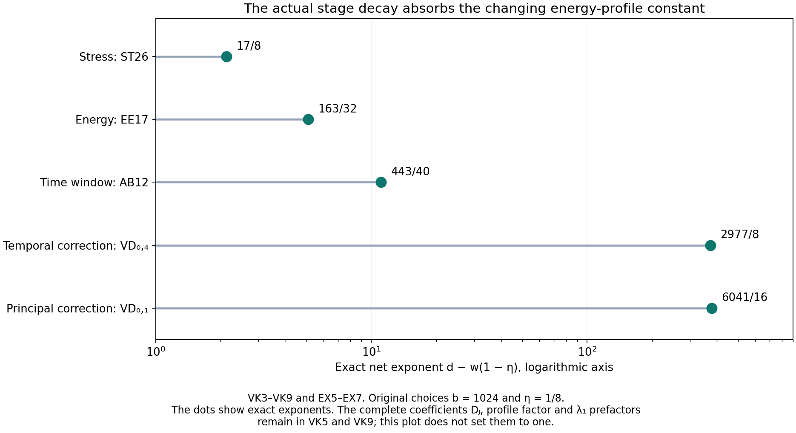

# The original vanishing-viscosity limit

[Lesson 27](prescribed-energy-and-the-infinite-weak-solution.md)
constructed weak Navier–Stokes solutions with prescribed energy.
Here we start with a given Hölder Euler velocity and construct
a sequence of those viscous solutions converging to it.

The starting stress must receive the complete original viscous
term. Its energy gap must match the starting index. Its changing
energy-profile norm must fit every later step with one fixed
frequency base. We prove each requirement, keep a common time
interval for all convolutions, and obtain strong convergence
in a positive Sobolev space as well as the original physical
energy space. The final pressure comparison and quantitative
rates retain all physical constants.

The human source is Tristan Buckmaster and Vlad Vicol,
[*Nonuniqueness of weak solutions to the Navier–Stokes equation*,
arXiv:1709.10033v4](https://arxiv.org/abs/1709.10033v4),
original author TeX 232–239 and 343–403.
We compare its displayed viscosity coefficients, symmetric
tensor, initial energy index and approximation exponent with
the full equation. The corrections remain identified as such;
the complete construction below proves the vanishing-viscosity
conclusion using the source's stated final viscosity sequence.

The original torus has period \(L\), volume \(V=L^3\) and
frequency unit \(\alpha=2\pi/L\). For the iteration retain
\(V\geq1/(50\sqrt3)\), which includes the source's \(L=2\pi\).
The force and spatial mean are zero. All spatial integrals use
physical Lebesgue measure. The original Hölder Euler hypothesis
and its entire time interval are specified in VV1.

IC, IK and OS refer to
[lesson 23](the-full-intermittent-correction-and-residual.md);
SC and AB to
[lesson 24](mollification-stress-cutoffs-and-energy.md);
VC, PL and VD to
[lesson 25](the-complete-velocity-step.md);
SM, SP and ST to
[lesson 26](the-complete-stress-step.md);
EE and LC to lesson 27.
All constants used here have their complete definitions and
proofs in those chapters. VV constructs the starting fields;
VK proves their full continuation and convergence.
The five solved exercises test the original equation, compute
the exact parameter margins, verify the time domains, retain
the full Sobolev weight, and give explicit viscosity rates.
This exposition has an author self-check; no independent review
or novelty claim is asserted.

## VV1. Retain the original Euler field, interval and all physical periods

Let the original mean-zero Euler velocity be
\(u\in C^{\bar\beta}_{x,t}(\mathbb T_L^3\times[-2T,2T])\),
\(\bar\beta>0,T>0\), with its original pressure \(p^E\):
\[
 \partial_tu+\operatorname{div}(u\otimes u)+\nabla p^E=0,
 \qquad\operatorname{div}u=0,\qquad\overline u=0 .
 \tag{VV1}
\]
All equations are distributional. The row-gradient convention
is \(A_{ij}=\partial_j u_i\). The original volume is \(V=L^3\),
and \(\alpha=2\pi/L\); no period or physical integral is rescaled.

Choose the auxiliary exponent
\(\eta=\min\{\bar\beta/2,1/2\}\), so \(0<\eta<1\).
This does not replace the original Hölder hypothesis: it gives
the following explicit receiving bound from it. Let
\[
 \begin{gathered}
 U=\|u\|_\infty,\quad
 D=\sqrt{3(L/2)^2+(4T)^2},\\
 H=[u]_{C^\eta_{x,t}}
 \leq M_u\max\{1,D^{\min\{\bar\beta,1\}-\eta}\},
 \quad M_u=\|u\|_{C^{\bar\beta}_{x,t}} .
 \end{gathered}
 \tag{VV2}
\]
For \(\bar\beta\leq1\), divide the original Hölder estimate by
distance to the power \(\eta\). For \(\bar\beta>1\), integrate
the original first derivative along the shortest spatial
geodesic and the time segment, parametrized jointly; its
full derivative norm bounds the difference by \(M_u\) times
the Euclidean product distance. The diameter is at most \(D\).
This proves VV2, with the full original norm retained.

Take the actual nonnegative unit-mass smooth kernels
\(\phi\) on \(\mathbb R^3\) and \(\varphi\) on \(\mathbb R\),
supported respectively in the closed unit ball and \([-1,1]\).
Set \(K(y,s)=\phi(y)\varphi(s)\) and
\(K_\epsilon(h)=\epsilon^{-4}K(h/\epsilon)\).
Space is periodized on the original torus. For
\[
 \begin{gathered}
 0<\epsilon<\min\{1,T/2\},\qquad
 J=[-T,3T/2],\\
 v=K_\epsilon*u,\quad F_\epsilon=K_\epsilon*(u\otimes u),
 \quad D_\epsilon=v\otimes v-F_\epsilon,
 \end{gathered}
 \tag{VV3}
\]
every convolution window lies strictly inside the original
Euler interval. Every field in VV3 is smooth on a neighborhood
of \(J\), by differentiation of the compact kernels.
The spatial mean and divergence commute with convolution,
so \(v\) is exactly mean zero and divergence free.

## VV2. Recover the complete pressure and symmetric viscous tensor

Convolution of VV1 and addition of the actual quadratic difference
give
\[
 \partial_tv+\operatorname{div}(v\otimes v)
       +\nabla(K_\epsilon*p^E)=\operatorname{div}D_\epsilon .
 \tag{VV4}
\]
For any original \(\nu>0\), define
\[
 \begin{gathered}
 A_{ij}=\partial_jv_i,\qquad
 D_\epsilon^{\rm tf}=D_\epsilon-\tfrac13\operatorname{tr}(D_\epsilon)I,\\
 S_{\epsilon,\nu}=D_\epsilon^{\rm tf}-\nu(A+A^T),\qquad
 p_{\epsilon,\nu}=K_\epsilon*p^E-\tfrac13\operatorname{tr}(D_\epsilon).
 \end{gathered}
 \tag{VV5}
\]
The tensor \(D_\epsilon\) is symmetric. Moreover
\(\operatorname{tr}(A+A^T)=2\operatorname{div}v=0\), while
\(\operatorname{div}(A+A^T)=\Delta v+\nabla\operatorname{div}v
=\Delta v\). Substituting all terms of VV5 into VV4 proves
the exact original equation
\[
 \partial_tv+\operatorname{div}(v\otimes v)
       +\nabla p_{\epsilon,\nu}-\nu\Delta v
              =\operatorname{div}S_{\epsilon,\nu}.
 \tag{VV6}
\]
Thus the actual initial stress is real, symmetric and trace free.
The pressure has the full original convolved mean together with
the specified trace correction. No pressure-mean convergence or
removal is assumed.

This also identifies the exact receiving defect in a literal
symmetrization of the tensor printed in source line375.
With the usual symmetric-part map
\(\operatorname{sym}A=(A+A^T)/2\), its proposed viscous term
would have only half the required divergence. More generally,
if its printed coefficient is \(\kappa\), the full defect is
\[
 \begin{aligned}
 S^{\rm printed}&=D_\epsilon^{\rm tf}
                         -\tfrac\kappa2(A+A^T),\\
 \big[\partial_tv+\operatorname{div}(v\otimes v)
          +\nabla p_{\epsilon,\nu}-\nu\Delta v\big]
          -\operatorname{div}S^{\rm printed}
      &=-(\nu-\kappa/2)\Delta v .
 \end{aligned}
 \tag{VV7}
\]
The source equation uses \(\kappa=\lambda_n^{-2}\) and its later
viscosity assignment uses \(\nu_n=\lambda_n^{-1}\).
Both coefficients are preserved in VV7. This proves the exact
correction; it does not infer failure of the theorem from that
display.

## VV3. Prove the complete covariance and derivative bounds

Write \(z=(x,t)\) and retain the full four-dimensional Euclidean
length of each kernel shift. The original covariance is exactly
\[
 D_\epsilon(z)
 =-\frac12\iint K(h)K(g)
    [u(z-\epsilon h)-u(z-\epsilon g)]
       \otimes[u(z-\epsilon h)-u(z-\epsilon g)]\,dh\,dg .
 \tag{VV8}
\]
Expanding the four tensor products proves this identity:
the two squares each integrate to \(F_\epsilon\), and both
cross products integrate to \(v\otimes v\). No fluctuation
term has been dropped.

For a four-index multiindex \(a\), define the finite original
kernel moments
\[
 \begin{gathered}
 k_a=\int_{\mathbb R^4}|\partial^a K(h)|\,|h|^\eta\,dh,\qquad
 k_0=\int_{\mathbb R^4}K(h)|h|^\eta\,dh,\\
 C_0=\frac12\iint K(h)K(g)|h-g|^{2\eta}\,dh\,dg,\qquad
 C_j=\iint|\partial_jK(h)|K(g)|h-g|^{2\eta}\,dh\,dg,\\
 K_1=\sum_{j=1}^4 k_{e_j},\quad
 K_x=\sum_{j=1}^3k_{e_j},\quad
 K_{x,2}=\sum_{j=1}^3\sum_{l=1}^4k_{e_j+e_l},\quad
 C_1=\sum_{j=1}^4 C_j .
 \end{gathered}
 \tag{VV9}
\]
The repeated mixed derivative moments in \(K_{x,2}\) are
intentional: this bounds the full array before any possible
coincidences among its entries. Compact smooth kernels make
every constant finite.

For \(|a|\geq1\), the integral of \(\partial^aK\) is zero.
Subtracting the exact value \(u(z)\) inside its derivative
integral therefore gives
\[
 \|\partial^av\|_\infty\leq Hk_a\epsilon^{\eta-|a|},
 \qquad\|v-u\|_\infty\leq Hk_0\epsilon^\eta,
 \qquad\|v\|_\infty\leq U .
 \tag{VV10}
\]
The first equality used to obtain the bound is
\(\partial^av(z)=\epsilon^{-|a|}
\int\partial^aK(h)[u(z-\epsilon h)-u(z)]\,dh\).
The support lies in the given Euler interval. VV2 bounds
every actual difference; no derivative of the nonsmooth
Euler field has been taken.

For a derivative of VV8, first write its kernels as
\(K_\epsilon(z-y)K_\epsilon(z-w)\) and keep \(y,w\) as
integration variables. Differentiation then acts only on the
kernels. The two resulting terms have identical integrals by
interchanging \(y,w\), since the tensor square is unchanged by
negating its vector. Thus the factor \(1/2\) is exactly canceled
by those two terms. Changing back to \(h,g\) yields
\[
 \|D_\epsilon\|_\infty\leq C_0H^2\epsilon^{2\eta},\qquad
 \|\partial_jD_\epsilon\|_\infty
             \leq C_jH^2\epsilon^{2\eta-1}.
 \tag{VV11}
\]
This derivative proof is legitimate for merely Hölder input,
because the compact kernel derivatives are integrable and the
input is bounded. The trace-free projection contracts the full
Hilbert norm of symmetric matrices. It has the same contraction
property on each differentiated matrix.

The actual symmetric velocity-gradient bounds from VV10 are
\[
 \|A+A^T\|_\infty\leq2HK_x\epsilon^{\eta-1},\qquad
 \sum_{l=1}^4\|\partial_l(A+A^T)\|_\infty
                  \leq2HK_{x,2}\epsilon^{\eta-2}.
 \tag{VV12}
\]
Here each full Hilbert array is bounded by the sum of the
corresponding vector derivative norms. This retains every
component and every repeated mixed derivative contribution.

Combining VV5 and VV11–VV12 gives the complete physical estimates
\[
 \begin{aligned}
 \|S_{\epsilon,\nu}\|_1
 &\leq V\big[C_0H^2\epsilon^{2\eta}
                      +2\nu HK_x\epsilon^{\eta-1}\big],\\
 \|S_{\epsilon,\nu}\|_{C^1_{x,t}}
 &\leq H^2(C_0\epsilon^{2\eta}+C_1\epsilon^{2\eta-1})
       +2\nu H(K_x\epsilon^{\eta-1}
                             +K_{x,2}\epsilon^{\eta-2}),\\
 \|v\|_{C^1_{x,t}}&\leq U+HK_1\epsilon^{\eta-1}.
 \end{aligned}
 \tag{VV13}
\]
These estimates cover either actual viscosity choice.
For \(\nu=\epsilon\), the viscous stress terms have powers
\(\epsilon^\eta,\epsilon^{\eta-1}\). For \(\nu=\epsilon^2\),
they have powers \(\epsilon^{\eta+1},\epsilon^\eta\).
The two cases are distinct substitutions into the same complete
equation, not an identification of their viscosities.

## VV4. Correct the original starting energy index and prove its bounds

Use the original frequency and amplitude formulas, with
\(X=\lambda_n=a^{b^n}\), \(n\geq1\), and \(\epsilon=X^{-1}\):
\[
 \lambda_q=a^{b^q},\qquad
 \delta_q=\lambda_1^{3\theta}\lambda_q^{-2\theta}.
 \tag{VV14}
\]
The source's printed starting energy adds \(\delta_n/2\).
Its ratio to the permitted upper defect at index \(n\) is
\[
 \frac{\delta_n/2}{\delta_{n+1}}
       =\frac12\lambda_n^{2\theta(b-1)} .
 \tag{VV15}
\]
For a fixed original \(a>1,b>1,\theta>0\), this tends to
infinity as \(n\) increases. Thus the printed initial gap
cannot supply that induction at all indices. The exact
replacement at the same index is
\[
 e_n(t)=\int_{\mathbb T_L^3}|v(x,t)|^2\,dx+\delta_{n+1}/2,
 \qquad
 e_n(t)-\int|v|^2=\delta_{n+1}/2 .
 \tag{VV16}
\]
It satisfies the full upper and lower energy bound and makes
the small-defect vanishing premise false, since \(1/2>1/100\).
It is smooth and positive on the whole initial interval \(J\).

For the explicit lesson26 parameters
\(\theta=1/(64b^2)\), \(b\geq1024\), one has
\[
 \delta_{n+1}
 =X^{3\theta b^{1-n}-2\theta b}\leq1\qquad(n\geq1).
 \tag{VV17}
\]
Indeed \(b^{1-n}\leq1\), so its exponent is at most
\(\theta(3-2b)<0\). Differentiation of the actual energy in VV16,
using the time derivative from VV10, gives
\[
 \begin{gathered}
 \|e_n\|_\infty\leq VU^2+\tfrac12,\qquad
 \|e_n'\|_\infty\leq2VU Hk_{e_4}X^{1-\eta},\\
 M_{e_n}:=\max\{\|e_n\|_\infty,\|e_n'\|_\infty\}
 \leq C_eX^{1-\eta},\qquad
 C_e=\max\{VU^2+\tfrac12,\,2VU Hk_{e_4}\}.
 \end{gathered}
 \tag{VV18}
\]
Every dependence on the original Euler field, volume, kernel
and smoothing scale remains explicit. In particular this
profile norm is not a constant independent of the starting
frequency.

## VV5. Meet all actual initial differential and stress bounds

Choose an integer \(b\in16\mathbb N\) with
\[
 b\geq1024,\qquad b>\frac3{32\eta},\qquad
 \theta=\frac1{64b^2},\quad\varepsilon_R=\frac1{64b},\quad
 d=\varepsilon_R+2\theta b=\frac3{64b}<\eta/2 .
 \tag{VV19}
\]
Take the original final viscosity choice \(\nu_n=X^{-1}\).
Define the exact finite constants
\[
 C_S=V(C_0H^2+2HK_x),\quad
 C_{S,1}=H^2(C_0+C_1)+2H(K_x+K_{x,2}),\quad
 C_v=U+HK_1 .
 \tag{VV20}
\]
Since \(X\geq1\) and \(0<\eta<1\), VV13 yields
\[
 \begin{gathered}
 \|S_{\epsilon,\nu_n}\|_1\leq C_SX^{-\eta},\\
 \|S_{\epsilon,\nu_n}\|_{C^1_{x,t}}\leq C_{S,1}X^{1-\eta},
 \qquad
 \|v\|_{C^1_{x,t}}\leq C_vX^{1-\eta}.
 \end{gathered}
 \tag{VV21}
\]
For instance \(X^{-2\eta}\leq X^{-\eta}\) and
\(X^{1-2\eta}\leq X^{1-\eta}\); the zeroth terms are also
bounded by that same last power. These are explicit comparisons
after the complete original formulas VV13 have been retained.

The required original stress target is
\(X^{-\varepsilon_R}\delta_{n+1}
=\lambda_1^{3\theta}X^{-d}\). Therefore
\[
 \frac{\|S_{\epsilon,\nu_n}\|_1}
             {X^{-\varepsilon_R}\delta_{n+1}}
 \leq C_S\lambda_1^{-3\theta}X^{-(\eta-d)} .
 \tag{VV22}
\]
All three actual starting estimates hold if
\[
 X\geq\max\{1,\,
       C_S^{1/(\eta-d)},\,
       C_{S,1}^{1/(9+\eta)},\,
       C_v^{1/(3+\eta)}\}.
 \tag{VV23}
\]
The physical prefactor in VV22 is still present and at most one.
Thus this condition proves precisely the required \(L^1\)
stress bound, \(C^1\) stress bound \(X^{10}\) and \(C^1\)
velocity bound \(X^4\). Together with VV16 it supplies every
actual starting induction estimate, on a common nontrivial
time interval, with its exact original positive viscosity.

Finally the original physical approximation already satisfies
\[
 \|v-u\|_{C_tL^2_x(J)}\leq\sqrt V\,Hk_0X^{-\eta}.
 \tag{VV24}
\]
The power decreases, as follows directly from the kernel
differences in VV10. The source's positive exponent
\(\lambda_n^{\bar\beta-\beta'}\) in eq:eps:Euler:2 increases
under its stated \(\beta'<\bar\beta/2\). VV24 is the exact
receiving approximation estimate needed for the claimed
\(C_tL^2_x\) convergence.

## VV6. The next complete calculation

The starting triple is now constructed and bounded, with all
original pressure, mean, trace, viscosity and energy terms.
The remaining task is the actual infinite continuation from
index \(n\), uniformly as \(n\) changes. In that calculation
one must retain the proved dependence
\(M_{e_n}\leq C_eX^{1-\eta}\) in every finite construction
coefficient, instead of treating the profile as independent
of the chosen base. The interval must retain the actual
two-window losses, and the full original
\(\lambda_1^{3\theta/2}\) factor must remain in every
summed increment. A uniform positive Sobolev bound on the
original Euler mollifications and on the correction tails
will then be needed for the source's uniform-regularity
conclusion. These receiving calculations are next; the
initial estimates alone are not the vanishing-viscosity theorem.

## VK1. Fix the original data before choosing the base

Retain \(u,p^E,T,L,V,\alpha,U,H,\eta,K\) and every kernel moment
from VV1–VV24. Assume the same original volume condition
\(V\geq1/(50\sqrt3)\) as SC12. In particular this includes the
source period \(L=2\pi\). Fix one integer \(b\in16\mathbb N\)
satisfying VV19, and put
\[
 \theta=\frac1{64b^2},\qquad
 \varepsilon_R=\frac1{64b},\qquad
 p_*=\frac{128b}{128b-1},\qquad
 \lambda_q=a^{b^q},\qquad
 \delta_q=\lambda_1^{3\theta}\lambda_q^{-2\theta}.
 \tag{VK1}
\]
The base \(a\) will be one integer, common to every starting
index \(n\geq1\). It is a multiple of the same original direction
denominator \(N_\Lambda\).
At the \(n\)-th start write \(X_n=\lambda_n\),
\(\epsilon_n=X_n^{-1}\) and \(\nu_n=X_n^{-1}\).
Use exactly the smooth initial velocity, pressure, stress and
energy in VV3, VV5 and VV16 on \(J=(-T,3T/2)\).

VV18 proves the full frequency dependence
\[
 M_{e_n}\leq C_eX_n^{1-\eta},\qquad
 h_n:=1+M_{e_n}\leq\mathcal B X_q^{1-\eta}
 \quad(q\geq n),\qquad \mathcal B=1+C_e .
 \tag{VK2}
\]
Here \(\mathcal B\) is fixed by the original Euler data and kernels
before \(a,n,q\) are chosen. The inequality uses \(X_n\leq X_q\)
and \(X_q\geq1\). It does not assert that the actual profile norm
is independent of the starting frequency.

## VK2. Prove the full dependence of every finite-step coefficient

The amplitude constants of VC2 satisfy
\[
 \begin{aligned}
 \overline K_0&=\max\{C_*,5/\sqrt V\},\\
 \overline K_j&=\max\{P_j(1),
              \max(10\overline A_j,\sigma_j/(2\sqrt{3V}))\}
                         \quad(j\geq1),\\
 K_j(M_{e_n})&\leq\overline K_jh_n^{1/2},\\
 B_j(M_{e_n})&\leq\overline B_jh_n,\qquad
 \overline B_j=2\overline K_0\overline K_j+
       \sum_{l=1}^{j-1}\binom jl\overline K_l\overline K_{j-l}.
 \end{aligned}
 \tag{VK3}
\]
The bars here denote the displayed fixed coefficient bounds.
They do not change an amplitude or the original fields.
For a maximum, both entries are bounded by the same maximum
at \(M_e=1\), multiplied by \(h_n^{1/2}\), because \(h_n\geq1\)
and \(M_{e_n}\leq h_n\). Every product in \(B_j\) contains
two such amplitude constants; retaining all binomial terms
gives the second line of estimates.

The original high-index polynomials, cutoff constants,
geometric families, projection constants and kernel moments
are independent of the energy profile. In particular the
\(\overline A_j\) in AB21 is formed by replacing the *proved*
ratio \(\ell X_q^{10}/\delta_{q+1}\leq1\) in AB18;
it has no hidden dependence on \(M_e\).
The ratio and the original \(\lambda_1\) factor remain in
AB18–AB20. This explains why VK3 applies to the actual
low-amplitude derivatives rather than to an assumed surrogate.

For every coefficient below, its barred value is the full
previously displayed expression with \(K_j\) replaced by
\(\overline K_j\), \(B_j\) by \(\overline B_j\), \(M_e\) by one,
and, where it occurs, \(\nu\) by one.
All other original constants and physical factors are unchanged.
For \(0<\nu_n\leq1\), the following are then proved bounds:
\[
 \begin{array}{c|c|c}
 \text{original coefficient}&\text{complete formula}&
                       \text{factor multiplying its barred value}\\ \hline
 U_0(L),\,U_1(L)&\mathrm{VC15}&h_n^{1/2}\\
 U_2(L)&\mathrm{VC15}&h_n\\
 C_{\rm vel}&\mathrm{VC9}&h_n\\
 C_{\rm corr},\,C_c&\mathrm{VC19,\ ST11}&h_n\\
 D_p^{(p)},\,D_p^{(c)},\,E_p^{(p)},\,E_p^{(c)}
                         &\mathrm{VD8}&h_n^{1/2}\\
 D_p^{(z)}&\mathrm{VD8}&h_n\\
 U_{N,j},\ 1\leq j\leq3&\mathrm{VD20}&h_n^{1/2}\\
 U_{N,j},\ 4\leq j\leq5&\mathrm{VD20}&h_n\\
 \mathcal A_j,\ 1\leq j\leq5&\mathrm{ST22}&h_n\\
 C_Z,\,C_\rho,\,C_E&\mathrm{EE2,\ AB11,\ EE15}&h_n\\
 C_P&\mathrm{EE8}&h_n^{1/2}
 \end{array}
 \tag{VK4}
\]
Here \(0\leq N\leq3\) for the derivative thresholds.
We verify the whole table directly.
VC15 has positive linear expressions in the \(K_j\) in its
first two rows and a positive quadratic expression in the last.
VC9 is linear in \(B_1\). The three summands of \(C_{\rm corr}\)
are positive multiples of \(U_1,U_0,U_2\); their factors
\(h_n^{1/2},h_n\) are at most \(h_n\).
The multiplier defining \(C_c\) has no profile dependence.
VD8 displays exactly the indicated linear or quadratic products.

VD12 is linear in the \(K_j\), whereas VD15 is linear in
\(K_0^2,B_j\). VD20 preserves these degrees after all derivative
counts and sums. In ST22, \(\mathcal A_1\) combines the linear
and quadratic VD8 costs and the original factor \(2+2\nu_n\leq4\).
Its second term has the profile-independent projection factor.
The coefficient \(\mathcal A_2\) has factor at most
\(h_n^{1/p_*}\leq h_n\). The third and fourth coefficients are
positive linear sums in \(B_j,K_0^2\), and the fifth is independent
of the profile. Thus their full sum is bounded by
\(h_n\sum_j\overline{\mathcal A}_j\).

Finally \(C_Z\) and \(C_\rho\) are affine positive functions
of \(M_e\); their value at \(M_e=1\), multiplied by \(h_n\),
bounds each full term. The full seven-term \(C_E\) contains
only these coefficients, \(C_{\rm vel},C_P,C_{\rm corr},C_c\)
and fixed physical moments. The asserted factor follows
term by term. This proves every row of VK4 without omitting
a nonlinear amplitude contribution.

## VK3. A complete table of the actual stage requirements

The base requirements in the finite construction were obtained
by bounding \(X_q\) from below by \(a\). Their proofs first
establish the following *stage inequalities*. It suffices
to impose these inequalities at the actual index \(q\).
Retain the original \(\lambda_1\) factors in the preceding
norm formulas; they are at most one only when used to bound
their reciprocal in the following sufficient conditions.

For each row below put \(D_jh_n^{w_j}X_q^{-d_j}\leq1\).
The numbers \(D_j\) are independent of \(a,n,q\). The displayed
table lists every profile-dependent requirement and every
other finite base requirement of AB12, VC8–VC21, VD22–VD25,
ST26–ST30 and EE17:
\[
 \begin{array}{c|c|c|c}
 \text{proof}&D_j&w_j&d_j\\ \hline
 \mathrm{AB12\ high\ energy}&800C_H&0&\varepsilon_R\\
 \mathrm{AB12\ next\ gap}&400&0&2\theta b(b-1)\\
 \mathrm{AB12\ time\ difference}
          &400R_t(1+2V)&1&239/20\\
 \mathrm{AB12\ small\ stress}
          &960000D_0V\sqrt{15}&0&\varepsilon_R\\
 \mathrm{VC8\ carrier}&10N_\Lambda/c_\Lambda&0&3b/16\\
 \mathrm{VC9\ principal\ energy}&\overline C_{\rm vel}&1&119/20\\
 \mathrm{VC20\ correction}&2\overline C_{\rm corr}&1&2119/40\\
 \mathrm{VC20\ mollification}&2\sqrt V\,\mathfrak m_1&0&639/40\\
 \mathrm{VD22},\ N=0,1,2,3,\ j=1,2,3
           &10\overline U_{N,j}&1/2&d_{N,j}\\
 \mathrm{VD22},\ N=0,1,2,3,\ j=4,5
           &10\overline U_{N,j}&1&d_{N,j}\\
 \mathrm{VD24},\ N=0,1,2,3&2U_N^{\rm old}&0&d_N^{\rm old}\\
 \mathrm{ST26}&c_p\sum_{j=1}^5\overline{\mathcal A}_j&1&3\\
 \mathrm{ST30}&11J_{RP}&0&b\\
 \mathrm{EE17}&4\overline C_E&1&191/32
 \end{array}
 \tag{VK5}
\]
Here \(R_t=1\), \(c_p=\max\{1,V^{1-1/p_*}D_{p_*}\}\).
The symbols \(D_0,D_{p_*},J_{RP}\) are the geometric,
stress-projection and integrable inverse constants already
defined in their cited proofs; they are distinct from the
table entry \(D_j\). The complete derivative powers are
\[
 \begin{aligned}
 d_{N,1}&=b(3/8+7N/16)-6,&
 d_{N,2}&=b(11/8+7N/16)-21,\\
 d_{N,3}&=b(9/16+7N/16)-6,&
 d_{N,4}&=b(3/8+7N/16)-11,\\
 d_{N,5}&=b(3/2+7N/16)-26,&
 d_N^{\rm old}&=b(3+5N)/2-4-20\max\{N-1,0\}.
 \end{aligned}
 \tag{VK6}
\]
The rows with indices represent twenty correction and four
old-field inequalities, making thirty-five inequalities in all.
Their meaning is exactly the original ratio bound at each step.
For example the AB time row bounds
\(400R_t(M_{e_n}+2V)X_q^{-239/20}\), since
\(M_{e_n}+2V\leq(1+2V)h_n\).
The ST row retains the full stress target
\(\lambda_1^{3\theta}\lambda_{q+2}^{-2\theta}
\lambda_{q+1}^{-2\varepsilon_R}\) in ST24–ST27.
The EE row retains the exact next amplitude in EE16.

Every pure exponent assumption of those proofs also holds:
\(b\geq1024\), \(b\in16\mathbb N\),
\(\theta b^2=1/64\leq4\),
\(\theta b=1/(64b)\leq1/40\), and
\(\varepsilon_R\leq1/4\).
The full geometric rationality and carrier integrality
remain those of the original integer base.
The requirement used to initialize the *zero* velocity at
index zero in EE23 is absent here for a proved reason:
VV16 already constructs the actual nonzero start at index \(n\)
and verifies its entire energy and vanishing induction.

## VK4. Construct one common base without a circular inequality

For every row of VK5 define
\[
 \widehat d_j=d_j-w_j(1-\eta),\qquad
 X_{\rm step}=\max_j
       (D_j\mathcal B^{w_j})^{1/\widehat d_j}.
 \tag{VK7}
\]
Every denominator is strictly positive. For the rows of weight
zero this is immediate. For weight one, the smallest listed
fixed exponent is three, and
\(3-(1-\eta)=2+\eta>0\).
Every VD correction exponent is at least its value at
\(N=0,b=1024\); the smallest of those is \(373\).
For weight \(1/2\), it is therefore even larger than the
required \((1-\eta)/2\). This proves positivity in all
thirty-five cases.

Let \(X_{\rm init}\) be exactly the maximum in VV23.
Choose
\[
 \begin{gathered}
 X_*=\max\{2,\,4/T,\,(32/T)^{1/20},
                     X_{\rm init},\,X_{\rm step}\},\\
 a=N_\Lambda\left\lceil
             \frac{\max\{2,X_*^{1/b}\}}{N_\Lambda}\right\rceil .
 \end{gathered}
 \tag{VK8}
\]
All entries of this finite maximum are defined from the fixed
original data and \(b\), before the integer \(a\) is chosen.
Thus the definition is not implicit. For every \(q\geq n\geq1\),
\(X_q\geq a^b\geq X_*\), and VK2 gives
\[
 D_jh_n^{w_j}X_q^{-d_j}
 \leq D_j\mathcal B^{w_j}X_q^{-\widehat d_j}\leq1 .
 \tag{VK9}
\]
Consequently the actual full construction is valid at every
subsequent index for every original starting profile \(e_n\),
with this *one* original base. The viscosity remains
\(\nu_n=X_n^{-1}\leq1\) throughout the \(n\)-th construction.
It is not changed during an iteration. The original data
and all original kernel and amplitude formulas remain intact.

## VK5. Keep an actual time domain for every convolution

Let \(\ell_q=\lambda_q^{-20}\) and, for \(q\geq n\), define
\[
 L_{n,q}=2\sum_{j=n}^{q-1}\ell_j,\qquad
 J_{n,q}=(-T+L_{n,q},\,3T/2-L_{n,q}).
 \tag{VK10}
\]
The initial fields from VV3 are defined on a neighborhood of
the closure of \(J_{n,n}\), because \(\epsilon_n\leq T/4\).
Given fields on \(J_{n,q}\), the spatial/time mollification
requires one time window of radius \(\ell_q\); the extra
square-root amplitude convolution requires a second.
Every time in \(J_{n,q+1}\) has both windows inside the old
open interval. Local differentiation and the spatial projection
therefore define the entire next smooth velocity, pressure and
stress there. The proofs in AB, VC, VD, ST and EE are valid
on precisely this interior; their constants use uniform old
bounds, not a chosen endpoint extension.

The numerical ratio of successive \(\ell_q\) decreases.
Its full geometric majorant is
\[
 L_{n,\infty}=2\sum_{j=n}^{\infty}\ell_j
 \leq\frac{2X_n^{-20}}{1-X_n^{-20(b-1)}}
 \leq4X_n^{-20}\leq T/8 .
 \tag{VK11}
\]
The second inequality uses \(X_n\geq2\); the last is VK8.
Thus every \(J_{n,q}\) contains the fixed interval
\[
 I=[-T/2,\,5T/4],
 \tag{VK12}
\]
with positive room at both ends. Its distance from the
eventual right boundary is at least \(T/8\).
The same fixed interval works for every \(n\).
The prescribed profile \(e_n\) is the original smooth function
on all of \(J\); it is never redefined at a shrinking endpoint.
This constructs every prerequisite for the finite operations,
including their time derivatives, before taking a limit.

Write the finite velocities as \(v_q^{(n)}\), \(q\geq n\).
Their exact starting value is the actual mollification \(v_n\).
The constructed fields satisfy, on their current intervals,
the original equation with \(\nu_n\), all finite derivative
and stress bounds, and
\[
 \begin{gathered}
 0\leq e_n-\|v_q^{(n)}\|_2^2\leq\delta_{q+1},\\
 e_n-\|v_q^{(n)}\|_2^2\leq\delta_{q+1}/100
       \ \Longrightarrow\ v_q^{(n)}=S_q^{(n)}=0,\\
 \|v_{q+1}^{(n)}-v_q^{(n)}\|_2
                  \leq4\lambda_1^{3\theta/2}\lambda_{q+1}^{-\theta}.
 \end{gathered}
 \tag{VK13}
\]
These are conclusions of the actual iteration just constructed.
They are not assumptions imposed on an unspecified sequence.

## VK6. The uniform original Sobolev bound on the Euler mollifications

We supply the needed Sobolev bound directly from the full
original Hölder data. Fix \(0<\sigma<\eta\), set \(R=L/2\),
and use the original Fourier convention of LC2.
Here \(\widehat u(k)=V^{-1}\int_{\mathbb T_L^3}u(x)e^{-ik\cdot x}\,dx\)
for the physical frequencies \(k\in\alpha\mathbb Z^3\), exactly
the coefficient in LC2 at the corresponding integer index.
For each fixed time, Tonelli and Parseval give
\[
 \begin{aligned}
 I_\sigma[u]&=
 \int_{|h|<R}
   \frac{\|u(\cdot+h)-u(\cdot)\|_2^2}{|h|^{3+2\sigma}}\,dh\\
 &=V\sum_{k\in\alpha\mathbb Z^3}|\widehat u(k)|^2
       \int_{|h|<R}
        \frac{|e^{ik\cdot h}-1|^2}{|h|^{3+2\sigma}}\,dh\\
 &\leq
       \frac{4\pi V H^2}{2(\eta-\sigma)}
                        R^{2(\eta-\sigma)} .
 \end{aligned}
 \tag{VK14}
\]
For the final inequality, use the actual spatial difference
bound \(H|h|^\eta\) and integrate in polar coordinates.
The nonnegative integrands justify every interchange.

For \(k\ne0\), its original lattice length satisfies
\(|k|\geq\alpha\), so the ball of radius \(|k|^{-1}\)
lies inside the integration ball, since
\(\alpha^{-1}=L/(2\pi)<R\).
On that smaller ball,
\(|e^{ik\cdot h}-1|^2\geq4(k\cdot h)^2/\pi^2\).
Indeed \(\sin x\geq2x/\pi\) on \([0,\pi/2]\):
concavity places the sine above its chord, and here
\(|k\cdot h|/2\leq1/2\).
The exact spherical second moment is \(4\pi/3\).
Hence
\[
 \int_{|h|<R}
   \frac{|e^{ik\cdot h}-1|^2}{|h|^{3+2\sigma}}\,dh
 \geq\frac{16}{3\pi(2-2\sigma)}|k|^{2\sigma}.
 \tag{VK15}
\]
The radial integral is
\(\int_0^{1/|k|}r^{1-2\sigma}dr
=|k|^{-2+2\sigma}/(2-2\sigma)\).
This proves the full original-frequency comparison, including
the physical lower frequency.

Retain the inhomogeneous norm. Since
\((1+x)^\sigma\leq1+x^\sigma\) for \(x\geq0\),
\[
 \begin{gathered}
 \|u(t)\|_{H^\sigma}\leq M_\sigma,\qquad
 M_\sigma^2=
 VU^2+
 \frac{3\pi(2-2\sigma)}{16}
 \frac{4\pi V H^2}{2(\eta-\sigma)}
                         (L/2)^{2(\eta-\sigma)} .
 \end{gathered}
 \tag{VK16}
\]
For the scalar inequality, differentiate
\((1+x)^\sigma-x^\sigma\) for \(x>0\); its derivative is
negative and its value at zero is one.
The constant Fourier mode has zero derivative and is still
accounted for by the retained \(L^2\) term \(VU^2\);
the original velocity actually has mean zero.

The same argument is uniform over the original time interval.
For \(0<s<\sigma<\eta\), full weighted Fourier interpolation gives
\[
 \begin{aligned}
 \|u(t)-u(t')\|_{H^s}
 &\leq(\sqrt V\,H|t-t'|^\eta)^{1-s/\sigma}
                                      (2M_\sigma)^{s/\sigma},\\
 \|v_n(t)\|_{H^\sigma}&\leq M_\sigma,\\
 \|v_n(t)-u(t)\|_{H^s}
 &\leq(\sqrt V\,Hk_0X_n^{-\eta})^{1-s/\sigma}
                                      (2M_\sigma)^{s/\sigma}.
 \end{aligned}
 \tag{VK17}
\]
The first line proves the required time continuity; choosing
a larger exponent below \(\eta\) gives the same continuity at
any specified \(H^\sigma\) level. Spatial translations are
isometries in the original Sobolev norm. The two unit-mass
convolutions and Minkowski therefore prove the middle line
on the original admissible windows. The last line interpolates
VV24 with the full \(H^\sigma\) difference bound \(2M_\sigma\).
This proves both the uniform Sobolev bound and its actual
approximation, with no unsupported Hölder-to-Sobolev embedding.

## VK7. Sum the actual correction tails with the full first-frequency factor

For \(0<s<\theta/(4+\theta)\), put
\[
 \zeta_s=\theta(1-s)-4s>0,\qquad
 B=2\sqrt V,\qquad A=4\lambda_1^{3\theta/2}.
 \tag{VK18}
\]
On the common interval \(I\), the two full \(C^1\) velocity
bounds at successive indices give the \(H^1\) increment
bound \(B\lambda_{q+1}^4\), exactly as in LC1.
VK13 and full Fourier interpolation then imply
\[
 \|v_{q+1}^{(n)}-v_q^{(n)}\|_{C(I;H^s)}
       \leq A^{1-s}B^s\lambda_{q+1}^{-\zeta_s}.
 \tag{VK19}
\]
Its actual numerical tail is
\[
 \begin{aligned}
 \mathcal T_{n,s}
 &=A^{1-s}B^s
       \frac{\lambda_{n+1}^{-\zeta_s}}
             {1-\lambda_{n+1}^{-\zeta_s(b-1)}},\\
 \left\|\sum_{q=m}^{\infty}
              (v_{q+1}^{(n)}-v_q^{(n)})\right\|_{C(I;H^s)}
 &\leq
 A^{1-s}B^s
       \frac{\lambda_{m+1}^{-\zeta_s}}
             {1-\lambda_{m+1}^{-\zeta_s(b-1)}}\qquad(m\geq n).
 \end{aligned}
 \tag{VK20}
\]
This is LC4 with the original starting index. In particular
there is no loss or deletion of \(\lambda_1^{3\theta/2}\).
The fixed base makes \(A\) independent of \(n\).
The denominator is positive and the entire tail decreases
with \(n\) and tends to zero.

Thus \(v_q^{(n)}\) converges in \(C(I;H^s)\) to a field
which we denote \(v^{(\nu_n)}\). The same actual sequence
has the same limit for every such \(s\), by its \(L^2\) limit.
Its energy is exactly \(e_n\) by VK13 and uniform \(L^2\)
convergence. The original stress tends to zero in \(L^1\)
and in the finite exponent used in LC13. The complete
pressure comparison LC14–LC15 and every weak test passage
of LC8–LC9 apply on compact subintervals of \(I\).
They prove the full unforced Navier–Stokes equation with
the same fixed \(\nu_n\), mean zero and the specified
pressure comparison. An earlier time in \(I\) also supplies
the heat proof LC16–LC25, so each individual solution has
continuous \(L^1\) vorticity on \([0,T]\).
That estimate retains \(1/\nu_n\); it is not asserted
uniformly in \(n\).

## VK8. Complete the original vanishing-viscosity conclusion

Fix any
\[
 0<s<\min\{\eta,\theta/(4+\theta)\},\qquad
 s<\sigma<\eta .
 \tag{VK21}
\]
Combining VK17 and VK20 yields the full approximation
and uniform bound
\[
 \begin{aligned}
 \|v^{(\nu_n)}-u\|_{C([0,T];H^s)}
 &\leq\mathcal T_{n,s}
     +(\sqrt V\,Hk_0X_n^{-\eta})^{1-s/\sigma}
                                      (2M_\sigma)^{s/\sigma}
       \longrightarrow0,\\
 \|v^{(\nu_n)}\|_{C([0,T];H^s)}
 &\leq M_s+\mathcal T_{1,s}.
 \end{aligned}
 \tag{VK22}
\]
In the second line \(M_s\) is the original Hölder-to-Sobolev
constant in VK16 with \(\sigma=s\), rather than LC5's
unrelated zero-start bound. Every quantity on its right
is independent of \(n\).
The original physical \(L^2\) conclusion also follows directly:
\[
 \begin{gathered}
 \|v^{(\nu_n)}-u\|_{C([0,T];L^2)}
 \leq
 4\lambda_1^{3\theta/2}
   \frac{\lambda_{n+1}^{-\theta}}
             {1-\lambda_{n+1}^{-\theta(b-1)}}
                +\sqrt V\,Hk_0\lambda_n^{-\eta}
 \longrightarrow0,\\
 \nu_n=\lambda_n^{-1}\longrightarrow0 .
 \end{gathered}
 \tag{VK23}
\]
This proves the original source theorem with its stated final
viscosity choice, and additionally the strong \(H^s\)
convergence in VK22. No new base is selected after the
energy profile has been formed, and no unavailable endpoint
convolution has been used.

The exact constructed energy is still
\[
 \int|v^{(\nu_n)}(x,t)|^2\,dx
   =\int|K_{\lambda_n^{-1}}*u(x,t)|^2\,dx+\delta_{n+1}/2.
 \tag{VK24}
\]
It converges uniformly to the original Euler energy. Indeed,
VV24 and both original \(L^2\) bounds \(\|v_n\|_2,\|u\|_2
\leq\sqrt V U\) bound the difference of the first term and
the Euler energy by \(2VU Hk_0\lambda_n^{-\eta}\), and the
retained final summand tends to zero.
The uniform physical velocity bound is
\(\|v^{(\nu_n)}\|_2\leq\sqrt{VU^2+1/2}\).
Thus for each smooth compactly supported original test \(\varphi\),
the actual viscous term tends to zero with the explicit bound
\[
 \left|\nu_n\int v^{(\nu_n)}\cdot\Delta\varphi\,dx\,dt\right|
 \leq\nu_n\sqrt{VU^2+1/2}
                      \int\|\Delta\varphi(t)\|_2\,dt .
 \tag{VK25}
\]
This checks the limiting original equation while retaining
the original viscosity term before the limit.

For completeness the strong pressure comparison follows as
well. Use \(p_s=3/(3-s)\), the physical embedding constant
\(E_s\) of LC11, and any fixed bounded continuous scalar \(c(t)\).
The complete tensor difference estimate gives
\[
 \begin{aligned}
 \|v^{(\nu_n)}\otimes v^{(\nu_n)}-u\otimes u\|_{p_s}
 &\leq E_s^2
       (\|v^{(\nu_n)}\|_{H^s}+\|u\|_{H^s})
                        \|v^{(\nu_n)}-u\|_{H^s},\\
 p^{(\nu_n),c}
 &=-\chi_{v^{(\nu_n)}\otimes v^{(\nu_n)}}+c(t)
       \longrightarrow-\chi_{u\otimes u}+c(t)=p^{E,c}
                   \quad\hbox{in }C([0,T];L^{p_s}).
 \end{aligned}
 \tag{VK26}
\]
The pressure norm difference is at most \(\sqrt3C_{p_s}\)
times the first line. Original scalar means are retained
through the exact comparison \(p^c=p+c-\overline p\) and its
inverse, as in LC14–LC15. No convergence of arbitrary
uncompared pressure means is asserted.

The proved solutions are the source weak solutions with
positive spatial regularity and their full specified pressures.
This proof neither imposes nor proves the Leray–Hopf energy
inequality. The separate forced Leray, Alpöge–Buckmaster,
OpenAI and workbench constructions retain their own
equations and proof requirements.

## Two physical examples of the proved maps

VV5–VV7 and EX1–EX4 prove the two tensor coefficients and their
equation defect for the same stationary Euler shear.
The numerical samples use \(L=2\pi,\alpha=1,A=1\),
\(\epsilon=\nu=0.1\) and \(\kappa=\epsilon^2=0.01\).
The original spatial kernel is the unit-mass radial bump
proportional to \(\exp[-1/(1-|y|^2)]\) for \(|y|<1\), zero outside.
Its cosine moments are evaluated by numerical quadrature.
The covariance, its constant Fourier term and the full trace
pressure remain in EX2–EX3; the figure displays the viscous
entries and the first component of the exact equation defect.

VK3–VK9 and EX5–EX7 prove these five exact net powers for
\(b=1024,\eta=1/8\). The horizontal axis is logarithmic.
Every dot is a proved rational exponent, rather than a sample
of a velocity field. The complete coefficients, energy-profile
factor and first-frequency factors remain in the equations.
The [reproducible figure source](../assets/original-viscous-tensor-and-stage-powers.py)
specifies both examples. Human comparison for both:
Buckmaster–Vicol, arXiv:1709.10033v4, the vanishing-viscosity
theorem and its original proof.

## Five solved exercises

### Exercise 1. Test both original viscous coefficients on an Euler shear

Take the original stationary Euler field
\(u(x,t)=A\cos(\alpha x_3)e_1\), \(A\ne0\),
with constant pressure and original \(\alpha=2\pi/L\).
Use an even spatial kernel \(\phi\) as in VV3 and assume
\(0<\epsilon\leq1\) and \(\epsilon\alpha\leq\pi/3\).
Compute the full mollified covariance, corrected pressure and
the defect of the source's printed tensor when its two viscosity
coefficients are retained.

**Solution.** The shear has zero spatial mean and divergence,
and its transport term is \(u_1\partial_1u=0\).
Thus it solves the stationary original Euler equation exactly.
Define the actual kernel moments
\[
 m_j(\epsilon)=\int_{\mathbb R^3}\phi(y)
                       \cos(j\epsilon\alpha y_3)\,dy,\qquad j=1,2 .
 \tag{EX1}
\]
Evenness eliminates the sine moment, while time convolution
leaves this stationary field unchanged. The original square
identity for the cosine gives
\[
 \begin{gathered}
 v=A m_1\cos(\alpha x_3)e_1,\\
 F_\epsilon=\frac{A^2}{2}
             [1+m_2\cos(2\alpha x_3)]\,e_1\otimes e_1,\\
 D_\epsilon=d_\epsilon(x_3)e_1\otimes e_1,\qquad
 d_\epsilon=A^2m_1^2\cos^2(\alpha x_3)
          -\frac{A^2}{2}[1+m_2\cos(2\alpha x_3)] .
 \end{gathered}
 \tag{EX2}
\]
All constant and doubled-frequency terms remain. This tensor
has zero row divergence, because its only nonzero entry is
the \(11\) entry and it is independent of \(x_1\).
Its trace is nevertheless the actual nonconstant
\(d_\epsilon\), so its trace-free part has divergence
\(-\nabla d_\epsilon/3\).
The complete pressure and stress are
\[
 \begin{aligned}
 p_{\epsilon,\nu}&=-d_\epsilon/3+c(t),\\
 S_{\epsilon,\nu}
 &=d_\epsilon(e_1\otimes e_1-I/3)
      +\nu A m_1\alpha\sin(\alpha x_3)
                         (e_1\otimes e_3+e_3\otimes e_1).
 \end{aligned}
 \tag{EX3}
\]
Their row divergence receives both the trace pressure and
the original viscous acceleration
\(-\nu\Delta v=\nu\alpha^2v\), exactly as in VV6.
The pressure scalar \(c(t)\) is retained.
The original energy of this mollification is
\(VA^2m_1^2/2\).

For the printed coefficient \(\kappa=\epsilon^2\) and the
later stated viscosity \(\nu=\epsilon\), VV7 gives
\[
 \mathcal E_\nu(v,p_{\epsilon,\nu})
       -\operatorname{div}S^{\rm printed}
 =(\epsilon-\epsilon^2/2)\alpha^2
                       A m_1\cos(\alpha x_3)e_1 .
 \tag{EX4}
\]
Here \(\mathcal E_\nu\) is the full unforced left side of VV6.
This defect is not identically zero. In fact the support
condition gives \(|\epsilon\alpha y_3|\leq\pi/3\);
hence \(m_1\geq1/2\) by nonnegativity and unit mass of \(\phi\).
Also \(\epsilon-\epsilon^2/2\geq\epsilon/2>0\).
Thus this is an actual smooth source-class equation test
of the exact coefficient defect, including the pressure and
the constant Fourier term of the covariance.

### Exercise 2. Compute the powers that remove the apparent circularity

For the exact allowed parameters \(b=1024,\eta=1/8\),
compute the net powers \(\widehat d=d-w(1-\eta)\) for
the ST26, EE17, AB time, VD \(N=0,j=4\), and VD \(N=0,j=1\)
requirements. Derive the actual stress base threshold.

**Solution.** The profile factor grows with power \(1-\eta=7/8\).
Every retained row of VK5 therefore has the following
complete comparison:
\[
 \begin{array}{c|c|c|c}
 \text{row}&d&w&\widehat d\\ \hline
 \mathrm{ST26}&3&1&17/8\\
 \mathrm{EE17}&191/32&1&163/32\\
 \mathrm{AB\ time}&239/20&1&443/40\\
 \mathrm{VD}_{0,4}&373&1&2977/8\\
 \mathrm{VD}_{0,1}&378&1/2&6041/16
 \end{array}
 \tag{EX5}
\]
All powers are strictly positive. In particular, retaining
the entire original stress coefficient gives
\[
 D_{\rm stress}=c_p\sum_{j=1}^5\overline{\mathcal A}_j,\qquad
 X_q\geq(D_{\rm stress}\mathcal B)^{8/17}
 \ \Longrightarrow\
 D_{\rm stress}h_nX_q^{-3}\leq1 .
 \tag{EX6}
\]
The actual original integer base is obtained by placing this
threshold inside \(X_*\) in VK8 and taking its \(1/b\) power
before rounding to a multiple of \(N_\Lambda\).
The proof uses the actual stage frequency \(X_q\geq X_n\).
It never asks the original base \(a\) itself to dominate
the growing profile as though every construction started
at index zero.

For example, replacing the correct stage inequality by
\(a\geq(Ca^{(7/8)b^n})^{1/3}\), with \(C\geq1\),
would require
\[
 a^{1-(7/24)b^n}\geq C^{1/3}.
 \tag{EX7}
\]
Its left side is strictly smaller than one for \(a>1\),
because \((7/24)b^n>1\) already for \(n\geq1\).
That artificial requirement is impossible. The positive
power \(17/8\) in EX6 proves why it is not a requirement
of the actual finite construction.

### Exercise 3. Verify the entire common time interval

For the original choice \(T=1\), suppose \(X_n\geq4\)
and retain the original \(b\geq1024\).
Show that every mollification needed by the infinite
construction is defined and that all iterates have the
same closed interval \([-1/2,5/4]\).

**Solution.** The original Euler data exist on \([-2,2]\).
The first smoothing radius is \(\epsilon_n=X_n^{-1}\leq1/4\).
The initial convolution therefore uses only
\([-5/4,7/4]\), strictly inside the original time domain,
when evaluated on the initial interval \([-1,3/2]\).
Space is periodic and introduces no spatial boundary.

At step \(q\), the two required time windows have total
loss exactly \(2\ell_q\). Thus the finite endpoints are
\(-1+L_{n,q}\) and \(3/2-L_{n,q}\), with the full
sum \(L_{n,q}\) of VK10. Their total eventual displacement obeys
\[
 L_{n,\infty}
 \leq\frac{2X_n^{-20}}{1-X_n^{-20(b-1)}}
 \leq4X_n^{-20}\leq4\cdot4^{-20}=2^{-38}.
 \tag{EX8}
\]
The actual distance from \(-1/2\) to the left endpoint
is at least \(1/2-2^{-38}>0\).
The actual distance from \(5/4\) to the right endpoint
is at least \(1/4-2^{-38}>0\).
Consequently that entire closed interval lies strictly
inside every finite domain. A fixed time earlier than
zero is available there for the full heat and vorticity
argument. The energy profile remains its originally
defined function on \([-1,3/2]\), so neither it nor
the fields require any invented endpoint value.

### Exercise 4. Retain the Fourier weight and physical volume in a Sobolev test

For \(f(x)=A\cos(\alpha x_3)e_1\), compute the exact
inhomogeneous \(H^\sigma\) norm and spatial difference
integral from VK14. Check which original factors would
be lost by retaining only a power of the frequency.

**Solution.** The only Fourier coefficients are
\(\widehat f(\alpha e_3)=\widehat f(-\alpha e_3)=Ae_1/2\).
With the original volume \(V=L^3\), Parseval therefore gives
\[
 \|f\|_{H^\sigma}^2
   =\frac{VA^2}{2}(1+\alpha^2)^\sigma,\qquad
 \|f(\cdot+h)-f\|_2^2=VA^2[1-\cos(\alpha h_3)] .
 \tag{EX9}
\]
The full \(1+\alpha^2\), amplitude, factor \(1/2\), both
original modes and physical volume are all required.
The spatial mean is exactly zero, rather than an
unrecorded constant.

For the original radius \(R=L/2\), spherical coordinates
give the exact difference integral
\[
 I_\sigma[f]=4\pi VA^2\int_0^{L/2}
   \left[1-\frac{\sin(\alpha r)}{\alpha r}\right]
                                      r^{-1-2\sigma}\,dr .
 \tag{EX10}
\]
At \(r=0\), the sine ratio is defined by its limit one.
To prove the angular integral, align the polar axis with
the original \(e_3\). Its value on a sphere is
\[
 2\pi\int_{-1}^1\cos(\alpha r z)\,dz
     =4\pi\frac{\sin(\alpha r)}{\alpha r}.
 \tag{EX11}
\]
The other angular term integrates to \(4\pi\), proving EX10.
Near zero, Taylor's formula with bounded remainder gives
\(1-\sin(\alpha r)/(\alpha r)=O(r^2)\), so the radial
integral converges for \(0<\sigma<1\).
The lower estimate VK15 receives the two original modes:
\[
 I_\sigma[f]\geq
       \frac{16}{3\pi(2-2\sigma)}
                        \frac{VA^2}{2}\alpha^{2\sigma}.
 \tag{EX12}
\]
This is a bound on the full difference integral, not an
identity replacing the exact inhomogeneous norm EX9.
Adding the original \(L^2\) term in VK16 retains the
missing constant in its weight.

### Exercise 5. Give exact convergence rates in the original viscosity

Derive a quantitative \(L^2\) approximation bound in powers
of the actual \(\nu_n\). Give a sufficient original index
for error at most \(\varepsilon>0\), with one fixed base.
Then give the corresponding positive Sobolev rate.

**Solution.** Set
\[
 C_\theta=
 \frac{4\lambda_1^{3\theta/2}}
           {1-\lambda_2^{-\theta(b-1)}},\qquad
 C_\eta=\sqrt V\,Hk_0 .
 \tag{EX13}
\]
The denominator is positive and bounds the reciprocal
denominators in VK23 for every \(n\geq1\).
The exact original relation
\(\lambda_{n+1}=\lambda_n^b\), together with
\(\nu_n=\lambda_n^{-1}\), gives
\[
 \|v^{(\nu_n)}-u\|_{C_tL^2_x}
      \leq C_\theta\nu_n^{b\theta}
                          +C_\eta\nu_n^\eta .
 \tag{EX14}
\]
Every physical and first-frequency factor is still present.
Define
\[
 \begin{gathered}
 R_\varepsilon=
 \max\left\{a^b,\,
       (2C_\theta/\varepsilon)^{1/(b\theta)},\,
       (2C_\eta/\varepsilon)^{1/\eta}\right\},\\
 n_\varepsilon=
 \max\left\{1,\left\lceil
                   \log_b(\log_a R_\varepsilon)\right\rceil\right\}.
 \end{gathered}
 \tag{EX15}
\]
The first entry makes both logarithms well defined:
\(\log_a R_\varepsilon\geq b>1\).
Then \(n\geq n_\varepsilon\) implies
\(\lambda_n=a^{b^n}\geq R_\varepsilon\).
Each term of EX14 is at most \(\varepsilon/2\), including
the case \(C_\eta=0\), when that entire second term is zero.
The base has not changed with the requested accuracy.

For \(s,\sigma\) in VK21, retain
\(A=4\lambda_1^{3\theta/2}\), \(B=2\sqrt V\),
\(\zeta_s=\theta(1-s)-4s\) and put
\[
 C_s^{\rm tail}
   =\frac{A^{1-s}B^s}
             {1-\lambda_2^{-\zeta_s(b-1)}},\qquad
 C_{s,\sigma}^{E}
   =(\sqrt V\,Hk_0)^{1-s/\sigma}(2M_\sigma)^{s/\sigma}.
 \tag{EX16}
\]
The same original frequency relation in VK22 now yields
\[
 \|v^{(\nu_n)}-u\|_{C_tH^s_x}
 \leq C_s^{\rm tail}\nu_n^{b\zeta_s}
       +C_{s,\sigma}^{E}\nu_n^{\eta(1-s/\sigma)} .
 \tag{EX17}
\]
Both exponents are strictly positive by VK21.
The pressure comparison has the same bound multiplied
by the fully retained constant
\[
 \sqrt3C_{p_s}E_s^2(2M_s+\mathcal T_{1,s}),
 \qquad p_s=3/(3-s),
 \tag{EX18}
\]
because VK22 bounds the sum of the two velocity norms
in VK26 by \(2M_s+\mathcal T_{1,s}\).
These are proved rates for the constructed sequence.
They make no assertion of an optimal approximation rate
or convergence of arbitrary unadjusted pressure means.

## Continue to the forced-flow constructions

The original Euler field is now the strong positive-Sobolev
limit of a constructed sequence of weak Navier–Stokes solutions.
The sequence has one fixed frequency base, its original positive
viscosities, a common time domain and an explicit pressure
comparison. All finite steps and limiting passages are supplied
here or in the linked preceding proofs.

The next construction is the forced Leray nonuniqueness of
Albritton–Brué–Colombo. It requires its actual unstable Euler
flow and a separate argument in the energy class. The later
model and smooth-forcing lessons lead to the Alpöge–Buckmaster
programme, the OpenAI construction and the retained workbench
results, each with its original hypotheses and complete proofs.
