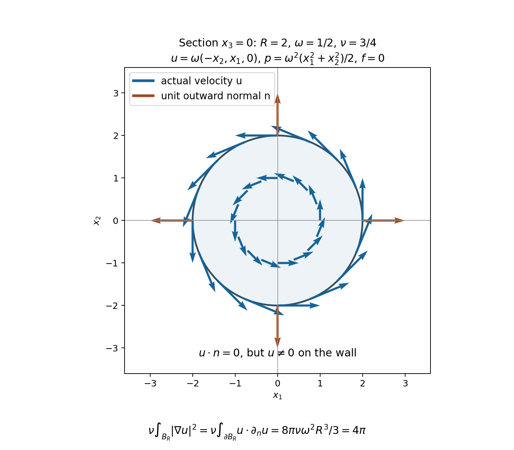

# Velocity bounds and uniqueness

An energy weak solution has a velocity in \(L^2\), but its derivatives
need not remain bounded. The preceding chapter constructed a unique
\(H^1\) strong solution until its \(H^1\) norm becomes infinite.
We now connect these two constructions. First we prove that any energy
weak solution agrees with that strong solution while the latter exists.
Then a bound on the velocity itself will prevent the strong solution
from ending. This gives regularity and uniqueness for energy weak
solutions satisfying the specified velocity bound.

The proofs retain the original positive viscosity, full force and
periodic constant modes. They also explain precisely why the exponent
relation \(2/p+3/q=1\) appears.

## 1. Domains, forces and the statements

Let \(\nu>0\) and let \(\Omega\) be either \(\mathbb R^3\) or
\[
 Q=\prod_{j=1}^3(\mathbb R/L_j\mathbb Z),\qquad L_j>0,\qquad
 V=L_1L_2L_3.
 \tag{1.1}
\]
All spatial integrals use ordinary Lebesgue measure. Sobolev norms,
the Leray projection \(P\), the heat operator \(S_\nu\), and the
Fourier factors \(2\pi\xi\) and \(2\pi(k_j/L_j)_j\) are exactly those
in [Strong solutions and continuation](strong-solutions-and-continuation.md).
In particular
\[
 \|h\|_{H^1}^2=\|h\|_2^2+\|\nabla h\|_2^2,\qquad
 \|h\|_{H^2}^2=\|h\|_{H^1}^2+\|\nabla h\|_{H^1}^2.
 \tag{1.2}
\]
The constants already proved there are
\[
 C_\Omega=
 \begin{cases}
 S=4/\sqrt3,&\Omega=\mathbb R^3,\\
 (4/\sqrt3)\sqrt{27}\sqrt{1+\sum_jL_j^{-2}},&\Omega=Q.
 \end{cases}
 \tag{1.3}
\]
Thus \(\|h\|_6\leq C_\Omega\|h\|_{H^1}\) on either domain,
and the stronger \(\|h\|_6\leq S\|\nabla h\|_2\) holds on
\(\mathbb R^3\). These inequalities apply to the full vector or
matrix norm, with the same constant.

An energy weak solution with force \(F\) means the solution class
proved in the two weak-solution chapters:
\[
 u\in C_{\rm w}([0,T];L^2_\sigma)
       \cap L^2(0,T;H^1_\sigma),\qquad
 u\in L^\infty(0,T;L^2_\sigma),
 \tag{1.4}
\]
the full distributional equation
\[
 u_t+\operatorname{div}(u\otimes u)+\nabla p
      =\nu\Delta u+F,
 \tag{1.5}
\]
and the energy inequality
\[
 \frac12\|u(t)\|_2^2+\nu\int_s^t\|\nabla u\|_2^2\,dr
 \leq\frac12\|u(s)\|_2^2+\int_s^t\langle F,u\rangle\,dr
 \tag{1.6}
\]
for \(s=0\) and for every \(s\) in one full-measure set \(G\),
at every later ending time \(t\). The force may have the full
decomposition
\[
 F=F_a+F_b,\qquad F_a\in L^1(0,T;L^2),\quad
 F_b\in L^2(0,T;H^{-1}).
 \tag{1.7}
\]
The pressure is periodic when the domain is \(Q\). No mean of
velocity or force is set to zero.

For the strong comparison field, use the exact class constructed
in the preceding chapter:
\[
 v\in C([0,T];H^1_\sigma)\cap L^2(0,T;H^2_\sigma),
 \quad f=f_a+f_b,\quad
 f_a\in L^1H^1,\quad f_b\in L^2L^2.
 \tag{1.8}
\]
It solves the original equation with force \(f\), including that
force's pressure component. The weak and strong forces may differ.

**Comparison theorem.** If \(F=f\), equal initial data imply
\(u(t)=v(t)\) at every time in their common interval. Section 4
proves explicit bounds for arbitrary initial differences and for
the full force difference.

**Velocity criterion.** Suppose \(f\) is prescribed on
\([0,T_0)\), belongs locally to the class in (1.8), and
\(T<T_0\). Let \(u\) be an energy weak solution with this force
and initial datum in \(L^2_\sigma\). If
\[
 u\in L^p(0,T;L^q),\qquad 3<q\leq\infty,\qquad
 p=\frac{2q}{q-3},
 \tag{1.9}
\]
where \(p=2\) for \(q=\infty\), then \(u\) is an \(H^1\)
strong solution on every \([\varepsilon,T]\), \(\varepsilon>0\).
It is the unique energy weak solution with its force and initial
datum on \([0,T]\). If the initial datum is in \(H^1\), the
strong regularity also holds from zero. Section 6 proves these
claims, including the passage back to the initial time.

The small \(L^\infty_tL^3_x\) condition in Section 7 gives an
additional endpoint criterion. An arbitrary large bounded
\(L^\infty_tL^3_x\) norm is not covered by that argument.

## 2. Testing against an actual H1 strong solution

The weak velocity satisfies its \(L^\infty L^2\) bound at every
time: approach a time by times outside the null exceptional set,
and use weak continuity and lower semicontinuity. Thus the
endpoint pairings below are defined with a uniform bound.

Interpolation between \(L^2\) and \(L^6\) gives
\[
 \|u\|_4\leq C_\Omega^{3/4}
                   \|u\|_2^{1/4}\|u\|_{H^1}^{3/4},
\qquad
 \int_0^T\|u\|_4^{8/3}\,dt
 \leq C_\Omega^2
       \left(\sup_t\|u(t)\|_2^{2/3}\right)
       \int_0^T\|u\|_{H^1}^2\,dt.
 \tag{2.1}
\]
Consequently \(u\otimes u\in L^{4/3}(0,T;L^2)\), and hence
also in \(L^1(0,T;L^2)\). This is the integrability that lets us
use the strong field's \(C H^1\) continuity in the nonlinear term.

The projected weak equation is
\[
 u_t=\nu\Delta u-P\operatorname{div}(u\otimes u)+PF.
 \tag{2.2}
\]
On the whole space, its validity for every solution of (1.5)
was proved in Section 8 of the whole-space chapter: the
time-integrated nonpressure expression is a curl-free vector
in \(H^{-m}\), \(m>5/2\). Its Fourier transform is a weighted
\(L^2\) function, parallel to \(\xi\) almost everywhere, so
\(P\) annihilates it, including the absence of any point mass
at zero. The argument also applies to (1.7), since \(F_a\)
is time integrable in \(L^2\). On the box, periodic pressure
has zero gradient coefficient at zero and parallel coefficients
at every nonzero frequency; its projection vanishes directly.
This retains the velocity's constant-mode equation.

Each term of (2.2) belongs to \(L^1(0,T;H^{-m})\).
For the quadratic term this follows already from
\(\|\operatorname{div}(u\otimes u)\|_{H^{-m}}
 \leq C_m\|u\|_2^2\), with the exact Fourier integral or sum
from the preceding chapters. The other terms follow from
the energy class and (1.7). Thus \(u\) is absolutely continuous
as an \(H^{-m}\) curve: subtract the integral of the right side,
pair against fixed \(H^m\) vectors, and apply the scalar
distributional fundamental theorem. Weak \(L^2\) continuity
identifies all endpoint values.

The strong field has
\[
 v_t=\nu\Delta v+Pf_a+Pf_b-P((v\cdot\nabla)v)
           \in L^1(0,T;L^2).
 \tag{2.3}
\]
This follows from the preceding chapter's ordered product
estimate and linear construction; in particular
\((v\cdot\nabla)v\in L^2L^2\).

Let \(E_K\) project onto \(|\xi|\leq K\), or
\(|(k_j/L_j)_j|\leq K\). It commutes with \(P\) and derivatives,
is self-adjoint, and maps \(L^2\) boundedly into \(H^m\).
Thus \(E_Kv\) is absolutely continuous into \(H^m\).
The dual product rule for \(u\) and \(E_Kv\) gives
\[
 \begin{aligned}
 &(u(t),E_Kv(t))-(u(s),E_Kv(s))\\
 &=\int_s^t\left[
       (u,E_Kv_r)+\int_\Omega u_i u_j\partial_jE_Kv_i\,dx
       -\nu\int_\Omega\nabla u : \nabla E_Kv\,dx
       +\langle F,E_Kv\rangle\right]dr .
 \end{aligned}
 \tag{2.4}
\]
Repeated indices in this chapter are summed from 1 to 3.
For completeness, the product rule holds for these absolutely
continuous curves by writing each increment as an integral of
its derivative. The dual pairing is a bounded bilinear map.
At almost every time both curves are differentiable in their
respective spaces; their product derivative is the sum of the
two pairings, bounded by the sup norm of one curve times the
integrable derivative of the other. Integration proves (2.4).

We now justify every limit as \(K\to\infty\).
The contractions \(E_K\) converge strongly on \(H^1\); covering
the compact time image of \(v\in CH^1\) by finitely many balls
makes this convergence uniform in time. Thus
\(E_Kv\to v\) in \(CH^1\). Also \(E_Kv_t\to v_t\) in
\(L^1L^2\), by strong convergence on each \(L^2\) vector and
dominated convergence using \(2\|v_t\|_2\).
The nonlinear error is bounded by
\[
 \|u\otimes u\|_{L^1L^2}
           \sup_r\|\nabla(E_Kv-v)(r)\|_2\longrightarrow0.
 \tag{2.5}
\]
The time-derivative error uses \(u\in L^\infty L^2\).
The diffusion error uses \(\nabla u\in L^2L^2\) and
\(E_Kv\to v\) in \(L^2H^1\).
For the force, the \(F_a\) error is bounded by
\(\|F_a\|_{L^1L^2}\sup\|E_Kv-v\|_2\); the \(F_b\) error
is bounded by
\(\|F_b\|_{L^2H^{-1}}\|E_Kv-v\|_{L^2H^1}\).
Both endpoint pairings converge by the all-time \(L^2\) bound
on \(u\). We have proved, at every pair \(0\leq s\leq t\leq T\),
\[
 \begin{aligned}
 &(u(t),v(t))-(u(s),v(s))\\
 &=\int_s^t\left[
       (u,v_r)+\int_\Omega u_i u_j\partial_jv_i\,dx
       -\nu\int_\Omega\nabla u : \nabla v\,dx
       +\langle F,v\rangle\right]dr .
 \end{aligned}
 \tag{2.6}
\]
No spatial test with unjustified pressure decay was inserted
into the original weak equation.

## 3. Relative energy with the full force difference

Put \(z=u-v\), \(Y(t)=\|z(t)\|_2^2\), and
\(D_z(t)=\|\nabla z(t)\|_2^2\). Pair (2.3) with \(u\),
which is in \(H^1_\sigma\) almost everywhere, to obtain
\[
 (u,v_t)=-\nu\int\nabla u : \nabla v
                -\int u_i v_j\partial_jv_i+\langle f,u\rangle .
 \tag{3.1}
\]
All terms are time integrable. For the force this uses the
original \(f_a\in L^1H^1\subset L^1L^2\), \(f_b\in L^2L^2\)
and the energy bound on \(u\). The nonlinear pairing can also
be bounded by \(\|u\|_2\|(v\cdot\nabla)v\|_2\).

At almost every time \(v\in H^2\), and hence \(v\in L^\infty\)
by the exact Fourier \(H^s\)-to-\(L^\infty\) bound for
\(s>3/2\) proved in the pressure chapter. Therefore
\(|v|^2\in H^1\). Since \(z\) is divergence free,
the \(H^1\) density argument for scalar tests gives
\(\int z\cdot\nabla|v|^2=0\). It follows that
\[
 \int u_i(u_j-v_j)\partial_jv_i
 =\int z_i z_j\partial_jv_i
       +\frac12\int z\cdot\nabla|v|^2
 =\int z_i z_j\partial_jv_i .
 \tag{3.2}
\]
Both sides are integrable in time: apply (2.1) to \(z\),
and use \(\nabla v\in L^\infty L^2\).

The strong solution obeys its energy equality from the preceding
chapter. Add that equality to (1.6), then subtract (2.6) using
(3.1)–(3.2). The force terms combine exactly as
\[
 \langle F,u\rangle+\langle f,v\rangle
       -\langle F,v\rangle-\langle f,u\rangle
       =\langle F-f,z\rangle.
 \tag{3.3}
\]
All three viscous terms combine into \(D_z\). Thus
\[
 \frac12Y(t)+\nu\int_s^tD_z\,dr
 \leq\frac12Y(s)
       -\int_s^t\int z_i z_j\partial_jv_i\,dx\,dr
       +\int_s^t\langle F-f,z\rangle\,dr .
 \tag{3.4}
\]
This holds for every permitted starting time \(s=0\) or \(s\in G\)
and every later ending time \(t\).

We will estimate the nonlinear term through the velocity \(v\).
At almost every time, integration by parts gives
\[
 -\int z_i z_j\partial_jv_i=\int v_i z_j\partial_jz_i.
 \tag{3.5}
\]
On \(Q\) this is periodic integration by parts. On \(\mathbb R^3\),
first insert a cutoff of radius \(R\). The boundary error is
bounded by \(C R^{-1}\|v\|_\infty\|z\|_2^2\), and tends to
zero at the fixed time. The remaining products are integrable:
\(z\in L^4\), \(\nabla v\in L^2\), and
\(v\in L^\infty,z,\nabla z\in L^2\).
Smooth approximation passes the identity to these Sobolev fields.
The two time-integrated sides are integrable by (2.1) on the
left and, on the right, by the estimates below whenever they are
used. Thus (3.5) is an equality, not a formal replacement.

## 4. The exponents and explicit comparison constants

For \(3<q\leq\infty\), define
\[
 \theta=\frac3q,\quad r=\frac{2q}{q-2},\quad
 \alpha=\frac{1+\theta}{2},\quad
 p=\frac1{1-\alpha}=\frac{2q}{q-3},\qquad U(t)=\|v(t)\|_q.
 \tag{4.1}
\]
At \(q=\infty\), use \(\theta=0,r=2,\alpha=1/2,p=2\).
The two exact relations are
\[
 \frac1q+\frac1r+\frac12=1,\qquad
 \frac1r=\frac{1-\theta}{2}+\frac{\theta}{6}.
 \tag{4.2}
\]
Thus Hölder and interpolation, with the original domains retained,
give
\[
 \begin{aligned}
 2\left|\int v_i z_j\partial_jz_i\right|
 &\leq2U\|z\|_r\|\nabla z\|_2\\
 &\leq2C_\Omega^\theta U
           Y^{(1-\theta)/2}(Y+D_z)^{(1+\theta)/2}.
 \end{aligned}
 \tag{4.3}
\]
On \(\mathbb R^3\), the homogeneous Sobolev bound proves the
stronger version with \(D_z^{(1+\theta)/2}\) replacing
\((Y+D_z)^{(1+\theta)/2}\).

The elementary optimization needed here is explicit. For
\(0<\alpha<1\), \(H\geq0\), \(x\geq0\), \(\delta>0\),
\[
 Hx^\alpha\leq\delta x+
 (1-\alpha)\alpha^{\alpha/(1-\alpha)}
                    H^{1/(1-\alpha)}\delta^{-\alpha/(1-\alpha)} .
 \tag{4.4}
\]
If \(H=0\) there is nothing to prove. Otherwise the strictly
concave function \(Hx^\alpha-\delta x\) has its unique maximum
at \(x=(\alpha H/\delta)^{1/(1-\alpha)}\); substitution gives
exactly the displayed remainder, including its coefficient.
Define
\[
 K_{\delta,q,\Omega}
 =(1-\alpha)\alpha^{\alpha/(1-\alpha)}
             (2C_\Omega^\theta)^p
             \delta^{-\alpha/(1-\alpha)}.
 \tag{4.5}
\]
With \(H=2C_\Omega^\theta UY^{1-\alpha}\), (4.4) bounds
(4.3) by
\(\delta(Y+D_z)+K_{\delta,q,\Omega}U^pY\).

For identical forces take \(\delta=\nu\) in (3.4).
The result, with its retained dissipation, is
\[
 Y(t)+\nu\int_s^tD_z\,dr
 \leq Y(s)+\int_s^t a(r)Y(r)\,dr,
 \tag{4.6}
\]
where
\[
 a(r)=
 \begin{cases}
 K_{\nu,q,\Omega}\|v(r)\|_q^p,&\Omega=\mathbb R^3,\\
 \nu+K_{\nu,q,\Omega}\|v(r)\|_q^p,&\Omega=Q.
 \end{cases}
 \tag{4.7}
\]
The whole-space version uses the stronger form of (4.3).
The extra term on the box comes from the full \(H^1\) norm;
the constant velocity mode has not been discarded.

If \(a\in L^1(s,T)\), set
\(H_0(t)=Y(s)+\int_s^ta(r)Y(r)\,dr\).
The inequality implies \(Y\leq H_0\), while
\(H_0'\leq aH_0\) almost everywhere. The integrating factor
therefore gives, at every ending time,
\[
 Y(t)\leq Y(s)\exp\left(\int_s^ta(r)\,dr\right).
 \tag{4.8}
\]
No differentiability of the weak solution's energy was assumed.
For the \(H^1\) strong reference, take \(q=6,p=4\):
its \(CH^1\) bound makes \(a\) integrable on each compact
interval. This proves the comparison theorem.

For different forces retain an actual decomposition
\[
 F-f=h_a+h_b,\qquad h_a\in L^1L^2,\quad h_b\in L^2H^{-1},
 \quad A_h=\|h_a\|_2,\quad B_h=\|h_b\|_{H^{-1}}.
 \tag{4.9}
\]
For example subtract the given summands in (1.7) and (1.8).
For any \(\eta>0\),
\[
 2|\langle h_a,z\rangle|\leq(A_h/\eta)Y+\eta A_h,\qquad
 2|\langle h_b,z\rangle|
 \leq(\nu/2)(Y+D_z)+(2/\nu)B_h^2 .
 \tag{4.10}
\]
The first inequality is
\((\sqrt Y-\eta)^2/\eta\geq0\), multiplied by \(A_h\).
Use \(\delta=\nu/2\) in (4.3) for the nonlinear term.
Equation (3.4) then gives the uniform two-domain bound
\[
 \begin{gathered}
 Y(t)+\nu\int_s^tD_z\,dr
 \leq Y(s)+\int_s^t [a_h(r)Y(r)+b_h(r)]\,dr,\\
 a_h=\nu+K_{\nu/2,q,\Omega}U^p+A_h/\eta,\qquad
 b_h=\eta A_h+(2/\nu)B_h^2 .
 \end{gathered}
 \tag{4.11}
\]
Defining \(H_0(t)=Y(s)+\int_s^t(a_hY+b_h)\) gives
\(Y\leq H_0\) and \(H_0'\leq a_hH_0+b_h\).
Its integrating factor proves
\[
 Y(t)\leq e^{\int_s^ta_h}
     \left[Y(s)+\int_s^t e^{-\int_s^ra_h}\,b_h(r)\,dr\right].
 \tag{4.12}
\]
This includes all actual force work, every viscosity factor,
and the original permitted starting-time set.

## 5. Preventing the H1 solution from ending

Let \(u\) now denote the maximal \(H^1\) solution with the force
in (1.8) prescribed on \([0,T_0)\). On a compact subinterval
of its existence, set
\[
 E=\|u\|_{H^1}^2,\quad D=\|\nabla u\|_{H^1}^2,\quad
 X=\|u\|_{H^2}^2=E+D,\quad
 A=\|f_a\|_{H^1},\quad B=\|f_b\|_2.
 \tag{5.1}
\]
The exact \(H^1\) energy identity is
\[
 E'+2\nu D
 =2((u\cdot\nabla)u,\Delta u)
                +2(f_a,u)_{H^1}+2(f_b,(I-\Delta)u).
 \tag{5.2}
\]
Here is a justification in the actual solution class. Apply
bounded Fourier cutoffs to the projected equation and pair
with \((I-\Delta)E_Ku\). The cutoff curves are absolutely
continuous in \(H^1\), so the norm chain rule holds.
The endpoints converge uniformly in \(H^1\).
The gradients converge in \(L^2H^1\).
The \(f_a\) terms converge using \(f_a\in L^1H^1\) and
\(E_Ku\to u\) in \(CH^1\).
The remaining terms converge as \(L^2L^2\) pairings against
\((I-\Delta)u\in L^2L^2\), since
\((u\cdot\nabla)u\in L^2L^2\).
Thus the integrated identity passes to the limit. Its right
side is integrable, proving the asserted absolute continuity
of \(E\) and (5.2) almost everywhere. The \(L^2\) part of
the nonlinear pairing vanishes by the energy cancellation
already proved. Self-adjointness of \(P\) preserves the
original force pairings.

Use the exponents in (4.1) with \(U=\|u\|_q\).
Hölder, gradient interpolation and the full Fourier weights give
\[
 |((u\cdot\nabla)u,\Delta u)|
 \leq U\|\nabla u\|_r\|\Delta u\|_2
 \leq C_\Omega^\theta U E^{1-\alpha}X^\alpha .
 \tag{5.3}
\]
Indeed \(\|\nabla u\|_2\leq\sqrt E\),
\(\|\nabla u\|_6\leq C_\Omega\sqrt X\), and
\(\|\Delta u\|_2\leq\sqrt X\). The last bound retains the
full multiplier \(4\pi^2|\xi|^2\), or its periodic version.
Taking \(\delta=\nu/2\) in (4.4), and also using
\[
 2B\sqrt X\leq(\nu/2)X+(2/\nu)B^2,\qquad
 2A\sqrt E\leq(A/\eta)E+\eta A,
 \tag{5.4}
\]
for an arbitrary \(\eta>0\), yields
\[
 E'+\nu D\leq a_E E+b_E,\qquad
 a_E=\nu+K_{\nu/2,q,\Omega}\|u\|_q^p+A/\eta,\quad
 b_E=\eta A+(2/\nu)B^2.
 \tag{5.5}
\]
Its full integrating-factor bound, from any actual starting
time \(a\), is
\[
 E(t)\leq e^{\int_a^t a_E(r)\,dr}
       \left[E(a)+\int_a^t
          e^{-\int_a^s a_E(r)\,dr}b_E(s)\,ds\right].
 \tag{5.6}
\]
If a maximal endpoint \(T_*<T_0\) satisfied
\(\int_a^{T_*}\|u\|_q^p<\infty\), every term on the right
would remain bounded up to \(T_*\): the original force
belongs to its stipulated class on a larger compact interval.
This contradicts the full \(H^1\) divergence at an interior
maximal endpoint proved in the preceding chapter. Hence
\[
 \int_a^{T_*}\|u(t)\|_q^{\,2q/(q-3)}\,dt=\infty
 \quad\text{for every fixed }3<q\leq\infty
 \tag{5.7}
\]
at such a finite endpoint. At \(q=\infty\), this means
\(\int_a^{T_*}\|u\|_\infty^2=\infty\).
The result concerns an endpoint inside the actual force interval.

## 6. From the velocity criterion to regularity and uniqueness

We first verify the time trace used in restarting. An energy
weak solution is strongly right-continuous in \(L^2\) at zero
and at every permitted starting time \(a\in G\).
Indeed its force work on \([a,t]\) tends to zero:
\[
 \left|\int_a^t(F_a,u)\right|
       \leq\sup_r\|u(r)\|_2\int_a^t\|F_a\|_2,\qquad
 \left|\int_a^t\langle F_b,u\rangle\right|
       \leq\|F_b\|_{L^2(a,t;H^{-1})}
                    \|u\|_{L^2(a,t;H^1)}.
 \tag{6.1}
\]
Both products tend to zero by absolute continuity of the
stated integrals. Dropping nonnegative dissipation in (1.6)
gives \(\limsup_{t\downarrow a}\|u(t)\|_2^2\leq\|u(a)\|_2^2\).
Weak continuity gives \(u(t)\rightharpoonup u(a)\).
Expanding the squared \(L^2\) difference then proves strong
convergence, including at \(a=0\).

Now assume (1.9) and the actual stronger force class in (1.8).
For almost every \(a\in(0,T)\), we have both \(a\in G\) and
\(u(a)\in H^1_\sigma\). The local strong theorem can therefore
be started with this actual datum and the unchanged force.
Let \(v\) be its maximal continuation from \(a\).
On every common compact interval, comparison (4.8) with
\(q=6,p=4\) gives \(u=v\), since their values at \(a\) agree.
The coefficient is integrable there because \(v\in CH^1\).

If \(v\)'s maximal endpoint were at or before \(T\), the equality
would give
\(\int_a^{T_*}\|v\|_q^p
 =\int_a^{T_*}\|u\|_q^p<\infty\).
Section 5 would continue it past that endpoint, since \(T<T_0\).
This is impossible. Thus \(v\) exists past \(T\), and \(u=v\)
throughout \([a,T]\), including the endpoint by weak continuity.
For each \(\varepsilon>0\), choose one such
\(a\in(0,\varepsilon)\). This proves
\[
 u\in C([\varepsilon,T];H^1_\sigma)
                \cap L^2(\varepsilon,T;H^2_\sigma).
 \tag{6.2}
\]
The full mild equation, pressure and time regularity follow
from equality with \(v\), so (6.2) is the strong regularity
asserted in Section 1.

Let \(\widetilde u\) be any other energy weak solution with
the same force and initial datum. Choose \(a_n\downarrow0\)
in the intersection of both permitted starting-time sets and
the full-measure set where \(u(a_n)\in H^1\).
On \([a_n,T]\), the already proved \(u\) is a strong
reference field. Formula (4.8), with the exponents in the
given condition (1.9), shows
\[
 \|\widetilde u(t)-u(t)\|_2^2
 \leq \|\widetilde u(a_n)-u(a_n)\|_2^2
       \exp\left(\nu T+
             K_{\nu,q,\Omega}\int_0^T\|u(r)\|_q^p\,dr\right)
 \tag{6.3}
\]
whenever \(a_n\leq t\leq T\). The factor \(\nu T\) is
unnecessary on \(\mathbb R^3\), by (4.7), but the displayed
bound is valid on both domains. It is independent of \(n\).
By (6.1), both velocities converge strongly to the common
initial datum, so the first factor tends to zero.
For each fixed \(t>0\), eventually \(a_n<t\), and (6.3)
proves equality at that time. The values at zero already agree.
This is uniqueness in the full energy class, not merely among
solutions that both satisfy (1.9).

If \(u_0\in H^1_\sigma\), start the strong solution at zero.
The comparison theorem makes it equal to \(u\) on its initial
interval; the same finite velocity integral and Section 5
continue it beyond \(T\). This proves strong regularity from zero.

The conclusion also applies to \(u\in L^\rho(0,T;L^q)\)
when \(3<q\leq\infty\) and \(2/\rho+3/q\leq1\).
Indeed then \(\rho\geq p=2q/(q-3)\), and Hölder in time
gives the exact bound
\[
 \|u\|_{L^p(0,T;L^q)}
      \leq T^{1/p-1/\rho}\|u\|_{L^\rho(0,T;L^q)}.
 \tag{6.4}
\]
For \(\rho=\infty\), use \(1/\rho=0\) and integrate the
essential supremum directly. This proves the extension
without changing the original velocity or time interval.

## 7. A proved small L3 endpoint criterion

At \(q=3\), interpolation has \(\theta=1,\alpha=1\).
The finite-exponent estimate (4.4) is therefore unavailable.
We retain the resulting expression directly:
\[
 2|((u\cdot\nabla)u,\Delta u)|
                 \leq2C_\Omega\|u\|_3 X.
 \tag{7.1}
\]
If
\[
 \|u(t)\|_3\leq\frac{\nu}{4C_\Omega}
 \quad\text{for almost every time in the interval},
 \tag{7.2}
\]
its right side is at most \((\nu/2)X\).
The force bound (5.4) supplies the other
\((\nu/2)X+(2/\nu)B^2\). Thus (5.5)–(5.6) hold with
the \(K\|u\|_q^p\) term replaced by zero.
This proves strong continuation across an interior endpoint
under (7.2) near that endpoint and the original force assumptions.

For relative energy with identical forces, (3.5) now gives
\[
 2\left|\int v_i z_j\partial_jz_i\right|
 \leq2C_\Omega\|v\|_3(Y+D_z).
 \tag{7.3}
\]
Under (7.2) for \(v\), (3.4) therefore yields
\[
 Y(t)+(3\nu/2)\int_s^tD_z\,dr
                 \leq Y(s)+(\nu/2)\int_s^tY(r)\,dr,
\qquad Y(t)\leq Y(s)e^{\nu(t-s)/2}.
 \tag{7.4}
\]
On the whole space, the homogeneous Sobolev estimate removes
the \(Y\) contribution on the right of (7.3), giving instead
\(Y(t)\leq Y(s)\).
If an energy weak solution satisfies (7.2) on \((0,T)\),
repeat the restart argument of Section 6, now using the
continuation estimate just proved. It becomes strong on
every \([\varepsilon,T]\). The bound (7.4), independent of
the restart time, then proves uniqueness among all energy
weak solutions with the same data by sending \(a_n\downarrow0\).
This establishes the stated small endpoint result completely.
It supplies no argument for arbitrary large bounded \(L^3\) norms.

## 8. Five exercises with solutions

### Exercise 1: the original scaling and the exponent relation

Let \((u,p,f)\) solve the original equation at viscosity \(\nu>0\).
For a length factor \(R>0\), define
\[
 u_R(x,t)=R^{-1}u(x/R,t/R^2),\quad
 p_R(x,t)=R^{-2}p(x/R,t/R^2),\quad
 f_R(x,t)=R^{-3}f(x/R,t/R^2).
 \tag{8.1}
\]
Check the full equation, its domains and its \(L^p_tL^q_x\) norm.

**Solution.** Each of \(\partial_tu_R\),
\((u_R\cdot\nabla)u_R\), \(\nabla p_R\) and
\(\nu\Delta u_R\) is \(R^{-3}\) times the corresponding
original term at \((x/R,t/R^2)\). Divergence is \(R^{-2}\)
times the original divergence, so it remains zero. The full
force is exactly \(f_R\), with the displayed factor.
An original interval \([0,T]\) becomes \([0,R^2T]\);
\(\mathbb R^3\) maps to itself, while the original box
lengths become \(RL_1,RL_2,RL_3\).
The initial field is \(R^{-1}u_0(x/R)\).
The inverse map uses \(1/R\), including all pressure and force
factors, so this is an exact map of the original equations.

Changing spatial variables and then time gives
\[
 \|u_R\|_{L^p(0,R^2T;L^q(R\Omega))}
 =R^{-1+3/q+2/p}
                    \|u\|_{L^p(0,T;L^q(\Omega))}.
 \tag{8.2}
\]
The same formula, with \(1/\infty=0\), follows from the
essential supremum when either exponent is infinite.
Thus the norm is invariant exactly when
\(2/p+3/q=1\). This computation preserves the original
force, viscosity, time interval and all three periodic lengths;
it does not set any of them to one.

### Exercise 2: the exact Young coefficient

Evaluate \(K_{\delta,q,\Omega}\) from (4.5) at \(q=6\) and
\(q=\infty\), and identify equality in (4.4).

**Solution.** For \(q=6\), \(\theta=1/2,\alpha=3/4,p=4\).
Keeping each factor during substitution gives
\[
 K_{\delta,6,\Omega}
 =\frac14\left(\frac34\right)^3
       (2C_\Omega^{1/2})^4\delta^{-3}
 =\frac{27C_\Omega^2}{16\delta^3}.
 \tag{8.3}
\]
For \(q=\infty\), \(\theta=0,\alpha=1/2,p=2\), so
\[
 K_{\delta,\infty,\Omega}
 =\frac12\left(\frac12\right)(2C_\Omega^0)^2\delta^{-1}
 =\delta^{-1}.
 \tag{8.4}
\]
For \(H>0\), equality in the scalar inequality (4.4) occurs
at \(x=(\alpha H/\delta)^{1/(1-\alpha)}\), because this
is its maximizer. For \(H=0\), equality requires \(x=0\).
The equalities certify the optimization step; they do not
assert sharpness of the preceding spatial Sobolev bounds.

### Exercise 3: two positive viscosities

Let an energy weak velocity \(u\) have viscosity \(\nu_u>0\),
and a strong velocity \(v\) have viscosity \(\nu_v>0\), on
the same original domain and with the same full force \(f\).
Derive a bound for their difference using Section 4.

**Solution.** Rewrite the actual equation for \(v\) as
\[
 v_t+(v\cdot\nabla)v+\nabla p_v
  =\nu_u\Delta v+f_{\rm eff},\qquad
 f_{\rm eff}=f+(\nu_v-\nu_u)\Delta v.
 \tag{8.5}
\]
This is an exact identity, with the original pressure.
Since \(v\in L^2H^2\), the added force belongs to \(L^2L^2\).
Its heat integral at viscosity \(\nu_u\) follows by applying
the Fourier fundamental theorem to this same equation.
Thus \(v\) belongs to the strong comparison class for
\(\nu_u,f_{\rm eff}\). The weak minus strong force is
\[
 h_b=f-f_{\rm eff}=(\nu_u-\nu_v)\Delta v,\qquad h_a=0.
 \tag{8.6}
\]
The full \(H^{-1}\) norm obeys
\[
 \|\Delta v\|_{H^{-1}}^2
 =\int\frac{(4\pi^2|\xi|^2)^2}{1+4\pi^2|\xi|^2}
                          |\widehat v(\xi)|^2\,d\xi
 \leq\|\nabla v\|_2^2
 \tag{8.7}
\]
on \(\mathbb R^3\); on \(Q\) the left side is
\[
 V\sum_{k\in\mathbb Z^3}
     \frac{(4\pi^2|\kappa_k|^2)^2}{1+4\pi^2|\kappa_k|^2}
                                |v_k|^2,\qquad
 \kappa_k=(k_j/L_j)_j .
 \tag{8.8}
\]
Its zero term is zero and the same inequality follows termwise.
Therefore (4.12) applies with
\[
 a_h=\nu_u+K_{\nu_u/2,q,\Omega}\|v\|_q^p,\qquad
 b_h=\frac{2(\nu_u-\nu_v)^2}{\nu_u}
                            \|\Delta v\|_{H^{-1}}^2 .
 \tag{8.9}
\]
Replacing the last norm by the proved upper bound in (8.7)
gives a second valid estimate in terms of \(\nabla v\).
Every viscosity and sign in the effective force is retained.
The formula provides no uniform zero-viscosity bound, since
the displayed constants depend on the original \(\nu_u>0\).

### Exercise 4: normal velocity, wall velocity and wall work

Wiedemann's original author TeX, arXiv:1705.04220v1,
lines 901–905, calls \(u\cdot n=0\) a no-slip condition.
The subsequent Leray definition at line 909 instead uses
\(H_0^1(\Omega)\). Show exactly why the displayed normal
condition alone is weaker, using an actual viscous solution.

**Solution.** Fix a radius \(R>0\), a nonzero angular parameter
\(\omega\in\mathbb R\), and any viscosity \(\nu>0\). In the
three-dimensional ball \(B_R\), put
\[
 u(x,t)=\omega(-x_2,x_1,0),\qquad
 p(x,t)=\frac{\omega^2}{2}(x_1^2+x_2^2),\qquad f=0.
 \tag{8.10}
\]
Then
\[
 \operatorname{div}u=0,\quad \Delta u=0,\quad
 (u\cdot\nabla)u=-\omega^2(x_1,x_2,0),\quad
 \nabla p=\omega^2(x_1,x_2,0).
 \tag{8.11}
\]
These identities prove the full stationary equation at the
original positive viscosity. On the sphere \(n=x/R\), so
\(u\cdot n=0\), while the tangential velocity is generally
nonzero. The exact boundary maps on smooth fields are
\[
 \Gamma u=u|_{\partial B_R},\quad
 \Gamma_nu=(\Gamma u)\cdot n,\quad
 \Gamma_{\rm tan}u=(I-n\otimes n)\Gamma u,\qquad
 \Gamma u=n\Gamma_nu+\Gamma_{\rm tan}u.
 \tag{8.12}
\]
Thus the normal map is a specified projection of the full
boundary value, and this solution lies in its kernel but
not in the kernel of \(\Gamma\).
It is also not in \(H_0^1(B_R)\). If compactly supported
smooth fields approximated it in \(H^1\), their integrals
\(\int_{B_R}\partial_1u_2\) would be zero by integration
by parts and would converge to that of \(u\). But here
that integral equals \(\omega\,4\pi R^3/3\ne0\).

The energy balance shows the missing wall contribution.
The squared-gradient integral is
\[
 \int_{B_R}|\nabla u|^2\,dx
       =2\omega^2\,\frac{4\pi R^3}{3}
       =\frac{8\pi\omega^2R^3}{3}.
 \tag{8.13}
\]
Homogeneity gives \(\partial_nu=u/R\). Spherical symmetry
gives \(\int_{\partial B_R}x_j^2\,dS=4\pi R^4/3\), so
\[
 \int_{\partial B_R}u\cdot\partial_nu\,dS
       =\frac1R\omega^2\,\frac{8\pi R^4}{3}
       =\frac{8\pi\omega^2R^3}{3}.
 \tag{8.14}
\]
The pressure and transport boundary work vanish because
\(u\cdot n=0\), while the viscous wall work is
\(\nu\) times (8.14). It exactly supplies the dissipation
\(\nu\) times (8.13). The kinetic energy is constant and is
\[
 \frac12\int_{B_R}|u|^2\,dx=\frac{4\pi\omega^2R^5}{15}.
 \tag{8.15}
\]
These calculations prove the precise defect in the displayed
boundary terminology. They do not refute the survey's later
theorem formulated using \(H_0^1\).

The figure shows the section \(x_3=0\), with \(R=2\),
\(\omega=1/2\) and \(\nu=3/4\). Blue arrows are sampled
values of the actual velocity in (8.10); brown arrows are
unit outward normals. Their lengths use the displayed coordinate
scale. The arrows are vectors, not particle trajectories.
The energy integrals below the diagram are the full three-dimensional
integrals (8.13)–(8.14), not integrals over the section.
Their value after multiplication by the original viscosity is
\(4\pi\). [Reproduce the figure](../assets/normal-velocity-and-wall-work.py).

### Exercise 5: identifying opposite walls keeps a surface force

Let \(D=\prod_j(0,L_j)\). Suppose smooth \(u,p,f\), up to all
faces and on a compact time interval, solve the full equation
in \(D\), with \(\operatorname{div}u=0\) and \(u=0\) on all
faces. Identify opposite faces to obtain \(Q\), and extend
the fields periodically. Find the exact periodic force.

**Solution.** Write \(h_0,h_{L_j}\) for the two traces of
any component on \(x_j=0,L_j\), with the other two original
coordinates retained. Let \(\delta_{\Sigma_j}\) denote
surface measure on the identified face \(x_j=0\) in \(Q\).
One-dimensional integration by parts in \(x_j\), followed
by integration in the other variables, gives
\[
 \partial_j h_{\rm per}
     =(\partial_jh)_{\rm per}
              +(h_0-h_{L_j})\delta_{\Sigma_j}.
 \tag{8.16}
\]
The sign follows from the endpoint term
\(h_0\phi_0-h_{L_j}\phi_{L_j}\), with
\(\phi_0=\phi_{L_j}\) for a periodic test.
Since both traces of \(u\) vanish, its first derivatives
have no surface term. Differentiating once more gives
\[
 \Delta u_{\rm per}=(\Delta u)_{\rm per}
       +\sum_j\big[(\partial_ju)_0-(\partial_ju)_{L_j}\big]
                                             \delta_{\Sigma_j}.
 \tag{8.17}
\]
The tensors \(u\otimes u\) also have zero face traces, so
their divergence has no surface contribution. The
periodic divergence of \(u\) is zero. Pressure contributes
\(\sum_j(p_0-p_{L_j})e_j\delta_{\Sigma_j}\).
Thus the exact equation on \(Q\) has force
\[
 \boxed{\ f_{\rm per}+\sum_j k_j\delta_{\Sigma_j},\qquad
 k_j=(p_0-p_{L_j})e_j
          -\nu\big[(\partial_ju)_0-(\partial_ju)_{L_j}\big].\ }
 \tag{8.18}
\]
No edge terms have been suppressed: each original Laplacian
term is a second derivative in one coordinate, and the
other original differential terms are first derivatives.
The integrations above produce precisely those face terms;
face intersections have zero measure in each surface integral.

This force lies in the energy force space. For a smooth
periodic scalar test \(\phi\), the fundamental theorem
and Cauchy–Schwarz give, for each fixed pair of other coordinates,
\[
 |\phi(0)|^2
 \leq\frac2{L_j}\int_0^{L_j}|\phi(x_j)|^2\,dx_j
            +2L_j\int_0^{L_j}|\partial_j\phi(x_j)|^2\,dx_j.
 \tag{8.19}
\]
Indeed write \(\phi(0)=\phi(x_j)-\int_0^{x_j}\partial_j\phi\),
bound the squared sum by twice the sum of squares, replace
\(x_j\) by its upper bound \(L_j\), and average over \(x_j\).
Integrating the other coordinates extends this bound to
the face. With \(c_j=\max\{2/L_j,2L_j\}^{1/2}\),
\[
 |\langle k_j\delta_{\Sigma_j},\phi\rangle|
 \leq c_j\|k_j\|_{L^2(\Sigma_j)}\|\phi\|_{H^1(Q)}.
 \tag{8.20}
\]
Apply this componentwise with the vector norm and
Cauchy–Schwarz. Hence
\[
 \left\|\sum_jk_j\delta_{\Sigma_j}\right\|_{H^{-1}(Q)}
       \leq\sum_jc_j\|k_j\|_{L^2(\Sigma_j)}.
 \tag{8.21}
\]
The right side is bounded on the given compact time interval
for the stipulated smooth fields.
The periodically extended \(u\) is in \(H^1(Q)\), since
its first derivatives have no jump measures and are square
integrable; its \(H^1\) norm is exactly the original integral
over \(D\). Formula (8.18) proves the full connection between
these boundary presentations. Dropping its surface force
would generally change the original equation.

## 9. Sources and the scope of the result

Emil Wiedemann, [*Weak-strong uniqueness in fluid dynamics*,
arXiv:1705.04220v1](https://arxiv.org/abs/1705.04220v1),
Section 4.1, presents the relative-energy argument for
incompressible Navier–Stokes. Its original author TeX was
read at lines 890–978, including the explicit statement that
the approximation step is omitted from that proof sketch.
Sections 2–3 above supply the approximation and endpoint
arguments for our actual \(H^1\) reference class; Section 6
then proves the energy-class result by restarting.

The source's boundary display and \(H_0^1\) definition are
compared exactly in Exercise 4. Its setup names a bounded
Lipschitz domain, while its subsequent theorem display
uses \(\mathbb T^d\). The present theorems specify
\(\mathbb R^3\) and arbitrary rectangular periodic boxes.
Exercise 5 proves an exact connection from a rectangular
wall domain to the periodic equation, retaining the resulting
surface force. No general bounded-domain theorem is imported.

The historical references identified in that source are
G. Prodi, “Un teorema di unicità per le equazioni di
Navier–Stokes,” *Annali di Matematica Pura ed Applicata*
48 (1959), 173–182, and J. Serrin, “The initial value problem
for the Navier–Stokes equations,” in *Nonlinear Problems*
(1963), 69–98. Their author texts were not used as substitutes
for the proofs supplied here.

The full unforced problem is included by setting the original
force to zero. With forcing, the regularity/uniqueness theorem
uses the explicit class \(L^1H^1+L^2L^2\); the comparison
estimate allows the other weak solution's force to lie in
\(L^1L^2+L^2H^{-1}\).
The general large \(L^\infty L^3\) endpoint, critical
Fujita–Kato construction and Beale–Kato–Majda criterion still
require their own proofs. These lessons will precede the
human, Alpöge–Buckmaster, OpenAI and workbench constructions.
