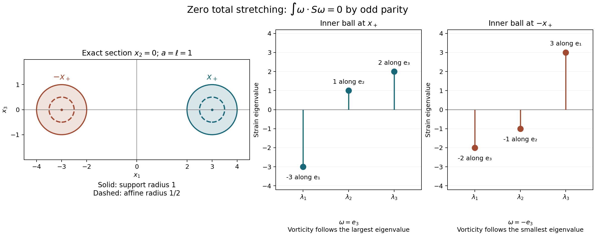

# Vorticity, strain and continuation

Vorticity measures local rotation. Strain measures stretching and contraction.
Both come from the same velocity gradient, but they retain different parts of
that matrix. This lesson constructs their exact connecting maps, proves the
enstrophy identity, and uses it to decide when the strong solution can continue.
The force and the original positive viscosity remain in every estimate.

The middle strain eigenvalue enters through a spatial integral identity. That
identity does not prescribe the vorticity direction at each point. A compact
forced flow at the end of the lesson shows the difference explicitly.

## 1. Original equation and solution class

Let \(\Omega=\mathbb R^3\) or let
\[
 Q=\prod_{j=1}^3(\mathbb R/L_j\mathbb Z),\qquad
 L_j>0,\qquad V=L_1L_2L_3.
 \tag{1.1}
\]
All integrals use the original Lebesgue measure, including the volume
\(V\) on \(Q\). We use the solution constructed in
[Strong solutions and continuation](strong-solutions-and-continuation.md):
\[
 \begin{gathered}
 u_t+(u\cdot\nabla)u+\nabla p=\nu\Delta u+f,
 \qquad \operatorname{div}u=0,\qquad \nu>0,\\
 u(0)=u^0\in H^1_\sigma(\Omega),\qquad f=f_a+f_b,\\
 f_a\in L^1_{\rm loc}([0,T_f);H^1),\qquad
 f_b\in L^2_{\rm loc}([0,T_f);L^2).
 \end{gathered}
 \tag{1.2}
\]
The maximal solution interval is \([0,T_*)\), with \(T_*\leq T_f\).
On each compact subinterval it satisfies
\[
 u\in C H^1_\sigma\cap L^2 H^2_\sigma.
 \tag{1.3}
\]
Here and below a time norm is over the interval under discussion. A finite
endpoint \(T_*<T_f\) requires an unbounded \(H^1\) norm, by the complete
construction and continuation proof in that chapter. In particular the force
is prescribed beyond any endpoint to which our continuation assertion applies.

Write the original gradient, symmetric part and skew part as
\[
 G_{ij}=\partial_j u_i,\qquad S=\tfrac12(G+G^{\mathsf T}),
 \qquad W=\tfrac12(G-G^{\mathsf T}),\qquad \omega=\nabla\times u.
 \tag{1.4}
\]
Matrix norms are Frobenius norms, and matrix pairings sum all entries.
Thus \(\operatorname{tr}S=0\), and direct component calculation gives
\[
 Wz=\tfrac12\omega\times z,\qquad
 W^2=\tfrac14(\omega\otimes\omega-|\omega|^2I_3),\qquad W\omega=0.
 \tag{1.5}
\]
For example \(W_{12}=-\omega_3/2\), \(W_{23}=-\omega_1/2\), and
\(W_{31}=-\omega_2/2\); the other entries follow by skew symmetry.
The vector identity \(\omega\times(\omega\times z)
=\omega(\omega\cdot z)-|\omega|^2z\) proves the square formula.

We will use the already proved Sobolev constants
\[
 \begin{gathered}
 \delta_\Omega=\begin{cases}0,&\Omega=\mathbb R^3,\\1,&\Omega=Q,\end{cases}
 \qquad
 C_\Omega=\begin{cases}
 4/\sqrt3,&\Omega=\mathbb R^3,\\
 (4/\sqrt3)\sqrt{27}\sqrt{1+\sum_jL_j^{-2}},&\Omega=Q,
 \end{cases}\\
 \|h\|_6\leq C_\Omega
       (\|\nabla h\|_2^2+\delta_\Omega\|h\|_2^2)^{1/2}.
 \end{gathered}
 \tag{1.6}
\]
The inequality holds for scalar, vector and matrix fields with these same
constants. The periodic lower-order term is retained; the whole-space
gradient inequality is the stronger inequality proved in the preceding
chapters, applied to the same original field.

## 2. Exact reconstruction and the strain constraint

Our whole-space Fourier transform has kernel \(e^{-2\pi i x\cdot\xi}\).
On \(Q\), put \(\kappa_k=(k_1/L_1,k_2/L_2,k_3/L_3)\), and use
coefficients \(u_k=V^{-1}\int_Q u(x)e^{-2\pi i\kappa_k\cdot x}\,dx\).
For every nonzero frequency, solenoidality and the curl formula give
\[
 \widehat\omega=2\pi i\xi\times\widehat u,
 \qquad
 \widehat u=\frac{i\xi\times\widehat\omega}{2\pi|\xi|^2}.
 \tag{2.1}
\]
The second identity follows by taking \(\xi\times\) of the first and
using \(\xi\cdot\widehat u=0\). The identical formulas hold with
\(\xi,\widehat u,\widehat\omega\) replaced by
\(\kappa_k,u_k,\omega_k\) for \(k\ne0\).

The derivative coefficients at zero vanish. On the periodic domain the
missing velocity coefficient is exactly
\[
 u_0(t)=u_0(0)+\int_0^t f_0(s)\,ds.
 \tag{2.2}
\]
This follows by integrating (1.2), since the transport, pressure and
Laplacian terms have zero integral. On \(\mathbb R^3\), an additional
distribution supported at frequency zero would be a polynomial velocity;
no nonzero such polynomial belongs to the specified \(L^2\) class.

Parseval and \(|\xi\times\widehat u|^2=|\xi|^2|\widehat u|^2\)
therefore give the exact identities
\[
 \begin{aligned}
 Y:=\|\omega\|_2^2&=\|G\|_2^2=2\|S\|_2^2=2\|W\|_2^2,\\
 D:=\|\nabla\omega\|_2^2&=\|\Delta u\|_2^2=2\|\nabla S\|_2^2.
 \end{aligned}
 \tag{2.3}
\]
To check the factor for \(S\), its Fourier matrix is
\(\pi i(\widehat u\otimes\xi+\xi\otimes\widehat u)\).
The two summands have zero Frobenius cross term and equal squared norm
\(|\xi|^2|\widehat u|^2\). Multiplication by \(2\pi|\xi|\)
proves the derivative version. On \(Q\) all these integrals become
\(V\sum_k\); that factor occurs on both sides and is not changed.

There is also an exact reconstruction from a candidate strain matrix. Let
\(T\) be a symmetric matrix-valued \(L^2\) field. For \(\xi\ne0\) define
\[
 \begin{gathered}
 r=|\xi|,\qquad P_\xi=I_3-\frac{\xi\otimes\xi}{r^2},
 \qquad v=P_\xi\widehat T\xi,\\
 \widehat{\Pi T}=\frac{\xi\otimes v+v\otimes\xi}{r^2},
 \qquad \widehat{u_T}=\frac{-i v}{\pi r^2}.
 \end{gathered}
 \tag{2.4}
\]
The matrix \(\widehat{\Pi T}\) is symmetric and has trace zero because
\(\xi\cdot v=0\). It satisfies \((\widehat{\Pi T})\xi=v\), so
\(\Pi^2=\Pi\). For any \(w\perp\xi\), its error is orthogonal to
\(\xi\otimes w+w\otimes\xi\): indeed the Frobenius pairing is
\[
 2\big((\widehat T-\widehat{\Pi T})\xi\big)\cdot\overline w
 =2\big((I_3-P_\xi)\widehat T\xi\big)\cdot\overline w=0.
 \tag{2.5}
\]
Consequently \(\Pi\) is the orthogonal projection onto the strain range,
and
\[
 \begin{gathered}
 |\widehat{\Pi T}|^2=2|v|^2/r^2,\qquad
 4\pi^2r^2|\widehat{u_T}|^2=2|\widehat{\Pi T}|^2,\\
 \operatorname{div}u_T=0,\qquad
 \operatorname{sym}\nabla u_T=\Pi T,\\
 \|T\|_2^2=\|\Pi T\|_2^2+\|T-\Pi T\|_2^2.
 \end{gathered}
 \tag{2.6}
\]
The gradient convention in the middle line is (1.4).

On \(\mathbb R^3\), (2.4) defines an actual tempered distribution:
near zero its size is bounded by \(|\widehat T|/(\pi r)\), and
\(r^{-1}\) is locally square integrable in three dimensions. At high
frequency its pairing with a Schwartz function is integrable by
Cauchy–Schwarz. Cutting off to compact frequency annuli gives a Cauchy
sequence in the gradient norm and hence, by (1.6), in \(L^6\).
Its \(L^6\) limit is the same distribution. Thus the target of
\(T\mapsto u_T\) is the actual \(L^6\) realization of
\(\dot H^1_\sigma\), with norm squared \(2\|\Pi T\|_2^2\).
It belongs to \(H^1_\sigma\) precisely when
\[
 \int_{\mathbb R^3}\frac{|P_\xi\widehat T(\xi)\xi|^2}
                         {\pi^2|\xi|^4}\,d\xi<\infty.
 \tag{2.7}
\]
This condition retains the original velocity's low frequencies.

On \(Q\), use the same formulas at \(\kappa_k\ne0\), put
\((\Pi T)_0=0\), and choose \((u_T)_0=0\) for this reconstruction.
The positive gap \(\min_{k\ne0}|\kappa_k|>0\) and (2.6) imply
\(u_T\in H^1_\sigma(Q)\). Adding the actual mean (2.2) recovers the
original velocity. The constant strain error is retained in
\(\|T-\Pi T\|_2^2\), including its factor \(V\).

For completeness, the strain range has an exact differential description:
\[
 \operatorname{tr}T=0,\qquad
 -\Delta T+2\operatorname{sym}\nabla\operatorname{div}T=0.
 \tag{2.8}
\]
Here \((\operatorname{div}T)_i=\sum_j\partial_jT_{ij}\).
At nonzero frequency the second equation is
\(r^2\widehat T=\xi\otimes(\widehat T\xi)
+(\widehat T\xi)\otimes\xi\).
Taking its trace gives \(\xi\cdot\widehat T\xi=0\), and then the
equation is exactly \(\widehat T=\widehat{\Pi T}\).
Conversely (2.4) has trace zero and satisfies that equation.
On \(\mathbb R^3\) this proves the equivalence in \(L^2\); on \(Q\)
one must also require \(T_0=0\). Exercise 3 identifies the missing
constant matrices if that last condition is omitted. Equations (2.4)–(2.8)
give the reconstruction, its error, and all its kernels and ranges.

## 3. Full strain equation and pressure pairing

Differentiate the original momentum equation using (1.4). The product rule
gives \(\partial_j(u_k\partial_k u_i)
=u_k\partial_kG_{ij}+G_{ik}G_{kj}\). Thus
\[
 G_t+(u\cdot\nabla)G+G^2+\operatorname{Hess}p
       =\nu\Delta G+\nabla f.
 \tag{3.1}
\]
The symmetric part of \(G^2\) is \(S^2+W^2\), since
\(SW+WS\) is skew symmetric. Substituting (1.5) proves
\[
 \begin{aligned}
 S_t+(u\cdot\nabla)S+S^2
 +\tfrac14\omega\otimes\omega-\tfrac14|\omega|^2I_3
 +\operatorname{Hess}p
 =\nu\Delta S+\operatorname{sym}\nabla f.
 \end{aligned}
 \tag{3.2}
\]
Taking the trace recovers the original pressure equation:
\[
 -\Delta p=\operatorname{tr}(G^2)-\operatorname{div}f
          =|S|^2-\tfrac12|\omega|^2-\operatorname{div}f.
 \tag{3.3}
\]
Taking curl in (1.2), or taking the skew part of (3.1) component by
component, gives
\[
 \omega_t+(u\cdot\nabla)\omega-S\omega
           =\nu\Delta\omega+\nabla\times f.
 \tag{3.4}
\]
These identities hold distributionally at the solution regularity (1.3).

The pressure is the potential already reconstructed in the previous lessons.
In particular it has a nonlinear part \(p_N\) and a force part \(p_F\),
with
\[
 \widehat p_N(\xi)
 =-\sum_{i,j}\frac{\xi_i\xi_j}{|\xi|^2}
                       \widehat{u_i u_j}(\xi),\qquad
 \nabla p_F=(I_3-P)f.
 \tag{3.5}
\]
On \(Q\) the nonzero modes use \(\kappa_k\), the pressure mean is
chosen zero, and \(P_0=I_3\); thus no mean force is assigned to pressure.
On \(\mathbb R^3\) the distributional low-frequency potential is the
one in [Pressure and the divergence-free projection](pressure-and-the-divergence-free-projection.md).

At an \(H^2\) time, \(u\otimes u\in H^2\). To verify this claim,
use \(u\in L^\infty\), \(\nabla u\in L^4\), and
\(\nabla^2u\in L^2\): every second product derivative is a sum of
\(u_i\partial_{jk}u_l\), \(\partial_j u_i\partial_k u_l\), and
the corresponding terms with the factors reversed. These belong to
\(L^2\); the undifferentiated and first derivatives do also. The
previous chapters prove the required embeddings. The multiplier in
(3.5) is bounded, so \(p_N\in H^2\).

For \(f_b\in L^2\), however, (3.5) gives only
\(\nabla p_{F,b}\in L^2\) and
\(\operatorname{Hess}p_{F,b}\in H^{-1}\). That is enough. Since
\(\operatorname{div}S=\Delta u/2\), the exact dual pairing is
\[
 \begin{aligned}
 \langle\operatorname{Hess}p_{F,b},S\rangle_{H^{-1},H^1}
 &=-\tfrac12((I_3-P)f_b,\Delta u)=0,\\
 2\langle\operatorname{sym}\nabla f_b,S\rangle_{H^{-1},H^1}
 &=(f_b,-\Delta u).
 \end{aligned}
 \tag{3.6}
\]
The first equality vanishes by the orthogonality of the gradient and
solenoidal Fourier ranges, not by assuming an extra derivative of the force.
For \(f_a\in H^1\) the same statements have ordinary \(L^2\) matrix
pairings. The nonlinear pressure has zero pairing with \(S\) by the same
integration by parts and orthogonality. All time pairings are legitimate:
\(f_a\) is integrable in \(H^1\), \(S\) is continuous in \(L^2\),
and \(f_b\) and \(S\) have the dual square-integrable classes just used.

There are two specific source corrections. In Evan Miller's
[middle-eigenvalue paper, version 4](https://arxiv.org/abs/1710.05569v4),
the forced strain display immediately before Definition `ExtForce`
(author TeX lines 557–558) prints a plus sign before
\(|\omega|^2I_3/4\). Its earlier equation `NavierStrain` and its mild
strain formula have the sign consistent with (3.2). The incorrect display
differs from (3.2) by \(|\omega|^2I_3/2\), whose trace is
\(3|\omega|^2/2\). Exercise 5 gives an actual compact forced solution
on which this difference is nonzero.

In the proof `Strn`, author TeX lines 692–696 claim that the pressure Hessian
is \(L^2\) under the allowed \(L^2\) force assumption. Exercise 4
gives a source-class solution for which it is not. Formula (3.6) supplies
the needed orthogonality in the correct dual spaces and preserves the
enstrophy argument. Miller writes the gradient as \(G^{\mathsf T}\):
his symmetric part is exactly \(S\), and his antisymmetric part is
\(-W\). Transposition preserves the trace, Frobenius norm and symmetric
square contribution, so this convention difference does not change either
correction.

## 4. Enstrophy and the cubic integral identity

Pair (3.4) with \(\omega\). The transport term vanishes by
\(\operatorname{div}u=0\). On the whole space a cutoff at radius
\(R\) bounds its boundary error by
\(C R^{-1}\|u\|_\infty\|\omega\|_2^2\), which tends to zero.
Curl is self-adjoint under the integral pairing, and
\(\nabla\times\omega=-\Delta u\). Thus the full identity is
\[
 \frac12Y'+\nu D
 =I_\omega+(\nabla\times f_a,\omega)+(f_b,-\Delta u),
 \qquad I_\omega=\int_\Omega\omega\cdot S\omega\,dx.
 \tag{4.1}
\]
There is no differentiation of \(f_b\) in its final pairing.

Here is the time justification for the actual solution (1.3). Subtract
the proved \(L^2\) energy identity from the full \(H^1\) energy
identity in the strong-solution chapter. Their difference is the gradient
energy identity, with the same two force summands. The spatial nonlinear
identity leading to (4.1) follows by solenoidal \(H^2\) approximation.
At almost every time \(u\) is bounded and \(\omega\in H^1\cap L^4\).
On a compact time interval, the transport pairing is integrable from
\(u\in L^2L^\infty\), \(\nabla\omega\in L^2L^2\), and
\(\omega\in L^\infty L^2\). The stretching term is integrable since
\[
 |I_\omega|\leq\|S\|_2\|\omega\|_4^2,
 \qquad
 \|\omega\|_4^2\leq
 C_\Omega^{3/2}\|\omega\|_2^{1/2}
 (\|\nabla\omega\|_2^2+\delta_\Omega\|\omega\|_2^2)^{3/4}.
 \tag{4.2}
\]
The last time factor is integrable by Hölder on a finite interval.
Both force pairings in (4.1) are integrable in their stated classes.
Consequently \(Y\) is absolutely continuous on every compact solution
interval, and (4.1) integrates between every pair of its endpoints.

The cubic identity requires the spatial strain constraint; it is not an
identity for three arbitrary matrix fields. For a smooth solenoidal field
write repeated indices as sums from 1 to 3. Successive integrations by
parts give
\[
 \begin{aligned}
 J:=\int\operatorname{tr}(G^3)
 &=\int(\partial_j u_i)(\partial_k u_j)(\partial_i u_k)\\
 &=-\int u_i(\partial_k u_j)(\partial_j\partial_i u_k)\\
 &=\int u_i(\partial_i\partial_k u_j)(\partial_j u_k)\\
 &=\tfrac12\int u_i\partial_i
           \big((\partial_k u_j)(\partial_j u_k)\big)=0.
 \end{aligned}
 \tag{4.3}
\]
The first integration has no term from \(\partial_j\partial_k u_j\);
the second has no term from \(\partial_i u_i\). In the penultimate
step, interchanging the dummy indices \(j,k\) shows that the two
product-rule terms have the same integral. The last integral is zero by
solenoidality. Whole-space cutoff errors are bounded by a constant times
\(R^{-1}\|u\|_\infty\|G\|_2^2\). The remaining terms are bounded
by \(\|u\|_\infty\|G\|_2\|\nabla G\|_2\). Approximation in
\(H^2\) gives convergence of \(G\) in \(L^3\) and proves (4.3)
for every field needed in (4.1).

Expansion of the trace, using symmetry and skew symmetry, gives
\[
 \operatorname{tr}(G^3)
 =\operatorname{tr}(S^3)+3\operatorname{tr}(SW^2)
 =\operatorname{tr}(S^3)+\tfrac34\omega\cdot S\omega.
 \tag{4.4}
\]
Terms with an odd single skew factor have zero trace; \(\operatorname{tr}W^3=0\).
The \(-|\omega|^2I_3/4\) contribution in (1.5) has zero pairing
with \(S\) because \(\operatorname{tr}S=0\).

Let \(\lambda_1\leq\lambda_2\leq\lambda_3\) be the eigenvalues
of \(S\), counted with multiplicity. Their sum is zero, and expanding
\((\lambda_1+\lambda_2+\lambda_3)^3\), or substituting
\(\lambda_3=-\lambda_1-\lambda_2\), proves
\(\operatorname{tr}(S^3)=3\det S\). Thus
\[
 I_\omega=-\frac43\int_\Omega\operatorname{tr}(S^3),dx
         =-4\int_\Omega\det S\,dx,
 \tag{4.5}
\]
and (4.1) is equivalently
\[
 \frac12Y'+\nu D
 =-4\int_\Omega\det S\,dx
       +(\nabla\times f_a,\omega)+(f_b,-\Delta u).
 \tag{4.6}
\]
Both representations retain every force contribution and the original
dissipation. In particular, a growing enstrophy in a forced flow need
not come from a positive stretching integral.

## 5. Three continuation criteria

The trace constraint improves an elementary matrix estimate. If \(S\)
is symmetric with trace zero, then
\[
 \|S\|_{\rm op}\leq\sqrt{\frac23}|S|.
 \tag{5.1}
\]
Indeed, for each eigenvalue \(\lambda_i\), the other two sum to
\(-\lambda_i\), so the sum of their squares is at least
\(\lambda_i^2/2\). Hence \(|S|^2\geq3\lambda_i^2/2\).
The matrix with eigenvalues \((2c,-c,-c)\) attains this algebraic
constant. This is a sharp matrix inequality; no sharpness claim for a
whole-flow continuation threshold follows from that observation.

From (2.3), (5.1), and Cauchy–Schwarz,
\[
 |I_\omega|\leq\sqrt{\frac23}\|\omega\|_\infty
                     \|\omega\|_2\|S\|_2
                =\frac1{\sqrt3}\|\omega\|_\infty Y.
 \tag{5.2}
\]
This retains a factor lost by estimating the operator norm with the full
matrix norm without using its zero trace.

For a second criterion, define the actual directional stretching by
\[
 \alpha(x,t)=
 \begin{cases}
 \omega\cdot S\omega/|\omega|^2,&\omega\ne0,\\
 0,&\omega=0.
 \end{cases}
 \qquad h(t)=\|\alpha(\cdot,t)_+\|_\infty.
 \tag{5.3}
\]
Here \(r_+=\max(r,0)\). Since
\(I_\omega=\int\alpha|\omega|^2\), we have \(I_\omega\leq hY\).
The Rayleigh quotient also gives \(\alpha\leq\lambda_3\) where
\(\omega\ne0\); hence \(h\leq\|\lambda_3{}_+\|_\infty\).

For the third criterion use (4.5). If \(\lambda_2\geq0\), then
\[
 -\det S=\tfrac12\lambda_2|S|^2-\lambda_2^3.
 \tag{5.4}
\]
Indeed \(-2\lambda_1\lambda_3=|S|^2-2\lambda_2^2\), by the
zero trace. If \(\lambda_2<0\), the two lowest eigenvalues are
negative and the highest is positive, so \(-\det S\leq0\).
Consequently the full remainder has the useful bound
\[
 \begin{aligned}
 -4\det S&\leq 2\lambda_2{}_+|S|^2-4(\lambda_2{}_+)^3,\\
 I_\omega&\leq 2\int_\Omega\lambda_2{}_+|S|^2
                    -4\int_\Omega(\lambda_2{}_+)^3
             \leq\|\lambda_2{}_+\|_\infty Y.
 \end{aligned}
 \tag{5.5}
\]
All terms before the last upper bound are kept in (4.6) and (5.5).
The upper bound permits the continuation estimate; it does not assert
that the negative cubic term vanishes.

Put
\[
 a(t)=\|\nabla\times f_a(t)\|_2,\qquad b(t)=\|f_b(t)\|_2,
 \qquad \eta>0.
 \tag{5.6}
\]
Let \(k(t)\) be any one of
\(\|\omega\|_\infty/\sqrt3\), \(h(t)\), or
\(\|\lambda_2{}_+\|_\infty\). The proved upper bound is
\(I_\omega\leq kY\). The two exact scalar inequalities
\[
 2a\sqrt Y\leq a(Y/\eta+\eta),\qquad
 2b\sqrt D\leq\nu D+\nu^{-1}b^2
 \tag{5.7}
\]
then give
\[
 Y'+\nu D\leq K Y+R,
 \qquad K=2k+a/\eta,\qquad R=\eta a+\nu^{-1}b^2.
 \tag{5.8}
\]
If \(H(t)=\int_0^tK(s)\,ds\), multiplication by \(e^{-H}\)
and integration prove
\[
 \begin{aligned}
 Y(t)&\leq e^{H(t)}\left[Y(0)+\int_0^t e^{-H(s)}R(s)\,ds\right],\\
 \nu\int_0^t e^{-H(s)}D(s)\,ds
 &\leq Y(0)+\int_0^t e^{-H(s)}R(s)\,ds.
 \end{aligned}
 \tag{5.9}
\]
The second line follows from the same integrated inequality by retaining
the nonnegative terminal term before discarding it.

If \(T_*<T_f\) and any one of
\[
 \int_0^{T_*}\|\omega(t)\|_\infty\,dt,\qquad
 \int_0^{T_*}h(t)\,dt,\qquad
 \int_0^{T_*}\|\lambda_2(t)_+\|_\infty\,dt
 \tag{5.10}
\]
is finite, (5.9) bounds \(Y\) up to that endpoint. The original
\(L^2\) energy estimate also stays finite for the force in (1.2).
By (2.3) this bounds the full \(H^1\) norm and contradicts its
continuation alternative. Thus each integral in (5.10) must be infinite
at such a finite maximal endpoint. One may start these estimates at any
earlier time of the strong solution instead of zero.

These are viscous theorems for (1.2). The proof uses \(\nu>0\) in
(5.7) and the viscous \(H^1\) continuation theorem. Setting \(\nu=0\)
does not prove the Euler theorem of Beale, Kato and Majda. That theorem
requires a separate high-regularity continuation argument. No pointwise
bound of the strain by the pointwise vorticity has been assumed here:
the exact connections used are (2.3), (4.5) and the proved integral bounds.

## 6. Mixed norms and finite sums

We can weaken the uniform spatial bound by allowing a time-space norm.
There are two versions. In the vorticity version decompose the actual
vector field as \(\omega=\sum_{j=1}^m z_j\), and set
\(d=2/\sqrt3\). In the middle-eigenvalue version decompose the actual
scalar function as \(\lambda_2{}_+=\sum_{j=1}^m z_j\), and set
\(d=2\). Summands need not be positive, divergence-free, or solutions
of any equation; this is a decomposition used only inside the exact
stretching integral.

For each summand choose
\[
 \frac32<q_j\leq\infty,\qquad
 \frac2{p_j}+\frac3{q_j}=2,
 \qquad k_j(t)=\|z_j(t)\|_{q_j},
 \qquad k_j\in L^{p_j}(0,T_*).
 \tag{6.1}
\]
For a finite \(q=q_j\), let
\[
 \theta=\frac3{2q}\in(0,1),\qquad
 r_q=\frac{2q}{q-1},\qquad p=\frac1{1-\theta}.
 \tag{6.2}
\]
Hölder interpolation between \(L^2\) and \(L^6\) gives
\(\|F\|_{r_q}\leq\|F\|_2^{1-\theta}\|F\|_6^\theta\):
raise to the \(r_q\) power and apply Hölder with reciprocal exponents
\((1-\theta)r_q/2\) and \(\theta r_q/6\), whose sum is one.
Using (1.6) and (2.3) gives, with \(E=D+\delta_\Omega Y\),
\[
 \begin{aligned}
 \|\omega\|_{r_q}&\leq C_\Omega^\theta
                     Y^{(1-\theta)/2}E^{\theta/2},\\
 \|S\|_{r_q}&\leq\frac{C_\Omega^\theta}{\sqrt2}
                     Y^{(1-\theta)/2}E^{\theta/2}.
 \end{aligned}
 \tag{6.3}
\]
For the vector version, substitute one copy of \(\omega=\sum_jz_j\)
in \(I_\omega\), apply (5.1), and then Hölder with exponents
\(q,r_q,r_q\). For the scalar version use
\(I_\omega\leq2\int\lambda_2{}_+|S|^2\) and the same exponents.
In both cases twice the stretching contribution of a finite summand is
bounded by
\[
 c_jY^{1-\theta_j}(D+\delta_\Omega Y)^{\theta_j},
 \qquad c_j=d C_\Omega^{2\theta_j}k_j.
 \tag{6.4}
\]
The \(q_j=\infty\) summand instead contributes at most \(d k_jY\).

All absorption constants can be kept explicit. For \(0<\theta<1\)
and \(\varepsilon>0\), maximization of \(c x^\theta-\varepsilon x\)
over \(x\geq0\) gives
\[
 B_\theta(\varepsilon)
 =(1-\theta)\theta^{\theta/(1-\theta)}
            \varepsilon^{-\theta/(1-\theta)},
 \qquad
 cY^{1-\theta}D^\theta
 \leq\varepsilon D+B_\theta(\varepsilon)c^{1/(1-\theta)}Y.
 \tag{6.5}
\]
For \(c,Y>0\) the maximum occurs at
\(x=(\theta c/\varepsilon)^{1/(1-\theta)}\) after putting
\(x=D/Y\). The cases \(cY=0\) follow directly or by continuity.
Also \((D+\delta_\Omega Y)^\theta\leq
D^\theta+\delta_\Omega Y^\theta\), by concavity and
\(\delta_\Omega\in\{0,1\}\).

Let \(N\) be the number of finite \(q_j\), and choose
\(\varepsilon=\nu/(2\max(N,1))\). The sum of the absorbed
terms in (6.5) is at most \(\nu D/2\). This time use
\(2b\sqrt D\leq(\nu/2)D+2b^2/\nu\) for the force. Equation
(4.1) then proves
\[
 \begin{gathered}
 Y'+\nu D\leq K Y+R,\qquad R=\eta a+2\nu^{-1}b^2,\\
 K=\frac a\eta+
 \sum_{q_j<\infty}
   \left[\delta_\Omega c_j+B_{\theta_j}(\varepsilon)c_j^{p_j}\right]
 +\sum_{q_j=\infty}d k_j.
 \end{gathered}
 \tag{6.6}
\]
If \(N=0\), the unused dissipation is nonnegative and the same
inequality follows by discarding it. For finite \(T_*\), the assumed
\(L^{p_j}\) membership also implies \(L^1\) membership by Hölder;
the \(\infty\)-space summands have \(p_j=1\). Thus \(K,R\)
are integrable. Formula (5.9), with these \(K,R\), proves continuation.
This proves the finite-sum criterion with every constant, original domain,
viscosity and force contribution retained.

At the spatial endpoint there is a proved smallness variant. Let the actual
observable, either \(\omega\) or \(\lambda_2{}_+\), be
\(z+g\), with
\[
 z\in L^\infty(0,T_*;L^{3/2}),\quad
 g\in L^1(0,T_*;L^\infty),\quad
 \operatorname*{ess\,sup}_{t<T_*}\|z(t)\|_{3/2}
          \leq\frac{\nu}{2d C_\Omega^2}.
 \tag{6.7}
\]
Now (6.3) uses \(r_q=6\), \(\theta=1\). Twice the first stretching
contribution is at most
\(d C_\Omega^2\|z\|_{3/2}(D+\delta_\Omega Y)\).
Absorb at most \(\nu D/2\), retain its lower-order contribution,
and use the force estimate from (6.6). This gives (6.6) with
\[
 K=\delta_\Omega\nu/2+d\|g\|_\infty+a/\eta,
 \qquad R=\eta a+2\nu^{-1}b^2.
 \tag{6.8}
\]
Again (5.9) proves continuation. In particular one may choose an integrable
threshold \(H(t)\geq0\), put
\(z=\omega\,1_{|\omega|>H(t)}\),
\(g=\omega\,1_{|\omega|\leq H(t)}\), or use the corresponding
decomposition of \(\lambda_2{}_+\). The small-tail hypothesis is
exactly (6.7), while \(\|g(t)\|_\infty\leq H(t)\).
No assertion about an arbitrary large \(L^\infty L^{3/2}\) observable
is being substituted for this proved endpoint statement.

## 7. Five exercises with complete solutions

### Exercise 1: the critical exponents of the actual observables

For \(R>0\), send \((x,t)\) to \((x/R,t/R^2)\), and define
\[
 u_R(x,t)=R^{-1}u(x/R,t/R^2),\quad
 p_R(x,t)=R^{-2}p(x/R,t/R^2),\quad
 f_R(x,t)=R^{-3}f(x/R,t/R^2).
 \tag{7.1}
\]
Find the exact maps on all quantities used in the continuation estimates.

**Solution.** The time derivative, convection, pressure gradient and
viscous Laplacian each acquire \(R^{-3}\), so (1.2) holds with the
same \(\nu\), on the mapped interval and domain. On the box the
new lengths are \(RL_j\), its volume is \(R^3V\), and its velocity
mean is \(R^{-1}u_0(t/R^2)\). The strain, vorticity, eigenvalues and
directional stretching acquire \(R^{-2}\):
\[
 (S_R,\omega_R,\lambda_{j,R},\alpha_R)(x,t)
 =R^{-2}(S,\omega,\lambda_j,\alpha)(x/R,t/R^2).
 \tag{7.2}
\]
The eigenvalue ordering is preserved because \(R^{-2}>0\); the zero
case in (5.3) maps to itself. Thus each observable has mixed norm
\[
 \|z_R\|_{L^p(0,R^2T;L^q(R\Omega))}
 =R^{2/p+3/q-2}\|z\|_{L^p(0,T;L^q(\Omega))}.
 \tag{7.3}
\]
The usual zero reciprocal is used for an infinite exponent. This proves
the exponent relation in (6.1) directly from the original fields.
Furthermore
\[
 Y_R(t)=R^{-1}Y(t/R^2),\quad
 D_R(t)=R^{-3}D(t/R^2),\quad
 I_{\omega_R}(t)=R^{-3}I_\omega(t/R^2).
 \tag{7.4}
\]
The time derivative of \(Y_R\) has factor \(R^{-3}\). The two force
pairings have that factor too: curl of \(f_{a,R}\) has \(R^{-4}\),
vorticity has \(R^{-2}\), and spatial measure has \(R^3\);
\(f_{b,R}\) and \(-\Delta u_R\) each have \(R^{-3}\).
Thus every term of (4.1) transforms identically. The original mean and
lower-order norm terms remain as specified, not as derivatives of a
rescaled mean-zero replacement.

### Exercise 2: an exact forced helical wave

On the original box take \(n\geq1\), \(k=2\pi n/L_3\), a real
smooth function \(A(t)\), and
\[
 e(x_3)=(\cos(kx_3),-\sin(kx_3),0),\qquad u=A(t)e.
 \tag{7.5}
\]
Find the pressure, force, strain eigenvalues and complete enstrophy balance.

**Solution.** The field has zero mean and zero divergence. Its third
component is zero and its first two components depend only on \(x_3\),
so \((u\cdot\nabla)u=0\). Direct differentiation gives
\(\nabla\times u=ku\) and \(\Delta u=-k^2u\). Hence the exact
solution has
\[
 p=0,\qquad f=(A'+\nu k^2A)e.
 \tag{7.6}
\]
Its symmetric gradient is
\[
 S=\frac{-kA}{2}
 \begin{pmatrix}
 0&0&\sin(kx_3)\\0&0&\cos(kx_3)\\
 \sin(kx_3)&\cos(kx_3)&0
 \end{pmatrix}.
 \tag{7.7}
\]
The vector \(e\) is in its zero eigenspace, and the remaining two
eigenvalues are \(\pm|kA|/2\). Thus \(\lambda_2=0\),
\(S\omega=0\), \(\alpha=0\), and \(\det S=0\).
The actual norms and force work are
\[
 \begin{gathered}
 \|u\|_2^2=VA^2,\qquad Y=Vk^2A^2,\qquad D=Vk^4A^2,\\
 (f,-\Delta u)=Vk^2A(A'+\nu k^2A).
 \end{gathered}
 \tag{7.8}
\]
Substitution gives \(Y'/2+\nu D=Vk^2AA'+\nu Vk^4A^2\),
exactly (4.1) with zero stretching. Likewise the kinetic energy balance
is \(VAA'+\nu Vk^2A^2=(f,u)\). The amplitude can grow because
the prescribed force supplies work. The wave is not evidence that force
work disappears from the strain criterion.

### Exercise 3: the periodic strain defect at zero frequency

Suppose a symmetric \(L^2(Q)\) tensor satisfies (2.8). Describe its
relation to the strain of a periodic velocity without assuming its mean
vanishes.

**Solution.** Every nonzero coefficient lies in the range of (2.4),
by the proof of (2.8). Its constant coefficient \(T_0\) is symmetric
and trace-free but otherwise arbitrary. Formula (2.4), with zero velocity
mean, constructs \(u_T\in H^1_\sigma(Q)\) with
\[
 T=\operatorname{sym}\nabla u_T+T_0,\qquad
 \|T\|_2^2=\tfrac12\|\nabla u_T\|_2^2+V|T_0|^2.
 \tag{7.9}
\]
An integral of a periodic derivative is zero, so \(T_0\ne0\) cannot
be the strain of any periodic velocity. The map sending \(T\) to
\(T_0\) is onto the five-dimensional space of real symmetric trace-free
constant matrices: each such constant tensor satisfies (2.8). Its kernel
is precisely the periodic strain range. The inclusion of constant tensors
splits this map, and (7.9) proves the orthogonal direct sum. The velocity
kernel is separately the three-dimensional space of constant vectors;
adding (2.2) supplies the actual original-flow mean. These two constant
spaces have different maps and dimensions, all explicitly retained.

### Exercise 4: a force with a non-square-integrable pressure Hessian

On \(\mathbb R^3\), define a real scalar distribution \(\phi\) by
\[
 \widehat\phi(\xi)=1_{|\xi|\geq1}|\xi|^{-3}.
 \tag{7.10}
\]
Take a nonzero real \(\gamma\in C_c^\infty(0,T)\). Verify that
\(u=0\), \(p=\gamma(t)\phi\),
\(f=\gamma(t)\nabla\phi\) is an actual solution in the source force
class, and compute the relevant pressure regularity.

**Solution.** The transform in (7.10) is real and even, so its inverse
distribution is real. Radial integration and the original Fourier factors
give
\[
 \begin{aligned}
 \|\phi\|_2^2&=4\pi\int_1^\infty r^{-4}\,dr=4\pi/3,\\
 \|\nabla\phi\|_2^2&=16\pi^3\int_1^\infty r^{-2}\,dr=16\pi^3,\\
 \|\operatorname{Hess}\phi\|_2^2
 &=64\pi^5\int_1^\infty 1\,dr=\infty.
 \end{aligned}
 \tag{7.11}
\]
The last norm is the Frobenius norm, using
\(\sum_{ij}\xi_i^2\xi_j^2=|\xi|^4\). With the full
\(H^{-1}\) weight its squared norm is instead
\[
 \begin{aligned}
 \|\operatorname{Hess}\phi\|_{H^{-1}}^2
 &=64\pi^5\int_1^\infty\frac{dr}{1+4\pi^2r^2}\\
 &=32\pi^4\big(\pi/2-\arctan(2\pi)\big)<\infty.
 \end{aligned}
 \tag{7.12}
\]
The force belongs to \(L^2_tL^2_x\). Since \(\nabla p=f\), the
original momentum equation holds with zero velocity for every \(\nu>0\).
The pressure formula (3.3) is exactly \(-\Delta p=-\operatorname{div}f\);
there is no low-frequency ambiguity because (7.10) vanishes near zero.
The mild velocity equation also holds: its integrand \(-\nabla p+f\)
is identically zero. At every time when \(\gamma\ne0\), the pressure
Hessian fails to be \(L^2\). In particular setting \(\nu=1\) gives
a solution in Definition `ExtForce` of the cited source. The correct
\(H^{-1},H^1\) pairing (3.6) remains valid. In the full strain equation
the pressure Hessian and symmetric force gradient cancel as distributions.

### Exercise 5: zero total stretching without middle-eigenvector alignment

Construct a compact smooth forced flow for which both integrals in (4.5)
vanish, but vorticity is aligned with the largest strain eigenvalue on one
open ball and the smallest on another.

**Solution.** Keep arbitrary constants \(a>0\), \(\ell>0\), and
\(\nu>0\). Put
\[
 M=a\begin{pmatrix}-3&-1/2&0\\1/2&1&0\\0&0&2\end{pmatrix},
 \quad S_M=a\operatorname{diag}(-3,1,2),\quad x_+=(3\ell,0,0).
 \tag{7.13}
\]
Define an exact smooth cutoff by
\[
 \begin{gathered}
 b(s)=\begin{cases}e^{-1/s},&s>0,\\0,&s\leq0,\end{cases}
 \qquad
 \chi(s)=\frac{b(1-s)}{b(1-s)+b(s-1/4)},\\
 A(y)=-\tfrac13\chi(|y|^2/\ell^2)\,y\times(My),
 \qquad v=\nabla\times A.
 \end{gathered}
 \tag{7.14}
\]
The denominator is positive for every real \(s\). All derivatives of
\(b\) vanish at zero from either side: for \(s>0\), each derivative
is a polynomial in \(s^{-1}\) times \(e^{-1/s}\), which tends to
zero. Hence \(\chi\) is smooth, is one for \(s\leq1/4\), and is
zero for \(s\geq1\). Since \(\operatorname{tr}M=0\), the vector
identity for curl of a cross product gives
\(\nabla\times(y\times My)=-3My\). Thus
\(v=My\) on \(|y|<\ell/2\), and \(v\) is supported in
\(|y|\leq\ell\).

Here are the full transition formulas, to keep the annular force visible.
Let \(r^2=|y|^2\), \(s=r^2/\ell^2\), \(q=y\cdot My\), and
\(B=r^2My-qy\). Primes below are derivatives of \(\chi\) at \(s\).
The product and vector triple-product rules give
\[
 v=\chi My+\frac{2\chi'}{3\ell^2}B,
 \qquad
 \partial_jB=2y_jMy+r^2Me_j-2(S_My)_j y-qe_j.
 \tag{7.15}
\]
Consequently every gradient column and the complete Laplacian are
\[
 \begin{aligned}
 (G_v)e_j={}&\chi Me_j+\frac{2\chi'y_j}{\ell^2}My
       +\frac{4\chi''y_j}{3\ell^4}B
       +\frac{2\chi'}{3\ell^2}\partial_jB,\\
 \Delta v={}&\frac{10\chi'+4s\chi''}{\ell^2}My\\
 &+\frac2{3\ell^2}
   \left[\chi'(10My-4S_My)
          +\frac{18\chi''+4s\chi'''}{\ell^2}B\right].
 \end{aligned}
 \tag{7.16}
\]
To verify the last coefficients, note that \(\Delta B=10My-4S_My\)
and \(y\cdot\nabla B=3B\); apply the Laplacian product rule to
both terms of (7.15). These formulas include the entire transition region.

Now put \(y_+=x-x_+\), \(y_-=-x-x_+\), and
\[
 u(x)=v(y_+)+v(y_-),\qquad p=0.
 \tag{7.17}
\]
This is the curl of \(A(y_+)-A(y_-)\); the minus sign compensates
for the derivative of \(y_-\). It is therefore divergence-free.
Its two support balls, centered at \(x_+\) and \(-x_+\), are
disjoint. It is even in \(x\), so \(G,S,\omega\) are odd. In
particular \(\det S\) and \(\omega\cdot S\omega\) are odd
integrable functions and each has integral zero.

On the ball of radius \(\ell/2\) about \(x_+\), the exact data are
\[
 G=M,\quad S=S_M,\quad \omega=ae_3,\quad
 (\lambda_1,\lambda_2,\lambda_3)=(-3a,a,2a),\quad \alpha=2a.
 \tag{7.18}
\]
On the corresponding ball about \(-x_+\), they are
\[
 G=-M,\quad S=-S_M,\quad \omega=-ae_3,\quad
 (\lambda_1,\lambda_2,\lambda_3)=(-2a,-a,3a),\quad \alpha=-2a.
 \tag{7.19}
\]
The middle eigenspace is \(\mathbb Re_2\) in both balls. Vorticity
is along \(e_3\), the largest eigenspace in (7.18) and the smallest
in (7.19). The disagreement occurs on open sets of positive volume.

To make this an actual stationary solution of the original viscous equation,
use the full compact smooth force
\[
 \begin{aligned}
 f(x)={}&G_v(y_+)v(y_+)-G_v(y_-)v(y_-)\\
        &-\nu\big(\Delta v(y_+)+\Delta v(y_-)\big).
 \end{aligned}
 \tag{7.20}
\]
The two supports are disjoint, so there are no omitted cross-products.
The chain rule gives \(G_u=G_v(y_+)-G_v(y_-)\) and
\(\Delta u=\Delta v(y_+)+\Delta v(y_-)\). Equations
(7.15)–(7.16) then verify exactly that
\(f=(u\cdot\nabla)u-\nu\Delta u\), including the annuli.
This force is in both classes in (1.2) on every finite time interval.
Integration gives \((f,u)=\nu\|\nabla u\|_2^2\) and
\((f,-\Delta u)=\nu D\): the transport contribution to the latter
is \(-I_\omega=0\), by (4.1) or its proved spatial identity.
Thus both full energy balances agree with stationarity.

The figure takes \(a=\ell=1\). The left panel is the exact
\(x_2=0\) section of the two support balls and their affine inner balls;
the other panels show the exact spectra in (7.18)–(7.19), with each
eigenvalue labelled by its original coordinate direction. It depicts
neither an approximate solution nor a numerical proof of cancellation:
the cancellation is the parity calculation above. The original figure
source is included in the course download.

This example refutes a pointwise alignment inference from zero total
stretching. It does not refute an independently measured statistical
tendency. The alignment discussion following `VortStretch` in Miller's
version 4 is therefore read with that precise limitation. The source
integral identity itself is retained and proved in (4.3)–(4.5).
For the other source correction in Section 3, set \(\nu=1\) in this
same solution: the incorrect forced strain display has residual
\(|\omega|^2I_3/2=a^2I_3/2\) on both inner balls. This verifies the
sign correction on an actual smooth compact source-class solution.

## 8. Sources and the next questions

Evan Miller's [middle-eigenvalue paper, arXiv:1710.05569v4](https://arxiv.org/abs/1710.05569v4)
provides the strain constraint, isometries, enstrophy identity and
middle-eigenvalue criterion compared here. The exact source locators are
`StrainSpace`, `TensorIsometry`, `Strn`, `DET2`, `EigenBound` and `RegCrit`.
Sections 2–6 give independent proofs on the original whole space and arbitrary
rectangular periodic boxes, with the full force of (1.2). The source-specific
corrections and examples are identified in Sections 3 and 7 rather than
silently substituted into the author's text.

Miller's [Navier–Stokes regularity criteria in sum spaces, arXiv:2007.02023v1](https://arxiv.org/abs/2007.02023v1),
particularly `StrainSumSpace`, `EigenEndpoint` and `VortSumSpace`, is the
primary-source comparison for Section 6. Its introduction credits Jiří
Neustupa and Patrick Penel with the earlier middle-eigenvalue criterion.
The two-summand and small-tail arguments there motivate the finite-sum
calculation here. Our vector estimate also retains the trace-free matrix
gain (5.1); the source's Cauchy–Schwarz step in `VortSumSpace` retains
only the strain–vorticity isometry. We make no novelty claim for these
elementary consequences.

The historical Euler reference is J. T. Beale, T. Kato and A. Majda,
“Remarks on the breakdown of smooth solutions for the 3-D Euler equations,”
*Communications in Mathematical Physics* **94** (1984), 61–66. That original
paper has not been used as a read proof here. The cited Miller source and
Terence Tao's [localization paper, arXiv:1108.1165v4](https://arxiv.org/abs/1108.1165v4)
supply the historical routing references. The Euler theorem, the general
large velocity \(L^\infty_tL^3_x\) endpoint, and the later forced-flow
constructions require their own complete arguments. The present chapter
proves exactly the viscous criteria and source corrections stated above.
