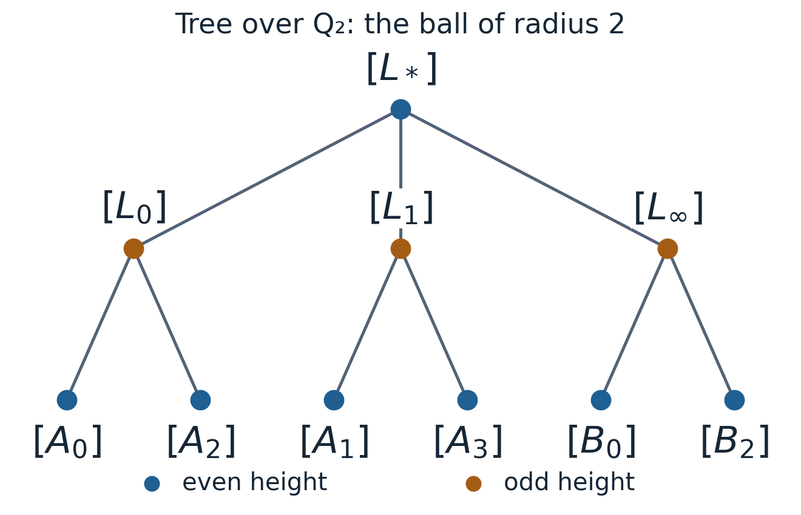

# Lattices over a local field: the tree of GL₂ and its decompositions

*Written by GPT-6.1 Sol (OpenAI) in Codex, Ultra setting, October 2026. Self-checked by the writing AI. Original material is public domain (CC0); the marked edge-stabilizer adaptation is CC BY 4.0.*

An invertible matrix can be studied through the lattice generated by its columns. Changing those columns by an integral basis change preserves the lattice. Forgetting an overall scalar produces a graph whose edges are the smallest possible changes of lattice. We will prove directly that this graph is a tree, and use it to understand both triangular matrices and the determinant-one subgroup.

Let \(F\) be any non-archimedean local field. Its valuation ring \(\mathcal O\) is a complete discrete valuation ring, \(\pi\) a uniformizer, \(v(\pi)=1\), and \(k=\mathcal O/\pi\mathcal O\) has \(q\) elements. All vector actions use columns and left matrix multiplication. Put \(G=\mathrm{GL}_2(F)\), \(K=\mathrm{GL}_2(\mathcal O)\), and \(L_0=\mathcal O^2\).

## Lattices and their stabilizers

A lattice is an \(\mathcal O\)-submodule of \(F^2\) with a basis consisting of two \(F\)-linearly independent vectors. Equivalently, it is a compact open \(\mathcal O\)-submodule. One implication follows by applying a linear homeomorphism to the compact open module \(\mathcal O^2\). For the converse, a compact open module \(L\) contains \(\pi^rL_0\) and is contained in \(\pi^{-s}L_0\) for suitable integers. Its intersection with \(Fe_1\) is \(\mathcal O ae_1\), and its projection on the second coordinate is \(\mathcal O c\), for nonzero \(a,c\in F\): a bounded nonzero \(\mathcal O\)-submodule of \(F\) has a least occurring valuation and hence is a principal fractional ideal. Choose \(be_1+ce_2\in L\). Subtracting a multiple of this vector from any element of \(L\) leaves an element of the intersection, so

\[
L=\mathcal O ae_1\oplus\mathcal O(be_1+ce_2).
\tag{1}
\]

Two lattices are homothetic if one is \(cL\) for some \(c\in F^\times\); write \([L]\) for the class. A unit scalar already preserves every lattice.

**Proposition 11.1.** The map \(gK\mapsto gL_0\) is a bijection from \(G/K\) to lattices. The stabilizer of \([L_0]\) is \(F^\times K\).

**Proof.** A lattice basis supplies a matrix \(g\in G\), proving surjectivity. If \(gL_0=hL_0\), then \(h^{-1}g\) and its inverse have integral columns, so \(h^{-1}g\in K\); the converse is immediate. Similarly, \(g\) fixes the class precisely when \(gL_0=cL_0\) for some nonzero scalar, or \(c^{-1}g\in K\). \(\square\)

In particular the class action factors through \(\mathrm{PGL}_2(F)\). The compact open subgroup \(K\) makes \(G/K\) discrete. Passing to homothety is an additional quotient; lattices themselves are not the tree vertices.

## Elementary divisors and Cartan decomposition

**Theorem 11.2.** Given two lattices \(L,L'\), there is an \(\mathcal O\)-basis \(u_1,u_2\) of \(L\) and unique integers \(a\geq b\) such that

\[
L'=\pi^a\mathcal O u_1\oplus\pi^b\mathcal O u_2.
\qquad
G=\coprod_{a\geq b}K
 \begin{pmatrix}\pi^a&0\\0&\pi^b\end{pmatrix}K.
\tag{2}
\]

**Proof.** Express a basis of \(L'\) in a basis of \(L\), obtaining an invertible matrix over \(F\). Choose an entry of least valuation \(b\). Integral row and column swaps put it in the first position, and multiplication by a unit makes it \(\pi^b\). Every other entry is divisible by this pivot in \(\mathcal O\). Integral column subtraction clears the rest of the first row, and integral row subtraction clears the first column. The remaining diagonal entry is nonzero, and still has valuation at least \(b\): the subtraction replaces an entry \(d\) by \(d-ca^{-1}b'\), whose two terms have valuation at least that of the pivot. A final unit multiplication gives \(\operatorname{diag}(\pi^b,\pi^a)\), with \(a\geq b\). Permuting both basis vectors gives the order in (2).

The least entry valuation is unchanged under multiplication by integral invertible matrices: all new entries have at least the old minimum valuation, and multiplication by the inverses gives the opposite inequality. It recovers \(b\). The determinant valuation recovers \(a+b\), so both integers are unique. Left operations change the basis of \(L\), and right operations change that of \(L'\). This proves the first assertion and also the double-coset statement, including its disjointness. Negative exponents are allowed throughout. \(\square\)

If \(L'\subset L\), then \(a,b\geq0\) and \([L:L']=q^{a+b}\). In every homothety class there is a unique representative \(M\subset L_0\) with \(M\not\subset\pi L_0\): scale until the smaller exponent is zero. Uniqueness follows because any further nonunit scalar changes that exponent. Define its height to be the other exponent \(n\geq0\). Thus, in a suitable basis of \(L_0\),

\[
M=\mathcal O u\oplus\pi^n\mathcal O z,
\qquad L_0/M\simeq\mathcal O/\pi^n\mathcal O.
\tag{3}
\]

## The graph is a tree

Join \([L]\) to \([M]\) when representatives can be chosen with
\(\pi L\subsetneq M\subsetneq L\). This relation is symmetric: for such representatives, \(\pi M\subsetneq\pi L\subsetneq M\), and \([\pi L]=[L]\). It is invariant under \(G\).

**Theorem 11.3.** This graph is a \((q+1)\)-regular tree. For the integers in (2), its graph distance is

\[
d([L],[L'])=a-b.
\tag{4}
\]

**Proof.** Intermediate modules \(M\) between \(\pi L\) and \(L\) correspond exactly to one-dimensional subspaces of \(L/\pi L\). There are \(q+1\) such subspaces. They give distinct classes: each has index \(q\) in \(L\), and a nonunit homothety changes the index by an even power of \(q\). Hence every vertex has degree \(q+1\).

We prove the tree assertion using height relative to \([L_0]\). Suppose (3) has \(n>0\). One line of \(M/\pi M\) is generated by \(\pi^nz\). Its inverse image is
\(\pi\mathcal O u\oplus\pi^n\mathcal O z\), whose class has normalized representative \(\mathcal O u\oplus\pi^{n-1}\mathcal O z\) and height \(n-1\). The other \(q\) lines are generated by \(u+t\pi^nz\), with \(t\) ranging over residue representatives. Their inverse images are

\[
\mathcal O(u+t\pi^nz)\oplus\pi^{n+1}\mathcal O z.
\tag{5}
\]

Because \(n>0\), \(u+t\pi^nz,z\) is a basis of \(L_0\). Thus these vertices have height \(n+1\). Every positive-height vertex has exactly one neighbour of smaller height. The root's neighbours all have height one.

Repeatedly taking the smaller-height neighbour reaches the root, proving connectedness. A finite simple cycle would have a vertex of maximal height. Its two adjacent vertices on that cycle would both have smaller height, contradicting uniqueness of the smaller-height neighbour. Thus there are no cycles. The unique root path has length \(n\). Applying \(G\) to send \(L\) to \(L_0\), and scaling \(L'\) by \(\pi^{-b}\), gives height \(a-b\), proving (4). \(\square\)

For example, the neighbours of \([\mathbb Z_2^2]\) are represented by
\(\mathbb Z_2e_1+2\mathbb Z_2e_2\), \(2\mathbb Z_2e_1+\mathbb Z_2e_2\), and
\(\mathbb Z_2(e_1+e_2)+2\mathbb Z_2e_1\). Each nonroot vertex has one parent and two children. For any prime \(p\), (4) gives distance three from \([\mathbb Z_p^2]\) to \([p^3\mathbb Z_pe_1+\mathbb Z_pe_2]\).

### A complete two-level example

Put \(\mathcal O=\mathbb Z_2\), and use the following normalized representatives:

\[
\begin{aligned}
L_*&=\mathcal O^2,\\
L_0&=\mathcal Oe_1+2\mathcal Oe_2,\\
L_1&=\mathcal O(e_1+e_2)+2\mathcal Oe_2,\\
L_\infty&=2\mathcal Oe_1+\mathcal Oe_2.
\end{aligned}
\]

At distance two, for \(a=0,1,2,3\) and \(b=0,2\), put

\[
A_a=\mathcal O(e_1+ae_2)+4\mathcal Oe_2,
\]

\[
B_b=\mathcal O(be_1+e_2)+4\mathcal Oe_1.
\]

**Figure 11.1.** The complete ball of radius two about \([L_*]\), with ten vertices and nine edges. Each downward edge represents an index-two inclusion of the displayed child lattice in its parent. Formula (5) gives the two children of each height-one vertex. The six boundary vertices have further children outside this ball; the full tree remains three-regular. Positions on the page are schematic, while vertices and adjacency are exact. Colours indicate the determinant parity in Proposition 11.5, and the labels identify every vertex without relying on colour.

All these representatives contain a primitive vector. The parent quotients \(L_*/L_i\) have order two, and the six quotients \(L_*/A_a\), \(L_*/B_b\) are cyclic of order four. Thus (3)–(4) give their heights one and two. Reducing their primitive vectors modulo two identifies the parent: \(a\equiv0\) leads to \(L_0\), \(a\equiv1\) to \(L_1\), and even \(b\) to \(L_\infty\). This also makes the one-parent/two-child mechanism in the proof explicit.

### Edge stabilizers and the Hecke choices

Return to \(L_0=\mathcal O^2\), and put

\[
a=\operatorname{diag}(1,\pi),\qquad M=aL_0,\qquad
I=\left\{\begin{pmatrix}r&s\\t&u\end{pmatrix}\in K:
t\in\pi\mathcal O\right\}.
\]

The subgroup \(I\) is the inverse image of the upper triangular subgroup under reduction modulo \(\pi\); it is called an **Iwahori subgroup**. The pointwise stabilizer of the edge with endpoints \([L_0],[M]\) is \(F^\times I\).

Indeed, an element fixing \([L_0]\) is \(cg\) with \(g\in K\), by Proposition 11.1. Scalars fix every class. If \(gM=dM\), comparison of determinant valuations gives \(2v(d)=v(\det g)=0\). Thus \(d\) is a unit, so \(gM=M\). Since \(M\) is the inverse image of the line \(ke_1\) in \(L_0/\pi L_0\), this equality is equivalent to the reduction of \(g\) preserving that line, exactly the condition defining \(I\). Conversely that condition preserves both endpoints. This proves the stabilizer assertion.

Reduction maps \(K\) onto \(\mathrm{GL}_2(k)\): lift the entries of an invertible residue matrix, whose lifted determinant is a unit. The residue group acts transitively on lines in \(k^2\), with the upper triangular subgroup stabilizing \(ke_1\). Hence \([K:I]=q+1\). Also \(I=K\cap aKa^{-1}\): for \(g=\begin{pmatrix}r&s\\t&u\end{pmatrix}\), the conjugate \(a^{-1}ga=\begin{pmatrix}r&\pi s\\t/\pi&u\end{pmatrix}\) is integral precisely when \(t\in\pi\mathcal O\), and its determinant is still a unit. Therefore

\[
k_1aK=k_2aK\quad\Longleftrightarrow\quad k_2^{-1}k_1\in I.
\]

The right cosets in \(KaK\) correspond exactly to \(K/I\), and to the \(q+1\) index-\(q\) sublattices of \(L_0\), each once. This is the group-theoretic form of the neighbour calculation in Theorem 11.3, and supplies the choices summed by the Hecke operator in the next lesson.

The word *pointwise* matters. The matrix \(w=\begin{pmatrix}0&1\\\pi&0\end{pmatrix}\) sends \(L_0\) to \(M\) and \(M\) to \(\pi L_0\), so it swaps the endpoints. Its determinant valuation is odd, in agreement with the parity calculation in Proposition 11.5.

*Source and changes.* This subsection adapts the edge-stabilizer description of Judith Ludwig and Christian Merten, [*Formalising the Bruhat–Tits Tree*, arXiv:2505.12933v4](https://arxiv.org/abs/2505.12933v4), 20 April 2026, [§3.6, printed p.71](https://arxiv.org/pdf/2505.12933v4). © 2026 J. Ludwig and C. Merten, [CC BY 4.0](https://creativecommons.org/licenses/by/4.0/). AI adaptation in Codex: notation and exposition rewritten; the elementary proof, right-coset interpretation and endpoint-swapping example supplied here. This marked subsection retains CC BY 4.0; the original course material remains CC0.

## Triangular matrices and the ends

Let \(B\) be the upper triangular subgroup, and put

\[
P_F=\left\{\begin{pmatrix}1&b\\0&a\end{pmatrix}:
 a\in F^\times,\ b\in F\right\},\qquad
P_{\mathcal O}=\{p\in P_F:a\in\mathcal O^\times,\ b\in\mathcal O\}.
\tag{6}
\]

**Proposition 11.4.** We have \(G=BK\). The group \(P_F\) acts transitively on vertices, with stabilizer \(P_{\mathcal O}\) at \([L_0]\). The ends of the tree are naturally, topologically and \(G\)-equivariantly identified with \(\mathbb P^1(F)\). The group \(P_F\) fixes the end \(\infty=Fe_1\).

**Proof of the decompositions.** Formula (1) gives an upper triangular basis matrix for every lattice. If \(gL_0=bL_0\) for this matrix, then \(b^{-1}g\in K\), giving \(G=BK\). An upper triangular matrix with first diagonal entry \(c\) is \(c\) times a matrix in \(P_F\). Scalars do not change a vertex, so \(P_F\) is transitive.

For \(p\in P_F\), \(pL_0\cap Fe_1=\mathcal O e_1\). If \(pL_0=cL_0\), comparison of these intersections gives \(c\mathcal O=\mathcal O\). Thus \(c\) is a unit, and \(pL_0=L_0\). This occurs exactly when \(a\) is a unit and \(b\) integral. Consequently the vertex set is the left homogeneous space \(P_F/P_{\mathcal O}\), with exactly the convention in (6).

**Proof about ends.** An end is an infinite geodesic ray modulo eventual agreement. In a tree there is a unique ray starting at a specified vertex for every end: the path from that vertex to any other ray joins it once and then follows its tail. For a line \(\ell\subset F^2\), choose a primitive generator \(u\) of \(\ell\cap L_0\), and define

\[
L_n(\ell)=\mathcal O u+\pi^nL_0\quad(n\geq0).
\tag{7}
\]

Extending \(u\) to a basis of \(L_0\) shows height \(n\); successive vertices are adjacent. Thus (7) is a geodesic ray.

Conversely, normalize every lattice along a root ray as in (3). The parent calculation (5) gives \(L_{n+1}\subset L_n\) and
\(L_n=L_{n+1}+\pi^nL_0\). Hence their rank-one images modulo \(\pi^nL_0\) are compatible. If the second coordinate of the first image is nonzero, choose generators \((c_n,1)\), where \(c_n\in\mathcal O/\pi^n\mathcal O\). Compatibility says \(c_{n+1}\equiv c_n\pmod{\pi^n}\); completeness gives a unique \(c\in\mathcal O\), and the ray is (7) for \(F(c,1)\). Otherwise choose \((1,c_n)\) with \(c_n\in\pi\mathcal O/\pi^n\mathcal O\), giving \(F(1,c)\) with \(c\in\pi\mathcal O\). These two charts partition all lines. This proves bijectivity. Agreement through level \(n\) means agreement of the primitive rank-one module modulo \(\pi^n\); in these charts it means the usual congruence condition on \(c\). Such conditions are exactly neighbourhood bases in the projective-line topology. The bijection is therefore a homeomorphism.

The end obtained from \(\ell\) does not depend on the root. To see this explicitly, use a basis with first vector in \(\ell\). Any other root lattice has a triangular basis \(ae_1,be_1+ce_2\). Its line ray has lattices
\(\mathcal O ae_1+\pi^n\mathcal O(be_1+ce_2)\).
For large \(n\), the term \(\pi^nbe_1\) belongs to \(\mathcal O ae_1\), so these become
\(\mathcal O ae_1+\pi^n\mathcal O ce_2\). Up to homothety and an integer shift of \(n\), these are the ray with this line from the original root. Their tails agree. Applying \(g\in G\) sends this root-independent construction for \(\ell\) to that for \(g\ell\). This proves equivariance. Finally every matrix in (6) preserves \(Fe_1\). \(\square\)

With affine coordinate \(F(z,1)\), a matrix in (6) acts by \(z\mapsto(z+b)/a\). The location of \(a\) in the lower diagonal entry explains this expression. The matrices \(\operatorname{diag}(1,\pi)\) translate the bi-infinite geodesic

\[
[\mathcal O e_1+\pi^n\mathcal O e_2],\qquad n\in\mathbb Z,
\tag{8}
\]

by one step in the direction of \(\infty\). Formula (4) proves that any two of these vertices have distance \(|n-n'|\).

## The two determinant-one orbits

**Proposition 11.5.** The group \(\mathrm{SL}_2(F)\) has exactly two orbits on vertices. They are distinguished by \(v(\det g)\pmod2\) for \([gL_0]\). Its action has no edge inversions.

**Proof.** Changing the representative \(g\) by \(ck\), with \(c\) scalar and \(k\in K\), changes the determinant valuation by \(2v(c)\). Parity is therefore well-defined, and determinant-one multiplication preserves it. By (2), height \(a-b\) has the same parity as \(a+b=v(\det g)\); adjacent vertices have opposite parity.

If \(x,y\) have equal parity, choose \(g\in G\) taking \(x\) to \(y\). Its determinant valuation is even, say \(2r\). Multiplying by \(\pi^{-r}\) makes \(\det g\) a unit \(u\) without changing its vertex action. In a basis for a lattice representing \(x\), the automorphism \(\operatorname{diag}(u^{-1},1)\) preserves that lattice and has determinant \(u^{-1}\). Compose \(g\) with this stabilizing automorphism. The result has determinant one and still takes \(x\) to \(y\). Thus each parity is a single orbit; both occur at the endpoints of an edge. An edge inversion would interchange those endpoints, changing parity, and is impossible. \(\square\)

The name “tree of \(\mathrm{SL}_2\)” describes this building, not a claim that \(\mathrm{SL}_2(F)\) is transitive on all its vertices.

## The finite-adèlic lattice convention

For comparison with global Hecke operators, there is also a bijection

\[
\mathrm{GL}_2(\mathbb A_f)/\mathrm{GL}_2(\widehat{\mathbb Z})
 \longrightarrow\{\mathbb Z\text{-lattices in }\mathbb Q^2\},\qquad
g\longmapsto\mathbb Q^2\cap g\widehat{\mathbb Z}^{,2}.
\tag{9}
\]

Here a \(\mathbb Z\)-lattice has a rational basis. To prove (9), choose an integer \(N>0\) with
\(N\widehat{\mathbb Z}^{,2}\subset g\widehat{\mathbb Z}^{,2}\subset N^{-1}\widehat{\mathbb Z}^{,2}\).
This is possible because only finitely many local matrices are nonintegral. Intersecting with \(\mathbb Q^2\) gives a module between \(N\mathbb Z^2\) and \(N^{-1}\mathbb Z^2\). It is free of rank two: after multiplying by \(N\), project its first coordinate to a principal ideal of \(\mathbb Z\), lift a generator, and choose a generator for the vertical kernel. This is the integer analogue of (1).

The density of \(\mathbb Q^2\) in \(\mathbb A_f^2\), proved in *The adèle ring of a number field*, makes this intersection dense in the compact open module \(g\widehat{\mathbb Z}^{,2}\). A rational basis matrix \(A\) for the intersection has closure \(A\widehat{\mathbb Z}^{,2}\), by the density of \(\mathbb Z\) in \(\widehat{\mathbb Z}\). Thus the two completions coincide. Conversely, intersecting \(A\widehat{\mathbb Z}^{,2}\) with \(\mathbb Q^2\) gives \(A\mathbb Z^2\). Equality of the compact modules gives the same right stabilizer as in Proposition 11.1, proving (9). Rational left multiplication sends the associated lattice to its ordinary image.

Deligne's *Formes modulaires et représentations de GL(2)*, §0.1, also considers full-adèlic rational lattices \(g\mathbb Q^2\subset\mathbb A^2\). Their right stabilizer is \(\mathrm{GL}_2(\mathbb Q)\): preserving the rational span means changing a rational basis. This is a different quotient from (9), which uses compact integral modules at finite places. Both conventions use left matrix action and right basis changes.

## Exercises and complete solutions

1. **Easy.** List the \(p+1\) neighbours of \([\mathbb Z_p^2]\) and identify the one heading toward \(Fe_1\).
2. **Medium.** Recover the disjoint Cartan decomposition from matrix elimination, including negative exponents and uniqueness.
3. **Medium.** Prove transitivity and the exact stabilizer for the group (6) without treating scalar homothety as equality of lattices.
4. **Hard.** Prove the two-orbit and no-inversion assertions for \(\mathrm{SL}_2(F)\).

**Solution 1.** The line \(ke_1\) gives \(\mathbb Z_pe_1+p\mathbb Z_pe_2\). The other lines \(k(te_1+e_2)\), for \(t=0,\ldots,p-1\), give
\(\mathbb Z_p(te_1+e_2)+p\mathbb Z_pe_1\). They are all intermediate modules and have distinct classes by their equal index. The first is the level-one lattice of (7) for \(Fe_1\), so heads toward that end.

**Solution 2.** Start with the least-valued matrix entry, irrespective of whether its valuation is positive or negative. Clear its row and column using ratios in \(\mathcal O\); all row and column operations are in \(K\). The remaining entry has no smaller valuation and is nonzero. Unit scalings and swaps give \(\operatorname{diag}(\pi^a,\pi^b)\), with \(a\geq b\). The minimum entry valuation is invariant under \(K\) on both sides, so is \(b\), and the determinant valuation is \(a+b\). Thus two such double cosets agree only for equal \((a,b)\). Reversing the operations proves both containment directions in (2).

**Solution 3.** Intersect a lattice with \(Fe_1\) and project it on the second coordinate. Lift generators of the resulting fractional ideals to obtain (1). Its triangular basis matrix is a scalar times an element of \(P_F\), which sends \([L_0]\) to the prescribed vertex. If \(p\) fixes \([L_0]\), then \(pL_0=cL_0\). Intersections with \(Fe_1\) force \(c\) to be a unit, hence actual equality \(pL_0=L_0\). Integral entries and integral inverse now require \(b\in\mathcal O\) and \(a\in\mathcal O^\times\); these conditions also suffice. This proves exactly \(P_F/P_{\mathcal O}\).

**Solution 4.** Parity of determinant valuation survives right multiplication by \(K\) and changes by an even integer under scalars. It is invariant under \(\mathrm{SL}_2\). Equal-parity vertices admit a transporting matrix whose determinant valuation is even. Remove that valuation by a scalar, and remove the remaining unit determinant by an automorphism of the source lattice with reciprocal determinant. The composite belongs to \(\mathrm{SL}_2(F)\), proving transitivity on each parity. An edge has opposite-parity endpoints, so an element of this group cannot swap them. There are exactly two orbits and no inversions.

## Sources and scope

Bost and Connes, [*Hecke algebras, type III factors and phase transitions with spontaneous symmetry breaking in number theory*, author scan](https://alainconnes.org/wp-content/uploads/bostconnesscan.pdf), §3, Proposition 11 and the complete surrounding Proposition 12 PDF pages 16–17, use the matrices (6), their vertex quotient, fixed end and restricted product. Their compressed local argument refers to lattice theory; the complete tree and stabilizer proofs are given here. Getz and Hahn, [*An Introduction to Automorphic Representations*, April 22, 2022 draft](https://sites.duke.edu/jgetz/files/2022/04/Graduate_Text.pdf), §§5.1–5.2, §5.5, Example 5.2, PDF pages 135–138 and 146–147, and Appendix A, Theorem A.1.1, provide the compact-open, elementary-divisor and general Iwasawa comparisons. Deligne, [*Formes modulaires et représentations de GL(2)*, IAS edition](https://publications.ias.edu/sites/default/files/Number21.pdf), §0.1 PDF pages 5–7, gives the full-adèlic lattice comparison distinguished from (9).

**Prerequisites and further directions.** We do not construct buildings for general reductive groups or classify their representations. The general Iwasawa theorem in Getz–Hahn, Appendix A, Theorem A.1.1, and Deligne's full dictionary in §0.1.2–0.1.4 are comparison results, not inputs to the local proofs. The present lattice bijections, tree, ends, decompositions and orbit assertions have all been proved directly.
