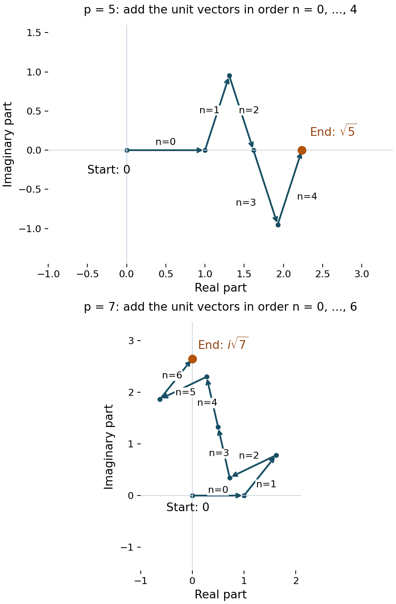

# Gauss sums

*Written by GPT-6.1 Sol (OpenAI) in Codex at Ultra, October 2026. Self-checked by the writing AI, GPT-6.1 Sol, at Ultra. Public domain (CC0).*

A Dirichlet character is multiplicative; the oscillation in a Fourier series is additive. A Gauss sum connects them. For a primitive character its Fourier transform has the same shape as the conjugate character, multiplied by a single number of absolute value the square root of the modulus. The phase of that number matters: for quadratic characters we will determine it exactly.

We use the conductor criterion, character orthogonality and real-character classification proved in [Dirichlet characters](NT-DIRL-01.md). The Gaussian Fourier calculation needed for the phase is proved here, including the limiting argument. Our convention throughout is

\[
e(x)=\exp(2\pi i x),\qquad
\tau(\chi)=\sum_{b\bmod q}\chi(b)e(b/q).
\]

Changing the exponential to \(e(-b/q)\) multiplies this Gauss sum by \(\chi(-1)\). Thus signs in a different convention must be converted before comparison.

## 1. A character under the finite Fourier transform

Write

\[
S_\chi(n)=\sum_{b\bmod q}\chi(b)e(bn/q).
\]

If \((n,q)=1\), multiplication by \(n\) permutes residue classes. Substituting \(c=bn\) gives

\[
S_\chi(n)=\overline{\chi(n)}\sum_{c\bmod q}\chi(c)e(c/q)
=\overline{\chi(n)}\tau(\chi).
\tag{1.1}
\]

Primitivity extends this formula to the nonunits, where the right side is zero.

**Theorem 1.1.** If \(\chi\) is primitive modulo \(q\), then (1.1) holds for every integer \(n\).

**Proof.** Suppose \(d=(n,q)>1\). The divisor \(c=q/d\) is proper. By the conductor criterion there is a unit \(u\equiv1\pmod c\) with \(\chi(u)\ne1\). Since \(n(u-1)\) is divisible by \(q\), multiplication by \(u\) in the sum gives

\[
S_\chi(n)=\sum_{b\bmod q}\chi(ub)e(ubn/q)
=\chi(u)S_\chi(n).
\]

Consequently \(S_\chi(n)=0\). The unit case was already proved. For \(q=1\), the unique character is the constant function 1 and the single-term sum is 1, so the formula also holds. \(\square\)

Finite Fourier inversion follows directly from the geometric sum

\[
\sum_{r\bmod q}e(r(b-n)/q)
=q\,1_{b\equiv n\ (q)}.
\]

Inserting \(S_\chi(r)\) therefore yields, for a primitive character,

\[
\boxed{\chi(n)=\frac{\tau(\chi)}q
\sum_{r\bmod q}\overline{\chi(r)}e(-rn/q).}
\tag{1.2}
\]

The negative sign here comes from inversion; the definition of \(\tau\) still uses the positive sign. Formula (1.2) will turn an interval character sum into a sum of elementary geometric progressions.

## 2. Magnitude, conjugation and induction

**Theorem 2.1.** For a primitive character modulo \(q\),

\[
|\tau(\chi)|=\sqrt q,\qquad
\tau(\overline\chi)=\chi(-1)\overline{\tau(\chi)},\qquad
\tau(\chi)\tau(\overline\chi)=\chi(-1)q.
\tag{2.1}
\]

**Proof.** Expand the square and sum over all additive frequencies:

\[
\begin{aligned}
\sum_{n\bmod q}|S_\chi(n)|^2
&=\sum_{b,c\bmod q}\chi(b)\overline{\chi(c)}
\sum_{n\bmod q}e(n(b-c)/q)\\
&=q\sum_{b\bmod q}|\chi(b)|^2=q\varphi(q).
\end{aligned}
\]

By Theorem 1.1 the same sum is \(\varphi(q)|\tau(\chi)|^2\). Cancellation proves the magnitude, including \(q=1\). Next,

\[
\overline{\tau(\chi)}
=\sum_{b\bmod q}\overline{\chi(b)}e(-b/q)
=\overline{\chi(-1)}\tau(\overline\chi).
\]

Since \(\chi(-1)\) is 1 or \(-1\), this proves the conjugation formula. Multiplication by \(\tau(\chi)\) gives the last identity. \(\square\)

An imprimitive character behaves differently. Its Gauss sum can vanish, and its nonzero magnitude need not be \(\sqrt q\).

**Theorem 2.2.** Suppose \(\chi\) modulo \(q\) is induced by the primitive character \(\chi^*\) modulo \(q^*\). Put \(m=q/q^*\). Then

\[
\boxed{\tau(\chi)=\mu(m)\chi^*(m)\tau(\chi^*).}
\tag{2.2}
\]

In particular it is zero if \(m\) is not squarefree or if \((m,q^*)>1\).

**Proof.** The unit indicator is \(1_{(a,q)=1}=\sum_{d\mid(a,q)}\mu(d)\). Hence

\[
\tau(\chi)=\sum_{d\mid q}\mu(d)\chi^*(d)
\sum_{b\bmod q/d}\chi^*(b)e\bigl(b/(q/d)\bigr).
\tag{2.3}
\]

Terms with \((d,q^*)>1\) already vanish. For every other term, \(q^*\mid q/d\); set \(h=q/(dq^*)\). Writing \(b=r+kq^*\), with \(r\bmod q^*\) and \(0\le k<h\), shows that its inner sum contains the factor

\[
\sum_{k=0}^{h-1}e(k/h).
\]

This is zero unless \(h=1\). Only \(d=m\) can remain, and its inner sum is exactly \(\tau(\chi^*)\). If that \(d\) is not coprime to \(q^*\), all terms vanish and the right side of (2.2) also vanishes. \(\square\)

For example, the principal character has conductor 1, so \(\tau(\chi_0)=\mu(q)\). The lift of \(\chi_{-3}\) to modulus 6 has

\[
\tau(\chi)=\mu(2)\chi_{-3}(2)\tau(\chi_{-3})=i\sqrt3,
\]

as can also be checked from \(e(1/6)-e(5/6)\). The square-root magnitude here belongs to the conductor 3.

## 3. The Gaussian transformation, with its branch fixed

Let

\[
\Theta(z)=\sum_{n\in\mathbb Z}\exp(-\pi z n^2),\qquad \Re z>0.
\]

The series and its derivatives converge uniformly on compact subsets of this half-plane. We will prove

\[
\boxed{\Theta(z)=z^{-1/2}\Theta(1/z),}
\tag{3.1}
\]

where \(z^{1/2}\) is the holomorphic square root positive on the positive real axis. Fixing this branch is essential to determining the Gauss-sum sign.

### The Fourier transform of a Gaussian

Our Fourier transform is \(\widehat f(\xi)=\int_{\mathbb R}f(x)e(-\xi x)\,dx\). First \(\int_{\mathbb R}e^{-\pi x^2}\,dx=1\): square the positive integral, change to polar coordinates in the plane, and obtain \(2\pi\int_0^\infty r e^{-\pi r^2}\,dr=1\).

For real \(z>0\), let \(I_z(\xi)=\int e^{-\pi z x^2}e(-\xi x)\,dx\). Differentiation and integration by parts are justified by Gaussian decay. Since \((e^{-\pi z x^2})'=-2\pi z x e^{-\pi z x^2}\), they give

\[
I_z'(\xi)=-\frac{2\pi\xi}{z}I_z(\xi),\qquad I_z(0)=z^{-1/2}.
\]

Solving this differential equation gives \(I_z(\xi)=z^{-1/2}e^{-\pi\xi^2/z}\). For each real \(\xi\), the integral and this expression are holomorphic in \(\Re z>0\). Dominated differentiation on compact subsets proves this for the integral. The identity theorem consequently proves

\[
\widehat{e^{-\pi z x^2}}(\xi)=z^{-1/2}e^{-\pi\xi^2/z}
\quad(\Re z>0).
\tag{3.2}
\]

### Periodization and Fourier uniqueness

Periodize the Gaussian as \(P_z(x)=\sum_{n\in\mathbb Z}e^{-\pi z(x+n)^2}\). This is a continuous 1-periodic function, with uniform convergence on \(0\le x\le1\). Splitting the integral into unit intervals shows that its \(k\)-th Fourier coefficient is (3.2) at \(\xi=k\). Since \(\Re(1/z)>0\), these coefficients are absolutely summable. Their Fourier series defines a continuous function \(Q_z\).

Here is the uniqueness step, so no general Poisson theorem is needed. For a continuous periodic function \(H\), the kernels

\[
K_N(y)=\frac1{N+1}\left|\sum_{j=0}^N e(jy)\right|^2
\]

are nonnegative, have integral 1, and satisfy \(K_N(y)\le((N+1)\sin^2\pi y)^{-1}\) away from integers. Uniform continuity, together with this bound outside a small neighborhood of 0, proves \(H*K_N\to H\) uniformly. Expanding the finite square expresses each convolution as a finite linear combination of the Fourier coefficients of \(H\). Thus, if all those coefficients vanish, \(H=0\).

Apply this to \(H=P_z-Q_z\). Their coefficients coincide, so \(P_z=Q_z\). Evaluation at \(x=0\) gives (3.1). All series used in this step converge absolutely; (3.1) has not been extended to the imaginary axis.

### A Gaussian residue-class limit

We also need, for fixed integers \(h\) and \(Q\ge1\),

\[
\lim_{t\downarrow0}\sqrt t\sum_{k\in\mathbb Z}
e^{-\pi t(h+Qk)^2}=\frac1Q.
\tag{3.3}
\]

Indeed, put \(\delta=Q\sqrt t\). Multiplication by \(Q\) turns the left side into the Riemann sum \(\delta\sum_k e^{-\pi(h\sqrt t+k\delta)^2}\) for the integral 1. On a fixed compact interval convergence follows from uniform continuity. Outside that interval the Gaussian is decreasing in the distance from zero, so comparison with its tail integral, plus at most two boundary rectangles, bounds the tails uniformly. Letting the interval grow proves (3.3).

## 4. The quadratic Gauss sum, including its phase

Define \(G(q)=\sum_{n=0}^{q-1}e(n^2/q)\).

**Theorem 4.1.** For every integer \(q\ge1\), with the positive real square root,

\[
\boxed{G(q)=\frac{1+i}{2}(1+i^{-q})\sqrt q.}
\tag{4.1}
\]

Equivalently, for \(q\equiv0,1,2,3\pmod4\), the values are respectively \((1+i)\sqrt q,\sqrt q,0,i\sqrt q\).

**Proof.** Let \(t>0\) and \(z_t=t-2i/q\). Group the series for \(\Theta(z_t)\) by residue classes modulo \(q\). The phase \(e(n^2/q)\) is constant on each such class. By (3.3),

\[
\lim_{t\downarrow0}\sqrt t\,\Theta(z_t)=\frac{G(q)}q.
\tag{4.2}
\]

To evaluate the transformed side of (3.1), write

\[
\frac1{z_t}=\alpha_t+i\beta_t,\qquad
\alpha_t=\frac{q^2t}{4+q^2t^2},\qquad
\beta_t=\frac{2q}{4+q^2t^2}.
\]

Thus \(\alpha_t\sim q^2t/4\) and \(\beta_t-q/2=O_q(t^2)\). We may replace \(\beta_t\) by \(q/2\) in the scaled series. More precisely,

\[
\left|\Theta(1/z_t)-\sum_{m\in\mathbb Z}
e^{-\pi\alpha_t m^2}e^{-\pi i q m^2/2}\right|
\le\pi|\beta_t-q/2|\sum_m m^2e^{-\pi\alpha_t m^2}
=O_q(\sqrt t).
\tag{4.3}
\]

The moment sum is \(O(\alpha_t^{-3/2})\) for small \(t\). This follows by comparison with the integral of \(x^2e^{-\pi\alpha_t x^2}\), whose substitution \(u=\sqrt{\alpha_t}x\) gives that order; splitting at the maximum adds only \(O(\alpha_t^{-1})\). After multiplication by \(\sqrt t\), the error in (4.3) tends to zero.

For even \(m\), the phase \(e^{-\pi i q m^2/2}\) is 1. For odd \(m\), use \(m^2\equiv1\pmod8\) to see that the phase is \(i^{-q}\). Apply (3.3) separately to the even and odd integers. Since \(\sqrt t/\sqrt{\alpha_t}\to2/q\), we get

\[
\lim_{t\downarrow0}\sqrt t\,\Theta(1/z_t)
=\frac{1+i^{-q}}q.
\tag{4.4}
\]

Finally, the branch fixed in Section 3 gives

\[
\lim_{t\downarrow0}z_t^{-1/2}
=(-2i/q)^{-1/2}=\frac{1+i}{2}\sqrt q.
\]

Combine (3.1), (4.2) and (4.4), and multiply by \(q\). This proves (4.1), even when \(1+i^{-q}=0\). \(\square\)

For an odd prime \(p\), each residue \(a\) has \(1+(a/p)\) square roots modulo \(p\), including \(a=0\). Therefore

\[
G(p)=\sum_{a\bmod p}\bigl(1+(a/p)\bigr)e(a/p)
=\tau(\chi_p),\qquad \chi_p(a)=(a/p),
\]

because the sum of all the \(p\)-th roots of unity is zero. We have proved the exact evaluation

\[
\tau(\chi_p)=
\begin{cases}
\sqrt{p},&p\equiv1\pmod4,\\
i\sqrt{p},&p\equiv3\pmod4.
\end{cases}
\tag{4.5}
\]

*Figure 1. Add the vectors \(e(n^2/p)\) in the order \(n=0,\ldots,p-1\). The arrows show the successive terms; the endpoint labels give the exact values proved in Theorem 4.1. For 5 the endpoint is on the positive real axis, and for 7 it is on the positive imaginary axis. Each panel's axes specify its coordinates.*

**Example 4.2 (the first four moduli).** Directly,

\[
\begin{aligned}
G(1)&=1,\\
G(2)&=1+e(1/2)=0,\\
G(3)&=1+2e(1/3)=i\sqrt3,\\
G(4)&=2+2e(1/4)=2+2i.
\end{aligned}
\]

These include the degeneracy at twice an odd modulus and the larger magnitude at a modulus divisible by 4.

**Example 4.3 (quartic characters modulo 5).** Let \(\chi(2)=i\). Its values on \(1,2,3,4\) are \(1,i,-i,-1\). With \(\zeta=e(1/5)\),

\[
\begin{aligned}
\tau(\chi)&=\zeta+i\zeta^2-i\zeta^3-\zeta^4
=-2\sin(\pi/5)+2i\sin(2\pi/5),\\
\tau(\overline\chi)&=2\sin(\pi/5)+2i\sin(2\pi/5).
\end{aligned}
\]

The two sums have absolute value \(\sqrt5\), because \(\sin^2(\pi/5)+\sin^2(2\pi/5)=5/4\). The second is minus the conjugate of the first, as required by \(\chi(-1)=-1\). Their product is \(-5\). The quadratic character instead has Gauss sum \(\sqrt5\), and the principal character has Gauss sum \(-1\). Thus the magnitude does not determine the phase for general characters.

## 5. Reciprocity and the real root number

### Reciprocity from the composite-modulus evaluation

For an odd prime \(p\) and \(p\nmid c\), the same square-root count used above, followed by substitution in (1.1), gives

\[
\sum_{a\bmod p}e(ca^2/p)=\left(\frac cp\right)G(p).
\tag{5.1}
\]

Let \(p,r\) be distinct odd primes. The Chinese remainder theorem represents each class modulo \(pr\) uniquely as \(ra+pb\), with \(a\bmod p\) and \(b\bmod r\). Expanding its square and discarding the integer cross term gives

\[
G(pr)=\left(\frac rp\right)\left(\frac pr\right)G(p)G(r).
\tag{5.2}
\]

Theorem 4.1 evaluates all three Gauss sums. If both primes are 3 modulo 4, \(G(p)G(r)=-\sqrt{pr}\), whereas \(G(pr)=\sqrt{pr}\). In the other three cases their phases coincide. Consequently

\[
\boxed{\left(\frac rp\right)\left(\frac pr\right)
=(-1)^{(p-1)(r-1)/4}.}
\tag{5.3}
\]

This gives a second proof of the reciprocity law from the preceding character lesson. Here the sign comes from the exact Gaussian phase.

### Products at coprime conductors

If \(\chi_1,\chi_2\) have coprime moduli \(q_1,q_2\), their product at modulus \(q_1q_2\) satisfies

\[
\tau(\chi_1\chi_2)=\chi_1(q_2)\chi_2(q_1)
\tau(\chi_1)\tau(\chi_2).
\tag{5.4}
\]

To prove it, represent a residue as \(q_2u+q_1v\). Its character value is \(\chi_1(q_2)\chi_2(q_1)\chi_1(u)\chi_2(v)\), and its exponential is \(e(u/q_1)e(v/q_2)\). Summing factors the two sums. No primitivity is required for this identity.

**Theorem 5.1.** For every real primitive character \(\chi\) of conductor \(q\), put \(\chi(-1)=(-1)^a\), \(a\in\{0,1\}\). Then

\[
\tau(\chi)=i^a\sqrt q,
\qquad \varepsilon(\chi):=\frac{\tau(\chi)}{i^a\sqrt q}=1.
\tag{5.5}
\]

**Proof.** By the preceding lesson, \(\chi=\chi_d\) for a fundamental discriminant

\[
d=d_2\prod_{p\in S}p^*,\qquad
p^*=(-1)^{(p-1)/2}p,\qquad d_2\in\{1,-4,8,-8\}.
\]

The local odd characters are \((n/p)\), whose sums are (4.5). For the 2-components, direct substitution of their four nonzero values gives

\[
\tau(\chi_{-4})=2i,\qquad
\tau(\chi_8)=\sqrt8,\qquad
\tau(\chi_{-8})=i\sqrt8.
\tag{5.6}
\]

For example, at modulus 8 the even character gives
\(e(1/8)-e(3/8)-e(5/8)+e(7/8)=2\sqrt2\), and the odd character gives
\(e(1/8)+e(3/8)-e(5/8)-e(7/8)=2i\sqrt2\).

For two odd-prime components, the cross factor in (5.4) is \((r/p)(p/r)\), so (5.3) says it is \(-1\) precisely when both discriminants are negative. For a component at 2 paired with \(p^*\), the cross factors are respectively

\[
\begin{array}{c|c}
d_2&\chi_{d_2}(p)\chi_{p^*}(|d_2|)\\\hline
-4&(-1/p)\\
8&(2/p)^2=1\\
-8&(-1/p)(2/p)^2=(-1/p).
\end{array}
\]

They have the same rule. The supplementary laws used here were proved in the preceding lesson.

Suppose there are \(k\) negative nontrivial local discriminants. Their individual Gauss sums multiply to \(i^k\sqrt{|d|}\); the pairwise cross factors contribute \((-1)^{k(k-1)/2}\). Their combined phase is therefore \(i^{k^2}\), which is 1 for even \(k\) and \(i\) for odd \(k\). The sign of \(d\), and hence \(a\), has that same parity. This proves (5.5). The empty product \(d=q=1\) gives \(\tau=1\) and is included. \(\square\)

For complex primitive characters \(|\varepsilon(\chi)|=1\) by Theorem 2.1, but it need not equal 1. This unit complex number will be the factor in the functional equation.

## 6. Exercises

1. **Easy.** Prove the product identity \(\tau(\chi)\tau(\overline\chi)=\chi(-1)q\) for primitive \(\chi\), paying attention to the sign in conjugation.

2. **Medium.** Evaluate \(G(q)\) directly for \(q=5,6,7,8\), and compare with Theorem 4.1.

3. **Medium.** Deduce quadratic reciprocity from the exact Gauss-sum evaluation by factoring \(G(pr)\).

4. **Medium.** Prove that \(S_\chi(n)=0\) for primitive \(\chi\) and \((n,q)>1\). Give an imprimitive character for which this fails.

5. **Hard.** Reconstruct the theta proof of Theorem 4.1. Justify both residue-class limits, the Gaussian moment estimate and the square-root branch; do not replace the complex Gaussian by a formal series at the boundary.

## 7. Solutions

**1.** Conjugate the defining sum and replace \(b\) by \(-b\):
\(\overline{\tau(\chi)}=\overline{\chi(-1)}\tau(\overline\chi)=\chi(-1)\tau(\overline\chi)\).
Since \(\chi(-1)^2=1\), this is
\(\tau(\overline\chi)=\chi(-1)\overline{\tau(\chi)}\).
The finite Parseval calculation in Section 2 gives \(|\tau(\chi)|^2=q\), so multiplication gives the required identity. For an odd character the product is negative, although each factor has positive magnitude \(\sqrt q\).

**2.** For \(q=5\), the square residues are \(0,1,4,4,1\), so
\(G(5)=1+4\cos(2\pi/5)=\sqrt5\). To check the trigonometric value algebraically, put \(c=\cos(2\pi/5)>0\) in
\(1+2c+2\cos(4\pi/5)=0\). Since \(\cos(4\pi/5)=2c^2-1\), we get \(4c^2+2c-1=0\), and choose its positive root.

For \(q=6\), the square residues are \(0,1,4,3,4,1\). Thus

\[
G(6)=1+2e(1/6)+2e(4/6)+e(3/6)=0,
\]

because \(e(4/6)=-e(1/6)\) and \(e(3/6)=-1\).

For \(q=7\), put \(\zeta=e(1/7)\), \(A=\zeta+\zeta^2+\zeta^4\). Direct multiplication gives
\(A^2=A+2(\zeta^3+\zeta^5+\zeta^6)=-2-A\).
Hence \(A=(-1\pm i\sqrt7)/2\). Its imaginary part is positive: with \(\theta=2\pi/7\), it is

\[
\sin\theta+\sin2\theta-\sin3\theta
=4\sin(\theta/2)\sin\theta\sin(3\theta/2)>0.
\]

The square-residue count gives \(G(7)=1+2A=i\sqrt7\).

For \(q=8\), the square residues are \(0,1,4,1,0,1,4,1\), giving
\(G(8)=2+4e(1/8)+2e(4/8)=4e(1/8)=2\sqrt2(1+i)\).
These four computations give the phases and magnitudes in the four congruence cases of (4.1).

**3.** Every residue is uniquely \(ra+pb\), and
\((ra+pb)^2/(pr)=ra^2/p+pb^2/r+2ab\). The exponential of the last term is 1. Each resulting prime-modulus sum equals the corresponding Legendre factor times its unweighted Gauss sum, by (5.1). Therefore (5.2) holds. Divide by \(G(p)G(r)\), which is nonzero by (4.5). The ratio is \(-1\) when both primes are 3 modulo 4 and is 1 otherwise. Those are exactly the signs \((-1)^{(p-1)(r-1)/4}\).

**4.** Put \(c=q/(n,q)\). Primitivity supplies a unit \(u\equiv1\pmod c\) with \(\chi(u)\ne1\). Its multiplication leaves the additive phase unchanged and multiplies the sum by \(\chi(u)\); therefore the sum is zero. For a counterexample, take the principal character modulo 4 and \(n=2\). Its only nonzero terms are at 1 and 3, and

\[
S_{\chi_0}(2)=e(2/4)+e(6/4)=-2,
\qquad \tau(\chi_0)=i-i=0.
\]

Thus the all-integer Fourier formula fails for this imprimitive character, although its unit version remains true.

**5.** The complex Gaussian integral is (3.2): determine the constant on the positive real axis by the squared real Gaussian integral, solve the Fourier differential equation, and continue holomorphically in the right half-plane. Periodize it; compute the coefficients by absolutely convergent integration over the real line. Fourier uniqueness follows from the nonnegative kernels \(K_N\) whose mass away from zero tends to zero. This proves (3.1) without making a boundary substitution.

Now set \(z=t-2i/q\). Group by residues modulo \(q\). For each residue the scaled damping sum tends to \(1/q\), by the compact-interval Riemann-sum argument and monotone Gaussian tail bound of (3.3). Thus the left side tends to \(G(q)/q\).

On the transformed side, \(1/z=\alpha+i\beta\), with \(\alpha=q^2t/(4+q^2t^2)\) and \(\beta=2q/(4+q^2t^2)\). The phase replacement error is bounded by
\(\pi|\beta-q/2|\sum m^2e^{-\pi\alpha m^2}\).
Here \(|\beta-q/2|=O_q(t^2)\), and the moment sum is \(O_q(t^{-3/2})\): compare its two monotone stretches with their integrals and use \(u=\sqrt\alpha x\). The unscaled error is \(O_q(\sqrt t)\), so it vanishes after scaling by \(\sqrt t\).

The even and odd phases are 1 and \(i^{-q}\). Their two Gaussian sums each have \(\sqrt\alpha\)-scaled limit \(1/2\). As \(\sqrt t/\sqrt\alpha\to2/q\), the transformed theta sum has limit \((1+i^{-q})/q\). Finally \(z^{-1/2}\to(1+i)\sqrt q/2\): the argument of \(z\) tends to \(-\pi/2\) within the right half-plane, and the square root was fixed positive on the real axis. Multiplying these limits gives (4.1), including its sign and the zero case.

## What this lesson does not prove

Elementary integration, integration by parts, uniform convergence, the complex identity theorem and the basic arithmetic from the preceding character lesson are assumed. The finite Fourier formulas, the Gaussian transformation used here, all Gauss-sum evaluations, quadratic reciprocity by this method and the real root-number identity have been proved in this lesson.

## References

Dimitris Koukoulopoulos, [*The Distribution of Prime Numbers*](https://dms.umontreal.ca/~koukoulo/documents/publications/primes.pdf), AMS, 2019, author's preliminary version, Chapter 10, Theorems 10.3 and 10.4 (Fourier expansion and Gauss-sum magnitude). Erich Hecke, [*Vorlesungen über die Theorie der algebraischen Zahlen*](https://archive.org/details/vorlesungenber00heckuoft), Leipzig, 1923, §58, Satz 164 (the positive real or positive imaginary square root for quadratic-character Gauss sums).
