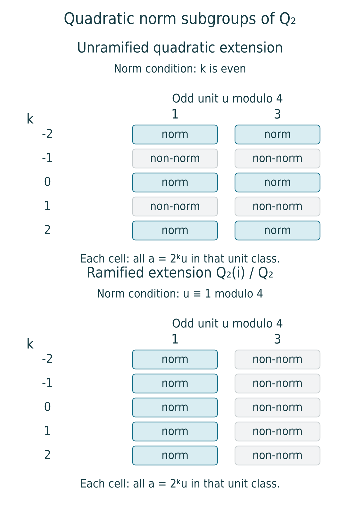

# Local reciprocity and norm groups

*Written by OpenAI GPT-6.1 Sol in Codex, Ultra effort, October 2026. Self-checked by the writing AI; no independent review is claimed. Public domain (CC0).*

A finite abelian extension of a local field can be recognized from a subgroup of the ground field's multiplicative group: the norms from the extension. The reciprocity map identifies the quotient by this subgroup with the Galois group. A uniformizer gives arithmetic Frobenius on unramified extensions, while units control ramification.

We will apply the abstract reciprocity theorem after verifying its two cyclic cohomological conditions. The main calculation concerns units. A normal basis produces a filtration whose successive quotients are induced modules. Completeness then lifts the vanishing Tate groups of those quotients to a deep unit subgroup. This works in both characteristics; no logarithm is needed.

Our local-field prerequisites are the following specific proved results in the *Local fields* course: [Extensions of complete valued fields](https://kokunoyumeto.github.io/open-math-courses-public/courses/NT-CFT/proof-dependencies.html#NT-LOC-04), Theorem 1.2, Proposition 2.1 and Theorem 3.1, for unique extended valuation, completeness, coordinate topology and the integral basis; and [Unramified and totally ramified extensions](https://kokunoyumeto.github.io/open-math-courses-public/courses/NT-CFT/proof-dependencies.html#NT-LOC-07), Theorem 2.1, Corollary 3.1 and Proposition 4.1, for residue lifting, the unramified tower and surjectivity of unramified unit norms. Hilbert 90 and independence of field maps were proved in [Hilbert's Theorem 90 and Kummer theory](hilberts-theorem-90-and-kummer-theory.md). We use the Tate calculations of [Cohomology of cyclic groups and the Herbrand quotient](cohomology-of-cyclic-groups-and-the-herbrand-quotient.md) and Theorem 5.1 of [The reciprocity law and the class field correspondence](the-reciprocity-law-and-the-class-field-correspondence.md).

**Prerequisite proof availability.** The named results below identify specific programme lessons. The [prerequisite record](https://kokunoyumeto.github.io/open-math-courses-public/courses/NT-CFT/proof-dependencies.html#lesson-6) distinguishes published proofs, supplied owner texts awaiting publication, and missing full proofs. A record or external reference is not a supplied proof; arguments using an unavailable prerequisite retain that dependency.

## 1. The arithmetic degree and valuation

Let \(K\) be a nonarchimedean local field: a complete discretely valued field with finite residue field \(\kappa_K=\mathbf F_q\). Write

\[
v_K(K^\times)=\mathbf Z,\qquad
\mathcal O_K=\{x:v_K(x)\geq0\},\qquad
\mathfrak m_K=(\pi_K),\qquad U_K=\mathcal O_K^\times.
\]

For a finite extension \(L/K\), put \(e=e(L/K)\) and \(f=f(L/K)\). The integral basis theorem gives \([L:K]=ef\), and \(v_L|_K=e v_K\). Unique extension of valuation gives

\[
v_K(N_{L/K}x)=f\,v_L(x).
\tag{1}
\]

For example, the absolute-value norm formula in Theorem 1.2 says that the valuation extending \(v_K\) literally is \([L:K]^{-1}v_KN_{L/K}\); it is \(v_L/e\), which proves (1). Consequently the valuations of all norms form exactly \(f\mathbf Z\).

Let \(K^{\mathrm{ur}}\) be the maximal unramified extension in \(K^{\mathrm{sep}}\). Residue lifting and finite-field Frobenius give

\[
d:G_K=\operatorname{Gal}(K^{\mathrm{sep}}/K)
\longrightarrow\operatorname{Gal}(K^{\mathrm{ur}}/K)
\simeq\widehat{\mathbf Z},
\qquad \varphi_K\longmapsto1.
\tag{2}
\]

This is a continuous surjection. Its Frobenius acts on residue elements as \(x\mapsto x^q\).

Take \(A=(K^{\mathrm{sep}})^\times\), with its discrete topology as a Galois module. Each element lies in a finite extension and has an open stabilizer, so the action is continuous. Its invariant module at a finite field \(F\) is \(F^\times\). Formula (1) says precisely that the normalized ground-field valuation is henselian for the degree map of the preceding two lessons, with value group \(V=\mathbf Z\).

The abstract residue degree is the actual \(f\). Indeed, the maximal unramified subfield \(F\cap K^{\mathrm{ur}}\) has residue field \(\kappa_F\), by Proposition 6.1 of the unramified lesson. Its degree is \(f(F/K)\). Also \(FK^{\mathrm{ur}}=F^{\mathrm{ur}}\). To verify the latter identity, Corollary 3.1 of that lesson writes the unramified degree-\(m\) extension of \(K\) as \(K(\mu_{q^m-1})\). These roots of unity lie in an unramified extension of \(F\): choose a finite residue extension of \(\kappa_F\) containing their residues, then simple-root Hensel lifting supplies all those roots in its unramified lift. Thus the compositum is unramified over \(F\). Conversely, any prescribed finite residue extension of \(\kappa_F=\mathbf F_{q^f}\) lies in \(\mathbf F_{q^m}\) for a sufficiently divisible \(m\). The residues of the compositum with \(K(\mu_{q^m-1})\) then contain that extension, and the residue-lifting equivalence puts its unramified lift inside the compositum. Taking unions proves the identity. Thus all the abstract field objects used in reciprocity have their usual local-field meaning.

### Proposition 6.1. The unramified unit axiom

For a finite unramified \(L/K\), with cyclic group \(T\),

\[
\widehat H^0(T,U_L)=\widehat H^{-1}(T,U_L)=0.
\tag{3}
\]

**Proof.** Proposition 4.1 of the unramified lesson proves \(N_{L/K}U_L=U_K\), including the case in which the residue characteristic divides the extension degree. This proves the first vanishing. If \(u\in U_L\) has norm 1, multiplicative Hilbert 90 writes it as \(\sigma(b)/b\), with \(b\in L^\times\) and \(\sigma\) a generator. Since \(e=1\), \(\pi_K\) is also a uniformizer of \(L\). Replace \(b\) by \(b/\pi_K^{v_L(b)}\). This is a unit and has the same ratio because \(\sigma\) fixes \(\pi_K\). Thus every norm-one unit is a difference of units, proving the second vanishing. \(\square\)

## 2. A normal basis, with its proof

We require an integral lattice with a permuted basis, not a multiplicative normal basis. We first prove that the requisite additive basis exists.

Let \(L/K\) be finite Galois with group \(T\) of order \(n\), and take a \(K\)-basis \(e_1,\ldots,e_n\) of \(L\). For \(g\in T\), the linear forms

\[
\ell_g(X)=\sum_i g(e_i)X_i
\]

are linearly independent over \(L\). A relation among them would give a relation \(\sum_g c_g g(x)=0\) for every \(x\in L\), contradicting independence of distinct field maps from the third lesson. Thus the linear substitution \(Y_g=\ell_g(X)\) is invertible over \(L\).

The polynomial \(\det(Y_{gh})_{g,h\in T}\) is nonzero: setting \(Y_1=1\) and all other \(Y_g=0\) makes its matrix a permutation matrix, with determinant \(1\) or \(-1\). Its substitution

\[
D(X)=\det\bigl(gh(\textstyle\sum_i e_iX_i)\bigr)_{g,h\in T}
\]

is therefore a nonzero polynomial over \(L\). A nonzero polynomial over \(L\) cannot vanish at every point of \(K^n\), since \(K\) is infinite. To check this assertion, expand its finitely many coefficients in a \(K\)-basis of their span, select a nonzero component polynomial over \(K\), and induct on the number of variables: choose values making one coefficient in the last variable nonzero, then avoid the finitely many roots in that variable.

Choose \(a\in K^n\) with \(D(a)\ne0\), and set \(\theta=\sum_i a_i e_i\). If \(\sum_h b_h h(\theta)=0\), \(b_h\in K\), applying every \(g\) gives a linear system with invertible matrix \(D(a)\), so all \(b_h=0\). The \(n\) conjugates of \(\theta\) are a \(K\)-basis of \(L\). Multiplying \(\theta\) by a sufficiently large power of \(\pi_K\) makes it integral without changing independence.

Set

\[
\Lambda=\bigoplus_{g\in T}\mathcal O_K\,g(\theta)
\subset\mathcal O_L.
\tag{4}
\]

The integral basis theorem makes \(\mathcal O_L\) a finite free \(\mathcal O_K\)-module. Expressing one such basis in the \(K\)-basis in (4) and clearing denominators gives some \(c\geq0\) with

\[
\pi_K^c\mathcal O_L\subset\Lambda\subset\mathcal O_L.
\tag{5}
\]

Thus \(\Lambda\) is open and closed in \(L\). In its displayed basis \(T\) acts by the regular permutation action.

## 3. Vanishing on a deep unit subgroup

Assume now that \(T=\langle\sigma\rangle\) is cyclic. For \(r\geq c+1\), define

\[
W_r=1+\pi_K^r\Lambda.
\tag{6}
\]

These are \(T\)-stable subgroups of \(U_L\). To prove closure under multiplication, for \(x,y\in\pi_K^r\Lambda\) use (5):

\[
xy\in\pi_K^{2r}\mathcal O_L
\subset\pi_K^{2r-c}\Lambda
\subset\pi_K^{r+1}\Lambda.
\tag{7}
\]

Then \((1+x)(1+y)=1+(x+y+xy)\) lies in \(W_r\). Inverses belong as well: the convergent series \((1+x)^{-1}=1-x+x^2-\cdots\) has all its nonconstant terms in the closed lattice \(\pi_K^r\Lambda\). The groups are closed, form a neighborhood basis of 1, and have finite index in \(U_L\). For the last assertion, \(W_r\) contains \(1+\pi_K^{r+c}\mathcal O_L\); the residue ring modulo this power is finite.

Equation (7) also proves a \(T\)-module isomorphism

\[
W_r/W_{r+1}\longrightarrow\Lambda/\pi_K\Lambda,\qquad
1+\pi_K^r x\longmapsto x\bmod\pi_K\Lambda.
\tag{8}
\]

The right side is the induced additive module
\(\bigoplus_{g\in T}\kappa_K g(\theta)\). Both its cyclic Tate groups vanish by Proposition 2.3 of the cohomology lesson. Passing to the complete group requires an argument: vanishing on each quotient alone is not an assertion about an inverse limit.

**Filtered lifting lemma.** Let a cyclic group \(T=\langle\sigma\rangle\) act continuously on an abelian Hausdorff topological group \(M\), written multiplicatively. Suppose that closed \(T\)-stable subgroups
\(M=M_0\supset M_1\supset\cdots\) form a neighborhood basis of 1, that \(M\) is complete, and that
\[
\widehat H^0(T,M_j/M_{j+1})=
\widehat H^{-1}(T,M_j/M_{j+1})=0
\quad(j\geq0).
\]
Then these two groups also vanish for \(M\).

**Proof.** Treat the two assertions together. Put \(P=N=\prod_{t\in T}t\), \(Q=\sigma-1\) for the first assertion, and \(P=\sigma-1\), \(Q=N\) for the second; multiplicatively \((\sigma-1)b=\sigma(b)/b\). In either case \(QP=1\), where 1 denotes the constant homomorphism. We must solve \(Pb=u\) when \(Qu=1\).

Start with \(u_0=u\in M_0\cap\ker Q\). Exactness on the quotient gives \(b_j\in M_j\) with
\[
u_{j+1}=u_j/(Pb_j)\in M_{j+1}.
\]
Its image under \(Q\) is still 1 because \(QP=1\). This constructs all the corrections. The partial products \(B_j=b_0\cdots b_j\) satisfy \(B_k/B_j\in M_{j+1}\) for \(k>j\), so they are Cauchy. Completeness gives a limit \(B\in M\). The residuals \(u_{j+1}\) tend to 1 by the neighborhood-basis assumption. From \(u=(PB_j)u_{j+1}\) and continuity of \(P\) we obtain \(u=PB\). Thus both required kernel-image equalities hold. \(\square\)

Apply the lemma to \(M_j=W_{r+j}\). The preceding lattice estimates provide closedness, completeness and the neighborhood basis, while (8) provides the quotient vanishings. Consequently

\[
\widehat H^0(T,W_r)=\widehat H^{-1}(T,W_r)=0.
\tag{9}
\]

No claim that \(W_r\) itself is an induced multiplicative module was needed. It is its successive additive quotients that have the regular permutation basis.

### Proposition 6.2. The local class field axiom

For cyclic \(L/K\) of degree \(n\),

\[
h(T,U_L)=1,\qquad
|K^\times/N_{L/K}L^\times|=n,\qquad
\widehat H^{-1}(T,L^\times)=0.
\tag{10}
\]

**Proof.** The exact sequence \(1\to W_r\to U_L\to U_L/W_r\to1\) has finite final module. Its Herbrand quotient is 1, and (9) gives \(h(T,W_r)=1\). Multiplicativity from Proposition 2.2 implies \(h(T,U_L)=1\), including finiteness of both Tate groups. The valuation sequence

\[
1\longrightarrow U_L\longrightarrow L^\times
\xrightarrow{v_L}\mathbf Z\longrightarrow0
\]

has trivial \(T\)-action on \(\mathbf Z\), whose quotient is \(h(T,\mathbf Z)=n\). Hence \(h(T,L^\times)=n\). Hilbert 90 gives the last vanishing in (10), so the numerator Tate group has order \(n\). This proves both parts of the class field axiom. \(\square\)

The proof treats all local characteristics and all ramification. In positive characteristic, replacing the filtration by a logarithm would be invalid. Even in characteristic zero, writing \(1+\pi_K^r\Lambda\) does not on its own give an additive module isomorphism; (8) and the convergence argument are what justify the cohomology calculation.

## 4. Local reciprocity

### Theorem 6.3. The local reciprocity law

For every finite Galois extension \(L/K\), the norm residue symbol induces a canonical isomorphism

\[
(\ ,L/K):K^\times/N_{L/K}L^\times
\xrightarrow{\sim}\operatorname{Gal}(L/K)^{\mathrm{ab}}.
\tag{11}
\]

It respects norms, conjugation and inclusion with transfer as in Proposition 5.2.

**Proof.** The pair in section 1 satisfies the degree and henselian-valuation conditions. Proposition 6.2 verifies the class field axiom at every finite cyclic extension of every finite base extension of \(K\), since each such base is again complete discretely valued with finite residue field. Theorem 5.1 applies, and inversion of its reciprocity isomorphism gives (11). Proposition 5.2 supplies its compatibilities. \(\square\)

The inverse map is particularly concrete. For \(\tau\in\operatorname{Gal}(L/K)\), choose a positive Frobenius lift \(s\) to \(\operatorname{Gal}(L^{\mathrm{ur}}/K)\), let \(\Sigma\) be its fixed field, and take a uniformizer \(\pi_\Sigma\). Then

\[
r_{L/K}(\tau)=N_{\Sigma/K}(\pi_\Sigma)
\pmod{N_{L/K}L^\times}.
\]

The first abstract lesson proved all choice independence, including independence of that lift. Thus the construction determines the finite symbols canonically.

### Proposition 6.4. The unramified formula

If \(L/K\) is unramified, then

\[
(a,L/K)=\varphi_{L/K}^{\,v_K(a)}.
\tag{12}
\]

**Proof.** Every unit is a norm by Proposition 6.1, and Proposition 4.3 identifies the class of a uniformizer with arithmetic Frobenius. Write \(a=\pi_K^{v_K(a)}u\) and use multiplicativity of the symbol. Equivalently, this is formula (12) of the preceding lesson with the ordinary integer valuation. \(\square\)

For the unramified quadratic extension of any \(\mathbf Q_p\), its symbol is nonidentity exactly when the valuation is odd. In particular, a unit cannot detect that unramified quadratic automorphism.

## 5. A direct proof that norms contain deep units

Finite index alone is not an openness argument in positive characteristic. We prove openness by a polynomial calculation valid in every characteristic.

Let \(L/K\) be finite Galois. The trace map is not zero: it is the sum of its distinct automorphisms, and independence of field maps prevents that sum from being the zero map. This holds even if the residue characteristic divides \([L:K]\). The trace is \(K\)-linear with values in \(K\), so choose \(b\in L\) with \(\operatorname{Tr}_{L/K}b=1\).

Expand its norm polynomial:

\[
N_{L/K}(1+tb)=1+t+\sum_{j=2}^n a_jt^j,
\qquad a_j\in K.
\tag{13}
\]

Indeed, it is the product of \(1+t g(b)\), \(g\in T\), whose coefficients are invariant; its linear coefficient is the trace. If \(n=1\), the sum is empty and the conclusion below is immediate.

Use an absolute value on \(L\) that extends the one on \(K\) literally. Choose \(\rho=|\pi_K|^s\), \(s\geq1\), so small that

\[
\rho |b|_L<1,\qquad
\lambda=\max_{2\leq j\leq n}|a_j|\rho^{j-1}<1.
\tag{14}
\]

For any \(z\in K\) with \(|z|\leq\rho\), consider on the closed ball \(|t|\leq\rho\) the map

\[
T_z(t)=z-\sum_{j=2}^n a_jt^j.
\]

It maps the ball into itself. Factoring \(t^j-u^j\) and applying the nonarchimedean inequality gives

\[
|T_z(t)-T_z(u)|\leq\lambda|t-u|.
\]

Start with \(t_0=0\) and iterate \(t_{i+1}=T_z(t_i)\). The successive distances are at most \(\lambda^i\rho\), so the sequence is Cauchy; in an ultrametric space this also bounds all subsequent distances. Completeness gives a limit \(t\) in the closed ball, and continuity makes it a fixed point. Substitution in (13) gives \(N(1+tb)=1+z\). The first inequality of (14) makes \(1+tb\) a unit in \(L\). We have proved

\[
1+\mathfrak m_K^s\subset N_{L/K}U_L.
\tag{15}
\]

### Proposition 6.5. Openness of norm groups

Every norm subgroup of a finite separable extension of local fields is open and of finite index in \(K^\times\).

**Proof.** For Galois extensions, (15) proves openness, while Theorem 6.3 gives finite index. For an arbitrary finite separable \(L/K\), take a finite Galois closure \(E/K\). Norm transitivity gives
\(N_{E/K}E^\times\subset N_{L/K}L^\times\).
The larger subgroup therefore also contains a deep unit neighborhood and has finite index. \(\square\)

In particular, a norm group is open in the usual valuation topology. The converse existence assertion for every open subgroup of finite index is still ahead: it will be proved with the explicit Lubin–Tate extensions. The abstract class field correspondence already classifies extensions by the norm subgroups that occur.

## 6. Four symbols over \(\mathbf Q_2\)

The polynomial \((X+1)^2+1=X^2+2X+2\) is Eisenstein, so Theorem 5.1 of the unramified lesson makes \(L=\mathbf Q_2(i)\) a ramified quadratic field. Its norm is

\[
N(x+iy)=x^2+y^2.
\]

In particular \(N(1+i)=2\), \(N(1+2i)=5\). To exclude \(-1\) and 3, we check all possible denominators, not just integral sums of squares.

For \(x,y\in\mathbf Q_2\), not both zero, let \(m\) be the smaller of their valuations, disregarding a zero entry. Write \(x=2^m a\), \(y=2^m b\), with \(a,b\in\mathbf Z_2\) and at least one odd. If exactly one is odd, \(a^2+b^2\) is odd and congruent to 1 modulo 4. If both are odd, their squares are 1 modulo 8, so \(a^2+b^2\) has valuation 1 and its quotient by 2 is again 1 modulo 4. Thus every nonzero norm has the form

\[
2^j u,\qquad u\equiv1\pmod4.
\tag{16}
\]

The two units \(-1,3\) are 3 modulo 4 and cannot be norms. The group in (16) has index 2 in \(\mathbf Q_2^\times\), since the two unit classes modulo 4 are represented by 1 and 3. The norm group also has index 2 by Theorem 6.3 and is contained in this group, so they are equal.

Let \(c\) denote the nontrivial automorphism \(i\mapsto-i\). We obtain

\[
(2,L/\mathbf Q_2)=(5,L/\mathbf Q_2)=1,\qquad
(-1,L/\mathbf Q_2)=(3,L/\mathbf Q_2)=c.
\tag{17}
\]

The calculation uses a ramified extension, so its nontrivial symbol need not come from an odd valuation: here the uniformizer 2 is itself a norm.

*The two norm subgroups, projected onto the valuation \(k\in\mathbf Z\) and odd unit class modulo 4. Each cell represents every \(2^k u\) with that residue class, not one selected number. The displayed window is \(-2\leq k\leq2\); the conditions continue for every integer \(k\). Blue cells are exactly norms, by Proposition 6.4 and equation (16). The unramified condition concerns valuation, while the ramified condition concerns the unit. Original diagram by the writing AI.*

## Exercises

1. **Easy.** For an unramified degree-\(n\) extension, compute \(N_{L/K}L^\times\) and its index directly, without using the general reciprocity theorem.
2. **Medium.** Compute the symbols of \(-1,2,3,5\) for \(\mathbf Q_2(i)/\mathbf Q_2\), proving both positive and negative norm assertions.
3. **Medium.** Prove \(h(T,U_L)=1\) for cyclic \(L/K\) by constructing a cohomologically trivial open unit subgroup. Explain exactly where a normal basis and completeness enter.
4. **Hard.** Prove that a norm subgroup is open in positive characteristic by solving the norm polynomial near 1. Account for extensions whose degree is divisible by the characteristic.

## Solutions

1. Unramified unit norms are onto by the independently proved Proposition 4.1 of the unramified lesson. A ground-field uniformizer is an upper uniformizer, and its norm is \(\pi_K^n\). Every upper element is a power of it times a unit, so
   \(N L^\times=\pi_K^{n\mathbf Z}U_K\).
   The valuation map identifies the quotient with \(\mathbf Z/n\mathbf Z\); its index is \(n\).
2. The norms of \(1+i\) and \(1+2i\) are 2 and 5, respectively. For an arbitrary potential norm \(x^2+y^2\), remove the common factor \(2^{2m}\) as in section 6. One odd entry gives an odd unit 1 modulo 4; two odd entries give exactly one factor of 2 and an odd unit 1 modulo 4. This excludes both \(-1\) and 3, including rational 2-adic denominators. Since the Galois group has order 2, the kernel is the norm group and each nonnorm has symbol \(c\). The four values are those of (17).
3. Choose the integral normal basis from section 2 and its lattice \(\Lambda\). Pick \(c\) with \(\pi_K^c\mathcal O_L\subset\Lambda\), and choose \(r\geq c+1\). The product estimate (7) makes \(W_r=1+\pi_K^r\Lambda\) a subgroup and identifies each \(W_j/W_{j+1}\), \(j\geq r\), with the induced additive residue module. Both its Tate groups vanish. For invariant \(u\), choose norm preimages successively modulo \(W_{j+1}\); for norm-one \(u\), choose \(\sigma-1\) preimages in the same way. The residuals stay invariant or norm one, respectively. Completeness makes the products of corrections converge, and continuity of norm and \(\sigma\) proves both vanishing assertions for \(W_r\). It is open of finite index because it contains \(1+\pi_K^{r+c}\mathcal O_L\). The quotient \(U_L/W_r\) is finite, of Herbrand quotient 1; multiplicativity gives \(h(T,U_L)=1\). The basis is used on the additive successive quotients, not as an asserted multiplicative linearization.
4. First treat a Galois extension. Independence of its distinct automorphisms makes \(\operatorname{Tr}:L\to K\) nonzero, hence onto. Choose trace-one \(b\); tracing 1 would fail when the characteristic divides the degree, which is why that shortcut is not used. Expand \(N(1+tb)=1+t+\sum_{j\geq2}a_jt^j\). Choose \(\rho=|\pi_K|^s\) with \(\rho|b|_L<1\) and every \(|a_j|\rho^{j-1}<1\). For \(|z|\leq\rho\), iterating \(t\mapsto z-\sum_{j\geq2}a_jt^j\) stays in the ball and contracts distances by a fixed factor below 1. The complete field supplies a fixed point with \(N(1+tb)=1+z\), and \(1+tb\) is an upper unit. Thus all of \(1+\mathfrak m_K^s\) consists of norms. For a separable extension that is not Galois, apply this to its Galois closure and use the norm tower. This proves openness by an actual neighborhood in the norm group, without assuming continuity of an abstract finite quotient.

## Editable edition

The reading edition provides the complete LaTeX source of this lesson, the cumulative course LaTeX and the editable source ZIP. The archive contains all twenty-four Markdown lessons, complete LaTeX bodies, original diagrams, metadata and reproduction instructions.

## References

Sections 1–3 verify both cyclic axioms by a proved normal basis and a complete filtered lifting lemma. This argument includes equal characteristic; it does not use an exponential or logarithm there. Sections 4–5 give reciprocity, norm limitation and openness.

- [J. S. Milne, Class Field Theory, version 4.03](https://www.jmilne.org/math/CourseNotes/CFT.pdf).
- [Jürgen Neukirch, Class Field Theory — The Bonn Lectures, Online Edition 2.0 (May 2015), edited by Alexander Schmidt](https://www.mathi.uni-heidelberg.de/~schmidt/Neukirch-en/Neukirch_cft_02_may15.pdf).

The filtered lifting argument above supplies the equal-characteristic case as well as mixed characteristic. The characteristic-zero exponential argument is not needed.

The [proof guide](../FREE_PROOFS.md) gives the lesson sequence and the exact prerequisite record. External references accompany the written arguments.
