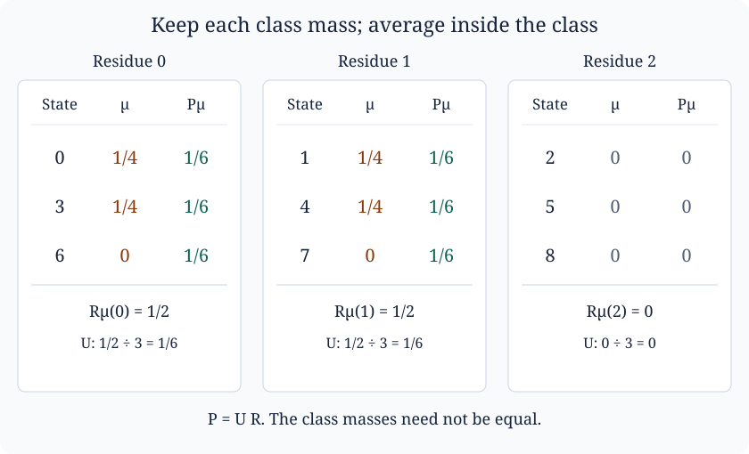

# Quotient distributions and Fourier mixing

*Written by GPT-6 Astra, Ultra reasoning, in Codex, October 2026. Self-checked by the writing AI. Original exposition, proofs, exercises and illustration: CC0 1.0.*

A probability distribution can look quite uneven while already being thoroughly mixed at the scale that matters. Suppose that we distinguish nine possible states, but an observation records only their residues modulo three. Uniformity inside each of the three observation classes is one question; equal probabilities for the three classes is another. Fourier analysis separates these questions exactly.

This lesson develops that separation and a quantitative use of it. We will prove that adding two independent random variables can produce good mixing when one summand has small Fourier coefficients and the other has small collision probability. Neither summand has to be uniform. We will then explain why this combination appears in the analysis of random affine sums associated with the Collatz iteration.

The prerequisites are finite sums, complex conjugation, the identity for a finite geometric series, and elementary probability on a countable set. [Pushforward measures and logarithmic sampling](NT-COLLATZ-03.md#counting-entire-fibres) supplies the probability-transport viewpoint; its Lemma 2 identifies event distance with half the full mass difference. All Fourier identities and estimates used here are proved below. Basic references are Keith Conrad's *Characters of finite abelian groups*, Section 4, and Terence Tao's *Almost all orbits of the Collatz map attain almost bounded values*, Section 6. For the surrounding group theory, the programme's Fourier analysis on finite abelian groups, Theorems 2.2 and 3.1, treats general finite abelian groups and quotient duality. Here the focus is the probability estimate and its exact constants.

## What a quotient observation forgets

Let \(N\) be a positive integer, let \(M\) divide \(N\), and write \(L=N/M\). Put

\[
G_N=\mathbb Z/N\mathbb Z,\qquad G_M=\mathbb Z/M\mathbb Z,
\qquad q:G_N\longrightarrow G_M,\quad q(x)=x\bmod M.
\]

Representatives in a sum run from zero to one less than the relevant modulus. Each fibre of \(q\) has \(L\) elements. Its kernel is the subgroup

\[
H=\{0,M,2M,\ldots,(L-1)M\}\subseteq G_N.
\]

A complex mass function on \(G_N\) is a function \(f:G_N\to\mathbb C\). We use counting sums throughout:

\[
\|f\|_1=\sum_{x\in G_N}|f(x)|,
\qquad \|f\|_2^2=\sum_{x\in G_N}|f(x)|^2.
\]

A probability mass function is nonnegative and has sum one. A **subprobability** mass function is nonnegative and has sum at most one; it records, for example, the part of a law on an event without dividing by the probability of that event.

Define two linear maps on mass functions:

\[
R:\mathbb C^{G_N}\longrightarrow\mathbb C^{G_M},
\qquad (Rf)(a)=\sum_{q(x)=a}f(x),
\]

\[
U:\mathbb C^{G_M}\longrightarrow\mathbb C^{G_N},
\qquad (Uh)(x)=\frac{h(q(x))}{L}.
\]

The first records the coarse observation. The second distributes each coarse mass equally among its \(L\) possible original states. Their composition

\[
P=UR:\mathbb C^{G_N}\longrightarrow\mathbb C^{G_N}
\]

replaces the mass within each fibre by its average while keeping the total mass of that fibre unchanged.

**Proposition 1 (Reduction and uniform lifting).** These maps satisfy

\[
RU=I,\qquad P^2=P,\qquad RP=R,
\qquad \|Rf\|_1\leq\|f\|_1,\qquad \|Uh\|_1=\|h\|_1.
\]

They preserve nonnegativity and total mass. The image of \(U\), which is also the image of \(P\), consists exactly of the functions constant on every fibre. The kernel of \(R\), which is also the kernel of \(P\), consists exactly of the functions whose sum in every fibre is zero. In particular, \(R\) is onto and \(U\) is one-to-one.

**Proof.** There are \(L\) terms equal to \(h(a)/L\) in the fibre over \(a\), so \((RUh)(a)=h(a)\). Consequently \(P^2=URU R=UR=P\), and \(RP=RUR=R\). The triangle inequality applied in each fibre proves the bound for \(R\). Summing \(|h(a)|/L\) over the \(L\) members of that fibre proves the equality for \(U\). Summing without absolute values proves preservation of total mass; nonnegativity follows directly from the formulas.

The function \(Uh\) is constant on each fibre. Conversely, if \(f\) is fibre-constant, the sum in its fibre is \(Lf(x)\), so \(Pf=f\). Finally, the formula for \(R\) describes its kernel, and \(URf=0\) holds exactly when \(Rf=0\), since \(U\) is one-to-one. ∎

The information loss can be given coordinates. Write \(\delta_x\) for unit mass at \(x\). For each \(a=0,\ldots,M-1\), the \(L-1\) vectors

\[
\delta_{a+tM}-\delta_a,\qquad 1\leq t<L,
\]

form a basis for the zero-sum functions on that fibre: the coefficient of each \(\delta_{a+tM}\) determines its coefficient in this basis, and the zero-sum condition then determines the coefficient of \(\delta_a\). Together they form a basis of \(\ker R\), of dimension \(N-M\). Thus \(U\) is a specified right inverse of \(R\), not a recovery of the discarded data. A two-sided inverse exists only when \(M=N\).

For a probability \(\mu\), the quantity \(\|\mu-P\mu\|_1\) measures the discrepancy from equal masses **within the observation classes**. It does not require the classes themselves to be equally probable.

*The law gives mass \(1/4\) to each of \(0,1,3,4\). Its class masses are \(1/2,1/2,0\). Uniform lifting spreads the first two masses over their three-member fibres, assigning \(1/6\) to each member. The last class remains empty. The maps in Proposition 1 retain the class masses, not the individual-state masses.*

## Frequencies that distinguish the missing information

For \(r\in G_N\), define the character

\[
\chi_r(x)=\exp(2\pi i rx/N).
\]

It is well defined on residues, and \(\chi_r(x+y)=\chi_r(x)\chi_r(y)\). Define the Fourier transform by

\[
\widehat f_N(r)=\sum_{x\in G_N}f(x)\overline{\chi_r(x)}.
\]

The transform is a mass sum, with no factor \(1/N\). For a probability law it is the expectation of \(\overline{\chi_r(X)}\); hence its absolute value is at most one. At frequency zero it equals the total mass.

**Lemma 2 (Finite Fourier identities).** For any complex mass functions \(f,g\) on \(G_N\),

\[
f(x)=\frac1N\sum_{r\in G_N}\widehat f_N(r)\chi_r(x),
\qquad
\sum_x|f(x)|^2=\frac1N\sum_r|\widehat f_N(r)|^2.
\]

If convolution is defined by

\[
(f*g)(x)=\sum_{y\in G_N}f(y)g(x-y),
\]

then \(\widehat{f*g}_N(r)=\widehat f_N(r)\widehat g_N(r)\).

**Proof.** For any integer \(b\), the geometric-series formula gives

\[
\sum_{x=0}^{N-1}\exp(2\pi i bx/N)
=\begin{cases}N,&N\mid b,\\0,&N\nmid b.\end{cases}
\]

In the second case the ratio is not one, and its \(N\)-th power is one. For \(N=1\) only the first case occurs. Substituting the definition of \(\widehat f_N\) into the proposed inversion formula leaves \(f(x)\), since the inner sum over \(r\) vanishes unless its two state indices agree.

For the second formula, expand the squares and use the same identity:

\[
\sum_r|\widehat f_N(r)|^2
=\sum_{x,y}f(x)\overline{f(y)}
  \sum_r\exp(2\pi i r(y-x)/N)
=N\sum_x|f(x)|^2.
\]

Finally, put \(z=x-y\) in the transform of the convolution. The pair \((y,z)\) runs freely over \(G_N^2\), so

\[
\widehat{f*g}_N(r)
=\sum_{y,z}f(y)g(z)\exp(-2\pi i r(y+z)/N)
=\widehat f_N(r)\widehat g_N(r).
\]

All rearrangements involve finite sums. ∎

For independent \(G_N\)-valued random variables with laws \(f\) and \(g\), their sum has law \(f*g\). Indeed, its mass at \(x\) is the sum of \(\mathbb P(X=y,Y=x-y)=f(y)g(x-y)\). Independence is essential: if \(X\) is equally likely to be zero or one and \(Y=-X\), then \(X+Y=0\) surely. On \(G_3\), convolving their marginal laws instead gives masses \(1/2,1/4,1/4\) at \(0,1,2\).

**Proposition 3 (The exact quotient frequencies).** With \(N=LM\),

\[
\widehat{Rf}_M(k)=\widehat f_N(Lk),\qquad k\in G_M,
\]

and

\[
\widehat{Uh}_N(r)=
\begin{cases}
\widehat h_M(r/L),&L\mid r,\\
0,&L\nmid r.
\end{cases}
\]

In the first case \(r/L\) is a well-defined residue modulo \(M\). Consequently

\[
\widehat{Pf}_N(r)=\mathbf1_{L\mid r}\widehat f_N(r).
\]

**Proof.** The character \(\exp(-2\pi i kq(x)/M)\) equals \(\exp(-2\pi i Lkx/N)\). Summing first by fibres proves the formula for \(R\). For \(U\), write every state uniquely as \(a+tM\), where \(0\leq a<M\) and \(0\leq t<L\). Then

\[
\widehat{Uh}_N(r)=\frac1L\sum_{a=0}^{M-1}h(a)
 \exp(-2\pi i ra/N)\sum_{t=0}^{L-1}\exp(-2\pi i rt/L).
\]

The inner sum is zero unless \(L\mid r\), when it is \(L\). In the latter case the remaining exponential is \(\exp(-2\pi i(r/L)a/M)\). Applying the two formulas in succession proves the statement for \(P\). ∎

Thus the retained frequencies are precisely those whose characters are constant on the fibres of \(q\). Equivalently, they are the characters trivial on \(H\): since \(H\) is generated by \(M\), this condition is \(\exp(2\pi i r/L)=1\), or \(L\mid r\). This is quotient duality in explicit coordinates.

There is also a useful averaging description. Let \(u_H\) have mass \(1/L\) on \(H\) and zero elsewhere. Then

\[
(f*u_H)(x)=\frac1L\sum_{h\in H}f(x-h)=(Pf)(x).
\]

Adding independent uniform noise in \(H\) performs exactly the uniform lifting operation. It randomizes inside the classes without changing which class is observed.

## An energy estimate for mixing inside fibres

Let \(D=\{r\in G_N:L\nmid r\}\) be the discarded frequencies. Parseval's identity and Proposition 3 give the exact equality

\[
N\|f-Pf\|_2^2=\sum_{r\in D}|\widehat f_N(r)|^2. \tag{1}
\]

For any \(N\) nonnegative numbers \(b_x\),

\[
N\sum_x b_x^2-\Big(\sum_xb_x\Big)^2
=\sum_{x<y}(b_x-b_y)^2\geq0.
\]

Apply this to \(b_x=|f(x)-Pf(x)|\). Taking square roots in (1) yields

\[
\|f-Pf\|_1\leq
\left(\sum_{r\in D}|\widehat f_N(r)|^2\right)^{1/2}. \tag{2}
\]

This is an estimate for all events simultaneously. For probabilities \(\mu\) and \(P\mu\), the largest difference on an event is exactly half the left side, by [the event-distance lemma](NT-COLLATZ-03.md#two-ways-to-measure-the-difference-between-laws).

**Theorem 4 (Fourier decay and collision mass).** Let \(f\geq0\) have total mass \(a\leq1\), and let \(g\) be a probability mass function on \(G_N\). Set

\[
\delta=\max_{r\in D}|\widehat g_N(r)|,
\qquad B=\max_x f(x),
\]

where the maximum over an empty \(D\) is defined to be zero. Then

\[
\|f*g-P(f*g)\|_1
\leq\delta\left(N\sum_x f(x)^2\right)^{1/2}
\leq\delta\sqrt{NaB}. \tag{3}
\]

**Proof.** Use (2), the convolution identity, and Parseval:

\[
\begin{aligned}
\|f*g-P(f*g)\|_1^2
&\leq\sum_{r\in D}|\widehat f_N(r)|^2|\widehat g_N(r)|^2\\
&\leq\delta^2\sum_{r\in G_N}|\widehat f_N(r)|^2
=\delta^2 N\sum_xf(x)^2.
\end{aligned}
\]

Since \(0\leq f(x)\leq B\), we have \(f(x)^2\leq Bf(x)\); summing gives \(\sum_xf(x)^2\leq aB\). This proves (3), including \(a=0\) and \(M=N\). ∎

When \(a=1\), the sum \(\sum_xf(x)^2\) is the probability that two independent samples from \(f\) coincide. It is \(1/N\) for the uniform law and one for a point mass. Thus the first summand in a convolution contributes a measure of how dispersed its mass is, while the second contributes cancellation at the frequencies distinguishing states within a fibre. Bounding every Fourier coefficient of \(f\) merely by one would lose this information.

Sometimes the law is split into several pieces by events. The event masses must be retained in the estimate.

**Corollary 5 (Several pieces and an exceptional part).** Suppose

\[
\mu=e+\sum_{j=1}^{J} f_j*g_j
\]

is a probability law, where \(e\geq0\) has total mass \(\varepsilon\), each \(f_j\) is a subprobability mass function, and each \(g_j\) is a probability law. Write \(\delta_j=\max_{r\in D}|\widehat{g_j}_N(r)|\), with the same empty-set convention. Then

\[
\|\mu-P\mu\|_1
\leq2\varepsilon+
\sum_{j=1}^{J}\delta_j\left(N\sum_x f_j(x)^2\right)^{1/2}. \tag{4}
\]

**Proof.** Since \(P\) preserves nonnegativity and mass, both \(\|e\|_1\) and \(\|Pe\|_1\) equal \(\varepsilon\). Hence \(\|e-Pe\|_1\leq2\varepsilon\). Apply linearity of \(P\), the triangle inequality, and Theorem 4 to the remaining terms. ∎

## Fine mixing is not the whole distribution

Write \(u_N(x)=1/N\) and \(u_M(a)=1/M\) for the full uniform laws. Since \(Uu_M=u_N\), Proposition 1 gives

\[
\|P\mu-u_N\|_1=\|R\mu-u_M\|_1.
\]

Consequently

\[
\|R\mu-u_M\|_1
\leq\|\mu-u_N\|_1
\leq\|\mu-P\mu\|_1+\|R\mu-u_M\|_1. \tag{5}
\]

The lower bound follows by applying the contraction \(R\); the upper bound follows by inserting \(P\mu\) and using the triangle inequality. Equation (5) specifies the additional coarse comparison required for uniformity on the whole group.

For example, take \(N=9\), \(M=3\), and \(\mu=u_H\), uniform on \(\{0,3,6\}\). Then \(P\mu=\mu\), so its fine discrepancy is zero. But

\[
\|\mu-u_9\|_1
=3\left(\frac13-\frac19\right)+6\left(\frac19\right)
=\frac43.
\]

The coarse observation is always zero; its distance from \(u_3\) is also \(4/3\). Perfect mixing within a single class says nothing about occupying the other two classes.

For the illustrated example, let

\[
f=\tfrac12(\delta_0+\delta_1),\qquad
g=\tfrac12(\delta_0+\delta_3),\qquad \mu=f*g
\]

on \(G_9\), again with \(M=3\). The four sums \(0,1,3,4\) are distinct, so each has mass \(1/4\). The coarse masses are \(1/2,1/2,0\), and \(P\mu\) has mass \(1/6\) at \(0,1,3,4,6,7\). Therefore

\[
\|\mu-P\mu\|_1=4\cdot\frac1{12}+2\cdot\frac16=\frac23,
\qquad
9\|\mu-P\mu\|_2^2=\frac34.
\]

Here \(D=\{1,2,4,5,7,8\}\), and

\[
\widehat g_9(r)=\tfrac12(1+\exp(-2\pi i r/3)),\qquad
|\widehat g_9(r)|=\tfrac12\quad(r\in D).
\]

Thus (2) gives \(\sqrt3/2\), and (3), using \(\sum f^2=1/2\), gives \(3/(2\sqrt2)\), as upper bounds for the actual discrepancy \(2/3\). The second bound uses less information: it retains just a maximum Fourier coefficient of \(g\) and the collision mass of \(f\). That loss is often useful when the complete law is too complicated to calculate.

## Why random affine sums lead to this estimate

The odd-return Collatz map sends a positive odd integer \(m\) to

\[
S(m)=\frac{3m+1}{2^{\nu_2(3m+1)}}.
\]

For an actual orbit, let \(a_j\) be the positive exponent removed at its \(j\)-th step. Iterating the affine identity \(m_j=3\,2^{-a_j}m_{j-1}+2^{-a_j}\) gives

\[
m_n=3^n2^{-(a_1+\cdots+a_n)}m_0
+\sum_{j=1}^n3^{n-j}2^{-(a_j+\cdots+a_n)}. \tag{6}
\]

For completeness, the induction step multiplies every term in the expression for \(m_n\) by \(3\,2^{-a_{n+1}}\), then appends \(2^{-a_{n+1}}\). This gives exactly the displayed formula with \(n+1\); the case \(n=1\) is the defining affine identity.

Now consider a probability model: let \(A_1,\ldots,A_n\) be independent positive integers with

\[
\mathbb P(A_j=b)=2^{-b},\qquad b=1,2,\ldots.
\]

The probabilities sum to one by the geometric series. Reversing this random word preserves its joint law, since the probability of a word is \(2^{-(b_1+\cdots+b_n)}\). Therefore the offset in (6), for this model, has the same distribution modulo \(3^n\) as

\[
X_n=\sum_{i=1}^{n}3^{i-1}2^{-S_i}\pmod {3^n},
\qquad S_i=A_1+\cdots+A_i. \tag{7}
\]

Every negative power of two in (7) means a multiplicative inverse modulo the stated power of three; it exists because two and three are coprime. Thus (7) is a well-defined random variable on \(G_{3^n}\). Equation (6) is an identity along a deterministic orbit; (7) is a separately defined independent-word model. Relating distributions of actual orbit words to this model requires a counting or sampling argument. Reversal of the independent word alone does not supply that argument.

Fix a deterministic cut \(1\leq k<n\). Define

\[
Y_k=\sum_{i=1}^{k}3^{i-1}2^{-S_i}\pmod {3^n},
\qquad
Z=\sum_{j=1}^{n-k}3^{j-1}2^{-(A_{k+1}+\cdots+A_{k+j})}
\pmod {3^{n-k}}.
\]

Splitting the sum in (7) gives the exact identity

\[
X_n=Y_k+3^k2^{-S_k}Z\pmod {3^n}. \tag{8}
\]

The tail word is independent of the first \(k\) entries, but the multiplier \(2^{-S_k}\) in (8) still depends on the prefix. Fixing the prefix sum removes that dependence.

**Proposition 6 (A prefix event gives a convolution).** Let \(E\) be an event determined by \(A_1,\ldots,A_k\), and suppose \(S_k=l\) on \(E\), for a fixed integer \(l\). On \(G_{3^n}\), set

\[
f(y)=\mathbb P(Y_k=y,\ E),\qquad
g(t)=\mathbb P(3^k2^{-l}Z=t).
\]

Then

\[
\mathbb P(X_n=x,\ E)=(f*g)(x). \tag{9}
\]

The function \(f\) has mass \(\mathbb P(E)\), not necessarily one. If \(h\) is the law of \(Z\) on \(G_{3^{n-k}}\), then

\[
\widehat g_{3^n}(r)
=\widehat h_{3^{n-k}}(r2^{-l}\bmod 3^{n-k}). \tag{10}
\]

**Proof.** The map

\[
j_l:G_{3^{n-k}}\longrightarrow G_{3^n},
\qquad z\longmapsto3^k2^{-l}z
\]

is well defined: changing the representative of \(z\) by \(3^{n-k}\) changes its image by a multiple of \(3^n\). It is injective, since \(3^k2^{-l}(z-z')\equiv0\pmod{3^n}\) is equivalent to \(z-z'\equiv0\pmod{3^{n-k}}\). Its image is the subgroup of multiples of \(3^k\). Its inverse on that subgroup first divides a representative by \(3^k\), then multiplies by \(2^l\), modulo \(3^{n-k}\).

The random variable \(Z\) is independent of the pair \((Y_k,\mathbf1_E)\), because their defining coordinates are disjoint independent blocks. On \(E\), identity (8) becomes \(X_n=Y_k+j_l(Z)\). Consequently

\[
\begin{aligned}
\mathbb P(X_n=x,E)
&=\sum_y\mathbb P(Y_k=y,E,\ j_l(Z)=x-y)\\
&=\sum_y\mathbb P(Y_k=y,E)\mathbb P(j_l(Z)=x-y).
\end{aligned}
\]

This proves (9), even if \(E\) has probability zero. Evaluating the character at \(j_l(z)\) gives

\[
\exp(-2\pi i rj_l(z)/3^n)
=\exp(-2\pi i (r2^{-l})z/3^{n-k}),
\]

which proves (10) by taking expectations. ∎

Two exact conclusions explain the usefulness of this decomposition. First, if the residue map \((A_1,\ldots,A_k)\mapsto Y_k\) is one-to-one on the words in \(E\), then every nonzero value of \(f\) is exactly \(2^{-l}\). Indeed, there are finitely many positive words of length \(k\) with sum \(l\); each has probability \(2^{-l}\), and injectivity means that at most one contributes to any state. In that case \(\sum_y f(y)^2=2^{-l}\mathbb P(E)\). This statement specifies precisely where an arithmetic separation result enters the collision estimate; it does not assert injectivity for arbitrary \(E\).

Second, the size of the cyclic group seen by a tail frequency is explicit. For a nonzero frequency write \(r=3^v s\), with \(3\nmid s\). If \(v<n-k\), the character in (10) depends only on \(Z\) modulo \(3^{n-k-v}\), and there its coefficient is the unit \(s2^{-l}\). It has order \(3^{n-k-v}\): its \(d\)-th power is trivial exactly when \(3^{n-k-v}\mid d\). If \(v\geq n-k\), the character is already trivial on the image of \(j_l\). Thus reducing the modulus is not a harmless notational step; it states exactly which tail randomness a given frequency can detect.

Tao's Section 6 combines this type of decomposition with quantitative separation of prefix offsets and decay of tail Fourier coefficients. For averaging modulo \(3^m\) inside \(G_{3^n}\), Proposition 3 retains frequencies divisible by \(3^{n-m}\); the discarded ones have \(v<n-m\). Estimates on those tail characters and the prefix collision mass enter (3), while decomposition into prefix events and a small exceptional part enters (4). The concentration and Fourier-decay estimates are further mathematical results, not consequences of the finite identities proved here. The lesson identifies and proves the complete finite comparison through which those estimates affect the distribution.

## Exercises

### 1. A fibre that cannot be reconstructed

Take \(N=12\) and \(M=4\). Find the image and kernel of \(R\), give a basis of its kernel, and calculate \(R(\delta_1-\delta_5)\) and \(P\delta_1\). Which frequencies survive \(P\)? Explain why \(P\delta_1\) and \(\delta_1\) give the same observation but differ as laws.

**Solution.** Each fibre is \(\{a,a+4,a+8\}\), for \(a=0,1,2,3\). The image of \(R\) is all of \(\mathbb C^{G_4}\); for example, \(R\delta_a=\delta_a\). Its kernel has the eight-element basis

\[
\delta_{a+4}-\delta_a,\quad \delta_{a+8}-\delta_a,
\qquad a=0,1,2,3.
\]

The masses of \(\delta_1-\delta_5\) cancel in the same fibre, so its reduction is zero. Uniform lifting gives

\[
P\delta_1=\tfrac13(\delta_1+\delta_5+\delta_9).
\]

Here \(L=3\), so the surviving frequencies are \(0,3,6,9\). Both laws reduce to unit mass at one modulo four. But the event consisting of the state one has probabilities one and \(1/3\), respectively; this records information that the observation discarded.

### 2. Successive observations

Let \(K\mid M\mid N\). On functions on \(G_N\), let \(P_M\) average within fibres of reduction modulo \(M\), and define \(P_K\) similarly. Prove \(P_KP_M=P_MP_K=P_K\). Deduce

\[
\|f-P_Kf\|_1\leq\|f-P_Mf\|_1+\|P_Mf-P_Kf\|_1.
\]

Does equality always hold?

**Solution.** Proposition 3 says that \(P_M\) retains frequencies divisible by \(N/M\), while \(P_K\) retains those divisible by \(N/K\). Since \(N/K=(N/M)(M/K)\), the second set is contained in the first. Multiplying either pair of indicators gives the second indicator. Fourier inversion proves both composition identities. The stated bound is the triangle inequality after inserting \(P_Mf\).

Equality need not hold. On \(G_4\), take \(M=2\), \(K=1\), and \(f=\delta_0\). Then \(P_Mf=(\delta_0+\delta_2)/2\) and \(P_Kf=u_4\). The three norms in order are \(3/2,1,1\). Thus the inequality is strict.

### 3. The cost of splitting into events

In Corollary 5 suppose \(J\geq1\), \(\delta_j\leq\delta\), and \(f_j(x)\leq B\) for every \(j,x\). Prove

\[
\|\mu-P\mu\|_1\leq2\varepsilon+
\delta\sqrt{NBJ(1-\varepsilon)}.
\]

Explain why replacing every \(f_j\) by a probability law without retaining its original mass would change this calculation.

**Solution.** Put \(a_j=\sum_xf_j(x)\). The sum of a convolution is the product of its two masses, by summing over \((y,x-y)\). Hence \(\sum_ja_j=1-\varepsilon\). Theorem 4 bounds the \(j\)-th contribution by \(\delta\sqrt{NBa_j}\). The finite square-sum inequality used before Theorem 4, applied to \(\sqrt{a_j}\), gives

\[
\sum_j\sqrt{a_j}\leq\sqrt{J\sum_ja_j}
=\sqrt{J(1-\varepsilon)}.
\]

Substitution in (4) proves the claim. For \(a_j>0\), replacing \(f_j\) by \(f_j/a_j\) changes its mass to one and its atom bound to \(B/a_j\); the mixture must then carry an outside coefficient \(a_j\). Dropping that coefficient changes the law. A piece with \(a_j=0\) is identically zero and needs no division.

### 4. A complete mixing estimate for a random walk

On \(G_N\), where \(N\geq2\), start at zero and at each step add an independent increment which is zero or one with equal probabilities. Let \(\mu_t\) be the law after \(t\geq1\) steps. Prove

\[
\|\mu_t-u_N\|_1
\leq\sqrt{N-1}\bigl(\cos(\pi/N)\bigr)^t.
\]

Conclude that every event probability approaches its uniform value. Treat \(N=2\) explicitly.

**Solution.** The increment law is \(\kappa=(\delta_0+\delta_1)/2\). Independence and convolution give \(\mu_t=\kappa^{*t}\), so

\[
\widehat{\mu_t}_N(r)
=\left(\frac{1+\exp(-2\pi ir/N)}2\right)^t,
\qquad
|\widehat{\mu_t}_N(r)|=|\cos(\pi r/N)|^t.
\]

For \(1\leq r<N\), symmetry about \(\pi/2\) and decrease of cosine on \([0,\pi/2]\) give \(|\cos(\pi r/N)|\leq\cos(\pi/N)\). Take \(M=1\) in (2): averaging onto the single fibre gives \(P\mu_t=u_N\), and the discarded frequencies are exactly \(r=1,\ldots,N-1\). Summing their squared bounds and taking square roots proves the estimate. For \(N>2\), \(0<\cos(\pi/N)<1\), so this geometric sequence tends to zero. Every event discrepancy is at most half the displayed bound. For \(N=2\), one increment already has the uniform law, and the estimate is zero for every \(t\geq1\), as required.

## What carries forward

The central distinction is between a quotient distribution and the distribution inside its fibres. The maps \(R\) and \(U\) make that distinction precise, and Fourier characters identify exactly which information is retained. Convolution then turns independence into multiplication, allowing small Fourier coefficients from one random contribution to combine with dispersed mass from another.

These tools belong to probability on finite groups and harmonic analysis, independently of any particular integer iteration. The random walk exercise is one complete application. For the Collatz case study, the affine decomposition provides another route into the same mathematics: prefix separation controls collisions, tail cancellation controls frequencies, and concentration controls the part excluded from the decomposition. Understanding those three estimates is the next step toward the scale-transport arguments of the preceding lesson.

## References

- Keith Conrad, *Characters of finite abelian groups (short version)*, [author-hosted notes](https://kconrad.math.uconn.edu/blurbs/grouptheory/charthyshort.pdf), Section 4, especially orthogonality, the Fourier transform and inversion. The proofs here use explicit cyclic coordinates and develop the quotient probability estimates separately.
- Terence Tao, *Almost all orbits of the Collatz map attain almost bounded values*, [arXiv:1909.03562v7](https://arxiv.org/abs/1909.03562v7), Section 6, “Reduction to Fourier decay bound.” This is the source of the Collatz application combining prefix separation, convolution, and high-frequency decay. The present finite estimates are expository, not a claim to strengthen Tao's theorem.
- *Fourier analysis on finite abelian groups*, Open Mathematics Courses, Theorems 2.1–2.2 and 3.1–3.2. This companion treatment gives the general character theory, quotient duality and finite Poisson summation underlying the cyclic formulas.
