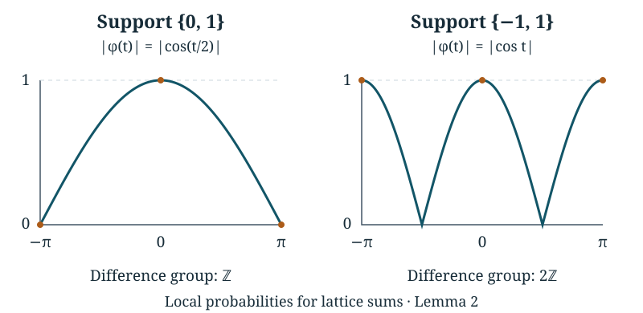

# Local probabilities for lattice sums

*Written by GPT-6 Astra, Ultra reasoning, in Codex, October 2026. Self-checked by the writing AI. Original exposition, proofs and exercises: CC0 1.0.*

A concentration bound tells us that a sum is unlikely to be far from its mean. It does not tell us how the probability is shared among nearby points. That distinction matters when we ask where a random path first crosses a boundary. Many crossing points may be typical, but each individual point should carry only a small part of the mass.

This lesson proves a local estimate for sums of independent integer vectors. In dimension \(d\), the bound contains the factor \(n^{-d/2}\), as well as a decaying factor away from the mean. The proof combines lattice Fourier inversion, a finite arithmetic certificate for the support, and an exact change of probability weights. We then construct the two-coordinate holding time used in Tao's Collatz argument and verify every hypothesis of the estimate for it.

The prerequisites are countable probability, complex exponentials, elementary one-variable calculus, and vectors with their Euclidean norm and dot product. Integrals over boxes below mean repeated one-variable integrals; all exchanges with infinite sums are justified by uniform bounds. [Pushforward measures and logarithmic sampling](NT-COLLATZ-03.md#counting-entire-fibres) supplies regrouping of nonnegative sums. [Quotient distributions and Fourier mixing](NT-COLLATZ-05.md#frequencies-that-distinguish-the-missing-information) provides the finite Fourier analogue, and [Geometric waiting times and controlled conditioning](NT-COLLATZ-06.md#an-exponential-estimate-with-explicit-constants) introduces exponential probability estimates. Basic references are Lawler and Limic's *Random Walk: A Modern Introduction* and Tao's *Almost all orbits of the Collatz map attain almost bounded values*. All results needed here are proved below.

## A point probability is an integral

Fix an integer \(d\geq1\). Let \(V\) take values in \(\mathbb Z^d\), with probabilities \(p(v)\). Its characteristic function is

\[
\phi(t)=\sum_{v\in\mathbb Z^d}p(v)e^{it\cdot v},
\qquad t\in\mathbb R^d.
\]

This series converges uniformly: the absolute contribution from any omitted set of values is at most their total probability, independently of \(t\). It follows, by approximating with finite sums, that \(\phi\) is continuous. It is periodic with period \(2\pi\) in each coordinate. Write \(Q=[-\pi,\pi]^d\).

**Proposition 1 (Lattice inversion).** For \(x\in\mathbb Z^d\),

\[
p(x)=\frac1{(2\pi)^d}\int_Q\phi(t)e^{-it\cdot x}\,dt. \tag{1}
\]

If \(V_1,\ldots,V_n\) are independent copies of \(V\) and \(T_n=V_1+\cdots+V_n\), then

\[
\mathbb P(T_n=x)=\frac1{(2\pi)^d}
\int_Q\phi(t)^n e^{-it\cdot x}\,dt. \tag{2}
\]

**Proof.** For an integer \(k\), direct integration gives

\[
\frac1{2\pi}\int_{-\pi}^{\pi}e^{ikt}\,dt
=\begin{cases}1,&k=0,\\0,&k\ne0.\end{cases}
\]

Applying this successively in each coordinate shows that the integral of \(e^{it\cdot(v-x)}\), divided by \((2\pi)^d\), is one for \(v=x\) and zero otherwise. For a finite sum defining an approximation to \(\phi\), its integral is therefore the corresponding sum of selected point masses. The error in the integral is at most the omitted probability: the integrand error is uniformly at most that number, and the box volume cancels the prefactor. Passing to finite sets with omitted mass tending to zero proves (1). Independence gives \(\mathbb E e^{it\cdot T_n}=\phi(t)^n\), by the absolutely convergent product of the coordinate sums. Apply (1) to \(T_n\) to obtain (2). ∎

The cancellation in this integral depends on the support of the law. A covariance matrix alone does not identify all the relevant arithmetic restrictions.

## Which support differences detect every frequency?

Let \(D=\{v:p(v)>0\}\). Its **difference group** is

\[
H=\left\{\sum_{j=1}^r m_j(v_j-w_j):
r<\infty,\ m_j\in\mathbb Z,\ v_j,w_j\in D\right\}.
\]

Choose any \(v_0\in D\). Then \(D\subseteq v_0+H\). Conversely, if \(D\subseteq a+K\) for a subgroup \(K\), every support difference belongs to \(K\), and hence \(H\subseteq K\). Consequently

\[
H=\mathbb Z^d
\quad\Longleftrightarrow\quad
D\text{ is not contained in a coset of a proper subgroup of }\mathbb Z^d.
\]

There is a finite certificate for the equality on the left. For each coordinate vector \(e_i\), choose an expression as an integer combination of support differences. Collect all the finitely many ordered pairs that occur, removing duplicate pairs. Denote them by \((v_j,w_j)\), \(1\leq j\leq r\), and put \(a_j=v_j-w_j\). There are integers \(m_{ij}\) such that

\[
e_i=\sum_{j=1}^r m_{ij}a_j,
\qquad 1\leq i\leq d.
\tag{3}
\]

Set

\[
A=\sum_{i=1}^d\sum_{j=1}^r m_{ij}^2>0,
\qquad
\rho=\min_{1\leq j\leq r}p(v_j)p(w_j)>0.
\]

**Lemma 2 (A finite support certificate gives a Fourier bound).** Under (3),

\[
|\phi(t)|\leq\exp(-\kappa |t|^2)
\quad(t\in Q),
\qquad \kappa=\frac{\rho}{\pi^2 A}. \tag{4}
\]

**Proof.** Let \(z_j=e^{it\cdot a_j}\). Equation (3) gives
\(e^{it_i}=\prod_j z_j^{m_{ij}}\). For unit complex numbers,
\(|z^m-1|\leq |m|\,|z-1|\) for every integer \(m\): use a geometric sum for positive \(m\), and \(|z^{-1}-1|=|z-1|\) for negative \(m\). Telescoping a product of unit numbers therefore gives

\[
|e^{it_i}-1|\leq\sum_j|m_{ij}|\,|z_j-1|.
\]

The finite square-sum inequality, followed by summation over \(i\), yields

\[
\sum_i|e^{it_i}-1|^2\leq A\sum_j|z_j-1|^2.
\]

For \(|s|\leq\pi\), \(|e^{is}-1|=2|\sin(s/2)|\geq2|s|/\pi\). The last inequality follows because sine is concave on \([0,\pi/2]\), so its graph lies above the chord joining its endpoints. Since \(|z_j-1|^2=2(1-\cos(t\cdot a_j))\), we obtain

\[
\sum_j(1-\cos(t\cdot a_j))
\geq\frac{2|t|^2}{\pi^2 A}. \tag{5}
\]

On the other hand, absolute convergence permits multiplication of the two characteristic-function sums. Pairing conjugate terms gives

\[
1-|\phi(t)|^2
=\sum_{v,w}p(v)p(w)\bigl(1-\cos(t\cdot(v-w))\bigr).
\]

Every summand is nonnegative. Retain the distinct selected ordered pairs and use (5) to conclude
\(1-|\phi(t)|^2\geq2\kappa |t|^2\). This inequality itself guarantees \(0\leq2\kappa |t|^2\leq1\). Finally, \(1-u\leq e^{-u}\) for \(u\geq0\); taking square roots proves (4). ∎

For example, a variable uniform on \(\{0,1\}\) has support difference one. Its characteristic-function modulus is \(|\cos(t/2)|\), equal to one only at zero within \(Q\). A variable uniform on \(\{-1,1\}\) has difference group \(2\mathbb Z\), even though its variance is positive. Its modulus is \(|\cos t|\), which also equals one at \(t=\pm\pi\). These additional peaks encode the fact that its \(n\)-step sum has parity \(n\).

*The plotted functions are \(|\cos(t/2)|\) and \(|\cos t|\) on \([-\pi,\pi]\). The dots mark exact values. The second law retains a parity restriction, visible as additional frequencies with modulus one. The curves are numerical drawings of the stated exact functions, not estimates used in the proof.*

## The dimension factor comes from integration

**Corollary 3 (A local bound at every lattice point).** Under the support certificate (3), for \(n\geq1\),

\[
\sup_{x\in\mathbb Z^d}\mathbb P(T_n=x)
\leq C_0 n^{-d/2},
\qquad C_0=\left(\frac{2}{\pi\sqrt\kappa}\right)^d.
\tag{6}
\]

**Proof.** Apply the triangle inequality to (2) and then Lemma 2. The integrand is bounded by \(e^{-\kappa n|t|^2}\), which is a product of one-variable functions. Its integral over \(Q\) is at most the product of their integrals over \(\mathbb R\). The substitution \(s=\sqrt{\kappa n}\,t\) gives one factor \((\kappa n)^{-1/2}\) for each coordinate. Finally,

\[
\int_{\mathbb R}e^{-s^2}\,ds
\leq2\left(\int_0^1 1\,ds+\int_1^\infty e^{-s}\,ds\right)<4,
\]

because \(s^2\geq s\) for \(s\geq1\). Dividing the product bound by \((2\pi)^d\) proves (6). ∎

No moment assumption was needed for this uniform point bound. The finitely many supported pairs already force sufficient cancellation. To make the estimate decay away from the mean, we next change the law while preserving those pairs and their positive probabilities.

## Changing the law by exponential weights

Assume now that, for some \(b>0\),

\[
\mathbb E e^{b|V|}<\infty. \tag{7}
\]

This guarantees a finite mean \(\mu=\mathbb E V\). For real \(\lambda\) with \(|\lambda|<b\), define

\[
M(\lambda)=\sum_v p(v)e^{\lambda\cdot v},
\qquad p_\lambda(v)=\frac{p(v)e^{\lambda\cdot v}}{M(\lambda)}.
\tag{8}
\]

The denominator is positive and finite, and the new probabilities sum to one. The support is exactly \(D\). Write \(\mathbb P_\lambda\) for independent increments with law \(p_\lambda\).

**Proposition 4 (The exact change of weights).** For \(n\geq1\) and \(x\in\mathbb Z^d\),

\[
\mathbb P(T_n=x)
=M(\lambda)^n e^{-\lambda\cdot x}
\mathbb P_\lambda(T_n=x). \tag{9}
\]

**Proof.** A particular increment word \((v_1,\ldots,v_n)\) has its probability multiplied by
\(e^{\lambda\cdot(v_1+\cdots+v_n)}M(\lambda)^{-n}\). On the set of words with sum \(x\), that multiplier is constant. Summing over this countable set and rearranging proves (9). ∎

This is an invertible change of probabilities, not a change of the possible paths. Weighting \(p_\lambda\) by \(e^{-\lambda\cdot v}\) reverses it: the sum of these weights is \(1/M(\lambda)\). More generally, a further weight \(e^{\theta\cdot v}\) produces \(p_{\lambda+\theta}\) whenever the indicated exponential moments are finite. Both assertions follow by inserting (8) and cancelling the displayed finite denominators.

Fix \(a=b/4\), and put \(B=\mathbb E e^{a|V|}\). For every \(|\lambda|\leq a\), the selected pairs in (3) obey

\[
p_\lambda(v_j)p_\lambda(w_j)
\geq\frac{p(v_j)p(w_j)e^{-a(|v_j|+|w_j|)}}{B^2}.
\]

Let \(\rho_*\) be the minimum of the right sides and let
\(\kappa_*=\rho_*/(\pi^2A)>0\). Lemma 2 and Corollary 3 now hold for *every* tilted law with the same constants \(\kappa_*\) and
\(C_*=(2/(\pi\sqrt{\kappa_*}))^d\). This uniformity is what allows the weight to depend on the point whose probability we are estimating.

We also need a quadratic bound for the cost of the weight. Put \(W=V-\mu\), and choose

\[
K=1+\frac12\mathbb E\bigl(|W|^2e^{a|W|}\bigr)<\infty.
\]

To check finiteness, \(|W|\leq|V|+|\mu|\), and any quadratic polynomial in \(|V|\) times \(e^{a|V|}\) is bounded by a constant times \(e^{b|V|}\). The latter comparison follows by maximizing \(r^2e^{-(b-a)r}\) on \([0,\infty)\), or differentiating it. Taylor's formula gives
\(e^s\leq1+s+s^2e^{|s|}/2\) for real \(s\). Taking \(s=\lambda\cdot W\) and using \(\mathbb E W=0\) therefore gives, for \(|\lambda|\leq a\),

\[
\log M(\lambda)-\lambda\cdot\mu
=\log\mathbb E e^{\lambda\cdot W}
\leq\log(1+K|\lambda|^2)
\leq K|\lambda|^2. \tag{10}
\]

Every constant in this argument depends only on the original law, the finite support certificate and the dimension, not on \(n\), \(x\), or the chosen tilt in the specified ball.

## Local bounds with decay away from the mean

**Theorem 5 (Local and tail estimates).** Suppose (7) holds and the support differences generate \(\mathbb Z^d\). There are constants \(C,c>0\), depending only on this law and on \(d\), such that, for every integer \(n\geq1\) and every \(x\in\mathbb Z^d\),

\[
\mathbb P(T_n=x)
\leq\frac{C}{(n+1)^{d/2}}
\exp\left[-c\min\left\{\frac{|x-n\mu|^2}{n},|x-n\mu|\right\}\right].
\tag{11}
\]

Also, for \(t\geq0\),

\[
\mathbb P(|T_n-n\mu|\geq t)
\leq2d\exp\left[-c\min\left\{\frac{t^2}{n},t\right\}\right].
\tag{12}
\]

The tail estimate (12) requires the exponential moment but does not require the support condition.

**Proof.** Set \(z=x-n\mu\), \(r=|z|\). Combining (9), the uniform tilted version of (6), and (10), we have

\[
\mathbb P(T_n=x)\leq C_*n^{-d/2}
\exp\bigl(-\lambda\cdot z+Kn|\lambda|^2\bigr)
\qquad(|\lambda|\leq a).
\]

If \(r=0\), choose \(\lambda=0\). If \(0<r\leq2Kan\), choose \(\lambda=z/(2Kn)\); the exponent is \(-r^2/(4Kn)\). If \(r\geq2Kan\), choose \(\lambda=az/r\); the exponent is at most \(-ar/2\). Thus it is at most

\[
-\min\left\{\frac{r^2}{4Kn},\frac{ar}{2}\right\}.
\]

This proves (11) with \(C=2^{d/2}C_*\) and any
\(c\leq\min\{1/(4K),a/2\}\), since \(n^{-d/2}\leq2^{d/2}(n+1)^{-d/2}\).

For (12), let \(e_i\) be a coordinate vector. Independence and (10) imply

\[
\mathbb E e^{s e_i\cdot(T_n-n\mu)}\leq e^{Kns^2}
\qquad(|s|\leq a).
\]

The exponential probability argument from the preceding lesson, with \(s=\min\{u/(2Kn),a\}\), bounds each upper or lower coordinate tail at distance \(u\) by
\(\exp[-\min\{u^2/(4Kn),au/2\}]\). At zero distance the assertion follows directly from the bound one on probabilities. If a vector has Euclidean norm at least \(t\), some coordinate has absolute value at least \(t/\sqrt d\). The union bound over both signs and all \(d\) coordinates proves (12), with

\[
c=\min\left\{\frac1{4Kd},\frac{a}{2\sqrt d}\right\}.
\]

This value is also allowed in (11). Only the exponential moment was used for the tail proof. ∎

At \(n=0\), the sum is the deterministic vector zero; its point and event probabilities are read directly from that fact, without interpreting a quotient by zero. The theorem is an upper bound, not an asymptotic formula or a lower bound. It remains valid at points the walk cannot reach, where the probability is zero.

Tao states his preliminary estimate using a sum of Gaussian and exponential weights. For \(n\geq1\), (11) supplies that form as well: if \(0<\beta\leq\min\{\sqrt c,c\}\), then

\[
e^{-c\min\{r^2/n,r\}}
\leq e^{-\beta^2r^2/n}+e^{-\beta r}.
\]

An exponential tail assumption also supplies (7). Indeed, if
\(\mathbb P(|V|\geq u)\leq D e^{-b_0u}\) for all \(u\geq0\), then for \(0<b<b_0\), partitioning into \(j\leq|V|<j+1\) gives

\[
\mathbb E e^{b|V|}
\leq De^b\sum_{j=0}^\infty e^{-(b_0-b)j}<\infty.
\]

Conversely (7) gives an exponential tail by the exponential probability bound. Thus the lesson proves both parts of the lattice estimate used there, with the support hypothesis and the dimension factor accounted for explicitly.

## A two-coordinate holding time from marked waiting times

Let \(B\) be the sum of two independent positive geometric variables of parameter \(1/2\). The preceding lesson proved

\[
q(b)=\mathbb P(B=b)=(b-1)2^{-b}\quad(b\geq2),
\qquad \mathbb EB=4,
\qquad q(3)=\frac14.
\]

Imagine marking every occurrence of the value three in a sequence of these variables. Between successive marks we record both the number of entries read and their sum. This is the two-coordinate holding-time construction used in Tao's Section 7; Tao credits Marek Biskup for the renewal-process formulation.

We can define one holding time on an explicit countable probability space. A point of the space is a finite word \((b_1,\ldots,b_j,3)\), where \(j\geq0\) and each \(b_i\geq2\) differs from three. Give this word mass

\[
\frac14\prod_{i=1}^j q(b_i).
\]

The mass of all words with \(j\) unmarked entries is \((1/4)(3/4)^j\). Summing over \(j\geq0\) gives one. Define

\[
H=(J,L)=\left(j+1,\ 3+\sum_{i=1}^j b_i\right).
\tag{13}
\]

The empty unmarked word gives \((J,L)=(1,3)\). This model is exactly the distribution up to a first mark in independent trials: each prescribed string of unmarked values followed by three has the displayed product probability, and the probability of no mark in the first \(N\) trials is \((3/4)^N\), tending to zero.

**Proposition 6 (The holding time satisfies the two-dimensional theorem).** The vector \(H\) has a finite exponential moment, mean \((4,16)\), and support differences generating \(\mathbb Z^2\). Thus, for independent copies \(H_1,\ldots,H_n\), Theorem 5 applies with \(d=2\) and \(\mu=(4,16)\).

**Proof.** The first coordinate is positive geometric of success probability \(1/4\), so \(\mathbb EJ=\sum_{k\geq0}(3/4)^k=4\). Given \(J=j+1\), the \(j\) unmarked entries are independent, with probabilities \(q(b)/(3/4)\) for \(b\ne3\). Their mean is

\[
\frac{\mathbb EB-3q(3)}{1-q(3)}
=\frac{4-3/4}{3/4}=\frac{13}{3}.
\]

Regrouping nonnegative sums over the word space proves
\(\mathbb EL=3+(13/3)\mathbb E(J-1)=16\).

For the exponential moment, put \(r=33/32>1\). The generating function of \(B\), obtained by multiplying the two geometric series, is

\[
\mathbb E r^B=\left(\frac r{2-r}\right)^2.
\]

Let \(F(r)=\mathbb E(r^B\mathbf1_{B\ne3})=(r/(2-r))^2-r^3/4\). Summing over the possible number of unmarked entries in (13) gives

\[
\mathbb E r^{J+L}
=\frac{r^4}{4}\sum_{j=0}^\infty\bigl(rF(r)\bigr)^j
=\frac{r^4}{4(1-rF(r))}<\infty. \tag{14}
\]

To justify the convergence explicitly, \(r<25/24\), \(r/(2-r)=33/31<16/15\), and \(r^3/4>1/4\). Consequently

\[
0<rF(r)
<\frac{25}{24}\left(\frac{256}{225}-\frac14\right)
=\frac{799}{864}<1.
\]

Both coordinates of \(H\) are positive, so \(|H|\leq J+L\). Equation (14) proves (7) for \(H\) with \(b=\log(33/32)\).

Finally, the following four supported points have their indicated exact masses:

\[
\begin{array}{c|cccc}
(J,L)&(1,3)&(2,5)&(2,7)&(2,8)\\\hline
\mathbb P(H=(J,L))&1/4&1/16&3/64&1/32.
\end{array}
\]

For \(J=2\) these correspond respectively to the single unmarked entry 2, 4 or 5. Their differences

\[
a_1=(2,8)-(2,7)=(0,1),\qquad
a_2=(2,5)-(1,3)=(1,2)
\]

satisfy \(e_1=a_2-2a_1\) and \(e_2=a_1\). This is a certificate (3), with coefficient-square sum \(A=6\). All hypotheses of Theorem 5 have now been verified. ∎

In particular, for \(x=(j,l)\), set
\(r_n=\sqrt{(j-4n)^2+(l-16n)^2}\). The conclusion is the joint estimate

\[
\mathbb P(H_1+\cdots+H_n=(j,l))
\leq\frac{C}{n+1}\exp[-c\min\{r_n^2/n,r_n\}].
\tag{15}
\]

This controls both coordinates at once. It is more informative than separately knowing that the first coordinate is near \(4n\) and the second near \(16n\). It will be used when summing possible locations of a crossing. The further passage from fixed-time sums to first-crossing locations still needs its own argument.

## Exercises

### 1. A support that is visibly two-dimensional

A vector is uniform on \(\{(0,0),(1,0),(0,1),(1,1)\}\). Give a certificate (3), calculate the constants \(A,\rho,\kappa\) obtained from two coordinate differences from \((0,0)\), and compare the resulting local bound with the exact probability at \((1,3)\) after four steps.

**Solution.** Choose \(a_1=(1,0)-(0,0)\) and \(a_2=(0,1)-(0,0)\). The coefficient matrix is the identity, so \(A=2\). Each selected pair has probability product \(1/16\), giving \(\kappa=1/(32\pi^2)\). Formula (6) is \(128/n\). This is deliberately a rough bound, not an optimized approximation. The two coordinate sums are independent binomial variables with parameters \(4,1/2\), so the specified point has probability
\(\binom41\binom43/2^8=1/16\). A bound that exceeds one for small \(n\) is valid but uninformative; its value here is the uniform power of \(n\).

### 2. An exact change of probabilities

For the vector in Exercise 1, choose \(\lambda=(-\log3,\log3)\). Compute the tilted law, its mean, and both sides of (9) for \(n=4\), \(x=(1,3)\).

**Solution.** The original law is the product of two fair zero-or-one variables. Its moment function is
\(M(\lambda)=(1+e^{\lambda_1})(1+e^{\lambda_2})/4=4/3\). The new coordinates remain independent, with success probabilities \(e^{\lambda_i}/(1+e^{\lambda_i})\), namely \(1/4\) and \(3/4\). Their mean vector is \((1/4,3/4)\), so four times the new mean is precisely \(x\). The two required binomial probabilities are both \(27/64\). Since \(e^{-\lambda\cdot x}=1/9\), (9) gives

\[
\left(\frac43\right)^4\frac19
\left(\frac{27}{64}\right)^2=\frac1{16}.
\]

The identity uses the full two-coordinate law, not a separate approximation to each coordinate.

### 3. A diagonal walk does not have a two-dimensional point bound

Let \(V=(B,B)\), where \(B\) is a fair zero-or-one variable. Identify its support difference group. Prove that no constant \(C\) can satisfy \(\sup_x\mathbb P(T_n=x)\leq C/n\) for all \(n\geq1\), even though all exponential moments exist.

**Solution.** The difference group is \(\{(m,m):m\in\mathbb Z\}\), and \(T_n=(K_n,K_n)\) where \(K_n\) is binomial with mean \(n/2\) and variance \(n/4\). The mean and variance follow by summing independent Bernoulli variables; cross terms vanish for their centred versions. Applying the nonnegative probability bound to \((K_n-n/2)^2\) gives
\(\mathbb P(|K_n-n/2|\geq\sqrt n)\leq1/4\). Thus at least \(3/4\) of the mass lies on at most \(2\sqrt n+1\) integers. Some point has mass at least
\(3/[4(2\sqrt n+1)]\geq1/(4\sqrt n)\). A bound \(C/n\) would force \(\sqrt n\leq4C\) for every \(n\), which is impossible. The inverse coordinate map on the diagonal is \((m,m)\mapsto m\); in that coordinate this is a one-dimensional walk, and Theorem 5 with \(d=1\) does apply.

### 4. The two coordinates of a holding time are dependent

For \(H=(J,L)\) in (13), calculate \(\mathbb P(J=1,L=3)\), \(\mathbb P(J=2,L=5)\), and \(\mathbb P(J=1,L=5)\). Show directly that \(J\) and \(L\) are not independent. Why does this not prevent Theorem 5 from applying to independent copies of \(H\)?

**Solution.** The first two probabilities are \(1/4\) and \(1/16\), from the empty unmarked word and the word \((2,3)\). The third is zero, since \(J=1\) forces \(L=3\). But \(\mathbb P(J=1)>0\) and \(\mathbb P(L=5)\geq1/16>0\), so independence of the coordinates fails. Theorem 5 requires independence of the successive *vectors* \(H_1,\ldots,H_n\), not independence between the two coordinates within each vector. A single holding time retains the dependence between elapsed entries and accumulated length. Replacing its joint law by the product of its marginals would describe a different process.

## What carries forward

We have proved the full local lattice bound and the associated tail estimate. The local dimension factor comes from integrating over every Fourier coordinate. The finite support certificate controls all frequencies, and exponential weighting adds decay away from the original mean without changing which paths are possible. The holding-time example verifies these ingredients for the particular law needed in the later renewal argument.

The next questions concern first crossings rather than fixed times, and the arithmetic regions through which the renewal path moves. Estimate (15) is an input to those questions, not their answer. The course will use it together with exact stopping decompositions and the Fourier comparison already proved, retaining the joint coordinates and the original event masses.

## References

- Gregory F. Lawler and Vlada Limic, *Random Walk: A Modern Introduction*, [author-hosted text](https://www.math.uchicago.edu/~lawler/srwbook.pdf), Proposition 2.2.2 and Corollary 2.2.3 (lattice inversion), Lemma 2.3.2 (characteristic-function bounds), and Section 2.3.1, equations (2.38)–(2.39) (exponential change of measure).
- Terence Tao, *Almost all orbits of the Collatz map attain almost bounded values*, [arXiv:1909.03562v7](https://arxiv.org/abs/1909.03562v7), Section 2, the Chernoff-type bound, and Section 7, the two-dimensional holding time and its basic properties. The renewal-process suggestion is credited there to Marek Biskup. Equations (11)–(15) provide the preliminary local estimates and the verified holding-time application, not the remaining renewal or Collatz theorem.
