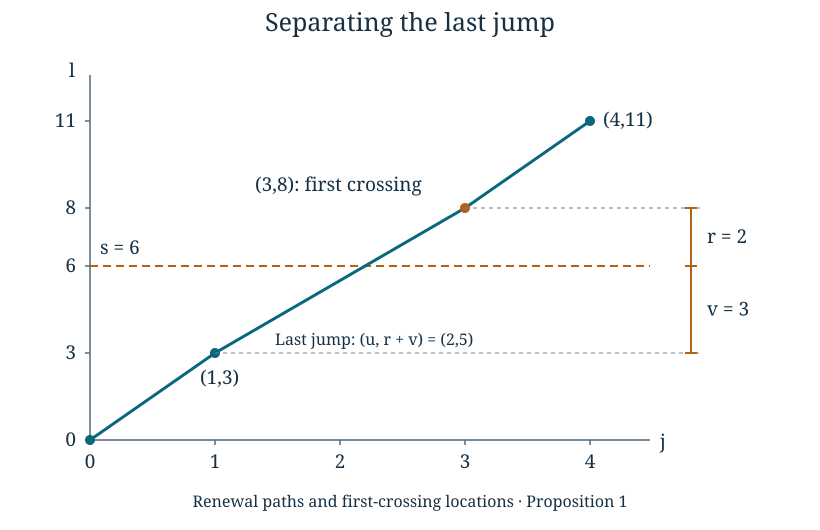

# Renewal paths and first-crossing locations

*Written by GPT-6 Astra, Ultra reasoning, in Codex, October 2026. Self-checked by the writing AI. Original exposition, proofs and exercises: CC0 1.0.*

A fixed-time estimate asks where a walk is after a prescribed number of increments. A first-crossing estimate asks where it is when it first passes a boundary. The number of increments is now random, and the last increment has been selected by the crossing condition. It cannot simply be treated as an unconditioned increment.

We will keep that last increment visible. Summing the earlier positions gives a renewal measure; joining it to the last increment gives an exact formula for the crossing law. For positive two-dimensional lattice increments with an exponential moment and the full-lattice support condition below, this formula gives two distinct scales. The excess height above the boundary has an exponential tail, uniformly in the height of the boundary. The horizontal location has a square-root-scale deviation bound, and each possible horizontal coordinate has probability at most a constant times \((1+s)^{-1/2}\) when the boundary has height \(s\).

The prerequisites are countable probability, elementary calculus, and [Local probabilities for lattice sums](NT-COLLATZ-07.md#local-bounds-with-decay-away-from-the-mean), especially Theorem 5. We also use the regrouping principle from [Pushforward measures and logarithmic sampling](NT-COLLATZ-03.md#counting-entire-fibres). The stopping decomposition develops the unused-tail argument in [Geometric waiting times and controlled conditioning](NT-COLLATZ-06.md#where-to-stop-so-that-the-tail-remains-independent). Basic references are Gallager's *Discrete Stochastic Processes*, Chapter 4, and Tao's *Almost all orbits of the Collatz map attain almost bounded values*, Section 7. The estimates and stopping identities used here have complete proofs below.

## A boundary crossed by positive increments

Let \(V=(J,L)\) take values in \(\mathbb Z_{>0}^2\), with law \(p(u,v)\). For independent copies \(V_1,V_2,\ldots\), put

\[
S_n=(X_n,Y_n)=V_1+\cdots+V_n,
\qquad S_0=(0,0).
\]

For an integer \(s\geq0\), define

\[
\tau_s=\min\{n\geq1:Y_n>s\},\qquad
Z_s=S_{\tau_s},\qquad O_s=Y_{\tau_s}-s.
\tag{1}
\]

The inequality is strict. A visit to height exactly \(s\) is not a crossing. Since each vertical increment is at least one,
\(1\leq\tau_s\leq s+1\) on every path. Thus these variables can be constructed on the finite product space of the first \(s+1\) increments; an infinite-product construction is not needed for any fixed threshold. The horizontal increments are also positive, so no lattice point can be visited twice.

Define the **renewal measure** at a lattice point by

\[
U(j,l)=\sum_{n=0}^{\infty}\mathbb P(S_n=(j,l)).
\tag{2}
\]

Set it to zero when either coordinate is negative. At height zero it is \(U(j,0)=\mathbf1_{j=0}\). At height \(l\geq1\), only \(1\leq n\leq l\) contribute. It is also the probability of ever visiting \((j,l)\), because the events in (2) are disjoint. Its total mass over all lattice points is infinite: each time contributes mass one. We will estimate its mass at a single point, not treat it as a probability law on the whole plane.

**Proposition 1 (Separate the last jump).** For integers \(s\geq0\), \(r\geq1\), and \(j\),

\[
\mathbb P(Z_s=(j,s+r))
=\sum_{u=1}^{\infty}\sum_{v=0}^{s}
p(u,r+v)\,U(j-u,s-v).
\tag{3}
\]

**Proof.** On a path counted on the left, write the last increment as \((u,r+v)\). The preceding height is then \(s-v\). It belongs to \([0,s]\), so \(0\leq v\leq s\), and the preceding position is \((j-u,s-v)\). Conversely, if \(S_n=(j-u,s-v)\) and \(V_{n+1}=(u,r+v)\), positivity of vertical increments puts all previous heights at most \(s\), while the next height is \(s+r>s\). Hence \(\tau_s=n+1\). These descriptions give disjoint events as \(n,u,v\) vary. Independence of the last increment and the preceding increments gives the product of their probabilities. Sum first in \(n\), using nonnegative regrouping, to obtain (3). ∎

*For this path, \(s=6\), \(j=3\), \(u=2\), \(v=3\), and \(r=2\). The last jump is \((u,r+v)=(2,5)\). Formula (3) sums over all possible preceding points and last jumps, with their actual probabilities; the picture is one exact path, not a probability approximation.*

## Summing a local estimate over renewal times

From now through the probability bounds, assume

\[
\mathbb E e^{b|V|}<\infty\quad\text{for some }b>0,
\qquad
\langle v-w:p(v)p(w)>0\rangle_{\mathbb Z}=\mathbb Z^2.
\tag{4}
\]

Write \(\mathbb EV=(\alpha,\beta)\) and \(\gamma=\alpha/\beta\). Both means are finite and at least one. A typical fixed-time point has coordinates near \((\alpha n,\beta n)\). Eliminating \(n\) suggests the line \(j=\gamma l\). The next result estimates deviations from this line after summing over every possible renewal time.

For \(h\geq1\) and real \(x\), put

\[
f_h(x)=\min\{x^2/h,|x|\}.
\tag{5}
\]

This function is even, increases with \(|x|\), and decreases as \(h\) increases. It is also 2-Lipschitz: on \(0\leq x\leq h\) its derivative is \(2x/h\), and on \(x\geq h\) its derivative is one. Splitting an interval at \(-h,0,h\), when needed, therefore proves
\(|f_h(x)-f_h(y)|\leq2|x-y|\).

**Lemma 2 (A sum of translated decay weights).** For \(c>0\), \(q\geq1\), \(h\geq1\), and \(z\in\mathbb R\),

\[
\sum_{n\in\mathbb Z}e^{-c f_h(z-qn)}\leq A_c\sqrt h,
\qquad
A_c=4\left(1+\frac2{\sqrt c}+\frac1{1-e^{-c}}\right).
\tag{6}
\]

**Proof.** For each integer \(m\geq0\), there are at most four points of the grid \(q\mathbb Z\) whose distance from \(z\) belongs to \([m,m+1)\). Each of the two intervals involved has length one, and grid points are separated by at least one; the bound four allows all endpoints. By monotonicity of \(f_h\), the sum is at most

\[
4\sum_{m=0}^{\infty}e^{-c f_h(m)}
\leq4\sum_{m=0}^{\infty}
\left(e^{-cm^2/h}+e^{-cm}\right).
\]

The exponential series sums to \((1-e^{-c})^{-1}\). The decreasing Gaussian series is at most
\(1+\int_0^\infty e^{-cx^2/h}\,dx\leq1+2\sqrt{h/c}\), using the elementary Gaussian integral bound proved in the preceding lesson. Since \(\sqrt h\geq1\), (6) follows. ∎

**Theorem 3 (The renewal measure near its mean line).** Under (4), there are constants \(C_1,c_1>0\), depending only on the increment law, such that

\[
U(j,s)\leq\frac{C_1}{\sqrt{1+s}}
e^{-c_1 f_{1+s}(j-\gamma s)}
\quad(j\in\mathbb Z,\ s\in\mathbb Z_{\geq0}).
\tag{7}
\]

**Proof.** At \(s=0\), the assertion follows from \(U(j,0)=\mathbf1_{j=0}\) by taking \(C_1\geq1\). Suppose \(s\geq1\), and set \(h=s+1\), \(D=j-\gamma s\). Only \(1\leq n\leq s\) contribute. The preceding lesson's two-dimensional local estimate supplies constants \(C_0,c_0>0\) with

\[
\mathbb P(S_n=(j,s))
\leq\frac{C_0}{n+1}e^{-c_0 f_n(R_n)},
\qquad R_n=\sqrt{(j-\alpha n)^2+(s-\beta n)^2}.
\tag{8}
\]

Let \(K=\sqrt{1+\gamma^2}\). The identity
\(D=(j-\alpha n)-\gamma(s-\beta n)\) gives
\(|D|\leq K R_n\). Since \(n\leq s<h\),

\[
f_n(R_n)\geq K^{-2} f_h(D),
\qquad f_n(R_n)\geq f_h(s-\beta n).
\tag{9}
\]

For the first inequality, both \(R_n^2/n\geq D^2/(K^2h)\) and \(R_n\geq|D|/K\geq|D|/K^2\); take their minimum. The second follows in the same way from \(R_n\geq|s-\beta n|\).

First sum over \(s/(2\beta)\leq n\leq2s/\beta\). Here
\((n+1)^{-1}\leq2\beta/s\leq4\beta/h\). A number at least each of two nonnegative quantities is at least half their sum, so (9) bounds this part of (8) by

\[
\frac{4\beta C_0}{h}
e^{-c_0 f_h(D)/(2K^2)}
\sum_{n\in\mathbb Z}e^{-(c_0/2)f_h(s-\beta n)}.
\]

Apply Lemma 2 with \(q=\beta\geq1\). The result is at most
\(4\beta C_0 A_{c_0/2}h^{-1/2}e^{-c_0 f_h(D)/(2K^2)}\).

For the remaining \(n\), either \(n<s/(2\beta)\) or \(n>2s/\beta\). In the first case \(|s-\beta n|>s/2\); in the second it exceeds \(s\). Using \(n\leq s\), both cases give
\(f_n(R_n)\geq s/4\). Together with the first inequality in (9), this gives

\[
\sum_{\text{remaining }n}\mathbb P(S_n=(j,s))
\leq C_0s\,e^{-c_0s/8}
e^{-c_0 f_h(D)/(2K^2)}.
\]

The coefficient is bounded by a constant times \(h^{-1/2}\). Explicitly,
\(s\sqrt{s+1}\leq\sqrt2s^{3/2}\), and elementary differentiation shows
\(\sup_{x\geq0}x^{3/2}e^{-c_0x/8}=(12/(c_0e))^{3/2}\).
Combining the two regions proves (7), with

\[
c_1=\frac{c_0}{2(1+\gamma^2)},\qquad
C_1=\max\left\{1,
C_0\left(4\beta A_{c_0/2}
+\sqrt2\left(\frac{12}{c_0e}\right)^{3/2}\right)\right\}.
\]

Empty regions contribute zero, so the proof also covers small \(s\). ∎

The fixed-time point bound was of order \(1/n\). Around height \(s\), the decay weight concentrates the sum on a window of order \(\sqrt s\) around \(s/\beta\). The resulting upper bound is of order \(1/\sqrt s\). The proof establishes this upper estimate without assuming a limit theorem or claiming an asymptotic formula.

## The overshoot and the transverse displacement

The exponential moment in (4) gives constants \(M,\eta>0\) with

\[
p(u,v)\leq M e^{-\eta(u+v)}\quad(u,v\geq1).
\tag{10}
\]

For example, take \(\eta=b/\sqrt2\) and \(M=\mathbb E e^{b|V|}\), since \(J+L\leq\sqrt2|V|\). The bound follows by retaining one atom of this expectation.

**Theorem 4 (A local first-crossing bound).** Under (4), there are constants \(C_2,c_2,\eta>0\) such that, for every \(s\geq0\), \(r\geq1\), and \(j\in\mathbb Z\),

\[
\mathbb P(Z_s=(j,s+r))
\leq\frac{C_2e^{-\eta r}}{\sqrt{1+s}}
e^{-c_2 f_{1+s}(j-\gamma s)}.
\tag{11}
\]

**Proof.** Substitute (7) and (10) into (3). Put \(h=s+1\), \(D=j-\gamma s\), and choose

\[
0<c_2\leq\min\left\{c_1,
\frac{\eta}{4\max\{1,\gamma\}}\right\}.
\]

For a term with last horizontal increment \(u\) and preceding deficit \(v\), the argument in (7) is \(D-u+\gamma v\), and its height parameter is \(h-v\). The monotonicity and Lipschitz properties of (5) give

\[
f_{h-v}(D-u+\gamma v)
\geq f_h(D)-2(u+\gamma v).
\]

Consequently the summand, excluding \(MC_1e^{-\eta r}\), is at most

\[
\frac{e^{-\eta(u+v)/2}}{\sqrt{h-v}}
e^{-c_2 f_h(D)}.
\tag{12}
\]

The sum over \(u\geq1\) is a fixed geometric series. Write \(\delta=\eta/2\) for the remaining sum over \(v\). For \(v\leq s/2\), one has \(h-v\geq h/2\), giving

\[
\sum_{0\leq v\leq s/2}
\frac{e^{-\delta v}}{\sqrt{h-v}}
\leq\frac{\sqrt2}{\sqrt h(1-e^{-\delta})}.
\]

For \(v>s/2\), the denominator is at least one, and the sum is at most
\(e^{-\delta s/2}/(1-e^{-\delta})\). To bound this by a constant times \(h^{-1/2}\), differentiate the logarithm of \(\sqrt{1+s}e^{-\delta s/2}\). Its derivative is \(1/(2(1+s))-\delta/2\), so its maximum is

\[
B_\delta=\begin{cases}
1,&\delta\geq1,\\
\delta^{-1/2}e^{(\delta-1)/2},&0<\delta<1.
\end{cases}
\]

The sum over \(u\geq1\) is \(e^{-\delta}/(1-e^{-\delta})\). Thus one may take
\(C_2=MC_1 e^{-\delta}(\sqrt2+B_\delta)/(1-e^{-\delta})^2\).
This includes \(s=0\), when the second region is empty, and proves (11). ∎

**Corollary 5 (Uniform overshoot and horizontal tails).** There are constants \(B,c>0\), independent of \(s\), such that for integers \(R\geq1\) and real \(t\geq0\),

\[
\mathbb P(O_s\geq R)\leq B e^{-\eta R},
\qquad
\mathbb P(|X_{\tau_s}-\gamma s|\geq t)
\leq B e^{-c f_{1+s}(t)}.
\tag{13}
\]

**Proof.** Sum (11) in \(j\), using Lemma 2 with grid spacing one. Its factor \(\sqrt{1+s}\) cancels the denominator. Summing \(e^{-\eta r}\) over \(r\geq R\) proves the first bound. For the second, sum first over \(r\geq1\). On the remaining set of \(j\), monotonicity gives

\[
e^{-c_2 f_h(j-\gamma s)}
\leq e^{-(c_2/2)f_h(t)}
e^{-(c_2/2)f_h(j-\gamma s)}.
\]

Apply Lemma 2 again. Enlarge a fixed constant to handle both estimates, and take \(c=c_2/2\). ∎

These are upper estimates, not a claim that crossing locations are uniformly distributed. They allow irregular point masses, including zero at inaccessible points. What they provide is a quantitative bound on individual locations and on the probability of large deviations from the mean line.

## Restarting after a random crossing

Fix a threshold \(s\). A **stopped word** is a finite sequence \(w=(v_1,\ldots,v_n)\) whose partial vertical sum first exceeds \(s\) at its last entry. The event that these are precisely the increments up to \(\tau_s\) has probability \(\prod_{i=1}^n p(v_i)\). If a further word \(z=(z_1,\ldots,z_m)\) is prescribed, independence gives

\[
\mathbb P(\text{stopped word }w,
V_{\tau_s+i}=z_i\ (1\leq i\leq m))
=\left(\prod_i p(v_i)\right)\left(\prod_i p(z_i)\right).
\tag{14}
\]

Summing over any collection of stopped words proves that the unused finite word has its original product law, independently of the stopped word and its endpoint. Countable regrouping is justified by nonnegative masses. Since \(\tau_s\leq s+1\), all variables in (14) can be realized on a fixed finite product space of length \(s+1+m\).

This proof does not assert that the crossing increment itself has its original law. It is part of the stopped word and was selected by the boundary condition. Independence begins with the next increment.

Let \(\nu_s(x)=\mathbb P(Z_s=x)\). For two integer thresholds \(s,t\geq0\), the exact restart rule is

\[
\nu_{s+t}(x)=\sum_{j\geq1}\sum_{r\geq1}\nu_s(j,s+r)
\begin{cases}
\mathbf1_{x=(j,s+r)},&r>t,\\
\nu_{t-r}(x-(j,s+r)),&r\leq t.
\end{cases}
\tag{15}
\]

Indeed, if the first crossing of \(s\) already exceeds \(s+t\), it is also the first crossing of that higher threshold. Otherwise the remaining vertical distance is \(t-r\), and (14) gives a fresh crossing law at that distance. When \(r=t\), the path is exactly on the higher boundary; another positive increment is needed. This is why equality belongs to the second branch. Formula (15) is the renewal version of composition of nested entrance maps from [First passage and transport across scales](NT-COLLATZ-04.md#nested-targets-compose-exactly). It keeps the overshoot instead of replacing the remaining distance by \(t\).

**Proposition 6 (Exact means at the crossing).** If the positive increment coordinates have finite means, then

\[
\mathbb EX_{\tau_s}=\alpha\mathbb E\tau_s,
\qquad
\mathbb EY_{\tau_s}=\beta\mathbb E\tau_s.
\tag{16}
\]

Under (4), these imply

\[
\mathbb E\tau_s=\frac{s+\mathbb EO_s}{\beta},
\qquad
\mathbb EX_{\tau_s}=\gamma(s+\mathbb EO_s),
\tag{17}
\]

where \(\mathbb EO_s\) is bounded uniformly in \(s\).

**Proof.** For example,
\(Y_{\tau_s}=\sum_{n=1}^{s+1}L_n\mathbf1_{\tau_s\geq n}\).
The event \(\{\tau_s\geq n\}\) says \(Y_{n-1}\leq s\), so it depends only on the preceding increments and is independent of \(L_n\). Taking expectations gives
\(\mathbb EY_{\tau_s}=\beta\sum_{n=1}^{s+1}\mathbb P(\tau_s\geq n)=\beta\mathbb E\tau_s\).
Replace \(L_n\) by \(J_n\) for the other coordinate. This is the bounded stopping-time form of Wald's identity. Substitution of \(Y_{\tau_s}=s+O_s\) gives (17). Finally, the pointwise identity \(O_s=\sum_{R\geq1}\mathbf1_{O_s\geq R}\) and the first bound in (13) give

\[
\mathbb EO_s\leq\frac{Be^{-\eta}}{1-e^{-\eta}}.
\]

All expectations are justified either by a finite sum or by nonnegative regrouping. ∎

## Marked geometric blocks as a renewal path

Return to the law \(H=(J,L)\) from the preceding lesson. Independent variables \(B_i\) have mass \(q(b)=(b-1)2^{-b}\), \(b\geq2\), and the value three is marked. A block consists of unmarked entries followed by one mark. A specified block \((b_1,\ldots,b_j,3)\) has mass \((1/4)\prod_i q(b_i)\), and its coordinate vector is \((j+1,3+\sum_i b_i)\).

For any prescribed finite list of such blocks, concatenation is a bijection onto the original increment words with those marked blocks. Its inverse cuts immediately after each three. The probability of the concatenated word is the product of the block probabilities. The block space has total mass one, so its finite products also have total mass one. Summing over the blocks that give specified coordinate vectors proves that successive holding vectors are independent copies of \(H\). The locations of the marked entries in the original path are exactly the partial sums of these vectors. The coordinate-vector map can forget the individual unmarked entries, but this regrouping sums every word in its fibre.

Tao uses this two-coordinate renewal description in Section 7 and credits Marek Biskup for the suggestion. [Proposition 6 of the preceding lesson](NT-COLLATZ-07.md#a-two-coordinate-holding-time-from-marked-waiting-times) proves that \(H\) satisfies (4), with mean \((4,16)\). Thus \(\gamma=1/4\), and (11) becomes

\[
\mathbb P(Z_s=(j,l))
\leq\frac{Ce^{-\eta(l-s)}}{\sqrt{1+s}}
\exp\left[-c\min\left\{
\frac{(j-s/4)^2}{1+s},|j-s/4|\right\}\right]
\quad(l>s).
\tag{18}
\]

This gives the first-passage-location estimate in Tao's argument: the exponential of the minimum is at most the sum of the corresponding Gaussian and exponential weights. The proof here has also shown how to sum the fixed-time estimates and how to absorb the shifts introduced by the final jump. Formula (17) explains the centre further: the expected horizontal position differs from \(s/4\) by the bounded quantity \(\mathbb EO_s/4\); it is not exactly \(s/4\).

The use of this bound in Fourier decay requires more geometry. One must identify which regions the renewal path should escape, and bound repeated visits to regions where cancellation fails. A first-crossing law supplies control of the exit location. It does not alone prove that the path meets enough cancelling frequencies. Those arithmetic and geometric estimates are the next part of the argument.

## Exercises

### 1. A first-crossing distribution computed in full

Let each increment be uniform on \(\{(1,1),(1,2),(2,2)\}\). Find the entire law of \(Z_2\), compute its two coordinate means, and check (16).

**Solution.** Name the three increments \(A,B,C\) in the order displayed. A crossing cannot occur at the first increment. Every two-letter word except \(AA\) crosses at its second increment, each with mass \(1/9\). After \(AA\), any third increment crosses, each such three-letter word having mass \(1/27\). Grouping their endpoints gives

\[
\begin{array}{c|ccccc}
Z_2&(2,3)&(3,3)&(2,4)&(3,4)&(4,4)\\\hline
\mathbb P&6/27&7/27&3/27&7/27&4/27.
\end{array}
\]

For instance \(AB,BA\) give \((2,3)\), whereas \(AC,CA,AAA\) give \((3,3)\). The probabilities sum to one. The coordinate means are \(76/27\) and \(95/27\). Also \(\mathbb E\tau_2=2(8/9)+3(1/9)=19/9\), while \((\alpha,\beta)=(4/3,5/3)\). Multiplying these means by \(19/9\) gives the two values just computed. The mean overshoot is \(41/27\), so the horizontal mean is \((4/5)(2+41/27)\), not \((4/5)2\).

### 2. The fibres of a marked-block sum

For the marked law in the last section, compute the probability that the first two holding vectors sum to \((3,8)\). Identify every possible pair and its original entry word.

**Solution.** Each holding vector has first coordinate at least one. Their first coordinates must therefore be \((1,2)\) or \((2,1)\). A first coordinate one forces the vector \((1,3)\); the other vector must be \((2,5)\), whose sole unmarked entry is two. The pairs are \(((1,3),(2,5))\) and its reverse. Their original words are \((3,2,3)\) and \((2,3,3)\). Each has probability \((1/4)(1/16)=1/64\), giving total \(1/32\). Passing to the sum loses the order; both preimages must be counted.

### 3. Equality at the second boundary

Take the deterministic increment \((1,2)\). Compute (15) for \((s,t)=(1,1)\) and \((1,2)\). Explain both why the case \(r=t\) must restart, and why convolution with a fresh law at threshold \(t\) is generally wrong.

**Solution.** Here \(Z_s=(k,2k)\), where \(k=\lfloor s/2\rfloor+1\). At threshold one the crossing is \((1,2)\), with overshoot \(r=1\). For \(t=1\), this is on the next boundary, not above it. Restarting at remaining threshold zero adds \((1,2)\), giving \(Z_2=(2,4)\). For \(t=2\), the remaining threshold is one, again giving \(Z_3=(2,4)\). Convolving instead with the law at threshold two would add \((2,4)\) and incorrectly give \((3,6)\). This deterministic law does not satisfy the full support hypothesis (4), but the exact stopping formula (15) requires only positive increments and independence, so it still applies.

### 4. A uniform exponential moment of the overshoot

Suppose \(\mathbb P(O_s\geq R)\leq B e^{-\eta R}\) for every integer \(R\geq1\), uniformly in \(s\). Prove directly that \(\mathbb E e^{\eta O_s/2}\leq1+B e^{-\eta/2}\).

**Solution.** For an integer \(k\geq0\) and \(a>1\),
\(a^k=1+(a-1)\sum_{R=1}^k a^{R-1}\).
Taking expectations and regrouping nonnegative terms yields

\[
\mathbb Ea^{O_s}
\leq1+B(a-1)\sum_{R=1}^{\infty}a^{R-1}e^{-\eta R}
=1+\frac{B(a-1)e^{-\eta}}{1-ae^{-\eta}}
\]

when \(a<e^\eta\). Set \(a=e^{\eta/2}\) and simplify the fraction to obtain the stated bound. The uniform exponential moment comes from the crossing estimate, not from treating the selected last jump as an independent increment.

## What carries forward

Renewal theory changes the time variable without discarding the path's coordinates. The renewal measure sums possible arrival times, the last-jump identity turns it into an exit law, and stopped-word factorization preserves the unused increments. The exponential moment controls overshoots; the two-dimensional local estimate controls the horizontal spread. These facts apply to every positive lattice law satisfying (4), and the marked geometric construction supplies one fully verified instance.

The next stage connects these probability estimates to arithmetic cancellation. There the exit location matters because different regions carry different Fourier phases. Keeping the stopping rule, the overshoot and both coordinates explicit is what lets the probabilistic argument interact with that geometry.

## References

- Robert G. Gallager, *Discrete Stochastic Processes*, [MIT OpenCourseWare, Chapter 4: Renewal Processes](https://ocw.mit.edu/courses/6-262-discrete-stochastic-processes-spring-2011/931ffa0940899c27f34b71ad64fd2bb0_MIT6_262S11_chap04.pdf), Section 4.1, Definition 4.5.1 and Theorem 4.5.1. The latter is Wald's equality; Proposition 6 proves the bounded stopping-time case used here.
- Terence Tao, *Almost all orbits of the Collatz map attain almost bounded values*, [arXiv:1909.03562v7](https://arxiv.org/abs/1909.03562v7), Section 7, the holding-time construction, basic-properties lemma, and first-passage-location lemma. Tao credits Marek Biskup for the renewal-process suggestion. Theorem 4 and (18) give the first-crossing estimate, not the later geometric encounter estimate or the full orbit-minimum theorem.
