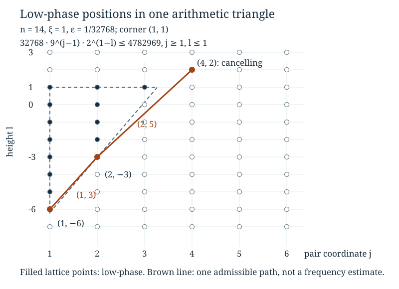

# Conditional cancellation and arithmetic phase geometry

*Written by GPT-6 Astra, Ultra reasoning, in Codex, October 2026. Self-checked by the writing AI. Original exposition, proofs, exercises and illustration: CC0 1.0.*

An average of complex numbers of modulus one can be small because their directions disagree. Taking absolute values before averaging destroys precisely that information. A useful alternative is to average a small part of the randomness first, keeping the rest fixed. Sometimes this small conditional average can be calculated exactly. The remaining question then becomes a problem about how often a random path reaches positions where the calculation gives a definite loss.

We develop this method for random affine sums on a finite cyclic group. Pairing two waiting times produces an exact cosine factor. The positions where this factor is close to one form separated triangular sets of lattice points. We prove that arithmetic geometry in full, including the boundary and separation estimates. It explains why the renewal paths from the preceding lessons are relevant to a Fourier coefficient rather than merely an unrelated probability model.

The prerequisites are complex exponentials, finite cyclic groups, conditional probabilities on countable sets, and elementary logarithms. [Quotient distributions and Fourier mixing](NT-COLLATZ-05.md#why-random-affine-sums-lead-to-this-estimate) introduces the affine sum and explains which Fourier estimates matter for mixing. [Renewal paths and first-crossing locations](NT-COLLATZ-08.md#marked-geometric-blocks-as-a-renewal-path) proves the independence of the marked blocks used at the end. Basic references are Keith Conrad's *Characters of finite abelian groups*, Section 4, and Terence Tao's *Almost all orbits of the Collatz map attain almost bounded values*, Section 7. The pairing and triangle mechanism here is Tao's; the exposition and all arguments needed below are supplied independently.

## Characters on fractions with powers of two as denominators

Fix an integer \(n\geq2\), put \(Q=3^n\), and choose an integer \(\xi\) not divisible by three. Let

\[
D=\mathbb Z[1/2]=\{a/2^k:a\in\mathbb Z,\ k\geq0\}.
\]

The integer \(u=(Q+1)/2\) satisfies \(2u\equiv1\pmod Q\). Thus

\[
\rho:D\longrightarrow\mathbb Z/Q\mathbb Z,
\qquad \rho(a/2^k)=au^k\pmod{Q}
\tag{1}
\]

is well defined. Indeed, equality of two fractions gives \(a2^h=b2^k\); multiplication by the inverse of \(2^{k+h}\) modulo \(Q\) gives \(au^k=bu^h\). Using a common denominator proves that \(\rho\) preserves addition and multiplication. It is onto because it includes the reduction of every integer. Its kernel is \(QD\): since \(u\) is a unit, \(au^k=0\pmod Q\) holds exactly when \(Q\mid a\). Two fractions have the same image exactly when their difference lies in this kernel.

Define the additive character

\[
\chi(x)=\exp\bigl(-2\pi i\xi\rho(x)/Q\bigr),\qquad x\in D.
\tag{2}
\]

Changing the representative of \(\rho(x)\) does not change this expression. Addition in \(D\) becomes multiplication of character values. Because \(\xi\) is a unit modulo \(Q\), the kernel of \(\chi\) is again \(QD\); its image consists of all \(Q\)-th roots of unity. This identifies exactly what the character forgets. It does not replace a rational number by its usual real fractional part.

For example, modulo nine the image of \(1/2\) is five, not the real number \(1/2\). For \(\xi=1\), its character is \(\exp(-2\pi i5/9)\). Negative powers of two below always have the meaning (1) when used in a residue or character.

## Pairing waiting times before taking absolute values

Let \(A_1,\ldots,A_n\) be independent positive integers with
\(\mathbb P(A_i=a)=2^{-a}\). Write \(S_i=A_1+\cdots+A_i\), and consider

\[
X_n=\sum_{i=1}^n3^{i-1}2^{-S_i}\in D,
\qquad F_n(\xi)=\mathbb E\chi(X_n).
\tag{3}
\]

The law of \(\rho(X_n)\) is the independent-word offset model of the Fourier lesson. There the deterministic orbit expansion has its exponents in the opposite order. Reversing a length-\(n\) word is a bijection, its own inverse, and preserves its probability \(2^{-S_n}\). This proves equality of the two *random* offset laws. It is not a claim that a particular integer orbit has independent exponents.

Put \(m=\lfloor n/2\rfloor\), \(B_j=A_{2j-1}+A_{2j}\), and \(T_j=B_1+\cdots+B_j\). The variables \(B_j\) are independent, with

\[
q(b)=\mathbb P(B_j=b)=(b-1)2^{-b},\qquad b\geq2.
\tag{4}
\]

There are \(b-1\) positive pairs with sum \(b\), and each has probability \(2^{-b}\). Consequently, given \(B_j=b\), the variable \(A_{2j}\) is uniform on \(\{1,\ldots,b-1\}\). Given *all* the \(B_j\), these within-pair choices remain independent: the probability of specified choices divided by \(\prod_jq(b_j)\) is \(\prod_j1/(b_j-1)\). If \(n\) is odd, \(A_n\) is independent of all these choices and sums.

For \(x\in D\) and \(b\geq2\), define

\[
f(x,b)=\frac1{b-1}\sum_{r=1}^{b-1}\chi\bigl(x(2^r+3)\bigr),
\qquad g(x)=\sum_{a\geq1}2^{-a}\chi(x2^{-a}).
\tag{5}
\]

Both have modulus at most one. The series for \(g\) is absolutely convergent. Pairing the terms in (3) gives the exact rational identity

\[
X_n=\sum_{j=1}^m3^{2j-2}2^{-T_j}(2^{A_{2j}}+3)
+\begin{cases}
0,&n=2m,\\
3^{n-1}2^{-T_m-A_n},&n=2m+1.
\end{cases}
\tag{6}
\]

For each pair, factor \(3^{2j-2}2^{-T_j}\) out of its two summands; the first then contributes \(2^{A_{2j}}\), and the second contributes three. This proves (6) without changing coordinates or discarding an endpoint.

**Proposition 1 (Conditional product).** Set \(x_j=3^{2j-2}2^{-T_j}\). Then

\[
F_n(\xi)=
\begin{cases}
\mathbb E\displaystyle\prod_{j=1}^m f(x_j,B_j),&n=2m,\\
\mathbb E\left[\displaystyle\prod_{j=1}^m f(x_j,B_j)
\,g(3^{n-1}2^{-T_m})\right],&n=2m+1.
\end{cases}
\tag{7}
\]

In particular,

\[
|F_n(\xi)|\leq\mathbb E\prod_{j=1}^m|f(x_j,B_j)|.
\tag{8}
\]

**Proof.** Condition on the vector of sums \((B_1,\ldots,B_m)\). Formula (6) and the character identity turn the exponential of a sum into a product. The conditional independence proved above factors its average into the factors (5). In the odd case the final variable gives the indicated \(g\), which is still *inside* the outer expectation: its argument depends on \(T_m\). Taking the outer expectation proves (7). The triangle inequality and \(|g|\leq1\) prove (8). All regroupings are of absolutely summable terms, since the absolute values are bounded by the underlying probability masses. ∎

The order of operations matters. Replacing every original character in (3) by its modulus would give only \(|F_n(\xi)|\leq1\). The conditional average retains disagreement between the directions arising from different splits of the same sum.

## A phase that measures the cancellation

For every \((j,l)\in\{1,\ldots,m\}\times\mathbb Z\), let \(\theta(j,l)\) be the unique number in \((-1/2,1/2]\) congruent modulo one to

\[
\frac{\xi\,\rho(3^{2j-2}2^{1-l})}{Q}.
\tag{9}
\]

Here congruence modulo one means equality after adding an integer. Thus
\(\chi(3^{2j-2}2^{1-l})=\exp(-2\pi i\theta(j,l))\).
The coordinate \(j\) records a pair number; \(l\) will record the total waiting time \(T_j\). The sign and the factor \(2^{1-l}\) are part of the definition.

When \(b=3\), the two splits are \((1,2)\) and \((2,1)\), so

\[
f(x,3)=\frac{\chi(5x)+\chi(7x)}2
=\frac{\chi(5x)}2\bigl(1+\chi(2x)\bigr).
\]

The elementary identity \(|1+e^{-2\pi it}|/2=|\cos(\pi t)|\) now gives

\[
|f(3^{2j-2}2^{-l},3)|=\cos(\pi\theta(j,l)).
\tag{10}
\]

The cosine is nonnegative on the specified interval. For \(|t|\leq1/2\), concavity of sine on \([0,\pi/2]\) gives \(\sin(\pi|t|/2)\geq|t|\). For completeness, the concavity follows from the nonpositive second derivative, and the chord joining the two endpoints has value \(2u/\pi\) at \(u\). Therefore

\[
\cos(\pi t)=1-2\sin^2(\pi t/2)
\leq1-2t^2\leq e^{-2t^2}.
\tag{11}
\]

Fix \(0<\varepsilon\leq e^{-10}\). Call a lattice position **low-phase** when \(|\theta(j,l)|\leq\varepsilon\), and **cancelling** otherwise. These are the black and white sets, respectively, in Tao's terminology. Define

\[
N_m=\#\{j\leq m:B_j=3,\ |\theta(j,T_j)|>\varepsilon\}.
\]

**Corollary 2 (An occupation bound for the Fourier coefficient).**

\[
|F_n(\xi)|\leq\mathbb E e^{-2\varepsilon^2N_m}
\leq\mathbb E e^{-\varepsilon^3N_m}.
\tag{12}
\]

**Proof.** At each counted position, (10)–(11) bound its factor in (8) by \(e^{-2\varepsilon^2}\). All other factors are at most one. Multiply these bounds for each realised vector of sums and then average. Since \(2\varepsilon^2\geq\varepsilon^3\), the second inequality follows. ∎

This is an upper bound, not an equality: cancellation between different vectors of pair sums may reduce the original coefficient further. The nonnegative expectation is useful because it records how rarely the path can avoid many definite losses. A large mean of \(N_m\) alone does not bound this expectation; Exercise 4 explains why.

## Small phases can be lifted from the circle to the real line

The arithmetic in (9) implies

\[
\theta(j+1,l)\equiv9\theta(j,l),\qquad
\theta(j,l-1)\equiv2\theta(j,l)\pmod{1}.
\tag{13}
\]

These are congruences, not unconditional real equalities. When the indicated real multiple has absolute value less than \(1/2\), it is already the centred representative and equality does hold. For nonnegative integers \(a,b\), whenever the positions lie in the strip,

\[
\theta(j+a,l-b)\equiv9^a2^b\theta(j,l)\pmod{1}.
\tag{14}
\]

There is also a uniform lower bound at each column. The phase at column \(j\) has reduced denominator
\(3^{n-2j+2}\): its numerator is a product of units modulo that power of three. Hence it is nonzero, and

\[
|\theta(j,l)|\geq3^{-(n-2j+2)}.
\tag{15}
\]

In particular a low-phase point satisfies

\[
j\leq\frac n2+1-\frac{\log(1/\varepsilon)}{2\log3}
\leq\frac n2-\frac1{10}\log(1/\varepsilon).
\tag{16}
\]

For the last inequality, put \(L=\log(1/\varepsilon)\geq10\). Since \(\log3<2\),
\(L(1/(2\log3)-1/10)>3L/20\geq3/2>1\).
There is thus an entire terminal strip of cancelling positions, uniformly in \(\xi\).

To control the other boundaries, call a point **small** when its phase has absolute value at most \(h=1/100\). Every low-phase point is small. We need three elementary rules.

**Lemma 3 (Local lifting rules).** Provided all stated positions are in the strip:

1. A small point whose right or lower neighbour is low-phase is itself low-phase.
2. If the right and lower neighbours of a point are small, that point is small.
3. If the left and lower neighbours of a point are small, that point is small.

**Proof.** Write \(u=\theta(j,l)\). For rule 1, \(|u|\leq h\) makes both \(9u\) and \(2u\) lie strictly between \(-1/2\) and \(1/2\). The corresponding equation in (13) is real equality. A low-phase neighbour therefore gives \(|u|\leq\varepsilon/9\) or \(\varepsilon/2\).

For rule 2, write \(v=\theta(j+1,l)\), \(w=\theta(j,l-1)\). Equations (13) give \(u\equiv v-4w\pmod1\). Since \(|v-4w|\leq5h<1/2\), this is real equality, and \(|u|\leq5h\). Now \(|2u|\leq10h<1/2\), so \(w=2u\), giving \(|u|\leq h/2\).

For rule 3, the small left neighbour gives \(|u|\leq9h\), with real equality in the multiplication by nine. Since \(|2u|\leq18h<1/2\), the small lower neighbour is again exactly \(2u\); thus \(|u|\leq h/2\). ∎

These rules justify propagation of *smallness*, not just an informal picture of nearby angles. Multiplication on the circle can otherwise return a large phase to a small one. That possibility is exactly why a separation proof is needed.

## The low-phase set consists of separated triangles

For an integer corner \((j_0,l_0)\), \(j_0\geq1\), and a real size \(s\geq0\), define a finite set of lattice points

\[
\begin{aligned}
\Delta(j_0,l_0,s)=\{(j,l)\in\mathbb Z^2:\;&j\geq j_0,\ l\leq l_0,\\
&(j-j_0)\log9+(l_0-l)\log2\leq s\}.
\end{aligned}
\tag{17}
\]

Only integer points belong to this set; the triangle in the plane is a useful outline. Its diagonal has upward slope \(\log9/\log2\). Let \(R=\tfrac1{10}\log(1/\varepsilon)\), so \(R\geq1\).

**Theorem 4 (Arithmetic separation).** The low-phase set in \(\{1,\ldots,m\}\times\mathbb Z\) is a disjoint union of sets (17). Each is contained in the strip (16). Any low-phase point outside one of these triangles has Euclidean distance greater than \(R\) from it. In particular, distinct triangles are separated by distance at least \(R\).

*Reference:* Tao, Section 7, the structure lemma for the black set. We give explicit smallness choices and prove the boundary propagation below.

**Proof.** We first construct a corner, then prove a buffer around its triangle, and finally verify that different starting points give a partition.

**Constructing the corner.** Start at a low-phase point \((j,l)\). Move upward through consecutive low-phase points in that column, stopping at the last one, say \((j,l_0)\). Such a last point exists. Otherwise (13), with \(2\varepsilon<1/2\), would imply
\(\theta(j,l+k)=2^{-k}\theta(j,l)\) for every \(k\geq0\), contradicting the positive lower bound (15).

Next move left through consecutive low-phase points in row \(l_0\), stopping at \((j_0,l_0)\). This stops at column one or immediately to the right of a point that is not low-phase. Set

\[
t_0=\theta(j_0,l_0),\qquad
s=\log\frac{\varepsilon}{|t_0|}.
\tag{18}
\]

The number \(t_0\) is nonzero by (15), and \(s\geq0\). Along the traversed horizontal and vertical segments, (13) gives real equalities, since \(9\varepsilon<1/2\). Therefore
\(\theta(j,l)=9^{j-j_0}2^{l_0-l}t_0\). Its absolute value is at most \(\varepsilon\), so the starting point belongs to \(\Delta=\Delta(j_0,l_0,s)\).

Every point of \(\Delta\) is low-phase. Indeed, the multiple of \(t_0\) in (14) then has absolute value at most \(\varepsilon\), so there is no reduction across \(1/2\). To check that the whole defined triangle is inside the original strip, (15) at the corner gives

\[
j_0+\frac{s}{\log9}
\leq\frac n2+1-\frac{\log(1/\varepsilon)}{2\log3}
\leq\frac n2-R.
\tag{19}
\]

The horizontal extent of (17) is no larger than the left-hand side. Thus the phase identities used on \(\Delta\) have their required domains.

**Two boundary barriers.** The point immediately above the corner, \((j_0,l_0+1)\), is not even small. Suppose it were small. The row below it, from column \(j_0\) to column \(j\), is low-phase by construction. Repeated use of rule 3 propagates smallness along the row above to \((j,l_0+1)\). Rule 1, using its low-phase lower neighbour \((j,l_0)\), would make this point low-phase, contrary to the stopping choice of \(l_0\). If \(j_0>1\), the point \((j_0-1,l_0)\) is likewise not small: rule 1 and its low-phase right neighbour would contradict the choice of \(j_0\).

**The buffer.** Let \((p,q)\) be a point in the original strip, outside \(\Delta\), at Euclidean distance at most \(R\) from some point of \(\Delta\). Coordinate differences between these two points are at most \(R\). We will prove that \((p,q)\) cannot be low-phase. The common numerical bound used in all cases is

\[
\varepsilon\,18^R
=\exp\left[-\left(1-\frac{\log18}{10}\right)\log(1/\varepsilon)\right]
\leq18e^{-10}<h.
\tag{20}
\]

If \(p\geq j_0\) and \(q\leq l_0\), being outside the triangle and near it gives

\[
s<(p-j_0)\log9+(l_0-q)\log2
\leq s+R\log18.
\]

The real multiple \(9^{p-j_0}2^{l_0-q}t_0\) has absolute value strictly greater than \(\varepsilon\), but at most \(\varepsilon18^R<h\). It is already the centred phase at \((p,q)\). This point is not low-phase.

Suppose instead that \(p\geq j_0\), \(q>l_0\), and that \((p,q)\) were low-phase. Proximity implies

\[
q-l_0\leq R,\qquad
(p-j_0)\log9\leq s+R\log9.
\]

Multiplication by \(2^{q-l_0-1}\) makes \((p,l_0+1)\) small, by (20). Every point \((r,l_0)\), \(j_0\leq r\leq p\), is also small: its phase has absolute value at most
\(\varepsilon e^{-s}9^{r-j_0}\leq\varepsilon9^R<h\), with no wrap on the circle. Starting at \((p,l_0+1)\), apply rule 2 successively to the left, using this lower row. It makes \((j_0,l_0+1)\) small, contradicting the upper boundary barrier.

It remains to consider \(p<j_0\). Then \(j_0>1\), and proximity gives

\[
j_0-p\leq R,\qquad
(l_0-q)\log2\leq s+R\log2,
\qquad q-l_0\leq R.
\]

If \((p,q)\) were low-phase, multiplying its phase by \(9^{j_0-1-p}\) would make \((j_0-1,q)\) small. If \(q\geq l_0\), multiplication by \(2^{q-l_0}\) would also make \((j_0-1,l_0)\) small, since the total factor is at most \(18^R\). This contradicts the left boundary barrier.

If \(q<l_0\), each point \((j_0,u)\) with \(q+1\leq u\leq l_0\) is small, because its phase has absolute value at most
\(\varepsilon e^{-s}2^{l_0-u}\leq\varepsilon2^R<h\).
Starting from the small point \((j_0-1,q)\), rule 2 now propagates smallness upward in column \(j_0-1\), using this right column. It again reaches the forbidden point \((j_0-1,l_0)\). This exhausts all positions outside the triangle and proves the buffer assertion.

**Partition and uniqueness.** Every low-phase point was shown to lie in its constructed triangle. Conversely, start at any point of that triangle. Moving upward inside it reaches row \(l_0\), and moving left in that row reaches column \(j_0\). The next upward point is outside the triangle at distance one; the next left point, if in the strip, has the same property. The buffer and \(R\geq1\) make both non-low-phase. Thus the corner procedure returns exactly \((j_0,l_0)\) from every point of this triangle. Two constructed triangles that intersect must therefore have the same corner and, by (18), the same size. They coincide. Distinct ones are disjoint, and the buffer separates all their points as claimed. ∎

*Here \(n=14\), \(\xi=1\), and \(\varepsilon=1/32768\). The corner is \((1,1)\), with \(t_0=1/4782969\). The filled points satisfy the exact integer inequality \(32768\,9^{j-1}2^{1-l}\leq4782969\), with \(j\geq1\), \(l\leq1\). The dashed outline is the real triangle; its interior is not itself a set of additional states. The displayed path has increments \((1,3)\) and \((2,5)\), both supported by the marked holding-time law. It is one possible path, not a typical trajectory or a proof of an encounter frequency.*

There are two distinct conclusions here. Formula (16) gives a terminal region with no low phases. The buffer controls travel between low-phase triangles earlier in the strip. Neither says that all earlier positions cancel, and neither treats a random jump as a continuous path through every intervening lattice point.

## From pair indices to a renewal occupation count

Continue the independent sequence \(B_1,B_2,\ldots\) with law (4), marking each occurrence of three. The probability of a mark is \(q(3)=1/4\). With probability one there are arbitrarily many marks: for each fixed index \(k\), the probability of no mark among the next \(r\) entries is \((3/4)^r\), which tends to zero; the union of these zero-probability events over \(k\) still has probability zero.

Let \((J_r,L_r)\) be the number of entries and the sum of entries in the \(r\)-th block ending at a mark. Set

\[
(U_r,V_r)=\sum_{i=1}^r(J_i,L_i).
\]

Cutting an entry word immediately after each mark is inverse to concatenating its marked blocks. The [marked-block argument in the preceding lesson](NT-COLLATZ-08.md#marked-geometric-blocks-as-a-renewal-path) proves that these vectors are independent copies of the holding-time law, including all fibres of the map from words to vectors. The marked positions are exactly \((U_r,V_r)\). Therefore, with \(W\) denoting the cancelling positions,

\[
N_m=\sum_{r\geq1}\mathbf1_{\{U_r\leq m\}}
\mathbf1_W(U_r,V_r).
\tag{21}
\]

The sum has at most \(m\) nonzero terms, because \(J_r\geq1\). This is an exact change of the count's clock, not a new assumption about independent visits to \(W\). The visits are generally dependent.

[Local probabilities for lattice sums, Proposition 6](NT-COLLATZ-07.md#a-two-coordinate-holding-time-from-marked-waiting-times) proves \(\mathbb E(J_r,L_r)=(4,16)\). Its mean direction thus has slope four, whereas the triangle diagonal has slope \(\log9/\log2<4\), since \(9<16\). The [first-crossing estimate](NT-COLLATZ-08.md#the-overshoot-and-the-transverse-displacement) controls where a path passes a horizontal boundary. Together with Theorem 4, these are the ingredients for estimating losses after leaving low-phase regions. The slope comparison explains the geometry, but is not by itself an estimate on the random occupation count.

More precisely, for any \(\lambda>0\) and integer \(K\geq0\), splitting according to \(N_m\leq K\) gives

\[
\mathbb E e^{-\lambda N_m}
\leq\mathbb P(N_m\leq K)+e^{-\lambda K}.
\tag{22}
\]

Thus a Fourier-decay proof needs control of paths with *few* cancelling encounters. Tao's remaining renewal argument supplies quantitative control of this kind. Its repeated-encounter estimates are the next mathematical step, not a consequence of the number of triangles or the mean slope alone. Equations (12) and (21) specify exactly the nonnegative quantity that those estimates must bound.

## Exercises

### 1. A character on dyadic fractions

For \(Q=27\) and \(\xi=2\), compute \(\rho(1/4)\) and \(\rho(7/8)\). Decide whether the two character values agree. Describe the full fibre of \(\rho\) containing \(1/4\).

**Solution.** The inverse of two is fourteen. The inverse of four is seven, and the inverse of eight is seventeen. Hence \(\rho(1/4)=7\) and \(\rho(7/8)=7\cdot17=11\pmod{27}\). The characters are \(e^{-2\pi i14/27}\) and \(e^{-2\pi i22/27}\), which are distinct. The fibre is \(1/4+27D\), by the kernel calculation following (1). This is a coset of an additive subgroup of dyadic rationals, not a real interval.

### 2. One pair and its exact conditional average

Take \(n=2\), \(\xi=1\), and condition on \(B_1=3\). Find the two residues of \(X_2\) modulo nine and their probabilities. Compute the modulus of this conditional character average and compare it with (10).

**Solution.** Formula (6) gives \(X_2=(2^{A_2}+3)/8\). The inverse of eight modulo nine is eight. For \(A_2=1\) the residue is \(5\cdot8=4\pmod9\); for \(A_2=2\) it is \(7\cdot8=2\pmod9\). Each conditional probability is \(1/2\). The character average is \((e^{-2\pi i4/9}+e^{-2\pi i2/9})/2\), of modulus \(\cos(2\pi/9)\). On the other hand, \(\theta(1,3)\) is the centred residue fraction of \(2^{-2}\), namely \(-2/9\), since the inverse of four modulo nine is seven. Equation (10) gives the same value. The event being conditioned on has probability \(1/4\); its contribution to the *unconditional* average includes that factor.

### 3. All lattice points of a concrete triangle

For the figure's parameters, prove that \((1,1)\) is a corner and list every point in its triangle. Show that the displayed path first leaves it at \((4,2)\).

**Solution.** At \((1,1)\) the phase is \(1/Q\), with \(Q=4782969\), which is less than \(1/32768\). At \((1,2)\), the residue fraction is \((Q+1)/(2Q)\); its centred representative is \(-(Q-1)/(2Q)\), so it is not low-phase. The column is already the left boundary. The corner and size therefore are \((1,1)\) and \(s=\log(Q/32768)\). Here \(128<Q/32768<256\), \(16<Q/(9\cdot32768)<32\), and \(1<Q/(81\cdot32768)<2\). Consequently the points are

\[
\{(1,l):-6\leq l\leq1\}
\ \cup\ \{(2,l):-3\leq l\leq1\}
\ \cup\ \{(3,1)\}.
\]

There are fourteen. No column \(j\geq4\) contributes, because \(729>Q/32768\). The path starts at \((1,-6)\), moves by \((1,3)\) to \((2,-3)\), then by \((2,5)\) to \((4,2)\). Its first two positions belong to the list and its third does not. The third phase is also cancelling: reducing the inverse of two modulo \(3^8\) gives \(\theta(4,2)=-(3^8-1)/(2\cdot3^8)=-3280/6561\), whose absolute value exceeds \(1/32768\). Thus this exit produces an actual cancelling position, not just departure from a chosen drawing.

### 4. Why an expected number of visits is insufficient

Construct nonnegative integer random variables \(Z_m\) with \(\mathbb EZ_m\to\infty\), but \(\mathbb E e^{-\lambda Z_m}\not\to0\) for every fixed \(\lambda>0\). For comparison, show that independent Bernoulli visits with common success probability \(p>0\) give an exponentially decaying expectation.

**Solution.** Let \(Z_m\) equal zero and \(2m\), each with probability \(1/2\). Its mean is \(m\), but
\(\mathbb E e^{-\lambda Z_m}=(1+e^{-2\lambda m})/2\to1/2\).
If instead \(Z_m=I_1+\cdots+I_m\), with independent Bernoulli variables of parameter \(p\), then independence gives

\[
\mathbb E e^{-\lambda Z_m}
=(1-p+pe^{-\lambda})^m
\leq\exp[-mp(1-e^{-\lambda})].
\]

The last inequality is \(1-x\leq e^{-x}\). The renewal indicators in (21) do not have this independence, so the comparison identifies a useful mechanism but does not prove the required estimate for them.

## What carries forward

Conditional cancellation converts a complex average into a nonnegative occupation estimate while retaining a precisely defined phase. Arithmetic lifting then shows that the exceptional positions have a rigid geometry: finite triangular pieces, a definite buffer between pieces, and a terminal strip free of them. The marked-block map identifies the count with visits of the same two-coordinate renewal process whose first-crossing law was already proved.

This places the argument at the intersection of harmonic analysis, conditional probability and renewal theory. The next task is quantitative: combine exit-location bounds and triangle separation to control paths with too few cancelling visits, and then combine Fourier decay with the arithmetic separation of prefixes in the mixing estimate. The exact reductions here explain both what those estimates accomplish and why a finite orbit calculation cannot replace them.

## References

- Terence Tao, *Almost all orbits of the Collatz map attain almost bounded values*, [arXiv:1909.03562v7](https://arxiv.org/abs/1909.03562v7), Section 7, the paired conditional average, cancellation lemma, structure lemma for the black set, and holding-time formulation. The renewal-process suggestion is credited there to Marek Biskup. Theorem 4 supplies the arithmetic structure result; the later repeated-encounter estimate is a separate theorem.
- Keith Conrad, *Characters of finite abelian groups (short version)*, [author-hosted notes](https://kconrad.math.uconn.edu/blurbs/grouptheory/charthyshort.pdf), Section 4. The preceding Fourier lesson proves the transform identities used to interpret (3); equations (1)–(2) give the dyadic character directly.
