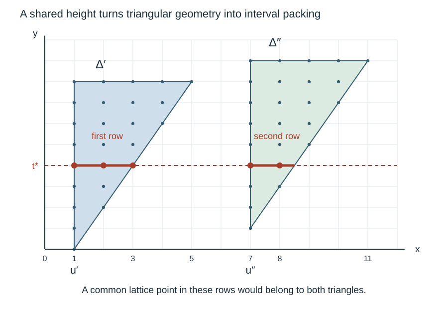

# Renewal encounters with separated regions

*Written by GPT-6 Astra, Ultra reasoning, in Codex, October 2026. Self-checked by the writing AI. Original exposition, proofs, exercises and illustration: CC0 1.0.*

A path can spend a long time inside a region where an estimate gives no improvement. Separation between such regions helps, but a path with jumps need not visit the points between them. The useful question is probabilistic: when the path leaves one region, how likely is it to land outside all of them? A second question is just as important: can it then enter another very large region and remain there?

This lesson answers both questions for the triangular regions and renewal law developed in the preceding lessons. The main conclusion is a finite-horizon encounter theorem. After crossing a sufficiently deep triangle, the path encounters more than any prescribed number of cancelling positions within a fixed number of further renewal steps, with any prescribed high probability. The number of steps may be very large, but it does not depend on the original modulus or starting position. This uniformity is what the later Fourier-decay argument needs.

The exact prerequisites are [the local first-crossing estimate and its tail bounds](NT-COLLATZ-08.md#the-overshoot-and-the-transverse-displacement), [independence after a stopped word](NT-COLLATZ-08.md#restarting-after-a-random-crossing), and [the separated-triangle theorem](NT-COLLATZ-09.md#the-low-phase-set-consists-of-separated-triangles). The basic research reference is Terence Tao's *Almost all orbits of the Collatz map attain almost bounded values*, Section 7. Robert Gallager's *Discrete Stochastic Processes*, Chapter 4, provides the broader renewal and stopping-time setting. Every additional estimate used here is proved below. The argument combines geometry, point-probability bounds and stopping; it does not assume that successive visits to a set are independent.

## The path and the regions it must cross

Let \(H_i=(J_i,L_i)\) be independent copies of the marked holding time from [Local probabilities for lattice sums](NT-COLLATZ-07.md#a-two-coordinate-holding-time-from-marked-waiting-times). Recall its concrete definition. Read independent entries of mass \((b-1)2^{-b}\), \(b\geq2\), up to and including the next three. The vector records the number of entries and their sum. Thus

\[
J_i\geq1,\quad L_i\geq2J_i+1,\quad
\mathbb E(J_i,L_i)=(4,16),\quad \gamma=\frac14.
\]

For some fixed \(\eta>0\), this law has a finite moment
\(M_\eta=\mathbb E e^{\eta(J_i+L_i)}\). One available choice is \(\eta=\log(33/32)\); its moment is evaluated in the cited holding-time proof.

Write \((X_k,Y_k)=\sum_{i=1}^kH_i\), with \((X_0,Y_0)=(0,0)\). For an integer \(s\geq0\), let

\[
\tau_s=\min\{k\geq1:Y_k>s\},\qquad O_s=Y_{\tau_s}-s.
\]

In particular \(\tau_s\leq s+1\). Put \(f_h(u)=\min(u^2/h,|u|)\) for \(h\geq1\). The preceding first-crossing theorem and its corollary give fixed positive constants such that

\[
\mathbb P(X_{\tau_s}=x,O_s=r)
\leq\frac{C_0e^{-\eta_0r}}{\sqrt{1+s}}
e^{-c_0 f_{1+s}(x-\gamma s)},\qquad r\geq1,
\tag{1}
\]

\[
\begin{aligned}
\mathbb P(O_s>v)&\leq C_1e^{-\eta_0v},\\
\mathbb P(|X_{\tau_s}-\gamma s|>u)&\leq C_1e^{-c_1f_{1+s}(u)}.
\end{aligned}
\tag{2}
\]

Enlarging constants covers real \(v,u\geq0\). Summing (1) over \(r\) gives the corresponding horizontal point bound. These are exact upper estimates, not a uniform or Gaussian law for the exit.

Let \(a=\log9\), \(b=\log2\), and fix an integer strip width \(M\geq1\). Consider a family of disjoint lattice triangles

\[
\Delta=\{(x,y)\in\mathbb Z^2:x\geq u_\Delta,\ y\leq t_\Delta,
a(x-u_\Delta)+b(t_\Delta-y)\leq S_\Delta\},
\tag{3}
\]

where \(u_\Delta\geq1\) and \(t_\Delta\) are integers, and \(S_\Delta\geq0\). Assume that their lattice sets are separated by Euclidean distance greater than \(R\), and that their real right vertices satisfy

\[
u_\Delta+S_\Delta/a\leq M-R.
\tag{4}
\]

Let \(B\) be their union and \(W=(\{1,\ldots,M\}\times\mathbb Z)\setminus B\). Points in \(W\) will be called cancelling. Outside the strip, both indicators \(\mathbf1_B\) and \(\mathbf1_W\) are zero. This convention keeps departure from the strip distinct from cancellation.

The preceding phase theorem supplies (3)–(4), with \(M=\lfloor n/2\rfloor\) and \(R=\log(1/\varepsilon)/10\). To check the half-integer endpoint, put \(L_0=\log(1/\varepsilon)\geq10\). Equation (19) there bounds the real right vertex by \(n/2+1-L_0/\log9\). This is at most \(\lfloor n/2\rfloor-L_0/10\), because \(n/2-\lfloor n/2\rfloor+1\leq3/2\), whereas \(L_0(1/\log9-1/10)>7L_0/30>3/2\). Here we first work with the geometric properties themselves. Constants denoted \(C,c\) below may be enlarged or decreased between estimates; they depend only on the fixed holding law, the constants in (1)–(2), and \(a,b\), unless further dependence is stated.

## A cancelling landing above a triangle

The mean path direction has slope four, greater than the triangle diagonal's slope \(a/b\). Equivalently,

\[
d=b/a-\gamma>0,
\]

because \(9<16\). This strict difference supplies a margin at a horizontal crossing.

**Proposition 1 (A uniform chance of cancellation).** There is a fixed \(R_0\) such that, if \(R>R_0\), every starting point \(z=(j,l)\in\Delta\) satisfies

\[
\mathbb P\bigl(z+(X_{\tau_s},Y_{\tau_s})\in W\bigr)\geq\frac12,
\qquad s=t_\Delta-l.
\tag{5}
\]

The stopping time crosses the top height, not necessarily the first boundary of the triangle that the path leaves.

**Proof.** Choose integers \(K,V\geq1\) so that
\(C_1e^{-c_1K}\leq1/8\) and \(C_1e^{-\eta_0V}\leq1/8\).
For \(h\geq1\), \(f_h(K\sqrt h)\geq K\), so (2) shows that the event

\[
\lvert X_{\tau_s}-\gamma s\rvert\leq K\sqrt{1+s},\qquad O_s\leq V.
\tag{6}
\]

has probability at least \(3/4\). The starting point satisfies
\(j\leq u_\Delta+S_\Delta/a-(b/a)s\). On (6), its new horizontal coordinate is consequently at most

\[
u_\Delta+S_\Delta/a-ds+K\sqrt{1+s}
\leq u_\Delta+S_\Delta/a+d+K^2/(4d).
\]

The final inequality follows by completing the square in \(\sqrt{1+s}\):
\(-d(s+1)+K\sqrt{1+s}\leq K^2/(4d)\).
The new horizontal coordinate is at least \(u_\Delta\), since all \(J_i\) are positive. The integer points in the top row of \(\Delta\) are exactly those between \(u_\Delta\) and \(\lfloor u_\Delta+S_\Delta/a\rfloor\). The exit is thus within horizontal distance
\(D=d+K^2/(4d)+1\) of this row, and within vertical distance \(V\).

Take \(R_0=D+V+1\). Conditions (4) and \(R>R_0\) put the exit's horizontal coordinate inside the original strip. Its vertical coordinate is strictly greater than \(t_\Delta\), so it is not in \(\Delta\); its distance from a lattice point of \(\Delta\) is at most \(D+V<R\). Separation excludes every other triangle. It belongs to \(W\). Event (6) proves (5), with room to spare. ∎

The proof also covers \(s=0\) and small triangles. It neither assumes that the path exits through the top before crossing a slanted side, nor treats the last increment as an independent unselected sample.

## Counting successive triangle encounters

Fix a starting point \(z\) with positive integer horizontal coordinate, and write \(Z_k=z+(X_k,Y_k)\). We now specify which encounters are counted. Let \(T_1\) be the first \(k\geq0\) such that \(Z_k\in B\), if one exists. If \(Z_{T_i}\in\Delta_i\), let \(E_i\) be the first later time whose vertical coordinate exceeds \(t_{\Delta_i}\). Let \(T_{i+1}\) be the first time \(k\geq E_i\) with \(Z_k\in B\), if it exists. Stop this construction when no such time exists, and call the number of encounters \(\mathcal N\).

The strict height test matters: crossing a slanted side alone does not start the next encounter. The triangles counted are distinct, because after passing above a previous top the increasing vertical coordinate can never return to that triangle. Also \(\mathcal N\) is finite: every increment increases the horizontal coordinate by at least one, so only finitely many positions can lie in the strip.

On \(\{\mathcal N\geq N\}\), define

\[
C_N=\sum_{k=0}^{T_N-1}\mathbf1_W(Z_k).
\tag{7}
\]

The terminal position is black, so including it would give the same count. An empty sum, when \(T_1=0\), is zero.

**Proposition 2 (Many encounters with few cancellations are unlikely).** Assume \(R>R_0\). For \(0<w<1\), put \(q_w=(1+w)/2\). Then, for every integer \(N\geq1\),

\[
G_N(z):=\mathbb E\bigl[\mathbf1_{\{\mathcal N\geq N\}}w^{C_N}\bigr]
\leq w^{\mathbf1_W(z)}q_w^{N-1}.
\tag{8}
\]

The integrand is defined as zero when the \(N\)-th encounter does not exist. Consequently, for \(K\geq0\),

\[
\mathbb P(\mathcal N\geq N,\ C_N\leq K)
\leq w^{-K}q_w^{N-1}.
\tag{9}
\]

**Proof.** The case \(N=1\) follows directly. If the starting point is white and an encounter occurs, time zero is counted before it. Otherwise the asserted factor is one.

For the induction step, first expose the path up to its first entrance \(T_1\), when that entrance exists, and then up to \(E_1\). These are stopping rules determined by the increments already read. The unused increments have their original product law, independently of the stopped word: prescribe a stopped prefix and a future finite word, multiply their probabilities, then sum over stopped prefixes. This is exactly the proof of (14) in the preceding renewal lesson, with the stopping rule changed. On the event of an entrance all these times are bounded by constants depending on the strip width: entrances occur by time \(M\), and a triangle's vertical depth is at most \((a/b)M\) by (4). Thus no limiting stopping theorem is required.

Starting anew at \(Z_{E_1}\), the first new entrance may be time zero. There are \(N-1\) further counted triangles exactly when this restarted construction has that many encounters. The count splits without repeating \(E_1\): the initial part uses \(k<E_1\); the restarted count includes its own time zero if that position is white. Therefore

\[
G_N(z)=\mathbb E\left[\mathbf1_{\{T_1\text{ exists}\}}
w^{\sum_{k=0}^{E_1-1}\mathbf1_W(Z_k)}
G_{N-1}(Z_{E_1})\right].
\tag{10}
\]

The induction hypothesis bounds the last factor by
\(w^{\mathbf1_W(Z_{E_1})}q_w^{N-2}\).
The initial factor is at most \(w^{\mathbf1_W(z)}\). Conditional on the stopped entrance, Proposition 1 gives probability at least \(1/2\) that \(Z_{E_1}\in W\). Hence its conditional expected weight is at most
\(1-(1-w)/2=q_w\). Substitution in (10) proves (8). Finally, on \(C_N\leq K\), one has \(w^{C_N}\geq w^K\); this proves (9). ∎

The same proof replaces \(q_w\) by \(1-p_0(1-w)\) whenever a different uniform exit probability \(p_0>0\) is available. No independence of the successive exit indicators was used. A uniform conditional probability, applied after the correct stopping time, is enough.

## A probability law cannot concentrate near widely separated sites

Before considering a second large triangle, we need a one-dimensional estimate. It explains how the point-probability factor \((1+s)^{-1/2}\) is used; a deviation bound alone would not suffice.

**Lemma 3 (Separated sites under a local bound).** Suppose a mass function \(\mu\) on \(\mathbb Z\), possibly of total mass less than one, satisfies

\[
\mu(x)\leq C h^{-1/2}e^{-c f_h(x-v)},\qquad h\geq1.
\tag{11}
\]

Let integer sites \(u_i\) have pairwise distance at least \(\kappa r\), where \(\kappa>0\) is fixed and \(1\leq r\leq\sqrt h\). For fixed \(D\geq1\) and \(1\leq H\leq r\),

\[
\sum_{x:\,|x-u_i|\leq DH\text{ for some }i}\mu(x)
\leq C' H/r,
\tag{12}
\]

where \(C'\) depends only on \(C,c,\kappa,D\).

**Proof.** For all real \(x,y\),
\(f_h(x+y)\leq2f_h(x)+2f_h(y)\).
If both absolute values are below \(h\), use \((x+y)^2\leq2x^2+2y^2\). Otherwise twice the larger absolute value bounds \(|x+y|\), and that larger value equals its own \(f_h\). This proves the inequality in both cases. It follows that

\[
e^{-c f_h(x-v)}
\leq e^{cD^2}e^{-(c/2)f_h(u_i-v)}
\quad\text{when }|x-u_i|\leq D\sqrt h.
\tag{13}
\]

Each interval in (12) has at most \((2D+1)H\) integer points. It remains to bound the sum of the weights at the sites by \(C''\sqrt h/r\). For bounded \(r\), this follows from the integer-grid sum in [the renewal summation lemma](NT-COLLATZ-08.md#summing-a-local-estimate-over-renewal-times), since distinct integer sites form a subset of that grid. For larger \(r\), take disjoint intervals of radius \(\kappa r/3\) about the sites. Each contains at least \(c_\kappa r\) integers. On each such interval, (13), with a changed constant and half the exponent, compares the site's weight with the weight at every integer in the interval. Average this inequality over those integers and sum over the disjoint intervals. The same grid-sum lemma bounds the total by a constant times \(\sqrt h\). Division by \(r\) proves the required site bound, and then (11) proves (12). ∎

The estimate survives a short independent displacement. If \(U\) is independent of a variable with mass bounded as in (11), then its convolution restricted to \(|U|\leq D\sqrt h\) has another bound of the form (11), with new constants. Indeed,

\[
\sum_{|u|\leq D\sqrt h}\mathbb P(U=u)\mu(x-u)
\leq C e^{cD^2}h^{-1/2}e^{-(c/2)f_h(x-v)}
\tag{14}
\]

by (13). The restricted law need not have mass one, and nothing is divided by the probability of the restriction. This will handle increments taken *after* a first crossing.

## A second large triangle is hard to hit after a deep crossing

Start at \(z=(j,l)\in\Delta\), and put

\[
t=t_\Delta,\quad s=t-l,\quad m=M-j.
\]

From (3)–(4), \(s\leq(a/b)m\). We consider the deep regime
\(s>m/(\log m)^2\), with \(m\) sufficiently large.

**Theorem 4 (Large triangle encounter estimate).** There are fixed \(A_0,m_0,C,c>0\) such that for \(A\geq A_0\), \(p\geq0\) an integer, \(m\geq m_0\), and \(1\leq r\leq m^{2/5}\),

\[
\mathbb P\bigl(z+(X_{\tau_s+p},Y_{\tau_s+p})
\text{ lies in a triangle of size at least }r\bigr)
\leq C\frac{A^2(p+1)}r+Ce^{-cA^2(p+1)}.
\tag{15}
\]

All constants are uniform in the triangle family, the strip width and the starting point.

*Reference:* Tao, Section 7, the lemma on large triangles encountered after a lengthy crossing. The proof below keeps the post-crossing convolution and the lattice rounding explicit.

**Proof.** Put \(H=A^2(p+1)\). Choose a fixed large constant \(C_*\). If \(r<C_*H\), enlarging \(C\) makes the first term on the right at least one, so there is nothing to prove. Henceforth

\[
H\leq r/C_*,\qquad p\leq H,\qquad r\leq m^{2/5}.
\tag{16}
\]

All sufficiently-large-\(m\) choices in this proof can be made uniformly under (16). For example, \(m^{2/5}/\sqrt{m/(\log m)^2}\to0\), \(m^{3/5}/(m/(\log m)^2)\to0\), and \(e^{-c(m/(\log m)^2)^{1/5}}m^{2/5}\to0\). Each follows by taking logarithms and using that a positive power of \(m\) eventually exceeds every fixed power of \(\log m\).

**Exclude large displacements.** Let \((U,V)\) be the sum of the \(p\) unused increments after \(\tau_s\). It is independent of the stopped prefix and has its ordinary \(p\)-step law. The exponential moment gives

\[
\mathbb P(V>H)\leq e^{-\eta H}M_\eta^p.
\]

Choose \(A_0\geq1\) and \(A_0^2\geq2\log M_\eta/\eta\). Then this is at most \(e^{-\eta H/2}\). Together with (2), this bounds the probability that \(O_s+V>2H\) by \(Ce^{-cH}\).

Also (2) gives
\(\mathbb P(|X_{\tau_s}-\gamma s|>s^{3/5})\leq Ce^{-cs^{1/5}}\)
for \(s\geq1\). The exponential moment gives
\(\mathbb P(U>s^{3/5})\leq e^{-\eta s^{3/5}}M_\eta^p\leq Ce^{-cs^{3/5}}\),
since \(p\leq m^{2/5}\) and \(s>m/(\log m)^2\). Increase \(m_0\) so these two horizontal errors total at most \(C/r\). Except on an event of probability at most \(CH/r+Ce^{-cH}\), the final point \((x,y)=z+(X_{\tau_s+p},Y_{\tau_s+p})\) therefore satisfies

\[
t<y\leq t+2H,\qquad \lvert x-j-\gamma s\rvert\leq2s^{3/5}.
\tag{17}
\]

**Locate the lower tip of any triangle hit.** Suppose a point satisfying (17) lies in \(\Delta'\), of size \(S'\geq r\), left coordinate \(u'\), and top \(t'\). Define its real lower-tip height \(v'=t'-S'/b\). Equation (3) becomes

\[
0\leq x-u'\leq(b/a)(y-v').
\tag{18}
\]

We claim \(v'>t-10\). Otherwise the row at height \(t\) in \(\Delta'\) contains every integer between \(u'\) and \(u'+(b/a)(t-v')\), an interval of length at least \(10b/a>1\). By (17)–(18), there is an integer \(x'\) in that row with

\[
0\leq x-x'\leq2(b/a)H+1.
\]

For instance take \(x'=\min\{x,\lfloor u'+(b/a)(t-v')\rfloor\}\).
The top row of the original triangle contains this point as well. Indeed its left endpoint is no larger than \(j\), and its right endpoint before rounding is at least \(j+(b/a)s\). Formula (17) centres \(x'\) at \(j+\gamma s\), with error at most \(2s^{3/5}+2(b/a)H+1\). Increase \(m_0\) so this error is smaller than \(\tfrac12\min\{\gamma,b/a-\gamma\}s\). This is possible uniformly by (16) and the deep-regime inequality. Thus \((x',t)\) belongs to both triangles. They must be the same, contradicting \(y>t\). The claim follows.

Conversely \(v'\leq y\leq t+2H\) by (18). We have proved

\[
t-10<v'\leq t+2H,\qquad 0\leq x-u'\leq C_2H,
\tag{19}
\]

for a fixed \(C_2\), since \(H\geq1\). Thus a possible large triangle is met near its left column.

**Separate those left columns.** Consider all triangles of size at least \(r\) whose lower tips obey (19). At the common integer height
\(t_* = t+\lfloor r/(2b)\rfloor\), each has a horizontal row of length at least \(r/(4a)\). To verify this, its height above the lower tip is at least \(r/(2b)-1-2H\), which is at least \(r/(4b)\) when \(C_*\) is sufficiently large. Also \(t_*\leq t'\), since \(t'\geq t-10+r/b\) and \(r\geq C_*H\geq C_*\). These inequalities only require a fixed choice of \(C_*\).

Disjoint lattice triangles have disjoint integer rows. If two left columns satisfy \(u'<u''\), then
\(u''>u'+\lfloor r/(4a)\rfloor\). After increasing \(C_*\) once more, their distance is at least \(r/(8a)\). There are only finitely many such triangles, because these disjoint rows lie in the finite horizontal strip.

**Apply the point bound after the extra increments.** On (17), the positive overshoot and \(J_i\leq L_i\) imply \(U\leq V\leq2H\). Sum (1) over its overshoot coordinate to obtain the horizontal bound (11) for \(X_{\tau_s}\), with \(h=1+s\), \(v=\gamma s\). The independent displacement law restricted to \(U\leq2H\) can be convolved with it without dividing by any event probability. Since \(2H\leq\sqrt{1+s}\) for sufficiently large \(m\), (14) yields another bound of the same form for this subprobability distribution. Translating by \(j\) centres it at \(j+\gamma s\).

By (19) the successful positions lie within \(C_2H\) of the separated left columns. Also \(r\leq\sqrt{1+s}\) for large \(m\). Lemma 3 therefore bounds their probability by \(CH/r\). Adding the excluded-event bound proves (15). All choices of \(C_*\) were fixed geometric choices; the subsequent \(m_0\) depends only on them and the fixed probability estimates, not on \(A,p,r\). ∎

*The geometric step in the proof uses a common horizontal row. Each sufficiently large triangle contributes a long interval of integer points there. Since these intervals cannot share a lattice point, their left columns are separated. The picture uses slope two for legibility; the proof uses the exact slope \(a/b=\log9/\log2\), with the row lengths calculated above. It illustrates the packing argument, not a particular phase set or a sampled random trajectory.*

The proof uses two different kinds of control. Tail estimates keep the exit near the original top and keep the extra displacement short. The local bound then makes landing near a sparse collection of left columns unlikely. A tail bound without a point bound would not establish the last step.

## Many cancelling visits within a fixed further horizon

We now combine the two encounter estimates. Here the number of requested visits and the tolerated error are chosen first. The required horizon and the minimum starting depth are chosen afterward.

**Theorem 5 (Finite-horizon encounter theorem).** Assume \(R>R_0\). For every integer \(K\geq0\) and real \(0<\delta<1\), there are integers \(P\geq1\) and \(m_1\) such that, for any starting point in a triangle with
\(m=M-j\geq m_1\) and \(s=t_\Delta-l>m/(\log m)^2\),

\[
\mathbb P\left(\sum_{p=0}^{P-1}
\mathbf1_W\bigl(z+(X_{\tau_s+p},Y_{\tau_s+p})\bigr)\leq K\right)
\leq\delta.
\tag{20}
\]

The constants are independent of the modulus, strip width, triangle family and starting point. They may depend on \(K,\delta\) and the fixed holding law.

**Proof.** We choose parameters in an order that leaves three separate error allowances of \(\delta/3\).

First choose \(A\geq A_0\) so that

\[
C\frac{e^{-cA^2}}{1-e^{-cA^2}}\leq\delta/6.
\]

Next choose \(L\geq1\) with \(2CA^2/L\leq\delta/6\), using the constants in (15). Set \(r_p=L(p+1)^3\). For any fixed horizon \(P\), once \(m\) is large enough that \(r_{P-1}\leq m^{2/5}\), Theorem 4 and the union bound give

\[
\begin{aligned}
\mathbb P\bigl(\exists p<P:\ Z_{\tau_s+p}
\text{ lies in a triangle of size }\geq r_p\bigr)
&\leq \sum_{p=0}^{P-1}\left(\frac{CA^2}{L(p+1)^2}+Ce^{-cA^2(p+1)}\right)\\
&\leq\delta/3.
\end{aligned}
\tag{21}
\]

Here \(\sum_{q\geq1}q^{-2}\leq2\), by comparison of the terms after the first with \(\int_1^\infty x^{-2}\,dx\).

Choose an integer \(N\geq1\) such that
\(2^K(3/4)^{N-1}\leq\delta/3\).
Proposition 2 with \(w=1/2\), applied to the path restarted at \(Z_{\tau_s}\), gives this bound on the probability of visiting \(N\) counted triangles while accumulating at most \(K\) white visits before the last entrance. Conditioning on the stopped word does not change that bound, because it is uniform in the new starting position and the unused increments retain their law.

Define integers recursively by

\[
D_1=K,\qquad
D_{i+1}=D_i+\left\lceil L(D_i+1)^3/b\right\rceil+K+1,
\qquad P=D_N+1.
\tag{22}
\]

These are finite numbers determined before choosing \(m_1\).

We also need the restarted path to remain in the strip through these \(P\) positions. Let \(\rho=(1+\gamma a/b)/2<1\). From \(s\leq(a/b)m\), (2) bounds
\(\mathbb P(X_{\tau_s}>\rho m)\) by \(Ce^{-cm}\): its distance from \(\gamma s\) is at least \((\rho-\gamma a/b)m\), while \(1+s\leq1+(a/b)m\), so the exponent in (2) is at least a fixed positive multiple of \(m\).
The next \(P\) horizontal increments have probability at most
\(e^{-\eta(1-\rho)m}M_\eta^P\) of summing to more than \((1-\rho)m\). For the now fixed \(P\), choose \(m_1\) large enough that the sum of these two errors is at most \(\delta/3\). Outside this event, monotonicity of the horizontal coordinate keeps every position through \(Z_{\tau_s+P}\) in the strip. Also enlarge \(m_1\) to meet Theorem 4 and \(L P^3\leq m^{2/5}\).

It remains a deterministic implication. Suppose none of the large-triangle events in (21) occurs, the first \(P\) restarted positions stay in the strip, and at most \(K\) of them are white. The first black position occurs by time \(K=D_1\). If the \(i\)-th counted entrance occurs at time \(p\leq D_i\), its triangle has size less than \(L(p+1)^3\). The vertical distance from that point to its top is at most that size divided by \(b\). Since every vertical increment is at least one, the path crosses above this top within
\(\lceil L(p+1)^3/b\rceil+1\) further steps. Among the next \(K+1\) positions, at least one is black, because the entire horizon contains at most \(K\) white positions. This produces the next counted entrance by \(D_{i+1}\).

Induction gives \(N\) encounters by \(D_N=P-1\), with at most \(K\) white visits before the last entrance. Its probability is at most \(\delta/3\) by the choice of \(N\). Adding the large-triangle and strip-departure errors proves (20). The endpoint \(P-1\) is included in the horizon; no visit at time \(P\) is needed for this implication. ∎

For the arithmetic phase triangles, choose once and for all
\(\varepsilon\leq\exp[-10\max\{1,R_0+1\}]\).
Then the preceding triangle theorem gives \(R>R_0\), so all conclusions apply uniformly in \(n\) and the unit frequency \(\xi\). No choice of \(\varepsilon\) depending on a sampled path is involved.

One useful consequence of (20) is immediate. For \(\lambda>0\), the expected weight after the crossing obeys

\[
\mathbb E\exp\left[-\lambda\sum_{p=0}^{P-1}\mathbf1_W(Z_{\tau_s+p})\right]
\leq\delta+e^{-\lambda K}.
\tag{23}
\]

Split according to whether the count is at most \(K\). This is the quantity required by the conditional Fourier bound, with \(\lambda=\varepsilon^3\). To turn it into a uniform decay rate in the remaining strip width, one must also account for the width consumed before and during the crossing. That weighted comparison is the next step; (23) retains the entire probability statement that it uses.

## Exercises

### 1. The exit position belongs to only one factor

Suppose a path starts at a black entrance at time zero, crosses that triangle's top at time three, and has colours black, black, white, white, black at times zero through four. Its next counted entrance is time four. For a weight \(w\), calculate the factor \(w^{C_2}\), split it at the exit time as in (10), and explain why counting the exit in both pieces is wrong.

**Solution.** The white visits before the second entrance are times two and three, so the factor is \(w^2\). The part strictly before the exit counts only time two, contributing \(w\). The restarted path begins with the white position at time three and reaches black at its time one, contributing another \(w\). Multiplication gives \(w^2\). Including time three in the initial part as well would give \(w^3\), not the original path weight. This is why the initial sum in (10) ends at \(E_1-1\).

### 2. A conditional chance is enough

Assume the exit probability in Proposition 1 is only known to be at least \(p_0=1/3\). For \(w=1/2\), derive the analogue of (9), and give a value of \(N\) ensuring that the probability of \(N\) encounters with at most four white visits is at most \(1/100\).

**Solution.** The contraction factor is \(q=1-p_0(1-w)=5/6\). The induction in Proposition 2 gives a bound \(16(5/6)^{N-1}\). One valid explicit choice is
\(N=1+\lceil\log1600/\log(6/5)\rceil\), which is 42. No independent Bernoulli representation is required; the lower conditional probability at each stopped entrance is the hypothesis actually used.

### 3. Why the spacing cannot exceed the distribution scale

Let a variable be uniform on \(\{-q,\ldots,q\}\), with \(q\geq1\). Take sites \(r\mathbb Z\), \(r>2q\), and look only at distance zero from them. Compute the probability and show why a bound \(C/r\), with \(C\) independent of \(r,q\), cannot hold in this range. Relate this to Lemma 3.

**Solution.** Only the site zero lies in the support, so the probability is \(1/(2q+1)\), independently of \(r>2q\). Letting \(r\) tend to infinity with \(q\) fixed contradicts such a bound. This law satisfies (11) with \(h=(q+1)^2\), \(v=0\), \(c=1\) and \(C=e\): on its support \(f_h(x)\leq1\), so the right side is at least \(1/(q+1)\geq1/(2q+1)\); off the support the bound is automatic. The restriction \(r\leq\sqrt h\) supplies enough nearby integer positions to average each site's weight. Without it, a separate error of order \(h^{-1/2}\) can be necessary.

### 4. A finite horizon from a bound on residence time

Consider an abstract coloured path that stays in its strip. Suppose at most one of its first \(P\) positions is white. Suppose further that an entrance at time \(p\) crosses above its triangle by time \(p+(p+1)^2\). Use the encounter rule of Proposition 2 to find a horizon that forces three counted entrances. This exercise assumes the stated residence bound and asks only for the deterministic implication.

**Solution.** The first entrance occurs by \(D_1=1\). After an entrance at time at most \(D_i\), the top is crossed by \(D_i+(D_i+1)^2\). Of the position at that crossing and the next position, at least one is black, since there is at most one white visit in the whole horizon. Hence
\(D_{i+1}=D_i+(D_i+1)^2+1\) suffices. It gives \(D_2=6\), \(D_3=56\). Taking \(P=57\) includes time 56 and forces three entrances. Replacing this by \(P=56\) would not include the endpoint that the argument guarantees. The bound is not asserted to be optimal.

## What carries forward

The local exit law supplies a positive chance of cancellation above any separated triangle. Stopped-word independence lets that chance be used repeatedly without assuming independent visits. The large-triangle estimate adds a different mechanism: disjoint long rows force sparse left columns, and the local probability bound makes those columns hard to hit. A deterministic residence argument then turns these two estimates into a finite horizon with many cancelling visits.

The next Fourier step compares these gains with the remaining horizontal distance. It must treat shallow and deep starting points differently, but its deep-crossing input is now the complete theorem (20), with the strip-departure event and all three probability allowances included. These are general lessons about renewal paths, sparse targets and multiplicative weights, with the Collatz phase geometry providing their specific arithmetic application.

## References

- Terence Tao, *Almost all orbits of the Collatz map attain almost bounded values*, [arXiv:1909.03562v7](https://arxiv.org/abs/1909.03562v7), Section 7: first-crossing locations, the positive probability of a white exit, the repeated-triangle estimate, the large-triangle encounter estimate, and the final finite-horizon argument. The renewal-process formulation is credited there to Marek Biskup. The propositions above supply independently expressed proofs of the encounter mechanism, not a separate claim to a new Collatz theorem.
- Robert G. Gallager, *Discrete Stochastic Processes*, [MIT OpenCourseWare, Chapter 4: Renewal Processes](https://ocw.mit.edu/courses/6-262-discrete-stochastic-processes-spring-2011/931ffa0940899c27f34b71ad64fd2bb0_MIT6_262S11_chap04.pdf), Section 4.1 and Definition 4.5.1. The earlier renewal lesson proves the stopped-word and first-crossing facts used here.
