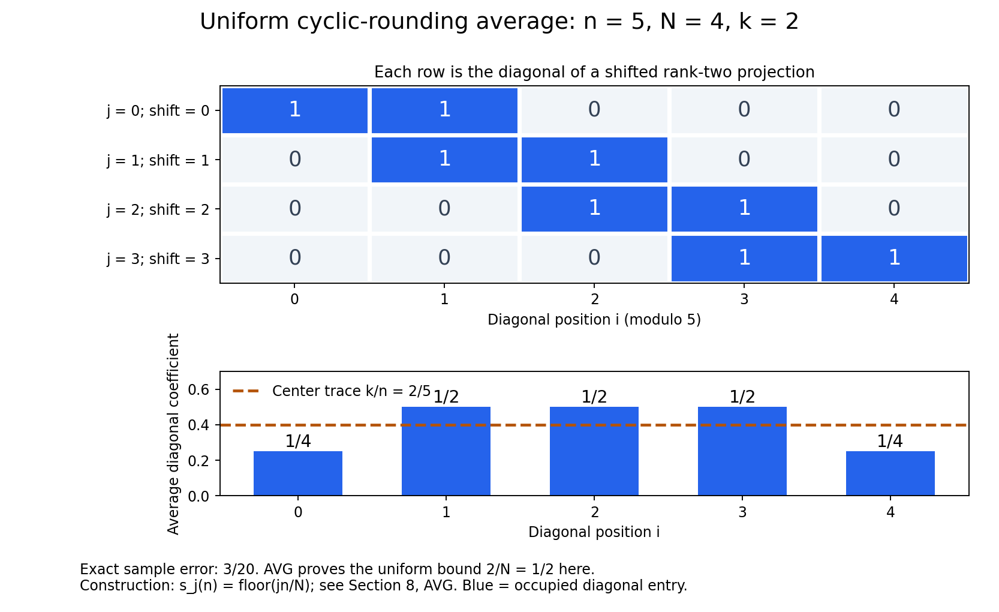

# Hypertraces and finite injective algebras

*Written by GPT-6.1 Sol (OpenAI), Ultra, October 2026. New original text: public domain (CC0).*

A hypertrace can remember a specified normal trace while it is approximated by finite-rank densities. Retaining that trace is the useful extra condition: a Hilbert–Schmidt vector then controls the product of left and right multiplication, and finite sums of product vectors give completely positive maps through matrix algebras. We first carry out this construction for an algebra with a faithful normal tracial state. We subsequently assemble arbitrary finite algebras from central corners and semifinite algebras from finite corners.

The spectral-projection argument is a second consequence of the same density approximation. It is developed afterwards, together with its noncommuting counterexample. Nearly tracial states are treated in a separate final module, because the finite-model construction no longer needs to obtain its chosen trace from an almost invariant projection state.

## 1. Conventions and exact foundations

Inner products are linear in the second variable. The symbol \(\operatorname{Tr}\) denotes the unnormalized operator trace, and \(\|x\|_2^2=\operatorname{Tr}(x^*x)\) for Hilbert–Schmidt operators. For a tracial state \(\tau\) on \(M\), write \(\|x\|_{2,\tau}^2=\tau(x^*x)\). An algebra is finite in the Murray–von Neumann sense: an isometry in it is unitary. This does not assert finite Hilbert-space dimension.

We use the definitions in [Finite models of a von Neumann algebra](semidiscrete-finite-models.md). Semidiscreteness means a net of normal completely positive contractions \(S:M\to M_n(\mathbb C)\) and completely positive contractions \(R:M_n(\mathbb C)\to M\) for which \(RS(x)\to x\) ultraweakly, for every \(x\in M\). Injectivity means completely positive extension from operator systems, with the unit value and hence the norm preserved. In particular, extending the identity of a faithfully normally represented algebra gives a ucp retraction \(E:B(H)\to M\). The reverse implication from semidiscreteness is proved directly in Section 6 by finite matrix extension and compactness.

The faithful-trace finite-model construction below does not invoke the preceding lesson's commutant criterion. Its matrix maps and their normalization are proved explicitly in Section 5.

Three projection and trace contracts are needed for the general finite and semifinite passages, and for the final nearly tracial-state module:

1. **CT.** Every finite von Neumann algebra has a positive, faithful, normal, unital, center-linear trace \(T:M\to Z(M)\). Thus \(T(ab)=T(ba)\). Every projection is an orthogonal sum of monic projections: on its central support a monic projection is one of finitely many equivalent orthogonal projections adding to the central unit.
2. **PC.** Projection comparison holds. Equivalent projections in a finite algebra have equivalent complements. A finite algebra decomposes centrally into finite homogeneous type I algebras and an algebra with no nonzero abelian projection; the latter admits repeated halving of its unit into equivalent projections. On a finite homogeneous type I component, matrix units identify the algebra with \(M_n(Z)\).
3. **SF.** A finite orthogonal sum of finite projections is finite. In a semifinite algebra every nonzero projection contains a nonzero finite projection.

These foundations are proved in [Projection comparison and normal center-valued traces](projection-comparison-and-finite-traces.md): C05–C06 give comparison and finite complements, D05–D10 give the finite central decomposition, equivalent dyadic partitions and monic decomposition, NC–CT construct the normal faithful center-valued trace, and C10–C12 give the finite-sum and semifinite projection consequences. Here semifinite uses the projection convention: every nonzero projection contains a nonzero finite projection; C12 proves its equivalence to an orthogonal decomposition of the unit into finite projections. No faithful normal state on the whole algebra is assumed.

The concrete series-vector predual and its bounded strong-continuity estimate are proved in [H03 of Regular-group operator foundations](regular-group-operator-foundations.md#h03). Its coordinate Hilbert-space construction applies to any Hilbert space: choose a maximal orthonormal family by Zorn's lemma. H01 gives the orthogonal projection onto its closed span. A nonzero vector in the orthogonal complement could be normalized and added to the family, so maximality makes that span the whole space. Finite orthogonal truncations then identify the space unitarily with the corresponding \(\ell^2(I)\) of H00. This also covers the zero space. We use a concrete von Neumann algebra in commutant form \(M=\mathcal S''\); H01 proves \(M''=M\) in this form.

The scalar, norming and continuous C*-calculus proofs used here are [Elementary calculus for infinite products](elementary-calculus-for-infinite-products.md) and Infinite tensor products, F01–F08. The [finite threshold and spectral-step proofs S01–S06](projection-comparison-and-finite-traces.md#s01) supply the projection approximation and endpoint cuts used below, and [CS01–CS06](regular-group-operator-foundations.md#cs01) supply the character construction. The following constructions supply convex separation, compactness, finite matrix extension, finite-rank trace estimates and the fixed spatial completion. The finite-trace realization is proved in Section 2. All closures and approximation parameters use nets. No separability assumption is imposed.

**Convex separation (SEP).** The norming and extension form of Hahn–Banach is proved in Infinite tensor products, F01. Here is its needed convex consequence. If a nonempty convex set has zero in its Banach-space weak closure, then zero is in its norm closure.

Suppose instead that its norm closure \(K\) misses zero. Choose \(\varepsilon>0\) for which \(U=K+B(0,\varepsilon)\) misses zero. Choose \(u_0\in U\), and let \(V=U-u_0\). This is open, convex and contains zero. Its gauge
\[
p(x)=\inf\{t>0:x\in tV\}
\]
is finite and nonnegative, positively homogeneous and subadditive. Finiteness follows from a ball about zero in \(V\); convexity proves subadditivity by adding the two scaled representatives. Moreover \(V=\{p<1\}\): convexity proves one inclusion, and openness permits a small outward scaling of each point for the other. For \(z=-u_0\), we have \(p(z)\ge1\). The real linear functional \(tz\mapsto t\) is dominated by \(p\), for positive \(t\) by homogeneity and for negative \(t\) by nonnegativity. Hahn–Banach extends it to a real linear \(g\le p\). A ball in \(V\) bounds \(p(x)\) by a constant times \(\|x\|\); applying this to \(x\) and \(-x\) proves continuity of \(g\).

For \(u\in U\), \(g(u)=g(u-u_0)-1<0\). Since \(k+B(0,\varepsilon)\subset U\), this gives \(g(k)\le-\varepsilon\|g\|<0\) for every \(k\in K\). In a complex space, \(G(x)=g(x)-ig(ix)\) is a bounded complex linear functional with real part \(g\). Thus this inequality also separates zero in the Banach weak topology, a contradiction. Translating proves the same separation for any point outside a closed convex set.

For the weak* topology of a dual space, a neighbourhood excluding a convex set is specified by finitely many real and imaginary parts of evaluations. Their joint map takes values in a finite-dimensional real space and sends the excluded point outside the closure of the convex image. The preceding separation argument there supplies a real linear separator; pulling it back gives a real combination of those evaluations. For hermitian functionals, each real part is evaluation at the selfadjoint part of the tested element, and each imaginary part at its imaginary selfadjoint part. Their real combination is therefore evaluation at one selfadjoint element. This is the weak* separation used below.

**Products and dual balls (COMPACT).** Closed scalar disks are compact by [Elementary calculus for infinite products, R02](elementary-calculus-for-infinite-products.md#r02). Closed subsets inherit the finite-open-cover property by adding their open complement to a cover. We now prove the arbitrary-product consequence.

A proper filter is a family of subsets closed under finite intersections and supersets, containing no empty set. Every proper filter extends to a maximal one by Zorn's lemma: the union of a chain is still proper. Such an ultrafilter contains either a set or its complement. Indeed, if adding a set would remain proper, maximality puts that set in the filter; otherwise some filter member is disjoint from it, and its complement is already in the filter.

In a compact space, the closures of the members of an ultrafilter have the finite intersection property, so they have a common point \(x\). Every open neighbourhood of \(x\) belongs to the ultrafilter: otherwise its closed complement would belong and contain \(x\), a contradiction. Conversely, an open cover without a finite subcover has complements generating a proper filter. An ultrafilter extending it cannot converge anywhere, since it contains the complement of one covering neighbourhood at every proposed limit. Thus compactness is equivalent to convergence of every ultrafilter.

For an ultrafilter on a product of nonempty compact spaces, inverse images under a coordinate projection give an ultrafilter on that coordinate. Choose one limit in each coordinate. A basic product neighbourhood imposes only finitely many coordinate conditions, whose inverse images have intersection in the original ultrafilter. It therefore converges to the chosen tuple. The product is compact. A product with an empty factor is empty and compact; the product with no factors is a singleton.

For a complex normed space \(E\), embed the closed radius-\(C\) ball of \(E^*\), \(C\ge0\), in
\[
\prod_{x\in E}\{z\in\mathbb C:|z|\le C\|x\|\}.
\]
The equations for additivity and complex homogeneity define a closed subset. A tuple satisfying them is exactly a linear functional bounded by \(C\|x\|\). The subspace topology is pointwise convergence on \(E\), hence the weak* topology. The ball is therefore weak* compact. On a unital C*-algebra the states form the closed subset of its dual unit ball specified by \(f(1)=1\) and \(f(a^*a)\ge0\) for all \(a\), so they too are weak* compact.

For clarity, compactness supplies subnets, not necessarily subsequences. The closures of the tails of a net in a compact space have the finite intersection property. A common point meets every neighbourhood on every tail. Use triples consisting of a neighbourhood, a tail index and a chosen later index whose net value lies in that neighbourhood. Order them by shrinking the neighbourhood and advancing both indices. They are directed: after combining two neighbourhoods, choose a hit beyond both chosen indices and both tail indices. Projection to the chosen index is order preserving and eventually beyond every original index. It defines a subnet converging to the common point.

**Positive functionals and their Hilbert quotients (GNS).** A positive linear functional \(f\) on a unital C*-algebra obeys Cauchy–Schwarz for \(\langle a,b\rangle_f=f(a^*b)\), by expanding its positive quadratic form. The zero diagonal case follows by varying the phase and magnitude of the scalar coefficient. The calculus and order estimates of Infinite tensor products, F06–F08 give
\[
|f(a)|^2\le f(1)f(a^*a)\le f(1)^2\|a\|^2.
\]
Thus \(\|f\|=f(1)\), including the case \(f(1)=0\). The zero vectors of this form are a linear subspace, by Cauchy–Schwarz. The inequality
\[
f(b^*a^*ab)\le\|a\|^2 f(b^*b)
\]
makes left multiplication descend to the quotient and bounded by \(\|a\|\). Complete it using F01. The formula for the form shows that the adjoint is multiplication by \(a^*\); multiplication and the unit are preserved. This gives a bounded *-representation with cyclic vector \([1]\), and \(f(a)=\langle[1],a[1]\rangle\). For a state that vector has norm one. A norm-dense unital *-subalgebra has dense quotient vectors, since \(\|[a]-[b]\|\le\|a-b\|\).

**Completely positive extension into a matrix algebra (FEXT).** Let \(S\) be a unital selfadjoint subspace of a unital C*-algebra \(D\), and let \(\Phi:S\to M_n\) be completely positive. It has an extension \(\widetilde\Phi:D\to M_n\) with the same unit value.

First, a positive scalar functional \(f\) on \(S\), with \(f(1)=c\), extends positively to \(D\). On the real selfadjoint part, \(-\|s\|1\le s\le\|s\|1\) gives \(|f(s)|\le c\|s\|\). Here \(f(s)\) is real, since \(s+\|s\|1\) and \(1\) are positive elements of \(S\). Real Hahn–Banach extends this functional to \(D_{\rm sa}\) with the same norm and value at one. If \(a\ge0\) is nonzero, then \(\|1-a/\|a\|\|\le1\), so the extended value at \(a\) is nonnegative. Complexification gives a positive extension to \(D\), with norm \(c\) by GNS above. When \(c=0\) all these functionals are zero.

Matrix orders can be taken in a faithful concrete realization of \(D\). Such a realization follows from the scalar extension and GNS arguments just given. For \(0\ne b\ge0\), its spectral radius is \(\|b\|\) by F04 and F08. Evaluation of a polynomial in \(b\) at that spectral value is bounded by its operator norm, by F03–F06. It extends to a state on the closure of the polynomials: positivity follows by approximating each square \(a^*a\) with polynomial squares. Positive scalar extension gives a state of \(D\) taking value \(\|b\|\) at \(b\). Take the Hilbert direct sum of the GNS representations for all states of \(D\). For \(b=a^*a\), a state with \(f(b)=\|a\|^2\) gives \(\|\pi_f(a)[1]\|=\|a\|\). The direct sum is therefore isometric and faithful, as each summand is contractive. Its matrix algebras are concrete C*-algebras. Any two faithful realizations give the same matrix norms and orders: apply the automatic contractivity in F05 to the entrywise *-isomorphism and its inverse, and use F08 for positivity. The zero algebra uses the zero Hilbert space.

Apply scalar extension to the operator system \(M_n(S)\subset M_n(D)\) and the positive functional
\[
F_\Phi([s_{ij}])=\sum_{i,j=1}^n\langle e_i,\Phi(s_{ij})e_j\rangle.
\]
Its positivity follows by testing the positive matrix \([\Phi(s_{ij})]\) on the vector with components \(e_1,\ldots,e_n\). Its value at the identity is \(F_\Phi(1)=\operatorname{Tr}(\Phi(1))\), equal to \(n\) when \(\Phi\) is unital. Let \(F\) be its positive extension. Define
\[
\langle e_i,\widetilde\Phi(a)e_j\rangle=F(E_{ij}\otimes a).
\tag{FE}
\]
This agrees with \(\Phi\) on \(S\), including its unit value. To check complete positivity, take \([a_{kl}]\ge0\) in \(M_m(D)\) and vectors \(\xi_k\in\mathbb C^n\). The matrix
\[
\left[\sum_{k,l}\overline{\xi_k(i)}a_{kl}\xi_l(j)\right]_{i,j}
\]
is a scalar compression of \([a_{kl}]\), hence positive in \(M_n(D)\). Its value under \(F\) is exactly \(\sum_{k,l}\langle\xi_k,\widetilde\Phi(a_{kl})\xi_l\rangle\). This proves positivity at every matrix level.

The norm bound follows directly for any completely positive map on an operator system. For \(\|s\|\le1\), the matrix \(\begin{bmatrix}1&s\\s^*&1\end{bmatrix}\) is positive: it is \(VV^*\) for \(V=\begin{bmatrix}1&0\\s^*&(1-s^*s)^{1/2}\end{bmatrix}\) in the containing matrix algebra. Applying complete positivity and the positive-form Cauchy–Schwarz inequality gives
\[
|\langle\xi,\Phi(s)\eta\rangle|
\le\langle\xi,\Phi(1)\xi\rangle^{1/2}
\langle\eta,\Phi(1)\eta\rangle^{1/2}
\le\|\Phi(1)\|\|\xi\|\|\eta\|.
\]
Consequently \(\|\Phi\|=\|\Phi(1)\|\). This applies to the extension and to every matrix amplification. Thus a cpc map extends cpc, and a ucp map extends ucp. This finite-target construction uses scalar positive extension and matrix compressions, with no dilation prerequisite.

**Finite-rank trace estimates (FP).** A finite-rank operator \(d\) and its adjoint have a common finite-dimensional reducing support. Define its trace on that support and extend by zero. The value is independent of enlargement. Expanding into rank-one operators proves \(\operatorname{Tr}(dA)=\operatorname{Tr}(Ad)\) for every bounded \(A\). A finite polar decomposition \(d=v|d|\), or its singular-vector expansion, gives
\[
\sup_{\|A\|\le1}|\operatorname{Tr}(dA)|=\operatorname{Tr}(|d|)=\|d\|_1.
\tag{F1}
\]
For the upper bound write \(d=\sum_j s_j\theta_{u_j,w_j}\) with orthonormal singular vectors and \(s_j\ge0\); each trace term is \(s_j\langle w_j,A u_j\rangle\), whose modulus is at most \(s_j\). The contraction \(A=v^*\) attains the sum. This includes the zero operator. Finite-rank trace functionals are finite series-vector functionals of H03, so (F1) is also their exact predual norm.

The Hilbert–Schmidt inner product on finite-rank operators is \(\langle d,e\rangle_2=\operatorname{Tr}(d^*e)\). Finite matrix Cauchy–Schwarz gives its norm inequality. Expanding in an orthonormal basis of the finite initial support gives \(\|Ad\|_2\le\|A\|\|d\|_2\); taking adjoints gives \(\|dA\|_2\le\|A\|\|d\|_2\). If \(d,e\) are finite rank and \(de=v|de|\), then
\[
\|de\|_1=\operatorname{Tr}(v^*de)
\le\|v^*d\|_2\|e\|_2
\le\|d\|_2\|e\|_2.
\tag{F2}
\]
All these calculations occur on finite supports; no decomposition of an arbitrary compact operator is used.

**The fixed spatial completion (SP).** For arbitrary Hilbert spaces, the coordinate realizations H00–H01 define the Hilbert tensor product as \(\ell^2(I\times J)\), with elementary coordinate tensors total. Equivalently it completes finite tensors in their product inner product. On a finite tensor, orthonormalize its finitely many second vectors. The identity
\(\|\sum_j\xi_j\otimes\eta_j\|^2=\sum_j\|\xi_j\|^2\) for orthonormal \(\eta_j\) proves that \(a\otimes1\) is bounded by \(\|a\|\); exchanging the factors treats \(1\otimes b\). Product vectors give the reverse inequality, by choosing unit vectors whose image norms approach the two operator norms. Therefore
\[
\|a\otimes b\|=\|a\|\|b\|,
\tag{S1}
\]
including zero factors. The rank-one map
\[
H\otimes\bar H\longrightarrow\overline{\operatorname{Fin}(H)}^{\|\cdot\|_2},
\qquad
\xi\otimes\bar\eta\longmapsto\theta_{\xi,\eta},
\quad \theta_{\xi,\eta}(\zeta)=\xi\langle\eta,\zeta\rangle
\tag{S2}
\]
is unitary: a finite trace calculation gives the same inner products, and finite rank-one sums are dense on both sides. Under it, \(a\otimes\bar b\) acts by \(d\mapsto adb^*\), with the bounds just proved.

Take the closure of the algebraic operators \(\sum_i a_i\otimes\bar b_i\) on this one \(H\otimes\bar H\). It is a concrete unital C*-algebra, denoted \(C\). The algebraic action is faithful. To see this, express a tensor using linearly independent first operators \(a_1,\ldots,a_m\). Their vector coefficients span the dual of that finite-dimensional space: otherwise a nonzero linear combination would have all matrix coefficients zero. Finite combinations of those coefficients isolate each \(a_i\); if the tensor acts as zero, each resulting second operator is zero. This proves injectivity.

In this lesson \(\|z\|_{\min}\) is the operator norm of \(z\) in this faithful spatial completion. Every use below has this fixed trace Hilbert space. Through COM's linear map \(JbJ\mapsto\bar b\), this is the indicated spatial completion of \(M\odot M'\). It is exactly the original concrete spatial norm on \(H\otimes H\): the map \(U:\bar H\to H\), \(U(\bar\xi)=J\xi\), is a linear unitary, and \(U\bar bU^*=JbJ\). Consequently \(1\otimes U\) intertwines the two displayed algebraic actions and preserves their operator norms. No comparison with another trace representation is required.

For any faithful concrete unital C*-algebra \(D\subset B(K)\), finite convex mixtures of its vector states are weak* dense in its state space. If not, weak* SEP supplies a selfadjoint \(a\in D\) and a state whose value exceeds every unit-vector expectation. With \(t=\sup_{\|\xi\|=1}\langle\xi,a\xi\rangle\), we have \(a\le t1\) as an operator, hence in \(D\) by F08, so no state can exceed \(t\). This contradiction proves density. A vector state changes in functional norm by at most \((\|\xi\|+\|\eta\|)\|\xi-\eta\|\) when its vector changes; this follows by expanding the two scalar products. Thus any total family of finite product vectors gives the same convex density after normalization.

**Normal trace factorization from CT.** If \(\tau\) is a normal scalar tracial state on a finite algebra, then \(\tau=\tau\circ T\). To verify the implication we consume from CT, take a monic projection \(p\) with \(n\) equivalent orthogonal copies summing to a central projection \(z\). Traciality gives \(\tau(p)=\tau(z)/n\), and center-linearity and traciality give \(T(p)=z/n\). Consequently \(\tau\) and \(\tau\circ T\) agree on monic projections. Normality and the orthogonal monic decomposition give agreement on every projection. Uniform spectral approximation then gives agreement on every selfadjoint element, and linearity on all elements. Both normality and the full monic-decomposition contract are used in this argument. The identity for singular tracial states is proved separately in Section 8.

**A completely positive retraction is bimodular (MD).** Here is the short dilation argument, to make this use of complete positivity explicit. For a ucp map \(\Phi:D\to B(K)\), put on \(D\odot K\) the positive semidefinite form
\[
\left\langle\sum_i a_i\otimes\xi_i,\sum_j b_j\otimes\eta_j\right\rangle
=\sum_{i,j}\langle\xi_i,\Phi(a_i^*b_j)\eta_j\rangle.
\]
Complete positivity gives positivity of the form, and its scalar Cauchy–Schwarz inequality makes its zero vectors a linear subspace. Left multiplication by \(a\) is bounded by \(\|a\|\), since the matrix \([b_i^*(\|a\|^2-a^*a)b_j]\) is positive. Quotient by the zero vectors and complete. This gives a representation \(\pi\) and an isometry \(V\xi=1\otimes\xi\), with \(\Phi(a)=V^*\pi(a)V\). If \(\Phi(a^*a)=\Phi(a)^*\Phi(a)\), then
\[
\|(1-VV^*)\pi(a)V\xi\|^2
=\langle\xi,(\Phi(a^*a)-\Phi(a)^*\Phi(a))\xi\rangle=0.
\]
The equality for \(aa^*\) gives the same result for \(a^*\). Hence \(\pi(a)V=V\Phi(a)\) and \(V^*\pi(a)=\Phi(a)V^*\), so \(\Phi(ax)=\Phi(a)\Phi(x)\) and \(\Phi(xa)=\Phi(x)\Phi(a)\). For a retraction fixing a C*-subalgebra both equalities hold for every element of that subalgebra. This is the standard dilation and multiplicative-domain argument; Arveson's paper supplies its freely accessible primary construction.

The same dilation construction for a completely positive map that need not be unital gives \(V^*V=\Phi(1)\), with bounded \(V\). Thus \(\|\Phi\|=\|\Phi(1)\|\), and applying the construction at matrix levels gives the complete norm bound. This also proves the norm assertion used below for subunital maps.

## 2. A hypertrace with a prescribed trace

For a unital C*-algebra \(A\subseteq B(H)\), a **hypertrace** is a state \(\sigma\) on \(B(H)\) for which \(\sigma(ax)=\sigma(xa)\), for \(a\in A\), \(x\in B(H)\). This is equivalent to invariance under every \(\operatorname{Ad}(u)(x)=uxu^*\), \(u\in\mathcal U(A)\). For the converse apply invariance to \(xu\), giving \(\sigma(ux)=\sigma(xu)\), and span the algebra by unitaries.

We will use the following explicit spanning formula. If \(x\ne0\), let \(r=\|x\|\), \(a=(x+x^*)/(2r)\), \(b=(x-x^*)/(2ir)\). The selfadjoint contractions \(a,b\) give unitaries \(u=a+i(1-a^2)^{1/2}\), \(v=b+i(1-b^2)^{1/2}\), and
\[
x=\frac r2(u+u^*+iv+iv^*).
\tag{U}
\]
The absolute coefficient sum is \(2r\). The zero element needs no such decomposition.

**The normal trace realization (REP).** Let \(M\) have its concrete predual \(Q\) from H03, and let \(\tau\) be its faithful normal tracial state. Here normal functionals are the ultraweakly continuous functionals of that concrete predual. Complete \(M\) for \(\langle x,y\rangle=\tau(x^*y)\) to obtain \(H\). Positivity, traciality and the C*-order inequality give
\[
\|ax\|_{2,\tau}\le\|a\|\|x\|_{2,\tau},
\qquad
\|xb\|_{2,\tau}\le\|b\|\|x\|_{2,\tau}.
\]
Thus left multiplication \(L_a\) and right multiplication \(R_b\) are bounded; \(R_bR_c=R_{cb}\). Their adjoints are \(L_{a^*}\) and \(R_{b^*}\). The left representation is faithful, since \(L_a1=0\) forces \(\tau(a^*a)=0\). It is isometric by F05 applied to it and F07 for an injective *-homomorphism.

The canonical map \(Q\to M^*\) is isometric: H03 gives \(Q^*=M\), and the norming Hahn–Banach formula of F01 identifies the norm of a vector of \(Q\) with its supremum against the unit ball of \(M\). Its image is therefore norm closed. Fixed multiplication preserves \(Q\), since pulling back a series-vector functional replaces its two vectors by bounded-operator images.

For \(x,y\in M\), the functional \(a\mapsto\langle x1,L_a y1\rangle=\tau(x^*ay)\) belongs to \(Q\). Approximate arbitrary \(\xi,\eta\in H\) by vectors of \(M1\). The bound \(\|L_a\|\le\|a\|\) makes the corresponding functionals converge in norm on \(M\), so \(a\mapsto\langle\xi,L_a\eta\rangle\) belongs to \(Q\), with norm at most \(\|\xi\|\|\eta\|\). A series of such coefficients with summable norm products converges in \(Q\). Hence \(L\) is ultraweakly continuous.

We next prove directly that its image is a von Neumann algebra. For \(C\ge0\), let
\[
K_C=\{x1:x\in M,\ \|x\|\le C\}\subset H.
\]
Every Hilbert weak test of \(x1\) is a coefficient just proved to belong to \(Q\). COMPACT therefore makes \(K_C\) weakly compact. The Hilbert weak topology is Hausdorff, so a compact subset is closed: for a point outside it, separate that point from each compact-set point by disjoint neighbourhoods, and select finitely many of the latter to cover the compact set. Intersect the corresponding neighbourhoods of the outside point. Thus \(K_C\) is also norm closed. It is convex and bounded by \(C\).

Let \(T\) commute with all right multiplications, put \(C=\|T\|\) and \(\xi=T1\). For \(b\in M\), use the polar decomposition \(b=v|b|\) proved for every concrete von Neumann algebra in [Regular-group operator foundations, T04a](regular-group-operator-foundations.md#t04a), and put \(d=|b|^{1/2}\). The selfadjoint operator \(R_d\) commutes with \(T\), so
\[
\langle b1,T1\rangle=\langle vd1,Td1\rangle,
\qquad
|\langle b1,\xi\rangle|\le C\tau(|b|).
\tag{R1}
\]
Indeed both \(vd1\) and \(d1\) have squared norm \(\tau(|b|)\), since \(v^*v\) is the support of \(|b|\). On the other hand,
\[
\sup_{\|x\|\le C}\operatorname{Re}\langle b1,x1\rangle
=C\tau(|b|).
\tag{R2}
\]
The upper bound is tracial Cauchy–Schwarz applied to \(\tau(dv^*xd)\), and the lower bound is attained at \(x=Cv\). The support function of \(K_C\) is \(C\)-Lipschitz in its Hilbert normal. Since \(M1\) is dense, (R1)–(R2) imply
\(\operatorname{Re}\langle\eta,\xi\rangle\le\sup_{k\in K_C}\operatorname{Re}\langle\eta,k\rangle\) for every \(\eta\in H\).

This places \(\xi\) in \(K_C\). To prove that implication, a nonempty closed convex Hilbert subset has a closest point: the parallelogram identity applied to a minimizing sequence and its midpoints makes the sequence Cauchy. If \(k\) were closest to \(\xi\) with \(\xi\ne k\), minimality along the segment to any \(h\in K_C\) would give \(\operatorname{Re}\langle\xi-k,h-k\rangle\le0\). But the support inequality in the direction \(\xi-k\) gives the opposite strict inequality at \(\xi\), since \(\operatorname{Re}\langle\xi-k,\xi\rangle=\operatorname{Re}\langle\xi-k,k\rangle+\|\xi-k\|^2\). This is a contradiction.

Consequently \(T1=x1\) for some \(x\in M\), \(\|x\|\le C\). For \(y\in M\), commutation gives \(T(y1)=R_yT1=xy1=L_x(y1)\); density proves \(T=L_x\). We have proved
\[
L(M)=R(M)'.
\tag{R3}
\]
H01 makes the right hand side a concrete von Neumann algebra.

The inverse map also preserves the ultraweak topology. The functionals \(a\mapsto\tau(b^*a)\), \(b\in M\), are norm dense in \(Q\). If their closed span were proper, the norming Hahn–Banach theorem and \(Q^*=M\) would give a nonzero annihilator \(a\). Taking \(b=a\) would give \(\tau(a^*a)=0\), contradicting faithfulness. Each such functional is the vector coefficient \(L_a\mapsto\langle b1,L_a1\rangle\) on \(L(M)\). Isometry of \(L\) preserves the functional norms, and H03 makes normal functionals on its concrete image norm closed. Thus every \(f\in Q\) transports to a normal functional on \(L(M)\). This proves ultraweak continuity of \(L^{-1}\).

**Proposition 2.2.** Let \(M\) be finite and injective, and let \(\tau\) be a faithful normal tracial state. Its left representation on \(H=L^2(M,\tau)\) has a hypertrace extending \(\tau\).

**Proof.** Extend the identity of the left representation to a ucp map \(E:B(H)\to M\), using injectivity. The dilation computation MD makes \(E\) bimodular. For \(a\in M\), \(x\in B(H)\),
\[
(\tau\circ E)(ax)=\tau(aE(x))=\tau(E(x)a)=(\tau\circ E)(xa).
\]
Thus \(\sigma=\tau\circ E\) is the required state, and \(\sigma(a)=\tau(a)\). Normality of \(E\) and \(\sigma\) is not needed. \(\square\)

## 3. Finite densities retain both invariance and the chosen trace

The estimate for square roots is proved first, because it is used before any spectral projection is selected.

**Lemma 1.1 (Powers–Størmer).** For positive finite-rank operators \(h,k\),
\[
\|h-k\|_2^2\leq\|h^2-k^2\|_1.
\]

**Proof.** Restrict to the finite-dimensional sum of the ranges of \(h\) and \(k\), which reduces both selfadjoint operators. Put \(d=h-k\), \(s=h+k\), and \(v=\operatorname{sign}(d)\), zero on the kernel. Then
\[
h^2-k^2=(ds+sd)/2,\qquad
\operatorname{Tr}((h^2-k^2)v)=\operatorname{Tr}(s|d|).
\]
The first bound is a finite-matrix calculation. Diagonalize the selfadjoint matrix \(D=h^2-k^2\), with eigenvalues \(\lambda_j\) and orthonormal eigenvectors \(\xi_j\). Since \(\|v\|\le1\),
\[
|\operatorname{Tr}(Dv)|
=\left|\sum_j\lambda_j\langle\xi_j,v\xi_j\rangle\right|
\le\sum_j|\lambda_j|=\|D\|_1.
\]
To bound the trace below, write \(d=d_+-d_-\), with supports \(p_+,p_-\). Compression gives
\[
p_+sp_+-d_+=2p_+kp_+\geq0,
\qquad p_-sp_--d_-=2p_-hp_-\geq0.
\]
For positive matrices \(A,B\), \(\operatorname{Tr}(AB)=\operatorname{Tr}(B^{1/2}AB^{1/2})\geq0\). Apply this to the two displayed positive differences and \(d_+,d_-\). Adding gives
\[
\operatorname{Tr}(s|d|)\geq\operatorname{Tr}(d_+^2+d_-^2)=\|h-k\|_2^2.
\]
The two bounds prove the claim, also when one or both operators are zero. This sign-support proof is the finite-matrix specialization of the primary Powers–Størmer argument read in Anantharaman–Popa, Theorem 7.3.7. \(\square\)

**Trace-controlled density approximation (DEN).** Suppose \(N\subseteq B(H)\) is faithfully normally represented, \(\tau\) is a normal state on \(N\), and a hypertrace \(\sigma\) restricts to \(\tau\). For finite sets \(U\subseteq\mathcal U(N)\), \(B\subseteq N\), and numbers \(\alpha,\beta>0\), there is a positive finite-rank operator \(h\) such that
\[
\|h\|_2=1,\qquad
\|\rho_{h^2}|_N-\tau\|<\alpha,\qquad
\|[h,b]\|_2<\beta\quad(b\in B),
\tag{DEN}
\]
where \(\rho_d(x)=\operatorname{Tr}(dx)\). One can simultaneously require \(\|h-u^*hu\|_2<\beta\) for \(u\in U\).

**Proof.** Finite-rank normal states are convex and weak* dense in the state space of \(B(H)\), by SP. Each finite mixture of vector states has a positive finite-rank trace-one density. Formula (F1) identifies the norm of every finite-rank density difference with its \(\|\cdot\|_1\) norm. These facts hold in arbitrary Hilbert dimension.

For a finite unitary set \(V\), consider the convex set of tuples
\[
\left((\rho-\rho\circ\operatorname{Ad}(v))_{v\in V},\ \rho|_N-\tau\right)
\in B(H)_*^{|V|}\oplus N_*,
\]
where \(\rho\) ranges over finite-rank normal states. Restriction is normal because the representation is normal. Its Banach-space weak tests are tuples in \(B(H)^{|V|}\oplus N\). Weak* approximation to \(\sigma\), its invariance, and \(\sigma|_N=\tau\) show that zero is in the weak closure. SEP makes its weak and norm closures equal. In the sum norm we may therefore choose \(d\geq0\), finite rank, \(\operatorname{Tr}(d)=1\), with
\[
\sum_{v\in V}\|d-v^*dv\|_1+\|\rho_d|_N-\tau\|<\delta.
\tag{D1}
\]
With \(h=\sqrt d\), Lemma 1.1 gives \(\|h-v^*hv\|_2<\sqrt\delta\), while \(\|h\|_2=1\). Include in \(V\) the unitaries in (U) for all nonzero elements of \(B\), as well as \(U\). Let \(C\) be the largest absolute coefficient sum for those decompositions, with \(C=0\) if \(B\) has no nonzero element, and set \(C_0=\max(1,C)\). Choose
\(0<\delta<\min(\alpha,\beta^2/C_0^2)\).
Unitary invariance of the Hilbert–Schmidt norm and the triangle inequality give (DEN). If the required sets are empty or consist of zero elements, the same tuple argument with no unitary coordinates still gives the restriction estimate; the zero commutators impose no condition. The construction is the trace-retaining convexity method in the complete proof of Anantharaman–Popa, Theorem 10.2.9. The square-root tolerance is chosen explicitly because its displayed estimate controls the square of the Hilbert–Schmidt error. \(\square\)

For later comparison with spectral projections, a projection state has a particularly transparent invariance bound. If \(p\ne0\) has finite rank \(r\), put \(\rho_p(x)=\operatorname{Tr}(pxp)/r\). For a unitary \(u\), its conjugated state's density is \(u^*pu/r\). If \(q=u^*pu\), then
\[
p-q=p(p-q)+(p-q)q,
\qquad
\|\rho_p-\rho_p\circ\operatorname{Ad}(u)\|
\leq\frac{2\|[p,u]\|_2}{\sqrt r}.
\tag{P}
\]
Indeed, the finite-rank bound (F2) gives \(\|p-q\|_1\leq2\sqrt r\|p-q\|_2\); (F1) and unitary invariance give the displayed state estimate. DEN retains the trace without needing to select such a projection.

## 4. The spatial scalar estimate and all central tests

Throughout this section \(M\) is finite and injective with a faithful normal tracial state \(\tau\), and is represented on \(H=L^2(M,\tau)\). These are the hypotheses for Lemma 4.1 and Theorem 4.2 as well as (SC). The rule \(Jx=x^*\) on \(M\) extends to an antiunitary involution, because \(\tau(xx^*)=\tau(x^*x)\).

**The commutant in this representation (COM).** Right multiplication \(JbJ\), given by \(\xi\mapsto\xi b^*\), commutes with the left algebra. For completeness, let \(a\in M'\). Antiunitarity, commutation and the adjoint identity give, for \(z\in M\),
\[
\langle JaJ1,z1\rangle
=\langle z^*1,a1\rangle
=\langle a^*z^*1,1\rangle
=\langle a^*1,z1\rangle.
\]
Thus \(JaJ1=a^*1\), or \(Ja1=a^*1\). For \(a,b\in M'\), it follows that
\[
JaJb1=Jab^*1=ba^*1=bJaJ1.
\]
Use this identity once with \(ac\) instead of \(a\), and once with \(c\), to obtain \((bJaJ)JcJ1=(JaJb)JcJ1\). These vectors are dense: \(M'1\) contains \((JMJ)1=M1\). Hence \(JaJ\in M''=M\). Together with the already verified right-multiplication inclusion this proves \(M'=JMJ\). This is the complete elementary finite-trace commutant method in Peterson, Proposition 6.4.12; no general-weight commutation theorem is used.

The linear faithful representation of \(M'\) on \(\bar H\) sending \(JbJ\) to \(\bar b\) preserves products and adjoints: both maps are conjugate linear in \(b\). SP supplies its fixed spatial completion \(C\), the Hilbert–Schmidt identification (S2), and the action \(d\mapsto adb^*\).

**Scalar trace bound (SC).** Keep this faithful trace representation fixed. For any normal tracial state \(\nu\) of \(M\), whether faithful or not, and
\[
c=\sum_i a_ib_i^*,\qquad z=\sum_i a_i\otimes Jb_iJ,
\]
we have
\[
|\nu(c)|\le\|z\|_{\min}.
\tag{SC}
\]

**Proof.** REP transports \(\nu\) normally to the fixed left image. Injectivity supplies the ucp retraction \(E\) there, and MD makes \(\nu\circ E\) a hypertrace extending \(\nu\). DEN gives positive finite-rank \(h\), \(\|h\|_2=1\), whose restriction error is below \(\alpha\) and whose commutators with the \(b_i^*\) have norm below \(\beta\). By (S2) its spatial vector state satisfies
\[
\theta_h(z)=\sum_i\operatorname{Tr}(h a_i h b_i^*),\qquad
|\theta_h(z)|\le\|z\|_{\min}.
\]
Finite-rank trace cyclicity gives
\[
\operatorname{Tr}(h^2c)-\theta_h(z)
=\sum_i\operatorname{Tr}\bigl(h a_i(b_i^*h-hb_i^*)\bigr).
\]
The Hilbert–Schmidt bound in FP makes its modulus at most \(\beta\sum_i\|a_i\|\). Consequently
\[
|\nu(c)|\le\|z\|_{\min}+\alpha\|c\|+\beta\sum_i\|a_i\|.
\]
Let \(\alpha,\beta\downarrow0\). Empty sums and zero coefficients give zero without division. In particular this applies to the original faithful trace \(\tau\). \(\square\)

**Lemma 4.1.** For \(a_i,b_i\in M\), put
\[
c=\sum_{i=1}^n a_ib_i^*,\qquad
z=\sum_{i=1}^n a_i\otimes Jb_iJ.
\]
For every \(\eta>0\), there is a normal state \(\omega\) on \(Z\) such that
\[
|\omega(T(c))|\leq\|z\|_{\min}+\eta.
\]

**Proof.** Choose the normal state \(\omega=\tau|_Z\). By CT, \(\nu=\omega\circ T\) is a normal tracial state on \(M\). SC in the unchanged faithful trace representation gives
\[
|\omega(T(c))|=|\nu(c)|\le\|z\|_{\min}.
\]
This gives the stated estimate for every \(\eta>0\), with the same state \(\omega\). \(\square\)

**Theorem 4.2.** Under these hypotheses,
\[
\left\|T\left(\sum_i a_ib_i^*\right)\right\|
\leq\left\|\sum_i a_i\otimes Jb_iJ\right\|_{\min}.
\]

**Proof.** For every normal state \(\omega\) of \(Z\), CT makes \(\nu=\omega\circ T\) a normal tracial state of \(M\). SC in the one fixed representation gives \(|\omega(T(c))|\le\|z\|_{\min}\).

These normal states detect the norm of \(q=T(c)\). If \(q\ne0\), F04 gives \(\lambda\in\operatorname{sp}(q)\) with \(|\lambda|=\|q\|\), since \(q\) is normal. Put \(h=(q-\lambda)^*(q-\lambda)\). Zero belongs to its spectrum: if \(h\) were invertible, normality would make \(h^{-1}(q-\lambda)^*\) a two-sided inverse of \(q-\lambda\). For \(\delta>0\), the continuous positive part \(k=(\delta^2-h)_+\) is therefore nonzero, by F06. Let \(e\in Z\) be its nonzero support projection from H02. The other positive part of \(h-\delta^2\) annihilates \(k\) and hence \(e\); thus \(he\le\delta^2 e\) and \(\|(q-\lambda)e\|\le\delta\). Faithfulness gives \(\tau(e)>0\), and
\[
\omega_e(z)=\frac{\tau(ez)}{\tau(e)}
\]
is a normal state of \(Z\) with \(|\omega_e(q)-\lambda|\le\delta\). Letting \(\delta\downarrow0\) proves \(\|q\|\le\sup_\omega|\omega(q)|\). The opposite inequality is the state norm bound; \(q=0\) is immediate. Combining this norm detection with SC proves the result. Every trace test uses the original Hilbert space and tensor norm. \(\square\)

## 5. Explicit completely positive matrix models

**Theorem 5.1.** A finite injective von Neumann algebra with a faithful normal tracial state is semidiscrete.

**Proof.** We give the matrix maps, including their contractive normalization. The functional
\[
\Omega\left(\sum_i a_i\otimes Jb_iJ\right)=\tau\left(\sum_i a_ib_i^*\right)
\]
is the vector functional of \(1\) for algebraic left-right multiplication. That multiplication is a *-representation on the algebraic tensor product, because its factors commute. Consequently \(\Omega(z^*z)=\|\mu(z)1\|^2\geq0\), and \(\Omega(1)=1\). Bound (SC) shows that \(\Omega\) extends continuously to the fixed concrete spatial completion \(C\) of SP. It remains positive there: approximate the square root of a positive element of \(C\) by algebraic tensors and pass to their squares.

SP proves weak* density of finite convex mixtures of vector states in this concrete \(C\) on \(H\otimes\bar H\). Each vector may moreover be approximated in norm by a finite sum \(\sum_i\xi_i\otimes\bar\zeta_i\) with \(\zeta_i\in M1\). Such vectors are dense, since \(M1\) is dense in \(H\). Within each sum we may choose the first vectors \(\xi_i\) orthonormal by taking an orthonormal basis of their finite-dimensional span and changing the \(\zeta_i\)'s accordingly. Normalize the vector afterwards; this keeps \(\zeta_i\in M1\). Thus finite convex mixtures of these special vector states are still weak* dense.

Their right marginal, regarded as a normal state of \(M\), is
\(f(b)=\rho(1\otimes Jb^*J)\).
The map \(b\mapsto Jb^*J\) is a linear *-anti-isomorphism, so the marginal is positive. Its normality follows directly by expanding each special product vector: its marginal is \(b\mapsto\tau(wb)\), with bounded \(w\) given in (M3). REP and fixed multiplication make this a normal functional. Fix finitely many tensors \(z_k\in C\). Tuples
\[
\left((\rho(z_k)-\Omega(z_k))_k,\ f-\tau\right)\in\mathbb C^d\oplus M_*
\]
form a convex set. They have zero in their Banach-space weak closure, because their weak tests are the listed tensor evaluations and operators \(b\in M\), and \(\Omega(1\otimes Jb^*J)=\tau(b)\). SEP therefore supplies, for any \(\delta>0\), a finite mixture \(\rho\) with
\[
|\rho(z_k)-\Omega(z_k)|<\delta\quad\hbox{for all }k,
\qquad \|f-\tau\|<\delta.
\tag{M1}
\]

Write the mixture as a finite sum of vector functionals associated to
\(\eta_l=\sum_{i=1}^{n_l}\xi_{li}\otimes\bar\zeta_{li}\), with \(\xi_{li}\) orthonormal for each \(l\), and incorporate the square roots of mixture weights into \(\zeta_{li}\in M\). Then \(\sum_l\|\eta_l\|^2=1\). Set \(N=\sum_l n_l\). With blocks indexed by \((l,i)\), define
\[
S(a)=\operatorname{diag}_l[\langle\xi_{li},a\xi_{lj}\rangle]_{i,j},
\qquad
R_0(X)=\sum_l\sum_{i,j}X_{li,lj}\zeta_{li}\zeta_{lj}^*.
\tag{M2}
\]
Compression by an isometry gives each diagonal block of \(S\), so \(S:M\to M_N\) is normal ucp. The maps \([X_{ij}]\mapsto\sum X_{ij}\zeta_i\zeta_j^*\) are completely positive, as one checks by the operator row \([\zeta_1\ \cdots\ \zeta_n]\); block compression and summing positive maps show that \(R_0\) is completely positive. Direct expansion, with the inner-product convention stated above, gives
\[
\rho(a\otimes JbJ)=\tau(R_0S(a)b^*),\qquad
w=R_0(1)=\sum_{l,i}\zeta_{li}\zeta_{li}^*\geq0,
\qquad f(b)=\tau(wb).
\tag{M3}
\]
Also \(\tau(w)=1\).

The marginal norm in (M1) equals \(\tau(|w-1|)\). Here is the full norm calculation. Put \(c=w-1=v|c|\) and \(d=|c|^{1/2}\), using T04a. Its polar contraction \(v\) is selfadjoint: the bounded approximants \(c(|c|+\varepsilon)^{-1}\) in that proof are selfadjoint, commute with \(|c|\), and converge strongly to \(v\). For \(\|x\|\le1\), tracial Cauchy–Schwarz gives
\[
|\tau(cx)|=|\tau(d x v d)|
\le \tau(d^2)^{1/2}\tau(d v^*x^*x v d)^{1/2}
\le\tau(|c|).
\]
The test \(x=v\) attains the last value, since \(v^2\) is the support of \(|c|\). Thus \(\|f-\tau\|=\tau(|w-1|)<\delta\), including \(c=0\).

The map \(R_0\) need not be contractive. Put
\[
r=\max(w,1)^{-1/2},\qquad R(X)=rR_0(X)r.
\tag{M4}
\]
Functional calculus gives \(0\leq r\leq1\) and \(R(1)=rwr\leq1\). The completely positive unit-value norm formula proved in MD, or the two-by-two proof in FEXT, therefore makes \(R\) a contraction at every matrix level.

Replace \(\zeta_{li}\) by \(r\zeta_{li}\), giving vectors \(\eta_l'\) and a positive spatial functional \(\rho'\). Its mass is at most one, and
\[
\sum_l\|\eta_l-\eta_l'\|^2
=\tau((1-r)^2w)
\leq\tau(|w-1|)<\delta.
\]
The scalar inequality used here is zero for \(0\leq w\leq1\), and for a scalar \(s>1\) it is \((\sqrt s-1)^2\leq s-1\). Regard the finite collections as single vectors in a finite Hilbert-space direct sum. The vector-functional difference estimate gives
\[
|\rho(z)-\rho'(z)|
\leq(\|\eta\|+\|\eta'\|)\|\eta-\eta'\|\,\|z\|
\leq2\sqrt\delta\,\|z\|,
\qquad
\rho'(a\otimes JbJ)=\tau(RS(a)b^*).
\tag{M5}
\]
Thus for the tested simple tensors \(a\otimes JbJ\),
\[
|\tau((RS(a)-a)b^*)|
<\delta+2\sqrt\delta\,\|a\|\|b\|.
\tag{M6}
\]

These are enough ultraweak tests. The linear functionals \(x\mapsto\tau(xb^*)\), \(b\in M\), are norm dense in \(M_*\): otherwise Hahn–Banach gives a nonzero annihilator \(x\in M\), while choosing \(b=x\) gives \(\tau(xx^*)=0\), contradicting faithfulness. Given finite operators \(a\), normal functionals \(g\), and a tolerance, first approximate each \(g\) by such a functional. Since \(RS\) is contractive, the error due to this replacement is at most \(2\|a\|\) times the functional norm error. Then choose \(\delta\) in (M6) small enough for all remaining tests. This constructs a normal cpc incoming map and a cpc outgoing map through one full matrix algebra meeting every prescribed finite list. Directing over these lists and positive tolerances proves semidiscreteness.

The coefficient factorization in (M2) is the finite-product-vector construction explicitly written in Anantharaman–Popa, Theorem 13.4.2. Here the right marginal is retained by a direct convexity argument, and (M4)–(M5) prove the needed one-sided contractive correction. We do not import that theorem's Fell-topology, bimodule-coefficient, subtracialization or separability antecedents. \(\square\)

Theorem 4.2 is a stronger central norm statement. The matrix construction uses SC for the specified trace; no central refinement is needed for it.

## 6. Arbitrary finite products and semifinite corners

**Proposition 5.2 (Products).** An arbitrary von Neumann product \(M=\prod_{\alpha\in I}M_\alpha\) of semidiscrete algebras is semidiscrete.

**Proof.** Take each coordinate algebra in a concrete commutant realization \(M_\alpha=M_\alpha''\subseteq B(H_\alpha)\), and represent the product diagonally on \(H=\bigoplus_\alpha H_\alpha\). This product is itself a concrete commutant algebra. Indeed, require an operator to commute with all coordinate projections and with every coordinate commutant \(M_\alpha'\), extended by zero on the other summands. The first requirements make it block diagonal, and the second put its \(\alpha\)-block in \(M_\alpha''=M_\alpha\). Conversely every bounded product element satisfies all these requirements. H03 therefore applies directly to this product realization, without a theorem about the range of an arbitrary representation. Let \(e_\alpha\) be its central coordinate projections and \(e_G=\sum_{\alpha\in G}e_\alpha\) for finite \(G\subseteq I\). The finite-sum Hilbert-space construction in H00 gives \(e_G\to1\) strongly.

By H03 every normal functional on this represented product has a series-vector expression
\[
f(x)=\sum_{j\ge1}\langle\xi_j,x\eta_j\rangle,
\qquad \sum_j\|\xi_j\|\|\eta_j\|<\infty.
\]
Because \(e_G\) is central,
\[
|f((1-e_G)x)|
\le\|x\|\sum_j\|\xi_j\|\|(1-e_G)\eta_j\|.
\tag{PR}
\]
The scalar sum tends to zero: its tail is uniformly bounded by the tail of the displayed summable series, while each term of any finite initial sum tends to zero by strong convergence. Thus the omitted-coordinate error tends to zero uniformly on every fixed operator-norm ball. For any finite lists of operators and normal functionals, choose one finite \(G\) making all these errors smaller than half the tolerance. This proves the required tail estimate directly for complex normal functionals.

If the product is nonzero, for each \(\alpha\in G\), semidiscreteness supplies maps \(S_\alpha:M_\alpha\to M_{n_\alpha}\) normal cpc and \(R_\alpha:M_{n_\alpha}\to M_\alpha\) cpc, meeting the finite tests obtained by restricting the original functionals to that coordinate and the operators to \(x_\alpha\). If \(G\) is nonempty choose each coordinate error below the remaining tolerance divided by \(|G|\). Record all these maps in the block diagonal algebra \(\bigoplus_{\alpha\in G}M_{n_\alpha}\subseteq M_N\), \(N=\sum n_\alpha\). For reconstruction first take the diagonal block compression of \(M_N\), then apply the \(R_\alpha\)'s, putting zero in all other product coordinates. Both maps are cpc for the maximum norm, and the incoming map is normal. Their composite is the chosen coordinatewise approximation, so summing the restricted functional errors proves the required finite tests. The empty coordinate choice, the empty index set, and the zero algebra use the zero factorization through \(M_1\). Direct all finite tests and tolerances to obtain the required net. \(\square\)

**Normal states and their central supports (SUP).** Let \(\omega\) be a normal state of an abelian concrete von Neumann algebra \(Z\). The join of its zero-weight projections again has weight zero. Indeed, finite joins satisfy \(p\vee q=p+q-pq\le p+q\), so have weight zero. Let \(V\) be the closed span of their ranges, with projection \(P_V\) from H01. The increasing net of finite joins eventually fixes every vector in any one of those ranges, hence converges to the identity on their linear span and, by its contraction bound, on \(V\). It vanishes on \(V^\perp\). Thus it converges strongly to \(P_V\). That projection is central, and H03's bounded strong-continuity estimate gives it weight zero. Write it as \(n\), and put \(e=1-n\).

The restriction of \(\omega\) to \(Ze\) is faithful. If \(0\ne z\ge0\) in that corner had weight zero, choose \(0<t<\|z\|\). The positive part \(k=(z-t)_+\) is nonzero. Its central support projection \(p\), constructed in H02, satisfies \(p\le e\) and \(z\ge tp\): the negative part of \(z-t\) annihilates \(k\) and hence its range, and therefore its support. Thus \(\omega(p)=0\), putting \(p\le n\), a contradiction. Also \(\omega(e)=1\). This \(e\) is the support of the state.

Every nonzero central corner has a normal state: choose a vector with nonzero component in its range and normalize the resulting vector functional. Its support lies in that corner. Zorn's lemma consequently supplies a maximal family of normal central states with pairwise orthogonal nonzero supports \((e_\alpha)\), and these supports sum strongly to one. Otherwise a state on the remaining nonzero central corner would enlarge the family.

For any such central partition, the coordinate map \(x\mapsto(e_\alpha x)_\alpha\) identifies \(M\) normally with \(\prod_\alpha Me_\alpha\). For a bounded tuple \((x_\alpha)\), its finite sums converge strongly on the orthogonal decomposition \(H=\bigoplus_\alpha e_\alpha H\); the limit belongs to \(M\) by H01. This is the inverse of the coordinate map. Forward compression is ultraweak continuous by H03. For the inverse, decompose each pair in a series-vector test into these coordinates. Its pullback is
\[
\sum_{j,\alpha}\langle\xi_{j,\alpha},x_\alpha\eta_{j,\alpha}\rangle,
\qquad
\sum_{j,\alpha}\|\xi_{j,\alpha}\|\|\eta_{j,\alpha}\|
\le\sum_j\|\xi_j\|\|\eta_j\|<\infty.
\tag{SU}
\]
Each vector has countably many nonzero coordinate components by H00. Flattening this absolutely summable series proves normality of the inverse, also for an uncountable partition.

**Theorem 5.3.** Every finite injective von Neumann algebra is semidiscrete. Consequently, for finite von Neumann algebras, injectivity and semidiscreteness are equivalent.

**Proof.** The zero algebra has the zero matrix factorizations. Otherwise work in its center \(Z\). SUP supplies a maximal family of normal central states with orthogonal supports \(e_\alpha\) summing strongly to one, each faithful on \(Ze_\alpha\).

On \(Ze_\alpha\) the corresponding state \(\omega_\alpha\) is faithful, by the definition of its support. CT supplies
\[
\tau_\alpha=\omega_\alpha\circ T|_{Me_\alpha},
\]
a faithful normal tracial state: positivity, normality and traciality follow from CT; if \(x\geq0\) and \(\tau_\alpha(x)=0\), faithfulness of \(\omega_\alpha\) gives \(T(x)=0\), and faithfulness of \(T\) gives \(x=0\). These central corners are injective by the compression argument in Lemma 6.1. Theorem 5.1 makes them semidiscrete. The normal product identification in SUP and Proposition 5.2 prove semidiscreteness of \(M\).

For the reverse implication, take a completely positive map \(\Phi:S\to M\) from an operator system in a unital C*-algebra \(D\). For semidiscrete maps \(S_i,R_i\), FEXT extends \(S_i\Phi\) to a completely positive \(\Psi_i:D\to M_{n_i}\) with \(\Psi_i(1)=S_i\Phi(1)\). The maps \(R_i\Psi_i:D\to M\) have norms at most \(\|\Phi(1)\|\). For each \(a\in D\), their values lie in the weak* compact ball of radius \(\|\Phi(1)\|\|a\|\) in \(M=Q^*\). COMPACT gives a subnet converging pointwise ultraweakly to a map \(\Psi:D\to M\). Linearity passes to the limit. At every matrix level, vector tests of a positive image matrix are normal functionals of its finitely many entries, so their nonnegativity passes to the limit; thus \(\Psi\) is completely positive. For \(s\in S\), semidiscreteness gives \(R_i\Psi_i(s)=R_iS_i\Phi(s)\to\Phi(s)\). Therefore \(\Psi\) extends \(\Phi\), preserving its unit value and norm. This is injectivity. No normality of the extension is asserted. \(\square\)

An uncountable product poses no sequence reduction here. The finite-coordinate net in Proposition 5.2 also treats \(\ell^\infty(I)\) when \(I\) is uncountable and a faithful normal state does not exist.

**Lemma 6.1.** Every corner of an injective von Neumann algebra is injective.

**Proof.** Let \(\Phi:S\to eMe\) be a completely positive map on an operator system in a unital C*-algebra \(D\). Include its values in \(M\) and extend by injectivity to a completely positive map \(\Psi:D\to M\). Compression \(a\mapsto e\Psi(a)e\) is completely positive at every matrix level, agrees with \(\Phi\), and has the same unit value. It is the required extension into \(eMe\). The two-by-two unit-value norm formula in FEXT gives preservation of the norm. For \(e=0\) the zero extension suffices. \(\square\)

**Lemma 6.2.** Suppose projections \(e_i\in M\) increase strongly to one and every \(e_iMe_i\) is semidiscrete. Then \(M\) is semidiscrete.

**Proof.** The maps \(C_i(x)=e_ixe_i\) are cpc: at each matrix level they are compression by a diagonal orthogonal projection, which preserves positivity and has norm at most one. They are normal because composing a series-vector functional with \(C_i\) replaces each pair \((\xi_j,\eta_j)\) by \((e_i\xi_j,e_i\eta_j)\), whose sum of norm products is no larger. For fixed \(x\),
\[
\|(e_ixe_i-x)\xi\|
\le\|x\|\|(e_i-1)\xi\|+\|(e_i-1)x\xi\|\longrightarrow0.
\]
Apply this also to \(x^*\). Thus the compressions converge strongly* to \(x\), and their uniform norm bound gives ultraweak convergence by the series-vector estimate of [H03](regular-group-operator-foundations.md#h03). Given finitely many operators \(x\), normal functionals \(f\), and a tolerance, choose one index \(i\) that meets all compression errors below half the tolerance; directedness permits this simultaneous choice. On the semidiscrete corner choose normal cpc \(S:e_iMe_i\to M_n\) and cpc \(R:M_n\to e_iMe_i\) meeting the remaining tests for \(C_i(x)\) and \(f\) restricted to the corner. The normal cpc incoming map \(SC_i\), and the outgoing map given by \(R\) followed by the cpc corner inclusion, meet the original tests by the triangle inequality. Directing over every finite test list and positive tolerance produces the pointwise ultraweak net. Zero corners and the zero algebra simply give zero maps until nonzero tests require a larger corner. \(\square\)

**Corollary 6.3.** Every semifinite injective von Neumann algebra is semidiscrete, without factor or countability assumptions.

**Proof.** By SF every nonzero projection contains a nonzero finite projection. A maximal orthogonal family \((p_\alpha)\) of nonzero finite projections must therefore have supremum one: a nonzero complement would provide a further such projection. For finite \(G\), its sum \(e_G=\sum_{\alpha\in G}p_\alpha\) is finite by SF. Thus \(e_GMe_G\) is a finite algebra, injective by Lemma 6.1, and semidiscrete by Theorem 5.3. The finite-partial-sum net increases strongly to one; apply Lemma 6.2. The zero algebra is covered directly by zero matrix maps. No projection is assumed to have finite Hilbert-space rank, and no maximal family is assumed countable. \(\square\)

## 7. Extracting normalized finite-rank projections

For \(h\geq0\) finite rank and \(t>0\), let \(P_t(h)=1_{(\sqrt t,\infty)}(h)\). The square-root threshold integrates rank to squared Hilbert–Schmidt mass.

**Lemma 1.2 (Spectral truncation).** For positive finite-rank \(h,k\),
\[
\int_0^\infty\operatorname{Tr}(P_t(h))\,dt=\|h\|_2^2,
\]
and
\[
\int_0^\infty\|P_t(h)-P_t(k)\|_2^2\,dt
\leq\|h-k\|_2\,\|h+k\|_2.
\]

**Proof.** The common finite-dimensional reducing support of \(h\) and \(k\) has spectral resolutions \(h=\sum_s s e_s\), \(k=\sum_v v f_v\), with zero eigenspaces included. Define \(w_{sv}=\operatorname{Tr}(e_sf_v)=\operatorname{Tr}(f_ve_sf_v)\geq0\). Summing the second or first resolution gives the marginals \(\sum_v w_{sv}=\operatorname{Tr}(e_s)\), \(\sum_s w_{sv}=\operatorname{Tr}(f_v)\). Expansion of a trace square gives, for real spectral functions \(F,G\),
\[
\|F(h)-G(k)\|_2^2=\sum_{s,v}w_{sv}|F(s)-G(v)|^2.
\]
The scalar indicator of \(s>\sqrt t\) integrates to \(s^2\). This gives the rank identity. The difference of two such indicators has squared integral \(|s^2-v^2|\), so the second integral equals \(\sum_{s,v}w_{sv}|s-v|(s+v)\). Weighted Cauchy–Schwarz bounds it by
\[
\left(\sum_{s,v}w_{sv}(s-v)^2\right)^{1/2}
\left(\sum_{s,v}w_{sv}(s+v)^2\right)^{1/2}
=\|h-k\|_2\|h+k\|_2.
\]
For \(t>0\) all the relevant spectral projections vanish off that finite support. Threshold endpoints form a finite set and do not affect these integrals. This is the noncommuting spectral-overlap method of the complete free Proposition 10.3.3; it requires no simultaneous eigenbasis. \(\square\)

**Example 1.3. A parameter family that separates the two bounds.** Fix \(0<b<c\) and \(b\le a\le c\), and put
\[
h^2=\begin{bmatrix}0&0\\0&a\end{bmatrix},\qquad
k^2=\frac12\begin{bmatrix}b+c&b-c\\b-c&b+c\end{bmatrix}.
\]
The eigenvalues of \(k^2\) are \(b,c\). Its eigenvector for \(c\) is \((1,-1)/\sqrt2\), whose squared overlap with the second coordinate vector is \(1/2\). For \(0<t<b\), \(P_t(k)=1\) while \(P_t(h)\) has rank one. For \(b<t<a\), the two rank-one projections have squared Hilbert–Schmidt distance \(1+1-2(1/2)=1\). For \(a<t<c\), only the rank-one \(P_t(k)\) remains. Empty intervals cause no difficulty at \(a=b,c\). Thus
\[
\int_0^\infty\|P_t(h)-P_t(k)\|_2^2\,dt=c.
\tag{EX1}
\]
This value comes from the rotated eigenspaces as well as the eigenvalues.

The trace of \(h^2-k^2\) is \(a-b-c\), and its two eigenvalues differ by \(\sqrt{a^2+(c-b)^2}\). For two real numbers \(s,t\), \(|s|+|t|=\max(|s+t|,|s-t|)\), by considering whether their signs agree. Consequently
\[
\|h^2-k^2\|_1
=\max\{b+c-a,\sqrt{a^2+(c-b)^2}\}.
\tag{EX2}
\]
The threshold integral is strictly larger than this trace norm exactly when
\[
b<a<\sqrt{b(2c-b)}.
\tag{EX3}
\]
Indeed its comparison with the first term of (EX2) is \(a>b\), and with the second is \(a^2<b(2c-b)\). The upper endpoint lies strictly between \(b\) and \(c\), because \(b^2<b(2c-b)<c^2\). Thus the failure occurs throughout a nonempty interval, not merely at one numerical choice.

The original pair is the point \(a=2,b=1,c=3\):
\[
h^2=\begin{bmatrix}0&0\\0&2\end{bmatrix},\qquad
k^2=\begin{bmatrix}2&-1\\-1&2\end{bmatrix}.
\]
Equations (EX1)–(EX2) give \(3\) and \(2\sqrt2<3\), respectively; the difference matrix has eigenvalues \(-1\pm\sqrt2\). Therefore the bound in Lemma 1.2 cannot be replaced by \(\|h^2-k^2\|_1\).

For \(b=1,c=3\), the shaded interval \(1<a<\sqrt5\) is exactly the strict failure region proved in (EX3). The horizontal line is the complete threshold integral, and the curve is the trace norm (EX2). The marked point is the original noncommuting pair. The curves are numerical samples of the displayed exact formulas.

**Theorem 2.1 (Finite-rank Følner projections).** If \(A\subseteq B(H)\) has a hypertrace, then for every finite set \(F\subseteq A\) and \(\varepsilon>0\), there is a nonzero finite-rank projection \(p\) such that
\[
\|[p,x]\|_2<\varepsilon\,\operatorname{Tr}(p)^{1/2}
\qquad(x\in F).
\]
No separability assumption on \(A\) or \(H\) is needed.

**Proof.** A hypertrace is a state, so the Hilbert space is nonzero. First take \(m\geq1\) prescribed unitaries \(u_1,\ldots,u_m\). Use the invariance coordinates of the convexity proof D1, omitting the normal restriction coordinate: here \(A\) need not be a von Neumann algebra and its hypertrace restriction need not be normal. The same weak* approximation and Banach-space Hahn–Banach argument give a positive finite-rank \(d\), \(\operatorname{Tr}(d)=1\), with
\[
\sum_{j=1}^m\|d-u_j^*du_j\|_1<\delta.
\]
For \(h=\sqrt d\), \(k_j=u_j^*hu_j\), Lemma 1.1 gives \(\sum_j\|h-k_j\|_2^2<\delta\). Lemma 1.2, \(\|h\|_2=\|k_j\|_2=1\), and scalar Cauchy–Schwarz give
\[
\int_0^\infty\sum_j\|P_t(h)-u_j^*P_t(h)u_j\|_2^2\,dt
\leq2\sum_j\|h-k_j\|_2<2\sqrt{m\delta}.
\]
Set \(\delta=\varepsilon^4/(16m)\). The last bound is \(\varepsilon^2/2\), whereas \(\int\operatorname{Tr}(P_t(h))\,dt=1\). If the squared-error sum were at least \(\varepsilon^2\operatorname{Tr}(P_t(h))\) at every nonzero threshold projection outside a null set, integration would give at least \(\varepsilon^2\), a contradiction. Therefore at some \(t>0\) the finite-rank projection \(p=P_t(h)\) is nonzero and the sum is strictly less than \(\varepsilon^2\operatorname{Tr}(p)\). Each nonnegative summand satisfies the same strict bound, and \(\|p-u_j^*pu_j\|_2=\|[p,u_j]\|_2\).

For a general nonempty finite \(F\), decompose its nonzero elements using (U). Let \(C\) be the largest absolute coefficient sum, with \(C=0\) if there is no nonzero element. If \(C>0\), apply the proved unitary case to the finite union of its unitaries, with tolerance \(\varepsilon/(2C)\). The triangle inequality then gives a bound strictly below \(\varepsilon\sqrt{\operatorname{Tr}(p)}\) for every \(x\in F\). If \(F\) is empty or all its elements are zero, any rank-one projection on the nonzero Hilbert space suffices. The construction never chooses a countable dense subset of \(A\) or of \(H\). \(\square\)

## 8. Uniform central averaging and nearly tracial states

The previous finite-model proof used a prescribed normal trace. The present module also handles states that may become singular in a compactness limit. We prove the exact singular-trace identity needed by Lemma 3.1 using the projection and trace proofs linked in Section 1.

**Uniform averaging for a projection (AVG).** If \(e\in M\) is a projection in a finite algebra, then for each dyadic integer \(N=2^m\), \(m\geq1\), there are \(N\) unitaries \(v_j\) for which
\[
\left\|\frac1N\sum_{j=0}^{N-1}v_jev_j^*-T(e)\right\|\leq\frac2N.
\tag{AVG}
\]
The number of averages is uniform over all finite type I sizes and over all central components.

**Proof.** First note the consequence of projection comparison and CT: \(T(p)\leq T(q)\) implies \(p\precsim q\). Comparison gives a central cut on which \(p\precsim q\), and on its complement \(q\precsim p\). There choose an equivalent copy \(q'\leq p\). The trace inequality forces \(T(p-q')=0\), so faithfulness gives \(p=q'\). The central pieces assemble to prove the claim. When the center-valued traces are equal we have equivalence; PC extends the implementing partial isometry to a unitary by matching its finite complements.

On the component with no nonzero abelian projection, repeated halving in PC gives equivalent orthogonal \(r_1,\ldots,r_N\) summing to one, and \(T(r_i)=1/N\). Put \(P_k=\sum_{i\leq k}r_i\), \(P_0=0\), and split the center by the spectral projections
\[
z_k=1_{[k/N,(k+1)/N)}(T(e))\ (0\leq k<N),
\qquad z_N=1_{\{1\}}(T(e)).
\]
On \(z_k\), comparison first aligns a copy of \(P_k\) into \(e\), by a unitary in that finite central corner. After this alignment, the residual of \(e\) orthogonal to \(P_k\) has trace at most \(1/N\). Compare it with \(r_{k+1}\) and align it into that projection by a unitary in the complement of \(P_k\), fixing \(P_k\). Thus one unitary \(u_k\) gives
\[
P_kz_k\leq u_ke z_ku_k^*\leq P_{k+1}z_k.
\]
On \(z_N\), faithfulness gives \(ez_N=z_N\). Sum the central unitaries to a unitary \(u\). Matrix units for the equivalent \(r_i\)'s give a cyclic shift \(w\); averaging \(w^jueu^*w^{-j}\) over \(0\leq j<N\) averages \(P_k\) to \(k/N\) and \(P_{k+1}\) to \((k+1)/N\). On every \(z_k\), the average and \(T(e)\) lie between those same two central scalars. Since \(T(e)\) is central, their difference lies between \(-1/N\) and \(1/N\). This gives norm error at most \(1/N\).

Next consider a homogeneous type I component \(M_n(Z)\). Its center trace is the normalized diagonal trace: equivalence makes the \(T(e_{ii})\)'s equal and their sum is one, while for \(i\ne j\), \(T(e_{ij})=T(e_{ii}e_{ij})=T(e_{ij}e_{ii})=0\). Center-linearity gives the formula on every matrix. For a matrix projection, [S05](projection-comparison-and-finite-traces.md#s05) proves that the ordinary diagonal trace has spectrum in \(\{0,1,\ldots,n\}\) and constructs its central rank projections by explicit Lagrange polynomials. Entrywise characters give numerical projections of integer rank; the complete character-separation proof CS01–CS06 then verifies every projection identity. These finite central pieces have constant rank \(k\). On such a piece \(T(e)=k/n\). Comparison and the finite complement property put \(e\), by a unitary \(u\), into \(P_k\), the sum of the first \(k\) diagonal matrix projections. Assemble the finitely many central-rank pieces.

Let \(W_n\) cyclically shift these \(n\) matrix projections. Use the \(N\) exponents
\[
s_j(n)=\lfloor jn/N\rfloor,\qquad 0\leq j<N.
\]
In the average of \(W_n^{s_j(n)}P_kW_n^{-s_j(n)}\), each diagonal coefficient counts how many of these exponents lie in a cyclic interval of \(k\) integer positions, divided by \(N\). For an ordinary integer interval \([L,U)\subseteq[0,n)\), the condition \(\lfloor jn/N\rfloor\in[L,U)\) is exactly \(j\in[NL/n,NU/n)\). The number of integers in a half-open interval differs from its length by less than one. A wrapping cyclic interval is a union of two ordinary intervals, so its count differs from \(Nk/n\) by less than two. Therefore every averaged diagonal coefficient differs from \(k/n\) by at most \(2/N\). This argument includes \(n<N\), when some exponents repeat, and \(k=0,n\), where the average is exact.

Finally use the central decomposition PC. For each of the \(N\) indices assemble the unitary on the component without abelian projections and all the homogeneous components. Their central orthogonal sum is a unitary of \(M\). The product norm is the supremum of the component norms, so the uniform \(2/N\) bound survives even an arbitrary central decomposition. \(\square\)

The figure shows \(n=5\), \(N=4\), \(k=2\). It is a numerical sample of the exact counting construction in AVG, not a substitute for the uniform bound proved there.

**Every tracial state factors through \(T\) (ALL).** If \(\rho\) is any tracial state, it is invariant under the unitaries in AVG. Thus for a projection \(e\),
\[
|\rho(e)-\rho(T(e))|\leq2/N.
\]
Let dyadic \(N\to\infty\). Uniform spectral approximation of any selfadjoint element by finite linear combinations of projections, boundedness of \(T\), and linearity give \(\rho=\rho\circ T\) on all of \(M\). No normality of \(\rho\) was used. The uniform-in-\(n\) averaging, rather than an infinite passage through a singular state, is what permits the arbitrary central product.

**Lemma 3.1.** Given \(c_1,\ldots,c_n\in M\) and \(\eta>0\), there are unitaries \(v_1,\ldots,v_l\in M\) and \(\gamma>0\) such that every state \(\rho\) on \(M\) satisfying
\[
\|\rho-\rho\circ\operatorname{Ad}(v_j)\|<\gamma
\quad(1\leq j\leq l)
\]
also satisfies \(|\rho(c_i)-\rho(T(c_i))|<\eta\) for all \(i\).

**Proof.** If the finite list of \(c_i\)'s is empty, take \(v_1=1\) and \(\gamma=1\); there is nothing to test. Otherwise suppose the stated conclusion fails. Index a net by finite unitary sets \(V\) and positive integers \(k\), ordered by inclusion and increasing \(k\). Failure gives a state \(\rho_{V,k}\) satisfying
\[
\|\rho_{V,k}-\rho_{V,k}\circ\operatorname{Ad}(v)\|<1/k\quad(v\in V),
\qquad
\max_i|\rho_{V,k}(c_i-T(c_i))|\geq\eta.
\]
Weak* compactness gives a convergent subnet with limit \(\rho\). For each fixed unitary \(v\) and operator \(x\), the subnet eventually includes \(v\) in \(V\) and has \(k\to\infty\); the scalar difference is at most \(\|x\|/k\). Passing to the limit makes \(\rho\) invariant under \(v\). Formula (U) therefore makes it tracial. The residual is a continuous maximum of finitely many scalar absolute values, so it remains at least \(\eta\) in the limit. Identity ALL makes every residual zero, a contradiction. This proves existence of a finite list and \(\gamma>0\). The compactness argument uses the norm-averaging identity ALL, which applies to singular as well as normal tracial states. \(\square\)

## 9. Exercises with solutions

**Exercise 1.** Let \(h,k\geq0\) be finite matrices. Why is it legitimate to multiply a positive matrix inequality by another positive matrix and take the trace, even when the matrices do not commute? Apply this observation to the proof of Lemma 1.1.

*Solution.* If \(A\geq B\) and \(C\geq0\), then \(C^{1/2}(A-B)C^{1/2}\geq0\). Its trace is \(\operatorname{Tr}((A-B)C)\) by cyclicity, hence is nonnegative. In Lemma 1.1 use \(A=p_+sp_+\), \(B=d_+\), \(C=d_+\). This gives \(\operatorname{Tr}(p_+sp_+d_+)\geq\operatorname{Tr}(d_+^2)\). The negative support gives \(\operatorname{Tr}(p_-sp_-d_-)\geq\operatorname{Tr}(d_-^2)\). Add and use orthogonality of the supports to get \(\operatorname{Tr}(s|d|)\geq\operatorname{Tr}(d^2)\). No assertion that the products themselves are ordered or selfadjoint is made.

**Exercise 2.** Prove the scalar threshold identity
\[
\int_0^\infty|1_{s>\sqrt t}-1_{v>\sqrt t}|^2\,dt
=|s^2-v^2|\qquad(s,v\geq0).
\]
Explain why the square-root threshold matters for Theorem 2.1.

*Solution.* If \(s\geq v\), the indicators differ exactly for \(v^2<t<s^2\), except for endpoints; their squared difference is one there. Integration gives \(s^2-v^2\). Exchanging \(s,v\) proves the other case, including equality and zero values. Applying the same threshold to each eigenvalue gives \(\int\operatorname{Tr}(P_t(h))dt=\operatorname{Tr}(h^2)\). When \(h\) is the square root of a state density this is one, which is the normalization used in the threshold contradiction for Theorem 2.1. Using the threshold \(t\) instead of \(\sqrt t\) would integrate rank to \(\operatorname{Tr}(h)\), and that quantity need not be one.

**Exercise 3.** For \(m\) prescribed unitaries, verify explicitly that the choice \(\delta=\varepsilon^4/(16m)\) in Theorem 2.1 gives a nonzero projection satisfying all the required commutator bounds.

*Solution.* For \(m\geq1\), substitution gives \(2\sqrt{m\delta}=\varepsilon^2/2\). The squared-error integral in Theorem 2.1 is strictly below this number, and the rank integral is one. If the sum of squared errors were at least \(\varepsilon^2\) times rank at every nonzero threshold outside a null set, its integral would be at least \(\varepsilon^2\). This contradicts the strict upper bound. Therefore a threshold with positive finite rank \(r\) has the sum strictly below \(\varepsilon^2r\). Every summand is nonnegative and hence strictly below that bound; square roots and \(\|p-u_j^*pu_j\|_2=\|[p,u_j]\|_2\) give all required inequalities. For \(m=0\) the displayed choice involving division is not used: a rank-one projection suffices.

**Exercise 4.** For projections \(p,q\) of the same finite rank \(r\), prove \(\|p-q\|_1\leq2\sqrt r\|p-q\|_2\). Deduce the state estimate preceding Section 4.

*Solution.* Expand \(p-q=p(p-q)+(p-q)q\). The finite-rank Hölder bound (F2) and \(\|p\|_2=\|q\|_2=\sqrt r\) give \(\|p-q\|_1\leq2\sqrt r\|p-q\|_2\). This remains true for \(r=0\), when both projections vanish. To discuss a projection state take \(r>0\). Cyclicity gives \(\rho_p(x)=\operatorname{Tr}(px)/r\), and the conjugated state has density \(u^*pu/r\). The finite-rank norm formula (F1) gives the exact norm \(\|p-u^*pu\|_1/r\); multiplying the commutator by a unitary gives \(\|p-u^*pu\|_2=\|[p,u]\|_2\). Combining the identities yields (P), the state estimate preceding Section 4.

**Exercise 5.** Let \(A=M_2(\mathbb C)\oplus M_3(\mathbb C)\). Compute its center-valued trace. Give \(c\in A\) for which a tracial state can satisfy \(\rho(c)=0\) although \(\|T(c)\|=1\). Explain the role of central localization.

*Solution.* With normalized numerical matrix traces, \(T(x\oplus y)=\operatorname{tr}_2(x)1_2\oplus\operatorname{tr}_3(y)1_3\). For \(c=1_2\oplus(-1_3)\), the tracial state \(\rho=(\operatorname{tr}_2+\operatorname{tr}_3)/2\) takes value zero, but \(T(c)=c\) has norm one. The central projection \(1_2\oplus0\) cuts away the cancelling summand. On that corner \(T(c)\) is the unit, so every corner state takes value one. Thus one average over the whole center can miss the norm. Theorem 4.2 detects the same phenomenon by allowing every normal central state. The state supported on the first summand is among its tests; composing it with the center-valued trace gives the normal tracial state to which the fixed spatial bound SC applies.

**Exercise 6.** Let a unital *-algebra \(D\) act on \(H\) by \(\mu\), with cyclic unit vector \(\xi\). Suppose \(z\mapsto\langle\xi,\mu(z)\xi\rangle\) extends to a state on a C*-completion \(C\) of \(D\). Prove that \(\mu\) extends to a contractive representation of \(C\).

*Solution.* Let \(\Omega\) be the extended state, and use the complete GNS construction in Section 1, restricting its dense quotient vectors to \(D\). The map \([z]\mapsto\mu(z)\xi\) is well defined, because the squared norm of its image is exactly \(\Omega(z^*z)\); polarization also preserves inner products. Its range is dense by the assumed cyclicity of \(\xi\), so completion gives a unitary from the GNS space onto \(H\). The GNS representation of \(C\) restricts on the dense algebraic subspace to left multiplication. For \(w,z\in D\), the unitary sends \([wz]\) to \(\mu(w)\mu(z)\xi\), so it intertwines this restriction with \(\mu(w)\). Transporting the bounded GNS representation of \(C\) gives the required extension; a *-representation of a C*-algebra is contractive. Theorem 5.1 constructs its matrix maps directly, so it does not require this intermediate cyclic transport.

**Exercise 7.** For an arbitrary set \(I\), give explicit normal cpc matrix factorizations witnessing semidiscreteness of \(\ell^\infty(I)\). Why can \(I\) uncountable prevent a faithful normal state?

*Solution.* For a nonempty finite \(G\subseteq I\), let \(S_G(x)=\operatorname{diag}(x(i))_{i\in G}\in M_{|G|}\). Let \(R_G\) take the diagonal entries of a matrix to the corresponding coordinates of \(\ell^\infty(I)\), putting zero elsewhere. Coordinate evaluation and diagonal compression are completely positive contractions, and \(S_G\) is normal. Their composite is \(e_Gx\). The normal-functional coefficients are exactly \(\ell^1(I)\). Indeed, expand an H03 series-vector functional on the diagonal representation on \(\ell^2(I)\): its coefficient at \(i\) is \(c_i=\sum_j\overline{\xi_j(i)}\eta_j(i)\). Cauchy–Schwarz gives \(\sum_i|c_i|\le\sum_j\|\xi_j\|\|\eta_j\|<\infty\), so absolute summation yields \(f(x)=\sum_i c_ix(i)\). Conversely, for any summable family \((c_i)\), put \(\xi(i)=\sqrt{|c_i|}\) and \(\eta(i)=c_i/\sqrt{|c_i|}\), both zero when \(c_i=0\). These are square-summable vectors and \(\langle\xi,x\eta\rangle=\sum_i c_ix(i)\), hence a normal functional. The tail of a summable family outside finite \(G\) tends to zero; consequently \(e_Gx\to x\) ultraweakly. For \(I=\varnothing\) the algebra is zero and zero maps through \(M_1\) suffice. A normal state has nonnegative summable weights of total one. For each positive integer \(m\), only finitely many weights can be at least \(1/m\); the union of those finite sets contains every positive weight and is countable. If \(I\) is uncountable, some nonzero coordinate projection has weight zero, so the state is not faithful.

**Exercise 8.** Suppose \(M\) is semifinite and injective. In the proof of Corollary 6.3, explain why finite projections refer to Murray–von Neumann finiteness, not finite Hilbert-space rank. Show how a completely positive finite model on a corner becomes one on \(M\).

*Solution.* Murray–von Neumann finiteness means \(e\) has no equivalent proper subprojection inside \(M\). It makes \(eMe\) a finite von Neumann algebra, while the space \(eH\) can still be infinite-dimensional. Given normal cpc \(S:eMe\to M_n\) and cpc \(R:M_n\to eMe\), the incoming map on \(M\) is \(x\mapsto S(exe)\); the outgoing map is \(R\) followed by the corner inclusion. Compression is normal and cpc, and the inclusion is cpc, so these are the required kinds of maps. For increasing corners, bounded strong* convergence gives \(exe\to x\) ultraweakly. On any finite collection of operator and normal-functional tests choose the corner to make the compression error small, then choose its finite model to make the model error small. Their sum bounds the error on \(M\), which is precisely the net construction in Lemma 6.2.

## Reading

- Claire Anantharaman and Sorin Popa, [An introduction to II1 factors](https://idpoisson.fr/anantharaman/publications/IIun.pdf), author-hosted draft. Theorem 7.3.7, printed pp.109–110, supplies the sign-support Powers–Størmer method; Proposition 10.2.5, Lemma 10.2.6 and the whole proof of Theorem 10.2.9, pp.163–165, supply the prescribed-trace convexity route. Proposition 10.3.3 and Theorem 10.3.4, pp.167–169, supply the spectral-overlap calculation. The complete Theorem 13.4.2 proof, pp.232–233, explicitly factors finite-product-vector coefficients through matrices. Lemma 13.1.11, p.219, supplies the standard marginal cutoff. Theorem 5.1 gives a complete one-marginal specialization with ultraweak tests, without importing general bimodule machinery.
- William B. Arveson, [Subalgebras of C*-algebras](https://projecteuclid.org/euclid.acta/1485889628), *Acta Mathematica* 123 (1969), 141–224. Theorem 1.1.1 gives the dilation construction used in MD. Theorem 1.2.3 gives the general extension theorem by a separation argument; the finite-target scalar construction FEXT here is instead the method described in Peterson, Lemma 8.4.5.
- Jesse Peterson, [Notes on operator algebras](https://math.vanderbilt.edu/peters10/teaching/spring2020/OperatorAlgebras.pdf), dated April 27, 2020. Proposition 6.4.12 supplies the elementary finite-trace commutant proof. Lemma 8.4.5, p.147, describes finite-target extension through a scalar functional; FEXT writes out this method while preserving every matrix-unit value at one. Chapters 5–6 develop the comparison, homogeneous type I, halving, monic-decomposition and center-trace theorems used in CT, PC and SF.
