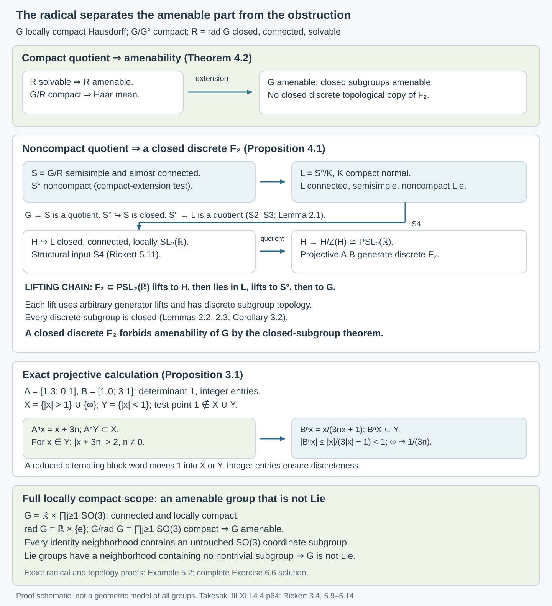

# Almost-connected groups and the solvable radical

*Original course text, October 2026. New original expression is public domain (CC0).*

## Introduction

An amenable group can contain a noncompact solvable part. The positive affine group is an example. For an almost-connected locally compact group, the obstruction lies in the quotient by that part: amenability is equivalent to compactness of the quotient by the solvable radical. We prove this at the full locally compact scope. A closed discrete free subgroup supplies the obstruction; explicit projective matrices make that subgroup visible.

Read [Haar averages and compact translation control](haar-averages-and-compact-translation-control.md) and [Closed subgroups and continuous averaging](closed-subgroups-and-continuous-averaging.md) first. Their full locally compact mean, fixed-point, normal-extension and closed-subgroup proofs are used here. The reduced-word proof for the discrete free group is in [Means, Følner sets, and regular representations](means-folner-sets-and-regular-representations.md), Example 4.4.

Throughout, groups are locally compact Hausdorff unless explicitly stated otherwise. No countable base, separability, metrizability or unimodularity is assumed. Section 1A proves the compact-normal quotient input S3 in full, at its stated compact-representation and finite-dimensional Lie prerequisites. Section 1B proves the compact case and the reduction of arbitrary locally compact Lie approximation to the metrizable case, including the quotient topology and metrization proofs. Section 1C constructs the Lie radical and proves the full locally compact radical assertion S1 assuming S2. Sections 1D–1E construct compact conjugation and prove the closed rank-one subgroup input S4 at the explicit root, Lie and geometry prerequisites. The general metrizable Lie-approximation theorem remains unfinished. The other arguments, examples and exercise solutions are given below.

## 1. Means, components, and the structural inputs

A **left invariant mean** is a positive unital functional \(m\) on Haar \(L^\infty(G)\) such that
\[
m(L_gf)=m(f),\qquad L_gf(x)=f(g^{-1}x).
\tag{1.1}
\]
The group is **amenable** when such a mean exists. Use the locally completed Haar convention of the Haar lesson for groups without a sigma-compact hypothesis. Theorem 1.2 there proves equivalence with the uniformly continuous function formulation; Theorem 2.1 proves the compact convex fixed-point criterion. Thus choosing one of these equivalent criteria makes the same definition. This is the complete terminology of Takesaki's Definition XIII.4.2.

Write \(G^\circ\) for the identity component. It is closed and characteristic: translations identify all components, and every continuous automorphism fixes the component containing the identity. A group is **almost connected** when \(G/G^\circ\) is compact. A subgroup is **solvable** when its algebraic derived series reaches the identity after finitely many steps.

Here are the four structure inputs used in the proof. They concern general locally compact groups or finite-dimensional Lie groups as specified.

| Input | Exact assertion | Source locator |
| --- | --- | --- |
| S1 | A locally compact group has a largest connected solvable normal subgroup, its radical \(R=\operatorname{rad}G\). It is closed and characteristic. | Corollary 1C.9 below, conditional on S2; classical credit: Iwasawa, as recorded in [Rickert], Section 3, pages 439–440. |
| S2 | A connected locally compact group has a compact normal subgroup \(K\) with Lie quotient. | [Rickert], Theorem 1.1, pages 433–434, applied to a connected group; its proof uses the structure theorem of Gleason, Montgomery–Zippin and Yamabe, which is proved in [Tao], Theorem 1.1.17 and Section 1.5. |
| S3 | A quotient of a connected semisimple locally compact group by a compact normal subgroup is semisimple. | Theorem 1A.10 below; classical credit: [Rickert], Lemma 3.4, page 440. |
| S4 | A noncompact connected semisimple Lie group has a closed connected Lie subgroup locally isomorphic to \(\mathrm{SL}_2(\mathbb R)\). | Theorem 1E.1 below, at the exact root/Lie/geometry providers; classical credit: [Rickert], Lemmas 3.11 and 5.11, pages 442 and 452. |

In these assertions, **semisimple** means that the connected solvable radical is trivial. Section 1A proves S3 by establishing Iwasawa's compact-normal centralizer factorization and the compact-kernel component theorem. Sections 1D–1E construct compact conjugation, a real restricted-weight split triple, a closed adjoint matrix image and its closed inverse-image component in the original group. Section 1C proves S1 using S2 and the explicit finite-dimensional providers. The full local S3 proof does not assert closure of their foundations.

We also use the elementary Lie correspondence between closed subgroups and Lie subalgebras, the exponential chart, and the fact that a connected group locally isomorphic to \(\mathrm{SL}_2(\mathbb R)\) has adjoint quotient \(\mathrm{PSL}_2(\mathbb R)\). The latter follows from integration of the adjoint Lie algebra: the adjoint image is the connected inner automorphism group of \(\mathfrak{sl}_2(\mathbb R)\), and its kernel is the center. No finiteness assumption on that center is required.

**Lemma 1.1 (radical bookkeeping).** The radical of \(G^\circ\) equals the radical of \(G\). The quotient \(G/R\) is semisimple. If \(G\) is almost connected, so is \(G/R\), and
\[
(G/R)^\circ=G^\circ/R,\qquad
(G/R)/(G/R)^\circ\cong G/G^\circ.
\tag{1.2}
\]

*Proof.* Every connected normal solvable subgroup of \(G\) lies in \(G^\circ\), and hence in \(\operatorname{rad}(G^\circ)\). Conversely the latter radical is characteristic in \(G^\circ\), so is normal in \(G\). This proves equality.

To check semisimplicity of \(G/R\), let \(P\) be a connected solvable normal subgroup of that quotient. Replacing it by its closure preserves these three properties: continuity of commutators preserves a finite derived-length bound, and closure preserves connectedness and normality. Its inverse image \(E\) has connected kernel \(R\) and connected quotient \(P\), so is connected. Indeed, a separation of \(E\) would separate its connected coset fibers; both pieces would be saturated and their images would separate \(P\), since the quotient map is open. The extension of two solvable groups is solvable: after as many derived steps as needed for \(P\), the derived subgroup lies in \(R\), and then terminates. Thus \(E\) is connected, solvable and normal in \(G\), so \(E\subset R\). Therefore \(P\) is trivial.

The component quotient \(G/G^\circ\) is totally disconnected, as proved in Section 1A.4 using Lemma 1A.5. The closed connected subgroup \(G^\circ/R\) of \(G/R\) is consequently its identity component: any larger connected component would have a nontrivial connected image in \(G/G^\circ\). This gives (1.2) and the almost-connected conclusion. \(\square\)

The solvability convention is compatible with closed derived series. If \(D\) is dense in a group, continuity of commutators puts each successive commutator of \(\overline D\) in the closure of the corresponding derived subgroup of \(D\), by induction. A finite termination bound therefore passes to the closure. This is the fact used above and in the Haar lesson's proof that solvable locally compact groups are amenable.

## 1A. Compact normal quotients and connected solvable lifts

A compact normal subgroup need not be solvable or connected. Lifting a solvable subgroup of the quotient through the whole kernel therefore does not immediately produce a solvable subgroup of the original group. The centralizer supplies the right lift: after replacing the kernel by its compact abelian centre, the finite derived series acquires at most one extra step. The component theorem then produces a connected normal lift.

For a group \(A\), define its algebraic derived series by \(D^0A=A\) and \(D^{j+1}A=[D^jA,D^jA]\), where the brackets mean the subgroup generated by all commutators. “Solvable” means \(D^dA=\{e\}\) for some finite integer \(d\). A connected solvable normal subgroup need not initially be closed.

We first prove these two mechanisms. The conclusion is Theorem 1A.10, which supplies the compact-normal quotient input used in Proposition 4.1. Section 1C proves existence of the largest solvable radical assuming S2. General Lie approximation remains a separate structure input; Sections 1D–1E prove the closed rank-one subgroup theorem at their exact root, Lie and geometry prerequisites.

The representation prerequisites are [finite-dimensional complete reducibility](https://kokunoyumeto.github.io/open-math-courses-public/courses/representations-of-compact-groups/reader/courses/representations-of-compact-groups/representations-of-compact-groups-unitarity-complete-reducibility-and-finite-dimension.html#result-proposition-1-2), [finite-dimensionality of compact irreducibles](https://kokunoyumeto.github.io/open-math-courses-public/courses/representations-of-compact-groups/reader/courses/representations-of-compact-groups/representations-of-compact-groups-unitarity-complete-reducibility-and-finite-dimension.html#result-theorem-2-7), [Schur orthogonality](https://kokunoyumeto.github.io/open-math-courses-public/courses/representations-of-compact-groups/reader/courses/representations-of-compact-groups/matrix-coefficients-and-the-peter-weyl-theorem.html#result-theorem-2-1), and [Peter–Weyl point separation](https://kokunoyumeto.github.io/open-math-courses-public/courses/representations-of-compact-groups/reader/courses/representations-of-compact-groups/matrix-coefficients-and-the-peter-weyl-theorem.html#result-theorem-4-1). They apply to arbitrary compact Hausdorff groups. In the finite matrix models we use the closed Lie subgroup theorem, [matrix exponentials](https://kokunoyumeto.github.io/open-math-courses-public/courses/DG-FND/local-tools-for-bundles-and-transport.html), and [smooth quotients and local sections](https://kokunoyumeto.github.io/open-math-courses-public/courses/DG-FND/local-tools-for-bundles-and-transport.html). These inputs are applied inside finite unitary groups, where their finite-dimensional hypotheses hold.

The classical compact-normal centralizer theorem is due to Kenkichi Iwasawa, as credited in [Rickert, Theorem 1.4, printed page 434](https://www.cambridge.org/core/services/aop-cambridge-core/content/view/EA8DDE78BAC12477EB8CBA64DF42E078/S1446788700004389a.pdf/some-properties-of-locally-compact-groups.pdf#page=2). Rickert's Lemma 3.4 gives the compact-normal semisimple quotient conclusion. The proof expression below is original and imports no prose from those papers.

### 1A.1. Connected actions and irreducible classes

**Lemma 1A.1.** Suppose a connected topological group \(A\) acts continuously by automorphisms on a compact Hausdorff group \(K\). For every continuous irreducible unitary representation \(\pi\) of \(K\) and every \(a\in A\), the representations \(\pi\circ\alpha_a\) and \(\pi\) are unitarily equivalent, where \(\alpha_a\) is the action automorphism.

*Proof.* Write \(\chi_\pi(k)=\operatorname{tr}\pi(k)\). Joint continuity of \((a,k)\mapsto\chi_\pi(\alpha_a(k))\), and compactness of \(K\), give continuity of
\[
\begin{gathered}a\longmapsto \chi_\pi\circ\alpha_a\quad\text{in }C(K)\\\text{with the uniform norm}.\end{gathered} \tag{1A.1}
\]
For clarity, at \(a_0\), apply continuity at each \((a_0,k)\), then take a finite cover of \(K\) and intersect the corresponding neighbourhoods of \(a_0\). The triangle inequality gives the desired common bound on the entire fibre.

An automorphism preserves irreducibility. Schur orthogonality gives
\[
\|\chi_\sigma\|_2=1,\qquad
\|\chi_\sigma-\chi_\pi\|_2=\sqrt2
\quad\text{if }\sigma\not\simeq\pi. \tag{1A.2}
\]
Since normalized Haar measure has mass one, the \(L^2\) norm is bounded by the uniform norm. Thus a uniform neighbourhood of radius less than \(\sqrt2\) contains only characters belonging to the same irreducible class. The representation-class orbit in (1A.1) is locally constant. Connectedness makes it constant, and at the identity its class is \([\pi]\). Equivalent unitary representations have a unitary intertwiner: an invertible intertwiner can be replaced by its unitary polar factor. \(\square\)

In particular \(\ker\pi\) is invariant under every \(\alpha_a\). For every finite set \(F\) of irreducible classes, the closed normal subgroup
\[
N_F=\bigcap_{\pi\in F}\ker\pi \tag{1A.3}
\]
is \(A\)-invariant. The finite direct sum \(\rho_F=\bigoplus_{\pi\in F}\pi\) is also equivalent to its transform by every \(\alpha_a\). Its compact image
\[
L_F=\rho_F(K)\subset U\!\left(\bigoplus_{\pi\in F}V_\pi\right) \tag{1A.4}
\]
is a closed matrix subgroup and therefore a compact Lie group, possibly disconnected. The map identifies \(K/N_F\) topologically with \(L_F\), since a continuous bijection from compact to Hausdorff is a homeomorphism. The action descends to a continuous action on \(L_F\): the map \(A\times K\to A\times K/N_F\) is an open quotient map, so joint continuity descends. Peter–Weyl point separation gives
\[
\bigcap_F N_F=\{e\}. \tag{1A.5}
\]
Every index here is an arbitrary finite subset of the complete irreducible dual. No sequence exhausts the representations.

### 1A.2. Normalizers of disconnected compact matrix groups

The next argument is the crucial finite-dimensional innerness proof. It handles disconnected groups without reducing their automorphisms merely to automorphisms of the Lie algebra.

**Lemma 1A.2.** Let \(L\) be a closed subgroup of \(U(n)\), and put
\[
\begin{gathered}N=N_{U(n)}(L),\qquad C=C_{U(n)}(L),\\\mathfrak l=\operatorname{Lie}(L).\end{gathered}
\]
Then \(N,C\) are compact Lie groups, \(C\) is normal in \(N\), and
\[
\mathfrak n=\mathfrak l+\mathfrak c,\qquad
N^\circ=L^\circ C^\circ. \tag{1A.6}
\]

*Proof.* The centralizer is an intersection of closed commuting equations. The normalizer is closed: if a net \(u_i\in N\) converges to \(u\), then \(u\ell u^{-1}\in L\) for every \(\ell\in L\), and applying the same argument to \(u_i^{-1}\) gives equality rather than just containment. Both are closed in the compact Lie group \(U(n)\), hence compact embedded Lie subgroups by the exact closed-subgroup theorem. Conjugating a centralizer element by a normalizer element again centralizes \(L\), so \(C\lhd N\).

On \(\mathfrak u(n)\) use the real positive definite invariant form
\[
\langle X,Y\rangle=-\operatorname{Re}\operatorname{tr}(XY). \tag{1A.7}
\]
For skew-Hermitian \(X\), \(-\operatorname{Re}\operatorname{tr}(X^2)=\operatorname{tr}(X^*X)>0\) unless \(X=0\). Cyclicity of trace makes conjugation by \(U(n)\) orthogonal and gives the usual infinitesimal invariance identity. In particular \(\mathfrak l^\perp\) is stable under \(\operatorname{ad}\mathfrak l\), and under \(\operatorname{Ad}(L)\).

Take \(X\in\mathfrak n\), and decompose it orthogonally as \(X=Y+Z\), with \(Y\in\mathfrak l\) and \(Z\perp\mathfrak l\). Since \(\exp(tX)\) normalizes \(L\), differentiation of its adjoint action gives \([X,\mathfrak l]\subset\mathfrak l\). Therefore \([Z,\mathfrak l]\subset\mathfrak l\). But \(\mathfrak l^\perp\) is \(\operatorname{ad}\mathfrak l\)-stable, so this bracket also lies in \(\mathfrak l^\perp\), and consequently
\[
[Z,\mathfrak l]=0. \tag{1A.8}
\]
In particular \([Y,Z]=0\). Thus
\[
\exp(tZ)=\exp(tX)\exp(-tY)\in N,
\]
so \(Z\in\mathfrak n\) as well.

This is where the disconnected components must be checked. For any \(\ell\in L\), the curve
\[
\exp(tZ)\ell\exp(-tZ)\ell^{-1}
\]
lies in \(L\), begins at the identity, and has derivative
\[
Z-\operatorname{Ad}_\ell Z\in\mathfrak l. \tag{1A.9}
\]
Both terms on the left belong to \(\mathfrak l^\perp\), since \(L\) preserves that orthogonal complement. Hence (1A.9) is zero. It holds for every component and every \(\ell\in L\), so \(Z\) centralizes all of \(L\), not just \(L^\circ\). Therefore \(Z\in\mathfrak c\). We have proved \(\mathfrak n\subset\mathfrak l+\mathfrak c\); the opposite inclusion follows because \(L,C\subset N\).

The groups \(L^\circ\) and \(C^\circ\) commute elementwise. Their product is a connected subgroup; it is compact, hence closed, and its Lie algebra is \(\mathfrak l+\mathfrak c=\mathfrak n\). One can see the last assertion directly from the differential of \((\ell,c)\mapsto\ell c\). The submersion theorem makes its image contain an identity neighbourhood of \(N^\circ\). It is therefore an open subgroup of \(N^\circ\); an open subgroup is also closed, and connectedness of \(N^\circ\) forces equality. \(\square\)

**Lemma 1A.3 (connected automorphisms of a compact Lie group are inner).** Let a connected topological group \(A\) act continuously by automorphisms on a compact Lie group \(L\), including a disconnected one. Each action automorphism is conjugation by an element of \(L^\circ\).

*Proof.* Choose a faithful continuous unitary representation \(\rho:L\hookrightarrow U(n)\). Such a representation exists by [the no-small-subgroups lemma](https://kokunoyumeto.github.io/open-math-courses-public/courses/representations-of-compact-groups/reader/courses/representations-of-compact-groups/matrix-coefficients-and-the-peter-weyl-theorem.html#result-lemma-5-1) and [the compact Lie embedding theorem](https://kokunoyumeto.github.io/open-math-courses-public/courses/representations-of-compact-groups/reader/courses/representations-of-compact-groups/matrix-coefficients-and-the-peter-weyl-theorem.html#result-theorem-5-2); in the matrix-model application (1A.4), the inclusion itself is faithful. Finite-dimensional complete reducibility and Lemma 1A.1 imply \(\rho\circ\alpha_a\simeq\rho\). A unitary intertwiner \(u_a\) then satisfies
\[
\rho(\alpha_a(\ell))=u_a\rho(\ell)u_a^{-1}\qquad(\ell\in L). \tag{1A.10}
\]
Thus \(u_a\in N=N_{U(n)}(\rho(L))\). Two implementers differ by \(C=C_{U(n)}(\rho(L))\). There is a uniquely determined homomorphism \(\psi:A\to N/C\), taking \(a\) to its implementer coset.

There is no assumption that an implementer can be chosen continuously. Instead the map
\[
\begin{aligned}N/C&\longrightarrow C(L,U(n)),\\uC&\longmapsto\bigl[\ell\mapsto u\rho(\ell)u^{-1}\bigr].\end{aligned} \tag{1A.11}
\]
is a continuous injection into the space of continuous maps with its uniform topology. Its source is compact and its target Hausdorff, so it is a homeomorphism onto its image. Joint continuity of the action and compactness of \(L\) make the right side of (1A.10), as a function of \(a\), uniformly continuous at each parameter in the sense proved in Lemma 1A.1. Composing with the inverse of (1A.11) proves continuity of \(\psi\).

For the compact Lie quotient \(N/C\), the identity component is the image of \(N^\circ\). Here this elementary Lie statement needs no general locally compact component theorem: the smooth quotient/local-section theorem makes \(N\to N/C\) a submersion. Since \(N^\circ\) is open in \(N\), its image is open; it is connected, and its cosets are open and closed. Therefore its image is exactly \((N/C)^\circ\). Connectedness of \(A\) puts \(\psi(A)\) in this image. By Lemma 1A.2 an implementing element in \(N^\circ\) factors as \(\ell c\), with \(\ell\in L^\circ\) and \(c\) centralizing \(L\). Equation (1A.10) is consequently conjugation by \(\ell\). \(\square\)

Equivalently, in the compact-open topology,
\[
\operatorname{Aut}(L)^\circ=\{\operatorname{Ad}_\ell:\ell\in L^\circ\}. \tag{1A.12}
\]
To justify this phrasing directly, apply the proof to the connected identity component of the automorphism group. Evaluation is continuous for the compact-open topology on a compact locally compact domain. Conversely the conjugation image of connected \(L^\circ\) is a connected set of automorphisms containing the identity. Formula (1A.12) is not being imported as an unproved Lie-algebra assertion.

### 1A.3. Inner action and the compact central extension

**Theorem 1A.4 (compact normal centralizer factorization).** Let \(G\) be a connected topological group and \(K\) a compact Hausdorff normal subgroup, with continuous conjugation action. Then
\[
G=K\,C_G(K). \tag{1A.13}
\]

*Proof.* Apply Section 1A.1 to the conjugation action. Every \(N_F\) is \(G\)-invariant, and \(G\) acts continuously on the compact Lie matrix group \(K/N_F\). Lemma 1A.3 makes this action inner. Fix \(g\in G\). For each finite \(F\), put
\[
\begin{aligned}
\mathcal I_F(g)=\{k\in K:\;&gxg^{-1}N_F\\
&=kxk^{-1}N_F\\&\text{for every }x\in K\}.
\end{aligned} \tag{1A.14}
\]
Innerness on \(K/N_F\) and surjectivity of \(K\to K/N_F\) make this set nonempty. It is closed in \(K\): each equality in (1A.14) is a closed equalizer in the Hausdorff quotient, and one intersects over all \(x\in K\).

For finitely many indices \(F_1,\ldots,F_m\), set \(F=\bigcup_jF_j\). Since \(N_F\subset N_{F_j}\), every implementer in \(\mathcal I_F(g)\) belongs to each \(\mathcal I_{F_j}(g)\). These compact closed sets have the finite intersection property. Compactness of \(K\) supplies \(k\) lying in every one. For every \(x\in K\), the two conjugation values now agree modulo every \(N_F\); (1A.5) makes them equal in \(K\). Thus \(k^{-1}g\in C_G(K)\), proving (1A.13). \(\square\)

The proof needs no local compactness of \(G\) at this stage. In particular it does not derive the centralizer factorization from Gleason–Yamabe. It also does not demand a compatible choice of implementers: the closed implementer sets, rather than the individual selected elements, supply compatibility.

If \(G\) is locally compact Hausdorff, write \(C=C_G(K)\). This is closed, since it is the intersection of closed commuting equations, and normal in \(G\), since \(K\lhd G\). Furthermore
\[
C\cap K=Z(K),\qquad C/Z(K)\simeq G/K \tag{1A.15}
\]
as topological groups. The map in (1A.15) is the restricted quotient map. Here is its topology, not just its algebra. If \(B\) is closed in \(C\), it is closed in \(G\). The product \(BK\) is closed because \(K\) is compact. Indeed, from a net \(b_i k_i\to x\), a subnet of \(k_i\) converges to \(k\in K\), and then \(b_i\to xk^{-1}\in B\). Equivalently the same argument proves that every point in the closure belongs to the product. Therefore \(q(B)\) is closed in \(G/K\), as its inverse image is \(BK\). The induced continuous bijection in (1A.15) is closed and hence a homeomorphism. In particular \(C\to G/K\) is an open quotient map with compact central, therefore abelian, kernel \(Z(K)\).

### 1A.4. Components through compact kernels

To lift a connected quotient subgroup, we must know exactly what happens to identity components. We prove the necessary component theorem through compact kernels, including the nonabelian compact-open-subgroup argument. The compact-space lemma below works for every compact Hausdorff space.

**Lemma 1A.5 (open maps with connected fibres).** If \(f:X\to Y\) is an open continuous surjection with connected fibres, then the inverse image of every connected subset of \(Y\) is connected.

*Proof.* For connected \(B\subset Y\), put \(E=f^{-1}(B)\). The restricted map is open: if \(U\) is open in \(X\), then \(f(U\cap E)=f(U)\cap B\). If \(E\) had a separation into relatively open nonempty parts \(E_1,E_2\), each connected fibre would be wholly in one part. Thus both parts would be saturated, their images would be disjoint nonempty relatively open sets covering \(B\), and \(B\) would be disconnected. \(\square\)

For any topological group \(H\), its identity component \(H^\circ\) is closed, since closure preserves connectedness; it is a subgroup, since the continuous image of connected \(H^\circ\times H^\circ\) under \((x,y)\mapsto xy^{-1}\) lies in the identity component; and it is normal, since conjugation fixes the identity and preserves connectedness. Its cosets are all the components by translation.

The group quotient map \(p:H\to H/H^\circ\) is open, because \(p^{-1}(p(U))=UH^\circ\) is open for open \(U\). Its fibres are connected. Lemma 1A.5 therefore says that any connected subset of \(H/H^\circ\) has connected inverse image in \(H\); that inverse image must lie in a single component, so the subset is a singleton. We have proved
\[
H/H^\circ\text{ is totally disconnected}. \tag{1A.16}
\]
This component statement itself does not require local compactness.

We will also use the elementary quotient topology facts. The quotient by a closed subgroup is Hausdorff: the relation \(x^{-1}y\in J\) is closed, and the open surjection \(p\times p\) maps its open complement onto the complement of the quotient diagonal. Quotients by closed normal subgroups are topological groups, since the quotient maps and their products are open and hence quotient maps. An open quotient map sends a compact identity neighbourhood to a compact identity neighbourhood, so a quotient of a locally compact group is locally compact. A closed subgroup is locally compact by intersecting a compact neighbourhood with it.

**Lemma 1A.6 (compact-space components and clopen neighbourhoods).** In a compact Hausdorff space \(X\), the component of \(x\) is the intersection \(Q\) of all clopen neighbourhoods of \(x\). If \(X\) is totally disconnected, clopen sets form a neighbourhood basis.

*Proof.* Every connected set through \(x\) lies in every such clopen set. To prove the reverse inclusion, suppose the compact intersection \(Q\) were separated into two nonempty compact parts. Normality of a compact Hausdorff space gives disjoint open neighbourhoods \(U,V\) of those parts, with \(x\in U\). The compact complement of \(U\cup V\) misses \(Q\). By the definition of the intersection, each of its points is omitted by some clopen neighbourhood of \(x\). A finite subcover of the complements gives a finite intersection \(D\) of such clopen neighbourhoods with \(Q\subset D\subset U\cup V\). Then \(D\cap U\) is clopen in \(X\), contains \(x\), and omits the nonempty part of \(Q\) in \(V\), a contradiction. Therefore \(Q\) is connected and equals the component. Normality used here follows by twice taking finite subcovers of Hausdorff separating neighbourhoods for two disjoint compact closed sets.

If every component is a singleton and \(O\) is a neighbourhood of \(x\), every point of the compact set \(X\setminus O\) is omitted by a clopen neighbourhood of \(x\). Finitely intersecting those neighbourhoods gives a clopen neighbourhood contained in \(O\). \(\square\)

**Lemma 1A.7 (van Dantzig, with no commutativity assumption).** In every totally disconnected locally compact Hausdorff group \(T\), compact open subgroups form a neighbourhood basis at the identity.

*Proof.* Let \(W\) be an identity neighbourhood, and choose a compact identity neighbourhood \(B\). Take a symmetric open identity neighbourhood \(V\) with \(V^2\subset W\cap\operatorname{int}B\). The inclusion \(\overline V\subset V^2\) follows because, for \(z\in\overline V\), the open neighbourhood \(zV\) meets \(V\), giving \(z\in VV^{-1}=V^2\). Thus \(Q=\overline V\) is compact, lies in \(W\), and contains the identity in its interior.

This compact space is totally disconnected. Lemma 1A.6 supplies a subset \(D\) clopen in \(Q\), with \(e\in D\subset\operatorname{int}Q\). It is compact and also open in \(T\): relative openness in \(Q\) and containment in the interior turn it into an ambient open set.

Use its left stabilizer
\[
S=\{t\in T:tD=D\}. \tag{1A.17}
\]
It is a subgroup. For each \(d\in D\), continuity of multiplication gives an identity neighbourhood \(A_d\) and a neighbourhood \(O_d\) of \(d\) such that \(A_dO_d\subset D\). Finitely many \(O_d\)'s cover compact \(D\). Intersect their identity neighbourhoods and shrink to a symmetric open \(A\). Then \(AD\subset D\). Both \(aD\subset D\) and \(a^{-1}D\subset D\) hold for \(a\in A\), so \(aD=D\). Hence \(A\subset S\), and \(S\) is open.

An open subgroup is closed, because its other cosets are open. Also \(S\subset D\), since \(e\in D\). Therefore \(S\) is compact and \(S\subset W\), proving the assertion. The left stabilizer argument uses no abelian law. \(\square\)

**Corollary 1A.8.** A quotient of a totally disconnected locally compact Hausdorff group by a closed normal subgroup is totally disconnected.

*Proof.* Let \(r:T\to T/J\) be the open quotient map. In the inverse image of any quotient identity neighbourhood, Lemma 1A.7 gives a compact open subgroup \(S\). The image \(r(S)\) is a compact open subgroup in that neighbourhood, and is closed because the quotient is Hausdorff. These clopen neighbourhoods separate the quotient identity from every other point. Translations then exclude every connected set with two different points. \(\square\)

**Theorem 1A.9 (components through a compact kernel).** If \(H\) is locally compact Hausdorff and \(N\lhd H\) is compact, then the quotient map satisfies
\[
q(H^\circ)=(H/N)^\circ. \tag{1A.18}
\]

*Proof.* Set \(M=q(H^\circ)\). Products of a closed set with a compact subgroup are closed, by the argument following (1A.15). Hence \(q\) is a closed map, so \(M\) is closed; it is connected and normal as an image of \(H^\circ\).

Put \(T=H/H^\circ\), and let \(p:H\to T\) be the quotient map. By (1A.16), \(T\) is totally disconnected; it is locally compact Hausdorff by the quotient facts proved above. The subgroup \(p(N)\) is compact and normal. Corollary 1A.8 makes \(T/p(N)\) totally disconnected.

There is a topological group isomorphism
\[
(H/N)/M\ \simeq\ (H/H^\circ)/p(N). \tag{1A.19}
\]
Both iterated quotient maps out of \(H\) are open surjections with kernel \(H^\circ N\), which proves the topology as well as the algebra of (1A.19). The connected image of \((H/N)^\circ\) in this totally disconnected quotient is trivial. Therefore \((H/N)^\circ\subset M\). The reverse inclusion follows because \(M=q(H^\circ)\) is connected and contains the identity. \(\square\)

Compactness of the kernel has a precise role: it makes \(q(H^\circ)\) closed. No step assumes local connectedness or path connectedness of \(H\), \(N\), or the solvable quotient subgroup.

### 1A.5. The compact-normal quotient theorem

**Theorem 1A.10 (compact-normal quotients).** Let \(G\) be a connected locally compact Hausdorff group whose only connected algebraically solvable normal subgroup is \(\{e\}\). For every compact normal subgroup \(K\), the quotient \(G/K\) has the same property. No countability, linearity or finite-centre hypothesis is required.

*Proof.* Put \(C=C_G(K)\), and identify \(G/K\) with \(C/Z(K)\) using (1A.15). Suppose \(P\) is a connected solvable normal subgroup of \(G/K\), of derived length at most \(d<\infty\). Replace \(P\) by its closure. This remains connected and normal and has the same finite derived-length bound: continuity of commutators gives, by induction,
\[
D^j(\overline P)\subset\overline{D^jP}. \tag{1A.20}
\]
Thus \(\overline P\) terminates at step \(d\), and it suffices to handle closed \(P\).

Let
\[
E=C\cap q^{-1}(P).
\]
It is a closed subgroup, hence locally compact Hausdorff, and is normal in \(G\), since both \(C\) and \(q^{-1}(P)\) are normal in \(G\). Its restricted quotient onto \(P\) is open: restricting an open quotient map to the full preimage of a subgroup gives the subgroup quotient topology, because \(q_C(O)\cap P=q_C(O\cap E)\) for \(O\) open in \(C\). Its kernel is precisely \(Z(K)\). This is compact and abelian. Consequently
\[
D^dE\subset Z(K),\qquad D^{d+1}E=\{e\}. \tag{1A.21}
\]
The identity component \(E^\circ\) is characteristic in \(E\) under topological automorphisms, and therefore normal in \(G\); it is connected and algebraically solvable. The assumption on \(G\) forces \(E^\circ=\{e\}\). Theorem 1A.9, applied to \(E\to P\), gives \(q(E^\circ)=P^\circ=P\). Hence \(P=\{e\}\), as required. \(\square\)

One also obtains the stronger centralizer form used by Rickert: for connected locally compact \(G\), Theorem 1A.9 makes the map \(C^\circ\to G/K\) onto, so
\[
G=K C^\circ. \tag{1A.22}
\]
In that case \(C^\circ\cap K\) is central in \(G\): it commutes with \(K\) by belonging to \(C\), and with \(C^\circ\) by belonging to \(K\), while those two groups generate \(G\).

*Figure 2. The compact-normal mechanism proving S3 (Theorem 1A.10). The domain is a connected locally compact Hausdorff group \(G\), with arbitrary compact normal \(K\), and no nontrivial connected algebraically solvable normal subgroup in \(G\). Lemma 1A.1 fixes irreducible classes and gives all finite models \(K/N_F\). The projection in Lemma 1A.2 checks every component of each matrix group; here \(C_m=C_{U(n)}(L)\). Lemma 1A.3 makes the continuous implementer coset an inner action; no continuous choice of individual implementers is assumed. Theorem 1A.4 uses closed implementer sets and finite-union refinement to prove \(G=K C_G(K)\), and proves the homeomorphism \(C_G(K)/Z(K)\cong G/K\). Lemmas 1A.5–1A.7 and Corollary 1A.8 supply the component mechanism of Theorem 1A.9. Theorem 1A.10 then lifts a connected solvable normal subgroup \(P\) to \(E\), with \(D^dE\subset Z(K)\), \(D^{d+1}E=\{e\}\), and \(q(E^\circ)=P\); the hypothesis gives \(E^\circ=P=\{e\}\). The finite index sample and orthogonal axes are abstractions, not an exhaustion or dimensions of \(K\). Human credit: Iwasawa’s compact-normal theorem, identified in [Rickert, Theorem 1.4, p. 434, and Lemma 3.4, p. 440](https://www.cambridge.org/core/services/aop-cambridge-core/content/view/EA8DDE78BAC12477EB8CBA64DF42E078/S1446788700004389a.pdf/some-properties-of-locally-compact-groups.pdf).*

## 1B. Lie approximation: finite kernels and the countability reduction

The general Lie-approximation input S2 concerns a connected locally compact Hausdorff group, which may have no countable neighbourhood base. Two preliminary steps are sometimes hidden when that input is cited: the compact case needs only finitely many representations at each neighbourhood, and the general case can first pass through a compact kernel to a metrizable open subgroup. We prove those steps here. The remaining theorem for metrizable locally compact groups is still an input; the argument below does not replace its no-small-subgroups and Lie-structure proofs.

For classical credit, the finite-kernel argument is the compact Peter–Weyl route to Lie approximation. The countability reduction and the metrization argument are the Kakutani–Gleason part of that route; see Terence Tao, *Hilbert's Fifth Problem and Related Topics*, Sections 1.4–1.5, especially Theorem 1.4.14, Theorem 1.5.2 and Exercise 1.5.4. The [author's freely accessible preliminary version](https://terrytao.wordpress.com/wp-content/uploads/2014/11/gsm-153.pdf) supplies a reading source. We organize the argument around compact fibres and kernel lifting, and give a direct word-cost proof of metrization.

**Proposition 1B.1 (the compact case, without a countable base).** Let \(C\) be a compact Hausdorff group and \(U\) an open neighbourhood of its identity. There is a compact normal subgroup \(N\subset U\) such that \(C/N\) is a compact Lie group.

*Proof.* Peter–Weyl point separation says that, for each \(x\ne e\), some finite-dimensional continuous unitary representation \(\pi_x\) has \(\pi_x(x)\ne I\). The open sets
\[
\{y\in C:\pi_x(y)\ne I\},\qquad x\in C\setminus U,
\]
cover the compact set \(C\setminus U\). Choose a finite subcover, with representations \(\pi_1,\ldots,\pi_r\), and take their direct sum \(\pi\). Its kernel \(N\) is closed and normal in \(C\), hence compact, and the covering property gives \(N\subset U\). If \(U=C\), the trivial representation gives the same conclusion with \(N=C\).

The image \(\pi(C)\subset U(n)\) is compact and therefore closed. The closed Lie subgroup theorem makes it a compact Lie group. The induced continuous bijection \(C/N\to\pi(C)\) is a homeomorphism, because its source is compact and its target Hausdorff. This proves the assertion. Only finitely many representations were chosen for this one neighbourhood; no countable family separating all of \(C\) was assumed. \(\square\)

We next record the topology needed when a compact kernel is lifted. These facts apply to arbitrary locally compact Hausdorff groups.

**Lemma 1B.2 (compact kernels give proper quotient maps).** Let \(H\) be locally compact Hausdorff and \(N\lhd H\) compact. The quotient map \(q:H\to H/N\) is open and closed. The quotient is locally compact Hausdorff, and \(q^{-1}(B)\) is compact for every compact subset \(B\subset H/N\).

*Proof.* For open \(O\subset H\), its saturation \(ON\) is a union of translates of \(O\), hence open; the quotient topology gives openness of \(q\). For closed \(F\subset H\), the product \(FN\) is closed. To verify this without a sequence assumption, let a net \(f_i n_i\) converge to \(h\). Compactness of \(N\) supplies a subnet with \(n_i\to n\in N\). Then \(f_i=(f_i n_i)n_i^{-1}\to hn^{-1}\in F\), so \(h\in FN\). Thus the saturation of \(F\) is closed and \(q\) is closed. Closedness of \(N\) makes the group quotient Hausdorff: for \(x\notin N\), choose an identity neighbourhood \(W\) with \(W^{-1}xW\cap N=\varnothing\), and the open images of sufficiently small neighbourhoods of \(e\) and \(x\) are disjoint. Translation gives separation of any two distinct cosets.

Choose a relatively compact open identity neighbourhood \(V\subset H\). The compact set \(q(\overline V)\) contains the open neighbourhood \(q(V)\); thus the quotient is locally compact. Now let \(B\) be compact. Finitely many translates \(q(h_jV)\) cover \(B\). Therefore
\[
q^{-1}(B)\subset\bigcup_{j=1}^m h_j\overline V N.
\]
The right side is compact, and the left side is closed because \(B\) is a compact subset of a Hausdorff quotient. It follows that \(q^{-1}(B)\) is compact. \(\square\)

**Lemma 1B.3 (a compact kernel with a countable quotient base).** Let \(G\) be locally compact Hausdorff and \(U\) an open identity neighbourhood. There are an open sigma-compact subgroup \(H\subset G\) and a compact normal subgroup \(N\lhd H\) such that \(N\subset U\) and \(H/N\) has a countable neighbourhood base at its identity. If \(G\) is connected, \(H=G\).

*Proof.* Choose a symmetric relatively compact open identity neighbourhood \(V\) with \(\overline V\subset U\). The subgroup
\[
H=\bigcup_{m\geq1} V^m
\]
is open. It is sigma-compact, since it is covered by the compact sets \((\overline V)^m\), each of which lies in \(H\). To check the last point, if \(x\in\overline V\), the open set \(xV\) meets \(V\), and consequently \(x\in V^2\subset H\).

Set \(E=\overline V\), a compact symmetric generating set for \(H\). We construct symmetric relatively compact open identity neighbourhoods \(W_1,W_2,\ldots\) in \(H\), with \(\overline{W_1}\subset V\), and
\[
\begin{gathered}
\overline{W_{j+1}}\subset W_j,\qquad W_{j+1}^3\subset W_j,\\
k^{-1}W_{j+1}k\subset W_j\quad(k\in E).
\end{gathered}
\tag{1B.1}
\]
Here the conjugation containment is uniform over \(E\). Indeed, continuity of \((k,w)\mapsto k^{-1}wk\) at each \((k,e)\) gives a neighbourhood of \(k\) and an identity neighbourhood for \(w\) whose images lie in \(W_j\). A finite cover of \(E\), followed by intersection of the identity neighbourhoods, makes the latter independent of \(k\). Continuity of multiplication also gives a symmetric identity neighbourhood whose cube lies in \(W_j\). Intersect the two choices and then choose a symmetric relatively compact open neighbourhood with its closure inside that intersection. Local compactness and regularity justify this final shrinking.

Define
\[
N=\bigcap_{j\geq1}\overline{W_j}=\bigcap_{j\geq1}W_j.
\tag{1B.2}
\]
The equalities follow from the first containment in (1B.1). The intersection is a nonempty compact set, since its closed sets are nested in the compact set \(\overline{W_1}\) and contain \(e\). It lies in \(U\). If \(a,b\in N\), then \(a,b^{-1}\in W_{j+1}\) for every \(j\), so \(ab^{-1}\in W_j\). Thus \(N\) is a subgroup. The conjugation containment shows \(k^{-1}Nk\subset N\) for every \(k\in E\); applying it to \(k^{-1}\in E\) gives equality. Since \(E\) generates \(H\), \(N\lhd H\).

By Lemma 1B.2 the quotient \(L=H/N\) is locally compact Hausdorff and \(q(W_j)\) are open identity neighbourhoods. They form a countable base. In fact, if \(O\subset L\) is an open identity neighbourhood, its inverse image contains \(N\). Some \(\overline{W_j}\) must lie in \(q^{-1}(O)\): otherwise the nested compact sets \(\overline{W_j}\setminus q^{-1}(O)\) would have a common point in \(N\setminus q^{-1}(O)\), which is impossible. For that \(j\), \(q(W_j)\subset O\).

Every open subgroup is closed, since its other cosets form its open complement. If \(G\) is connected, this nonempty open and closed subgroup \(H\) equals \(G\). \(\square\)

For completeness, a countable identity base really does supply a metric compatible with the topology; no metrizability hypothesis has been smuggled into Lemma 1B.3.

**Lemma 1B.4 (word-cost metrization).** A Hausdorff topological group \(L\) with a countable identity neighbourhood base has a compatible left invariant metric. If \(L\) is also sigma-compact, it is second countable.

*Proof.* Refine the given base to symmetric open sets \(A_1\supset A_2\supset\cdots\) such that \(A_{j+1}^3\subset A_j\), and put \(A_0=L\). Hausdorffness gives \(\bigcap_j A_j=\{e\}\). Define the cost of a finite word \(x_1\cdots x_r\), with \(x_i\in A_{j_i}\) and integers \(j_i\geq0\), as \(\sum_i2^{-j_i}\). Let \(p(x)\) be the infimum of all such costs for words with product \(x\); allow the empty word, of cost zero, for \(e\). Every element has a one-letter word of cost one. Reversing a word and taking inverses preserves its cost, and concatenating words adds costs. Therefore
\[
p(x^{-1})=p(x),\qquad p(xy)\leq p(x)+p(y).
\tag{1B.3}
\]

The needed lower bound comes from this word estimate:
\[
\begin{gathered}
\sum_{i=1}^r2^{-j_i}<2^{-n},\quad n\geq1\\
\Longrightarrow\quad x_1\cdots x_r\in A_{n-1}.
\end{gathered}
\tag{1B.4}
\]
Prove it by induction on the length \(r\), simultaneously for all \(n\). For a single letter, its cost is less than \(2^{-n}\), so \(j_1\geq n+1\) and the assertion holds. For a longer word, write \(s\) for its total cost. Choose the letter at which the running sum first reaches \(s/2\). The words strictly before and strictly after that letter each have total cost at most \(s/2<2^{-(n+1)}\). They have shorter length, so by induction their products lie in \(A_n\); an empty side has product \(e\in A_n\). The middle letter belongs to \(A_n\) as well, because its cost is at most \(s<2^{-n}\). The full product lies in \(A_n^3\subset A_{n-1}\). This proves (1B.4); it does not rearrange the letters, which matters in a noncommutative group.

If \(p(x)<2^{-n}\), an approximating word of cost less than \(2^{-n}\) shows \(x\in A_{n-1}\). If \(x\in A_n\), its one-letter word gives \(p(x)\leq2^{-n}\). Hence \(p(x)=0\) forces \(x=e\), and
\[
d(x,y)=p(x^{-1}y)
\]
is a metric by (1B.3), invariant under common left multiplication. The two inclusions just proved show that its balls and the sets \(A_j\) give the same neighbourhood system at \(e\), and translation gives the same topology everywhere.

If \(L\) is sigma-compact, write it as a countable union of compact sets. Each compact metric space has a countable dense subset: for each integer \(m\geq1\), take the centres of a finite cover by balls of radius \(1/m\), and unite those finite sets. Their union over the compact covering sets is countable and dense in \(L\). A metric space with a countable dense subset has the countable base of balls with those centres and positive rational radii. Thus \(L\) is second countable. \(\square\)

**Proposition 1B.5 (the exact reduction for S2).** Suppose the following metrizable theorem is available: every metrizable locally compact Hausdorff group \(L\), and every open identity neighbourhood \(O\subset L\), admit an open subgroup \(L'\subset L\) and a compact normal subgroup \(B\lhd L'\), with \(B\subset O\) and \(L'/B\) a Lie group. Then the same assertion holds for every locally compact Hausdorff group \(G\). For connected \(G\), the resulting open subgroup is all of \(G\), giving exactly S2.

*Proof.* Fix an open identity neighbourhood \(U\subset G\). Use Lemma 1B.3 to obtain \(H\) and \(N\subset U\), and let \(q:H\to L=H/N\). Lemma 1B.4 makes \(L\) metrizable. There is an open identity neighbourhood \(W\subset H\) with \(WN\subset U\). To verify this shrinking, for each \(n\in N\), continuity gives an identity neighbourhood \(W_n\) and a neighbourhood \(T_n\) of \(n\) with \(W_nT_n\subset U\). Take a finite cover of the compact set \(N\) by these \(T_n\), and intersect the corresponding \(W_n\).

The set \(O=q(W)\) is an open identity neighbourhood in \(L\), and \(q^{-1}(O)=WN\subset U\). Apply the stated metrizable theorem to obtain \(L'\) and \(B\). Set
\[
G'=q^{-1}(L'),\qquad K=q^{-1}(B).
\]
Then \(G'\) is open in \(H\), hence in \(G\); \(K\) is normal in \(G'\), is contained in \(U\), and is compact by Lemma 1B.2. The surjective composite \(G'\to L'\to L'/B\) is continuous and open, with kernel \(K\). It consequently induces a topological group isomorphism \(G'/K\cong L'/B\), a Lie group. If \(G\) is connected, \(G'=G\) because an open subgroup is closed. \(\square\)

This reduction retains the arbitrary locally compact scope. It leaves a specific mathematical obligation: the metrizable theorem in Proposition 1B.5. In particular, a proof only for compact groups, or an invocation that a no-small-subgroups group is Lie without its proof, does not finish S2.

**Exercise 1B.1 (what a finite compact quotient can see).** *Level 2.* Let \(I\) be uncountable, let \(C=\mathbb T^I\) with the product topology, and let \(U\) be any open identity neighbourhood. Prove directly that there is a compact normal subgroup \(N\subset U\) with \(C/N\) a finite-dimensional torus. Prove also that \(C\) has no countable identity neighbourhood base. Explain why these two facts are consistent with Proposition 1B.1.

*Solution.* Choose a basic product neighbourhood inside \(U\). It restricts only finitely many coordinates, say those in \(F\subset I\), and each restriction contains \(1\). The subgroup
\[
N=\{z\in\mathbb T^I:z_i=1\text{ for every }i\in F\}
\]
is a closed subgroup of the compact Hausdorff product, hence compact, and it is normal because the product is abelian. It lies in the chosen product neighbourhood. Projection onto \(F\) is a continuous surjection with kernel \(N\); compactness and Hausdorffness identify \(C/N\) topologically with \(\mathbb T^F\).

Suppose that \(O_1,O_2,\ldots\) were a countable identity base. For each \(n\), choose a basic product neighbourhood \(B_n\subset O_n\), restricting a finite set \(F_n\). Their union is countable, so choose \(i\in I\setminus\bigcup_nF_n\). Let \(W\) be the identity neighbourhood requiring \(z_i\) to lie in a fixed proper open arc around \(1\). A base would give \(O_n\subset W\) for some \(n\), and then \(B_n\subset W\). But \(B_n\) leaves coordinate \(i\) unrestricted, a contradiction. Each neighbourhood permits a finite Lie quotient, while different neighbourhoods may require different finite coordinate sets; the proposition does not assert a countable family sufficient for every neighbourhood.

**Exercise 1B.2 (why the open subgroup is part of the statement).** *Level 1.* Let \(D\) be an uncountable discrete group and \(G=\mathbb R\times D\), with the product topology. Prove that \(G\) is locally compact Hausdorff but is not sigma-compact. For \(V=(-1,1)\times\{e\}\), identify the subgroup \(H=\bigcup_{m\geq1}V^m\) in Lemma 1B.3. Prove that the connectedness qualification at the end of Proposition 1B.5 is exactly what removes this proper open subgroup.

*Solution.* Each point has a neighbourhood with compact closure, namely an interval with compact closure times a singleton of \(D\); the product is Hausdorff. A compact subset of \(G\) projects to a compact subset of the discrete space \(D\), hence to a finite set. A countable union of compact subsets therefore projects to at most countably many elements of \(D\), so it cannot cover \(G\).

Addition in the real coordinate gives \(V^m=(-m,m)\times\{e\}\) and \(H=\mathbb R\times\{e\}\). This is a proper open and closed sigma-compact subgroup. Every connected subset containing the identity has constant projection to \(D\), and \(\mathbb R\times\{e\}\) itself is connected; thus it is \(G^\circ\). The construction cannot force \(H=G\) here. For a connected group, however, the complement of any proper open subgroup is a nonempty union of open cosets, giving a separation. This is the step that forces \(H=G\), and subsequently \(G'=G\), in the connected case.

## 1C. Constructing the closed solvable radical

The full locally compact radical requires a common finite bound, not just solvability of each subgroup separately. We first establish the unrestricted finite-dimensional Lie-group contract, including nonlinear groups and infinite centres. Then one compact Lie quotient supplies the same bound for every connected solvable normal subgroup of the original group. This proves S1 at the Lie-approximation input S2; the remaining metrizable Gleason–Yamabe theorem in Proposition 1B.5 is still an explicit prerequisite.

The finite-dimensional prerequisites are the closed subgroup theorem, [connected immersed integration](https://kokunoyumeto.github.io/open-math-courses-public/courses/DG-FND/flat-connections-and-infinitesimal-holonomy.html), and the [smoothly generated subgroup proof](https://kokunoyumeto.github.io/open-math-courses-public/courses/DG-FND/curvature-and-holonomy-groups.html). Covering groups, unrestricted-target integration, the adjoint differential and the compact Lie-algebra structure are proved in [Compact Lie groups, their Lie algebras and the adjoint representation](https://kokunoyumeto.github.io/open-math-courses-public/courses/representations-of-compact-groups/reader/courses/representations-of-compact-groups/compact-lie-groups-their-lie-algebras-and-the-adjoint-representation.html), Theorems 1.2 and 3.2. Peter–Weyl point separation is the arbitrary compact Hausdorff theorem already linked in Section 1A. Ordinary inverse-function calculus and exponential neighbourhoods retain their stated finite-dimensional scope.

The radical and quotient algebra assertions can also be compared with [Etingof, Section 16.1](https://ocw.mit.edu/courses/18-745-lie-groups-and-lie-algebras-i-fall-2020/mit18_745_f20_lec_full.pdf#page=85). The locally compact radical is classically attributed to Iwasawa in [Rickert, Section 3, printed pages 439–440](https://www.cambridge.org/core/services/aop-cambridge-core/content/view/EA8DDE78BAC12477EB8CBA64DF42E078/S1446788700004389a.pdf/some-properties-of-locally-compact-groups.pdf#page=7).

### 1C.1. The finite-dimensional contract and radical ideal

Let \(G\) be a connected finite-dimensional real Lie group, with the usual Hausdorff, second-countable manifold convention, and let \(\mathfrak g=T_eG\). There is no assumption of linearity, simple connectivity, compactness, or finite centre.

For an abstract subgroup \(A\), its **algebraic** derived series is

\[
D^0A=A,\qquad D^{j+1}A=[D^jA,D^jA],
\]

where the bracket denotes the subgroup generated by all commutators \(aba^{-1}b^{-1}\). No closure is taken. For a Lie algebra,

\[
\begin{aligned}
D_{\mathrm{Lie}}^0\mathfrak a&=\mathfrak a,\\
D_{\mathrm{Lie}}^{j+1}\mathfrak a&=\operatorname{span}_{\mathbb R}
\{[X,Y]:X,Y\in D_{\mathrm{Lie}}^j\mathfrak a\}.
\end{aligned}
\]

Solvability means that the appropriate series vanishes after finitely many steps. Group **characteristicness** here concerns continuous group automorphisms, matching the convention of this lesson. No assertion about discontinuous abstract automorphisms is needed.

**Theorem 1C.5.** The Lie algebra \(\mathfrak g\) has a largest solvable ideal \(\mathfrak r\). Its unique connected immersed integration is a subgroup \(R\subset G\) such that:

1. \(R\) is closed, connected, normal and embedded, and \(\operatorname{Lie}(R)=\mathfrak r\).
2. \(R\) is algebraically solvable, with the uniform bound
   \[
   D^{\dim\mathfrak r}R=\{e\}.
   \tag{1C.1}
   \]
   In dimension zero this says \(R=\{e\}\).
3. Every connected algebraically solvable normal subgroup \(P\subset G\), even one that is not closed, is contained in \(R\).
4. \(R\) is characteristic under continuous automorphisms.

The bound (1C.1) is a convenient upper bound, not a claim about minimal derived length or equality with the Lie-algebra derived length.

**Lemma 1C.1.** A finite-dimensional real Lie algebra has a largest solvable ideal \(\mathfrak r\), preserved by every Lie-algebra automorphism. The quotient \(\mathfrak g/\mathfrak r\) has no nonzero solvable ideal, and in particular has zero centre.

**Proof.** Subalgebras inherit solvability by containment of derived terms, and quotients inherit it by taking their images. An extension of solvable Lie algebras is solvable: if \(I\triangleleft\mathfrak a\), \(D_{\mathrm{Lie}}^u I=0\), and \(D_{\mathrm{Lie}}^v(\mathfrak a/I)=0\), then \(D_{\mathrm{Lie}}^v\mathfrak a\subset I\), so \(D_{\mathrm{Lie}}^{u+v}\mathfrak a=0\).

For solvable ideals \(I,J\), the ideal \(I+J\) is an extension of \(I\) by \(J/(I\cap J)\), hence is solvable. Any finite sum is therefore solvable. The sum of all solvable ideals is already a finite sum: choose a basis of this finite-dimensional sum, and collect the finitely many ideals needed to express its finitely many basis vectors. This sum \(\mathfrak r\) is consequently solvable, is an ideal, and contains every solvable ideal. Automorphisms permute those ideals, hence preserve \(\mathfrak r\).

The inverse image of any solvable ideal in \(\mathfrak g/\mathfrak r\) would be a solvable extension of \(\mathfrak r\). Maximality puts that inverse image inside \(\mathfrak r\), so the quotient ideal is zero. Its centre is an abelian ideal and must therefore be zero. \(\square\)

This is exactly the semisimple-quotient property used in the group proof; it requires no structure theorem for semisimple groups.

### 1C.2. Lie solvability and finite group bounds

**Lemma 1C.2 (closure preserves a finite algebraic bound).** If \(A\) is a subgroup of a Hausdorff topological group, then

\[
D^j\overline A\subset\overline{D^jA}\qquad(j\ge0).
\tag{1C.2}
\]

In particular \(D^dA=\{e\}\) implies \(D^d\overline A=\{e\}\).

**Proof.** Continuity of the commutator map puts every commutator of two elements of \(\overline A\) in \(\overline{[A,A]}\). The latter is a closed subgroup, so it contains the subgroup generated by those commutators. For induction, use the containment at \(j\), monotonicity of the commutator subgroup, and this first-step assertion applied to \(D^jA\). At \(d\), the right side is \(\{e\}\), closed in a Hausdorff group. \(\square\)

The closure of a connected subgroup is connected; the closure of a normal subgroup is normal since conjugation is a homeomorphism. Thus connectedness, normality and a finite algebraic bound all survive closure. No derived subgroup is assumed closed.

**Lemma 1C.3 (algebraically solvable group implies solvable Lie algebra).** The Lie algebra of a closed algebraically solvable Lie subgroup \(H\) is solvable. If \(H\) is normal in \(G\), that Lie algebra is an ideal of \(\mathfrak g\).

**Proof.** Suppose \(D^dH=\{e\}\), and in \(H\) put

\[
C_j=\overline{D^jH},\qquad \mathfrak c_j=\operatorname{Lie}(C_j).
\]

Each \(C_j\) is a closed Lie subgroup. The continuity argument above gives \([C_j,C_j]\subset C_{j+1}\). For \(X,Y\in\mathfrak c_j\) and fixed real \(t\), the curve

\[
s\longmapsto \exp(tX)\exp(sY)\exp(-tX)\exp(-sY)
\]

lies in \(C_{j+1}\) and starts at \(e\). Its tangent vector is

\[
\operatorname{Ad}_{\exp(tX)}Y-Y\in\mathfrak c_{j+1}.
\]

Divide by \(t\ne0\) and let \(t\to0\). The linear subspace \(\mathfrak c_{j+1}\) is closed, and the adjoint differential is the Lie bracket. Hence \([\mathfrak c_j,\mathfrak c_j]\subset\mathfrak c_{j+1}\), and induction gives \(D_{\mathrm{Lie}}^j\operatorname{Lie}(H)\subset\mathfrak c_j\). At \(d\), \(C_d=\{e\}\) and \(\mathfrak c_d=0\).

If \(H\) is normal, conjugation by \(g\in G\) preserves its closed embedded Lie structure, so \(\operatorname{Ad}_g\operatorname{Lie}(H)=\operatorname{Lie}(H)\). Differentiating at \(g=\exp(tX)\) proves \([X,Y]\in\operatorname{Lie}(H)\) for \(X\in\mathfrak g\), \(Y\in\operatorname{Lie}(H)\). \(\square\)

**Lemma 1C.4 (solvable Lie algebra implies a finite algebraic group bound).** If \(A\) is a connected finite-dimensional real Lie group and its solvable Lie algebra \(\mathfrak a\) has dimension \(n\), then \(D^nA=\{e\}\).

**Proof.** Induct on \(n\), for all connected Lie groups of that dimension. A connected zero-dimensional Lie group is trivial. For \(n>0\), the commutator algebra \([\mathfrak a,\mathfrak a]\) is proper; otherwise the derived series could never vanish. Choose a nonzero linear functional

\[
\ell:\mathfrak a\to\mathbb R,\qquad \ell([\mathfrak a,\mathfrak a])=0.
\]

It is a Lie-algebra homomorphism to the abelian algebra \(\mathbb R\). Take the connected simply connected covering Lie group \(p:\widetilde A\to A\), and identify its Lie algebra with \(\mathfrak a\) by \(dp_e\). Integration gives a smooth homomorphism

\[
\chi:\widetilde A\to(\mathbb R,+),\qquad d\chi_e=\ell.
\]

Choose \(X\) with \(\ell(X)=1\). Then \(\chi(\exp(tX))=t\), so \(\chi\) is surjective. Its kernel \(B\) is a closed Lie subgroup with solvable Lie algebra \(\ker\ell\) of dimension \(n-1\).

It is also connected, a property not inferred merely from its being a kernel. The continuous map

\[
q:\widetilde A\to B,\qquad q(a)=a\exp(-\chi(a)X)
\tag{1C.3}
\]

lands in \(B\) and fixes every \(b\in B\). Its image is exactly \(B\), so connectedness of \(\widetilde A\) implies connectedness of \(B\). Induction gives \(D^{n-1}B=\{e\}\). Since the target of \(\chi\) is abelian, \(D^1\widetilde A\subset B\), whence \(D^n\widetilde A\subset D^{n-1}B=\{e\}\). Surjectivity of \(p\) sends each algebraic derived term onto the corresponding one in \(A\). This proves the claim. \(\square\)

The covering kernel may be infinite. Also the real Lie-algebra character need not descend to \(A\) itself: a compact torus has no nonzero continuous real character. Working on \(\widetilde A\) and passing a finite algebraic bound through \(p\) handles both matters. No linear representation or closed-derived-subgroup assumption has entered.

### 1C.3. The adjoint quotient makes the radical closed

**Proof of Theorem 1C.5.** Let \(\mathfrak r\) be from Lemma 1C.1. Its automorphism invariance makes it invariant under every \(\operatorname{Ad}_g\). Thus on \(V=\mathfrak g/\mathfrak r\) there is a smooth homomorphism

\[
\begin{aligned}
\Theta&:G\to GL(V),\\
\Theta(g)(Y+\mathfrak r)&=\operatorname{Ad}_gY+\mathfrak r.
\end{aligned}
\tag{1C.4}
\]

The kernel \(K\) is closed and normal, hence is an embedded Lie subgroup. Its Lie algebra is \(\ker d\Theta_e\): by the closed subgroup theorem, \(X\in\operatorname{Lie}(K)\) exactly when \(\Theta(\exp(tX))=I\) for all \(t\); intertwining exponentials makes that equivalent to \(d\Theta_e(X)=0\).

Differentiation gives

\[
d\Theta_e(X)(Y+\mathfrak r)=[X,Y]+\mathfrak r.
\]

So its kernel is the inverse image of the centre of \(\mathfrak g/\mathfrak r\), which is zero by Lemma 1C.1. Consequently

\[
\operatorname{Lie}(K)=\mathfrak r.
\tag{1C.5}
\]

Set \(R=K^\circ\). Components are closed, and \(K\) is closed in \(G\), so \(R\) is closed in \(G\). Conjugation preserves the identity component, making \(R\) normal. The identity component of a Lie group has the same Lie algebra as that group; hence \(\operatorname{Lie}(R)=\mathfrak r\). It is connected and embedded.

Every \(\exp(tX)\), \(X\in\mathfrak r\), lies in \(R\), and these one-parameter subgroups generate \(R\). They also generate the unique connected immersed integration of \(\mathfrak r\), by its intrinsic exponential neighbourhoods. The two subgroups therefore coincide, and \(R\) supplies the embedded structure. This establishes closedness rather than assuming it when integrating the ideal. The matrix target \(GL(V)\) does not require a faithful representation of \(G\).

Apply Lemma 1C.4 to \(R\) to obtain the algebraic bound (1C.1).

For maximality, let \(P\subset G\) be connected, algebraically solvable and normal, with some finite bound \(D^dP=\{e\}\). The closure \(H=\overline P\) is connected and normal and has that same bound by Lemma 1C.2. It is a closed Lie subgroup. Lemma 1C.3 makes \(\mathfrak h=\operatorname{Lie}(H)\) a solvable ideal of \(\mathfrak g\), so \(\mathfrak h\subset\mathfrak r\). Its exponentials agree with those in \(G\) and lie in \(R\). They generate connected \(H\), so \(P\subset H\subset R\).

Finally, a continuous automorphism \(\alpha\) takes \(R\) to a connected algebraically solvable normal subgroup. Maximality gives \(\alpha(R)\subset R\). Applying the same fact to \(\alpha^{-1}\) yields equality. This proves characteristicness without an extra automatic-smoothness theorem for \(\alpha\). \(\square\)

If \(\mathfrak r=\mathfrak g\), then \(V=0\), \(\Theta\) has trivial target, and \(R=G\); Lemma 1C.4 still gives finite algebraic solvability. If \(\mathfrak r=0\), \(K\) has zero-dimensional Lie algebra but may be an infinite discrete subgroup; \(K^\circ=\{e\}\). A large discrete centre creates no exception.

An alternative closedness argument first applies Lemma 1C.4 to the immersed radical with its intrinsic Lie topology. Its closure is connected, normal and algebraically solvable, so Lemma 1C.3 gives a solvable ideal containing \(\mathfrak r\). Equality of Lie algebras and connected exponential generation then force equality with its closure. The kernel construction gives the closed subgroup directly.

### 1C.4. An infinite centre outside the connected radical

Take \(G=\widetilde{SL_2(\mathbb R)}\), the connected universal covering Lie group. Its centre is infinite, but its radical is trivial.

Indeed any \(M\in SL_2(\mathbb R)\) has the unique smooth factorisation

\[
\begin{gathered}
M=Q\begin{pmatrix}r&s\\0&r^{-1}\end{pmatrix},\\
Q\in SO(2),\quad r>0,\quad s\in\mathbb R.
\end{gathered}
\]

To obtain it, let \(v\ne0\) be the first column, take \(r=\|v\|\), and choose \(Q\) with columns \(v/r\) and its positive quarter-turn. Multiplying by \(Q^{-1}\) gives the displayed upper triangular matrix; determinant one fixes its second diagonal entry. The formula is a smooth inverse, so \(SL_2(\mathbb R)\) is diffeomorphic to \(SO(2)\times(0,\infty)\times\mathbb R\). The last two factors contract, and the circle \(SO(2)\) has fundamental group \(\mathbb Z\). Explicitly, lift a circle loop under \(t\mapsto(\cos(2\pi t),\sin(2\pi t))\): its endpoint is an integer, homotopy lifting preserves that integer, and its lift deforms to the straight path with that endpoint.

The covering homomorphism therefore has a discrete kernel isomorphic to \(\mathbb Z\). It is central: for any kernel element \(z\), the map \(g\mapsto gzg^{-1}\) from connected \(G\) into the discrete kernel is constant and equals \(z\) at the identity.

The Lie algebra \(\mathfrak{sl}_2(\mathbb R)\), however, is simple. In its standard basis \(E,F,H\),

\[
\begin{aligned}
[H,E]&=2E,\\
[H,F]&=-2F,\\
[E,F]&=H.
\end{aligned}
\]

Any nonzero ideal is stable under \(\operatorname{ad}H\). Polynomial projections onto its distinct eigenspaces of eigenvalues \(2,-2,0\) isolate a nonzero multiple of at least one of \(E,F,H\) in that ideal. Bracketing with the other basis vectors gives all three. The algebra has no nonzero proper ideal and is not solvable, since its commutator is the whole algebra. Its radical is zero, so Theorem 1C.5 gives \(R=\{e\}\). An infinite discrete abelian central subgroup is not part of the connected radical.

### 1C.5. Two diagnostics for nonclosed subgroups

**Exercise 1C.1 (a solvable immersed normal subgroup need not be closed).** *Level 2.*

Let \(\alpha\notin\mathbb Q\), \(T^2=\mathbb R^2/\mathbb Z^2\), and

\[
N_\alpha=\{(t,\alpha t)+\mathbb Z^2:t\in\mathbb R\}.
\]

Prove that \(N_\alpha\) is proper, dense, connected, abelian and normal. Find the radical of \(T^2\), and explain why maximality and the universal cover are essential to the preceding proof.

*Solution.* The map from \(\mathbb R\) is a smooth homomorphism. If \((t,\alpha t)\in\mathbb Z^2\), irrationality forces \(t=0\), so it is injective, giving a connected immersed subgroup with one-dimensional intrinsic Lie algebra. The ambient group is abelian, giving abelianity and normality.

At integer parameters its image contains \((0,\alpha n)+\mathbb Z^2\). The irrational rotation subgroup is dense in the circle: among arbitrarily many distinct subgroup points, division into short equal intervals gives two arbitrarily close points. Their difference, changing sign if necessary, has representative \(0<\delta<\varepsilon\). Its multiples \(0,\delta,\ldots,\lfloor1/\delta\rfloor\delta\) approximate every circle point within \(\delta\). Thus the closure contains the vertical circle. Since the parameter \(t=x\) supplies any first coordinate \(x+\mathbb Z\), addition of that vertical circle proves \(\overline{N_\alpha}=T^2\).

The point \((0,\alpha/2)+\mathbb Z^2\) is absent. Membership would force \(t\in\mathbb Z\) and \(\alpha(t-\tfrac12)\in\mathbb Z\), impossible for irrational \(\alpha\). Hence the subgroup is proper and nonclosed.

The Lie algebra of \(T^2\) is abelian, so its radical is all of \(\mathbb R^2\); the group radical is \(T^2\). The line \(\mathbb R(1,\alpha)\) is a solvable ideal but is not maximal. This disproves closedness for an arbitrary solvable ideal's integration. The radical kernel argument uses the maximal ideal and the zero centre of its semisimple quotient.

There is no nonzero continuous homomorphism \(T^2\to(\mathbb R,+)\): its image is compact, whereas any nonzero subgroup of \(\mathbb R\) is unbounded. Yet its Lie algebra has nonzero real characters. Lemma 1C.4 integrates them on the simply connected cover \(\mathbb R^2\); they need not descend to the torus. \(\square\)

**Exercise 1C.2 (a nonlinear solvable group with nonclosed derived subgroup).** *Level 3.*

This is a classical Heisenberg central-quotient diagnostic; compare [Etingof, Exercise 15.7(ii)](https://ocw.mit.edu/courses/18-745-lie-groups-and-lie-algebras-i-fall-2020/mit18_745_f20_lec_full.pdf#page=79). The cocycle below specifies the exact group law, and the solution proves nonlinearity.

Keep \(\alpha\) irrational and put \(v=(1,\alpha)\). On \(\mathbb R^2\times T^2\) define

\[
\begin{aligned}
(x,y,z)(x',y',z')&=\\
&\hspace{-4em}(x+x',y+y',z+z'+xy'v),
\end{aligned}
\tag{1C.6}
\]

with the last coordinate modulo \(\mathbb Z^2\). Verify that this is a connected Lie group \(G_\alpha\), compute its algebraic derived series and radical, and prove it has no faithful smooth homomorphism into any \(GL_m(\mathbb C)\).

*Solution.* The torus coordinate is well defined and multiplication is smooth. Associativity is the identity

\[
xy'+(x+x')y''=x'y''+x(y'+y'').
\]

The identity is \((0,0,0)\); the inverse is \((-x,-y,-z+xyv)\), which gives the identity on both sides. The underlying manifold is connected, Hausdorff and second countable, of dimension four.

Direct multiplication gives

\[
[(x,y,z),(x',y',z')]=(0,0,(xy'-x'y)v).
\tag{1C.7}
\]

All real coefficients occur, by taking \(x=t,y=0,x'=0,y'=1\). Therefore

\[
D^1G_\alpha=\{0\}\times\{0\}\times N_\alpha,\qquad
D^2G_\alpha=\{e\}.
\]

The first derived subgroup is nontrivial, central and nonclosed, with closure the central torus, by Exercise 1C.1. The group has algebraic derived length exactly two.

In Lie-algebra coordinate basis \(X,Y,Z_1,Z_2\), differentiation gives

\[
\begin{gathered}
[X,Y]=Z_1+\alpha Z_2,\\
[X,Z_i]=[Y,Z_i]=[Z_1,Z_2]=0.
\end{gathered}
\]

This algebra is solvable, so the radical is the whole algebra, and the group radical is \(G_\alpha\). The general dimension bound four is valid, though its minimal bound is two.

For nonlinearity, take any smooth homomorphism \(\rho:G_\alpha\to GL_m(\mathbb C)\) and set \(A=d\rho(X)\), \(B=d\rho(Y)\), \(C_i=d\rho(Z_i)\). Period one of each central circle gives \(\exp C_i=I\). Each \(C_i\) is diagonalizable, with eigenvalues in \(2\pi i\mathbb Z\): on a Jordan block \(\lambda I+J\), exponentiation gives \(e^\lambda=1\) and \(\exp J=I\); but

\[
\exp J-I=J(I+J/2!+\cdots)
\]

has an invertible second factor when \(J\) is nilpotent, forcing \(J=0\).

The \(C_i\) commute, giving simultaneous common eigenspaces \(W\). They commute with \(A,B\), so those spaces are invariant under \(A,B\). If their eigenvalues on \(W\) are \(\lambda_i=2\pi i n_i\), then

\[
[A|_W,B|_W]=(\lambda_1+\alpha\lambda_2)I_W.
\]

Taking the trace yields \(\lambda_1+\alpha\lambda_2=0\). Irrationality and \(n_i\in\mathbb Z\) imply \(n_1=n_2=0\). All eigenspaces therefore have zero eigenvalues, so \(C_1=C_2=0\). Exponential intertwining shows that \(\rho\) kills the entire connected central torus and cannot be faithful. A faithful real representation would also be a faithful complex one, so that is excluded as well.

This is a nonlinear group satisfying the theorem. Its nonclosed first derived subgroup directly tests the finite algebraic argument, which cannot rely on closedness of each derived term. \(\square\)

### 1C.6. One compact kernel gives a uniform bound

**Lemma 1C.6 (connected derived subgroups and closure).** Let \(P\) be a subgroup of a Hausdorff topological group \(H\), with its subspace topology, and take all closures in \(H\). If \(P\) is connected, every algebraic derived subgroup \(D^jP\) is connected. For any integer \(d\geq0\), \(D^dP=\{e\}\) implies \(D^d\overline P=\{e\}\).

*Proof.* The commutator map \(P\times P\to P\) is continuous, so its image is connected and contains the identity. The subgroup generated by this image is the increasing union of finite products of the image and its inverse. Each such product is a continuous image of a connected finite product and contains the identity. The union is connected. Iteration proves connectedness of every \(D^jP\).

For the closure assertion, commutator continuity gives
\[
[\overline A,\overline A]\subset\overline{[A,A]}
\]
for every subgroup \(A\): approximate each pair by a product net from \(A\times A\), and then take finite products and inverses of the resulting commutators. Induction gives \(D^j\overline P\subset\overline{D^jP}\). At \(j=d\) the right side is \(\{e\}\), since the ambient group is Hausdorff. Thus the same finite bound passes to the closure. \(\square\)

**Lemma 1C.7 (compact connected solvable groups are abelian).** A compact connected Hausdorff group that is algebraically solvable is abelian.

*Proof.* For every finite-dimensional continuous unitary representation \(\pi:C\to U(n)\), the image \(J=\pi(C)\) is compact and hence closed, connected, and algebraically solvable. It is a compact Lie group by the closed subgroup theorem. Its Lie algebra \(\mathfrak j\) is solvable, as follows. Define the balanced group words \(w_0(x)=x\) and \(w_{j+1}=[w_j(x_1,\ldots,x_{2^j}),w_j(x_{2^j+1},\ldots,x_{2^{j+1}})]\), and the same balanced expressions \(v_j\) with Lie brackets. If \(D^dJ=\{e\}\), then \(w_d\) is identically \(e\) on \(J^{2^d}\). Evaluate it at \(x_i=\exp(t_iX_i)\). Matrix exponential multiplication gives the coefficient \([X,Y]\) of \(ts\) in \(\exp(tX)\exp(sY)\exp(-tX)\exp(-sY)\). Induction on the balanced expressions therefore gives \(v_j(X_1,\ldots,X_{2^j})\) as the coefficient of \(t_1\cdots t_{2^j}\) in \(w_j-I\). One can track this coefficient exactly: each expression is the identity when any of its variables is zero, so every nonconstant term contains every variable in its block; in the next commutator the term containing each variable once is precisely the commutator of the two corresponding coefficients. The identity for \(w_d\) makes \(v_d=0\). Bilinearity of the Lie bracket shows inductively that the values of \(v_j\) span \(D^j\mathfrak j\), so \(D^d\mathfrak j=0\).

The finite-dimensional compact Lie-algebra structure theorem gives \(\mathfrak j=\mathfrak z\oplus\mathfrak s\), with \(\mathfrak z\) central and \(\mathfrak s\) semisimple. Its proof is the invariant-positive-inner-product argument of [the compact Lie-algebra structure theorem](https://kokunoyumeto.github.io/open-math-courses-public/courses/representations-of-compact-groups/reader/courses/representations-of-compact-groups/compact-lie-groups-their-lie-algebras-and-the-adjoint-representation.html#result-theorem-3-2). A solvable algebra has no nonzero semisimple direct summand, so \(\mathfrak s=0\) and \(\mathfrak j\) is abelian. The exponential identity neighbourhood in \(J\) is consequently commuting. It generates connected \(J\), so \(J\) is abelian.

For \(x,y\in C\), every such representation has \(\pi([x,y])=I\). Peter–Weyl point separation on arbitrary compact Hausdorff groups forces \([x,y]=e\). Thus \(C\) is abelian. This applies to all finite representations, not to an assumed countable separating family. \(\square\)

**Theorem 1C.8 (one compact-kernel quotient gives a uniform radical bound).** Let \(G\) be connected locally compact Hausdorff. Suppose \(K\lhd G\) is compact, \(L=G/K\) is a Lie group, and its Lie radical \(R_L\) has algebraic derived length at most \(d\). Then every connected algebraically solvable normal subgroup \(P\lhd G\), closed or not, has derived length at most \(d+1\). The closure of the union of all such \(P\) is the largest connected solvable normal subgroup of \(G\); it is closed and characteristic.

*Proof.* Let \(q:G\to L\). The image \(q(P)\) is connected, solvable and normal. Its closure has these properties by Lemma 1C.6 and commutator continuity; the Lie radical contract puts it in \(R_L\). Therefore
\[
D^dP\subset K.
\]
By Lemma 1C.6 the subgroup \(D^dP\) is connected, and its closure \(C\) is connected and solvable. It is compact because it is closed inside the compact kernel \(K\). Lemma 1C.7 makes \(C\) abelian, whence \(D^{d+1}P=\{e\}\). The bound depends only on the one Lie quotient, not on the initially unknown derived length of \(P\).

If \(P,Q\) are two connected solvable normal subgroups, \(PQ\) is a normal subgroup and is connected as the continuous image of \(P\times Q\). It is algebraically solvable: \(P\lhd PQ\), the quotient is an image of \(Q\), and successive derived steps first enter \(P\) and then terminate. Thus \(PQ\) belongs to the same family. This family is directed by inclusion.

Let \(A\) be its union. Directedness makes \(A\) a subgroup; it is normal, and it is connected because its connected constituent subgroups all contain \(e\). It satisfies \(D^{d+1}A=\{e\}\). To check this without an illicit bound depending on the number of factors, any element of \(D^jA\) is a finite expression of products, inverses and nested commutators of elements of \(A\). Those finitely many elements lie together in one constituent subgroup \(P\), by directedness, so that expression lies in \(D^jP\). This proves \(D^jA\subset\bigcup_P D^jP\); the opposite inclusion is immediate. The uniform bound already proved for every \(P\) now gives termination for \(A\).

Set \(R=\overline A\). It is closed, connected and normal, and Lemma 1C.6 preserves the bound \(D^{d+1}R=\{e\}\). It contains every connected solvable normal subgroup by construction, so it is the largest. Every topological automorphism of \(G\) permutes that defining family and preserves closure, hence fixes \(R\). Thus \(R\) is characteristic. \(\square\)

**Corollary 1C.9 (the full locally compact radical, assuming S2).** Assuming S2, every locally compact Hausdorff group has a closed characteristic largest connected algebraically solvable normal subgroup.

*Proof.* The identity component \(G^\circ\) is closed, hence locally compact Hausdorff, and characteristic in \(G\). By S2 it has one compact normal kernel with Lie quotient, whose radical is supplied by Theorem 1C.5, so Theorem 1C.8 produces its radical \(R_0\). Characteristicity of \(R_0\) in \(G^\circ\), and of \(G^\circ\) in \(G\), makes \(R_0\) normal and characteristic in \(G\). It is closed in \(G\) because both inclusions are closed. Every connected solvable normal subgroup of \(G\) lies in \(G^\circ\) and is normal there, so it lies in \(R_0\). Conversely \(R_0\) itself is connected, solvable and normal in \(G\). These two inclusions establish the largest-subgroup assertion for \(G\), with no countability or almost-connected assumption. \(\square\)

**Exercise 1C.3 (a compact kernel need not be solvable).** *Level 2.* Suppose \(G\) is connected, \(K\lhd G\) compact and \(G/K\) has trivial Lie radical. Show that every connected solvable normal subgroup of \(G\) is abelian and lies in \(K\). Explain why the conclusion does not make \(K\) solvable.

*Solution.* In Theorem 1C.8 use \(d=0\), with the convention \(D^0P=P\). The image of \(P\) lies in the trivial radical, so \(P\subset K\); its compact connected solvable closure is abelian by Lemma 1C.7, and therefore \(P\) is abelian. For example, take \(G=K=SU(2)\), so the quotient is trivial. Matrices in \(SU(2)\) have the form
\[
\begin{pmatrix}z&w\\-\overline w&\overline z\end{pmatrix},
\qquad |z|^2+|w|^2=1.
\]
This identifies the group with the connected sphere \(S^3\). The matrices obtained from \((z,w)=(i,0)\) and \((0,1)\) anticommute, so the group is nonabelian. If it were solvable, Lemma 1C.7 would make it abelian, a contradiction. The claim concerns the connected solvable normal subgroups, not every subgroup of the compact kernel.

**Exercise 1C.4 (why the common bound matters).** *Level 2.* Let \(P,Q\lhd G\) be connected solvable normal subgroups with respective derived lengths \(a,b\). Prove \(D^{a+b}(PQ)=\{e\}\). If \(G\) has the quotient in Theorem 1C.8 with radical length \(d\), prove the stronger bound \(D^{d+1}(PQ)=\{e\}\), independent of \(a+b\), and identify exactly why that independence is needed for the full radical.

*Solution.* The quotient \(PQ/P\) is an image of \(Q\), so \(D^b(PQ)\subset P\). Another \(a\) steps terminate, giving the first bound. Normality makes \(PQ\) a subgroup, and connectedness follows from multiplication on \(P\times Q\); thus \(PQ\) is a member of the family covered by Theorem 1C.8, giving the uniform \(d+1\) bound. An unbounded collection of terminating derived lengths does not provide a single finite bound on its union. The compact-kernel argument supplies one bound for all members and all finite products, which is precisely what permits the passage to the directed union and then its closure.

## 1D. Constructing a compact conjugation from root spaces

The closed subgroup proof in Section 1E needs a positive inner product compatible with the Lie bracket. We construct it here on every complex semisimple algebra. The compact conjugation is obtained on the actual algebra, so assigning values to simple generators will not conceal an unproved presentation theorem.

The root-production prerequisite RP is [Theorem 12.1 and its complete proof, Sections 12.2–12.10, in Symmetric Lie algebras and Hermitian symmetric spaces](https://kokunoyumeto.github.io/open-math-courses-public/courses/DG-FND/symmetric-lie-algebras-and-hermitian-symmetric-spaces.html#section-12). Its complete reducibility proof uses the operator Casimir and the first Whitehead lemma before any compact real form is available. We use its exact assertion as follows.

For finite-dimensional complex semisimple \(\mathfrak g\), there are a toral self-centralizing Cartan subalgebra \(\mathfrak h\), a real vector-space form \(\mathfrak h_{\mathbb R}\), and a finite reduced crystallographic root system \(R\subset\mathfrak h_{\mathbb R}^{*}\), spanning that real dual, with

\[
\mathfrak g=\mathfrak h\oplus\bigoplus_{\alpha\in R}\mathfrak g_\alpha,
\qquad \dim_{\mathbb C}\mathfrak g_\alpha=1.
\tag{1D.2}
\]

The Killing form \(B=B_{\mathbb C}\) is nondegenerate, its restriction to \(\mathfrak h_{\mathbb R}\) is real positive definite, and the root-space pairings are nondegenerate between opposite roots and zero for other pairs. Let \(H_\alpha\in\mathfrak h_{\mathbb R}\) satisfy \(B(H_\alpha,H)=\alpha(H)\). The inverse Cartan form defines the root inner product, and

\[
h_\alpha=\frac{2H_\alpha}{(\alpha,\alpha)}.
\tag{1D.3}
\]

Every nonzero \(e_\alpha\in\mathfrak g_\alpha\) has a unique normalized opposite vector \(f_\alpha\) with \([e_\alpha,f_\alpha]=h_\alpha\). They form an actual \(\mathfrak{sl}_2\) triple. For independent roots \(\alpha,\beta\), the sum of lines \(\mathfrak g_{\beta+k\alpha}\) is one irreducible module for that triple: its roots are exactly \(\beta-p\alpha,\ldots,\beta+q\alpha\), where

\[
p,q\geq0,\qquad \beta(h_\alpha)=p-q,
\qquad n=p+q.
\tag{1D.4}
\]

Adjacent brackets are nonzero before their endpoints. Its rank-one basis \(u_j=f_\alpha^ju_0\) has

\[
\begin{aligned}h_\alpha u_j&=(n-2j)u_j,\\f_\alpha u_j&=u_{j+1},\\e_\alpha u_j&=j(n-j+1)u_{j-1}.\end{aligned}
\tag{1D.5}
\]

The actions in (1D.5) are representation actions; for the root-string module they mean adjoint brackets. We distinguish the root-string endpoint integer \(q\) from the Hermitian form \(q(\cdot,\cdot)\) by context.

**Theorem 1D.1 (compact conjugation).** At the root-production input RP above, every finite-dimensional complex semisimple Lie algebra has a conjugate-linear involutive Lie automorphism \(\tau\) for which \(q(X,Y)=-B_{\mathbb C}(X,\tau Y)\) is positive Hermitian. The form is linear in its first argument. The fixed real algebra is a real form whose Killing form is negative definite. The assertion includes the zero algebra and all finite direct sums.

The form in the theorem is
\[
q(X,Y)=-B_{\mathbb C}(X,\tau Y).
\tag{1D.1}
\]

*Proof.* We give six steps, proving both that the proposed map is well-defined and that its form is positive.

### 1D.1. Simple roots and generation

Assume first \(\mathfrak g\ne0\). Choose \(H_0\in\mathfrak h_{\mathbb R}\) with every \(\alpha(H_0)\ne0\). Such a vector exists: a finite union of kernels of nonzero real linear forms cannot cover a real vector space, since their product is a nonzero polynomial, and a nonzero real polynomial cannot vanish everywhere. Put \(R^+=\{\alpha:\alpha(H_0)>0\}\). Call a positive root simple if it is not a sum of two positive roots.

Order the finite positive set by \(\alpha(H_0)\). Whenever a positive root is a sum of two positive roots, both summands have smaller values. Induction in this finite order expresses every positive root as a sum of simple roots, with nonnegative integer coefficients. Therefore the simple roots span the real root space.

If distinct simple roots \(\alpha,\beta\) had positive inner product, RP's root string would give \(\alpha-\beta\in R\): the positive integer \(\alpha(h_\beta)\) forces a lowering step. The difference is nonzero. Either its positive or its negative sign would decompose one of the two simple roots into two positive roots. Thus distinct simple roots have nonpositive inner product.

They are linearly independent. Split a real relation into disjoint positive and negative coefficient sets, so that

\[
\begin{gathered}v=\sum_{i\in I}c_i\alpha_i=\sum_{j\in J}d_j\alpha_j=w,\\c_i,d_j>0,\quad I\cap J=\varnothing.\end{gathered}
\tag{1D.6}
\]

The disjoint-support inner products give \((v,w)\le0\), whereas \(v=w\) gives \((v,w)=\|v\|^2\). Hence \(v=w=0\). A nonempty positive combination has positive value on \(H_0\), so both supports must be empty. We have a base \(\Delta=\{\alpha_1,\ldots,\alpha_r\}\), and each root has a unique integral expansion with either all nonnegative or all nonpositive coefficients.

Take arbitrary nonzero \(e_i\in\mathfrak g_{\alpha_i}\), and normalize \(f_i\in\mathfrak g_{-\alpha_i}\) by \([e_i,f_i]=h_i=h_{\alpha_i}\). The \(h_i\) form a real basis of \(\mathfrak h_{\mathbb R}\), since each is a nonzero real multiple of the Killing-dual representative of a basis vector \(\alpha_i\). They also form a complex basis of \(\mathfrak h\). We use the RT-LIE **column-coroot** convention

\[
\begin{aligned}a_{ij}&=\alpha_i(h_j),\\{}[h_i,e_j]&=a_{ji}e_j,\\{}[h_i,f_j]&=-a_{ji}f_j.\end{aligned}
\tag{1D.7}
\]

All these coefficients are real integers. For \(i\ne j\), the functional \(\alpha_i-\alpha_j\) has mixed signs in the base and is not a root; hence \([e_i,f_j]=0\). The remaining mixed and Cartan relations are

\[
[e_i,f_j]=\delta_{ij}h_i,\qquad [h_i,h_j]=0.
\tag{1D.8}
\]

We next prove that these generators give the entire algebra. If \(\alpha=\sum_i b_i\alpha_i\) is positive and nonsimple, then

\[
0<(\alpha,\alpha)=\sum_i b_i(\alpha,\alpha_i)
\tag{1D.9}
\]

selects an \(i\) with \(b_i>0\) and \((\alpha,\alpha_i)>0\). The actual root string gives \(\beta=\alpha-\alpha_i\in R\). Its expansion is nonnegative and nonzero: if \(\alpha\) were a multiple of that simple root, reducedness would make it simple. Thus \(\beta\) is positive, of smaller height, and

\[
[e_i,\mathfrak g_\beta]=\mathfrak g_\alpha\ne0.
\tag{1D.10}
\]

Induction on height generates all positive root lines from the \(e_i\). Apply the same argument to the opposite base to generate all negative lines from the \(f_i\). Equation (1D.8) also gives the Cartan basis, proving generation of \(\mathfrak g\). None of the subsequent arguments needs the Serre endpoint relations.

### 1D.2. Triangular spanning from mixed relations

Let a complex Lie algebra \(L\) be generated by \(E_i,F_i,H_i\) satisfying (1D.7)–(1D.8), with these letters in place of \(e_i,f_i,h_i\). Let \(N^+\) and \(N^-\) be the subalgebras generated by the \(E_i\) and \(F_i\), respectively, and let \(H\) be the span of the \(H_i\). Then

\[
L=N^-+H+N^+.
\tag{1D.11}
\]

This is a **spanning** statement; it does not assert that \(N^\pm\) are free or that the displayed sum is direct in an arbitrary algebra.

First, every bracket word of length greater than one in a set of generators is a linear combination of words of the form \([s,w]\), with \(s\) a single generator and \(w\) shorter. To prove this, for \([[u,v],w]\) use Jacobi to obtain \([u,[v,w]]-[v,[u,w]]\), and induct on the length of the left factor. This reduction supplies the word shapes used next.

For a negative word \(w\) of length \(m\), prove by induction on \(m\) that \([E_i,w]\) lies in \(H\) if \(m=1\) and is a sum of negative words of length \(m-1\) if \(m>1\). For \(w=[F_j,v]\), Jacobi gives

\[
[E_i,[F_j,v]]
=\delta_{ij}[H_i,v]+[F_j,[E_i,v]].
\tag{1D.12}
\]

The Cartan derivation acts on a negative word as its scalar weight, so the first term is negative of length \(m-1\). If \(m=2\), the shorter bracket in the second term is in \(H\), and bracketing with \(F_j\) gives a negative word of length one. If \(m>2\), the induction makes it negative of length \(m-2\), and bracketing with \(F_j\) gives length \(m-1\). The initial case is (1D.8). The positive counterpart follows by interchanging the letters.

Now induct on the length \(p\) of a positive word \(u\), for **all** negative words \(v\). The case \(p=1\) was just proved. Write \(u=[E_i,u']\), with \(u'\) of length \(p-1\). Then

\[
[[E_i,u'],v]
=[E_i,[u',v]]-[u',[E_i,v]].
\tag{1D.13}
\]

By the induction, \([u',v]\) is in \(N^-+H+N^+\). Its bracket with \(E_i\) stays in that span: brackets with \(N^-\) use (1D.12), those with \(H\) use (1D.7), and those with \(N^+\) are positive. If \(v\) has length one, \([E_i,v]\in H\), whose bracket with \(u'\) is positive. Otherwise \([E_i,v]\) is a sum of negative words, and the shorter positive length \(p-1\) handles the second term of (1D.13). This completes the induction. Cartan brackets preserve both sides, so the span in (1D.11) is a subalgebra containing all generators and is all of \(L\). This proves the lemma with no auxiliary free-algebra independence assumption.

### 1D.3. A graph defines the conjugation on the actual algebra

Define the **conjugate complex Lie algebra** \(\overline{\mathfrak g}\), with canonical conjugate-linear bijection \(c:\mathfrak g\to\overline{\mathfrak g}\), by

\[
\begin{aligned}c(zX)&=\overline z\,c(X),\\{}[c(X),c(Y)]&=c([X,Y]).\end{aligned}
\tag{1D.14}
\]

The bracket in the conjugate algebra is complex bilinear. Cartan and root decompositions transport by \(c\); solvable ideals also transport, so this algebra is semisimple. In it take

\[
\begin{gathered}e_i'=-c(f_i),\quad f_i'=-c(e_i),\\h_i'=-c(h_i).\end{gathered}
\tag{1D.15}
\]

They are normalized generators for the opposite transported base. Because all \(a_{ji}\) are real, their relations are exactly (1D.7)–(1D.8). For example,

\[
\begin{aligned}[h_i',e_j']&=c([h_i,f_j])=a_{ji}e_j',\\{}[e_i',f_j']&=c([f_i,e_j])=\delta_{ij}h_i'.\end{aligned}
\tag{1D.16}
\]

The other relations follow by the same bilinearity and the real coefficients. These generators give \(\overline{\mathfrak g}\), since the original ones give \(\mathfrak g\).

Let \(L\subset\mathfrak g\oplus\overline{\mathfrak g}\) be the subalgebra generated by

\[
E_i=(e_i,e_i'),\quad F_i=(f_i,f_i'),
\quad H_i=(h_i,h_i').
\tag{1D.17}
\]

Its two projections are onto. Let \(H_D=\operatorname{span}_{\mathbb C}\{H_i\}\). The \(H_i\) are independent, and projection of \(H_D\) onto either Cartan space is an isomorphism. Apply Section 1D.2 to \(L\). Every pure positive word is a simultaneous eigenvector for \(\operatorname{ad}H_i\), with weight a nonzero nonnegative integral combination of the independent simple functionals \(\alpha_j\); every pure negative word has the negative type of weight. Cartan words have zero weight.

The ambient commuting Cartan actions are diagonalizable. Their common zero-weight space is \(\mathfrak h\oplus c(\mathfrak h)\), since the acting Cartan elements project onto a full basis in both factors. A joint spectral projection onto zero exists as a polynomial in a finite family of these operators: choose one Cartan combination whose finitely many nonzero weights are all nonzero and interpolate the projection in that one operator. It kills all pure positive and negative words and fixes \(H_D\). The spanning lemma therefore proves

\[
L\cap(\mathfrak h\oplus c(\mathfrak h))=H_D.
\tag{1D.18}
\]

Here is the exact ideal argument. Every nonzero ideal \(I\) of \(\mathfrak g\) meets \(\mathfrak h\) nontrivially. Indeed it is invariant under the Cartan operators, so their polynomial projections decompose it into Cartan and root components. A nonzero Cartan component already suffices. Otherwise take a nonzero \(X\in I\cap\mathfrak g_\alpha\). The nondegenerate opposite-root pairing gives \(Y\in\mathfrak g_{-\alpha}\) with \(B(X,Y)\ne0\). Its bracket is a nonzero Cartan vector in \(I\), because

\[
B([X,Y],H)=\alpha(H)B(X,Y)
\tag{1D.19}
\]

and \(\alpha\ne0\). The same property holds in the conjugate algebra.

Now \(I=\{X:(X,0)\in L\}\) is an ideal of \(\mathfrak g\): use surjectivity to lift any element of \(\mathfrak g\) to \(L\) and bracket with \((X,0)\). But (1D.18) and injectivity of the second Cartan projection forbid any nonzero \((H,0)\in L\). Thus \(I\cap\mathfrak h=0\), so \(I=0\). Interchanging the factors proves the other kernel zero. Both projections are isomorphisms. Consequently their composite gives a complex-linear Lie isomorphism

\[
\begin{gathered}F:\mathfrak g\longrightarrow\overline{\mathfrak g},\\F(e_i)=e_i',\quad F(f_i)=f_i',\quad F(h_i)=h_i'.\end{gathered}
\tag{1D.20}
\]

Set

\[
\boxed{\tau=c^{-1}F.}
\tag{1D.21}
\]

This is a conjugate-linear Lie automorphism, and

\[
\begin{gathered}\tau(e_i)=-f_i,\quad\tau(f_i)=-e_i,\\\tau(h_i)=-h_i.\end{gathered}
\tag{1D.22}
\]

Its square is complex linear and fixes every generator, hence \(\tau^2=1\). This establishes existence and involutivity on the **actual** algebra. There is no omitted descent-through-relations step.

For a root vector \(X\in\mathfrak g_\alpha\), apply \(\tau\) to \([h_i,X]=\alpha(h_i)X\); the root values are real. Equation (1D.22) gives \([h_i,\tau X]=-\alpha(h_i)\tau X\). Since the \(h_i\) are a Cartan basis,

\[
\tau(\mathfrak g_\alpha)=\mathfrak g_{-\alpha},
\qquad \tau(H)=-\overline H\quad(H\in\mathfrak h),
\tag{1D.23}
\]

where the bar in the Cartan formula means conjugation of coefficients in its real basis \(h_i\).

### 1D.4. Hermitian symmetry before positivity

For a conjugate-linear Lie automorphism, transporting an arbitrary complex basis and its adjoint matrices shows

\[
B(\tau X,\tau Y)=\overline{B(X,Y)}.
\tag{1D.24}
\]

Explicitly, in the basis \(\tau v_j\) the matrix of \(\operatorname{ad}(\tau X)\) is the entrywise conjugate of the matrix of \(\operatorname{ad}X\) in \(v_j\). The trace of their products therefore conjugates as stated. Nondegeneracy of \(B\) and bijectivity of \(\tau\) make (1D.1) nondegenerate. It is linear in \(X\) and conjugate linear in \(Y\). Symmetry of \(B\), (1D.24) and \(\tau^2=1\) give

\[
\begin{aligned}\overline{q(Y,X)}&=-B(\tau Y,X)\\&=-B(X,\tau Y)=q(X,Y).\end{aligned}
\tag{1D.25}
\]

Thus it is Hermitian before positivity has been proved. Killing invariance gives, for all \(A,X,Y\),

\[
q([A,X],Y)=q(X,[-\tau A,Y]).
\tag{1D.26}
\]

Both sides equal \(B(X,[A,\tau Y])\). In particular, for \(E=\operatorname{ad}e_i\) and \(F_i^{\rm op}=\operatorname{ad}f_i\),

\[
q(EX,Y)=q(X,F_i^{\rm op}Y).
\tag{1D.27}
\]

This identity is an algebraic equality for the current Hermitian form; it does not use an already positive inner product or unitary integration. Also

\[
q(\tau X,\tau X)=q(X,X).
\tag{1D.28}
\]

It follows directly from \(\tau^2=1\) and symmetry of \(B\).

### 1D.5. Root strings prove positivity

The decomposition (1D.2) is orthogonal for \(q\): (1D.23) converts its root pairing into \(B(\mathfrak g_\alpha,\mathfrak g_{-\beta})\), which vanishes unless \(\alpha=\beta\), and Cartan vectors are orthogonal to every root line.

If \(H=A+iC\) with \(A,C\in\mathfrak h_{\mathbb R}\), (1D.23) gives

\[
\begin{aligned}q(H,H)&=B(H,\overline H)\\&=B(A,A)+B(C,C)\\&>0\quad(H\ne0).\end{aligned}
\tag{1D.29}
\]

The two imaginary cross terms cancel by symmetry; RP supplies the positive real Cartan form. On a simple positive root line,

\[
\begin{aligned}q(e_i,e_i)&=B(e_i,f_i)=\frac12 B(h_i,h_i)\\&=\frac{2}{(\alpha_i,\alpha_i)}>0.\end{aligned}
\tag{1D.30}
\]

The middle equality follows from \(B([e_i,f_i],h_i)=B(e_i,[f_i,h_i])=2B(e_i,f_i)\); the final equality follows from (1D.3).

We prove positivity on all positive root lines by height induction. For nonsimple positive \(\alpha\), select \(i\) and positive \(\beta=\alpha-\alpha_i\) as in (1D.9)–(1D.10). Take a nonzero \(Y\in\mathfrak g_\beta\). The induction makes \(q(Y,Y)>0\), and \(X=EY\ne0\) spans \(\mathfrak g_\alpha\).

The roots \(\beta\) and \(\alpha_i\) are independent: proportional roots would give \(\beta=\alpha_i\) or \(-\alpha_i\), and the first would make \(\alpha=2\alpha_i\), contrary to reducedness; the second is not positive. Write the \(\alpha_i\)-string through \(\beta\) as in (1D.4). Its upward endpoint satisfies \(q\ge1\) because \(\alpha\) is present. In (1D.5), \(Y\) occupies position \(j=q\) below the highest vector, since its weight is \(p-q\) and the top weight is \(p+q\). Therefore

\[
F_i^{\rm op}EY=q(p+1)Y.
\tag{1D.31}
\]

Apply (1D.27):

\[
\begin{aligned}q(X,X)&=q(Y,F_i^{\rm op}EY)\\&=q(p+1)\,q(Y,Y)>0.\end{aligned}
\tag{1D.32}
\]

The scalar is a positive real integer, so the conjugate-linearity in the second slot does not change it. This proves positivity on \(\mathfrak g_\alpha\). Every nonzero vector in that one-dimensional line is a nonzero scalar multiple of \(X\), so has positive squared norm. Induction reaches every positive root; (1D.23) and (1D.28) give the negative lines as well.

Finally write an arbitrary vector as its Cartan and root components. Orthogonality makes its squared norm the sum of their positive squared norms. A nonzero vector has at least one nonzero component, proving (1D.1) positive definite. This proves compact conjugation in every rank, with every root length and every number of simple components.

### 1D.6. The fixed real algebra

Let \(\mathfrak u=\{X:\tau X=X\}\). It is a real Lie subalgebra. For any \(X\in\mathfrak g\),

\[
X=\frac{X+\tau X}{2}
+i\frac{X-\tau X}{2i}
\tag{1D.33}
\]

has both displayed real components in \(\mathfrak u\), and \(\mathfrak u\cap i\mathfrak u=0\). Thus \(\mathfrak u\otimes_{\mathbb R}\mathbb C=\mathfrak g\). Equation (1D.24) makes \(B\) real on \(\mathfrak u\), and \(B(X,X)=-q(X,X)<0\) for nonzero \(X\in\mathfrak u\). This restricted form is its real Killing form: the matrix of \(\operatorname{ad}X\) in a real basis of \(\mathfrak u\) is unchanged on complexification, so its real and complex traces agree. It is therefore the compact real form in the required algebraic sense.

Its real solvable radical is zero: a nonzero solvable real ideal would complexify to a nonzero solvable complex ideal of \(\mathfrak g\). If \(\mathfrak g=0\), take its unique zero-space conjugation; the Hermitian positivity assertion is vacuous and all conclusions hold.

No claim about the centre of an integrating Lie group is needed for this construction. Section 1E will use this conjugation to construct a real split triple and prove closedness in the original group, including infinite-centre groups. The algebraic construction here supplies its inner-product input.

The six steps prove Theorem 1D.1. \(\square\)

The simple-root and generator mechanisms are classical; compare [Etingof II], Sections 21.4 and 24.1–24.2. The diagonal-graph method is also developed in [The isomorphism theorem and Serre's theorem, Section 3](https://kokunoyumeto.github.io/open-math-courses-public/courses/RT-LIE/RT-LIE-11.html#3-a-root-system-isomorphism-gives-a-lie-algebra-isomorphism). We prove the triangular spanning and both graph kernels here. For the compact-form theorem itself, compare [Etingof II], Proposition 41.1. The height induction above proves positivity using the coefficient \(q(p+1)\), without invoking unitary integration or a compact-form theorem as an input.

### Solved exercises for the compact conjugation

**Exercise 1D.1.** *Level 2.* Use \(e_1=E_{12},e_2=E_{23},f_1=E_{21},f_2=E_{32}\), with \(h_1=E_{11}-E_{22}\) and \(h_2=E_{22}-E_{33}\). Determine \(\tau(E_{13})\), identify \(\tau\) on the whole algebra, and verify positivity on a root plane and on the Cartan space. Does the rule that merely negates the coefficients of a root vector suffice?

*Solution.* The generators prescribe \(\tau X=-X^*\), where \(*\) is conjugate transpose. This is conjugate linear, satisfies \(\tau^2=1\), and preserves the bracket since \(-[X,Y]^*=[-X^*,-Y^*]\). It agrees on all generators, so Section 1D.3's uniqueness by generation identifies it with the constructed map. In particular,

\[
\begin{aligned}\tau(E_{13})&=\tau([e_1,e_2])\\&=[-f_1,-f_2]=[f_1,f_2]=-E_{31}.\end{aligned}
\tag{1D.D1}
\]

A guess \(+E_{31}\) fails bracket preservation. For \(\mathfrak{sl}_3\), \(B(X,Y)=6\operatorname{tr}(XY)\), hence \(q(X,X)=6\operatorname{tr}(XX^*)=6\sum_{i,j}|X_{ij}|^2\). Thus \(q(E_{13},E_{13})=6\), and the real root plane has fixed vectors \(E_{13}-E_{31}\) and \(i(E_{13}+E_{31})\), each with real Killing squared value \(-12\). The Cartan Gram matrix in \(h_1,h_2\) is

\[
\begin{pmatrix}12&-6\\-6&12\end{pmatrix}.
\tag{1D.D2}
\]

Its eigenvalues are 6 and 18, so it is positive for \(q\) and becomes negative for \(B\) on \(ih_1,ih_2\). Negating coefficients without reversing root lines would send \(h_i\) to \(-h_i\) but leave a root line fixed, contradicting its weight equation; it cannot define the required conjugation. This diagnostic tests the antilinear, opposite-root and bracket-order signs together.

**Exercise 1D.2.** *Level 3.* Number the short root by 1. With the column-coroot convention, take

\[
A=\begin{pmatrix}2&-1\\-3&2\end{pmatrix}.
\tag{1D.D3}
\]

Let \(E=\operatorname{ad}e_1\), \(F=\operatorname{ad}f_1\), and \(Y_j=E^je_2\). Compute \(F Y_j\), the four squared norms relative to \(q(e_2,e_2)\), and the endpoint. Explain why this checks non-simply-laced generality.

*Solution.* Here \([h_1,e_2]=a_{21}e_2=-3e_2\), and \(F e_2=0\). The string is the four-dimensional \(V_3\), with \(Y_0,\ldots,Y_3\ne0\) and \(Y_4=0\). From \([E,F]=\operatorname{ad}h_1\), induction gives

\[
F Y_j=j(4-j)Y_{j-1}\quad(1\le j\le3).
\tag{1D.D4}
\]

For clarity, if \(FY_j=j(4-j)Y_{j-1}\), then
\(FEY_j=EFY_j-[\operatorname{ad}h_1]Y_j\), whose scalar is
\(j(4-j)-(-3+2j)=(j+1)(3-j)\), the required next coefficient. Equation (1D.27) yields the norm ratios

\[
\begin{gathered}q(Y_j,Y_j)/q(e_2,e_2)=1,\ 3,\ 12,\ 36\\(j=0,1,2,3).\end{gathered}
\tag{1D.D5}
\]

They are all positive, while the next raising vector vanishes. The roots are \(\alpha_2,\alpha_1+\alpha_2,2\alpha_1+\alpha_2,3\alpha_1+\alpha_2\). The exponent four is \(1-a_{21}\), rather than \(1-a_{12}=2\). No equal-root-length or uniform root-vector normalization was used. This is a diagnostic in an existing algebra, not an invocation of \(G_2\) existence in the general proof.

**Exercise 1D.3.** *Level 2.* Replace one normalized pair by \(e_i'=z e_i\), \(f_i'=z^{-1}f_i\), for any \(z\in\mathbb C^\times\), and run the construction with these generators. Find the new \(\tau'\) on the old pair and its old-vector squared norms. Explain whether an arbitrary direct sum requires a simple-algebra restriction.

*Solution.* The new pair still has bracket \(h_i\). Its conjugation satisfies \(\tau'(e_i')=-f_i'\). Antilinearity therefore gives

\[
\tau'(e_i)=-|z|^{-2}f_i,
\qquad \tau'(f_i)=-|z|^2e_i.
\tag{1D.D6}
\]

Thus \(q_{\tau'}(e_i,e_i)=|z|^{-2}B(e_i,f_i)>0\) and
\(q_{\tau'}(f_i,f_i)=|z|^2B(e_i,f_i)>0\). In the new frame,
\(q_{\tau'}(e_i',e_i')=B(e_i,f_i)\), as (1D.30) requires. A phase cancels, while a magnitude changes the conjugation on the old frame. The old conjugation need not satisfy the new normalization when \(|z|\ne1\).

All proof modules above allow disconnected root systems. Alternatively, for a direct sum of complex semisimple ideals, construct the maps on each ideal and take their direct sum. Cross Killing pairings vanish because the ideals commute and the adjoint products have zero trace on every summand; the Hermitian form is the sum of positive forms. This works for arbitrarily many isomorphic or nonisomorphic factors, and the zero algebra is handled as stated in Section 1D.6.

## 1E. A closed split rank-one subgroup in the original group

An injected Lie algebra integrates to an immersed subgroup. For the amenability argument below, the subgroup must be closed in the original group. We will prove that extra conclusion by first constructing a closed matrix image of the split triple's adjoint action, then taking the identity component of its inverse image under the original adjoint map.

**Theorem 1E.1 (closed split rank-one subgroup).** Every noncompact connected real Lie group with trivial connected solvable radical has a closed connected Lie subgroup locally isomorphic to \(\mathrm{SL}_2(\mathbb R)\). No linearity, simplicity or finite-centre hypothesis is imposed on the original group.

The finite-dimensional inputs are the closed Lie subgroup theorem, the exponential charts and covering/integration results already used in Section 1C, and [Cartan's criterion and the inner-derivation theorem in Symmetric spaces, Section 8](https://kokunoyumeto.github.io/open-math-courses-public/courses/DG-FND/symmetric-spaces.html#section-8). To detect noncompact directions we use [Lemma 2.4 on negative Killing form and compact covers](https://kokunoyumeto.github.io/open-math-courses-public/courses/DG-FND/symmetric-lie-algebras-and-hermitian-symmetric-spaces.html#section-2). Its proof uses homogeneous metric completeness, the bi-invariant curvature calculation and Bonnet–Myers, with its conclusions applied to the original group and its universal cover. General locally compact Lie approximation is not an input to this finite-dimensional theorem.

*Proof.* Let \(\mathfrak g\) be the Lie algebra of \(G\). By Theorem 1C.5, its algebraic radical integrates to the closed connected solvable normal radical of \(G\). The hypothesis therefore makes \(\mathfrak g\) semisimple. Write

\[
B(X,Y)=\operatorname{tr}_{\mathfrak g}(\operatorname{ad}X\operatorname{ad}Y).
\tag{1E.1}
\]

Its complexification is semisimple by Cartan's criterion. Theorem 1D.1 supplies the compact conjugation on that complexification. We now give the real triple, its exact integrated matrix image and the closed subgroup in \(G\).

### 1E.1. Make the compact conjugation commute with the real structure

Let \(\mathfrak g\) be real semisimple, \(\mathfrak g_{\mathbb C}\) its complexification, and \(\sigma\) its defining conjugation. By the existing Cartan criterion, \(\mathfrak g_{\mathbb C}\) is semisimple. Choose \(\tau\) by Theorem 1D.1 and use the positive Hermitian form

\[
\langle X,Y\rangle_\tau=-B_{\mathbb C}(X,\tau Y).
\tag{1E.2}
\]

If \(b\) is any complex-linear Lie automorphism, Killing invariance gives

\[
b^*=\tau b^{-1}\tau.
\tag{1E.3}
\]

Put \(a=\sigma\tau\). It is a complex-linear automorphism and (1E.3) gives \(a^*=a\). Its eigenspaces \(V_\lambda\) have real nonzero eigenvalues. Because \(a\) preserves brackets,

\[
[V_\lambda,V_\mu]\subseteq V_{\lambda\mu};
\tag{1E.4}
\]

the bracket is zero if that product is not an eigenvalue. Put \(p=|a|\) and \(u=ap^{-1}\). Equation (1E.4) shows directly that every \(p^t\), for real \(t\), is a Lie automorphism: \(|\lambda\mu|^t=|\lambda|^t|\mu|^t\). It also shows that \(u\) is an involutive automorphism. Since \(\tau a\tau=a^{-1}\), spectral calculus gives

\[
\tau p\tau=p^{-1},\qquad \tau u\tau=u.
\tag{1E.5}
\]

Now define

\[
\tau'=p^{1/2}\tau p^{-1/2}=p\tau.
\tag{1E.6}
\]

It is an antilinear involutive Lie automorphism conjugate to \(\tau\). Its associated Hermitian form is positive: by Killing invariance it is (1E.2) evaluated at \(p^{-1/2}X,p^{-1/2}Y\). Also \(\sigma=up\tau\), so (1E.5) gives

\[
\sigma\tau'=u=\tau'\sigma.
\tag{1E.7}
\]

Thus \(\theta=\tau'|_{\mathfrak g}\) is a real Lie-algebra involution and

\[
q(X,Y)=-B(X,\theta Y)
\tag{1E.8}
\]

is a positive real inner product. Write \(\mathfrak g=\mathfrak k\oplus\mathfrak p\) for its \(+1,-1\) eigenspaces. Then \(B\) is negative definite on \(\mathfrak k\), positive definite on \(\mathfrak p\), and these spaces are Killing orthogonal. Bracket preservation gives the usual even/odd bracket inclusions. Finally invariance of \(B\) yields the useful adjoint identity

\[
(\operatorname{ad}X)^*=-\operatorname{ad}(\theta X)
\tag{1E.9}
\]

for the positive inner product \(q\). This proves the needed real Cartan-involution assertion rather than hiding it behind a general real-form classification. The polar conjugation mechanism is classical; compare [Etingof II], Section 41.3. The formulas and signs above are checked in the present conventions.

### 1E.2. Find a nonzero real restricted weight

Let \(G\) be a noncompact connected Lie group with algebra \(\mathfrak g\). If \(\mathfrak p=0\), its Killing form is negative definite, contradicting Lemma 2.4's compactness conclusion for \(G\) itself. For completeness, that conclusion rests on the bi-invariant metric \(-B\):

\[
\begin{aligned}\nabla_XY&=\tfrac12[X,Y],\\R(X,Y)Z&=-\tfrac14[[X,Y],Z],\\\operatorname{Ric}&=\tfrac14(-B).\end{aligned}
\tag{1E.10}
\]

Homogeneous completeness and Bonnet–Myers apply with \(k=1/(4(\dim G-1))\). The nonzero semisimple case has dimension at least three; the zero-dimensional connected group is trivial. The same argument on a cover proves compactness of that cover, so infinite central coverings of compact-type groups cannot be counterexamples.

Choose a maximal abelian linear subspace \(\mathfrak a\subset\mathfrak p\). It is nonzero since any nonzero vector spans an abelian subspace. By (1E.9), the commuting real operators \(\operatorname{ad}H\), \(H\in\mathfrak a\), are self-adjoint. Simultaneous diagonalization of a finite spanning family gives a finite real weight decomposition

\[
\begin{gathered}\mathfrak g=\mathfrak g_0\oplus\bigoplus_{\alpha\ne0}\mathfrak g_\alpha,\\{}[H,X]=\alpha(H)X\quad(X\in\mathfrak g_\alpha).\end{gathered}
\tag{1E.11}
\]

Here every \(\alpha\) is a real linear functional on \(\mathfrak a\). If there were no nonzero weight, \(\operatorname{ad}\mathfrak a=0\); semisimplicity gives zero centre, a contradiction. Moreover,

\[
\theta\mathfrak g_\alpha=\mathfrak g_{-\alpha},\qquad
\mathfrak g_0\cap\mathfrak p=\mathfrak a.
\tag{1E.12}
\]

The second assertion follows because an element of \(\mathfrak p\) commuting with \(\mathfrak a\) enlarges its abelian span unless already in it. No classification, reducedness or root-space multiplicity assertion is needed.

### 1E.3. Normalize the split triple

Choose a nonzero restricted weight \(\alpha\) and \(0\ne X\in\mathfrak g_\alpha\). Let \(H_\alpha\in\mathfrak a\) be its Killing dual, so

\[
\begin{gathered}B(H_\alpha,H)=\alpha(H)\quad(H\in\mathfrak a),\\d=\alpha(H_\alpha)=B(H_\alpha,H_\alpha)>0.\end{gathered}
\tag{1E.13}
\]

The bracket \([X,\theta X]\) belongs to \(\mathfrak g_0\) and is \(\theta\)-odd, hence belongs to \(\mathfrak a\). Killing invariance gives, for \(H\in\mathfrak a\),

\[
\begin{aligned}
B([X,\theta X],H)
&=B(X,[\theta X,H])\\
&=\alpha(H)B(X,\theta X)\\
&=-q(X,X)\alpha(H).
\end{aligned}
\tag{1E.14}
\]

Since \(B|_{\mathfrak a}\) is positive definite,

\[
[X,\theta X]=-q(X,X)H_\alpha.
\tag{1E.15}
\]

Set

\[
\begin{gathered}c=\sqrt{\frac{2}{q(X,X)d}},\\e=cX,\quad f=-c\theta X,\quad h=\frac{2H_\alpha}{d}.\end{gathered}
\tag{1E.16}
\]

Then a direct substitution yields

\[
\begin{gathered}[e,f]=h,\quad[h,e]=2e,\quad[h,f]=-2f,\\\theta e=-f,\quad\theta h=-h.\end{gathered}
\tag{1E.17}
\]

The vectors belong to distinct \(\alpha,-\alpha,0\) weight spaces and are nonzero. Thus the homomorphism

\[
\iota:\mathfrak{sl}_2(\mathbb R)\longrightarrow\mathfrak g,
\qquad (e_0,f_0,h_0)\longmapsto(e,f,h)
\tag{1E.18}
\]

is injective, where \(e_0=\left(\begin{smallmatrix}0&1\\0&0\end{smallmatrix}\right)\), \(f_0=\left(\begin{smallmatrix}0&0\\1&0\end{smallmatrix}\right)\), \(h_0=\operatorname{diag}(1,-1)\). The involution on that algebra is \(\theta_0 Z=-Z^{\mathsf T}\), and \(\theta\iota=\iota\theta_0\). This constructs a **real split** triple; it is stronger than merely locating a complex triple in \(\mathfrak g_{\mathbb C}\).

At this point one has only a Lie subalgebra and its connected immersed subgroup. Closedness still requires the next two steps.

### 1E.4. Integrate to the matrix group itself

On the real inner-product space \(V=\mathfrak g\), put

\[
\begin{gathered}D=\operatorname{ad}\circ\iota,\\E=D(e_0),\quad F=D(f_0),\quad T=D(h_0).\end{gathered}
\tag{1E.19}
\]

Equation (1E.9) gives \(T^*=T\) and \(E^*=F\). In particular this representation can be integrated to **\(\mathrm{SL}_2(\mathbb R)\) itself**, not just its universal cover; here is a full elementary check.

Take a real eigenvector \(v\) at the largest eigenvalue \(\lambda\) of \(T\). The identity \([T,E]=2E\) gives \(Ev=0\). The lowering relation \([T,F]=-2F\) implies that \(F^jv\) eventually vanishes. Let \(m\) be the last nonzero index. Induction using \([E,F]=T\) gives

\[
EF^jv=j(\lambda-j+1)F^{j-1}v.
\tag{1E.20}
\]

Apply this with \(j=m+1\): its left side is zero and \(F^mv\ne0\), so \(\lambda=m\) is a nonnegative integer. The span of \(v,Fv,\ldots,F^mv\) is invariant under \(E,F,T\), and these vectors are independent because their \(T\)-weights are \(m,m-2,\ldots,-m\). Its orthogonal complement is invariant too, since \(T^*=T\) and \(E^*=F\). Iteration decomposes \(V\) into such real strings.

Each string is the differentiated representation \(\operatorname{Sym}^m(\mathbb R^2)\): take the standard highest vector \(v_0=e_1^m\) and basis \(F_0^jv_0= m!/(m-j)!\,e_1^{m-j}e_2^j\). The standard matrices act by precisely (1E.20) and the stated weights. Choosing the resulting real intertwiners defines a smooth homomorphism

\[
\rho:\mathrm{SL}_2(\mathbb R)\longrightarrow GL(V),\qquad d\rho=D.
\tag{1E.21}
\]

The elementary polar factorization below shows that \(\mathrm{SL}_2(\mathbb R)\) is connected. An exponential identity neighbourhood generates any connected Lie group: the generated subgroup is open, and its cosets make its complement open. Since \(\rho(\exp Z)=\exp(DZ)\) and each \(DZ\) is an inner derivation, every such exponential preserves the bracket. Thus \(\rho\) takes values in \(\operatorname{Aut}(\mathfrak g)^0\). Its differential is injective because \(\iota\) is injective and \(\mathfrak g\) has zero centre.

### 1E.5. Prove the matrix image is closed and has the right algebra

Every \(s\in\mathrm{SL}_2(\mathbb R)\) has

\[
\begin{gathered}s=k\exp Z,\quad k\in SO(2),\\Z\in\operatorname{Sym}_0(2,\mathbb R).\end{gathered}
\tag{1E.22}
\]

Indeed \(p_s=(s^{\mathsf T}s)^{1/2}\) is positive definite symmetric with determinant one; \(k=sp_s^{-1}\in SO(2)\), and \(Z=\log p_s\) is symmetric and trace zero. Conversely these factors have determinant one. Since \(SO(2)\) and the vector space \(\operatorname{Sym}_0\) are connected, this also proves connectedness of \(\mathrm{SL}_2(\mathbb R)\).

The algebra \(\mathfrak{so}(2)=\mathbb R(e_0-f_0)\) acts by skew-adjoint operators, so \(\rho(k)\) is \(q\)-orthogonal. Every \(Z\in\operatorname{Sym}_0=\mathbb Rh_0+\mathbb R(e_0+f_0)\) acts by a self-adjoint \(DZ\). Hence \(\rho(\exp Z)=\exp(DZ)\) is positive definite self-adjoint.

Suppose \(\rho(s_n)\to A\) in \(GL(V)\). Write (1E.22) for each \(s_n\). Compactness of \(SO(2)\) gives a subsequence \(k_n\to k\). Then

\[
\exp(DZ_n)=\rho(k_n)^{-1}\rho(s_n)
\longrightarrow P=\rho(k)^{-1}A.
\tag{1E.23}
\]

The limit is positive semidefinite and self-adjoint; since it is invertible, it is positive definite. The unique self-adjoint logarithm is continuous on the positive definite cone, giving

\[
DZ_n=\log\bigl(\exp(DZ_n)\bigr)\longrightarrow\log P.
\tag{1E.24}
\]

One elementary justification of continuity is the spectral integral
\(\log P=\int_0^\infty((1+t)^{-1}I-(P+tI)^{-1})\,dt\): near a fixed positive matrix the eigenvalues stay in one compact subinterval of \((0,\infty)\), resolvents are continuous, and the tails are uniformly \(O(t^{-2})\). Since \(D\) is injective on a finite-dimensional vector space, its image is closed and its inverse there is continuous. Consequently \(Z_n\to Z\in\operatorname{Sym}_0\), and (1E.23) yields

\[
A=\rho(k\exp Z).
\tag{1E.25}
\]

Thus \(A_1=\rho(\mathrm{SL}_2(\mathbb R))\) is closed in \(GL(V)\). This is the entire required matrix closedness proof; it does not invoke a general semisimple-subgroup theorem.

We also need its exact Lie algebra. The kernel of \(\rho\) is discrete because its differential is injective. A discrete normal subgroup of a connected group is central, by continuity of conjugation. A matrix commuting with both elementary unipotent one-parameter subgroups is scalar; determinant one gives

\[
\ker\rho\subseteq Z(\mathrm{SL}_2(\mathbb R))=\{I,-I\}.
\tag{1E.26}
\]

The convergence argument also proves properness: any sequence whose images lie in a compact subset of \(GL(V)\) has a subsequence with convergent images, and then (1E.23)–(1E.24) produce a convergent subsequence of the original matrices \(s_n\). Thus \(\rho\) induces a proper injective immersion from \(\mathrm{SL}_2(\mathbb R)/\ker\rho\) onto \(A_1\). It is an embedding: properness gives a homeomorphism onto its image, and the local constant-rank coordinates of an immersion give the smooth local inverse. In particular

\[
\operatorname{Lie}A_1=D(\mathfrak{sl}_2(\mathbb R)).
\tag{1E.27}
\]

This also rules out an unnoticed extra dimension in the closed matrix subgroup. The image is noncompact: \(\exp(tD h_0)e=e^{2t}e\) is unbounded as \(t\to\infty\).

### 1E.6. Lift the closed subgroup to the original group

The automorphism group of \(\mathfrak g\) is a closed matrix subgroup: preserving a fixed bracket tensor is a finite set of polynomial equations inside \(GL(\mathfrak g)\). Its Lie algebra is \(\operatorname{Der}\mathfrak g\), since differentiating those equations gives the derivation identity, and exponentiating a derivation preserves brackets. The existing inner-derivation proof gives

\[
d(\operatorname{Ad}_G)_e=\operatorname{ad}:\mathfrak g
\xrightarrow{\cong}\operatorname{Lie}\operatorname{Aut}(\mathfrak g)^0.
\tag{1E.28}
\]

Therefore \(\operatorname{Ad}_G:G\to\operatorname{Aut}(\mathfrak g)^0\) is a local diffeomorphism with open image. Connectedness of the target makes it onto. Its kernel is \(Z(G)\): an element acting trivially on the algebra commutes with every exponential, and these generate connected \(G\). The kernel is discrete by (1E.28), but it need not be finite. Small identity charts and kernel translates show this surjective local isomorphism is a covering.

Now set

\[
P=\operatorname{Ad}_G^{-1}(A_1),\qquad H=P^0.
\tag{1E.29}
\]

The subgroup \(P\) is closed by continuity, and its identity component is closed because components of a topological space are closed. Hence \(H\) is a closed connected embedded Lie subgroup by the exact closed-subgroup theorem. The local diffeomorphism (1E.28) identifies a neighbourhood of the identity in \(P\) with one in \(A_1\); consequently

\[
\operatorname{Lie}H
=(\operatorname{ad})^{-1}(\operatorname{Lie}A_1)
=\iota(\mathfrak{sl}_2(\mathbb R)).
\tag{1E.30}
\]

Equivalently, the exponential characterization in Theorem 1.1 proves the same preimage formula directly. The restriction \(H\to A_1\) has invertible derivative and open image; since \(A_1\) is connected it is onto, with discrete central kernel, possibly infinite. Thus \(H\) is locally isomorphic to \(\mathrm{SL}_2(\mathbb R)\). This proves Theorem 1E.1 at the exact root, Lie and geometry inputs identified above. \(\square\)

### Why each closedness step matters

An algebra inclusion alone is insufficient for closedness. In \(\mathbb T^2\), the one-parameter subgroup \(t\mapsto(e^{it},e^{i\beta t})\), with irrational \(\beta\), is a proper dense immersed subgroup. This is a counterexample to the inference, not a counterexample to S4; its algebra is abelian. Steps 5 and 6 supply what such an integration-only argument lacks.

Likewise a complex split triple is insufficient. The complexification of \(\mathfrak{su}(2)\) is \(\mathfrak{sl}_2(\mathbb C)\), but \(SU(2)\) is compact and its real algebra has negative definite Killing form; it contains no real split \(\mathfrak{sl}_2\) algebra. In the present proof the real self-adjoint restricted weights and normalization (1E.16) prevent that mistake.

For the universal covering group of \(\mathrm{SL}_2(\mathbb R)\), the adjoint image is \(\mathrm{PSL}_2(\mathbb R)\), but the original centre is infinite cyclic. Formula (1E.29) gives the original covering group as \(H\), not an embedded copy of the matrix group. For products with compact semisimple factors, it selects the identity component of the correct preimage and excludes extra discrete central components. A group may have both compact and noncompact simple directions; the nonzero \(\mathfrak p\) argument needs only one noncompact direction. No finite-centre, faithful-linear-representation or simple-group assumption is imposed on \(G\).

The classical subgroup statements are [Rickert], Lemmas 3.11 and 5.11. Rickert uses the adjoint-image and inverse-image strategy, with a general matrix closedness result and a nilpotent completion. Here the compatible restricted weight gives the real split triple, and two-dimensional polar factorization proves just the required matrix closedness directly. The compact-conjugation and polar-adjustment mechanisms are credited to the classical Cartan theory; compare [Etingof II], Sections 41.1 and 41.3. This proof retains the full nonlinear and infinite-centre scope.

### Solved exercises for the closed subgroup

**Exercise 1E.1.** *Level 2.* In \(\mathfrak{sl}_2(\mathbb R)\), take \(\theta Z=-Z^{\mathsf T}\), \(\mathfrak a=\mathbb Rh_0\), \(X=e_0\), and \(\alpha(th_0)=2t\). Compute every constant in (1E.13)–(1E.16) and verify all brackets and involution signs.

*Solution.* The Killing form is \(B(Z,W)=4\operatorname{tr}(ZW)\); this follows directly by taking traces of the three-dimensional adjoint matrices of \(e_0,f_0,h_0\). Hence \(B(h_0,h_0)=8\), \(B(e_0,f_0)=4\), \(\theta e_0=-f_0\), and \(q(e_0,e_0)=4\). The dual condition is \(B(H_\alpha,th_0)=2t\), so \(H_\alpha=h_0/4\) and \(d=\alpha(H_\alpha)=1/2\). Thus \(c=\sqrt{2/(4\cdot1/2)}=1\). Formula (1E.16) gives exactly \(e=e_0\), \(f=f_0\), \(h=h_0\). Matrix multiplication gives \([e_0,f_0]=h_0\), \([h_0,e_0]=2e_0\), \([h_0,f_0]=-2f_0\); transposition gives \(\theta e_0=-f_0\), \(\theta f_0=-e_0\), \(\theta h_0=-h_0\). In particular \([X,\theta X]=-h_0=-4H_\alpha\), checking the sign in (1E.15).

**Exercise 1E.2.** *Level 3.* Let \(\widetilde S\) be the simply connected covering group of \(\mathrm{SL}_2(\mathbb R)\), and let \(G=\widetilde S\times SU(2)\). Use the first-factor split algebra. Determine \(A_1,P,H\) in (1E.29). Explain why this is a closed subgroup in the full nonlinear example, why choosing all of \(P\) gives the wrong connectedness statement, and why replacing \(G\) by \(SU(2)\) does not satisfy Theorem 1E.1's hypotheses.

*Solution.* Conjugation of the first algebra gives its adjoint group \(\mathrm{PSL}_2(\mathbb R)\), and the triple acts trivially on the compact factor. Thus \(A_1=\mathrm{PSL}_2(\mathbb R)\times\{1\}\) inside the block automorphism group. The second adjoint map has kernel \(\{I,-I\}\); the first adjoint map has discrete infinite cyclic kernel. Therefore \(P=\widetilde S\times\{I,-I\}\), and \(H=P^0=\widetilde S\times\{I\}\). The first is closed with two components; the latter is closed and connected, and its algebra is the required first-factor split algebra. Its centre is infinite cyclic. Indeed polar decomposition retracts \(\mathrm{SL}_2(\mathbb R)\) onto the rotation circle, whose covering is \(\mathbb R\); the path-class covering theorem identifies the resulting kernel with \(\mathbb Z\), and lifting the central matrix \(-I\) gives the corresponding infinite cyclic centre of the universal cover. So replacing \(H\) by a finite-centre matrix subgroup would lose part of the allowed conclusion. Finally \(SU(2)\) is compact and has \(\mathfrak p=0\); S4 requires noncompactness, so no real split triple is asserted for it.

## 2. Compact extensions and discrete lifts

**Lemma 2.1 (compact kernel and quotient).** If \(K\) is a compact normal subgroup and \(G/K\) is compact, then \(G\) is compact.

*Proof.* Choose an open identity neighborhood \(U\) with compact closure. The quotient map \(q:G\to G/K\) is open. Its translates \(q(gU)\) cover the compact quotient, so finitely many, \(q(g_iU)\), suffice. Every \(g\in G\) then has \(q(g)=q(g_iu)\) for some \(u\in U\), and hence \(g\in g_iUK\). Thus
\[
G=\bigcup_{i=1}^n g_i\overline U K.
\tag{2.1}
\]
Each set on the right is compact, as a continuous image of \(\overline U\times K\). A finite union is compact. \(\square\)

**Lemma 2.2 (a discrete subgroup is closed).** A subgroup \(\Gamma\) of a Hausdorff topological group that is discrete in its subspace topology is closed.

*Proof.* Choose an identity neighborhood \(W\) with \(W\cap\Gamma=\{e\}\), and an open identity neighborhood \(V\) with \(V^{-1}V\subset W\). Every translate \(xV\) contains at most one point of \(\Gamma\), since two would have quotient in \(V^{-1}V\cap\Gamma\). If \(x\in\overline\Gamma\), that translate contains a point \(\gamma\). If \(x\ne\gamma\), the open set \(xV\setminus\{\gamma\}\) contains \(x\) and misses \(\Gamma\), a contradiction. Hence \(x=\gamma\in\Gamma\). \(\square\)

**Lemma 2.3 (free discrete lifting).** Let \(N\) be a closed normal subgroup of a Hausdorff topological group \(G\). If \(G/N\) contains a subgroup \(\Gamma\), with its subspace topology, isomorphic to the discrete free group on \(r\) generators, then \(G\) also contains such a closed discrete subgroup.

*Proof.* Choose arbitrary lifts \(y_1,\ldots,y_r\) of its free generators \(x_1,\ldots,x_r\). Let \(\widetilde\Gamma\) be the subgroup they generate. Any nonempty reduced relation in the \(y_i\)'s would project to the same reduced relation in the \(x_i\)'s, which is impossible. Thus the \(y_i\)'s freely generate \(\widetilde\Gamma\), and the restricted quotient map is a bijection onto \(\Gamma\).

There is an open quotient identity neighborhood \(W\) with \(W\cap\Gamma=\{e\}\). Its inverse image meets \(\widetilde\Gamma\) only in the identity. Translating this neighborhood shows that \(\widetilde\Gamma\) is discrete in \(G\); Lemma 2.2 makes it closed. These arguments also show that the restriction is a topological isomorphism of discrete groups. \(\square\)

This lifting statement uses freeness. Arbitrary lifts of generators of a group with relations need not satisfy those relations. It also uses the discrete subgroup topology, rather than just injectivity of an abstract homomorphism.

## 3. Two explicit matrices and the free subgroup

Consider the determinant-one matrices
\[
A=\begin{pmatrix}1&3\\0&1\end{pmatrix},
\qquad B=\begin{pmatrix}1&0\\3&1\end{pmatrix}.
\tag{3.1}
\]
On the real projective line \(\mathbb R\cup\{\infty\}\), their nonzero integer powers act by
\[
A^nx=x+3n,\qquad
B^nx=\frac{x}{3nx+1},\qquad
B^n\infty=\frac1{3n}.
\tag{3.2}
\]
Put
\[
X=\{x\in\mathbb R:|x|>1\}\cup\{\infty\},
\qquad Y=\{x\in\mathbb R:|x|<1\}.
\tag{3.3}
\]

**Proposition 3.1.** The projective classes of \(A,B\) generate a closed discrete copy of \(F_2\) in \(\mathrm{PSL}_2(\mathbb R)\). The matrices themselves generate a closed discrete copy of \(F_2\) in \(\mathrm{SL}_2(\mathbb R)\).

*Proof.* For \(n\ne0\) and \(x\in Y\), \(|x+3n|>2\), so \(A^nY\subset X\). For finite \(x\in X\), the denominator in (3.2) is nonzero and
\[
|B^nx|\leq\frac{|x|}{3|x|-1}<1.
\tag{3.4}
\]
The value at infinity is also in \(Y\). Hence \(B^nX\subset Y\).

We can check every reduced word without a separate ping-pong convention. Write it as alternating nonzero power blocks of \(A\) and \(B\). Apply the rightmost block to \(1\), a point outside both \(X\) and \(Y\). Its image is in \(X\) for an \(A\)-block, since \(|1+3n|\geq2\); it is in \(Y\) for a \(B\)-block, since \(|3n+1|\geq2\). Each remaining block sends the image into the other prescribed set. Thus the word moves \(1\) into \(X\cup Y\), and cannot act as the identity. This includes a word with only one block. It proves freeness of the projective generators, and rules out both \(I\) and \(-I\) as the matrix value of a nonempty reduced word.

All these matrices have integer entries. An entrywise neighborhood of \(I\) of radius less than \(1/2\) contains no other integer matrix, so their matrix subgroup is discrete. For the projective subgroup, use a sufficiently small symmetric neighborhood \(V\) of \(I\), with \(V\) containing no other integer matrix and \(V\cap(-V)=\varnothing\). The quotient by \(\{\pm I\}\) is open, and the inverse image of its image of \(V\) is \(V\cup(-V)\). Its integer points are only \(I,-I\), both representing the projective identity. The projective subgroup is discrete as well. Lemma 2.2 proves closedness in both groups. \(\square\)

**Corollary 3.2.** Every connected Lie group \(H\) locally isomorphic to \(\mathrm{SL}_2(\mathbb R)\) contains a closed discrete copy of \(F_2\).

*Proof.* Its quotient by the closed center is \(\mathrm{PSL}_2(\mathbb R)\), by the adjoint correspondence stated in Section 1. Apply Proposition 3.1 and Lemma 2.3. An infinite discrete center causes no difficulty for that lifting lemma. \(\square\)

In particular \(\mathrm{SL}_2(\mathbb R)\) is not amenable: amenability would pass to its closed discrete \(F_2\), contradicting the complete reduced-word mean calculation in the discrete lesson.

The source's alternative reduced-word calculation can also be checked directly. In abstract \(F_2=\langle a,b\rangle\), let \(S\) consist of words whose first power block is a nonzero power of \(a\). Then
\[
S\cup aSa^{-1}=F_2\setminus\{e\},\qquad
b^nSb^{-n}\cap b^mSb^{-m}=\varnothing\quad(n\ne m).
\tag{3.5}
\]
For the first identity, a nonidentity word outside \(S\) begins with a \(b\)-block; conjugating it by \(a^{-1}\) gives a word in \(S\). Neither set contains the identity. For the second, conjugating a word of \(S\) by \(b^n\) gives first blocks \(b^n,a^p\) when \(n\ne0\), and an \(a\)-block when \(n=0\). Cancellations at the right end cannot remove that first \(a\)-block, so the integer \(n\) is uniquely determined.

If an invariant mean existed, Proposition 2.2 of the Haar lesson would give a two-sided one. Singletons have mass zero: \(N\) disjoint translates of a singleton force its mass to be at most \(1/N\). The first identity in (3.5) would then give \(2m(\mathbf1_S)\geq1\), by positivity and invariance under conjugation. The disjoint conjugates would give \(Nm(\mathbf1_S)\leq1\) for every positive integer \(N\). This is impossible. This verifies all the source's reduced-word inequalities using the explicitly available two-sided mean.

## 4. The full almost-connected criterion

**Proposition 4.1 (the semisimple obstruction).** A noncompact almost-connected semisimple locally compact group \(S\) contains a closed discrete subgroup topologically isomorphic to \(F_2\).

*Proof.* Its identity component \(S^\circ\) is semisimple by Lemma 1.1, and is noncompact: otherwise compactness of \(S/S^\circ\) and Lemma 2.1 would make \(S\) compact. Use S2 to choose compact normal \(K\subset S^\circ\) with connected Lie quotient
\[
L=S^\circ/K.
\tag{4.1}
\]
Theorem 1A.10 makes \(L\) semisimple. It is noncompact by Lemma 2.1 again. Input S4 supplies a closed connected subgroup \(H\subset L\) locally isomorphic to \(\mathrm{SL}_2(\mathbb R)\). Corollary 3.2 supplies a closed discrete \(F_2\) in \(H\), and hence in \(L\), since \(H\) is closed with its subgroup topology.

Lemma 2.3 lifts it through \(S^\circ\to L\) to a closed discrete subgroup of \(S^\circ\). The latter is closed in \(S\), so the lifted subgroup is also closed in \(S\) and has the same discrete topology. \(\square\)

**Theorem 4.2 (amenability and the radical).** Let \(G\) be an almost-connected locally compact Hausdorff group and \(R=\operatorname{rad}G\). The following are equivalent:

1. \(G\) is amenable.
2. \(G/R\) is compact.
3. \(G\) has no closed discrete subgroup topologically isomorphic to \(F_2\).

*Proof.* If \(G/R\) is compact, it is amenable by normalized Haar measure. The closed solvable subgroup \(R\) is amenable by Proposition 6.1 of the Haar lesson, using its finite closed derived series. The normal-extension theorem gives amenability of \(G\). Thus 2 implies 1.

If \(G\) is amenable, its closed subgroups are amenable by Theorem 2.1 of the continuous averaging lesson. A discrete \(F_2\) is not amenable, so 1 implies 3.

If \(G/R\) is noncompact, Lemma 1.1 makes it an almost-connected semisimple locally compact group. Proposition 4.1 produces a closed discrete \(F_2\) in \(G/R\), and Lemma 2.3 lifts it to one in \(G\). This contradicts 3, proving 3 implies 2. \(\square\)

Only the implication from a noncompact quotient to a free subgroup uses the almost-connected hypothesis. The implication from compact \(G/R\) to amenability holds for any locally compact \(G\). In fact a compact \(G/R\) already makes \(G\) almost connected, since \(R\subset G^\circ\) and \(G/G^\circ\) is its continuous quotient.

*Figure 1. A proof schematic of Theorem 4.2. Each \(F_2\) has the discrete subgroup topology. The upward lifts are Lemma 2.3; the compactness tests are Lemma 2.1. The matrix domains and constants are exactly (3.1)–(3.4), with boundary test point \(1\). The compact product example below distinguishes the full locally compact theorem from its Lie special case. Sources: Takesaki III, Example XIII.4.4; Rickert, Lemmas 3.4 and 5.9–5.14. The diagram's arrows indicate quotients, inclusions, and subgroup lifting as labeled.*

## 5. Solvable matrices and a non-Lie example

**Example 5.1 (triangular groups over a locally compact field).** Let \(k\) be a commutative locally compact Hausdorff topological field. The group \(T_n(k)\) of invertible upper triangular matrices is a closed subgroup of the locally compact group \(\mathrm{GL}_n(k)\). Indeed the determinant-nonzero set is open in \(k^{n^2}\), matrix multiplication and inversion are continuous, and the lower-entry zero equations define a closed subset relative to that set. The diagonal homomorphism maps \(T_n(k)\) to the abelian group \((k^\times)^n\), with kernel \(N=1+J\), where \(J\) is the algebra of strictly upper triangular matrices.

The powers of this algebra satisfy \(J^n=0\). In the quotient algebra modulo \(J^{p+q}\), matrices \(1+u\) and \(1+v\), for \(u\in J^p,v\in J^q\), commute, since both cross-products vanish. Their inverses are finite geometric sums. Therefore
\[
[1+J^p,1+J^q]\subset 1+J^{p+q},
\qquad D^r(N)\subset 1+J^{2^r}.
\tag{5.1}
\]
Here \(D^r\) denotes the algebraic derived subgroup. For \(2^r\geq n\), it is trivial. The first derived subgroup of \(T_n(k)\) is in \(N\), so a derived-length bound for \(T_n(k)\) is
\[
1+\lceil\log_2 n\rceil.
\tag{5.2}
\]
This includes \(n=1\), where the group is abelian. Thus these groups are solvable and amenable at their given locally compact topology. Conjugation by the matrix reversing the coordinate order gives the same conclusion for lower triangular groups. The argument works for \(\mathbb R,\mathbb C\), the \(p\)-adic fields, and discrete fields. In particular the source's rational-field example may use \(\mathbb Q\) with the discrete topology; its usual topology inherited from \(\mathbb R\) is not locally compact. A compact rational neighborhood in that topology would also be compact and closed in \(\mathbb R\), yet would contain all rationals in an interval about its center. An irrational point in that interval is a real limit of those rationals, contradicting closedness.

**Example 5.2 (compact semisimple factors without a Lie quotient assumption on \(G\)).** Put
\[
C=\prod_{j=1}^{\infty}\mathrm{SO}(3),\qquad
G=\mathbb R\times C,\qquad R=\mathbb R\times\{e\}.
\tag{5.3}
\]
The product \(C\) is compact by product compactness and connected: finite-support elements form a dense connected union of the connected finite products. Thus \(G\) is connected and locally compact.

We verify that the displayed \(R\) really is the radical. The Lie algebra of \(\mathrm{SO}(3)\) is \(\mathbb R^3\) with the cross-product bracket. A nonzero ideal containing \(v\ne0\) contains every \(w\times v\), hence \(v^\perp\) as well as \(v\), and therefore the whole algebra. It is simple and nonabelian; its brackets span the whole algebra, so it is not solvable. By the closed-subgroup Lie correspondence, a closed connected solvable normal subgroup of \(\mathrm{SO}(3)\) must have zero Lie algebra and be trivial.

For any connected solvable normal subgroup \(P\) of \(G\), the closure of each projection of \(P\) onto an \(\mathrm{SO}(3)\) coordinate is connected, solvable and normal. The closure solvability argument following Lemma 1.1 applies. Every such projection is therefore trivial. Hence \(P\subset R\). Since \(R\) itself is connected, abelian and normal, it is the radical. The quotient \(G/R=C\) is compact, so Theorem 4.2 proves amenability of \(G\).

This group is not a finite-dimensional Lie group. Such Lie groups have an identity neighborhood containing no nontrivial subgroup. To see this, choose a norm on the Lie algebra and an exponential chart injective on the ball of radius \(2\varepsilon\). Inside the image of the ball of radius \(\varepsilon\), a nonidentity \(\exp X\) has some power \(\exp(2^mX)\) whose norm lies in \([\varepsilon,2\varepsilon)\), so that power lies outside the smaller neighborhood. Injectivity in the larger chart justifies this comparison.

In contrast, every identity neighborhood in \(G\) contains a basic product neighborhood restricting only finitely many \(\mathrm{SO}(3)\) coordinates. An unrestricted coordinate contributes its entire nontrivial subgroup. Thus \(G\) fails this Lie neighborhood property. Its amenability is a case of the full locally compact criterion, not just a conclusion about a Lie group.

**Example 5.3 (the positive affine group).** The matrices
\[
\begin{pmatrix}a&b\\0&1\end{pmatrix},
\qquad a>0,\quad b\in\mathbb R,
\tag{5.4}
\]
form a connected solvable group. Its radical is the whole group, so its radical quotient is trivial and compact. It is amenable even though it is noncompact and nonunimodular. The Haar density \(a^{-2}\,da\,db\) and subgroup averaging normalization were checked in the preceding two lessons.

The remaining examples in Takesaki's Example XIII.4.4 follow from those same full permanence proofs: an increasing union of closed amenable subgroups is amenable; a discrete directed union of finite groups is such a union; and the finite-support permutation group is the union of its finite symmetric groups. More generally, any locally compact Hausdorff topology on a directed union of finite subgroups allows the same argument, since finite subgroups are closed and compact. Every compact group has its normalized Haar mean. Every discrete \(F_n\), \(n\geq2\), contains the closed \(F_2\) generated by its first two generators and is nonamenable. No additional hypothesis about countability of the ambient locally compact group is needed for these applications.

The increasing-union proof can give a two-sided mean as well. Choose a two-sided mean \(m_i\) on each subgroup's \(\mathrm{UC}(H_i)\), using Proposition 2.2 of the Haar lesson, and define \(M_i(f)=m_i(f|_{H_i})\) on \(\mathrm{UC}(G)\). Restriction preserves both forms of uniform continuity. For each \(g\in G\), all sufficiently late subgroups contain \(g\), and both \(M_i(L_gf)=M_i(f)\) and \(M_i(R_gf)=M_i(f)\) then hold. A weak-star convergent subnet of the states \(M_i\) has a two-sided invariant limit. The extension argument in that same Proposition 2.2 gives a two-sided Haar \(L^\infty(G)\) mean. This checks the source's right-invariance observation as well as its amenability conclusion.

## 6. Exercises with solutions

Level 1 asks for a computation or a direct application. Level 2 asks for a proof using the lesson’s framework. Level 3 combines results or examines a hypothesis whose failure changes the conclusion.

**Exercise 6.1 (the projective boundary point).** *Level 1.* For \(n\ne0\), compute \(A^n1,B^n1,B^n\infty\). Check their domains, including \(n=-1\), and explain why the point \(1\) detects every nonempty reduced power-block word.

*Solution.* The values are \(1+3n\), \(1/(3n+1)\), and \(1/(3n)\). Their absolute values are respectively at least \(2\), at most \(1/2\), and at most \(1/3\), so they lie in \(X,Y,Y\). For \(n=-1\) they are \(-2,-1/2,-1/3\). The rightmost block sends \(1\) into its prescribed domain. Alternating blocks then switch the domain using (3.4) and \(A^nY\subset X\). The final value is in \(X\cup Y\), which excludes \(1\). Thus neither projective identity nor a matrix scalar \(\pm I\) can be a nonempty reduced word.

**Exercise 6.2 (the kernel need not be compact).** *Level 2.* If \(q:G\to G/N\) is a group quotient with \(N\) closed, and the quotient contains a discrete \(F_2\), prove that arbitrary lifts of its generators give a closed discrete \(F_2\) even when \(N\) is infinite and noncompact. Where would the argument fail for two commuting quotient generators?

*Solution.* A reduced relation among the lifts would project to a reduced relation in \(F_2\), so the restriction is injective. A quotient neighborhood isolating the identity of \(F_2\) pulls back to a neighborhood isolating the identity of the lifted subgroup. Translations give discreteness and Lemma 2.2 gives closedness. Neither step bounds the kernel. For commuting generators the quotient word \(xyx^{-1}y^{-1}\) is already trivial, so projecting a relation does not exclude that relation, and lifting may instead give a nontrivial commutator in \(N\). A free-group lift is ensured by the absence of relations.

**Exercise 6.3 (why both compactness assumptions matter).** *Level 2.* Prove that a noncompact group with a compact normal subgroup cannot have compact quotient. Give examples showing that compactness of the kernel alone, or of the quotient alone, does not imply compactness of the group.

*Solution.* The first assertion is the contrapositive of Lemma 2.1, whose finite cover by \(g_i\overline U K\) proves compactness if both are compact. For kernel alone take \(\mathbb R\) with kernel \(\{0\}\); its quotient is noncompact. For quotient alone take \(\mathbb R\) with kernel \(\mathbb R\); the quotient is trivial. These are closed normal subgroups, so the examples respect the quotient hypotheses.

**Exercise 6.4 (the Euclidean motion radical).** *Level 3.* Let \(E=\mathbb R^3\rtimes\mathrm{SO}(3)\), with multiplication \((v,Q)(w,P)=(v+Qw,QP)\). Determine its radical and prove amenability. Is \(E\) solvable?

*Solution.* The translation subgroup \(V=\mathbb R^3\times\{I\}\) is closed, connected, abelian and normal. A connected solvable normal subgroup of \(E\) has connected solvable normal image closure in \(\mathrm{SO}(3)\), which is trivial by the Lie-algebra argument of Example 5.2. Thus every such subgroup is contained in \(V\), and \(\operatorname{rad}E=V\). The group is connected, its quotient by \(V\) is compact, and Theorem 4.2 gives amenability. It is not solvable, since its quotient \(\mathrm{SO}(3)\) has a non-solvable Lie algebra. A solvable group would have a solvable quotient and Lie algebra.

**Exercise 6.5 (triangular derived length).** *Level 1.* Give the bound (5.2) for \(n=1,3,4,5\). Why is it valid in characteristic two as well?

*Solution.* The bounds are \(1,3,3,4\). The filtration argument uses \(J^n=0\), the ideal products \(J^pJ^q\subset J^{p+q}\), finite geometric inverses, and commutation in a quotient algebra. It never divides by two or uses a characteristic-zero Lie bracket. Thus it remains valid over a field of characteristic two. The bound need not be claimed minimal.

**Exercise 6.6 (an infinite compact product).** *Level 2.* In Example 5.2, prove density and connectedness of the finite-support union. Use it to establish connectedness of \(G\), and prove the failure of the Lie neighborhood property without using a dimension count.

*Solution.* Let \(C_n\) be the product with identity in every coordinate after \(n\). It is connected, the \(C_n\)'s are increasing and share the identity, so their union is connected: a separation would separate one of the \(C_n\)'s containing a point from each part. Every basic product open set restricts finitely many coordinates, which can be matched by an element of some \(C_n\); hence the union is dense. Its closure \(C\) is connected. The product of the connected spaces \(\mathbb R\) and \(C\) is connected. Every identity neighborhood contains a basic one restricting finitely many coordinates, so it contains a full untouched \(\mathrm{SO}(3)\) coordinate subgroup. The exponential-chart argument of Example 5.2 excludes this in a finite-dimensional Lie group, proving that \(G\) is not Lie.

**Exercise 6.7 (the almost-connected hypothesis).** *Level 3.* Show that the discrete additive group \(\mathbb Z\) is amenable and has trivial connected radical, but its radical quotient is noncompact. Identify exactly which step of Proposition 4.1 cannot be applied.

*Solution.* The discrete group is abelian and therefore amenable. Its identity component is \(\{0\}\), so every connected subgroup is trivial and \(\operatorname{rad}\mathbb Z=\{0\}\). Its radical quotient is the infinite discrete group \(\mathbb Z\), which is noncompact: the singleton open cover has no finite subcover. It is not almost connected. In Proposition 4.1 the deduction that a noncompact \(S\) has noncompact \(S^\circ\) used compactness of \(S/S^\circ\). Here \(S^\circ\) is compact and \(S/S^\circ\) is not. There is no noncompact connected semisimple Lie quotient to which S4 could be applied.

**Exercise 6.8 (why “discrete subgroup” is essential).** *Level 3.* Reconcile the equivalence in Theorem 4.2 with the existence of a continuous injective homomorphism from discrete \(F_2\) into a compact group. Use the finite permutation construction in Exercise 4.4 of the continuous averaging lesson, and check the identity neighborhoods of the image.

*Solution.* That construction gives homomorphisms separating all nonidentity reduced words in finite symmetric groups. Their product is injective into a compact product, and its image closure \(C\) is compact and amenable. The map is continuous because its domain is discrete. Every product identity neighborhood contains the kernel of a finite list of finite quotient maps. That kernel has finite index in the infinite group \(F_2\) and contains a nonidentity element. Thus the image is not discrete in its subspace topology. It cannot be a closed image either: its countable infinite closure would contradict the Baire theorem, since a compact Hausdorff group that is countable has an open singleton and is consequently finite. Theorem 4.2 forbids a closed discrete topological copy of \(F_2\), so this dense image gives no contradiction. The source's free-subgroup convention is precisely the discrete subgroup convention.

**Exercise 6.9 (the Lie algebra and the full centralizer).** *Level 1.* In \(U(2)\), put
\[
J=\begin{pmatrix}1&0\\0&-1\end{pmatrix},
\qquad L=\{I,J\},
\]
and
\[
Z=\begin{pmatrix}0&1\\-1&0\end{pmatrix}.
\]
Compute \(\mathfrak l=\operatorname{Lie}(L)\) and \(\operatorname{Ad}_JZ\). Determine the centralizer \(C_{U(2)}(L)\) and normalizer \(N_{U(2)}(L)\), including their identity components and Lie algebras. For which real \(t\) does \(\exp(tZ)\) normalize \(L\)? Explain why \([Z,\mathfrak l]=0\) alone cannot replace the all-components check in Lemma 1A.2.

*Solution.* The group \(L\) is finite, so its identity component is \(\{I\}\) and \(\mathfrak l=\{0\}\). The matrix \(Z\) is skew-Hermitian, and direct multiplication gives
\[
JZJ^{-1}=-Z.
\]
Thus \(Z\) commutes with every element of the zero Lie algebra, but it does not commute with the nonidentity element of \(L\).

Write a matrix \(u\in U(2)\) as \(u=(u_{ij})\). The equation \(uJ=Ju\) forces \(u_{12}=u_{21}=0\). A diagonal unitary matrix does commute with \(J\), so the centralizer is
\[
C=\{\operatorname{diag}(a,b):|a|=|b|=1\}.
\]
If \(u\) normalizes \(L\), conjugation fixes \(I\) and must send the only other element \(J\) to itself. Hence every normalizer element belongs to \(C\), and conversely every element of \(C\) normalizes \(L\). Therefore \(N=C\). The diagonal torus is connected: choose real arguments for \(a,b\) and use the path \(s\mapsto\operatorname{diag}(e^{is\alpha},e^{is\beta})\). Consequently
\[
N^\circ=C^\circ=C,
\qquad L^\circ C^\circ=C,
\]
and
\[
\mathfrak n=\mathfrak c
=\{\operatorname{diag}(i\alpha,i\beta):\alpha,\beta\in\mathbb R\}.
\]
In particular \(Z\notin\mathfrak n\) and \(Z\notin\mathfrak c\).

Since \(Z^2=-I\), its exponential is
\[
\exp(tZ)=
\begin{pmatrix}\cos t&\sin t\\-\sin t&\cos t\end{pmatrix}.
\]
This matrix is in the normalizer exactly when it is diagonal, that is, when \(t\in\pi\mathbb Z\). One can also check the normalization commutator:
\[
\exp(tZ)J\exp(-tZ)J^{-1}=\exp(2tZ).
\]
Its derivative at zero is \(2Z\). If the whole one-parameter group normalized \(L\), this commutator curve would lie in \(L\), and its derivative would have to lie in \(\mathfrak l=\{0\}\), which is impossible.

The missing step is therefore a group-level condition. In Lemma 1A.2 the orthogonal remainder has both \([Z,\mathfrak l]=0\) and \(Z\in\mathfrak n\). For each \(\ell\in L\), normalization puts the derivative \(Z-\operatorname{Ad}_\ell Z\) in \(\mathfrak l\); orthogonality also puts it in \(\mathfrak l^\perp\), so it vanishes. Our matrix satisfies the first condition but fails normalization. The Lie algebra alone does not see the element \(J\).

**Exercise 6.10 (the solvable lift and its finite bound).** *Level 2.* Let \(G\) be connected and locally compact Hausdorff, let \(K\lhd G\) be compact, and write \(q:G\to G/K\). Let \(P\) be a closed connected normal subgroup of \(G/K\), with \(D^dP=\{e\}\) for some finite integer \(d\geq0\). Here \(D^0A=A\) and \(D^{j+1}A=[D^jA,D^jA]\) are algebraic derived subgroups. Put
\[
C=C_G(K),\qquad A=Z(K),
\]
and
\[
E=C\cap q^{-1}(P).
\]
Use Theorem 1A.4 and Theorem 1A.9 to prove that \(E^\circ\) is a connected solvable subgroup normal in \(G\), and that it maps onto \(P\). Establish the explicit bound
\[
D^dE\subset A,
\qquad D^{d+1}E=\{e\}.
\]
Deduce Theorem 1A.10 when \(G\) has no nontrivial connected solvable normal subgroup. Explain how to handle a connected solvable normal \(P\) that is not closed, without losing its finite derived-length bound.

*Solution.* Theorem 1A.4 gives \(G=KC\) and the topological identification
\[
C/A\cong G/K.
\]
Indeed \(C\cap K=Z(K)=A\). The resulting map \(q_C:C\to G/K\) is an open surjection with compact kernel \(A\). The kernel is central in \(C\), since every element of \(C\) commutes with all of \(K\); in particular \(A\) is abelian.

The centralizer \(C\) is closed: its commuting equations are closed equations in the Hausdorff group \(G\). It is normal in \(G\), because conjugation preserves the normal subgroup \(K\). The group \(q^{-1}(P)\) is also closed and normal. Thus \(E\) is closed, locally compact Hausdorff, and normal in \(G\).

The restriction \(q_E:E\to P\) is onto, because \(q_C\) is onto and \(E\) is the full preimage of \(P\) within \(C\). It has kernel \(A\). To check its topology, an open set in \(E\) has the form \(O\cap E\), with \(O\) open in \(C\), and
\[
q_E(O\cap E)=q_C(O)\cap P.
\]
The right side is open in the subgroup topology of \(P\). Hence \(q_E\) is an open quotient map, and \(E/A\cong P\) as topological groups.

A surjective homomorphism takes a derived subgroup onto the derived subgroup of its image: every image commutator is the image of a commutator of lifts, and the same holds for the subgroups they generate. Induction gives
\[
q_E(D^jE)=D^jP
\quad(j\geq0).
\]
At step \(d\) this image is trivial, so \(D^dE\subset A\). Since \(A\) is abelian, taking one more derived subgroup gives \(D^{d+1}E=\{e\}\). This is a finite algebraic bound. It remains valid for \(d=0\): then \(P=\{e\}\), \(E=A\), and \(D^1E=\{e\}\). The bound need not be minimal.

Every continuous automorphism of \(E\) preserves the component containing the identity. Since conjugation by each element of \(G\) restricts to such an automorphism, \(E^\circ\lhd G\). It is connected by definition, and it is solvable because its derived series is contained termwise in that of \(E\). Apply Theorem 1A.9 to the compact-kernel quotient \(E\to E/A\cong P\). It gives
\[
q_E(E^\circ)=P^\circ=P.
\]
Thus \(E^\circ\) is the required normal connected solvable lift. If \(G\) contains no nontrivial subgroup with these three properties, then \(E^\circ=\{e\}\), so its surjective image \(P\) is trivial.

For a possibly nonclosed \(P\), first replace it by \(\overline P\) in \(G/K\). Closure preserves connectedness. It also preserves normality, because each conjugation map is a homeomorphism. To check solvability, closure of a subgroup is a subgroup, and continuity of the commutator map gives
\[
[\overline B,\overline B]
\subset\overline{[B,B]}
\]
for every subgroup \(B\): approximate each pair by pairs from \(B\), then use that the closed subgroup on the right contains the resulting commutators and their generated subgroup. Induction yields
\[
D^j(\overline P)\subset\overline{D^jP}.
\]
Therefore \(D^d(\overline P)=\{e\}\). The preceding lift argument applies to this closed subgroup and forces \(\overline P=\{e\}\), hence \(P=\{e\}\). Its connected lift maps onto \(\overline P\); no local compactness of the original nonclosed subgroup is being assumed.

**Exercise 6.11 (a dense component image through a noncompact kernel).** *Level 3.* Define the additive group of compatible binary residues by
\[
\mathbb Z_2=
\varprojlim_{m\geq1}\mathbb Z/2^m\mathbb Z.
\]
Concretely, an element is a sequence \((a_m)\) of residues such that reduction of \(a_{m+1}\) modulo \(2^m\) is \(a_m\). Give it coordinatewise addition and the topology in which prescribing one residue \(a_m\) is a basic open condition. Write \(\widehat n\) for the compatible residues of an integer \(n\). Put
\[
H=\mathbb R\times\mathbb Z_2,
\]
and
\[
N=\{(n,\widehat n):n\in\mathbb Z\},
\]
with the product topology on \(H\), and give \(H/N\) the group quotient topology.

Prove directly that \(\mathbb Z_2\) is compact Hausdorff and totally disconnected, with \(\widehat{\mathbb Z}\) dense and proper. Prove that \(H\) is locally compact Hausdorff, that \(N\) is closed, discrete and noncompact, and that \(H^\circ=\mathbb R\times\{0\}\). Show that \(H/N\) is compact and connected, while the image of \(H^\circ\) is dense and proper. Identify exactly where the proof of Theorem 1A.9 needs compactness of its kernel.

*Solution.* Let \(\pi_m:\mathbb Z_2\to\mathbb Z/2^m\mathbb Z\) be the residue projection. The sets
\[
U_m(a)=\{x:\pi_m(x)=a\}
\]
are open and closed. They form a basis because finitely many compatible coordinate conditions reduce to the condition at their largest index. Distinct elements differ in some coordinate, whose disjoint cylinders separate them. Thus the topology is Hausdorff. Addition and inversion are continuous because every finite residue group has the discrete group topology and these operations respect the projections.

Here is a direct compactness proof. Each cylinder at level \(m\) is the disjoint union of its two cylinders at level \(m+1\); each is nonempty, since an integer representing its prescribed residue supplies a compatible element. Suppose an open cover of \(\mathbb Z_2\) had no finite subcover. Begin with the whole space at level zero. At each level choose a child cylinder having no finite subcover from the given cover; at least one child has this property, since the union of two finite subcovers would cover its parent. The chosen residues are compatible and define an element \(x\). A cover member containing \(x\) contains some basic cylinder \(U_m(\pi_m(x))\). That is exactly the chosen cylinder at level \(m\), and this one cover member covers it, a contradiction. Therefore \(\mathbb Z_2\) is compact.

A connected subset has a singleton image under every \(\pi_m\), since a finite discrete space has no larger connected subset. All its coordinates are consequently fixed, so the subset has at most one point. This proves total disconnectedness. The map \(n\mapsto\widehat n\) is injective: an integer divisible by every \(2^m\) is zero. Its image is dense because every cylinder contains a representing integer.

To see that the image is proper, choose the compatible element \(z\) with residues
\[
\pi_m(z)=
\sum_{0\leq2j<m}2^{2j}\pmod{2^m}.
\]
Compatibility follows because any added term vanishes on reduction to the previous modulus. If \(k\) is the number of terms in this finite sum, then \(2k\geq m\), and
\[
3\sum_{j=0}^{k-1}4^j=4^k-1
\equiv-1\pmod{2^m}.
\]
Hence \(3z=-\widehat1\). If \(z=\widehat n\) for an integer \(n\), then \(3n+1\) would be divisible by every \(2^m\), so \(3n+1=0\) as an integer, which is impossible. Thus \(z\notin\widehat{\mathbb Z}\).

The product \(H\) is Hausdorff and locally compact: around \((r,x)\), the product \([r-1,r+1]\times\mathbb Z_2\) is a compact neighborhood. It is abelian, so \(N\) is normal. The neighborhood
\[
(-1/2,1/2)\times\mathbb Z_2
\]
meets \(N\) only at \((0,0)\). Translation shows that \(N\) is discrete. It is also closed. If \(r\notin\mathbb Z\), choose a real neighborhood of \(r\) missing \(\mathbb Z\). If \(r=n\in\mathbb Z\) but \(x\ne\widehat n\), choose a cylinder neighborhood of \(x\) missing \(\widehat n\), and take its product with \((n-1/2,n+1/2)\). These neighborhoods miss \(N\) and cover every point outside it. Finally \(N\) is noncompact: its continuous first projection is the unbounded subset \(\mathbb Z\) of \(\mathbb R\), whereas a compact subset of \(\mathbb R\) is bounded.

The projection of any connected subset of \(H\) into \(\mathbb Z_2\) is a singleton. Thus the identity component is contained in \(\mathbb R\times\{0\}\). That subgroup is connected and contains the identity, so
\[
H^\circ=\mathbb R\times\{0\}.
\]

Let \(q:H\to Y=H/N\) be the actual quotient map. It is open, since for open \(O\subset H\) its saturation \(O+N\) is a union of translates of \(O\). Since \(N\) is closed, the Hausdorff quotient fact proved before Theorem 1A.9 applies. In particular \(Y\) is a Hausdorff topological group, with precisely this quotient topology.

Every \((r,x)\in H\) has the same coset as
\[
(r-n,x-\widehat n)
\]
for any integer \(n\). Choose \(n\) with \(0\leq r-n<1\). This proves that
\[
q([0,1]\times\mathbb Z_2)=Y.
\]
The set on the left is a continuous image of a compact set. Hence \(Y\) is compact, and in particular locally compact Hausdorff.

Set \(M=q(H^\circ)\). It is connected as the continuous image of \(\mathbb R\). For any \((r,x)\in H\), choose integers \(n_m\) representing \(\pi_m(x)\). Then \(\widehat n_m\to x\), since each fixed residue agrees for all sufficiently large \(m\). Consequently
\[
q(r,\widehat n_m)\longrightarrow q(r,x).
\]
But \(q(r,\widehat n_m)=q(r-n_m,0)\in M\). Thus \(M\) is dense in \(Y\). Closure preserves connectedness, so \(Y=\overline M\) is connected and \(Y^\circ=Y\).

The image \(M\) is proper. For the element \(z\) constructed above, an equality \(q(0,z)=q(t,0)\) would imply
\[
(-t,z)=(n,\widehat n)
\]
for some integer \(n\), contradicting \(z\notin\widehat{\mathbb Z}\). Therefore
\[
q(H^\circ)=M\ne Y^\circ,
\qquad \overline M=Y.
\]

Theorem 1A.9 uses a compact kernel to ensure that the product \(H^\circ N\) is closed, equivalently that \(q(H^\circ)\) is closed. Here that product is
\[
H^\circ N=\mathbb R\times\widehat{\mathbb Z},
\]
which is dense and proper in \(H\). The same failure appears after passing to \(H/H^\circ\cong\mathbb Z_2\): the image of \(N\) is \(\widehat{\mathbb Z}\), which is not closed. Corollary 1A.8 about Hausdorff quotients of totally disconnected locally compact groups requires a closed normal subgroup, so it cannot be applied to this image. The original group \(H\) itself has a nontrivial connected component; the example makes no claim that a Hausdorff quotient of a totally disconnected locally compact group can become connected.

This construction is an explicit case of the classical diagonal-lattice mechanism in [Rickert, Theorem 2.2, printed page 435](https://www.cambridge.org/core/services/aop-cambridge-core/content/view/EA8DDE78BAC12477EB8CBA64DF42E078/S1446788700004389a.pdf/some-properties-of-locally-compact-groups.pdf). All facts needed for this case have been proved above.

## References

- [Etingof] Pavel Etingof, *Lie Groups and Lie Algebras*, MIT OpenCourseWare lecture notes, 2020–2021. Exercise 15.7(ii); Section 16.1, Proposition 16.1, Definition 16.2 and Theorem 16.6; Section 10.2.1–10.2.2. [Official freely accessible notes](https://ocw.mit.edu/courses/18-745-lie-groups-and-lie-algebras-i-fall-2020/mit18_745_f20_lec_full.pdf).
- [Tao] Terence Tao, *Hilbert's Fifth Problem and Related Topics*, American Mathematical Society, 2014. Sections 1.4–1.5: Theorem 1.4.14, Theorem 1.5.2 and Exercise 1.5.4. [Author's freely accessible preliminary version](https://terrytao.wordpress.com/wp-content/uploads/2014/11/gsm-153.pdf). Proposition 1B.5 states the remaining metrizable theorem as an input; it is not claimed proved here.

- [Takesaki] Masamichi Takesaki, *Theory of Operator Algebras III*, Encyclopaedia of Mathematical Sciences 127, Springer, 2003. Definition XIII.4.2 and Example XIII.4.4. [Publisher record](https://doi.org/10.1007/978-3-662-10453-8).
- [Etingof II] P. Etingof, [*Lie Groups and Lie Algebras*, MIT OpenCourseWare, Spring 2024, complete lecture notes](https://ocw.mit.edu/courses/18-755-lie-groups-and-lie-algebras-ii-spring-2024/mit18_755_s24_lec_full.pdf). Sections 21.4 and 24.1–24.2 give the simple-root and generator background; Sections 41.1 and 41.3 give compact-form and polar-conjugation comparisons. The proofs in Sections 1D–1E state their programme inputs and supply their own descent, positivity and group-closedness arguments.
- [Rickert] Neil W. Rickert, “Some properties of locally compact groups,” *Journal of the Australian Mathematical Society* **7** (1967), 433–454. Theorems 1.1, 1.4 and 2.2; Section 3 and Lemmas 3.4, 3.11; Lemmas 5.9–5.14 and Theorem 5.15. [Primary publisher PDF](https://www.cambridge.org/core/services/aop-cambridge-core/content/view/EA8DDE78BAC12477EB8CBA64DF42E078/S1446788700004389a.pdf/some-properties-of-locally-compact-groups.pdf).
- [Kramer] Linus Kramer, *Locally Compact Groups and Lie Groups*, notes dated 13 December 2017. Theorem 2.10 gives the nonabelian van Dantzig theorem proved here as Lemma 1A.7. [Author PDF](https://www.uni-muenster.de/AGKramer/content/LCManuscript.pdf).
