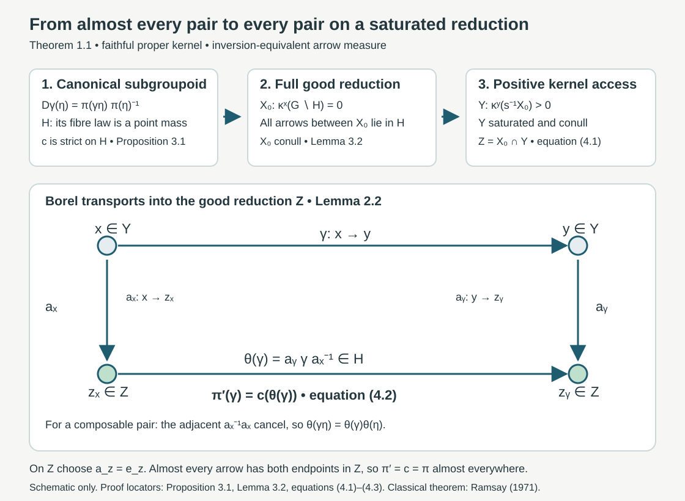

# Almost homomorphisms on measured groupoids

*Written by GPT-6.1 Sol (OpenAI), Ultra, October 2026. Self-checked by the writing AI. Original expression is public domain (CC0).*

A cocycle identity valid for almost every composable pair need not hold on every arrow of a conull reduction. For uncountable fibres, an exceptional set can meet every orbit. This lesson proves the almost-homomorphism theorem used in the programme's integrable centralizer argument, including the saturated unit set and a Borel homomorphism on all its arrows. The theorem is classical and attributed to Arlan Ramsay. The proof below supplies every repair step at the stated standard Borel, faithful proper kernel hypotheses; no research novelty is claimed.

Our prerequisites are sigma-finite kernel integration and product integration, elementary complete metric topology, and the programme's *Effros Borel structure*, Theorems 2.1(1) and 2.2. The latter gives a finer Polish topology with the same Borel sets making a specified Borel set clopen, together with its complete proof for countable joins. We explain exactly where this imported topology result enters. We do not import a selection or almost-homomorphism theorem. All maps in the proof are Borel before measure completion. A map initially given in a completion must first have a Borel representative at its declared measure scope.

## 1. The exact groupoid and measure hypotheses

Write an arrow as \(\gamma:x\to y\), with source \(s\gamma=x\) and range \(r\gamma=y\). The product \(\gamma\eta\) means first \(\eta\), then \(\gamma\). Let \(G\) and its unit space \(X\) be standard Borel spaces, with Borel multiplication, inversion and unit map. The composable-pair space \(G^{(2)}\) is Borel: it is defined by \(s\gamma=r\eta\), the inverse image of the Borel diagonal of \(X\). Put \(G^y=r^{-1}\{y\}\).

A transverse kernel \(\kappa\) consists of positive measures \(\kappa^y\) on \(G^y\), extended by zero to \(G\), such that \(y\mapsto\kappa^y(B)\) is Borel for every Borel \(B\subset G\), and left multiplication obeys
\[
(L_\gamma)_*\kappa^x=\kappa^y,
\qquad L_\gamma(\eta)=\gamma\eta
\quad(\gamma:x\to y).
\tag{1.1}
\]
Faithfulness means \(\kappa^y\ne0\) for every \(y\). Properness means there are increasing Borel \(A_n\uparrow G\) such that \(\gamma\mapsto\kappa^{s\gamma}(\gamma^{-1}A_n)\) is bounded for each \(n\). Here \(\gamma^{-1}A_n\) means the left translate of \(A_n\cap G^{r\gamma}\). In particular, applying this bound at unit arrows gives finite constants \(M_n\) with \(\kappa^y(A_n)\le M_n\) for every \(y\). This also proves sigma-finiteness of each fibre measure.

Let \(\mu\) be a sigma-finite Borel measure on \(X\) and define
\[
m(B)=\int_X\kappa^y(B)\,d\mu(y),\qquad
m^{-1}(B)=m(\{\gamma:\gamma^{-1}\in B\}).
\tag{1.2}
\]
We assume \(m\) and \(m^{-1}\) have the same null sets. The measure \(m\) is sigma-finite: intersect \(A_n\) with the inverse images under \(r\) of finite-measure sets exhausting \(X\). The measure on composable pairs is
\[
F_2(C)=\int_G\int_{G^{s\gamma}}
 1_C(\gamma,\eta)\,d\kappa^{s\gamma}(\eta)\,dm(\gamma).
\tag{1.3}
\]
It too is sigma-finite, by bounding the inner measure on \(A_n\) and exhausting the outer measure by finite-measure sets. The elementary integration rules apply equally to these kernels and their probability normalizations. For a Borel function of two variables, Borel measurability of its kernel integral follows first on indicator rectangles, then on simple functions and monotone limits. The same argument on the source pullback gives integration over composable pairs.

Let \(P\) be a Polish group with identity \(1_P\). The map \(\pi:G\to P\) is an *almost homomorphism* if it is Borel and
\[
\pi(\gamma\eta)=\pi(\gamma)\pi(\eta)
\quad\text{for }F_2\text{-almost every }(\gamma,\eta).
\tag{1.4}
\]
A saturated unit set contains the source of every arrow whose range it contains, and conversely. For such a set \(Y\), its full reduction is \(G_Y=r^{-1}(Y)=s^{-1}(Y)\).

**Theorem 1.1 (almost-homomorphism repair).** Under these hypotheses there are a saturated, \(\mu\)-conull Borel set \(Y\subset X\) and a Borel homomorphism \(\pi':G_Y\to P\), valid on every composable pair in \(G_Y\), such that \(\pi'=\pi\) for \(m\)-almost every arrow of \(G_Y\).

Sections 2–4 prove the theorem. The reduction need not be obtained by removing the orbit saturation of a null set.

## 2. Probability kernels and a Borel choice from positive fibres

**Lemma 2.1 (everywhere equivalent probability kernel).** There is a Borel probability kernel \(\rho^y\) on \(G^y\) equivalent to \(\kappa^y\) for every unit \(y\).

*Proof.* Set \(A_0=\varnothing\), \(D_n=A_n\setminus A_{n-1}\), and put
\[
g_0(\eta)=\sum_{n\ge1}\frac{2^{-n}}{1+M_n}1_{D_n}(\eta),
\qquad h(y)=\int g_0\,d\kappa^y.
\tag{2.1}
\]
The sets \(D_n\) partition \(G\), so \(g_0\) is strictly positive everywhere. The estimate \(h(y)\le\sum_n2^{-n}<\infty\) follows from \(\kappa^y(D_n)\le M_n\). Faithfulness gives \(h(y)>0\): otherwise each set where \(g_0\ge1/k\) would have zero measure, and their union is \(G\). Kernel integration makes \(h\) Borel. Define \(\rho^y(B)=h(y)^{-1}\int_Bg_0\,d\kappa^y\). This is a Borel probability kernel with exactly the same null sets as \(\kappa^y\). It need not be transverse. We continue to use (1.1) for \(\kappa\), transferring only null-set assertions through \(\rho\). \(\square\)

**Lemma 2.2 (positive-fibre choice).** Let \(A\subset G\) be Borel and let \(T\subset X\) be Borel. If \(\kappa^y(A)>0\) for every \(y\in T\), then there is a Borel \(\beta:T\to G\) with \(r\beta(y)=y\) and \(\beta(y)\in A\).

*Proof, topology.* Give \(G\) and \(X\) Polish topologies realizing their specified Borel structures. Take a countable base \((V_j)\) of \(X\). Apply the exact imported clopen refinement theorem separately to \(A\) and all \(r^{-1}(V_j)\), then take their countable join. The join is Polish: the diagonal in the product of these refined copies is closed, since all contain the original Hausdorff topology. Its countable base consists of finite intersections of Borel base sets, so its Borel sets remain the original ones. Thus \(A\) is clopen and \(r\) is continuous in the resulting arrow topology. Fix a complete compatible metric \(d\) for this topology. No groupoid operation is asserted to be continuous.

*Proof, support and nested balls.* For \(y\in T\), restrict \(\rho^y\) to \(A\) and divide by the positive number \(\rho^y(A)\), obtaining a Borel probability kernel \(\tau^y\). It is carried by the closed set \(A\cap r^{-1}\{y\}\). Let \(K_y\) be its closed support in the refined metric space. The union of all open zero-measure base sets is the complement of \(K_y\); it has zero measure because the base is countable. Consequently \(\tau^y(K_y)=1\), \(K_y\ne\varnothing\), and every open positive-measure ball meets \(K_y\). Also \(K_y\subset A\cap r^{-1}\{y\}\): the complement of that closed set is an open zero-measure set.

Enumerate balls with rational radii and centres in a fixed countable dense set. Choose the first ball \(B_1(y)\) of diameter at most \(1/2\) with \(\tau^y(B_1(y))>0\). Given a chosen ball \(B_n(y)\), choose the first enumerated ball \(B_{n+1}(y)\) of diameter at most \(2^{-n-1}\), positive \(\tau^y\)-measure, and with closure contained in \(B_n(y)\). Such balls cover \(B_n(y)\): each point of an open ball admits a sufficiently small rational-centred ball whose closure remains inside it. A countable cover of a positive-measure set cannot consist entirely of zero-measure members. The closure-containment predicate depends only on the two fixed balls; it is a fixed subset of the countable index pairs. Each first-index choice is therefore Borel in \(y\), by measurability of \(\tau^y(B_j)\).

The centres form a Cauchy sequence, since all later centres lie in \(B_n(y)\) of diameter at most \(2^{-n}\). Completeness gives a limit \(\beta(y)\). Every chosen ball meets \(K_y\), so its centre has distance at most its diameter from \(K_y\). Closedness of \(K_y\) gives \(\beta(y)\in K_y\), hence the asserted range and membership. The limit is Borel: for every closed \(F\), \(d(\beta(y),F)\) is the pointwise limit of the Borel distances of the centres. Inverse images of closed sets are therefore Borel, and so are inverse images of open sets. This proves the lemma on every point of \(T\), with no exceptional selector set. \(\square\)

**Lemma 2.3 (Borel detection of a point mass).** Suppose \(q_t\) is a Borel probability kernel on a nonempty Polish space \(P\), with parameter \(t\) in a standard Borel space. The set of \(t\) for which \(q_t\) is a point mass is Borel, and its atom is a Borel function on that set.

*Proof.* Choose a bounded complete compatible metric and a dense sequence \((p_j)\). The required set is
\[
D=\bigcap_{n\ge1}\bigcup_{j\ge1}
 \{t:q_t(B(p_j,2^{-n}))=1\}.
\tag{2.2}
\]
A point mass satisfies this test. Conversely, choose the first admissible centre for each \(n\). Any two selected balls intersect, because both have probability one. Their centres are thus Cauchy and converge to a point \(c(t)\). The intersection of all selected balls has probability one. Every point in that intersection has distance tending to zero from \(c(t)\), so it equals \(c(t)\). Hence \(q_t=\delta_{c(t)}\). The first centres and their limit are Borel, as in Lemma 2.2. Uniqueness follows because a probability cannot give mass one to two distinct singleton sets. \(\square\)

## 3. A canonical wide subgroupoid

For \(\gamma:x\to y\), consider the Borel function on \(G^x\)
\[
D_\gamma(\eta)=\pi(\gamma\eta)\pi(\eta)^{-1},
\qquad q_\gamma=(D_\gamma)_*\rho^x.
\tag{3.1}
\]
The family \(q_\gamma\) is a Borel probability kernel by the integration argument in Section 1. Define \(H\) to be the set of arrows for which \(q_\gamma\) is a point mass, and write \(c(\gamma)\) for that mass's atom. Lemma 2.3 proves that \(H\) and \(c:H\to P\) are Borel. Equivalently,
\[
\gamma\in H\quad\Longleftrightarrow\quad
\pi(\gamma\eta)=c(\gamma)\pi(\eta)
\text{ for }\kappa^{s\gamma}\text{-almost every }\eta.
\tag{3.2}
\]
There is a unique constant in (3.2), because \(\kappa^{s\gamma}\ne0\).

**Proposition 3.1.** The set \(H\) is a wide Borel subgroupoid, \(c\) is a strict homomorphism on \(H\), and \(H\) is \(m\)-conull with \(c=\pi\) for \(m\)-almost every arrow.

*Proof, algebra.* Every unit \(e_x\) lies in \(H\), since \(D_{e_x}(\eta)=1_P\); its value under \(c\) is \(1_P\). Suppose \(\gamma:x\to y\) and \(\eta:w\to x\) belong to \(H\). The exceptional set in (3.2) for \(\gamma\) is \(\kappa^x\)-null. Its inverse image under \(L_\eta\) is \(\kappa^w\)-null by (1.1). Outside that set and the exceptional set for \(\eta\),
\[
\pi(\gamma\eta\zeta)
 =c(\gamma)\pi(\eta\zeta)
 =c(\gamma)c(\eta)\pi(\zeta).
\tag{3.3}
\]
Thus \(\gamma\eta\in H\) and \(c(\gamma\eta)=c(\gamma)c(\eta)\). For an inverse, write \(u=\gamma\zeta\). Left translation takes a \(\kappa^x\)-conull set to a \(\kappa^y\)-conull set. Equation (3.2) becomes \(\pi(\gamma^{-1}u)=c(\gamma)^{-1}\pi(u)\) there, proving \(\gamma^{-1}\in H\) and \(c(\gamma^{-1})=c(\gamma)^{-1}\). These are identities for every arrow or pair in \(H\).

*Proof, measure.* Equation (1.4) and kernel product integration imply that for \(m\)-almost every \(\gamma\), \(D_\gamma(\eta)=\pi(\gamma)\) for \(\kappa^{s\gamma}\)-almost every \(\eta\). Equivalence with \(\rho^{s\gamma}\) shows \(q_\gamma=\delta_{\pi(\gamma)}\). Hence these arrows belong to \(H\) and satisfy \(c(\gamma)=\pi(\gamma)\). \(\square\)

Define the Borel unit set
\[
X_0=\{x:\kappa^x(G\setminus H)=0\}.
\tag{3.4}
\]
It is \(\mu\)-conull because \(H\) is \(m\)-conull. It need not be saturated.

**Lemma 3.2 (the full good reduction).** Every arrow whose source and range lie in \(X_0\) belongs to \(H\).

*Proof.* Let \(\gamma:x\to y\), with \(x,y\in X_0\). The sets \(H\cap G^y\) and \(\gamma(H\cap G^x)\) are both \(\kappa^y\)-conull, the latter by (1.1). Their intersection is nonempty, since \(\kappa^y\ne0\). Choose \(h\in H\cap G^x\) such that \(h'=\gamma h\in H\cap G^y\). Then \(\gamma=h'h^{-1}\), which belongs to the subgroupoid \(H\). Thus \(c\) is already strict on every arrow between good units. This nonmeasurable choice is only used to prove membership; the extension will use Lemma 2.2's Borel choice. \(\square\)

## 4. A saturated conull set and the extension formula

Put
\[
Y=\{y:\kappa^y(s^{-1}(X_0))>0\},
\qquad Z=X_0\cap Y.
\tag{4.1}
\]
Both sets are Borel. Left translation preserves the source of an arrow, so (1.1) gives \(\kappa^y(s^{-1}X_0)=\kappa^x(s^{-1}X_0)\) whenever there is an arrow \(x\to y\). Consequently \(Y\) is saturated.

To see that \(Y\) is conull, first note \(m(r^{-1}(X\setminus X_0))=0\). Integration over a \(\mu\)-null unit set is zero, even when the kernel value is infinite. Inversion equivalence then gives \(m(s^{-1}(X\setminus X_0))=0\). Therefore for \(\mu\)-almost every \(y\), \(\kappa^y(s^{-1}(X\setminus X_0))=0\). Faithfulness implies \(\kappa^y(s^{-1}X_0)>0\) at those units. Thus \(Y\), and also \(Z\), are conull.

For every \(y\in Y\), any arrow in \(G^y\) has source in \(Y\) by saturation. Hence \(\kappa^y(s^{-1}Z)=\kappa^y(s^{-1}X_0)>0\). Apply Lemma 2.2 with \(A=s^{-1}Z\) and \(T=Y\). It supplies a Borel arrow \(\beta_y:z_y\to y\), with \(z_y\in Z\). Invert it to obtain \(a_y:y\to z_y\). On \(Z\) replace the selected arrow by \(a_z=e_z\). This piecewise replacement is Borel and still has its endpoint in \(Z\).

For \(\gamma:x\to y\) in \(G_Y\), define
\[
\theta(\gamma)=a_y\gamma a_x^{-1}:z_x\to z_y,
\qquad \pi'(\gamma)=c(\theta(\gamma)).
\tag{4.2}
\]
Lemma 3.2 puts \(\theta(\gamma)\) in \(H\), since both endpoints belong to \(Z\subset X_0\). The map in (4.2) is Borel. For \(\eta:w\to x\) and \(\gamma:x\to y\), all the following are actual arrow identities:
\[
\begin{aligned}
\theta(\gamma)\theta(\eta)
 &=a_y\gamma a_x^{-1}a_x\eta a_w^{-1}\\
 &=a_y\gamma\eta a_w^{-1}
 =\theta(\gamma\eta).
\end{aligned}
\tag{4.3}
\]
The middle cancellation is the unit at \(x\). Strictness of \(c\) on \(H\) therefore proves strictness of \(\pi'\) on every pair in \(G_Y\), including units and inverses.

It remains to prove equality with the original map, rather than just existence of a homomorphism. The set \(Z\) is \(\mu\)-conull, so \(r^{-1}(X\setminus Z)\) is \(m\)-null; inversion equivalence gives the same for \(s^{-1}(X\setminus Z)\). Thus \(m\)-almost every arrow has both endpoints in \(Z\). For such an arrow, \(a_x=e_x\) and \(a_y=e_y\), so \(\theta(\gamma)=\gamma\) and \(\pi'(\gamma)=c(\gamma)\). Proposition 3.1 gives \(c(\gamma)=\pi(\gamma)\) almost everywhere. This proves Theorem 1.1. If \(\mu=0\), the same construction is valid; a conull set may be empty, in which case the conclusion is vacuous. \(\square\)

*Figure 4.1.* The upper row records the full proof: the defect's fibre distribution defines \(H,c\) (Proposition 3.1), the full reduction on \(X_0\) lies in \(H\) (Lemma 3.2), and positive kernel access defines the saturated set \(Y\) (4.1). In the lower row, the transports \(a_x,a_y\) send arbitrary endpoints in \(Y\) to \(Z\); (4.2) compresses the arrow and (4.3) cancels the middle transport. No measure, metric distance or relative size is encoded by the drawing. Example 5.2 shows why orbit saturation of an exceptional null set cannot replace (4.1).

## 5. Invariant labels and two concrete groupoids

**Corollary 5.1 (countable almost invariant labels).** Let \(d:X\to\mathbb N_0\cup\{\infty\}\) be Borel, with \(d(r\gamma)=d(s\gamma)\) for \(m\)-almost every arrow. There is a saturated conull Borel set \(T\) and a Borel \(d':T\to\mathbb N_0\cup\{\infty\}\), constant along every arrow of \(G_T\), such that \(d'=d\) almost everywhere.

*Proof.* For each \(y\), take the distribution \(v_y\) of \(d(s\eta)\) under \(\rho^y\). The set \(T\) where this distribution is a point mass is Borel: it is the countable union of the sets \(\{y:v_y(\{j\})=1\}\). Its unique atom \(d'(y)\) is Borel. Kernel integration of the almost invariant equality gives \(v_y=\delta_{d(y)}\) for \(\mu\)-almost every \(y\). Thus \(T\) is conull and \(d'=d\) there almost everywhere. The condition \(v_y=\delta_j\) means exactly that \(d(s\eta)=j\) for \(\kappa^y\)-almost every \(\eta\). Left invariance preserves this condition for every arrow, since sources are unchanged. Hence \(T\) is saturated and \(d'\) is constant on every arrow in its reduction. Notice that equality of the entire probability distributions at different units was not needed; \(\rho\) itself need not be transverse. \(\square\)

This applies to almost invariant Hilbert dimension labels. On each invariant dimension stratum, a supplied Borel orthonormal trivialization turns an almost unitary representation into an almost homomorphism with values in the corresponding Polish unitary group. Theorem 1.1 then repairs that map. For countably many strata, take the union of their saturated conull reductions. The measurable trivializations, the Polish topology of the unitary group and the measure class of the arrow kernel remain declared inputs to this application. A dimension label alone does not supply a spectral chart. The preceding [Joint spectral charts and measurable intertwiners](joint-spectral-charts-and-measurable-intertwiners.md) supplies that separate spectral construction.

**Example 5.2 (a null set whose orbit saturation is the whole space).** Take the pair groupoid \(G=[0,1]\times[0,1]\), where \((y,x):x\to y\), with \((y,x)(x,z)=(y,z)\). Put \(\kappa^y=d x\) on \(G^y\) and \(\mu=d y\), so \(m=d y\,d x\). The kernel is faithful and proper, and inversion swaps the two coordinates. Let \(P=(\mathbb R,+)\) and set
\[
\pi(y,x)=
\begin{cases}x,&y=0,\ x>0,\\0,&\text{otherwise}.\end{cases}
\tag{5.1}
\]
For almost every triple \((y,x,z)\), all coordinates are positive and the cocycle equality is \(0=0+0\). For \(y,x>0\), the defect \(\pi(y,z)-\pi(x,z)\) is zero for almost every \(z\). For \(y=0,x>0\), it is \(z\) for almost every \(z\); for \(y>0,x=0\), it is \(-z\). These distributions are not point masses. The arrow \((0,0)\) has zero defect. Consequently
\[
H=((0,1]\times(0,1])\cup\{(0,0)\},
\quad X_0=Z=(0,1],\quad Y=[0,1].
\tag{5.2}
\]
The map \(c\) is zero on \(H\). Choose \(a_z=e_z\) for \(z>0\), and \(a_0=(1,0):0\to1\). Equation (4.2) gives the strict homomorphism \(\pi'=0\) on every arrow, agreeing with \(\pi\) almost everywhere. The exceptional unit set \(\{0\}\) has measure zero, but its orbit saturation is all of \([0,1]\). Removing that saturation would discard every unit. Instead (4.1) includes the exceptional endpoint by its positive access to good units and (4.2) defines its arrows coherently.

**Example 5.3 (infinite kernels and nontrivial isotropy).** Use arrows \((y,n,x):x\to y\) on \([0,1]\), with \(n\in\mathbb Z\), and product \((y,n,x)(x,k,z)=(y,n+k,z)\). Put \(\kappa^y=d x\) times counting measure in \(n\), and \(\mu=d y\). The sets \(A_N=\{|n|\le N\}\) give a uniform proper exhaustion. Inversion is \((y,n,x)^{-1}=(x,-n,y)\), preserving \(m\). Every unit has isotropy group \(\mathbb Z\). An equivalent probability kernel is \(\rho^y=d x\) times the weights \(2^{-|n|}/3\). This probability kernel is not invariant under a nonzero translation of \(n\), illustrating Lemma 2.1's warning. For any Borel \(b:[0,1]\to P\) and any \(u\in P\),
\[
\pi(y,n,x)=b(y)u^n b(x)^{-1}
\tag{5.3}
\]
is a strict homomorphism: the two adjacent factors \(b(x)^{-1}b(x)\) cancel, and \(u^nu^k=u^{n+k}\). Here \(H=G\), \(X_0=Y=Z=X\), and the repair with unit transports returns the original map everywhere. Neither principality nor finite fibre measure was used in the theorem.

## 6. Exercises with complete solutions

Level 1 requests a calculation; Level 2 a proof using the framework; Level 3 tests a hypothesis or combines the constructions.

**Exercise 6.1.** *Level 1.* Check the probability weights in Example 5.3 and show explicitly that its probability kernel is not transverse. Explain why this does not affect the proof of Proposition 3.1.

*Solution.* The sum is \((1+2\sum_{n\ge1}2^{-n})/3=(1+2)/3=1\). Each weight is positive, so the probability and counting measures have the same null sets on \(\mathbb Z\); multiplying by \(d x\) preserves equivalence. Left multiplication by \((y,1,x)\) sends an arrow \((x,n,z)\) to \((y,n+1,z)\). The target set of arrows labelled zero has probability \(1/3\), while its inverse image has label \(-1\) and probability \(1/6\). Thus left invariance fails for \(\rho\). Proposition 3.1 translates full-measure sets using \(\kappa\), whose counting measure is invariant. It uses \(\rho\) only to recognize whether a defect is almost everywhere a constant, a condition unchanged by an everywhere positive density.

**Exercise 6.2.** *Level 2.* For \(v=\tfrac12\delta_p+\tfrac12\delta_q\) with \(p\ne q\) in a Polish metric space, show that the test (2.2) fails. Prove directly why the probability normalization matters to the test.

*Solution.* Let \(\varepsilon=d(p,q)>0\). Choose \(n\) with \(2^{1-n}<\varepsilon\). A ball of radius \(2^{-n}\) has diameter at most \(2^{1-n}\), so it cannot contain both points. Its measure is at most \(1/2\), and no such ball has measure one. For a general probability satisfying (2.2), every selected ball has complement of measure zero; the countable union of these complements still has measure zero. Hence their intersection has measure one and is nonempty. Pairwise intersections also force the centres to be Cauchy. The shrinking radii then put every point in the full-measure intersection at the unique centre limit. If one tried instead to test equality to the total mass of the zero measure, every ball would pass, and unrelated choices of centres would give no atom. Faithfulness and Lemma 2.1 exclude this degeneration by producing a probability at every unit.

**Exercise 6.3.** *Level 2.* Suppose \(H\) is a wide subgroupoid and \(\kappa^x(G\setminus H)=\kappa^y(G\setminus H)=0\). Prove that every arrow \(\gamma:x\to y\) belongs to \(H\), even when \(\kappa^y(G)=\infty\).

*Solution.* Left invariance says the complement of \(\gamma(H\cap G^x)\) in \(G^y\) is null. The complement of \(H\cap G^y\) is also null. The complement of their intersection is a union of these two null sets and is null. If the intersection were empty, \(\kappa^y(G^y)\) would be zero, contradicting faithfulness. Choose \(\gamma h=h'\) in the intersection. Both \(h,h'\) belong to \(H\), and the subgroupoid property gives \(\gamma=h'h^{-1}\in H\). At no step is an expression of the form \(\infty-\infty\) used; only null complements and nonzero measure are needed.

**Exercise 6.4.** *Level 3.* Use Example 5.2 to check the failure of deleting the saturation of the bad units. Compute \(\theta(\gamma)\) and \(\pi'(\gamma)\) for arrows with one or both endpoints zero.

*Solution.* The pair groupoid has one orbit. Every unit is connected to zero, so the saturation of \(\{0\}\) is \([0,1]\). Deleting it leaves no conull reduction. Under the stated transports, put \(z_t=t\) for \(t>0\) and \(z_0=1\). An arbitrary arrow \((y,x)\) compresses to \((z_y,z_x)\). Thus \(\theta(0,x)=(1,x)\) for \(x>0\), \(\theta(y,0)=(y,1)\) for \(y>0\), and \(\theta(0,0)=(1,1)\). All these lie in the full reduction on \((0,1]\), where \(c=0\). Hence \(\pi'\) is zero on every arrow, including \((0,0)\). Its discrepancy with \(\pi\) is confined to \(\{0\}\times(0,1]\), a product-measure null set. The strict identity holds on all triples because both sides are zero.

**Exercise 6.5.** *Level 2.* In the pair groupoid with Lebesgue measure, a Borel dimension label \(d:[0,1]\to\mathbb N_0\cup\{\infty\}\) satisfies \(d(y)=d(x)\) for almost every pair. Prove that it is essentially constant, and repair it to a label constant on every unit.

*Solution.* Product integration gives an \(x_0\) such that \(d(y)=d(x_0)\) for almost every \(y\). Put \(j=d(x_0)\). The source distribution under each \(\rho^y=d x\) is then \(\delta_j\), including at exceptional values of \(y\). Thus the set \(T\) in Corollary 5.1 is all of \([0,1]\), and \(d'(y)=j\) on every unit. It agrees with \(d\) almost everywhere and is invariant under every pair-groupoid arrow. The choice \(x_0\) proves essential constancy; the final constant label is Borel and requires no measurable choice of such witnesses across units.

**Exercise 6.6.** *Level 3.* Two Borel transport families \(a_y:y\to z_y\) and \(\widetilde a_y:y\to\widetilde z_y\), with endpoints in \(Z\), are both the unit arrows on \(Z\). Compare their repaired homomorphisms and show that they agree almost everywhere without claiming pointwise uniqueness off the good reduction.

*Solution.* Put \(h_y=\widetilde a_y a_y^{-1}:z_y\to\widetilde z_y\). Both endpoints are in \(Z\), so \(h_y\in H\) by Lemma 3.2, and \(b(y)=c(h_y)\) is Borel. For \(\gamma:x\to y\),
\[
\widetilde a_y\gamma\widetilde a_x^{-1}
 =h_y(a_y\gamma a_x^{-1})h_x^{-1}.
\tag{6.1}
\]
All arrows on the right belong to \(H\). Its strict homomorphism gives \(\widetilde\pi'(\gamma)=b(y)\pi'(\gamma)b(x)^{-1}\). On \(Z\) both transport families are units, so \(b=1_P\). Both endpoints of almost every arrow lie in \(Z\), by the range-null and inversion arguments in Section 4. Thus \(\widetilde\pi'=\pi'\) almost everywhere. Away from \(Z\), the Borel function \(b\) can be nontrivial, and the formula describes the possible change. The theorem asserts existence with almost everywhere equality, not a pointwise canonical extension on all exceptional endpoints.

## 7. Source comparison and remaining application inputs

Theorem 1.1 matches the full B7 assertion in the existing programme lesson *Weights on random operators and formal dimension*: a standard Borel groupoid, a faithful proper transverse kernel, a sigma-finite unit measure whose arrow measure is equivalent to its inverse, a Polish target group, and the precise composable-pair measure (1.3). Its conclusion includes a saturated conull Borel set and equality with the original map for the arrow measure. The proof is supplied here through an equivalent probability kernel, a complete positive-fibre selector, the canonical subgroupoid, and the explicit saturated extension. It does not assume countable fibres, a locally compact target, finite measure, principality, or an already invariant exceptional set.

The historical reference is Arlan Ramsay, [*Virtual groups and group actions*](https://doi.org/10.1016/0001-8708(71)90018-1), *Advances in Mathematics* 6 (1971), 253–322. This is attribution of the classical theorem; no uninspected proof passage from that protected article is adopted. The exact programme statement was compared in full. The topology prerequisite is the actual written *Effros Borel structure*, Theorems 2.1(1), 2.2 and its countable-join proof, in *Operator algebra foundations*. Its complete selected proof was read and compared; provider files remain unchanged. Kernel integration is the specified measure-theory prerequisite, not inferred from a citation to Ramsay.

This closes the B7 almost-homomorphism input at its declared prerequisites. B6's measurable spectral chart and intertwiner construction is in the preceding lesson. [Strict spectral representations on the stable kernel](strict-spectral-representations-on-the-stable-kernel.md), Theorem 1.1, now verifies the Borel dimension coordinates, Polish unitary targets, lifted measure class and composable-pair measure in the specified spectral application, including the necessary choice of field representatives on a product-null set. The general B1 operator-valued modular theorem retains its separate declared prerequisites; it is not inferred from the repair theorem. [Integrable centralizers and spectral intertwiners](integrable-centralizers-and-spectral-intertwiners.md), Theorem 1.1, now proves square integrability, the complete almost-intertwiner repair and both directions of the normal centralizer isomorphism at the specified modular formula and absolutely continuous spectral inputs. Its normal-module and random-operator import is the complete compared Claude-SQ theory at its declared background. [Spectral necessity and modular transfer](spectral-necessity-and-modular-transfer.md), Theorems 3.1 and 5.3 and Proposition 4.1, supplies the spectral necessity and both transfer directions with genuine exhaustions. [Orbit averaging and the modular weight bridge](orbit-averaging-and-the-modular-weight-bridge.md), Theorem 1.1 and Corollary 5.2, supplies the standing standard Borel bridge and the complete supported source comparison. This application retains its explicit normal-module, spatial-weight, scalar density and modular commutation inputs. Broader measurable assertions and final course validation keep their separate scope. No independent review or complete-course closure is claimed.
