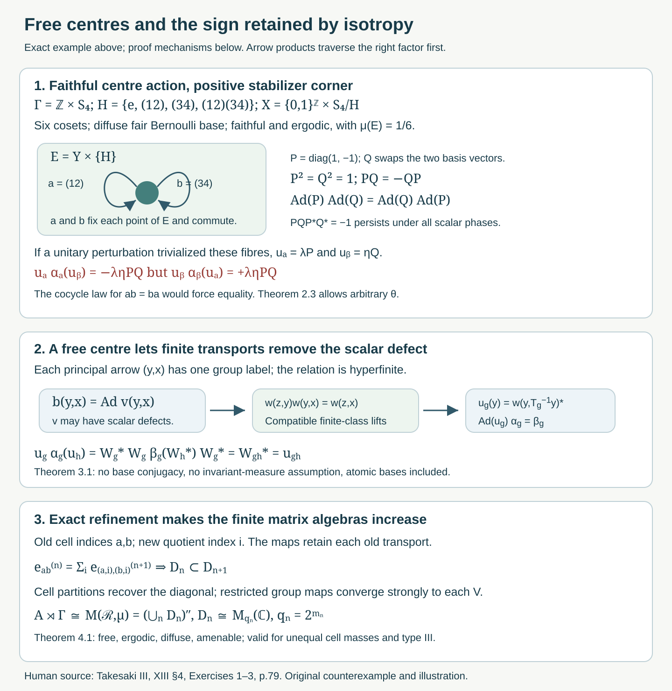

# Amenable actions, free centres, and isotropy obstructions

*Original course text, October 2026. Author self-check only; not independently reviewed. New original expression and the native diagram are public domain (CC0).*

## Introduction

Amenability gives finite approximations to the principal orbit relation. Freeness lets us use those approximations for an action on a field of factors: the two endpoints determine its group label. Faithfulness alone says that no group element acts trivially on the entire centre. A nonidentity element may still fix a positive part of the centre and act nontrivially inside its fibres.

This distinction affects Takesaki III, Chapter XIII, §4, Exercise 1. Its printed hypothesis is faithful and ergodic; Exercises 2 and 3 instead say free and ergodic. We give an explicit counterexample to the localization and cocycle-conjugacy claims under Exercise 1's faithful hypothesis, prove the corrected free-centre assertion, and solve Exercises 2 and 3 at their stated scope. The source exercise block assumes separability or countability throughout.

The prerequisites are the complete countable-action localization in [Ancillary actions and unitary corrections](ancillary-actions-and-unitary-corrections.md#3-from-an-action-to-an-orbit-cocycle), its Borel inner-unitary section in Lemma 1.1, and the finite-stage lifting proof in [Compatible lifts and cohomology reduction](compatible-lifts-and-cohomology-reduction.md#3-removing-a-two-cocycle). [Invariant means on measured relations](invariant-means-on-measured-relations.md#6-increasing-finite-relations) proves the amenable principal relation theorem. The exact nonsingular array refinement and compatible matrix approximation are [Matching sets and nonsingular dyadic arrays](matching-sets-and-nonsingular-dyadic-arrays.md#5-exact-refinement-binary-coding-and-one-generator), Theorem 5.2 and Corollary 5.3. These results include their stated standard Borel and operator-theory prerequisites.

## Three routes through the exercises

The three source exercises use the same amenable orbit relation, but ask for different constructions. Read their proofs in the following order.

**First test the stabilizers.** Proposition 1.1 gives the precise condition for the fibre action to descend: every stabilizer arrow must act trivially on its fibre factor. Faithfulness of the centre action only rules out an element fixing the entire measure algebra. In the example of Section 2, \(a,b\) fix the positive corner \(E\), while their inner implementers satisfy \(PQ=-QP\). Compute both products in (2.10) before reading the conclusion of Theorem 2.3. That calculation also allows an arbitrary algebra conjugacy to move the centre. Exercise 5.1 therefore has a corrective solution: its principal relation exists and is amenable, but the printed faithful hypothesis does not give the asserted descent or cocycle conjugacy.

**Then remove the scalar defect over a free centre.** Countable localization gives \(D_g(y)\). Freeness makes the label of \((y,x)\) unique, so Proposition 1.1 turns these fields into \(b(y,x)\). The [Borel inner-unitary section](ancillary-actions-and-unitary-corrections.md#1-automorphisms-as-a-polish-group) chooses \(v(y,x)\), but these choices may have the scalar composition defect (3.2). The [compatible lifting theorem](compatible-lifts-and-cohomology-reduction.md#3-removing-a-two-cocycle) removes that defect by finite-class root transports which agree at every later stage. Its finite-stage proof assumes an exhaustion; it does not use the conclusion of the present exercise. The amenable-relation theorem supplies that exhaustion.

The coherent implementers \(w\) yield a \(\beta\)-cocycle \(W\). Equation (3.5) checks that \(u_g=W_g^*\) is an \(\alpha\)-cocycle and makes \(\operatorname{Ad}(u_g)\alpha_g=\beta_g\). The order of the adjoints matters; Exercise 6.5 gives an explicit failure of the other order. This is the route for Exercise 5.3 and for the free-centre correction in Exercise 5.1. It uses neither nonatomicity nor ergodicity. Exercise 6.4 constructs the same coherent transports directly on a countable atomic orbit.

**Finally retain matrix transports and generate the diagonal.** Exercise 5.2 instead uses [exact nonsingular array refinement](matching-sets-and-nonsingular-dyadic-arrays.md#5-exact-refinement-binary-coding-and-one-generator). First the unitary \(J\) identifies the free crossed product with its principal relation algebra. Refine the arrays so that their transports retain the old maps and their cell partitions approximate a generating family of measurable sets. Equation (4.2) gives genuine increasing scalar matrix algebras, including their units and exact inclusions.

To check generation, follow both parts of Theorem 4.1: the measures \(\kappa_\xi\ll\mu\) turn cell errors into strong convergence of diagonal projections; the restricted operators \(V_gM_{\mathbf1_{B_{g,n}}}\) recover every group generator. A finite-class relation by itself gives a matrix field over a transversal. The refining, generating arrays provide the finite-dimensional algebras requested by the exercise. Their scalar matrix relations use orbit counting; the cell probabilities may be unequal and the action may be of type III.

These routes use the exact countable localization and Borel section stated in the ancillary lesson, compatible finite lifts, the principal amenability theorem and nonsingular array refinement. General canonical standard-form implementation is an explicit operator-theory prerequisite of localization. No exercise here proves that general theorem or the classification by flow of weights.

## 0. Scope and conventions

Write \(N\) for a factor with separable predual and
\[
M=A\overline\otimes N,\qquad A=L^\infty(X,\mu),
\tag{0.1}
\]
where \(X\) is standard and \(\mu\) is nonzero and sigma-finite. An equivalent probability changes none of these measured-algebra assertions. A normal action of a countable discrete group \(\Gamma\) has a nonsingular Borel centre action \(T\) on one invariant conull base. We use the conventions
\[
(\beta_gm)(y)=m(T_g^{-1}y),\qquad
\alpha^u_g=\operatorname{Ad}(u_g)\alpha_g,\qquad
u_{gh}=u_g\alpha_g(u_h).
\tag{0.2}
\]
Here \(\beta\) is the simple lifting of the centre action. The tensor factors may be interchanged by the spatial flip.

## 1. What descends to the principal relation

The countable localization prerequisite supplies Borel \(D_g(y)\in\operatorname{Aut}(N)\) on a common invariant conull base, with
\[
(\alpha_gm)(y)=D_g(y)\bigl(m(T_g^{-1}y)\bigr),\qquad
D_{gh}(y)=D_g(y)D_h(T_g^{-1}y).
\tag{1.1}
\]
This always defines an action of the transformation groupoid. Its arrow \((g,x)\) has source \(x\) and range \(T_gx\), and its fibre map is \(D_g(T_gx)\).

**Proposition 1.1 (the exact descent condition).** The localized action descends to a homomorphism on the principal orbit relation
\(\mathcal R=\{(T_gx,x):g\in\Gamma\}\) if and only if
\[
D_h(x)=\operatorname{id}_N
\quad\text{whenever }T_hx=x.
\tag{1.2}
\]
At measured scope this means the identity on one invariant conull base. A free centre action satisfies the condition.

*Proof.* A descended homomorphism must send \((x,x)\) to the identity. Every stabilizer arrow maps to \((x,x)\), giving (1.2). Conversely, if \(T_gx=T_kx=y\), then \(h=k^{-1}g\) fixes \(x\). The action law at this source gives
\[
D_g(y)=D_k(y)D_h(x)=D_k(y).
\]
Consequently \(b(y,x)=D_g(y)\) is independent of the label. Choose the first possible \(g\) in a fixed enumeration of \(\Gamma\); its graph domains are Borel, so \(b\) is Borel. For \(z=T_gy\) and \(y=T_hx\), (1.1) gives \(b(z,y)b(y,x)=b(z,x)\). This is the required homomorphism. Countability permits saturation of all exceptional null sets before this argument. \(\square\)

Faithfulness of the action on \(A\) means that the homomorphism \(\Gamma\to\operatorname{Aut}(A)\) is injective. It does not imply (1.2). Even ergodicity does not eliminate point stabilizers of a nonabelian group.

## 2. A faithful diffuse example with a persistent scalar obstruction

We construct the example from two \(2\)-by-\(2\) matrices:
\[
P=\begin{pmatrix}1&0\\0&-1\end{pmatrix},\qquad
Q=\begin{pmatrix}0&1\\1&0\end{pmatrix},\qquad
P^2=Q^2=1,\quad PQ=-QP.
\tag{2.1}
\]
Let \(K=S_4\), \(a=(1\,2)\), \(b=(3\,4)\), and
\[
H=\{e,a,b,ab\}\cong C_2\times C_2,\qquad D=K/H.
\tag{2.2}
\]
We use left cosets; \(D\) has six points. The assignment
\[
\varphi(a^ib^j)=\operatorname{Ad}(P^iQ^j),\qquad i,j\in\{0,1\},
\tag{2.3}
\]
is a homomorphism into \(\operatorname{Aut}(M_2(\mathbb C))\). Indeed,
\((P^iQ^j)(P^kQ^l)=(-1)^{jk}P^{i+k}Q^{j+l}\), with exponents reduced modulo two, and conjugation forgets the scalar.

**Lemma 2.1 (the base action).** Let \(Y=\{0,1\}^{\mathbb Z}\) with fair product probability \(\nu\), and let \(S\) be its bilateral shift. Give \(X=Y\times D\) probability \(\mu=\nu\times\mathrm{unif}_D\). The action of \(\Gamma=\mathbb Z\times K\) defined by
\[
T_{(n,k)}(y,d)=(S^ny,kd)
\tag{2.4}
\]
is measure preserving, faithful and ergodic on a diffuse standard probability space. Its stabilizer contains \(H\) on the positive set \(E=Y\times\{H\}\). The group \(\Gamma\) is amenable.

*Proof.* Coordinate shifts and finite permutations preserve the stated probability. Cylinder sets generate the product sigma-field, so the space is standard and countably generated. A measurable positive set contains a positive intersection with a cylinder on a finite coordinate set; splitting by additional independent coordinates gives subsets of arbitrarily small positive measure. More explicitly, partition by \(m\) unused fair coordinates: every resulting intersection has measure at most \(2^{-m}\), and at least one is positive. Thus there are no positive atoms, and \(L^\infty(X)\) is diffuse.

The shift is mixing. For cylinder events \(B,C\), the coordinates defining \(B\) and \(S^{-n}C\) are disjoint for sufficiently large \(|n|\), so their intersection probability is \(\nu(B)\nu(C)\). Approximation in symmetric-difference probability extends this limit to all events: the error in an intersection and in the product is bounded by the sum of the two approximation errors, uniformly in \(n\). If an event is shift invariant modulo null sets, this gives \(\nu(B)=\nu(B)^2\), proving shift ergodicity. Invariance under the transitive \(K\)-action first makes an invariant function on \(X\) independent of \(d\); shift ergodicity then makes it constant.

If \(n\ne0\), the events \(y_0=0\) and \(y_n=0\) differ with probability \(1/2\), so \(S^n\) is not the identity on the measure algebra. If \(n=0\), an element acting trivially on all six cosets belongs to the core \(\bigcap_{k\in K}kHk^{-1}\). This core is trivial. Every nonidentity member of \(H\) is either a transposition or a double transposition, whereas their full conjugacy classes in \(S_4\) have six and three members, and \(H\) contains only two and one of them, respectively. A normal subgroup inside \(H\) could contain none of these members. Thus (2.4) is faithful. Every \(h\in H\) fixes the coset \(H\), proving the stabilizer assertion.

Finally use the finite sets \(F_m=\{-m,\ldots,m\}\times K\) and their uniform probabilities. Translation by a fixed \((n,k)\) permutes the entire \(K\)-coordinate; the relative symmetric difference is at most \(2|n|/(2m+1)\). It tends to zero. A weak-star cluster of the corresponding means is translation invariant, positive and unital. This proves amenability directly. \(\square\)

Choose representatives \(r(d)\in K\), with \(r(H)=e\). Define the finite Schreier cocycle
\[
\kappa(k,d)=r(kd)^{-1}kr(d)\in H,\qquad
\kappa(kl,d)=\kappa(k,ld)\kappa(l,d).
\tag{2.5}
\]
Both identities follow from the coset equation and cancellation. Set \(N=M_2(\mathbb C)\) and define a normal action on \(M=L^\infty(X)\overline\otimes N\) by
\[
(\alpha_{(n,k)}m)(y,d)
=\varphi\!\left(\kappa(k,k^{-1}d)\right)
       \bigl(m(S^{-n}y,k^{-1}d)\bigr).
\tag{2.6}
\]
The fibre maps are finite-valued inner automorphisms. The formula and its inverse preserve bounded measurable fields, and the centre change is measure preserving. Equivalently, finite matrix conjugations and the unitary Koopman base change implement it; hence it is normal. Equations (2.3) and (2.5) prove the action law. Its centre action is (2.4). Every automorphism of \(M_2(\mathbb C)\) is inner: transport a system of matrix units by an automorphism, choose a unit vector in the range of its first minimal projection, and transport that vector with the other matrix units. The resulting orthonormal basis gives a unitary implementing the automorphism.

**Proposition 2.2 (failure of localization to the principal relation).** Action (2.6) satisfies every stated hypothesis of source Exercise 1, but its fibre action does not descend to the principal relation.

*Proof.* On \(E\), both \(a\) and \(b\) fix the base. Their fibre maps are \(\operatorname{Ad}P\) and \(\operatorname{Ad}Q\), since \(r(H)=e\). The first sends the matrix unit \(e_{12}\) to \(-e_{12}\), so it is not the identity. The identity label and the \(a\)-label have the same principal arrow and different fibre maps. Proposition 1.1 rules out descent. The principal relation itself is amenable by the amenable-action theorem; it is the asserted localization of \(\alpha\) that fails. \(\square\)

**Theorem 2.3 (failure even after cocycle conjugacy).** There is no unitary \(\alpha\)-cocycle \(u\), and no normal \(\theta\in\operatorname{Aut}(M)\), such that
\[
\theta\alpha^u_g\theta^{-1}=\beta_g
\quad(g\in\Gamma)
\tag{2.7}
\]
for action (2.6).

*Proof.* Let \(e=\mathbf1_E\), a nonzero central projection. The simple liftings \(\beta_a,\beta_b\) are the identity on \(eM\). Inner perturbation fixes the centre, so restricting (2.7) to \(A\) shows that \(\theta|_A\) commutes with every centre action \(\beta_g|_A\).

We first check that \(\beta_a,\beta_b\) are also the identity on \(\theta(e)M\). For \(f\in A\) and \(t=a,b\),
\[
\theta(e)\beta_t(f)
=\theta\!\left(e\,\beta_t(\theta^{-1}f)\right)
=\theta(e)f.
\tag{2.8}
\]
Thus \(T_t\) fixes almost every point of the support of \(\theta(e)\). To justify this last implication, test (2.8) on a countable Borel separating family on \(X\); equality of every membership forces \(T_t^{-1}x=x\) there outside one null set. A simple lifting acts trivially on all matrix fields over this fixed set. Equation (2.7) consequently makes \(\alpha^u_a,\alpha^u_b\) the identity on \(eM\).

Restricted to \(E\), (2.6) is \(\alpha_a=\operatorname{Ad}P\) and \(\alpha_b=\operatorname{Ad}Q\). Therefore \(u_aP\) and \(u_bQ\) are central unitary fields on \(E\). There are measurable scalar unitary functions \(\lambda,\eta\) there such that
\[
u_a=\lambda P,\qquad u_b=\eta Q.
\tag{2.9}
\]
This uses \(P^*=P,Q^*=Q\) and the scalar centre of each matrix factor. Since \(a,b\) fix \(E\), their action leaves the scalar functions unchanged on this corner. The two cocycle equations for \(ab=ba\) now give
\[
\begin{aligned}
u_a\alpha_a(u_b)&=(\lambda P)\,P(\eta Q)P
                 =-\lambda\eta PQ,\\
u_b\alpha_b(u_a)&=(\eta Q)\,Q(\lambda P)Q
                 =-\lambda\eta QP
                 =\lambda\eta PQ.
\end{aligned}
\tag{2.10}
\]
They must be equal as fields on a positive set, but their common scalar factor is nonzero and \(PQ\) is invertible. This is impossible. It proves (2.7) cannot hold, allowing arbitrary algebra conjugacy \(\theta\). \(\square\)

*Figure 1. The upper panel shows the exact corner \(E=Y\times\{H\}\), of probability \(1/6\), in the faithful action of Lemma 2.1. The commuting stabilizers \(a,b\) have inner implementers \(P,Q\) with \(PQ=-QP\). Conjugation hides the sign, while the two unitary cocycle products in (2.10) expose it. The lower panels show the free-centre repair in Theorem 3.1 and the exact matrix inclusion in Theorem 4.1. The coset action is transitive but not free; the drawn corner is one of six cosets, not the whole diffuse base. Proof locators: Propositions 1.1 and 2.2, Theorem 2.3, equations (3.1)–(3.4) and (4.2). Human source: Takesaki III, Chapter XIII, §4, Exercises 1–3; the counterexample and diagram are original course work.*

## 3. Removing every inner fibre action over a free centre

**Theorem 3.1 (a correction with no base conjugacy).** Suppose \(T\) is free on a conull base and its principal relation is hyperfinite. If \(\operatorname{Aut}(N)=\operatorname{Int}(N)\), there is a unitary \(\alpha\)-cocycle \(u\) with
\[
\alpha^u_g=\beta_g\quad(g\in\Gamma).
\tag{3.1}
\]
Neither ergodicity nor diffuseness is needed. In particular the assertion applies to every free centre action of a countable amenable group.

*Proof.* Proposition 1.1 gives the Borel homomorphism \(b(y,x)=D_g(y)\) when \(y=T_gx\). Every value is inner. The normalized Borel section in the ancillary lesson gives \(v(y,x)\in\mathcal U(N)\) with \(\operatorname{Ad}v(y,x)=b(y,x)\) and \(v(x,x)=1\). The composition defect
\[
v(z,y)v(y,x)v(z,x)^*\in\mathbb T1
\tag{3.2}
\]
is scalar, because its inner automorphism is the identity. It is Borel, as can be checked by applying a fixed normal state to this scalar field.

Apply the compatible two-cocycle removal theorem to the Polish group \(\mathcal U(N)\) and its closed central subgroup \(\mathbb T1\). The theorem's finite-class root transports and compatible extensions give a Borel homomorphism \(w:\mathcal R\to\mathcal U(N)\) differing from \(v\) only by scalar factors. Thus
\[
\operatorname{Ad}w=b,\qquad
w(z,y)w(y,x)=w(z,x),\qquad w(x,x)=1.
\tag{3.3}
\]
All constructions take place on a common invariant conull reduction and hence define elements of the original measured algebra. Put
\[
W_g(y)=w(y,T_g^{-1}y),\qquad u_g(y)=W_g(y)^*.
\tag{3.4}
\]
These are bounded Borel unitary fields, so belong to \(M\). From (3.3),
\(W_{gh}=W_g\beta_g(W_h)\), and from their implementing automorphisms,
\(\alpha_g=\operatorname{Ad}(W_g)\beta_g\). In particular
\[
u_g\alpha_g(u_h)
=W_g^*\,W_g\beta_g(W_h^*)W_g^*
=\beta_g(W_h^*)W_g^*
=W_{gh}^*=u_{gh}.
\tag{3.5}
\]
They form an \(\alpha\)-cocycle, and \(\operatorname{Ad}(u_g)\alpha_g=\beta_g\), proving (3.1). Amenability supplies hyperfiniteness by the relation lesson, without requiring invariant measure. \(\square\)

Merely selecting \(v\) does not justify (3.5); its scalar defects may persist. Over the hyperfinite principal relation the compatible lifts remove them. In the nonfree example, the commuting loops at one unit cannot be replaced by transports between distinct units.

## 4. Compatible finite-dimensional algebras in a crossed product

**Theorem 4.1 (source Exercise 2).** Let a countable discrete amenable group \(\Gamma\) act freely and ergodically on a diffuse separable abelian von Neumann algebra \(A\). Then there are increasing unital finite-dimensional star subalgebras \(\mathcal D_n\) of \(A\rtimes\Gamma\), with
\[
A\rtimes\Gamma=\left(\bigcup_n\mathcal D_n\right)''.
\tag{4.1}
\]
The centre action may be nonsingular and of type III.

*Proof.* Realize \(A=L^\infty(X,\mu)\) on a standard nonatomic probability base. Diffuseness gives nonatomicity; the centre action is nonsingular because its automorphisms preserve the measure class. Take a common invariant conull set of freeness.

First identify the crossed product with its principal relation algebra. In the faithful regular representation from the free-action lesson, its Hilbert space is \(\ell^2(\Gamma)\otimes L^2(X,\mu)\). Define
\[
(J\xi)(T_gx,x)=\xi(g,x).
\]
For each \(x\), freeness makes \(g\mapsto T_gx\) a bijection onto its orbit, so \(J\) preserves the norm exactly for source counting measure and is onto. It is measurable with measurable inverse by the first-label Borel rule. A coefficient generator \(\pi(f)\) becomes multiplication by \(f(y)\). The regular group unitary \(\lambda_h\xi(g,x)=\xi(h^{-1}g,x)\) becomes \(V_h\), moving the first relation coordinate \(y\) to \(T_hy\). Thus \(J\) conjugates all generators to those of \(\mathcal M(\mathcal R,\mu)\). No density is needed: the source coordinate \(x\) stays fixed.

The amenable-action theorem makes \(\mathcal R\) hyperfinite. It is ergodic and nonatomic. The exact nonsingular refinement theorem supplies refining arrays of orders \(q_n=2^{m_n}\), whose relations exhaust \(\mathcal R\) and whose cell partitions approximate a countable generating family of measurable sets. Let \(e^{(n)}_{ab}\) be the operators of the array transports. They obey
\[
e^{(n)}_{ab}e^{(n)}_{cd}
=\mathbf1_{\{b=c\}}e^{(n)}_{ad},\qquad
(e^{(n)}_{ab})^*=e^{(n)}_{ba},\qquad
e^{(n)}_{ab}
=\sum_i e^{(n+1)}_{(a,i),(b,i)}.
\tag{4.2}
\]
The last identity is exact, since the new transports retain the old transports on each quotient cell. Their spans are unital copies of \(M_{q_n}(\mathbb C)\) and increase.

For completeness, let \(\mathcal Q\) be their generated von Neumann algebra. Cell-union projections approximate every set in the generating family in \(\mu\)-measure. For a relation vector \(\xi\), the finite measure
\[
\kappa_\xi(B)=\int_X\sum_{y\sim x}\mathbf1_B(y)|\xi(y,x)|^2\,d\mu(x)
\]
is absolutely continuous with respect to \(\mu\), because null sets have null saturation. Hence these projections converge strongly. The monotone class theorem puts the entire diagonal in \(\mathcal Q\).

For any presenting group element \(g\), the sets
\(B_{g,n}=\{x:(T_gx,x)\text{ lies in the }n\text{th array relation}\}\)
increase to \(X\) modulo null sets. On each source/target cell pair, \(T_g|_{B_{g,n}}\) is the array transport restricted by a diagonal projection, and its operator belongs to \(\mathcal Q\). The finite sum over cell pairs is \(V_gM_{\mathbf1_{B_{g,n}}}\), which converges strongly to \(V_g\). Therefore \(\mathcal Q\) contains every generator of the relation algebra. Pull its finite matrix algebras back through \(J\) to prove (4.1). The argument uses quasi-invariance and compatible arrays throughout; no trace or equal cell masses have been assumed. \(\square\)

A finite-class relation alone yields a measurable matrix field over its transversal. It can be infinite dimensional. The exact inclusions and generating partitions in (4.2) supply the required compatible finite-dimensional algebras.

## 5. Source exercises with complete solutions

Level 1 asks for a computation or a direct application. Level 2 asks for a proof using the lesson’s framework. Level 3 combines results or examines a hypothesis whose failure changes the conclusion.

**Exercise 5.1 (source §4, Exercise 1: the faithful hypothesis).** *Level 3.* For a diffuse separable \(A\), factor \(N\), countable amenable \(\Gamma\), and a faithful ergodic centre action on \(A\overline\otimes N\), assess the claimed principal-relation localization and, when all fibre automorphisms are inner, cocycle conjugacy to the simple lifting. State and prove a sufficient correction.

*Solution.* Lemma 2.1 supplies a faithful ergodic action on diffuse \(A\), with \(\Gamma=\mathbb Z\times S_4\) amenable, and (2.6) supplies a normal action on its tensor product with \(M_2(\mathbb C)\). This factor has only inner automorphisms. Proposition 2.2 nevertheless refutes the localization assertion, since on the positive corner \(E\) the identity principal arrow would have to act both trivially and by \(\operatorname{Ad}P\). Theorem 2.3 refutes the asserted cocycle conjugacy even with arbitrary \(\theta\). Its proof allows \(\theta\) to move the centre and uses the commutation of its centre restriction to transfer the fixed corner before computing (2.10).

Replacing faithful by free makes localization well-defined by Proposition 1.1. Amenability gives the hyperfinite principal relation; Theorem 3.1 gives an \(\alpha\)-cocycle with \(\alpha^u=\beta\). Thus the corrected version of both parts holds, with \(\theta=\operatorname{id}\) in the all-inner case. The initial existence and amenability of the principal relation in part (a) remain valid without freeness. The correction concerns descent of the fibre action and the conclusion in part (b); it is an original source comparison, not a claim of a published author erratum.

**Exercise 5.2 (source §4, Exercise 2: finite matrix approximation).** *Level 2.* Obtain increasing finite-dimensional star subalgebras generating the crossed product of a free ergodic amenable action on a diffuse separable abelian algebra.

*Solution.* Apply Theorem 4.1. Its unitary \(J\) identifies the regular crossed product with the principal relation algebra, using freeness to make every orbit coordinate unique. The amenability theorem supplies hyperfiniteness; exact refining arrays provide matrix units with inclusion (4.2). Their generating partitions recover all diagonal projections, and the restricted group maps converge strongly to every group generator. Pulling these matrix units back by \(J\) gives the requested subalgebras. This verifies the double-commutant equality, compatibility and finite dimensionality at nonsingular scope, including type III.

**Exercise 5.3 (source §4, Exercise 3: direct unitary perturbation).** *Level 2.* Let \(N\) be a separable factor with \(\operatorname{Aut}(N)=\operatorname{Int}(N)\), let \(C\) be a separable abelian algebra, and let a countable discrete amenable group act on \(N\overline\otimes C\), freely and ergodically on \(C\). Produce a unitary cocycle making the perturbed action the simple centre lifting.

*Solution.* Use the spatial tensor flip to write the algebra as \(C\overline\otimes N\), and realize \(C\) on a standard sigma-finite base. No diffuseness is assumed here. The free centre action gives the principal-relation homomorphism \(b\); amenability gives its hyperfinite exhaustion. Theorem 3.1 selects implementing unitaries, removes their scalar composition defect by compatible finite transports, and defines \(u_g=W_g^*\). Equation (3.5) checks the \(\alpha\)-cocycle identity and (3.1) gives the desired perturbed action. Flip back to the original tensor order. Ergodicity is harmless and was not needed for this proof; atomic bases are included.

## 6. Further exercises with solutions

**Exercise 6.1 (the hidden sign).** *Level 1.* Compute the commutators of \(P,Q\) in the unitary group and of their inner automorphisms. Can multiplying \(P,Q\) by scalar phases make them commute?

*Solution.* Since \(P^*=P,Q^*=Q\), their unitary commutator is \(PQPQ=-1\). Its inner automorphism is the identity, so \(\operatorname{Ad}P\) and \(\operatorname{Ad}Q\) commute. For scalar phases \(\lambda,\eta\), the commutator remains \((\lambda P)(\eta Q)(\lambda P)^*(\eta Q)^*=-1\), since the scalars cancel. No phases remove the sign.

**Exercise 6.2 (one free orbit).** *Level 2.* On a finite free orbit with a chosen root \(o\), a fibre homomorphism \(b\) has arbitrary inner implementers \(v_x\) for \(b(x,o)\), with \(v_o=1\). Construct a coherent lift and the correcting \(\alpha\)-cocycle.

*Solution.* Set \(w(y,x)=v_yv_x^*\). Products telescope, \(w(x,x)=1\), and \(\operatorname{Ad}w(y,x)=b(y,o)b(x,o)^{-1}=b(y,x)\). Define \(W_g(y)=v_yv_{T_g^{-1}y}^*\) and \(u_g(y)=v_{T_g^{-1}y}v_y^*\). Their formulas are exactly (3.4); the calculation in (3.5) proves the \(\alpha\)-cocycle identity. They make every perturbed fibre map trivial. A finite free orbit has no nontrivial stabilizer loop on which the calculation of (2.10) could arise.

**Exercise 6.3 (abelian faithfulness).** *Level 3.* Show that for a countable abelian group acting ergodically and nonsingularly, a faithful action on the measure algebra is free almost everywhere. Explain why this does not invalidate the counterexample.

*Solution.* For each \(g\), its fixed-point set is invariant under the entire abelian action, because \(T_gT_h=T_hT_g\). Ergodicity makes its measure zero or conull. In the conull case \(g\) is the identity on the measure algebra; faithfulness then makes \(g=e\). Every \(g\ne e\) has null fixed set, and the countable union of these sets is null. Outside it the stabilizer is trivial. The example's finite factor is the nonabelian group \(S_4\); its stabilizer fixed sets need not be invariant under all elements. Its faithful action therefore has no such conclusion.

**Exercise 6.4 (an atomic case of Exercise 3).** *Level 2.* Suppose the centre base has an atom and its nonsingular countable action is free and ergodic. Describe its conull orbit and give coherent implementers without using a nonatomic array theorem.

*Solution.* In a standard probability base, an atom is a point modulo null sets. Its countable orbit is Borel, invariant, positive and hence conull. Nonsingularity makes every point on the orbit have positive mass. Freeness identifies this orbit bijectively with \(\Gamma\). Its principal relation is the full relation on that countable orbit. Choose one root \(o\) and a unitary \(v_x\) implementing \(b(x,o)\) at each point, with \(v_o=1\). On a countable set every such field is measurable. Then \(w(y,x)=v_yv_x^*\) is coherent, and Exercise 6.2's formulas give the required cocycle on the entire orbit. Arbitrary unequal positive masses cause no change. This separately verifies the atomic scope rather than inferring diffuseness from the word separable.

**Exercise 6.5 (the adjoint belongs to the other cocycle).** *Level 2.* If \(W_{gh}=W_g\beta_g(W_h)\) and \(\alpha_g=\operatorname{Ad}(W_g)\beta_g\), check that \(W^*\) is an \(\alpha\)-cocycle. Is \(W^*\) necessarily a \(\beta\)-cocycle?

*Solution.* Taking adjoints gives \(W_{gh}^*=\beta_g(W_h^*)W_g^*\). The first expression in (3.5) is exactly this product, so \(W^*\) is an \(\alpha\)-cocycle. A \(\beta\)-cocycle would instead require \(W_g^*\beta_g(W_h^*)\). These factors need not commute. For an explicit failure, take the trivial base action of the free group on two generators and its unitary representation sending the generators to \(P\) and \(Q\); this \(W\) is a \(\beta\)-cocycle. For the product of the two generators, the required \(\beta\)-cocycle formula for \(W^*\) is \(PQ\), while the actual adjoint is \(QP=-PQ\). This example checks the algebraic orientation; it is not an amenable free-centre example.

## References and source context

[Takesaki] Masamichi Takesaki, *Theory of Operator Algebras III*, Encyclopaedia of Mathematical Sciences 127, Springer, 2003. [Publisher record](https://doi.org/10.1007/978-3-662-10453-8). Chapter XIII, §4, Exercises 1–3 are on. Exercise 1 says faithful; Exercises 2 and 3 say free. The preceding cohomology theorem is XIII.3.26, and the amenability theorem is XIII.4.10. Their complete owned proofs and explicit prerequisites are linked above.

The chapter's closing notes place the orbit approach after Murray and von Neumann's crossed products, Dye's invariant-probability work and Krieger's nonsingular extensions. They connect Mackey's groupoid viewpoint with measured and topological groupoid theory, Cartan diagonals and geometry, and attribute the amenability characterization of AF measured principal groupoids to Connes, Feldman and Weiss. This is the source's historical context; the present exercise solutions prove neither the classification by flow of weights nor the general nonprincipal disintegration theory.
