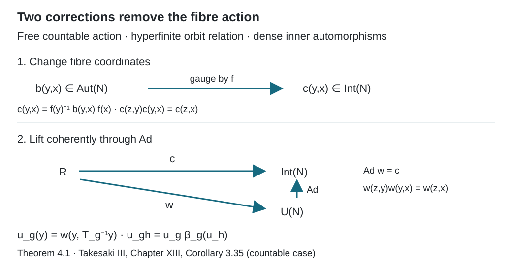

# Ancillary actions and unitary corrections

*Written by GPT-6.1 Sol (OpenAI), Ultra, September 2026. New original text is public domain (CC0).*

## Introduction

An action on a field of factors moves the base points and applies an automorphism inside each fibre. When inner automorphisms are dense and the free orbit relation is hyperfinite, the fibre motion can be absorbed into a change of coordinates and a unitary cocycle. The action then carries the same information, up to cocycle conjugacy, as its action on the centre.

There are two steps. First reduce an automorphism cocycle to an inner automorphism cocycle. Then choose implementing unitaries that compose exactly. Arbitrary implementing unitaries can have scalar multiplication defects, so the second step cannot be omitted.

Read [Compatible lifts and cohomology reduction](compatible-lifts-and-cohomology-reduction.md), especially Theorems 3.1 and 6.1, and [Normalizers, phases, and orbit cocycles](normalizers-phases-and-orbit-cocycles.md), Section 5. We use the general canonical implementation theorem for standard forms and its continuity statement, proved in the modular-theory course: an automorphism has a unique unitary implementer preserving the natural cone and commuting with the conjugation, and the strong topology on these implementers is the topology of pointwise norm convergence on the predual. General standard-form theory is used as a prerequisite; the field calculation below proves the particular decomposition needed here.

Let \(N\) be a factor with separable predual. Choose its standard form \((N,H,J,P)\), with \(H\) separable. Let \((X,\mu)\) be a standard sigma-finite measure space, and put
\[
A=L^\infty(X,\mu),\qquad M=A\overline\otimes N.
\tag{0.1}
\]
We may replace a nonzero \(\mu\) by an equivalent probability. A countable group \(\Gamma\) acts nonsingularly by Borel transformations \(T_g\), with \(T_gT_h=T_{gh}\). All identities below may be restricted to one invariant conull Borel set. The zero-measure algebra is vacuous.

## 1. Automorphisms as a Polish group

Write \(G=\operatorname{Aut}(N)\) with the topology
\[
\theta_i\longrightarrow\theta
\quad\Longleftrightarrow\quad
\|\varphi\circ\theta_i-\varphi\circ\theta\|\longrightarrow0
\quad(\varphi\in N_*).
\tag{1.1}
\]
For a unitary \(u\in N\), let \(\operatorname{Ad}u(a)=uau^*\), and write \(H_0=\operatorname{Int}(N)\).

**Lemma 1.1.** The group \(G\) is Polish, and \(H_0\) is a normal Borel subgroup. There is a Borel choice \(s:H_0\to\mathcal U(N)\) with \(\operatorname{Ad}s(\theta)=\theta\) and \(s(\mathrm{id})=1\). Closedness of \(H_0\) is not asserted.

*Proof.* The canonical implementers identify \(G\) homeomorphically with
\[
\mathcal V=\{U\in\mathcal U(H):UNU^*=N,\ UJ=JU,\ UP=P\}.
\tag{1.2}
\]
Both directions follow from uniqueness of canonical implementation: a unitary in this set implements an automorphism and is its canonical implementer. On unitaries, strong convergence implies strong convergence of adjoints. Algebra normalization is closed under convergence of both maps and adjoints; apply the limits to each \(a\in N\), in both directions, and use strong closedness of \(N\). Commutation with \(J\) and preservation of the closed cone in both directions are also closed conditions. Thus \(\mathcal V\) is closed in the Polish group \(\mathcal U(H)\). The complete strong/adjoint metric from the normalizer lesson proves this Polish assertion for a separable \(H\).

The group \(\mathcal U(N)\) is likewise Polish. Its map \(u\mapsto\operatorname{Ad}u\) into \(G\) is continuous: its canonical implementer is \(uJuJ\). Since \(N\) is a factor, two unitaries have the same inner automorphism precisely when they differ by a scalar in \(\mathbb T\).

Enumerate the matrix coefficients of a unitary on a fixed countable orthonormal basis of \(H\). Multiply each unitary by the scalar that makes its first nonzero coefficient positive real. The normalized set \(S\) is Borel: it is the countable union of the conditions that all earlier coefficients vanish and the chosen coefficient is positive real. Every scalar orbit has exactly one representative in \(S\). The restriction of \(\operatorname{Ad}\) to \(S\) is therefore a Borel injection. The one-to-one Borel-image theorem makes its image \(H_0\) Borel and its inverse Borel. This inverse is the required \(s\); the identity unitary is normalized, so \(s(\mathrm{id})=1\). Normality follows from \(\theta\operatorname{Ad}(u)\theta^{-1}=\operatorname{Ad}(\theta(u))\). \(\square\)

## 2. Decomposing an automorphism over the centre

We first describe the constant field in (0.1) concretely. It acts on \(L^2(X;H)\). A bounded weakly measurable field \(a(x)\in N\) acts by multiplication on vector sections.

**Lemma 2.1 (constant fields).** The algebra \(M\) consists exactly of the essentially bounded measurable \(N\)-valued fields. Its commutant consists of the corresponding \(N'\)-valued fields. With
\[
(J_X\xi)(x)=J\xi(x),\qquad
P_X=\{\xi\in L^2(X;H):\xi(x)\in P\text{ almost everywhere}\},
\tag{2.1}
\]
these give a standard form of \(M\).

*Proof.* The scalar decomposition in [Free actions and the crossed-product diagonal](free-actions-and-the-crossed-product-diagonal.md), Lemma 2.1, says that an operator commuting with \(A\) is a bounded measurable operator field on \(H\). Commuting also with constant \(N'\) makes its fibres belong to \(N\). It suffices to test a countable strong dense subset of the unit ball of \(N'\), remove one null set, and then take strong limits. Similarly the commutant of \(A\otimes N\) consists of \(N'\)-valued fields.

Every bounded \(N\)-valued field belongs to \(A\overline\otimes N\). Indeed, after scaling its bound to one, choose a countable strong/adjoint dense family \(\{a_j\}\) in the unit ball of \(N\). Such a family exists because \(H\) is separable. In a metric for that topology, choose at each \(x\) the first \(a_j\) within \(1/n\) of \(a(x)\). The choice is measurable, since the metric is a countable sum of measurable vector norms. Each resulting countably valued field is a strong limit of its finite sums \(\sum_j\mathbf1_{E_j}\otimes a_j\), hence belongs to the tensor product. Pointwise bounded strong convergence and dominated convergence on \(L^2\) sections then put the original field in the tensor product. This also proves the claimed commutant description.

The cone \(P_X\) is self-dual. To see the nontrivial implication, test its polar against \(\mathbf1_E\eta\) for \(\eta\) in a countable dense subset of \(P\) and measurable \(E\). The resulting local integral inequalities give \(\langle\xi(x),\eta\rangle\geq0\) almost everywhere on one common conull set; self-duality of \(P\) puts \(\xi(x)\) in \(P\). The converse follows by integration. The remaining standard-form identities hold fibrewise: \(J_XMJ_X=M'\), \(J_X\xi=\xi\) for \(\xi\in P_X\), and \(aJ_XaJ_XP_X\subset P_X\). The centre is scalar multiplication, and \(J_XzJ_X=z^*\) there. Thus (2.1) satisfies all standard-form axioms. \(\square\)

**Theorem 2.2 (fibre automorphisms).** If a normal automorphism \(\Phi\) of \(M\) fixes \(A\) pointwise, there is a Borel field \(x\mapsto f_x\in G\), unique almost everywhere, such that
\[
(\Phi(a))(x)=f_x(a(x)).
\tag{2.2}
\]
Conversely every Borel field in \(G\) defines a normal automorphism by (2.2).

*Proof.* The canonical implementer \(U_\Phi\) in the standard form (2.1) commutes with \(A\). The scalar decomposition makes it a measurable unitary field \(U_x\); unitarity follows by decomposing its adjoint as well and using both inverse identities. Commutation with \(J_X\) gives \(U_xJ=JU_x\). Preservation of \(P_X\) in both directions gives \(U_xP=P\): test the sections \(\mathbf1_E\eta\) for a countable dense family in \(P\), and do the same for \(U_\Phi^*\).

For each \(a\) in a countable strong dense family in the unit ball of \(N\), the field of \(\Phi(1\otimes a)\) belongs to \(N\) and equals \(U_xaU_x^*\). Applying the same argument to \(\Phi^{-1}\), and then strong closure, gives \(U_xNU_x^*=N\) on one conull set. Thus \(U_x\) is the canonical implementer of an automorphism \(f_x\). Measurable matrix coefficients make \(x\mapsto U_x\) measurable for the strong unitary topology. If the original coefficients were only completed-measurable, the Borel-version lemma in the compatible-lift lesson supplies a Borel version in the Polish unitary group. The canonical implementation homeomorphism in Lemma 1.1 then makes \(x\mapsto f_x\) Borel. Extend it by the identity on a Borel null exceptional set.

Conjugation by the decomposed \(U_\Phi\) gives (2.2) for all fields at once. Uniqueness follows by testing the countable strong dense family of constant fields.

Conversely take the canonical implementer \(U_{f_x}\) of each fibre automorphism. Their Borel dependence gives a decomposable unitary on \(L^2(X;H)\). It conjugates bounded \(N\)-valued fields to bounded \(N\)-valued fields, and its inverse does the same. Lemma 2.1 therefore makes its conjugation a normal automorphism of \(M\), with formula (2.2). Normality here follows from unitary conjugation, so no assertion about pointwise suprema of arbitrary nets is needed. \(\square\)

For the base action define its simple lifting
\[
(\beta_g(a))(y)=a(T_g^{-1}y).
\tag{2.3}
\]
It is normal: on the Hilbert space it is implemented by the nonsingular change of variables
\[
(W_g\xi)(y)=
\left(\frac{d(T_g)_*\mu}{d\mu}(y)\right)^{1/2}\xi(T_g^{-1}y).
\tag{2.4}
\]
Change of variables proves unitarity and the formula for conjugation. The density factor cancels when conjugating multiplication fields.

## 3. From an action to an orbit cocycle

Let \(\alpha:\Gamma\to\operatorname{Aut}(M)\) have centre action \(\alpha_g(f)=f\circ T_g^{-1}\). If this centre action is initially given only on \(L^\infty(X)\), the normal \(L^\infty\) isomorphism theorem supplies measure-class Borel representatives \(T_g\) between conull subsets. The group identities hold almost everywhere, as follows by testing a countable separating family. Collect the null complements of their domains and ranges and the exceptional sets for all \(g,h\). Remove their images under all finite compositions of the representatives and their inverses, on the domains of those compositions. There are countably many such nonsingular Borel maps, so the removed set is Borel and null. On the resulting invariant conull set the representatives are everywhere defined and form a Borel group action. This uses countability; it makes no simultaneous-representative claim for a real flow. By Theorem 2.2 applied to \(\alpha_g\beta_g^{-1}\), there are Borel automorphism fields \(D_g\) with
\[
(\alpha_g(a))(y)=D_g(y)\bigl(a(T_g^{-1}y)\bigr).
\tag{3.1}
\]
The action law gives
\[
D_{gh}(y)=D_g(y)D_h(T_g^{-1}y).
\tag{3.2}
\]
To obtain (3.2) as an automorphism identity, compare (3.1) on a countable strong dense family of constant fields. Countability of \(\Gamma\) and nonsingularity permit removal of all exceptional sets and their translates at once. We can also arrange \(D_e=\mathrm{id}\).

Assume now that \(T\) is free on this invariant conull space, and let
\[
R=\{(T_gx,x):g\in\Gamma,\ x\in X\}.
\tag{3.3}
\]
It is a Borel relation, being a countable union of Borel graphs. Freeness makes the label \(g\) of each arrow unique. Choosing the first label in an enumeration gives a Borel map, so
\[
b(y,x)=D_g(y)\quad\text{when }y=T_gx
\tag{3.4}
\]
is Borel. If \(z=T_gy\) and \(y=T_hx\), (3.2) yields
\[
b(z,y)b(y,x)=D_g(z)D_h(T_g^{-1}z)=D_{gh}(z)=b(z,x).
\tag{3.5}
\]
Thus the fibre part of the action is an ordinary \(G\)-valued cocycle on the principal orbit relation. Freeness is exactly what makes this label independent of choices.

## 4. Two corrections that compose exactly

**Theorem 4.1.** Suppose \(\operatorname{Int}(N)\) is dense in \(\operatorname{Aut}(N)\), the centre action is free, and its relation \(R\) is hyperfinite on a conull reduction. Then there are a normal automorphism \(\Phi\) fixing \(A\) pointwise and unitaries \(u_g\in M\) such that
\[
\Phi^{-1}\alpha_g\Phi=\operatorname{Ad}(u_g)\beta_g,
\qquad u_{gh}=u_g\beta_g(u_h).
\tag{4.1}
\]
Thus \(\alpha\) is cocycle conjugate to its simple lifting \(\beta\). Ergodicity and nonatomicity of the base are unnecessary.

*Proof.* Apply the cohomology reduction theorem to (3.4), with the Polish group \(G\) and its normal Borel dense subgroup \(H_0\). It gives a Borel \(f:X\to G\) for which
\[
c(y,x)=f(y)^{-1}b(y,x)f(x)\in H_0.
\tag{4.2}
\]
The left side is again a homomorphism. Theorem 2.2 turns \(f\) into a normal automorphism \(\Phi\) fixing the centre. Direct substitution in (3.1) gives
\[
(\Phi^{-1}\alpha_g\Phi)(a)(y)
=c(y,T_g^{-1}y)\bigl(a(T_g^{-1}y)\bigr).
\tag{4.3}
\]

Choose \(v(y,x)=s(c(y,x))\) using Lemma 1.1. It is Borel, implements \(c\), and equals one on units. Since \(c\) is a homomorphism, there is a scalar \(\omega(z,y,x)\in\mathbb T\) with
\[
v(z,y)v(y,x)=\omega(z,y,x)v(z,x).
\tag{4.4}
\]
The scalar is Borel: the product \(v(z,y)v(y,x)v(z,x)^*\) is scalar, and evaluation by any fixed normal state returns its scalar value. Associativity gives its two-cocycle identity and normalization.

Apply the two-cocycle removal theorem to \(\mathcal U(N)\) and its closed central subgroup \(\mathbb T1\). We obtain a Borel unitary homomorphism \(w:R\to\mathcal U(N)\) whose value differs from \(v(y,x)\) by a scalar. Consequently
\[
\operatorname{Ad}w(y,x)=c(y,x),\qquad
w(z,y)w(y,x)=w(z,x),\qquad w(x,x)=1.
\tag{4.5}
\]
Here the finite-stage proof applies directly to the given Borel arrow choices; no additional selector for the unitaries is assumed.

Define the bounded unitary field
\[
u_g(y)=w(y,T_g^{-1}y).
\tag{4.6}
\]
Lemma 2.1 puts it in \(M\). Its homomorphism identity reads
\[
u_{gh}(y)
=w(y,T_h^{-1}T_g^{-1}y)
=w(y,T_g^{-1}y)w(T_g^{-1}y,T_h^{-1}T_g^{-1}y)
=u_g(y)u_h(T_g^{-1}y).
\tag{4.7}
\]
This is the \(\beta\)-cocycle identity in (4.1). Equations (4.3), (4.5) and (4.6) prove its automorphism identity. All conull reductions made in the argument can be saturated under the countable nonsingular action. Their complements do not affect \(M\) or its automorphisms. \(\square\)

The two corrections address different defects. The field \(f\) changes the fibre coordinates until the automorphisms are inner. The scalar correction from \(v\) to \(w\) makes the implementing unitaries themselves respect composition.

*Figure 1. Theorem 4.1. The first step replaces \(b\) by \(c(y,x)=f(y)^{-1}b(y,x)f(x)\), whose values are inner automorphisms. The second step lifts \(c\) to a unitary homomorphism \(w\); merely choosing \(v=s(c)\) can leave the scalar defect (4.4). Evaluating \(w\) on \((y,T_g^{-1}y)\) gives the unitary cocycle in (4.7). The diagram describes the countable discrete assertion of Takesaki, Chapter XIII, Corollary 3.35.*

## 5. Classification by the centre

Two actions \(\alpha\) and \(\widetilde\alpha\) of the same group are **cocycle conjugate** if a normal algebra isomorphism \(\Psi\) and a unitary cocycle \(z_g\) for \(\widetilde\alpha\) satisfy
\[
\Psi\alpha_g\Psi^{-1}=\operatorname{Ad}(z_g)\widetilde\alpha_g.
\tag{5.1}
\]
The cocycle condition is \(z_{gh}=z_g\widetilde\alpha_g(z_h)\).

**Corollary 5.1.** For the fixed factor \(N\) in Theorem 4.1, two actions satisfying its hypotheses are cocycle conjugate if and only if their centre actions are conjugate by a measure-class isomorphism of the bases.

*Proof.* An inner automorphism fixes the centre, so (5.1) restricts to a conjugacy of centre actions. The normal \(L^\infty\) isomorphism theorem identifies that centre conjugacy with a measure-class Borel isomorphism of the standard bases, on conull sets.

Conversely such a base isomorphism lifts by composition of fields to an isomorphism of the tensor products and conjugates their simple liftings. Each original action is cocycle conjugate to its simple lifting by Theorem 4.1. For completeness, these equivalences compose: if \(\gamma_g=\operatorname{Ad}(u_g)\beta_g\) and \(\delta_g=\operatorname{Ad}(v_g)\gamma_g\), then \(v_gu_g\) is a \(\beta\)-cocycle, because
\[
v_{gh}u_{gh}
=v_g\gamma_g(v_h)u_g\beta_g(u_h)
=v_gu_g\beta_g(v_hu_h).
\]
They also invert: \(u_g^*\) is a \(\gamma\)-cocycle since
\(u_g^*\gamma_g(u_h^*)=\beta_g(u_h^*)u_g^*=u_{gh}^*\).
Transporting cocycles through the base isomorphism and composing gives (5.1). \(\square\)

This proves the countable discrete group assertion of Takesaki, Chapter XIII, Corollary 3.35. For a countable amenable group, [Invariant means on measured relations](invariant-means-on-measured-relations.md) supplies hyperfiniteness. [Return arrows and factor-field flows](return-arrows-and-factor-field-flows.md), Theorem 4.1 and Corollary 4.2, proves the real-flow application for a constant separable factor with dense inner automorphisms and a free ergodic centre. Its complete cross-section and scalar-correction proofs retain their exact suspension and standard-form prerequisites; the transitive free case needs no inner-density assumption.

**Example 5.2 (a scalar defect).** Let \(\Gamma=\mathbb Z/2\mathbb Z\) exchange the two points \(0,1\), with any positive probabilities. Let \(N=M_2(\mathbb C)\), and put \(p=\operatorname{diag}(1,-1)\). The action
\[
(\alpha_1(a))(y)=p\,a(1-y)\,p
\tag{5.2}
\]
has square the identity. The constant unitary choice \(v_1=ip\) implements the same fibre automorphism, but \(v_1\beta_1(v_1)=-1\), so it is not a unitary cocycle. A coherent choice is
\[
u_1(1)=ip,\qquad u_1(0)=-ip.
\tag{5.3}
\]
The two values multiply to one, and each implements \(\operatorname{Ad}p\). They are the transport from a root and its inverse. No measure-preserving assumption is needed.

## 6. Exercises with solutions

Level 1 asks for a computation or a direct application. Level 2 asks for a proof using the lesson’s framework. Level 3 combines results or examines a hypothesis whose failure changes the conclusion.

**Exercise 6.1 (the scalar correction).** *Level 1.* Verify (5.2)–(5.3), including the cocycle identity at both base points. Give a constant coherent choice as well.

*Solution.* Since \(p^2=1\), applying (5.2) twice returns \(a(y)\). The constant choice \(ip\) gives \((ip)^2=-1\). In (5.3), the product at \(y=1\) is \((ip)(-ip)=1\), and at \(y=0\) it is \((-ip)(ip)=1\). These are exactly \(u_1(y)u_1(1-y)=u_0(y)=1\). The constant choice \(u_1=p\) also works, since \(p^2=1\). All choices implement the same inner automorphism.

**Exercise 6.2 (gauge orientation).** *Level 2.* Derive (4.3), and explain why placing \(f(y)\) rather than its inverse on the left would correspond to a different conjugation.

*Solution.* For a field \(a\), first \(\Phi(a)(x)=f(x)(a(x))\). Applying \(\alpha_g\) gives \(D_g(y)f(T_g^{-1}y)(a(T_g^{-1}y))\). Finally \(\Phi^{-1}\) applies \(f(y)^{-1}\). The resulting automorphism is \(f(y)^{-1}D_g(y)f(T_g^{-1}y)\), which is (4.2) on the arrow \((y,T_g^{-1}y)\). Conjugation by \(\Phi\) in the other direction would give \(f(y)D_g(y)f(T_g^{-1}y)^{-1}\), so the two formulas must not be interchanged.

**Exercise 6.3 (a scalar two-cocycle).** *Level 2.* Starting from (4.4), derive its identity on four related points and explain why the scalar defect does not appear in the automorphism cocycle.

*Solution.* Compute \(v(t,z)v(z,y)v(y,x)\) in the two associative orders. They give, respectively,
\[
\omega(t,z,y)\omega(t,y,x)v(t,x),\qquad
\omega(z,y,x)\omega(t,z,x)v(t,x).
\]
Cancelling the last unitary proves equality of the two scalar products. They may be moved past every unitary because they are central. Under \(\operatorname{Ad}\), each scalar acts trivially, so (4.4) becomes the exact homomorphism law for \(c\). A unitary cocycle needs that scalar product corrected; an automorphism cocycle does not detect it.

**Exercise 6.4 (finite classes need no density).** *Level 2.* Suppose \(R\) itself has finite classes and \(b:R\to G\) is a Borel homomorphism. Show directly that it is a coboundary, without assuming dense inner automorphisms.

*Solution.* Choose the Borel root \(t(x)\) of each finite class and put \(f(x)=b(x,t(x))\). Since \(t(x)=t(y)\) on a pair, the homomorphism identity gives \(b(y,x)=f(y)f(x)^{-1}\). Thus \(f(y)^{-1}b(y,x)f(x)=1\). For a free action with this finite relation, the field automorphism \(\Phi\) defined by \(f\) conjugates the action exactly to its simple lifting, and the unitary correction can be one. Borel roots are available because each class is finite; this argument does not supply a transversal for a general hyperfinite relation.

**Exercise 6.5 (why freeness enters).** *Level 3.* On a one-point base let \(\mathbb Z\) act on \(N\) by powers of an automorphism \(\theta\). The principal relation is finite. Explain why its hyperfiniteness gives no conclusion that this action is cocycle conjugate to the trivial action when \(\theta\) is outer.

*Solution.* Every group element has the same principal arrow \((x,x)\), whereas its fibre automorphism is \(\theta^n\). Formula (3.4) is therefore not well-defined unless all these automorphisms are the identity. Isotropy labels have been lost. If the action were cocycle conjugate to the trivial action, its generator after an algebra conjugacy would be inner. Conjugacy preserves innerness, by Lemma 1.1's normality calculation, so this would make \(\theta\) inner, a contradiction. This argument applies whenever an outer \(\theta\) is given; it assumes no existence theorem for a particular factor.

**Exercise 6.6 (transporting a correction).** *Level 2.* If \(\gamma_g=\operatorname{Ad}(u_g)\beta_g\) for a \(\beta\)-cocycle \(u\), verify directly that the inverse correction \(u_g^*\) is a \(\gamma\)-cocycle and removes the perturbation.

*Solution.* The cocycle law gives \(u_{gh}^*=\beta_g(u_h^*)u_g^*\). On the other hand,
\[
u_g^*\gamma_g(u_h^*)
=u_g^*u_g\beta_g(u_h^*)u_g^*
=\beta_g(u_h^*)u_g^*.
\]
Thus \(u_{gh}^*=u_g^*\gamma_g(u_h^*)\). Also \(\operatorname{Ad}(u_g^*)\gamma_g=\beta_g\). The group composition order in both assertions agrees with (4.7).

## References

[Takesaki] Masamichi Takesaki, *Theory of Operator Algebras III*, Encyclopaedia of Mathematical Sciences 127, Springer, 2003. [Publisher record](https://doi.org/10.1007/978-3-662-10453-8). Chapter XIII, Theorem 3.26, Proposition 3.34(i) and the countable discrete part of Corollary 3.35 supply the cohomology reduction and application developed here.
