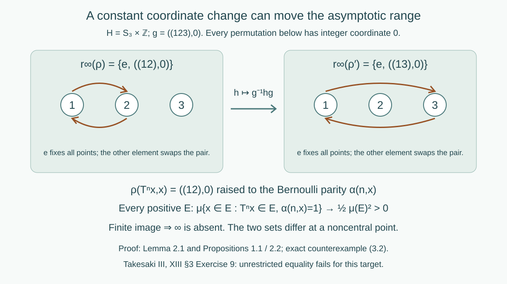

# Asymptotic ranges and groupoid cohomology

*Written by GPT-6.1 Sol (OpenAI), Ultra, September 2026. New original text is public domain (CC0).*

## Introduction

Changing a groupoid cocycle by a measurable field changes its coordinates at both endpoints. For a second countable abelian target this leaves the asymptotic range unchanged. A noncommutative target has a further effect: even a constant coordinate change conjugates the range. We prove the precise constant-change formula, prove invariance at central points and at infinity for second countable targets, and construct a counterexample to unrestricted equality.

Read [Orbits, stabilizers, and relation algebras](orbits-stabilizers-and-relation-algebras.md), especially countable measured relations and their counting measure classes. We use countable product probability, independence of coordinates, approximation of measurable events by finite cylinder events, and elementary permutation groups. Cylinder approximation follows because the cylinder algebra generates the product sigma-field: the events approximable in symmetric-difference measure form a sigma-field. No modular, weight, or action-spectrum theorem is needed.

Let \(\mathcal R\) be a countable nonsingular principal measured relation on a standard sigma-finite space \((X,\mu)\). An arrow \((y,x)\) has source \(x\), range \(y\), and multiplication \((z,y)(y,x)=(z,x)\). Use its source-counting measure class; nonsingularity gives the same null sets with range counting. A measurable cocycle into a locally compact Hausdorff group \(H\) satisfies
\[
\rho(z,y)\rho(y,x)=\rho(z,x).
\tag{0.1}
\]
Write \(H^+=H\cup\{\infty\}\) for its one-point compactification, with neighborhoods of infinity given by complements of compact subsets of \(H\). If \(H\) is already compact, we may adjoin an isolated infinity. For \(E\subset X\) of positive measure, put \(\mathcal R_E=\mathcal R\cap(E\times E)\), and define
\[
r_\infty(\rho)=\bigcap_{\mu(E)>0}
 \operatorname{essran}_{H^+}(\rho|_{\mathcal R_E}).
\tag{0.2}
\]
Membership in an essential range means that every neighborhood has a preimage of positive arrow measure. All statements are unchanged by passing to measurable versions or discarding arrow-null exceptional sets.

Two cocycles are cohomologous when, for a measurable \(f:X\to H\),
\[
\rho'(y,x)=f(y)^{-1}\rho(y,x)f(x)
\quad\text{almost everywhere}.
\tag{0.3}
\]

## 1. What a change of coordinates preserves

**Proposition 1.1 (constant change).** If \(f(x)=g\) is constant, then
\[
r_\infty(\rho')=g^{-1}r_\infty(\rho)g,
\tag{1.1}
\]
where conjugation fixes \(\infty\). This holds for every locally compact Hausdorff target.

*Proof.* Conjugation \(c_g(h)=g^{-1}hg\) is a homeomorphism of \(H\). It and its inverse take compact sets to compact sets, so it extends to a homeomorphism of \(H^+\) fixing infinity. On each reduction, a neighborhood of \(c_g(a)\) has a positive preimage under \(\rho'\) exactly when its inverse neighborhood has a positive preimage under \(\rho\). Thus its essential range is the image under \(c_g\) of the old one. A bijection commutes with arbitrary intersections, giving (1.1). \(\square\)

**Theorem 1.2 (central points and infinity).** Suppose \(H\) is second countable. For cohomologous cocycles, every \(a\in Z(H)\) satisfies
\[
a\in r_\infty(\rho)\quad\Longleftrightarrow\quad
a\in r_\infty(\rho'),
\tag{1.2}
\]
and the same equivalence holds for \(\infty\). In particular, for abelian second countable locally compact \(H\),
\[
r_\infty(\rho)=r_\infty(\rho').
\tag{1.3}
\]

*Proof.* Assume \(a\) belongs to the first asymptotic range, fix positive \(E\), and let \(U\) be a neighborhood of \(a\). For each \(h\in H\), centrality gives \(h^{-1}ah=a\). Continuity of \((p,z,q)\mapsto p^{-1}zq\) gives neighborhoods \(W_h\) of \(h\) and \(V_h\) of \(a\) with
\[
W_h^{-1}V_hW_h\subset U.
\tag{1.4}
\]
Second countability makes this open cover of \(H\) have a countable subcover. Some \(B=E\cap f^{-1}(W_h)\) has positive measure. Since \(a\) is in the essential range on \(\mathcal R_B\), a positive set of its arrows has \(\rho(y,x)\in V_h\). Remove the arrow-null set where (0.3) fails. At both endpoints \(f\) lies in \(W_h\), so (1.4) gives \(\rho'(y,x)\in U\). This proves membership for every \(E,U\).

For infinity, fix a compact \(K\subset H\) and positive \(E\). Cover \(H\) by countably many relatively compact open sets \(W\), and choose one with \(B=E\cap f^{-1}(W)\) positive. The set
\[
C=\overline W K\overline W^{-1}
\tag{1.5}
\]
is compact. Essential membership of infinity for \(\rho|_{\mathcal R_B}\) supplies a positive set of arrows with \(\rho(y,x)\notin C\). After removing the exceptional set, their new values cannot lie in \(K\): otherwise (0.3) would put the old value in \(f(y)Kf(x)^{-1}\subset C\). This proves the forward implication at infinity; it does not need centrality or commutativity.

Apply both arguments in reverse using the cochain \(f^{-1}\), since \(\rho(y,x)=f(y)\rho'(y,x)f(x)^{-1}\). This gives the reverse inclusions. If \(H\) is abelian, all finite points are central, so (1.3) follows, including infinity. \(\square\)

The countability hypothesis in this theorem supplies the countable cover with a positive inverse-image piece. It is explicit; the theorem is not asserted for arbitrary non-second-countable targets. Proposition 1.1 and the counterexample below require no such qualification.

## 2. A cocycle with a two-element asymptotic range

Take the fair Bernoulli probability space
\[
\Omega=\{0,1\}^{\mathbb Z},\qquad
\mu=\bigotimes_{k\in\mathbb Z}\tfrac12(\delta_0+\delta_1),
\qquad (Tx)_k=x_{k+1}.
\tag{2.1}
\]
For each nonzero \(n\), the event \(T^n x=x\) has measure zero: equality of \(x_0,x_n,\ldots,x_{kn}\) has probability \(2^{-k}\), tending to zero. Remove the countable union of these periodic events. The resulting \(T\)-invariant Borel set \(X\) is conull, and every orbit there is freely indexed by \(\mathbb Z\). Thus
\[
\mathcal R=\{(T^n x,x):n\in\mathbb Z,\ x\in X\}
\tag{2.2}
\]
is a countable standard Borel principal measured relation. Its graphs are disjoint, and the arrow measure of a subset of the \(n\)-th graph equals the base measure of its sources.

Let \(\alpha(n,x)\in\mathbb Z/2\mathbb Z\) be
\[
\alpha(n,x)=
\begin{cases}
\sum_{k=0}^{n-1}x_k,&n>0,\\
0,&n=0,\\
-\sum_{k=n}^{-1}x_k,&n<0.
\end{cases}
\tag{2.3}
\]
The sums are taken modulo two. Splitting intervals, with cancellation when an endpoint lies inside the other interval, gives
\[
\alpha(n+m,x)=\alpha(n,T^m x)+\alpha(m,x).
\tag{2.4}
\]
Equivalently these sums are the accumulated increments of the invertible transformation
\[
S(x,j)=(Tx,j+x_0),\qquad
S^{-1}(x,j)=(T^{-1}x,j-x_{-1}),
\tag{2.5}
\]
on \(X\times\mathbb Z/2\mathbb Z\). It preserves \(\nu=\mu\otimes u_2\): for each \(x\), addition of \(x_0\) permutes the two equiprobable fibre points, and \(T\) preserves \(\mu\).

**Lemma 2.1.** The transformation \(S\) is strongly mixing. For every positive measurable \(E\subset X\) and \(d\in\{0,1\}\),
\[
\mu\{x\in E:T^n x\in E,\ \alpha(n,x)=d\}
\longrightarrow\tfrac12\mu(E)^2.
\tag{2.6}
\]

*Proof.* Let \(A,B\) depend only on coordinates \([-m,m]\), and let \(j,k\) be fibre values. If \(n>2m+1\), then \(A\) and \(T^{-n}B\) depend on disjoint coordinate intervals. The parity sum over \([0,n-1]\) includes at least one middle coordinate, for example \(m+1\), outside both intervals. Conditional on all the other coordinates, that fair independent bit makes the parity equally likely to have either value. Consequently
\[
\nu\bigl((A\times\{j\})\cap S^{-n}(B\times\{k\})\bigr)
=\tfrac14\mu(A)\mu(B)
=\nu(A\times\{j\})\nu(B\times\{k\}).
\tag{2.7}
\]
Finite unions of cylinder rectangles satisfy the same eventual product identity. Approximate arbitrary events \(C,D\) in symmetric-difference measure by such unions \(C_0,D_0\). Invariance of \(\nu\) bounds the difference of their intersection probabilities, uniformly in \(n\), by
\(\nu(C\triangle C_0)+\nu(D\triangle D_0)\).
The difference of the corresponding product probabilities has the same bound. Let the approximation errors tend to zero. This proves strong mixing for all measurable events. Taking \(C=E\times\{0\}\), \(D=E\times\{d\}\) and multiplying their intersection probability by two gives (2.6). \(\square\)

Now take the noncompact countable discrete group
\[
H=S_3\times\mathbb Z,\qquad
a=((12),0),\qquad g=((123),0),\qquad D=\{e,a\}.
\tag{2.8}
\]
Define a Borel groupoid cocycle by
\[
\rho(T^n x,x)=a^{\alpha(n,x)}.
\tag{2.9}
\]
Freeness makes this well defined; (2.4) proves the groupoid multiplication law. Its image lies in \(D\).

**Proposition 2.2.** The exact asymptotic range is
\[
r_\infty(\rho)=D.
\tag{2.10}
\]

*Proof.* The diagonal arrows have value \(e\) and positive measure on every positive reduction. For \(a\), equation (2.6) with \(d=1\) gives a positive set of \(n\)-th graph arrows inside every positive \(\mathcal R_E\), for all sufficiently large positive \(n\). Since the target is discrete, this puts \(a\) in every reduced essential range. Every other finite point has a singleton neighborhood with empty preimage. The finite set \(D\) is compact, so the neighborhood \(H^+\setminus D\) of infinity also has empty preimage. Thus neither an extra finite point nor infinity belongs. \(\square\)

## 3. Cohomologous cocycles with different ranges

Use the constant cochain \(f(x)=g\) from (2.8). The new cocycle is
\[
\rho'(y,x)=g^{-1}\rho(y,x)g,
\qquad g^{-1}ag=((13),0)=a'.
\tag{3.1}
\]
Proposition 1.1 and (2.10) give
\[
r_\infty(\rho')=\{e,a'\}\ne\{e,a\}=r_\infty(\rho).
\tag{3.2}
\]
The two cocycles are cohomologous everywhere, on the same free probability-preserving countable principal groupoid. The target is locally compact, Hausdorff, second countable and noncompact. The example therefore retains all the stated hypotheses of the source exercise.

*Figure 1. Equations (2.8)–(3.2): the target is \(S_3\times\mathbb Z\), and every drawn permutation has integer coordinate zero. The Bernoulli parity cocycle realizes both displayed group elements on every positive reduction. The arrow is the exact constant cochain change \(h\mapsto g^{-1}hg\); infinity is absent on both sides. Proposition 1.1 supplies the conjugation formula. Compare Takesaki III, §3, Exercise 9.*

The printed exercise asks for equality of the two sets for an arbitrary locally compact target. The definition and cohomology formula on its page were checked directly. Equation (3.2) disproves that literal conclusion. Proposition 1.1 is the correct constant-change statement, and Theorem 1.2 gives actual equality for abelian second countable targets, including infinity. No claim is made that arbitrary noncommutative measurable changes merely conjugate the whole asymptotic range by one fixed element.

## 4. Exercises with solutions

Level 1 asks for a computation or a direct application. Level 2 asks for a proof using the lesson’s framework. Level 3 combines results or examines a hypothesis whose failure changes the conclusion.

**Exercise 4.1 (negative increments).** *Level 2.* Verify \(\alpha(-n,T^n x)=-\alpha(n,x)\) for \(n>0\), and derive the cocycle identity for arbitrary integer signs using the skew transformation.

*Solution.* The negative sum at \(T^n x\) uses coordinates \(-n,\ldots,-1\), which become \(x_0,\ldots,x_{n-1}\). This gives the negative of the positive sum. Iterating (2.5), forwards and backwards, therefore gives \(S^n(x,j)=(T^n x,j+\alpha(n,x))\) for all integers. Evaluating \(S^n S^m=S^{n+m}\) on \((x,j)\) yields (2.4) with all signs, without a separate interval-case assumption.

**Exercise 4.2 (the middle bit).** *Level 2.* In (2.7), explain both factors of one half and justify passage from cylinders to arbitrary events.

*Solution.* The starting fibre is \(j\) with probability one half. Conditional on both cylinder events and all coordinates other than a middle bit, the required endpoint parity has probability one half. The disjoint cylinder events have probability \(\mu(A)\mu(B)\), giving the factor one quarter. For arbitrary events, choose cylinder unions approximating each event in symmetric-difference measure. The intersection error is bounded by the sum of the two errors, uniformly in \(n\), because \(S\) preserves probability. The product error has the same bound. Taking the errors arbitrarily small proves the mixing limit.

**Exercise 4.3 (which transposition appears).** *Level 1.* Compute \(g^{-1}(12)g\) for \(g=(123)\), and explain why the cocycles in (3.2) have equal central parts.

*Solution.* Conjugation sends the transposition to \((g^{-1}(1)\ g^{-1}(2))=(3\ 1)=(13)\). The center of \(S_3\) is trivial: a central permutation must commute with each transposition, forcing it to preserve every two-element subset and hence every point. Thus \(Z(H)=\{e_{S_3}\}\times\mathbb Z\). Both ranges intersect it in the identity alone, agreeing with Theorem 1.2.

**Exercise 4.4 (infinity without a nonzero finite value).** *Level 3.* On the same relation, take the additive target \(H=\mathbb Z\) and the cocycle \(b(T^n x,x)=n\). Prove
\[
r_\infty(b)=\{0,\infty\}.
\]

*Solution.* The integer is unique by freeness, and composition adds it, so this is a Borel cocycle. Zero belongs on every positive reduction by diagonal arrows. For \(m\ne0\), choose \(E=\{x:x_0=0,\ x_m=1\}\cap X\), of measure one quarter. A source in both \(E\) and \(T^{-m}E\) would require \(x_m\) to be both one and zero. Thus no \(m\)-arrow lies in \(\mathcal R_E\), and \(m\) is excluded from the asymptotic range. The factor \(T\) of the mixing transformation \(S\) is mixing: sum the fibre intersection limits to get \(\mu(E\cap T^{-n}E)\to\mu(E)^2\). For any positive \(E\) and any finite \(K\subset\mathbb Z\), choose a sufficiently large \(n\notin K\) with positive intersection. Its graph supplies a positive arrow set with \(b\notin K\). These are exactly the neighborhoods of infinity, proving its membership. The point at infinity is neither the additive identity nor an additional finite group element.

**Exercise 4.5 (where centrality is used).** *Level 2.* Why does (1.4) hold around a central \(a\) for every \(h\), and why can it fail for the \(a,g\) in (2.8)? Which part of Theorem 1.2 still works without centrality?

*Solution.* At \((h,a,h)\) the continuous multiplication map has value \(h^{-1}ah=a\) precisely when \(h\) commutes with \(a\). This allows small three-variable neighborhoods mapping into any prescribed neighborhood of \(a\). For the example, \(g^{-1}ag=a'\ne a\); in the discrete target a neighborhood of \(a\) can be the singleton \(\{a\}\), and no neighborhoods containing \(g,a,g\) can map into it. The compact-set argument (1.5) at infinity uses only \(\rho=f(y)\rho'f(x)^{-1}\) and compact products, so it applies to noncommutative second countable targets too.

## References

- [Takesaki] Masamichi Takesaki, *Theory of Operator Algebras III*, Encyclopaedia of Mathematical Sciences 127, Springer, 2003. Chapter XIII, §3, Exercise 9. [Publisher record](https://doi.org/10.1007/978-3-662-10453-8).
