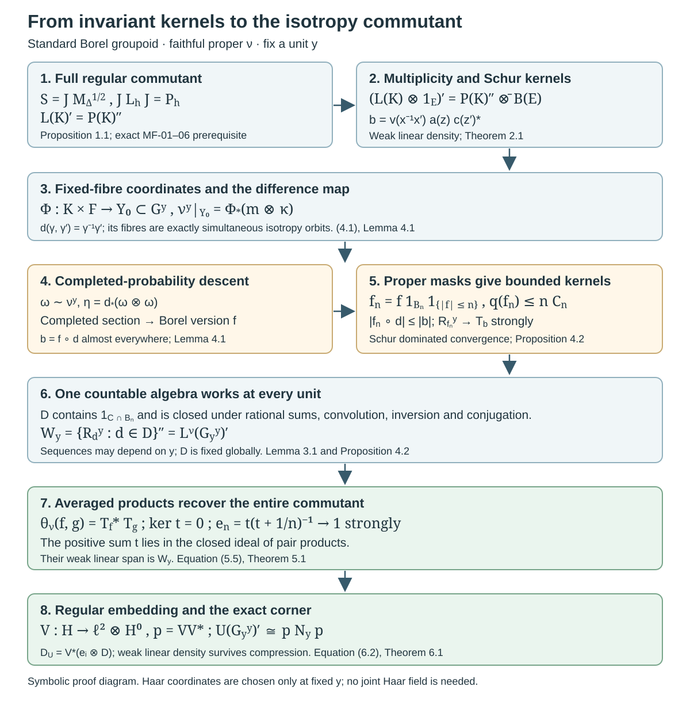

# Averaged coefficients and isotropy commutants

*Written by GPT-6.1 Sol (OpenAI), Ultra, October 2026. Original exposition is public domain (CC0).*

## Introduction

An invariant integral kernel acts in the commutant of a group representation. The converse requires a density argument. For an isotropy group, there is a further issue: a kernel written in coordinates on one range fibre must be obtained from measurable functions on the original groupoid. Finally, the generating functions must belong to one countable family that works at every unit.

We prove these three steps for a standard Borel groupoid with a faithful proper transverse function. The resulting theorem gives a single countable total family of square-integrable coefficient sections whose averaged operators generate the isotropy commutant at every unit. The argument uses the pointwise Haar coordinates already proved in Borel group measures and isotropy topologies, Theorem 5.2 and Corollary 5.5. It does not choose topologies, Haar measures or sections jointly as the unit varies. All global countable choices come instead from the arrow sigma-field and its proper exhaustion.

The mathematical antecedent is Connes, *Sur la théorie non commutative de l’intégration*, Proposition 15, [author-hosted PDF pp. 38–39](https://alainconnes.org/wp-content/uploads/ThNonComm.pdf#page=38). Standard Borel structure matters: [Principal groupoids with extra fibre information](principal-groupoids-with-extra-fibre-information.md), Section 5, disproves the unrestricted countably generated assertion even for trivial isotropy. That correction is preserved here. The properly infinite factor conclusion in Corollary 11 has its separate remaining measurable-space scope; this lesson does not settle it by changing its hypotheses.

The exact written prerequisites are Haar measure on locally compact groups, Proposition 3.1, Corollary 11.2 and Theorems 14.2–15.1; The modular group and its analytic algebra (in the modular course), MF-01 through MF-06, for the full left Hilbert-algebra commutant theorem; and [Square-integrable representations and random operators](https://kokunoyumeto.github.io/open-math-courses-public/courses/NCG-FOLIATIONS/companions/square-integrable-representations-and-random-operators.html), Lemma 1.2, Proposition 3.3 and Theorem 4.4, for proper exhaustions, measurable convolution operators and the regular embedding. Completed-measure sections use the earlier Polish-space lesson, Lemma 7.6 and Theorem 7.7. Ordinary product integration is proved at its actual scope in the preceding isotropy lesson, Lemma 5.3a. The general theories behind these prerequisites are not developed here. The bicommutant theorem, continuous functional calculus and separable Hilbert tensor products are operator-algebra prerequisites. Whole-programme prerequisite closure is not asserted.

## 1. The two regular actions and their modular factors

Let \(K\) be a locally compact Polish group, and let \(m\) be left Haar measure. Keep the preceding lesson's convention

\[
m(Eh)=\Delta(h)m(E),\qquad
\int f(xh)\,dm(x)=\Delta(h)^{-1}\int f(x)\,dm(x).
\tag{1.1}
\]

Thus \(\Delta\) is the reciprocal of the modular function in some other conventions. On \(H_K=L^2(K,m)\) define

\[
(L_h\xi)(x)=\xi(h^{-1}x),\qquad
(P_h\xi)(x)=\Delta(h)^{1/2}\xi(xh).
\tag{1.2}
\]

Both are unitary representations, and they commute. The right factor follows by squaring its multiplier and applying (1.1). Both actions are strongly continuous: this follows first for continuous compactly supported functions from uniform continuity on a common compact set, then for all of \(H_K\) by their density and the unitary norm bounds. Haar measure is sigma-finite because \(K\) is second countable and locally compact.

**Proposition 1.1 (the full regular commutant).** With the actions in (1.2),

\[
L(K)'=P(K)'',\qquad
L(K)''{}'=P(K)''.
\tag{1.3}
\]

*Proof.* Use \(C_c(K)\) with convolution
\((f*g)(x)=\int f(t)g(t^{-1}x)dm(t)\) and involution
\(f^\sharp(x)=\Delta(x)^{-1}\overline{f(x^{-1})}\).
The complete Haar convolution proof gives associativity, the involution identities and \(\|f*g\|_2\leq\|f\|_1\|g\|_2\). The adjoint identity is also visible from the integrated left action: changing \(t\) to \(t^{-1}\) in \(\int\overline{f(t)}L_{t^{-1}}dm(t)\) gives left convolution by \(f^\sharp\). Therefore
\(\langle f*g,h\rangle=\langle g,f^\sharp*h\rangle\), with inner products linear in the first argument. Compactly supported approximate identities give \(e_n*g\to g\) in \(L^2\). Hence the span of convolution products is dense, and left multiplication is bounded. These are the algebra and density axioms of a left Hilbert algebra.

Its closed involution has the explicit polar data

\[
(J\xi)(x)=\Delta(x)^{-1/2}\overline{\xi(x^{-1})},\qquad
S=J M_\Delta^{1/2},
\tag{1.4}
\]

where \(M_\Delta\) is multiplication by \(\Delta\) on its maximal domain. The inversion formula proves \(J\) antiunitary and \(J^2=1\). Applying the right side of (1.4) to \(f\in C_c(K)\) gives exactly \(f^\sharp\). This is its closure: \(C_c(K)\) is dense in the graph norm
\(\int(1+\Delta)|f|^2dm\), by the Haar lesson, Corollary 11.2(5). Thus the required closability and polar assertions hold on the actual Hilbert space.

Let \(N\) be the von Neumann algebra generated by left convolution by \(C_c(K)\). The Haar weak-integral formula puts these operators in \(L(K)''\). Conversely, left convolution by \(e_n\) tends strongly to the identity, and convolution by \(L_he_n\) tends strongly to \(L_h\). Therefore \(N=L(K)''\). The full modular Hilbert-algebra theorem, MF-01–06, now gives \(N'=JNJ\). Direct substitution in (1.4) yields \(JL_hJ=P_h\). This proves (1.3). The generic commutant theorem is used with all its Hilbert-algebra hypotheses verified, rather than with commutation alone. \(\square\)

## 2. Invariant Schur kernels generate the amplified commutant

Let \((F,\kappa)\) be a standard Borel space with a sigma-finite measure and set \(E=L^2(F,\kappa)\). The tensor identification gives
\(H=L^2(K\times F,m\otimes\kappa)=H_K\otimes E\).
Write \(\mathcal U_h=L_h\otimes1\).

A **Schur kernel** \(b\) is a product-measurable function on \((K\times F)^2\) with finite essential row and column bounds

\[
\begin{aligned}
A_b&=\mathop{\rm ess\,sup}_{(x,z)}\int|b(x,z;x',z')|\,dm(x')d\kappa(z'),\\
B_b&=\mathop{\rm ess\,sup}_{(x',z')}\int|b(x,z;x',z')|\,dm(x)d\kappa(z).
\end{aligned}
\tag{2.1}
\]

Its integral operator has norm at most \(\sqrt{A_bB_b}\). Indeed weighted Cauchy–Schwarz bounds its pointwise square by the row integral times the integral of \(|b||f|^2\); integrate and apply the column bound and Tonelli. This also supplies the operator for arbitrary \(L^2\) inputs by density.

**Theorem 2.1.** The commutant \(\mathcal U(K)'\) is generated by invariant Schur kernels, meaning kernels with
\(b(hx,z;hx',z')=b(x,z;x',z')\) for every \(h\). In fact the kernels

\[
b_{v,a,c}(x,z;x',z')
=v(x^{-1}x')a(z)\overline{c(z')},
\tag{2.2}
\]

with \(v\in C_c(K)\) and bounded \(a,c\) supported on finite-\(\kappa\)-measure sets suffice. The linear span of these operators is weakly dense in the commutant.

*Proof.* Every invariant Schur operator commutes with \(\mathcal U_h\), by left Haar change of variables. For (2.2), the two bounds are at most

\[
\|v\|_1\|a\|_\infty\|c\|_1,\qquad
\|\Delta^{-1}v\|_1\|a\|_1\|c\|_\infty.
\tag{2.3}
\]

The second uses inversion in the variable \(x^{-1}x'\); it need not equal the first. Its group-coordinate operator is

\[
(T_vf)(x)=\int v(r)f(xr)\,dm(r)
=\int v(r)\Delta(r)^{-1/2}P_rf\,dm(r).
\tag{2.4}
\]

Thus (2.2) is \(T_v\otimes|a\rangle\langle c|\). These \(T_v\) have weakly dense linear span in \(P(K)''\): the coefficient \(v\Delta^{-1/2}\) ranges over \(C_c(K)\), and strong continuity and an approximate identity recover every \(P_h\). Their span is a \(*\)-algebra by convolution and kernel transposition, and its weak closure contains the identity, so the bicommutant theorem identifies that closure with \(P(K)''\). The bounded finite-support functions are dense in \(E\), by simple approximation and a finite-measure exhaustion. Their rank-one operators therefore have weakly dense span in \(B(E)\). Tensoring these two families gives weakly dense span in \(P(K)''\,\overline\otimes\,B(E)\). More explicitly, finite multiplicity compressions of an operator in this tensor product are finite matrices with entries in \(P(K)''\); each entry is weakly approximable by the linear span of \(T_v\). Finite compressions then tend strongly to the original operator.

For completeness, the amplified commutant is exactly that tensor product. Choose a countable orthonormal basis of \(E\). If \(T\) commutes with \(L_h\otimes1\), each matrix entry of \(T\) lies in \(L(K)'=P(K)''\), by Proposition 1.1. Its finite matrix compressions belong to \(P(K)''\,\overline\otimes\,B(E)\) and converge strongly to \(T\). The reverse containment follows from commutation. This proves the theorem. \(\square\)

## 3. Proper global kernels and countable choices

Let \(G\) now be a standard Borel groupoid with unit space \(X\), and let \(\nu\) be a faithful proper transverse function. Write \(Y_y=G^y\) and \(H_y^0=L^2(Y_y,\nu^y)\). Left translation gives the regular representation \(L^\nu\). Properness and inversion give symmetric Borel sets

\[
B_n=B_n^{-1}\uparrow G,\qquad
C_n=\sup_y\nu^y(B_n)<\infty.
\tag{3.1}
\]

This is the full symmetric-exhaustion lemma in the earlier random-operator lesson, Lemma 1.2(a), with modulus one. Choose a countable algebra \(\mathcal C\) generating the arrow sigma-field and containing all \(B_n\). Its restrictions generate the trace sigma-field on each range fibre.

For a Borel function \(f\) on \(G\) put

\[
f^\flat(\gamma)=\overline{f(\gamma^{-1})},\qquad
q(f)=\max\{\sup_y\nu^y(|f|),\sup_y\nu^y(|f^\flat|)\}.
\tag{3.2}
\]

Let \(\mathcal I\) consist of the bounded Borel functions with \(q(f)<\infty\). Define

\[
(R_f^y\alpha)(\gamma)
=\int_{Y_y}f(\gamma^{-1}\gamma')\alpha(\gamma')\,d\nu^y(\gamma').
\tag{3.3}
\]

The row bound is \(\nu^{s(\gamma)}(|f|)\); the column bound is \(\nu^{s(\gamma')}(|f^\flat|)\). Hence \(\|R_f^y\|\leq q(f)\), uniformly in \(y\). The operators form a bounded measurable equivariant field, by the earlier full measurable convolution proof, Proposition 3.3. Define
\((f*_\nu g)(\eta)=\int f(\beta)g(\beta^{-1}\eta)d\nu^{r(\eta)}(\beta)\).
Left invariance, Fubini and (3.3) give

\[
R_f^yR_g^y=R_{f*_\nu g}^y,\qquad
(R_f^y)^*=R_{f^\flat}^y,\qquad
q(f*_\nu g)\leq q(f)q(g).
\tag{3.4}
\]

Indeed the row convolution estimate follows by integrating \(|f|\) first and then the translated \(|g|\); the column estimate follows from inversion and the reversed product. Also
\(\|f*_\nu g\|_\infty\leq\|g\|_\infty\sup_y\nu^y(|f|)\). Thus \(\mathcal I\) is an algebra closed under \(\flat\). In the one-object case \(\flat\) is not the left-convolution Hilbert-algebra involution \(\sharp\) of Section 1: (3.3) uses integral kernels, and its adjoint is obtained by transposing that kernel. Keeping these conventions separate prevents an erroneous modular factor.

**Lemma 3.1 (a universal countable kernel algebra).** There is a countable \(\mathbb Q+i\mathbb Q\)-algebra \(\mathcal D\subset\mathcal I\), closed under \(\flat\) and conjugation, containing every \(1_{C\cap B_n}\), such that, for every \(y\) and \(f\in\mathcal I\), \(R_f^y\) belongs to the weak closure of the linear span of \(R_d^y\), \(d\in\mathcal D\). The functions in \(\mathcal D\) are total in every \(H_y^0\).

*Proof.* Close the countable initial family under the stated operations, convolution and rational complex linear combinations. Equations (3.2)–(3.4) keep every resulting function bounded and in \(\mathcal I\); the closure is countable. Totality follows from the complete finite-measure generating-algebra argument in the earlier Lemma 1.2(b), with weight one.

Fix \(y\), and choose a probability \(\omega\sim\nu^y\). For the Borel difference map
\(d_y(\gamma,\gamma')=\gamma^{-1}\gamma'\), the measure
\(\eta_y=(d_y)_*(\omega\otimes\omega)\) is a probability on \(G\). A bounded Borel \(f1_{B_n}\) can be approximated \(\eta_y\)-almost everywhere by rational simple functions from \(\mathcal C\), multiplied by \(1_{B_n}\), with one uniform bound on their absolute values. To see this, the finite-measure monotone-class argument makes algebra-simple functions dense in \(L^1(\eta_y)\); clipping and rational approximation preserve a fixed bound. Choose errors with summable \(L^1\) norms. The sum of the absolute errors is integrable, which proves almost-everywhere convergence. Every approximant belongs to \(\mathcal D\).

Pulling back gives convergence for \(\nu^y\otimes\nu^y\)-almost every pair. All difference kernels are dominated by a constant times \(1_{B_n}(\gamma^{-1}\gamma')\), whose two Schur bounds are finite by (3.1). Their operators converge strongly: for an input \(\alpha\in H_y^0\), dominated convergence first in \(\gamma'\) gives convergence almost everywhere in \(\gamma\), and the square is dominated by the square of the bounded positive Schur operator applied to \(|\alpha|\). Dominated convergence in \(L^2\) finishes. Finally \(R_{f1_{B_n}}^y\to R_f^y\) strongly by the same argument with dominating kernel \(|f(\gamma^{-1}\gamma')|\), whose bounds are \(q(f)\). This proves the assertion. The approximation sequences may depend on \(y\), but the countable algebra \(\mathcal D\) does not. \(\square\)

## 4. Descending an invariant kernel to an arrow function

Fix \(y\). The preceding isotropy lesson provides a simultaneously isotropy-invariant conull Borel \(Y_0\subset Y_y\), a Borel label space \(F\), a section \(t\), and coordinates

\[
\Phi:K\times F\longrightarrow Y_0,\qquad
\Phi(h,z)=h\,t(z),\qquad
\nu^y|_{Y_0}=\Phi_*(m\otimes\kappa),
\tag{4.1}
\]

where \(K=G_y^y\) is locally compact Polish and \(\kappa\) is sigma-finite. The source-label space is standard Borel. Left isotropy becomes \(L_h\otimes1\).

**Lemma 4.1 (completed descent).** Suppose a finite complex-valued Borel kernel \(b\) on \(Y_0^2\) is invariant under simultaneous left isotropy translation. There is a Borel function \(f\) on \(G\) such that

\[
b(\gamma,\gamma')=f(\gamma^{-1}\gamma')
\quad\text{for }(\nu^y\otimes\nu^y)\text{-almost every pair in }Y_0^2.
\tag{4.2}
\]

*Proof.* Two pairs have the same difference exactly when they differ by simultaneous left isotropy translation. If \(\gamma^{-1}\gamma'=\zeta^{-1}\zeta'\), take \(h=\zeta\gamma^{-1}\in K\); then \(\zeta=h\gamma\) and \(\zeta'=h\gamma'\). Thus \(b\) is constant on every fibre of the Borel map \(d_y:Y_0^2\to G\).

Choose \(\omega\sim\nu^y|_{Y_0}\) a probability and put \(\eta=(d_y)_*(\omega\otimes\omega)\). The domain and codomain are standard Borel. The image of \(d_y\) is analytic and has full completed \(\eta\)-measure. The exact completed-measure section theorem gives a section on that image, measurable for the completed probability. Composing with \(b\) gives a completed-measurable complex function. Replace its real and imaginary parts by Borel versions on \(G\). On a conull set of differences, this function has the value of \(b\) at every preimage, by fibre constancy. Pull back that conull set to obtain (4.2). Equivalence of the two sigma-finite product measures transfers the probability-null exception to \(\nu^y\otimes\nu^y\). This asserts a Borel version modulo the specified measure, not an unrestricted Borel quotient or section. \(\square\)

**Proposition 4.2 (all invariant Schur operators are global convolution limits).** Every invariant Schur operator in the coordinates (4.1) belongs to
\(W_y=\{R_d^y:d\in\mathcal D\}''\), for the universal countable algebra in Lemma 3.1.

*Proof.* It suffices to treat the generating kernels (2.2): they are finite, Borel and exactly invariant everywhere. Apply Lemma 4.1 to such a kernel. Let \(f\) be the Borel version furnished there, and put

\[
f_n=f\,1_{B_n}\,1_{\{|f|\leq n\}}.
\tag{4.3}
\]

Both uniform row and column integrals of \(|f_n|\) are at most \(nC_n\); thus \(f_n\in\mathcal I\). On the fixed range fibre their kernels converge almost everywhere to \(b\), and are dominated by \(|b|\). The Schur dominated-convergence argument in Lemma 3.1 proves strong convergence to \(T_b\). Each \(R_{f_n}^y\) belongs to \(W_y\), by that lemma. Therefore \(T_b\in W_y\). Applying Theorem 2.1 gives

\[
W_y=\{L^\nu(h)_y:h\in G_y^y\}'.
\tag{4.4}
\]

The reverse inclusion used here follows because every kernel (3.3) is invariant under simultaneous left isotropy translation. No measurable choice across the units was made in the argument. \(\square\)

## 5. From kernel products to averaged coefficients

For a representation \((H,U)\), a bounded measurable section \(\xi\) is **\(\nu\)-bounded** if there is \(c_\xi<\infty\) with

\[
\int_{G^y}|\langle\alpha,U(\gamma)\xi_{s(\gamma)}\rangle|^2d\nu^y(\gamma)
\leq c_\xi\|\alpha\|^2
\quad(y\in X,\ \alpha\in H_y).
\tag{5.1}
\]

Write \(D(U,\nu)\) for these sections. For two such sections define the bounded averaged operator by its weak integral

\[
\theta_\nu(\xi,\eta)_y
=\int_{G^y}|U(\gamma)\xi_{s(\gamma)}\rangle
\langle U(\gamma)\eta_{s(\gamma)}|\,d\nu^y(\gamma).
\tag{5.2}
\]

Cauchy–Schwarz and (5.1) bound its norm by \(\sqrt{c_\xi c_\eta}\). The integral is a weak operator integral, with absolutely integrable scalar coefficients; no trace-class integral or finite total mass is assumed.

For \(f,g\in\mathcal D\), regard \(f_y=f|_{G^y}\) as a regular section. It is bounded in section norm because
\(\nu^y(|f|^2)\leq\|f\|_\infty q(f)\).
In the regular representation a coefficient map and its average have the concrete forms

\[
\begin{aligned}
(T_f^y\alpha)(\gamma)&=\langle\alpha,L^\nu(\gamma)f_{s(\gamma)}\rangle
=(R_{\bar f}^y\alpha)(\gamma),\\
\theta_\nu(f,g)_y&=(T_f^y)^*T_g^y
=R_{f^\vee*_\nu\bar g}^y,\qquad f^\vee(\gamma)=f(\gamma^{-1}).
\end{aligned}
\tag{5.3}
\]

The first equality is integration of \(\alpha(\gamma')\overline{f(\gamma^{-1}\gamma')}\). For the second, the averaged kernel is
\(\int f(\beta^{-1}\gamma)\overline{g(\beta^{-1}\gamma')}d\nu^y(\beta)\); set \(\beta=\gamma\zeta\) and use left invariance to obtain (5.3). These identities follow first on bounded finite-support inputs by Fubini and then by the Schur bounds. In particular \(\|T_f^y\|\leq q(f)\), so every \(f\in\mathcal D\) lies in \(D(L^\nu,\nu)\), with \(c_f=q(f)^2\).

**Theorem 5.1 (one global generating family for the regular field).** The countable total family \(\mathcal D\) of Lemma 3.1 satisfies, for every \(y\),

\[
\overline{\operatorname{span}}^{\rm weak}
\{\theta_\nu(f,g)_y:f,g\in\mathcal D\}
=\{L^\nu(h)_y:h\in G_y^y\}'.
\tag{5.4}
\]

*Proof.* Fix \(y\), and let \(\mathcal B_0\) be the complex span of \(R_d^y\), \(d\in\mathcal D\). It is a \(*\)-algebra. By (5.3), closure under conjugation and inversion shows that the span of the averaged coefficients is exactly the span \(\mathcal A_0\) of products of two elements of \(\mathcal B_0\). This is a \(*\)-algebra and a two-sided algebraic ideal in \(\mathcal B_0\). Let \(B\) and \(I\) be their norm closures; \(I\) is a closed two-sided ideal of the possibly nonunital C*-algebra \(B\).

The common kernel of the \(T_f^y\) is zero. If all coefficient functions \(T_f^y\alpha\) vanish, countability gives one \(\nu^y\)-conull set of arrows on which they all vanish. Faithfulness makes this set nonempty. For one such \(\gamma:x\to y\), \(L^\nu(\gamma)^{-1}\alpha\) is orthogonal to the total family \(\{f_x:f\in\mathcal D\}\), so \(\alpha=0\).

Enumerate \(\mathcal D=\{f_j\}\) and form the norm-convergent positive sum

\[
t=\sum_{j\geq1}\frac{2^{-j}}{1+q(f_j)^2}(T_{f_j}^y)^*T_{f_j}^y\in I.
\tag{5.5}
\]

Its kernel is that same zero common kernel. Continuous functional calculus gives
\(e_n=t(t+1/n)^{-1}\in I\), and the spectral theorem gives \(e_n\to1\) strongly. For \(b\in B\), \(be_n\in I\) and \(be_n\to b\) strongly. Thus the weak closure of \(\mathcal A_0\) contains \(B\) and the identity. The bicommutant theorem makes it \(\mathcal B_0''=W_y\). Proposition 4.2 identifies \(W_y\) with the full isotropy commutant. This proves the stronger weak-linear-span assertion (5.4), which will be needed for compression. \(\square\)

The nonunital step is necessary. Knowing that every average is a product does not by itself recover the individual convolution operators; the zero-common-kernel argument and the operators \(e_n\) supply that recovery.

## 6. General square-integrable fields

**Theorem 6.1 (isotropy restriction and averaged generation).** Let \(G\) be standard Borel, \(\nu\) a faithful proper transverse function, and \((H,U)\) a separable measurable square-integrable representation. Then:

1. At every \(y\), \(G_y^y\) has the locally compact Polish topology of the preceding lesson, and \(U|_{G_y^y}\) is a continuous square-integrable representation of that group.
2. There is one countable total family \(D\subset D(U,\nu)\) such that, for every \(y\), the weak linear span of \(\theta_\nu(\xi,\eta)_y\), \(\xi,\eta\in D\), is the full commutant \(U(G_y^y)'\).

The conclusion about the family also holds for a proper \(\nu\) with \(\operatorname{Supp}H\subseteq\operatorname{Supp}\nu\), by restricting to its support and extending the sections by zero.

*Proof.* The complete regular embedding theorem, Theorem 4.4 of the earlier random-operator lesson, gives an isometric measurable intertwiner

\[
V:H\longrightarrow \ell^2\otimes H^0.
\tag{6.1}
\]

At each unit, (4.1) identifies the ambient isotropy representation with
\(L(K)\otimes1_{\ell^2\otimes L^2(F,\kappa)}\). Its restriction to the closed invariant range of \(V_y\) is reducing, since the operators are unitary. It is therefore a subrepresentation of a regular amplification. This is the square-integrability characterization for a locally compact group. The ambient action is strongly continuous, so its subrepresentation is continuous. This proves part 1.

In the regular amplification take the countable sections \(e_i\otimes f\), \(i\geq1\), \(f\in\mathcal D\). They are total and \(\nu\)-bounded. Their averages are matrix units in the multiplicity coordinate tensored with the regular averages. Theorem 5.1 and finite matrix compressions show that their weak linear span is the full amplified isotropy commutant at every unit.

Set \(D=\{V^*(e_i\otimes f)\}\). This is a countable bounded measurable family, total at every unit. Intertwining and \(\|V_y\|\leq1\) preserve the bounds (5.1). For the averages,

\[
\theta_\nu(V^*\xi,V^*\eta)_y
=V_y^*\theta_\nu(\xi,\eta)_yV_y.
\tag{6.2}
\]

This follows directly by testing the weak integral, using
\(V_yU(\gamma)=(1\otimes L^\nu(\gamma))V_{s(\gamma)}\).
Put \(p_y=V_yV_y^*\). It belongs to the ambient isotropy commutant \(N_y\). The commutant on the range is exactly \(p_yN_yp_y\): any operator commuting with the restricted unitary action extends by zero on the reducing complement to an element of \(N_y\), and the reverse inclusion is immediate. Multiplication by \(p_y\) on both sides is weakly continuous. Hence the weak-linear-density assertion for the ambient averages and (6.2) give density in the entire corner. Conjugating by \(V_y\) proves part 2. Mere algebra generation before compression would not be enough for this step.

For the final assertion, \(S=\operatorname{Supp}\nu=\{y:\nu^y\ne0\}\) is measurable and saturated by kernel measurability and transverse invariance. The reduced groupoid is standard Borel and \(\nu\) is faithful there. The restriction of a square-integrable representation remains square integrable: restrict its existing regular embedding, and use Theorem 4.4's independence of the faithful proper transverse function. Apply the result on \(S\) and extend its sections by zero. Outside \(S\), the fibres of \(H\) are zero by the support assumption, and the assertions about the averaged commutant are vacuous. \(\square\)

This proves the supported standard Borel form of Connes's Proposition 15(a),(b), including the single-family quantifier at every unit. It also supplies the nontrivial-isotropy operator step after the preceding topology and product proofs. It does not assert the false unrestricted countably generated fibre-generation statement. The supported modular spectral and centralizer application is now proved by [Orbit averaging and the modular weight bridge](orbit-averaging-and-the-modular-weight-bridge.md), Corollary 5.2 and Lemma 5.3, together with its exact proof sequence. The general weak-measurable two-copy factor question and the broader flow callback retain their separate recorded boundaries.

## 7. Two calculations that expose the mechanism

**Example 7.1 (a two-point group with two multiplicity labels).** Take \(K=\{e,s\}\), \(s^2=e\), with counting Haar measure, and \(E=\mathbb C^2\). In the basis ordered first by the group coordinate,

\[
L_s\otimes1=\begin{pmatrix}0&I_2\\I_2&0\end{pmatrix},\qquad
\mathcal U(K)'=\left\{\begin{pmatrix}A&B\\B&A\end{pmatrix}:A,B\in M_2(\mathbb C)\right\}.
\tag{7.1}
\]

Commuting an arbitrary four-block matrix with the displayed flip proves the formula. The unitary \(2^{-1/2}\begin{pmatrix}I_2&I_2\\I_2&-I_2\end{pmatrix}\) changes such a matrix to \(\operatorname{diag}(A+B,A-B)\), identifying the commutant with \(M_2\oplus M_2\). Averaging \(|\delta_e\otimes e_i\rangle\langle\delta_e\otimes e_j|\) over the two group elements gives \(I_K\otimes E_{ij}\). Averaging with \(\delta_s\otimes e_j\) in the second vector gives \(P_s\otimes E_{ij}\). These eight operators span exactly (7.1), including the off-diagonal multiplicity maps.

**Example 7.2 (the affine modular weights).** On \(K=(0,\infty)\times\mathbb R\), use \((a,b)(c,d)=(ac,b+ad)\) and \(dm=a^{-2}da\,db\). Then \(\Delta(a,b)=a^{-1}\), and

\[
\begin{aligned}
(P_{(c,d)}\xi)(a,b)&=c^{-1/2}\xi(ac,b+ad),\\
(J\xi)(a,b)&=a^{1/2}\overline{\xi(a^{-1},-b/a)},\\
(M_\Delta\xi)(a,b)&=a^{-1}\xi(a,b).
\end{aligned}
\tag{7.2}
\]

Both square-root signs follow from the convention (1.1); replacing either by its reciprocal is wrong. For the bounded compact-support Borel kernel function \(v=1_{[1,2]\times[0,1]}\), the two group Schur masses are

\[
\|v\|_1=\int_1^2a^{-2}da=\tfrac12,\qquad
\|\Delta^{-1}v\|_1=\int_1^2a^{-1}da=\log2.
\tag{7.3}
\]

Consequently \(\|T_v\|\leq\sqrt{(\log2)/2}\). The characteristic function is not being called continuous. Haar regularity approximates it by \(C_c\) functions in \(L^1((1+\Delta^{-1})m)\), and (2.3) then gives operator-norm approximation. Thus it belongs to the same generated commutant.

*Figure 7.1.* The top line is the exact modular identification (1.3)–(1.4) and its amplified matrix-entry argument. The middle line traces an invariant kernel in the fixed coordinates (4.1) through the arrow difference \(\gamma^{-1}\gamma'\), a completed-probability section, a Borel version and the proper masks (4.3). The bottom line uses the same global countable algebra at every unit, the nonunital positive sum (5.5), and the weak-linear-density needed for (6.2). It is a symbolic proof diagram with no numerical geometry or samples. Its fixed-unit choices are not a claimed measurable field of Haar measures. Proof locators: Propositions 1.1 and 4.2, Theorems 2.1, 5.1 and 6.1. Classical source context: Connes, Proposition 15; generic modular theorem: the earlier MF lesson.

## 8. Exercises with complete solutions

**Exercise 8.1.** *Level 2.* Verify the right-action and conjugation factors in (7.2), including \(J^2=1\) and \(JL_{(c,d)}J=P_{(c,d)}\).

*Solution.* Right translation by \((c,d)\) rescales an integral of a composed function by \(\Delta(c,d)^{-1}=c\), so its unitary multiplier is \(c^{-1/2}\). Inversion is \((a,b)^{-1}=(a^{-1},-b/a)\); the inversion density is \(\Delta(a,b)^{-1}=a\), so the antiunitary multiplier is \(a^{1/2}\). Applying \(J\) twice multiplies by \(a^{1/2}(a^{-1})^{1/2}=1\) and inverts twice. In general coordinates, \(JL_hJ\xi(x)=\Delta(x)^{-1/2}\Delta(h^{-1}x^{-1})^{-1/2}\xi(xh)=\Delta(h)^{1/2}\xi(xh)\). Substituting \(\Delta(c,d)=c^{-1}\) gives exactly the displayed right action. The inverse square root here is attached to inversion at \(x\), while the positive square root is attached to right translation at \(h\).

**Exercise 8.2.** *Level 2.* In Example 7.1 calculate all eight averages using the two vectors \(\delta_e\otimes e_i\) and \(\delta_s\otimes e_j\), and prove weak-linear generation without invoking a tensor-product theorem.

*Solution.* For the same group coordinate in the two vectors, the sum of the two translated rank-one operators is \(I_K\otimes E_{ij}\), for each of the four pairs \((i,j)\). For different group coordinates it is \(P_s\otimes E_{ij}\). Since \(s=s^{-1}\), either order gives the same group flip. Their linear span is the set of blocks \(\begin{pmatrix}A&B\\B&A\end{pmatrix}\). Multiplication by the flip on the left and right shows that a matrix commutes with it precisely when its diagonal blocks agree and its off-diagonal blocks agree. Therefore this eight-dimensional span is the full commutant. Counting Haar measure has mass two, so there is no division by two in these averages.

**Exercise 8.3.** *Level 3.* Prove the two different masses in (7.3), and show why a bound using \(\|v\|_1\) for both rows and columns would be unjustified.

*Solution.* For fixed \(x\), substitute \(x'=xr\); left invariance gives row mass \(\int|v(r)|dm(r)=1/2\). For fixed \(x'\), first write \(x=x'u\); the kernel becomes \(v(u^{-1})\). Inversion gives column mass \(\int|v(r)|\Delta(r)^{-1}dm(r)=\log2\). Since \(\log2>1/2\), the claimed common bound \(1/2\) would fail on this kernel. Weighted Cauchy–Schwarz instead gives the valid norm estimate \(\sqrt{(1/2)\log2}\). This example checks a Schur estimate, not an assertion that the norm equals its upper bound.

**Exercise 8.4.** *Level 3.* In Lemma 4.1 explain why an unweighted pushforward of \(\nu^y\otimes\nu^y\) is not needed. Prove that using an equivalent probability preserves the null sets of pairs, and identify exactly where the standard Borel assumption enters.

*Solution.* Write \(d\omega=w\,d\nu^y\) with \(0<w<\infty\) almost everywhere and \(\int w\,d\nu^y=1\). Product integration gives \(d(\omega\otimes\omega)=w(\gamma)w(\gamma')d(\nu^y\otimes\nu^y)\). The density is positive finite almost everywhere, so these products have the same null sets. Its pushforward by the difference map is a probability automatically; a sigma-finite measure's arbitrary pushforward need not be sigma-finite. Standard Borel structure makes the difference image analytic and supplies the completed-measure section and Borel versions. Fibre constancy then transfers the section's value to every preimage of each good difference. Only the final equality (4.2) is almost everywhere; an unrestricted Borel section of the whole difference map has not been asserted.

**Exercise 8.5.** *Level 3.* Prove that the positive sum (5.5) has kernel \(\bigcap_j\ker T_{f_j}^y\), and justify every step by which it recovers the individual convolution operators from pair products.

*Solution.* For \(\alpha\), its quadratic form is the sum of the nonnegative numbers \(2^{-j}(1+q(f_j)^2)^{-1}\|T_{f_j}^y\alpha\|^2\). It is zero exactly when every term is zero. For a positive operator, zero quadratic form is equivalent to membership in its kernel. The countable totality argument in Theorem 5.1 makes this kernel zero. The function \(r\mapsto r/(r+1/n)\) is continuous on the spectrum of \(t\) and vanishes at zero, so its functional calculus belongs to the closed ideal \(I\), even if \(B\) has no unit. Its values increase to one at every positive spectral value; the zero spectral projection is zero. Thus \(e_n\to1\) strongly. Ideality gives \(R_d^ye_n\in I\), and strong convergence gives \(R_d^ye_n\to R_d^y\). The norm closure of pair products has the same weak closure as their algebraic span. That closure therefore contains every individual \(R_d^y\), the identity and their generated von Neumann algebra.

**Exercise 8.6.** *Level 3.* Explain why weak linear density, rather than only generation by products, is used in Theorem 6.1. Prove the exact commutant corner formula.

*Solution.* If \(p\in N=U(K)'\), the subspace \(pH\) and its complement are both invariant under all \(U_h\). An operator on \(pH\) commuting with the restricted action extends by zero to an operator on \(H\) commuting with the full action. Hence the restricted commutant is \(pNp\). If the linear span of \(A_i\in N\) is weakly dense in \(N\), then for each \(T\in N\) a net of those linear combinations converges weakly to \(T\); testing on vectors \(p\alpha,p\beta\) proves convergence of its compressed combinations to \(pTp\). In contrast, compressing a product gives \(pA_iA_jp\), whereas the product of the compressions is \(pA_ipA_jp\); the missing term is \(pA_i(1-p)A_jp\). Thus a claim of generation before compression alone does not supply the needed density after compression. Theorem 5.1 establishes the stronger linear assertion explicitly.

## 9. References and proved scope

- Alain Connes, *Sur la théorie non commutative de l’intégration*, Lecture Notes in Mathematics 725, 1979, 19–143; [author-hosted typeset version](https://alainconnes.org/wp-content/uploads/ThNonComm.pdf), Proposition 15 on PDF pp. 38–39. The selected statement and proof were read. This is not an inspected original Springer facsimile. The source supplies the mathematical antecedent. The exposition above develops the regular commutant, measurable descent, nonunital recovery and compression at the supported standard Borel scope. A comparison against this selected author version does not constitute a course-wide expression or rights clearance.
- The earlier programme's *Haar measure on locally compact groups*, Proposition 3.1, Theorems 10.1–11.1, Corollary 11.2 and Theorems 14.2–15.1, for continuous density, translation, inversion, graph cores, convolution and approximate identities.
- The modular course's *The modular group and its analytic algebra*, MF-01–06, for the full Hilbert-algebra commutant theorem with its exact generic prerequisites. The algebra-specific hypotheses are proved in Proposition 1.1 above.
- The earlier *Polish spaces and standard Borel spaces*, Lemma 7.6 and Theorem 7.7, and *Square-integrable representations and random operators*, Lemma 1.2, Proposition 3.3 and Theorem 4.4, for completed sections, proper measurable kernels and regular embedding. Their general foundations are not proved here.

The pointwise operator theorem and its countable global coefficient family are proved here. A jointly measurable Haar field is not a premise or conclusion of this proof. The earlier counterexamples govern the broader countably generated assertions; the separate two-copy factor problem and the general modular and flow results are not settled by this theorem.
