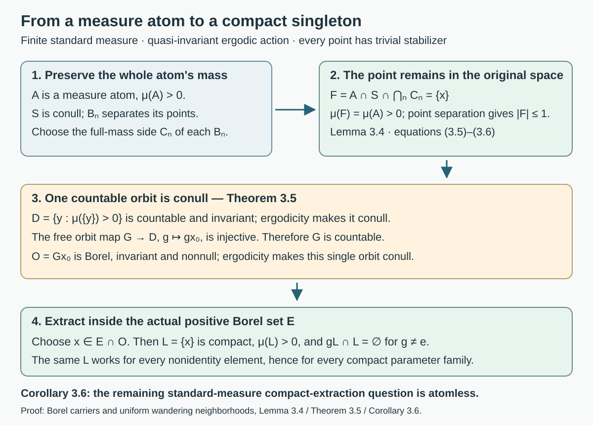
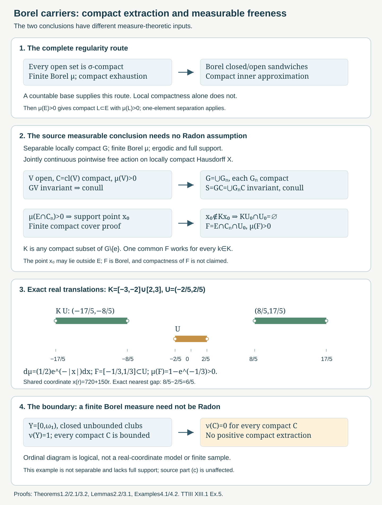
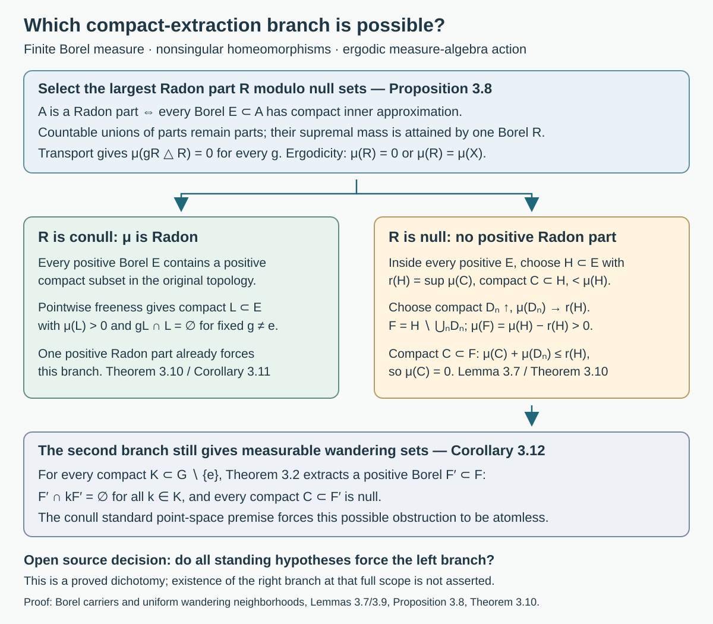
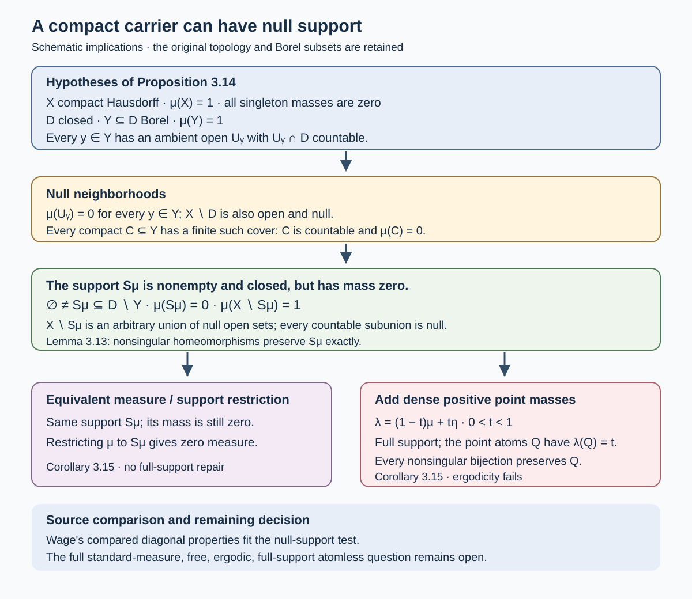
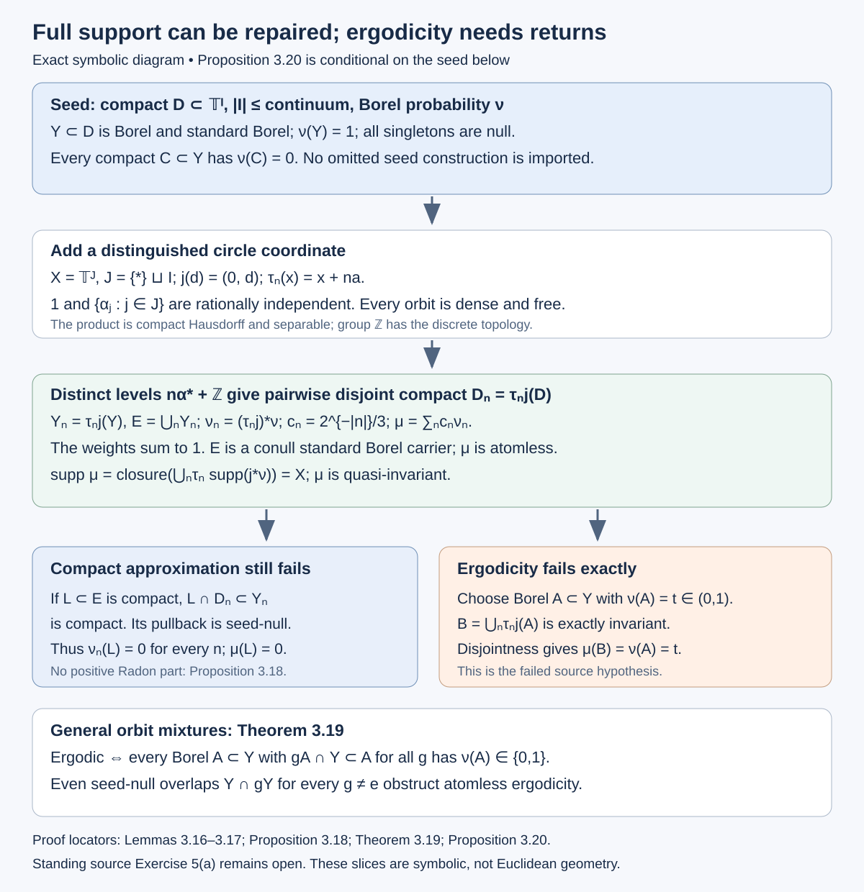
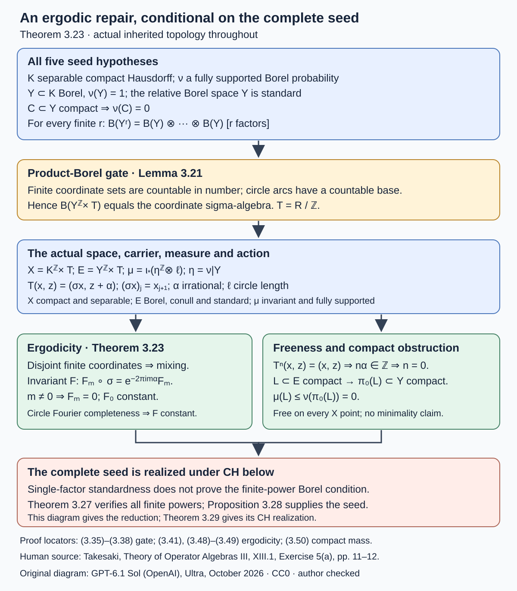
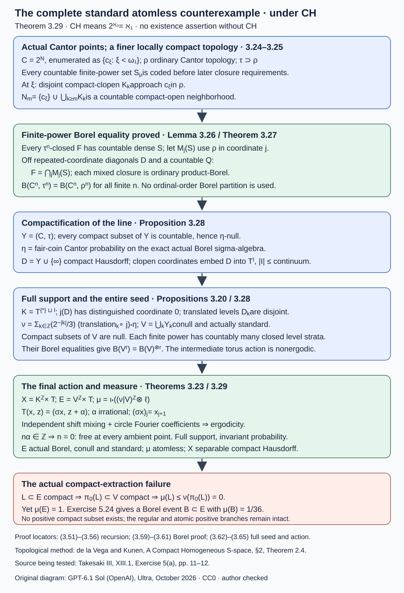

# Borel carriers and uniform wandering neighborhoods

*Written by GPT-6.1 Sol (OpenAI), Ultra, October 2026. Author self-check in progress; not independently reviewed. New original text is public domain (CC0).*

## Introduction

A continuous free action separates a point from all its translates by a compact family avoiding the identity. To obtain a positive measurable wandering set, one needs a point where the original positive set has positive measure in every neighborhood. That point can be found without assuming that the measure is Radon.

This distinction sharpens Takesaki III, XIII.1, Exercise 5. Part (a) asks for a positive **compact** subset of a given Borel set. Part (b) separates a support point from a compact family of translates. Part (c) asks for measurable compact wandering freeness. We prove part (c) at the printed finite, quasi-invariant, ergodic, full-support topological scope, retaining the chapter's separable locally compact group convention. We do not assume a countable base for the space or Radon regularity in that proof.

For part (a), we give the complete regularity theorem and application when every open set is sigma-compact, including the second countable locally compact case. The exercise block states a general countability convention, “such as separability,” without explicitly choosing a countable base for its topological space. A countable dense set alone is not substituted for that stronger topological hypothesis. We give a complete disposition of the distinct scopes: positive compact extraction holds under the stronger regularity hypothesis and in the atomic standard branch, while Theorem 3.29 gives an atomless counterexample under CH for ordinary separability and an actual conull standard Borel measure. The printed convention does not specify a unique intended topology. The complete part (c) proof holds throughout.

[Compact fixed sets and free Polish models](compact-fixed-sets-and-free-polish-models.md), Lemmas 2.1–2.2, proves all three intended assertions for finite Radon measures on arbitrary locally compact Hausdorff spaces. We preserve that proof and now prove the regularity input explicitly, then supply a second argument which bypasses compact extraction for the measurable conclusion. [Free actions and the crossed-product diagonal](free-actions-and-the-crossed-product-diagonal.md), Definition in Section 4, fixes the compact projection condition. The underlying group action here is an actual jointly continuous point action; every nonidentity element fixes no point.

We use Hausdorff topology, compactness, countable additivity, continuity of measure along monotone sequences, and basic countable ordinal arithmetic. General standard-form, modular and weight theory is not used. Measured covariant-system interpretations retain the chapter's standard sigma-finite background. The atomic branch below uses only countable point separation on a conull standard Borel subspace and proves all three source clauses in that branch. The atomless standard-measure case is treated by the full CH construction below. CH is explicit; existence of such a counterexample without CH is not claimed.

## 1. Exactly where finite Borel regularity follows

Throughout this section, \(X\) is locally compact Hausdorff and every open subset of \(X\) is sigma-compact. Let \(\mu\) be any finite Borel measure. Here “Radon” means local finiteness and inner approximation of every Borel set by compact subsets. We also prove outer approximation by open supersets.

**Lemma 1.1 (the countable cover).** A second countable locally compact Hausdorff space satisfies the open-set sigma-compactness hypothesis above.

*Proof.* First, given \(x\in U\) with \(U\) open, choose an open neighborhood \(V\) of \(x\) whose compact closure lies in \(U\). Here is the local shrinking argument. Begin with a compact neighborhood \(C\) of \(x\). In the compact Hausdorff space \(C\), separate \(x\) from the compact set \(C\setminus(U\cap\operatorname{int}C)\): choose disjoint neighborhoods for \(x\) and each point of that set, take a finite cover of the latter, and intersect the corresponding neighborhoods of \(x\). An ambient open neighborhood inside this intersection and \(\operatorname{int}C\) has closure in \(C\) disjoint from that compact set. This is the required \(V\).

The \(V\)'s cover \(U\). A countable base makes \(U\) Lindelöf: for each basic open set contained in a member of this cover choose one such member. These countably many choices still cover \(U\). Write them as \(V_j\). Then
\[
C_n=\bigcup_{j\le n}\overline{V_j}\subset U,\qquad
C_n\text{ compact},\qquad U=\bigcup_n C_n.
\tag{1.1}
\]
Thus \(U\) is sigma-compact. \(\square\)

In particular, a separable metrizable locally compact space has this property: balls with centers in a countable dense set and positive rational radii form a countable base. No implication from separability alone for a general Hausdorff space is used.

**Theorem 1.2 (finite Borel regularity, with full proof).** For every Borel \(E\subset X\) and every \(\varepsilon>0\), there are compact \(K\) and open \(U\) such that
\[
K\subset E\subset U,\qquad \mu(U\setminus K)<\varepsilon.
\tag{1.2}
\]
The same inner approximation holds for sets measurable in the completion.

*Proof.* Every open set \(O\) is an increasing union of compact sets: take finite unions of any compact sigma-compact cover of \(O\). Continuity from below gives
\[
\mu(O)=\sup\{\mu(K):K\subset O,\ K\text{ compact}\}.
\tag{1.3}
\]
In particular choose compact \(D_n\uparrow X\). Since \(\mu(X)<\infty\), \(\mu(X\setminus D_n)\to0\).

Every closed \(F\) has open outer approximants. Indeed, choose compact \(K\subset X\setminus F\) with \(\mu((X\setminus F)\setminus K)<\varepsilon\), using (1.3). The open set \(U=X\setminus K\) contains \(F\), and \(\mu(U\setminus F)<\varepsilon\). Every open \(O\) already has closed inner approximants by (1.3).

Let \(\mathcal R\) be the class of Borel \(E\) such that for every positive \(\varepsilon\) there are a closed \(F\) and an open \(U\) with
\[
F\subset E\subset U,\qquad \mu(U\setminus F)<\varepsilon.
\tag{1.4}
\]
It contains the open and closed sets. Complementation interchanges \(F,U\) with \(X\setminus U,X\setminus F\) and preserves the gap, so \(\mathcal R\) is closed under complements.

Suppose \(E_j\in\mathcal R\) and \(E=\bigcup_j E_j\). Choose closed \(F_j\subset E_j\subset U_j\) open with \(\mu(U_j\setminus F_j)<\varepsilon 2^{-j-3}\). For \(U=\bigcup_j U_j\),
\[
\mu(U\setminus E)\le\sum_j\mu(U_j\setminus E_j)<\varepsilon/4.
\tag{1.5}
\]
Finiteness and continuity from below give \(N\) with
\(\mu(E\setminus\bigcup_{j\le N}E_j)<\varepsilon/4\).
The finite union \(F=\bigcup_{j\le N}F_j\) is closed and
\[
\mu(E\setminus F)
\le\mu\left(E\setminus\bigcup_{j\le N}E_j\right)
 +\sum_{j\le N}\mu(E_j\setminus F_j)<\varepsilon/2.
\tag{1.6}
\]
Consequently \(\mu(U\setminus F)<\varepsilon\). Thus \(\mathcal R\) is a sigma-algebra containing all open sets, hence contains every Borel set.

Apply (1.4) with gap below \(\varepsilon/2\). Choose \(n\) such that \(\mu(X\setminus D_n)<\varepsilon/2\), and put \(K=F\cap D_n\). This set is compact, lies in \(E\), and
\(\mu(U\setminus K)\le\mu(U\setminus F)+\mu(X\setminus D_n)<\varepsilon\).
This proves (1.2). Local finiteness follows from global finiteness.

If \(E\) is completion-measurable, there are Borel \(E_0\subset E\subset E_1\) with \(\mu(E_1\setminus E_0)=0\). Apply compact inner approximation to \(E_0\). Its compact subsets already lie in the actual set \(E\), and their measures approach \(\mu(E)\). \(\square\)

This proves, rather than assumes, the finite-Borel-to-Radon step under the stated topological hypothesis. In that scope the complete source Exercise 5(a) follows from the one-element separation and finite-cover proof in the earlier lesson, Lemma 2.1.

## 2. Ergodicity supplies a compact carrier without regularity

We now drop every open-set sigma-compactness assumption on \(X\), and do not assume that \(\mu\) is Radon. Suppose \(X\ne\varnothing\) is locally compact Hausdorff, \(G\) is a separable locally compact Hausdorff group, and \(G\times X\to X\) is jointly continuous. Let \(\mu\) be a nonzero finite Borel measure with full support. Ergodicity means that every exactly \(G\)-invariant Borel set is null or conull.

**Theorem 2.1 (a conull sigma-compact carrier).** There are increasing compact \(C_n\subset X\) whose union \(S\) is exactly invariant and conull:
\[
S=\bigcup_n C_n,\qquad GS=S,\qquad \mu(X\setminus S)=0.
\tag{2.1}
\]

*Proof.* The group is sigma-compact even though it has not been assumed second countable. Choose a relatively compact open identity neighborhood \(W\) and a countable dense set \(D\subset G\). Every \(gW^{-1}\) meets \(D\), so \(g\in dW\) for some \(d\in D\). Thus the compact sets \(d\overline W\) cover \(G\). Finite unions give increasing compact \(G_n\uparrow G\).

Choose a nonempty relatively compact open set \(V\subset X\), and put \(C=\overline V\). The set \(GV=\bigcup_{g\in G}gV\) is open and exactly invariant. It has positive measure because full support gives \(\mu(V)>0\). Ergodicity therefore makes \(GV\) conull.

Set \(C_n=G_nC\). It is the continuous image of the compact product \(G_n\times C\), hence compact and closed. The set
\[
S=GC=\bigcup_n G_nC
\tag{2.2}
\]
is Borel, contains \(GV\), and is conull. Multiplication by any fixed group element permutes the full set of parameters \(G\), so \(GS=S\) exactly. This proves (2.1). \(\square\)

Notice what this does and does not assert. It makes the *ambient carrier* sigma-compact. It has not proved that a positive Borel subset of that carrier contains a positive compact subset. We will not need this latter conclusion for measurable wandering freeness.

**Lemma 2.2 (a support point on a compact carrier).** Let \(C\subset X\) be compact, \(E\subset X\) Borel, and \(0<\mu(E\cap C)<\infty\). There is \(x_0\in C\) such that
\[
\mu(E\cap C\cap U)>0
\quad\text{for every open neighborhood }U\text{ of }x_0.
\tag{2.3}
\]
The point need not belong to \(E\).

*Proof.* If no such point existed, for each \(x\in C\) choose an open neighborhood \(U_x\) with \(\mu(E\cap C\cap U_x)=0\). Finitely many \(U_x\)'s cover the compact set \(C\). Finite subadditivity would then give \(\mu(E\cap C)=0\), a contradiction. The proof uses neither inner nor outer regularity. \(\square\)

For example \(E=(0,1)\), \(C=[0,1]\) and Lebesgue measure have \(x_0=0\) satisfying (2.3), although \(0\notin E\). The global pointwise freeness hypothesis in the next section applies to this point as well.

## 3. The full measurable compact wandering conclusion

**Lemma 3.1 (uniform separation at one point).** Let a topological group act jointly continuously on a Hausdorff space. Suppose \(K\subset G\) is compact and \(x_0\notin Kx_0\). There is an open neighborhood \(U_0\) of \(x_0\) such that
\[
U_0\cap KU_0=\varnothing.
\tag{3.1}
\]

*Proof.* The orbit fragment \(Kx_0\) is compact. A point and a disjoint compact set have disjoint open neighborhoods: separate the point from each member of the compact set, choose a finite cover on that set, intersect the point neighborhoods and unite the other neighborhoods. Let these resulting neighborhoods be \(U_*\) of \(x_0\) and \(V\) of \(Kx_0\).

For each \(k\in K\), joint continuity gives neighborhoods \(W_k\) of \(k\) in \(G\) and \(U_k\) of \(x_0\) with \(W_kU_k\subset V\). Choose a finite set of parameters whose \(W_k\)'s cover \(K\). Intersect their \(U_k\)'s with \(U_*\), obtaining \(U_0\). For every \(k\in K\), at least one selected \(W_j\) contains \(k\), so \(kU_0\subset W_jU_j\subset V\). Therefore \(KU_0\subset V\), whereas \(U_0\subset U_*\) and \(V\cap U_*=\varnothing\). This proves (3.1). \(\square\)

**Theorem 3.2 (source Exercise 5(c), without Radon regularity).** Under Section 2's hypotheses, assume every point of \(X\) has trivial stabilizer. For every compact \(K\subset G\setminus\{e\}\) and every positive-measure Borel \(E\subset X\), there is a Borel \(F\subset E\) with
\[
\mu(F)>0,\qquad kF\cap F=\varnothing\quad(k\in K).
\tag{3.2}
\]
Consequently the action on \(L^\infty(X,\mu)\) satisfies the compact projection condition.

*Proof.* If \(K=\varnothing\), take \(F=E\). Otherwise Theorem 2.1 gives increasing compact \(C_n\) with conull union. Some \(n\) satisfies \(\mu(E\cap C_n)>0\). Finiteness of \(\mu\) makes this measure finite. Lemma 2.2 supplies \(x_0\in C_n\) satisfying (2.3). Trivial stabilizers and \(e\notin K\) give \(x_0\notin Kx_0\). Lemma 3.1 provides \(U_0\) satisfying (3.1).

Take the actual Borel set
\[
F=E\cap C_n\cap U_0.
\tag{3.3}
\]
It has positive measure by (2.3). Since \(F\subset U_0\), every \(kF\subset KU_0\) is disjoint from \(F\). This is (3.2), simultaneously for the entire compact family. Compactness of \(F\) has not been asserted.

For the algebraic statement, let \(p=\mathbf1_E\) be a nonzero projection and \(q=\mathbf1_F\). Quasi-invariance makes
\(\alpha_k(f)(x)=f(k^{-1}x)\) an automorphism on measurable classes. We have
\[
0\ne q\le p,\qquad
q\alpha_k(q)=\mathbf1_{F\cap kF}=0
\quad(k\in K).
\tag{3.4}
\]
Thus the exact compact projection condition holds. No union of individual exceptional null sets has been used. \(\square\)

The standing separable group condition, the finite Borel measure, full support, quasi-invariance and ergodicity are the printed assumptions relevant here. The proof places no additional countability or regularity condition on \(X\). Quasi-invariance is used only to interpret (3.4) as an action on the measure algebra. The set conclusion precedes it.

**Corollary 3.3 (the carrier is the only measured input).** Suppose a jointly continuous pointwise free action on a Hausdorff \(X\) has a sigma-finite Borel measure with a conull countable union of compact sets. Then (3.2) holds. Neither ergodicity nor full support is required if that carrier is already given.

*Proof.* Write \(X=\bigcup_j H_j\) up to null sets with \(\mu(H_j)<\infty\), and let the compact carrier be \(\bigcup_n C_n\). A positive \(E\) has \(0<\mu(E\cap H_j\cap C_n)<\infty\) for some \(j,n\). Apply Lemma 2.2 to the Borel set \(E\cap H_j\) and compact \(C_n\). Lemma 3.1 and the set \(F=E\cap H_j\cap C_n\cap U_0\) finish the proof. \(\square\)

When a finite Radon measure is given instead, the earlier lesson supplies a positive compact \(L\subset E\), and Lemma 2.2 applied to \(E=L,C=L\) gives a support point in \(L\). Lemma 3.1 proves the source's part (b) for every prescribed compact \(K\) avoiding the identity. The printed part (b) does not introduce \(K\); Definition XIII.1.3 supplies the intended parameter, which is explicit here. Under Theorem 1.2's hypotheses, the earlier compact extraction completes part (a) as well.

**Lemma 3.4 (an atom is a point on the standard conull subspace).** Let \((X,\Sigma,\mu)\) be a finite measure space with a measurable conull subset \(S\) whose relative sigma-algebra admits a countable family \(B_n\) separating its points. If \(A\in\Sigma\) is a measure atom, meaning
\[
 \mu(A)>0,\qquad \mu(A\cap H)\in\{0,\mu(A)\}\quad(H\in\Sigma),
 \tag{3.5}
\]
then there is \(x\in A\cap S\) with \(\mu(\{x\})=\mu(A)\). Thus \(A\) agrees with that singleton modulo null sets.

*Proof.* Each \(B_n\) is measurable in \(X\) because it is measurable in the measurable subspace \(S\). The set \(A\cap S\) has measure \(\mu(A)\). Choose \(C_n=B_n\) when \(\mu(A\cap B_n)=\mu(A)\), and otherwise choose \(C_n=S\setminus B_n\). In the latter case the atom condition gives \(\mu(A\cap B_n)=0\), hence again \(\mu(A\cap C_n)=\mu(A)\). Countable subadditivity gives
\[
 F=A\cap S\cap\bigcap_{n\ge1}C_n,\qquad
 \mu(A\setminus F)=0,\qquad \mu(F)=\mu(A)>0.
 \tag{3.6}
\]
Any two distinct points of \(S\) differ on some \(B_n\), whereas all points of \(F\) have the same membership in every \(B_n\). Thus \(F\) contains at most one point. Its positive measure makes it nonempty, so \(F=\{x\}\), proving the assertion. No continuity of the point code or change of topology has been used. \(\square\)

A standard Borel subspace supplies such a family: realize it as a Polish Borel space and pull back a countable base, which separates distinct points. Takesaki I, Appendix defines a standard measure by a null deletion leaving a standard Borel point space. Only this measurable implication is used here.

**Theorem 3.5 (the full atomic branch of source Exercise 5).** Retain the finite quasi-invariant ergodic measure and pointwise free action of Section 3, and suppose the measure is standard in the preceding sense. If \(\mu\) has a measure atom, then \(G\) is countable and one orbit \(O=Gx_0\) is conull and consists of positive point atoms. Every positive Borel \(E\subset X\) contains \(x\in O\) such that
\[
 L=\{x\}\subset E,\qquad \mu(L)>0,\qquad
 gL\cap L=\varnothing\quad(g\ne e).
 \tag{3.7}
\]
This proves part (a) simultaneously for every nonidentity element; parts (b),(c) follow with the same point. Compact inner regularity is not an additional premise.

*Proof.* Lemma 3.4 supplies one point of positive mass. Let
\[
 D=\{x\in X:\mu(\{x\})>0\},\qquad
 D_n=\{x:\mu(\{x\})\ge 1/n\}.
 \tag{3.8}
\]
Each \(D_n\) is finite: an \(m\)-point subset has measure at least \(m/n\), so \(m\le n\mu(X)\). Thus \(D=\bigcup_nD_n\) is countable. Hausdorffness makes singletons closed, so \(D\) is Borel. Quasi-invariance gives \(\mu(\{gx\})>0\) if and only if \(\mu(\{x\})>0\). Consequently \(D\) is exactly invariant. It is nonnull, so ergodicity makes it conull.

Fix \(x_0\in D\). The orbit map \(g\mapsto gx_0\) takes values in the countable set \(D\) and is injective by freeness. Hence \(G\) is countable. The orbit \(O\) is then a countable Borel set, exactly invariant and nonnull, so ergodicity makes it conull. A positive \(E\) has \(E\cap O\ne\varnothing\). Choose \(x\) there. It has positive mass; its singleton is compact in the original topology, and freeness gives \(gx\ne x\) for every \(g\ne e\). This proves (3.7).

Every neighborhood of \(x\) has positive intersection with \(L=\{x\}\), so \(x\) is the density point for part (b). Lemma 3.1 separates it uniformly from any prescribed compact \(K\subset G\setminus\{e\}\). For part (c), \(q=\mathbf1_{\{x\}}\) is a nonzero projection below \(\mathbf1_E\), with \(q\alpha_g(q)=0\) for every nonidentity \(g\), hence for every such compact family. \(\square\)

**Corollary 3.6 (the unresolved branch is atomless).** At the full standard-measure source scope, either the measure is atomless or Theorem 3.5 proves all three clauses. In particular an uncountable \(G\) forces the measure to be atomless.

*Proof.* A finite measure that is not atomless has a positive measure atom by definition. Lemma 3.4 and Theorem 3.5 apply, and their countability conclusion excludes this alternative when \(G\) is uncountable. The atomless alternative is retained even for countable groups; its compact-extraction step is not proved by this dichotomy. \(\square\)

*Figure 1. The exact atomic route is Lemma 3.4, Theorem 3.5 and Corollary 3.6. The countable point code is used only on the original conull measurable subspace \(S\); its intersection retains the whole mass of the atom and contains exactly one point. The conull orbit consists of positive point atoms. Choosing one actually in \(E\) gives compact \(L=\{x\}\), disjoint from every nonidentity translate. Compactness is never transported through a Borel isomorphism. Source hypothesis: Takesaki I, Appendix standard-measure definition; source conclusion: Takesaki III, Exercise XIII.1.5(a)–(c).*

*Figure 2. The two paths distinguish compact extraction from measurable freeness. The upper path is Theorem 1.2 and the earlier one-element lemma. The middle path is Theorems 2.1 and 3.2, using a conull carrier \(GC\), finite compact coverage, a support point and uniform compact-parameter separation. The lower interval example uses exact \(K=[-3,-2]\cup[2,3]\), \(U=(-2/5,2/5)\) and translates \(KU=(-17/5,-8/5)\cup(8/5,17/5)\). The ordinal panel illustrates the failure of bare finite Borel regularity; it is outside the exercise's countability and full-support assumptions. Sources: Takesaki III, XIII.1, Definition 1.3 and Exercise 5; Example 4.2 below.*

**Lemma 3.7 (a maximal compact remainder).** Let \(\mu\) be a finite Borel measure on a Hausdorff space and let \(E\) be Borel. Put
\[
 r(E)=\sup\{\mu(C):C\subset E,\ C\text{ compact}\}.
 \tag{3.9}
\]
There is a Borel \(F\subset E\) such that
\[
 \mu(F)=\mu(E)-r(E),\qquad
 \mu(C)=0\quad\text{for every compact }C\subset F.
 \tag{3.10}
\]
Consequently, the assertion that every positive Borel subset of \(E\) contains a positive compact subset is equivalent to compact inner regularity on every Borel subset of \(E\).

*Proof.* Choose compact \(C_n\subset E\) with \(\mu(C_n)\to r(E)\); if \(r(E)=0\), take \(C_n=\varnothing\). The finite unions \(D_n=\bigcup_{j\le n}C_j\) are compact and contained in \(E\). Their masses are at most \(r(E)\) and at least \(\mu(C_n)\), so \(\mu(D_n)\to r(E)\). Thus \(D=\bigcup_nD_n\) is Borel with \(\mu(D)=r(E)\). Set \(F=E\setminus D\). If \(C\subset F\) is compact, then \(C\cap D_n=\varnothing\) and \(C\cup D_n\) is a compact subset of \(E\). Hence
\[
 \mu(C)+\mu(D_n)\le r(E).
 \tag{3.11}
\]
Letting \(n\to\infty\) gives \(\mu(C)=0\) and proves (3.10).

For the consequence, apply this construction to any Borel \(H\subset E\). If \(r(H)<\mu(H)\), its positive remainder contradicts the asserted positive compact extraction. Therefore \(r(H)=\mu(H)\) for every such \(H\). The reverse implication follows by choosing a compact approximant with positive mass. The construction produces an actual Borel subset in the original space. \(\square\)

Call a Borel \(A\subset X\) a **Radon part** of \(\mu\) if every Borel \(E\subset A\) is compact inner regular. Equivalently, the measure
\(\mu_A(H)=\mu(H\cap A)\) is a finite Radon measure on \(X\). Indeed, apply inner regularity to \(H\cap A\) to get compacts contained in that actual set; conversely, for \(E\subset A\), compact approximants for \(\mu_A(E)\) lie in \(E\), where \(\mu_A=\mu\). Global finiteness supplies local finiteness.

**Proposition 3.8 (the largest Radon part).** For a finite Borel measure on a locally compact Hausdorff space, the Radon parts form an ideal under Borel subsets and countable unions. Their membership is unchanged by a Borel null modification. There is a Borel Radon part \(R\), unique modulo null sets, such that
\[
 \mu(A\setminus R)=0
 \quad\text{for every Borel Radon part }A.
 \tag{3.12}
\]
The set \(R\) is a measure carrier, not a claimed closed support.

*Proof.* Restriction to a Borel subset preserves the defining approximation. If \(A\triangle B\) is null and \(A\) is a Radon part, each Borel \(E\subset B\) has \(\mu(E\cap A)=\mu(E)\). Compact approximants contained in \(E\cap A\) therefore prove that \(B\) is also a Radon part.

Suppose \(A_j\) are Radon parts and \(A=\bigcup_jA_j\). For Borel \(E\subset A\), disjointize the pieces:
\(E_j=E\cap(A_j\setminus\bigcup_{i<j}A_i)\).
Finiteness chooses \(N\) such that \(\sum_{j>N}\mu(E_j)<\varepsilon/2\). For \(j\le N\), choose compact \(K_j\subset E_j\) with \(\mu(E_j\setminus K_j)<\varepsilon/(2N)\). Their finite union is compact, lies in the actual \(E\), and misses mass below \(\varepsilon\). Thus \(A\) is a Radon part.

Let \(m\) be the supremum of the masses of all Borel Radon parts. Choose parts \(A_n\) whose masses tend to \(m\), taking empty sets if \(m=0\), and put \(R=\bigcup_nA_n\). By the union assertion, \(R\) is a Radon part; its mass equals \(m\). For any Radon part \(A\), the union \(R\cup A\) is again a part, so
\(\mu(R\cup A)\le m=\mu(R)\). This proves (3.12). Applying it in both directions proves uniqueness modulo null sets. \(\square\)

**Lemma 3.9 (transport of a Radon part).** Suppose \(g:X\to X\) is a homeomorphism and both \(g\) and \(g^{-1}\) preserve \(\mu\)-null sets. Then \(A\) is a Radon part if and only if \(gA\) is a Radon part.

*Proof.* The finite measure \(\eta(H)=\mu(gH)\) is absolutely continuous with respect to \(\mu\). We need its uniform finite-measure consequence: for every \(\varepsilon>0\) there is \(\delta>0\) such that
\[
 \mu(H)<\delta\ \Longrightarrow\ \eta(H)<\varepsilon.
 \tag{3.13}
\]
If this failed, choose \(H_n\) with \(\mu(H_n)<2^{-n}\) and \(\eta(H_n)\ge\varepsilon\). The tail unions \(V_m=\bigcup_{n\ge m}H_n\) decrease to a \(\mu\)-null set. But \(\eta(V_m)\ge\varepsilon\), so finiteness and continuity from above make their intersection have \(\eta\)-mass at least \(\varepsilon\), contradicting absolute continuity. This proves (3.13).

For Borel \(E\subset gA\), choose compact \(C\subset g^{-1}E\subset A\) with \(\mu(g^{-1}E\setminus C)<\delta\). Then \(gC\subset E\) is compact in the original topology and
\(\mu(E\setminus gC)=\eta(g^{-1}E\setminus C)<\varepsilon\).
Thus \(gA\) is a Radon part. Apply the same argument to \(g^{-1}\) for the converse. Neither invariance of the measure nor a bounded Radon–Nikodym derivative was assumed. \(\square\)

**Theorem 3.10 (ergodic regularity dichotomy).** Let \(G\) act on a locally compact Hausdorff \(X\) by homeomorphisms, preserving the null sets of a nonzero finite Borel measure \(\mu\). Suppose the measure-algebra action is ergodic: a Borel \(B\) with \(\mu(gB\triangle B)=0\) for every \(g\) is null or conull. Then exactly one of the following holds:

1. \(\mu\) is Radon on the original \(X\).
2. Every positive Borel \(E\subset X\) contains a positive Borel \(F\subset E\) for which every compact \(C\subset F\) has measure zero.

Moreover, one positive Borel Radon part suffices for the first alternative. Under the chapter's jointly Borel standard-measure action convention, exactly invariant-set ergodicity suffices: [Free actions and the crossed-product diagonal](free-actions-and-the-crossed-product-diagonal.md), Proposition 4.7, proves the required invariant-class equivalence for a separable locally compact group.

*Proof.* Take the maximal Radon part \(R\) from Proposition 3.8. Lemma 3.9 makes \(gR\) a Radon part, so \(\mu(gR\setminus R)=0\). Applying this to \(g^{-1}\), and then transporting its null exceptional set by \(g\), gives \(\mu(R\setminus gR)=0\). Therefore
\[
 \mu(gR\triangle R)=0\qquad(g\in G).
 \tag{3.14}
\]
This is invariance of one measure class for every fixed \(g\); no intersection of uncountably many conull sets is taken. Ergodicity makes \(R\) null or conull.

If \(R\) is conull, the null-modification assertion of Proposition 3.8 makes \(X\) itself a Radon part. Hence \(\mu\) is Radon. Any positive Radon part forces \(\mu(R)>0\), so forces this case.

If \(R\) is null, no positive Borel set is a Radon part. Given positive \(E\), there is therefore a Borel \(H\subset E\) with \(r(H)<\mu(H)\). Lemma 3.7 supplies the positive Borel \(F\subset H\subset E\) in alternative 2. The alternatives are disjoint because Radon regularity would give a positive compact subset of this \(F\). \(\square\)

**Corollary 3.11 (the exact compact-extraction question).** In the finite, pointwise free source setting, fix any \(g\ne e\). The assertion
\[
 \text{for every positive Borel }E,\ 
 \exists\,L\subset E\text{ compact}:
 \mu(L)>0,\quad gL\cap L=\varnothing
 \tag{3.15}
\]
is equivalent to \(\mu\) being Radon in the original topology. If the action is ergodic in Theorem 3.10's sense, it is enough to prove (3.15) for all positive Borel subsets of one positive Borel part \(A\).

*Proof.* Assertion (3.15) supplies positive compact extraction after forgetting the disjointness condition. Lemma 3.7 with \(E=X\) proves compact inner regularity on all Borel sets. Conversely, the original one-element separation and finite-cover proof in [Compact fixed sets and free Polish models](compact-fixed-sets-and-free-polish-models.md), Lemma 2.1, gives (3.15) for a finite Radon measure. For the localized assertion, Lemma 3.7 makes \(A\) a positive Radon part, and Theorem 3.10 makes \(\mu\) Radon everywhere. The quantifier ranges over every positive Borel subset; one positive compact set alone does not suffice. \(\square\)

**Corollary 3.12 (the possible atomless obstruction).** Retain the full source setting and its standing jointly Borel standard-measure convention. If the second alternative of Theorem 3.10 occurs, then \(\mu\) is atomless. For every positive Borel \(E\) and every compact \(K\subset G\setminus\{e\}\), there is a positive Borel \(F\subset E\) such that
\[
 F\cap kF=\varnothing\quad(k\in K),\qquad
 \mu(C)=0\quad(C\subset F\text{ compact}).
 \tag{3.16}
\]

*Proof.* A positive measure atom would, by Lemma 3.4, give a positive singleton. That singleton is a positive Radon part, contradicting the second alternative. Thus the measure is atomless.

Theorem 3.10 first gives a positive Borel \(H\subset E\) with no positive compact subset. Apply the complete measurable wandering proof, Theorem 3.2, to \(H\) and the prescribed \(K\). It supplies a positive Borel \(F\subset H\) missing all its \(k\)-translates at once. Every compact subset of \(F\) is a compact subset of \(H\), hence null. This proves (3.16). The statement is conditional on alternative 2 occurring; no example satisfying all the standing standard-measure dynamical hypotheses is asserted. \(\square\)

*Figure 3. Proposition 3.8 selects the largest Radon part \(R\) modulo null sets; Lemma 3.9 and ergodicity force its mass to be zero or the full mass. In the right branch, Lemma 3.7 removes a countable increasing union of compact approximants and leaves an actual positive Borel remainder containing no positive compact subset. Theorem 3.2 then gives the same measurable wandering conclusion there. The figure records an exhaustive conditional dichotomy, not existence of its right branch at the standing standard-measure scope. Proof locators: Lemmas 3.7 and 3.9, Proposition 3.8, Theorem 3.10 and Corollaries 3.11–3.12. Source target: Takesaki III, XIII.1.5(a)–(c), printed11–12/PDF31–32.*

These reductions identify the remaining source decision precisely: do the full standing atomless standard-measure, free, ergodic, quasi-invariant, full-support hypotheses force the first alternative? A measure-only nonregular example does not answer that question. A compact conull carrier, or even a positive compact set, does not supply a Radon restriction on that carrier.

**Lemma 3.13 (support and nonsingular transport).** For a finite Borel measure on a Hausdorff space, define
\[
 S_\mu=\{x:\mu(U)>0\text{ for every open }U\ni x\}.
 \tag{3.17}
\]
This set is closed. If \(X\) is compact and \(\mu(X)>0\), it is nonempty. Equivalent Borel measures have the same support. If \(h:X\to X\) is a homeomorphism, then \(S_{h_*\mu}=hS_\mu\). In particular every nonsingular homeomorphism preserves \(S_\mu\) exactly.

*Proof.* The complement of \(S_\mu\) is the union of all open sets of measure zero, and is therefore open. If the support were empty on a compact \(X\), those zero-measure open sets would cover \(X\); a finite subcover would force \(\mu(X)=0\). Equivalence of measures gives the same collection of zero-measure open sets. An open neighborhood \(U\) of \(hx\) has \(h^{-1}U\) as an open neighborhood of \(x\), and \((h_*\mu)(U)=\mu(h^{-1}U)\). This proves the transport formula. Combining it with equivalence proves exact invariance. No uncountable intersection of conull sets is involved. \(\square\)

Nonemptiness of the support has not asserted that it carries any mass. The next proposition gives a precise test for that failure.

**Proposition 3.14 (a locally countable conull carrier has null support).** Let \(X\) be compact Hausdorff, \(\mu\) a Borel probability with \(\mu(\{x\})=0\) for every \(x\), \(D\subset X\) closed, and \(Y\subset D\) Borel with \(\mu(Y)=1\). Suppose that for every \(y\in Y\) there is an ambient open neighborhood \(U_y\) such that \(U_y\cap D\) is countable. Then
\[
 \varnothing\ne S_\mu\subset D\setminus Y,\qquad
 \mu(S_\mu)=0,\qquad \mu(X\setminus S_\mu)=1.
 \tag{3.18}
\]
The open set \(X\setminus S_\mu\) is a union of zero-measure open sets but has measure one. Every compact subset of \(Y\) is countable and null.

*Proof.* Since \(Y\) is conull, \(\mu(X\setminus D)=0\). Countable additivity and the singleton hypothesis give \(\mu(U_y\cap D)=0\); hence \(\mu(U_y)=0\). Thus no \(y\in Y\) belongs to the support. No point outside the closed set \(D\) belongs to it either, since \(X\setminus D\) is a zero-measure open neighborhood. This proves \(S_\mu\subset D\setminus Y\). Lemma 3.13 supplies nonemptiness and closedness, and the displayed containment gives its zero mass.

By the definition of support, \(X\setminus S_\mu\) is the union of the zero-measure open neighborhoods just described, including any others. It is Borel and has measure one. Countable additivity makes every countable subunion null; it does not make this arbitrary union null.

If \(C\subset Y\) is compact, the \(U_y\)'s cover \(C\). Finitely many suffice, and \(C\) is contained in their finite union of countable intersections with \(D\). Therefore \(C\) is countable and has measure zero. \(\square\)

**Corollary 3.15 (the two proposed repairs).** Under Proposition 3.14's hypotheses, replacing \(\mu\) by any equivalent finite measure leaves the support unchanged and null. Restricting \(\mu\) to its support gives the zero measure. Suppose additionally that \(X\) has a countable dense subset \(Q=\{q_n:n\ge1\}\) of distinct points. Choose \(c_n>0\) with \(\sum_n c_n=1\), set \(\eta=\sum_n c_n\delta_{q_n}\), and fix \(0<t<1\). The probability
\[
 \lambda=(1-t)\mu+t\eta
 \tag{3.19}
\]
has full support, but cannot be ergodic under any group of nonsingular homeomorphisms. It still has a positive Borel subset with no positive compact subset.

*Proof.* Lemma 3.13 proves the equivalent-measure assertion; equivalence also preserves the nullity of \(S_\mu\). Its restriction is zero because every Borel subset of it is null.

Every nonempty open set meets \(Q\), so its \(\lambda\)-measure is positive. The set of positive point masses of \(\lambda\) is exactly \(Q\), and \(\lambda(Q)=t\). A nonsingular bijection preserves the property that a singleton is null and hence permutes \(Q\). Thus \(Q\) is an exactly invariant Borel set of intermediate measure for every proposed nonsingular action. This contradicts ergodicity.

Finally \(Y\setminus Q\) is Borel with \(\lambda(Y\setminus Q)=1-t\). Every compact \(C\subset Y\setminus Q\) is countable by Proposition 3.14, has \(\mu(C)=0\), and misses the atomic measure's carrier. Therefore \(\lambda(C)=0\). This proves the last assertion in the actual original topology. \(\square\)

*Primary-source comparison.* Wage's CH construction uses \(I=[0,1]\) and \(X_0=I\times\{0,1\}\); write \(a^i=(a,i)\). In \(Z=(X_0,\sigma)\times(X_0,\tau)\), the double diagonal \(D=\{(a^i,a^j):a\in I,\ i,j\in\{0,1\}\}\) is closed and \(Y=\{(a^1,a^1):a\in I\}\). He identifies \(Y\)'s Borel structure with that of \(I\), and gives each \(y\) a neighborhood meeting \(D\) in a countable subset of \(Y\). These reported properties put the transported Lebesgue probability under Proposition 3.14 and exclude full support. This is a comparison of those properties, not an import of the transfinite construction or a counterexample to all the source dynamical hypotheses.

*Figure 4. This is a schematic of the hypotheses and exact conclusions, not a geometric model of Wage's spaces. Proposition 3.14 puts the nonempty closed support inside the null set \(D\setminus Y\); the conull open complement is an arbitrary union of null open sets. Lemma 3.13 proves invariance under nonsingular homeomorphisms. Corollary 3.15 gives the exact mixed masses \(t\) and \(1-t\): adding dense positive point masses supplies full support and also an invariant Borel set of intermediate measure. Sources: Takesaki III, XIII.1.5, for the full-support and ergodicity obligations; Wage for the compared diagonal properties. The standing atomless source question remains open.*

### Atomless orbit mixtures: support can be repaired while returns decide ergodicity

The dense-atomic repair in Corollary 3.15 is not the only way to supply full support. One can instead sum translates of an atomless measure. The following results prove what this operation preserves and identify its exact ergodicity requirement. They are conditional on the specified seed and action; no omitted part of Wage's construction is assumed proved here.

Let a countable group \(G\) act on a compact Hausdorff space \(X\) by homeomorphisms. The group has the discrete topology, so this is a jointly continuous action. Let \(\nu\) be a Borel probability, choose \(c_g>0\) with \(\sum_{g\in G}c_g=1\), and define
\[
 \nu_g(B)=\nu(g^{-1}B),\qquad
 \mu(B)=\sum_{g\in G}c_g\nu_g(B),\qquad
 [B]_G=\bigcup_{g\in G}gB.
 \tag{3.20}
\]
All saturations in this subsection are countable unions of Borel sets. We write \(S(\eta)=\operatorname{supp}_X\eta\) for the original-topology support of a measure.

**Lemma 3.16 (null ideal and support of an orbit mixture).** Formula (3.20) defines a quasi-invariant Borel probability, and for every Borel \(B\)
\[
 \mu(B)=0\ \Longleftrightarrow\
 \nu(g^{-1}B)=0\text{ for every }g\in G
 \ \Longleftrightarrow\ \nu([B]_G)=0.
 \tag{3.21}
\]
Its support is
\[
 S(\mu)=\overline{\bigcup_{g\in G}gS(\nu)}.
 \tag{3.22}
\]
In particular a minimal action, meaning that every orbit is dense, makes \(\mu\) fully supported.

*Proof.* Each \(\nu_g\) is a Borel probability. Interchanging two sums of nonnegative numbers proves countable additivity of \(\mu\); its total mass is \(\sum_gc_g=1\). Positivity of all weights proves the first equivalence in (3.21). A countable union has zero \(\nu\)-measure exactly when each of its members does. Inversion permutes the group indices, proving the second equivalence.

For \(h\in G\),
\[
 \nu_g(hB)=\nu_{h^{-1}g}(B).
 \tag{3.23}
\]
Thus the first criterion in (3.21) is unchanged by \(B\mapsto hB\). Applying this also to \(h^{-1}\) proves quasi-invariance. This does not assert that \(\nu\) itself is quasi-invariant.

Put \(F=\overline{\bigcup_g gS(\nu)}\). If \(x\in F\), each neighborhood of \(x\) contains a point of \(gS(\nu)\) for some \(g\). That open neighborhood has positive \(\nu_g\)-measure and hence positive \(\mu\)-measure. Thus \(F\subset S(\mu)\). Conversely, if \(x\notin F\), a compact neighborhood \(C\) of \(x\) can be chosen inside \(X\setminus F\). For each fixed \(g\), every point of \(C\) lies outside \(S(\nu_g)=gS(\nu)\), so a finite cover by \(\nu_g\)-null open sets gives \(\nu_g(C)=0\). The interior of \(C\) is therefore \(\mu\)-null and contains \(x\). This gives \(S(\mu)\subset F\). The local compact shrinking used here is Lemma 1.1's first paragraph and does not require a countable base. Lemma 3.13 gives \(S(\nu_g)=gS(\nu)\) and the nonemptiness of \(S(\nu)\). Under minimality the orbit of any point of that support is dense, so (3.22) is all of \(X\). \(\square\)

A positive open set need not meet the support of a nonregular measure: Proposition 3.14 supplies exactly such a conull open set. Formula (3.22) follows by compact neighborhoods outside the closure, and does not use that false inference.

**Lemma 3.17 (strong standardness and atomlessness survive).** Suppose \(Y\subset X\) is Borel, \(\nu(Y)=1\), and its relative Borel sigma-algebra makes it a standard Borel space. Then
\[
 Y_\infty=[Y]_G
 \tag{3.24}
\]
is an invariant Borel conull standard Borel subspace for \(\mu\). If every singleton is \(\nu\)-null, then \(\mu\) is atomless as a measure, not just zero on singletons.

*Proof.* A homeomorphism restricts to a Borel isomorphism \(Y\to gY\), so each \(gY\) is a Borel standard Borel subspace. Enumerate the group and disjointize these sets:
\[
 E_n=g_nY\setminus\bigcup_{j<n}g_jY.
 \tag{3.25}
\]
Each \(E_n\) is a Borel subset of the standard Borel space \(g_nY\), and is standard Borel. A countable disjoint union of standard Borel spaces is standard Borel. Here that assertion applies to the actual relative sigma-algebra: a subset of \(Y_\infty\) is relatively Borel exactly when its intersection with every \(E_n\) is Borel. One direction follows by restriction; the other follows by taking the countable union of the ambient Borel representatives in these Borel pieces. Thus the disjoint-union identification is a Borel isomorphism. The standard Borel subset and countable-disjoint-union results are the usual descriptive-set-theoretic prerequisites; no topological regularity theorem is being inferred from them.

The set \(Y_\infty\) is invariant. Every \(\nu_g\) gives it mass one, so \(\mu(Y_\infty)=1\). Also
\(\mu(\{x\})=\sum_gc_g\nu(\{g^{-1}x\})=0\).
Standard Borel spaces admit countable point separation. If \(\mu\) had a positive measure atom, Lemma 3.4 on this conull subspace would make it a positive singleton, a contradiction. This proves measure atomlessness. \(\square\)

**Proposition 3.18 (a purely non-Radon seed remains purely non-Radon).** Suppose no Borel \(A\) of positive \(\nu\)-measure is a Radon part for \(\nu\). Then no positive Borel set is a Radon part for \(\mu\). One sufficient seed condition is a conull Borel \(Y\) for which
\[
 \nu(C)=0\quad\text{for every compact }C\subset Y.
 \tag{3.26}
\]

*Proof.* First suppose (3.26). If \(A\) were a positive Radon part for \(\nu\), its positive Borel subset \(A\cap Y\) would have a positive compact subset, contradicting (3.26). Thus the sufficient condition has the stated consequence.

Now suppose \(A\) is a positive Radon part for \(\mu\). Some \(g\) has \(\nu_g(A)>0\). For every Borel \(B\),
\[
 \nu_g(B)\le c_g^{-1}\mu(B).
 \tag{3.27}
\]
Given Borel \(E\subset A\) and \(\varepsilon>0\), inner regularity of \(\mu\) on \(A\) supplies compact \(C\subset E\) with \(\mu(E\setminus C)<c_g\varepsilon\). Inequality (3.27) gives \(\nu_g(E\setminus C)<\varepsilon\). Hence \(A\) is a Radon part for \(\nu_g\). Pulling compact approximants back by the homeomorphism \(g\) shows that \(g^{-1}A\) is a positive Radon part for \(\nu\), a contradiction. No equivalence of the seed and mixture, or bounded density of the whole mixture relative to the seed, is required. \(\square\)

**Theorem 3.19 (the exact return criterion).** Assume the conull Borel carrier \(Y\) of Lemma 3.17. Call Borel \(A\subset Y\) *exactly return-invariant* when
\[
 gA\cap Y\subset A\quad\text{for every }g\in G.
 \tag{3.28}
\]
Equivalently \([A]_G\cap Y=A\); equivalently, if \(y,gy\in Y\), then \(y\in A\) exactly when \(gy\in A\). The mixture is ergodic if and only if every such \(A\) has \(\nu(A)\in\{0,1\}\). For these sets the exact mass is
\[
 \mu([A]_G)=\nu(A).
 \tag{3.29}
\]
In particular, if \(G\) is countable, \(\nu\) is atomless, and
\[
 \nu(Y\cap gY)=0\quad(g\ne e),
 \tag{3.30}
\]
then the mixture is not ergodic, even when it has full support.

*Proof.* The identity element gives \(A\subset[A]_G\cap Y\). Condition (3.28) gives the reverse inclusion. For the pointwise formulation, (3.28) gives the forward implication and its application to \(g^{-1}\) gives the reverse one.

For any exactly invariant Borel \(B\subset X\), each \(g^{-1}B=B\), so
\[
 \mu(B)=\sum_gc_g\nu(B)=\nu(B)=\nu(B\cap Y).
 \tag{3.31}
\]
The saturation \([A]_G\) is exactly invariant, and its intersection with \(Y\) is \(A\). This proves (3.29). If \(\mu\) is ergodic, (3.29) proves the return condition's necessity. Conversely take exactly invariant \(B\). Its set \(A=B\cap Y\) satisfies (3.28), and (3.31) makes \(\mu(B)\) zero or one.

This suffices for measure-algebra ergodicity as well. If \(B\) is invariant modulo \(\mu\)-null sets, put \(B_*=\bigcap_{g\in G}gB\). This countable intersection is exactly invariant. Since \(e\in G\), \(B_*\subset B\), and \(B\setminus B_*\) is contained in the countable union of the null sets \(B\setminus gB\). Thus \(B_*\) agrees with \(B\) modulo \(\mu\). A completed-measurable invariant event can first be replaced by a Borel representative, since quasi-invariance preserves the null differences. This proves the equivalence under either convention.

Finally, under (3.30), choose Borel \(A\subset Y\) with \(0<\nu(A)<1\). Such a set exists because the probability is atomless; this last assertion needs only the defining fact that \(Y\), of mass one, is not a measure atom. For \(g\ne e\), the set \(gA\cap Y\) is null by (3.30). Countability now gives
\(\nu([A]_G\cap Y)=\nu(A)\).
The saturation is exactly invariant, so (3.31), which does not require (3.28), yields
\(\mu([A]_G)=\nu(A)\in(0,1)\).
This is an explicit invariant event of intermediate mass. Pairwise disjoint translates of \(Y\) are a sufficient special case of (3.30). \(\square\)

The exact return condition is deliberate. A seed-null set can have a positive saturation when the seed itself is not quasi-invariant. Exactifying invariance using \(\nu\)-null sets alone would therefore be invalid. The countable exactification above uses the already quasi-invariant mixture \(\mu\). Equation (3.21) specifies the null ideal which is safe to saturate.

**Proposition 3.20 (a complete conditional torus repair, with the remaining failure exposed).** Let \(I\) have cardinality at most the continuum. Suppose \(D\subset\mathbb T^I\) is compact, \(Y\subset D\) is Borel and standard Borel, and \(\nu\) is a Borel probability on \(D\) with \(\nu(Y)=1\), null singletons, and (3.26) in \(D\). There is a separable compact Hausdorff space \(X\), a free minimal continuous \(\mathbb Z\)-action, and an atomless strongly standard, fully supported, quasi-invariant Borel probability \(\mu\), with a conull Borel \(E\) containing no positive compact subset. The constructed action is not ergodic.

*Proof.* Take a new distinguished index \(*\notin I\). Choose real numbers \(\alpha_j\), for \(j\in\{*\}\sqcup I\), so that \(1\) and every finite subfamily of the \(\alpha_j\)'s are rationally independent. Here is the cardinality argument even when \(I\) is uncountable. Well-order \(\{*\}\sqcup I\) with order type its initial cardinal ordinal, at most \(\mathfrak c\). Before any stage its chosen real numbers, together with \(1\), have rational span of cardinality at most the maximum of \(\aleph_0\) and the cardinality of that preceding stage, which is strictly below \(\mathfrak c\). Choose outside that span. A finite dependence would contradict its last choice.

Set
\[
 X=\mathbb T^{\{*\}\sqcup I},\qquad
 a=(\alpha_j+\mathbb Z)_j,\qquad
 \tau_n(x)=x+na,\qquad
 j(d)=(0+\mathbb Z,d).
 \tag{3.32}
\]
The ultrafilter proof of compactness and Hausdorffness in [Separable compact actions with nonregular measures](separable-compact-actions-with-nonregular-measures.md), Section 1, applies to this index set. Its Lemma 1.1 proves finite-torus density, so every basic open cylinder meets \(\{na:n\in\mathbb Z\}\). Thus every orbit is dense and \(X\) is separable. If \(na=0\), the distinguished coordinate gives \(n\alpha_*\in\mathbb Z\), which forces \(n=0\). The action is free and jointly continuous because each discrete-group slice is a translation homeomorphism. The map \(j\) is a continuous embedding with compact closed image.

Push \(\nu\) forward by \(j\), and apply (3.20) with
\[
 c_n=\frac{2^{-|n|}}3,\qquad
 D_n=\tau_nj(D),\qquad Y_n=\tau_nj(Y),\qquad
 E=\bigcup_{n\in\mathbb Z}Y_n.
 \tag{3.33}
\]
The weights sum to \((1+2\sum_{n\ge1}2^{-n})/3=1\). The \(D_n\)'s lie in distinct distinguished-coordinate levels \(n\alpha_*+\mathbb Z\), so they are pairwise disjoint compact sets. Each \(Y_n\) is ambient Borel because it is relatively Borel in the closed \(D_n\). Lemmas 3.16–3.17 prove quasi-invariance, full support, the actual standard Borel conull carrier \(E\), and atomlessness. Proposition 3.18 proves the absence of any positive Radon part.

We prove the stated stronger compact obstruction on the particular carrier \(E\). If \(L\subset E\) is compact, then \(L\cap D_n\) is compact and lies in \(Y_n\), since \(E\cap D_n=Y_n\). Its pullback under \(\tau_nj\) is a compact subset of \(Y\), and is \(\nu\)-null by (3.26). The \(n\)-th translated measure is carried by \(D_n\), so it gives \(L\) zero mass. Summing proves \(\mu(L)=0\).

By Lemma 3.4 the seed, standard on its conull \(Y\) and with null singletons, is atomless. Choose Borel \(A\subset Y\) with intermediate seed mass and saturate \(j(A)\). Disjointness gives
\[
 \mu\left(\bigcup_{n\in\mathbb Z}\tau_nj(A)\right)=\nu(A)\in(0,1).
 \tag{3.34}
\]
This exactly invariant Borel event proves nonergodicity. It is the remaining failure of this conditional construction. \(\square\)

*Figure 5. This symbolic diagram describes Proposition 3.20, conditional on its explicitly specified compact torus seed. Distinct levels are the exact coordinates \(n\alpha_*+\mathbb Z\), not parallel Euclidean copies of the whole product. The weights are \(2^{-|n|}/3\). Every compact subset of the conull standard carrier has zero mass, while saturation of an intermediate seed event keeps its exact mass and prevents ergodicity. Lemmas 3.16–3.17 prove full support and strong standardness; Proposition 3.18 proves persistence of pure nonregularity; Theorem 3.19 identifies the exact return condition. Wage's reported Borel diagonal properties motivate the seed search, but neither an unproved embedding of that construction nor its omitted induction is imported. Proposition 3.20 alone does not give the standing ergodic source hypotheses; Theorem 3.29 below realizes them under CH after verifying the finite-power Borel gate.*

### A Bernoulli repair with an explicit product-Borel condition

Proposition 3.20 repairs support and pointwise freeness, but retains invariant events from its seed. The following construction repairs ergodicity too, provided a further measurable-topological condition is verified. The condition concerns the inherited topology, not a new Polish topology chosen to represent the same measure space.

**Lemma 3.21 (finite powers control the countable product).** Let \(Y\) be a topological space, let \(\mathcal B(Y)\) be its actual Borel sigma-algebra, and suppose for every positive integer \(r\) that
\[
 \mathcal B(Y^r)=\mathcal B(Y)^{\otimes r}.
 \tag{3.35}
\]
Then, for the product topologies,
\[
 \mathcal B(Y^{\mathbb Z})
   =\mathcal B(Y)^{\otimes\mathbb Z},
 \tag{3.36}
\]
and
\[
 \mathcal B(Y^{\mathbb Z}\times\mathbb T)
   =\mathcal B(Y)^{\otimes\mathbb Z}
       \otimes\mathcal B(\mathbb T).
 \tag{3.37}
\]

*Proof.* Coordinate projections are continuous, so the sigma-algebra on the right of (3.36) is contained in the one on the left. For the reverse inclusion, let \(U\subset Y^{\mathbb Z}\) be open. For each finite \(F\subset\mathbb Z\), let \(O_F\subset Y^F\) be the union of all open \(V\subset Y^F\) for which \(\pi_F^{-1}(V)\subset U\). Basic product neighborhoods give
\[
 U=\bigcup_{F\subset\mathbb Z,\ F\ {\rm finite}}
       \pi_F^{-1}(O_F).
 \tag{3.38}
\]
There are only countably many finite \(F\). Each \(O_F\) is open in a finite power and is product-Borel by (3.35); ordering \(F\) identifies it with the corresponding \(Y^r\). The empty set of coordinates just permits the empty set or the whole space. Thus (3.38) is product-measurable.

For the circle factor, fix a countable base \(\mathcal J\) of open arcs. Given open \(U\subset Y^{\mathbb Z}\times\mathbb T\), let \(O_{F,J}\) be the union of all open \(V\subset Y^F\) with \(\pi_F^{-1}(V)\times J\subset U\). The countable union of these products over finite \(F\) and \(J\in\mathcal J\) equals \(U\). Condition (3.35) again makes every member measurable. Continuous coordinate projections prove the other inclusion in (3.37). No countable base for \(Y\) has been assumed. \(\square\)

**Lemma 3.22 (the Bernoulli probability and its eigenfunctions).** Let \((Y,\eta)\) be a standard Borel probability space. There is a unique probability \(\eta^{\mathbb Z}\) on its countable product sigma-algebra with independent coordinates of law \(\eta\). The shift
\[
 (\sigma y)_j=y_{j+1}
 \tag{3.39}
\]
preserves it and is mixing. Its only \(L^2\) eigenfunctions with eigenvalue of absolute value one are constants, with eigenvalue one.

*Proof.* We describe the probability construction to keep the needed independence explicit. Use the classical standard Borel representation input to identify \(Y\) measurably with a Borel subset \(B\subset[0,1]\). This identification concerns sigma-algebras and makes no assertion about \(Y\)'s given topology. Push \(\eta\) to a Borel probability \(\theta\) on \([0,1]\). Its distribution function \(H(t)=\theta([0,t])\) is increasing and right-continuous. For \(0<u<1\), set \(q(u)=\inf\{t\in[0,1]:H(t)\ge u\}\). Right continuity gives
\[
 q(u)\le t\quad\Longleftrightarrow\quad u\le H(t),
 \qquad 0\le t\le1.
 \tag{3.40}
\]
Consequently \(q\) is Borel and sends ordinary length probability to \(\theta\): the interval probabilities agree, and the pi-lambda theorem extends agreement to all Borel sets. Since \(\theta(B)=1\), replace the values outside \(B\), and the endpoint values, by a fixed point of \(B\). Compose with the inverse representation to obtain a measurable sampling map into \(Y\) of law \(\eta\).

The binary digits of length probability on \([0,1)\) are independent fair bits. Indeed a prescription of finitely many digit positions is a union of equal-length dyadic half-open intervals and has probability \(2^{-m}\) when \(m\) digits are prescribed. Use the terminating expansion at dyadic points, a null set. Partition the digit positions into countably many disjoint infinite sets indexed by \(\mathbb Z\). The binary numbers formed from each set are uniform on \([0,1]\) and are independent: dyadic interval events use finitely many disjoint digit positions, and the pi-lambda theorem extends their joint probabilities to Borel rectangles. Apply the sampling map to these numbers. The resulting measurable map into \(Y^{\mathbb Z}\) pushes length to the asserted probability. Finite-coordinate rectangles determine it uniquely by the pi-lambda theorem. They also show that coordinate permutation, in particular \(\sigma\), preserves it. An extra independent set of digits gives an independent circle coordinate when needed below.

Bounded finite-coordinate functions are dense in \(L^2(\eta^{\mathbb Z})\). To prove this, the class of events whose indicators can be approximated by such functions in \(L^2\) is a lambda-system containing the finite-cylinder pi-system. Complements preserve approximability. For a disjoint countable union first truncate it to finitely many events; the squared indicator error is the probability of the omitted tail, which tends to zero. Finite sums of approximants finish the argument. The pi-lambda theorem and approximation of measurable functions by simple functions prove density.

If bounded \(f\) and \(g\) depend on finite coordinate sets \(F\) and \(J\), then \(f\circ\sigma^n\) and \(g\) depend on disjoint sets for all sufficiently large positive \(n\). Independence gives exact factorization then. Density, invariance and Cauchy–Schwarz therefore give, for arbitrary \(f,g\in L^2\),
\[
 \int (f\circ\sigma^n)\overline g\,d\eta^{\mathbb Z}
 \longrightarrow
 \left(\int f\,d\eta^{\mathbb Z}\right)
 \overline{\left(\int g\,d\eta^{\mathbb Z}\right)}.
 \tag{3.41}
\]
This is mixing.

Suppose \(f\circ\sigma=\zeta f\), \(|\zeta|=1\). Integration forces \(\int f=0\) if \(\zeta\ne1\). When \(\zeta=1\), subtract the mean. For the resulting mean-zero eigenfunction \(h\), the left side of (3.41), with \(f=g=h\), is \(\zeta^n\|h\|_2^2\), whereas its limit must be zero. Its absolute value is constant, so \(h=0\). The asserted eigenfunction conclusion follows. \(\square\)

**Theorem 3.23 (conditional ergodic repair of a compact-extraction seed).** Suppose:

- \(K\) is separable compact Hausdorff;
- \(\nu\) is a fully supported Borel probability on \(K\);
- \(Y\subset K\) is a conull Borel subset whose actual relative Borel space is standard Borel;
- every compact \(C\subset Y\) satisfies \(\nu(C)=0\);
- the finite-power condition (3.35) holds for the topology inherited by \(Y\) from \(K\).

Then there is a separable compact Hausdorff \(X\), a jointly continuous pointwise free \(\mathbb Z\)-action on \(X\), and a fully supported, invariant, ergodic, atomless Borel probability \(\mu\), standard on an actual conull Borel subspace \(E\subset X\), such that
\[
 \begin{gathered}
 \mu(E)=1,\\
 L\subset E\ {\rm compact}\ \Longrightarrow\ \mu(L)=0.
 \end{gathered}
 \tag{3.42}
\]
Thus an actual seed satisfying all five hypotheses would refute positive compact extraction at the remaining atomless standard-measure interpretation of source Exercise 5(a).

*Proof.* Let \(\eta\) be the restriction of \(\nu\) to the relative Borel sigma-algebra on \(Y\), and let \(\ell\) be circle length probability. Choose an irrational \(\alpha\in\mathbb R\) and put
\[
 X=K^{\mathbb Z}\times\mathbb T,\qquad
 E=Y^{\mathbb Z}\times\mathbb T,
 \tag{3.43}
\]
\[
 T(x,z)=(\sigma x,z+\alpha+\mathbb Z).
 \tag{3.44}
\]
The ultrafilter compactness proof in [Separable compact actions with nonregular measures](separable-compact-actions-with-nonregular-measures.md), Section 1, applies verbatim with compact \(K\) in each integer coordinate and the circle in the last coordinate: each projected ultrafilter has a limit, and finitely many coordinate neighborhoods prove product convergence. Distinct coordinates separate distinct points. Hence \(X\) is compact Hausdorff. If \(D\subset K\) is countable dense and \(d_0\in D\), sequences taking values in \(D\) and equal to \(d_0\) outside a finite set form a countable dense subset of \(K^{\mathbb Z}\). Pairing them with rational circle points proves separability, using precisely the finite-coordinate basis. The shift and rotation are homeomorphisms. Their integer powers define a jointly continuous action since \(\mathbb Z\) is discrete.

The set \(E\) is ambient Borel, being the intersection of the countably many coordinate conditions \(x_j\in Y\). Borel sigma-algebras of subspaces are traces of ambient Borel sigma-algebras: both inclusions follow respectively from continuous inclusion and from writing relative open sets as intersections with ambient open sets. Lemma 3.21 thus makes the inclusion
\[
 \iota:
 (Y^{\mathbb Z}\times\mathbb T,\
       \mathcal B(Y)^{\otimes\mathbb Z}
          \otimes\mathcal B(\mathbb T))
       \longrightarrow X
 \tag{3.45}
\]
measurable, and identifies its domain sigma-algebra exactly with the relative Borel sigma-algebra on \(E\). Define
\[
 \mu=\iota_*(\eta^{\mathbb Z}\otimes\ell).
 \tag{3.46}
\]
The product probability is supplied by Lemma 3.22, including its extra independent coordinate. Countable products of standard Borel spaces are standard Borel: represent \(Y\) as a Borel subset of a Polish space, take the countable product of that space, and note that the product subset is a countable intersection of coordinate inverse images of Borel sets. Its product Borel sigma-algebra is the coordinate sigma-algebra because a countable product of second countable spaces has a countable base. This proves actual strong standardness of \(E\) under (3.37), rather than merely separability of its measure algebra. Also \(\mu(E)=1\).

Shift invariance and circle translation invariance prove \(T_*\mu=\mu\), hence quasi-invariance. Every nonempty basic open cylinder in \(X\) has mass
\[
 \begin{gathered}
 \mu\left(\bigcap_{j\in F}\pi_j^{-1}(U_j)
               \cap\pi_{\mathbb T}^{-1}(J)\right)\\
       =\ell(J)\prod_{j\in F}\nu(U_j)>0
 \end{gathered}
 \tag{3.47}
\]
when the \(U_j\) are nonempty open subsets of \(K\) and \(J\) is a nonempty open circle arc. Here conullness gives \(\eta(U_j\cap Y)=\nu(U_j)\). Every nonempty open set contains such a cylinder, proving full support. A singleton has measure zero since its circle coordinate is a singleton of zero length. Lemma 3.4 on the conull standard carrier proves atomlessness.

The action is free at every point of \(X\): if \(T^n(x,z)=(x,z)\), then \(n\alpha\in\mathbb Z\), hence \(n=0\). No exceptional set of periodic sequences needs to be removed.

For ergodicity, let \(F\in L^2(\eta^{\mathbb Z}\otimes\ell)\) be invariant under (3.44). Define its circle Fourier coefficients
\[
 F_m(y)=\int_{\mathbb T}F(y,z)e^{-2\pi imz}\,d\ell(z).
 \tag{3.48}
\]
Fubini and Cauchy–Schwarz give \(F_m\in L^2(\eta^{\mathbb Z})\). Applying invariance and substituting \(w=z+\alpha\) gives
\[
 F_m(\sigma y)=e^{-2\pi im\alpha}F_m(y).
 \tag{3.49}
\]
Equation (3.49) holds almost everywhere. For \(m\ne0\), irrationality makes the eigenvalue different from one, and Lemma 3.22 forces \(F_m=0\). The coefficient \(F_0\) is constant by the same lemma. The characters are complete in \(L^2(\ell)\): the Fejer-kernel argument in that lesson's Lemma 1.1 gives uniform trigonometric approximation to continuous functions, and Theorem 1.2 here gives density of continuous functions in \(L^2(\ell)\) by compact/open approximation and circle tent functions. Outside one null set of \(y\), all countably many Fourier coefficients of \(F(y,\cdot)-F_0\) vanish and that function is in \(L^2(\ell)\). Completeness makes it zero. Thus \(F\) is constant almost everywhere. In particular every modulo-invariant Borel event on \(X\), restricted to the conull invariant \(E\), has probability zero or one. This is ergodicity at the measure-algebra scope used in Theorem 3.10.

Finally let \(L\subset E\) be compact in the actual topology of \(X\). Its zeroth-coordinate image \(C=\pi_0(L)\) is compact in \(K\) and contained in \(Y\). The seed hypothesis gives \(\nu(C)=0\), and
\[
 \mu(L)\le\mu(\pi_0^{-1}(C))=\nu(C)=0.
 \tag{3.50}
\]
This proves (3.42). Taking the positive Borel set \(E\) and any nonzero integer translate, no positive compact subset exists at all, so the compact-extraction clause cannot hold. All source hypotheses asserted above were checked conditionally on the exact seed list. \(\square\)

*Figure 6. Theorem 3.23 is a conditional reduction. Theorem 3.29 below realizes its full seed under CH. The upper box lists every seed hypothesis. Lemma 3.21 is the product-Borel gate making the actual conull carrier standard and its inclusion measurable. The shift's mixing excludes nonconstant unimodular eigenfunctions; circle Fourier coefficients then prove ergodicity of the displayed shift-rotation action. Irrationality gives pointwise freeness on all of \(X\). The compact zeroth-coordinate projection proves zero mass on every compact subset of \(E\), independently of the dynamical argument. No minimality of this action is asserted. Theorem 3.23 by itself leaves the whole upper box to be verified; Proposition 3.28 performs that verification under CH. Takesaki III, XIII.1, Exercise 5(a), pages 11–12, is the human source being tested.*

Theorem 3.23 removes the ergodicity defect of Proposition 3.20 only when its additional product-Borel hypothesis is verified for the resulting seed. Standardness of \(\mathcal B(Y)\) alone does not establish (3.35), as Exercise 5.22 proves explicitly. No existing thin-carrier construction is silently assigned that property. Theorem 3.23 alone leaves the actual seed unverified. The next subsection constructs it under CH; no existence claim without CH follows from this conditional theorem.

### Realizing the whole seed under the continuum hypothesis

Theorem 3.23 has an actual realization if the **continuum hypothesis (CH)** is assumed: \(2^{\aleph_0}=\aleph_1\). We keep that extra set-theoretic hypothesis throughout this subsection. It is not inferred from the source exercise. The construction retains the actual inherited topologies and proves the finite-power Borel equalities, rather than merely extending probabilities to completions.

The recursive topological method is related to de la Vega and Kunen's Theorem 2.4, Section 2, pages 2–3. We give the successor construction explicitly, prove the hereditary-separability induction with the global mixed topology, and then prove the additional finite-power Borel result needed here. Their later homogeneity theorems are not used.

**Lemma 3.24 (one compact-neighborhood extension).** Let \(Z\) be a countable, first countable, locally compact Hausdorff space with a basis of compact clopen sets. Suppose its topology contains the topology inherited through an injective map \(h:Z\to C\), where \(C\) is a compact metric space. Fix \(c\in C\setminus h(Z)\), and a countable family of sets \(A_i\subset Z\) such that \(c\in\overline{h(A_i)}\) in \(C\). There is a topology on \(Z\sqcup\{p\}\) such that:

- \(Z\) is open and retains its exact old topology;
- extending \(h(p)=c\) gives a continuous injection into \(C\);
- the new space is first countable and has a compact-clopen basis;
- \(p\in\overline{A_i}\) for every requirement \(i\).

*Proof.* If there are no requirements, make \(p\) isolated. Otherwise choose a sequence \(i(k)\) in which every index occurs infinitely often; repetitions also handle a finite nonempty family. We choose \(a_k\in A_{i(k)}\) and pairwise disjoint nonempty compact clopen neighborhoods \(K_k\subset Z\) of \(a_k\), with
\[
 h(K_k)\subset B(c,2^{-k}).
 \tag{3.51}
\]
Suppose the earlier choices have been made. Their finite union is compact in \(Z\); its continuous image is compact in the metric Hausdorff \(C\) and avoids \(c\). A sufficiently small metric neighborhood of \(c\), contained in \(B(c,2^{-k})\), avoids that union. Since \(c\in\overline{h(A_{i(k)})}\), choose \(a_k\) mapping into that neighborhood. The compact-clopen basis gives \(K_k\) contained in its inverse image and disjoint from the earlier \(K_j\)'s.

Take all old open sets and the sets
\[
 N_m=\{p\}\cup\bigcup_{k\ge m}K_k
 \tag{3.52}
\]
as a basis for the new topology. Their intersections with old open sets are old open; \(N_m\cap N_l=N_{\max(m,l)}\). Thus they define a topology whose restriction to \(Z\) is exactly the old one, with \(Z\) open. Equation (3.51) proves continuity of the extended \(h\) at \(p\); old-point continuity follows because \(Z\) is open. The injection into Hausdorff \(C\) makes the new space Hausdorff.

Each \(N_m\) is compact. An open cover has a member containing \(p\), hence containing \(N_l\) for some \(l\ge m\). The remaining finitely many compact \(K_k\), \(m\le k<l\), admit finite subcovers. Since \(N_m\) is open and compact in a Hausdorff space, it is clopen. Every old compact-clopen basic set is still compact, remains open, and is therefore still closed in the new Hausdorff space. Those sets and the \(N_m\)'s give a compact-clopen basis. The \(N_m\)'s are countable at \(p\), and every old countable local basis still works since \(Z\) is open. Finally every \(N_m\) meets each \(A_i\), by infinitely many occurrences of \(i(k)=i\). \(\square\)

**Lemma 3.25 (a CH refinement with finite-coordinate closure requirements).** Assume CH. Let \(C=2^{\mathbb N}\) with its ordinary Cantor topology \(\rho\). There is a finer topology \(\tau\) on this same set such that:

- every ordinal initial segment in a fixed enumeration \(C=\{c_\xi:\xi<\omega_1\}\) is open;
- \(\tau\) is first countable and has a basis of countable compact clopen sets;
- the following requirement holds. If \(S\subset C^n\) is countable, then, after some countable ordinal bound depending on \(S\), every tuple whose last coordinate has strictly larger ordinal index than all its other coordinates satisfies
\[
 f\in\overline S^{\,\tau^{n-1}\times\rho}
       \quad\Longrightarrow\quad
 f\in\overline S^{\,\tau^n}.
 \tag{3.53}
\]
For \(n=1\), the mixed topology in (3.53) is just \(\rho\).

*Proof.* Identify \(C\) with \(\omega_1\) using CH, but retain \(\rho\) as a topology on those points. There are only \(\aleph_1\) countable subsets of all the finite powers combined:
\[
 \left|\bigcup_{n\ge1}[C^n]^{\le\aleph_0}\right|
 \le\aleph_0(2^{\aleph_0})^{\aleph_0}
 =\aleph_1.
 \tag{3.54}
\]
List them as \((S_\mu,n_\mu)\), allowing harmless repetitions, and arrange
\[
 S_\mu\subset\mu^{\,n_\mu}.
 \tag{3.55}
\]
Here is the indexing justification. First list the requirements with \(\omega_1\) indices. Recursively assign each one a larger still-unused countable ordinal than all its coordinate indices and all previously assigned indices. At a countable stage their supremum is countable, so such an ordinal exists. Fill unused indices with the empty subset of the one-fold power. Thus every requirement is assigned, with (3.55).

Construct topologies on open initial segments by induction. At a limit stage, take the topology generated by the earlier open-segment topologies. At a successor stage adding \(\xi\), the old initial segment \(\xi\) is countable. Its first countable topology has a countable base, obtained by taking the union of countable local bases over its countably many points.

For every \(\mu<\xi\) with \(n_\mu=n\), and every basic product-open \(U\) in the first \(n-1\) old coordinates, form the countable set
\[
 A_{\mu,U}
   =\pi_n\bigl(S_\mu\cap(U\times\xi)\bigr)\subset\xi.
 \tag{3.56}
\]
For \(n=1\) use \(A_{\mu,U}=S_\mu\). Among these countably many sets impose precisely those with \(\xi\in\overline{A_{\mu,U}}^{\,\rho}\). Lemma 3.24, with the ordinary Cantor coordinates as the injection, supplies the new compact-clopen neighborhood basis and all the required accumulations. If none accumulate, its isolated-point case applies. Old topology, compactness of old basic neighborhoods and their clopen property are preserved at each step.

The limit steps preserve these properties too: each point belongs to an earlier open segment, whose compact-clopen basic neighborhoods still retain their exact subspace topology. They remain compact and open in the final Hausdorff space, hence closed. The ordinary Cantor topology is contained in the final topology because every ordinary open set restricts to an old open set on each initial segment, and is the union of these restrictions. It also supplies Hausdorff separation globally. Every new neighborhood in (3.52) is contained in the countable segment \(\xi+1\), proving that every such compact-clopen basic neighborhood is countable.

To prove (3.53), take the index \(\mu\) of \(S\) and a tuple \(f\) whose last ordinal coordinate \(\xi\) exceeds \(\mu\) and all its other coordinates. Every full product neighborhood of \(f\) contains \(U\times W\) where \(U\) is an old product-basic neighborhood of the first \(n-1\) coordinates and \(W\) is a new neighborhood of \(\xi\). Mixed closure says that every ordinary neighborhood of \(\xi\) meets (3.56). The requirement at stage \(\xi\) therefore says that \(W\) meets (3.56). A witnessing tuple in \(S\cap(U\times W)\) proves full product closure. Initial-segment coherence ensures these neighborhoods retain their meaning in the final topology. \(\square\)

**Lemma 3.26 (all finite powers are hereditarily separable).** Every subspace of \((C,\tau)^n\), for \(n\ge1\), is separable.

*Proof.* First, if every subspace of \(A\) is separable and \(B\) has a countable base \((V_j)\), every subspace \(D\subset A\times B\) is separable. For each \(j\), project \(D\cap(A\times V_j)\) onto \(A\), choose a countable dense subset of that projection, and choose one witness in \(D\cap(A\times V_j)\) over each chosen point. The union of the witnesses is countable. Given a nonempty relative basic rectangle in \(D\), choose \(V_j\) inside its second-coordinate neighborhood and containing a witnessing second coordinate. Density in that projection then supplies a chosen witness in the rectangle. This proves the assertion with no measurable-selection claim.

Induct on \(n\). For a subspace \(D\subset C^n\), the portions where two coordinates agree are homeomorphic to subspaces of a smaller power, and are separable by induction. The distinct-coordinate portion is a finite union of subspaces obtained by specifying the ordinal order of its coordinates. Coordinate permutations reduce each one to the case of strictly increasing coordinates. This is a partition of sets for a topological separability proof; it makes no assertion that the ordinal-order relation is Borel.

Fix one increasing-coordinate portion after permuting its coordinates, and denote that portion again by \(D\). The induction hypothesis and the preceding product argument show that the global mixed space \((C,\tau)^{n-1}\times(C,\rho)\) is hereditarily separable. Choose a countable subset \(S\subset D\) dense in that mixed topology. For \(n=1\), ordinary second countability supplies this subset directly. Let \(\mu\) be its enumeration index in Lemma 3.25. Every increasing tuple of \(D\) whose largest coordinate \(\xi\) exceeds \(\mu\) is in the full \(\tau^n\) closure of \(S\), by (3.53). The remaining tuples lie in the countable set \((\mu+1)^n\). Adjoining those members of \(D\) to \(S\) gives a countable full-topology dense subset. Combining the finitely many portions proves the claim. \(\square\)

**Theorem 3.27 (the actual Borel sigma-algebras of every finite power).** For the topology just constructed,
\[
 \begin{aligned}
 \mathcal B(C^n,\tau^n)&=\mathcal B(C^n,\rho^n)\\
      &=\mathcal B(C,\rho)^{\otimes n},
       \qquad n\ge1.
 \end{aligned}
 \tag{3.57}
\]
In particular the actual Borel space of the line is standard, and its finite powers satisfy (3.35).

*Proof.* The inclusion from the ordinary topology follows from \(\rho\subset\tau\). For the other direction it suffices to prove that every \(\tau^n\)-closed set \(F\) is ordinary Borel. Induct on \(n\). Lemma 3.26 gives a countable \(\tau^n\)-dense \(S\subset F\), so
\[
 F=\overline S^{\,\tau^n}.
 \tag{3.58}
\]
For each coordinate \(j\), let \(M_j(S)\) be closure of \(S\) in the mixed product with \(\rho\) in coordinate \(j\) and \(\tau\) in the other coordinates. Write \(\widehat\pi_j\) for the projection omitting coordinate \(j\), and let \(\mathcal V\) be a countable base of \(\rho\). The definition of product closure gives
\[
 \begin{split}
 M_j(S)=\bigcap_{V\in\mathcal V}
 \bigl(&C^n\setminus\pi_j^{-1}(V)\\
 &{}\cup\widehat\pi_j^{-1}
       \overline{\widehat\pi_j(S\cap\pi_j^{-1}(V))}
           ^{\,\tau^{n-1}}\bigr).
 \end{split}
 \tag{3.59}
\]
Indeed, at a point whose \(j\)-th coordinate lies in \(V\), every neighborhood in the other coordinates must meet the displayed projected set. Testing a countable base in coordinate \(j\) is equivalent to testing every mixed basic neighborhood. Each projected set is countable. Its closure in the smaller power is closed there and is ordinary Borel by induction. Thus (3.59) is ordinary Borel. For \(n=1\), simply \(M_1(S)=\overline S^\rho\), also ordinary Borel.

Take a countable ordinal \(\beta\) larger than the enumeration indices of every coordinate permutation of \(S\). Let \(Q=(\beta+1)^n\), a countable set, and let
\[
 \begin{aligned}
 D&=\bigcup_{1\le i<j\le n}\{f:f_i=f_j\},\\
 M(S)&=\bigcap_{j=1}^nM_j(S).
 \end{aligned}
 \tag{3.60}
\]
Use \(D=\varnothing\) for \(n=1\). The set \(D\) is ordinary closed. Full closure is contained in every mixed closure, so \(F\subset M(S)\). Conversely, if \(f\in M(S)\setminus(D\cup Q)\), its distinct ordinal coordinates have a unique largest one, of index \(\xi>\beta\). Permute that coordinate to the last position. The corresponding mixed-closure membership and (3.53), applied to the permuted \(S\), put \(f\) in full closure \(F\). Hence
\[
 F\setminus(D\cup Q)=M(S)\setminus(D\cup Q).
 \tag{3.61}
\]
No ordinal-order region is asserted measurable or used to form the right-hand side. The largest-coordinate choice only proves the pointwise equality.

For a repeated-coordinate diagonal in \(D\), the map repeating that coordinate is a homeomorphism from \(C^{n-1}\) onto the diagonal, for both product topologies. The inverse image of \(F\) is closed in the smaller \(\tau\) power, hence ordinary Borel by induction. Its image is ordinary Borel within the ordinary closed diagonal, hence ordinary Borel in \(C^n\). A finite union proves that \(F\cap D\) is ordinary Borel. Also \(F\cap Q\) is countable and therefore ordinary Borel. Equation (3.61) now expresses \(F\) as a union of three ordinary Borel sets. This proves the induction. The last equality in (3.57) follows from the countable rectangular base of the ordinary Cantor product. \(\square\)

**Proposition 3.28 (the complete seed list is realized under CH).** Assume CH. There exist a separable compact Hausdorff \(K\), a fully supported Borel probability \(\nu\) on it, and an actual conull Borel standard subspace \(V\subset K\), such that every compact subset of \(V\) is \(\nu\)-null and every finite power of \(V\) satisfies (3.35).

*Proof.* Write \(Y=(C,\tau)\). Every compact subset of \(Y\) is countable: cover it by countable compact-open basic neighborhoods and take a finite subcover. Give its actual Borel sigma-algebra the ordinary fair-coin Cantor probability \(\eta\), which is available on that sigma-algebra by (3.57). Lemma 3.22 constructs the independent coin probability; the ordinary countable cylinder base identifies its sigma-algebra with the Cantor Borel sigma-algebra. Singletons are null since each prescribed first \(m\) digits has mass \(2^{-m}\). Thus every compact subset of \(Y\) is null, and \(Y\) is an actual standard Borel probability space.

Let \(D=Y\sqcup\{\infty\}\) be its one-point compactification: old open sets remain open, and neighborhoods of \(\infty\) are complements of compact subsets of \(Y\). These form a topology because compact subsets are closed in Hausdorff \(Y\), finite unions of compact sets are compact, and a closed subset of a compact set is compact. To separate \(\infty\) from \(y\), take a compact-open neighborhood of \(y\) and its complement. Old points are already Hausdorff separated. Any open cover of \(D\) has a member containing \(\infty\), whose complement is compact in \(Y\), so it has a finite subcover. Hence \(D\) is compact Hausdorff. The countable dense subset of \(Y\) from Lemma 3.26 is dense in \(D\): \(Y\) is not compact, since it is uncountable and its compact subsets are countable, so every neighborhood of \(\infty\) meets \(Y\). Thus \(D\) is separable.

The construction has a compact-clopen basis of cardinality at most \(\aleph_1=\mathfrak c\): there are only countably many basic sets introduced at each stage. Each such set is clopen in \(D\). They separate distinct old points and separate every old point from \(\infty\). Their characteristic functions give a continuous injective map
\[
 D\longrightarrow \{0,\tfrac12\}^{I}\subset\mathbb T^I,
 \qquad |I|\le\mathfrak c.
 \tag{3.62}
\]
Specifically use value \(1/2+\mathbb Z\) on the chosen clopen set and zero on its complement. The continuous injection is an embedding because its domain is compact and its range Hausdorff.

Extend \(\eta\) to the Borel probability \(\bar\eta(B)=\eta(B\cap Y)\) on \(D\). The open set \(Y\) is conull, actual standard, has null singletons, and contains no positive compact subset. Push through (3.62) and apply Proposition 3.20. It gives the separable compact torus \(K\), fully supported quasi-invariant probability \(\nu\), and conull standard carrier
\[
 V=\bigcup_{k\in\mathbb Z}Y_k
 \tag{3.63}
\]
on disjoint compact levels \(D_k\), with \(Y_k=V\cap D_k\) homeomorphic to \(Y\). Every compact subset of \(V\) is null by that proposition. This torus action remains nonergodic at this intermediate stage.

It remains to verify the newly required finite-power condition, which was not a conclusion of Proposition 3.20. For fixed \(r\), partition \(V^r\) into the countably many disjoint strata
\[
 Y_{k_1}\times\cdots\times Y_{k_r},
 \qquad (k_1,\ldots,k_r)\in\mathbb Z^r.
 \tag{3.64}
\]
Each stratum is closed relative to \(V^r\), since \(D_k\) is compact closed in the torus. Each coordinate slice \(Y_k\) is Borel in \(V\). The actual Borel sigma-algebra on a stratum is its coordinate product sigma-algebra by its homeomorphism with \(Y^r\) and Theorem 3.27. That product is also the trace of \(\mathcal B(V)^{\otimes r}\): relative Borel sets in each \(Y_k\) are Borel in \(V\), since \(Y_k\) is Borel there, and their rectangles generate the trace.

If \(A\subset V^r\) is topologically Borel, each \(A\) intersected with a stratum is therefore coordinate-product measurable in the whole \(V^r\). Countably many strata cover the space, so \(A\) is coordinate-product measurable. Continuous coordinate projections give the reverse inclusion. This proves (3.35) for every \(r\), completing every seed hypothesis simultaneously. \(\square\)

**Theorem 3.29 (a standard atomless compact-extraction counterexample under CH).** Assume CH. There are a separable compact Hausdorff space \(X\), a jointly continuous pointwise free \(\mathbb Z\)-action on \(X\), and a fully supported, invariant, ergodic, atomless Borel probability \(\mu\), standard on an actual conull Borel carrier \(E\subset X\), such that
\[
 L\subset E\ {\rm compact}\quad\Longrightarrow\quad\mu(L)=0.
 \tag{3.65}
\]
Consequently the original topology, separability, and the standing conull-standard measure premise do not yield source Exercise 5(a) in every CH model. Its positive second countable/Radon branch and its measurable wandering conclusions remain valid.

*Proof.* Proposition 3.28 supplies every hypothesis of Theorem 3.23. Apply that theorem with its actual \(K,\nu,V\): take \(X=K^{\mathbb Z}\times\mathbb T\), \(E=V^{\mathbb Z}\times\mathbb T\), the independent coordinate probability with circle length, and the shift followed by an irrational circle rotation. Lemmas 3.21–3.22 and that theorem prove all listed properties, including actual standardness of \(E\), full support, invariant ergodicity, pointwise freeness on all of \(X\), and (3.65). The acting group \(\mathbb Z\) is separable, discrete and locally compact; \(X\) is separable, compact, locally compact and Hausdorff. The positive set \(E\) is actual Borel and has mass one. It has no positive compact subset even before a disjointness condition for a nonidentity translate is imposed. This gives the asserted failure.

CH is retained as an additional hypothesis in the entire existence proof. The argument does not claim a ZFC proof that such a counterexample exists without CH. It does show that a universal compact-extraction assertion based only on the stated separability and standard-measure hypotheses cannot remain valid after adjoining CH. The independent full proof of the measurable conclusion in Theorem 3.2, the atomic branch in Theorem 3.5, and the regularity theorem under its stronger topological hypothesis are unchanged. \(\square\)

*Figure 7. Under CH, Lemmas 3.24–3.26 build the locally compact refinement and prove hereditary separability of every finite power. Theorem 3.27 proves actual finite-power Borel equality by intersecting mixed closures; ordinal-order regions are not treated as Borel. Proposition 3.28 compactifies and embeds the space, then repairs support on the disjoint torus levels. Theorem 3.29 applies the already proved Bernoulli and irrational-circle construction: the shift and circle Fourier coefficients give ergodicity, the irrational circle coordinate gives freeness at every ambient point, and compact zeroth-coordinate projection gives zero mass inside the actual conull carrier. This is a proved CH construction; no existence theorem without CH is claimed. De la Vega and Kunen, Theorem 2.4, Section 2, pages 2–3, supplies the related recursive method; the successor details and finite-power Borel proof are given here. Takesaki III, XIII.1, Exercise 5(a), pages 11–12, is the source assertion being tested.*

### Reading the topological action exercise

The three clauses of Takesaki III, Exercise XIII.1.5 have different conclusions and require different arguments. Its finite measure is quasi-invariant, ergodic and fully supported; the action is jointly continuous and every nonidentity element fixes no point. The group retains the standing separable locally compact convention. The exercise block's topological countability phrase does not explicitly require a countable base for the original space.

**Positive compact extraction, part (a).** For a finite Radon measure, the earlier [compact separation proof](compact-fixed-sets-and-free-polish-models.md#2-a-compact-family-can-be-separated-uniformly), Lemma 2.1, extracts a positive compact subset of every positive Borel set and separates it from its prescribed nonidentity translate. Theorem 1.2 supplies the entire regularity premise when every open set is sigma-compact, in particular for second-countable locally compact spaces. Theorem 3.5 proves all three clauses in the atomic standard branch without that topological premise.

At ordinary separability and conull-standard scope, Theorem 3.29 gives the other outcome **assuming CH**. Its actual positive Borel carrier contains no positive compact subset, although the compact ambient space, measure and action satisfy all the explicitly stated dynamical conditions. Thus the universal assertion fails under that reading in CH models. This is a qualified negative existence result; it neither identifies the author's intended countability convention nor proves existence without CH. The positive second-countable and Radon assertions retain their complete proofs.

**Neighborhood separation, part (b).** Supply the omitted parameter as a compact set \(K\subset G\setminus\{e\}\), as in Definition XIII.1.3. Given the positive compact set \(L\), Lemma 2.2 with \(E=C=L\) supplies \(x_0\in L\) such that every neighborhood meets \(L\) in positive measure. Lemma 3.1 separates \(x_0\) from its compact orbit fragment \(Kx_0\), then uses a finite cover of \(K\) to produce one neighborhood \(U_0\) satisfying \(U_0\cap KU_0=\varnothing\). The correctly typed containment in the source hint is \(Kx_0\subset V\), where \(V\) is open in \(X\). This implication holds whenever \(L\) is supplied, including beyond Radon scope.

**Measurable freeness, part (c).** Theorem 3.2 proves the full conclusion with positive Borel wandering subsets. Ergodicity and full support first give a conull countable union of compact carriers by Theorem 2.1. A positive intersection with one carrier supplies a support point; uniform separation then gives the positive Borel intersection \(F\). Compactness of \(F\) is not required. This proof applies also to the CH model and establishes the measure-algebra projection condition for every prescribed compact \(K\) avoiding the identity.

Together these arguments complete a scope-separated disposition of Exercise 5. They account for all three clauses without making the conditional separation depend on a universally valid compact-extraction assertion. The eight numbered exercises can now be read through five complete literal proofs, two unconditional corrective dispositions and this one mixed disposition:

- Exercises 2, 3, 4 and 6 are proved in [Compact fixed sets and free Polish models](compact-fixed-sets-and-free-polish-models.md), with the stated ratio-spectrum, compact-model and operator prerequisites.
- Exercise 8 is proved in [Fourier cutoffs and the free diagonal](fourier-cutoffs-and-the-free-diagonal.md); its compact projection freeness premise yields the full diagonal conclusion.
- Exercise 1's parameter and coupling assertions receive the complete corrections in [Weyl lattices and coupling dimension](weyl-lattices-and-coupling-dimension.md).
- Exercise 7's modular formulas and assertions about every original orbit receive the complete corrections and conull replacements in [Orbit representatives and null-fibre exceptions](orbit-representatives-and-null-fibre-exceptions.md).

The block is thereby fully accounted for at these explicit prerequisites. This does not make every printed assertion true, remove CH from the negative branch, or supply all transitive foundational proofs. Each corrected formula and point-model qualification remains part of its proof.

## 4. Exact examples and the regularity boundary

**Example 4.1 (real translations with a finite nonsingular measure).** Let \(G=\mathbb R\) act on \(X=\mathbb R\) by translations and set
\[
d\mu(x)=\tfrac12 e^{-|x|}\,dx,\qquad
K=[-3,-2]\cup[2,3],\qquad U=(-2/5,2/5).
\tag{4.1}
\]
This measure is a probability with full support. Its strictly positive density makes it equivalent to Lebesgue measure, so every translation is nonsingular. The point action is free, continuous and transitive; every exactly invariant Borel set is empty or the whole line, proving ergodicity.

The exact translates satisfy
\[
KU=(-17/5,-8/5)\cup(8/5,17/5),\qquad KU\cap U=\varnothing.
\tag{4.2}
\]
For the compact set \(E=[-1/3,1/3]\subset U\), take \(F=E\). Direct integration gives
\[
\mu(F)=1-e^{-1/3}>0.
\tag{4.3}
\]
Thus the source assumptions and the common compact-family conclusion have a concrete realization. The smallest gap between \(U\) and \(KU\) is \(8/5-2/5=6/5\).

**Example 4.2 (a finite Borel measure with no positive compact subset).** Let \(\omega_1\) be the first uncountable ordinal and \(Y=[0,\omega_1)\) with its order topology. A subset \(D\subset Y\) is a **club** if it is closed and unbounded. Every countable intersection of clubs is a club. To check unboundedness, start above any specified countable ordinal and choose a strictly increasing sequence, at stage \(n\) choosing its next member in the intersection of the first \(n\) clubs. Finite intersections are unbounded: alternate choices in the finitely many clubs and take the supremum of that countable increasing sequence. Closedness puts the supremum in every club. The same diagonal argument for all clubs gives a countable supremum below \(\omega_1\), belonging to each one. Closedness of the intersection is immediate.

Every Borel subset \(E\subset Y\) either contains a club or has a complement containing a club. Indeed the sets having this dichotomy form a sigma-algebra. Complementation is automatic. For a countable union, a member containing a club makes the union positive; if no member does, intersect clubs in their complements to get a club disjoint from the union. Every closed set is in this class: an unbounded closed set is a club, and a bounded closed set has a closed tail in its complement. Therefore all Borel sets have the dichotomy. The two alternatives are exclusive because two clubs intersect.

Define on the Borel sigma-algebra
\[
\nu(E)=
\begin{cases}
1,&E\text{ contains a club},\\
0,&Y\setminus E\text{ contains a club}.
\end{cases}
\tag{4.4}
\]
This is a probability. In a disjoint countable family at most one member contains a club. If one does, its union has measure one; all other members have measure zero. If none does, the intersection of the complement clubs makes the union have measure zero. These two cases prove countable additivity.

Every compact subset of \(Y\) is bounded: the open initial segments \([0,\alpha)\), \(\alpha<\omega_1\), cover \(Y\); a finite subcover on a compact set gives a countable ordinal bound. A bounded set has club complement and hence measure zero. Thus
\[
\nu(Y)=1,\qquad \nu(C)=0\text{ for every compact }C\subset Y.
\tag{4.5}
\]
The space is locally compact Hausdorff. Closed bounded ordinal intervals are compact: if an interval had an open cover with no finite subcover, the least ordinal whose initial closed interval fails finite coverage is neither a successor nor a limit, since a neighborhood of that endpoint and finitely covered earlier segment give a finite cover. This contradiction proves compactness. Such intervals supply compact neighborhoods of each point.

This example is outside the source exercise. Every countable subset of \(Y\) is bounded, so \(Y\) is not separable. Every point has a bounded open neighborhood of measure zero, so the measure does not have full support. It illustrates why “finite Borel” alone cannot be silently replaced by “finite Radon.”

One may also extend \(\nu\) to the compact ordinal interval \(Z=[0,\omega_1]\) by giving the last point zero mass. For Borel \(E\subset Z\), set \(\bar\nu(E)=\nu(E\cap Y)\). The Borel set \(Y\subset Z\) still has measure one and every compact subset of it has measure zero. Thus even compactness of the ambient space alone does not prove compact inner approximation of its Borel subsets. The only support point of this extended measure is \(\omega_1\), and its singleton has measure zero.

**Example 4.3 (sigma-finite, with no local finiteness).** On \(X=\mathbb R\), let \(\mu(E)=\#(E\cap\mathbb Q)\), and let the discrete group \(\mathbb Q\) act by translations. The measure is sigma-finite: use rational singletons and the null set of irrationals. It has full support, but every nonempty open interval has infinite measure, so it is not locally finite. The compact sets \([-n,n]\) cover \(X\). Corollary 3.3 applies.

Directly, every positive \(E\) contains a rational \(r\), and \(F=\{r\}\) has measure one and is disjoint from every nonzero translate. Compact subsets of the discrete group are finite. The action is nonsingular and pointwise free. It is ergodic for this measure because a nonempty invariant set containing one rational contains every rational; otherwise it is null. This example is a sigma-finite extension of the measurable conclusion, not a finite-measure application of Theorem 1.2.

## 5. Exercises with complete solutions

Level 1 asks for a computation, level 2 for a proof within one mechanism, and level 3 for the combined source-scope argument.

**Exercise 5.1 (the countable compact approximation).** *Level 2.* Prove that every open subset of a second countable locally compact Hausdorff space is an increasing union of compact subsets contained in it.

*Solution.* For each \(x\in O\), the local shrinking proof of Lemma 1.1 gives open \(V_x\) with \(x\in V_x\), compact closure and \(\overline{V_x}\subset O\). The countable base selects a countable subcover \(V_j\): for each basic open set lying in some \(V_x\), choose one such \(V_x\). Every point lies in a selected set since it lies in a basic open subset of its original \(V_x\). Finite unions \(C_n=\bigcup_{j\le n}\overline{V_j}\) are compact, contained in \(O\), increasing, and cover \(O\). Continuity from below then gives \(\mu(O)=\sup_n\mu(C_n)\) for any measure finite on the relevant open set.

**Exercise 5.2 (all Borel sets, including completion).** *Level 2.* Complete the passage from inner approximation of open sets to (1.2), without citing a regularity theorem.

*Solution.* Open inner compact approximation gives outer open approximation of closed sets by taking complements. The class admitting closed/open sandwiches with arbitrarily small gap contains opens and is closed under complements. For a countable union, choose individual gaps with a summable \(\varepsilon 2^{-j-3}\) budget. Their open supersets have union with outer error below \(\varepsilon/4\). Finiteness chooses a finite initial union of the original sets with omitted measure below \(\varepsilon/4\). The corresponding finite union of closed inner approximants is closed and misses measure below \(\varepsilon/2\). The resulting gap is below \(\varepsilon\). This proves sigma-algebra closure and hence all Borel sandwiches. Intersect the closed inner set with a sufficiently large compact term of the exhaustion of \(X\); its discarded tail is arbitrarily small, yielding (1.2). For a completion-measurable set choose a Borel subset of equal measure and approximate that subset from inside, so the compact approximants lie in the actual completed set.

**Exercise 5.3 (the ergodic carrier).** *Level 3.* Under Section 2's exact hypotheses, prove (2.1) without assuming second countability of \(G\) or regularity of \(\mu\).

*Solution.* For a relatively compact identity neighborhood \(W\), a countable dense \(D\subset G\) meets every \(gW^{-1}\), so \(G=D W\). Finite unions of \(d\overline W\) give compact \(G_n\uparrow G\). Choose nonempty relatively compact open \(V\subset X\). Full support gives \(\mu(V)>0\), and the open invariant saturation \(GV\) is conull by ergodicity. With \(C=\overline V\), the compact images \(C_n=G_nC\) have Borel union \(GC\) containing \(GV\). This union is conull and exactly invariant because all of \(G\) indexes its translates. No compact approximation of a Borel subset of \(GC\) was used.

**Exercise 5.4 (the point may lie outside the set).** *Level 2.* Prove Lemma 2.2 and verify the endpoint example. Explain why it causes no defect in Theorem 3.2.

*Solution.* If every point of compact \(C\) had a neighborhood with \(\mu(E\cap C\cap U)=0\), a finite subcover would force \(\mu(E\cap C)=0\). Thus at least one point satisfies (2.3). For \(E=(0,1)\), \(C=[0,1]\) and Lebesgue measure, every neighborhood of \(0\) contains a positive interval in \(E\), so \(0\) satisfies the condition but lies outside \(E\). Theorem 3.2 assumes trivial stabilizers at every point of \(X\), including that endpoint. It extracts the positive set by intersecting \(E\) with the wandering neighborhood; it never asserts that the support point itself lies in \(E\).

**Exercise 5.5 (all parameters at once).** *Level 2.* Prove uniform separation for every compact \(K\) with \(x_0\notin Kx_0\), and derive the exact projection products.

*Solution.* Continuity makes \(Kx_0\) compact. Hausdorff separation and a finite cover give disjoint open \(U_*,V\) containing \(x_0,Kx_0\). Joint continuity gives \(W_kU_k\subset V\) for each \(k\in K\). A finite subcover of \(K\) by the \(W_k\)'s allows the single intersection \(U_0=U_*\cap\bigcap U_k\). It satisfies \(KU_0\subset V\), so \(KU_0\cap U_0=\varnothing\). At a support point from Lemma 2.2, \(F=E\cap C_n\cap U_0\) has positive measure and \(F\cap kF=\varnothing\) for every \(k\in K\). Under \(\alpha_k f=f\circ k^{-1}\), \(\alpha_k(\mathbf1_F)=\mathbf1_{kF}\), hence \(q\alpha_k(q)=0\) with \(0\ne q\le\mathbf1_E\). This is one common Borel set, not separate choices for individual parameters.

**Exercise 5.6 (exact translation geometry).** *Level 1.* Verify every assertion in Example 4.1, including the two translate intervals, the gap and the probability of \(F=[-1/3,1/3]\).

*Solution.* The density integrates to one because its two half-line integrals are \(1/2\). It is positive everywhere, so it has the Lebesgue null sets and full support; translations preserve the measure class. The real translation action is continuous, free and transitive, which makes every exactly invariant set empty or all of \(\mathbb R\). Minkowski addition of the intervals gives \([-3,-2]+(-2/5,2/5)=(-17/5,-8/5)\) and \([2,3]+(-2/5,2/5)=(8/5,17/5)\). Both miss \(U\), with nearest gap \(8/5-2/5=6/5\). The compact \(F\) lies in \(U\), and its probability is \(2\cdot\frac12\int_0^{1/3}e^{-x}dx=1-e^{-1/3}>0\). Its translates by every member of \(K\) are therefore disjoint from it.

**Exercise 5.7 (sigma-finite carriers).** *Level 3.* Prove Corollary 3.3 and verify all the hypotheses and conclusions of Example 4.3.

*Solution.* From a finite-measure cover \(H_j\) and compact conull cover \(C_n\), some intersection \(E\cap H_j\cap C_n\) has finite positive measure. Apply the finite compact support-point proof to that intersection, uniformly separate its support point from the compact orbit fragment, and intersect the wandering neighborhood with that same Borel intersection. This proves the corollary. Counting rational points is countably additive and sigma-finite, with the irrational set null; every interval contains infinitely many rational points, so local finiteness fails and support is full. Rational translations permute the counted points, so preserve the measure, and fix no real point when nonzero. The compact intervals cover \(X\). Every positive set contains a rational \(r\); its singleton has measure one and misses all nonzero translates. An exactly invariant set either contains no rational and is null, or contains the entire rational orbit and is conull. This proves ergodicity and every claimed measured conclusion.

**Exercise 5.8 (why the source audit stays granular).** *Level 3.* Prove the finite-Borel obstruction in Example 4.2, then state which source Exercise 5 clauses have complete proofs here.

*Solution.* Closed unbounded subsets of the countable ordinals remain closed unbounded under countable intersections, by alternating finite-club choices and the diagonal countable-supremum construction. The class of sets containing a club or having club complement is a sigma-algebra containing all closed sets, so every Borel set has exactly one of these alternatives. In a disjoint countable family at most one member contains a club; if none does, intersect the complement clubs. These two cases prove countable additivity of (4.4) and total mass one. A compact subset is bounded by a finite subcover of the open initial-segment cover and has measure zero. Closed bounded ordinal intervals are compact by the least-failing-initial-interval argument, so the ordinal space is locally compact Hausdorff. Countable sets are bounded, so it is not separable; bounded neighborhoods have measure zero, so full support fails. Extending the last point with zero mass yields the compact-space version of the same failure of inner approximation on the Borel subset \(Y\).

The example does not refute Exercise 5 under its standing hypotheses. Here part (c) has a complete proof under the printed finite, ergodic, full-support, quasi-invariant assumptions and the standing separable group convention, without Radon regularity or a countable base for \(X\). Part (b) is completely proved whenever the stated compact positive \(L\) is given, with the intended compact \(K\) written explicitly. Part (a), and consequently the entire compact-extraction route, is completely proved when every open subset of \(X\) is sigma-compact or a finite Radon measure is given. The source's general countability wording is not asserted to be an explicit countable-base hypothesis. Theorem 3.5 also proves the atomic standard branch. Theorem 3.29 supplies an actual atomless counterexample under CH at the ordinary-separability and conull-standard scope. These results complete a qualified disposition of the exercise; they do not identify the author's intended stronger countability convention or prove counterexample existence without CH.

**Exercise 5.9 (one compact set for every nonidentity translate).** *Level 1.* On discrete \(X=G=\mathbb Z\), let \(G\) act by translation and let \(\mu(\{n\})=\frac13\,2^{-|n|}\). Verify the standard finite, quasi-invariant, ergodic, free and full-support hypotheses. Compute \(\mu(2\mathbb Z)\) and give a positive compact subset of \(2\mathbb Z\) disjoint from every nonidentity translate.

*Solution.* The mass sum is \(\frac13(1+2\sum_{n\ge1}2^{-n})=1\). Every singleton has positive mass, so only the empty set is null; all translations preserve the measure class. A nonempty invariant set under all integer translations is the whole space, proving ergodicity. Translation by a nonzero integer fixes no point. Every nonempty open set contains a positive singleton, giving full support. The countable discrete space is Polish and its Borel sigma-algebra is its full power set, so the measure is standard on the original point space.
\[
 \mu(2\mathbb Z)=\frac13\left(1+2\sum_{k\ge1}4^{-k}\right)
 =\frac59.
 \tag{5.1}
\]
The singleton \(L=\{0\}\) is a compact subset of \(2\mathbb Z\), has mass \(1/3\), and \(m+L=\{m\}\) misses \(L\) for every nonzero integer \(m\). This is one choice working for all such elements, hence for each compact parameter family.

**Exercise 5.10 (why an algebraic atom is insufficient).** *Level 3.* Compare Lemma 3.4 with the nonregular compact-action example in [Separable compact actions with nonregular measures](separable-compact-actions-with-nonregular-measures.md), Propositions 4.1–4.2. There the positive-measure sets \(D_n\) are measure atoms and every singleton is null. Prove directly that no conull subset can admit a countable measurable family separating its points. Explain why this example does not refute Theorem 3.5 and state the remaining source question.

*Solution.* Fix one atom \(D_n\), with \(\mu(D_n)>0\), and suppose a measurable conull \(S\) has a countable separating family \(B_j\). For each \(j\), the atom condition chooses a side \(C_j\) of \(B_j\) for which \(D_n\cap S\cap C_j\) has the full mass of \(D_n\). The intersection \(F=D_n\cap S\cap\bigcap_jC_j\) still has that positive mass by countable subadditivity. Point separation makes \(F\) contain at most one point. Nonemptiness then makes it a positive singleton, contrary to the example's zero singleton masses. Thus no such conull point space exists. Its separable atomic measure algebra does not supply the point-space premise of Lemma 3.4. Theorem 3.5 proves the source exercise's atomic standard-measure branch. Theorem 3.29 treats the atomless branch by an actual counterexample under CH, retaining the original compact topology, ordinary separability, actual conull standard Borel structure, and all the stated dynamical properties. An unconditional existence theorem without CH is not claimed.

**Exercise 5.11 (an actual remainder with no positive compact subset).** *Level 2.* Let \(E\) be Borel and \(r(E)<\mu(E)<\infty\), with \(r\) as in (3.9). Construct an actual Borel \(F\subset E\) of mass \(\mu(E)-r(E)\) for which every compact subset is null. Explain why removing a single compact approximant would not prove this.

*Solution.* Choose compact \(C_n\subset E\) with masses tending to \(r(E)\), and use their increasing finite unions \(D_n\). Compactness gives \(\mu(D_n)\le r(E)\); the approximating masses give the reverse limit. Thus \(D=\bigcup_nD_n\) is Borel and has mass \(r(E)\). The remainder \(F=E\setminus D\) has the required positive mass. For compact \(C\subset F\), disjointness and compactness of \(C\cup D_n\subset E\) give \(\mu(C)\le r(E)-\mu(D_n)\) for every \(n\). The right side tends to zero. With only one \(D_n\), the bound need not be zero; the countable increasing limit is essential.

**Exercise 5.12 (unbounded changes of measure).** *Level 2.* Prove that an arbitrary finite Borel measure \(\eta\ll\mu\) preserves compact inner regularity on a Borel Radon part \(A\). Derive Lemma 3.9 without assuming that the density \(d\eta/d\mu\) is bounded, bounded below, or continuous.

*Solution.* Finite absolute continuity gives (3.13). For Borel \(E\subset A\), choose compact \(C\subset E\) with \(\mu(E\setminus C)<\delta\). Then \(\eta(E\setminus C)<\varepsilon\), so the \(\eta\)-masses of compact subsets approach \(\eta(E)\). This works for each Borel subset of \(A\); no density estimate is needed. For a nonsingular homeomorphism \(g\), apply the result to \(\eta(H)=\mu(gH)\), then send the compact \(C\subset g^{-1}E\) to \(gC\subset E\). The equality \(\mu(E\setminus gC)=\eta(g^{-1}E\setminus C)\) proves transport. Apply the inverse homeomorphism for equivalence.

**Exercise 5.13 (why ergodicity matters).** *Level 3.* Let \((Y,\nu)\) be the compact integer-action example in [Separable compact actions with nonregular measures](separable-compact-actions-with-nonregular-measures.md), with its conull Borel \(E_0\) containing no positive compact subset. Take
\[
 X=\mathbb T\sqcup Y,\qquad
 \mu=\tfrac12\lambda_{\mathbb T}+\tfrac12\nu.
 \tag{5.2}
\]
Let \(n\in\mathbb Z\) rotate the circle by \(n(\sqrt2-1)\) and act on \(Y\) by the existing translations. Verify the topological and measure-class properties. Determine the maximal Radon part \(R\), and explain which hypothesis of Theorem 3.10 fails.

*Solution.* A finite disjoint union of compact Hausdorff spaces is compact Hausdorff, and both components are open and closed. Their countable dense sets give a countable dense set in \(X\). The circle rotation is continuous and pointwise free because \(\sqrt2-1\) is irrational; the action on \(Y\) has these properties by its full construction. Both summands have total mass one before the factor \(1/2\), so \(\mu(X)=1\). Haar measure on the circle is rotation invariant and has full support; \(\nu\) is quasi-invariant with full support. Thus the sum is quasi-invariant and has full support.

The circle is second countable, so Theorem 1.2 makes it a Radon part. No Radon part can have positive mass in \(Y\): its intersection with the conull \(E_0\) would be positive and, by regularity, would contain a positive compact subset. This contradicts the defining property of \(E_0\). Proposition 3.8 therefore gives
\[
 R=\mathbb T\pmod{\mu\text{-null sets}},\qquad \mu(R)=\tfrac12.
 \tag{5.3}
\]
Both components are exactly invariant and have mass \(1/2\), so the action is not ergodic. This explains the intermediate mass without contradicting Theorem 3.10. The \(Y\)-component does not have a conull standard Borel point space; none is asserted for this example.

**Exercise 5.14 (positive compact mass versus a regular part).** *Level 3.* In the original compact nonregular integer-action example, the whole space \(Y\) is compact and has mass one. Show nevertheless that its maximal Radon part is null. Then explain what must be established to obtain source Exercise 5(a) from Theorem 3.10 at the standing atomless standard-measure scope.

*Solution.* If \(A\subset Y\) were a positive Radon part, \(A\cap E_0\) would be a positive Borel subset of \(A\). Compact inner approximation would give a positive compact subset of \(E_0\), which is impossible. Hence every Radon part is null, and the maximal part has mass zero. The compact set \(Y\) has positive mass, but its restricted measure is nonregular. Positive compact mass alone therefore does not select the Radon branch.

At the standing standard-measure source scope, it suffices to prove that some positive Borel \(A\) has positive compact extraction for every positive Borel subset of \(A\). Lemma 3.7 makes this a Radon part; transport and ergodicity then make the entire measure Radon, and Corollary 3.11 proves 5(a). Conversely, an actual source counterexample must realize the other branch with all the free, ergodic, full-support, quasi-invariant and standard point-space hypotheses. The earlier nonregular example lacks the last hypothesis; a measure-only nonregular construction would still need a verified dynamical action. Neither settles the remaining decision.

**Exercise 5.15 (support is invariant but can be null).** *Level 2.* Prove Lemma 3.13 for arbitrary equivalent finite Borel measures, then prove all assertions of Proposition 3.14. Explain why compactness and exact invariance of the support do not give a conull carrier in this example.

*Solution.* An open neighborhood has zero measure for one of two equivalent measures exactly when it has zero measure for the other, so their supports agree. Pullback of neighborhoods under a homeomorphism proves the transport formula, and nonsingularity then gives exact invariance. The complement is open; if the support were empty on a compact space, finitely many null open neighborhoods would cover the space, contradicting positive total mass. For each \(y\in Y\), its neighborhood meets \(D\) countably, hence in a null set; its portion outside \(D\) is also null because \(Y\subset D\) is conull. Points outside \(D\) have the null open neighborhood \(X\setminus D\). Consequently the support lies in \(D\setminus Y\) and is null. Its complement is a conull open union of null open sets. A compact subset of \(Y\) has a finite cover by the \(U_y\)'s, so is countable and null. Ergodicity allows an invariant closed set to be null; exact invariance alone does not decide which alternative occurs. Restricting to this support gives zero mass. \(\square\)

**Exercise 5.16 (dense atoms repair support and defeat ergodicity).** *Level 2.* In Corollary 3.15, take \(c_n=2^{-n}\) and \(t=1/3\). Verify normalization, full support, the exact mass of the positive-point set, and the compact-subset obstruction on \(Y\setminus Q\). Show that no nonsingular homeomorphism action can make this probability ergodic.

*Solution.* The geometric series is \(\sum_{n\ge1}2^{-n}=1\), so \(\eta\) and \(\lambda=(2/3)\mu+(1/3)\eta\) are probabilities. Every nonempty open set contains a \(q_n\), giving \(\lambda(U)\ge 2^{-n}/3>0\). Since \(\mu\) has no positive singleton, precisely the points of \(Q\) have positive singleton mass and \(\lambda(Q)=1/3\). Nonsingularity preserves null singletons in both directions, so every action element maps \(Q\) onto itself. This exactly invariant Borel set has intermediate measure, disproving ergodicity. The set \(Y\setminus Q\) has mass \(2/3\); each of its compact subsets is countable and misses \(Q\), so both measures in the mixture vanish on it. Thus full support has been supplied while the ergodicity requirement remains unsatisfied. \(\square\)

**Exercise 5.17 (quantitative quasi-invariance).** *Level 2.* For a \(\mathbb Z\)-action in (3.20), take \(c_n=2^{-|n|}/3\). Prove, for every Borel \(B\) and integer \(k\),
\[
 2^{-|k|}\mu(B)\le\mu(\tau_kB)\le2^{|k|}\mu(B).
 \tag{5.4}
\]
Show that any exactly invariant Borel event has the same mass for the seed and mixture. Explain why none of this proves ergodicity for an atomless seed.

*Solution.* Formula (3.23) gives \(\nu_n(\tau_kB)=\nu_{n-k}(B)\). Substitute \(m=n-k\) to obtain \(\mu(\tau_kB)=\sum_mc_{m+k}\nu_m(B)\). The triangle inequality gives \(-|k|\le |m|-|m+k|\le|k|\). Therefore \(2^{-|k|}\le c_{m+k}/c_m\le2^{|k|}\). Multiply by the nonnegative \(c_m\nu_m(B)\) and sum to prove (5.4), including null sets. For exactly invariant \(B\), every \(\tau_{-n}B=B\), so each \(\nu_n(B)=\nu(B)\), and normalization gives \(\mu(B)=\nu(B)\). An atomless seed admits sets of intermediate mass; the calculation does not show that their saturations must be null or conull. In Proposition 3.20 the saturation of any intermediate seed event is exactly invariant with that same mass. Thus bounded comparison of translates, full support, and atomlessness do not replace the ergodicity check. \(\square\)

**Exercise 5.18 (all compact subsets of the new carrier).** *Level 3.* Under Proposition 3.20's seed hypotheses, prove directly that the actual conull Borel set \(E=\bigcup_nY_n\) is standard Borel and that every compact \(L\subset E\) is \(\mu\)-null. Verify that every positive Borel \(A\) contains a positive Borel subset with no positive compact subset. Distinguish the last assertion from the false assertion that every compact subset of \(X\) is null.

*Solution.* Each \(D_n\) is compact and closed in \(X\), and \(Y_n\) is a Borel standard Borel subset of it. Distinct first-coordinate levels make the pieces disjoint. The relative sigma-algebra on \(E\) is exactly their countable disjoint-union sigma-algebra: restriction gives one inclusion; countable unions of the Borel pieces give the other. Thus \(E\) is standard Borel, Borel in \(X\), and conull for every term of the mixture and for \(\mu\).

For compact \(L\subset E\), closedness of \(D_n\) makes \(L\cap D_n\) compact. Disjointness makes it a subset of \(Y_n\). Its inverse image in \(D\) is a compact subset of \(Y\), hence seed-null. Since \(\nu_n\) is carried by \(D_n\), this proves \(\nu_n(L)=0\) for each \(n\) and then \(\mu(L)=0\). Given positive Borel \(A\), its intersection \(A\cap E\) is Borel with \(\mu(A\cap E)=\mu(A)>0\). Any compact subset of that intersection lies in \(E\) and is null. On the other hand, the whole \(X\) is compact and \(\mu(X)=1\). Compact inner approximation fails on the particular conull Borel carrier and its positive subsets; it does not remove positive mass from every ambient compact set. \(\square\)

**Exercise 5.19 (null overlap already obstructs ergodicity).** *Level 3.* Assume (3.30), and choose Borel \(A\subset Y\) with \(\nu(A)=t\in(0,1)\). The translates of \(Y\) need not be disjoint as sets. Prove that \([A]_G\) is exactly invariant and has \(\mu\)-mass \(t\). For \(t=1/2\), compute the masses of this event and its complement. Explain why declaring each \(\mu\)-translate carrier a copy of a nonatomic probability space does not make the action ergodic.

*Solution.* Left multiplication permutes \(G\), so \(h[A]_G=[A]_G\) for every \(h\). The portion \(([A]_G\cap Y)\setminus A\) is contained in \(\bigcup_{g\ne e}(gY\cap Y)\). Each term is seed-null by (3.30), and countability gives zero measure for their union. Hence \(\nu([A]_G)=\nu([A]_G\cap Y)=t\). Exact invariance makes \(\nu_g([A]_G)=\nu([A]_G)=t\) for every \(g\), so the weighted sum is \(t\). Its complement has mass \(1-t\), equal to \(1/2\) when \(t=1/2\). The counterevent comes from transporting the same seed event along every carrier. Nonatomicity concerns subdivision of events; ergodicity concerns the absence of invariant intermediate events. Null overlap permits all the seed subdivisions to survive as invariant saturations. Positive returns, with the exact criterion of Theorem 3.19, must be checked. \(\square\)

**Exercise 5.20 (which null ideal can be saturated?).** *Level 3.* Let \(X=\mathbb T\times\{0,1\}\), let the two-element group swap the second coordinate, and let \(\nu=\ell\otimes\delta_0\), where \(\ell\) is circle length probability. Give both group elements weight \(1/2\). Compute the mixture, the seed mass of \(N=\mathbb T\times\{1\}\), and the masses of its saturation. Then prove for a general countable orbit mixture that saturation of a \(\mu\)-null Borel set is \(\mu\)-null. Explain the choice of measure in Theorem 3.19's exactification step.

*Solution.* The swap sends the seed to \(\ell\otimes\delta_1\). Thus \(\mu=(1/2)(\ell\otimes\delta_0)+(1/2)(\ell\otimes\delta_1)\). The set \(N\) has \(\nu(N)=0\) and \(\mu(N)=1/2\), while its saturation is \(X\), of mass one for both measures. So seed-null exceptional sets are not safe to saturate. This compact standard Borel example is a null-ideal diagnostic; it is not a nonregular or ergodic source example.

For a general mixture, \(\mu(B)=0\) implies \(\mu(gB)=0\) for all \(g\), by quasi-invariance in Lemma 3.16. Countable subadditivity gives \(\mu([B]_G)=0\). Equivalently, (3.21) first gives \(\nu([B]_G)=0\), and exact invariance of that saturation gives \(\mu([B]_G)=\nu([B]_G)=0\). Therefore replacing a modulo-invariant event by \(\bigcap_g gB\) preserves its class for \(\mu\). Using the seed's null sets for that replacement without a separate quasi-invariance proof would fail, as the explicit \(N\) shows. \(\square\)

**Exercise 5.21 (the dynamical repair does not produce the seed).** *Level 2.* Take \(K=Y=\{0,1\}\) with discrete topology and probabilities \(1/2,1/2\). Form (3.43)–(3.46). Verify full support, strong standardness, invariance, pointwise freeness, atomlessness and ergodicity. Exhibit a positive compact cylinder. Identify exactly which seed hypothesis in Theorem 3.23 fails.

*Solution.* Finite discrete spaces and their finite powers have every subset Borel, so (3.35) holds. The countable binary product with the circle is compact metric and standard Borel. Lemma 3.22 gives independent fair coordinates and mixing of the shift; the Fourier proof (3.48)–(3.49) proves ergodicity after adding the irrational rotation. Product invariance proves invariance. A nonempty finite binary cylinder restricting \(r\) distinct coordinates, paired with a nonempty circle arc \(J\), has mass \(2^{-r}\ell(J)>0\), proving full support. The circle coordinate gives zero mass to every singleton, and Lemma 3.4 proves atomlessness on the standard space. If \(T^n\) fixes any point, then \(n\alpha\in\mathbb Z\), so \(n=0\), proving pointwise freeness even at constant binary sequences.

The set
\[
 C=\{x\in\{0,1\}^{\mathbb Z}:x_0=0\}\times\mathbb T
\]
is a closed subset of the compact space, hence compact, and has mass \(1/2\). Also \(E=X\) itself is compact of mass one. The missing seed hypothesis is precisely that every compact subset of \(Y\) is \(\nu\)-null: already the compact singleton \(\{0\}\) has mass \(1/2\), and \(Y\) has mass one. Thus the dynamical mechanism supplies all its asserted dynamics here, but cannot supply the compact-extraction obstruction. \(\square\)

**Exercise 5.22 (one standard Borel factor need not have product-Borel powers).** *Level 3.* Let \(S=\mathbb R\) with the lower-limit topology generated by intervals \([a,b)\), \(a<b\). Prove that \(\mathcal B(S)\) is exactly the usual real Borel sigma-algebra, yet
\[
 \mathcal B(S^2)\ne\mathcal B(S)\otimes\mathcal B(S).
\]
Give an explicit form of a set witnessing the difference. Explain the relevance to the last hypothesis of Theorem 3.23 without claiming this space is a compact seed.

*Solution.* Every usual open interval is lower-limit open, giving one sigma-algebra inclusion. For the reverse, let \(U\) be lower-limit open and \(O\) its usual interior. For every \(x\in U\setminus O\), choose \(\varepsilon_x>0\) with \([x,x+\varepsilon_x)\subset U\). Then \((x,x+\varepsilon_x)\subset O\). If \(x<y\) are both in \(U\setminus O\), then \(y\ge x+\varepsilon_x\), since otherwise \(y\) would lie in \(O\). Hence these nonempty open intervals are pairwise disjoint. Choose a rational in each; this injects \(U\setminus O\) into the rationals and proves it countable. Thus \(U=O\cup(U\setminus O)\) is usual Borel. The two one-factor Borel sigma-algebras agree, so the actual Borel space \(S\) is standard.

The antidiagonal
\[
 A=\{(t,-t):t\in\mathbb R\}
\]
is usual closed and hence closed in the finer product topology of \(S^2\). It is discrete in that topology: for \(\varepsilon>0\),
\[
 [t,t+\varepsilon)\times[-t,-t+\varepsilon)
       \ \cap A=\{(t,-t)\}.
\]
Every subset of a discrete space is relatively closed, so every subset of the closed \(A\) is closed in \(S^2\).

Choose a non-Borel subset \(V\subset\mathbb R\). Such a set exists because there are only continuum many usual Borel sets, obtained by countable Borel codes, and strictly more subsets of \(\mathbb R\) by Cantor's theorem. The set
\[
 A_V=\{(t,-t):t\in V\}
\]
is closed, hence Borel, in \(S^2\). The product sigma-algebra \(\mathcal B(S)\otimes\mathcal B(S)\) is the usual Borel sigma-algebra of \(\mathbb R^2\), because the usual topology has a countable rectangular base. If \(A_V\) belonged to it, its inverse image under the usual continuous map \(t\mapsto(t,-t)\) would be the usual Borel set \(V\), a contradiction. Continuous coordinate projections always give the other inclusion, so this is a strict enlargement of the product sigma-algebra.

This example proves that actual one-factor standardness alone cannot justify (3.35). It supplies neither a compact \(K\) nor the fully supported compact seed measure required by Theorem 3.23, and therefore supplies no source counterexample. \(\square\)

**Exercise 5.23 (the ordinal partition is not a measurable argument).** *Level 3.* Under CH, enumerate the Cantor set as \(C=\{c_\xi:\xi<\omega_1\}\), give it ordinary fair-coin probability \(\eta\), and put
\[
 W=\{(c_\alpha,c_\beta):\alpha<\beta\}.
\]
Compute the two iterated integrals of its indicator, using its measurable one-coordinate sections. Prove that \(W\) is not ordinary product-Borel. Explain why Lemma 3.26 can use this ordering to prove separability, while Theorem 3.27 cannot use it as a Borel partition.

*Solution.* For fixed \(c_\beta\) in the second coordinate, the first-coordinate section has the countably many indices \(\alpha<\beta\). It has \(\eta\)-mass zero. For fixed \(c_\alpha\) in the first coordinate, the second-coordinate section is the complement of the countable initial segment with indices \(\beta\le\alpha\). It has mass one. All these sections are ordinary Borel, so both iterated integrals are meaningful and give
\[
 \begin{aligned}
 \int_C\eta(W^{\,y})\,d\eta(y)&=0,\\
 \int_C\eta(W_x)\,d\eta(x)&=1.
 \end{aligned}
\]
If \(W\) were product-Borel, Tonelli for its nonnegative indicator would make these two values equal. They are different, so \(W\) is not product-Borel. The same reasoning excludes measurability for the completed product probability, since completed-product Fubini still applies to almost all its sections, which already have the stated values everywhere.

Hereditary separability concerns arbitrary subspaces, so it may partition a set by arbitrary ordinal-order patterns and choose a countable dense subset of each one. It needs no measurable partition. A proof of Borel measurability cannot invoke that partition without additional justification, and the explicit \(W\) shows why. Theorem 3.27 instead takes the intersection of every mixed-coordinate closure. The largest ordinal coordinate is selected only to verify the equality outside the ordinary repeated-coordinate diagonals and a countable exceptional set; no ordinal-order subset enters its Borel-set formula. \(\square\)

**Exercise 5.24 (exact mass and exact compact failure in the CH model).** *Level 2.* In Proposition 3.28 take the weights \(c_k=2^{-|k|}/3\) from Proposition 3.20, so the total intermediate carrier is \(V=\bigcup_kY_k\). In the final space of Theorem 3.29, consider the Borel event
\[
 \begin{aligned}
 B=\{(x,z)\in E:\;&x_0\in Y_0,\ x_1\in Y_1,\\
                 &z\in[0,\tfrac12)+\mathbb Z\}.
 \end{aligned}
\]
Compute \(\mu(B)\). Prove that every compact subset of \(B\) has mass zero, while the ambient compact \(X\) has mass one. State which dynamical and standard-measure source hypotheses hold and which extra set-theoretic premise was used.

*Solution.* The intermediate levels are disjoint and the translated seed assigns mass one to its own \(Y_k\), so \(\nu(Y_k)=c_k\). In particular \(\nu(Y_0)=1/3\) and \(\nu(Y_1)=1/6\). Independence of the zeroth and first coordinates and of circle length gives
\[
 \mu(B)=\frac13\cdot\frac16\cdot\frac12=\frac1{36}.
\]
The intersections defining \(B\) are actual Borel: the level sets are Borel in \(K\), the coordinate maps are continuous, the circle half-arc is Borel, and \(E\) is ambient Borel.

If \(L\subset B\) is compact, then \(L\subset E\), so its zeroth-coordinate projection is a compact subset of the conull intermediate \(V\). Proposition 3.28 makes that projection \(\nu\)-null, and (3.50) makes \(L\) \(\mu\)-null. Thus this explicitly positive event contains no positive compact subset. The whole \(X\) is compact and has mass one; the claim concerns compact subsets of the particular Borel carrier, not all ambient compact sets.

The acting group is countable discrete \(\mathbb Z\), hence separable and locally compact. The ambient space is separable compact Hausdorff, hence locally compact. The action is jointly continuous, free at every point, and preserves a finite ergodic atomless fully supported Borel probability. Its actual invariant conull carrier is standard Borel. The additional premise is CH, used to enumerate all countable finite-power closure requirements in an \(\omega_1\) recursion. It is not a conclusion of the source assumptions. The construction therefore gives the stated CH counterexample and makes no unconditional ZFC existence claim. \(\square\)

## References and source scope

[Takesaki III] Masamichi Takesaki, *Theory of Operator Algebras III*, Encyclopaedia of Mathematical Sciences 127, Springer, 2003. XIII.1, standing group/measure assumptions and Definition 1.3; Exercise 5 and exercise-block countability convention, pages 11–12. [Publisher record](https://doi.org/10.1007/978-3-662-10453-8).

[Takesaki I] Masamichi Takesaki, *Theory of Operator Algebras I*, first edition, 1979. Appendix, definition immediately before Corollary A.14, printed page 383 / PDF page 390 in the supplied edition: deletion of a null set leaves a standard Borel point space. This is the exact definition compared for the conull-standard interpretation. Lemma 3.4 supplies the full atom-to-point proof.

[Fremlin] D. H. Fremlin, *Measure Theory*, Volume 4, Chapter 43, §433C and §433X(e), provides related general results on analytic Hausdorff topologies and on abstract standard Borel measure spaces. The abstract measurable-space statement concerns a suitable topology; it is not used to change the topology of the source exercise. Our elementary regularity proof is Theorem 1.2. Only the indicated bounded passages were consulted; the analytic-space and perfect-measure foundations are not claimed proved or imported here. [Author's Chapter 43](https://www1.essex.ac.uk/maths/people/fremlin/chap43.pdf).

[de la Vega–Kunen] Ramiro de la Vega and Kenneth Kunen, *A Compact Homogeneous S-space*, arXiv:math/0303239v1, 19 March 2003. Theorem 2.4, Section 2, pages 2–3, gives the CH topological recursion. Lemmas 3.24–3.26 give the full successor construction and the global mixed-topology induction; Theorem 3.27 supplies the further Borel equality needed here. The later homogeneity results are not used. [Primary paper](https://arxiv.org/pdf/math/0303239).

[Wage] M. L. Wage, *Products of Radon spaces*, Russian Mathematical Surveys 35:3 (1980), 185–187. The three-page construction's reported diagonal properties were compared with Proposition 3.14; its omitted inductive verification is not imported. [Primary journal record](https://www.mathnet.ru/eng/rm3518).

The prior finite Radon proof remains unchanged. This lesson closes the full measurable conclusion independently of compact inner regularity and supplies the full regularity theorem at its explicit topological scope. Lemma 3.4 and Theorem 3.5 now prove the atomic standard-measure branch of all three clauses. Theorem 3.29 now gives a full atomless standard-measure counterexample in the original topology under CH. Exercise 5 and the eight-exercise block have complete qualified dispositions at the stated prerequisites: five literal exercise proofs, two corrective dispositions, and the mixed disposition of Exercise 5 explained above. The intended stronger countability convention is not inferred; existence without CH is not claimed. The remaining five-unit assignment stays open. No independent review or complete-course claim is made.
