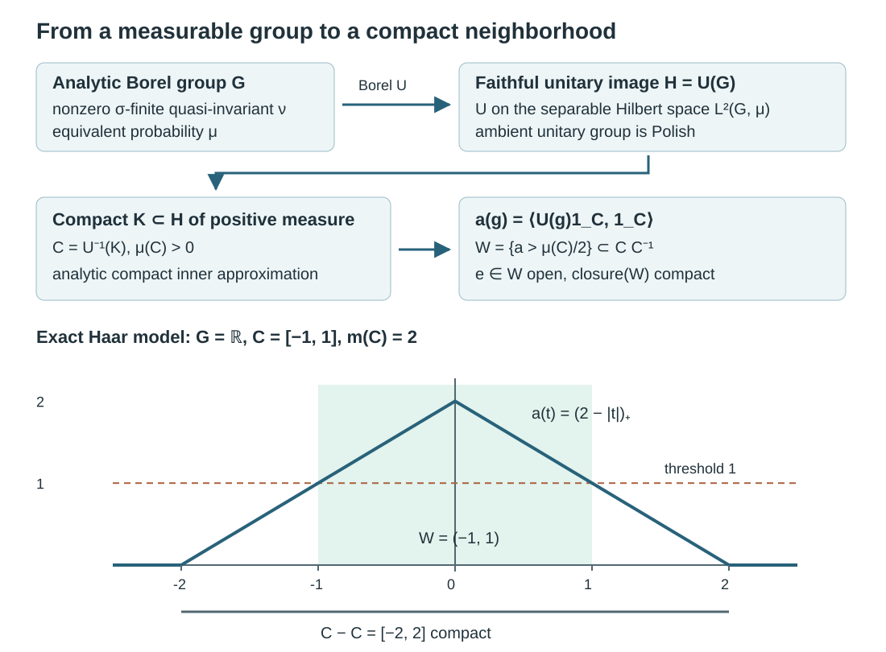
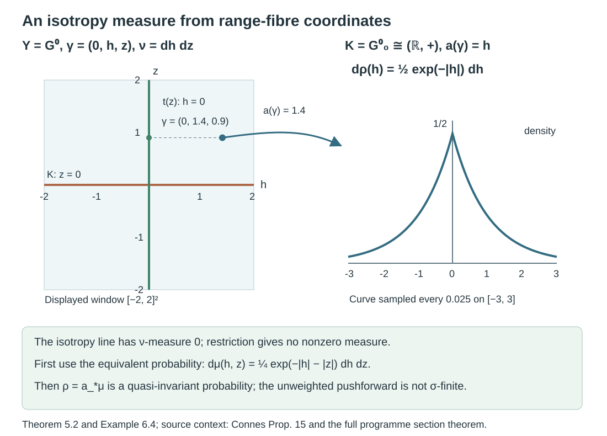
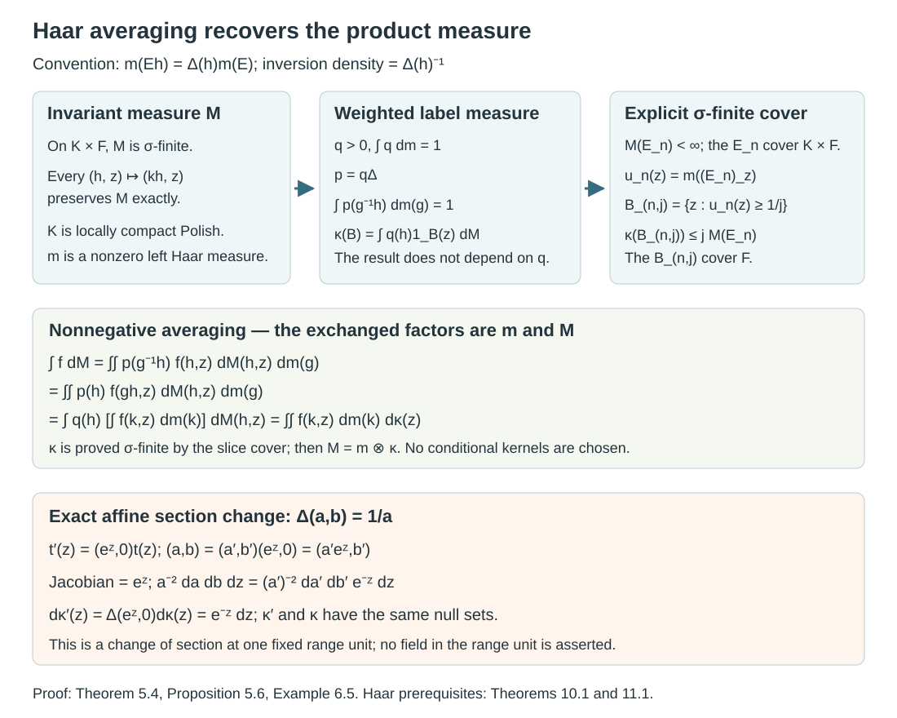

# Borel group measures and isotropy topologies

*Written by GPT-6.1 Sol (OpenAI), Ultra, October 2026. Author self-check in progress; not independently reviewed. Original exposition is public domain (CC0), except the marked CC BY-NC 4.0 product-integration component below.*

## Introduction

A group can be given by its measurable sets before it has a topology. A nonzero sigma-finite measure that is quasi-invariant under every left translation then carries considerable topological information. For an analytic Borel group, it determines a compatible second countable locally compact group structure, and its null sets are exactly the Haar null sets. We prove this Mackey–Weil theorem, including the quasi-invariant form.

The mechanism is concrete. Put the group faithfully into the unitary group of a separable Hilbert space. Analytic-set measure theory supplies a compact set of positive measure in this image. A continuous matrix coefficient detects translations that overlap that set, so a neighborhood of the identity lies in a compact product set. Local compactness follows.

Read [Measurable actions and compact models](measurable-actions-and-compact-models.md), Theorem 0.1 and Lemma 1.1, for the full density and joint-parameter proofs. The earlier programme lesson [Polish spaces and standard Borel spaces](https://kokunoyumeto.github.io/open-math-courses-public/courses/foundations-of-von-neumann-algebras/polish-spaces-and-standard-borel-spaces.html) supplies the complete analytic-image, Borel-inverse and compact-inner-approximation arguments: Theorem 4.3(1),(3), Theorem 5.6 and Theorem 6.2(1). [Haar measure on locally compact groups](https://kokunoyumeto.github.io/open-math-courses-public/courses/harmonic-analysis-on-locally-compact-groups/reader/haar-measure-on-locally-compact-groups.html), Theorem 8.3, Proposition 9.1 and Theorem 10.1, proves Haar existence, positivity on nonempty open sets and the right-translation formula. Ordinary integration and complete separable Hilbert spaces are the remaining prerequisites. The full product-integration argument needed here is given in Lemma 5.3a, adapted with credit from the open-licensed [Axler text](https://measure.axler.net/MIRA.pdf#page=137), Theorems 5.17, 5.20, 5.27 and 5.28. Its monotone-convergence prerequisite has a full proof in that text, Theorem 3.11, printed p. 78 (PDF p. 93). The simple-function density and completeness proofs are in [Measure and Hilbert space tools for Haar integration](https://kokunoyumeto.github.io/open-math-courses-public/courses/harmonic-analysis-on-locally-compact-groups/reader/measure-and-hilbert-space-tools.html), Theorems 2.1–3.2. These are exact written programme dependencies, rather than instructions to obtain an external proof.

This bridge repairs the positive topology prerequisite in [Countable generation and isotropy topologies](countable-generation-and-isotropy-topologies.md). Theorem 5.2 also constructs the required isotropy probability from a standard Borel range fibre, even when the range-fibre measure gives isotropy measure zero. Its section argument uses the complete earlier Polish lesson, Lemma 7.6 and Theorem 7.7. Theorem 5.4 then proves the Haar product formula by averaging, using the full right-translation and inversion arguments in the Haar lesson, Theorems 10.1 and 11.1. The source-label measure is proved sigma-finite, and Proposition 5.6 calculates its change under a new section. The resulting coordinates are used to prove the full standard Borel isotropy commutant theorem in [Averaged coefficients and isotropy commutants](averaged-coefficients-and-isotropy-commutants.md), Theorem 6.1. That proof obtains one countable coefficient family from the global arrow sigma-field and does not require a jointly measurable choice of Haar coordinates.

## 1. The measurable hypotheses

An **analytic Borel space**, also called a Souslin–Borel space, is a countably separated measurable space that is a Borel image of a standard Borel space. Equivalently, it is Borel isomorphic to an analytic subset of a Polish space with its relative Borel sigma-field. This equivalence and the fact that its sigma-field is countably generated are proved in the earlier Polish lesson, Theorem 5.6. Standard Borel spaces are examples; analytic Borel spaces need not initially be standard.

An **analytic Borel group** is a group \(G\) with this measurable structure, whose multiplication and inversion are measurable for the corresponding product sigma-field. No group topology is assumed. A measure \(\nu\) is **left quasi-invariant** if
\[
(g_*\nu)(A)=\nu(g^{-1}A),\qquad g_*\nu\sim\nu\quad(g\in G).
\tag{1.1}
\]
Equivalence means equality of null sets. It does not mean equality of the measures.

**Lemma 1.1 (an equivalent probability).** Every nonzero sigma-finite measure \(\nu\) has an equivalent probability \(\mu\). Left quasi-invariance passes to \(\mu\).

*Proof.* Partition \(G\) into measurable sets \(E_n\) with \(\nu(E_n)<\infty\), allowing null pieces. The finite measure
\[
\omega(A)=\sum_{n\geq1}\frac{2^{-n}\nu(A\cap E_n)}{1+\nu(E_n)}
\tag{1.2}
\]
has exactly the null sets of \(\nu\), and \(0<\omega(G)\leq1\). Put \(\mu=\omega/\omega(G)\). For each \(g\), equivalence is preserved by the measurable bijection of left translation, so \(g_*\mu\sim g_*\nu\sim\nu\sim\mu\). \(\square\)

## 2. A faithful unitary model

**Lemma 2.1 (the unitary group).** For a separable Hilbert space \(K\), the unitary group \(\mathcal U(K)\), with its strong operator topology, is a Polish topological group. Its Borel maps can be tested on a countable dense family of vectors.

*Proof.* Choose a sequence \((q_n)\) dense in the unit ball and use
\[
d(U,V)=\sum_{n\geq1}2^{-n-1}\bigl(\min(1,\|(U-V)q_n\|)+\min(1,\|(U^*-V^*)q_n\|)\bigr).
\tag{2.1}
\]
This is a metric. Convergence on the dense family implies convergence on every vector because the operators have norm one. Strong convergence of unitaries to a unitary also gives strong convergence of their adjoints: \(\|(U_j^*-U^*)\xi\|=\|\xi-U_jU^*\xi\|\). Thus (2.1) induces the strong topology on the unitary group.

A Cauchy sequence has strong limits \(A\) and \(B\) for the unitaries and their adjoints. Each limit preserves norms. The uniform operator bounds allow passage to the limit in both products, giving \(AB=BA=1\); the adjoint relation gives \(B=A^*\). Hence \(A\) is unitary and the sequence converges in (2.1). The metric is complete. The map \(U\mapsto(Uq_n,U^*q_n)_n\) puts the group in a countable product of separable metric spaces, so it is second countable and separable. Multiplication is continuous by
\[
\|U_jV_j\xi-UV\xi\|\leq\|V_j\xi-V\xi\|+\|(U_j-U)V\xi\|,
\]
and inversion is continuous by the adjoint observation. Coordinate maps on \((q_n)\) generate this topology and its Borel sigma-field. \(\square\)

**Lemma 2.2 (weighted regular representation).** Let \(G\) be a countably generated, countably separated measurable group and let \(\mu\) be a left quasi-invariant probability. There is an injective Borel homomorphism
\[
U:G\longrightarrow\mathcal U(L^2(G,\mu)),\qquad
(U_g\xi)(x)=r(g,x)^{1/2}\xi(g^{-1}x),
\tag{2.2}
\]
where \(r(g,\cdot)=d(g_*\mu)/d\mu\) for each fixed \(g\). The Hilbert space is separable. Here “Borel” on \(G\) means measurable for its specified sigma-field.

*Proof.* Lemma 1.1 of *Measurable actions and compact models* applies to any countably generated probability space and jointly measurable nonsingular action. Its finite-partition proof gives a positive finite jointly measurable \(r\), with
\[
r(gh,x)=r(g,x)r(h,g^{-1}x)
\quad\text{almost everywhere for each fixed }(g,h).
\tag{2.3}
\]
The change-of-variables identity gives \(\|U_g\xi\|_2=\|\xi\|_2\); equation (2.3) gives \(U_gU_h=U_{gh}\), and \(U_{g^{-1}}\) is its inverse. These are exact operator identities. A common pointwise exceptional set for all group elements is unnecessary.

The countable Boolean algebra generated by a generating sequence supplies, with rational complex coefficients, a countable dense set in \(L^2(\mu)\). Indeed the closed span of its indicators contains bounded monotone limits of its simple functions; the monotone-class theorem and simple approximation give every \(L^2\) function. For measurable representatives \(\xi,\eta\),
\[
\langle U_g\xi,\eta\rangle
=\int r(g,x)^{1/2}\xi(g^{-1}x)\overline{\eta(x)}\,d\mu(x)
\tag{2.4}
\]
is a measurable function of \(g\), by parameter integration. Absolute integrability for each \(g\) follows from Cauchy–Schwarz and the norm identity. In an orthonormal basis, these coefficients make \(g\mapsto U_gq_n\) Borel: squared distances to a fixed vector are countable sums of the squared coordinates. The same holds for \(U_g^*=U_{g^{-1}}\). Lemma 2.1 now gives the required Borel map.

For injectivity, fix \(g\ne e\) and a sequence \((A_n)\) separating points of \(G\). The sets
\[
F_n^+=A_n\setminus gA_n,
\qquad F_n^-=gA_n\setminus A_n
\tag{2.5}
\]
cover \(G\), since \(x\) and \(g^{-1}x\) are distinct. Each \(F_n^\pm\) is disjoint from its own translate by \(g\): membership and nonmembership in \(A_n\) at \(x\) and \(g^{-1}x\) give incompatible conditions. Some \(F=F_n^\pm\) has \(\mu(F)>0\). The functions \(1_F\) and \(U_g1_F\) have disjoint supports and the same nonzero norm. Consequently \(U_g\ne1\). The homomorphism is faithful. \(\square\)

## 3. The Mackey–Weil topology theorem

**Theorem 3.1.** Let \(G\) be an analytic Borel group with a nonzero sigma-finite left quasi-invariant measure \(\nu\). There is a second countable locally compact Hausdorff group topology \(\tau\) on \(G\) such that:

1. its Borel sigma-field is the original one;
2. \((G,\tau)\) is Polish;
3. \(\nu\) is equivalent to left Haar measure;
4. if \(\nu\) is left invariant, it is a positive scalar multiple of left Haar measure and hence is Radon.

*Proof.* Choose the equivalent probability \(\mu\) in Lemma 1.1 and the faithful homomorphism \(U\) in Lemma 2.2. Give \(G\) the topology pulled back from its image
\[
H=U(G)\subseteq\mathcal U(L^2(G,\mu)).
\tag{3.1}
\]
It is Hausdorff and second countable, and group operations are continuous. We next prove local compactness; it is not being assumed of \(H\).

**A compact set of positive measure.** The image \(H\) is analytic, by the earlier Polish lesson, Theorem 4.3(1) and the Souslin–Borel realization of Theorem 5.6. Push \(\mu\) to a probability \(\rho\) on the whole Polish unitary group. Every Borel set containing \(H\) has \(\rho\)-measure one, so \(\rho^*(H)=1\). Theorem 6.2(1) of that lesson, with its complete compact-inner-approximation proof, supplies a compact \(K\subseteq H\) with \(\rho(K)>0\). Put \(C=U^{-1}(K)\). It is measurable, compact for the pulled-back topology, and \(\mu(C)=\rho(K)>0\).

**An identity neighborhood inside a compact set.** The coefficient
\[
a(g)=\langle U_g1_C,1_C\rangle
=\int_{C\cap gC}r(g,x)^{1/2}\,d\mu(x)
\tag{3.2}
\]
is continuous in \(\tau\), nonnegative, and satisfies \(a(e)=\mu(C)\). If \(a(g)>0\), the intersection \(C\cap gC\) is nonempty, and therefore \(g\in CC^{-1}\). Thus
\[
e\in W=\{g:a(g)>\mu(C)/2\}\subseteq CC^{-1}.
\tag{3.3}
\]
The set \(W\) is open and its closure is contained in the compact set \(CC^{-1}\). This proves local compactness.

**Closedness and the Borel structure.** A locally compact subgroup of a Hausdorff topological group is closed. Here is the needed argument. Choose a compact neighborhood \(L\) of the identity in \(H\) and an ambient open set \(V\) with \(V\cap H\subseteq L\). Since \(L\) is ambient closed, \(V\cap\overline H\subseteq L\subseteq H\). Therefore \(H\) contains a neighborhood of the identity in \(\overline H\). It is an open subgroup of \(\overline H\), hence also closed there, because its other cosets are open. Density gives \(H=\overline H\). Lemma 2.1 now makes \(H\) Polish. The injective analytic Borel map \(U\) has Borel inverse on its image, by the earlier Polish lesson, Theorem 4.3(3). Consequently the pulled-back Borel sigma-field is exactly the original one. In particular the original analytic Borel group has become standard Borel.

**The Haar null class.** Haar existence applies to \((G,\tau)\). Its left Haar measure \(m\) is sigma-finite: second countability gives a countable cover by translates of a relatively compact open identity neighborhood. Choose a strictly positive Borel \(p\) with \(\int p\,dm=1\), using the construction in Lemma 1.1 on a finite-measure partition of \(m\). Define
\[
\beta(A)=\int_G p(g)\mu(g^{-1}A)\,dm(g).
\tag{3.4}
\]
Tonelli shows that \(\beta\) is a probability. For every \(g\), \(\mu(g^{-1}A)=0\) exactly when \(\mu(A)=0\). A nonnegative measurable function has integral zero exactly when it vanishes almost everywhere, so (3.4) gives \(\beta\sim\mu\).

Exchange the two integrals to write
\[
\beta(A)=\int_G\left(\int_{Ax^{-1}}p(g)\,dm(g)\right)d\mu(x).
\tag{3.5}
\]
Right translation preserves Haar null sets, by the Haar lesson, Theorem 10.1. Since \(p>0\) everywhere, the inner integral is zero for every \(x\) if \(m(A)=0\), and is positive for every \(x\) if \(m(A)>0\). Hence \(\beta\sim m\). Therefore \(\nu\sim\mu\sim\beta\sim m\).

**An invariant measure is Haar.** If \(\nu\) is left invariant, its density \(h=d\nu/dm\) is finite and positive almost everywhere, by the sigma-finite Radon–Nikodym theorem. For each fixed \(g\), invariance and uniqueness of densities give \(h(gx)=h(x)\) for \(m\)-almost every \(x\). This equality is jointly measurable in \((g,x)\). Sigma-finite Fubini implies that for almost every \(x\) it holds for almost every \(g\). Choose one such \(x\) with \(0<h(x)<\infty\). Right translation by this \(x\) preserves Haar null sets, so \(h(y)=h(x)\) for almost every \(y\). Thus \(\nu=h(x)m\). All four conclusions follow. \(\square\)

The analytic hypothesis enters precisely at the compact-set and Borel-inverse steps. Countable generation and point separation already suffice for the faithful measurable unitary representation. They do not supply a positive compact subset of its image.

## 4. Uniqueness and the role of sigma-finiteness

**Lemma 4.1 (automatic continuity).** A Borel homomorphism from a Polish group to a second countable topological group is continuous.

*Proof.* Borel sets have the Baire property: sets that differ from an open set by a meagre set form a sigma-algebra containing the open sets. If a Baire-property set \(A\) is nonmeagre, write it as an open nonempty \(O\) modulo a meagre set \(N\). For \(g\) in a sufficiently small identity neighborhood, \(O\cap gO\) is nonempty and open. Baire's theorem supplies a point outside \(N\cup gN\), and hence in \(A\cap gA\). Thus \(AA^{-1}\) contains an identity neighborhood.

For an identity neighborhood \(V\) of the target, choose an open identity neighborhood \(V_0\) with \(V_0V_0^{-1}\subseteq V\). Second countability gives a countable cover of the target by right translates \(V_0t_n\). Their Borel preimages cover the domain. At least one preimage \(A\) is nonmeagre, since the domain is Baire. Its difference set \(AA^{-1}\) is mapped into \(V_0V_0^{-1}\subseteq V\). The preceding paragraph proves continuity at the identity, hence everywhere. \(\square\)

**Corollary 4.2.** The topology in Theorem 3.1 is the unique compatible Polish group topology. In particular it does not depend on the equivalent probability chosen in Lemma 1.1. If an analytic Borel group already has a Polish group topology, a nonzero sigma-finite left quasi-invariant measure forces that topology to be locally compact.

*Proof.* Between any two compatible Polish group topologies, the identity is a Borel homomorphism in both directions. Lemma 4.1 makes both maps continuous. The resulting homeomorphism is the identity on the group. \(\square\)

**Proposition 4.3.** An infinite-dimensional separable Hilbert space, as an additive Polish group with its norm topology, has no nonzero sigma-finite Borel measure quasi-invariant under all translations. Its counting measure is invariant, but is not sigma-finite.

*Proof.* A norm neighborhood of zero contains a ball and therefore a sequence \((c e_n)\), with \(c>0\) and an orthonormal sequence \((e_n)\). Distinct terms have distance \(c\sqrt2\). No compact set can contain that sequence: finitely many balls of radius less than \(c/\sqrt2\) cannot cover it. Thus the Hilbert group is not locally compact. Theorem 3.1 and Corollary 4.2 rule out the stated sigma-finite measure. Counting measure gives finite measure only to finite sets; countably many such sets cannot cover the uncountable Hilbert space. It is therefore not sigma-finite. \(\square\)

## 5. What the theorem supplies for isotropy

**Corollary 5.1 (one-object groupoids).** Let a measurable groupoid have one object, analytic Borel arrow group \(G\), and a nonzero faithful proper transverse function \(\nu\). Then its isotropy group carries the topology of Theorem 3.1, and \(\nu\) is a positive scalar multiple of Haar measure.

*Proof.* With one object, a transverse function is a left-invariant measure on the arrow group. Properness provides a countable measurable cover \((B_n)\) with \(\nu(B_n)<\infty\), so it is sigma-finite. Nonzero faithfulness gives a nonzero measure. Theorem 3.1, including its invariant-measure conclusion, applies. \(\square\)

The nonstandard trace-measure subgroup in *Countable generation and isotropy topologies* has exactly the countable-generation, point-separation, invariance and properness properties used in Lemma 2.2. It has no compatible locally compact topology. Theorem 3.1 consequently excludes an analytic Borel structure as well as a standard Borel structure for that example.

For a groupoid with many objects, its transverse range-fibre measure \(\nu^y\) is a measure on \(G^y\), rather than a measure on \(G^y_y\). The isotropy subgroup can have \(\nu^y\)-measure zero. Restricting \(\nu^y\) to it therefore does not supply the nonzero measure required by Theorem 3.1. The following argument constructs a suitable measure from a standard Borel range fibre. It keeps the source coordinate constant under every isotropy translation, so the conull restriction is simultaneously invariant under all those translations.

**Theorem 5.2 (a standard Borel range fibre).** Let \(\mathcal G\) be a measurable groupoid whose unit space \(X\) has a countable family of measurable sets separating points, and whose unit singletons are measurable. Fix a unit \(y\), and write

\[
Y=\mathcal G^y,\qquad K=\mathcal G^y_y
\tag{5.1}
\]

Assume that \(Y\) is standard Borel and that \(\nu\) is a nonzero sigma-finite measure on \(Y\) invariant under every left translation by \(K\). Then \(K\) has the locally compact Polish topology of Theorem 3.1. More precisely, there are a Borel subset \(F\) of the binary Cantor space, a Borel map \(t:F\to Y\), and a Borel \(K\)-invariant conull subset \(Y_0\subseteq Y\) with coordinates

\[
\begin{aligned}
\Phi:K\times F&\longrightarrow Y_0,&\Phi(h,z)&=h\,t(z),\\
\Phi^{-1}(\gamma)&=(a(\gamma),\sigma(\gamma)),&
a(\gamma)&=\gamma\,t(\sigma(\gamma))^{-1}.
\end{aligned}
\tag{5.2}
\]

These maps are inverse Borel isomorphisms. The label \(\sigma(\gamma)\) records exactly the source unit of \(\gamma\). For an equivalent probability \(\mu\sim\nu\) on \(Y\), the coordinate pushforward

\[
\rho=a_*(\mu|_{Y_0})
\tag{5.3}
\]

is a quasi-invariant probability on \(K\). Standard Borel structure is required only on this range fibre; the theorem does not assume it on the entire arrow space.

*Proof.* The set \(K\) is the Borel subset \(s^{-1}(\{y\})\) of \(Y\), so it is standard Borel. The inherited multiplication and inversion make it a measurable group. Choose the equivalent probability \(\mu\) from Lemma 1.1. If \((B_n)\) separates unit points, set

\[
\sigma(\gamma)=(1_{B_n}(s(\gamma)))_n\in\mathcal C=\{0,1\}^{\mathbb N},
\qquad \lambda=\sigma_*\mu.
\tag{5.4}
\]

The map \(\sigma:Y\to\mathcal C\) is Borel. Its fibres are exactly the sets of arrows with the same source, because the \(B_n\) separate points. Its image \(A\) is analytic, by the earlier Polish lesson, Theorem 4.3(1). The measure \(\lambda\) is a probability on the whole Cantor space; \(A\) is completion-measurable and has full measure, by that lesson's Theorem 6.2. Its Theorem 7.7 supplies a section \(v:A\to Y\) of \(\sigma\) measurable for the completion of \(\lambda\). Extend it by a fixed \(\gamma_0\in Y\) outside \(A\).

We need a Borel section on a conull set, so we give the replacement step. Embed the standard Borel space \(Y\) Borel isomorphically into a Borel subset \(D\subseteq\mathcal C\); a countable separating family and the earlier Theorem 4.3(5) provide this embedding \(j\). Each binary coordinate of \(j\circ v\) has a completion-measurable inverse image of \(1\). Replace these inverse images by Borel sets modulo \(\lambda\)-null sets. The resulting map \(b:\mathcal C\to\mathcal C\) is Borel and equals \(j\circ v\) outside one null set, since there are only countably many coordinates. In particular \(b\in D\) almost everywhere. Put \(\widetilde t=j^{-1}\circ b\) where \(b\in D\), and \(\widetilde t=\gamma_0\) elsewhere. It is a Borel map into \(Y\). The set

\[
F=\{z\in\mathcal C:\sigma(\widetilde t(z))=z\}
\tag{5.5}
\]

is Borel, has \(\lambda(F)=1\), and is contained in \(A\). Set \(t=\widetilde t|_F\) and \(Y_0=\sigma^{-1}(F)\). Then \(\mu(Y_0)=1\), so \(Y_0\) is \(\nu\)-conull. Left translation by any \(k\in K\) leaves the source unchanged, hence preserves \(Y_0\) exactly. A Borel section on all of \(A\) was not asserted; the completed section has been converted only on the single conull set \(F\).

If \(\gamma\in Y_0\), equality of source codes gives \(s(\gamma)=s(t(\sigma(\gamma)))\). Thus the product defining \(a(\gamma)\) in (5.2) is defined and has source and range \(y\). Conversely \(h\,t(z)\) has source code \(z\). Cancellation proves that the two maps in (5.2) are inverse. All their operations are Borel under the given measurable groupoid operations. Therefore they are Borel isomorphisms of the stated standard Borel spaces. They also give

\[
a(k\gamma)=k\,a(\gamma),\qquad \sigma(k\gamma)=\sigma(\gamma).
\tag{5.6}
\]

Write \(\mu_0=\mu|_{Y_0}\) and \(\nu_0=\nu|_{Y_0}\). For every \(k\), exact invariance gives \(k_*\nu_0=\nu_0\), while equivalence gives \(k_*\mu_0\sim\mu_0\). Pushforward preserves equivalence of null sets: for a Borel \(E\subseteq K\), test its inverse image under \(a\). Equation (5.6) then gives

\[
k_*\rho=a_*(k_*\mu_0)\sim a_*\mu_0=\rho.
\tag{5.7}
\]

This is a probability, so it is nonzero and sigma-finite. Theorem 3.1 applies to the standard Borel group \(K\). It gives the desired locally compact Polish topology and the Haar null class of \(\rho\). Corollary 4.2 shows that this topology is independent of the weight, the separating codes and the section. \(\square\)

**Corollary 5.3.** If a measurable groupoid has countably separated units, measurable unit singletons, standard Borel range fibres and a nonzero proper transverse measure on each range fibre, all its isotropy groups have compatible locally compact Polish group topologies.

*Proof.* Properness makes each range-fibre measure sigma-finite. Transverse invariance includes the isotropy translations on that fibre. Theorem 5.2 applies at every unit. This is a pointwise conclusion; no jointly measurable field of topologies is claimed. \(\square\)

**Product-integration component — begin.** The following lemma and its proof adapt Sheldon Axler, *Measure, Integration & Real Analysis*, author version 12 June 2026, Theorems 5.17, 5.20, 5.27 and 5.28, printed pp. 122–130 (PDF pp. 137–145). This marked component is distributed under [CC BY-NC 4.0](https://creativecommons.org/licenses/by-nc/4.0/), as granted on the [author PDF's title page](https://measure.axler.net/MIRA.pdf#page=1). AI changes reorganize the argument around the Haar application, state the one-measure section result explicitly, replace the rectangle refinement with finite partitions, and supply the product uniqueness argument. No third-party image is included, and no endorsement is implied.

**Lemma 5.3a (sections and sigma-finite Tonelli).** Let \((A,\Sigma)\) and \((B,\mathcal T)\) be measurable spaces, and let \(\alpha\) be a sigma-finite measure on \(A\). For every nonnegative \(\Sigma\otimes\mathcal T\)-measurable \(u\), the function

\[
b\longmapsto \int_A u(a,b)\,d\alpha(a)
\tag{5.T1}
\]

is \(\mathcal T\)-measurable. No measure on \(B\) is required for this assertion. If \(\beta\) is also a sigma-finite measure on \(B\), there is a unique measure \(\alpha\otimes\beta\) on the product sigma-field with the rectangle values \(\alpha(C)\beta(D)\), using \(0\cdot\infty=0\). This measure is sigma-finite, both section integrals are measurable, and

\[
\begin{aligned}
\int_{A\times B}u\,d(\alpha\otimes\beta)
&=\int_B\!\int_A u(a,b)\,d\alpha(a)\,d\beta(b)\\
&=\int_A\!\int_B u(a,b)\,d\beta(b)\,d\alpha(a).
\end{aligned}
\tag{5.T2}
\]

These are equalities in \([0,\infty]\). The statement concerns the product sigma-field; no topology, local finiteness or Radon condition is present.

*Proof.* We first record the set argument used below. If \(\mathcal A\) is an algebra of subsets of a set and \(\mathcal M\) is its smallest monotone class, then \(\mathcal M=\sigma(\mathcal A)\). Indeed, for fixed \(D\in\mathcal A\), the sets \(E\in\mathcal M\) with \(D\cup E\in\mathcal M\) form a monotone class containing \(\mathcal A\), hence contain all of \(\mathcal M\). Next fix \(E\in\mathcal M\) and apply the same argument with \(D\) variable. This proves closure under finite unions. The sets in \(\mathcal M\) whose complements belong to \(\mathcal M\) also form a monotone class containing \(\mathcal A\). Thus \(\mathcal M\) is closed under complements and finite unions; increasing unions of finite unions give countable unions. It is the required sigma-field.

Every section \(E^b=\{a:(a,b)\in E\}\) of a product-measurable set lies in \(\Sigma\): the collection of sets with this property is a sigma-field containing the rectangles. Suppose first that \(\alpha(A)<\infty\). For a rectangle \(C\times D\), its section mass is \(\alpha(C)1_D(b)\), which is measurable. Any finite union of rectangles is a disjoint finite union of rectangles: partition each coordinate space by membership in the finitely many coordinate sets, then select the appropriate product cells. The section mass of this union is therefore a finite sum of measurable functions.

The product sets with measurable section mass form a monotone class. For increasing sets use continuity from below. For decreasing sets use continuity from above, which is valid here because every section has mass at most \(\alpha(A)<\infty\). The preceding set argument proves section measurability for every product set. For sigma-finite \(\alpha\), choose \(A_n\uparrow A\) with \(\alpha(A_n)<\infty\), and apply the finite case to the restrictions:

\[
\alpha(E^b)=\lim_n\alpha(E^b\cap A_n).
\tag{5.T3}
\]

Hence section masses remain measurable. For a general \(u\), take the finite-valued simple functions
\(s_n=2^{-n}\lfloor 2^n\min(u,n)\rfloor\). They increase pointwise to \(u\), including where \(u=\infty\). The integral of each \(s_n\) is a finite linear combination of section masses. Monotone convergence proves (5.T1). This argument has used only \(\alpha\), not a measure on \(B\).

Now suppose \(\beta\) is sigma-finite. Define

\[
\pi(E)=\int_B\alpha(E^b)\,d\beta(b).
\tag{5.T4}
\]

The integral is well defined by the result just proved. Sections of disjoint sets are disjoint, so countable additivity of \(\alpha\), followed by monotone convergence of the nonnegative partial sums under \(\beta\), proves countable additivity of \(\pi\). Also \(\pi(\varnothing)=0\), and its rectangle values are \(\alpha(C)\beta(D)\). With finite-mass exhaustions \(A_n\uparrow A\), \(B_n\uparrow B\), the rectangles \(A_n\times B_n\) cover \(A\times B\) and have finite \(\pi\)-mass. Thus \(\pi\) is sigma-finite. Its definition gives the first equality in (5.T2) on indicators, then on nonnegative simple functions, then on all \(u\) by monotone convergence.

To reverse the order, first take both measures finite. The two iterated indicator integrals agree on rectangles, and hence on finite disjoint unions of rectangles. The sets on which they agree form a monotone class: increasing unions use monotone convergence; decreasing intersections use continuity from above of the two finite measures constructed by (5.T4) in the two orders. The set argument proves equality on the whole product sigma-field. In the sigma-finite case, apply this finite result to \(E\cap(A_n\times B_n)\), with the restricted measures, and pass to the limit in both orders by monotone convergence. Simple approximation now gives the second equality in (5.T2) for every \(u\).

Finally, if another measure has the stated rectangle values, its restriction to \(A_n\times B_n\) is finite and agrees with \(\pi\) on rectangles and their finite disjoint unions. The equality class is again monotone by continuity of finite measures, so the restrictions agree on all product sets. Letting \(n\) increase proves uniqueness on the whole space. This proves all assertions. \(\square\)

**Product-integration component — end.**

In the averaging proof below, the first part of Lemma 5.3a makes the Haar section integral measurable on \(F\) before any sigma-finiteness of its label measure is known. Formula (5.T2) is used only with two measures already proved sigma-finite. The ordinary nonnegative integration rules invoked in the lemma are proved in [Axler], Theorems 3.4, 3.7–3.11; they require neither sigma-finiteness nor a topology.

The coordinates (5.2) put the invariant measure on \(K\times F\). The next argument proves its product structure directly. It applies to any measurable label space; its measure need not already be the pushforward of the original measure.

**Theorem 5.4 (an invariant product measure).** Let \(K\) be a locally compact Polish group with left Haar measure \(m\), let \(F\) be a measurable space, and let \(M\) be a sigma-finite measure on the product sigma-field of \(K\times F\). Suppose that \((h,z)\mapsto(kh,z)\) preserves \(M\) for every \(k\in K\). Then there is a unique sigma-finite measure \(\kappa\) on \(F\) such that

\[
M=m\otimes\kappa.
\tag{5.8}
\]

For any strictly positive finite Borel function \(q\) on \(K\) with \(\int q\,dm=1\), it is given by

\[
\kappa(B)=\int_{K\times F}q(h)1_B(z)\,dM(h,z).
\tag{5.9}
\]

It is nonzero if \(M\) is nonzero. No regularity or local finiteness of \(M\) is assumed.

*Proof.* Haar measure is nonzero and sigma-finite, as in Theorem 3.1. Lemma 1.1 therefore supplies such a function \(q\). We use the Haar lesson's convention

\[
m(Eh)=\Delta(h)m(E),\qquad
\int f(gh)\,dm(g)=\Delta(h)^{-1}\int f(g)\,dm(g),
\tag{5.10}
\]

with \(\Delta\) a continuous positive homomorphism. Its complete Theorem 11.1 gives

\[
\int f(g^{-1})\,dm(g)
=\int f(g)\Delta(g)^{-1}\,dm(g).
\tag{5.11}
\]

These formulas apply to all nonnegative Borel functions. Set \(p=q\Delta\). Left invariance and (5.11), with \(g=hu\), give, for every \(h\),

\[
\int_K p(g^{-1}h)\,dm(g)
=\int_K p(u^{-1})\,dm(u)
=\int_K q(u)\,dm(u)=1.
\tag{5.12}
\]

Define \(\kappa\) by (5.9). It is a measure, by monotone convergence, although sigma-finiteness has yet to be proved. Multiplication and inversion on \(K\) are jointly Borel, so the averaging integrands below are product-measurable. For a nonnegative product-measurable \(f\), the function
\(Tf(z)=\int_K f(k,z)\,dm(k)\) is measurable by the one-measure assertion of Lemma 5.3a. Apply (5.T2) to the already sigma-finite measures \(m\) and \(M\), then apply the assumed invariance for each fixed \(g\), and exchange these same two integrals again:

\[
\begin{aligned}
\int f\,dM
&=\int_K\!\int_{K\times F}
 p(g^{-1}h)f(h,z)\,dM(h,z)\,dm(g)\\
&=\int_K\!\int_{K\times F}
 p(h)f(gh,z)\,dM(h,z)\,dm(g)\\
&=\int_{K\times F}p(h)
 \left(\int_K f(gh,z)\,dm(g)\right)dM(h,z)\\
&=\int_{K\times F}q(h)Tf(z)\,dM(h,z)
=\int_F Tf(z)\,d\kappa(z).
\end{aligned}
\tag{5.13}
\]

The third-to-fourth equality uses (5.10); the last equality is the pushforward integration formula for the weighted measure in (5.9). All integrands are nonnegative. No finite quantity is subtracted from an infinite one, and no Tonelli exchange against an as-yet unproved sigma-finite \(\kappa\) occurs.

Choose a measurable cover \((E_n)\) of \(K\times F\) with \(M(E_n)<\infty\). Write

\[
u_n(z)=m(\{h:(h,z)\in E_n\}),\qquad
B_{n,j}=\{z:u_n(z)\geq1/j\},\quad j\geq1.
\tag{5.14}
\]

The functions \(u_n\) are measurable. Equation (5.13) for \(f=1_{E_n}\) gives

\[
\int_F u_n\,d\kappa=M(E_n),\qquad
\kappa(B_{n,j})\leq jM(E_n)<\infty.
\tag{5.15}
\]

For each \(z\), the slices of the \(E_n\) cover \(K\). They cannot all have Haar measure zero, since \(m(K)>0\). Thus the countably many \(B_{n,j}\) cover \(F\), proving sigma-finiteness. Only now does the two-measure part of Lemma 5.3a supply the sigma-finite product \(m\otimes\kappa\); its formula (5.T2) and (5.13) agree on every indicator. This proves (5.8). If \(\kappa=0\), the same formula gives \(M=0\).

For uniqueness choose a Borel \(C\subseteq K\) with \(0<m(C)<\infty\), for example a compact identity neighborhood. Any product representation has
\(M(C\times B)=m(C)\kappa(B)\). Dividing by this fixed positive finite number determines \(\kappa(B)\) for every measurable \(B\), including those of infinite measure. In particular (5.9) is independent of the normalized function \(q\). \(\square\)

The proof uses exact invariance of the whole product measure for every translation. It never chooses conditional measures with translation-dependent exceptional sets. The only product on which the two central integrations are exchanged is \(m\otimes M\), whose factors are known sigma-finite at that point.

**Corollary 5.5 (the fixed-range-fibre Haar formula).** Under Theorem 5.2, fix a left Haar measure \(m_y\) on \(K\). There is a unique nonzero sigma-finite measure \(\kappa_y\) on its Borel label set \(F\) such that, for every nonnegative Borel \(f\) on \(Y_0\),

\[
\int_{Y_0} f(\gamma)\,d\nu(\gamma)
=\int_F\!\int_K f(h\,t(z))\,dm_y(h)\,d\kappa_y(z).
\tag{5.16}
\]

Moreover \(\kappa_y\sim\lambda|_F\), for the probability \(\lambda\) in (5.4).

*Proof.* Set \(M=(\Phi^{-1})_*(\nu|_{Y_0})\). A Borel isomorphism preserves sigma-finiteness. Equations (5.2) and (5.6) transfer every isotropy translation to left translation in the first coordinate, so Theorem 5.4 applies. Its integral formula is (5.16). For a Borel \(B\subseteq F\),
\(\kappa_y(B)=0\) exactly when \(M(K\times B)=0\), because \(m_y\) is nonzero. This is equivalent to \(\nu(\sigma^{-1}B)=0\), then to \(\mu(\sigma^{-1}B)=0\), and finally to \(\lambda(B)=0\). Nonzero \(\nu|_{Y_0}\) gives nonzero \(\kappa_y\). \(\square\)

**Proposition 5.6 (a change of section).** On the same label set \(F\), replace \(t(z)\) by \(t'(z)=b(z)t(z)\), where \(b:F\to K\) is Borel. Keep the same left Haar measure and convention (5.10). Then the source-label measure in (5.16) changes by

\[
d\kappa'_y(z)=\Delta(b(z))\,d\kappa_y(z).
\tag{5.17}
\]

In particular the null class is unchanged; the measure itself need not be unchanged in a nonunimodular group. Replacing \(m_y\) by \(c m_y\) instead replaces \(\kappa_y\) by \(c^{-1}\kappa_y\).

*Proof.* The old and new coordinates satisfy \(h=h'b(z)\), so the map from old coordinates to new ones is \((h,z)\mapsto(hb(z)^{-1},z)\). For each fixed \(z\), (5.10) gives
\[
\int_K f(hb(z)^{-1},z)\,dm_y(h)
=\Delta(b(z))\int_K f(h',z)\,dm_y(h').
\]
Tonelli proves the asserted product formula for the new coordinates. The density is positive and finite; it preserves the null class and sigma-finiteness, the latter by subdividing a finite-measure cover according to \(\Delta(b)\leq n\). Uniqueness in Theorem 5.4 identifies \(\kappa'_y\). The scalar change of Haar normalization follows directly from (5.16). \(\square\)

Connes's author-hosted Proposition 15, PDF 38–39, uses this topology and an isotropy Haar product decomposition in its positive argument. The unrestricted countably generated assertions have complete counterexamples in [Countable generation and isotropy topologies](countable-generation-and-isotropy-topologies.md) and [Principal groupoids with extra fibre information](principal-groupoids-with-extra-fibre-information.md). Theorem 5.2 and Corollary 5.5 now provide the topology and full Haar product formula on each fixed standard Borel range fibre. [Averaged coefficients and isotropy commutants](averaged-coefficients-and-isotropy-commutants.md), Theorems 5.1 and 6.1, supplies the full operator step at the global standard Borel scope, with one countable total family working at every unit. Its completed-probability descent and proper global kernel approximation avoid a jointly measurable choice of these topologies, Haar measures and sections. Such a joint field is therefore neither proved here nor needed for that adopted route. The broader countably generated counterexamples and the separate weak-measurable two-copy factor problem retain their exact scope. Modular spectral disintegration and the flow of weights retain their exact prerequisites in the modular and flow courses.

## 6. Five concrete models

**Example 6.1 (translation overlap).** On \(\mathbb R\) with Lebesgue measure, the ordinary regular representation is \((\lambda_t f)(x)=f(x-t)\). For \(C=[-1,1]\),
\[
\begin{gathered}\langle\lambda_t1_C,1_C\rangle=(2-|t|)_+,\\\{t:(2-|t|)_+>1\}=(-1,1)\\\subseteq C-C=[-2,2].\end{gathered}
\tag{6.1}
\]
The integral is the length of \([-1,1]\cap[t-1,t+1]\). Normalizing an equivalent positive-density probability changes the representation by a unitary conjugacy, as Exercise 7.1 proves, so it leaves the constructed topology unchanged.

*Figure 6.1.* The upper panel shows the proof's exact maps and hypotheses: an analytic Borel group enters its faithful unitary model, a positive compact set is pulled back, and the overlap coefficient places an open identity neighborhood inside \(CC^{-1}\). The lower panel is the exact real translation calculation (6.1), with \(C=[-1,1]\), \(m(C)=2\) for this Haar example, threshold \(1\), and \(C-C=[-2,2]\). The general probability-space construction uses its own \(\mu(C)/2\); the plotted Haar coefficient is a concrete model, not a formula for every measure. Proof locators: Lemma 2.2, Theorem 3.1 and Example 6.1. Classical source context: [Mackey] and [Ramsay].

**Example 6.2 (the rationals).** Give \(\mathbb Q\) its usual relative Borel structure. Every subset is Borel, since it is a countable union of singletons. An enumeration \((q_n)\) and masses \(\mu(\{q_n\})=2^{-n}\), for \(n\geq1\), give a quasi-invariant probability. The topology of Theorem 3.1 is discrete: a countable locally compact Polish group is Baire, so its decomposition into closed singletons forces an isolated point, and translations make every point isolated. This differs from the inherited real topology, which is not locally compact. That topology is not Polish: in a countable nondiscrete metrizable group every singleton is nowhere dense, contradicting the Baire theorem if a compatible complete metric existed.

**Example 6.3 (affine transformations).** On \(G=(0,\infty)\times\mathbb R\), let
\[
(a,b)(c,d)=(ac,b+ad),\qquad d\nu(a,b)=a^{-2}\,da\,db.
\tag{6.2}
\]
The usual topology is Polish and locally compact. Left translation has Jacobian \(a_0^2\), which cancels the denominator \((a_0a)^2\), so \(\nu\) is left invariant. It is sigma-finite on the rectangles \([1/n,n]\times[-n,n]\). Right translation by \((c,d)\) has Jacobian \(c\), and hence
\[
\nu(E(c,d))=c^{-1}\nu(E).
\tag{6.3}
\]
This is a nonunimodular example. The theorem produces the usual topology, by Corollary 4.2. The use of right translation in (3.5) requires preservation of null sets, rather than right invariance of the Haar measure.

**Example 6.4 (zero measure on isotropy).** Let the units be \(\mathbb R\), and write arrows as \((x,h,z):z\to x\), with

\[
(x,h,z)(z,k,u)=(x,h+k,u),\qquad
(x,h,z)^{-1}=(z,-h,x).
\tag{6.4}
\]

Give each range fibre its measure \(d\nu^x(h,z)=dh\,dz\). Left translation changes \(h\) by a constant and keeps \(z\) fixed, so this is a transverse function. The sets where all three coordinates have absolute value at most \(n\) cover the arrow space and have range-fibre measure at most \(4n^2\). Thus it is faithful and proper. The isotropy at \(y\) is the line \(z=y\) and has \(\nu^y\)-measure zero. Its group is the additive real line.

Choose \(t(z)=(y,0,z)\). Then \(a(y,h,z)=h\), and the equivalent probability

\[
d\mu_y(h,z)=\tfrac14e^{-|h|-|z|}\,dh\,dz,
\qquad d\rho(h)=\tfrac12e^{-|h|}\,dh
\tag{6.5}
\]

has the asserted nonzero pushforward. Every translated density is strictly positive, so \(\rho\) is quasi-invariant. This constructs the isotropy measure without restricting \(\nu^y\) to its null isotropy line. Pushing the unweighted \(\nu^y\) to the same coordinate would give infinite mass to every set of positive Lebesgue measure; Exercise 7.9 explains why that measure is not sigma-finite.

*Figure 6.2.* The model fixes \(y=0\), so \(Y=\mathcal G^0\) has coordinates \((h,z)\). Its Haar-isotropy line \(z=0\) is null for \(dh\,dz\); the section is \(t(z)=(0,0,z)\), and \(a(0,h,z)=h\). The square is the schematic window \([-2,2]^2\) in the full plane; the right-hand density curve is sampled every \(0.025\) on \([-3,3]\). The marked arrow is exactly \((0,1.4,0.9)\). The probability and its pushforward in (6.5) are defined on the full plane and line, respectively. The diagram traces the mechanism proved in Theorem 5.2 and calculated in Example 6.4; its source context is Connes's Proposition 15 and the programme's full Jankov–von Neumann section theorem.

**Example 6.5 (the affine section factor).** Use the affine group \(K\) of Example 6.3 as the isotropy in the transitive groupoid with arrows \((x,h,z):z\to x\), multiplication \((x,h,z)(z,k,u)=(x,hk,u)\), and range measures \(dm(h)\,dz\). Fix a range unit \(y\). For the section \(t(z)=(y,(1,0),z)\), the label measure is \(dz\). Our modular convention is \(\Delta(a,b)=a^{-1}\), since (6.3) gives \(m(E(c,d))=c^{-1}m(E)\).

Choose instead \(t'(z)=(y,(e^z,0),z)\). Then

\[
(a,b)=(a',b')(e^z,0)=(a'e^z,b'),\qquad
\frac{da\,db}{a^2}\,dz
=\frac{da'\,db'}{(a')^2}\,e^{-z}dz.
\tag{6.6}
\]

The Jacobian is \(e^z\); the density denominator contributes \(e^{-2z}\). Thus the new label measure is \(e^{-z}dz\), exactly \(\Delta(e^z,0)dz\). Both label measures are sigma-finite and equivalent, but give different masses to every positive-length bounded interval lying wholly in the positive or negative half-line.

*Figure 6.3.* The upper schematic traces the exact proof of Theorem 5.4: normalize \(q\) against left Haar measure, use \(p=q\Delta\), average against the already sigma-finite measures \(m\) and \(M\), and recover \(\kappa\) as the weighted label pushforward. The right panel gives the explicit finite-mass cover bound (5.15). The lower panel is the exact affine coordinate change (6.6), including its Jacobian and modular sign. It is a symbolic proof diagram, with no numerical samples or unstated geometric projection. Proof locators: Theorem 5.4, Proposition 5.6 and Example 6.5; Haar translation and inversion context: the programme Haar lesson, Theorems 10.1 and 11.1.

## 7. Exercises with complete solutions

**Exercise 7.1.** *Level 2.* If \(\mu=w\nu\) for a positive finite measurable \(w\), show that the weighted regular representations for equivalent sigma-finite measures \(\mu\) and \(\nu\) are unitarily equivalent. Identify the unitary and the two derivative conventions.

*Solution.* Multiplication \(J\xi=w^{1/2}\xi\) is a unitary from \(L^2(\mu)\) onto \(L^2(\nu)\), with inverse multiplication by \(w^{-1/2}\) on almost-everywhere representatives. If \(r_g^\nu=d(g_*\nu)/d\nu\), the pushforward calculation gives \(r_g^\mu(x)=w(g^{-1}x)r_g^\nu(x)/w(x)\) almost everywhere. Therefore \(JU_g^\mu\xi(x)=(r_g^\nu(x))^{1/2}w(g^{-1}x)^{1/2}\xi(g^{-1}x)=U_g^\nu J\xi(x)\). Unitarily conjugating the unitary image preserves its strong topology. The derivative is always that of pushforward by \(g\), not by \(g^{-1}\).

**Exercise 7.2.** *Level 1.* For \(C=[-a,a]\), \(a>0\), calculate the overlap coefficient and the neighborhood in (3.3) for Lebesgue measure.

*Solution.* The overlap of \([-a,a]\) and \([t-a,t+a]\) has length \((2a-|t|)_+\). The value at zero is \(2a\), so the half-value test is \((2a-|t|)_+>a\), or \(|t|<a\). Thus the neighborhood is \((-a,a)\), its closure is \([-a,a]\), and it lies in \(C-C=[-2a,2a]\), exactly as the proof requires.

**Exercise 7.3.** *Level 2.* Prove that every countable group with its full power-set sigma-field admits the theorem's construction, and identify the measure class and topology.

*Solution.* Give every point a positive mass, with total one; on a finite group use normalized counting measure, and on an infinite enumeration use \(2^{-n}\). Every translation preserves the null class, whose only null set is empty. A countable discrete space is Polish, so the measurable group is standard Borel and its operations are measurable. Theorem 3.1 applies. The countable Baire argument in Example 6.2 makes its topology discrete, and Haar measure is counting measure up to scale. This is exactly the original positive-at-every-point null class.

**Exercise 7.4.** *Level 2.* Verify the affine group's left and right Jacobians in (6.2)–(6.3). Explain why the modular factor does not invalidate (3.5).

*Solution.* Left translation by \((a_0,b_0)\) is \((a,b)\mapsto(a_0a,b_0+a_0b)\), with determinant \(a_0^2\); dividing by the square of the new first coordinate gives \(a_0^2/(a_0a)^2=1/a^2\). Right translation by \((c,d)\) is \((a,b)\mapsto(ac,b+ad)\), with determinant \(c\); its density factor is \(c/(ac)^2=c^{-1}a^{-2}\). Thus right translation rescales Haar measure by a strictly positive finite constant. It preserves zero and positive measure, which are the only properties used in (3.5).

**Exercise 7.5.** *Level 3.* Prove that a group in Theorem 3.1 with finite invariant \(\nu\) is compact. Explain why finite quasi-invariant measure alone gives no such conclusion.

*Solution.* The theorem makes \(\nu\) a scalar multiple of Haar measure \(m\), so \(m(G)<\infty\). Choose a nonempty relatively compact open \(V\); then \(0<m(V)<\infty\). If \(G\) were not compact, recursively choose \(g_{n+1}\) outside the compact union \(\bigcup_{j\leq n}g_j\overline V\overline V^{-1}\). The sets \(g_nV\) are pairwise disjoint, because an intersection would put \(g_{n+1}\) in that union. Their equal positive measures force \(m(G)=\infty\), a contradiction. Hence \(G\) is compact. On \(\mathbb R\), the probability with density \(e^{-|x|}/2\) relative to Lebesgue measure is equivalent to every translate and is therefore quasi-invariant; its compatible Polish topology is the usual noncompact one. Invariance was essential.

**Exercise 7.6.** *Level 3.* Locate the precise obstruction to applying Theorem 3.1 to the nonstandard subgroup of *Countable generation and isotropy topologies*, and explain why counting measure on an infinite-dimensional separable Hilbert group is a different obstruction.

*Solution.* The subgroup's trace measure is nonzero, invariant and sigma-finite; its operations are measurable and the sigma-field is countably generated and separates points. Lemma 2.2 therefore applies. If the group were analytic Borel, its unitary image would have a positive compact subset by the analytic compact-inner-approximation theorem, and (3.3) would produce the forbidden locally compact topology. Thus the analytic Borel hypothesis fails. The Hilbert group's norm Borel space is standard, but counting measure is not sigma-finite, as Proposition 4.3 proves. Replacing it by a nonzero sigma-finite measure quasi-invariant under every translation is impossible by that proposition. These are distinct missing hypotheses.

**Exercise 7.7.** *Level 2.* Justify the passage from fixed-translation invariance of the density \(h\) to a constant density in the last paragraph of Theorem 3.1. Is a simultaneous pointwise invariant representative being asserted?

*Solution.* For each fixed \(g\), the exceptional set of \(x\) where \(h(gx)\ne h(x)\) is Haar null. The relation is jointly Borel, so Tonelli on sigma-finite Haar measure says it is null in the product measure, and Fubini gives a conull set of \(x\) for which the equality holds for almost every \(g\). Choose one such \(x\) where \(h\) is finite and positive. The bijection \(g\mapsto gx\) preserves the Haar null class, hence \(h(y)=h(x)\) almost everywhere. This proves equality of measures \(\nu=h(x)m\). No original representative was claimed invariant simultaneously at every point and every translation.

**Exercise 7.8.** *Level 2.* In Example 6.4 verify the two probabilities in (6.5), calculate the derivative of \(\rho\) under translation by \(b\), and identify the topology given by Theorem 5.2.

*Solution.* Since \(\int_{\mathbb R}e^{-|u|}\,du=2\), the plane density has integral \(4/4=1\). Integrating in \(z\) gives the marginal \(e^{-|h|}/2\), also of integral one. Its translated density at \(h\) is \(e^{-|h-b|}/2\); hence \(d(b_*\rho)/d\rho(h)=e^{|h|-|h-b|}\), which is finite and strictly positive for every \(h\). The usual real topology is a compatible Polish group topology, so Corollary 4.2 identifies it with the constructed topology. The restriction of plane Lebesgue measure to \(z=y\) remains zero.

**Exercise 7.9.** *Level 3.* For the unweighted plane measure in Example 6.4, prove that its coordinate pushforward is not sigma-finite. Explain exactly where the equivalent probability repairs this problem.

*Solution.* For a Borel set \(E\subseteq\mathbb R\), the inverse image is \(E\times\mathbb R\). Tonelli gives zero measure if \(m(E)=0\), and infinite measure if \(m(E)>0\). Thus every finite-measure set for this pushforward is Lebesgue null. A countable union of such sets is still Lebesgue null and cannot cover the line; the pushforward is not sigma-finite. The positive integrable plane density in (6.5) first replaces the measure by an equivalent probability. Its pushforward is then a probability automatically, and equivariance preserves quasi-invariance. Sigma-finiteness of a measure does not in general pass to an arbitrary pushforward.

**Exercise 7.10.** *Level 2.* For the plane range measure in Example 6.4, use Theorem 5.4 to determine the label measure with \(q(h)=e^{-|h|}/2\). Compare it with the unweighted source-label pushforward and with the probability label measure in (5.4).

*Solution.* Formula (5.9) gives \(\kappa(B)=\int_{\mathbb R\times B}q(h)\,dh\,dz=m(B)\), so \(dh\,dz=dh\otimes dz\). The unweighted source-label pushforward is \(\nu^y(\mathbb R\times B)\), equal to zero for a Lebesgue null \(B\) and to infinity otherwise. Its finite-measure sets cannot cover the line countably, so it is not sigma-finite. The equivalent plane probability in (6.5) has label pushforward \(d\lambda(z)=e^{-|z|}dz/2\), which is equivalent to \(\kappa=dz\) and has total mass one. Formula (5.9) uses a density normalized in the Haar coordinate; \(\kappa\) need not be a probability on labels.

**Exercise 7.11.** *Level 3.* For the affine group with \(dm=a^{-2}da\,db\), verify that \(q(a,b)=a^2e^{-a-|b|}/2\) is normalized, calculate \(p=q\Delta\), and check the modular sign for the changed section in Example 6.5. If the Haar measure is doubled, what happens to the label measure?

*Solution.* The positive density satisfies
\(\int q\,dm=\frac12(\int_0^\infty e^{-a}da)(\int_{\mathbb R}e^{-|b|}db)=1\). Since \(\Delta(a,b)=a^{-1}\), one has \(p(a,b)=a e^{-a-|b|}/2\) and \(p\Delta^{-1}=q\). Inversion therefore gives \(\int p(g^{-1}h)dm(g)=1\), for every fixed \(h\), as required in (5.12). The old affine coordinate is \((a'e^z,b')\); substitution in \(a^{-2}da\,db\) gives the factor \(e^{-z}\). This equals \(\Delta(e^z,0)\), not its reciprocal. With the original section, doubling \(m\) replaces \(dz\) by \(dz/2\); with the new section it replaces \(e^{-z}dz\) by \(e^{-z}dz/2\). In each case the product measure is unchanged.

**Exercise 7.12.** *Level 3.* Let \(K=\mathbb Z\) with counting Haar measure, let \(F\) be any measurable space, and suppose a sigma-finite invariant measure \(M\) on \(\mathbb Z\times F\) is given as in Theorem 5.4. Initially no sigma-finite measure on \(F\) has been supplied. Explain why the functions \(T1_E(z)=\sum_{h\in\mathbb Z}1_E(h,z)\) are measurable. With \(q(h)=2^{-|h|}/3\), calculate \(\kappa\), prove \(\kappa(B)=M(\{0\}\times B)\), and explain why sigma-finiteness of \(M\) makes this particular section measure sigma-finite. Contrast this argument with restricting plane measure to its null isotropy line in Example 6.4.

*Solution.* The sum is a pointwise increasing limit of finite sums of measurable section indicators, which is also the one-measure conclusion of Lemma 5.3a. It needs no measure on \(F\). The weight is normalized because \(\sum_{h\in\mathbb Z}2^{-|h|}=1+2\sum_{n\geq1}2^{-n}=3\). Left invariance gives \(M(\{h\}\times B)=M(\{0\}\times B)\) for every \(h\) and measurable \(B\). Nonnegative integration over the countable disjoint slices therefore gives

\[
\kappa(B)=\sum_{h\in\mathbb Z}q(h)M(\{h\}\times B)
=M(\{0\}\times B).
\tag{7.1}
\]

This holds also when the common slice mass is infinite, since every \(q(h)>0\); when it is zero all terms are zero. For a cover \(M(E_n)<\infty\), the measurable sections \(D_n=\{z:(0,z)\in E_n\}\) cover \(F\) and satisfy \(\kappa(D_n)=M(\{0\}\times D_n)\leq M(E_n)\). Thus \(\kappa\) is sigma-finite. Formula (5.T2) can now be applied to counting measure and \(\kappa\). The corresponding shortcut fails for Example 6.4: a singleton in the continuous Haar coordinate has zero measure, so restricting to the section \(h=0\) yields zero. Restriction to the isotropy line \(z=y\) also yields zero, in this case because the label singleton is null. The normalized averaging and slice-mass argument of Theorem 5.4 work in both settings.

## 8. References and source context

- [Axler] Sheldon Axler, *Measure, Integration & Real Analysis*, author PDF 12 June 2026, [complete open text](https://measure.axler.net/MIRA.pdf). Theorems 3.4, 3.7–3.11 provide the elementary nonnegative integration proofs; Theorems 5.17, 5.20, 5.27 and 5.28 give the full product-measure/Tonelli proofs compared here. The marked Lemma 5.3a component adapts those arguments under [CC BY-NC 4.0](https://creativecommons.org/licenses/by-nc/4.0/), with the changes stated at its opening. The elementary integration prerequisite and the marked adaptation are distinct from the general disintegration and operator commutant requirements.
- [Mackey] George W. Mackey, “Borel structure in groups and their duals,” *Transactions of the American Mathematical Society* 85 (1957), 134–165, [publisher record](https://doi.org/10.1090/S0002-9947-1957-0089999-2). Theorem 7.1 proves that an analytic Borel group with a left or right invariant measure class has a unique locally compact topology whose Borel sets are the given ones and under which it is a topological group; its proof identifies a left invariant measure in that class with Haar measure. This is the classical Borel-group topology context.
- [Ramsay] Arlan Ramsay, “Topologies on measured groupoids,” *Journal of Functional Analysis* 47 (1982), 314–343, [publisher abstract](https://doi.org/10.1016/0022-1236(82)90110-0). It treats analytic Borel groups with quasi-invariant measures and measured groupoid topologies. Its general groupoid argument is not imported by this lesson.
- [Connes] Alain Connes, “Sur la théorie non commutative de l’intégration,” *Algèbres d’opérateurs*, Lecture Notes in Mathematics 725, Springer, 1979, 19–143. The [author-hosted typeset version](https://alainconnes.org/wp-content/uploads/ThNonComm.pdf), Proposition 15 on PDF 38–39, is the precise isotropy application context. This is not an inspected original Springer facsimile.
- [Censor–Grandini] Aviv Censor and Daniele Grandini, *Borel and Continuous Systems of Measures*, [arXiv:1004.3750v2](https://arxiv.org/abs/1004.3750v2), 18 January 2011, Sections 2 and 6. This is accessible context for systems of measures and disintegration. Its general existence theorem is quoted from another work; that theorem is not a proof prerequisite here. No text is reproduced or adapted from this preprint.
- [Programme foundations] *Polish spaces and standard Borel spaces*, Theorems 4.3, 5.6 and 6.2, Lemma 7.6 and Theorem 7.7, and *Haar measure on locally compact groups*, Theorems 8.3, 10.1 and 11.1, cited in the introduction. The exact selected complete proofs were compared; independent review and whole-programme prerequisite closure are not asserted. The section, topology and invariant-product arguments are classical, with no novelty claim.
