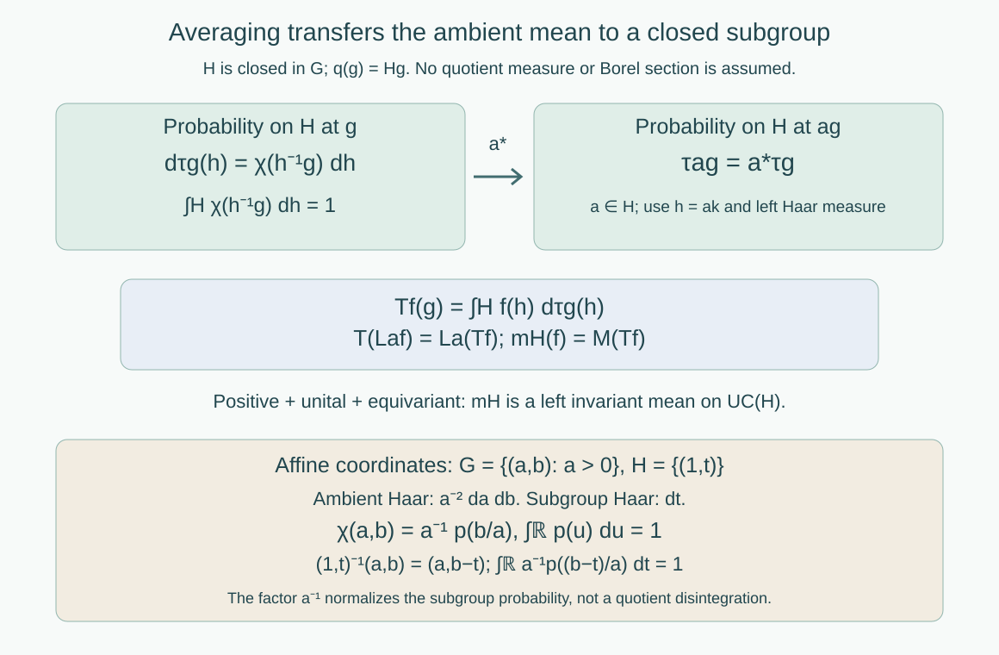

# Closed subgroups and continuous averaging

*Written by GPT-6.1 Sol (OpenAI), Ultra, September 2026. Author self-check in progress; not independently reviewed. New original text is public domain (CC0).*

## Introduction

An invariant mean on a group should give an invariant mean on a closed subgroup. Restriction of measurable functions is insufficient: the subgroup may have ambient Haar measure zero, so an ambient measurable class has no well-defined restriction there. A continuous averaging kernel gives the required transfer and works for every locally compact Hausdorff group, including groups without a countable base.

Read [Haar averages and compact translation control](haar-averages-and-compact-translation-control.md), Lemma 0.1 and Theorem 1.2. We use Haar measure and its positive mass on nonempty open sets, compactness, and continuous compactly supported bump functions on locally compact Hausdorff spaces. The bump-function fact follows from the Urysohn lemma on a compact Hausdorff neighborhood. We give the needed quotient and locally finite partition construction explicitly. A mean is a bounded positive unital functional; it need not be normal.

Throughout, \(H\) is a closed subgroup of a locally compact Hausdorff group \(G\). Use left Haar measure \(dh\) on \(H\), independently of left Haar measure on \(G\). Write
\[
Q=H\backslash G,\qquad q(g)=Hg.
\tag{0.1}
\]
These are right cosets \(Hg\), or equivalently the orbits for left multiplication by \(H\). No invariant measure on \(Q\) is assumed or needed.

## 1. A continuous probability kernel along each coset

**Lemma 1.1.** The quotient \(Q\) is locally compact Hausdorff, and \(q\) is open. It is a disjoint union of clopen sigma-compact subspaces. Every open cover of \(Q\) has a subordinate locally finite continuous partition of unity with compact supports.

*Proof.* If \(U\subset G\) is open, then \(q^{-1}(q(U))=HU\) is open, so \(q\) is open. The relation of belonging to the same right coset is closed: \(q(g)=q(k)\) means \(kg^{-1}\in H\). For two inequivalent points, closedness gives neighborhoods \(U,V\) with no equivalent pair in \(U\times V\). Then \(q(U),q(V)\) are disjoint open neighborhoods. Thus \(Q\) is Hausdorff. The image of a compact neighborhood of \(g\) is compact and contains an open neighborhood of \(q(g)\), proving local compactness.

Choose a sigma-compact open subgroup \(K\subset G\), as in the Haar lesson. The sets \(q(gK)\) are the orbits of the right \(K\)-action on \(Q\). They partition \(Q\), are open because \(gK\) is open, and hence are clopen. Each is a continuous image of the sigma-compact space \(gK\), so is sigma-compact.

Here is the partition construction on one such component \(Y\). Choose compact sets \(C_n\) with \(C_n\subset\operatorname{int}C_{n+1}\) and \(Y=\bigcup_n\operatorname{int}C_n\), setting \(C_n=\varnothing\) for \(n\leq0\). Such an exhaustion follows by repeatedly covering each compact in a sigma-compact exhaustion, together with the preceding compact, by finitely many relatively compact neighborhoods. For each compact annulus \(C_n\setminus\operatorname{int}C_{n-1}\), choose finitely many small neighborhoods whose closures lie both in a member of the given cover and in
\[
\operatorname{int}C_{n+1}\setminus C_{n-2}.
\tag{1.1}
\]
Choose a nonnegative compactly supported bump function for each small neighborhood, positive on a still smaller neighborhood, with support in the indicated cover member and region (1.1). Finitely many of the smaller neighborhoods cover the annulus. These functions are locally finite: near a point of \(\operatorname{int}C_m\), all terms with \(n>m+2\) vanish, and there are only finitely many terms for each of the remaining finitely many \(n\). Their sum is continuous and strictly positive, since the annuli cover \(Y\). Divide each function by the sum. The result is the required partition on \(Y\). Extend its functions by zero to \(Q\). Doing this on each clopen component gives a locally finite partition on all of \(Q\), even when there are uncountably many components. \(\square\)

**Lemma 1.2 (normalized cutoff).** There is a continuous nonnegative function \(\chi:G\to[0,\infty)\) such that
\[
\int_H\chi(h^{-1}g)\,dh=1\quad(g\in G).
\tag{1.2}
\]
For every compact \(C\subset Q\), the set
\[
\operatorname{supp}\chi\cap q^{-1}(C)
\quad\text{is compact in }G.
\tag{1.3}
\]

*Proof.* For \(\psi\in C_c(G)_+\), define
\[
\beta_\psi(g)=\int_H\psi(h^{-1}g)\,dh.
\tag{1.4}
\]
This is continuous. Indeed, for \(g\) in a compact neighborhood \(D\), the integrand is supported in the fixed compact set \(H\cap D(\operatorname{supp}\psi)^{-1}\). Continuity on the resulting compact product gives uniform control of the integrand as \(g\) varies near any fixed point. Its integral therefore varies continuously. This argument uses finite Haar measure on that compact set, not a countable base.

For \(a\in H\), substitution \(h=ak\) gives \(\beta_\psi(ag)=\beta_\psi(g)\). Hence \(\beta_\psi\) descends to a continuous function on \(Q\). The positive sets \(U_\psi=\{q(g):\beta_\psi(g)>0\}\) cover \(Q\): choose a bump \(\psi\) positive at any prescribed \(g\); its integrand is positive for \(h\) in an identity neighborhood of \(H\), which has positive Haar measure.

Use Lemma 1.1 to choose a locally finite partition \((\eta_i)\) subordinate to this cover, with each \(\operatorname{supp}\eta_i\subset U_{\psi_i}\). Set
\[
\chi(g)=\sum_i
\frac{\eta_i(q(g))\psi_i(g)}{\beta_{\psi_i}(g)},
\tag{1.5}
\]
where a summand is zero wherever its numerator's quotient factor vanishes and its denominator is zero. Each summand is continuous: the support of \(\eta_i\) lies inside the positive-denominator set, so it vanishes in a neighborhood of every quotient point outside that set. The sum is locally finite through \(q\), and therefore continuous and nonnegative.

Along \(h^{-1}g\), both \(q(g)\) and \(\beta_{\psi_i}(g)\) are unchanged. Only finitely many quotient factors are nonzero at this quotient point. Integrating (1.5) thus gives
\[
\int_H\chi(h^{-1}g)\,dh
=\sum_i\eta_i(q(g))=1.
\]
For a compact \(C\subset Q\), local finiteness leaves only finitely many supports \(\operatorname{supp}\eta_i\) meeting \(C\). On \(q^{-1}(C)\), the support of \(\chi\) is consequently contained in the finite union of the corresponding compact \(\operatorname{supp}\psi_i\). It is a closed subset of that union, since \(C\) and \(\operatorname{supp}\chi\) are closed. This proves (1.3). \(\square\)

The function \(\chi\) need not be compactly supported on all of \(G\). It has the compactness required when the coset variable stays in a compact set. Its normalization uses subgroup Haar measure; it is not a density for a quotient disintegration of ambient Haar measure.

## 2. Transferring a mean to the closed subgroup

For \(g\in G\), define the probability measure on \(H\)
\[
d\tau_g(h)=\chi(h^{-1}g)\,dh.
\tag{2.1}
\]
For a bounded continuous function \(f\) on \(H\), set
\[
(Tf)(g)=\int_Hf(h)\,d\tau_g(h).
\tag{2.2}
\]

**Theorem 2.1.** The map \(T:C_b(H)\to C_b(G)\) is positive, unital, linear, and contractive. It satisfies
\[
T(L_a^Hf)=L_a^G(Tf)\qquad(a\in H).
\tag{2.3}
\]
Consequently every closed subgroup of an amenable locally compact Hausdorff group is amenable, with no countability assumption.

*Proof.* Equation (1.2) makes each \(\tau_g\) a probability, so positivity, linearity, \(T1=1\), and \(\|Tf\|_\infty\leq\|f\|_\infty\) follow immediately.

To prove continuity, let \(g\) vary in a compact neighborhood \(D\). The set \(q(D)\) is compact. Equation (1.3) gives a compact set \(B=\operatorname{supp}\chi\cap q^{-1}(q(D))\). If \(\chi(h^{-1}g)\ne0\), then \(h^{-1}g\in B\), hence \(h\in H\cap DB^{-1}\), a fixed compact set. On this set the continuous integrand \(f(h)\chi(h^{-1}g)\) varies uniformly continuously in the parameter near any fixed \(g\). Integration over its finite Haar measure proves continuity of \(Tf\).

For \(a\in H\), left Haar substitution \(h=ak\) gives
\[
\begin{aligned}
T(L_a^Hf)(g)
&=\int_Hf(a^{-1}h)\chi(h^{-1}g)\,dh\\
&=\int_Hf(k)\chi(k^{-1}a^{-1}g)\,dk
=Tf(a^{-1}g).
\end{aligned}
\tag{2.4}
\]
This is (2.3). Equivalently \(\tau_{ag}=a_*\tau_g\). No Haar modular factor appears in this substitution because it is left translation on \(H\).

Let \(M\) be a left invariant mean on \(L^\infty(G)\). A bounded continuous function gives a canonical ambient Haar class; this inclusion is faithful because a nonzero continuous function is nonzero on an open set of positive Haar measure. Define
\[
m_H(f)=M(Tf),\qquad f\in\mathrm{UC}(H).
\tag{2.5}
\]
It is a positive unital functional, and (2.3) and the left invariance of \(M\) make it left invariant on \(H\). Theorem 1.2 of the Haar lesson applies to arbitrary locally compact \(H\), and produces a left invariant mean on \(L^\infty(H)\). Thus \(H\) is amenable. \(\square\)

*Figure 1. Equations (2.1)–(2.5) transfer the ambient mean using continuous functions. The affine coordinates in Example 3.2 show the normalization against \(dt\) on the translation subgroup; they do not assert a quotient-measure formula. Compare Takesaki III, Example XIII.4.4(iii).*

## 3. Coordinates, null subgroups, and a source identity

**Example 3.1 (a Haar-null subgroup).** Take \(G=\mathbb R^2\) and \(H=\mathbb R\times\{0\}\), with their usual Haar measures. If \(p\in C_c(\mathbb R)_+\) has integral one, then
\[
\chi(x,y)=p(x),\qquad
Tf(x,y)=\int_{\mathbb R}f(t)p(x-t)\,dt.
\tag{3.1}
\]
The cutoff is normalized and has compact support over each compact set of cosets, parametrized by the vertical coordinate \(y\); the cosets themselves are horizontal lines. Ambient \(\mathbf1_H\) is the zero Haar class, whereas its pointwise restriction to \(H\) is one. This shows why restriction of ambient measurable classes cannot be the transfer map. The continuous map \(T\) is unital and well defined.

**Example 3.2 (the nonunimodular affine group).** Let
\[
G=\{(a,b):a>0,\ b\in\mathbb R\},\qquad
(a,b)(a',b')=(aa',b+ab'),
\]
and let \(H=\{(1,t):t\in\mathbb R\}\). Ambient left Haar measure is \(a^{-2}\,da\,db\), while subgroup left Haar measure is \(dt\). For the same density \(p\), choose
\[
\chi(a,b)=a^{-1}p(b/a).
\tag{3.2}
\]
Since \((1,t)^{-1}(a,b)=(a,b-t)\),
\[
\int_{\mathbb R}a^{-1}p((b-t)/a)\,dt=1,
\qquad
Tf(a,b)=\int_{\mathbb R}f(t)a^{-1}p((b-t)/a)\,dt.
\tag{3.3}
\]
The factor \(a^{-1}\) is essential: without it the integral would be \(a\). Over a compact set of cosets, \(a\) is bounded above and away from zero, and the support of \(p\) bounds \(b/a\); this gives (1.3). Translation by \((1,c)\) changes \(b\) to \(b+c\), and (2.3) is exactly ordinary translation of the kernel in \(t\). The affine group's modular function \(\Delta_G(a,b)=a^{-1}\) is a separate ambient Haar fact; the subgroup substitution in (2.4) is left invariant without an extra scalar.

**Example 3.3 (a group without a countable local base).** Let \(G=\mathbb T^I\) for an uncountable index set \(I\), and let \(H\) be the diagonal circle. This subgroup is closed and isomorphic to \(\mathbb T\), and \(G\) is compact by the product compactness theorem. It has no countable local base: any proposed countable family of basic identity neighborhoods restricts only countably many coordinates; an untouched coordinate cannot be controlled by that family. Normalize Haar measure on \(H\). The function \(\chi=1\) satisfies (1.2), and (1.3) follows from compactness of \(G\). Here \(Tf\) is the constant Haar average of \(f\). No metrizable quotient or Borel selector is part of this construction.

In the source's separable cross-section proof, a selected representative \(r(Hg)\) leads to
\[
\rho(g)=g\,r(Hg)^{-1}\in H.
\tag{3.4}
\]
The exact identity is
\[
\rho(hg)=h\rho(g)\qquad(h\in H).
\tag{3.5}
\]
Indeed \(Hhg=Hg\), so the representative is unchanged. The printed formula on page 63 omits this leading \(h\); its subsequent intertwining formula requires (3.5). This is a directly checked correction. At a scope where the Borel section exists, canonical continuous functions on \(H\) may be pulled back along \(\rho\). Theorem 2.1 supplies the full locally compact result through averaging, with no section hypothesis.

## 4. Exercises with solutions

Level 1 asks for a computation or a direct application. Level 2 asks for a proof using the lesson’s framework. Level 3 combines results or examines a hypothesis whose failure changes the conclusion.

**Exercise 4.1 (which Haar measure normalizes the cutoff).** *Level 1.* For the affine example, compute the integral along \(H\) of \(p((b-t)/a)\), and of \(a^{-1}p((b-t)/a)\). Explain why using ambient density \(a^{-2}\) as the normalization factor would fail.

*Solution.* Substitution \(u=(b-t)/a\) gives the first integral \(a\int p=a\) and the second one. The integration variable belongs to \(H\), whose Haar measure is \(dt\). The density \(a^{-2}\) would give mass \(a^{-1}\), rather than one. Ambient Haar measure and the subgroup probability kernel serve different purposes.

**Exercise 4.2 (why compact quotient control is enough).** *Level 2.* Derive the common compact integration domain in the continuity proof of Theorem 2.1. Does the argument require that \(H\), \(G\), or \(Q\) be sigma-compact?

*Solution.* On a compact neighborhood \(D\) of the parameter, \(q(D)\) is compact. Property (1.3) makes \(B=\operatorname{supp}\chi\cap q^{-1}(q(D))\) compact. For a nonzero integrand, \(h^{-1}g\in B\), so \(h\in H\cap DB^{-1}\). This is closed in a compact set and hence compact. Its Haar measure is finite, and the continuous integrand varies uniformly on it near each parameter. None of the three spaces needs to be sigma-compact. Sigma-compact components were used to construct a partition locally; an arbitrary number of clopen components is allowed.

**Exercise 4.3 (a section's covariance).** *Level 1.* Suppose \(r:H\backslash G\to G\) is a section and define \(\rho\) by (3.4). Prove (3.5) and then verify \((L_hf)\circ\rho=L_h(f\circ\rho)\). Why would \(\rho(hg)=\rho(g)\) give the wrong conclusion?

*Solution.* Since \(Hhg=Hg\),
\(\rho(hg)=hg\,r(Hg)^{-1}=h\rho(g)\).
Thus \(\rho(h^{-1}g)=h^{-1}\rho(g)\), and both sides of the asserted function identity equal \(f(h^{-1}\rho(g))\). If \(\rho\) were invariant instead, its pullbacks would be fixed by all left \(H\)-translations, rather than intertwining arbitrary translations of \(f\). A nonconstant \(f\) would contradict the claimed intertwining.

**Exercise 4.4 (an injective homomorphism is insufficient).** *Level 3.* Show that the discrete free group \(F_2\) admits a continuous injective homomorphism into a compact group, although it is not amenable. Give the finite permutation construction, and identify the topological hypothesis in Theorem 2.1 that prevents a contradiction.

*Solution.* For each nonidentity reduced word \(w=t_n\cdots t_1\) in generators \(a,b\) and their inverses, draw a path through vertices \(0,\ldots,n\), traversing edge \(i-1\to i\) with label \(t_i\). An \(a\)-edge prescribes the generator permutation \(A(i-1)=i\); an \(a^{-1}\)-edge prescribes \(A(i)=i-1\), and likewise for \(B\). For each generator these prescriptions give a partial injection: the only possible repeated domain or repeated range at a shared vertex would come from adjacent inverse letters, which reducedness excludes. Complete each partial injection to a permutation of the finite vertex set by matching the unused domains and ranges. The resulting homomorphism into a finite symmetric group sends \(w\) to a permutation taking zero to \(n\), so does not kill it.

Enumerate the nonidentity words and take the product of these finite homomorphisms. It is an injective homomorphism \(\iota:F_2\to\prod_j S_{n_j+1}\), continuous for the discrete topology on \(F_2\). Its image closure \(K\) is a compact metrizable group and is amenable by normalized Haar measure. The image is not discrete in its subspace topology: the kernel of any finite list of coordinates has finite index in the infinite group and contains nonidentity elements. Choosing such an element for each initial coordinate list gives \(\iota(g_j)\to1\). It is also not closed: an infinite compact group cannot be countable, since the Baire theorem would give an open singleton and then make the compact group discrete and finite. The image is countable and \(K\) is infinite. Thus \(\iota\) is not a topological embedding of the discrete group as a closed subgroup. The hereditary theorem uses the subgroup topology, not merely a continuous injective homomorphism. The nonamenability of discrete \(F_2\) is proved in the discrete means lesson.

**Exercise 4.5 (normal extension at full topological scope).** *Level 2.* Let \(H\) be closed and normal. Using the present theorem and the Haar lesson's fixed-point criterion, prove that \(G\) is amenable exactly when both \(H\) and \(G/H\) are amenable, without a countable-base hypothesis.

*Solution.* If \(G\) is amenable, Theorem 2.1 gives amenability of \(H\), and pullback of continuous uniformly continuous functions from \(G/H\) gives an invariant quotient mean. Conversely take any compact convex separately continuous affine \(G\)-action. Amenability of \(H\) gives a nonempty compact convex fixed set. Normality makes it \(G\)-invariant. The action factors through \(G/H\); its orbit maps are continuous because the quotient map is open, and its individual transformations are continuous. The quotient's fixed-point property therefore gives a \(G\)-fixed point. The fixed-point criterion gives amenability of \(G\).

**Exercise 4.6 (changing subgroup Haar normalization).** *Level 2.* Replace \(dh\) by \(c\,dh\), \(c>0\). How should \(\chi\) change, and what happens to \(\tau_g\), \(T\), and the transferred mean?

*Solution.* Replace \(\chi\) by \(c^{-1}\chi\). Its fibre integral against \(c\,dh\) is still one. Equation (2.1) gives exactly the same probability measure \(\tau_g\), so (2.2) gives the same map \(T\) and (2.5) the same mean. The support property and covariance are unchanged. In the normalized-cutoff construction each \(\beta_\psi\) is multiplied by \(c\), which automatically divides \(\chi\) by \(c\).

## References

- [Takesaki] Masamichi Takesaki, *Theory of Operator Algebras III*, Encyclopaedia of Mathematical Sciences 127, Springer, 2003. Example XIII.4.4(ii)–(iii). [Publisher record](https://doi.org/10.1007/978-3-662-10453-8).
