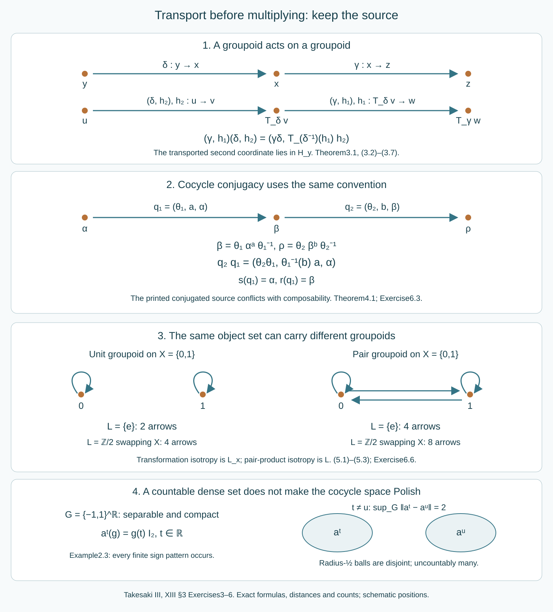

# Cocycle groupoids and semidirect products

*Written by GPT-6.1 Sol (OpenAI), Ultra, October 2026. Self-checked by the writing AI. New original text is public domain (CC0).*

## Introduction

A unitary cocycle changes an action by an inner perturbation. An automorphism can then change its coordinates. These two operations compose, but their order determines which cocycle must be transported before multiplication. A semidirect-product groupoid records that order together with the source and range of every arrow. Read [Groupoids and measured orbit relations](groupoids-and-measured-orbit-relations.md), Sections 1–4, for the algebraic unit, inverse, endpoint and homomorphism conventions; these algebraic arguments require no measure or countability.

We prove the cocycle groupoid, the general semidirect-product construction, its topology and Borel structure, and the automorphism example. The construction retains arbitrary isotropy and arbitrary groupoid fibres. It does not require a measure, freeness, ergodicity, hyperfiniteness or a group splitting.

Takesaki III, XIII section 3 Exercises 3–6 motivate these results. The printed source map in Exercise 4 is incompatible with its printed multiplication. Exercise 6 also cites the pair groupoid where its final transformation-groupoid assertion requires the unit groupoid. Sections 4–5 give exact corrections and counterexamples. The Polish assertion for the function spaces additionally needs explicit countability hypotheses: we prove it for a second countable locally compact group and a factor with separable predual, and distinguish it from the unrestricted topological construction. Section 2 gives a separable compact group and a finite-dimensional factor for which the prescribed cocycle topology is not Polish. Ordinary separability alone, even the chapter's standing group hypothesis, does not imply the asserted Polishness.

The exact [automorphism Polish-group proof](ancillary-actions-and-unitary-corrections.md#1-automorphisms-as-a-polish-group) supplies the factor prerequisite, using the already compared standard-form implementation theorem. The [strong/adjoint unitary metric](normalizers-phases-and-orbit-cocycles.md#5-closed-geometric-symmetries) supplies its complete unitary metric. General standard-form theory belongs to the modular course and is not proved here. The function-space, cocycle and groupoid arguments below are proved here.

*Figure 1. The first panel records the exact source-coordinate transport in Theorem 3.1. The second gives the exact automorphism/cocycle product in Theorem 4.1. The third compares two discrete groupoids on the same two-point object set. The last records the compact-open distance separating the coordinate characters of a separable compact group. Arrow lengths and box positions are schematic; the displayed source, range, transport, multiplication, distances and counts are exact. Reproducible source: make_semidirect_figure.py.*

## 1. Compact-open function spaces and moving automorphisms

Let \(M\) be a factor with separable predual. Put \(U=\mathcal U(M)\), with the sigma-strong-star topology, and \(P=\operatorname{Aut}(M)\), with pointwise norm convergence on \(M_*\). The prerequisite identifies \(P\) with the closed group of canonical standard-form implementers on a separable Hilbert space. It also identifies the topology on \(U\) with strong convergence of the unitaries and their adjoints in that representation. Both are Polish groups.

**Lemma 1.1 (joint evaluation).** The map \(P\times U\to U\), \((\theta,u)\mapsto\theta(u)\), is continuous. The map \(U\to P\), \(u\mapsto\operatorname{Ad}u\), is continuous.

*Proof.* Write \(V_\theta\) for the canonical implementer. If \(\theta_i\to\theta\) and \(u_i\to u\), then \(V_{\theta_i}\), \(V_{\theta_i}^*\), \(u_i\) and \(u_i^*\) converge strongly. Products of uniformly bounded strongly convergent operators converge strongly: apply the difference of a product to a vector and insert one intermediate product. Thus \(V_{\theta_i}u_iV_{\theta_i}^*\to V_\theta uV_\theta^*\), as do the adjoints. These are precisely \(\theta_i(u_i)\) and \(\theta(u)\). This proof works for nets. The canonical implementer of \(\operatorname{Ad}u\) is \(uJuJ\). The same bounded-product argument proves the second assertion. \(\square\)

The joint-evaluation proof also applies to an arbitrary factor, with a possibly nonseparable standard-form Hilbert space, under the exact general canonical-implementation prerequisite. It uses nets and bounded operators, not a countable basis. In that case \(U,P\) are still Hausdorff topological groups; their Polishness is not asserted. The prerequisite describes convergence of both predual maps and their inverses. This agrees with the one-map formulation: for surjective linear isometries \(A_i\to A\) pointwise in norm,
\[
\|A_i^{-1}\varphi-A^{-1}\varphi\|
=\|\varphi-A_iA^{-1}\varphi\|\longrightarrow0.
\]
Apply this to the predual maps of automorphisms. The general standard-form result supplies the topology identification; it is used explicitly rather than extending a separable metric argument by assertion.

For a locally compact Hausdorff space \(L\) and a metrizable space \(Y\), give \(C(L,Y)\) the compact-open topology, generated by the sets \([K,V]=\{f:f(K)\subset V\}\), with \(K\) compact and \(V\) open. It is the topology of uniform convergence on compact sets for any compatible metric on \(Y\). To see this, \(f(K)\) is compact, so its distance from the complement of an open \(V\) containing it is positive. Conversely, cover a compact \(K\) by finitely many neighbourhoods on which \(f\) varies by less than one third of a proposed uniform tolerance, and use compact neighbourhoods inside them. Requiring the other map's values on each compact neighbourhood to lie in the corresponding metric ball gives the uniform tolerance.

**Lemma 1.2 (Polish mapping spaces).** If \(L\) is second countable and locally compact Hausdorff, and \(Y\) is Polish, then \(C(L,Y)\) is Polish in this topology.

*Proof.* Choose a countable relatively compact open base \(B_i\). Such a base is obtained by refining a countable base inside compact neighbourhoods, using local compactness and regularity. Finite unions of the \(\overline{B_i}\) give increasing compact sets \(K_n\) whose interiors cover \(L\). Every compact subset of \(L\) is contained in one \(K_n\). Let \(d\leq1\) be a compatible complete metric on \(Y\), and set
\[
D(f,h)=\sum_{n\geq1}2^{-n}\sup_{x\in K_n}d(f(x),h(x)).
\tag{1.1}
\]
This metric induces uniform convergence on compact sets. A \(D\)-Cauchy sequence converges uniformly on every \(K_n\), since \(Y\) is complete. The limits agree on overlaps. They define a continuous map on \(L\), because each point has a neighbourhood inside some \(K_n\). Uniform convergence on the finitely many first compact sets, followed by the summable tail bound, proves convergence in \(D\). Hence \(D\) is complete.

It remains to prove separability, not merely metrizability. Let \(V_j\) be a countable base of \(Y\). Finite intersections of \([\overline{B_i},V_j]\) form a countable neighbourhood base for \(C(L,Y)\). Indeed, given \(f\in[K,V]\), each \(x\in K\) has an open neighbourhood with compact closure whose \(f\)-image lies in a suitable basic \(V_j\subset V\). Refine to a \(B_i\) containing \(x\) with its closure still in that neighbourhood. Finitely many cover \(K\); the corresponding intersection contains \(f\) and is contained in \([K,V]\). Apply this argument to finite intersections of the original subbasic neighbourhoods. Thus the space is second countable. Choosing one map in each nonempty basic open set gives a countable dense set. Together with completeness, this proves Polishness. \(\square\)

A continuous map \(F:Y_1\times Y_2\to Y_3\) acts continuously on compact-open mapping spaces by pointwise application. To prove this at fixed \(f_1,f_2\) on a compact \(K\), their joint image is compact. Cover that image by finitely many product neighbourhoods on which \(F\) varies by less than a given tolerance. Shrink these neighbourhoods slightly and use uniform closeness to keep the varying maps in them. This proves uniform convergence of their images on \(K\). The same argument applies to joint evaluation when an automorphism is a parameter constant on \(K\).

This continuity assertion also holds for the possibly nonmetrizable target groups just described. Given \(F(f_1,f_2)(K)\subset V\) with \(V\) open, at each \(x\in K\) choose open \(A_x,B_x\) with \(F(A_x\times B_x)\subset V\), and a compact neighbourhood \(C_x\) of \(x\) with \(f_1(C_x)\subset A_x\), \(f_2(C_x)\subset B_x\). Finitely many interiors cover \(K\). Requiring the varying maps to belong to every \([C_x,A_x]\) and \([C_x,B_x]\) keeps their pointwise image in \([K,V]\). For a constant parameter, intersect its finitely many parameter neighbourhoods. Thus none of the topological groupoid conclusions below depends on metrizability of the factor's groups.

We also explain why Borel cocycles do not enlarge the spaces used below. A Borel homomorphism from a locally compact Hausdorff group to a separable metrizable group is continuous. Here is the required category argument. Borel sets have the Baire property: sets differing from open sets by meagre sets form a sigma-algebra containing the open sets. A locally compact Hausdorff group and each of its nonempty open subsets are Baire. One proof recursively chooses relatively compact open sets with nested compact closures avoiding the successive nowhere dense sets; the finite intersection property in the first compact closure supplies a point in every required dense open set.

If a Baire-property set \(A\) is nonmeagre, it agrees with a nonempty open \(O\) off a meagre set. For every sufficiently small \(h\), \(O\cap Oh^{-1}\) is nonempty and open. The complement of \(A\cap Ah^{-1}\) in that intersection is meagre, so the intersection meets \(A\cap Ah^{-1}\). Hence \(h\in A^{-1}A\). Now let \(q:L\to Q\) be a Borel homomorphism. Given a neighbourhood \(V\) of 1 in \(Q\), choose an open symmetric \(W\) with \(W^{-1}W\subset V\). Countably many left translates \(p_jW\) cover \(Q\). The Borel inverse images \(A_j\) cover \(L\), so one is nonmeagre. The preceding argument gives a neighbourhood of 1 inside \(A_j^{-1}A_j\subset q^{-1}(V)\). This proves continuity at 1 and therefore everywhere.

In particular, \(U\rtimes P\), with product \((u,\theta)(v,\psi)=(u\theta(v),\theta\psi)\), is a Polish topological group by Lemma 1.1 and the product Polish topology. If \(\alpha:L\to P\) is a continuous action and \(a:L\to U\) is a Borel normalized \(\alpha\)-cocycle, then \(g\mapsto(a_g,\alpha_g)\) is a Borel homomorphism into this group, so is continuous. This establishes the compact-open interpretation even when the cocycle was initially defined to be Borel.

## 2. The groupoid of inner perturbations

Let \(G\) be a locally compact Hausdorff group and let \(M\) be any factor. Use the general standard-form prerequisite specified in Section 1 for its topological groups \(U,P\). Set
\[
\operatorname{Act}(G,M)=\{\alpha\in C(G,P):\alpha_e=\mathrm{id},\ \alpha_{gh}=\alpha_g\alpha_h\}.
\]
For \(\alpha\) in this space, a normalized continuous unitary cocycle is a map \(a:G\to U\) satisfying
\[
a_e=1,\qquad a_{gh}=a_g\alpha_g(a_h).
\tag{2.1}
\]
Its perturbed action is \(\alpha^a_g=\operatorname{Ad}(a_g)\alpha_g\). Define
\[
\mathcal Z(G,M)=\{(a,\alpha):\alpha\in\operatorname{Act}(G,M),\ a\text{ satisfies }(2.1)\}.
\tag{2.2}
\]

**Theorem 2.1 (cocycle groupoid).** With source \(s(a,\alpha)=\alpha\), range \(r(a,\alpha)=\alpha^a\), unit \((1,\alpha)\) and inverse
\[
(a,\alpha)^{-1}=(a^*,\alpha^a),
\tag{2.3}
\]
this is a topological groupoid. If \(\beta=\alpha^a\), its product is
\[
(b,\beta)(a,\alpha)=(ba,\alpha),\qquad (ba)_g=b_ga_g.
\tag{2.4}
\]
Its arrow and unit spaces are Polish when \(G\) is second countable and \(M_*\) is separable. Neither condition is needed for the algebraic identities or continuity of the structure maps. The earlier Borel-cocycle automatic-continuity assertion uses separability of \(M_*\); at general \(M\), this construction uses continuous cocycles.

*Proof.* The cocycle identity gives
\[
\alpha^a_g\alpha^a_h
=\operatorname{Ad}(a_g\alpha_g(a_h))\alpha_{gh}
=\alpha^a_{gh}.
\]
Thus \(\alpha^a\) is an action. If \(b\) is a \(\beta\)-cocycle, then
\[
b_{gh}a_{gh}
=b_g\beta_g(b_h)a_g\alpha_g(a_h)
=b_ga_g\alpha_g(b_ha_h).
\tag{2.5}
\]
So \(ba\) is an \(\alpha\)-cocycle, and \(\alpha^{ba}=(\alpha^a)^b\). Also
\[
a_{gh}^*=\alpha_g(a_h^*)a_g^*
=a_g^*\alpha^a_g(a_h^*).
\]
This makes \(a^*\) an \(\alpha^a\)-cocycle, whose perturbation returns \(\alpha\). Formula (2.3) is therefore a two-sided inverse. Formula (2.4) is associative because pointwise unitary multiplication is associative; the intervening action is exactly the range of the preceding arrow. Constant cocycles 1 are the required two-sided units.

For the topology, \(\operatorname{Act}(G,M)\) is closed in \(C(G,P)\): each normalization and multiplication identity is a closed condition at its specified group elements. The cocycle conditions likewise make \(\mathcal Z\) closed in \(C(G,U)\times C(G,P)\), using Lemma 1.1. This remains a closed intersection even before either countability assumption. Lemma 1.2 and the separable-factor group proofs give the Polish claims when both conditions hold. All structure maps are continuous by the compact-neighbourhood argument in Section 1. In particular, the varying action in the range map and the inverse must be included; neither operation keeps \(\alpha\) fixed in general. The topology on \(C(G,U)\) is exactly the relative compact-open topology from the sigma-strong-star topology of \(M\), so the stated topology agrees with the source's intended unitary topology. \(\square\)

Here a topological groupoid means that its source, range, unit, inverse and multiplication maps are continuous, with multiplication on its composable-pair subspace. A Polish groupoid has Polish arrow and unit spaces with these maps. We make no additional open-source hypothesis part of this definition.

**Example 2.2 (why unrestricted local compactness is insufficient).** Let \(I\) be uncountable, let \(G=\bigoplus_{i\in I}\mathbb Z/2\mathbb Z\) be discrete, and let \(M=M_2(\mathbb C)\). For every \(\varepsilon\in\{1,-1\}^I\), define
\[
a_\varepsilon(g)=\prod_{i\in\operatorname{supp}(g)}\varepsilon_i\,1_M,
\qquad\alpha_g=\mathrm{id}.
\tag{2.6}
\]
These are continuous unitary cocycles. Compact subsets of a discrete space are finite, so their relative compact-open topology is exactly the product topology on \(\{1,-1\}^I\): evaluating at the generators reads one coordinate, and every finite evaluation reads only finitely many coordinates. This product is not first countable. If it had a countable neighbourhood base at the all-positive point, refine each base member to a basic cylinder; their countably many finite supports leave some \(i\) untested. No refined base member can then fit inside the neighbourhood prescribing \(\varepsilon_i=1\). A subspace of a metrizable space is metrizable and first countable. Consequently \(\mathcal Z(G,M)\) cannot be Polish in the prescribed topology. This is a failure of the unqualified local-compactness assertion, not of Theorem 2.1's topological construction. This discrete example does not meet the chapter's separable-group hypothesis; Example 2.3 below gives a counterexample that does.

**Example 2.3 (a separable compact source still fails).** There is a counterexample even with the chapter's ordinary separable locally compact group hypothesis. Put
\[
G=\{1,-1\}^{\mathbb R}
\tag{2.7}
\]
with coordinatewise multiplication and product topology. It is a compact Hausdorff group. For clarity, product compactness can be checked with ultrafilters: an ultrafilter on \(G\) chooses one sign in each two-point coordinate; every finite-coordinate neighbourhood of the resulting point belongs to the ultrafilter, so it converges. If an open cover had no finite subcover, the complements would extend to an ultrafilter with no limit, a contradiction. This uses the usual ultrafilter extension principle, an explicit set-theoretic background assumption.

It is separable. For each finite union \(V\) of bounded intervals with rational endpoints, let \(g_V(t)=1\) for \(t\in V\), and \(-1\) otherwise. There are countably many such \(g_V\), including the empty union. They meet every nonempty basic cylinder: for finitely many distinct real coordinates and prescribed signs, choose rational intervals around exactly the coordinates requiring the positive sign, avoiding all coordinates requiring the negative sign. Their union gives the desired pattern. Hence this countable family is dense.

For \(M=M_2(\mathbb C)\) and the trivial action, each real \(t\) gives the continuous scalar cocycle \(a^t(g)=g(t)1_M\). If \(t\neq u\), some \(g\) has \(g(t)=1\), \(g(u)=-1\), and therefore
\[
\sup_{g\in G}\|a^t(g)-a^u(g)\|=2.
\tag{2.8}
\]
Because \(G\) itself is compact and the factor finite-dimensional, this is the prescribed compact-open topology. The open uniform balls of radius \(1/2\) about these cocycles are pairwise disjoint, also after restricting to the cocycle groupoid with the trivial action. An uncountable family of nonempty disjoint open sets has no countable dense subset. Thus the arrow space is not separable and cannot be Polish. This directly tests the source's separable-group wording; it does not replace it by an uncountable discrete group.

Separability of the factor is independently relevant. For uncountable \(I\), take \(M=B(\ell^2(I))\), \(G=\mathbb Z\), trivial \(\alpha\), and diagonal sign unitaries \(u_\varepsilon e_i=\varepsilon_i e_i\). The family has exactly the product topology \(\{1,-1\}^I\) in the strong-star topology: a vector's square-summable coordinates have arbitrarily small tails outside finite sets, while evaluation at \(e_i\) detects one sign. Strong-star and sigma-strong-star agree on this bounded family in a faithful normal representation. The cocycles \(a_\varepsilon(n)=u_\varepsilon^n\) have the same relative compact-open topology: reading \(n=1\) is the inverse parameter map and finite integer powers are continuous. Hence this arrow space is not metrizable even though \(G\) is second countable. Both countability conditions in the Polish theorem have a concrete role.

## 3. A groupoid acting on a groupoid

Let \(\mathcal G,\mathcal H\) be groupoids, and let \(\pi:\mathcal H\to\mathcal G^{(0)}\) be onto. Suppose every fibre \(\mathcal H_x=\pi^{-1}(x)\) is a subgroupoid. Let \(T_\gamma:\mathcal H_{s\gamma}\to\mathcal H_{r\gamma}\) be an isomorphism, with \(T_x=\mathrm{id}\) at units and \(T_{\gamma\delta}=T_\gamma T_\delta\) on composable pairs. The unit condition also follows from the composition law and invertibility of \(T_x\), but we state it explicitly. Each \(T_\gamma\) carries units to units, commutes with inverse and preserves source, range and multiplication.

Define the arrow set
\[
\mathcal K=\mathcal G\ltimes_T\mathcal H
=\{(\gamma,h):s\gamma=\pi(h)\}.
\tag{3.1}
\]
Its objects will be the objects \(\mathcal H^{(0)}\), not merely \(\mathcal G^{(0)}\). Because the fibres are subgroupoids, \(\pi(s_{\mathcal H}h)=\pi(r_{\mathcal H}h)=\pi(h)\).

**Theorem 3.1 (full semidirect product).** The structure maps of \(\mathcal K\) are
\[
s(\gamma,h)=s_{\mathcal H}h,
\qquad r(\gamma,h)=T_\gamma(r_{\mathcal H}h),
\tag{3.2}
\]
\[
1_u=(1_{\pi(u)},u),\qquad
(\gamma,h)^{-1}=(\gamma^{-1},T_\gamma(h^{-1})).
\tag{3.3}
\]
Two arrows \((\gamma_1,h_1),(\gamma_2,h_2)\) are composable precisely when \(\gamma_1,\gamma_2\) are composable and \(T_{\gamma_2^{-1}}h_1,h_2\) are composable in \(\mathcal H\). Their product is
\[
(\gamma_1,h_1)(\gamma_2,h_2)
=\bigl(\gamma_1\gamma_2,
T_{\gamma_2^{-1}}(h_1)h_2\bigr).
\tag{3.4}
\]
It is a standard Borel groupoid when all initial groupoids and maps are standard Borel, and a Polish groupoid when they are Polish and all the initial maps and the action are continuous.

*Proof.* Formula (3.2) gives \(s(\gamma_1,h_1)=r(\gamma_2,h_2)\) exactly when
\[
s_{\mathcal H}h_1=T_{\gamma_2}(r_{\mathcal H}h_2).
\tag{3.5}
\]
Applying \(\pi\) first shows \(s\gamma_1=r\gamma_2\). Applying \(T_{\gamma_2^{-1}}\) then shows that \(T_{\gamma_2^{-1}}h_1\) and \(h_2\) are composable. Conversely those two conditions imply (3.5). The fibre of the product in (3.4) is \(s\gamma_2=s(\gamma_1\gamma_2)\), so the resulting pair belongs to \(\mathcal K\). Its source is \(s_{\mathcal H}h_2\), and its range is
\[
T_{\gamma_1\gamma_2}
\bigl(r_{\mathcal H}(T_{\gamma_2^{-1}}h_1)\bigr)
=T_{\gamma_1}(r_{\mathcal H}h_1).
\tag{3.6}
\]
These are the source of the second arrow and range of the first.

For three composable arrows, both associations have first coordinate \(\gamma_1\gamma_2\gamma_3\). Their second coordinates are, respectively,
\[
\bigl(T_{(\gamma_2\gamma_3)^{-1}}h_1\,
T_{\gamma_3^{-1}}h_2\bigr)h_3,
\qquad
T_{(\gamma_2\gamma_3)^{-1}}h_1\,
\bigl(T_{\gamma_3^{-1}}h_2\,h_3\bigr).
\tag{3.7}
\]
Every pair here is composable by (3.5). The two values agree by associativity in \(\mathcal H\). This proves associativity without commuting any factors.

The proposed inverse belongs to \(\mathcal K\), since \(\pi(T_\gamma h^{-1})=r\gamma=s(\gamma^{-1})\). Its source and range are the range and source of the original arrow. Multiplying the arrow by this inverse gives
\[
(1_{r\gamma},T_\gamma(h)T_\gamma(h^{-1}))
=(1_{r\gamma},T_\gamma(r_{\mathcal H}h)),
\]
the unit at its range. Multiplication in the reverse order gives \((1_{s\gamma},h^{-1}h)\), the unit at its source. Formula (3.4) also verifies both unit laws directly, using that every \(T_\gamma\) preserves units. Thus all groupoid axioms hold.

For standard Borel groupoids, the diagonal of \(\mathcal G^{(0)}\) is Borel. The equality \(s\gamma=\pi(h)\) therefore makes (3.1) a Borel subset of the product of two standard Borel spaces, hence a standard Borel space. Unit spaces are Borel fixed sets of the source map, and composability is a Borel equality of source and range. All formulas(3.2)–(3.4) are compositions of the assumed Borel maps on their correct domains. The embedding \(u\mapsto(1_{\pi(u)},u)\) identifies the object space Borel-isomorphically with the units; its inverse reads the second coordinate.

For the Polish case, a unit space is closed in its Hausdorff arrow space: it is the fixed set of the continuous source map regarded as a map into the arrow space. It is therefore Polish. The diagonal in \(\mathcal G^{(0)}\times\mathcal G^{(0)}\) is closed, so (3.1) is closed in the Polish product \(\mathcal G\times\mathcal H\). The composable-pair set is closed for the same reason. The structure maps are continuous by their formulas, and the unit embedding is a homeomorphism onto its image. This proves the full topological assertion, not merely a Borel encoding. \(\square\)

In the special case of a field of groups \(\mathcal H_x=H_x\), the objects of \(\mathcal K\) are \(\mathcal G^{(0)}\). There is a second common coordinate convention: put the loop at the range. The coordinate change is
\[
(\gamma,h)\longmapsto(k,\gamma),\qquad k=T_\gamma h\in H_{r\gamma}.
\tag{3.8}
\]
Transporting (3.4) gives
\[
(k_1,\gamma_1)(k_2,\gamma_2)
=(k_1T_{\gamma_1}(k_2),\gamma_1\gamma_2).
\tag{3.9}
\]
Indeed \(T_{\gamma_1\gamma_2}(T_{\gamma_2^{-1}}h_1\,h_2)=T_{\gamma_1}h_1\,T_{\gamma_1}(T_{\gamma_2}h_2)\). This is the convention in the [stabilizer-field splitting](stabilizer-fields-and-ancillary-splittings.md#2-a-coherent-section-and-a-semidirect-product). The two formulas are the same construction in different coordinates.

## 4. Automorphisms act on the cocycle groupoid

An automorphism \(\theta\in P\) acts on objects by \(\alpha\mapsto\theta\alpha\theta^{-1}\), and on arrows by
\[
\theta\cdot(a,\alpha)
=(\theta(a),\theta\alpha\theta^{-1}),
\qquad \theta(a)_g=\theta(a_g).
\tag{4.1}
\]
This is a groupoid automorphism. Applying \(\theta\) to(2.1) proves the transformed cocycle law; source and range transform by conjugation, since
\[
(\theta\alpha\theta^{-1})^{\theta(a)}
=\theta\alpha^a\theta^{-1}.
\tag{4.2}
\]
It preserves products by \(\theta(b_ga_g)=\theta(b_g)\theta(a_g)\), and preserves inverses by \(\theta(a_g^*)=\theta(a_g)^*\). Formula (4.1) is jointly continuous by Lemma 1.1 and compact-image control.

**Theorem 4.1 (cocycle conjugacy groupoid).** The semidirect product \(P\ltimes\mathcal Z(G,M)\) has arrows \((\theta,a,\alpha)\), objects \(\operatorname{Act}(G,M)\), and
\[
s(\theta,a,\alpha)=\alpha,
\qquad r(\theta,a,\alpha)=\theta\alpha^a\theta^{-1}.
\tag{4.3}
\]
If \(\beta=\theta_1\alpha^a\theta_1^{-1}\), then
\[
(\theta_2,b,\beta)(\theta_1,a,\alpha)
=(\theta_2\theta_1,\theta_1^{-1}(b)a,\alpha).
\tag{4.4}
\]
The inverse is
\[
(\theta,a,\alpha)^{-1}
=(\theta^{-1},\theta(a^*),\theta\alpha^a\theta^{-1}).
\tag{4.5}
\]
It is a topological groupoid for every locally compact Hausdorff \(G\) and every factor \(M\), under the stated general standard-form prerequisite. It is Polish when \(G\) is second countable and \(M_*\) is separable. An arrow records first the cocycle perturbation, then the coordinate conjugation.

*Proof.* Apply Theorem 3.1 to the group \(P\), viewed as a one-object groupoid, acting on the entire groupoid \(\mathcal Z\) by (4.1). Its only fibre is \(\mathcal Z\). Formulas (3.2)–(3.4) give exactly (4.3)–(4.5). In particular, the second cocycle is transported by \(\theta_1^{-1}\), and its action becomes \(\theta_1^{-1}\beta\theta_1=\alpha^a\), so it is composable with \(a\) in \(\mathcal Z\). The range of the product is \(\theta_2\beta^b\theta_2^{-1}\), as required. All algebraic and topological conclusions follow at the stated scope. \(\square\)

The printed Exercise 4 source is instead \(\theta\alpha\theta^{-1}\). This conflicts with its own composability condition and product. A finite example proves the conflict. Take \(G=\mathbb Z/2\mathbb Z\), \(M=M_3(\mathbb C)\), \(\alpha_1=\operatorname{Ad}P_{(01)}\), \(\theta=\operatorname{Ad}P_{(12)}\), and \(a_g=1\). Here \(P_\sigma e_j=e_{\sigma(j)}\). Then \(\beta=\theta\alpha\theta^{-1}\) has generator \(\operatorname{Ad}P_{(02)}\), so \(\beta\neq\alpha\), for example by their different images of the diagonal projection onto \(e_1\). The printed product declares \((\theta,1,\alpha)\) composable on the right with the unit \((\mathrm{id},1,\alpha)\). Its printed source is \(\beta\), whereas that unit's range is \(\alpha\). This violates the source/range criterion for composability. Formula (4.3)'s source \(\alpha\) repairs the contradiction and retains the printed multiplication formula.

## 5. Unit groupoids and pair groupoids give different products

The **unit groupoid** \(\mathbf1_X\) has one arrow \(1_x\) at each \(x\in X\), and no arrows between distinct points. We identify its arrow and object spaces with \(X\). An action of a group \(L\) on \(X\) acts on this groupoid, and Theorem 3.1 gives
\[
L\ltimes\mathbf1_X=L\times X,
\quad s(g,x)=x,\quad r(g,x)=gx,
\quad(g,hx)(h,x)=(gh,x).
\tag{5.1}
\]
Its inverse is \((g^{-1},gx)\). Thus it is precisely the labelled transformation groupoid, with stabilizer \(L_x\) at \(x\). The product and Borel/topological structure agree, without a countability, measure or freeness restriction on the algebraic assertion.

The **pair groupoid** has arrow space \(X\times X\), with \((x,y):y\to x\), and product \((z,y)(y,x)=(z,x)\). It is Example 3.2(i) in the source. A group action on \(X\) acts diagonally on this groupoid. Its semidirect product has arrows \((g,x,y)\), source \(y\), range \(gx\), and
\[
(g_1,x_1,y_1)(g_2,x_2,y_2)
=(g_1g_2,g_2^{-1}x_1,y_2),
\qquad y_1=g_2x_2.
\tag{5.2}
\]
This follows by transporting \((x_1,y_1)\) with \(g_2^{-1}\) before multiplying it by \((x_2,y_2)\). The coordinate change
\[
(g,x,y)\longmapsto(g,gx,y)
\tag{5.3}
\]
identifies it with \(L\times(X\times X)\), whose product is \((g_1,z,y)(g_2,y,x)=(g_1g_2,z,x)\). Its inverse coordinate change is \((g,z,y)\mapsto(g,g^{-1}z,y)\); both respect every structure map and are continuous or Borel whenever the action is. Every object's isotropy is now the whole group \(L\), rather than merely its stabilizer on \(X\).

Even with the trivial group and a two-point \(X\), the unit groupoid has two arrows and the pair groupoid has four. They cannot be interchangeable. Exercise 6's final transformation-groupoid statement is valid with \(\mathbf1_X\); its reference to Example 3.2(i) must be changed to that unit groupoid. The first assertion of Exercise 6, consistency with the automorphism semidirect product, is exactly Theorem 4.1's application of the full Theorem 3.1.

## 6. Exercises with complete solutions

Level 1 is a calculation, level 2 a proof using the construction, and level 3 a combined argument or a hypothesis check.

**Exercise 6.1 (a noncommuting cocycle product).** *Level 2.* For \(G=\mathbb Z\), \(M=M_3(\mathbb C)\) and the trivial action \(\alpha\), let \(a_n=A^n\), with \(A=P_{(01)}\). Set \(B=P_{(12)}\) and \(b_n=(BA)^nA^{-n}\). Find the action \(\beta=\alpha^a\), verify that \(b\) is a \(\beta\)-cocycle for all positive and negative integers, and compute the product arrow. Why is \(a_nb_n\) generally wrong?

*Solution.* Put \(C=BA\). Then \(\beta_n=\operatorname{Ad}A^n\). For every \(n,m\in\mathbb Z\),
\[
b_n\beta_n(b_m)
=C^nA^{-n}A^nC^mA^{-m}A^{-n}
=C^{n+m}A^{-(n+m)}=b_{n+m}.
\]
The use of integer powers proves the law also at negative indices. Formula (2.4) gives \(b_na_n=C^n\), a cocycle for the trivial action, with perturbed generator \(\operatorname{Ad}(BA)\). At \(n=1\), \(a_1b_1=AB\), whereas \(b_1a_1=BA\). These are different three-cycles. Their inner actions differ as well, since unequal permutation matrices cannot differ by a nontrivial scalar. The required order is \(ba\).

**Exercise 6.2 (the moving source of an inverse).** *Level 2.* In Exercise 6.1, compute the inverse of \((a,\alpha)\), and prove that its cocycle is based at \(\beta\), not at an action kept fixed by notation. Is \(a_n^*\) nevertheless a trivial-action cocycle in this particular example?

*Solution.* The inverse is \((a^*,\beta)\), by (2.3). Its cocycle law is \(a_{n+m}^*=a_n^*\beta_n(a_m^*)\), and its perturbed action is \(\alpha\). Here \(a_n^*=A^{-n}\), and all these powers commute, so \(a^*\) also happens to be a trivial-action cocycle. That accidental property does not change its source as the inverse arrow: it must start at the previous range \(\beta\). Since \(\beta_1=\operatorname{Ad}A\neq\mathrm{id}\), assigning it source \(\alpha\) would not make it composable with the original arrow as an inverse.

**Exercise 6.3 (an automorphism source correction).** *Level 3.* Work with the finite example after Theorem 4.1. Exhibit both a pair admitted by the printed composability rule whose printed sources and ranges do not match, and a pair whose printed sources and ranges match but is excluded by that rule.

*Solution.* Write \(q=(\theta,1,\alpha)\), \(u_\alpha=(\mathrm{id},1,\alpha)\), and \(u_\beta=(\mathrm{id},1,\beta)\). The printed rule admits \(q u_\alpha\): its condition is \(\alpha=\alpha\). But the printed \(s(q)=\beta\) differs from \(r(u_\alpha)=\alpha\). Conversely the printed \(s(q)=\beta=r(u_\beta)\), while the printed rule excludes \(q u_\beta\) because its condition would require \(\alpha=\beta\). These two actions differ by the projection test in Section 4. With the corrected source \(s(q)=\alpha\), exactly the first pair is composable, as a right-unit law requires.

**Exercise 6.4 (transport in a field of groups).** *Level 3.* Let \(\mathcal G=X\times X\) be the pair groupoid on \(X=\{0,1,2\}\), and let each \(H_x\) be a copy of \(S_3\). Choose permutations \(q_0=e,q_1=(01),q_2=(12)\), and set
\[
T_{(y,x)}(h)=q_yq_x^{-1}h q_xq_y^{-1}.
\]
Multiply \(((2,1),h_1)\) and \(((1,0),h_2)\) in source coordinates for \(h_1=(01)\), \(h_2=(12)\). Multiply their range coordinates and compare.

*Solution.* These maps obey \(T_{(z,y)}T_{(y,x)}=T_{(z,x)}\), since the intervening \(q_y^{-1}q_y\) cancel. The source-coordinate product is
\[
((2,0),T_{(0,1)}(h_1)h_2)
=((2,0),(01)(12)).
\]
The range loops are \(k_1=T_{(2,1)}h_1=(02)\) and \(k_2=T_{(1,0)}h_2=(02)\). Therefore their range-coordinate product has loop
\[
k_1T_{(2,1)}(k_2)=(02)(12).
\]
Transporting the source-coordinate product by \(T_{(2,0)}=\operatorname{Ad}(12)\) gives \((02)(12)\), the same value. Permutations compose rightmost first. Both products retain the endpoint arrow \((2,0)\); only the loop coordinate changes.

**Exercise 6.5 (the actual objects of a semidirect product).** *Level 2.* Let \(\mathcal G\) be the one-object trivial groupoid and let \(\mathcal H=X\times X\), with \(X\) any nonempty set. Its action is the identity and \(\pi\) is constant. Identify the resulting semidirect product. Why would using \(\mathcal G^{(0)}\) as its object set fail when \(X\) has more than one point?

*Solution.* The arrow \((e,(y,x))\) has source \(x\) and range \(y\). Formula (3.4) reduces to pair-groupoid multiplication. Reading the second coordinate is a groupoid isomorphism onto \(X\times X\), with its full object set \(X\). If one instead assigned the one-point \(\mathcal G^{(0)}\) as object set, every two arrows would have matching source and range. But \((y,x)\) and \((v,u)\) are composable only when \(x=v\). This contradicts the source/range characterization whenever distinct \(x,v\) exist.

**Exercise 6.6 (free transformation versus full isotropy).** *Level 2.* Let \(L=\mathbb Z/2\mathbb Z\) act by swapping \(X=\{0,1\}\). Compare the arrow counts and isotropy groups of \(L\ltimes\mathbf1_X\) and \(L\ltimes(X\times X)\).

*Solution.* The transformation groupoid has \(2\cdot2=4\) arrows. Its action is free, so each isotropy group is trivial. The pair-groupoid semidirect product has \(2\cdot2\cdot2=8\) arrows. For each \(y\), its isotropy arrows are \((g,g^{-1}y,y)\), one for each \(g\in L\), so its isotropy group is \(L\). Formula (5.3) identifies it with \(L\) times the pair groupoid. A groupoid isomorphism preserves isotropy, and therefore cannot identify these two constructions.

**Exercise 6.7 (countability is a topological condition).** *Level 3.* Prove that the family in Example 2.2 prevents metrizability even though the factor is finite-dimensional. Explain why replacing \(G\) by a countable discrete group changes this argument and yields the Polish construction. Why does assuming merely that the original group is separable still fail?

*Solution.* Any compact subset of the discrete \(G\) is finite: its singleton open cover otherwise has no finite subcover. Thus a compact-open neighbourhood of a scalar character tests finitely many group elements, involving finitely many generators. Conversely evaluation at each generator prescribes its sign. The family has precisely the uncountable product topology. A hypothetical countable local base leaves an untested generator, as proved in Example 2.2, so cannot refine the cylinder requiring its sign. A metrizable arrow space would give a metrizable subspace, a contradiction. For a countable discrete \(G\), use finite sets \(K_n\) exhausting \(G\); the function-space topology is the countable product topology. Lemma 1.2 applies, and the action/cocycle identities define closed subsets. Ordinary separability does not give a countable base: Example 2.3's compact product has the explicit countable dense family \(g_V\), but its coordinate cocycles are uniformly distance 2 apart. Their disjoint radius-\(1/2\) balls make the cocycle space nonseparable. Thus the second countability assumption has a role that a countable dense subset alone cannot fulfil.

**Exercise 6.8 (a two-sided cocycle-conjugacy inverse).** *Level 3.* For \(q=(\theta,a,\alpha)\), verify Formula (4.5) directly using Formula (4.4), including both sources and ranges. Explain where each transported unitary cancels.

*Solution.* Set \(\rho=\theta\alpha^a\theta^{-1}\) and \(q'=(\theta^{-1},\theta(a^*),\rho)\). Its source is \(\rho=r(q)\). Its range is \(\theta^{-1}\rho^{\theta(a^*)}\theta=\alpha\), using (4.2) and \((\alpha^a)^{a^*}=\alpha\). Formula (4.4) gives \(q'q=(\mathrm{id},\theta^{-1}(\theta(a^*))a,\alpha)=(\mathrm{id},1,\alpha)\). In the reverse order, \(qq'=(\mathrm{id},\theta(a)\theta(a^*),\rho)=(\mathrm{id},1,\rho)\). These are the units at the original source and range, respectively. Cancelling \(a\) before its appropriate automorphism transport would generally change the intermediate action and violate composability.

## 7. Bibliography and source comparison

Masamichi Takesaki, *Theory of Operator Algebras III*, XIII section 3, Exercises 3–6 motivates the constructions. The current PDF pages 77–79 were read in full; images 78–79 were inspected. Definition 3.1 and Examples 3.2(i)–(ii) fix the source/range and pair-groupoid conventions used to diagnose the two exact errors. Exercise 5's full groupoid, Borel and Polish construction is proved in Theorem 3.1. Exercise 4's automorphism action and corrected semidirect product, and Exercise 6's consistency and transformation-groupoid application, are fully supplied with their necessary corrections.

The Polish assertions in Exercises 3–4 are proved with explicit second countability of \(G\) and separability of \(M_*\). The unrestricted locally compact and arbitrary-factor construction is proved as a topological groupoid, with the general canonical-implementation theorem explicitly imported. Current PDF 21–22 was reread: the chapter states separable local compactness of the group. Under its ordinary countable-dense-subset meaning, Example 2.3 disproves the unqualified Polish assertion even for a finite-dimensional factor; Example 2.2 and the nonseparable-factor example diagnose the two countability issues separately. A convention using the word separable to mean second countable would be an additional explicit definition. We retain the literal wording and supply its exact exception and the full valid Polish statement, rather than silently imposing that convention. Factoriality is retained to match the source.

The automorphism and unitary proofs cited in the introduction use standard-form prerequisites that are not proved in this lesson. They are not a new claim that general modular theory has been proved in this lesson. The complete source-exercise comparisons retain their corrected conventions and stated hypotheses.
