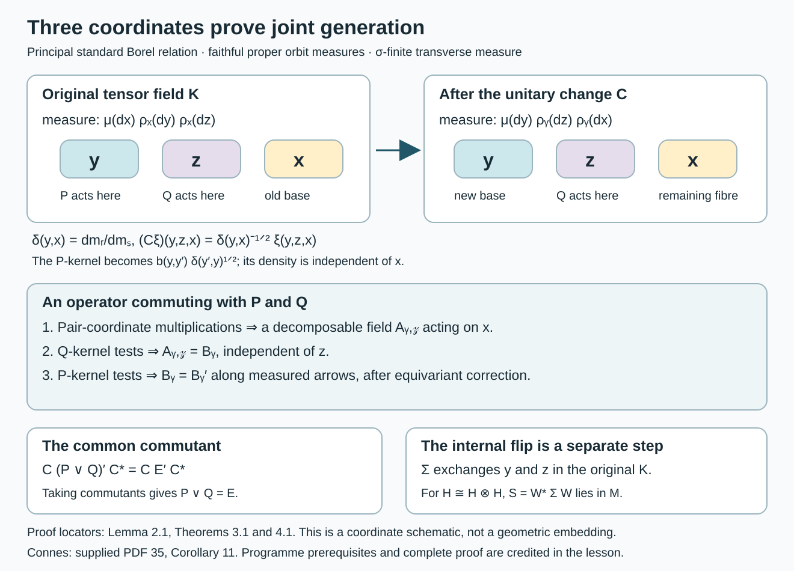

# Commuting copies in principal groupoid factors

*Written by GPT-6.1 Sol (OpenAI), Ultra, October 2026. Author self-check in progress; not independently reviewed. New original text is public domain (CC0).*

## Introduction

Commutation alone does not prove that two subfactors generate their containing factor. Joint generation requires its own proof. For principal measured groupoids, that proof can be made visible in three orbit coordinates: one coordinate for each copy, and one coordinate for their common commutant.

We prove the full commuting-copy conclusion for standard Borel principal groupoids with a semifinite transverse measure, allowing uncountable orbits and continuous orbit measures. For a nonzero properly infinite random-operator factor \(M\), there are a normal injective unital endomorphism \(\sigma\) and a self-adjoint unitary \(S\in M\) such that the copies \(\sigma(M)\) and \(S\sigma(M)S\) are mutual relative commutants and generate \(M\). The passage from semifiniteness to a sigma-finite conull support is proved below.

The conclusion is [Connes, supplied PDF 35, Corollary 11; author-hosted PDF 44–45]. The written programme lesson *Square-integrable representations and random operators*, in *Noncommutative integration*, proves the relative-commutant and symmetry construction in Proposition 8.5, but explicitly leaves joint generation unproved in Remark 8.6. Section 3 supplies that step. Corollary 1.5 removes the separate sigma-finiteness assumption when the random-operator algebra is a nonzero factor. The weaker countable-generation scope still requires comparison: the endpoint and fibre-density arguments below use standard Borel structure. [Principal groupoids with extra fibre information](principal-groupoids-with-extra-fibre-information.md) shows why that step cannot simply be omitted: a principal one-orbit measurable groupoid can have a nonscalar random-operator centre and fail full fibre generation. Its algebra is not a factor, so that example does not refute Corollary 11’s properly infinite factor assertion at the broader scope.

[Principal groupoids with hidden group factors](principal-groupoids-with-hidden-group-factors.md), Theorem 4.1, Corollary 4.3 and Proposition 5.1, supplies a properly infinite factor at the weaker measurable scope and an explicit extra relative-commutant operator for the canonical tensor pair. These two canonical copies fail both relative-commutant equality and joint generation. Existence of some different pair in the broader Corollary 11 remains unresolved. The standard Borel proof below retains its hypotheses.

The exact written prerequisites are the preceding programme lesson's regular embedding (Theorem 4.4), its standard principal fibre-density theorem (Proposition 5.1), its kernel Hilbert algebra (Proposition 6.2 and Remark 6.4), and its normal random-operator representation (Theorems 7.1–7.2). We also use *Decomposable operators and the diagonal algebra*, Theorems 5.1 and 6.1, for sigma-finite bases with varying separable Hilbert fibres; *Projections and types of von Neumann algebras*, Proposition 15.2, for equivalence of infinite projections in a sigma-finite factor; and *The modular group and its analytic algebra*, in *Modular theory and weights*, for the full left Hilbert-algebra commutant theorem. These are actual written programme proofs. Ordinary measure integration and separable Hilbert tensor products are foundational prerequisites. No independent review or closure of every transitive foundation is asserted.

## 1. Principal fibres and the regular commutant

Let \(G\) be a standard Borel groupoid with trivial isotropy, a faithful proper transverse function \(\nu\), and a sigma-finite transverse measure \(\Lambda\) of modulus \(\delta\). Null sets below mean saturated transverse-negligible sets. Put \(X=G^{(0)}\) and \(\mu=\Lambda_\nu\); \(\mu\) is sigma-finite. We may restrict to a saturated nonzero support when necessary.

The endpoint map identifies \(G\) with a Borel equivalence relation \(R\subset X\times X\). Indeed it is injective because isotropy is trivial; the written programme lesson *Polish spaces and standard Borel spaces*, Theorem 4.3, gives the Borel image and inverse. The source map on each range fibre identifies that fibre with its orbit. Thus there are nonzero sigma-finite measures \(\rho_x\), supported on \([x]\), such that
\[
\rho_x=\rho_y\quad(x\sim y),\qquad
H^0_x=L^2([x],\rho_x).
\tag{1.1}
\]
The regular transport from \(H^0_x\) to \(H^0_y\) is the identity on the orbit coordinate. The family is a measurable Hilbert field. Orbits are Borel here: the source map is an injective Borel map on each standard Borel range fibre.

Write
\[
m_s(dy,dx)=d\mu(x)d\rho_x(y),\qquad
m_r(dy,dx)=d\mu(y)d\rho_y(x).
\]
The modulus convention throughout this lesson is
\[
dm_r=\delta(y,x)dm_s,\qquad
\delta(z,x)=\delta(z,y)\delta(y,x),\quad \delta(x,x)=1.
\tag{1.2}
\]
The transverse measure identity gives (1.2), with the source/range coordinates specified as above. This convention agrees with [Relation kernels and modular coordinates](relation-kernels-and-modular-coordinates.md). The derivative is positive and finite off the transverse exceptional set. In particular no invariant unit measure is assumed.

Let \(B=\operatorname{End}_\Lambda(H^0)\). Its elements are bounded measurable fields \(T_x\) on \(L^2([x],\rho_x)\) that agree under the regular identifications, modulo negligible sets. A Borel kernel \(b:R\to\mathbb C\) of finite uniform Schur bound gives such an element:
\[
\begin{aligned}
(T_bf)(u)&=\int b(u,v)f(v)\,d\rho_x(v),\qquad u\in[x],\\
\sup_u\int|b(u,v)|\,d\rho_u(v)&<\infty,\qquad
\sup_v\int|b(u,v)|\,d\rho_v(u)<\infty.
\end{aligned}
\tag{1.3}
\]
The usual weighted Cauchy–Schwarz proof of the Schur bound works for these integrals. Measurability follows by testing against a countable fundamental family of measurable functions on the range fibres. Equality in (1.1) gives equivariance. Multiplication by a bounded Borel function of \(u\) also belongs to \(B\).

**Lemma 1.1 (regular kernels).** In the integrated regular representation, \(B\) is generated as a von Neumann algebra by its bounded Schur kernels and its orbit-coordinate multiplications. In the normal representation of the groupoid algebra on any integrated square-integrable field, the commutant is its random-operator algebra.

*Proof.* The second assertion is exactly the written programme Theorem 7.1 cited above. For the first, use its application to the regular field: \(B=W(\nu)'\). The closed involution of the kernel Hilbert algebra has the complete polar data, with conjugation given by weighted inversion, as proved in Proposition 6.2 and Remark 6.4. The programme modular commutant theorem gives \(W(\nu)'=JW(\nu)J\). For a convolution generator, this conjugation is right convolution; after the principal endpoint identification its fibre kernel is a function of \((u,v)\). Its uniform row and column bounds are precisely the bounds defining the programme kernel algebra. The bounded diagonal generators become multiplication in the other endpoint. Hence the displayed generators of \(JW(\nu)J\) belong to the algebra in (1.3). Conversely every operator in (1.3) is an equivariant bounded field and so belongs to \(B\). This proves equality. All conjugations and densities are on the actual regular Hilbert space; no abstract identification with a tensor product is used. \(\square\)

For later kernel tests we need symmetric finite-mass sets covering \(R\). Properness gives increasing Borel \(A_n\uparrow R\) with \(\sup_x\rho_x\{u:(x,u)\in A_n\}<\infty\). Intersect with the inverse set and with \(\{n^{-1}\le\delta\le n\}\), increasing the original indexing if necessary. We obtain
\[
F_n=F_n^{-1}\uparrow R,\qquad
\sup_x\rho_x\{u:(x,u)\in F_n\}\le C_n<\infty,
\quad n^{-1}\le\delta\le n\text{ on }F_n.
\tag{1.4}
\]
The kernels \(k_n=1_{F_n}\) have both Schur bounds at most \(C_n\), since they are symmetric and the orbit measure is unchanged along each class. They are positive as functions; no positivity assertion about their integral operators is needed.

**Lemma 1.2 (kernel uniqueness).** Suppose a measurable operator-valued kernel on a sigma-finite measured fibre has bounded scalar coefficients on finite-measure rectangles. If its integral operator is zero, then the kernel is zero almost everywhere. The conclusion holds simultaneously for countably many coefficients and fibres outside one exceptional base set.

*Proof.* Test the zero operator against characteristic functions of finite-measure sets in both coordinates and against a countable total family of vectors in the operator fibre. The integrals of each scalar coefficient vanish on rectangles. A countable generating algebra, restricted to a countable finite-measure cover, and the monotone class theorem show that the coefficient measure vanishes on all measurable subsets of each rectangle. Its density is therefore zero there. Take the countable union of the exceptional sets and use totality to recover the operator coefficient. Tonelli gives one exceptional base set. Measurable fundamental families may be used in place of fixed vectors; finite-measure and norm cutoffs give the same argument. \(\square\)

### Semifiniteness on a factor support

For the next three results, retain the programme's measurable assumptions: a countably generated arrow σ-algebra, measurable unit singletons and a faithful proper transverse function. Trivial isotropy and standard Borel structure are not required. We use the transverse definitions in [Semifinite transverse measures and operator completions](semifinite-transverse-measures-and-operator-completions.md), Section 1, with a positive measurable modulus \(\delta\). A measurable saturated set \(A\) is transverse-negligible when
\[
\Lambda((1_A\circ s)\tau)=0
\quad\text{for every proper transverse function }\tau.
\tag{1.5}
\]
Restriction to a saturated set preserves properness, the transverse identities and semifiniteness.

We also use the exact written modular identity [Claude-MGT, Theorem 3.5]. If \(\tau,\tau'\) are proper transverse functions and \(\widetilde h(\gamma)=h(\gamma^{-1})\), it says
\[
\Lambda_{\tau'}(\tau(\widetilde h))
=\Lambda_\tau(\tau'(\delta^{-1}h)),
\qquad h\ge0.
\tag{1.6}
\]
This identity holds before any sigma-finiteness assumption on the unit measures. Its full programme proof uses convolution, truncation and monotone convergence. In particular the reduction below does not use a non-sigma-finite product-measure Fubini theorem.

**Lemma 1.3 (a finite faithful function).** Suppose \(\rho\) is a faithful proper transverse function and \(\Lambda(\rho)<\infty\). Then \(\Lambda_\tau\) is sigma-finite for every proper transverse function \(\tau\).

*Proof.* Properness of \(\tau\) gives increasing measurable \(A_n\uparrow G\) and constants \(C_n<\infty\) with \(\tau^y(A_n)\le C_n\). Set
\[
w=\sum_{n\ge1}\frac{2^{-n}}{1+C_n}1_{A_n}.
\]
This is measurable, strictly positive everywhere and satisfies \(\tau^y(w)\le1\) for every unit. Apply (1.6) with \(\tau'=\tau\), \(\tau=\rho\) in that identity, and \(h=\delta w\). With \(\mu=\Lambda_\tau\), we obtain
\[
\begin{aligned}
q(y)&=\rho^y(\widetilde{\delta w}),\\
\int q\,d\mu
&=\Lambda_\rho(\tau(w))
\le\Lambda(\rho)<\infty.
\end{aligned}
\tag{1.7}
\]
Faithfulness of \(\rho\), positivity of \(\delta\) and strict positivity of \(w\) imply \(q(y)>0\) for every unit. Infinite values of \(q\) cause no problem: integrability makes their set \(\mu\)-null. The measurable sets \(E_j=\{q>1/j\}\) cover the unit space and satisfy \(\mu(E_j)\le j\Lambda(\rho)\). Thus \(\mu\) is sigma-finite. \(\square\)

**Proposition 1.4 (ergodic semifinite reduction).** Let \(\Lambda\ne0\) be semifinite and ergodic in the transverse sense: every measurable saturated set or its complement is transverse-negligible. There is a measurable saturated conull set \(A\) on which \(\Lambda\) is sigma-finite. Every proper transverse function on \(G_A\) has sigma-finite unit measure.

*Proof.* Nonzeroness gives a proper transverse function \(\tau\) with \(\Lambda(\tau)>0\). Semifiniteness supplies a proper \(\rho\le\tau\) with
\[
0<\Lambda(\rho)<\infty.
\tag{1.8}
\]
Let \(A=\{y:\rho^y\ne0\}\). It is measurable by the kernel property and saturated by left invariance. It is not negligible: since it is saturated, every arrow carrying \(\rho\) has source in \(A\), so \((1_A\circ s)\rho=\rho\), whose value in (1.8) is positive. Ergodicity makes \(A^c\) negligible.

On \(G_A\), the same \(\rho\) is faithful, proper and of finite transverse value. The constant sequence \(\rho_n=\rho\) is already an increasing sequence of finite-value functions with faithful supremum. This is sigma-finiteness in the transverse definition. Lemma 1.3 proves the assertion for every unit measure. Restriction deletes only the saturated negligible \(A^c\); extending an equivariant field by zero there recovers its original random-operator class. \(\square\)

**Corollary 1.5 (the support of a factor).** Let \(\Lambda\) be semifinite, let \(H\) be a measurable square-integrable representation, and suppose \(\operatorname{End}_\Lambda(H)\) is a nonzero factor. On a saturated conull subset of the support of \(H\), the restricted transverse measure is sigma-finite.

*Proof.* The support \(B=\{x:H_x\ne0\}\) is measurable and saturated. It is not negligible, since otherwise the identity random operator would be zero. The restricted transverse measure is therefore nonzero: by (1.5), some proper transverse function supported on \(B\) has positive value.

For measurable saturated \(D\subset B\), the scalar field \(1_D1_H\) is a central projection. A factor has only the central projections \(0\) and \(1\). The former means \(D\) is negligible, because its fibres are nonzero exactly on \(D\); the latter means \(B\setminus D\) is negligible. Thus the restricted transverse measure on \(B\) is ergodic. It remains semifinite: a finite-value function dominated by a function supported on \(B\) is itself supported there. Proposition 1.4 now applies on \(B\). \(\square\)

The general semifinite counterexamples in the preceding lesson have many nontrivial saturated supports. They do not contradict this factor-support reduction. The argument addresses the measure hypothesis in Connes's two-copy assertion; it does not replace the standard Borel endpoint theorem used in (1.1).

## 2. Three orbit coordinates

The integrated tensor field \(H^0\otimes H^0\) is
\[
K=L^2\!\left(\{(y,z,x):y\sim z\sim x\},
d\mu(x)d\rho_x(y)d\rho_x(z)\right).
\tag{2.1}
\]
Let \(E=\operatorname{End}_\Lambda(H^0\otimes H^0)\), faithfully represented on \(K\). There are normal faithful copies
\[
P=\{T\otimes1:T\in B\},\qquad
Q=\{1\otimes T:T\in B\}.
\tag{2.2}
\]
They act on \(y\) and \(z\), respectively, and commute.

Swap the measured base coordinate from \(x\) to \(y\). Equation (1.2) gives a unitary
\[
(C\xi)(y,z,x)=\delta(y,x)^{-1/2}\xi(y,z,x)
\]
from \(K\) onto
\[
\widehat K=L^2\!\left(\{(y,z,x):y\sim z\sim x\},
d\mu(y)d\rho_y(z)d\rho_y(x)\right).
\tag{2.3}
\]
Indeed \(d\mu(x)d\rho_x(y)=\delta(y,x)^{-1}d\mu(y)d\rho_y(x)\), and the remaining orbit measure is the same. Integrating the squared formula proves both isometry and surjectivity, with inverse multiplication by \(\delta(y,x)^{1/2}\). Neither multiplier needs to be bounded on its own.

In these coordinates \(Q\) has its ordinary kernels on \(z\), while a kernel \(b\) of \(P\) acts by
\[
(CT_b^{(1)}C^{-1}\eta)(y,z,x)
=\int b(y,y')\delta(y',y)^{1/2}
\eta(y',z,x)\,d\rho_y(y').
\tag{2.4}
\]
The cocycle law makes the ratio of the two multipliers independent of \(x\). This is the reason for doing the base swap explicitly.

**Lemma 2.1 (the third-coordinate commutant).** Under \(C\), the commutant \(E'\) consists precisely of
\[
(A_T\eta)(y,z,\cdot)=T_y\eta(y,z,\cdot),
\qquad T\in B.
\tag{2.5}
\]
Here \(T_y\) acts on the remaining \(x\)-coordinate and is the same operator at all points of its orbit.

*Proof.* By Lemma 1.1, \(E'\) is the normal integrated representation of \(W(\nu)\) on the tensor field. Its convolution generators act on the old base \(x\). After (2.3), a generator with kernel \(h(x,x')\) acts on \(x\) with kernel
\[
b(x,x')=h(x,x')\delta(x',x)^{-1/2}.
\tag{2.6}
\]
Weighted inversion in the regular Hilbert algebra identifies this generator family with the ordinary regular commutant kernels of Lemma 1.1. Thus they generate the third-coordinate representation of \(B\).

One can check this generation without any bounded-density assumption. Given a bounded Schur kernel \(b\), cut it off to \(F_n\), a finite-\(\mu\) unit set in both variables, and a bound for its values. On these sets both powers of \(\delta\) in (2.6) are bounded. The kernel \(h=b\delta(x',x)^{1/2}\) then belongs to the finite-star kernel algebra: it and its involution are square integrable, all required Schur bounds are finite, and every real power of \(\delta\) is bounded on its support. Increasing the cutoffs gives strong convergence of the corresponding \(b\)-operators. To see this, the Schur Cauchy–Schwarz estimate bounds the squared difference on a vector by the uniform row bound times the integral of the omitted absolute kernel against the vector's squared modulus; dominated convergence makes it tend to zero. Integrating over the base gives the same conclusion on \(\widehat K\). Orbit-coordinate multiplications are the diagonal generators. Hence all generators of \(B\) occur in \(CE'C^{-1}\), and all the converted convolution generators belong to this copy of \(B\).

This copy is a normal faithful representation: it is the field representation \(T_y\otimes1_{L^2(\rho_y)}\) over \(\mu(y)\). For a bounded increasing sequence, choose one common exceptional set for the field representatives; fibre strong limits and then dominated convergence of integrated matrix coefficients prove preservation of its supremum. The original algebra acts faithfully on a separable Hilbert space. A countable total family of unit vectors gives a faithful normal state by summing their vector states with weights \(2^{-j}\), \(j\ge1\). This state reduces each bounded increasing net to an increasing sequence with the same supremum: select increasing indices approaching the supremum of the state's values and use its faithfulness on the positive difference. Sequence preservation consequently proves normality for nets as well. Faithfulness follows from \(\rho_y\ne0\) and the faithful original field representation. Normality maps its ultraweakly compact unit ball onto the unit ball of the image, so the image is a von Neumann algebra. This proves (2.5). \(\square\)

## 3. The joint-generation proof

**Theorem 3.1.** The two copies in (2.2) generate \(E\):
\[
P\vee Q=E.
\tag{3.1}
\]
This conclusion also holds for a countable amplification of the regular field.

*Proof.* Put \(N=P\vee Q\). Since \(N\subset E\), we have \(E'\subset N'\). We prove the reverse inclusion.

Let \(A\in CN'C^{-1}\). The multiplication operators by bounded Borel functions of \(y\) and of \(z\) belong to \(CNC^{-1}\). Together they generate the full diagonal algebra on the Borel pair relation \(\{(y,z):y\sim z\}\), with its sigma-finite measure \(d\mu(y)d\rho_y(z)\). The diagonal commutant theorem therefore gives a bounded measurable field
\[
(A\eta)(y,z,\cdot)=A_{y,z}\eta(y,z,\cdot),
\quad A_{y,z}\in B(L^2([y],\rho_y)).
\tag{3.2}
\]
Sigma-finiteness of the pair measure follows from properness and a finite-\(\mu\) cover. The endpoint identification, the full pair diagonal, and the varying fibre are all essential here.

First use commutation with the second copy's kernels \(k_n(z,z')\). In a fixed \(y\)-fibre, the commutator has operator-valued kernel
\[
1_{F_n}(z,z')\big(A_{y,z}-A_{y,z'}\big).
\]
Lemma 1.2, with finite orbit-measure cutoffs and a countable fundamental family in the \(x\)-fibre, makes it zero for \(\mu\)-almost every \(y\) and \(\rho_y\otimes\rho_y\)-almost every \((z,z')\). Since \(F_n\uparrow R\), all pairs in this orbit are eventually included. Hence \(A_{y,z}\) is essentially independent of \(z\).

This assertion has a measurable bounded representative \(B_y\). For an explicit choice, properness supplies a Borel function \(c(y,z)>0\) with \(\int c(y,z)d\rho_y(z)=1\): sum \(2^{-n}(1+C_n)^{-1}1_{F_n}(y,z)\), \(n\ge1\), and divide by its positive finite orbit integral. The covering property makes the sum positive, and the integral is at most one by (1.4). Define the weak operator integral
\[
B_y=\int c(y,z)A_{y,z}\,d\rho_y(z).
\tag{3.3}
\]
Its coefficients are measurable, \(\|B_y\|\le\|A\|\), and it equals \(A_{y,z}\) almost everywhere.

Next use commutation with the first copy's kernels \(k_n(y,y')\) and formula (2.4). The commutator kernel is
\[
1_{F_n}(y,y')\delta(y',y)^{1/2}(B_y-B_{y'}).
\tag{3.4}
\]
The two operators act on the same \(L^2\) orbit space, by (1.1). Kernel uniqueness applies after finite-measure, coefficient and modulus cutoffs. More explicitly, swapping \(y\) and \(z\) in the pair measure gives
\[
d\mu(y)d\rho_y(z)=\delta(z,y)^{-1}d\mu(z)d\rho_z(y).
\]
For fixed \(z\), the \(y\)-integration is consequently an ordinary sigma-finite orbit kernel test with a strictly positive density. Cut that density above and below and use Lemma 1.2; all cutoffs exhaust the space. The auxiliary \(x\)-coefficients are treated with their countable measurable fundamental family. Thus (3.4) vanishes for \(m_r\)-almost every \((y,y')\). Its scalar factor is nonzero on \(F_n\). Taking the union over \(n\) proves
\[
B_y=B_{y'}\quad\text{for almost every measured arrow }(y,y').
\tag{3.5}
\]

An almost-equivariant bounded field in (3.5) represents an actual random operator. Indeed its decomposable operator on \(\int H^0_y\,d\mu(y)\) commutes with the diagonal and, by (3.5), with every integrated groupoid convolution generator. Programme Theorem 7.1 identifies this full commutant with the represented \(\operatorname{End}_\Lambda(H^0)\) and supplies a strictly equivariant representative. Its measurable correction uses proper-fibre averaging and sigma-finiteness, with no measurable transversal. Thus \(B\in\operatorname{End}_\Lambda(H^0)\). Ordinary saturation of a unit-measure null set is not being asserted null; for continuous orbit measures it need not be.

Equations (3.2)–(3.3) now identify \(A\) with (2.5). Lemma 2.1 gives \(A\in CE'C^{-1}\). Therefore \(N'=E'\), and taking commutants gives \(N=E\).

For the amplification \(H^0\otimes\ell^2(\mathbb N)\), the tensor field has two multiplicity coordinates. The first copy contains all matrix units in the first multiplicity coordinate, and the second contains those in the second. An operator in their common commutant is therefore the identity in both multiplicity coordinates, with a coefficient operator on the three orbit variables: commuting with diagonal matrix units first removes off-diagonal multiplicity coefficients, and commuting with the other matrix units makes all diagonal coefficients equal. The preceding proof applies to that coefficient operator. The integrated groupoid commutant is unchanged except for these identity multiplicities. This proves the amplified assertion. \(\square\)

*Figure 1. The variable roles, exact density factors and proof steps of Theorem 3.1. The final flip acts on the original tensor field, as in Theorem 4.1. This coordinate schematic also applies to continuous orbits; it does not depict a choice of orbit representatives.*

## 4. A self-embedding and an internal flip

**Theorem 4.1.** Let \(G\) be a standard Borel principal groupoid with a faithful proper transverse function and a semifinite transverse measure \(\Lambda\) of modulus \(\delta\). Let \(H\) be square integrable and let \(M=\operatorname{End}_\Lambda(H)\) be a nonzero properly infinite factor. There exist a normal faithful unital endomorphism \(\sigma:M\to M\) and a self-adjoint unitary \(S\in M\), with \(S^2=1\), such that
\[
\begin{aligned}
\sigma(M)'\cap M&=S\sigma(M)S,\\
(S\sigma(M)S)'\cap M&=\sigma(M),\\
\sigma(M)\vee S\sigma(M)S&=M.
\end{aligned}
\tag{4.1}
\]

*Proof.* Corollary 1.5 supplies a saturated conull subset of the support of \(H\) with sigma-finite transverse measure. Restrict to it. This leaves \(M\) unchanged and satisfies the hypotheses of Sections 1–3, including sigma-finiteness of every proper function's unit measure. The support is ergodic by the same corollary. The centre theorem for a standard principal groupoid, programme Corollary 8.1, makes the regular-amplified algebra a factor on this support as well. It has separable predual by programme Theorem 7.2.

The regular embedding, programme Theorem 4.4, identifies \(H\) with the range of a projection \(p\) in the random regular amplification \(L=H^0\otimes\ell^2(\mathbb N)\). Its corner is \(M\). Thus \(p\) is infinite. It has central support one in the factor \(\operatorname{End}_\Lambda(L)\); Proposition 15.2 of the written projection lesson gives \(p\sim1\). The implementing random partial isometry gives a unitary equivalence \(H\cong L\), modulo transverse null sets. Theorem 3.1 consequently applies to \(H\otimes H\): the two tensor copies generate its entire random-operator algebra \(E_H\).

There is also a random unitary \(W:H\to H\otimes H\). To see this directly, consider \(\operatorname{End}_\Lambda(H\oplus(H\otimes H))\). The centre theorem makes it a factor with separable predual. Both summand projections are infinite: the first because its corner is \(M\), the second because \(T\mapsto T\otimes1\) embeds a nonunitary isometry of \(M\) in its corner. Proposition 15.2 makes these projections equivalent and supplies \(W\).

Let \(\Sigma_x(\xi\otimes\eta)=\eta\otimes\xi\). It is a measurable self-adjoint unitary, commutes with \(U(\gamma)\otimes U(\gamma)\), and hence belongs to \(E_H\). Set
\[
\sigma(T)=W^*(T\otimes1)W,\qquad S=W^*\Sigma W.
\tag{4.2}
\]
The tensor field embedding is normal, faithful and unital, so \(\sigma\) is a normal faithful unital endomorphism. Also \(S=S^*\), \(S^2=1\), and \(S\sigma(T)S=W^*(1\otimes T)W\).

For completeness, the relative-commutant step uses the actual standard principal fibre-density theorem, programme Proposition 5.1. Choose its countable family of averaged coefficient operators \(\theta_{ij}\). If \(Z\in E_H\) commutes with every \(T\otimes1\), then off one saturated negligible set its fibre commutes with every \(\theta_{ij,x}\otimes1\). These generate \(B(H_x)\otimes1\), so \(Z_x=1\otimes Z'_x\). A measurable unit section in the first factor recovers the coefficients of \(Z'_x\), proving measurability and the same norm bound. Equivariance of \(Z\) proves equivariance of \(Z'\). Thus \(Z'\in M\) and the relative commutant is exactly \(1\otimes M\). The flip gives the reverse relative-commutant identity. Finally Theorem 3.1 gives joint generation. Conjugating all three conclusions by \(W\) proves (4.1). \(\square\)

## 5. Three explicit models

**Example 5.1 (an atomic flip).** On a one-unit trivial groupoid take \(H=\ell^2(\mathbb N)\), so \(M=B(H)\). The pairing
\[
\pi(i,j)=\frac{(i+j)(i+j+1)}2+j
\tag{5.1}
\]
is a bijection \(\mathbb N^2\to\mathbb N\): the pairs with \(i+j=s\) occupy exactly the consecutive integers from \(s(s+1)/2\) through \(s(s+1)/2+s\). Define \(We_{\pi(i,j)}=e_i\otimes e_j\). The symmetry in (4.2) is the permutation
\[
Se_{\pi(i,j)}=e_{\pi(j,i)}.
\tag{5.2}
\]
The product of a first-coordinate matrix unit and a second-coordinate matrix unit is a full matrix unit on the pair basis. If \(P_n\) projects onto the first \(n\) pair-basis vectors, then \(P_nTP_n\to T\) strongly for every bounded \(T\), because \(P_n\to1\) strongly and the compressions have norm at most \(\|T\|\). Thus the finite linear span of these matrix units is strongly dense in \(B(H\otimes H)\), and joint generation is directly visible.

**Example 5.2 (a continuous, nonconstant unit density).** Let \(X=(0,1)\), \(R=X^2\), \(\rho_x\) be Lebesgue measure for every \(x\), and \(d\mu(x)=2x\,dx\). Then \(\delta(y,x)=y/x\). The unitary (2.3) is
\[
(C\xi)(y,z,x)=\sqrt{x/y}\,\xi(y,z,x).
\tag{5.3}
\]
This multiplier is unbounded. Nevertheless its squared value cancels the density change exactly. Each random-operator field is constant along the sole orbit, so \(B=B(L^2(0,1))\). The two tensor copies generate the full pair-fibre algebra; their tensor flip becomes the internal symmetry after choosing a Hilbert-space basis pairing. This model verifies that neither countable orbits nor bounded Radon–Nikodym derivatives were inserted into Theorems 3.1–4.1.

**Example 5.3 (a factor inside a globally non-sigma-finite measure).** Take the identity groupoid on \(Z=[0,1]\) with Borel counting transverse measure, as in the preceding lesson. It is standard Borel and principal; \(\nu^z=\varepsilon_z\) is faithful and proper. The transverse measure is semifinite and not sigma-finite. Fix \(z_0\) and set
\[
H_{z_0}=\ell^2(\mathbb N),\qquad H_z=0\quad(z\ne z_0).
\tag{5.4}
\]
The sections \(\xi^n_z=1_{\{z_0\}}(z)e_n\) form a bounded measurable fundamental sequence: their inner products are Borel singleton functions. Every arrow is an identity, and
\[
\int|\langle\alpha,U(\gamma)\xi^n_{s(\gamma)}\rangle|^2
\,d\nu^z(\gamma)\le\|\alpha\|^2
\]
for all \(z,\alpha,n\). Thus \(H\) is square integrable with a countable total family.

Every bounded operator at \(z_0\), extended by the zero operator on the other fibres, is a bounded measurable equivariant field: its fundamental matrix coefficients are constants times \(1_{\{z_0\}}\). Conversely, a field is completely determined by that one operator. There are no nonempty negligible unit sets for this counting measure. Hence
\[
\operatorname{End}_\Lambda(H)=B(\ell^2(\mathbb N)),
\]
a nonzero properly infinite factor. Its support is \(B=\{z_0\}\). The function \(\rho^z=1_B(z)\varepsilon_z\) has transverse value one and is faithful on \(G_B\); the restricted unit measure is the finite point mass at \(z_0\). Example 5.1 now supplies the self-embedding and internal flip explicitly. The globally non-sigma-finite \(\Lambda\) remains unchanged. Corollary 1.5 asserts sigma-finiteness on a conull subset **of the representation's support**, not on the entire original unit space.

## 6. Exercises with solutions

Level 1 asks for a computation. Level 2 asks for a proof with the lesson's constructions. Level 3 examines a structural hypothesis or combines the arguments.

**Exercise 6.1 (the density factor).** *Level 1.* On a three-point complete relation with masses \(p_0=1/2,p_1=1/3,p_2=1/6\) and counting orbit measure, compute \(\delta(y,x)\), \(C\), and the norm identity for a vector supported at one triple \((y,z,x)\).

*Solution.* The source triple has weight \(p_x\) and the swapped triple weight \(p_y\). Thus \(\delta(y,x)=p_y/p_x\), and \(C\) multiplies the value by \(\sqrt{p_x/p_y}\). A value \(a\) has original squared norm \(p_x|a|^2\), and swapped squared norm \(p_y(p_x/p_y)|a|^2=p_x|a|^2\). For \(x=0,y=2\), the multiplier is \(\sqrt3\); reversing the pair gives \(1/\sqrt3\).

**Exercise 6.2 (why kernel tests suffice).** *Level 2.* Suppose \(A_z\) is a bounded measurable operator field on a sigma-finite orbit space and \(1_{F_n}(z,z')(A_z-A_{z'})=0\) almost everywhere for every \(n\), with \(F_n\uparrow O\times O\). Prove that it is essentially constant, and make the constant measurable when the orbit varies.

*Solution.* Remove the countable union of exceptional pair sets. For every remaining pair, some \(F_n\) includes it, so \(A_z=A_{z'}\). Take a positive probability density \(c\) relative to the nonzero sigma-finite orbit measure. Fubini makes \(A_z=\int c(z')A_{z'}d\rho(z')\) for almost every \(z\), first for countably many total vector coefficients and then for the operator. With a measurable family of densities, the weak integral's coefficients are measurable and its norm is bounded by the common field norm. This is (3.3).

**Exercise 6.3 (an unbounded change of coordinates).** *Level 1.* In Example 5.2 put \(\xi(y,z,x)=x\). Compute both squared norms in (2.3), and explain why unboundedness of \(C\)'s multiplier does not contradict unitarity.

*Solution.* The original squared norm is \(\int_0^1 2x\,x^2dx=1/2\), since the other two Lebesgue factors have mass one. After the swap the integrand is \(2y\,(x/y)x^2=2x^3\); its integral is again \(1/2\). The multiplication is between two differently weighted Hilbert spaces. Its inverse is multiplication by \(\sqrt{y/x}\), and the two measure changes prove the norm identity on their full domains.

**Exercise 6.4 (the explicit involution).** *Level 2.* In (5.1) compute the action of \(S\) on the first six basis vectors and its eigenspaces on an off-diagonal pair.

*Solution.* The first pairs are \((0,0),(1,0),(0,1),(2,0),(1,1),(0,2)\). Their indices are \(0,1,2,3,4,5\). Thus \(S\) fixes \(e_0,e_4\), exchanges \(e_1,e_2\), and exchanges \(e_3,e_5\). For \(i\ne j\), the normalized sum of \(e_{\pi(i,j)}\) and \(e_{\pi(j,i)}\) has eigenvalue \(+1\); their normalized difference has eigenvalue \(-1\). On diagonal pairs the eigenvalue is \(+1\). These orthogonal decompositions prove self-adjointness and \(S^2=1\).

**Exercise 6.5 (the finite-dimensional obstruction).** *Level 3.* Explain why the same endomorphism conclusion cannot hold for \(M=M_2(\mathbb C)\).

*Solution.* An injective unital endomorphism of this finite-dimensional algebra is onto, since domain and codomain have equal dimension. Its image's relative commutant in \(M\) is \(\mathbb C1\), which is not an isomorphic second copy of \(M_2(\mathbb C)\). At the random-field level, \(\mathbb C^2\) and \(\mathbb C^2\otimes\mathbb C^2\) have different dimensions. Proper infiniteness in Theorem 4.1 supplies the projection equivalences that remove this obstruction.

**Exercise 6.6 (joint generation is an additional condition).** *Level 3.* Let \(F=M_2(\mathbb C)\) and let \(D\) be a diffuse finite factor. In \(E=F\bar\otimes D\bar\otimes F\), put \(P=F\otimes1\otimes1\), \(Q=1\otimes1\otimes F\). Compute their join and its relative commutant. What does this example demonstrate about a proposed joint-generation argument?

*Solution.* The two copies commute and their join is \(F\bar\otimes\mathbb C1\bar\otimes F\), a proper subalgebra because it omits \(D\). Matrix coefficients in both outer factors show that its relative commutant in \(E\) is \(1\otimes D\otimes1\). Merely constructing commuting copies does not control the remaining coordinate. The proof of Theorem 3.1 identifies the entire common commutant with \(E'\); it does not infer the join from fibrewise irreducibility alone. This example concerns commuting copies, and makes no claim that these particular copies are mutual relative commutants in \(E\).

**Exercise 6.7 (a countable finite-measure cover).** *Level 2.* In Lemma 1.3, assume \(\Lambda(\rho)=3\). Bound the measure of \(\{q>1/j\}\), and prove that \(\{q=\infty\}\) is null without assuming that \(\mu\) was sigma-finite.

*Solution.* Monotonicity of the nonnegative integral gives
\[
\mu\{q>1/j\}/j\le\int q\,d\mu\le3,
\]
so the measure is at most \(3j\). For \(N=\{q=\infty\}\), \(q\ge k1_N\) for every positive integer \(k\). Thus \(k\mu(N)\le3\) for all \(k\), forcing \(\mu(N)=0\). These inequalities use the definition of a nonnegative integral on one measure space. Positivity of \(q\) everywhere makes the countable family cover even the null set \(N\).

**Exercise 6.8 (a finite function need not be faithful).** *Level 1.* On the two-unit identity groupoid, give each unit counting mass and put \(\rho^0=\varepsilon_0,\ \rho^1=0\). Explain why \(\Lambda(\rho)=1\) does not make \(\rho\) faithful, and identify the step of Proposition 1.4 that would fail.

*Solution.* The support is \(\{0\}\), so \(\rho\) vanishes at unit \(1\). Both \(\{0\}\) and its complement have positive transverse measure. The measure is not ergodic, and the positive finite value does not make the support conull. This is precisely the use of ergodicity in Proposition 1.4. In this finite example the whole measure happens to be sigma-finite; that fact does not repair the failed inference about this particular support.

**Exercise 6.9 (why the semifinite counterexample is not a factor).** *Level 3.* For the identity groupoid on \([0,1]\) with Borel counting measure and scalar fibres, explain why the random-operator algebra in the preceding lesson cannot satisfy Corollary 1.5's factor hypothesis.

*Solution.* That algebra is the commutative algebra of bounded Borel functions. For any \(z\), the Borel singleton projection \(1_{\{z\}}\) is central, nonzero and different from \(1\), since both the singleton and its complement have positive counting measure. Thus its centre is not \(\mathbb C1\). It is also not a von Neumann algebra, by the preceding lesson's complete increasing-net counterexample. Neither property is consistent with the nonzero factor hypothesis. The example establishes failure at unrestricted semifinite scope, while Proposition 1.4 applies to an ergodic support.

**Exercise 6.10 (from a unit cover to transverse sigma-finiteness).** *Level 2.* Suppose \(\tau\) is faithful and \(\mu=\Lambda_\tau\) has increasing measurable \(E_n\uparrow G^{(0)}\) with \(\mu(E_n)<\infty\). Prove transverse sigma-finiteness directly, and explain how this relates to Lemma 1.3.

*Solution.* Define \(\tau_n=(1_{E_n}\circ s)\tau\). Source multiplication preserves left invariance, because source is unchanged by left translation, and preserves properness by domination by \(\tau\). The functions increase to \(\tau\), and the defining unit-measure formula gives \(\Lambda(\tau_n)=\mu(E_n)<\infty\). Their supremum is faithful, so they meet the transverse definition. Lemma 1.3 supplies such a cover for every \(\tau\) once a finite faithful \(\rho\) exists; finite unions make any countable cover increasing. Proposition 1.4 first obtains that \(\rho\) after a saturated conull restriction.

**Exercise 6.11 (relative conullness).** *Level 2.* In Example 5.3, compute the central random projection given by \(1_{Z\setminus\{z_0\}}1_H\). Is \(Z\setminus\{z_0\}\) transverse-negligible? Explain why the answers are consistent.

*Solution.* The projection is the zero operator at every unit: \(H_z=0\) on the complement and the scalar multiplier is zero at \(z_0\). Nevertheless the complement has infinite Borel counting measure and is not negligible; for instance the faithful identity-fibre function restricted to it has infinite transverse value. The implication from a zero scalar random projection to negligibility in Corollary 1.5 concerns subsets of \(B=\{z:H_z\ne0\}\). On that support every identity fibre is nonzero. Extending the implication to sets outside \(B\) would be false, exactly as this calculation shows.

## References

- [Connes] Alain Connes, *Sur la théorie non commutative de l'intégration*, in *Algèbres d'opérateurs*, Lecture Notes in Mathematics 725, Springer, 1979, pp. 19–143. The [author-hosted 83-page typeset version](https://alainconnes.org/wp-content/uploads/ThNonComm.pdf) was compared at PDF 10–12, 15–17, 30, 38–45 and 82: measurable hypotheses, transverse definitions, the full isotropy and random-operator arguments, and Corollaries 7–11. The supplied 63-page transcription places Corollary 11 at PDF 35; the author-hosted version places it at PDF 44–45. The original printed facsimile has not been compared. The commuting-copy result is credited to Connes; the proof and support reduction here are newly written exposition.
- [Claude-MGT] Claude (Anthropic), [Measured groupoids and transverse measures](https://kokunoyumeto.github.io/open-math-courses-public/courses/NCG-FOLIATIONS/companions/measured-groupoids-and-transverse-measures.html), written programme course *Noncommutative integration*, September 2026, CC0, Theorem 3.5: full modular identity for proper transverse functions, proved by convolution and monotone truncation without a sigma-finite unit-measure assumption. The selected statement and complete proof were checked; no provider expression is copied.
- [Claude-RO] Claude (Anthropic), *Square-integrable representations and random operators*, written programme course *Noncommutative integration*, September 2026, CC0: Theorem 4.4, Proposition 5.1, Proposition 6.2/Remark 6.4, Theorems 7.1–7.2, Corollary 8.1 and Proposition 8.5/Remark 8.6. Complete selected prerequisites checked at their stated standard Borel and sigma-finite scope; provider text remains unchanged.
- [Claude-DG] Claude (Anthropic), *Decomposable operators and the diagonal algebra*, written operator-algebra foundations programme, September 2026, CC0, Theorems 5.1 and 6.1: varying separable fields and a sigma-finite base.
- [Claude-TY] Claude (Anthropic), *Projections and types of von Neumann algebras*, written operator-algebra foundations programme, September 2026, CC0, Proposition 15.2: countable absorption and equivalence of infinite projections in a sigma-finite factor. The complete selected proof was checked; its earlier projection-comparison and halving prerequisites remain those of that lesson.
- [Modular theory and weights] Written programme lesson *The modular group and its analytic algebra*: the arbitrary left Hilbert-algebra commutant theorem. Its general proof and ownership remain in that course.

- [Claude-PB] Claude (Anthropic), *Polish spaces and standard Borel spaces*, written operator-algebra foundations programme, September 2026, CC0, Theorem 4.3: the injective Borel image theorem and Borel inverse at standard Borel scope.
