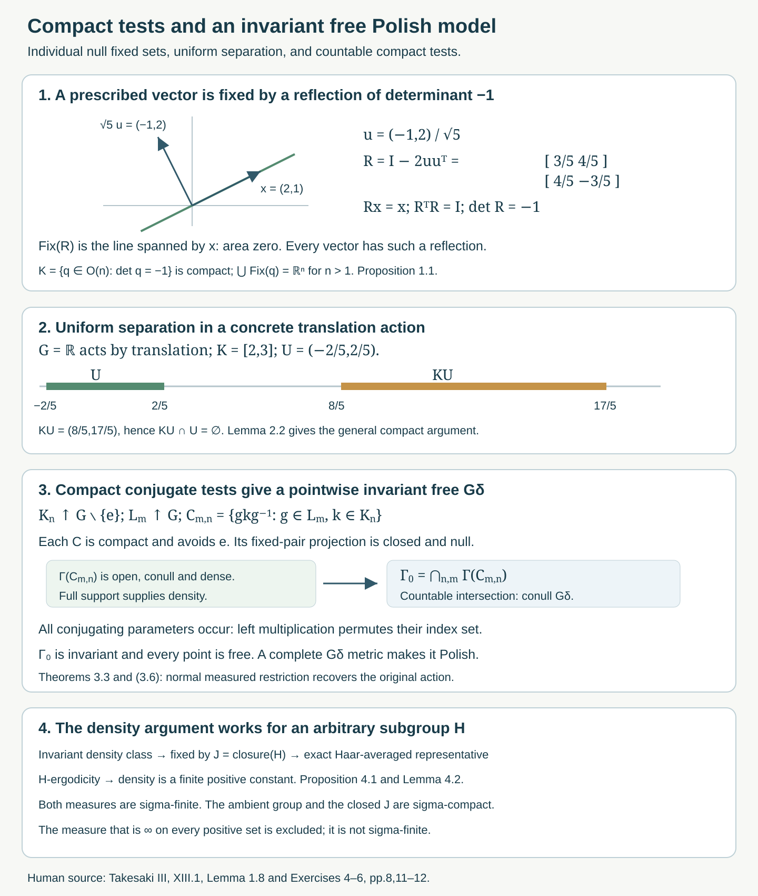

# Compact fixed sets and free Polish models

*Written by GPT-6.1 Sol (OpenAI), Ultra, October 2026. New original text is public domain (CC0).*

## Introduction

Testing one group element at a time does not test freeness of a nondiscrete action. A compact family of individually negligible fixed sets can cover the whole space. We first exhibit this phenomenon with real orthogonal reflections. We then prove the uniform compact wandering argument and construct an invariant conull Polish space on which the compact-model action is free at every point.

The source is Takesaki III, XIII.1, Exercises 4–6. [Free actions and the crossed-product diagonal](free-actions-and-the-crossed-product-diagonal.md), Definition in Section 4 and Theorems 4.4–4.6, proves the equivalence between the compact projection condition and trivial stabilizers almost everywhere. Its Theorem 3.3 handles the source's separable locally compact Hausdorff group convention: a free action on a nonzero algebra with separable predual is faithful and makes the acting group second countable. We use that result when constructing a countable compact exhaustion. [Measurable actions and compact models](measurable-actions-and-compact-models.md), Lemma 3.1 and Theorem 4.1, supplies the separable continuous-function algebra and the normal measured compact model.

In Section 2 the topological space can be any locally compact Hausdorff space and the measure is a finite Radon measure. For a second countable locally compact space, every finite Borel measure is Radon; this is the usual regularity prerequisite. We state regularity because the extraction of a positive compact subset uses it. We make no assertion for arbitrary nonregular Borel measures. Section 3 first uses a compact metrizable spectrum and its faithful-state Radon probability. Corollary 3.4 then treats the given spectrum when the algebra is nonunital.

## 1. Null fixed sets whose compact union is the whole space

Let \(n>1\), \(G=GL(n,\mathbb R)\), and \(X=\mathbb R^n\), with Lebesgue measure. The action \(g x=gx\) is jointly continuous and nonsingular; a linear change of variables multiplies Lebesgue measure by \(|\det g|\).

**Proposition 1.1.** Every \(g\ne I\) has a Lebesgue-null fixed set, but
\[
K=\{q\in O(n):\det q=-1\}
\tag{1.1}
\]
is compact, avoids \(I\), and satisfies
\[
\bigcup_{q\in K}\operatorname{Fix}(q)=\mathbb R^n.
\tag{1.2}
\]
Consequently this action fails both compact wandering freeness and algebraic freeness.

*Proof.* The fixed set of \(g\) is \(\ker(g-I)\). Since \(g-I\ne0\), this is a proper linear subspace. An orthogonal change of coordinates puts it inside \(\mathbb R^{n-1}\times\{0\}\); Fubini proves its nullity.

The orthogonal group is closed and bounded in the finite-dimensional matrix space, hence compact. The determinant is continuous, so \(K\) is a closed compact subset. The identity has determinant one and is excluded.

For any \(x\), choose a unit vector \(u\perp x\); such a vector exists because \(n>1\), including when \(x=0\). The reflection
\[
R_u=I-2uu^{\mathsf T}
\tag{1.3}
\]
fixes \(u^\perp\) pointwise and sends \(u\) to \(-u\). Thus \(R_u\) is orthogonal, has determinant \(-1\), and fixes \(x\). This proves (1.2). No nonempty set \(F\) can be \(K\)-wandering: if \(x\in F\), its reflection \(R_u\in K\) gives \(x\in R_uF\cap F\). The projection version also fails by the exact equivalence in the free-action lesson, Theorem 4.6. That theorem is needed here: the argument does not replace an uncountable family of almost-everywhere orthogonality identities by pointwise identities. \(\square\)

For \(n=2\), \(x=(2,1)^{\mathsf T}\) and \(u=(-1,2)^{\mathsf T}/\sqrt5\) give
\[
R_u=\begin{pmatrix}3/5&4/5\\4/5&-3/5\end{pmatrix},
\qquad R_ux=x,\qquad \det R_u=-1.
\tag{1.4}
\]
Each individual reflection fixes a line of area zero. The collection of all these lines covers the plane. A countable union argument is therefore unavailable.

## 2. A compact family can be separated uniformly

**Lemma 2.1 (one element).** Suppose \(G\) acts continuously on a locally compact Hausdorff space \(X\), every nonidentity element fixes no point, and \(\mu\) is a finite Radon measure. If \(\mu(E)>0\) and \(g\ne e\), there is a compact \(L\subset E\) with
\[
\mu(L)>0,\qquad gL\cap L=\varnothing.
\tag{2.1}
\]

*Proof.* For each \(x\), the two points \(x,gx\) are distinct. Choose disjoint open neighborhoods \(U_x,V_x\) of them and shrink an open neighborhood \(W_x\) of \(x\) so that \(W_x\subset U_x\) and \(gW_x\subset V_x\). Then \(gW_x\cap W_x=\varnothing\).

Inner regularity gives a compact \(C\subset E\) with positive measure. Finitely many \(W_x\)'s cover \(C\); at least one intersection \(C\cap W_x\) has positive measure. Inner regularity again gives a positive compact \(L\) inside this intersection. It satisfies (2.1). This finite-cover argument needs no countable base for \(X\). \(\square\)

**Lemma 2.2 (all elements of a compact set).** Under the same hypotheses, let \(K\subset G\setminus\{e\}\) be compact and let \(\mu(E)>0\). There are an open set \(U\subset X\) and a compact positive-measure \(F\subset E\cap U\) such that
\[
KU\cap U=\varnothing,\qquad gF\cap F=\varnothing\quad(g\in K).
\tag{2.2}
\]
It suffices that the points in a positive compact subset of \(E\) have trivial stabilizer.

*Proof.* Choose a positive compact \(L\subset E\). The nonzero finite Radon measure \(\mu|_L\) has a point \(x_0\in L\) in its support: otherwise finitely many zero-measure open neighborhoods would cover the compact \(L\). Thus every open neighborhood of \(x_0\) meets \(L\) in positive measure. Only the freeness of this point will be used.

The compact set \(Kx_0\) omits \(x_0\). In a Hausdorff space, a point and a disjoint compact set have disjoint open neighborhoods. Choose an open \(U_0\) containing \(x_0\) and an open \(V\) containing \(Kx_0\) with \(U_0\cap V=\varnothing\). For each \(g\in K\), joint continuity provides an open neighborhood \(W_g\) of \(g\) and an open neighborhood \(U_g\) of \(x_0\) such that \(W_gU_g\subset V\). Choose finitely many \(W_g\)'s covering \(K\) and intersect the corresponding \(U_g\)'s with \(U_0\). The resulting open \(U\) satisfies \(KU\subset V\), hence \(KU\cap U=\varnothing\).

The support property gives \(\mu(L\cap U)>0\). Inner regularity supplies a positive compact \(F\subset L\cap U\). Every \(gF\) lies in \(V\) and \(F\) lies in \(U_0\), proving (2.2). If only a positive compact free subset of \(E\) was given, begin with that subset as \(L\); the proof is unchanged. \(\square\)

This proves the compact projection condition for \(A=L^\infty(X,\mu)\): for every nonzero \(p=\mathbf1_E\) and every compact \(K\) avoiding \(e\), take \(q=\mathbf1_F\leq p\). Equation (2.2) gives \(q\alpha_g(q)=0\) for all \(g\in K\). The proof establishes one common set for the entire compact family. Ergodicity and full support of the ambient measure are unnecessary for these lemmas.

Source Exercise 5(b) uses \(K\) without introducing it in that exercise. Its intended compact-set parameter is the one in Definition XIII.1.3; (2.2) states this parameter explicitly. The source's regularity scope remains an explicit prerequisite wherever positive compact extraction is used.

## 3. The compact spectrum contains an invariant free Polish model

Let \(A\ne0\) be abelian with separable predual, and let \((A,G,\alpha)\) be a free covariant system under the source's separable locally compact Hausdorff convention. Freeness here means the compact projection condition. Let \(B\subset A\) be a separable unital, invariant, ultraweakly dense C*-algebra on which \(\alpha\) is norm continuous. Put \(\Gamma=\operatorname{Spec}(B)\), with the continuous action from the compact-model lesson. Restrict a faithful normal state of \(A\) to \(B\), obtaining a Radon probability \(m\) of full support on \(\Gamma\).

The compact-model normal isomorphism intertwines \(A\) with \(L^\infty(\Gamma,m)\). Consequently the compact projection condition is preserved. The free-action lesson, Theorem 4.6, shows that almost every point of \(\Gamma\) has trivial stabilizer. Its Theorem 3.3 shows that \(G\) is second countable. These are the exact previously proved inputs; no simultaneous exceptional-set assertion is assumed from individual null fixed sets.

For a compact \(K\subset G\setminus\{e\}\), define
\[
\Gamma(K)=\{\omega\in\Gamma:g\omega\ne\omega\text{ for every }g\in K\}.
\tag{3.1}
\]

**Lemma 3.1.** The set \(\Gamma(K)\) is open, conull, and dense. Moreover
\[
h\Gamma(K)=\Gamma(hKh^{-1})\qquad(h\in G).
\tag{3.2}
\]

*Proof.* The pairs \((g,\omega)\in K\times\Gamma\) satisfying \(g\omega=\omega\) form a closed subset of a compact space. Their projection to \(\Gamma\) is compact and hence closed. Its complement is (3.1), proving openness. The complement consists of nonfree points and therefore has measure zero by the compact projection criterion just cited. A nonempty open set has positive measure because \(m\) has full support. Thus a conull open set is dense. Finally \(g(h\omega)=h\omega\) is equivalent to \((h^{-1}gh)\omega=\omega\). This proves (3.2) in both directions. \(\square\)

**Lemma 3.2 (compact conjugating parameters).** For compact \(L\subset G\), the intersection
\[
\bigcap_{h\in L}\Gamma(hKh^{-1})
\tag{3.3}
\]
is itself open and conull. It also contains the finite-intersection open conull subset specified in source Exercise 6(b).

*Proof.* The continuous image
\[
C(L,K)=\{hkh^{-1}:h\in L,\ k\in K\}
\tag{3.4}
\]
is compact and excludes \(e\). The intersection in (3.3) is exactly \(\Gamma(C(L,K))\), so Lemma 3.1 applies.

Here is the source's finite-cover construction as well. Choose an identity neighborhood \(N\) whose compact closure satisfies \(\overline N^{-1}\overline N\cap K=\varnothing\). Such a choice is possible by continuity of \((v,w)\mapsto v^{-1}w\), the closedness of \(K\), and local compactness. For \(h\in L\), put \(V(h)=h\overline N\); this is a compact neighborhood of \(h\). The compact product \(V(h)KV(h)^{-1}\) excludes \(e\): an equality \(vkw^{-1}=e\) would put \(k=v^{-1}w\) in \(\overline N^{-1}\overline N\).

Choose finitely many interiors of \(V(h)\)'s covering \(L\), with their centers in a finite set \(F\subset L\). If \(t\in L\), some \(h\in F\) has \(t\in V(h)\), so \(tKt^{-1}\subset V(h)KV(h)^{-1}\). Therefore
\[
\bigcap_{h\in F}\Gamma\bigl(V(h)KV(h)^{-1}\bigr)
\ \subset\ \bigcap_{t\in L}\Gamma(tKt^{-1}).
\tag{3.5}
\]
Every set on the left is open conull by Lemma 3.1, and the intersection is finite. Notice that the product in (3.5) allows two independent elements of \(V(h)\); merely excluding \(e\) from its diagonal conjugates would not prove the displayed inclusion in the source construction. \(\square\)

**Theorem 3.3 (invariant free Polish restriction).** There is an invariant conull \(G_\delta\) subset \(\Gamma_0\subset\Gamma\) on which every stabilizer is trivial. With its relative topology and the restricted measure \(m_0\), it is a Polish continuous nonsingular \(G\)-space with finite Radon probability of full support, and
\[
(A,G,\alpha)\cong
\bigl(L^\infty(\Gamma_0,m_0),G,\alpha^0\bigr)
\tag{3.6}
\]
as covariant von Neumann systems. Ergodicity, when assumed, is preserved.

*Proof.* Second countable locally compact spaces are sigma-compact. For example, a countable subcover by relatively compact open sets gives a compact exhaustion. Choose compact \(L_m\) increasing to \(G\).

For any compact \(K\subset G\setminus\{e\}\), set
\[
\Gamma_0(K)=\bigcap_m\Gamma(C(L_m,K))
=\bigcap_{h\in G}\Gamma(hKh^{-1}).
\tag{3.7}
\]
The first expression is a countable intersection of open conull sets, by Lemma 3.2. It is consequently a conull \(G_\delta\). The second expression follows because the \(L_m\)'s cover \(G\). Equation (3.2) shows exact invariance: multiplying all conjugating parameters on the left by any \(t\) permutes their full index set \(G\). This is not an uncountable intersection of unspecified almost-everywhere representatives; every set in (3.7) was defined pointwise, and conullity was established through the countable first expression.

Choose increasing compact \(K_n\subset G\setminus\{e\}\) covering that space, with \(K_n=\overline{\operatorname{int}K_n}\) and \(K_n\subset\operatorname{int}K_{n+1}\). Such an exhaustion follows by taking finite unions of closures of relatively compact open sets in \(G\setminus\{e\}\), enlarging at each step to cover the preceding compact set and the next member of a countable open cover. Set
\[
\Gamma_0=\bigcap_n\Gamma_0(K_n).
\tag{3.8}
\]
It is invariant, conull, and \(G_\delta\). Since \(e\in G\), membership in \(\Gamma_0(K_n)\) includes membership in \(\Gamma(K_n)\). The \(K_n\)'s cover every nonidentity element, so each point of \(\Gamma_0\) is free. Conversely, a free point is free for every conjugate compact set, so (3.8) is exactly the free-point set.

We recall why this \(G_\delta\) is Polish. Write \(\Gamma_0=\bigcap_j U_j\), with \(U_j\) open in a compact metric space with bounded complete metric \(d\). Put \(F_j=\Gamma\setminus U_j\). For nonempty \(F_j\), define \(a_j(x)=1/d(x,F_j)\) on \(\Gamma_0\); for empty \(F_j\), set \(a_j=0\). Then
\[
D(x,y)=d(x,y)+\sum_{j\ge1}2^{-j}
\min\{1,|a_j(x)-a_j(y)|\}
\tag{3.9}
\]
is a metric with the relative topology. For this topology assertion, first bound the tail of the series and then use continuity of finitely many \(a_j\)'s; conversely \(D\ge d\). A \(D\)-Cauchy sequence is \(d\)-Cauchy and has a limit \(x\in\Gamma\). Each scalar sequence \(a_j(x_k)\) is Cauchy, hence bounded. For nonempty \(F_j\) its reciprocals therefore stay bounded away from zero; continuity of distance shows \(d(x,F_j)>0\). Thus \(x\in\Gamma_0\). The same finite-head and tail estimate shows \(D(x_k,x)\to0\). Completeness follows. Separability follows from the inherited second countability, so \(\Gamma_0\) is Polish.

Restriction of the action to an invariant subset preserves continuity. Since its complement is null, restriction identifies \(L^\infty(\Gamma,m)\) normally with \(L^\infty(\Gamma_0,m_0)\); this identification intertwines each automorphism. Composing it with the compact-model normal isomorphism gives (3.6). Nonsingularity follows from that of the original compact action. Restriction of a finite Radon measure to this Borel subspace is Radon: a Borel set in \(\Gamma_0\) is Borel in \(\Gamma\), and compact subsets approximating it from inside already lie in \(\Gamma_0\). Its total mass is one. Every nonempty relative open set has the form \(U\cap\Gamma_0\) for some nonempty open \(U\subset\Gamma\); it has measure \(m(U)>0\). This proves full support. Finally (3.6) identifies invariant function classes, and hence preserves ergodicity. \(\square\)

**Corollary 3.4 (the given nonunital spectrum).** In source Exercise 6, the given separable invariant ultraweakly dense algebra \(B\subset A\) need not contain \(1_A\). Its spectrum \(\Gamma=\operatorname{Spec}(B)\) is locally compact metrizable. It still contains an invariant conull \(G_\delta\) free Polish model \(\Gamma_0\), with the finite Radon faithful-state measure on that original spectrum. All compact-test conclusions in Lemmas 3.1–3.2 hold on \(\Gamma\), and the normal covariant identification (3.6) holds there.

*Proof.* Put \(B^+=C^*(B,1_A)\). This is separable, unital, invariant and ultraweakly dense, and its action is norm continuous because \(\alpha_g(1_A)=1_A\). If \(B\) is already unital, its unit is \(1_A\) by ultraweak density and Theorem 3.3 applies. Otherwise \(B\) is an ideal of codimension one in \(B^+\). Let \(\Gamma^+=\operatorname{Spec}(B^+)\) and
\[
Z=\{\chi\in\Gamma^+:\chi(b)=0\text{ for all }b\in B\}.
\tag{3.10}
\]
This is a closed invariant set, consisting in the nonunital case of the single character \(\chi_\infty(b+\lambda1_A)=\lambda\). Invariance follows because the action maps \(B\) onto \(B\).

Restriction of characters identifies the open subspace \(\Gamma^+\setminus Z\) homeomorphically with \(\operatorname{Spec}(B)\). Indeed a nonzero character \(\chi\) of \(B\) extends uniquely by \(\chi(b+\lambda1_A)=\chi(b)+\lambda\). These formulas give continuous restriction and extension in the Gelfand topologies. They also intertwine the actions.

Let \(m^+\) be the Radon probability of a faithful normal state of \(A\) on \(\Gamma^+\). Choose an increasing positive contractive sequential approximate identity \(e_n\) of \(B\), using separability. In a faithful normal representation of \(A\), it converges strongly to the identity of \(B''=A\): the usual approximate-identity convergence is to the projection onto \(\overline{BH}\), and ultraweak density makes that projection \(1_A\). Normality therefore gives
\[
\int_{\Gamma^+}\widehat e_n\,dm^+\longrightarrow1.
\tag{3.11}
\]
But \(0\leq\widehat e_n\leq1\) and every \(\widehat e_n\) vanishes on \(Z\), so \(m^+(Z)=0\). For every nonzero character of \(B\), choose \(b\) with \(\chi(b)\ne0\); from \(e_nb\to b\) in norm, \(\chi(e_n)\chi(b)\to\chi(b)\), hence \(\chi(e_n)\to1\). This checks nonvanishing on the whole original spectrum, not just almost everywhere.

The restriction \(m=m^+|_\Gamma\) is a finite Radon probability of full support. Its integrals on \(B=C_0(\Gamma)\) are those of the original faithful state, so it is precisely the source's measure by uniqueness in the Riesz representation theorem. Restriction to this invariant conull open subspace identifies \(L^\infty(\Gamma^+,m^+)\) normally and covariantly with \(L^\infty(\Gamma,m)\).

Apply Theorem 3.3 to \(B^+\), giving the invariant conull free \(G_\delta\) set \(\Gamma_0^+\). Set \(\Gamma_0=\Gamma_0^+\cap\Gamma\). It is \(G_\delta\) in the compact metric space \(\Gamma^+\), so the complete-metric construction (3.9), also including the closed complement \(Z\), proves it Polish. It is invariant and conull in \(\Gamma\), and every point is free. Restriction retains Radon regularity, full support, continuity and nonsingularity, exactly as in Theorem 3.3. The two normal restrictions composed with the compact-model isomorphism give (3.6) on the original spectrum and preserve ergodicity.

Finally \(\Gamma(K)=\Gamma\cap\Gamma^+(K)\). Lemmas 3.1–3.2 on the compact spectrum therefore restrict to open conull dense tests, the same conjugation identity and the finite-intersection conclusion on \(\Gamma\). Their countable intersections give the source's invariant sets inside this spectrum. This proves every part of Exercise 6 without assuming \(B\) unital. The approximate-identity, Gelfand and Riesz results are the stated C*-algebra prerequisites; the same vanishing-character argument is used in [Orbit representatives and null fibre exceptions](orbit-representatives-and-null-fibre-exceptions.md), Section 3. \(\square\)

*Figure 1. First panel: the exact two-dimensional reflection in (1.4), fixing \(x=(2,1)\), with normal \(u=(-1,2)/\sqrt5\). Second panel: a concrete translation example, \(K=[2,3]\) and \(U=(-2/5,2/5)\), for which \(KU=(8/5,17/5)\) is disjoint from \(U\); this illustrates Lemma 2.2 rather than parametrizing an arbitrary group. Third panel: the exact compact-test and countable-intersection mechanism of (3.4), (3.7), and (3.8), drawn as a proof diagram rather than a geometric model of \(\Gamma\). Fourth panel: the closure and Haar-averaging bridge in Lemma 4.2 and the scalar-density conclusion in Proposition 4.1; both measures are sigma-finite. Source: Takesaki III, XIII.1, Lemma 1.8 and Exercises 4–6.*

## 4. The invariant-density obstruction needs sigma-finiteness

The same distinction between individual identities and a common point model appears in the invariant-measure argument.

**Proposition 4.1.** Let a subgroup \(H\subset G\) preserve a nonzero sigma-finite measure \(\mu\) on a nonsingular \(G\)-space. Assume that \(H\)-invariant bounded function classes are constants. Then any equivalent sigma-finite \(G\)-invariant measure is \(c\mu\), with \(0<c<\infty\). If \(\mu\) is not \(G\)-invariant, no such measure exists.

*Proof.* Sigma-finiteness of both measures and their equivalence give \(\nu=q\mu\), where \(q\) is finite and strictly positive almost everywhere. For each fixed \(h\in H\), invariance of both measures and Radon–Nikodym uniqueness give \(q\circ h=q\) as measurable classes. Thus \(q/(1+q)\in L^\infty\) is an invariant class. It is constant by the hypothesis, and injectivity of this transform makes \(q=c\) almost everywhere. Positivity and finiteness give the bounds on \(c\). Invariance of \(\nu=c\mu\) under \(G\) would force invariance of \(\mu\). No common pointwise exceptional set over an uncountable \(H\) was used. \(\square\)

This is the density argument of Lemma XIII.1.8 at the chapter's standard sigma-finite measure scope; it is already proved in the invariant-measure lesson, Proposition 3.5. The following argument also supplies the exact bridge when the source defines ergodicity of an arbitrary subgroup by its exactly invariant Borel sets.

**Lemma 4.2 (an arbitrary subgroup in the standing ambient group).** Let the ambient \(G\) be separable locally compact Hausdorff, with a jointly Borel nonsingular action on a standard sigma-finite space. If the exactly \(H\)-invariant Borel sets are null or conull, then the \(H\)-fixed bounded function classes are constants, for every subgroup \(H\subset G\).

*Proof.* The action on the von Neumann algebra is continuous by the compact-model lesson, Theorem 2.2 and Proposition 2.4. For an \(H\)-fixed class \(f\), the closedness of its stabilizer under this continuous action makes it fixed by \(J=\overline H\). The separable locally compact group \(G\) is sigma-compact: choose a relatively compact open identity neighborhood \(V\) and a countable dense set \(D\); the sets \(dV\), \(d\in D\), cover \(G\). Their compact closures give a countable compact cover. Since \(J\) is closed, intersecting this cover with \(J\) makes \(J\) sigma-compact as well. Its Haar measure is therefore sigma-finite.

Replace the base measure by an equivalent probability, choose a bounded Borel representative of \(f\), and choose a Haar probability density \(k\) on \(J\) positive almost everywhere. Such a density is obtained by summing positive constants times indicators of a countable finite-Haar compact cover, with summable integrals, and normalizing. Put
\[
b(x)=\int_J k(t)f(tx)\,dt,\qquad
q(x)=\int_J k(t)|f(tx)-b(x)|^2\,dt.
\tag{4.2}
\]
These are Borel functions by parameter integration. For each fixed \(t\in J\), \(f(tx)=f(x)\) almost everywhere. Fubini gives \(b=f\) and \(q=0\) almost everywhere. The Borel conull set \(Z=\{q=0\}\) consists of the points where \(t\mapsto f(tx)\) is Haar-almost-everywhere constant. Right translation preserves Haar null sets, and \(f(tgx)=f((tg)x)\) for every \(g\in J\). Consequently \(Z\) is exactly \(J\)-invariant and \(b(gx)=b(x)\) on it, for all \(g\in J\). Define the representative to be \(b\) on \(Z\) and zero off \(Z\). It is Borel and exactly \(J\)-invariant, hence exactly \(H\)-invariant.

Apply this to the real and imaginary parts of \(f\). Their rational sublevel sets are exactly \(H\)-invariant, so null or conull by the hypothesis. The countable rational sublevels then force each part to be constant almost everywhere. Thus \(f\) is constant. The Haar argument requires sigma-compactness of \(J\), proved above; it does not require \(H\) to be closed, measurable as a subset of \(G\), or locally compact. \(\square\)

Applying Lemma 4.2 to the bounded density transform in Proposition 4.1 proves the source's subgroup statement at full standing ambient group scope, without replacing an arbitrary subgroup by an assumed locally compact one.

Dropping sigma-finiteness of the competing measure makes the unrestricted wording false. Define
\[
\nu_\infty(E)=
\begin{cases}
0,&\mu(E)=0,\\
\infty,&\mu(E)>0.
\end{cases}
\tag{4.1}
\]
This is a measure: for a disjoint countable union, either every member is null and the union is null, or at least one member is positive and both sides of countable additivity are infinite. It is equivalent to \(\mu\) and invariant under every nonsingular transformation. On a nonzero sigma-finite space it is not sigma-finite, since every finite-\(\nu_\infty\) set is \(\mu\)-null. It is not a finite positive scalar multiple of \(\mu\): some set has finite positive \(\mu\)-measure and infinite \(\nu_\infty\)-measure. It is therefore excluded from the invariant-measure and semifinite-weight criteria used by this course.

## 5. Exercises with complete solutions

Level 1 asks for a computation. Level 2 asks for a proof with the lesson's framework. Level 3 combines the measured, topological, or modular arguments.

**Exercise 5.1 (the real linear action).** *Level 2.* Solve Takesaki XIII.1, Exercise 4: prove individual nullity of nonidentity fixed sets and find the prescribed compact determinant-negative orthogonal family covering every point by its fixed sets. Explain why \(n>1\) matters.

*Solution.* For \(g\ne I\), \(\operatorname{Fix}(g)=\ker(g-I)\) is a proper linear subspace and has Lebesgue measure zero by Fubini after an orthogonal coordinate change. The compact family is \(K=O(n)\cap\det^{-1}(\{-1\})\); it excludes \(I\). Given \(x\), choose a unit \(u\perp x\) and take \(I-2uu^{\mathsf T}\). It has determinant \(-1\) and fixes \(x\), so the fixed sets cover all of \(\mathbb R^n\). A set containing \(x\) meets its own translate by that reflection. Thus no nonempty \(K\)-wandering set exists, and Theorem 4.6 of the free-action lesson excludes algebraic freeness. In dimension one the only determinant-negative orthogonal matrix is \(-1\), whose fixed set is \(\{0\}\); a nonzero \(x\) has no nonzero perpendicular vector. The covering argument fails exactly there. The source writes \(U(n,\mathbb R)\); this is the real orthogonal group used above.

**Exercise 5.2 (the topological wandering argument).** *Level 2.* Under the finite Radon hypotheses of Section 2, solve the three parts of source Exercise 5. Produce a positive compact set for one \(g\ne e\), a neighborhood wandering for any prescribed compact \(K\subset G\setminus\{e\}\), and the algebraic freeness conclusion.

*Solution.* For part (a), separate \(x\) and \(gx\) by disjoint neighborhoods, shrink to \(W_x\) with \(gW_x\cap W_x=\varnothing\), cover a positive compact subset of \(E\) by finitely many \(W_x\)'s, and extract a positive compact \(L\) inside one positive intersection. This is (2.1). For part (b), choose a support point \(x_0\) of the measure restricted to a positive compact subset of \(E\). Freeness gives \(x_0\notin Kx_0\). Separate this point and the compact \(Kx_0\) by \(U_0,V\), cover \(K\) by finitely many parameter neighborhoods \(W_g\), and intersect the corresponding neighborhoods of \(x_0\). The resulting \(U\) satisfies \(KU\subset V\) and \(KU\cap U=\varnothing\); inner regularity gives a positive compact \(F\subset E\cap U\). Part (c) follows from \(q=\mathbf1_F\leq\mathbf1_E\) and \(q\alpha_g(q)=0\) for every \(g\in K\). The source assumes ergodicity and full support; these properties are retained if given but are not needed by this proof. Regularity, used twice for compact extraction, is explicit.

**Exercise 5.3 (one compact test on the spectrum).** *Level 2.* Solve source Exercise 6(a), retaining the given separable invariant algebra \(B\) and its faithful-state measure.

*Solution.* For unital \(B\), Lemma 3.1 proves that the compact spectrum's fixed-pair projection is closed, its complement \(\Gamma(K)\) is open conull, and full support makes it dense. For nonunital \(B\), use \(B^+=C^*(B,1_A)\) and its compact spectrum \(\Gamma^+\). Corollary 3.4 proves that the characters vanishing on \(B\) form an invariant closed null set \(Z\), and identifies \(\Gamma=\operatorname{Spec}(B)\) with the open complement. The restricted faithful-state measure is exactly the given finite Radon measure and has full support. The equality \(\Gamma(K)=\Gamma\cap\Gamma^+(K)\) restricts the compact proof and gives all three conclusions. This retains the given spectrum, which need not be compact, and uses uniform compact freeness.

**Exercise 5.4 (all conjugating parameters).** *Level 2.* Solve source Exercise 6(b)–(c), including the finite-cover construction.

When \(B\) is nonunital, all the following sets are taken in its original spectrum. Corollary 3.4 supplies them by invariant open restriction from \(\Gamma^+\); intersections, conjugation identities, openness and conullity are preserved.

*Solution.* Stabilizers conjugate, giving \(h\Gamma(K)=\Gamma(hKh^{-1})\). Choose an identity neighborhood \(N\) with compact closure and \(\overline N^{-1}\overline N\cap K=\varnothing\), and put \(V(h)=h\overline N\). Every \(V(h)KV(h)^{-1}\) is compact and avoids \(e\), because \(vkw^{-1}=e\) would imply \(k=v^{-1}w\in\overline N^{-1}\overline N\). For compact \(L\), select finitely many interiors of \(V(h)\)'s covering \(L\). Their open conull test sets have intersection contained in (3.3), proving the required finite-cover assertion. In fact (3.3) is exactly \(\Gamma(C(L,K))\), so is itself open conull. Choose compact \(L_m\) covering \(G\), and take their countable intersection as in (3.7). It is conull \(G_\delta\), equals the intersection over all conjugates, and is invariant because left multiplication permutes all conjugating parameters. These pointwise definitions justify invariance without an uncountable null-set deletion.

**Exercise 5.5 (the free Polish space).** *Level 3.* Solve source Exercise 6(d)–(e), including Polishness, regularity, and the normal measured identification.

*Solution.* A free action under the stated group convention is faithful, and Theorem 3.3 of the free-action lesson makes \(G\) second countable. Construct compact \(K_n\) exhausting \(G\setminus\{e\}\), regular closed and contained in the next interior, by finite unions of precompact open neighborhoods. Equation (3.8) is an invariant conull \(G_\delta\). Every nonidentity element belongs to some \(K_n\), so no point of \(\Gamma_0\) has a nontrivial stabilizer; conversely a free point belongs to every conjugate compact test. For unital \(B\), the complete compatible metric (3.9) proves Polishness in the compact spectrum. For nonunital \(B\), apply this construction in \(\Gamma^+\) and intersect with its invariant conull open complement of \(Z\), as in Corollary 3.4. Including \(Z\) among the closed complements in (3.9) gives a complete metric on the resulting subset of the original spectrum. A Cauchy sequence has a limit in compact \(\Gamma^+\), and bounded reciprocal distances keep that limit outside every closed complement. The finite-head and tail estimate proves convergence in \(D\).

The action restricts continuously to the invariant set. Its measure is finite Radon because Borel sets of \(\Gamma_0\) are ambient Borel and ambient inner compact approximants remain inside them. Relative open sets keep positive measure because the deleted complement is null. Normal restriction of \(L^\infty(\Gamma,m)\) to this conull set intertwines the action; for nonunital \(B\), the preceding restriction from \(\Gamma^+\) is also normal and covariant. Composing with the compact-model normal isomorphism gives (3.6). Thus the full original covariant system, and its ergodicity if present, is recovered on the original spectrum.

**Exercise 5.6 (the excluded infinite measure).** *Level 2.* Check every claim about (4.1), and explain why it cannot produce a trace satisfying the invariant-measure criterion.

*Solution.* A disjoint union is null exactly when all its members are null. Thus both cases in countable additivity give equal values, either zero or infinity. Nonsingular bijections preserve exactly the null sets, so preserve this measure, and equivalence to \(\mu\) holds. Every set of finite \(\nu_\infty\)-measure is null for \(\mu\); a countable union of them cannot cover a nonzero measure space up to null sets. Hence \(\nu_\infty\) is not sigma-finite. Sigma-finiteness of nonzero \(\mu\) supplies a set of finite positive measure, on which \(c\mu\) is finite for every finite \(c>0\) and \(\nu_\infty\) is infinite. Integration against \(\nu_\infty\) has no nonzero positive finite-weight diagonal element, since every nonzero positive function has a positive-measure level set. It is not a semifinite diagonal integration weight. The course's criterion requires an equivalent sigma-finite invariant measure and its faithful normal semifinite diagonal weight, so this object fails the hypotheses.

**Exercise 5.7 (one affine scale).** *Level 3.* Solve source Exercise 3 for every \(0<\lambda<1\), interpreting the translation sum algebraically. Determine the exact modular subtype.

*Solution.* Put \(D_\lambda=\sum_{n\in\mathbb Z}\mathbb Q\lambda^n\), using finite sums, and \(\Gamma_\lambda=\{(n,b):n\in\mathbb Z,b\in D_\lambda\}\) with \((n,b)(m,c)=(n+m,b+\lambda^n c)\). The additive group \(D_\lambda\) is countable, contains \(\mathbb Q\), and is invariant under multiplication by each \(\lambda^n\). These facts prove that the displayed affine maps form a countable group, with inverse \((-n,-\lambda^{-n}b)\). Give it the discrete topology. On the Lebesgue line it acts nonsingularly; a nonidentity translation fixes no point and any element of nonunit slope fixes just one. Removing all these fixed points and their countable translates gives an invariant conull free standard Borel set.

For completeness, rational translations are ergodic. If a bounded measurable \(f\) is fixed by them as a class, convolution with a continuous compactly supported kernel is continuous and rational-translation invariant, hence constant by density. A positive approximate identity converges to \(f\) in local \(L^1\). Its constant convolutions form a Cauchy sequence on an interval of positive finite length, so their constants converge; the same limit on every bounded interval makes \(f\) constant almost everywhere. This applies to indicators. The rational subgroup preserves Lebesgue measure. Proposition 4.1 and the nontrivial dilation exclude an equivalent sigma-finite invariant measure, so the free relation factor is type III.

An arrow \(x\mapsto ax+b\) has source-counting derivative \(a\). For every prescribed \(a=\lambda^n\) and every positive Borel \(E\), choose a bounded subset \(E_0\subset E\) of finite positive measure. The function
\[
F_a(b)=\int_{E_0}\mathbf1_{E_0}(ax+b)\,dx
\]
is continuous: after the substitution \(z=ax\), it is the pairing of two \(L^2\) indicators under translation, divided by \(a\). Tonelli gives \(\int_\mathbb R F_a(b)\,db=\mu(E_0)^2>0\). Hence some open interval of \(b\)'s has positive \(F_a\), and some rational \(b\) in it belongs to \(D_\lambda\). Thus an arrow graph with exact derivative \(\lambda^n\) meets every \(E\times E\) in positive source-counting measure. Every reduced essential range contains all these powers, while every derivative is one of the powers. Closure in \([0,\infty)\) gives precisely \(\{0\}\cup\lambda^{\mathbb Z}\). The invariant conull free restriction does not change any of these ranges.

[Ratio sets and intrinsic modular spectra](ratio-sets-and-intrinsic-modular-spectra.md), Theorem 3.1 and Corollary 4.1, gives \(S(M)=\{0\}\cup\lambda^{\mathbb Z}\) and type \(III_\lambda\). The free discrete crossed-product identification in the free-action lesson, Proposition 5.2, transfers this exact subtype to the source's crossed product. The modular identification, including zero and the general subtype criterion, is the explicit previously proved/imported prerequisite; it is not inferred from type III alone.

**Exercise 5.8 (all rational affine scales).** *Level 3.* Solve source Exercise 2, using the positive rational affine group of Example XIII.1(iv).

*Solution.* The group consists of \(x\mapsto ax+b\), \(a\in\mathbb Q_{>0}\), \(b\in\mathbb Q\), with product \((a,b)(c,d)=(ac,b+ad)\) and inverse \((a^{-1},-a^{-1}b)\). It is countable discrete. Nonidentity translations fix no points; a nonunit slope fixes the rational point \(b/(1-a)\). Thus the invariant conull set \(\mathbb R\setminus\mathbb Q\) is free. Lebesgue measure is nonsingular, and rational translations are ergodic by the full convolution argument of Solution 5.7. Proposition 4.1 excludes an equivalent sigma-finite invariant measure, since dilation by two changes the measure. The crossed product is a type III factor by the free-action criteria.

For each positive rational \(a\) and each positive Borel \(E\), use a bounded finite positive \(E_0\subset E\). The continuous overlap function \(F_a\) in Solution 5.7 has strictly positive integral, so a rational translation gives positive overlap and hence positive source-counting measure of arrows inside \(E\times E\) with derivative exactly \(a\). Every reduced essential range therefore contains all positive rationals and their closure \([0,\infty)\). Its values cannot leave this nonnegative set, so the reduced ranges, and their intersection, are all \([0,\infty)\). The ratio-spectrum theorem gives \(S(M)=[0,\infty)\), hence type \(III_1\). The free discrete crossed-product unitary identifies \(M\) with the source factor. Countable deletion of rational points has no effect on the measure class, essential ranges, or normal algebra.

**Exercise 5.9 (the original spectrum is not always compact).** *Level 2.* Let \(\mathbb R\) translate \(A=L^\infty(\mathbb R,dx)\), and let \(B=C_0(\mathbb R)\). Verify the source's hypotheses on \(B\), determine \(\Gamma,\Gamma^+,Z\), and give the free Polish model with the faithful-state measure for the density \(\pi^{-1/2}e^{-x^2}\).

*Solution.* The algebra \(C_0(\mathbb R)\) is separable. Translations preserve it and are continuous in its supremum norm: continuous functions vanishing at infinity are uniformly continuous, by compact control together with a small tail. Continuous compactly supported functions separate points and generate the Borel sigma-field; their multiplication algebra therefore has von Neumann closure \(L^\infty(\mathbb R,dx)\). Equivalently bounded continuous approximation on compact sets and a compactly supported approximate identity give its ultraweak density. Thus \(B\) meets the source hypotheses but does not contain the constant one. Its spectrum is \(\Gamma=\mathbb R\), which is not compact. The unitization has spectrum \(\Gamma^+=\mathbb R\cup\{\infty\}\), the one-point compactification, and \(Z=\{\infty\}\). Translations fix this added point. The faithful normal state is integration against the displayed strictly positive probability density, so its spectral measure has that density on \(\mathbb R\) and zero mass at infinity, also by (3.11). Every real point is free, so \(\Gamma_0=\mathbb R\) itself is the invariant conull Polish model. Its Gaussian probability is Radon, has full support and is quasi-invariant under translations, being equivalent to Lebesgue measure. The normal covariant identification is the identity on measurable function classes. The original Lebesgue action is ergodic; for instance convolution of an invariant bounded class with an approximate identity is a continuous translation-invariant function and hence constant, and local \(L^1\) convergence gives the same constant class. This example explains why the compact proof is performed in \(\Gamma^+\) and then restricted to the given \(\Gamma\).

## References and source scope

[Takesaki III] Masamichi Takesaki, *Theory of Operator Algebras III*, Encyclopaedia of Mathematical Sciences 127, Springer, 2003. XIII.1, Lemma 1.8, Example (iv), and Exercises 2–6, printed pages 8 and 11–12. [Publisher record](https://doi.org/10.1007/978-3-662-10453-8).

The full affine arguments also occur in the compact-model lesson, Example 4.3 and Exercise 5.6, and the ratio-spectrum lesson, Examples 4.2–4.3. The present solutions bind them explicitly to the source exercises. General Gelfand representation, finite Radon regularity and Radon–Nikodym theorems retain their foundational prerequisite status. The exact modular invariant imports are listed in the ratio-spectrum lesson; general modular and crossed-product theory retains its assigned ownership.

Source Exercise 5's finite topological measure statement is proved here with Radon regularity explicit. The [wandering-neighborhood lesson](borel-carriers-and-uniform-wandering-neighborhoods.md#reading-the-topological-action-exercise) supplies the complete scope-separated disposition: full measurable freeness, conditional compact-family separation, the atomic and stronger regularity proofs of compact extraction, and its failure under CH at ordinary-separability and conull-standard scope. It also connects the complete proofs and corrections for the other seven numbered exercises. These explicit qualifications remain in force; the original countability convention is not strengthened by inference, and an unconditional counterexample existence theorem is not claimed.
