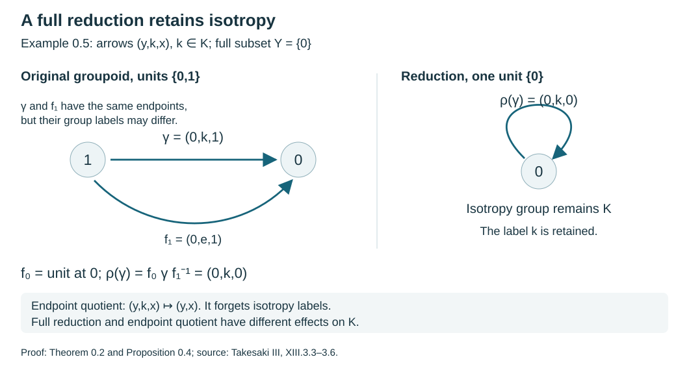
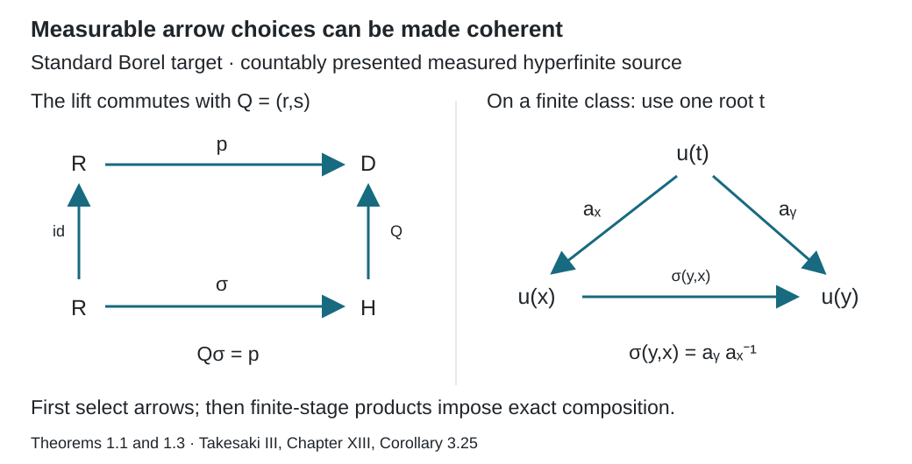
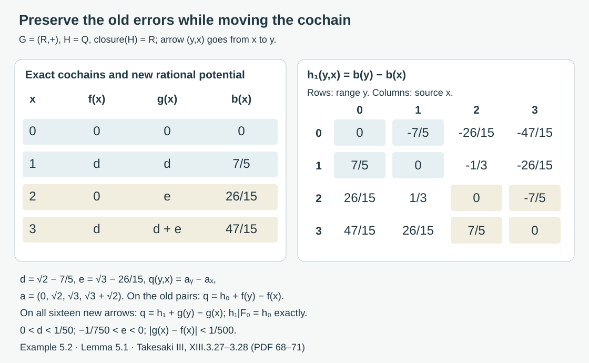

# Compatible lifts and cohomology reduction

*Written by GPT-6.1 Sol (OpenAI), Ultra, September 2026. Author self-check in progress; not independently reviewed. New original text is public domain (CC0).*

## Introduction

On a finite class, choose a root and transport every point from that root. Composing these transports gives a homomorphism on all pairs. On an increasing union of finite classes, the choices must agree with the transports already constructed.

The same compatibility principle has an analytic version. Two cocycles that agree modulo the closure of a normal subgroup can be brought into agreement modulo the subgroup itself. The correcting functions converge; the remaining subgroup-valued errors stabilize exactly. Exact stabilization is essential when the subgroup is not closed.

Read [Groupoids and measured orbit relations](groupoids-and-measured-orbit-relations.md), [Finite orbit classes and matrix blocks](finite-orbit-classes-and-matrix-blocks.md), and [Normalizers, phases, and orbit cocycles](normalizers-phases-and-orbit-cocycles.md). The groupoid prerequisite proves the unit, inverse, endpoint and equivalence identities used below and separates isotropy arrows from orbit points. [Invariant means on measured relations](invariant-means-on-measured-relations.md) supplies finite exhaustions for amenable actions. We use basic Polish-space topology and a complete compatible metric on a Polish group.

For a general standard Borel target, we use the measurable-section theorem from [Polish spaces and standard Borel spaces](https://kokunoyumeto.github.io/open-math-courses-public/courses/foundations-of-von-neumann-algebras/polish-spaces-and-standard-borel-spaces.html), Theorem 7.7, together with its Theorem 6.2 on measurable Souslin sets. A Borel map from a standard Borel space into a standard Borel space has an image admitting a section measurable for every completed sigma-finite measure. Such a section need not be Borel everywhere. We explain below why a Borel version on one invariant conull source suffices for the lifting theorem.

Throughout, \(R=\bigcup_nR_n\) is a nonsingular Borel relation with countable classes on a standard sigma-finite measured space. [Theorem 1.3 and Corollary 1.4 of the orbit lesson](orbits-stabilizers-and-relation-algebras.md#1-two-ways-to-record-an-action) supply a countable nonsingular action presenting it, including for an arbitrary orbitally countable standard Borel principal groupoid. Each \(R_n\) has finite classes and the sequence increases. All statements may be made on a common invariant conull set if the measured exhaustion or identities initially hold almost everywhere.

Choose a Borel injection \(\beta:X\to[0,1]\). Let \(t_n(x)\) be the least point of \([x]_{R_n}\), and let \(S_n=\{x:t_n(x)=x\}\). The finite-class selector proof makes these maps and sets Borel. Moreover,
\[
S_{n+1}\subset S_n.
\tag{0.1}
\]

## 0. Countable groupoids and full reductions

For a groupoid \(\mathcal G\), write \(X=\mathcal G^{(0)}\), \(s\gamma\) for the source and \(r\gamma\) for the range of an arrow. Multiplication \(\gamma\eta\) is defined when \(s\gamma=r\eta\); the arrow \(\eta\) is traversed first. Its isotropy group at \(x\) is \(\mathcal G_x^x=\{\gamma:s\gamma=r\gamma=x\}\). A standard Borel groupoid has standard Borel arrow and unit spaces, with Borel unit inclusion, source, range, inversion and multiplication on the Borel set of composable pairs. It is **orbitally countable** when its range fibres are countable; inversion then makes its source fibres countable as well.

Two homomorphisms \(p,q:\mathcal G\to\mathcal H\) are equivalent when there is an arrow \(b(x):p(x)\to q(x)\) for each unit, with
\[
q(\gamma)=b(r\gamma)\,p(\gamma)\,b(s\gamma)^{-1}.
\tag{0.2}
\]
In the Borel setting we require \(b\) to be Borel. Units prove reflexivity, inverse arrows prove symmetry, and the pointwise product of two such fields proves transitivity: the middle inverse factors cancel in (0.2). Two groupoids are **similar** when homomorphisms in both directions have composites equivalent to the respective identity homomorphisms.

**Lemma 0.1 (the derived relation is Borel).** For an orbitally countable standard Borel groupoid, the endpoint relation
\[
R_{\mathcal G}=\{(r\gamma,s\gamma):\gamma\in\mathcal G\}
\tag{0.3}
\]
is a Borel equivalence relation with countable classes. The endpoint map is a Borel surjective homomorphism onto it, and it has a Borel right section as a map of sets. This section need not be a homomorphism. The endpoint map is a Borel isomorphism precisely when the groupoid is principal.

*Proof.* The endpoint map has countable fibres, each contained in a source fibre. The exact Lusin–Novikov prerequisite in the orbit lesson makes its image Borel and supplies a Borel section. Units, inverse arrows and composition give reflexivity, symmetry and transitivity of the image. The class of \(x\) is the range of the countable source fibre at \(x\), so it is countable. Multiplication maps to \((z,y)(y,x)=(z,x)\). If the groupoid is principal, endpoint injectivity and the Borel inverse were proved in Corollary 1.4 of that lesson. Conversely injectivity makes every isotropy arrow equal to its unit, so the groupoid is principal. No assertion of compatibility of the chosen section has been used. \(\square\)

For \(Y\subset X\), the **reduction** \(\mathcal G|_Y\) consists of the arrows having both endpoints in \(Y\). The set is **full** when every orbit meets \(Y\), equivalently \(s(r^{-1}(Y))=X\). This does not mean that \(Y\) is invariant.

**Theorem 0.2 (similarity to a full reduction).** Every groupoid is similar to its reduction to a full subset. For an orbitally countable standard Borel groupoid and a full Borel subset, the homomorphisms and equivalence can be chosen Borel, with the composite on the reduction exactly its identity.

*Proof.* Choose an arrow \(f_x:x\to q(x)\in Y\) for each \(x\), taking \(f_y\) to be the unit at \(y\) when \(y\in Y\). This is a set-theoretic choice at the algebraic scope of the first assertion. At the stated Borel scope, apply Lusin–Novikov to the surjective countable-fibre map
\[
s:r^{-1}(Y)\longrightarrow X.
\]
Take its Borel section and replace its values on \(Y\) by the unit arrows. Thus both \(f\) and \(q=r\circ f\) are Borel, with \(q|_Y=\operatorname{id}_Y\).

Let \(i:\mathcal G|_Y\to\mathcal G\) be inclusion, and define
\[
\rho(\gamma)=f_{r\gamma}\,\gamma\,f_{s\gamma}^{-1}.
\tag{0.4}
\]
Its endpoints are \(q(s\gamma)\) and \(q(r\gamma)\), so it lies in the reduction. If \(s\gamma=r\eta\), then
\[
\rho(\gamma)\rho(\eta)
=f_{r\gamma}\gamma
\underbrace{f_{s\gamma}^{-1}f_{r\eta}}_{\text{unit at }s\gamma}
\eta f_{s\eta}^{-1}
=\rho(\gamma\eta).
\]
It maps unit arrows to unit arrows and therefore is a homomorphism. The maps are Borel when the choices are Borel, since every displayed product is composable and multiplication is Borel. For arrows in the reduction both outside factors in (0.4) are units, giving \(\rho i=\operatorname{id}_{\mathcal G|_Y}\). Equation (0.4) is also exactly (0.2), with \(p=\operatorname{id}_{\mathcal G}\), \(q=i\rho\) and \(b(x)=f_x\). Hence \(i\rho\) is equivalent to the identity. This proves similarity, including empty unit spaces. \(\square\)

The algebraic assertion is Takesaki XIII.3.6. The Borel enhancement uses the precisely stated countability hypothesis. It is not inferred from an arbitrary measurable-section theorem for uncountable fibres.

**Corollary 0.3 (positive measured reductions).** Let an orbitally countable standard Borel groupoid have a nonzero sigma-finite quasi-invariant ergodic unit measure \(\mu\). For every positive Borel \(Y\subset X\), its saturation \(X_0=[Y]_{R_{\mathcal G}}\) is invariant, Borel and conull, and \(\mathcal G|_{X_0}\) is Borel-similar to \(\mathcal G|_Y\). After replacing \(\mu\) by an equivalent probability on \(X_0\), the unit retraction \(q\) in the proof pushes it forward to a probability equivalent to \(\mu|_Y\).

*Proof.* The saturation is Borel by Lemma 0.1 and Lusin–Novikov for the source projection of \(r^{-1}(Y)\). It is invariant and contains \(Y\), so ergodicity makes it conull. Theorem 0.2 applies on \(X_0\).

Quasi-invariance implies null saturation even when isotropy is nontrivial. For an arrow set \(C\), source and range counting measures vanish exactly when the measures of \(s(C)\) and \(r(C)\) vanish; these projections are Borel by Lusin–Novikov. Apply this to \(C=r^{-1}(N)\) for a Borel null \(N\). Its source is \([N]_{R_{\mathcal G}}\), hence null. Let \(p\) be a probability equivalent to \(\mu\) on \(X_0\). For Borel \(N\subset Y\),
\[
N\subset q^{-1}(N)\subset[N]_{R_{\mathcal G}}.
\tag{0.5}
\]
The first inclusion uses \(q|_Y=\operatorname{id}_Y\), and the second uses the arrows \(f_x\). Thus \(q_*p(N)=0\) if and only if \(\mu|_Y(N)=0\). The pushforward is a probability because \(q\) is defined on all of \(X_0\). \(\square\)

**Proposition 0.4 (isotropy survives reduction).** For every choice in Theorem 0.2,
\[
\mathcal G_x^x\longrightarrow\mathcal G_{q(x)}^{q(x)},
\qquad h\longmapsto f_x h f_x^{-1}
\tag{0.6}
\]
is a group isomorphism. At Borel scope it is a Borel map on the isotropy field. If another choice \(f'_x\) has the same endpoint \(q(x)\), its transport differs by the inner automorphism given by \(k_x=f'_x f_x^{-1}\).

*Proof.* All products have the displayed endpoints. Cancelling \(f_x^{-1}f_x\) proves multiplication preservation, and conjugation by \(f_x^{-1}\) gives the inverse. The isotropy field is Borel since \(r=s\) is a Borel equality test in the standard unit space; Borel multiplication gives the field map. Finally \(f'_x=k_xf_x\), so its transported value is \(k_x(f_xhf_x^{-1})k_x^{-1}\). \(\square\)

**Example 0.5 (a reduction retains the group labels).** Take \(X=\{0,1\}\) and a countable group \(K\). Give \(X\times K\times X\) arrows \((y,k,x):x\to y\), with
\[
(z,l,y)(y,k,x)=(z,lk,x).
\]
The singleton \(Y=\{0\}\) is full. Choose \(f_x=(0,e,x)\). Then (0.4) sends \((y,k,x)\) to \((0,k,0)\), so the reduction is the one-unit group \(K\). Its isotropy survives unchanged. In contrast, the derived relation is the full two-point relation, whose singleton reduction has only an identity arrow. It has forgotten all \(K\)-labels. If \(K\) is nontrivial, the original groupoid cannot be similar to that one-unit trivial group: for hypothetical homomorphisms with composites equivalent to identities, their induced isotropy homomorphisms would have inverse composites up to conjugation by (0.2), whereas the composite through the trivial group annihilates every nonidentity isotropy element.

*Figure 1. The exact transport in (0.4) for Example 0.5, sampled at \(x=1,y=0\). The arrow \((0,k,1)\) becomes \((0,k,0)\) under \(f_0\gamma f_1^{-1}\), so the loop label \(k\) remains. The endpoint quotient of Lemma 0.1 instead remembers only the endpoints. This is an algebraic illustration of Theorem 0.2 and Proposition 0.4, not an isotropy-disintegration theorem. Source: Takesaki III, XIII.3.3–3.6.*

## 1. Lifting a choice of arrows

Let \(\mathcal H\) be a Borel groupoid and \(u:X\to\mathcal H^{(0)}\) a Borel map. Suppose we have a Borel choice
\[
a(y,x):u(x)\longrightarrow u(y),\qquad (y,x)\in R.
\tag{1.1}
\]
The choice need not respect composition.

**Theorem 1.1.** There is a Borel homomorphism \(\sigma:R\to\mathcal H\) with the endpoints in (1.1).

*Proof.* On \(R_1\) define
\[
\sigma_1(y,x)=a(y,t_1x)\,a(x,t_1x)^{-1}.
\tag{1.2}
\]
The two roots agree on an \(R_1\)-pair, so the product is composable. Products telescope, and units map to units.

Suppose \(\sigma_n\) is defined on \(R_n\). The relation \(R_{n+1}\) restricted to \(S_n\) has finite classes, one point for each old class inside a new class. Its root is \(t_{n+1}\). For its pairs put
\[
v_n(p,q)=a(p,t_{n+1}q)\,a(q,t_{n+1}q)^{-1}.
\]
It is a homomorphism on this finite quotient relation. Extend by
\[
\sigma_{n+1}(y,x)
=\sigma_n(y,t_ny)\,
v_n(t_ny,t_nx)\,
\sigma_n(t_nx,x).
\tag{1.3}
\]

When \(y\,R_n\,x\), their old roots coincide, so the middle factor is a unit and (1.3) equals \(\sigma_n(y,x)\). For a composable pair in \(R_{n+1}\), the two adjacent old transports at the middle point cancel, and the two \(v_n\)'s compose. Thus \(\sigma_{n+1}\) is a homomorphism.

The maps are Borel and agree exactly on their earlier domains. Define \(\sigma(y,x)=\sigma_n(y,x)\) at any stage containing the pair. This is Borel by choosing the first such stage. Every composable finite collection lies in one stage, proving the homomorphism identity for \(\sigma\). \(\square\)

For a countable transformation groupoid, (1.1) is obtained by taking the first group element carrying \(x\) to \(y\). For an arbitrary standard target, the following argument supplies the choice in the measured setting without requiring countably many target arrows.

**Lemma 1.2 (Borel versions).** A map from a standard Borel space with a sigma-finite measure into another standard Borel space, measurable for the completed source measure, agrees almost everywhere with a Borel map.

*Proof.* An empty source is immediate, and an empty target admits no map from a nonempty source. If the source measure is zero, any constant map into the nonempty target is a Borel version. Otherwise replace the source measure by an equivalent probability. Embed the target Borel-isomorphically in \([0,1]\). A completed-measurable real function has a Borel version: approximate it pointwise by simple functions, replace each of their countably many completed-measurable level sets by a Borel set differing by a null set, and take the limit on the Borel set where the resulting sequence converges. It agrees with the original function off one null set. Its values lie in the Borel image of the target almost everywhere. On that Borel preimage apply the inverse embedding, and on its complement choose any fixed target value. This constructs the asserted version. \(\square\)

**Theorem 1.3 (general measured lifting).** Let \(R=\bigcup_nR_n\) be a hyperfinite relation presented by a countable nonsingular action on a standard sigma-finite measured space. No ergodicity assumption is needed. Let \(\mathcal H\) be any standard Borel groupoid, with unit space \(V\), and let
\(u:X\to V\) be Borel. Suppose that for every \((y,x)\in R\) there is an arrow of \(\mathcal H\) from \(u(x)\) to \(u(y)\). Then on an invariant conull Borel \(X_0\subset X\) there is a Borel homomorphism
\[
\sigma:R|_{X_0}\longrightarrow\mathcal H,
\qquad s(\sigma(y,x))=u(x),\quad r(\sigma(y,x))=u(y).
\tag{1.4}
\]
The target fibres and isotropy groups may be uncountable.

*Proof.* If the source measure is zero, take \(X_0=\varnothing\). Otherwise normalize an equivalent measure on \(X\) to a probability. Source counting measure \(\nu_s\) on \(R\) is sigma-finite, since its countable presenting graphs cover \(R\) and each has measure at most one. Choose a probability \(\rho\) on \(R\) equivalent to \(\nu_s\). Explicitly, disjointify that cover into \(E_j\) and put on \(E_j\) a positive constant multiple \(2^{-j}/(1+\nu_s(E_j))\) of \(\nu_s\); the resulting finite nonzero measure can be normalized.

The map
\[
Q:\mathcal H\to V\times V,\qquad Q(\gamma)=(r\gamma,s\gamma)
\tag{1.5}
\]
is Borel. Its image \(D\) is the derived principal relation, which is a Souslin subset of the standard Borel product; it need not be a Borel subset. Define
\(p(y,x)=(u(y),u(x))\) and let \(\eta=p_*\rho\) on \(V\times V\). It is a probability concentrated on \(D\) in its completion, by the hypothesis.

The measurable-section prerequisite gives \(\tau:D\to\mathcal H\) with \(Q\tau=\mathrm{id}_D\), measurable for the completion of \(\eta\). Therefore \(a=\tau\circ p:R\to\mathcal H\) is measurable for the completion of \(\rho\): pull a Borel representative and its \(\eta\)-null exceptional set back under the pushforward map \(p\). Lemma 1.2 supplies a Borel version \(a_0\). The Borel bad-arrow set
\[
B=\{(y,x)\in R:Q(a_0(y,x))\ne (u(y),u(x))\}
\tag{1.6}
\]
is \(\rho\)-null, hence \(\nu_s\)-null.

Its source projection is Borel here for an explicit reason. If \(g_j\) enumerate the presenting action, then
\[
A=\{x:\text{some }(y,x)\in B\}
=\bigcup_j\{x:(g_jx,x)\in B\}.
\tag{1.7}
\]
The counting integral \(\nu_s(B)=0\) makes \(\mu(A)=0\). Its saturation \(\bigcup_jg_jA\) is Borel and null by countability and nonsingularity. Remove that saturation. Every arrow in the remaining \(R|_{X_0}\) now has the correct endpoints under \(a_0\). Thus (1.1) holds everywhere on this reduction. Apply Theorem 1.1 to obtain (1.4). \(\square\)

If \(p:R\to\mathcal H'\) is a Borel homomorphism into the derived principal groupoid of \(\mathcal H\), its object map is \(u\), and \(p(y,x)=(u(y),u(x))\). Theorem 1.3 therefore gives
\[
Q\circ\sigma=p
\tag{1.8}
\]
on the invariant conull reduction. This is the measured lifting assertion, including targets with arbitrary standard Borel isotropy. The entire analytic set \(D\) was never asserted to be Borel; the completed pushforward measure is what makes its section usable.

*Figure 2. Theorems 1.1 and 1.3. A measurable section first chooses individual arrows above \(p\). On a finite class, transports from one root give \(\sigma(y,x)=a_y a_x^{-1}\); the reverse root transport is used first. The coherent maps satisfy \(Q\sigma=p\). Later finite stages preserve these earlier products exactly. This realizes the lifting mechanism of Takesaki, Chapter XIII, Corollary 3.25.*

**Corollary 1.4 (extensions).** A surjective Borel groupoid homomorphism \(\pi:\mathcal E\to R\), with \(\mathcal E\) standard Borel and \(\pi\) the identity on units, has a Borel homomorphic section on an invariant conull reduction of the measured hyperfinite relation.

*Proof.* Apply the measurable-section theorem to \(\pi\) and the same equivalent probability \(\rho\) on \(R\). Replace its measurable section by a Borel version. The bad set \(\{(y,x):\pi(a_0(y,x))\ne(y,x)\}\) is a null Borel arrow set. Remove its source saturation by (1.7). The resulting choice has the correct endpoints because \(\pi\) fixes units. Theorem 1.1 then makes it coherent, and the products (1.2)–(1.3), after applying \(\pi\), telescope to \((y,x)\). Hence \(\pi\sigma=\mathrm{id}\). \(\square\)

## 2. Splitting an extension over the relation

Suppose \(\pi:\mathcal E\to R\) is a Borel groupoid homomorphism, is the identity on units, and admits a Borel arrow choice as in (1.1) with \(\pi(a(y,x))=(y,x)\). The construction in Theorem 1.1 then satisfies \(\pi\sigma=\mathrm{id}_R\).

In the standard Borel measured setting with \(\pi\) surjective, Corollary 1.4 provides this section on one invariant conull reduction, even when the extension fibres are uncountable. The coordinates below apply to the entire extension over that reduction.

Let \(K_x=\pi^{-1}(x,x)\), the kernel group at \(x\). Each arrow \(\gamma:x\to y\) has the unique form
\[
\gamma=k\,\sigma(y,x),\qquad
k=\gamma\sigma(y,x)^{-1}\in K_y.
\tag{2.1}
\]
Conjugation by \(\sigma(y,x)\) gives an isomorphism
\[
c_{y,x}:K_x\to K_y,\qquad
c_{y,x}(l)=\sigma(y,x)l\sigma(y,x)^{-1}.
\tag{2.2}
\]
The homomorphism identity for \(\sigma\) gives \(c_{z,y}c_{y,x}=c_{z,x}\). In the coordinates \((k,y,x)\), composition is
\[
(k,z,y)(l,y,x)=(k\,c_{z,y}(l),z,x).
\tag{2.3}
\]
This is the **semidirect product** of the kernel group field with the principal relation. All these coordinates are Borel because the maps and their inverses in (2.1) are explicit.

**Proposition 2.1.** For a nonsingular ergodic action of a countable abelian group \(\Gamma\), its stabilizer is almost everywhere the action's kernel \(H\). If its principal relation is hyperfinite, the transformation groupoid is isomorphic to the direct product \(H\times R\).

*Proof.* For each \(g\in\Gamma\), its fixed-point set is invariant under every element of \(\Gamma\), by commutativity. Ergodicity makes each fixed-point set null or conull. It is conull exactly when \(g\) acts trivially modulo null sets. Remove the union of the zero-measure fixed-point sets and all exceptional sets for the kernel elements; countability permits one common invariant conull space. Its stabilizers are exactly \(H\).

The first presenting group element carrying \(x\) to \(y\) supplies the arrow choice. Theorem 1.1 splits the transformation groupoid over \(R\). Since \(\Gamma\) is abelian, conjugation in (2.2) is the identity on \(H\), so (2.3) is direct-product multiplication. \(\square\)

**Example 2.2.** Let \(\mathbb Z\) act by a three-cycle on \(\{0,1,2\}\). The kernel is \(3\mathbb Z\). A splitting of its transformation groupoid is
\[
\sigma(i,j)=(i-j,j),
\]
where the integer arrow \((n,j)\) goes from \(j\) to \(j+n\pmod3\). The labels telescope:
\((i-j)+(j-k)=i-k\). This groupoid splitting does not split the group extension
\(3\mathbb Z\to\mathbb Z\to\mathbb Z/3\mathbb Z\). The latter has no homomorphic section, since \(\mathbb Z\) has no nonzero element of order three.

## 3. Removing a two-cocycle

Let \(G\) be a Polish group and \(H\) a normal Borel subgroup; closedness is unnecessary. Suppose a Borel map \(a:R\to G\), with \(a(x,x)=1\), has defects
\[
a(z,y)a(y,x)=u(z,y,x)a(z,x),\qquad u(z,y,x)\in H.
\tag{3.1}
\]
This means that \(a\) is a homomorphism modulo \(H\). The associative group law forces the usual twisted two-cocycle identity for \(u\).

**Theorem 3.1.** There is a Borel homomorphism \(b:R\to G\) with \(b(y,x)H=a(y,x)H\). Setting \(v(y,x)=b(y,x)a(y,x)^{-1}\in H\), the defect is
\[
u(z,y,x)
=a(z,y)v(y,x)^{-1}a(z,y)^{-1}
\,v(z,y)^{-1}v(z,x).
\tag{3.2}
\]

*Proof.* Form the Borel groupoid
\[
\mathcal E=\{(g,y,x): (y,x)\in R,\;ga(y,x)^{-1}\in H\}
\tag{3.3}
\]
with composition
\((g,z,y)(h,y,x)=(gh,z,x)\), inverses
\((g,y,x)^{-1}=(g^{-1},x,y)\), and units \((1,x,x)\).
Normality of \(H\) and (3.1) make composition and inversion stay in \(\mathcal E\). It is a standard Borel space because \(H\) is Borel and (3.3) is a Borel subset of \(G\times R\). Projection to \(R\) has the explicit arrow choice \((a(y,x),y,x)\).

Theorem 1.1 gives a homomorphic section. Its \(G\)-coordinate is the required \(b\). The map \(v\) is Borel and \(H\)-valued. Substitute \(b=va\) into \(b(z,y)b(y,x)=b(z,x)\) and multiply in order to obtain (3.2). \(\square\)

The order in (3.2) matters when \(G\) is noncommutative. This argument also explains the splitting mechanism of Section 2: a compatible finite-class lift removes the composition defect.

## 4. A small correction on a finite class

Now put \(K=\overline H\), a closed normal subgroup of \(G\). Let \(p,q:R\to G\) be Borel homomorphisms with
\[
q(y,x)K=p(y,x)K.
\tag{4.1}
\]
Let \(d\) be a complete metric giving the topology of \(G\).

**Lemma 4.1.** On a finite-class Borel subrelation \(F\), for every positive Borel function \(\varepsilon:X\to(0,\infty)\), there are Borel maps \(f:X\to K\) and \(h:F\to H\) such that
\[
q(y,x)=h(y,x)f(y)p(y,x)f(x)^{-1},\qquad
d(f(x),1)<\varepsilon(x),
\tag{4.2}
\]
and \(f=1\) on a Borel transversal of \(F\).

*Proof.* Let \(t(x)\) be the least-point selector of \(F\). Put
\[
p_x=p(x,t(x)),\quad q_x=q(x,t(x)),\quad
d_x=q_xp_x^{-1}\in K.
\]
Choose a countable dense subset \(\{k_j\}\) of \(H\) in \(K\). Such a set exists because \(K\) is second countable and \(H\) is dense. Take the first \(k_j\) with
\[
d(k_j^{-1}d_x,1)<\varepsilon(x),
\]
and call it \(k_x\). At a root set \(k_x=1\). The first-choice rule is Borel; a qualifying element exists by density and continuity. Set \(f(x)=k_x^{-1}d_x\). Then \(q_x=k_xf(x)p_x\).

On a pair of the same finite class,
\[
q(y,x)=k_y\,p^f(y,x)\,k_x^{-1},
\qquad p^f(y,x)=f(y)p(y,x)f(x)^{-1}.
\]
Hence \(h(y,x)=q(y,x)p^f(y,x)^{-1}\) belongs to \(H\), by normality. It is Borel and gives (4.2). At a root \(d_x=1\), so \(f=1\). \(\square\)

The map \(h\) in this lemma need not be an ordinary homomorphism. Its multiplication law is twisted by the cocycle \(p^f\).

## 5. Preserving an earlier correction

**Lemma 5.1.** Suppose \(f_n,h_n\) satisfy (4.2) on \(R_n\), with \(f_n=1\) on \(S_n\). For every \(\eta>0\), they extend to \(f_{n+1},h_{n+1}\) on \(R_{n+1}\) such that
\[
h_{n+1}|_{R_n}=h_n,\qquad
f_{n+1}|_{S_{n+1}}=1,\qquad
d(f_{n+1}(x),f_n(x))<\eta.
\tag{5.1}
\]

*Proof.* For \(t\in S_n\), choose a Borel radius \(\varepsilon(t)>0\) so small that \(d(w,1)<\varepsilon(t)\) implies
\[
d\bigl(f_n(x)p(x,t)wp(t,x),f_n(x)\bigr)<\eta
\quad\text{for every }x\,R_n\,t.
\tag{5.2}
\]
Continuity and finiteness of the class give such a radius. To make the choice Borel, fix a countable dense set \(\{g_j\}\subset G\), and test the radii \(2^{-k}\). Require that for every \(x\) in the finite class and every \(g_j\) in that open ball, the displayed distance is at most \(\eta/2\). A sufficiently small radius passes by continuity. These are countably many Borel tests, using finite-class selectors. Their first passing radius is Borel. Density and continuity extend the test to the entire open ball, giving (5.2).

Apply Lemma 4.1 to the finite quotient relation \(R_{n+1}|_{S_n}\), to \(p,q\) restricted there, and to these radii. Obtain \(w:S_n\to K\), with \(w=1\) on \(S_{n+1}\), such that
\[
q(t',t)=k(t',t)w(t')p(t',t)w(t)^{-1},
\qquad k(t',t)\in H.
\]
Define
\[
f_{n+1}(x)
=f_n(x)p(x,t_nx)w(t_nx)p(t_nx,x).
\tag{5.3}
\]
It is \(K\)-valued, since \(K\) is normal. Equation (5.2) gives the distance bound.

For an old pair \(y\,R_n\,x\), the inserted \(w\)'s occur at the same root and cancel in \(p^{f_{n+1}}(y,x)\). Therefore
\[
p^{f_{n+1}}(y,x)=p^{f_n}(y,x).
\tag{5.4}
\]
The defect \(h_{n+1}=q(p^{f_{n+1}})^{-1}\) agrees exactly with \(h_n\) there.

For a new pair, split it into the old transport from \(x\) to \(t_nx\), the quotient arrow from \(t_nx\) to \(t_ny\), and the old transport to \(y\). On the two old transports the discrepancy belongs to \(H\), by the hypothesis; on the quotient arrow it belongs to \(H\), by the chosen \(w\). Normality of \(H\) keeps the discrepancy of their product in \(H\). Thus \(h_{n+1}\) is \(H\)-valued on all of \(R_{n+1}\).

Finally, if \(x\in S_{n+1}\subset S_n\), both the old value and the inserted \(w\) are one, so (5.3) is one. \(\square\)

### A four-point correction with a nonclosed subgroup

**Example 5.2 (small movement, fixed rational errors).** Take the additive Polish group \(G=\mathbb R\), its normal Borel subgroup \(H=\mathbb Q\), and \(K=\overline H=\mathbb R\), with \(d(s,t)=|s-t|\). Let \(X=\{0,1,2,3\}\), giving each point positive measure. The old relation \(F_0\) has classes \(\{0,1\}\) and \(\{2,3\}\); the new relation \(F_1=X\times X\) has one class. Put
\[
a=(0,\sqrt2,\sqrt3,\sqrt3+\sqrt2),\qquad
p(y,x)=0,\qquad q(y,x)=a_y-a_x.
\tag{5.5}
\]
Both \(p,q\) are homomorphisms. The closure-coset condition (4.1) holds because \(K=\mathbb R\).

Write
\[
r=\frac75,\qquad s=\frac{26}{15},\qquad
d=\sqrt2-r,\qquad e=\sqrt3-s.
\]
On the old relation choose
\[
f=(0,d,0,d),\qquad
h_0(y,x)=r(y-x)\quad\text{for }(y,x)\in F_0.
\tag{5.6}
\]
Within either old class \(y-x\) is \(0\) or \(\pm1\), so \(h_0\) is rational-valued. Direct subtraction gives
\[
q(y,x)=h_0(y,x)+f(y)-f(x)\qquad((y,x)\in F_0).
\]
The roots \(0,2\) have \(f=0\). Squaring the positive rationals \(7/5\) and \(71/50\) gives
\(7/5<\sqrt2<71/50\), hence \(0<d<1/50\).
Thus this is a correction of size less than \(1/50\) as in Lemma 4.1.

Now extend to the new class by setting
\[
g=(0,d,e,d+e),\qquad
b=a-g=(0,r,s,r+s),\qquad
h_1(y,x)=b_y-b_x.
\tag{5.7}
\]
The identity \(q(y,x)=h_1(y,x)+g(y)-g(x)\) holds on all sixteen arrows. The potential \(b\) has rational coordinates, so \(h_1\) is rational-valued and is itself a homomorphism. Its value on each old forward arrow \(0\to1\) and \(2\to3\) is exactly \(r=7/5\); the reverse values are \(-r\) and the diagonal values are zero. Therefore \(h_1|_{F_0}=h_0\) exactly.

The two points of the second old class receive the same added amount \(e\), while the first old class does not move. This common addition cancels on every old arrow. Moreover,
\[
\left(\frac{433}{250}\right)^2<3<
\left(\frac{26}{15}\right)^2,\qquad
\frac{26}{15}-\frac{433}{250}=\frac1{750}.
\]
Consequently \(-1/750<e<0\), so \(|g(x)-f(x)|<1/500\) at every point. The new root \(0\) still has \(g(0)=0\). This checks all extension conclusions of Lemma 5.1 with \(\eta=1/500\), including its exact preservation condition.

The correcting function cannot in general be required to take values in \(H\). If both a correcting function \(v:X\to\mathbb Q\) and its discrepancy \(k:F_0\to\mathbb Q\) satisfied (5.6)'s correction identity, the arrow \(0\to1\) would give
\(\sqrt2=k(1,0)+v(1)-v(0)\in\mathbb Q\), a contradiction. The closure-valued cochain and the subgroup-valued discrepancy are different requirements.

*Figure 3. Example 5.2 and Lemma 5.1. The left table gives the exact old and new cochains and the new rational potential. The right matrix lists \(h_1(y,x)=b_y-b_x\), with range \(y\) indexing rows and source \(x\) indexing columns. Shaded blocks are precisely the eight old \(F_0\)-arrows, including their diagonal arrows; their errors are unchanged. Both rows of the second old class receive the same addition \(e\). No geometric distance between the four units is asserted. Human source: Takesaki III, XIII.3.27–3.28 supplied PDF pages 68–71. Reproducible figure source: make_stabilized_rational_correction.py.*

## 6. The limiting correction

**Theorem 6.1 (cohomology reduction).** Under (4.1), there are Borel maps \(f:X\to K\) and \(h:R\to H\) such that
\[
q(y,x)=h(y,x)f(y)p(y,x)f(x)^{-1}.
\tag{6.1}
\]

*Proof.* Start with Lemma 4.1 on \(R_1\). Apply Lemma 5.1 successively with distance bounds \(2^{-n}\). For each \(x\), the sequence \(f_n(x)\) is Cauchy in the complete metric \(d\); let \(f(x)\) be its limit. It belongs to the closed group \(K\) and is Borel as a pointwise limit of Borel maps.

For an arrow in \(R_n\), the values \(h_m\), \(m\geq n\), are exactly equal. Define \(h\) by this stabilized value, using the first stage containing the arrow. This is a Borel \(H\)-valued map. Letting \(m\to\infty\) in the finite-stage identity gives (6.1), by continuity of multiplication and inversion. \(\square\)

The limit \(f\) is asserted to lie in \(\overline H\), while \(h\) lies in \(H\) itself. Replacing exact stabilization of \(h_n\) by convergence would only place its limit in \(\overline H\), losing the theorem's content.

**Corollary 6.2.** If \(H\) is dense in \(G\), every Borel \(G\)-valued cocycle on \(R\) is cohomologous to an \(H\)-valued cocycle.

*Proof.* Take \(p=1\) and \(q\) to be the given cocycle. Equation (6.1) gives
\[
f(y)^{-1}q(y,x)f(x)=f(y)^{-1}h(y,x)f(y)\in H,
\]
using normality. The left side is a homomorphism, being a gauge transform of \(q\). \(\square\)

## 7. Exercises with solutions

Level 1 asks for a computation or a direct application. Level 2 asks for a proof using the lesson’s framework. Level 3 combines results or examines a hypothesis whose failure changes the conclusion.

**Exercise 7.1 (a compatible quotient).** *Level 1.* Explain why the quotient relation in Theorem 1.1 has finite classes, and why its least root is \(t_{n+1}\).

*Solution.* A new finite class contains finitely many old classes. Choosing their old least points gives exactly its quotient class in \(S_n\). The least of these points is the least point of the whole new class, namely \(t_{n+1}\). This proves both finiteness and the nested-root property used in (1.3).

**Exercise 7.2 (multiplication with isotropy).** *Level 2.* In the three-cycle example, write an arrow from \(j\) to \(i\) as a kernel element followed by the section, and compute its kernel coordinate.

*Solution.* If its integer label is \(n\), then \(n\equiv i-j\pmod3\). It equals \((n-(i-j),i)\,\sigma(i,j)\). The first label belongs to \(3\mathbb Z\) and is the unique kernel coordinate. Two such coordinates add under composition because conjugation is trivial.

**Exercise 7.3 (a rational finite correction).** *Level 2.* On a three-point complete relation, let \(p=0\) and \(q(i,j)=a_i-a_j\) in the additive group \(\mathbb R\), with \(a_0=0\). For \(H=\mathbb Q\), explicitly achieve a correction of size less than \(\varepsilon\).

*Solution.* Choose rational \(r_i\) with \(|a_i-r_i|<\varepsilon\), and take \(r_0=0\). Set \(f(i)=a_i-r_i\) and \(h(i,j)=r_i-r_j\). Then \(q(i,j)=h(i,j)+f(i)-f(j)\), the correcting function is small and vanishes at the root, and \(h\) is rational-valued.

**Exercise 7.4 (a closed subgroup).** *Level 2.* If \(H\) is closed and \(q(y,x)H=p(y,x)H\), show that Theorem 6.1 needs no limiting construction.

*Solution.* Set \(f=1\) and \(h(y,x)=q(y,x)p(y,x)^{-1}\). Equality of cosets and normality put \(h\) in \(H\), and (6.1) holds directly. The approximation construction is needed to replace membership in \(\overline H\) by membership in a possibly smaller nonclosed subgroup.

**Exercise 7.5 (checking the order).** *Level 3.* Starting with \(b=va\), derive (3.2) without commuting any factors.

*Solution.* The homomorphism identity gives
\[
v(z,y)a(z,y)v(y,x)a(y,x)=v(z,x)a(z,x).
\]
Multiplying on the left first by \(v(z,y)^{-1}\), then by the inverse of the conjugated factor \(a(z,y)v(y,x)a(z,y)^{-1}\), yields
\[
a(z,y)a(y,x)
=a(z,y)v(y,x)^{-1}a(z,y)^{-1}
v(z,y)^{-1}v(z,x)a(z,x).
\]
Comparison with (3.1) is exactly (3.2).

**Exercise 7.6 (removing bad arrows).** *Level 2.* If a Borel \(B\subset R\) has \(\nu_s(B)=0\), prove directly from the countable presentation that its source projection and its saturation are Borel and null. Explain why this yields correctness on every arrow of a conull reduction.

*Solution.* The source projection is the union in (1.7), a countable union of Borel sets. Its indicator is zero almost everywhere because \(\int\#\{y:(y,x)\in B\}\,d\mu(x)=0\). Each presenting transformation takes it to a null Borel set by nonsingularity. Their countable union is its saturation, also null and Borel. Outside that invariant saturation no source has a bad outgoing arrow. Thus the Borel version has the required endpoint identities on all arrows of the restricted relation, rather than only almost every arrow.

**Exercise 7.7 (uncountable isotropy).** *Level 1.* Regard \((\mathbb R,+)\) as a groupoid with one unit. The derived principal groupoid has only its unit arrow. For a Borel real function \(f\) on \(X\), give two lifts of the constant homomorphism from \(R\) to this derived groupoid, and check their composition laws.

*Solution.* Take \(\sigma_0(y,x)=0\) and \(\sigma_f(y,x)=f(y)-f(x)\). They both have the unique prescribed source and range. The second satisfies \((f(z)-f(y))+(f(y)-f(x))=f(z)-f(x)\), and the first is immediate. Inverses change signs and units have value zero. Projection to the derived groupoid forgets both values. Thus lifts need not be unique and uncountable isotropy is compatible with the theorem.

**Exercise 7.8 (an additive two-cocycle).** *Level 3.* Let a normalized Borel function \(w:R^{(3)}\to\mathbb R\) satisfy
\[
w(t,z,y)+w(t,y,x)=w(z,y,x)+w(t,z,x)
\]
on related quadruples. Form the extension with arrows \((a,y,x)\in\mathbb R\times R\) and multiplication
\[
(a,z,y)(b,y,x)=(a+b+w(z,y,x),z,x).
\]
Show that on an invariant conull reduction there is Borel \(d:R\to\mathbb R\) with
\(w(z,y,x)=d(z,x)-d(z,y)-d(y,x)\).

*Solution.* The displayed cocycle identity is exactly associativity of the multiplication. Normalization means \(w(z,y,y)=w(y,y,x)=0\), giving units \((0,x,x)\); the arrows \((a,x,x)\) form the additive isotropy group at \(x\). Inversion is
\((a,y,x)^{-1}=(-a-w(x,y,x),x,y)\);
the identity on the quadruple \((y,x,y,x)\) gives \(w(y,x,y)=w(x,y,x)\), so it is an inverse on both sides. This is a standard Borel groupoid, and projection to \(R\) is a surjective Borel homomorphism fixing units. Corollary 1.4 supplies a homomorphic section \(\sigma(y,x)=(d(y,x),y,x)\). Its homomorphism identity reads
\(d(z,x)=d(z,y)+d(y,x)+w(z,y,x)\),
which is the asserted formula. The \(d\)-coordinate is Borel and \(d(x,x)=0\). The construction applies without an ergodicity assumption and without a countable extension fibre.

**Exercise 7.9 (pushforward can lose sigma-finiteness).** *Level 2.* Give the full relation on \(\mathbb Z\) counting unit measure and reduce it to \(Y=\{0\}\). Compute the pushforward under the constant retraction of that counting measure, and of the equivalent probability \(p(\{n\})=2^{-|n|}/3\). Explain the probability replacement in Corollary 0.3.

*Solution.* The counting measure is invariant, sigma-finite and ergodic for the full relation. Its pushforward assigns infinity to \(\{0\}\), so no finite-measure sets can cover \(Y\); this pushforward is not sigma-finite. Since \(\sum_{n\in\mathbb Z}2^{-|n|}=3\), the stated \(p\) is a probability with strictly positive point masses, hence equivalent to counting measure. Its pushforward is the unit point mass at \(0\), equivalent to counting measure restricted to \(Y\). Equivalence of measure classes does not make the two pushforwards equally finite or sigma-finite. Replacing the original unit measure by an equivalent probability before pushing forward ensures precisely the finite measure needed in (0.5).

**Exercise 7.10 (changing the isotropy transport).** *Level 2.* In Example 0.5 let \(K=S_3\). At \(x=1\), compare \(f_1=(0,e,1)\) with \(f'_1=(0,(1\,2),1)\), using unit arrows at \(0\) for both choices. Transport the isotropy element \((1,(1\,2\,3),1)\).

*Solution.* The first choice transports it to \((0,(1\,2\,3),0)\). The second gives \((0,(1\,2)(1\,2\,3)(1\,2),0)=(0,(1\,3\,2),0)\). The intervening loop is \(k_1=f'_1f_1^{-1}=(0,(1\,2),0)\), so these two identifications differ exactly by its inner conjugation, as Proposition 0.4 states. Both give isomorphisms of the entire isotropy group; neither forgets the group labels.

**Exercise 7.11 (why preservation must be exact).** *Level 3.* In Example 5.2 replace the new cochain \(g\) by \(g'=g+(0,0,0,\epsilon)\), where \(\epsilon=\sqrt2/1000\). Compute the new discrepancy on \(2\to3\), and show that it can leave \(H=\mathbb Q\) even though the change is smaller than \(1/500\). Explain why the extension proof inserts one common correction at the root of each old class.

*Solution.* Define \(h'(y,x)=q(y,x)-g'(y)+g'(x)\). On the arrow \(2\to3\) this gives
\[
h'(3,2)=\frac75-\epsilon.
\]
The number \(\epsilon\) is nonzero and irrational, so this error is not rational. Its change from \(h_1(3,2)=7/5\) has magnitude \(\epsilon<1/500\), because \(\sqrt2<2\). On the reverse arrow the error is \(-7/5+\epsilon\). Thus small changes of an \(H\)-valued error need not stay in a nonclosed subgroup, even at one finite extension step. The common root correction in (5.3) is transported coherently to the whole old class; its inserted factors cancel on each old arrow, yielding (5.4) and exactly the same old discrepancy. Example 5.2 uses a common addition \(e\) on \(\{2,3\}\); the unequal additions defining \(g'\) break precisely that cancellation.

## References

[Takesaki] Masamichi Takesaki, *Theory of Operator Algebras III*, Encyclopaedia of Mathematical Sciences 127, Springer, 2003. [Publisher record](https://doi.org/10.1007/978-3-662-10453-8). The cohomology reduction theorem permits a normal Borel subgroup that need not be closed.
