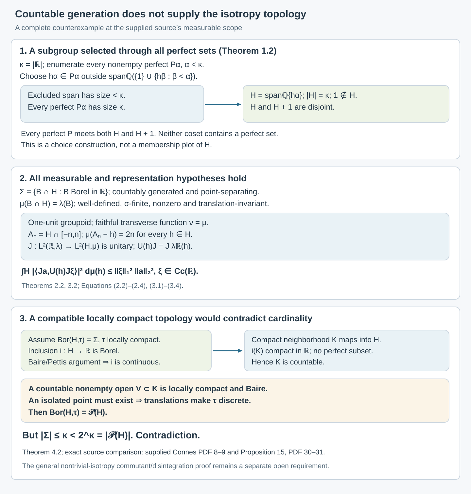

# Countable generation and isotropy topologies

*Written by GPT-6.1 Sol (OpenAI), Ultra, October 2026. Author self-check in progress; not independently reviewed. New original text is public domain (CC0).*

## Introduction

A countably generated σ-algebra can separate every point and support a σ-finite invariant measure without making its group a locally compact group. We construct an example and prove this obstruction completely. It explains why the topology and disintegration step in the general isotropy theorem needs more than countable generation.

The supplied typeset transcription of [Connes] defines a separable measurable groupoid by countable generation of its arrow σ-algebra, on PDF 8. The author-hosted typeset version gives the same definition on PDF 10 and the same Proposition 15 on PDF 38–39. That proposition describes the isotropy groups as locally compact and uses a Haar product decomposition of each range fibre. The example below satisfies that measurable definition and has a faithful proper transverse function, but its sole isotropy group admits no compatible locally compact Hausdorff group topology.

The definition, properness requirement and full Proposition 15 argument have been compared in both typeset versions. The original Springer facsimile has not been compared. The general commutant-generation assertion of Proposition 15(b) is a separate claim. We calculate the regular commutant in this example; that calculation does not establish generation by a countable averaged-coefficient family. [Principal groupoids with extra fibre information](principal-groupoids-with-extra-fibre-information.md), Sections 1–6, supplies a complete finite faithful counterexample to that unrestricted assertion and to the unrestricted scalar-centre and factor criteria. Its units are standard Borel, but its arrow sigma-field is merely countably generated. The positive standard Borel theorems and the broader disintegration problem keep their separate hypotheses.

Prerequisites are elementary cardinal arithmetic with the axiom of choice, Lebesgue inner regularity, Hilbert spaces and the Baire theorem for locally compact Hausdorff spaces. The construction of the subgroup and every obstruction used below are proved in the lesson. The regular representation connects the example to [Isotropy and random-operator fibres](isotropy-and-random-operator-fibres.md) and to the definitions in [Claude-RO].

## 1. Perfect sets and a subgroup missing one

Write \(\kappa=|\mathbb R|\). A perfect subset of \(\mathbb R\) is closed, nonempty and has no isolated points.

**Lemma 1.1.** Every perfect set has cardinality \(\kappa\). Every uncountable compact subset of \(\mathbb R\) contains a perfect set. Every positive-Lebesgue-measure Borel set contains a perfect set.

*Proof.* Inside a perfect set \(P\), recursively choose two disjoint closed intervals around distinct points of \(P\) inside each previously chosen interval. Choose them in its interior, make their diameters at most \(2^{-n}\) at stage \(n\), and keep the chosen points in their interiors. Each infinite binary path has a unique limit in \(P\), by nested compact intervals and closedness. Different paths have different limits because sibling intervals are disjoint. This injects \(\{0,1\}^{\mathbb N}\) into \(P\), proving its cardinality is \(\kappa\).

For an uncountable compact \(K\), let \(N\) be the union, within \(K\), of the rational open intervals that meet \(K\) in a countable set. There are only countably many such intervals, so \(N\) is countable and relatively open in \(K\). The set \(P=K\setminus N\) is nonempty and closed. If \(p\in P\) were isolated in \(P\), a small rational interval \(J\) around it would satisfy \(J\cap K\subset N\cup\{p\}\), a countable set. This would put \(p\) in \(N\), a contradiction. Hence \(P\) is perfect.

Finally, inner regularity supplies a compact subset of positive finite measure inside a positive-measure Borel set, first intersecting with a bounded interval if necessary. It is uncountable, because countable sets have measure zero, so the preceding argument supplies a perfect subset. \(\square\)

The family of nonempty perfect subsets has cardinality \(\kappa\). There are at most \(\kappa\) closed subsets of \(\mathbb R\), since open sets are determined by a countable rational basis; there are at least \(\kappa\) distinct closed intervals. Well-order this family as \((P_\alpha)_{\alpha<\kappa}\), with \(\kappa\) viewed as its initial ordinal.

**Theorem 1.2.** There is an additive subgroup \(H\subset\mathbb R\), of cardinality \(\kappa\), such that \(1\notin H\) and every perfect set meets both \(H\) and \(H+1\). In particular, neither \(H\) nor its complement contains a perfect set.

*Proof.* At stage \(\alpha\), choose
\[
h_\alpha\in P_\alpha\setminus
\operatorname{span}_{\mathbb Q}\bigl(\{1\}\cup\{h_\beta:\beta<\alpha\}\bigr).
\tag{1.1}
\]
The excluded span has cardinality at most \(\max(\aleph_0,|\alpha|)<\kappa\), since its elements are finite rational combinations. Lemma 1.1 makes the choice possible. This bound holds even if \(\kappa\) is singular; no union of \(\kappa\) earlier stages is taken at one stage.

Set
\[
H=\operatorname{span}_{\mathbb Q}\{h_\alpha:\alpha<\kappa\}.
\tag{1.2}
\]
The choices make the family \(\{1\}\cup\{h_\alpha\}\) linearly independent over \(\mathbb Q\): any finite dependence has a last selected index and contradicts (1.1). Thus \(1\notin H\) and \(|H|=\kappa\). Every perfect set contains its selected \(h_\alpha\), so it meets \(H\).

If \(P\) is perfect, so is \(P-1\). Choose \(h\in H\cap(P-1)\); then \(h+1\in P\cap(H+1)\). The cosets \(H\) and \(H+1\) are disjoint, since \(1\notin H\). Thus a perfect set contained in either coset is impossible. Since every perfect set meets \(H\), none is contained in its complement either. \(\square\)

This is an existence construction by choice. It does not give a formula for deciding membership in \(H\). Its perfect-set intersection properties, rather than such a formula, will determine every measure and topology conclusion.

## 2. A separated countably generated measurable group

Give \(H\) the trace σ-algebra
\[
\Sigma=\{B\cap H:B\subset\mathbb R\text{ Borel}\}.
\tag{2.1}
\]
The traces of rational intervals generate it and separate its points. Its cardinality is at most \(\kappa\). Addition and inversion are measurable: \(\Sigma\otimes\Sigma\) is the trace on \(H\times H\) of the Borel σ-algebra of \(\mathbb R^2\), because the latter is generated by countably many rational rectangles. The ordinary continuous addition and inversion maps therefore restrict to measurable maps on \(H\).

**Lemma 2.1.** Every Borel \(B\subset\mathbb R\) disjoint from \(H\) has Lebesgue measure zero. The subgroup \(H\) is not Borel and \((H,\Sigma)\) is not standard Borel.

*Proof.* If such a \(B\) had positive measure, Lemma 1.1 would supply a perfect subset of \(B\), contrary to Theorem 1.2. The same argument applies to Borel sets disjoint from \(H+1\), because that coset also meets every perfect set.

If \(H\) were Borel, its complement, being disjoint from \(H\), would be null. But \(H\), being disjoint from \(H+1\), would also be null. This cannot cover \(\mathbb R\), so \(H\) is not Borel. It is not Lebesgue measurable either: a positive-measure Lebesgue-measurable set contains a positive-measure Borel subset and hence a perfect set. Neither \(H\) nor its complement can contain one, so if they were measurable both would be null, again impossible.

If its trace space were standard Borel, the inclusion into \(\mathbb R\) would be an injective Borel map between standard Borel spaces. The one-to-one Borel image theorem would make its image \(H\) Borel, a contradiction. \(\square\)

The last step uses the exact standard Borel image theorem [Claude-PB, Theorem 4.3]. This does not assert that a point-separating countably generated space is standard.

**Theorem 2.2.** The rule
\[
\mu(B\cap H)=\lambda(B)
\tag{2.2}
\]
defines a nonzero, σ-finite, translation-invariant measure on \((H,\Sigma)\), where \(\lambda\) is Lebesgue measure.

*Proof.* If \(B\cap H=C\cap H\), then \(B\mathbin{\triangle}C\) is Borel and disjoint from \(H\), so it is null by Lemma 2.1. Thus (2.2) is well-defined, including infinite values.

Suppose \(B_n\cap H\) are pairwise disjoint. Each \(B_n\cap B_m\) with \(n\ne m\) is disjoint from \(H\) and null. Disjointize them by \(C_n=B_n\setminus\bigcup_{m<n}B_m\). Their union is unchanged, and \(\lambda(C_n)=\lambda(B_n)\). Countable additivity of \(\lambda\) proves countable additivity of \(\mu\).

For \(h\in H\),
\[
(B\cap H)+h=(B+h)\cap H,
\tag{2.3}
\]
so translation invariance follows from that of \(\lambda\). The sets \(H\cap[-n,n]\) cover \(H\) and have measure \(2n\). Also \(\mu(H\cap[0,1])=1\), proving nonzeroness. \(\square\)

For every nonnegative Borel function \(f\) on \(\mathbb R\), simple-function approximation gives
\[
\int_H f|_H\,d\mu=\int_{\mathbb R}f\,d\lambda.
\tag{2.4}
\]
It is important that \(\mu\) is a measure on traces. Formula (2.2) does not assign an ordinary Lebesgue measure to the nonmeasurable subset \(H\) of \(\mathbb R\).

## 3. The proper transverse function and regular representation

Regard \(H\) as a groupoid with one unit \(e=0\). Its arrow σ-algebra is \(\Sigma\), and its unit space is standard Borel. It is separable in the supplied source's precise countable-generation sense.

The measure \(\nu^e=\mu\) is a transverse function, since left translations preserve \(\mu\). It is faithful because its sole range-fibre measure is nonzero. It is proper even under the source's translated-cover definition: with \(A_n=H\cap[-n,n]\),
\[
\nu^e(h^{-1}A_n)=\mu(A_n)=2n
\qquad(h\in H).
\tag{3.1}
\]
Here \(h^{-1}A_n=A_n-h\). Thus the translated fibre mass is uniformly bounded at each stage. The measurability, faithfulness, properness and separability assumptions have all been verified.

**Lemma 3.1.** Restriction induces a unitary
\[
J:L^2(\mathbb R,\lambda)\longrightarrow L^2(H,\mu).
\tag{3.2}
\]
In particular, the latter Hilbert space is separable.

*Proof.* Use Borel representatives of Lebesgue-measurable functions; every Lebesgue class has one. Formula (2.4) proves that restriction is well-defined on classes and isometric.

To prove surjectivity, first extend a simple \(\Sigma\)-measurable function on \(H\) to a Borel simple function on \(\mathbb R\) by extending its level sets. If these extensions overlap outside \(H\), disjointize them there; their restrictions are unchanged. For a nonnegative measurable function on \(H\), choose the usual increasing simple approximations and extend each to a Borel function. On the Borel set where the extended sequence has a finite limit, take that limit; where it diverges, put zero. This extends every finite nonnegative function on \(H\). Positive and negative parts of real and imaginary components extend a complex measurable function.

A square-integrable function may first be set to zero on its measurable null set of infinite values. Its Borel extension is square-integrable by (2.4), giving a preimage under \(J\). \(\square\)

The regular representation is
\[
(U(h)f)(x)=f(x-h),\qquad
U(h)J=J\lambda_{\mathbb R}(h).
\tag{3.3}
\]
Its coefficient functions are restrictions of continuous coefficients of the ordinary real regular representation. They are \(\Sigma\)-measurable, so this is a measurable groupoid representation.

Strong continuity of the ordinary real regular representation follows directly on \(C_c(\mathbb R)\) from uniform continuity and a common compact support for small translations. Density of \(C_c(\mathbb R)\) and the unitary norm bound extend it to every \(L^2\) vector. Thus the coefficient continuity used here does not assume a locally compact topology on \(H\).

**Theorem 3.2.** The regular representation in (3.3) is square-integrable relative to the proper transverse function \(\nu\). A countable family of restricted compactly supported functions is total and has the required uniform coefficient bounds.

*Proof.* Let \(\xi\in C_c(\mathbb R)\) and \(a\in L^2(\mathbb R)\). The ordinary coefficient \(t\mapsto\langle a,\lambda_{\mathbb R}(t)\xi\rangle\) is a convolution of \(a\) with a reflected conjugate of \(\xi\), with the harmless conjugations determined by the inner-product convention. Minkowski's integral inequality, or directly the triangle inequality for the integral of translated \(L^2\) vectors, gives
\[
\int_H|\langle Ja,U(h)J\xi\rangle|^2\,d\mu(h)
=\int_{\mathbb R}|\langle a,\lambda_{\mathbb R}(t)\xi\rangle|^2\,dt
\le\|\xi\|_1^2\|a\|_2^2.
\tag{3.4}
\]
The equality follows from (2.4) for the continuous nonnegative coefficient square. For the inequality, the \(L^2\) norm of a convolution with an \(L^1\) function is at most the integral of that function's absolute value times the \(L^2\) norm of the translated vector.

Compactly supported piecewise linear functions with rational breakpoints and rational real and imaginary vertex values form a countable dense subset of \(L^2(\mathbb R)\). Uniform approximation on compact intervals first approximates \(C_c(\mathbb R)\); truncation and simple-function approximation show that \(C_c(\mathbb R)\) is dense in \(L^2\). Their restrictions under \(J\) are total and each satisfies (3.4). With one unit, the coefficient bound is already the full uniform bound in the groupoid definition. \(\square\)

The Hilbert representation is therefore present, rather than being excluded by a missing square-integrability hypothesis. It is the claimed passage from measurable isotropy to compatible locally compact isotropy that fails.

## 4. No compatible locally compact group topology

We give the topological argument, including its automatic-continuity step.

**Lemma 4.1.** A Borel measurable homomorphism \(f:K\to\mathbb R\) from a locally compact Hausdorff group is continuous.

*Proof.* Borel sets have the Baire property. If a set \(A\subset K\) is nonmeager and has that property, choose a nonempty open \(O\) with \(A\mathbin{\triangle}O\) meager, say contained in \(N\). For all \(g\) in some neighborhood of the identity, \(O\cap gO\) is nonempty and open: fix a point of \(O\) and use continuity of multiplication. It is a Baire space. Removing the meager set \(N\cup gN\) leaves a point in \(A\cap gA\). Consequently \(AA^{-1}\) contains a neighborhood of the identity.

For \(\epsilon>0\), cover \(\mathbb R\) by countably many intervals of length less than \(\epsilon\). Their Borel preimages cover \(K\), so one preimage \(A\) is nonmeager, by the Baire theorem. For \(x,y\in A\), \(|f(xy^{-1})|<\epsilon\). The preceding paragraph implies that \(f^{-1}((-\epsilon,\epsilon))\) contains a neighborhood of the identity. This for every \(\epsilon\) proves continuity at the identity, hence everywhere. No second countability of \(K\) was used. \(\square\)

**Theorem 4.2.** There is no locally compact Hausdorff group topology \(\tau\) on \(H\) with
\[
\operatorname{Bor}(H,\tau)=\Sigma.
\tag{4.1}
\]

*Proof.* If there were one, the inclusion \(i:H\hookrightarrow\mathbb R\) would be a Borel homomorphism, since \(i^{-1}(B)=H\cap B\). Lemma 4.1 would make it continuous.

Choose a compact neighborhood \(K\) of \(0\) in \((H,\tau)\). Its image \(i(K)\) is a compact subset of \(\mathbb R\) contained in \(H\). It must be countable: otherwise Lemma 1.1 would give a perfect subset of \(H\), excluded by Theorem 1.2. Thus \(K\) is countable. Its interior contains a nonempty countable open set \(V\). The locally compact Hausdorff space \(V\) is Baire. If it had no isolated point, its countably many closed singletons would all be nowhere dense, contradicting that theorem. An isolated point in the open \(V\) is isolated in \(H\), and translation then makes every point of \(H\) isolated. Thus \(\tau\) would be discrete.

The Borel σ-algebra of a discrete space is \(\mathcal P(H)\). But
\[
|\Sigma|\le\kappa<2^\kappa=|\mathcal P(H)|,
\tag{4.2}
\]
since \(|H|=\kappa\). This contradicts (4.1). \(\square\)

The usual Euclidean subspace topology on \(H\) does have Borel σ-algebra \(\Sigma\), and it is a Hausdorff group topology. The theorem proves that it, and every other compatible group topology, fails local compactness. Completing null sets does not establish (4.1) for the original measurable group; it changes the σ-algebra and does not supply the asserted topology.

Allowing non-Hausdorff group topologies does not remove the obstruction. Compatibility with the point-separating \(\Sigma\) forces a topology to distinguish every pair of points by an open set. A topological group with this \(T_0\) property is Hausdorff: its identity has trivial closure, and small neighborhoods \(V\) with \(VV^{-1}\) excluding a prescribed nonidentity element separate the corresponding cosets.

*Figure 4.1.* The construction chooses one rationally independent point from every perfect set while keeping \(1\) outside the span. Both \(H\) and \(H+1\) meet every perfect set. The middle panel gives the trace measure, uniformly bounded translated cover, and exact regular coefficient bound. The lower panel follows the hypothesized compatible topology through continuity of inclusion, countability of compact neighborhoods, the Baire argument and the cardinal contradiction. Sets, cardinalities, measures and constants are exact; the displayed intervals and points are finite schematics of the choice construction, not a membership plot of \(H\). Proof locators: Theorems 1.2, 2.2, 3.2 and 4.2; source comparison: [Connes, supplied PDF 8–9 and 30–31].

## 5. What this changes in the isotropy comparison

The one-unit groupoid above has a countably generated, point-separating arrow σ-algebra; its unit singleton is measurable; its group operations are measurable; and \(\nu\) is nonzero, invariant, σ-finite, faithful and proper. Its regular representation is square-integrable. These are the full stated measurable hypotheses at the source's countable-generation scope. They do not imply the compatible locally compact group structure used for isotropy in Proposition 15(a) and its proof.

The relevant positive topology theorem has a stronger hypothesis. [Borel group measures and isotropy topologies](borel-group-measures-and-isotropy-topologies.md), Theorem 3.1, supplies the complete Mackey–Weil proof for an **analytic Borel group** with a nonzero sigma-finite left quasi-invariant measure, including the invariant-measure conclusion in the proof of [Mackey, Theorem 7.1]. Its Corollary 5.1 applies directly to analytic Borel one-object groupoids. The present example is not standard Borel, as Lemma 2.1 proves; the new theorem also shows that it cannot be analytic Borel. Thus countable generation is precisely insufficient for this positive inference.

For standard Borel groupoids with trivial isotropy, [Claude-RO, Proposition 5.1] gives a complete proof of fibrewise density of a countable averaged-coefficient family. Its Remark 5.2 explicitly leaves the general nontrivial-isotropy argument unproved. The exact topology and Haar disintegration requirements remain part of the general Proposition 15 comparison.

There is no failure of the regular commutant in this example. Indeed \(H\) is dense in \(\mathbb R\), because every open interval contains a perfect set. Strong continuity of \(\lambda_{\mathbb R}\) gives
\[
J^*U(H)'J=\lambda_{\mathbb R}(\mathbb R)'.
\tag{5.1}
\]
To see the reverse inclusion explicitly, approximate each real \(t\) by a sequence \(h_n\in H\); an operator commuting with all \(\lambda_{\mathbb R}(h_n)\) also commutes with their strong limit \(\lambda_{\mathbb R}(t)\). The forward inclusion is immediate. This calculation does not prove general Proposition 15(b), nor make \(H\) a locally compact group.

The related source centre/type I and two-copy results must also retain their own scope. The full standard Borel proofs of [Claude-RO, Corollaries 8.1–8.3 and Proposition 8.4] use trivial isotropy, with σ-finiteness for the von Neumann/type I and measurable-section conclusions. Proposition 8.5 proves two mutually relative-commutant copies exchanged by a symmetry. Its Remark 8.6 expressly does not prove their joint generation of the whole factor. The full joint-generation and internal-flip proof is supplied in [Commuting copies in principal groupoid factors](commuting-copies-in-principal-groupoid-factors.md), Theorems 3.1–4.1. Its Corollary 1.5 now reduces a nonzero factor's semifinite transverse measure to a sigma-finite conull support, so that theorem includes standard Borel principal groupoids with merely semifinite transverse measures. It still includes continuous orbits and unbounded modulus. The weaker measurable-space scope remains open.

## 6. Exercises with solutions

Level 1 asks for a computation or a direct application. Level 2 asks for a proof using the lesson’s framework. Level 3 combines results or examines a hypothesis whose failure changes the conclusion.

**Exercise 6.1.** *Level 1.* Explain why the span excluded at stage \(\alpha<\kappa\) in (1.1) has cardinality less than \(\kappa\), including when \(\kappa\) is singular.

*Solution.* The generating set has cardinality at most \(\max(1,|\alpha|)\). A rational span consists of finite lists of generators with finite lists of rational coefficients. The countable union over finite list lengths has cardinality at most \(\max(\aleph_0,|\alpha|)\), which is less than the initial cardinal \(\kappa\). The stage uses this one bound, rather than a union over all \(\kappa\) stages. Hence singularity of \(\kappa\) causes no obstruction.

**Exercise 6.2.** *Level 2.* Show that every coset \(H+t\) meets every perfect subset of \(\mathbb R\). If \(t\notin H\), show that \(H\) contains no perfect set.

*Solution.* For perfect \(P\), its translate \(P-t\) is perfect. An element \(h\in H\cap(P-t)\) gives \(h+t\in(H+t)\cap P\). If \(t\notin H\), the two cosets are disjoint. A perfect \(P\subset H\) would also meet \(H+t\), a contradiction. In particular this holds for \(t=1\).

**Exercise 6.3.** *Level 2.* Prove that \(\mu(\{h\})=0\) for every \(h\in H\), even though \(\mu(H\cap[0,1])=1\). Why does this not violate countable additivity?

*Solution.* The singleton is the trace of its Borel singleton in \(\mathbb R\), whose Lebesgue measure is zero. The interval trace has measure one by definition. It is uncountable: if it were countable, countable additivity of \(\mu\) over its singleton partition would give zero. Additivity concerns countable disjoint unions, so the uncountable singleton partition of that interval is not subject to a sum rule.

**Exercise 6.4.** *Level 3.* Verify the equality between the two product σ-algebras used in Section 2, and use it to prove directly that addition is measurable on \(H\).

*Solution.* The Borel σ-algebra of \(\mathbb R^2\) is generated by rational open rectangles. Their traces on \(H^2\) lie in \(\Sigma\otimes\Sigma\). Conversely, for Borel \(B,C\subset\mathbb R\), the rectangle \((B\cap H)\times(C\cap H)\) is the trace of \(B\times C\), so every generating measurable rectangle is such a trace. The σ-algebras are equal. For Borel \(B\subset\mathbb R\), the preimage of \(B\cap H\) under addition on \(H^2\) is the trace of \(\{(x,y):x+y\in B\}\), a Borel subset of \(\mathbb R^2\). This proves measurability.

**Exercise 6.5.** *Level 1.* Compute \(\nu^e(h^{-1}A_n)\) in (3.1). Explain why merely checking that \(\mu(A_n)<\infty\) would be insufficient for an arbitrary, noninvariant kernel.

*Solution.* Translation invariance gives \(\mu(A_n-h)=\mu(A_n)=\lambda([-n,n])=2n\), independently of \(h\). The source's properness asks for a uniform bound on these translated masses. For a noninvariant kernel their values could grow with the translating arrow even if the original set has finite measure. Invariance is the step that proves the required uniform estimate here.

**Exercise 6.6.** *Level 3.* Show that no compact subset of \(\mathbb R\) contained in \(H\) can be uncountable. Use this, without a structure theorem for locally compact groups, to finish the contradiction in Theorem 4.2.

*Solution.* An uncountable compact subset would contain a perfect set by Lemma 1.1, contrary to Theorem 1.2. For a hypothesized compatible locally compact topology, Lemma 4.1 makes inclusion continuous, so every compact neighborhood maps to such a countable compact subset. Its interior is a countable nonempty open locally compact Hausdorff space. By Baire it has an isolated point, because otherwise its singleton decomposition would be a countable union of nowhere dense sets. This gives an isolated point of the group and, by translations, a discrete topology. Its power-set Borel σ-algebra has cardinality \(2^\kappa\), exceeding the at-most-\(\kappa\) trace σ-algebra, which contradicts compatibility.

**Exercise 6.7.** *Level 2.* Let \(L\) be a subgroup of a topological group \(K\) dense in \(K\), and let \(\pi:K\to U(\mathcal H)\) be strongly continuous. Prove \(\pi(L)'=\pi(K)'\).

*Solution.* The inclusion \(\pi(K)'\subset\pi(L)'\) is immediate. For \(k\in K\), choose a net \(l_i\in L\) converging to \(k\). If \(A\) commutes with \(\pi(L)\), then \(A\pi(l_i)\xi=\pi(l_i)A\xi\) for every \(\xi\). Strong continuity and boundedness of \(A\) give \(A\pi(k)\xi=\pi(k)A\xi\) on taking limits. Thus \(A\in\pi(K)'\). A sequence suffices for \(H\subset\mathbb R\), but the net proves the general assertion.

**Exercise 6.8.** *Level 3.* Let \(\theta\) be a finite Borel measure on \(\mathbb R\) satisfying \(\theta(\mathbb R)=\sup\{\theta(K):K\subset H\text{ compact in }\mathbb R\}\). Prove that \(\theta\) must be purely atomic. Contrast this with the trace measure on \(H\).

*Solution.* Every such compact subset is countable by Exercise 6.6. Choose compact \(K_n\subset H\) with measure approaching the total finite mass. Their union is countable and has full measure. The measure is therefore a countable sum of point masses, by countable additivity. In contrast, \(\mu\) gives each point mass zero and has mass one on \(H\cap[0,1]\). It cannot be inner regular by Euclidean compact subsets of \(H\) on that interval. This is consistent with its σ-finiteness and invariance on the trace σ-algebra; these properties do not supply Radon regularity or a locally compact topology.

## References

- [Connes] A. Connes, “Sur la théorie non commutative de l'intégration,” *Algèbres d'opérateurs*, Lecture Notes in Mathematics 725, Springer, 1979. The supplied 63-page transcription's PDF 8–9, 30–31 and 34–35 correspond here to the [author-hosted 83-page typeset version](https://alainconnes.org/wp-content/uploads/ThNonComm.pdf), PDF 10–12, 38–39 and 43–45. The latter's complete definition, proper-kernel/transverse-function requirements, Proposition 15 proof and Corollaries 7–11 were compared. Its PDF metadata dates its TeX production to September 2006; it is not an inspected original Springer facsimile.
- [Claude-RO] Claude (Anthropic), [Square-integrable representations and random operators](https://kokunoyumeto.github.io/open-math-courses-public/courses/NCG-FOLIATIONS/companions/square-integrable-representations-and-random-operators.html), September 2026, Proposition 5.1, Remark 5.2, Corollaries 8.1–8.3, Propositions 8.4–8.5 and Remark 8.6. Full selected statements and proofs were read; the two explicitly unproved general assertions are retained as gaps.
- [Claude-PB] Claude (Anthropic), [Polish spaces and standard Borel spaces](https://kokunoyumeto.github.io/open-math-courses-public/courses/foundations-of-von-neumann-algebras/polish-spaces-and-standard-borel-spaces.html), September 2026, Theorem 4.3, one-to-one Borel image theorem.
- [Mackey] G. W. Mackey, “Borel structure in groups and their duals,” *Transactions of the American Mathematical Society* 85 (1957), 134–165, [publisher record](https://doi.org/10.1090/S0002-9947-1957-0089999-2), Theorem 7.1 and its proof. The theorem assumes an analytic Borel group; only that hypothesis and the conclusions of the theorem and its proof are used here.
