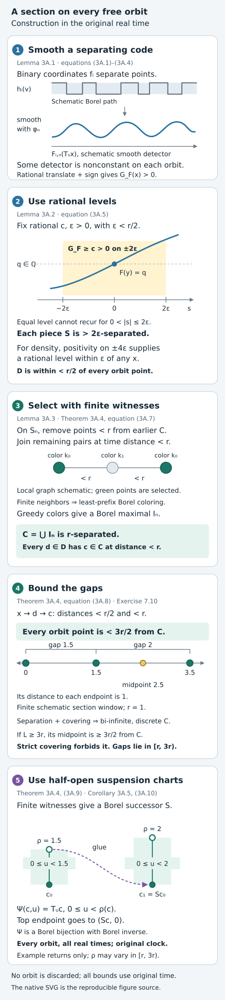
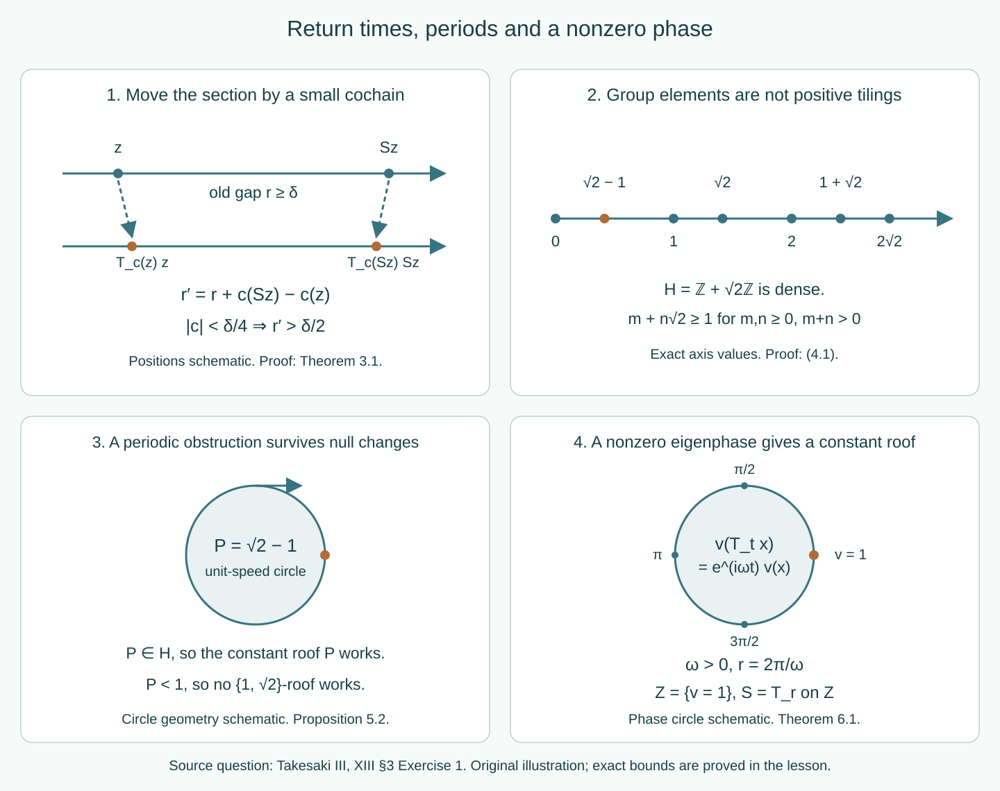

# Dense roof groups, two ceilings and eigenfunctions

Which return-time prescriptions preserve the original real time of a flow? Begin with the suspension coordinates and their base measure. Periods give necessary obstructions; an eigenfunction gives a direct phase-section construction. On free orbits, a bounded section supplies a starting chart. We then study two different operations: controlled motion of the section into a dense group, and an exact tiling by two permitted lengths.

*Written by GPT-6.1 Sol (OpenAI), Ultra, October 2026. Self-checked by the writing AI. New original expression and the original diagrams are dedicated under CC0.*

The mathematical questions include Takesaki III, XIII section 3, Exercise 1(a)–(d), printed pages 56–57 (PDF pages 76–77), and the compatible-correction method of Theorem 3.26. The closing comparison identifies the source clauses and their needed qualifications. The teaching order here follows the distinct constructions and their obstructions. Result, equation and exercise labels remain stable identifiers across editions. All flow conjugacies preserve the real time parameter, and the AF convention remains the countable principal convention.

Prerequisites are standard Borel coding, Lusin–Souslin inversion, Lusin–Novikov countable-section projection, the standard Borel space of closed subsets of a Polish space, parameter integration and Haar averaging. The full finite-class correction is proved in [compatible lifts, Lemmas 4.1–5.1 and Theorem 6.1](compatible-lifts-and-cohomology-reduction.md#4-a-small-correction-on-a-finite-class). The general properly ergodic suspension and strictification prerequisites are the exactly compared OA-FLOW selections 38 and 37; the [return-arrow application](return-arrows-and-factor-field-flows.md) records their scope. The bounded-section module supplies a complete original-expression proof of the bounded starting section on every free orbit, as a local course prerequisite. The two-length module uses one additional, explicitly identified human cross-section theorem. Its proof is referenced, not reproduced or claimed as our original work. The proofs of the nonsingular measure-class passage, small roof change, period alternatives and eigenfunction application below are complete.

## Suspension coordinates and the base measure

For a Borel automorphism \(S:Z\to Z\) and a Borel roof \(r\geq\delta>0\), set
\[
D_r=\{(z,u):z\in Z,\ 0\leq u<r(z)\}.
\]
Define signed roof sums by
\[
R_0(z)=0,\qquad
R_n(z)=\sum_{j=0}^{n-1}r(S^jz)\quad(n>0),
\]
\[
R_n(z)=-\sum_{j=n}^{-1}r(S^jz)\quad(n<0).
\tag{2.1}
\]
They satisfy \(R_{n+m}(z)=R_n(z)+R_m(S^nz)\). The suspension action is
\[
T_t(z,u)=(S^nz,u+t-R_n(z)),
\tag{2.2}
\]
where the unique integer \(n\) makes the height lie in \([0,r(S^nz))\). The lower bound makes the roof sums diverge in both directions. Hence the definition is complete for every real time, is jointly Borel, and has the group law by the roof-sum identity. We also allow a periodic \(S\); different integers then label different time intervals, even when their base points agree.

**Lemma 2.1 (nonsingular section measure).** Suppose a strict Borel flow on a standard space is Borel isomorphic to (2.2), and its measure class is nonsingular under every \(T_t\). There is a probability \(\nu\) on \(Z\) such that \(S\) is nonsingular and the transported measure class is
\[
[\mu]=[(\nu\times du)|_{D_r}].
\tag{2.3}
\]
If the flow is ergodic, so is \((Z,S,\nu)\). No invariant measure or conditional measure on the section is assumed.

*Proof.* Replace the transported sigma-finite measure by an equivalent probability \(m\), and let \(\nu\) be its base marginal. Put \(b=\delta/2\). For a Borel \(A\subseteq Z\), the full tube \(D_r|_A\) is null exactly when the small tube \(A\times[0,b)\) is null. One implication is containment. For the other, a point \((z,v)\) with \(z\in A\) and \(0\leq v<r(z)\) is a rational-time translate of a point \((z,u)\), \(0<u<b\): choose a rational \(q\in(v-b,v)\) and set \(u=v-q\). The segment from \(u\) to \(v\) stays in that same roof interval, so (2.2) has no wrap. The full tube is contained in the countable union of these translates. Every such translate of a null set is null by nonsingularity.

Similarly, a point \((Sz,v)\), \(z\in A\), is a rational-time translate of some \((z,u)\), \(0<u<b\), by choosing
\[
q\in\mathbb Q\cap(r(z)+v-b,r(z)+v),
\qquad u=r(z)+v-q.
\]
Here the trajectory crosses exactly the prescribed first roof before reaching height \(v\). It follows that \(\nu(A)=0\) implies \(\nu(SA)=0\). Choosing a rational time in the analogous interval at the predecessor gives \(\nu(S^{-1}A)=0\). Applying these two implications also to \(SA\) and \(S^{-1}A\) proves \(S_*\nu\sim\nu\).

Choose any strictly positive Borel probability density \(w\) on \(\mathbb R\), for example \(w(t)=e^{-|t|}/2\), and average
\[
\overline m(B)=\int_{\mathbb R}w(t)m(T_t^{-1}B)\,dt.
\tag{2.4}
\]
Then \(\overline m\sim m\): a null event has every translate null, and a zero average has a null translated event at some time, whose nullity implies that of the original event. Tonelli and the partition into time intervals indexed by \(k\in\mathbb Z\) give
\[
\begin{aligned}
\overline m(B)=\int_{D_r}\sum_{k\in\mathbb Z}
 \int_0^{r(S^kz)}&w(R_k(z)+v-u)\\
 &\cdot1_B(S^kz,v)\,dv\,dm(z,u).
\end{aligned}
\tag{2.5}
\]
The formula holds also on periodic base orbits: the time intervals, rather than the base points, form the disjoint partition of \(\mathbb R\).

Let \(\rho=(\nu\times du)|_{D_r}\). If \(\rho(B)=0\), its vertical sections have zero length for \(\nu\)-almost every base point. Nonsingularity of each \(S^k\) and the marginal definition make every term in (2.5) zero for \(m\)-almost every \((z,u)\). Thus \(\overline m(B)=0\). Conversely, the nonnegative \(k=0\) term and strict positivity of \(w(v-u)\) show that \(\overline m(B)=0\) forces the vertical section at \(z\) to have zero length for \(m\)-almost every \((z,u)\). This property depends only on \(z\); the marginal gives it for \(\nu\)-almost every \(z\). Hence \(\rho(B)=0\). This proves (2.3). The product restriction is sigma-finite even for an unbounded roof, by partitioning \(Z\) into the sets \(r\leq N\).

Finally, the tube over an \(S\)-invariant Borel set is flow-invariant. Under (2.3), positivity of \(r\) equates nullity of that tube with nullity of its base. Flow ergodicity therefore implies base ergodicity. \(\square\)

## Period obstructions and ergodic alternatives

**Lemma 5.1 (ergodic alternatives).** A standard ergodic nonsingular Borel real flow, after an invariant conull reduction, is either free, a one-point fixed flow, or the unit-speed flow on a circle \(\mathbb R/P\mathbb Z\) with Lebesgue measure class, for one \(P>0\).

*Proof.* The injective path construction in OA-FLOW38 works for any Borel action before its proper-ergodicity argument: choose an injective Borel \(\chi:X\to[0,1]\) and map
\[
J(x)=[t\mapsto\chi(T_tx)]\in L^0(\mathbb R,[0,1]).
\tag{5.1}
\]
The path space is Polish, translations are continuous, \(J\) is Borel and injective, its image is Borel, and \(J(T_sx)\) is the translated path. Injectivity follows by choosing one time at which equal paths have equal coded values. Thus each point stabilizer is a closed subgroup of \(\mathbb R\). These subgroups are \(\{0\}\), \(P\mathbb Z\), or \(\mathbb R\): if positive stabilizer elements have positive infimum it is an attained generator; if their infimum is zero their integer multiples approximate every real, and closedness gives \(\mathbb R\).

All three parts are Borel. Fixed points are tested on rational times. A positive period exists exactly when for some integer \(n\geq1\)
\[
\min_{t\in[1/n,n]}d(T_tJ(x),J(x))=0.
\tag{5.2}
\]
The minimum of this continuous-in-time function is Borel in \(x\) (indeed continuous on the ambient path space). On the nonfixed periodic part, its least positive period \(P(x)\) is Borel: the test \(P(x)<b\) is the countable union of zero-minimum tests on nonempty compact intervals \([1/n,b-1/n]\). Each part and the period function are invariant. Ergodicity selects one conull part, and makes \(P(x)\) a single constant on the periodic part. We use here the elementary standard-space fact that an invariant Borel map has almost surely one value: its pushforward probability is zero or one on every Borel event; a countable separating code into \([0,1]\) forces a point mass.

On the fixed part the identity map is invariant, so the same fact concentrates the measure at one point. On the part with period \(P\), the orbit of \(J(x)\) is a compact subset of the Polish path space. Its closed-set code is Borel: membership of an orbit in the open-hit set for an open \(U\) is tested by the countably many rational times in \([0,P]\), using continuity. This code is invariant and hence has one value almost everywhere. Equal compact orbit sets are the same orbit, so the measure is concentrated on one orbit. The map \(\mathbb R/P\mathbb Z\to X\), \([t]\mapsto T_tx_0\), is a Borel bijection onto it, with Borel inverse. Its injectivity uses the least period.

Push an equivalent probability to this circle. Every translation preserves its null sets. Averaging its translates against normalized circle Haar measure gives exactly normalized Lebesgue measure. The average is equivalent to the original probability by the null-event argument in Lemma 2.1. Thus the original class is Lebesgue class. The remaining alternative has trivial stabilizers at every point of the retained space and is free. \(\square\)

**Proposition 5.2 (periodic roof alternatives).** Let \(H\leq\mathbb R\). The unit-speed circle of least period \(P>0\) admits a complete positive \(H\)-valued suspension precisely when \(P\in H\). It admits a roof taking values in \(\{a,b\}\) precisely when
\[
P=ma+nb,\qquad m,n\in\mathbb Z_{\geq0},\quad m+n>0.
\tag{5.3}
\]
A fixed one-point flow admits no positive suspension.

*Proof.* On a periodic suspension orbit, return to a section point after its least period passes through one finite cycle of section points. The cycle is finite because a complete suspension has divergent signed roof sums, so only finitely many returns occur in any bounded time interval. The sum of that cycle's positive roof values is exactly \(P\). If each value is in \(H\), the sum is in \(H\); if the values lie in \(\{a,b\}\), their counts give (5.3).

For sufficiency when \(P\in H\), take a one-point base, its identity map and the constant roof \(P\). Its upward flow is exactly the period-\(P\) circle. For (5.3), take a cyclic base with \(m+n\) points; assign \(m\) roofs of length \(a\) and \(n\) of length \(b\). Put positive mass on every base point. Send \((j,u)\) to the partial sum of the preceding roofs plus \(u\), modulo \(P\). This is a Borel time-preserving bijection and a measure-class isomorphism to the circle. The cyclic base is ergodic and nonsingular. Its least flow period is the full positive cycle sum \(P\), even if the sequence of lengths has a repeating pattern: a shorter move reaches a different base point. If one requires both lengths actually to occur, the condition is instead \(m,n\geq1\).

Finally, every positive roof has a positive-measure tube on which a sufficiently small positive time moves the height and hence the point. More explicitly, for any nonzero base measure some set \(r>1/N\) has positive measure; on its tube of heights \(0<u<1/(2N)\), time \(1/(4N)\) moves the point without a roof crossing. It cannot represent a fixed flow. \(\square\)

Combining Lemma 5.1 with Theorems 3.1–4.1 and Proposition 5.2 gives the full ergodic alternatives. A free ergodic nonsingular flow admits the prescribed two ceilings. A periodic flow does so exactly under (5.3), and a fixed flow never does. A dense-group roof exists for a free flow, and for a periodic flow exactly when its period belongs to that group.

For the literal source exceptions, take \(a=1\), \(b=\sqrt2\). The circle with \(P=1/2\) has \(P\notin\mathbb Z+\sqrt2\mathbb Z\): a rational value forces the \(\sqrt2\)-coefficient to vanish, leaving an integer. It therefore refutes the unqualified part (b), and also part (c). The circle with \(P=\sqrt2-1\) does have a positive group-valued roof, but \(P<1\) rules out (5.3); it separates the group-valued conclusion from the two-ceiling conclusion. These exceptions retain ergodicity and even an invariant probability measure. They concern the stated time-preserving conclusion, with no time rescaling.

## Phase sections and constant return times

Use the source convention \(\alpha_t f=f\circ T_{-t}\). A unitary \(u\in L^\infty(X,\mu)\) means \(|u|=1\) almost everywhere.

**Theorem 6.1 (constant-roof criterion).** A standard ergodic nonsingular flow is conjugate to a positive constant-roof suspension if and only if there are a unitary \(u\) and a real \(s_0\neq0\) such that
\[
\alpha_t(u)=e^{is_0t}u\qquad(t\in\mathbb R).
\tag{6.1}
\]
For this eigenfrequency the roof can be \(r=2\pi/|s_0|\), and its base is ergodic and nonsingular. The criterion allows periodic flows as well as free ones.

*Proof.* Suppose (6.1) holds. Put \(\omega=|s_0|\), and let \(v=u\) if \(s_0<0\), while \(v=u^*\) if \(s_0>0\). Then
\[
v(T_tx)=e^{i\omega t}v(x)
\tag{6.2}
\]
as function classes for every fixed \(t\). Apply [Haar repair, Theorem 1.2](localizing-factor-actions-and-uniform-cocycles.md#1-repairing-an-equivariant-section) to this circle-valued equivariant map, with the circle action given by multiplication by \(e^{i\omega t}\). It gives one Borel circle-valued representative on an invariant conull base satisfying (6.2) for every \(t\) and every \(x\) there. No intersection of uncountably many exceptional sets is used.

Set
\[
r=2\pi/\omega,\qquad
\tau(x)=\operatorname{Arg}(v(x))/\omega\in[0,r),
\]
\[
z(x)=T_{-\tau(x)}x,
\qquad Z=\{x:v(x)=1\},\qquad S=T_r|_Z.
\tag{6.3}
\]
Here \(\operatorname{Arg}\) takes values in \([0,2\pi)\), including zero at one. These maps and \(Z\) are Borel. Equation (6.2) gives \(z(x)\in Z\). A point of \(Z\) returns to \(Z\) exactly at times in \(r\mathbb Z\), so \(S\) is a Borel automorphism with inverse \(T_{-r}|_Z\). The map
\[
\Psi:Z\times[0,r)\to X,
\qquad \Psi(z,t)=T_tz,
\quad \Psi^{-1}(x)=(z(x),\tau(x))
\tag{6.4}
\]
is a Borel bijection: the phase uniquely determines the half-open height, then the inverse flow determines the base point. Real translation adds to the height, with \(S\) at each endpoint. This is the exact constant-roof action, including negative times and periodic base orbits. Lemma 2.1 supplies a base probability \(\nu\), the product measure class, nonsingularity and ergodicity. Restricting \(\mu\) to the generally null set \(Z\) would not supply this measure.

Conversely, on a constant-roof suspension \(D_r\), put \(u(z,t)=e^{2\pi it/r}\). Its values agree at the identified endpoints, and every integer roof crossing contributes a factor one. Thus
\[
u(T_tx)=e^{2\pi it/r}u(x),\qquad
\alpha_t(u)=e^{-2\pi it/r}u.
\tag{6.5}
\]
It is unitary and has the nonzero source eigenfrequency \(-2\pi/r\). Transport it by the measured conjugacy. \(\square\)

The exclusion of zero is essential. Every flow has the unitary \(u=1\) with frequency zero. In particular the one-point fixed ergodic flow satisfies the source's displayed zero-frequency condition and has no positive suspension, by Proposition 5.2. This disposes of the literal unrestricted formula in part (d). A convention that “point spectrum” excludes the trivial character must be made explicit; the displayed quantifier alone does not do so.

For a period-\(P\) circle, (6.1) requires \(e^{is_0P}=1\), hence \(s_0=2\pi k/P\), \(k\in\mathbb Z\setminus\{0\}\). These frequencies occur by the ordinary circle characters (with the sign dictated by \(\alpha_t\)). The associated roof is \(P/|k|\), and its base is a cycle with \(|k|\) points. Thus a circle's constant roofs are exactly the positive \(r\) with \(P/r\) a positive integer. This agrees with the period-sum criterion, rather than requiring a free base.

## Bounded sections on every free orbit

Here a Borel flow means a jointly Borel action \((t,x)\mapsto T_tx\) of \((\mathbb R,+)\) on a standard Borel space \(X\). It is free when \(T_tx=x\) implies \(t=0\), for every \(x\). A section meets each orbit in a nonempty countable set. We construct one whose successive return times have a uniform positive lower bound and a uniform upper bound. Every orbit is retained, and all bounds use the original real time.

The descriptive prerequisites used below are standard Borel coding, Lusin–Souslin inversion, and Lusin–Novikov: a Borel relation between standard Borel spaces with countable vertical sections has a Borel projection. Each use of the last theorem will have finite sections. The elementary analysis prerequisites are regularity of ordinary Lebesgue measure on bounded real intervals and dominated convergence. There is no measure on \(X\).

### 3A.1. Smooth functions along a Borel orbit

Fix a Borel injection \(j:X\to\{0,1\}^{\mathbb N}\), and let \(f_i(x)\) be its coordinate indicators. They separate points. Choose the nonnegative smooth function
\[
\phi(t)=
\begin{cases}
A\exp\!\bigl(-1/(1-t^2)\bigr),&|t|<1,\\
0,&|t|\geq1,
\end{cases}
\]
\[
\int_{\mathbb R}\phi(t)\,dt=1.
\]
where \(A>0\) is the normalizing constant, and put \(\phi_n(t)=n\phi(nt)\), \(n\geq1\). Define
\[
F_{i,n}(x)=\int_{\mathbb R}\phi_n(t)f_i(T_tx)\,dt,
\]
\[
G_{i,n}(x)=-\int_{\mathbb R}\phi_n'(t)f_i(T_tx)\,dt.
\tag{3A.1}
\]

**Lemma 3A.1 (a nonconstant smooth detector on every orbit).** These functions are Borel. For every \(x\), \(s\mapsto F_{i,n}(T_sx)\) is smooth, with derivative \(G_{i,n}(T_sx)\). On each free orbit at least one of these smooth functions is nonconstant.

*Proof.* Parameter integration of a nonnegative jointly Borel function against a fixed finite measure is Borel: this holds for indicator rectangles, extends to Borel sets by the monotone-class theorem, and then to nonnegative functions by simple-function approximation. Splitting a signed function into its positive and negative parts gives the signed version when both integrals are finite. Restricting to the compact support of \(\phi_n\) or \(\phi_n'\) applies this argument to (3A.1).

For fixed \(x\), write \(h_i(v)=f_i(T_vx)\). Substitution gives
\[
F_{i,n}(T_sx)=\int_{\mathbb R}\phi_n(v-s)h_i(v)\,dv.
\tag{3A.2}
\]
On a bounded interval of \(s\), the integrands and all their derivatives have one compact support in \(v\) and uniform finite bounds. Dominated difference quotients therefore give all derivatives, with the first derivative equal to \(-\int\phi_n'(v-s)h_i(v)\,dv=G_{i,n}(T_sx)\). Dominated convergence makes each derivative continuous.

We record the approximation argument needed here, rather than assuming that a pointwise value of a Borel path is continuous. For a bounded Borel \(h:\mathbb R\to\mathbb R\), each compact interval \(I\) satisfies
\[
\int_I|h(s+t)-h(s)|\,ds\longrightarrow0
\quad(t\to0).
\tag{3A.3}
\]
To prove this, restrict \(h\) to a larger bounded interval \(J\) containing \(I+[-1,1]\), and extend that restriction by zero. Approximate it in \(L^1(\mathbb R)\) by a finite linear combination of indicators of bounded intervals. Such approximation follows by approximating a bounded Borel function by simple functions and approximating their finite-measure level sets by finite unions of intervals, using Lebesgue regularity. For an interval \(B\), the symmetric difference between \(B\) and a translate by \(t\) has measure at most \(2|t|\). Thus the approximating function has translation-continuous \(L^1\) norm. Translation preserves the norm of the approximation error, so the triangle inequality proves (3A.3). This proof also gives uniform smallness for all sufficiently small \(|t|\).

Since \(\phi_n\geq0\), has integral one, and is supported in \([-1/n,1/n]\), Tonelli and the triangle inequality yield
\[
\begin{aligned}
&\int_I\left|\int\phi_n(t)h(s+t)\,dt-h(s)\right|ds\\
&\quad\leq\int\phi_n(t)\!\left[\int_I|h(s+t)-h(s)|\,ds\right]dt\\
&\quad\longrightarrow0.
\end{aligned}
\tag{3A.4}
\]
This is convergence in \(L^1\) on every bounded interval, and needs no Lebesgue differentiation theorem.

Suppose all \(F_{i,n}\) were constant along the orbit of \(x\). For fixed \(i\), denote their constants by \(b_{i,n}\). By (3A.4), the constants converge in \(L^1([-1,1])\) to \(h_i\). They are a Cauchy sequence of real numbers, because the distance between two constant functions on this interval is \(2|b_{i,n}-b_{i,m}|\). Let their scalar limit be \(b_i\). Uniqueness of the \(L^1\) limit, on each \([-k,k]\), gives \(h_i(s)=b_i\) for almost every real \(s\). In particular \(b_i\in\{0,1\}\).

Intersect these full-Lebesgue-measure time sets over the countably many \(i\). On the intersection all the coordinates of \(j(T_sx)\) are fixed. Therefore any two of its times give the same point of \(X\). Freeness forces those times to be equal, whereas a full-Lebesgue-measure subset of \([-1,1]\) contains two distinct times. This contradiction proves the lemma. The argument is applied separately to every orbit; it discards no orbit. \(\square\)

### 3A.2. Countably many sparse level pieces

Fix \(r>0\). Include both signs of every rational translate of every \(F_{i,n}\) in a countable family \(\mathcal F\):
\[
\begin{aligned}
F(x)&=\sigma F_{i,n}(T_ux),\\
\sigma&\in\{-1,1\},\quad u\in\mathbb Q.
\end{aligned}
\]
Write \(G_F(x)=\sigma G_{i,n}(T_ux)\). By Lemma 3A.1, at every \(x\) some \(F\in\mathcal F\) has \(G_F(x)>0\): a nonconstant smooth orbit function has a nonzero derivative somewhere; continuity gives a rational time with nonzero derivative; the sign makes it positive.

For positive rationals \(c,\varepsilon\), with \(\varepsilon<r/2\), and for every rational \(q\), put
\[
V_{F,c,\varepsilon}
=\bigcap_{t\in\mathbb Q\cap[-2\varepsilon,2\varepsilon]}
\{x:G_F(T_tx)\geq c\},
\]
\[
S_{F,c,\varepsilon,q}=V_{F,c,\varepsilon}\cap\{x:F(x)=q\}.
\tag{3A.5}
\]
All these sets are Borel. The rational-time test gives the same inequality at every real time in the indicated interval, by orbitwise continuity of \(G_F\). The levels \(q\) range over all rationals, including negative ones.

**Lemma 3A.2 (separation and density of the pieces).** Each piece in (3A.5) has distinct orbit points separated by more than \(2\varepsilon\) in time. Their countable union \(D\) is within time distance less than \(r/2\) of every point of every orbit.

*Proof.* If \(x\) is in one piece and \(0<|s|\leq2\varepsilon\), then the fundamental theorem of calculus gives
\[
F(T_sx)-F(x)=\int_0^s G_F(T_tx)\,dt.
\]
This is positive for \(s>0\) and negative for \(s<0\), since the derivative is at least \(c>0\) throughout the interval of integration. Thus \(T_sx\) cannot have the same level \(q\). In particular each bounded time interval contains only finitely many points of this piece.

For density, choose \(F\) with \(G_F(x)>0\). Continuity gives positive rationals \(c,\varepsilon\), with \(\varepsilon<r/2\), such that \(G_F(T_tx)\geq c\) for \(|t|\leq4\varepsilon\). Choose a rational \(q\) strictly between \(F(T_{-\varepsilon}x)\) and \(F(T_\varepsilon x)\). Strict increase and the intermediate-value theorem give \(y=T_sx\) with \(|s|<\varepsilon\) and \(F(y)=q\). For \(|t|\leq2\varepsilon\), one has \(|s+t|<3\varepsilon\), so \(G_F(T_ty)\geq c\). Hence \(y\) lies in the corresponding piece, and its distance from \(x\) is less than \(r/2\). This is an existence argument at each \(x\); no Borel choice of the parameters is required. \(\square\)

### 3A.3. A Borel greedy selection with finite witnesses

For a free Borel flow the orbit relation \(E\subseteq X\times X\) is Borel, and so is its signed time function \(\tau\), defined by
\[
T_{\tau(x,y)}x=y,\qquad (x,y)\in E.
\tag{3A.6}
\]
Indeed, \((x,t)\mapsto(x,T_tx)\) is a Borel injection between standard Borel spaces. Lusin–Souslin gives its Borel image and inverse. The action law and freeness give \(\tau(y,x)=-\tau(x,y)\) and \(\tau(x,z)=\tau(x,y)+\tau(y,z)\) on one orbit.

**Lemma 3A.3 (a locally finite Borel graph has a Borel maximal independent set).** Let \(A\) be standard Borel and let \(\Gamma\subseteq A\times A\) be a symmetric, irreflexive Borel graph with finitely many neighbors at each vertex. There is a Borel independent set \(I\) such that every vertex outside \(I\) has a neighbor in \(I\).

*Proof.* Choose a Borel injection \(b:A\to\{0,1\}^{\mathbb N}\). For each vertex \(x\), let \(m(x)\) be the least nonnegative integer whose length-\(m(x)\) prefix distinguishes \(b(x)\) from the code of every neighbor. Finitely many neighbors and injectivity ensure that such an integer exists. An isolated vertex has \(m(x)=0\). For fixed \(m\), failure of distinction is expressed by
\[
\exists y:\ (x,y)\in\Gamma,
\quad b(x)|_m=b(y)|_m.
\]
The witness set is finite, so Lusin–Novikov makes this predicate Borel. Taking its first failure-free index makes \(m\) Borel. The pair \((m(x),b(x)|_{m(x)})\) is a Borel coloring with countably many colors. Adjacent vertices cannot have the same pair, because that common prefix would contradict the defining distinction at either vertex.

Enumerate all possible colors by nonnegative integers. Starting with the empty set, at color \(k\) select every vertex of that color with no neighbor selected at a previous color. The excluded-vertex predicate is again a projection with finite sections, so every stage is Borel. Equal-color vertices are never adjacent, and new vertices have no old selected neighbor. The countable union \(I\) is therefore Borel and independent. A rejected vertex has an earlier selected neighbor by the rule that rejected it. This gives exactly the asserted maximality. \(\square\)

### 3A.4. Uniform gaps and the full suspension chart

**Theorem 3A.4 (a bounded section on every free orbit).** For every \(r>0\) and every free Borel real flow there is a Borel section \(C\) meeting every orbit in a bi-infinite discrete set. Consecutive section points have time gaps in \([r,3r)\). The successor and predecessor are Borel, and the Borel return-time function \(\rho\) satisfies \(r\leq\rho<3r\).

*Proof.* If \(X\) is empty the empty section has the asserted properties. Otherwise enumerate the pieces from Lemma 3A.2 as \(S_0,S_1,\ldots\), remembering each piece's separation constant \(2\varepsilon_n>0\). Set \(C_{-1}=\varnothing\). At stage \(n\), remove from \(S_n\) every point within time distance less than \(r\) of \(C_{n-1}\), and denote the remainder by \(A_n\). Inductively \(C_{n-1}\) is Borel and \(r\)-separated on every orbit. The removal relation is
\[
\begin{aligned}
&x\in S_n,\quad y\in C_{n-1},\\
&(x,y)\in E,\quad |\tau(x,y)|<r.
\end{aligned}
\tag{3A.7}
\]
For fixed \(x\), its witnesses lie in a bounded time interval of an \(r\)-separated set, so there are only finitely many. Its projection is Borel by Lusin–Novikov. Thus \(A_n\) is Borel.

On \(A_n\), join distinct points of one orbit when their time distance is less than \(r\). This is a Borel graph. Its neighbors lie in a bounded time interval of the \(2\varepsilon_n\)-separated set \(S_n\), so the graph is locally finite. Apply Lemma 3A.3 to obtain a Borel maximal independent set \(I_n\). Put \(C_n=C_{n-1}\cup I_n\). Independence makes \(I_n\) \(r\)-separated, and the removal rule separates it by at least \(r\) from all earlier points. The induction holds. Set \(C=\bigcup_n C_n\). This is Borel and \(r\)-separated.

Every point of \(S_n\) was either removed because of an earlier selected point at distance less than \(r\), selected itself, or rejected by the greedy construction because of a selected neighbor at distance less than \(r\). Hence each point of \(D=\bigcup_nS_n\) has a point of \(C\) at distance less than \(r\). Lemma 3A.2 and additivity of \(\tau\) show that
for every \(x\in X\) there is a \(c\in C\) on its orbit with
\[
|\tau(x,c)|<\frac{3r}{2}.
\tag{3A.8}
\]
Fix any orbit and identify its times with \(\mathbb R\). The times of its \(C\)-points are \(r\)-separated, hence finite in every bounded interval and closed in \(\mathbb R\). The covering bound (3A.8) forces them to be unbounded in both directions. Each such point therefore has a nearest successor and predecessor. Ordering the times gives a bi-infinite sequence. Consecutive gaps are at least \(r\). A gap of length at least \(3r\) would have a midpoint at distance at least \(3r/2\) from every section point, contradicting (3A.8). Thus each gap is strictly less than \(3r\).

The successor graph is obtained from the Borel relation
\[
x,y\in C,\quad (x,y)\in E,
\quad r\leq\tau(x,y)<3r
\tag{3A.9}
\]
by deleting pairs for which there is a \(z\in C\) with \((x,z)\in E\) and \(0<\tau(x,z)<\tau(x,y)\). For each candidate pair, the possible \(z\)'s form a finite subset of a bounded interval of an \(r\)-separated orbit. This forbidden-pair projection is Borel by Lusin–Novikov. The resulting graph has exactly one successor \(Sx\) for every \(x\in C\). Lusin–Souslin, applied to its first-coordinate projection, gives a Borel function \(S\). Each point has exactly one predecessor, so \(S\) is bijective and its inverse is Borel by Lusin–Souslin. Finally \(\rho(x)=\tau(x,Sx)\) is Borel and lies in \([r,3r)\). \(\square\)

**Corollary 3A.5 (an everywhere time-preserving suspension).** With \(C,S,\rho\) as above, the Borel map
\[
\Psi:D_\rho\to X,\qquad \Psi(c,u)=T_uc,
\]
\[
D_\rho=\{(c,u):c\in C,\ 0\leq u<\rho(c)\}
\tag{3A.10}
\]
is a Borel bijection with Borel inverse and conjugates the suspension flow to \(T\) in its original time. The base automorphism \(S\) is aperiodic.

*Proof.* On each orbit the section times are discrete and unbounded in both directions. Their consecutive half-open intervals partition the real line. Every point therefore has exactly one preceding section point and exactly one height in \([0,\rho(c))\); this proves surjectivity and injectivity. The domain is standard Borel and the map is Borel, so Lusin–Souslin supplies its Borel inverse. Positive and negative successive roof sums diverge, since each term is at least \(r\). Thus the suspension is defined for every real time, with finitely many crossings on bounded time intervals, as in the suspension-coordinate module. The endpoint equality \(T_{\rho(c)}c=Sc\) and the action law prove equivariance through each crossing, including negative times. If \(S^kc=c\) for \(k>0\), the sum of its \(k\) positive roofs would be a nonzero time fixing \(c\), contrary to freeness. \(\square\)

For the free flow in Theorem 3.1, taking \(r=2\delta\) here supplies an initial chart with roof at least \(2\delta\), on every orbit. Lemma 2.1 then supplies its nonsingular base measure class, and the small section change proved below in Theorem 3.1 applies. This gives a complete local starting-section route for that application. No invariant measure, ergodicity, or topology making the flow continuous was used in constructing \(C\).

The conclusion is a bounded interval of possible roofs. Prescribing exactly two positive lengths requires the additional tiling argument in the two-length module. The bounded-section module proves the starting cross-section prerequisite for that argument; it does not assert that the greedy selection has roofs in a prescribed two-point set.

Figure 2. The smooth detector and level-window drawings are schematics of Lemmas 3A.1–3A.2. Lemma 3A.3 gives the countable Borel coloring and greedy selection, with finite witnesses for every projection. Theorem 3A.4 proves separation at least \(r\), coverage at distance less than \(3r/2\), and consecutive gaps in \([r,3r)\) on every orbit. The displayed sample has \(r=1\) and section times \(0,1.5,3.5\); it depicts only a finite schematic window, with gaps \(1.5\) and \(2\), and second-gap midpoint \(2.5\) at distance \(1\) from each endpoint. Corollary 3A.5 proves the exact half-open suspension chart and preservation of the original time. The diagram and proof expression are original; the classical cross-section conclusion is credited to Wagh in the bibliography.

## Finite corrections for controlled section motion

Let \(R=\bigcup_{n\geq1}R_n\) be a countable principal Borel relation exhausted by increasing finite-class Borel subrelations. Work on an invariant conull reduction when the exhaustion or cocycle initially exists only in the measured sense. The countable null-set saturation argument in the compatible-lift lesson makes all arrow identities exact there.

Let \(H\leq(\mathbb R,+)\) be dense. It need not itself be Borel. Choose one element of \(H\) in each rational open interval and let \(H_0\) be the subgroup generated by this countable collection. Then \(H_0\subseteq H\) is countable, Borel and dense. This avoids treating a possibly non-Borel subgroup as a measurable target.

**Lemma 1.1 (small dense reduction).** For every Borel additive homomorphism \(p:R\to\mathbb R\) and every \(\varepsilon>0\), there is a Borel \(c:X\to\mathbb R\), with \(|c(x)|<\varepsilon\) at every unit, such that
\[
p^c(y,x)=p(y,x)+c(y)-c(x)\in H_0
\tag{1.1}
\]
on every arrow. In particular \(p^c\) is an \(H\)-valued Borel homomorphism.

*Proof.* Apply compatible-lift Lemma 4.1 with its homomorphisms \(p_{\rm old}=0\), \(q_{\rm old}=p\), its complete metric the ordinary real distance, and its initial radius \(\varepsilon/4\). It gives \(f_1\) and \(h_1:R_1\to H_0\) with
\[
p(y,x)=h_1(y,x)+f_1(y)-f_1(x),
\qquad |f_1(x)|<\varepsilon/4.
\]
For the extension from stage \(n\) to \(n+1\), use compatible-lift Lemma 5.1 with distance bound \(\varepsilon 2^{-n-2}\). It preserves \(h_n\) exactly on old arrows and changes every \(f_n(x)\) by less than this bound. Thus \(f_n\) converges pointwise to a Borel real function \(f\), and
\[
|f(x)|\leq |f_1(x)|+
 \sum_{n\geq1}\varepsilon 2^{-n-2}<\varepsilon/2.
\tag{1.2}
\]
Each arrow lies in some \(R_n\), where its \(h\)-value becomes constant from that stage onward. Taking the limit gives \(p(y,x)=h(y,x)+f(y)-f(x)\), with \(h(y,x)\in H_0\). Put \(c=-f\). Equation (1.1) equals \(h\). Its homomorphism law follows by cancellation of the middle cochain value. Exact stabilization, rather than convergence of \(h_n\), is what keeps the value in the nonclosed subgroup. \(\square\)

**Proposition 1.2 (the transformation-groupoid qualification).** The conclusion applies to the principal relation of an ergodic nonsingular transformation, and to its labelled \(\mathbb Z\)-groupoid when that transformation is aperiodic on the retained conull space. It need not hold on the labelled groupoid of a periodic transformation.

*Proof.* For the nonatomic ergodic transformation, the complete nonsingular finite exhaustion is [towers and odometer orbits, Corollary 3.2](towers-and-odometer-orbits.md#3-positioning-a-finite-cycle), the needed direction of source Theorem XIII.3.17. In the atomic case, nonsingularity and ergodicity concentrate the measure on the countable orbit of any positive atom. A finite orbit already has a finite complete relation. On an infinite orbit, enumerate its points by \(i\in\mathbb Z_{\geq0}\), and at stage \(n\) put points in the same class exactly when their indices have the same quotient \(\lfloor i/2^n\rfloor\). Every class has \(2^n\) points. These Borel finite-class relations increase; any two indices eventually belong to the first block, so they exhaust the principal complete relation. Thus every case needed here has a principal measured hyperfinite exhaustion. If the transformation is aperiodic, the arrow \((n,x)\) is uniquely determined by its endpoints \((T^n x,x)\), so this groupoid is principal and Lemma 1.1 applies.

For the exception, take the identity transformation on one point, \(H=\mathbb Q\), and the homomorphism \(p(n,*)=n\sqrt2\). A unit cochain has one real value. Its coboundary on every loop is zero, so the value \(\sqrt2\) on the generator cannot enter \(H\). The endpoint relation has just its unit arrow and loses this obstruction by forgetting all the integer loops. Thus a labelled periodic transformation groupoid cannot be declared principal AF by the cited theorem. A cocycle that already descends to the principal relation is a different case and is covered by Lemma 1.1. \(\square\)

## Moving a section into a dense return-time group

**Theorem 3.1.** Every free ergodic nonsingular standard flow has a suspension representation over an ergodic nonsingular transformation whose positive roof lies in any prescribed dense subgroup \(H\leq\mathbb R\). The roof can be bounded below by a positive constant.

*Proof.* For a properly ergodic flow, the exact OA-FLOW38 suspension theorem supplies \((Z,S,\nu,r)\) with \(r\geq\delta>0\). A free flow concentrated on one orbit is Borel equivalent to translation on \(\mathbb R\). Its measure class is Lebesgue class: averaging an equivalent probability under all real translations with a positive density gives a measure with a strictly positive Lebesgue density. It has the suspension with \(Z=\mathbb Z\), \(Sn=n+1\), \(r=1\), and any probability with all integer point masses positive. Thus the starting suspension exists in both cases. The free action makes \(S\) aperiodic: a nonzero return index fixing a base point would fix a flow point at a nonzero signed roof sum.

On the principal return relation set
\[
p(S^nz,z)=R_n(z).
\tag{3.1}
\]
Aperiodicity makes this unambiguous, and the roof-sum identity makes it an additive homomorphism. The measured principal relation is hyperfinite. Lemma 1.1, with \(0<\varepsilon<\delta/4\), supplies \(c\), \(|c|<\varepsilon\), for which
\[
r'(z)=r(z)+c(Sz)-c(z)\in H_0\subseteq H,
\qquad r'(z)>\delta-2\varepsilon>\delta/2.
\tag{3.2}
\]
Keep the original base map \(S\). Move its section point \(z\) along the original flow to \(T_{c(z)}z\). On each orbit the original section points are separated by at least \(\delta\); moving each by less than \(\delta/4\) preserves their order and makes the new section injective. Their new consecutive gaps are exactly (3.2). They remain unbounded in both time directions. The map
\[
\Psi_c:D_{r'}\longrightarrow X,
\qquad \Psi_c(z,v)=T_{c(z)+v}z
\tag{3.3}
\]
is consequently a Borel bijection and conjugates every real time. Its inverse is Borel by Lusin–Souslin.

It also preserves the intended product measure class with the same \(\nu\). To check this explicitly, use the old chart. The starting height \(c(z)\) differs from zero by less than \(\delta/4\), and the ending height is \(r(z)+c(Sz)\). Thus (3.3) has at most the three branches with old base coordinate \(S^{-1}z,z,Sz\). On each Borel branch the height map is a translation by a Borel base-dependent real, and the base map is a power of the nonsingular \(S\). Fubini makes each such map nonsingular between the restricted products. The inverse has the same three-branch description. The branches cover both charts, so the two product restrictions have exactly the transported null sets. Positivity of the new roof also lets Lemma 2.1 verify the same conclusion. Since \(S\) was ergodic, the new representation has an ergodic nonsingular base. \(\square\)

For \(a,b>0\) with \(a/b\notin\mathbb Q\), \(H=a\mathbb Z+b\mathbb Z\) is dense. Here is an elementary justification. The closure of this subgroup is a closed subgroup of \(\mathbb R\). A proper nonzero closed subgroup has the form \(d\mathbb Z\), which would make both \(a/d\) and \(b/d\) integers and their ratio rational. The closure must therefore be all of \(\mathbb R\). Theorem 3.1 proves the free-flow version of source part (b) by the requested cohomology mechanism.

## Exactly two allowed return lengths

**Exact cross-section prerequisite (Slutsky).** A free Borel real flow on a standard Borel space admits a Borel section, with predecessor and successor on every orbit, whose consecutive positive gaps belong to \(\{a,b\}\), for any positive rationally independent \(a,b\). We use the gap conclusion of Konstantin Slutsky, [*Regular cross sections of Borel flows*, Theorem 9.1](https://kslutsky.com/papers/Regular-cross-sections.pdf), pages 39–43; its complete supporting arguments are in sections 2 and 5–8. The theorem needs no measure.

**Theorem 4.1 (two ceilings, nonsingular application).** Every free ergodic nonsingular standard flow is conjugate, modulo an invariant null reduction, to a suspension with roof taking values in \(\{a,b\}\), over an ergodic nonsingular standard transformation.

*Proof of the application.* Use the strict Borel point model of the given measured flow, discard its invariant null nonfree part, and apply the exact cross-section prerequisite. Call the resulting section \(Z\), its successor \(S\), and its gap \(r\). The predecessor supplies a Borel inverse to \(S\). Since \(r\geq\min(a,b)>0\) and there are hits in both directions, each point has a unique preceding section point and a height in \([0,r(z))\). These coordinates give a Borel bijection \(D_r\to X\), \((z,u)\mapsto T_uz\), with Borel inverse and the action (2.2). All times and all orbit labels are preserved. Lemma 2.1 supplies the product measure class, nonsingularity of \(S\), and its ergodicity. This proves the entire measured conclusion at the source's nonsingular scope. \(\square\)

The cross-section theorem is an explicit advanced prerequisite; the preceding proof does not replace it with a claim that any positive element of \(a\mathbb Z+b\mathbb Z\) can be subdivided into positive \(a\)- and \(b\)-intervals. That claim is false. For example, with \(a=1\), \(b=\sqrt2\),
\[
0<b-a<1,\qquad b-a\in a\mathbb Z+b\mathbb Z,
\tag{4.1}
\]
whereas every nonzero \(ma+nb\), \(m,n\geq0\), is at least one. The additive group is dense; its positive semigroup is locally finite, since \(ma+nb\leq L\) bounds both integers. Theorem 3.1 keeps the old base and changes its section slightly. Theorem 4.1 permits a further change of section and base, using the full cross-section prerequisite. Both parts (b) and (c), at free-flow scope, are thereby supplied.

*Figure 1.* Top left: an original gap \(r\geq\delta\) becomes \(r'=r+c(Sz)-c(z)>\delta/2\), with \(|c|<\delta/4\); positions are schematic and the labelled bound is proved in Theorem 3.1. Top right: for the exact lengths \(1,\sqrt2\), the group element \(\sqrt2-1\) lies below every positive semigroup element; the axis uses these exact values. Bottom left: the circle of period \(P=\sqrt2-1\) has an \(H\)-valued constant roof but has no roof in \(\{1,\sqrt2\}\), by Proposition 5.2. Bottom right: a phase of frequency \(\omega>0\) returns to one after \(r=2\pi/\omega\); the schematic circle records its phase, and Theorem 6.1 proves the exact section and measure-class assertions. Source Exercise 1 motivates the questions; the diagram and these application proofs are original expression. The human cross-section prerequisite is cited above.

## Exercises with complete solutions

Level 1 is a computation, level 2 a proof within the lesson's framework, and level 3 a combined argument or a hypothesis check.

### Measure recovery, periods and phase sections

**Exercise 7.7 (a null section is not its base measure).** *Level 2.* On the period-one circle with normalized Lebesgue measure, take \(v(x)=e^{2\pi ix}\). Compute the phase-one section and its restricted circle measure. How does the constant-roof representation carry a nonzero base measure?

*Solution.* The section is the one point \(x=0\), which has restricted Lebesgue measure zero. Restricting the original measure would therefore give the zero base measure and would lose the whole flow. The coordinates \((*,t)\), \(0\leq t<1\), identify the circle with a one-point base times the height interval. The pushforward base marginal of the coordinate probability is the unit point mass at \(*\), and its product with interval Lebesgue measure is exactly the circle measure in this chart. This is the construction in Lemma 2.1. The base measure is a marginal, rather than the original measure restricted to the embedded section.

**Exercise 7.5 (one group-valued roof, no two ceilings).** *Level 2.* For \(a=1\), \(b=\sqrt2\), consider the circle with \(P=\sqrt2-1\). Construct the group-valued roof and prove there is no time-preserving suspension with roof in \(\{a,b\}\). Does allowing nonsingular base measures help?

*Solution.* The one-point identity base with roof \(r=P\) gives the circle, and \(P=-a+b\) belongs to the required additive group. Any \(\{a,b\}\)-roof on a periodic orbit has least period a nonempty sum \(ma+nb\), with nonnegative integers \(m,n\). Such a sum is at least one, whereas \(0<P<1\). This contradicts the preserved least period. Changing positive base masses changes no flow period. More generally a measure-class conjugacy can be made strictly equivariant on an invariant conull set by the proved equivariant base repair; the circle is transitive, so its nonempty retained invariant set has that same period. Nonsingularity therefore does not remove the obstruction.

**Exercise 7.6 (a valid finite-cycle tiling).** *Level 3.* Build the period-\(2+\sqrt2\) circle as a two-ceiling suspension. Compute a constant roof arising from its eigenfrequency \(s_0=4\pi/(2+\sqrt2)\), keeping the source sign convention.

*Solution.* Use the three-cycle base \(0\to1\to2\to0\), roofs \(1,1,\sqrt2\), and any three positive point masses. Send \((j,u)\) to \(u,u+1,u+2\), respectively, modulo \(P=2+\sqrt2\). This identifies the roofs with the next base's zero height, preserves real time, and has Lebesgue measure class; the least period is the full cycle sum. In the circle coordinate \(x\), take \(u(x)=e^{-4\pi ix/P}\). Then \(u(x-t)=e^{4\pi it/P}u(x)\), so its source frequency is the specified positive \(s_0\). Theorem 6.1 uses \(v=u^*=e^{4\pi ix/P}\) and gives constant roof \(r=P/2\). The phase-one section consists of \(0\) and \(P/2\); time \(r\) interchanges them. Thus its base is a two-cycle, while the original two-ceiling representation has a three-cycle base.

**Exercise 7.8 (zero frequency and all ergodic cases).** *Level 3.* Give the exact criteria for a standard ergodic nonsingular flow to admit (i) a roof in \(a\mathbb Z+b\mathbb Z\), (ii) a roof in \(\{a,b\}\), and (iii) a positive constant roof. Explain the zero-frequency issue.

*Solution.* On the free alternative, (i) follows from Theorem 3.1 and (ii) from the exact cross-section prerequisite and Lemma 2.1. On the periodic alternative with period \(P\), (i) holds exactly when \(P\in a\mathbb Z+b\mathbb Z\), and (ii) exactly when \(P=ma+nb\) with nonnegative integers and nonempty sum. On the one-point fixed alternative neither holds. Criterion (iii), on all alternatives, is the existence of a unitary eigenfunction with nonzero source frequency. Every periodic circle has such characters and has constant roofs \(P/k\), \(k\geq1\); a free flow has a constant roof exactly under that spectral criterion; the fixed flow has no nonzero eigenfrequency and no positive roof. Zero would make the criterion vacuous, since \(u=1\) is always a unitary eigenfunction of frequency zero. The fixed flow is already an ergodic counterexample to that literal zero-allowed formula.

### Bounded sections and finite Borel witnesses

**Exercise 7.9 (one section for a product flow).** *Level 1.* Let \(Y\) be a nonempty standard Borel space, let \(X=Y\times\mathbb R\), and let \(T_t(y,s)=(y,s+t)\). For \(r>0\), give an everywhere section, its successor, its roof, and the inverse suspension coordinates. Can this section be a transversal meeting each orbit exactly once?

*Solution.* Take \(C=Y\times r\mathbb Z\), which is Borel because \(r\mathbb Z\) is countable and closed. Its successor is \(S(y,kr)=(y,(k+1)r)\), its predecessor subtracts \(r\), and its roof is the constant \(r\). Given \((y,s)\), put \(k=\lfloor s/r\rfloor\); the inverse coordinates are \(((y,kr),s-kr)\), with height in \([0,r)\). These functions are Borel, and the same formula works for negative \(s\). Each orbit has infinitely many section points in both directions, so this section is not a transversal. The set \(Y\times\{0\}\) is a transversal for this particular flow, but its positive successor and positive roof do not exist. A cross section for a suspension and an orbit transversal have different return properties.

**Exercise 7.10 (where the factor three comes from).** *Level 2.* Let \(P\subseteq\mathbb R\) be \(r\)-separated and suppose every real \(t\) has a \(p\in P\) with \(|t-p|<Kr\), where \(K>0\). Prove that \(P\) is bi-infinite discrete and that its successive gaps lie in \([r,2Kr)\). Apply this to (3A.8). Would an \(r\)-separation hypothesis alone give an upper gap bound?

*Solution.* Separation implies that each bounded interval contains finitely many points, so \(P\) is closed and discrete. The covering hypothesis forces unboundedness on each side: if \(P\) were bounded above by \(M\), a time larger than \(M+Kr\) would have no permitted point, and the lower-bound case is the same. Thus successors and predecessors exist. Their gaps are at least \(r\). If a consecutive gap had length \(L\geq2Kr\), its midpoint would be at distance at least \(L/2\geq Kr\) from every point of \(P\), contradicting strict covering. In (3A.8), \(K=3/2\), giving \([r,3r)\). Separation alone gives no upper bound: for any integer \(N\geq1\), \(P=Nr\mathbb Z\) is \(r\)-separated and has every gap equal to \(Nr\).

**Exercise 7.11 (finiteness in the coloring argument).** *Level 3.* Explain why the least-prefix coloring in Lemma 3A.3 is a construction, rather than a choice of one point from each orbit. Show why that exact coloring recipe can fail for a graph with countably infinitely many neighbors. Which hypotheses supply finiteness in its use in Theorem 3A.4?

*Solution.* The code \(b\) is fixed on the whole vertex space. At a vertex, finitely many different neighbor codes have finite distinguishing lengths; their maximum is finite. Taking the least sufficient length is a Borel integer-valued operation because each failed-length predicate has a finite witness projection. The subsequent color-by-color rule includes every eligible vertex of the current color simultaneously. It chooses no orbit representative, and the resulting set may contain infinitely many points of one orbit.

For failure with infinite degree, use the countable vertex set consisting of the zero binary sequence \(x\) and, for each \(n\geq0\), the sequence \(y_n\) having its only one at coordinate \(n\). Join \(x\) to every \(y_n\), and include no other edges. This is a Borel graph on a countable standard Borel space. For every finite prefix length \(m\), a neighbor with \(n\geq m\) has the same prefix as \(x\), so \(m(x)\) does not exist for this coding. This refutes the applicability of this recipe under countable degree; it asserts no impossibility for other constructions. In Theorem 3A.4, neighbors are confined to a bounded time interval in one level piece, whose separation constant is \(2\varepsilon_n>0\). This gives finitely many neighbors. The earlier-stage removal witnesses instead lie in a bounded interval of an \(r\)-separated selected set, and the successor's intermediate witnesses do too. Each asserted Borel projection has the stated finite witness set.

### Controlled motion and nonsingular coordinates

**Exercise 7.1 (an arbitrarily small reduction).** *Level 2.* For an additive cocycle on a finite complete relation on \(\{0,1,2\}\), suppose \(p(i,j)=a_i-a_j\), \(a_0=0\). Construct a rational-valued gauge with cochain less than \(\varepsilon\) in absolute value, and explain which part of Lemma 1.1 is additionally needed for an increasing exhaustion.

*Solution.* Choose \(q_i\in\mathbb Q\) with \(|q_i-a_i|<\varepsilon\), and choose \(q_0=0\). Set \(c(i)=q_i-a_i\). Then \(p^c(i,j)=q_i-q_j\in\mathbb Q\), \(|c(i)|<\varepsilon\), and the middle \(q\)-values cancel under composition. For an exhaustion, choosing these approximations separately at each stage is insufficient: rational limits may be irrational. The extension must leave the cocycle value on every old arrow exactly unchanged and make the cochain changes summable. Compatible-lift Lemma 5.1 supplies this exact preservation, and the stabilized arrow values, rather than their mere limits, supply the rational cocycle.

**Exercise 7.2 (a loop obstruction).** *Level 3.* Let \(T\) be a three-cycle on \(\{0,1,2\}\), with all masses positive, and let \(p(n,x)=n\sqrt2\) on its labelled integer groupoid. Can a real unit cochain put all values in \(\mathbb Q\)? Compare the principal endpoint relation.

*Solution.* The arrow \((3,x)\) is a loop at every \(x\). Any gauge adds \(c(x)-c(x)=0\), leaving \(3\sqrt2\notin\mathbb Q\). Hence no such gauge exists. The principal endpoint relation is a finite complete relation with no integer loop labels. The given \(p\) does not descend to it: the arrows \((0,x)\) and \((3,x)\) have the same endpoints and different values. A genuinely endpoint-defined additive cocycle on that finite relation can be reduced by Exercise 7.1. The transformation is ergodic; it is its isotropy, not a failure of ergodicity, that obstructs the literal claim.

**Exercise 7.3 (the shift sign and a negative crossing).** *Level 2.* On \(Z=\mathbb Z\), let \(Sn=n+1\), \(r=2\), and \(c(n)=(-1)^n/10\). Compute \(r'\), check the section-change map at its roof, and compute time \(-1/4\) from new coordinates \((0,0)\).

*Solution.* Equation (3.2) gives \(r'(n)=2-(-1)^n/5\): it is \(9/5\) at even \(n\) and \(11/5\) at odd \(n\). The image of \((n,r'(n))\) under the old flow is \(T_{2+c(n+1)}n=T_{c(n+1)}(n+1)\), the image of \((n+1,0)\), which fixes the sign. For time \(-1/4\) from \((0,0)\), the predecessor is \(-1\), whose roof is \(11/5\), and the new height is \(11/5-1/4=39/20\). The old image is \(T_{c(-1)+39/20}(-1)=T_{37/20}(-1)\). Directly, the old starting image is \(T_{1/10}0\), and moving by \(-1/4\) gives \(T_{-3/20}0=T_{37/20}(-1)\). Both calculations agree.

**Exercise 7.4 (an unbounded nonsingular product).** *Level 3.* Take \(Z=\mathbb Z\), \(Sn=n+1\), \(r(n)=1+|n|\), and \(\nu(\{n\})=2^{-|n|}/3\). Explain why the suspension is complete and nonsingular. Why does Lemma 2.1 still work after replacing its product measure by any equivalent probability with nonconstant positive density?

*Solution.* Every roof is at least one, so signed sums diverge and every finite time crosses finitely many roofs. All base masses are positive; hence \(S\) and its inverse preserve null sets. Each time map partitions into countably many Borel branches with base shift \(S^k\) and a vertical translation, so Fubini proves nonsingularity of the product restriction. Its total mass is finite here: \(\sum_n(1+|n|)2^{-|n|}/3=7/3\), since \(\sum_n2^{-|n|}=3\) and \(\sum_n|n|2^{-|n|}=4\). Any strictly positive Borel density defining an equivalent probability leaves exactly these null sets. Lemma 2.1 uses equivalence of each translate, countable tube covers and positivity of its averaging density; it never requires invariant mass or bounded roof height. The base marginal of the new probability is equivalent to \(\nu\), since every vertical interval has positive length and its new density is positive almost everywhere. Thus the recovered product class is the same.

## Bibliography and mathematical antecedents

Masamichi Takesaki, *Theory of Operator Algebras III*, chapter XIII section 3, Exercise 1(a)–(d) supplies the four related mathematical questions; Theorem 3.26 supplies the compatible-correction method used in Lemma 1.1. Definition 3.11 and Theorem 3.17, printed pages 36 and 39, specify the principal AF scope used here. The actual exercise page, including its unqualified flow wording and zero-allowed frequency, was checked visually as well as in text. The results above identify each necessary correction and also supply the complete valid application.

Konstantin Slutsky, [*Regular cross sections of Borel flows*](https://kslutsky.com/papers/Regular-cross-sections.pdf), author PDF, Theorem 9.1, pages 39–43, supplies the advanced cross-section prerequisite in the two-length module. Its Borel conclusion is stronger than the measured existence needed here. We do not import invariant-measure assertions into the nonsingular passage. Lemma 2.1 proves that passage directly. The external proof retains its own rights and is not included in the source delta.

Vivek M. Wagh proved the classical descriptive suspension theorem in *A descriptive version of Ambrose’s representation theorem for flows*, *Proceedings of the Indian Academy of Sciences, Mathematical Sciences* 98 (1988), 101–108. Its bounded-roof formulation is stated with this credit in [Slutsky, Theorem 2.1, author PDF page 6](https://kslutsky.com/papers/Regular-cross-sections.pdf#page=6). The bounded-section module provides a complete original-expression proof of that starting conclusion with the explicit bound \([r,3r)\): orbitwise convolution, rational-level pieces and a finite-witness Borel greedy selection. No prose or proof adaptation from Wagh or Slutsky is included in this section. The prescribed two-ceiling tiling proof remains the separate two-length prerequisite.

The exact OA-FLOW38 suspension proof is used only for the initial properly ergodic chart in Theorem 3.1 and its earlier path construction in Lemma 5.1. OA-FLOW37 and the Haar-repair application supply the strict circle-valued representative in Theorem 6.1. The countable principal exhaustion and full compatible finite corrections are supplied by the linked lessons. All these prerequisites, including classical descriptive-set foundations, remain explicit; no transitive foundation completion or independent review is claimed.

This lesson supplies Exercise 1's corrected intended results and the exact literal exceptions. It does not close the aggregate source-exercise target or the full course.
