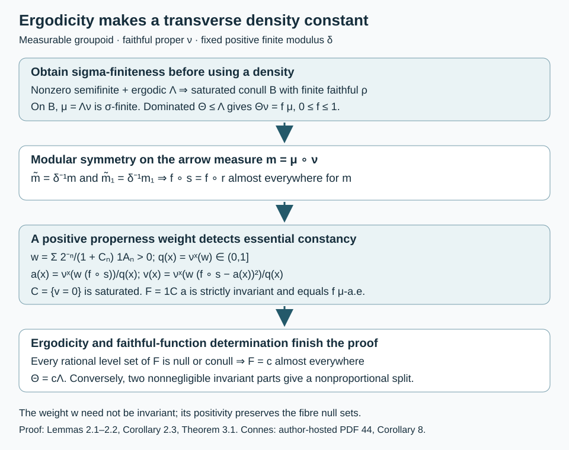

# Ergodic transverse measures and extremal rays

*Written by GPT-6.1 Sol (OpenAI), Ultra, October 2026. Author self-check in progress; not independently reviewed. New original text is public domain (CC0).*

## Introduction

Ergodicity says that measurable invariant sets cannot split a measured groupoid into two nonnegligible parts. Extremality says that its transverse measure cannot split into two nonproportional transverse measures with the same modulus. We prove their equivalence for a nonzero semifinite transverse measure, at the programme's countably generated measurable-groupoid scope. Neither trivial isotropy nor standard Borel structure is needed.

The main technical point is a density. A dominated transverse measure has a Radon–Nikodym density on the units once the unit measure is sigma-finite. Modular symmetry makes that density almost invariant. A weighted fibre mean and variance then give a strictly invariant measurable representative. This construction uses one kernel and nonnegative integrals; it does not require a measurable orbit transversal.

These arguments supply the equivalence of conditions 4 and 5 in [Connes, author-hosted PDF 44, Corollary 8]. We also compare the adjacent type I criterion. The uncountable counting-measure example from the written programme satisfies its conditions 3 and 4 while conditions 1 and 2 fail. We prove the stronger assertion that no full-support representation in that example has a von Neumann random-operator algebra.

Prerequisites are the transverse definitions and proper kernels in [Semifinite transverse measures and operator completions](semifinite-transverse-measures-and-operator-completions.md), Section 1; the complete positive-measure Radon–Nikodym proof in [Measurable actions and compact models](measurable-actions-and-compact-models.md), Theorem 0.1; the support reduction in [Commuting copies in principal groupoid factors](commuting-copies-in-principal-groupoid-factors.md), Lemma 1.3 and Proposition 1.4; and the exact modular identity and faithful-function determination theorem in [Claude-MGT, Theorems 3.5 and 3.8]. The selected statements and complete proofs of the latter prerequisites were compared.

## 1. The cone and its invariant restrictions

Let \(G\) be a measurable groupoid with a countably generated arrow sigma-field, measurable unit singletons and a faithful proper transverse function \(\nu\). Write \(X=G^{(0)}\), with arrows \(\gamma:s(\gamma)\to r(\gamma)\), and let \(\delta:G\to(0,\infty)\) be its measurable modulus. All transverse measures in a decomposition have this same modulus.

For a transverse measure \(\Lambda\), put \(\mu=\Lambda_\nu\) and \(m=\mu\circ\nu\). Our convention for modular symmetry is
\[
\widetilde m=\delta^{-1}m,\qquad
\int h(\gamma^{-1})\,dm(\gamma)=\int\delta(\gamma)^{-1}h(\gamma)\,dm(\gamma)
\tag{1.1}
\]
for every nonnegative measurable \(h\). Here \(\widetilde m\) is the inverse-image measure under inversion.

For saturated measurable \(A\subset X\), define
\[
\Lambda_A(\tau)=\Lambda((1_A\circ s)\tau).
\tag{1.2}
\]
It is a transverse measure of modulus \(\delta\). Source multiplication by a bounded invariant function preserves properness and left invariance. It preserves additivity, homogeneity and monotone normality. For the modulus axiom, if \(\tau'=\tau*_\delta\rho\), source and range membership in \(A\) agree on every arrow, and
\[
(1_A\circ r)(\tau*_\delta\rho)=((1_A\circ r)\tau)*_\delta\rho.
\tag{1.3}
\]
The same calculation applies to a bounded nonnegative invariant function \(F\) in place of \(1_A\). Denote the resulting measure by \(\Lambda_F\). Its unit measure for \(\nu\) is \(F\mu\).

A saturated set is \(\Lambda\)-negligible exactly when it is \(\mu\)-null for a faithful \(\nu\). Thus \(\Lambda\) is **ergodic** when every saturated measurable set or its complement is negligible.

A nonzero transverse measure spans an **extremal ray** when every decomposition
\[
\Lambda=\Theta_1+\Theta_2
\tag{1.4}
\]
into transverse measures of modulus \(\delta\) has \(\Theta_1=c\Lambda\) and \(\Theta_2=(1-c)\Lambda\), for some \(c\in[0,1]\). This is the homogeneous meaning of extremality in the source criterion. It is not extremality as a point of the unnormalized cone: \(\Lambda=(0+2\Lambda)/2\) prevents every nonzero point from being extreme.

## 2. A strictly invariant representative

For the next lemma assume \(\mu=\Lambda_\nu\) is sigma-finite.

**Lemma 2.1 (a bounded transverse density).** If \(0\le\Theta\le\Lambda\) is a transverse measure of modulus \(\delta\), there is a measurable \(f:X\to[0,1]\) such that \(\Theta_\nu=f\mu\), and
\[
f(r(\gamma))=f(s(\gamma))\quad\text{for }m\text{-almost every }\gamma.
\tag{2.1}
\]

*Proof.* Domination gives \(\Theta_\nu\le\mu\). Theorem 0.1 of the density lesson applies to these sigma-finite positive measures; changing a null set gives \(0\le f\le1\) everywhere. Put \(m_1=\Theta_\nu\circ\nu=(f\circ r)m\). Both \(m_1\) and \(m\) satisfy (1.1). Inversion therefore gives, as measures,
\[
\widetilde m_1=(f\circ s)\delta^{-1}m
               =\delta^{-1}(f\circ r)m.
\tag{2.2}
\]
The measure \(m\) is sigma-finite: combine increasing finite-\(\mu\)-measure unit sets with a properness cover \(A_n\uparrow G\), \(\nu^x(A_n)\le C_n<\infty\). Their intersections with \(r^{-1}\) of those unit sets have finite \(m\)-measure and cover \(G\). Equality in (2.2), the positivity and finiteness of \(\delta\), and uniqueness of sigma-finite densities prove (2.1). \(\square\)

**Lemma 2.2 (mean and variance).** If a bounded measurable \(f:X\to[0,1]\) satisfies (2.1), it agrees \(\mu\)-almost everywhere with a bounded measurable function \(F:X\to[0,1]\) that is constant on every orbit.

*Proof.* Choose the properness cover just used and set
\[
\begin{aligned}
w&=\sum_{n\ge1}\frac{2^{-n}}{1+C_n}1_{A_n},\\
q(x)&=\nu^x(w),\qquad 0<q(x)\le1.
\end{aligned}
\tag{2.3}
\]
The strict positivity follows from \(w>0\) everywhere and faithfulness of \(\nu\). Define
\[
\begin{aligned}
a(x)&=\frac{\nu^x(w(f\circ s))}{q(x)},\\
v(x)&=\frac{\nu^x(w(f\circ s-a(x))^2)}{q(x)}.
\end{aligned}
\tag{2.4}
\]
Kernel measurability makes \(q,a,v\) measurable, and \(0\le a\le1\). The dependence of the integrand on \(a(x)\) causes no problem: replace \(a(x)\) inside the fibre integral by \(a(r(\gamma))\), a measurable arrow function.

Let \(C=\{x:v(x)=0\}\). Since \(w>0\), membership in \(C\) is equivalent to \(f\circ s\) being \(\nu^x\)-almost everywhere constant. Left translation transports \(\nu^x\) to \(\nu^y\) for every arrow \(x\to y\), and leaves the source coordinate unchanged. Consequently \(C\) is saturated, and its constant value \(a(x)\) agrees at every pair of related points in \(C\). This argument does not assert that \(w\) itself is invariant.

Equation (2.1) and the defining kernel integral for \(m\) imply that, for \(\mu\)-almost every \(x\), \(f(s(\gamma))=f(x)\) for \(\nu^x\)-almost every \(\gamma\). Such \(x\) lies in \(C\), with \(a(x)=f(x)\). Hence
\[
F(x)=1_C(x)a(x)
\tag{2.5}
\]
is measurable, constant on every orbit, and equal to \(f\) \(\mu\)-almost everywhere. \(\square\)

**Corollary 2.3.** Under sigma-finiteness of \(\Lambda_\nu\), every transverse \(\Theta\le\Lambda\) of modulus \(\delta\) is \(\Lambda_F\) for a bounded strictly invariant measurable \(F\).

*Proof.* Lemmas 2.1–2.2 give \(\Theta_\nu=F\mu=(\Lambda_F)_\nu\). The faithful-function determination part of [Claude-MGT, Theorem 3.8] gives \(\Theta=\Lambda_F\). That part has no standard Borel hypothesis. Its proof writes every proper transverse function as \(\nu*\lambda\) and evaluates its transverse measure as \(\mu(\lambda(\delta^{-1}))\); equality of the unit measures thus gives equality on every proper transverse function. \(\square\)

*Figure 2.1.* Properness supplies the positive weight, not an invariant weight. Zero variance identifies the saturated set of fibres on which \(f\circ s\) is essentially constant, and their constant values give the strictly invariant \(F\). Ergodicity then makes \(F\) constant modulo transverse null sets. The diagram records the exact inverse modulus and the hypotheses used at each step; it is a proof schematic, not an orbit-coordinate identification. Proof locators: Lemmas 2.1–2.2, Corollary 2.3 and Theorem 3.1.

## 3. Ergodicity is transverse extremality

**Theorem 3.1.** A nonzero semifinite transverse measure \(\Lambda\) is ergodic if and only if it spans an extremal ray among transverse measures of its modulus. The programme's measurable assumptions suffice; no trivial-isotropy or standard Borel assumption is added.

*Proof.* Suppose first that \(\Lambda\) is ergodic. Proposition 1.4 of the commuting-copy lesson supplies a measurable saturated conull set \(B\) such that \(\Lambda|_{G_B}\) has a finite faithful proper transverse function. Lemma 1.3 there shows that the unit measure of every proper transverse function on \(G_B\) is sigma-finite. Restrict a decomposition (1.4) to this set. Corollary 2.3 gives \(\Theta_1=\Lambda_F\) there, with \(F\in[0,1]\) strictly invariant.

Every rational level set of \(F\) is saturated, and hence null or conull. Thus \(F=c\) almost everywhere for a single \(c\in[0,1]\). To justify the last inference, if its essential infimum and supremum differed, a rational between them would give two disjoint nonnull invariant sets. Ergodicity would make both conull, contrary to the nonzeroness of the measure. The case of equal essential bounds gives the asserted equality by the countable rational tests. It follows that \(\Theta_1=c\Lambda\), and \(\Theta_2=(1-c)\Lambda\) follows by applying Corollary 2.3 also to \(\Theta_2\), whose unit density is \(1-F\).

The deletion of \(B^c\) changes none of these measures: domination by \(\Lambda\) makes this saturated \(\Lambda\)-negligible set negligible for each \(\Theta_i\) as well. Restriction and extension therefore prove the equality on \(G\).

Conversely, suppose \(A\) and \(A^c\) are both nonnegligible saturated measurable sets. Equation (1.2) gives the decomposition \(\Lambda=\Lambda_A+\Lambda_{A^c}\). Both restrictions are nonzero and semifinite. Choose proper functions \(\tau_A,\tau_{A^c}\), supported on the indicated sets, with
\[
0<\Lambda(\tau_A)<\infty,\qquad
0<\Lambda(\tau_{A^c})<\infty.
\tag{3.1}
\]
Such functions exist by nonzeroness and semifiniteness on each support. If \(\Lambda_A=c\Lambda\), evaluation on \(\tau_{A^c}\) forces \(c=0\), whereas evaluation on \(\tau_A\) forces \(c=1\). This is impossible. Thus extremality implies ergodicity. \(\square\)

Nontrivial isotropy is compatible with this theorem. A group regarded as a one-unit groupoid has no nontrivial saturated unit set, so every nonzero semifinite transverse measure on it spans an extremal ray. Its regular von Neumann algebra need not be a factor: for example, the regular algebra of \(\mathbb Z\) is commutative and nontrivial. The extra trivial-isotropy hypothesis belongs to the factor equivalence in Connes's Corollary 8, not to Theorem 3.1.

## 4. Why domination alone is insufficient

Let \(Z=[0,1]\) with its Borel sigma-field and the identity groupoid. A transverse function is \(a(z)\varepsilon_z\); every finite-valued nonnegative Borel \(a\) is proper. Consider
\[
\Lambda(a)=\sum_{z\in Z}a(z),\qquad
\Theta(a)=\int_Z a(z)\,dz.
\tag{4.1}
\]
The sum is the supremum of finite subsums. Both measures have modulus \(1\), are nonzero and semifinite, and \(\Theta\le\Lambda\). Indeed a finite counting sum forces countable positive support and hence zero Lebesgue integral; when the sum is infinite the inequality is automatic.

There is no measurable density \(f\) with \(\Theta=f\Lambda\). Singleton evaluation would give \(f(z)=0\) for every \(z\), whereas \(\Theta(1)=1\). Moreover \(\Lambda+\Theta=\Lambda\): if the counting sum is finite its Lebesgue integral is zero, and otherwise both sides equal infinity. This verifies why subtraction of dominated semifinite measures cannot be treated as ordinary subtraction of finite measures.

The counting measure is not ergodic and not sigma-finite. Theorem 3.1 first uses ergodicity to obtain a sigma-finite conull reduction; it does not apply Lemma 2.1 globally to (4.1).

## 5. The adjacent type I criterion

For the same identity groupoid, \(\nu^z=\varepsilon_z\) is a faithful proper transverse function of total mass \(1\) at every unit. Its support is all of \(Z\). The trivial representation is square integrable: the constant section \(1\) is total, and its coefficient integral is \(|\alpha|^2\) in every one-dimensional fibre. Thus conditions 3 and 4 of [Connes, author-hosted PDF 44, Corollary 9] hold, even with standard Borel arrows.

**Proposition 5.1.** For this counting transverse measure, no measurable representation with nonzero fibres at every unit has a von Neumann random-operator algebra. In particular conditions 1 and 2 of the unrestricted semifinite Corollary 9 fail.

*Proof.* There are no nonempty transverse-negligible unit sets. Fix such a representation \(H\), with its countable measurable fundamental family, and put \(M=\operatorname{End}_\Lambda(H)\). For each \(z\), the field \(p_z\) equal to \(1_{H_z}\) at \(z\) and zero elsewhere is measurable, equivariant and central. Choose a non-Borel subset \(S\subset Z\).

Suppose the family \(\{p_z:z\in S\}\) had a least upper bound \(p\) in the projection order of \(M\). For \(z\in S\), the inequality \(p_z\le p\) forces \(p(z)=1_{H_z}\). For each \(y\notin S\), \(1-p_y\) is an upper bound for the entire family. Minimality gives \(p\le1-p_y\), hence \(p(y)=0\). A measurable unit section \(e(x)\) exists because all fibres are nonzero: choose the first nonzero fundamental vector on the measurable partition where it is first nonzero, and normalize it. The matrix coefficient \(\langle p(x)e(x),e(x)\rangle\) would then be \(1_S(x)\), contradicting measurability.

Every von Neumann algebra has least upper bounds of families of projections. Thus \(M\) cannot be a von Neumann algebra, including as an abstract C*-algebra. The scalar representation already disproves condition 2; the argument for every full-support \(H\) disproves condition 1. Since no nonempty set is negligible, full support almost everywhere is full support everywhere here. \(\square\)

This counterexample strengthens the scalar calculation in [Semifinite transverse measures and operator completions](semifinite-transverse-measures-and-operator-completions.md), Theorems 2.2–3.2. It separates the actual measurable random fields from their larger von Neumann closure; replacing \(M\) by that closure would change the source object.

The complete corrected type I equivalence at standard Borel, sigma-finite transverse scope is [Claude-RO, Corollary 8.3]. Its proof uses a full-central-support abelian projection to obtain one-dimensional fibres, constructs a bounded transverse function by a convergent weighted sum of squared coefficients, and constructs an abelian full-support corner in a regular amplification for the converse. The exact selected proof has been compared. General countably generated fibre-density questions in Corollaries 7–8 remain separate from both this correction and Theorem 3.1.

## 6. Exercises with solutions

Level 1 asks for a direct calculation. Level 2 asks for a proof with the lesson's constructions. Level 3 compares hypotheses or combines results.

**Exercise 6.1.** *Level 1.* On the identity groupoid with two units, take counting transverse measure and \(f(0)=1/4\), \(f(1)=3/4\). Compute \(a,v,C,F\) from Lemma 2.2 for any strictly positive proper weight.

*Solution.* Each range fibre has one arrow. Its normalized weighted measure is the point mass at that unit. Hence \(a=f\), \(v=0\), \(C=\{0,1\}\), and \(F=f\). Every orbit is a singleton, so strict invariance does not force a global constant. This measure is not ergodic.

**Exercise 6.2.** *Level 2.* Prove that the set \(C\) in Lemma 2.2 is saturated even when \(w\) is not invariant.

*Solution.* Since \(w>0\), the weighted and unweighted measures on each fibre have exactly the same null sets. Thus \(v(x)=0\) means that \(f(s(\gamma))\) has one essential value for \(\nu^x\). Left translation is a measure isomorphism from \(\nu^x\) to \(\nu^y\) for any arrow \(x\to y\), and \(s(\eta\gamma)=s(\gamma)\). The existence and value of this essential constant are consequently unchanged. Thus \(x\in C\) if and only if \(y\in C\), and \(a(x)=a(y)\) on \(C\).

**Exercise 6.3.** *Level 2.* For the pair groupoid on \((0,1)\), take every orbit measure to be Lebesgue measure and \(d\mu(x)=2x\,dx\), so \(\delta(y,x)=y/x\). If \(\Theta_\nu=f\mu\) and \(\Theta\le\Lambda\) has the same modulus, show that \(f\) is constant almost everywhere.

*Solution.* Lemma 2.1 gives \(f(y)=f(x)\) for \(2y\,dy\,dx\)-almost every pair. This measure is equivalent to Lebesgue product measure. Fubini chooses one \(x\) for which \(f(y)=f(x)\) for almost every \(y\). Thus \(f=c\) almost everywhere with \(0\le c\le1\). The pair groupoid has one orbit and is ergodic, so this also verifies Theorem 3.1 in a model with nonconstant modulus.

**Exercise 6.4.** *Level 3.* Verify \(\Lambda+\Theta=\Lambda\) in (4.1) for every proper transverse function, including one with an infinite counting sum but countable positive support.

*Solution.* If the counting sum is finite, the sets where \(a\ge1/n\) are finite, so its positive support is countable and its Lebesgue integral is zero. If the counting sum is infinite, adding a nonnegative integral leaves its value infinite, regardless of whether that integral is zero, finite or infinite. This includes countable positive support with divergent sum. The two cases exhaust all proper functions.

**Exercise 6.5.** *Level 2.* In Proposition 5.1, explain why the projection supremum cannot be recovered by discarding exceptional units. Compare a countable unit space.

*Solution.* Every nonempty saturated unit set has positive counting transverse measure, so there is no nonempty exceptional set to discard. The coefficient \(1_S\) must therefore be measurable on the original whole unit space and cannot be repaired modulo a null set. On a countable standard Borel unit space every subset is a countable union of measurable singletons and is Borel. Its bounded matrix fields are the full bounded product of the fibre algebras, a von Neumann algebra; the non-Borel projection obstruction disappears.

**Exercise 6.6.** *Level 3.* On a one-unit groupoid, why does transverse ergodicity not imply that every regular random-operator algebra is a factor? Also explain why a nonzero semifinite transverse measure is an extremal ray, but not an extreme point of its unnormalized cone.

*Solution.* There are only the empty and full saturated unit sets, so every nonzero semifinite transverse measure is ergodic. Theorem 3.1 gives extremality of its ray. Nevertheless nontrivial isotropy remains: for \(\mathbb Z\), its regular algebra and regular commutant are commutative and nontrivial, hence are not factors. This does not contradict the source factor criterion, which assumes trivial isotropy. Finally \(\Lambda=(0+2\Lambda)/2\) is a decomposition into distinct points, so \(\Lambda\) is not an extreme point of the unnormalized cone.

## References

- [Connes] Alain Connes, *Sur la théorie non commutative de l'intégration*, in *Algèbres d'opérateurs*, Lecture Notes in Mathematics 725, Springer, 1979, pp. 19–143. The [author-hosted 83-page typeset version](https://alainconnes.org/wp-content/uploads/ThNonComm.pdf), PDF 43–44, contains the full Corollaries 7–9 statements and proofs compared here. Its TeX metadata dates to September 2006; the original printed facsimile has not been compared. The source supplies the extremality and type I criteria; the invariant-density construction and full-support projection obstruction above are newly written exposition, with no novelty claim.
- [Claude-MGT] Claude (Anthropic), [Measured groupoids and transverse measures](https://kokunoyumeto.github.io/open-math-courses-public/courses/NCG-FOLIATIONS/companions/measured-groupoids-and-transverse-measures.html), written programme course *Noncommutative integration*, September 2026, CC0. Theorems 3.5 and 3.8: full modular identity and transverse-measure determination by a faithful proper function; exact complete selected statements and proofs compared. Example 6.13 is an antecedent for the semifinite distinction.
- [Claude-RO] Claude (Anthropic), *Square-integrable representations and random operators*, written programme course *Noncommutative integration*, September 2026, CC0, Example 7.6 and Corollaries 8.1–8.3. The complete selected proofs of the corrected centre, factor and type I criteria were compared at their stated standard Borel and sigma-finite scope. Provider expression is not copied.
