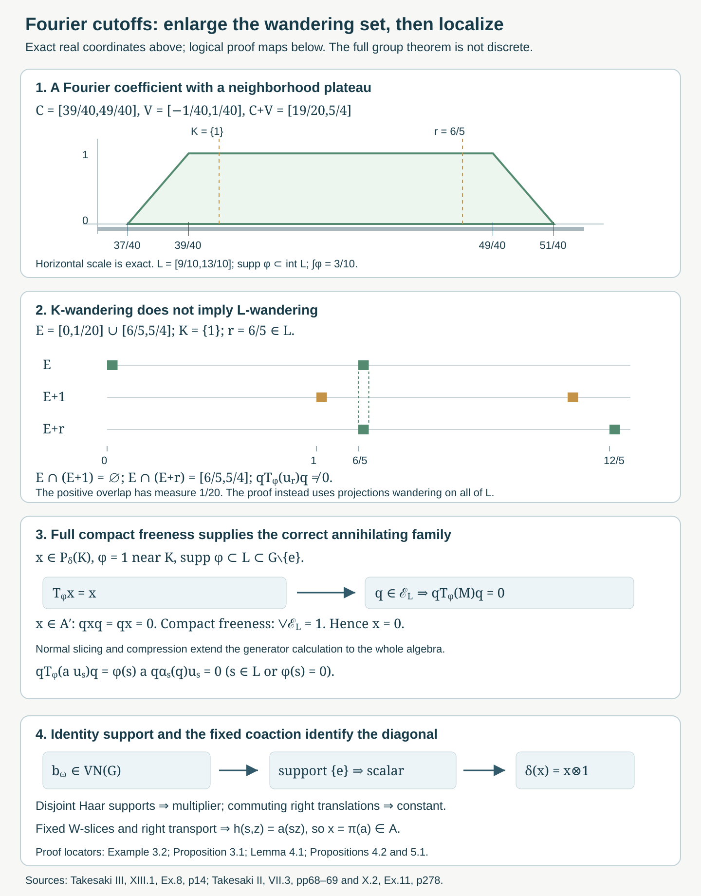

# Fourier cutoffs and the free diagonal

*Written by GPT-6.1 Sol (OpenAI), Ultra, October 2026. New original text is public domain (CC0).*

## Introduction

There is a second route to the maximal-diagonal theorem. Rather than disintegrating into irreducible orbit representations, it filters crossed-product operators by compact sets of group labels. Freeness supplies projections that annihilate every filtered operator supported away from the identity. A point-support argument then identifies the remaining operators with the diagonal.

This lesson gives the complete argument of Takesaki III, XIII.1, Exercise 8, including every suggested step. Two details in its hints need care. The compression projections must wander for the enlarged compact set \(L\) containing the Fourier cutoff's support. Also, we choose the cutoff to equal one on a neighborhood of \(K\), not merely at its points. This proves the filtering identity without assuming spectral synthesis of an arbitrary compact set. Once the compact spectral subspace is proved zero, the identity for any cutoff allowed by the source follows as well.

Read [Free actions and the crossed-product diagonal](free-actions-and-the-crossed-product-diagonal.md), Sections 1–2, Theorem 3.3 and Theorem 4.6, and [Orbit representatives and null fibre exceptions](orbit-representatives-and-null-fibre-exceptions.md), Section 1. We use their faithful normal regular representation, scalar multiplication commutant, full compact-projection freeness and corrected right commuting unitaries. Measurable actions and compact models, Theorem 4.1, realizes an abstract abelian separable-predual system as a continuous nonsingular standard measured action. Haar regularity, strong continuity of left translation, trace-class descriptions of normal functionals, normal spatial tensor products and their commutant theorem are explicit operator/measure prerequisites. General modular weights and general action-spectrum theory are not proved here; the Fourier calculations here serve this free-diagonal application.

We retain the source's separable locally compact Hausdorff group convention and its nonzero standard sigma-finite measured base. Write \(A=\pi(L^\infty(X,\mu))\), \(M=A\rtimes G\), and
\[
P=A'\cap M.
\tag{0.1}
\]
The hypothesis is full compact-projection freeness:
\[
\begin{gathered}
C\subset G\setminus\{e\}\text{ compact},\quad
0\ne p\in\operatorname{Proj}(A)
\\
\Longrightarrow\quad
\exists\,0\ne q\le p\quad
q\alpha_s(q)=0\quad(s\in C).
\end{gathered}
\tag{0.2}
\]
It makes the action faithful: apply it to \(C=\{s\}\) if a nonidentity \(s\) acted identically. The faithful-action compact-neighborhood argument in the free-action lesson makes \(G\) second countable. All Haar spaces below are therefore sigma-finite and separable. This retains the original group scope; we do not assume discreteness, unimodularity or amenability. Ergodicity is unnecessary until the final factor conclusion.

## 1. Fourier coefficients, compact plateaux and spectral support

Let \(\lambda_s\xi(t)=\xi(s^{-1}t)\) on \(L^2(G)\), and put \(VN(G)=\lambda(G)''\). The Fourier algebra is its predual:
\[
A(G)=VN(G)_*,\qquad \varphi(s)=\varphi(\lambda_s).
\tag{1.1}
\]
The same notation denotes a normal functional and its coefficient function. It is injective because the span of the \(\lambda_s\)'s is ultraweakly dense in \(VN(G)\).

**Lemma 1.1 (compact coefficients are dense).** The functions in \(A(G)\) are continuous and vanish at infinity. Those with compact support form a norm-dense subalgebra \(A_c(G)\).

*Proof.* Normal functionals on the concretely represented \(VN(G)\) are restrictions of trace-class functionals on \(B(L^2(G))\). Thus they are norm limits of finite sums of vector coefficients
\[
\varphi_{\xi,\eta}(s)=\langle\lambda_s\xi,\eta\rangle.
\tag{1.2}
\]
This trace-class restriction is the usual predual quotient theorem. If \(\xi,\eta\) have compact supports \(E,F\), respectively, their coefficient vanishes outside the compact set \(FE^{-1}\). Strong continuity of \(\lambda\) makes it continuous. Truncating the two vectors on a compact exhaustion gives convergence in \(L^2\); the predual estimate
\[
\|\varphi_{\xi,\eta}-\varphi_{\xi_n,\eta_n}\|_{A(G)}
\le \|\xi-\xi_n\|_2\|\eta\|_2
  +\|\xi_n\|_2\|\eta-\eta_n\|_2
\tag{1.3}
\]
proves approximation by compactly supported coefficients. Moreover \(\|\varphi\|_\infty\le\|\varphi\|_{A(G)}\), because every \(\lambda_s\) is unitary. Uniform approximation by the compact continuous coefficients proves the first assertion for all normal functionals.

For the algebra assertion, the unitary
\[
(W_G\xi)(s,t)=\xi(s,st)
\tag{1.4}
\]
satisfies \(W_G^*(\lambda_r\otimes1)W_G=\lambda_r\otimes\lambda_r\). Thus
\(\delta_G(b)=W_G^*(b\otimes1)W_G\) is a normal injective homomorphism into \(VN(G)\,\bar\otimes\,VN(G)\). Precomposition of \(\varphi\otimes\psi\) with it is a normal functional whose value on \(\lambda_s\) is \(\varphi(s)\psi(s)\). This proves pointwise multiplication, with
\(\|\varphi\psi\|_{A(G)}\le\|\varphi\|_{A(G)}\|\psi\|_{A(G)}\).
Compact support is preserved by products. The truncation argument proves its norm density. \(\square\)

**Lemma 1.2 (an exact compact plateau).** If \(K\subset\operatorname{int}L\), with \(K,L\) compact, there is \(\varphi\in A_c(G)\) such that \(0\le\varphi\le1\), \(\operatorname{supp}\varphi\subset\operatorname{int}L\), and \(\varphi=1\) on an open neighborhood of \(K\).

*Proof.* Choose a compact \(C\) with \(K\subset\operatorname{int}C\subset C\subset\operatorname{int}L\). A finite cover of \(K\) by relatively compact open sets whose closures lie in \(\operatorname{int}L\) supplies such a \(C\). Compactness and continuity give an identity neighborhood \(N\) with \(CN\subset\operatorname{int}L\). Choose a compact identity neighborhood \(V\) with \(VV^{-1}\subset N\). Its Haar measure is finite and positive. Put
\[
\varphi(s)=\frac{\langle\lambda_s\mathbf1_V,\mathbf1_{CV}\rangle}{m(V)}
=\frac1{m(V)}\int_V\mathbf1_{CV}(st)\,dt.
\tag{1.5}
\]
This is a Fourier coefficient. It is between zero and one, is one for every \(s\in C\), and has support in \(CVV^{-1}\subset\operatorname{int}L\). The support assertion follows from the compact-coefficient argument; it includes the closure of the nonzero set. Hence it has the required neighborhood plateau. Empty \(K\) permits the zero function. \(\square\)

Now let a von Neumann algebra \(N\) carry a normal faithful coaction
\[
\delta:N\longrightarrow N\bar\otimes VN(G),\qquad
(\delta\otimes\mathrm{id})\delta=(\mathrm{id}\otimes\delta_G)\delta.
\tag{1.6}
\]
We apply this only to the regular \(M\) constructed in Section 2. Define normal bounded maps
\[
T_\varphi(x)=(\mathrm{id}\otimes\varphi)\delta(x),\qquad
\|T_\varphi\|\le\|\varphi\|_{A(G)}.
\tag{1.7}
\]
Coassociativity gives \(T_\varphi T_\psi=T_{\varphi\psi}\). The action is nondegenerate in the following sufficient sense: if all \(T_\varphi(x)\) vanish, product normal slices make \(\delta(x)=0\), and faithfulness makes \(x=0\).

Define \(\operatorname{Sp}_\delta(x)\) by its complement: an open set \(U\) is spectrally empty for \(x\) if
\[
T_\psi(x)=0
\quad\text{for every }\psi\in A_c(G)
\text{ with }\operatorname{supp}\psi\subset U.
\tag{1.8}
\]
The union of these open sets is the complement of the support. For closed \(K\), write \(N_\delta(K)=\{x:\operatorname{Sp}_\delta(x)\subset K\}\). This is the local Fourier-module spectral-support convention in the source's notation \(\mathcal P^{\widehat\alpha}(K)\); below we restrict the module to \(P\).

Equivalently,
\[
N_\delta(K)=
\bigcap_{\substack{\psi\in A_c(G)\\
\operatorname{supp}\psi\cap K=\varnothing}}
\ker T_\psi.
\tag{1.9}
\]
The finite-cutoff decomposition in the proof below gives the forward implication: cover the compact support of \(\psi\) by spectrally empty neighborhoods. For the converse, a point outside closed \(K\) has a neighborhood disjoint from \(K\), and every compactly supported test there is among the displayed kernels. Thus this is a linear ultraweakly closed subspace, since the filter maps are normal.

**Lemma 1.3 (local support really determines the filters).**

1. Empty spectral support implies \(x=0\).
2. \(\operatorname{Sp}_\delta(T_\psi x)\subset\operatorname{Sp}_\delta(x)\cap\operatorname{supp}\psi\).
3. If \(\operatorname{Sp}_\delta(x)\subset K\) and \(\varphi=1\) on a neighborhood of \(K\), then \(T_\varphi(x)=x\).

*Proof.* For the first assertion, fix \(\psi\in A_c(G)\). Cover its compact support by finitely many spectrally empty open sets \(U_j\). For each point of that support choose, by Lemma 1.2, a cutoff \(\theta_j\) supported in a corresponding \(U_j\), equal to one on a neighborhood of that point. Choose finitely many whose plateau neighborhoods cover the support. The telescoping identity gives
\[
\psi=\sum_{j=1}^n
\psi\,\theta_j\prod_{i<j}(1-\theta_i).
\tag{1.10}
\]
Every term belongs to \(A_c(G)\), is supported in its spectrally empty \(U_j\), and therefore annihilates \(x\). The product notation uses the algebra's unitization; multiplying by \(\psi\theta_j\) keeps each term in \(A(G)\). Thus \(T_\psi(x)=0\). Lemma 1.1 and (1.7) extend this to all \(A(G)\), and nondegeneracy gives \(x=0\).

For the second assertion, an empty neighborhood for \(x\) stays empty for \(T_\psi x\), since every \(\theta\psi\) has support within that same neighborhood. An open set disjoint from \(\operatorname{supp}\psi\) is also empty, because \(\theta\psi=0\). This proves the stated inclusion.

For the third assertion, let \(y=x-T_\varphi x\). On the neighborhood where \(\varphi=1\), a localized \(\theta\) gives \(T_\theta y=T_{\theta-\theta\varphi}x=0\). Outside \(K\), use a spectrally empty neighborhood of \(x\); both \(\theta\) and \(\theta\varphi\) are supported there, so again \(T_\theta y=0\). These neighborhoods cover \(G\), and the first assertion gives \(y=0\). This proof uses a neighborhood plateau, not an assertion that every closed set is a synthesis set. \(\square\)

No uniformly bounded approximate identity of \(A(G)\) was used. Such an assumption would improperly impose amenability on the group.

## 2. The regular coaction preserves the relative commutant

On \(\mathcal H=L^2(G\times X)\), use the regular operators
\[
(\pi(f)\xi)(s,x)=f(sx)\xi(s,x),\qquad
(u_r\xi)(s,x)=\xi(r^{-1}s,x).
\tag{2.1}
\]
On \(\mathcal H\otimes L^2(G)\), put
\[
(W\xi)(s,x,t)=\xi(s,x,st),\qquad
\delta(y)=W^*(y\otimes1)W.
\tag{2.2}
\]
Left Haar invariance makes \(W\) unitary. Direct substitution gives
\[
\delta(\pi(f))=\pi(f)\otimes1,\qquad
\delta(u_r)=u_r\otimes\lambda_r.
\tag{2.3}
\]
Consequently \(\delta\) is a normal faithful homomorphism into
\(M\bar\otimes VN(G)\). Indeed unitary amplification is normal with ultraweakly closed image; the images of the generators lie in that tensor product. The two sides of coassociativity are normal homomorphisms and agree on (2.3), so they agree on \(M\). This is the concrete coaction in Takesaki II, X.2, Exercise 11. In particular
\[
T_\varphi(a u_r)=\varphi(r)a u_r
\qquad(a\in A,\ r\in G).
\tag{2.4}
\]
The linear span of these operators is an ultraweakly dense unital *-algebra in \(M\), by covariance and the definition of the crossed product.

**Proposition 2.1 (source parts (a)–(b)).**
\[
\delta(P)\subset P\bar\otimes VN(G),\qquad
T_\varphi(P)\subset P.
\tag{2.5}
\]
Thus \(P_\delta(K)\) is a well-defined spectral subspace.

*Proof.* If \(x\in P\), it commutes with every \(a\in A\). Applying the homomorphism \(\delta\), and using \(\delta(a)=a\otimes1\), shows that \(\delta(x)\) commutes with \(A\otimes1\). It belongs to \(M\bar\otimes VN(G)\).

Here is the tensor intersection being used. For such an operator \(Y\), every slice in the second leg is in \(M\) and commutes with \(A\), so is in \(P\). Finite-rank compressions in the second Hilbert-space leg have all matrix entries in \(P\), and their strong limit puts \(Y\) in \(P\bar\otimes B(L^2(G))\). It also commutes with \(1\otimes VN(G)'\). Therefore it commutes with both \(P'\otimes1\) and \(1\otimes VN(G)'\); the spatial tensor commutant theorem gives
\[
(P'\bar\otimes VN(G)')'=P\bar\otimes VN(G).
\]
This proves the first inclusion, with that standard tensor theorem explicit. Slicing it by a normal Fourier functional gives the second inclusion. Equivalently, the second assertion follows directly by slicing the commutation with \(A\otimes1\). \(\square\)

## 3. Compact wandering projections kill every nonidentity label

For compact \(L\subset G\setminus\{e\}\), let
\[
\mathcal E_L=\{q\in\operatorname{Proj}(A):
q\alpha_s(q)=0\text{ for every }s\in L\}.
\tag{3.1}
\]
Full compact-projection freeness gives
\[
\bigvee_{q\in\mathcal E_L}q=1.
\tag{3.2}
\]
To see this, if the join had nonzero complement \(p\), (0.2) would supply a nonzero \(q\le p\) belonging to \(\mathcal E_L\), contradicting the definition of the join.

**Proposition 3.1 (source parts (c)–(f)).** For every compact \(K\subset G\setminus\{e\}\),
\[
P_\delta(K)=\{0\}.
\tag{3.3}
\]

*Proof.* Choose compact \(L\subset G\setminus\{e\}\) with \(K\subset\operatorname{int}L\); local compactness and a finite neighborhood cover of \(K\) provide it. Choose \(\varphi\) from Lemma 1.2, supported in \(\operatorname{int}L\) and one on a neighborhood of \(K\). If \(x\in P_\delta(K)\), Lemma 1.3 gives \(T_\varphi(x)=x\).

For \(q\in\mathcal E_L\), covariance and (2.4) give
\[
\begin{aligned}
qT_\varphi(a u_r)q
&=\varphi(r)\,q a u_r q\\
&=\varphi(r)\,a q\alpha_r(q)u_r=0.
\end{aligned}
\tag{3.4}
\]
If \(r\in L\), the projection product is zero. If \(r\notin L\), the Fourier coefficient is zero. The map \(y\mapsto qT_\varphi(y)q\) is normal, being a normal slice followed by bounded multiplication. It vanishes on the dense algebra spanned by all \(a u_r\). Hence
\[
qT_\varphi(M)q=\{0\},\qquad qxq=0.
\tag{3.5}
\]
Since \(x\in P\), it commutes with \(q\in A\), so \(qxq=qx\). Thus \(qx=0\) for all \(q\in\mathcal E_L\). Finite joins of these commuting projections also annihilate \(x\); their increasing net converges strongly to the join in (3.2), which is one. Therefore \(x=0\). \(\square\)

The source's part (f) writes the join for \(K\), whereas the preceding compression calculation uses wandering on \(L\). Equation (0.2) supplies (3.2) for the enlarged \(L\) as well, which is the required application. One must not replace \(\mathcal E_L\) by \(\mathcal E_K\) in (3.4). Also, (3.3) proves that \(T_\psi(x)=x\) for every cutoff \(\psi\) listed in source part (c), since its \(x\in P_\delta(K)\) is zero. The proof of (3.3) itself used only the specifically chosen neighborhood plateau, so it assumed no arbitrary compact-set synthesis theorem.

**Example 3.2 (why the enlargement matters).** Let \(\mathbb R\) act on itself by translation, with Lebesgue measure. Take
\[
K=\{1\},\quad L=[9/10,13/10],\quad r=6/5,\quad
E=[0,1/20]\cup[6/5,5/4].
\tag{3.6}
\]
Then \(E\cap(E+1)=\varnothing\), but
\(E\cap(E+r)=[6/5,5/4]\), of measure \(1/20\). Thus \(q=\pi(\mathbf1_E)\) belongs to \(\mathcal E_K\), but not to \(\mathcal E_L\).

Choose \(C=[39/40,49/40]\) and \(V=[-1/40,1/40]\) in (1.5). Here \(C+V=[19/20,5/4]\), and the coefficient is the exact trapezoid
\[
\varphi(s)=
\begin{cases}
20(s-37/40),&37/40\le s\le39/40,\\
1,&39/40\le s\le49/40,\\
20(51/40-s),&49/40\le s\le51/40,\\
0,&\text{otherwise}.
\end{cases}
\tag{3.7}
\]
It is one on a neighborhood of \(K\) and at \(r\), and has support \([37/40,51/40]\subset\operatorname{int}L\). Nevertheless
\[
qT_\varphi(u_r)q
=q\alpha_r(q)u_r
=\pi(\mathbf1_{[6/5,5/4]})u_r\ne0.
\tag{3.8}
\]
This is a free ergodic source-scope example. It refutes the use of a merely \(K\)-wandering projection in the compression step, not the final diagonal theorem.

*Figure 1. The top panels use exact real coordinates: the cutoff has support \([37/40,51/40]\), plateau \([39/40,49/40]\), and value one at both \(K=\{1\}\) and \(r=6/5\). The shared translation scale shows \(E\cap(E+1)=\varnothing\) and \(E\cap(E+r)=[6/5,5/4]\), of measure \(1/20\). These are the complete calculations in Example 3.2 and Solutions 6.1 and 6.4. The lower panels are logical schematics, not numerical evidence for the group theorem: Proposition 3.1 uses the join of the \(L\)-wandering projections; Lemma 4.1 and Propositions 4.2 and 5.1 identify identity support and the fixed coaction algebra. Compare Takesaki III, XIII.1, Exercise 8; Takesaki II, VII.3, pages 68–69, and X.2, Exercise 11, page 278. Reproducible native SVG; complete arguments remain in the text.*

## 4. A group operator supported at the identity is scalar

The last source step requires identifying the identity spectral subspace, not merely eliminating compact sets away from it.

**Lemma 4.1 (a bounded point-support theorem).** Suppose \(b\in VN(G)\) satisfies
\[
\langle b,\psi\rangle=0
\quad\text{whenever }\psi\in A_c(G)
\text{ and }e\notin\operatorname{supp}\psi.
\tag{4.1}
\]
Then \(b=c1\) for a scalar \(c\).

*Proof.* Let \(E,F\subset G\) be disjoint compact sets, and let \(\xi,\eta\in L^2(G)\) be supported in \(E,F\), respectively. Their coefficient
\(\psi(s)=\langle\lambda_s\xi,\eta\rangle\) has support in \(FE^{-1}\), a compact set omitting \(e\). Therefore
\[
\langle b\xi,\eta\rangle=\langle b,\psi\rangle=0.
\tag{4.2}
\]
Fix \(E\). Vectors supported in compact subsets of \(G\setminus E\) are dense in \(L^2(G\setminus E)\), by Haar regularity and sigma-finiteness. Thus (4.2) gives
\((1-\mathbf1_E)b\mathbf1_E=0\). Reversing the roles of the two compact supports gives \(\mathbf1_Eb(1-\mathbf1_E)=0\). Hence \(b\) commutes with every compact support projection.

Every Haar-measurable set has, modulo a null set, a countable increasing union of compact subsets: intersect with a countable finite-Haar cover, apply inner regularity with errors tending to zero, and take finite unions of the chosen compact sets. Its multiplication projection is consequently a strong limit of compact support projections. Thus \(b\) commutes with all \(L^\infty(G)\). The scalar multiplication commutant lemma makes \(b=M_h\) for some bounded measurable \(h\).

Every element of \(VN(G)\) commutes with the right regular unitaries
\[
(\rho_t\xi)(s)=\Delta_G(t)^{1/2}\xi(st).
\tag{4.3}
\]
Consequently \(h(st)=h(s)\) for almost every \(s\), for every fixed \(t\). Choose a Borel representative. The exceptional subset of \(G\times G\) is measurable with every fixed-\(t\) section null. Fubini and the change \(r=st\), which is left translation in \(t\) for fixed \(s\), give \(h(r)=h(s)\) for almost every pair \((r,s)\). Thus \(h\) is constant almost everywhere. This proves the lemma. \(\square\)

The boundedness and membership in \(VN(G)\) are essential to this argument. It asserts no classification of arbitrary distributions supported at a point.

**Proposition 4.2 (the coaction of a relative-commutant element is fixed).** Every \(x\in P\) satisfies
\[
\delta(x)=x\otimes1.
\tag{4.4}
\]

*Proof.* If \(\psi\in A_c(G)\) has compact support avoiding \(e\), Proposition 2.1 and Lemma 1.3 put \(T_\psi(x)\) in \(P_\delta(\operatorname{supp}\psi)\). Proposition 3.1 makes it zero.

For \(\omega\in M_*\), put \(b_\omega=(\omega\otimes\mathrm{id})\delta(x)\in VN(G)\). Its pairing with every such \(\psi\) is \(\omega(T_\psi x)=0\). Lemma 4.1 gives \(b_\omega=c_\omega1\). Choose \(\varphi_0\in A(G)\) with \(\varphi_0(e)=1\); a vector coefficient at a unit vector supplies one. Set \(a=T_{\varphi_0}x\). Then \(c_\omega=\omega(a)\). Product normal slices separate the spatial tensor product, so
\[
\delta(x)=a\otimes1.
\tag{4.5}
\]
Apply coassociativity: its left side is \(\delta(a)\otimes1\), and its right side is \(a\otimes1\otimes1\). Hence \(\delta(a)=a\otimes1=\delta(x)\). Injectivity of \(\delta\) gives \(a=x\), proving (4.4). Neither a counit on all of \(VN(G)\) nor amenability of \(G\) was used. \(\square\)

## 5. The fixed coaction algebra is exactly the coefficient diagonal

This identification does not require freeness, and we prove it in the actual regular representation. It is the remaining ingredient in source part (g).

**Proposition 5.1.**
\[
\{x\in M:\delta(x)=x\otimes1\}=A.
\tag{5.1}
\]

*Proof.* Equation (2.3) gives the inclusion of \(A\). Conversely, if \(\delta(x)=x\otimes1\), (2.2) says \(x\otimes1\) commutes with \(W\). Its vector slices in the last leg are group-coordinate multipliers with functions
\[
s\longmapsto\langle\lambda_{s^{-1}}\xi,\eta\rangle.
\tag{5.2}
\]
Therefore \(x\) commutes with these multipliers.

Choose \(\xi,\eta\) from a countable dense vector family in \(L^2(G)\). Their coefficients separate group elements. Indeed equality of all these coefficients gives equality of \(\lambda_{s^{-1}}\) and \(\lambda_{t^{-1}}\) as operators. The left regular representation is faithful: for \(h\ne e\), choose an identity neighborhood of positive finite Haar measure whose \(h\)-translate is disjoint from it; the two corresponding indicator vectors show \(\lambda_h\ne1\). Thus \(s=t\). The countable coefficient map is continuous and injective, and the standard Borel injective-image theorem makes its coordinate sigma-field the whole Borel sigma-field of \(G\). The multipliers in (5.2) consequently generate all group-coordinate Haar multipliers.

In addition, \(x\in M\) commutes with every source multiplier
\(N_f\xi(s,z)=f(z)\xi(s,z)\), as checked on the generators (2.1). Together these two multiplication families generate \(L^\infty(G\times X)\). Their scalar commutant is that same multiplication algebra, so
\[
x=M_h,\qquad h\in L^\infty(G\times X).
\tag{5.3}
\]

The corrected right commuting unitaries from the orbit-representation lesson are
\[
(v_t\xi)(s,z)=\Delta_G(t)^{1/2}
r_{t^{-1}}(z)^{1/2}\xi(st,t^{-1}z),
\qquad
r_s=\frac{d(s^{-1})_*\mu}{d\mu}.
\tag{5.4}
\]
Their direct norm and commutation calculations show \(v_t\in M'\); no assertion that they generate the full commutant is needed here. Commutation of \(M_h\) with \(v_t\) gives
\[
h(st,t^{-1}z)=h(s,z)
\quad\text{for almost every }(s,z),\text{ for every fixed }t.
\tag{5.5}
\]

Choose a bounded Borel representative and change endpoint coordinates by
\[
b(s,y)=h(s,s^{-1}y).
\tag{5.6}
\]
The map \((s,z)\mapsto(s,sz)\) and its inverse are jointly Borel. They preserve the product measure class, since each fixed-\(s\) base action is nonsingular; both directions follow from Fubini. This assertion does not require the endpoint relation to be injectively parametrized, or the base action to be free. Formula (5.5) becomes
\[
b(st,y)=b(s,y)
\quad\text{for almost every }(s,y),\text{ for every fixed }t.
\tag{5.7}
\]
Fubini on the sigma-finite variables \(s,t,y\), followed by \(r=st\), gives \(b(r,y)=b(s,y)\) for almost every triple. Thus \(b(\cdot,y)\) is essentially constant for almost every \(y\).

Let \(k>0\) be a Haar probability density and set
\[
a(y)=\int_G k(s)b(s,y)\,ds.
\tag{5.8}
\]
Such \(k\) exists by a countable finite-Haar cover and summable positive weights. Parameter integration makes \(a\) Borel; it is bounded by \(\|h\|_\infty\), and it equals the essential constant for almost every \(y\). Therefore \(h(s,z)=a(sz)\) almost everywhere, so \(x=\pi(a)\in A\). This proves the converse inclusion and (5.1). \(\square\)

**Theorem 5.2 (the full spectral proof of the free-diagonal theorem).** Under (0.2) at the standing source scope,
\[
A'\cap(A\rtimes G)=A.
\tag{5.9}
\]
Thus \(A\) is maximal abelian. If the action is ergodic, \(A\rtimes G\) is a factor.

*Proof.* Propositions 4.2 and 5.1 give \(P\subset A\); the reverse inclusion is automatic because \(A\) is abelian. A central element now belongs to \(A\), and covariance identifies the centre with its invariant function classes. The exact-set/invariant-class bridge in the free-action lesson, Proposition 4.7, makes these classes scalar precisely in the ergodic case. \(\square\)

All seven source parts are now accounted for: normal coaction preservation, the Fourier module, the chosen compact plateau, generator compression, normal extension, the join for the enlarged compact set, and the identity-support/fixed-algebra conclusion. This proof does not use orbit irreducibility or the general standard conjugation equality \(JMJ=M'\). It retains the full nondiscrete and nonunimodular group cases.

## 6. Exercises with complete solutions

Level 1 asks for an exact calculation. Level 2 asks for a proof using the lesson's tools. Level 3 combines locality, Fourier slicing and operator algebras.

**Exercise 6.1 (the plateau and its exact support).** *Level 1.* Derive (3.7) from \(C=[39/40,49/40]\), \(V=[-1/40,1/40]\). Compute \(\int\varphi\), check its values at \(1\) and \(6/5\), and give a valid Fourier-algebra norm bound.

*Solution.* Formula (1.5) is the length of
\([s-1/40,s+1/40]\cap[19/20,5/4]\), divided by \(m(V)=1/20\). The intersection first appears at \(s=37/40\), grows linearly with slope one until \(39/40\), remains the whole \(1/20\)-interval until \(49/40\), and then shrinks linearly to zero at \(51/40\). Multiplication by twenty gives exactly (3.7). Both \(1=40/40\) and \(6/5=48/40\) are in its plateau, with positive distance from its endpoints. Its support is \([37/40,51/40]\), contained in the interior of \([9/10,13/10]\).

The plateau has length \(1/4\), and each triangular shoulder has area \((1/2)(1/20)\). Thus \(\int\varphi=1/4+1/20=3/10\). For a coefficient realization use \(\xi=\mathbf1_V/\sqrt{m(V)}\), of norm one, and \(\eta=\mathbf1_{C+V}/\sqrt{m(V)}\), of norm \(\sqrt{(3/10)/(1/20)}=\sqrt6\). Therefore \(\|\varphi\|_{A(\mathbb R)}\le\sqrt6\). The pointwise bound \(0\le\varphi\le1\) does not assert a Fourier-algebra norm bound of one.

**Exercise 6.2 (no countable local base in the plateau construction).** *Level 2.* Prove Lemma 1.2 by finite compact covers, keeping a general locally compact Hausdorff group. Identify what second countability is used for elsewhere.

*Solution.* For each point of compact \(K\), local compactness and regularity supply a relatively compact open neighborhood with closure in \(\operatorname{int}L\). Finitely many cover \(K\); their union of closures is compact \(C\subset\operatorname{int}L\), with \(K\subset\operatorname{int}C\). By continuity of multiplication, for each \(c\in C\) there are a neighborhood \(U_c\) of \(c\) and an identity neighborhood \(N_c\) with \(U_cN_c\subset\operatorname{int}L\). A finite \(U_c\)-cover and the intersection of its \(N_c\)'s give \(CN\subset\operatorname{int}L\). Choose a relatively compact identity neighborhood \(U\) with \(\overline U\,\overline U^{-1}\subset N\) and put \(V=\overline U\).

The coefficient of \(\mathbf1_V/\sqrt{m(V)}\) and \(\mathbf1_{CV}/\sqrt{m(V)}\) is between zero and one, is one on \(C\), and is supported in \(CVV^{-1}\subset\operatorname{int}L\). The Haar mass \(m(V)\) is positive and finite. Every choice used a finite compact cover; no neighborhood sequence or countable local base was needed. In the later argument, the freeness-forced second countability provides sigma-finite Haar measure, separable regular Hilbert spaces, countable Borel coordinate families and the Haar-Fubini steps.

**Exercise 6.3 (why empty spectral support means zero).** *Level 3.* Prove that the local definition (1.8) detects a nonzero element, without assuming a bounded approximate identity of \(A(G)\).

*Solution.* If every point has a spectrally empty neighborhood, fix \(\psi\in A_c(G)\) and cover its compact support by finitely many plateau neighborhoods of compactly supported cutoffs \(\theta_j\), each supported in a spectrally empty open set. The identity
\[
1-\prod_{j=1}^n(1-\theta_j)
=\sum_{j=1}^n\theta_j\prod_{i<j}(1-\theta_i)
\]
equals one on that compact support, since some \(\theta_j\) is one at each point. Multiplying it by \(\psi\) gives (1.10). Every term has compact support in an empty neighborhood and annihilates \(x\), so \(T_\psi x=0\). Compact coefficient density and \(\|T_\psi\|\le\|\psi\|_{A(G)}\) give the same for every \(\psi\in A(G)\). Every product normal slice of \(\delta(x)\) is zero, so \(\delta(x)=0\); injectivity gives \(x=0\). The finite cutoffs need no uniform norm bound, and the proof makes no amenability assumption.

**Exercise 6.4 (a \(K\)-wandering projection need not compress the cutoff to zero).** *Level 2.* Verify all interval claims in Example 3.2 and compute the nonzero compressed generator.

*Solution.* Write \(E_0=[0,1/20]\), \(E_1=[6/5,5/4]\). Then
\[
E+1=[1,21/20]\cup[11/5,9/4],\qquad
E+6/5=[6/5,5/4]\cup[12/5,49/20].
\]
The first translate is disjoint from \(E_0\cup E_1\), whereas the second intersects it in exactly \(E_1\). Hence \(q\alpha_1(q)=0\), but \(q\alpha_{6/5}(q)=\pi(\mathbf1_{E_1})\ne0\); the nonzero projection has Lebesgue support measure \(1/20\). The coefficient (3.7) is one at \(6/5\), so
\(qT_\varphi(u_{6/5})q=\pi(\mathbf1_{E_1})u_{6/5}\ne0\).
Multiplication by the unitary cannot make that nonzero projection zero. Real translation is free, nonsingular and transitive; the Haar-Fubini invariant-class argument proves ergodicity. Thus the example meets the source's hypotheses and isolates exactly the erroneous use of \(\mathcal E_K\) in an \(L\)-supported compression.

**Exercise 6.5 (zero corners and the commutation hypothesis).** *Level 2.* Show that the join of \(\mathcal E_L\) is one, explain why \(qxq=0\) for all its projections kills \(x\in P\), and give a \(2\times2\) counterexample if the commutation hypothesis is removed.

*Solution.* If \(p=1-\bigvee\mathcal E_L\ne0\), compact-projection freeness gives a nonzero \(q\le p\) in \(\mathcal E_L\), contradicting its being orthogonal to the join. Thus the join is one. If \(x\in P\), it commutes with each \(q\in A\), so \(qxq=qx\). Finite joins annihilate \(x\), and their increasing net has strong limit one, hence \(x=0\). Without commutation, take the diagonal algebra of \(M_2(\mathbb C)\), its two coordinate projections \(e_{11},e_{22}\), and \(x=e_{12}\). Both \(e_{11}xe_{11}\) and \(e_{22}xe_{22}\) are zero, and the projections join to one, but \(x\ne0\). Thus the relative-commutant condition is an essential step, not dispensable notation.

**Exercise 6.6 (the bounded point-support theorem).** *Level 3.* Prove Lemma 4.1, explaining separately the use of boundedness and of \(b\in VN(G)\).

*Solution.* Disjoint compact supports \(E,F\) give a Fourier coefficient supported in \(FE^{-1}\), which omits \(e\). The assumed annihilation makes \(\langle b\xi,\eta\rangle=0\). Haar regularity and sigma-finiteness let the vectors supported on compact subsets of the complement approximate every complement vector in norm. Boundedness permits this passage and makes every compact support projection reduce \(b\). Inner compact approximation and strong projection limits extend commutation to all Haar multipliers. Their maximal abelianness gives \(b=M_h\) with bounded \(h\).

Now \(b\in VN(G)\) implies it commutes with every right regular unitary, so \(h(st)=h(s)\) for almost every \(s\), for each fixed \(t\). A Borel representative, Haar Fubini and \(r=st\) give \(h(r)=h(s)\) almost everywhere on \(G\times G\). Thus \(h=c\). Without the \(VN(G)\) condition, an arbitrary nonconstant multiplier would preserve all support projections. Without boundedness, the norm-approximation and bounded-multiplier conclusions would not apply; the lemma is not a theorem about all point-supported distributions.

**Exercise 6.7 (identify the fixed algebra without a full commutant theorem).** *Level 3.* Prove (5.1), and explain why the full identity \(JMJ=M'\) is unnecessary.

*Solution.* The inclusion of \(A\) is (2.3). If \(\delta(x)=x\otimes1\), the defining unitary \(W\) commutes with \(x\otimes1\). Its vector slices are multiplication by the inverse left-regular coefficient functions. A countable dense vector family separates group labels by faithfulness of \(\lambda\); the injective Borel-image theorem then makes their multipliers generate all group-coordinate \(L^\infty(G)\).

Every \(x\in M\) already commutes with the source-coordinate \(N_{L^\infty(X)}\). The two multiplication families generate the product multiplication algebra, whose commutant is itself. Hence \(x=M_h(s,z)\). The directly proved unitaries \(v_t\in M'\) make \(h(st,t^{-1}z)=h(s,z)\) for each fixed \(t\) almost everywhere. The Borel measure-class change \(y=sz\) converts this to \(b(st,y)=b(s,y)\). Product Haar Fubini and left translation in the \(t\)-variable make \(b(\cdot,y)\) constant almost everywhere for almost every \(y\). Its Haar probability average gives a bounded measurable \(a(y)\), and \(h(s,z)=a(sz)\). Thus \(x=\pi(a)\in A\). Only membership \(v_t\in M'\), verified directly on generators and by changes of variables, was used. No description of the full commutant or closed Tomita operator was needed.

**Exercise 6.8 (a discrete Fourier coefficient and the nondiscrete boundary).** *Level 2.* For \(\mathbb Z\) translating itself with counting measure, compute the coaction and filters of all orbit matrix units. Show how the diagonal result follows, and explain why the same singleton coefficient is unavailable for a nondiscrete group.

*Solution.* In endpoint coordinates the transitive orbit representation is \(B(\ell^2(\mathbb Z))\), with the original source coordinate as multiplicity. Let \(p_j\) project onto the orbit point \(j\). The matrix unit is
\[
E_{jk}=p_j u_{j-k}p_k.
\]
Equation (2.3) gives
\(\delta(E_{jk})=E_{jk}\otimes\lambda_{j-k}\), and (2.4) gives
\(T_\varphi(E_{jk})=\varphi(j-k)E_{jk}\).
The vector coefficient of \(\delta_0\) with itself is \(\varphi(n)=\mathbf1_{\{0\}}(n)\). Its normal slice preserves every diagonal entry and kills every off-diagonal matrix unit. A bounded operator commuting with all \(p_j\) has every off-diagonal entry zero, and is multiplication by its bounded sequence of diagonal entries. This proves the diagonal MASA in this full infinite discrete example.

If \(G\) is nondiscrete, \(\mathbf1_{\{e\}}\) is not continuous, whereas every Fourier-algebra function is continuous. It is therefore not an available \(A(G)\) slice. The proof above cannot be transferred by treating Haar measure as counting. Sections 1–5 instead use compact cutoffs, normal compression, bounded point-support locality and the exact fixed-coaction algebra. They prove the same full group conclusion without an atomic Fourier filter.

## References and source disposition

[Takesaki III] Masamichi Takesaki, *Theory of Operator Algebras III*, Encyclopaedia of Mathematical Sciences 127, Springer, 2003. XIII.1, Definition 1.3 and Exercise 8, printed pages 4 and 13–14. [Publisher record](https://doi.org/10.1007/978-3-662-10453-8).

[Takesaki II] Masamichi Takesaki, *Theory of Operator Algebras II*, Encyclopaedia of Mathematical Sciences 125, Springer, 2003. VII.3, Lemma 3.7 and Definition 3.8; X.2, Exercise 11(a)–(e). [Publisher record](https://doi.org/10.1007/978-3-662-10451-4).

All seven assertions of source Exercise 8 are proved at the full standing free separable locally compact measured scope. Its enlarged-\(L\) projection join is supplied by the full freeness hypothesis. A neighborhood plateau proves the cutoff identity used in the argument; after the compact spectral subspace is proved zero, every allowed source cutoff gives its stated identity. The bounded identity-support theorem and the complete fixed-coaction calculation supply the last spectral step. No arbitrary compact synthesis theorem, amenability, discrete substitution or full standard-conjugation prerequisite is hidden in the proof.
