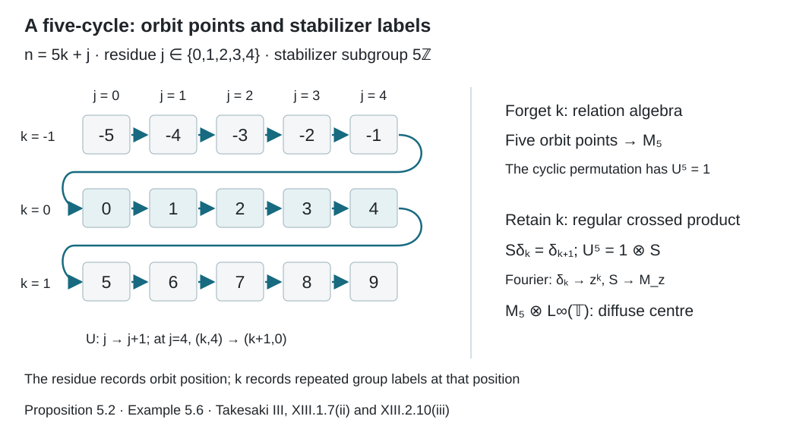
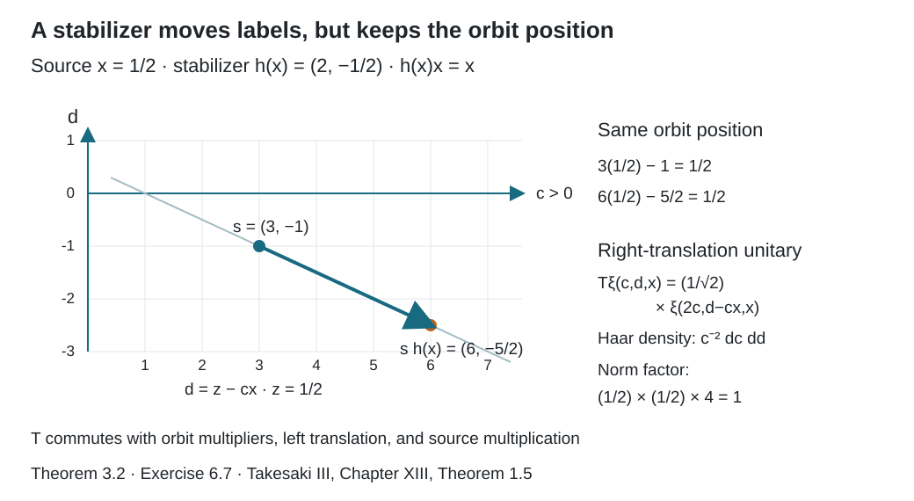

# Free actions and the crossed-product diagonal

*Written by GPT-6.1 Sol (OpenAI), Ultra, September 2026. New original text is public domain (CC0).*

## Introduction

For a free action, the orbit position \(sx\) determines the group coordinate \(s\) once \(x\) is fixed. This observation makes the diagonal algebra maximal abelian in the crossed product. We will prove it directly in the regular representation, including nondiscrete groups.

Unlike the countable relation construction, this representation uses Haar measure on group labels. Freeness makes those labels distinguish orbit positions. The counterexample in Section 4 explains why “each nonidentity element fixes a null set” is too weak for a nondiscrete group.

The forward proof uses the double-commutant theorem, standard Borel one-to-one images, and Radon–Nikodym change of variables. The converse also uses completed measurable sections and the standard regular crossed-product conjugation theorem, stated precisely in Section 3. The counting-measure construction is developed in [Orbits, stabilizers, and relation algebras](orbits-stabilizers-and-relation-algebras.md). The group conventions agree with [Haar averages and compact translation control](haar-averages-and-compact-translation-control.md).

Let \(G\) be second countable and locally compact, with left Haar measure \(ds\). Let it act jointly Borel and nonsingularly on a standard probability space \((X,\mu)\). A sigma-finite measure can first be replaced by an equivalent probability. Theorem 3.1 assumes that almost every \(x\) has trivial stabilizer, with the exceptional set contained in a measurable null set. Theorem 3.2 allows nontrivial stabilizers and proves the converse.

## 1. The regular covariant representation

On \(\mathcal H=L^2(G\times X,ds\,d\mu(x))\), define
\[
(\pi(f)\xi)(s,x)=f(sx)\xi(s,x),\qquad
(\lambda_t\xi)(s,x)=\xi(t^{-1}s,x).
\tag{1.1}
\]
Nonsingularity and Fubini show that \(\pi\) respects \(L^\infty\) classes. It is a faithful normal representation. For faithfulness, if \(\pi(f)=0\), then for Haar-almost every \(s\), \(f(sx)=0\) for almost every \(x\); any such \(s\), by nonsingularity, forces \(f=0\).

The unitaries \(\lambda_t\) satisfy
\[
\lambda_t\pi(f)\lambda_t^*=\pi(f\circ t^{-1}).
\tag{1.2}
\]
Define \(\mathcal M=L^\infty(X)\rtimes G\) to be the von Neumann algebra generated by these operators.

Multiplication \(N_h\xi(s,x)=h(x)\xi(s,x)\) commutes with every generator. There is a second commuting family. Let
\[
C_t(s,x)=(st,t^{-1}x).
\tag{1.3}
\]
This nonsingular bijection keeps \(sx\) fixed and commutes with left translation of \(s\). Its measure pushforward density has the form
\[
j_{C_t}(s,x)=c_t r_t(x),\qquad
r_t=\frac{d(t^{-1})_*\mu}{d\mu},
\tag{1.4}
\]
where \(c_t>0\) is the constant density of the right-translation pushforward of left Haar measure. Define
\[
(U_t\xi)(s,x)=j_{C_t}(s,x)^{1/2}\xi(st^{-1},tx).
\tag{1.5}
\]
Change of variables makes \(U_t\) unitary. It commutes with \(\pi(f)\) because (1.3) keeps the orbit position fixed, and with \(\lambda_g\) because (1.4) is independent of \(s\). We only need this commutation, so no convention for a right group representation is implicit in the notation.

## 2. An elementary field decomposition

**Lemma 2.1.** If \(K\) is a separable Hilbert space, every bounded operator on \(L^2(X;K)\) commuting with all scalar multiplications has a measurable bounded operator field \(T_x\), acting by \((T\xi)(x)=T_x\xi(x)\).

*Proof.* First, multiplication by \(L^\infty(X)\) is maximal abelian on \(L^2(X)\). If \(B\) commutes with it, set \(a=B1\). Commuting with indicators gives
\[
\int_E|a|^2\,d\mu=\|B\mathbf1_E\|^2
\leq\|B\|^2\mu(E),
\]
so \(a\in L^\infty\). Commuting with simple functions then makes \(B\) multiplication by \(a\), by density.

Choose a countable orthonormal basis of \(K\). Each matrix block \(T_{ij}\) on \(L^2(X)\) commutes with scalar multiplication, hence is multiplication by a measurable \(a_{ij}(x)\). For finite vectors with rational complex coordinates, apply the operator norm bound to their tensor products with indicators. On a common conull set it gives the pointwise bound
\[
\left|\sum_{i,j}\overline{v_i}a_{ij}(x)w_j\right|
\leq\|T\|\,\|v\|\,\|w\|.
\]
Countability permits this one exceptional-set removal. Density extends the form to all vectors, defining \(T_x\) with norm at most \(\|T\|\). Its matrix coefficients are measurable. On finite-coordinate simple sections the field operator equals \(T\); density proves equality everywhere. For sigma-finite spaces the same argument follows after a positive-density unitary change to an equivalent probability. \(\square\)

The scalar maximal-abelian argument therefore applies to Haar multiplication on \(L^2(G)\) as well.

## 3. Maximal abelianness and the centre

**Theorem 3.1.** The algebra \(\pi(L^\infty(X))\) is maximal abelian in \(\mathcal M\). Moreover,
\[
Z(\mathcal M)=\pi(L^\infty(X)^G).
\tag{3.1}
\]
Consequently, \(\mathcal M\) is a factor exactly when the action is ergodic.

*Proof.* Let \(T\in\mathcal M\) commute with \(\pi(L^\infty(X))\). Since \(T\) also commutes with every \(N_h\), Lemma 2.1 decomposes it as \(T_x\) on \(L^2(G)\).

Choose a countable family of Borel sets \(B_n\subset X\) separating points. For almost every \(x\), \(T_x\) commutes with multiplication by all functions \(s\mapsto\mathbf1_{B_n}(sx)\). For almost every such \(x\), the orbit map \(s\mapsto sx\) is injective. The map
\[
s\longmapsto(\mathbf1_{B_n}(sx))_{n\geq1}
\]
is therefore a Borel injection into \(\{0,1\}^{\mathbb N}\). The one-to-one image theorem makes its coordinate sigma-field the whole Borel sigma-field of \(G\). Thus those multiplication projections generate \(L^\infty(G)\). Each \(T_x\) commutes with all Haar multiplication and is itself a multiplier.

It follows that \(T\) commutes with multiplication by functions of \(s\) as well as functions of \(x\). The rectangles generate the product sigma-field. Applying the scalar maximal-abelian argument on \(G\times X\), we conclude that \(T\) is multiplication by a bounded measurable \(a(s,x)\).

Because \(T\) commutes with (1.5), this function satisfies
\[
a(st,t^{-1}x)=a(s,x)
\tag{3.2}
\]
almost everywhere for every fixed \(t\). The coordinate change \((s,x)\mapsto(s,y=sx)\) is Borel and preserves the product measure class: check both directions fibrewise using nonsingularity and Fubini. Put \(b(s,y)=a(s,s^{-1}y)\). Equation (3.2) becomes
\[
b(st,y)=b(s,y).
\tag{3.3}
\]

This identity makes \(b\) independent of \(s\) almost everywhere. Indeed, its exceptional set is measurable in \((t,s,y)\) and each fixed-\(t\) section is null. Fubini, followed by the left-Haar substitution \(u=st\), gives \(b(u,y)=b(s,y)\) for almost every \((u,s,y)\). Hence for almost every \(y\) it is essentially constant in \(s\). Choose any positive probability density \(k\) on \(G\); \(f(y)=\int k(s)b(s,y)\,ds\) is a bounded measurable representative of this constant.

Therefore \(a(s,x)=f(sx)\) almost everywhere and \(T=\pi(f)\). This proves maximal abelianness.

A central operator must now lie in \(\pi(L^\infty(X))\). It commutes with the remaining generators exactly when \(f\circ t^{-1}=f\) modulo null sets for every \(t\), by (1.2) and faithfulness. This proves (3.1). Ergodicity is equivalent to these invariant bounded functions being constant. \(\square\)

Only countably many separating functions were disintegrated in this proof. We did not assert that an entire \(L^\infty(X)\) representation could be evaluated normally at one orbit point.

For the converse we use the **standard regular crossed-product conjugation theorem**, whose general proof belongs to the crossed-product and modular-theory prerequisites. In the standard representation of \(A=L^\infty(X,\mu)\) on \(L^2(X,\mu)\), its conjugation is complex conjugation, and the canonical implementer of \(f\mapsto f\circ s^{-1}\) is the nonsingular change-of-variable unitary. The regular crossed-product theorem supplies the antiunitary
\[
(\mathcal J\xi)(s,x)
=\Delta_G(s)^{-1/2}r_s(x)^{1/2}
\overline{\xi(s^{-1},sx)},
\tag{3.4}
\]
where \(r_s=d(s^{-1})_*\mu/d\mu\) is exactly the density used in (1.4), and
\(\int h(st)\,ds=\Delta_G(t)^{-1}\int h(s)\,ds\).
The theorem gives
\[
\mathcal J\mathcal M\mathcal J=\mathcal M',\qquad
\mathcal J\pi(f)\mathcal J=N_{\overline f}.
\tag{3.5}
\]
Its first identity uses the closed Tomita correspondence for the regular representation. The second follows by substitution in (3.4): the orbit coordinate becomes \(s^{-1}(sx)=x\). The imported theorem applies to nonabelian and nonunimodular groups and to noninvariant faithful states. We reuse that general result; the following measurable stabilizer argument is specific to this course.

**Theorem 3.2 (the full freeness criterion).** For a jointly Borel nonsingular action of a second countable locally compact group on a standard sigma-finite measured space,
\(\pi(L^\infty(X))\) is maximal abelian in the regular crossed product if and only if almost every point has trivial stabilizer. Equivalently, it is maximal abelian if and only if the compact wandering condition (4.1) holds.

*Proof.* Sufficiency is Theorem 3.1; Theorem 4.4 proves the equivalence with (4.1). For necessity suppose that the diagonal is maximal abelian. By (3.5), source multiplication \(N_A\) is maximal abelian in \(\mathcal M'\).

If nontrivial stabilizers occur on a set of positive measure, some compact \(C\subset G\setminus\{e\}\) has a positive-measure set
\[
E_C=\{x:\text{some }h\in C\text{ satisfies }hx=x\}.
\]
Indeed \(G\setminus\{e\}\) has a countable compact exhaustion. Each \(E_C\) is an analytic projection of the Borel fixed-pair set, so it is measurable for the completed standard measure. Choose a positive-measure Borel \(E\subset E_C\). The Borel map
\[
\{(h,x)\in C\times E:hx=x\}\longrightarrow E,
\qquad (h,x)\longmapsto x,
\tag{3.6}
\]
is surjective between standard Borel spaces. The completed measurable-section theorem, followed by the Borel-version lemma from [Compatible lifts and cohomology reduction](compatible-lifts-and-cohomology-reduction.md), gives a Borel choice \(h(x)\in C\) with \(h(x)x=x\) almost everywhere on \(E\). Remove the null Borel bad set where the fixed-point identity fails. Call the remaining positive Borel set \(E_0\), and set \(h(x)=e\) outside \(E_0\). No invariant saturation is needed for this operator-field construction.

Let the right regular unitary be
\[
(R_h\eta)(s)=\Delta_G(h)^{1/2}\eta(sh).
\tag{3.7}
\]
It is strongly continuous in \(h\): this follows on \(C_c(G)\) by continuity on compact neighborhoods and then on \(L^2(G)\) by density and unitarity. Thus the Borel field \(R_{h(x)}\) defines a decomposable unitary
\[
(T\xi)(s,x)=\Delta_G(h(x))^{1/2}\xi(sh(x),x).
\tag{3.8}
\]
Right translation commutes with every left translation, so \(T\lambda_g=\lambda_gT\). Also \((sh(x))x=sx\), because \(h(x)x=x\). Hence \(T\) commutes with every \(\pi(f)\). It therefore belongs to \(\mathcal M'\), and it commutes with \(N_A\) because it leaves the source variable \(x\) fixed.

Maximal abelianness of \(N_A\) would make \(T=N_a\) for some \(a\in L^\infty(X)\). Uniqueness of separable operator-field decomposition would then make \(R_{h(x)}=a(x)1\) for almost every \(x\). This is impossible on \(E_0\). For any \(h\ne e\), choose a relatively compact nonempty open \(V\) with \(V\cap Vh^{-1}=\varnothing\). Its indicator is a nonzero \(L^2\) vector, and its image under \(R_h\) has disjoint support, so \(R_h\) cannot be scalar. Thus the positive-measure field in (3.8) contradicts maximal abelianness. Nontrivial stabilizers must be null. \(\square\)

The selector in (3.6) can have uncountably many possible values. Its completed-measurable choice and Borel version suffice. No countable Borel partition of the stabilizer fibres is required.

**Theorem 3.3 (the source's group generality).** The equivalence in Theorem 3.2 also holds for a separable locally compact Hausdorff group. Thus second countability is a consequence in every nonzero case where any of its three conditions holds.

*Proof.* The zero-measure case is immediate. Assume the base measure is nonzero, and replace it by an equivalent probability. Proposition 2.4 of the compact-model lesson proves continuity of the induced algebra action at this group scope. Its change-of-variable unitaries on the separable space \(L^2(X)\) preserve the positive cone and commute with complex conjugation, so they are the canonical implementers. The standard implementation continuity theorem makes
\(\alpha:G\to\operatorname{Aut}(A)\) continuous for the predual topology. The automorphism group is Polish: the closed canonical-implementer argument in [Ancillary actions and unitary corrections](ancillary-actions-and-unitary-corrections.md), Lemma 1.1, applies to \(A\) as well. Factoriality was needed there only for its separate inner-automorphism assertion.

Each of the three conditions forces \(\alpha\) to be faithful. If \(\alpha_h=\mathrm{id}\), testing a countable separating family of Borel sets gives \(hx=x\) almost everywhere. For \(h\ne e\), this contradicts trivial stabilizers almost everywhere, and also contradicts (4.1) with \(C=\{h\}\).

It also contradicts maximal abelianness directly. Covariance makes \(\lambda_h\) commute with \(\pi(A)\), so maximal abelianness would give \(\lambda_h=\pi(f)\). Choose a relatively compact nonempty open \(V\) with \(V\cap hV=\varnothing\). Applied to \(\mathbf1_V\otimes1\), left translation has nonzero support in \(hV\), whereas multiplication by \(\pi(f)\) has support in \(V\). Thus these operators cannot be equal. This support argument does not assume separability of \(L^2(G)\).

A continuous injection of this group into a Polish group makes it second countable. To verify the assertion, choose a compact neighborhood \(K\) of the identity. Its injection into the Hausdorff Polish group is a homeomorphism onto its compact image. Thus \(K\) is metrizable, and \(\operatorname{int}K\) has a countable basis. Countably many translates of this open neighborhood cover \(G\), by separability as in Proposition 2.4. Their translated bases form a countable basis for \(G\).

Therefore, if any one of the three conditions holds, Theorem 3.2 applies and yields the other two. If none holds there is no implication to prove. This establishes the full equivalence under the stated separable locally compact convention. \(\square\)

## 4. Compact wandering sets and pointwise fixed sets

For a compact \(C\subset G\setminus\{e\}\), call \(F\) **\(C\)-wandering** if \(gF\cap F=\varnothing\) for every \(g\in C\). Consider the condition:

\[
\text{Every positive-measure }E\text{ contains a positive-measure }
C\text{-wandering }F,\text{ for every such }C.
\tag{4.1}
\]

**Proposition 4.1.** Condition (4.1) implies that almost every point has trivial stabilizer.

*Proof.* For a compact \(C\), the set
\[
A_C=\{x:\text{some }g\in C\text{ fixes }x\}
\]
is analytic, being the projection of a Borel set in \(C\times X\); it is measurable for the completed standard probability measure. If it had positive measure, it would contain a positive-measure Borel subset \(E\). No nonempty \(F\subset E\) could be \(C\)-wandering: each \(x\in F\) is fixed by some \(g\in C\), so \(x\in gF\cap F\). This contradicts (4.1).

The second countable locally compact space \(G\setminus\{e\}\) has a countable compact exhaustion. The union of the resulting null sets \(A_C\) contains every point with nontrivial stabilizer. \(\square\)

Thus Theorem 3.1 applies to a jointly Borel action satisfying the compact wandering condition.

**Proposition 4.2.** If \(G\) acts continuously and freely on a Polish space and \(\mu\) is a finite Borel measure there, then (4.1) holds.

*Proof.* Fix compact \(C\) avoiding the identity, and positive \(E\). Choose a point \(x\) in the support of the nonzero finite measure \(\mu|_E\). Freeness gives \(x\notin Cx\). Compactness of \(Cx\) and the Hausdorff topology give disjoint open neighborhoods \(U_0\) of \(x\) and \(V\) of \(Cx\).

For each \(g\in C\), continuity gives neighborhoods \(W_g\) of \(g\) and \(U_g\) of \(x\) with \(W_gU_g\subset V\). Finitely many \(W_g\)'s cover \(C\). Intersect their \(U_g\)'s with \(U_0\) to get an open \(U\) with \(CU\subset V\) and \(CU\cap U=\varnothing\). The support property gives \(\mu(E\cap U)>0\). Set \(F=E\cap U\). \(\square\)

**Example 4.3.** The affine group \((a,b)x=ax+b\), \(a>0\), acts on \(\mathbb R\) with Lebesgue measure class. Each nonidentity element fixes at most one point, hence a null set. Yet every point has a nontrivial stabilizer. More precisely,
\[
C=\{(2,b):-1\leq b\leq1\}
\]
is compact and avoids the identity. Every \(x\in[-1,1]\) is fixed by \((2,-x)\in C\). No positive subset of this interval can be \(C\)-wandering. This action fails (4.1), despite its individual null fixed-point sets.

**Theorem 4.4 (measurable free actions).** For a jointly Borel nonsingular action of a second countable locally compact group on a standard sigma-finite measured space, condition (4.1) is equivalent to trivial stabilizers almost everywhere.

*Proof.* Proposition 4.1 proves one direction. For the other, use the compact continuous model and its simultaneous point realization from [Measurable actions and compact models](measurable-actions-and-compact-models.md), Theorems 4.1 and 4.4. There are invariant conull Borel subsets of the original space and the compact model that are exactly equivariantly isomorphic. Thus corresponding points have identical stabilizers.

The free points of the compact model form a Borel set. Indeed, for each compact \(C\subset G\setminus\{e\}\), the set \(\{\omega:\text{some }s\in C\text{ fixes }\omega\}\) is closed, as the projection of the compact closed fixed-pair set in \(C\times\Omega\). A countable compact exhaustion of \(G\setminus\{e\}\) makes the nonfree points a countable union of such sets. The free set is invariant, and it is conull in this model under the hypothesis.

Fix \(C\) and a positive-measure Borel \(E\) in the original space. Transport \(E\), after its conull restriction, to the invariant free subset of the compact model. The transported set is Borel by the point isomorphism and has positive model measure. Choose a free point \(\omega\) in this set and in the support of its restricted finite measure; this support has full restricted measure because the compact space is second countable. Only freeness of this chosen point is needed in the neighborhood argument of Proposition 4.2. Since \(\omega\notin C\omega\), that argument gives an open \(U\) with \(CU\cap U=\varnothing\). Its intersection with the transported \(E\) has positive measure. Pull this intersection back through the exact equivariant isomorphism. It is Borel, positive, contained in \(E\), and disjoint from every one of its \(C\)-translates. This proves (4.1). \(\square\)

The simultaneous point realization transfers the setwise statement for every element of a compact set. Together with Theorem 3.2 this establishes the freeness and maximal-diagonal equivalence for every group in the stated class, under the explicit general crossed-product conjugation prerequisite.

**Lemma 4.5 (positive Haar return mass).** Replace the nonzero base measure by an equivalent probability. If \(F\subset X\) is Borel and \(N\) is a relatively compact open identity neighborhood, then
\[
H_N(x)=\int_N\mathbf1_F(ux)\,du>0
\quad\text{for almost every }x\in F.
\tag{4.2}
\]

*Proof.* Parameter integration makes \(H_N\) Borel. Let \(B=F\cap\{H_N=0\}\). Tonelli gives
\[
\int_N\mu(B\cap u^{-1}F)\,du
=\int_B H_N(x)\,d\mu(x)=0.
\]
The function \(u\mapsto\mu(B\cap u^{-1}F)\) is continuous. Indeed, it is the normal functional \(a\mapsto\int_B a\,d\mu\) applied to \(\alpha_{u^{-1}}(\mathbf1_F)\); the compact-model lesson's Theorem 2.2 gives the required continuity. At the identity this function equals \(\mu(B)\). If that were positive, it would remain positive on an open identity neighborhood contained in \(N\), which has positive Haar measure. This contradicts the zero integral. Therefore \(\mu(B)=0\). \(\square\)

**Theorem 4.6 (the projection formulation).** For the source's separable locally compact Hausdorff group convention, compact wandering freeness is equivalent to
\[
\begin{split}
&\text{for every compact }K\subset G\setminus\{e\}
\text{ and every nonzero }p\in\operatorname{Proj}(A),\\
&\text{there is a nonzero }q\leq p
\text{ with }q\alpha_g(q)=0\text{ for every }g\in K.
\end{split}
\tag{4.3}
\]
Consequently (4.3), trivial stabilizers almost everywhere, and maximal abelianness of \(\pi(A)\) are all equivalent.

*Proof.* A setwise wandering Borel set gives (4.3) by taking its indicator. For the reverse direction assume (4.3). The zero-measure case is vacuous; otherwise replace the measure by an equivalent probability. Condition (4.3) forces the algebra action to be faithful: if \(g\ne e\) acted identically, its singleton compact set would require a nonzero \(q\) with \(q^2=0\). The continuous faithful-action argument in Theorem 3.3 therefore makes \(G\) second countable.

Suppose nontrivial stabilizers have positive measure. As in Theorem 3.2, choose a compact \(C\subset G\setminus\{e\}\), a positive Borel set \(E_0\), and a Borel \(h:E_0\to C\) with \(h(x)x=x\) everywhere on \(E_0\). Choose a relatively compact open identity neighborhood \(N\) whose closure is disjoint from \(C^{-1}\). Then
\[
K=\overline N C
\]
is compact and avoids the identity. Apply (4.3) to \(p=\mathbf1_{E_0}\) and this \(K\). Represent the resulting \(q\) by \(\mathbf1_F\), choosing a positive Borel \(F\subset E_0\). For every \(g\in K\), orthogonality and nonsingularity give
\[
\mu(F\cap g^{-1}F)=0.
\tag{4.4}
\]
On the other hand, Lemma 4.5 gives \(H_N(x)>0\) for almost every \(x\in F\). Since \(Nh(x)\subset K\) and \(h(x)x=x\), right-Haar change of variables yields
\[
\begin{split}
H_K(x)&=\int_K\mathbf1_F(tx)\,dt\\
&\geq\int_{Nh(x)}\mathbf1_F(tx)\,dt
=\Delta_G(h(x))\int_N\mathbf1_F(uh(x)x)\,du\\
&=\Delta_G(h(x))H_N(x)>0
\end{split}
\tag{4.5}
\]
for almost every \(x\in F\). Tonelli and (4.4), however, imply
\[
\int_F H_K(x)\,d\mu(x)
=\int_K\mu(F\cap t^{-1}F)\,dt=0.
\]
This contradicts (4.5). Thus stabilizers are trivial almost everywhere, and Theorem 4.4 gives setwise compact wandering. The maximal-diagonal equivalence follows from Theorem 3.2. \(\square\)

This proof supplies the projection rephrasing after Takesaki's Definition 1.3 without removing an uncountable union of null intersections. The compact enlargement \(\overline N C\) is essential: the individual stabilizer \(h(x)\) need not itself return a positive part of \(F\) to \(F\).

**Proposition 4.7 (invariant sets and invariant classes).** For a jointly Borel nonsingular action of a separable locally compact Hausdorff group, every invariant bounded measurable-function class has a Borel representative invariant at every point under every group element. In particular, on a nonzero standard sigma-finite measured space, ergodicity defined by exactly invariant Borel sets is equivalent to \(A^G=\mathbb C1\).

*Proof.* Replace the base measure by an equivalent probability and choose a bounded Borel representative \(f\) of the invariant class. Let \(k\) be a Haar probability density positive almost everywhere; it exists by Haar sigma-finiteness. Set
\[
b(x)=\int_G k(t)f(tx)\,dt,\qquad
q(x)=\int_G k(t)|f(tx)-b(x)|^2\,dt.
\tag{4.6}
\]
These functions are Borel by parameter integration. For each fixed \(t\), invariance of the class gives \(f(tx)=f(x)\) almost everywhere. Fubini therefore makes \(b=f\) and \(q=0\) almost everywhere. The Borel conull set \(Z=\{q=0\}\) consists exactly of points whose function \(t\mapsto f(tx)\) is essentially constant for Haar measure.

For every \(g\in G\), the identity \(f(tgx)=f((tg)x)\) and right-Haar null preservation make \(Z\) invariant and give \(b(gx)=b(x)\) on \(Z\). Define the representative to be \(b\) on \(Z\) and zero outside. It is Borel and exactly invariant everywhere. If \(f\) is an indicator, its essential orbit constants on \(Z\) belong to \(\{0,1\}\), so \(\{x\in Z:b(x)=1\}\) is an exactly invariant Borel representative of the original invariant set class.

If exactly invariant Borel sets are trivial, apply this representative construction to any self-adjoint element of \(A^G\). Each rational sublevel set is exactly invariant, so has measure zero or one. A bounded real random variable with all such sublevel probabilities zero or one is almost surely constant: taking the infimum of rational thresholds with probability one and using the two countable families approaching it proves that assertion. Real and imaginary parts show \(A^G=\mathbb C1\). Conversely, the indicator of an exactly invariant Borel set belongs to \(A^G\); if that algebra consists of scalars, its indicator is zero or one almost everywhere. This is ergodicity. \(\square\)

As with the point-model proof, invariance here comes from an exact identity in the Haar parameter. The density \(k\) itself need not be invariant under right translation.

## 5. A continuous orbit with a transverse parameter

**Example 5.1.** Let \(\mathbb R\) translate the first coordinate of \(X=\mathbb R\times Y\), where \(Y\) has probability \(\eta\). Give the first coordinate any probability equivalent to Lebesgue measure, such as a Gaussian. The action is free and nonsingular.

In the regular Hilbert space, change coordinates from \((s,x,y)\) to \((z=s+x,x,y)\). Lebesgue measure \(ds\) becomes \(dz\). The generators multiply by \(f(z,y)\) and translate \(z\), leaving the multiplicity coordinate \(x\) untouched. Multiplication and translation on \(L^2(\mathbb R)\) generate \(B(L^2(\mathbb R))\): their commutant consists of multipliers invariant under every translation, hence of scalars.

Consequently the algebra has the model
\[
B(L^2(\mathbb R))\ \overline\otimes\ L^\infty(Y,\eta)
\]
with the original \(x\)-coordinate as a Hilbert-space multiplicity. Its centre is \(L^\infty(Y)\). When \(Y\) is one point, the free transitive action produces a type \(I_\infty\) factor.

The Gaussian measure changes the right commuting unitaries, while this operator algebra and its diagonal pair depend only on the measure class.

**Proposition 5.2 (free countable actions give the relation representation).** Suppose \(G\) is countable and discrete and the action is free almost everywhere. Its regular crossed product, with its diagonal, is the relation algebra of the orbit relation, with its diagonal.

*Proof.* Countably saturate a Borel null set containing the nonfree points and remove it. We obtain an invariant conull Borel \(X_0\) on which the action is free at every point. The Borel map
\[
\Psi:G\times X_0\longrightarrow R|_{X_0},\qquad
\Psi(s,x)=(sx,x)
\tag{5.1}
\]
is a bijection. Its inverse is Borel: the arrow \((y,x)\) is assigned the first group element in a fixed enumeration satisfying \(sx=y\), and freeness makes that element unique. Counting measure on \(G\) pushes forward to counting distinct orbit points in each source fibre. Thus
\[
(Q\xi)(sx,x)=\xi(s,x)
\tag{5.2}
\]
is a unitary from the regular group-coordinate space to \(L^2(R,\nu_s)\). It carries \(\pi(f)\) to first-coordinate multiplication and \(\lambda_g\) to the first-coordinate orbit permutation \(V_g\). These are the respective generating families, so conjugation by \(Q\) identifies the algebras and their diagonals. No density factor is needed: the source coordinate and its measure remain unchanged. \(\square\)

We use one general expectation prerequisite for the next result. If a sigma-finite von Neumann algebra \(M\) is finite, it has a faithful normal tracial state \(\tau\). For a unital von Neumann subalgebra \(A\), the standard modular compression theorem gives a faithful normal conditional expectation \(E_A:M\to A\). In the tracial GNS space, it is characterized by
\[
\rho(E_A(x))=P\pi_\tau(x)P|_{\overline{A\Omega_\tau}}.
\tag{5.3}
\]
Here \(P\) projects onto \(\overline{A\Omega_\tau}\), and \(\rho\) is the faithful normal GNS representation of \(A\). A trace has trivial modular group, so the modular-invariance hypothesis is automatic. The restriction of the trace is finite and hence semifinite. The general compression and commutant argument is a modular-theory prerequisite. At this finite scope, preservation follows directly from \(P\Omega_\tau=\Omega_\tau\): the two sides of (5.3) have the same matrix coefficient at \(\Omega_\tau\). Thus \(\tau E_A=\tau\). We reuse this result rather than develop the general expectation theorem here.

**Theorem 5.3 (when a free crossed product is finite).** For a free nonsingular action on a nonzero standard sigma-finite measured space, at the source's separable locally compact Hausdorff group scope, the regular crossed product is finite if and only if \(G\) is discrete and there is an equivalent finite invariant measure.

*Proof.* Freeness forces second countability by Theorem 3.3. If the crossed product is finite, its regular Hilbert space is separable, so it is sigma-finite and the prerequisite supplies a faithful normal tracial state \(\tau\) and normal diagonal expectation \(E_A\).

For \(g\ne e\), write \(E_A(\lambda_g)=\pi(b_g)\). Bimodularity and covariance give, for every \(f\in L^\infty(X)\),
\[
b_g f=b_g(f\circ g^{-1}).
\tag{5.4}
\]
Test a countable separating family of Borel indicators. Outside one null set for this fixed \(g\), a point where \(b_g\ne0\) must satisfy \(x=g^{-1}x\). Freeness makes that fixed set null. Therefore \(E_A(\lambda_g)=0\) for every \(g\ne e\).

If \(G\) were nondiscrete, second countability would give \(g_n\ne e\) tending to the identity. The left regular unitaries converge strongly to \(1\), and hence ultraweakly since their norms are bounded. Normality of \(E_A\) would give
\[
1=E_A(1)=\lim_n E_A(\lambda_{g_n})=0,
\]
a contradiction. Thus \(G\) is discrete. The restriction of \(\tau\) to the diagonal defines a faithful normal probability \(\eta\) equivalent to \(\mu\). The trace identity and covariance give \(\eta(gB)=\eta(B)\), so it is invariant.

Conversely, a separable discrete group is countable. Proposition 5.2 identifies the algebra with the relation algebra, and the invariant finite measure gives a faithful normal tracial state by [Diagonal expectations and invariant measures](diagonal-expectations-and-invariant-measures.md), Theorem 2.1. Such a state makes the algebra finite: if \(v^*v=1\), its trace gives \(\tau(1-vv^*)=0\), and faithfulness gives \(vv^*=1\). \(\square\)

**Corollary 5.4 (the finite factor criterion).** Suppose the action is also ergodic. The crossed product is type \(II_1\) exactly when \(G\) is discrete and infinite and an equivalent finite invariant measure exists. If \(G\) is finite instead, a free ergodic action has one conull orbit and its algebra is \(M_{|G|}(\mathbb C)\).

*Proof.* For discrete infinite \(G\), the invariant finite measure and Theorem 5.3 make the factor finite. It cannot have a conull single orbit: such a free orbit has infinitely many points, each of equal positive mass under an invariant measure, contradicting finite total mass. Proposition 5.2 and the relation type I criterion then exclude type I. The factor is consequently \(II_1\).

For finite \(G\), the finite-class sorting lemma gives a Borel selector for the orbits, each of size \(|G|\) on the invariant free conull set. Ergodicity makes the quotient measure concentrated at one representative: its measurable subsets pull back to invariant sets, so all have probability zero or one, and a countable separating family forces such a standard probability to be a point mass. Thus one orbit is conull and the relation model is \(M_{|G|}(\mathbb C)\). Conversely, a type \(II_1\) factor is finite. Theorem 5.3 makes \(G\) discrete and gives the finite invariant measure; the finite-group calculation excludes finite \(G\). \(\square\)

The source states the measure condition here as absolute continuity. Under ergodicity a nonzero finite invariant measure \(\eta\ll\mu\) is automatically equivalent to \(\mu\). Indeed, for its Radon–Nikodym density \(h\), the set \(\{h>0\}\) is invariant modulo null sets: nonsingularity and invariance of \(\eta\) make its complement invariant as a null set for \(\eta\), and Radon–Nikodym uniqueness gives the assertion for each fixed group element. Proposition 4.7 supplies an exactly invariant Borel representative. Ergodicity and nonzero total mass make its complement \(\mu\)-null. Thus the equivalent-measure wording in Corollary 5.4 has the same scope as Takesaki III, Chapter XIII, Theorem 1.7(ii).

**Corollary 5.5 (all types for a free countable action).** For a free ergodic countable discrete action, the crossed product is type I exactly when one orbit is conull; type \(II_1\) exactly when an equivalent finite invariant measure exists and the group is infinite; type \(II_\infty\) exactly when no single orbit is conull and an equivalent infinite sigma-finite invariant measure exists; and type \(III\) exactly when no equivalent sigma-finite invariant measure exists.

*Proof.* Use Proposition 5.2 and all four relation-type criteria. A conull free orbit is in bijection with \(G\), so its type I algebra is \(B(\ell^2(G))\). The finite-invariant case is Corollary 5.4. The remaining two assertions are the relation lesson's Theorems 5.2 and 5.4, with their nontransitivity and sigma-finiteness hypotheses retained. \(\square\)

**Example 5.6 (a cycle retains stabilizer labels in the crossed product).** Let \(\mathbb Z\) rotate \(X=\mathbb Z/5\mathbb Z\), with uniform probability. The relation algebra is \(M_5(\mathbb C)\). Its regular crossed product is instead
\[
M_5(\mathbb C)\ \overline\otimes\ L^\infty(\mathbb T,m).
\tag{5.5}
\]
To check this, first remove the source-coordinate multiplicity. On the fibre labelled \(i\in X\), the generators on \(\ell^2(\mathbb Z)\) multiply by \(f(n+i\bmod5)\) and shift \(n\) to \(n+1\). The unitary \(\delta_n\mapsto\delta_{n+i}\) identifies this fibre with the fibre \(i=0\), commuting with the shift. All five fibres therefore give the same algebra with multiplicity five.

Write \(n=5k+j\), \(0\leq j<5\). On \(\mathbb C^5\otimes\ell^2(\mathbb Z)\) the diagonal projections are \(e_{jj}\otimes1\), while the generating shift is
\[
U=\sum_{j=0}^{3}e_{j+1,j}\otimes1+e_{0,4}\otimes S,
\qquad S\delta_k=\delta_{k+1}.
\tag{5.6}
\]
Then \(U^5=1\otimes S\). Multiplying the corner \((e_{00}\otimes1)U(e_{44}\otimes1)=e_{0,4}\otimes S\) by \(U^{-5}\) gives \(e_{0,4}\otimes1\). The other consecutive matrix units are obtained by the remaining corners of \(U\); products and adjoints give every \(e_{ij}\otimes1\). Thus the generated algebra equals \(M_5\bar\otimes W^*(S)\). The Fourier unitary \(\delta_k\mapsto z^k\) carries \(S\) to multiplication by \(z\), and these multiplications generate \(L^\infty(\mathbb T,m)\). This proves (5.5). Its centre is diffuse, so this crossed product is not a factor, although the action is ergodic. Freeness is the hypothesis that permits the crossed-product and relation-factor criteria to agree.

*Figure 2. Proposition 5.2 and Example 5.6. The integer label \(n=5k+j\) has residue \(j\) and stabilizer label \(k\). The generator increments \(j\); crossing \(4\) to \(0\) increments \(k\). Forgetting \(k\) gives the five-point orbit relation and \(M_5\). Retaining it gives the shift \(S\), the central unitary \(U^5\), and \(M_5\bar\otimes L^\infty(\mathbb T)\). This explains the freeness distinction between Takesaki III, Chapter XIII, Theorems 1.7(ii) and 2.10(iii).*

## 6. Exercises with solutions

Level 1 asks for a computation or a direct application. Level 2 asks for a proof using the lesson’s framework. Level 3 combines results or examines a hypothesis whose failure changes the conclusion.

**Exercise 6.1 (a null representative).** *Level 2.* If \(f=0\) almost everywhere on \(X\), prove that \(\pi(f)=0\), including an uncountable nondiscrete \(G\).

*Solution.* For each fixed \(s\), nonsingularity makes \(f(sx)=0\) for almost every \(x\). Joint Borelness and sigma-finiteness permit Fubini on \(G\times X\), giving zero almost everywhere in the product. The multiplication operator is therefore zero. No intersection of uncountably many conull subsets of \(X\) is needed.

**Exercise 6.2 (the Gaussian right unitary).** *Level 1.* For the translation action on \(\mathbb R\) with standard Gaussian probability \(d\mu(x)=(2\pi)^{-1/2}e^{-x^2/2}\,dx\), calculate (1.5).

*Solution.* Right translation preserves \(ds\), so \(c_t=1\). The pushforward under \(x\mapsto x-t\) has density
\[
r_t(x)=\frac{e^{-(x+t)^2/2}}{e^{-x^2/2}}
=e^{-tx-t^2/2}.
\]
Thus \(U_t\xi(s,x)=e^{-tx/2-t^2/4}\xi(s-t,x+t)\). Substitution of \((s-t,x+t)\) in the squared-norm integral verifies unitarity; the orbit position remains \(s+x\).

**Exercise 6.3 (testing the affine action).** *Level 1.* Show explicitly that the element \((2,-x)\) used in Example 4.3 is nonidentity and fixes \(x\), and explain why choosing a different fixing element for each point is allowed in disproving (4.1).

*Solution.* Its first coordinate is two, whereas the identity has first coordinate one. Its action is \(2x-x=x\). Condition (4.1) requires disjointness for every element of the one fixed compact set \(C\). A point of a proposed \(F\) need only violate that requirement for one element of \(C\), which may depend on the point.

**Exercise 6.4 (the centre in a two-piece parameter space).** *Level 1.* In Example 5.1, take \(Y=\{0,1\}\) with positive masses. Determine the algebra and explain failure of ergodicity.

*Solution.* It is \(B(L^2(\mathbb R))\oplus B(L^2(\mathbb R))\), with central projection selecting either copy. The action never changes \(y\), so each of the two positive-measure pieces is invariant. Formula (3.1) gives exactly the two-dimensional centre.

**Exercise 6.5 (a discrete-only expectation).** *Level 3.* For the one-orbit translation model \(B(L^2(\mathbb R))\), can there be a faithful normal conditional expectation onto its diffuse multiplication diagonal?

*Solution.* No. For a unit vector \(\xi\), partition \(\mathbb R\) into finitely many measurable pieces with each \(\|\mathbf1_E\xi\|^2\leq\varepsilon\). Bimodularity of an expectation sends the rank-one projection \(p_\xi\) to the sum of the expectations of its diagonal compressions. Each compression is bounded by \(\varepsilon\mathbf1_E\), so the image is bounded by \(\varepsilon1\). Letting \(\varepsilon\to0\) makes its image zero, contradicting faithfulness. The normal diagonal expectation of a countable principal relation therefore does not automatically extend to this nondiscrete crossed product.

**Exercise 6.6 (a positive set of free points).** *Level 2.* Suppose the action has a positive-measure Borel set \(E\) whose points all have trivial stabilizers, but the action need not be free almost everywhere. Prove that every compact \(C\subset G\setminus\{e\}\) has a positive-measure \(C\)-wandering subset of \(E\).

*Solution.* Apply the simultaneous compact-model point isomorphism, which requires no freeness hypothesis. Restrict \(E\) to its invariant conull domain and transport it. All points of its image are free, by exact equivariance and injectivity. The restricted finite model measure has a free point in its support. The compactness and continuity argument at this point supplies an open \(U\) disjoint from \(CU\), and support gives positive measure to the intersection with the transported \(E\). The inverse point isomorphism gives the required subset. Nonfree points elsewhere do not enter this argument; support is taken for the measure restricted to the chosen set.

**Exercise 6.7 (an affine stabilizer unitary).** *Level 2.* In Example 4.3 write a group point as \(s=(c,d)\), \(c>0\), and take \(h(x)=(2,-x)\) on \(E_0=[-1,1]\), with \(h(x)=e\) elsewhere. The left Haar measure is \(c^{-2}\,dc\,dd\) and \(\Delta_G(c,d)=c^{-1}\). Write (3.8) explicitly on \(E_0\), verify its norm and its preservation of orbit position, and explain why the diagonal is not maximal abelian.

*Solution.* Multiplication gives \((c,d)(2,-x)=(2c,d-cx)\), so on \(E_0\)
\[
(T\xi)(c,d,x)=2^{-1/2}\xi(2c,d-cx,x).
\]
Outside \(E_0\) it is the identity. For fixed \(x\), put \(u=2c\) and \(v=d-cx\). The Jacobian is \(2\), so \(dc\,dd=\tfrac12\,du\,dv\), and \(c^{-2}=4u^{-2}\). The squared multiplier \(1/2\) therefore gives the total factor \((1/2)(1/2)4=1\); this proves the \(L^2\) norm identity for Haar measure, and integrating the unchanged base variable proves unitarity. The orbit position is unchanged because \((2c)x+(d-cx)=cx+d\). Associativity shows that this right translation commutes with left group translations. Thus \(T\in\mathcal M'\cap N_A'\). Its right regular fibres are nonscalar on a positive-measure set, so it is outside \(N_A\). Conjugating by \(\mathcal J\) produces an element of \(\mathcal M\cap\pi(A)'\) outside \(\pi(A)\), by (3.5). This is an explicit obstruction to maximal abelianness, despite every fixed nonidentity group element having a null fixed-point set.

*Figure 1. Theorem 3.2 and Exercise 6.7. For the source point \(x=1/2\), right multiplication by \(h(x)=(2,-1/2)\) sends \(s=(3,-1)\) to \((6,-5/2)\). Both send \(x\) to \(z=1/2\). The line \(d=z-cx\) consists of group coordinates with this same orbit position. The multiplier \(1/\sqrt2\), together with the Haar density and Jacobian, makes this motion unitary. This illustrates the stabilizer obstruction in Takesaki III, Chapter XIII, Theorem 1.5; general standard crossed-product conjugation is reused as a prerequisite.*

**Exercise 6.8 (local compactness versus a global embedding).** *Level 2.* Fix an irrational real \(a\). The map \(n\mapsto e^{2\pi i n a}\) is a continuous injection from the discrete group \(\mathbb Z\) into the Polish circle group. Show that its inverse on its image is not continuous. Explain why the compact-neighborhood argument in Theorem 3.3 still applies.

*Solution.* Injectivity follows from irrationality. For each positive integer \(N\), pigeonhole the \(N+1\) points \(ja\pmod1\), \(0\leq j\leq N\), into \(N\) intervals of length \(1/N\). Two lie in the same interval, so a nonzero integer \(n_N\), with \(|n_N|\leq N\), has circle distance from \(n_Na\) to zero at most \(1/N\). No fixed nonzero integer can occur along an infinite subsequence with those distances tending to zero. Passing to a subsequence gives distinct nonzero \(n_N\) whose images tend to the identity, while the integers do not tend to zero in the discrete topology. Thus the inverse is not continuous. On every compact subset of the discrete group, which is finite, the injection is a homeomorphism onto its image. In particular \(\{0\}\) is a metrizable compact neighborhood and its countably many translates cover \(\mathbb Z\). The proof of second countability uses these local compact restrictions; it asserts no global topological embedding.

**Exercise 6.9 (why individual null fixed sets do not give projection freeness).** *Level 3.* In the affine example take
\[
C=\{(2,-x):-1\leq x\leq1\},\qquad
N=\{(a,b):0.9<a<1.1,\ |b|<0.1\},\qquad
K=\overline N C.
\]
Prove that \(K\) is compact and avoids the identity, and that every positive Borel \(F\subset[-1,1]\) has \(\mu(F\cap gF)>0\) for some \(g\in K\). Use any probability equivalent to Lebesgue measure.

*Solution.* The closure of \(N\) is compact in the affine group and its dilation coordinate lies in \([0.9,1.1]\). Thus the compact product \(K\) has dilation coordinate in \([1.8,2.2]\), so it cannot contain the identity. For \(x\in F\), the element \(h(x)=(2,-x)\in C\) fixes \(x\) and has \(\Delta_G(h(x))=1/2\). Lemma 4.5 and the right-translation calculation give
\[
\int_K\mathbf1_F(tx)\,dt
\geq\tfrac12\int_N\mathbf1_F(ux)\,du>0
\]
for almost every \(x\in F\). Integrating over \(F\) shows that \(\int_K\mu(F\cap t^{-1}F)\,dt>0\). Thus some \(g\in K\) satisfies \(\mu(F\cap g^{-1}F)>0\). Nonsingularity carries this positive set to \(gF\cap F\), proving the claim. Individual null fixed-point sets leave this Haar return mass intact, so the action fails the projection condition as well as the setwise wandering condition.

**Exercise 6.10 (stabilizer powers and the centre).** *Level 2.* In Example 5.6 determine \(U^{10}\), identify its image under the Fourier model, and explain what becomes of it in the relation representation.

*Solution.* Equation (5.6) gives \(U^{10}=1\otimes S^2\), whose Fourier image is \(1\otimes M_{z^2}\). It is a nonconstant central unitary in (5.5). On the five-point relation fibre the generator is the cyclic permutation of the five orbit points, whose fifth power is one. Its tenth power is therefore also one. The relation representation forgets stabilizer labels, while the regular crossed product retains them. This comparison is an explicit calculation of these two representations; Proposition 5.2 does not assert their equality for this nonfree action.

**Exercise 6.11 (a finite transverse measure for a nondiscrete action).** *Level 2.* In Example 5.1 take \(Y=[0,1]\) with Lebesgue probability and Gaussian probability on \(\mathbb R\). The base measure is finite. Prove that the crossed product is not finite, exhibit a proper isometry in its algebra model, and compare with Theorem 5.3.

*Solution.* The algebra is \(B(L^2(\mathbb R))\bar\otimes L^\infty([0,1])\). Choose a countable orthonormal basis \((e_n)_{n\geq0}\) of \(L^2(\mathbb R)\) and define \(Ve_n=e_{n+1}\). Then \((V\otimes1)^*(V\otimes1)=1\), whereas \((V\otimes1)(V\otimes1)^*=1-|e_0\rangle\langle e_0|\otimes1<1\). This is a proper isometry, so the algebra is not finite. Finiteness of the base probability is not invariance: the Gaussian is not translation invariant. More generally Theorem 5.3 forbids finiteness of every free crossed product by a nondiscrete group, including cases where a finite invariant base measure does exist.

## References

[Takesaki] Masamichi Takesaki, *Theory of Operator Algebras III*, Encyclopaedia of Mathematical Sciences 127, Springer, 2003. [Publisher record](https://doi.org/10.1007/978-3-662-10453-8).

The standard regular crossed-product conjugation prerequisite is Takesaki, *Theory of Operator Algebras II*, Chapter X, Theorem 1.21 and its preceding dual-Hilbert-algebra construction. Its general closed Tomita correspondence and crossed-product calculation are not proved here.

The finite-trace and type prerequisites are [Traces on von Neumann algebras](https://kokunoyumeto.github.io/open-math-courses-public/courses/OA-FOUND-REMAINDER/reader/supplements/traces-on-von-neumann-algebras-part-a-def-v-2-1-to-def-v-2-17.html), Corollary 5.12 and Theorem 6.7, and [Projections and types of von Neumann algebras](https://kokunoyumeto.github.io/open-math-courses-public/courses/foundations-of-von-neumann-algebras/projections-and-types-of-von-neumann-algebras.html), Theorems 7.2 and 10.3 and Corollary 10.4. The normal compression in (5.3) is the finite tracial specialization of the modular expectation theorem; its general proof is not given here.
