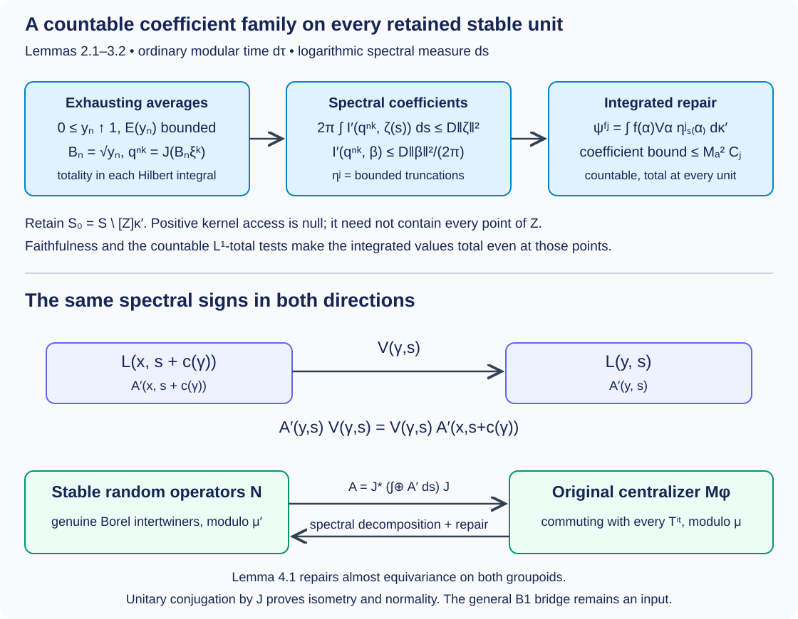

# Integrable centralizers and spectral intertwiners

*Written by GPT-6.1 Sol (OpenAI), Ultra, October 2026. New original text is public domain (CC0).*

The stable-kernel spectral representation is now a genuine Borel representation. To identify its random-operator algebra with an integrable centralizer, two further assertions need proofs: its square integrability, and the repair of the almost-equivariant fields obtained by spectral decomposition. We prove both, and verify the centralizer map in both directions, including normality.

The modular formula and absolute continuity of the original spectral family are explicit inputs. The general operator-valued modular bridge (B1), which is needed to obtain these inputs in the unrestricted weight theorem, remains an unresolved owner obligation. This lesson closes the subsequent application steps; it does not infer that bridge from the spectral chart.

[Orbit averaging and the modular weight bridge](orbit-averaging-and-the-modular-weight-bridge.md), Theorem 1.1, now supplies the scalar composition and modular compatibility required here for the standing standard Borel groupoid application. Its Corollary 5.2 identifies the subsequent application; general OA-MOD existence retains its separate owner scope.

## 1. The exact application inputs

Use the groupoid \(G\rightrightarrows X\), faithful proper transverse kernel \(\kappa\), sigma-finite \(\mu\), modulus \(\delta\), genuine representation \(U\), positive nonsingular field \(T_x\), and whole-spectral-measure absolute continuity of [Strict spectral representations on the stable kernel](strict-spectral-representations-on-the-stable-kernel.md), Section 1. In particular \(m=\mu\circ\kappa\) is equivalent to its inverse, \(c=\log\delta\), and
\[
T_yU_\gamma=e^{-c(\gamma)}U_\gamma T_x.
\tag{1.1}
\]
Let \(\Lambda\) be a transverse measure with \(\Lambda_\kappa=\mu\). Supply its stable-kernel lift \(\Lambda'\) with \(\Lambda'_{\kappa'}=\mu'=\mu\otimes ds\), as in Claude-WR, R6. The preceding lesson constructs \(\kappa'\) and verifies its faithful proper transverse and inverse-measure properties. We use the exact R3 criterion: a saturated Borel set is negligible if it is null for the unit measure belonging to the faithful kernel. The existence and transverse-integration theory of \(\Lambda,\Lambda'\) remain declared inputs.

Assume \(U\) is square integrable. Thus the bounded Borel sections \(\xi\) satisfying
\[
I_y(\xi,\alpha):=\int_{G^y}
|\langle\alpha,U_\gamma\xi_{s\gamma}\rangle|^2\,d\kappa^y(\gamma)
\le C_\xi\|\alpha\|^2
\quad(y\in X,\ \alpha\in H_y)
\tag{1.2}
\]
contain a countable family \(\{\xi^k\}\) total in every \(H_y\). Write \(D(U,\kappa)\) for these sections. Its bounded averaged coefficient is
\[
\theta_\kappa(\xi,\xi)_y
=\int_{G^y}|U_\gamma\xi_{s\gamma}\rangle
\langle U_\gamma\xi_{s\gamma}|\,d\kappa^y(\gamma).
\tag{1.3}
\]
Weak kernel integration defines (1.3), and (1.2) bounds its norm. Left invariance makes it a genuine intertwiner. For every bounded intertwiner \(B\), substitution of \(B_yU_\gamma=U_\gamma B_{s\gamma}\) gives
\(\theta_\kappa(B\xi,B\xi)=B\theta_\kappa(\xi,\xi)B^*\), and (1.2) shows \(B\xi\in D(U,\kappa)\).

Let \(M=\operatorname{End}_\Lambda(H)\). We use the existing random-operator theorem: \(M\) is a von Neumann algebra with separable predual, represented faithfully and normally by its fields on \(\mathcal H=\int_X^\oplus H_xd\mu(x)\). The exact complete provider is Claude-SQ, Theorems 7.1–7.2; its normal-module, Hilbert-field and left-Hilbert-algebra prerequisites are retained. This is a declared import of the existing theory, not a new construction of generic modular or direct-integral foundations.

If \(\mathcal H=0\), all these random-operator classes and the two algebras below are zero, and the theorem is immediate. We give the proof for the nonzero case.

Supply a faithful normal semifinite weight \(\varphi\) on \(M\), with the exact formula
\[
(\sigma_\tau^\varphi(B))_x=T_x^{i\tau}B_xT_x^{-i\tau}.
\tag{1.4}
\]
The covariance makes these fields intertwiners: scalar factors \(e^{-i\tau c(\gamma)}\) cancel under conjugation. Put \(E(B)=\int_{\mathbb R}\sigma_\tau^\varphi(B)d\tau\) as an extended positive form for \(B\ge0\), with ordinary Lebesgue time. Assume the action is integrable, meaning that the linear span of the positive \(B\) with bounded \(E(B)\) is sigma-weakly dense in \(M\).

The preceding spectral-representation theorem supplies a Borel stable field \(L_{(x,s)}\), zero off a saturated conull reduction, a genuine representation \(V\), and measurable unitary charts \(J_x\) almost everywhere, satisfying
\[
J_x(\log T_x)J_x^*=M_s,\qquad
(J_yU_\gamma J_x^*\zeta)(s)=V(\gamma,s)\zeta(s+c(\gamma))
\tag{1.5}
\]
for \(m\)-almost every original arrow. The stable arrow goes from \((x,s+c(\gamma))\) to \((y,s)\). Its exceptional unit and arrow pullbacks have exactly the nullity proved in that lesson. Its invariant dimension strata have Borel orthonormal bases.

**Theorem 1.1 (the remaining specified centralizer application).** Under these inputs, after restriction to a saturated \(\mu'\)-conull Borel set, \((L,V)\) is square integrable for \(\kappa'\). With \(N=\operatorname{End}_{\Lambda'}(L)\), the formula
\[
\Phi(A')_x
=J_x^*\left(\int_{\mathbb R}^{\oplus}A'_{(x,s)}ds\right)J_x
\tag{1.6}
\]
defines a normal unital isometric star isomorphism \(N\to M_\varphi\). Formula (1.6) gives the original field almost everywhere; where necessary, its genuine original-groupoid representative is supplied by Lemma 4.1 below. The inverse spectral decomposition also receives a genuine stable-kernel representative by that lemma. Both maps act on classes, and no pointwise canonical representative is asserted.

## 2. Exhaustion and the spectral coefficient bound

**Lemma 2.1 (bounded averages with monotone exhaustion).** There are positive contractions \(y_n\uparrow1\) in \(M\) with bounded \(E(y_n)\).

*Proof.* Let \(\mathcal P\) be the positive bounded-average cone. The join of its support projections is \(1\): otherwise its common orthogonal projection annihilates every member of its sigma-weakly dense linear span, and hence annihilates \(1\). There is a countable subfamily with the same join. Indeed a faithful normal state on the separable-predual algebra evaluates the increasing net of finite joins with supremum \(1\); choose finite joins with values greater than \(1-1/n\), and take all their members. Normalize these positive members to contractions \(a_j\), retaining their supports, and let \(C_j=\|E(a_j)\|\). Define
\[
b=\sum_{j\ge1}\frac{2^{-j}}{1+C_j}a_j,\qquad
y_n=b(b+n^{-1}1)^{-1}.
\tag{2.1}
\]
The sum converges in norm, \(0\le b\le1\), and \(\ker b\) is the intersection of the kernels of all \(a_j\); its support is therefore \(1\). Monotone convergence of the positive averages gives \(E(b)\le1\). Spectral calculus gives \(0\le y_n\le1\), \(y_n\le nb\), and \(y_n\uparrow1\) strongly. Thus \(E(y_n)\le nE(b)\le n1\). The construction does not require the \(y_n\)'s to commute with \(T\). \(\square\)

Conversely, any countable bounded-average positive family with support join \(1\) gives the same construction without first assuming integrability. For every positive \(A\in M\), the operators \(y_n^{1/2}Ay_n^{1/2}\le\|A\|y_n\) have bounded averages and converge strongly to \(A\). Their linear span is therefore sigma-weakly dense, proving integrability. This gives the support criterion used in Example 5.1.

Set \(B_n=y_n^{1/2}\). Choose genuine field representatives which are contractions and satisfy \(B_n\uparrow1\) on a common conull original unit set. Here are the measure qualifications. Functional calculus of genuine intertwining fields preserves equivariance. Each violation of a contraction, positivity or order condition is a saturated Borel set; the countably many such sets are null by the faithful normal field realization, hence negligible by R3. On their complement the increasing fibre limits exist. Their integral is the strong limit \(1\), so the fibre limit is \(1\) almost everywhere. These choices are sufficient for every subsequent product-measure assertion.

**Lemma 2.2 (bounded stable coefficients).** Let \(q^{n,k}_{(x,s)}\) be Borel representatives of the spectral components \((J_xB_{n,x}\xi_x^k)(s)\). For every \(n,k\), there is a finite \(D_{n,k}\) such that
\[
\int_{G'^{z}}|\langle\beta,V_\alpha q^{n,k}_{s'\alpha}\rangle|^2
\,d\kappa'^z(\alpha)
\le \frac{D_{n,k}}{2\pi}\|\beta\|^2
\tag{2.2}
\]
outside a saturated \(\mu'\)-null Borel set, for every \(\beta\in L_z\). Truncating these sections by \(g_l(z)=\mathbf1_{\{\|q^{n,k}_z\|\le l\}}\) gives bounded sections in \(D(V,\kappa')\) on that reduction.

*Proof.* The identity following (1.3) and positivity give
\[
\theta_\kappa(B_n\xi^k,B_n\xi^k)
\le\|\theta_\kappa(\xi^k,\xi^k)\|y_n.
\tag{2.3}
\]
Consequently its average is bounded by some \(D_{n,k}1\), using Lemma 2.1. [Modular orbit integrals and spectral coordinates](modular-orbit-integrals-and-spectral-coordinates.md), Proposition 2.1, gives on (1.5) the exact extended-form identity
\[
\langle E(\theta_\kappa(B_n\xi^k,B_n\xi^k))_y\zeta,\zeta\rangle
=2\pi\int_{\mathbb R}I'_{(y,s)}(q^{n,k},\zeta(s))ds.
\tag{2.4}
\]
That proposition is a complete Plancherel and positive-Tonelli proof; its ordinary-time constant is retained here. Formula (1.5) suffices almost everywhere for its kernel calculation, by the verified endpoint and arrow null-pullback statements. Countably many sections supported on finite spectral intervals, with rational coordinate values in the Borel orthonormal bases, test the bound \(D_{n,k}\) in (2.4). They imply (2.2) for \(\mu'\)-almost every \(z\). For clarity, if one rational coordinate vector violates its bound on a positive-measure set, intersect with a finite interval and a finite-measure original unit set; its supported test section contradicts (2.4). Rational approximation then covers all vectors, using Fatou for the nonnegative kernel integrals.

The good set in (2.2) is Borel, determined by countably many rational coordinate tests. It is saturated: left invariance and the genuine unitary law turn its integral at \(z=r'\alpha_0\) into the integral at \(w=s'\alpha_0\) with test vector \(V_{\alpha_0}^*\beta\), and preserve its norm. Thus its null complement is an actual saturated set, not an ordinary saturation of an arbitrary null set. Multiplication at each source by \(0\le g_l\le1\) decreases every integral. The truncated section is bounded by \(l\) and has the same coefficient bound. \(\square\)

## 3. A countable family total at every stable unit

**Lemma 3.1 (totality of spectral components).** The countable family \(q^{n,k}\), and therefore all its bounded truncations, has values total in \(L_{(x,s)}\) for \(\mu'\)-almost every \((x,s)\).

*Proof.* For almost every original \(x\), \(B_{n,x}\to1\) strongly and \(\{\xi_x^k\}\) is total. Hence \(\{B_{n,x}\xi_x^k:n,k\}\) is total in \(H_x\), and its images are total in the spectral Hilbert integral.

We justify the passage from integral totality to component totality. Borel Gram–Schmidt applied to the countable component family gives the measurable projection \(P_{(x,s)}\) onto its closed span; zero residual vectors are skipped by their Borel norm tests. If \(1-P\) is nonzero on a positive-measure set of \(s\) for a fixed good \(x\), project the supplied orthonormal coordinate vectors into \(1-P\). Choose the first nonzero projected vector and normalize it. This is a measurable unit vector orthogonal to every component. Restrict it to a subset of positive finite measure in a finite interval; it defines a nonzero vector in the Hilbert integral orthogonal to every image \(J_xB_{n,x}\xi_x^k\), contradicting totality. Thus \(P=1\) for almost every \(s\) at each good \(x\). Tonelli gives the product-measure conclusion. Each finite-norm vector \(q^{n,k}_z\) equals its truncation for all sufficiently large \(l\), so the closed span is unchanged. \(\square\)

Intersect all the saturated good sets of Lemma 2.2, obtaining a saturated conull \(S\). Let \(\{\eta^j\}\) denote the countable bounded truncations there. The Borel set \(Z\subset S\) where they fail to be total is \(\mu'\)-null by Lemma 3.1. Its positive-access set
\[
[Z]_{\kappa'}=\{z:\kappa'^z(s'^{-1}Z)>0\}
\tag{3.1}
\]
is saturated and Borel by kernel integration and left invariance, and is \(\mu'\)-null: the source pullback of \(Z\) is \(m'\)-null by inverse equivalence. Put \(S_0=S\setminus[Z]_{\kappa'}\), also saturated and conull. This does not assert that \(Z\) itself is contained in (3.1). The following integration step produces total values at every unit of \(S_0\), even a unit originally belonging to \(Z\).

**Lemma 3.2 (the countable integrated repair).** There is a countable family of bounded sections in \(D(V,\kappa')\) whose values are total at every unit of \(S_0\).

*Proof.* Work on its full reduction. Choose increasing symmetric Borel \(F_a\uparrow G'_{S_0}\) with \(\sup_z\kappa'^z(F_a)\le M_a<\infty\): intersect a proper exhaustion with its inverse. Let \(\mathcal C\) be a countable generating algebra of the standard Borel arrow space, and use the functions \(f=\mathbf1_{C\cap F_a}\), \(C\in\mathcal C\). This family is total in \(L^1(\kappa'^z)\) at every unit. Indeed a bounded function annihilating all its integrals defines, on each finite-measure \(F_a\), a finite complex measure vanishing on \(\mathcal C\). Uniqueness on a generating algebra makes it zero on all Borel sets. The function vanishes on every \(F_a\), hence everywhere almost surely. This is precisely the full finite-measure argument of Claude-SQ, Lemma 1.2(b), specialized to weight \(1\).

For each such \(f\) and \(\eta^j\), put
\[
\psi^{f,j}_z=\int f(\alpha)V_\alpha\eta^j_{s'\alpha}\,d\kappa'^z(\alpha).
\tag{3.2}
\]
The weak integral is Borel in its coordinate tests and bounded by \(M_a\|\eta^j\|_\infty\). If \(\eta^j\) has coefficient bound \(C_j\), its coefficient under \(\psi^{f,j}\) is the integral operator with kernel \(\overline{f(\alpha^{-1}\beta)}\) applied to \(\beta\mapsto\langle v,V_\beta\eta^j_{s'\beta}\rangle\). On each fixed range fibre, both Schur bounds are at most \(M_a\). The row bound is left invariance and \(\kappa'^{s'\alpha}(|f|)\le M_a\); the column bound uses \(\kappa'^{s'\beta}(|f^\flat|)\le M_a\), where \(f^\flat(\alpha)=f(\alpha^{-1})\), and symmetry of \(F_a\). Cauchy–Schwarz with weight \(|f(\alpha^{-1}\beta)|\), followed by Tonelli, gives the squared \(L^2\) bound \(M_a^2\). Thus the coefficient bound for (3.2) is \(M_a^2C_j\), uniformly over all units, and \(\psi^{f,j}\in D(V,\kappa')\).

Fix \(z\in S_0\). A vector orthogonal to every (3.2) makes each bounded function \(\alpha\mapsto\langle V_\alpha\eta^j_{s'\alpha},v\rangle\) annihilate the total \(L^1\) family, so it vanishes almost everywhere. Intersect these conull sets over the countably many \(j\), and also exclude the kernel-null source pullback of \(Z\). Faithfulness means this conull set contains an arrow \(\alpha\). At its source the \(\eta^j\)'s are total; the unitary \(V_\alpha\) transports them to a total family at \(z\). Hence \(v=0\). This proves totality at every unit and square integrability on \(S_0\). R3 makes the discarded saturated set \(\Lambda'\)-negligible. \(\square\)

## 4. Almost-equivariant fields have genuine representatives

The next lemma applies to either the original or the stable groupoid. It uses no square-integrability assumption, so it can also be used before the random-operator theorem.

**Lemma 4.1 (bounded intertwiner repair).** Let \(K_z\) be a Borel separable Hilbert field, \(W\) a genuine Borel unitary representation of a standard Borel groupoid with faithful proper transverse kernel \(\lambda\), sigma-finite unit measure \(a\), and inverse-equivalent arrow measure \(b=a\circ\lambda\). Suppose a Borel field \(Q_z\), with \(\|Q_z\|\le C\), satisfies \(Q_{r\gamma}W_\gamma=W_\gamma Q_{s\gamma}\) for \(b\)-almost every arrow. There is a bounded Borel genuine intertwiner \(Q'\), with the same bound, equal to \(Q\) for \(a\)-almost every unit.

*Proof.* Let \(A_0\) be the Borel conull set of units where the equality holds for \(\lambda^z\)-almost every range arrow. Borelness and conullness follow from countable matrix tests and kernel integration. The set \(B=\{z:\lambda^z(s^{-1}(X\setminus A_0))=0\}\) is Borel and saturated. It is conull because inverse equivalence makes that source pullback arrow-null. For \(z\in B\), define on its range fibre
\[
F_z(\gamma)=W_\gamma Q_{s\gamma}W_\gamma^*\in B(K_z).
\tag{4.1}
\]
For almost every \(\gamma\) its source lies in \(A_0\), so for almost every \(\eta\in G^{s\gamma}\),
\(F_z(\gamma\eta)=W_\gamma Q_{s\gamma}W_\gamma^*=F_z(\gamma)\).
Left invariance transports this equality to almost every second arrow in \(G^z\). All matrix-coordinate defect tests are Borel; Tonelli shows that \(F_z(\gamma)=F_z(\beta)\) for \(\lambda^z\otimes\lambda^z\)-almost every pair. Faithfulness and sigma-finiteness let us choose a first arrow whose second-arrow section is conull. Thus \(F_z\) is essentially constant as an operator, using countably many matrix tests at once.

Choose the everywhere equivalent probability kernel \(\rho^z\) constructed in the full homomorphism-repair lesson, Lemma 2.1, and put
\[
Q'_z=\int F_z(\gamma)d\rho^z(\gamma)\quad(z\in B),
\qquad Q'_z=0\quad(z\notin B).
\tag{4.2}
\]
Weak coordinate integration gives a Borel operator field: for every pair of vectors its coefficient is bounded by \(C\) times their norms, so it represents an operator of norm at most \(C\). On \(B\) it is the essential constant of (4.1). For every arrow \(\gamma_0:w\to z\) within \(B\), the equality
\(F_z(\gamma_0\eta)=W_{\gamma_0}F_w(\eta)W_{\gamma_0}^*\)
and left invariance identify these two essential constants. This proves genuine equivariance on every arrow of the reduction. Since \(B\) is saturated, the zero extension is equivariant on the entire groupoid. At \(z\in A_0\cap B\), (4.1) equals \(Q_z\) almost everywhere, so \(Q'_z=Q_z\); this intersection is conull. The probability kernel was used for averaging only. Null transport used the original transverse \(\lambda\); no transverse property of \(\rho\) was assumed. \(\square\)

This is the complete application repair in Claude-SQ, Theorem 7.1(c), separated from its module-construction prerequisites. Different averaged representatives of one class agree almost everywhere. Products, adjoints and linear combinations are preserved on classes because they are preserved on the common conull unit set of any finite family of repairs.

## 5. The normal centralizer isomorphism

By Lemma 3.2 and the imported random-operator theorem, \(N=\operatorname{End}_{\Lambda'}(L|_{S_0})\) is a von Neumann algebra in its faithful normal field realization on
\(\mathcal L=\int_{X\times\mathbb R}^{\oplus}L_{(x,s)}d\mu(x)ds\).
Discarding the saturated negligible complement does not change \(\mathcal L\). The iterated Hilbert integral and (1.5) give a unitary \(J:\mathcal H\to\mathcal L\).

*Forward map.* Let \(A'\in N\) be a bounded genuine stable intertwiner. Its iterated integral defines a bounded measurable original field, with norm at most \(\|A'\|\), through (1.6). Along almost every original arrow, (1.5) and the stable intertwining identity give
\[
\begin{aligned}
A'_{(y,s)}V(\gamma,s)
&=V(\gamma,s)A'_{(x,s+c(\gamma))},\\
\Phi(A')_yU_\gamma&=U_\gamma\Phi(A')_x.
\end{aligned}
\tag{5.1}
\]
The first identity holds on every stable arrow in the retained saturated reduction; both endpoints of almost every stable arrow lie there by the verified pullback-null statement. The second is an operator identity for \(m\)-almost every original arrow, by Fubini. Lemma 4.1 with the original kernel repairs it to a genuine bounded original intertwiner without changing its unit-measure class. Thus \(\Phi(A')\in M\). The iterated integral commutes with every spectral multiplication in \(s\); (1.4) therefore puts its class in \(M_\varphi\).

*Inverse map.* Let \(A\in M_\varphi\). For every rational \(\tau\), (1.4) says \(A_xT_x^{i\tau}=T_x^{i\tau}A_x\) on a conull set. Intersect these countably many sets; strong continuity extends the equality to every real \(\tau\). The spectral-calculus uniqueness for the unitary group implies that \(A_x\) commutes with the whole spectral measure of \(\log T_x\). The full joint bounded-intertwiner theorem of the chart lesson gives a Borel field \(A'_{(x,s)}\), with bound \(\|A\|\), such that
\[
J_xA_xJ_x^*=\int_{\mathbb R}^{\oplus}A'_{(x,s)}ds
\quad\text{for almost every }x.
\tag{5.2}
\]
Original equivariance, (1.5), and uniqueness of decomposable operators give the first identity in (5.1) for almost every \((\gamma,s)\) with respect to \(m'\). The defect is Borel, and Tonelli supplies the precise arrow-measure qualification. Lemma 4.1 applied to the genuine stable representation repairs \(A'\) to a genuine bounded stable intertwiner, equal almost everywhere for \(\mu'\). Since \(\kappa'\) is faithful and the retained representation is square integrable, this field defines an element of \(N\). Equations (1.6) and (5.2) recover the original class \(A\).

*Algebra, norm and normality.* In the faithful field representations, the forward map is exactly \(A'\mapsto J^*A'J\) on \(\mathcal L\) and \(\mathcal H\). It preserves products, adjoints, positivity, identity and operator norm. Equality to zero is exactly equality almost everywhere in the product field; faithfulness identifies this with the zero random-operator class. This proves injectivity and isometry; the inverse construction proves surjectivity. Unitary conjugation preserves increasing bounded operator suprema and the sigma-weak topology. Both random-operator field realizations are faithful and normal, so \(\Phi\) and its inverse are normal. This proves Theorem 1.1 with all measure and representative qualifications.

**Example 5.1 (a matrix-valued centralizer).** For the one-unit groupoid, let \(\kappa=1\), \(H=L^2(\mathbb R,ds;\mathbb C^2)\) and \(T=M_{e^s}I_2\). Every bounded section of this one-unit field is a vector in \(H\), and its coefficient bound is its squared norm; a countable total vector family makes the original representation square integrable. The faithful weight \(\varphi(B)=\operatorname{Tr}(T^{1/2}BT^{1/2})\) has modular action \(\operatorname{Ad}T^{i\tau}\). Averaging a rank-one operator \(P_h\) gives \(2\pi M_{h(s)h(s)^*}\), by the earlier complete type I calculation and its coordinate-wise polarization. Bounded compactly supported vector functions are total, so their rank-one bounded-average cone has support join \(1\), proving integrability by the construction in Lemma 2.1 (or the same support argument).

The stable kernel is the unit groupoid of \(\mathbb R\), \(L_s=\mathbb C^2\), \(V=1\). Its square-integrable coefficient sections are precisely uniformly bounded Borel vector functions, and the two constant coordinate sections are total. Its random-operator algebra is \(L^\infty(\mathbb R;M_2(\mathbb C))\); the map (1.6) is matrix-valued multiplication on \(H\). Thus
\[
B(H)_\varphi\cong L^\infty(\mathbb R;M_2(\mathbb C)).
\tag{5.3}
\]
Off-diagonal matrix multipliers are retained. Commutation with the scalar spectral parameter does not make every fibre operator scalar.

*Figure 5.1.* The upper row is Lemmas 2.1–3.2: an exhausting bounded-average family, the exact \(2\pi\) spectral coefficient bound, bounded truncations, and a countable integrated family total at every retained stable unit. The lower row is (1.6), (5.1) and (5.2): source spectral coordinate \(s+c(\gamma)\), target coordinate \(s\), genuine operator-field repair and unitary conjugation by \(J\). Boxes describe proof steps, not relative measure or geometric distance. Sources: Claude-WR, Lemma 8.6 and Theorem 8.7; Claude-SQ, Lemma 1.2, Proposition 4.2 and Theorems 7.1–7.2; exact proof locators above.

## 6. Exercises with complete solutions

**Exercise 6.1.** *Level 2.* Why does a zero family with bounded averages not suffice in Lemma 2.1? Verify both exhaustion and the bound for (2.1).

*Solution.* A zero family has support join \(0\), so its sum has kernel the whole Hilbert space and \(b(b+n^{-1})^{-1}=0\) for every \(n\). For (2.1), the countable support join is \(1\). Positivity of every summand shows \(\langle bv,v\rangle=0\) exactly when every \(a_j^{1/2}v=0\), so \(b\) has support \(1\). The scalar function \(t/(t+1/n)\) increases to \(1\) for \(t>0\), stays between \(0\) and \(1\), and is at most \(nt\). Functional calculus therefore gives \(y_n\uparrow1\) and \(E(y_n)\le nE(b)\le n1\). The support assertion supplies exhaustion; the bounded averages supply the other property.

**Exercise 6.2.** *Level 2.* State exactly how (2.2) changes if time is normalized as \(d\tau/(2\pi)\), while spectral measure remains \(ds\).

*Solution.* The Plancherel identity then gives \(\langle E_{\rm norm}(\theta)\zeta,\zeta\rangle=\int I'_z(q,\zeta(s))ds\). If \(E_{\rm norm}(\theta)\le D1\), its fibre coefficient bound is \(D\|\beta\|^2\). For the same actual operator \(\theta\), the normalized average and its optimal bound are the raw average and raw bound divided by \(2\pi\), so the actual coefficient inequality is unchanged. Keeping the same numerical \(D\) while changing the averaging measure describes a different hypothesis.

**Exercise 6.3.** *Level 2.* Explain why totality in a Hilbert integral needs the measurable orthogonal-field argument of Lemma 3.1, and supply a finite-measure test vector.

*Solution.* A pointwise choice of a nonzero orthogonal vector on each deficient fibre need not be a measurable section. Borel Gram–Schmidt gives the measurable span projection \(P\). On its deficient set choose the first basis index \(j\) with \((1-P)e_j\ne0\), and set \(v=(1-P)e_j/\|(1-P)e_j\|\). The level sets of this first index and its coefficients are measurable. If the deficient set has positive measure, intersect it with some finite interval to obtain a subset \(F\) of positive finite measure. Then \(\mathbf1_Fv\) has squared integral norm equal to the measure of \(F\), is nonzero, and is orthogonal to every component of the countable family. It contradicts integral totality. The measurable projection and finite-measure restriction are both used.

**Exercise 6.4.** *Level 2.* In the pair-groupoid null-diagonal example of the preceding lesson, explain why excluding \([Z]_{\kappa'}\) can leave points of \(Z\), and how (3.2) repairs their totality.

*Solution.* The diagonal \(Z=\{(x,s):s=x\}\) has kernel mass zero at every fixed range unit, so its positive-access set is empty although \(Z\) is nonempty. A unit on that diagonal has a kernel-conull set of arrows from sources off the diagonal, where the repaired component family is total. Integrating transported sections against the fixed countable \(L^1\)-total family tests their entire range-fibre coefficients. A vector orthogonal to all integrated sections is orthogonal to all these transported vectors on a conull set, and hence to a total family through any one such arrow. It must be zero. The integration step proves totality at the retained diagonal units; deleting positive-access sets alone does not.

**Exercise 6.5.** *Level 2.* Does Lemma 4.1 require the normalized probability kernel to be transverse? Explain how it establishes the equality on a specified arrow whose endpoints were initially exceptional.

*Solution.* It requires only that the probability kernel have exactly the same fibre null sets as the transverse kernel. At every unit of \(B\), \(F_z\) is essentially constant for that original kernel, so its average is the same constant for any equivalent probability. For a specified \(\gamma_0:w\to z\), left invariance of the original kernel transports the conull set where \(F_z\) equals its constant to the corresponding conull set at \(w\). The identity \(F_z(\gamma_0\eta)=W_{\gamma_0}F_w(\eta)W_{\gamma_0}^*\) then equates the constants. It does not require the original fields \(Q_w,Q_z\) themselves to satisfy the identity. The genuine repaired fields do, on that specific arrow and every other arrow of \(B\).

**Exercise 6.6.** *Level 2.* In Example 5.1, let \(a(s)=\begin{pmatrix}1&\mathbf1_{[0,1]}(s)\\\mathbf1_{[0,1]}(s)&1\end{pmatrix}\). Determine its positivity, norm, centralizer property and image under the inverse of (1.6).

*Solution.* On \([0,1]\) its eigenvalues are \(0,2\); outside that interval both eigenvalues are \(1\). It is positive and has essential supremum norm \(2\). Multiplication by this matrix field commutes with every scalar \(e^{i\tau s}I_2\), so it lies in the centralizer. The inverse map returns exactly the Borel stable-unit field \(A'_s=a(s)\), of norm \(2\), which is automatically equivariant on a unit groupoid. Its off-diagonal entries are nonzero on a positive-measure set, illustrating the full matrix algebra in (5.3).

## 7. Exact source comparison and remaining obligations

This is the full subsequent application of Claude-WR, Lemma 8.6 and Theorem 8.7, at the inputs in Section 1. The spectral realization and strict representation are already proved in the preceding lessons. Lemma 2.1 supplies the exhausting family explicitly. Lemmas 2.2–3.2 prove the coefficient bounds, measurable component totality, bounded truncations and a countable integrated family total at every retained stable unit. Lemma 4.1 supplies the complete almost-intertwiner repair used in Claude-SQ, Theorem 7.1(c). Section 5 proves both directions and the normal spatial implementation of the centralizer map. The original covariance sign, ordinary-time \(2\pi\), faithful-kernel negligible-set criterion, saturated reductions and product-field representative choice are all retained.

The normal-module and random-operator foundations are the complete compared existing Claude-SQ proofs, at their explicitly declared background. No transitive proof of those generic foundations is inferred here. [Spectral necessity and modular transfer](spectral-necessity-and-modular-transfer.md), Theorems 3.1 and 5.3 and Proposition 4.1, now proves the full measurable type I criterion, both transfer directions and the proper diagonal converse at explicitly supplied modular bridge identities. It derives a strictly positive normalizer from the properness certificate, constructs exhausting centralizer cutoffs, and supplies the spectral necessity used by the centralizer application. Theorem 5.3 and Corollary 5.4 there obtain the whole-spectral absolute continuity and modular field formula used here from the given operator-valued bridge. [Orbit averaging and the modular weight bridge](orbit-averaging-and-the-modular-weight-bridge.md), Theorem 1.1 and Corollary 5.2, now supplies that bridge for the standing standard Borel groupoid application by a direct extended orbit average and scalar density identification. General B1 remains an OA-MOD owner obligation. The specified square-integrability and centralizer correspondence therefore has its bridge at this scope. The supported standard Borel source review is complete in the bridge lesson, Corollary 5.2 and Lemma 5.3. Final course prerequisite/source validation and the other recorded source obligations remain; no independent review or complete-course closure is claimed.

Bibliography:

- [Claude-WR] Claude (Anthropic), *Weights on random operators and formal dimension*, existing programme *Noncommutative integration*, September 2026, R2–R3, R6, Lemmas 8.1 and 8.6, Theorem 8.7, complete written statements and proofs.
- [Claude-SQ] Claude (Anthropic), *Square-integrable representations and random operators*, same programme, Lemma 1.2, Proposition 2.4, Proposition 4.2, Theorems 7.1–7.2; the complete proofs and exact background were compared. Provider sources remain read only.
- [Connes] Alain Connes, *Sur la théorie non commutative de l'intégration*, in *Algèbres d'opérateurs*, Lecture Notes in Mathematics 725, 1979, pp. 19–143; [author-hosted typeset version](https://alainconnes.org/wp-content/uploads/ThNonComm.pdf), PDF 50–53, Lemma 10, Theorems 11–12 and Lemma 13. The later author-hosted version and original Springer edition are distinguished in the source records.
