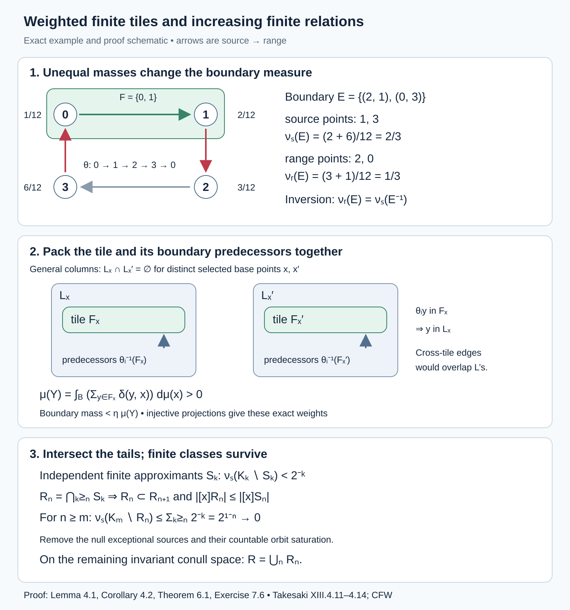
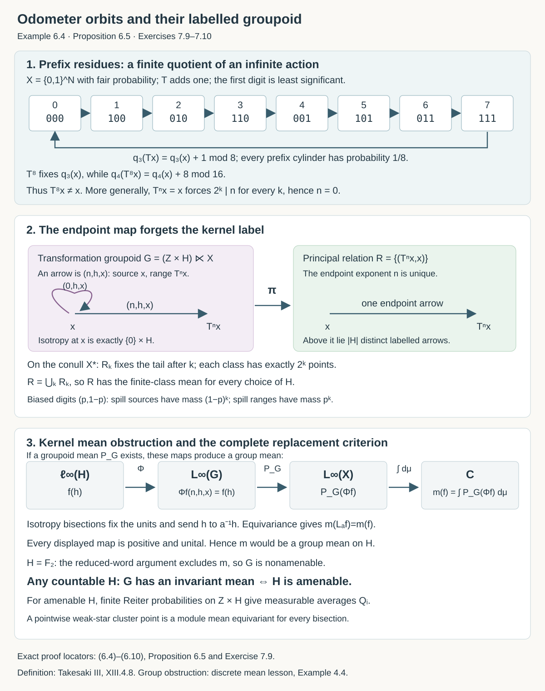

# Invariant means on measured relations

*Written by GPT-6.1 Sol (OpenAI), Ultra, September 2026. New original text is public domain (CC0).*

## Introduction

An invariant mean on a relation averages a function over the class containing a point. Moving the point within its class should leave this averaging rule compatible with the move. The averaging operation need not be normal.

This lesson proves that a countable measured relation admits such an operation exactly when it is an increasing union of finite measured relations. The difficult direction has three steps: approximate a mean by densities, cut a density into finite sets, and pack those sets into disjoint classes.

Read [Orbits, stabilizers, and relation algebras](orbits-stabilizers-and-relation-algebras.md), [Groupoids and measured orbit relations](groupoids-and-measured-orbit-relations.md), [Finite orbit classes and matrix blocks](finite-orbit-classes-and-matrix-blocks.md), and [Means, Følner sets, and regular representations](means-folner-sets-and-regular-representations.md) first. The groupoid prerequisite proves the counting-measure and null-saturation equivalence and explains the different finite-stage conventions. We also use Radon–Nikodym theory, Hahn–Banach separation, and weak-star compactness. The one-to-one image theorem for standard Borel spaces is explained in [Polish spaces and standard Borel spaces](https://kokunoyumeto.github.io/open-math-courses-public/courses/foundations-of-von-neumann-algebras/polish-spaces-and-standard-borel-spaces.html).

Let \(R\subset X\times X\) be a nonsingular Borel relation with countable classes on a standard probability space \((X,\mu)\). Theorem 1.3 and Corollary 1.4 of the orbit prerequisite present it by a countable nonsingular Borel action. Thus the proof applies to every orbitally countable standard Borel measured principal groupoid. Ergodicity is unnecessary here. Sigma-finite spaces are reduced to this setting by replacing the measure with an equivalent probability. We count distinct points, rather than group elements.

## 1. The two counting measures and their weights

Write an arrow as \((y,x)\), with range \(y\) and source \(x\). Set

\[
\begin{aligned}
\nu_s(A)&=\int_X\sum_{y\sim x}\mathbf1_A(y,x)\,d\mu(x),\\
\nu_r(A)&=\int_X\sum_{x\sim y}\mathbf1_A(y,x)\,d\mu(y).
\end{aligned}
\tag{1.1}
\]

The first prerequisite proves that these measures are sigma-finite and have the same null sets. Put

\[
\delta=\frac{d\nu_r}{d\nu_s}.
\tag{1.2}
\]

For a nonsingular partial orbit map \(\theta:D\to E\), write
\(j_\theta=d\theta_*(\mu|_D)/d\mu|_E\). On its graph,

\[
\delta(\theta x,x)=j_\theta(\theta x)^{-1}.
\tag{1.3}
\]

Indeed, integrating a graph function with \(\nu_s\) means integrating over \(x\); integrating it with \(\nu_r\) means integrating over \(\theta x\). Ordinary change of variables gives (1.3). Comparing two partial maps on the set where they agree shows that the right side is independent of the presentation. The Radon–Nikodym chain rule gives
\[
\delta(z,y)\delta(y,x)=\delta(z,x)
\tag{1.4}
\]
almost everywhere on composable pairs. Enumerate the presenting group and discard the invariant saturation of the countably many exceptional sets. We may use (1.3)–(1.4) throughout a common conull invariant space.

Let \(\mathcal B=L^\infty(R,\nu_r)\) and \(\mathcal A=L^\infty(X,\mu)\). For a partial map \(\theta\), define

\[
(L_\theta f)(y,x)=
\begin{cases}f(\theta^{-1}y,x),&y\in E,\\0,&y\notin E,\end{cases}
\qquad
(L_\theta a)(y)=\mathbf1_E(y)a(\theta^{-1}y).
\tag{1.5}
\]

An **invariant mean on \(R\)** is a positive linear map \(P:\mathcal B\to\mathcal A\) satisfying

\[
P1=1,\qquad P((a\circ r)f)=a\,Pf,\qquad
P L_\theta=L_\theta P.
\tag{1.6}
\]

It has norm one and is onto, since \(P(a\circ r)=a\). Neither its definition nor our proof assumes that \(P\) is normal.

**Proposition 1.1 (the measure class).** Amenability and hyperfiniteness depend only on the measure class of \(\mu\). In particular, the probability convention loses no sigma-finite case.

*Proof.* If \(d\mu'=w\,d\mu\), where \(0<w<\infty\) almost everywhere, then
\[
d\nu_s'=(w\circ s)d\nu_s,\qquad
d\nu_r'=(w\circ r)d\nu_r,\qquad
\delta'(y,x)=\frac{w(y)}{w(x)}\delta(y,x).
\tag{1.7}
\]
The two \(L^\infty\) spaces, their order, the range-module action and the partial translations therefore have the same equivalence classes. Exactly the same map \(P\) satisfies (1.6). A conull invariant hyperfinite exhaustion is also unchanged.

For a nonzero sigma-finite measure, take a disjoint Borel partition \(C_n\) with \(\mu(C_n)<\infty\), and assign the positive density \(2^{-n}/(1+\mu(C_n))\) on \(C_n\). Its integral is finite and positive; normalize it to obtain an equivalent probability. The bounded sets used below are defined using this probability and its modulus. \(\square\)

The definition also has a groupoid interpretation before one assumes principality. A measurable bisection \(b:D\to\mathcal G\) has \(s(b(x))=x\) and an injective range map \(\theta(x)=r(b(x))\). On arrows with range in \(\theta D\), replace (1.5) by
\[
(\Lambda_bf)(\gamma)=
f\bigl(b(\theta^{-1}r(\gamma))^{-1}\gamma\bigr),
\tag{1.8}
\]
and use zero elsewhere. Whenever the groupoid's specified arrow measures make these translations nonsingular, positivity, normalization, the range-module identity and \(P\Lambda_b=L_\theta P\) are meaningful with the same domains. If the unit space is one point and the groupoid is a locally compact group with Haar measure, a bisection is a group element, the module algebra is \(\mathbb C\), and these identities are exactly a left invariant group mean. For a principal groupoid, the arrow from \(x\) to \(y\) is unique and (1.8) reduces to (1.5). The equivalence with finite relations proved below uses this uniqueness; no theorem for arbitrary isotropy is inferred.

## 2. Means from amenable groups and finite classes

**Proposition 2.1.** If the presenting countable group is amenable, then \(R\) has an invariant mean.

*Proof.* Invert the probabilities in the Reiter condition to obtain finitely supported probabilities \(q_n\) such that
\(\sum_h|q_n(hs)-q_n(h)|\to0\) for every fixed \(s\). Define

\[
Q_nf(y)=\sum_h q_n(h)f(y,hy).
\tag{2.1}
\]

Each graph evaluation is well-defined on \(\mathcal B\): a \(\nu_r\)-null function vanishes at every point of almost every range fibre. Each \(Q_n\) is positive, unital, and a range-module map.

For the full map \(y\mapsto sy\), reindexing gives
\[
\|Q_nL_sf-L_sQ_nf\|_\infty
\leq \|f\|_\infty\sum_h|q_n(hs)-q_n(h)|.
\tag{2.2}
\]

Use the product of the weak-star compact balls
\(\{a\in\mathcal A:\|a\|\leq\|f\|\}\), one for each \(f\in\mathcal B\), and take a pointwise weak-star convergent subnet. Positivity, linearity, normalization, and the module identity pass to its limit \(P\); (2.2) gives equivariance for the presenting group.

A partial orbit map agrees on a countable Borel partition \(D=\bigsqcup_j D_j\) with group elements \(s_j\), and its images \(E_j=s_jD_j\) are disjoint. Localize (1.6) to \(E_j\) using the module identity and the already established \(s_j\)-equivariance. The desired equality holds on each \(E_j\) and vanishes outside their union. Thus it holds for the partial map as well. This argument does not exchange \(P\) with an infinite sum. \(\square\)

Call \(R\) **hyperfinite** when, on a conull invariant space, \(R=\bigcup_n R_n\), where \(R_n\) are increasing Borel equivalence relations with finite classes.

**Proposition 2.2.** A hyperfinite measured relation has an invariant mean.

*Proof.* For each stage set
\[
Q_nf(y)=\frac{1}{|[y]_{R_n}|}\sum_{x\;R_n\;y}f(y,x).
\tag{2.3}
\]
Finite class selectors from the matrix-block lesson make this a measurable positive unital range-module map. For a partial map \(\theta:D\to E\), the two sides of the equivariance identity agree at \(y\in E\) whenever \((y,\theta^{-1}y)\in R_n\), since then their finite classes are identical. Elsewhere their difference has absolute value at most \(2\|f\|_\infty\).

The exceptional indicators decrease to zero almost everywhere. Integration against every \(L^1(X)\) function shows that the equivariance error tends to zero weak-star. Take a pointwise weak-star cluster point as in Proposition 2.1. It satisfies (1.6). \(\square\)

The mean in (2.3) can be formed even when the class sizes are unbounded. No finite-dimensionality of \(L^\infty(X)\) is being asserted.

## 3. Bounded sets and a packing lemma

We call \(K\subset R\) **bounded** if both coordinate fibres have a uniform finite cardinality bound and, for some \(c<\infty\),
\[
c^{-1}\leq\delta(y,x)\leq c,\qquad (y,x)\in K.
\tag{3.1}
\]

**Lemma 3.1.** The relation has an increasing bounded exhaustion \(K_n\). Every bounded Borel set is a finite union of graphs of nonsingular partial orbit maps, whose Radon–Nikodym derivatives and inverse derivatives are bounded.

*Proof.* For an exhaustion, enumerate the group, take finitely many of its graphs at a time, and intersect with
\(\{n^{-1}\leq\delta\leq n\}\). Fibres then have cardinality at most the number of chosen graphs.

For the decomposition, choose a Borel injection \(\beta:X\to[0,1]\). Sort each nonempty finite source fibre of \(K\) in increasing \(\beta\)-order. These selectors are Borel: they can be computed from the enumerated group maps, using a countable infimum for the first value and successive least larger values. The infima are attained because the fibres are finite.

Each resulting map \(x\mapsto y_j(x)\) is at most \(M\)-to-one, where \(M\) bounds range fibres. Sort the finite preimage of each \(y\) by \(\beta\), and split the domain according to its preimage rank. This gives at most \(NM\) injective Borel partial maps. The preimage selectors can again be computed with the enumerated inverse group maps. Their images and inverses are Borel by the one-to-one image theorem. They are nonsingular because their graphs lie in the nonsingular orbit relation. Formula (1.3) and (3.1) give the derivative bounds. \(\square\)

**Lemma 3.2 (disjoint columns).** Suppose a Borel set \(L\subset R\) has uniformly bounded source and range fibres. Every positive-measure \(A\subset X\) contains a positive-measure Borel set \(B\) such that
\[
L_x\cap L_{x'}=\varnothing\quad
(x,x'\in B,\;x\ne x'),\qquad
L_x=\{y:(y,x)\in L\}.
\tag{3.2}
\]

*Proof.* The finite-graph decomposition in Lemma 3.1 does not need (3.1); write \(L=\bigcup_{i=1}^N\operatorname{graph}\alpha_i\). Consider the finitely many partial maps \(\alpha_j^{-1}\alpha_i\).

For any Borel partial injection \(T\), a positive-measure set has a positive-measure subset \(C\) of one of three forms: outside the domain of \(T\); inside its fixed-point set; or with \(TC\cap C=\varnothing\). For the third alternative, take a countable Borel family separating points. On the nonfixed domain, some member separates \(x\) and \(Tx\). The sets on which membership has one prescribed direction cover that domain, so one of them has positive measure. Its image is disjoint from it.

Apply this observation successively to all the finitely many compositions, retaining a positive-measure subset at every step. If \(\alpha_i x=\alpha_jx'\) with \(x,x'\in B\), the relevant composition sends \(x\) to \(x'\). The first and third alternatives exclude it; the second forces \(x=x'\). This proves (3.2). \(\square\)

## 4. From a mean to one family of finite classes

For \(Y\subset X\), write
\[
\operatorname{Inc}(Y)=\{(y,x)\in R:x\in Y\text{ or }y\in Y\}.
\]

**Lemma 4.1 (a finite patch).** If \(R\) has an invariant mean, then for every bounded \(K\subset R\), every \(\eta>0\), and every positive-measure \(A\subset X\), there is a positive-measure Borel \(Y\subset A\) and a finite-class relation \(S\) on \(Y\), with uniformly bounded class sizes, such that
\[
\nu_s\bigl((K\cap(A\times A)\cap\operatorname{Inc}(Y))\setminus S\bigr)
<\eta\,\mu(Y).
\tag{4.1}
\]

*Proof.* First reduce to \(A=X\). To transfer a mean to \(R|_A\), choose a Borel map \(\pi:[A]_R\to A\) with \(\pi x\sim x\), using the first presenting group element carrying \(x\) into \(A\). Here \([A]_R=\bigcup_g gA\) is Borel. Lift \(f\in L^\infty(R|_A)\) to
\[
\widetilde f(y,x)=
\begin{cases}f(y,\pi x),&y\in A,\\0,&y\notin A.\end{cases}
\]
This respects null classes, since a null relation function vanishes on every point of almost every range fibre. Define \(P_Af=(P\widetilde f)|_A\). The lift of the unit is \(\mathbf1_A\circ r\), so \(P_A\) is unital. The module identity and equivariance for partial maps inside \(A\) pass through the lift: they change the first coordinate, while \(\pi x\) depends only on the second. Thus \(P_A\) is an invariant mean on the reduction. Normalize \(\mu|_A\). The derivative \(\delta\) on pairs in \(A\) is unchanged, and both sides of (4.1) scale by the same constant.

Write \(K\subset\bigcup_{i=1}^N\operatorname{graph}\theta_i\), where \(\theta_i:D_i\to E_i\) have bounded derivatives. On \(\mathcal B\) define the bounded normal positive maps
\[
(B_if)(y,x)=\mathbf1_{E_i}(y)j_{\theta_i}(y)
f(\theta_i^{-1}y,x).
\tag{4.2}
\]
For the state \(\varphi(f)=\int_X Pf\,d\mu\), the module identity, equivariance, and change of variables imply
\[
\varphi(B_if)=\varphi((\mathbf1_{D_i}\circ r)f).
\tag{4.3}
\]

Normal states are weak-star dense in the state space of \(\mathcal B\). Here is a direct justification: a separating self-adjoint \(f\) would bound every normal state by a number below \(\varphi(f)\), but the supremum of normal-state values is \(\operatorname{ess\,sup}f\), which bounds every state value. Apply this density to (4.3). The convex set of defect vectors
\[
\bigl(\psi\circ B_i-\psi\,(\mathbf1_{D_i}\circ r)\bigr)_{i=1}^N,
\quad \psi\text{ a normal state},
\]
has zero in its weak closure in the finite direct sum of preduals. Hahn–Banach makes its weak and norm closures agree.

Identify a normal state with a probability density \(h\geq0\) in \(L^1(R,\nu_r)\). For any \(f\in\mathcal B\), change of variables gives
\[
\begin{aligned}
\int_R(B_if)h\,d\nu_r
&=\int_{E_i}j_{\theta_i}(y)
  \sum_{x\sim y}f(\theta_i^{-1}y,x)h(y,x)\,d\mu(y)\\
&=\int_{D_i}\sum_{x\sim y}
  f(y,x)h(\theta_i y,x)\,d\mu(y).
\end{aligned}
\tag{4.3a}
\]
The density \(j_{\theta_i}\) cancels exactly in this substitution. The class of \(\theta_i y\) equals the class of \(y\). Therefore the norm of the \(i\)-th predual defect is
\(\int_{D_i}\sum_{x\sim y}|h(\theta_i y,x)-h(y,x)|\,d\mu(y)\).
The separation argument supplies a density with
\[
\sum_i\int_{D_i}\sum_{x\sim y}
|h(\theta_i y,x)-h(y,x)|\,d\mu(y)<\eta.
\tag{4.4}
\]
We may arrange that \(h\) is supported on a bounded set \(K'\): first obtain a strict smaller error, truncate to the bounded exhaustion, and renormalize. The \(L^1\) change can be arbitrarily small, and every map in the defect vector is bounded.

Put \(F_x(a)=\{y:h(y,x)>a\}\). Integrating the scalar layer identity (3.2) of the preceding group lesson shows that some \(a>0\) satisfies
\[
\int_X \beta_a(x)\,d\mu(x)
<\eta\int_X w_a(x)\,d\mu(x),
\tag{4.5}
\]
where
\[
\begin{aligned}
w_a(x)&=\sum_{y\in F_x(a)}\delta(y,x),\\
\beta_a(x)&=\sum_i\sum_{y\in D_i,\;y\sim x}
\delta(y,x)
|\mathbf1_{F_x(a)}(\theta_i y)-\mathbf1_{F_x(a)}(y)|.
\end{aligned}
\tag{4.6}
\]
Indeed, (4.4) is the integral of the left side of (4.5) over \(a\), and \(\int h\,d\nu_r=1\) is the integral of its right-hand mass. Thus the set
\[
A_0=\{x:w_a(x)>0,\;\beta_a(x)<\eta w_a(x)\}
\]
has positive measure.

Suppress \(a\), and enlarge the column set \(K'\) to a finite-fibre set \(L\) whose \(x\)-column contains
\[
F_x\ \cup\ \bigcup_i\theta_i^{-1}(F_x\cap E_i).
\tag{4.7}
\]
For example take the union of \(K'\) and the sets
\(\{(y,x):(\theta_i y,x)\in K',\,y\in D_i\}\).
Both coordinate degrees remain uniformly finite. Lemma 3.2 supplies a positive-measure \(B\subset A_0\) with disjoint \(L_x\).

The sets \(F_x\), \(x\in B\), are finite, nonempty, and disjoint. Let
\[
Y=\bigcup_{x\in B}F_x,\qquad
S=\bigcup_{x\in B}(F_x\times F_x).
\tag{4.8}
\]
These sets are Borel: the range projection on
\(\{(y,x):x\in B,\;y\in F_x\}\) is injective, and the projection of the corresponding triples onto \((y,z)\) is injective as well. Use the one-to-one image theorem.

Injectivity of the range projection also gives the exact mass identity
\[
\mu(Y)=\int_B w_a(x)\,d\mu(x)>0.
\tag{4.9}
\]
The same identity applies to each boundary column in (4.6), because it lies in \(L_x\). Hence the sum of the measures of the sets
\[
C_i=\bigcup_{x\in B}\{y\in D_i:
\mathbf1_{F_x}(\theta_i y)\ne\mathbf1_{F_x}(y)\}
\]
is less than \(\eta\mu(Y)\).

If an edge \((\theta_i y,y)\) touches \(Y\) and is outside \(S\), it has \(y\in C_i\). An edge cannot connect two distinct \(F_x\)'s: its source would belong to \(F_x\subset L_x\) and to \(\theta_i^{-1}F_{x'}\subset L_{x'}\), contrary to disjointness. Finally, \(\nu_s\) of the graph over \(C_i\) is \(\mu(C_i)\). Summing proves (4.1). \(\square\)

The factors \(\delta(y,x)\) in (4.6) are essential. They convert a finite set in a column into its actual measure on the unit space.

**Corollary 4.2 (both boundary measures).** The patch in Lemma 4.1 can be chosen to satisfy its estimate for both \(\nu_s\) and \(\nu_r\), with the same prescribed constant \(\eta\).

*Proof.* Apply Lemma 4.1 to \(K\cup K^{-1}\), where \(K^{-1}=\{(x,y):(y,x)\in K\}\). This set is bounded: the two degree bounds are exchanged and (1.4) gives \(\delta(x,y)=\delta(y,x)^{-1}\). Inversion interchanges the counting measures,
\[
\nu_r(E)=\nu_s(E^{-1}).
\tag{4.10}
\]
The sets \(A\times A\), \(\operatorname{Inc}(Y)\) and \(S\) are invariant under inversion. Consequently the \(\nu_r\) boundary for \(K\) equals the \(\nu_s\) boundary for \(K^{-1}\), and each is bounded by the one estimate for \(K\cup K^{-1}\). This proves the assertion. \(\square\)

This is the range-counting form of Takesaki's Lemma XIII.4.13. Our source-counting proof charges an edge at its source; (4.10) supplies the stated range-counting version without dropping a Radon–Nikodym factor.

## 5. Covering the space with finite patches

**Lemma 5.1.** If \(R\) has an invariant mean, then for bounded \(K\) and \(\varepsilon>0\) there is a Borel finite-class relation \(S\) on all of \(X\), with a uniform bound on class sizes, such that
\[
\nu_s(K\setminus S)<\varepsilon.
\tag{5.1}
\]

*Proof.* Fix \(0<\eta<\varepsilon\). Start with \(A_1=X\). Among all finite patches in \(A_n\) satisfying Lemma 4.1 with this \(\eta\), let \(a_n\) be the supremum of their unit-space measures. Choose one, \(S_n\) on \(Y_n\), with \(\mu(Y_n)>a_n/2\), and put \(A_{n+1}=A_n\setminus Y_n\). If \(A_n\) is null, stop.

The supremum is positive whenever \(A_n\) has positive measure, even if \(K|_{A_n}\) is null: then the identity relation on \(A_n\) is an admissible patch. Each \(Y_n\) is disjoint from its predecessors.

We claim \(A_\infty=\bigcap_nA_n\) is null. If it had positive measure, apply Lemma 4.1 inside \(A_\infty\) with error \(\eta/2\), obtaining a patch \(S_*\) on \(Y_*\) of positive measure. For this fixed patch,
\[
\nu_s\bigl((K|_{A_n}\cap\operatorname{Inc}(Y_*))\setminus S_*\bigr)
\downarrow
\nu_s\bigl((K|_{A_\infty}\cap\operatorname{Inc}(Y_*))\setminus S_*\bigr).
\]
Continuity from above applies because \(K\) has finite \(\nu_s\)-measure. Thus \(Y_*,S_*\) is admissible in \(A_n\) with error \(\eta\) for all sufficiently large \(n\). Then \(a_n\geq\mu(Y_*)\), forcing infinitely many disjoint \(Y_n\)'s to have measure greater than \(\mu(Y_*)/2\). This is impossible in a probability space.

Combine the \(S_n\)'s and put singleton classes on the null remainder. A \(K\)-edge outside this combined relation is charged to the first patch it touches. At that stage both endpoints are still in \(A_n\), so it is among the edges estimated by (4.1). Consequently
\[
\nu_s(K\setminus S)\leq\sum_n\eta\mu(Y_n)\leq\eta.
\tag{5.2}
\]
Edges incident to the null remainder have zero measure because \(\nu_s\) and \(\nu_r\) have the same null classes.

The combined classes are finite but their sizes might be unbounded. Retain the classes of size at most \(M\), and replace all others by singletons. The resulting relations \(S^{(M)}\) have size bound \(M\). Their retained portions increase to the whole combined relation. Since \(\nu_s(K)<\infty\), for large \(M\) the extra error is less than \(\varepsilon-\eta\). This proves (5.1). \(\square\)

Applying this proof to \(K\cup K^{-1}\) gives a single all-space finite relation satisfying both \(\nu_s(K\setminus S)<\varepsilon\) and \(\nu_r(K\setminus S)<\varepsilon\). This includes Takesaki's Lemma XIII.4.14. A finite-class relation is a finite type I principal subgroupoid: Lemma 1.1 of the matrix-block prerequisite supplies its Borel transversal and ordered sheets. Its unit space here is all of \(X\). Uniform class-size bounds make the conclusion stronger than a finite-class relation with unbounded sizes.

## 6. Increasing finite relations

**Theorem 6.1.** A principal relation of a countable nonsingular action admits an invariant mean exactly when it is hyperfinite. In the hyperfinite exhaustion one may require a uniform finite class-size bound at every stage.

*Proof.* One direction is Proposition 2.2. For the other, take an increasing bounded exhaustion \(K_n\). By Lemma 5.1 choose relations \(S_n\), each with uniformly bounded finite classes, such that
\[
\nu_s(K_n\setminus S_n)<2^{-n}.
\]
They need not be nested. Define
\[
R_n=\bigcap_{k\geq n}S_k.
\tag{6.1}
\]
Each \(R_n\) is a Borel equivalence relation with a class-size bound inherited from \(S_n\), and \(R_n\subset R_{n+1}\). For \(n\geq m\),
\[
\nu_s(K_m\setminus R_n)
\leq\sum_{k\geq n}\nu_s(K_m\setminus S_k)
\leq\sum_{k\geq n}2^{-k}\longrightarrow0.
\tag{6.2}
\]
Thus \(R\setminus\bigcup_nR_n\) is \(\nu_s\)-null.

To obtain an actual conull unit-space exhaustion, intersect this null set with each presenting group graph. The exceptional source sets are null. Remove their countable union and its group saturation. Nonsingularity makes the removed set null; on its invariant complement every orbit pair belongs to some \(R_n\). \(\square\)

**Corollary 6.2.** Every nonsingular action of a countable amenable group has a hyperfinite principal measured relation.

*Proof.* Combine Proposition 2.1 and Theorem 6.1. \(\square\)

The orbit prerequisite's Theorem 1.3 and Corollary 1.4 provide a countable nonsingular presentation for every standard countable principal measured groupoid. They therefore make Theorem 6.1 apply to every such groupoid. Ergodicity is not needed in that theorem.

Takesaki's Definition XIII.3.11 uses an additional convention: each finite subgroupoid has a single constant class size on its own unit space. We call this a **constant-size AF exhaustion**. Uniform boundedness alone permits several different class sizes and does not immediately supply this definition.

**Proposition 6.3 (the assigned AF convention).** For an ergodic standard countable principal measured groupoid with a nonzero sigma-finite measure, the following are equivalent: an invariant mean, hyperfiniteness, and a constant-size AF exhaustion. This is the full scope of Takesaki's Theorem XIII.4.10.

*Proof.* Proposition 1.1 reduces to a probability. A constant-size finite subgroupoid has finite classes on its unit space. Adjoin singleton classes on its complement. An increasing sequence of these subgroupoids gives an increasing sequence of full-unit finite relations; arrow-null exhaustion gives an actual conull invariant exhaustion by the final graph-saturation argument of Theorem 6.1. Thus constant-size AF implies hyperfiniteness, which implies an invariant mean by Proposition 2.2.

An invariant mean gives hyperfiniteness by Theorem 6.1. If the probability is nonatomic, apply [Theorem 5.2 of Matching sets and nonsingular dyadic arrays](matching-sets-and-nonsingular-dyadic-arrays.md#5-exact-refinement-binary-coding-and-one-generator). Its complete matching, balancing and refinement proof turns this hyperfinite ergodic relation into increasing full-unit relations whose class sizes are exactly \(2^k\). This is a constant-size AF exhaustion; equality of class sizes imposes no equality of point masses.

If the probability has an atom, standardness represents that atom by a point \(a\) of positive mass. Its countable orbit is Borel and has positive measure. Ergodicity makes the orbit conull, and nonsingularity makes every point on it have positive mass. Work on that invariant conull orbit, where the principal groupoid is the full relation.

For a finite orbit of size \(N\), the whole relation is a constant-size \(N\) stage. For an infinite orbit enumerate it as \(a_1,a_2,\ldots\), and set
\[
Y_n=\{a_1,\ldots,a_n\},\qquad H_n=Y_n\times Y_n.
\tag{6.3}
\]
The \(H_n\)'s increase, each has constant class size \(n\) on its unit space \(Y_n\), and their union is the full relation. The AF definition allows these unit spaces to be smaller than \(X\). This proves the final implication in every atomic case. \(\square\)

The converse does not require a single generating transformation: the finite-class means in Proposition 2.2 already prove it. The forward direction uses intersections, rather than joins, to preserve finite classes. This distinction and the exact boundary weights are displayed in Figure 1.

*Figure 1.* The upper panel is an exact four-point computation with masses \((1,2,3,6)/12\), the cycle \(0\mapsto1\mapsto2\mapsto3\mapsto0\), and the tile \(F=\{0,1\}\). Its boundary sources are \(1,3\), its boundary ranges are \(2,0\), and the two counting measures differ. The general packing panel explains why \(L_x\) contains \(F_x\) and every predecessor \(\theta_i^{-1}F_x\): disjoint \(L_x\)'s make both tile and boundary projections injective. The last panel gives the exact tail-intersection construction and geometric error bound. These are a finite example and proof schematic, rather than a depiction of every measured relation. Proof locators: Lemma 4.1, (4.6)–(4.10), Lemma 5.1, Theorem 6.1 and Exercise 7.6. Human sources: [Takesaki], XIII.4.11–4.14, and [Connes–Feldman–Weiss].

### Aperiodic orbits and a nonamenable kernel

**Example 6.4 (one relation, different arrow spaces).** Let \(X=\{0,1\}^{\mathbb N}\), with fair product probability \(\mu\), and put the least significant digit first. Define \(T\) by binary addition of one. A finite carry changes the initial ones to zeros and the first zero to one. At the all-one sequence define \(T(1,1,\ldots)=(0,0,\ldots)\); the inverse uses finite borrowing and sends the all-zero sequence to the all-one sequence.

For each \(k\geq1\), the prefix integer

\[
 q_k(x)=\sum_{j=1}^k2^{j-1}x_j\pmod {2^k}
 \quad\text{satisfies}\quad q_k(T^nx)=q_k(x)+n\pmod {2^k}.
 \tag{6.4}
\]

These congruences prove that \(T\) and its inverse are continuous: each output prefix is determined by the input prefix of the same length. They also prove freeness of the integer action. If \(T^nx=x\), then \(2^k\) divides \(n\) for every \(k\), forcing \(n=0\). Every finite-prefix cylinder has mass \(2^{-k}\), and \(T\) permutes the length-\(k\) cylinders cyclically. Their generating algebra therefore shows that \(T\) preserves \(\mu\). The probability is atomless and has full support on this compact metrizable space.

Here is a direct ergodicity check. If \(A\) is invariant modulo null sets, the \(2^k\) numbers \(\mu(A\cap\{q_k=a\})\) are equal by invariance and the cyclic permutation. Their sum is \(\mu(A)\), so each is \(\mu(A)2^{-k}\). Thus \(\mathbf1_A\) is independent of every finite prefix. Cylinder functions have dense span in \(L^2(X,\mu)\); testing against them makes \(\mathbf1_A\) equal to its constant mean. Hence \(\mu(A)\) is zero or one.

Let \(X_*\) omit the eventually-zero and eventually-one sequences. This is an invariant conull Borel set: the omitted set is countable, each point is null, and addition and borrowing preserve its complement. On \(X_*\), [the odometer calculation](towers-and-odometer-orbits.md#4-binary-addition-and-its-domain) proves that the orbit relation \(R\) is exactly binary tail equivalence. In particular,

\[
 R_k=\{(y,x)\in X_*^2:y_j=x_j\text{ for all }j>k\},
 \qquad |[x]_{R_k}|=2^k,\qquad R=\bigcup_kR_k.
 \tag{6.5}
\]

For completeness, if \(x,y\) agree after \(k\), their prefix difference \(n=\sum_{j=1}^k2^{j-1}(y_j-x_j)\) gives \(T^nx=y\): the longer-prefix congruences in (6.4) verify equality in every coordinate. Each iterate on \(X_*\) changes only finitely many digits, proving the converse. Thus the displayed exhaustion has the exact constant-size convention. Proposition 2.2 constructs its invariant mean by uniform finite-class averaging; this construction does not assume amenability of any larger presenting group.

Now let \(\Gamma=\mathbb Z\times F_2\) act by \((n,h)x=T^nx\). This action is ergodic and measure preserving, with isotropy \(\{0\}\times F_2\) at every point. Its derived principal relation is the same \(R\) modulo the displayed null set, so that relation is amenable. Its transformation groupoid \(\mathcal G=\Gamma\ltimes X\) retains all labels. An arrow \((n,h,x)\) has source \(x\), range \(T^nx\), and endpoint image \((T^nx,x)\). Freeness of \(T\) makes \(n\) unique for those endpoints, while all \(h\in F_2\) remain distinct arrows above them.

Both counting measures on \(\mathcal G\) are \(\mu\) times counting on \(\Gamma\): in range coordinates the source is \(T^{-n}y\), and measure preservation permits the substitution \(x=T^{-n}y\). Thus the arrow function space is the usual \(L^\infty(\Gamma\times X)\).

Suppose an invariant mean \(P_{\mathcal G}\) as in (1.8) existed. For \(f\in\ell^\infty(F_2)\), define \(\Phi f(n,h,x)=f(h)\). The isotropy bisection \(b_a(x)=(0,a,x)\) has identity unit transformation, and

\[
 \Lambda_{b_a}\Phi f(n,h,x)=f(a^{-1}h)=\Phi(L_af)(n,h,x).
 \tag{6.6}
\]

Consequently

\[
\begin{aligned}
 &m(f)=\int_XP_{\mathcal G}(\Phi f)\,d\mu\\
 &\text{satisfies}\quad m(1)=1,\\
 &m(f)\geq0\ (f\geq0),\\
 &m(L_af)=m(f).
\end{aligned}
 \tag{6.7}
\]

This would be a left invariant group mean on \(F_2\), contradicting [the reduced-word mean obstruction](means-folner-sets-and-regular-representations.md#4-fixed-points-and-permanence). Therefore \(\mathcal G\) is not amenable. This happens on an atomless, ergodic, aperiodic probability system. The endpoint relation forgets the isotropy labels responsible for the obstruction.

**Proposition 6.5 (the whole product-kernel family).** Replace \(F_2\) in Example 6.4 by any countable discrete group \(H\). The principal measured relation remains the amenable odometer relation. The transformation groupoid \((\mathbb Z\times H)\ltimes X\) admits an invariant mean if and only if \(H\) is amenable.

*Proof.* Necessity is (6.6)–(6.7) with \(H\) in place of \(F_2\). For sufficiency, choose finitely supported Reiter probabilities \(p_i\) on \(H\). Let \(a_i\) be uniform on \(\{-i,\ldots,i\}\subset\mathbb Z\), and put \(q_i(n,h)=a_i(n)p_i(h)\). For fixed \(s=(m,b)\),

\[
 \sum_{g\in\mathbb Z\times H}|q_i(sg)-q_i(g)|
 \leq\frac{2|m|}{2i+1}+\sum_{h\in H}|p_i(bh)-p_i(h)|\longrightarrow0.
 \tag{6.8}
\]

Here the discrete Reiter theorem is used only for the amenable group \(H\). Write an arrow as \((g,x)\), with range \(gx\), and define the measurable finite averages

\[
 Q_iF(y)=\sum_{g\in\mathbb Z\times H}q_i(g)F(g,g^{-1}y).
 \tag{6.9}
\]

Each evaluation is well-defined on null classes: a range-counting null function vanishes at every arrow of almost every range fibre. Each \(Q_i\) is positive, unital, and a range-module map. For the global bisection with label \(s\), reindexing \(g=st\) gives

\[
 \|Q_i\Lambda_sF-L_sQ_iF\|_\infty
 \leq\|F\|_\infty\sum_g|q_i(sg)-q_i(g)|\longrightarrow0.
 \tag{6.10}
\]

Take a pointwise weak-star cluster point in the product of the appropriate \(L^\infty(X)\) balls. Positivity, linearity, normalization and the range-module identity pass to this limit. Every \(L_s\) is weak-star continuous, so (6.10) gives global equivariance. A Borel bisection has a countable domain partition on which its group label is constant; its range pieces are disjoint. On each piece, the module identity localizes the already proved global equivariance. This proves equivariance for the entire bisection without exchanging the limit with an infinite sum. The resulting map is the required groupoid mean. \(\square\)

The finite averages in (6.9) ensure measurability before taking a weak-star limit. Applying an abstract group mean separately at each point would require an additional measurability argument. No AF equivalence for arbitrary nonprincipal groupoids follows from Proposition 6.5.

*Figure 2.* The upper eight vertices are the finite quotient \(q_3:X\to\mathbb Z/8\mathbb Z\), labelled with least significant digit first; its cyclic arrows describe prefix residues. Formula (6.4) proves that the actual integer action has no finite orbit. The middle panel compares the principal endpoint arrow with the distinct labels \((n,h,x)\) above it. The lower panel displays the complete positive-unital mean obstruction (6.6)–(6.7) and the exact replacement criterion of Proposition 6.5. All unit-space probabilities, class sizes, source/range domains and mean-map codomains are stated in Example 6.4 and Proposition 6.5. The source definition being illustrated is Takesaki XIII.4.8, including its nonprincipal interpretation; the free-group obstruction is proved in the discrete mean lesson.

## 7. Exercises with solutions

Level 1 asks for a computation or a direct application. Level 2 asks for a proof using the lesson’s framework. Level 3 combines results or examines a hypothesis whose failure changes the conclusion.

**Exercise 7.1 (the inverse density).** *Level 1.* On two points with masses \(1/4,3/4\), let \(\theta\) carry the first point to the second. Compute \(j_\theta\) and \(\delta\) on its graph.

*Solution.* The pushforward mass is \(1/4\), while the range mass is \(3/4\). Thus \(j_\theta=1/3\). The graph has \(\nu_s\)-mass \(1/4\) and \(\nu_r\)-mass \(3/4\), so \(\delta=3=j_\theta^{-1}\). A column containing the second point, based at the first, has weighted mass \(3\cdot(1/4)=3/4\), as required by (4.9).

**Exercise 7.2 (a finite-class mean).** *Level 2.* Prove directly that uniform averaging over a finite class satisfies partial-map equivariance, even if the original measure gives unequal masses to its points.

*Solution.* A partial orbit map moves the range point inside the same class. The sum in (2.3) runs over that unchanged set of points, with the same cardinality denominator. Multiplying by the partial-map range indicator gives exactly (1.5). The averaging concerns counting in the class; it does not claim that the unit-space measure is invariant.

**Exercise 7.3 (why the patch must include predecessors).** *Level 2.* Explain the role of \(\theta_i^{-1}F_x\) in (4.7).

*Solution.* If \(\theta_i y\in F_x\), a boundary edge must be charged at its source \(y\), whose \(\mu\)-measure is its \(\nu_s\)-graph measure. Including predecessors places that source in \(L_x\). The disjoint-column lemma then makes the range projection injective on boundary columns, allowing their weighted column integrals to equal unit-space measures. It also excludes an edge between two different selected tiles.

**Exercise 7.4 (independent approximants need not be joined).** *Level 3.* Why use the intersections in (6.1), rather than the relation generated by \(S_1,\ldots,S_n\)?

*Solution.* The join of two finite relations can have infinite classes. On \(\mathbb Z\), pair \(2k\) with \(2k+1\) in one relation and \(2k+1\) with \(2k+2\) in the other. Their join connects all integers. By contrast, an intersection is contained in \(S_n\), hence has finite classes; removing one intersection condition at each stage makes the sequence increase. Estimate (6.2) controls its missing edges.

**Exercise 7.5 (a kernel does not obstruct the conclusion).** *Level 2.* Let \(\mathbb Z\times C_4\) act on a probability space, with \(C_4\) acting trivially. Show that its principal relation is hyperfinite for every nonsingular action of the first factor.

*Solution.* The group is amenable by the extension result of the group lesson. Proposition 2.1 and Theorem 6.1 apply without freeness. The relation counts a point once even though four group labels can produce it. The conclusion concerns this principal relation; an algebra of the transformation groupoid can retain additional isotropy information.

**Exercise 7.6 (the two boundary masses).** *Level 1.* Give \(X=\{0,1,2,3\}\) the masses \((1,2,3,6)/12\). Let \(\theta\) be the cycle \(0\mapsto1\mapsto2\mapsto3\mapsto0\), let \(K\) be its graph, and let \(S=F\times F\) on \(F=\{0,1\}\). Compute the two measures of \(E=(K\cap\operatorname{Inc}(F))\setminus S\), and the weighted mass of \(F\) in the column based at \(0\).

*Solution.* The internal edge is \((1,0)\). The two boundary edges are \((2,1)\) and \((0,3)\); the edge \((3,2)\) misses \(F\). Therefore
\[
\nu_s(E)=\frac{2+6}{12}=\frac23,\qquad
\nu_r(E)=\frac{3+1}{12}=\frac13.
\tag{7.1}
\]
On a finite full relation, (1.2) gives \(\delta(y,x)=\mu(y)/\mu(x)\). Thus \(w(0)=\delta(0,0)+\delta(1,0)=1+2=3\), and \(w(0)\mu(0)=3/12=\mu(F)\). The predecessor set is \(\theta^{-1}F=\{3,0\}\), so the enlarged column contains \(F\cup\theta^{-1}F=\{0,1,3\}\). Both boundary sources are in it. Inversion sends \(E\) to the graph edges \((1,2),(3,0)\) of \(\theta^{-1}\); their source mass is \(1/3=\nu_r(E)\).

**Exercise 7.7 (why a residual patch still fits).** *Level 3.* In Lemma 5.1, explain why a patch obtained inside \(A_\infty\) with error \(\eta/2\) becomes admissible inside all sufficiently large \(A_n\) with error \(\eta\). State exactly where boundedness of \(K\) is used.

*Solution.* Fix its unit set \(Y_*\) and relation \(S_*\). The decreasing sets
\[
E_n=\bigl(K\cap A_n^2\cap\operatorname{Inc}(Y_*)\bigr)\setminus S_*
\]
intersect in the corresponding set \(E_\infty\). A bound \(N\) on source fibres gives \(\nu_s(K)\leq N\mu(X)<\infty\). Continuity from above therefore gives \(\nu_s(E_n)\downarrow\nu_s(E_\infty)<(\eta/2)\mu(Y_*)\). Since \(\mu(Y_*)>0\), eventually \(\nu_s(E_n)<\eta\mu(Y_*)\). The same fixed finite relation is then an admissible competitor defining \(a_n\), so \(a_n\geq\mu(Y_*)\). The chosen disjoint patches would each have measure greater than \(\mu(Y_*)/2\) for all those \(n\), an impossibility. Merely placing \(Y_*\) inside \(A_n\) would not control edges from \(Y_*\) to \(A_n\setminus A_\infty\); finite-measure continuity is the missing step.

**Exercise 7.8 (a one-point relation with nonamenable isotropy).** *Level 2.* Let the free group \(F_2\) act on one point. Compare its derived principal relation and its transformation groupoid, using (1.8).

*Solution.* The derived principal relation contains only the identity arrow. Its \(L^\infty\) algebra is \(\mathbb C\), the identity map is an invariant mean, and its single class is finite. The transformation groupoid retains every element of \(F_2\) as an isotropy arrow. Its arrow algebra is \(\ell^\infty(F_2)\), and (1.8) is ordinary left translation. A groupoid mean would therefore be a left invariant group mean on \(F_2\), which does not exist by the complete mean obstruction in [Almost-connected groups and the solvable radical, Section 3](almost-connected-groups-and-the-solvable-radical.md#3-two-explicit-matrices-and-the-free-subgroup). Thus the principal relation is amenable although the transformation groupoid is not. Theorem 6.1 concerns the first object.

**Exercise 7.9 (finite residues and boundary masses).** *Level 2.* For the odometer in Example 6.4, prove that \(T^8\) fixes every length-three prefix but fixes no point of \(X\). On \(X_*\), replace the fair probability by independent digit probabilities \(p,1-p\), \(0<p<1\), for zero and one. Compute both counting measures of \(E_k=\operatorname{graph}T\setminus R_k\), and explain why they tend to zero without equality.

*Solution.* Equation (6.4) gives \(q_3(T^8x)=q_3(x)\). At length four it gives \(q_4(T^8x)=q_4(x)+8\pmod {16}\), which differs from \(q_4(x)\); hence \(T^8x\ne x\). More generally, any nonzero \(n\) fails the congruence at a sufficiently large power of two, proving freeness.

An arrow \((Tx,x)\) lies outside \(R_k\) exactly when the first \(k\) digits of \(x\) are all one: the carry then changes a later digit. Its range has first \(k\) digits all zero, and the odometer bijects these two cylinders. Every singleton is null for the biased product probability, since its prefix masses are bounded by \(\max(p,1-p)^N\); the two omitted countable classes remain null. Thus

\[
 \nu_s^{\mu_p}(E_k)=(1-p)^k,\qquad
 \nu_r^{\mu_p}(E_k)=p^k.
 \tag{7.2}
\]

Finite-prefix changes have positive finite density ratios, and the countable carry partition makes \(T\) nonsingular. The two counting measures consequently have the same null sets, although their values above need not agree. Both errors tend to zero. For \(p=1/3\) and \(k=3\), the source error is \(8/27\), while the range error is \(1/27\). For fair measure both equal \(2^{-k}\). The finite quotient's periodicity imposes no periodicity on the actual action.

**Exercise 7.10 (amenable kernels and distinct labels).** *Level 3.* In Proposition 6.5 take first \(H=C_4\), then \(H=F_2\). For one fixed endpoint arrow \((T^nx,x)\), count the transformation-groupoid arrows above it. Construct the finite averaging sequence when \(H=C_4\), and prove the failure when \(H=F_2\).

*Solution.* Freeness of the integer action fixes the exponent \(n\). The remaining arrows are precisely \((n,h,x)\), one for each \(h\in H\). Thus the first endpoint fibre has four arrows and the second is countably infinite. In both cases the principal relation and its constant-size dyadic stages are unchanged.

For \(C_4\), take \(p_i(h)=1/4\) and \(q_i(n,h)=\mathbf1_{\{|n|\leq i\}}/(4(2i+1))\). These are finitely supported probabilities. For \(s=(m,b)\), the kernel contribution to (6.8) is zero, and the translation defect is at most \(2|m|/(2i+1)\). The measurable averages (6.9) therefore have a positive unital module cluster point equivariant for every bisection, by the complete localization proof in Proposition 6.5. This is a groupoid invariant mean; the existence of four isotropy labels causes no obstruction.

For \(F_2\), any groupoid invariant mean would make (6.7) a positive unital left invariant functional on \(\ell^\infty(F_2)\): the isotropy bisections fix the units and act by left translation on the retained label. The reduced-word proof excludes this functional. The transformation groupoid is therefore nonamenable even though its principal relation is hyperfinite. Infinite label multiplicity by itself does not decide the answer: Proposition 6.5 applies, for example, to the amenable infinite kernel \(\mathbb Z\) as well.

## References

[Takesaki] Masamichi Takesaki, *Theory of Operator Algebras III*, Encyclopaedia of Mathematical Sciences 127, Springer, 2003. [Publisher record](https://doi.org/10.1007/978-3-662-10453-8).

[Connes–Feldman–Weiss] A. Connes, J. Feldman, and B. Weiss, “An amenable equivalence relation is generated by a single transformation,” *Ergodic Theory and Dynamical Systems* 1 (1981), 431–450. [Publisher record](https://doi.org/10.1017/S014338570000136X). The measured amenability and finite-relation theorem is due to these authors.
