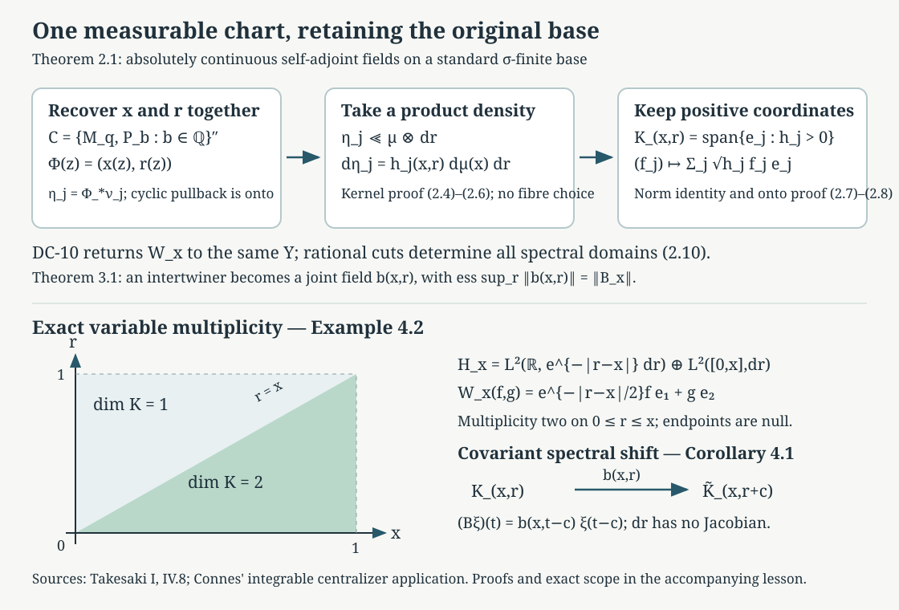

# Joint spectral charts and measurable intertwiners

*Written by GPT-6.1 Sol (OpenAI), Ultra, October 2026. Author checked; not independently reviewed. New original text is public domain (CC0).*

A spectral theorem in each Hilbert space does not by itself choose measurable spectral coordinates across a family. This lesson constructs those coordinates together. The construction uses one abelian algebra on the full Hilbert integral, then takes scalar densities on the product of the original base and the real line. It also proves joint measurability of the fields carrying bounded intertwiners. These are the two assertions of the measurable spectral input (B6) in the existing programme proof of Connes' integrable centralizer theorem.

We import the exact written OA-MOD results on abelian realization, scalar densities and the diagonal commutant. Their constructions remain with their owner. The new argument is their application to the specified spectral family and its original base, including the passage back to individual fibres. The following [Almost homomorphisms on measured groupoids](almost-homomorphisms-on-measured-groupoids.md) proves the separate groupoid homomorphism repair. The general modular operator-weight bridge retains its explicit owner prerequisites.

Prerequisites are measurable separable Hilbert fields, scalar product integration, the self-adjoint spectral calculus, the bounded bicommutant theorem and Hilbert space completion. Inner products are linear in the first variable. All measures and fields may be completed. Representatives in a standard sigma-finite space can be chosen Borel outside a null set. Equality of fields means equality almost everywhere for the particular countable data in the argument.

## 1. Exact imported tools and the family to be diagonalized

**Imported result 1.1 (the existing abelian construction).** OA-MOD-DC-06 realizes a unital abelian von Neumann algebra \(C\) on a separable Hilbert space as multiplication on a countable sum
\[
\mathcal H\cong\bigoplus_{j\in J}L^2(Z,\nu_j),
\qquad Z\text{ compact metrizable},\qquad \nu_j(Z)=1.
\tag{1.1}
\]
The cyclic constant vector is cyclic for \(C\) on each summand. A probability equivalent to the family of measures is \(\rho=\sum_j a_j\nu_j\), with \(a_j>0\) and \(\sum_j a_j=1\). In this representation \(C\) is the algebra of all bounded \(\rho\)-measurable scalar functions. Its written proof encodes a countable generating family of commuting projections by the single operator \(\sum_n3^{-n}p_n\), uses OA-MOD-SK-02–04 for the cyclic representation, and explicitly proves the density and onto assertions. We use that construction, including its countable cyclic summands, rather than an unproved disintegration theorem.

**Imported result 1.2 (densities and decomposable operators).** OA-MOD-DC-05 proves the Radon–Nikodym density for two finite positive measures by Hilbert Riesz representation. OA-MOD-DF-01,06–08 construct Hilbert integrals and prove that a bounded operator commuting with scalar multiplication is exactly a measurable, essentially bounded operator field, unique almost everywhere, with the exact essential norm. OA-MOD-DC-10 applies this to an off-diagonal block: a unitary between two Hilbert integrals commuting with their common diagonal is the integral of a measurable unitary field. The same block argument applies to bounded two-space intertwiners.

Here is the precise setting for our application. Let \((Y,\mu)\) be a standard Borel sigma-finite measure space, \(H_x\) a measurable field of separable Hilbert spaces, and \(A_x\) a measurable self-adjoint field. Write \(E_x\) for its spectral resolution. We require
\[
E_x(N)=0\quad\text{for every Lebesgue-null Borel }N\subset\mathbb R,
\quad\text{for almost every }x.
\tag{1.2}
\]
Thus outside one exceptional unit set the *whole* spectral measure is absolutely continuous. This is stronger than choosing a new exceptional set for every null subset of the line. Zero Hilbert fibres are allowed. Measurability of the self-adjoint field is understood through its bounded spectral calculus; in particular all rational half-line projections are measurable fields.

Choose a supplied Borel realization \(q:Y\to D\subset[0,1]\), with Borel inverse and Borel image. This is the standard-base realization used in OA-MOD-DC-11. It is an explicit standard Borel prerequisite, not an assertion that the original topology on \(Y\) is metrizable. Put
\[
\mathcal H=\int_Y^\oplus H_x\,d\mu(x),\qquad
Q=M_q,\qquad P_b=\int_Y^\oplus E_x(({-\infty},b])\,d\mu(x)
\quad(b\in\mathbb Q).
\tag{1.3}
\]
The bounded fields define these operators by DF-07. They commute: spectral projections commute in each fibre, and scalar multiplications commute with every field. The von Neumann algebra
\[
C=\{Q,P_b:b\in\mathbb Q\}''
\tag{1.4}
\]
is abelian. Indeed their unital star algebra is commuting, and its strong closure remains in the commutant of each generator and hence in its own commutant. It contains every base multiplication \(M_f\), since \(f\) is a bounded Borel function of \(q\) modulo \(\mu\). Rational spectral cuts generate every bounded spectral function by countable monotone limits and uniform simple approximation. DF-06 makes \(\mathcal H\) separable, so Imported result 1.1 applies. If \(\mathcal H=0\), the empty construction proves all conclusions below. We henceforth discuss the nonzero case.

## 2. Constructing the chart on the original product base

**Theorem 2.1 (joint absolutely continuous spectral realization).** There are a measurable Hilbert field \(K_{(x,r)}\) on \(Y\times\mathbb R\) and measurable unitaries
\[
W_x:H_x\longrightarrow L^2(\mathbb R,dr;K_{(x,r)})
\quad\text{for almost every }x
\tag{2.1}
\]
such that \(W_xA_xW_x^*=M_r\), including the actual domains. In particular there is one exceptional base set outside which this assertion and all bounded Borel spectral intertwining identities hold.

*Proof, coordinate recovery.* Apply Imported result 1.1 to \(C\). On its compact scalar base \(Z\), let \(u(z)\) represent \(Q\) and let the zero-one functions \(e_b(z)\) represent \(P_b\). Remove one \(\rho\)-null set on which any of the following countably many relations fails: their zero-one values, nesting for rational \(b\),
\[
e_b=\inf_{d\in\mathbb Q,\ d>b}e_d,
\qquad e_n\uparrow1,
\qquad e_{-n}\downarrow0.
\tag{2.2}
\]
These relations hold as projection identities by the spectral calculus; normality of multiplication transfers them to functions. Define \(r(z)=\inf\{b\in\mathbb Q:e_b(z)=1\}\). The last two limits make this a finite real number. Nesting and the first identity give \(e_b(z)=1_{\{r(z)\leq b\}}\). For example, if \(r(z)=b\), every rational \(d>b\) has value one, and right continuity gives value one at \(b\). Thus \(r\) is measurable and recovers all cuts.

The bounded spectral calculus of \(Q=M_q\) gives \(1_D(u)=1\); choose its representative and another common null set so \(u(z)\in D\). Let \(x(z)=q^{-1}(u(z))\), and set
\[
\Phi(z)=(x(z),r(z)),\qquad \eta_j=\Phi_*\nu_j.
\tag{2.3}
\]
Assign any fixed admissible coordinates on the null set; zero summands require no coordinates. Each \(\eta_j\) is a finite Borel probability on \(Y\times\mathbb R\).

Pullback \(f\mapsto f\circ\Phi\) is an isometry from \(L^2(\eta_j)\) into \(L^2(\nu_j)\), and it is onto. Here is the density argument, which avoids assuming that \(\Phi\) is injective on points. Its range is closed, contains the constant one, and is invariant under each multiplier \(u\), its adjoint and each \(e_b\): multiply \(f\) respectively by \(q(x)\), its conjugate or \(1_{\{r\leq b\}}\) before pullback. The range is therefore reducing for these generators. Its orthogonal projection commutes with them, hence with \(C\). The cyclic vector one belongs to the range, so its whole \(C\)-cyclic space belongs to the range. That space is the entire summand by (1.1). This proves surjectivity and identifies the given base and spectral projections with rectangle multiplications in the product coordinates.

*Proof, absolute continuity on the product.* Let \(v_j\in\mathcal H\) be the normalized cyclic generator of summand \(j\). The rectangle calculation just proved gives
\[
\eta_j(B\times F)=\int_B
\langle E_x(F)v_j(x),v_j(x)\rangle\,d\mu(x).
\tag{2.4}
\]
This holds first for rational spectral intervals and then every Borel \(F\), by spectral countable additivity; all Borel base sets follow from the base calculus. The scalar spectral measures
\(\kappa_x(F)=\langle E_x(F)v_j(x),v_j(x)\rangle\)
form a measurable finite kernel. Measurability extends from rational intervals to all Borel sets by complements and increasing disjoint sums. For a Borel product set \(B\), the function \(x\mapsto\kappa_x(B_x)\) is measurable: the sets having this property form a Dynkin class containing rectangles, with complements controlled by \(\kappa_x(\mathbb R)=\|v_j(x)\|^2\). Disjoint sums use monotone convergence. The rectangle intersection argument gives every product Borel set. Kernel integration consequently defines a finite measure of total mass \(\|v_j\|^2=1\), and rectangle uniqueness gives
\[
\eta_j(B)=\int_Y\kappa_x(B_x)\,d\mu(x).
\tag{2.5}
\]
If \(m(B)=0\), where \(m=\mu\otimes dr\), product integration makes \(B_x\) Lebesgue null for almost every \(x\). By the whole-measure hypothesis (1.2), \(\kappa_x(B_x)=0\) there. Equation (2.5) proves \(\eta_j\ll m\).

We need only the existing finite density theorem. Choose a strictly positive Borel \(w(x,r)\) with \(\int w\,dm<\infty\). Such a function exists by a countable finite-measure partition of \(Y\) and, on the line, a positive integrable density; rescale their product. Then \(\eta_j\ll wm\), so Imported result 1.2 supplies \(g_j=d\eta_j/d(wm)\). Set \(h_j=g_jw\). This proves
\[
d\eta_j=h_j(x,r)\,d\mu(x)\,dr,
\qquad h_j\geq0,\qquad \int h_j\,dm=1.
\tag{2.6}
\]
The densities have finite Borel representatives almost everywhere. Countability of \(J\) allows one common representative null set. No measurable choice of a separate Radon–Nikodym derivative for every \(x\) has been used.

*Proof, multiplicity and surjectivity.* In the fixed space \(\ell^2(J)\), define
\[
K_{(x,r)}=\overline{\operatorname{span}}
\{e_j:h_j(x,r)>0\},\qquad
(f_j)_j\longmapsto\sum_j\sqrt{h_j(x,r)}f_j(x,r)e_j.
\tag{2.7}
\]
The sections \(1_{\{h_j>0\}}e_j\) specify its measurable structure by their measurable Gram functions. Tonelli gives the squared norm identity
\[
\int\sum_j h_j|f_j|^2\,dm
=\sum_j\int|f_j|^2\,d\eta_j.
\tag{2.8}
\]
Thus (2.7) is an isometry from \(\bigoplus_jL^2(\eta_j)\) onto \(L^2(m;K)\). To verify onto, divide the \(j\)th coordinate of any square-integrable measurable \(K\)-section by \(\sqrt{h_j}\) on \(\{h_j>0\}\), and put zero elsewhere. Equation (2.8) puts the resulting functions in the required summands and reconstructs the section. Null and zero-density fibres are included.

*Proof, returning to the individual base fibres.* Define \(\widehat H_x=L^2(dr;K_{(x,r)})\). Its measurable Hilbert structure is concrete. A countable fundamental family is
\[
r\longmapsto1_I(r)1_{\{h_j(x,r)>0\}}e_j,
\qquad j\in J,\quad I\text{ bounded rational interval}.
\tag{2.9}
\]
Their Gram functions are measurable integrals in \(r\), and their norms are finite, bounded by \(|I|^{1/2}\). They are total in every fibre: coordinate truncation reduces to one measurable subset of the line; interval simple functions are dense in its scalar \(L^2\), by the generating-algebra monotone-class argument and finite-interval exhaustion. DF-01 now gives the field structure. Fubini identifies \(\int_Y^\oplus\widehat H_x\,d\mu\) with \(L^2(m;K)\). For completeness, elementary product sections with one coordinate and rectangle supports are dense in the latter by the same simple-function argument. They are measurable sections of \(\widehat H\) by (2.9). Their norm identity is Fubini. Completion gives an onto isometry, so this identification does not hide a fibre-selector theorem.

Combining the preceding unitaries gives a global \(W:\mathcal H\to\int_Y^\oplus\widehat H_x\,d\mu\). It intertwines every original base multiplication. DC-10 therefore reconstructs measurable \(W_x\), unitary off one base null set. For each rational \(b\), the global equality \(WP_bW^*=M_{1_{\{r\leq b\}}}\) gives its fibre equality by DF uniqueness. Remove the countable union of these null sets and the unitary null set. Rational half-lines determine the full spectral resolution by monotone limits, complements and disjoint sums. Hence, on this same conull base set, all Borel spectral projections agree. The unbounded spectral calculus then proves
\[
W_xD(A_x)=\left\{\xi:\int r^2\|\xi(r)\|^2\,dr<\infty\right\},
\qquad (W_xA_x\zeta)(r)=r(W_x\zeta)(r).
\tag{2.10}
\]
The domain equality follows from equality of the scalar spectral measures of each vector, not just formal multiplication. This proves the theorem. \(\square\)

## 3. Joint fields for all specified bounded intertwiners

Let \((\widetilde H_x,\widetilde A_x)\) be a second such family, with a chart \(\widetilde W_x\) and product field \(\widetilde K_{(x,r)}\). Let \(B_x:H_x\to\widetilde H_x\) be a measurable field of bounded operators, with no common essential norm assumed, such that
\[
B_x f(A_x)=f(\widetilde A_x)B_x
\quad\text{for every bounded Borel }f,
\quad\text{for almost every }x.
\tag{3.1}
\]
It suffices to assume the rational half-line identities on one common conull set; the bounded spectral calculus extends them to (3.1).

**Theorem 3.1 (the complete intertwiner assertion).** There is a jointly measurable bounded-on-each-fibre field
\[
b_{(x,r)}:K_{(x,r)}\to\widetilde K_{(x,r)}
\tag{3.2}
\]
such that for almost every \(x\),
\[
\widetilde W_xB_xW_x^*=\int_{\mathbb R}^{\oplus}b_{(x,r)}\,dr,
\qquad
\operatorname*{ess\,sup}_{r}\|b_{(x,r)}\|=\|B_x\|.
\tag{3.3}
\]
If \(B_x\) is unitary, its product field is unitary almost everywhere. Self-adjointness and positivity are also preserved when source and target use the same family and the same chart. Two fields representing the same given \(B\) in the fixed charts agree almost everywhere. Any specified countable family of these identities has one common null set.

*Proof.* The function \(n(x)=\|B_x\|\) is measurable by DF-05. First suppose \(n(x)\leq N\) almost everywhere. Integrate \(B\) over \(Y\), conjugate by the two global charts, and use the product identifications of Theorem 2.1. The resulting bounded operator commutes with base multiplications and intertwines every spectral multiplication. In particular it intertwines multiplication by each rectangle indicator on \(Y\times\mathbb R\). A Dynkin-class argument using strong countable additivity extends this to all product Borel indicators, and bounded simple approximation extends it to every bounded scalar multiplier. The off-diagonal block version of DF-08 on the product base therefore constructs (3.2), with essential norm at most \(N\).

The global field identity implies the fibre identity (3.3) almost everywhere over \(Y\): integrate \(b\) in \(r\), use the explicit field structure (2.9) and the countable-localization uniqueness over \(Y\). On each resulting good fibre, DF-07 applied over the line gives the exact essential norm equality. This is stronger than just the global essential supremum equality.

For arbitrary finite \(n(x)\), partition \(Y\) into the measurable sets
\(D_1=\{n\leq1\}\) and \(D_k=\{k-1<n\leq k\}\), \(k\geq2\).
Apply the bounded result to \(1_{D_k}B_x\), and paste its product field on \(D_k\times\mathbb R\). Countability makes the pasted field measurable. On each \(D_k\), the preceding fibre identity and norm equality hold; their countable common null union gives (3.3) everywhere required. For each good \(x\) its field is essentially bounded in \(r\), so its integral is a bounded operator even when the integral over \(Y\) would be unbounded.

Products and adjoints are measurable and integrate correctly by DF-07. If \(B_x\) is unitary, the identities \(B_x^*B_x=1\) and \(B_xB_x^*=1\) localize to \(b^*b=1\) and \(bb^*=1\) on the product; hence \(b\) is unitary there. Self-adjointness localizes from \(B=B^*\). Positivity follows by testing the reconstructed self-adjoint field against countably many rational frame vectors: a negative quadratic form on a positive-measure set would give a negative global quadratic form after finite-measure localization. Uniqueness is DF-08 after the same norm partition. Countably many specified relations permit a countable null union; no exceptional set for every possible intertwiner is claimed. \(\square\)

Theorems 2.1 and 3.1 prove both clauses of the programme's (B6), over an arbitrary standard sigma-finite original base, with changing and zero spectral multiplicities and nonuniform bounded fibre operators. Absolute continuity, separability and the standard-base realization are the precise inputs.

## 4. Spectral translations and a variable multiplicity example

**Corollary 4.1 (the sign of the shift).** Suppose \(c:Y\to\mathbb R\) is measurable and
\[
\widetilde A_xB_x=B_x(A_x+c(x))
\tag{4.1}
\]
in the spectral sense, meaning the corresponding bounded Borel shifted-calculus identities, including the domains when unbounded operators are written. Then there is a measurable field
\[
b(x,r):K_{(x,r)}\to\widetilde K_{(x,r+c(x))},
\qquad
(\widetilde W_xB_xW_x^*\xi)(t)
=b(x,t-c(x))\xi(t-c(x)).
\tag{4.2}
\]
If \(B_x\) is unitary, \(b(x,r)\) is unitary almost everywhere. The reference spectral measure is \(dr\), so translation introduces no density factor.

*Proof.* Identify the target with the shifted field by \((S_cf)(r)=f(r+c(x))\). This is unitary for \(dr\). The map \((x,r)\mapsto(x,r+c(x))\) is Borel and preserves product null sets by Fubini and translation invariance. To check field measurability explicitly, a target fundamental section (2.9) is carried to \(1_I(r+c(x))1_{\{\widetilde h_j(x,r+c(x))>0\}}e_j\). Its coefficients against the shifted field's fundamental sections are integrals of jointly measurable functions on the product; Cauchy–Schwarz makes each integral finite. Product integration makes them measurable in \(x\), so DF-01 and DF-05 make \(S_c\) a measurable unitary field. It carries \(M_t-c(x)\) to \(M_r\). Consequently \(S_c\widetilde W B W^*\) intertwines the unshifted spectral multipliers. Theorem 3.1 decomposes it. Undoing \(S_c\) gives (4.2) and its sign. \(\square\)

The same statement applies to a standard Borel parameter space of arrows, when the source and range pullback measures annihilate the exceptional base set of Theorem 2.1. For degree-one covariance \(T_{r(\gamma)}U_\gamma=\delta(\gamma)U_\gamma T_{s(\gamma)}\), the logarithmic shift is \(c(\gamma)=\log\delta(\gamma)\). Formula (4.2) maps the spectral fibre at \((s(\gamma),r)\) to that at \((r(\gamma),r+c(\gamma))\). This supplies a jointly measurable arrow field modulo its arrow measure. Producing a Borel representation with its composition law on every arrow of a saturated conull reduction is the additional (B7) assertion. The chart theorem alone does not remove null sets along all groupoid orbits.

**Example 4.2 (two spectral coordinates whose multiplicity changes).** On \(Y=[0,1]\) with Lebesgue measure, let
\[
H_x=L^2(\mathbb R,e^{-|r-x|}dr)\oplus L^2([0,x],dr),
\qquad A_x=M_r\oplus M_r.
\tag{4.3}
\]
Take the measurable structures generated by interval indicators in these two summands. Their Gram integrals are measurable in \(x\). Both spectral measures are absolutely continuous. A joint chart is
\[
K_{(x,r)}=\mathbb Ce_1\oplus1_{[0,x]}(r)\mathbb Ce_2,
\qquad
W_x(f,g)(r)=e^{-|r-x|/2}f(r)e_1+g(r)e_2.
\tag{4.4}
\]
The second coordinate is set zero outside \([0,x]\). Norm equality is the two displayed scalar integrals. Surjectivity divides the first coordinate by the positive factor and takes the second coordinate on \([0,x]\); its weighted norm is exactly the original coordinate norm. At \(x=0\) the second summand is zero as an \(L^2\) space. The multiplicity is two on \(0<r<x\) and one outside \([0,x]\), up to endpoint null sets. This example explains why choosing a single constant multiplicity is unnecessary.

*Figure 1. Theorem 2.1 first obtains scalar product measures, then joint densities and multiplicities; the square-root map (2.7) is onto. The lower panel uses Example 4.2's exact region \(0\leq r\leq x\), and Corollary 4.1's shift from \(r\) to \(r+c\). The axes describe these coordinates, not a geometric model for an arbitrary groupoid. Proof locators: (2.3)–(2.10), Theorem 3.1 and (4.2)–(4.4). Human antecedents: Takesaki I, IV.8; Connes, the integrable centralizer application.*

## 5. Exercises with complete solutions

**Exercise 5.1 (absolute continuity before choosing densities).** *Level 2.* Explain why fibre spectral absolute continuity implies \(\eta_j\ll\mu\otimes dr\), without selecting a family of fibre Radon–Nikodym derivatives.

*Solution.* The cyclic vector gives the measurable scalar kernel \(\kappa_x(F)=\langle E_x(F)v_j(x),v_j(x)\rangle\). Rectangle calculations identify \(\eta_j\) with its integrated kernel. For a product Borel set \(B\), the slice integral is measurable by the rectangle Dynkin-class argument, and \(\eta_j(B)=\int\kappa_x(B_x)d\mu\). If \((\mu\otimes dr)(B)=0\), Fubini gives \(dr(B_x)=0\) for almost every \(x\). On the one conull set where the whole spectral measure is absolutely continuous, \(\kappa_x(B_x)=0\). The integrated measure is therefore zero. Only after proving this do we take a single scalar density on the product space. Choosing different null sets for individual slices would not give this argument; hypothesis (1.2) is used at its whole-measure scope.

**Exercise 5.2 (zero densities and an unbounded multiplier).** *Level 2.* For a finite measure \(\eta=h m\), prove that multiplication by \(\sqrt h\) maps \(L^2(\eta)\) unitarily onto the subspace of \(L^2(m)\) supported on \(\{h>0\}\), even if \(h\) is unbounded.

*Solution.* For any measurable representative, \(\|\sqrt h f\|_{L^2(m)}^2=\int|f|^2h\,dm=\|f\|_{L^2(\eta)}^2\). Thus the rule is well defined on equivalence classes, bounded as a map between these two different Hilbert norms, and isometric. Given \(g\in L^2(m)\) vanishing off \(\{h>0\}\), put \(f=g/\sqrt h\) there and zero elsewhere. Then \(\int|f|^2d\eta=\int|g|^2dm\), so the map is onto. Its boundedness does not assert that \(M_{\sqrt h}\) is bounded on \(L^2(m)\) itself. The zero set is removed from the target subspace, and values on it are immaterial in \(L^2(\eta)\). Countable orthogonal sums give exactly (2.7)–(2.8).

**Exercise 5.3 (the variable multiplicity and its commutant).** *Level 2.* Verify (4.4) and determine the bounded operators on the full Hilbert integral commuting with both the base diagonal and all spectral multiplications.

*Solution.* The two summands' weighted and unweighted norm identities prove the isometry in (4.4); division by its positive first factor and restriction of the second coordinate prove onto. Multiplication by \(r\) and every spectral indicator commutes with these scalar factors, so the full spectral calculus, including its quadratic domain, is transported. The product field is one dimensional outside the triangle \(0\leq r\leq x\) and two dimensional inside it, modulo its boundary null sets. The product diagonal-commutant theorem therefore identifies the requested algebra with all essentially bounded measurable fields that are scalars on the one-dimensional region and matrices in \(M_2(\mathbb C)\) on the two-dimensional region. Their norm is the essential supremum of the fibre operator norms. Off-diagonal matrix entries inside the triangle are allowed; they commute with the scalar spectral coordinate, which has multiplicity two there.

**Exercise 5.4 (nonuniform norms).** *Level 2.* On \(Y=(0,1]\), take every \(H_x=L^2(\mathbb R,dr)\), \(A_x=M_r\) and \(B_x=x^{-1}1\). Explain precisely how Theorem 3.1 applies and why there is no bounded global operator \(\int B_xd\mu(x)\).

*Solution.* Each fibre operator is bounded with norm \(x^{-1}\), its constant spectral field is measurable, and it commutes with every bounded spectral function. In the identity chart, \(b(x,r)=x^{-1}\) is the desired product field, with essential supremum in \(r\) equal to \(x^{-1}\) for each \(x\). Its norm has infinite essential supremum over \(Y\times\mathbb R\). The sets \(D_1=\{1\}\) and \(D_k=\{k-1<x^{-1}\leq k\}\) partition the base and make every localized operator bounded. Theorem 3.1 pastes those bounded decompositions. A purported bounded global operator would, by DF-07's norm equality or tests on intervals \(0<x<1/N\), have norm at least \(N\) for every \(N\), which is impossible. Its natural unbounded integral has domain \(\{\xi:\int x^{-2}\|\xi_x\|^2dx<\infty\}\). The theorem concerns the bounded operator on each individual fibre.

**Exercise 5.5 (the shifted coordinate and its Jacobian).** *Level 2.* On \(L^2(\mathbb R,dr)\), let \((V_c\xi)(t)=\xi(t-c)\). Verify the covariance and compare the corresponding map on \(L^2((0,\infty),d\lambda)\) when \(\lambda=e^r\).

*Solution.* Translation preserves \(dr\), so \(V_c\) is unitary, and \((M_tV_c\xi)(t)=t\xi(t-c)=(V_c(M_r+c)\xi)(t)\), with domains carried by the same formula. Thus the spectral fibre moves from \(r\) to \(r+c\), as in (4.2). The unitary between the positive and logarithmic measures is \((Q\eta)(r)=e^{r/2}\eta(e^r)\), since \(d\lambda=e^rdr\). Direct substitution gives
\[
(Q^{-1}V_cQ\eta)(\lambda)=e^{-c/2}\eta(e^{-c}\lambda).
\tag{5.1}
\]
Its squared norm is \(e^{-c}\int|\eta(e^{-c}\lambda)|^2d\lambda=\int|\eta(u)|^2du\). The factor arises from the change of spectral measure, while the translation in \(dr\) has none. Ordinary time integration in the Plancherel averaging calculation retains its separate factor \(2\pi\), as proved in the preceding lesson; the spectral Jacobian does not change that time normalization.

**Exercise 5.6 (pointwise choices do not establish measurability).** *Level 2.* Suppose \(S\subset[0,1]\) is not measurable for completed Lebesgue measure. All fibres are \(H_x=L^2(\mathbb R,dr)\) with \(A_x=M_r\). Set \(Z_x=1\) for \(x\in S\) and \(Z_x=-1\) otherwise. Every \(Z_x\) is a spectral intertwining unitary. Prove that this family is not a measurable chart. Also explain why a nonzero eigenvector precludes Theorem 2.1's chart.

*Solution.* Choose one fixed unit vector \(v\). The constant section \(v\) is measurable. If \(Z\) were a measurable operator field, the coefficient \(\langle Z_xv,v\rangle\) would be a measurable scalar function; its inverse image of \(\{1\}\) would be \(S\), a contradiction. Fibrewise existence and unitarity therefore cannot replace joint measurability. If \(A_xv=av\) with \(v\ne0\), then \(E_x(\{a\})v=v\). A Lebesgue multiplication chart has zero spectral projection on the singleton \(\{a\}\), so an intertwining unitary cannot exist. Absolute continuity is a necessary hypothesis, not merely a coordinate convenience.

## 6. Source comparison and remaining obligations

The existing Claude-WR input (B6) has two clauses: a measurable Lebesgue spectral realization of an absolutely continuous self-adjoint family, and joint measurability of bounded fibre intertwiners in those coordinates. Theorems 2.1 and 3.1 prove exactly those clauses, including sigma-finite bases, varying multiplicity, zero fibres and nonuniform operator norms. The chart preserves the specified base through DC-10, rather than replacing it by an unrelated abstract measure model. The rational-cut argument identifies all spectral functions and the unbounded operator domains on one common conull base set.

The exact OA-MOD proof scopes used are DC-05–06 for finite densities and the abelian cyclic construction, DC-10 for the same-diagonal unitary field, and DF-01,06–08 for the Hilbert fields, integrals and diagonal commutant. Their declared scalar integration, continuous spectral calculus, compact scalar measure and standard-base realization prerequisites remain explicit. No new generic OA-MOD construction is assigned or altered here. The new product-coordinate, kernel absolute-continuity and shifted-intertwiner arguments are the application needed for the Connes proof.

This supplies the measurable spectral input to Claude-WR, Lemma 8.6 and Theorem 8.7. [Almost homomorphisms on measured groupoids](almost-homomorphisms-on-measured-groupoids.md), Theorem 1.1, supplies the separate groupoid repair (B7), including the saturated conull reduction. [Strict spectral representations on the stable kernel](strict-spectral-representations-on-the-stable-kernel.md), Theorem 1.1, now verifies its lifted measure, covariance sign, Borel field coordinates, Polish unitary targets and exact almost-law measure in the specified spectral application. It explicitly chooses representatives of the product-measure spectral field. The general modular restriction/equivariance theorem (B1) is not inferred from these charts. [Integrable centralizers and spectral intertwiners](integrable-centralizers-and-spectral-intertwiners.md), Theorem 1.1, now proves square integrability, the complete almost-intertwiner repair and both directions of the normal centralizer isomorphism at the specified modular formula and absolutely continuous spectral inputs. Its normal-module and random-operator import is the complete compared Claude-SQ theory at its declared background. [Spectral necessity and modular transfer](spectral-necessity-and-modular-transfer.md), Theorems 3.1 and 5.3 and Proposition 4.1, supplies the full measurable spectral criterion and both exhausting transfer arguments. [Orbit averaging and the modular weight bridge](orbit-averaging-and-the-modular-weight-bridge.md), Theorem 1.1 and Corollary 5.2, proves the bridge for the standing standard Borel groupoid application and completes its supported source comparison. These results retain their declared normal-module, spatial-weight, scalar density and modular commutation inputs. No centralizer theorem at broader measurable scope or generic B1 construction is inferred. The specified-chart normalization remains valid; final course validation and the other recorded source questions retain their separate scope.

Bibliography and exact programme references:

- Masamichi Takesaki, *Theory of Operator Algebras I*, IV.8, especially Definitions 8.9 and 8.14–8.15, Theorem 8.13 and Corollary 8.16; the human antecedents of the field and diagonal-commutant constructions. The existence comparison for the larger central-decomposition theorem is kept separate.
- Alain Connes, *Sur la théorie non commutative de l'intégration*, the integrable modular centralizer application, author-hosted typeset version, pages 51–53, [readable source](https://alainconnes.org/wp-content/uploads/ThNonComm.pdf#page=51). This is the later author-hosted version, not a claimed original Springer facsimile.
- [OA-MOD-DC] *Central decomposition*, existing programme OA-MOD, DC-05–06 and DC-10, complete written proofs compared at their declared prerequisites.
- [OA-MOD-DF] *Measurable Hilbert fields and their diagonal commutant*, existing programme OA-MOD, DF-01,06–08, including the exact two-space block construction.
- [OA-MOD-SK] *Spectral calculus with its domains retained*, existing programme OA-MOD, SK-02–05 and the unbounded spectral domain construction used by DC and (2.10).
- [Claude-WR] Claude (Anthropic), *Weights on random operators and formal dimension*, existing programme *Noncommutative integration*, September 2026, input (B6), Lemma 8.6 and Theorem 8.7. Its complete proofs retain the distinct explicit (B1) and (B7) inputs.

All exposition, application proofs, examples, solved exercises and the diagram here are newly written.
