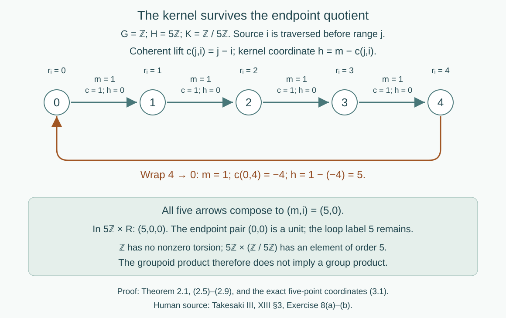

# Kernels and measurable groupoid splitting

*Written by GPT-6.1 Sol (OpenAI), Ultra, September 2026. Author self-check in progress; not independently reviewed. New original text is public domain (CC0).*

## Introduction

An action can have a kernel even when its orbits carry no additional stabilizers. Its transformation groupoid retains that kernel as a group of loops at every point. For an ergodic action of a countable abelian group, the kernel is exactly the stabilizer on one invariant conull set. The quotient group acts freely there.

The transformation groupoid also splits measurably into its kernel and its principal orbit relation. This assertion concerns arrows and their endpoints. It does not require a splitting of the original group extension. We will compute the difference for an integer rotation of five points, and for rational rotations of the circle.

Read [Orbits, stabilizers, and relation algebras](orbits-stabilizers-and-relation-algebras.md), [Invariant means on measured relations](invariant-means-on-measured-relations.md), and [Compatible lifts and cohomology reduction](compatible-lifts-and-cohomology-reduction.md#1-lifting-a-choice-of-arrows). The last lesson's Theorem 1.1 proves compatible finite lifts, including their Borelness and exact agreement at earlier stages. Countable abelian groups are amenable by [the Haar amenability lesson, Proposition 6.1](haar-averages-and-compact-translation-control.md#6-permanence-with-topology). Relation Corollary 6.2 then supplies the hyperfinite exhaustion used below. These are proved course prerequisites; the groupoid split is proved here.

Let a countable discrete abelian group \(G\) act by Borel nonsingular bijections \(T_g\) on a standard Borel space \(X\), with a nonzero sigma-finite measure \(\mu\). The action is strict:
\[
T_e=\operatorname{id},\qquad T_gT_l=T_{gl}.
\tag{0.1}
\]
For the corresponding action on \(A=L^\infty(X,\mu)\), put
\[
\alpha_g f=f\circ T_{g^{-1}},\qquad H=\ker\alpha.
\tag{0.2}
\]
Null sets are understood in the completed measure. A conull Borel reduction gives the same measured algebra. Ergodicity means that every invariant Borel set is null or conull. It does not mean that there is a single orbit.

## 1. One conull set for every stabilizer

**Lemma 1.1 (the algebraic kernel detects fixed points).** For each \(g\in G\),
\[
g\in H\quad\Longleftrightarrow\quad
\mu(X\setminus\operatorname{Fix}(g))=0,
\qquad \operatorname{Fix}(g)=\{x:T_gx=x\}.
\tag{1.1}
\]

*Proof.* The fixed-point set is Borel because the diagonal of a standard Borel space is Borel. If \(T_g\) fixes almost every point, then so does its inverse, and (0.2) fixes every function class. Conversely choose a Borel injection \(\beta:X\to[0,1]\). This bounded Borel function is an element of \(A\). If \(\alpha_g\) is the identity, then \(\beta\circ T_{g^{-1}}=\beta\) almost everywhere. Injectivity gives \(T_{g^{-1}}x=x\) there. The fixed points of a bijection and its inverse are the same, proving (1.1). \(\square\)

**Theorem 1.2 (simultaneous stabilizers).** If the action is ergodic, there is an invariant conull Borel \(X_0\subset X\) such that
\[
G_x=\{g:T_gx=x\}=H\qquad(x\in X_0).
\tag{1.2}
\]
The quotient \(K=G/H\) acts strictly, freely and nonsingularly on \(X_0\), and has exactly the original orbits.

*Proof.* Commutativity makes every \(\operatorname{Fix}(g)\) invariant: if \(T_gx=x\), then \(T_gT_lx=T_lT_gx=T_lx\). For \(g\in H\), Lemma 1.1 makes this set conull. For \(g\notin H\), it is not conull, so ergodicity makes it null. Define
\[
X_0=
\bigcap_{h\in H}\operatorname{Fix}(h)
\ \setminus\!
\bigcup_{g\in G\setminus H}\operatorname{Fix}(g).
\tag{1.3}
\]
Both operations are countable. Thus \(X_0\) is Borel, invariant and conull, and (1.2) holds at every point in it.

For \(k=gH\), define \(S_kx=T_gx\). If \(g'=gh\) with \(h\in H\), then \(T_{g'}x=T_gx\) on \(X_0\); thus the definition is independent of the representative. The product law follows from (0.1). Choosing one representative of each of the countably many cosets shows that this is a Borel nonsingular action. If \(S_{gH}x=x\), (1.2) gives \(g\in H\), so it is free. The orbit sets coincide by the definition of \(S\). \(\square\)

Countability is used to obtain a common conull set. Commutativity is used before that step, to make each fixed-point set invariant. Both uses belong to the proof of the source exercise, rather than to a generic statement about all ergodic actions.

## 2. Splitting the arrows

Write
\[
R=\{(T_gx,x):g\in G,\ x\in X_0\}.
\tag{2.1}
\]
Its multiplication is \((z,y)(y,x)=(z,x)\). This is a Borel countable principal relation: it is the countable union of Borel graphs, with its subspace Borel structure in \(X_0^2\). The free \(K\)-action identifies \(K\ltimes X_0\) with \(R\). The inverse is Borel by selecting the first coset in a countable enumeration carrying \(x\) to \(y\); freeness makes that label unique.

The transformation groupoid retains the original labels:
\[
\mathcal G=G\ltimes X_0,
\quad s(g,x)=x,\quad r(g,x)=T_gx,
\quad (l,T_gx)(g,x)=(lg,x).
\tag{2.2}
\]
Its endpoint quotient is \(\pi(g,x)=(T_gx,x)\). The kernel over each unit is \(\{(h,x):h\in H\}\).

**Theorem 2.1 (the measured product).** On a further invariant conull Borel set, there is a Borel groupoid isomorphism fixing units
\[
G\ltimes X_0\ \cong\ H\times R.
\tag{2.3}
\]
Here the right side has arrows \((h,y,x):x\to y\), with
\[
(k,z,y)(h,y,x)=(kh,z,x).
\tag{2.4}
\]
No splitting \(G\cong H\times K\) is assumed.

*Proof.* Since \(G\) is countable abelian, it is amenable. Corollary 6.2 of the relation amenability lesson gives an increasing finite-class Borel exhaustion \(R=\bigcup_nR_n\) on an invariant conull set. This result applies to nonsingular actions and does not require an invariant finite measure. Replace \(X_0\) by that set. Equivalently one can first replace \(\mu\) by a probability with the same null sets; the exhaustion is a measured assertion in that measure class.

Enumerate \(G\). For each \((y,x)\in R\), take the first \(g\) with \(T_gx=y\), and denote the resulting arrow of \(\mathcal G\) by \(a(y,x)\). Equality tests are Borel, so the first-label choice is Borel. It need not be a homomorphism.

Apply compatible-lift Theorem 1.1 to this arrow choice, with the unit map the identity. Its finite-root construction gives a Borel homomorphism \(\sigma:R\to\mathcal G\) with the prescribed endpoints. Write
\[
\sigma(y,x)=(c(y,x),x).
\]
It satisfies, everywhere on this reduction,
\[
T_{c(y,x)}x=y,\qquad
c(x,x)=e,\qquad
c(z,y)c(y,x)=c(z,x).
\tag{2.5}
\]
In particular \(\pi\sigma=\operatorname{id}_R\). The compatible finite lifts, rather than a section of \(G\to K\), establish the last identity.

For an arrow \((g,x)\), put \(y=T_gx\). The element
\[
h=g\,c(y,x)^{-1}
\tag{2.6}
\]
fixes \(y\), since \(c(y,x)^{-1}\) carries \(y\) to \(x\) and \(g\) carries \(x\) back to \(y\). Its value therefore lies in \(H\) by (1.2). Define
\[
F(g,x)=(g\,c(T_gx,x)^{-1},T_gx,x).
\tag{2.7}
\]
The inverse is
\[
F^{-1}(h,y,x)=(h\,c(y,x),x).
\tag{2.8}
\]
It has range \(y\) because every \(h\in H\) fixes \(y\). The two formulas are inverse Borel maps and fix units.

For composable arrows, write \(g=h\,c(y,x)\) and \(l=k\,c(z,y)\). Commutativity and (2.5) give
\[
lg=k\,c(z,y)h\,c(y,x)
=kh\,c(z,y)c(y,x)
=kh\,c(z,x).
\tag{2.9}
\]
Thus \(F\) has exactly the product (2.4). Units and inverse arrows are consequently preserved as well. This proves (2.3).

On the unit space the map is the identity. Each source fibre is carried bijectively to the corresponding source fibre, so it preserves source counting measure; the same holds for range counting measure. Together with the unchanged unit measure, this is an isomorphism of measured groupoids. \(\square\)

This is the complete assertion of Takesaki III, XIII §3, Exercise 8(b), after a common invariant conull reduction. Exercise 8(a) is Theorem 1.2. The source uses the quotient's principal groupoid and expressly warns that the group need not be a product. Its amenability and lifting inputs are proved in the linked lessons. Removing null sets changes neither the covariant measured system nor its measure-class groupoid.

**Proposition 2.2 (the precise splitting hypotheses).** The proof of Theorem 2.1 also applies to a countable, possibly nonabelian \(G\) whenever, on an invariant conull Borel set, its point stabilizers are a fixed central subgroup \(H\), and its principal relation is hyperfinite. Ergodicity is not required for this assertion.

*Proof.* The first-label choice and compatible finite lifts do not use commutativity. Formula (2.6) lies in the stabilizer of \(y\), hence in \(H\). Centrality lets \(h\) pass through \(c(z,y)\) in (2.9), which is the remaining use of commutativity. All other steps are unchanged. In the absence of centrality that product instead contains \(c(z,y)h c(z,y)^{-1}\); this computation alone makes no claim that another coordinate choice cannot trivialize that conjugation. \(\square\)

## 3. A five-point rotation with a kernel carry

Use additive group notation. Let \(G=\mathbb Z\) act on \(X=\{0,1,2,3,4\}\) by
\[
T_m i=i+m\pmod5,
\]
with uniform probability. The action is transitive and ergodic. Every stabilizer and the algebraic kernel equal \(H=5\mathbb Z\); the free quotient is \(K=\mathbb Z/5\mathbb Z\). Its principal relation is the full pair relation on five points.

Choose integer representatives \(r_i=i\). The coherent lift and product coordinates are
\[
c(j,i)=r_j-r_i=j-i,\qquad
F(m,i)=(m-(j-i),j,i),\quad j=T_mi.
\tag{3.1}
\]
The first coordinate is in \(5\mathbb Z\). For \(m=1\), the arrows \(0\to1\to2\to3\to4\) have kernel coordinate zero. The arrow \(4\to0\) has \(c(0,4)=-4\), and therefore kernel coordinate \(1-(-4)=5\). The product of all five generator arrows is the loop labeled \(5\), as it must be. Its endpoint pair is \((0,0)\).

*Figure 1. The exact coordinates in (3.1), with source traversed first. Four generator arrows have kernel label 0; the wrap from 4 to 0 has label 5. Coherent endpoint lifts telescope, while kernel labels add, so the whole cycle is the isotropy loop 5 at 0. The diagram represents the finite example, not a choice of orbit roots for arbitrary measured relations. Proof locators: Theorem 2.1, (2.5)–(2.9), and (3.1). Human source: Takesaki III, XIII §3, Exercise 8.*

The group cannot be \(5\mathbb Z\times\mathbb Z/5\mathbb Z\): the latter has an element of order five, while \(\mathbb Z\) has none. Nevertheless (3.1) is an explicit groupoid product isomorphism. A label attached to an endpoint pair can depend on both endpoints. A group section would have to depend only on its residue, which is a different condition.

## 4. Rational rotations without an orbit transversal

Let \(G=\mathbb Q\) act on the circle \(\mathbb T=\mathbb R/\mathbb Z\) by \(T_qx=x+q\), with Haar probability. Then \(H=\mathbb Z\), and the quotient \(K=\mathbb Q/\mathbb Z\) acts freely: \(x+q=x\) on the circle is equivalent to \(q\in\mathbb Z\).

The action is ergodic. Indeed an invariant \(f\in L^2(\mathbb T)\) has Fourier coefficient \(\widehat f(n)\) satisfying
\[
\widehat f(n)=e^{2\pi i n q}\widehat f(n)\qquad(q\in\mathbb Q).
\tag{4.1}
\]
For \(n\ne0\), take \(q=1/(2|n|)\); the multiplier is \(-1\), so that coefficient is zero. Trigonometric polynomials are dense in \(L^2\): they are uniformly dense in continuous functions by Stone–Weierstrass, and continuous functions are dense in \(L^2\) for regular finite Haar measure. Thus \(f\) is constant. Apply this to indicators of invariant sets to get ergodicity.

Here a hyperfinite exhaustion is explicit. The finite subgroups
\[
K_n=(\tfrac1{n!}\mathbb Z)/\mathbb Z
\tag{4.2}
\]
increase and have order \(n!\). Every rational class belongs to one of them, so their finite orbit relations increase to \(R\). Compatible finite lifts therefore give
\[
\mathbb Q\ltimes\mathbb T\ \cong\ \mathbb Z\times R.
\tag{4.3}
\]
This proof does not need the general relation amenability theorem in this example. The group \(\mathbb Q\) is torsion free, whereas \(\mathbb Z\times(\mathbb Q/\mathbb Z)\) has nonzero torsion. Again the group does not split.

There is no Borel transversal meeting each orbit exactly once. If \(D\) were one, its distinct \(K\)-translates would form a countably infinite disjoint cover of the circle. Translation invariance gives every member measure \(\mu(D)\). If that number is zero the cover has measure zero; if it is positive the cover has infinite measure. Both contradict \(\mu(\mathbb T)=1\). The same argument applies on any invariant conull Borel reduction. Finite-class roots used at individual stages therefore do not produce a root for each full orbit. Their compatible arrow products are what converge in the sense of exact eventual agreement.

## 5. Exercises with solutions

Level 1 asks for a computation or a direct application. Level 2 asks for a proof using the lesson’s framework. Level 3 combines results or examines a hypothesis whose failure changes the conclusion.

**Exercise 5.1 (countably many null exceptions).** *Level 2.* Give an ergodic action of \(\mathbb Z\) whose algebraic kernel is trivial but whose point stabilizers are nontrivial on a null orbit. Explain the reduction in Theorem 1.2.

*Solution.* Take the circle with Haar probability and an irrational rotation \(T\), and adjoin an isolated point \(p\) of measure zero fixed by \(\mathbb Z\). This is a standard Borel nonsingular action. Irrational rotation is ergodic: invariance forces \(\widehat f(n)=e^{2\pi i n\theta}\widehat f(n)\); irrationality makes the multiplier different from one for every nonzero \(n\), and Fourier density gives constants. On the circle no nonzero power fixes a point, so no nonzero power acts identically on its measure algebra. Thus \(H=\{0\}\), while \(G_p=\mathbb Z\). Each nonzero element has fixed set \(\{p\}\). Formula (1.3) removes exactly that null orbit and leaves the free circle action.

**Exercise 5.2 (why commutativity matters for stabilizers).** *Level 2.* Let \(S_3\) act on three points with uniform probability. Compare the kernel with the stabilizers, and identify the failing step of Theorem 1.2.

*Solution.* The action is transitive, hence ergodic, and faithful, hence has trivial kernel. Each point stabilizer has two elements: the identity and the transposition of the other two points. Thus it is larger than the kernel at every point. A transposition fixes a singleton of measure \(1/3\), but this singleton is not invariant under all of \(S_3\). Conjugation moves its fixed-point set to the fixed-point set of another transposition. Ergodicity therefore does not force its measure to be zero or one. This is exactly the commutativity step used before (1.3).

**Exercise 5.3 (two arrow products).** *Level 1.* In the five-point example, start at 3 and traverse the generator twice. Compute both kernel coordinates and their product. Compute also the arrow labeled \(-1\) from 0 to 4.

*Solution.* The first generator goes \(3\to4\), with \(c(4,3)=1\) and kernel coordinate \(1-1=0\). The second goes \(4\to0\), with \(c(0,4)=-4\) and kernel coordinate \(1-(-4)=5\). Their product is \((5,0,3)\) in the product groupoid. The original product has label 2 and lift \(c(0,3)=-3\), so its kernel coordinate is \(2-(-3)=5\), agreeing with the sum. For the inverse arrow \(0\to4\) labeled \(-1\), the lift is 4 and the kernel coordinate is \(-1-4=-5\). It is the inverse of the wrap arrow with coordinate 5.

**Exercise 5.4 (choice of coherent lifts).** *Level 2.* Under Proposition 2.2's hypotheses, let \(c,c'\) be two coherent lifts. Prove that \(d(y,x)=c'(y,x)c(y,x)^{-1}\) is an \(H\)-valued relation cocycle. Relate their product coordinates. If \(c'(y,x)=f(y)c(y,x)f(x)^{-1}\) for a Borel \(f:X\to H\), compute \(d\).

*Solution.* Both lifts carry \(x\) to \(y\), so their quotient fixes \(y\) and lies in \(H\). Write \(c'=dc\). The coherence of both lifts gives
\[
d(z,x)c(z,x)=d(z,y)c(z,y)d(y,x)c(y,x)
=d(z,y)d(y,x)c(z,x),
\]
where centrality of \(H\) gives the second equality. Cancel the last factor to obtain \(d(z,x)=d(z,y)d(y,x)\). Units give \(d(x,x)=e\). For \(g=h c(y,x)\), the new kernel coordinate is \(h'=g c'(y,x)^{-1}=h d(y,x)^{-1}\). Thus the change is the Borel product-groupoid automorphism \((h,y,x)\mapsto(h d(y,x)^{-1},y,x)\); its multiplication law follows from this cocycle identity. In the stated special case centrality gives \(d(y,x)=f(y)f(x)^{-1}\). No claim that every such cocycle is a coboundary is needed.

**Exercise 5.5 (finite roots versus full orbit roots).** *Level 3.* In the rational-rotation example, verify (4.2), prove that every orbit is infinite and null, and explain why compatible finite lifts do not contradict the absence of a Borel transversal.

*Solution.* The classes of \(j/n!\), for \(0\le j<n!\), are distinct, form a subgroup and exhaust \(K_n\). Divisibility \(n!\mid(n+1)!\) gives inclusion. Every rational denominator divides some factorial, so their union is \(K\). Freeness gives each finite orbit cardinality \(n!\), and the full orbit is a countably infinite translate of \(\mathbb Q/\mathbb Z\). Singletons have Haar measure zero; for example their equal mass would contradict finite total mass if it were positive. Countable additivity makes each full orbit null. A finite-class root can be chosen by a Borel injection because each finite set has a least code. The root of the larger class need not remain the old root. Theorem 1.1 retains the old pair transports by its three-factor extension formula, even while roots change. Every pair eventually has a fixed transport; a single selected point for the entire orbit is never constructed. The transversal contradiction in Section 4 therefore remains valid.

**Exercise 5.6 (kernel zero and one-point bases).** *Level 1.* Describe Theorem 2.1 when the action is faithful, and when \(X\) is one point of positive measure with trivial action. Are the resulting groupoids the same?

*Solution.* Faithfulness makes \(H=\{e\}\). Theorem 1.2 then makes the action free on its conull reduction, and (2.3) identifies its transformation groupoid with its principal orbit relation. For a one-point trivial action, \(H=G\), \(K\) is trivial and \(R\) has only the identity pair. The product \(H\times R\) is the one-unit group \(G\), including every original loop. These groupoids agree only in the corresponding trivial case; taking the endpoint relation alone in the second example would discard its nonidentity loops.

## Bibliography and scope

Masamichi Takesaki, *Theory of Operator Algebras III*, Chapter XIII, §3, Exercise 8(a)–(b); supplied PDF page 79. The exact source passage and page image were checked. Its invoked amenability and lifting mechanisms correspond to XIII.4.10 and XIII.3.17; complete local application proofs appear in the linked prerequisite lessons.

This lesson solves both parts at the source's countable discrete abelian, ergodic, possibly nonfaithful scope. Its product is an isomorphism on a common invariant conull Borel reduction, preserving source and range counting classes. It also proves the explicitly narrower central-kernel generalization in Proposition 2.2. It does not supply the arbitrary locally compact factor-action localization or the uniform-source cocycle strictification requested in the preceding source Exercise 7.
