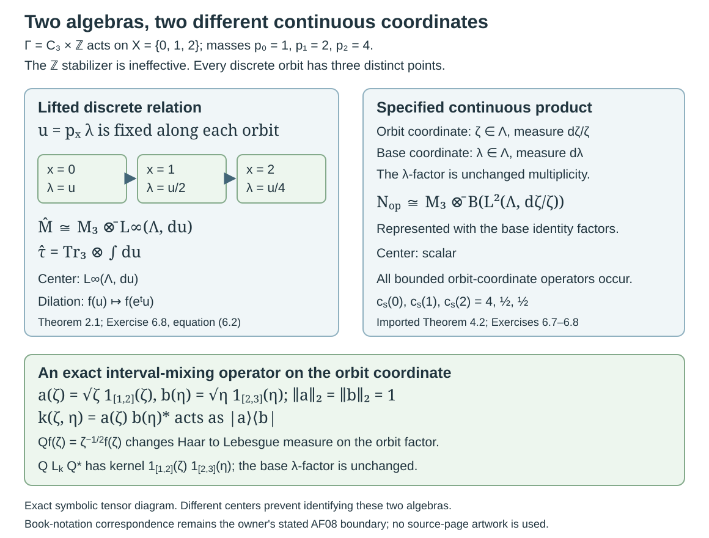

# Lifted relations and the associated flow

*Written by GPT-6.1 Sol (OpenAI), Ultra, October 2026. New original text is public domain (CC0).*

## Introduction

The modulus of a nonsingular relation records how much measure changes along an arrow. Add one positive real coordinate and let it change by the reciprocal modulus. The two changes cancel, giving an invariant measure on the enlarged space. Dilating that coordinate then gives a flow which scales the trace of the enlarged relation algebra.

Read [Relation kernels and modular coordinates](relation-kernels-and-modular-coordinates.md), especially Lemma 1.1 and Theorem 6.2, and [Diagonal expectations and invariant measures](diagonal-expectations-and-invariant-measures.md), Theorems 1.1 and 2.2. We also use the full measurable orbit-matrix criterion in Section 4 of the kernel lesson. All these results allow countable nonsingular actions with stabilizers on a standard sigma-finite base.

One exact programme prerequisite identifies the enlarged algebra with the continuous core. The written lesson *Building an intrinsic flow from modular coordinates*, in *Crossed products and the flow of weights*, supplies the complete proofs in “The full orbit-constant field criterion”, “The general lifted relation and its corrected trace”, “Fixed points of the lifted flow”, and “The lifted relation is the canonical core”. The last proof treats arbitrary countable orbit-point algebras, including nonfree actions, with the diagonal normal faithful semifinite weight. Its Fourier convention and trace normalization are stated in Section 4 below. The present lesson applies that result; the general core and dual-weight constructions remain prerequisites in that course and *Modular theory and weights*.

## Reading the Krieger construction from orbits to flow

The construction starts with distinct points in each orbit. It produces a von Neumann algebra with a distinguished diagonal, then uses the change of measure along arrows to calculate its modular operators and associated flow. Throughout this route, the acting group is countable, the base is standard and sigma-finite, and the action is nonsingular. Stabilizers are allowed. Statements about every arrow use the common invariant conull set constructed in the kernel lesson.

1. **Build the relation algebra.** Read [Orbits, stabilizers and relation algebras](orbits-stabilizers-and-relation-algebras.md). Its counting measures and regular representation use distinct orbit points. The diagonal is maximal abelian, the centre consists of invariant functions, and ergodicity gives a factor. The example with an ineffective finite kernel explains why a group crossed product can retain extra operators while the principal relation algebra remains unchanged. Complete all six exercises before moving to kernels.

2. **Calculate the modular operators on their full domains.** Read [Relation kernels and modular coordinates](relation-kernels-and-modular-coordinates.md). Begin with the source-counting modulus and its chain rule, then follow the Schur estimates, graph cores, polar decomposition and variable orbit-fibre matrices. The probability and sigma-finite constructions have separate proofs. The diagonal weight uses finite cutoffs; an identity vector on an infinite-measure base is not assumed. The seven solutions include change of measure and corner spectra. The general Tomita commutation theorem remains an explicit prerequisite.

3. **Recover invariant measures and factor types.** Read [Diagonal expectations and invariant measures](diagonal-expectations-and-invariant-measures.md). The normal expectation lets an invariant sigma-finite measure produce a trace. In the converse direction, diagonal pinching proves that the restricted trace really gives a sigma-finite measure. The nine solutions distinguish a conull single orbit, a finite invariant measure, an infinite sigma-finite invariant measure and absence of an equivalent sigma-finite invariant measure. An infinite presenting group alone does not force type II-infinity: the finite-orbit example corrects the printed criterion, even after adding a null faithful orbit.

4. **Separate geometric symmetries from phases.** Read [Normalizers, phases and orbit cocycles](normalizers-phases-and-orbit-cocycles.md). A unitary normalizer contains both a full-group transformation and a diagonal circle-valued phase. General relation symmetries instead use the Radon–Nikodym derivative of their point map; a relation modulus cannot be evaluated on a point pair lying outside the relation. Follow the diagonal-pair converse, cocycle automorphisms, coboundaries and the seven solutions. The closed geometric subgroup and Borel full-group image use the stated standard-form implementation and topology prerequisites.

5. **Pass from ratios to intrinsic modular spectra.** Read [Ratio sets and intrinsic modular spectra](ratio-sets-and-intrinsic-modular-spectra.md). Density bands prove that the ratio set is unchanged by replacing the base measure within its class. Reduced diagonal corners connect positive ratios with the intrinsic modular invariant. The semifinite case and the possible zero spectral value require separate arguments. The seven solutions include affine examples and an ineffective-kernel comparison. The five general modular-spectrum contracts are stated explicitly; this application does not supply all their foundations.

6. **Lift the relation and read its flow.** Return to the present lesson. The reciprocal modulus in the added positive coordinate makes the lifted measure invariant. The trace is the integral of the basepoint matrix coefficient. Summing the full orbit-fibre trace would destroy semifiniteness on an infinite orbit. Sections 3–5 identify fixed points, compare the canonical core at the exact written prerequisite, and prove invariance under a change of base measure. Section 4 separately explains the corrected product construction and its extra multiplicity coordinate. The source's undefined continuous-relation symbol remains a recorded callback. All eight solutions retain the stated Fourier sign and trace normalization.

The source exercises have their own complete route. [Polish orbits and their quotient topology](polish-orbits-and-their-quotient-topology.md) proves the four Effros conditions and treats both rational and irrational rotations; an unqualified rotation assertion needs the rational-angle correction. [Locally closed orbits and measurable representatives](locally-closed-orbits-and-measurable-representatives.md) proves the Glimm equivalences, including the ergodic-measure converse and Borel selector. Its six-way conclusion already holds under condition C. These two lessons contain sixteen complete solutions and keep their descriptive-set-theoretic inputs and the delimited alternative proof explicit.

Author comparison covers all twenty-four numbered source items and both source exercises at the declared prerequisites. Twenty-two numbered conclusions are proved, with required corrections to proof formulas; the printed factor-type criterion and phase-free normalizer assertion have complete corrective dispositions. This completes the owned Krieger unit pass. Supported Connes and broader prerequisite validation continue, and the course's three separately recorded source questions remain open.

## 1. A lift which preserves measure

Let a countable group \(\Gamma\) act nonsingularly by Borel automorphisms on a nonzero standard sigma-finite space \((X,\mu)\). Let \(R\) be its principal orbit relation. Use the source-counting convention
\[
 \delta(y,x)=\frac{d\nu_r}{d\nu_s}(y,x),\qquad
 \mu(sB)=\int_B\delta(sx,x)\,d\mu(x).
 \tag{1.1}
\]
Choose the positive finite Borel cocycle on the invariant conull set supplied by the kernel lesson. All subsequent assertions about every arrow take place on that set. Write \(d_s(x)=\delta(sx,x)\).

On \(\widehat X=X\times\mathbb R_{>0}\), put \(\widehat\mu=\mu\otimes d\lambda\) and define
\[
 \widehat s(x,\lambda)=\left(sx,\frac{\lambda}{d_s(x)}\right)
       =(sx,\delta(x,sx)\lambda),\qquad
 T_t(x,\lambda)=(x,e^{-t}\lambda).
 \tag{1.2}
\]
The coefficient action of \(T\) is
\[
 (\theta_tF)(x,\lambda)=F(x,e^t\lambda).
 \tag{1.3}
\]

**Proposition 1.1.** The maps \(\widehat s\) form a Borel measure-preserving action. They commute with \(T_t\). Projection onto the first coordinate bijects the lifted orbit of \((x,\lambda)\) with \(\Gamma x\), even when stabilizers are nontrivial.

*Proof.* The cocycle identity gives \(d_{st}(x)=d_s(tx)d_t(x)\), proving the action law and the inverse formula. For a nonnegative Borel \(F\), Tonelli and \(u=\lambda/d_s(x)\) give
\[
 \int F(\widehat s(x,\lambda))\,d\mu(x)d\lambda
 =\int_X d_s(x)\int_0^\infty F(sx,u)\,du\,d\mu(x)
 =\int F(y,u)\,d\mu(y)du.
 \tag{1.4}
\]
The last equality is exactly the change of variables in (1.1); finite total measure is unnecessary. Scalar dilations commute with the factor \(d_s(x)^{-1}\).

For each \(y\in\Gamma x\), the lifted orbit contains exactly
\[
 (y,\lambda_y),\qquad \lambda_y=\delta(x,y)\lambda.
 \tag{1.5}
\]
This value depends on the point pair, not on a representative \(s\) with \(sx=y\). In particular a stabilizer has \(d_s(x)=\delta(x,x)=1\) and fixes the lifted point. Thus no group-label multiplicity is added to the orbit. \(\square\)

## 2. The enlarged algebra and its trace

Let \(\widehat R\) be the principal relation of the lifted countable action and let \(\widehat M=\mathcal M(\widehat R,\widehat\mu)\). Its regular Hilbert space is
\[
 \widehat H=\int_{X\times\mathbb R_{>0}}^\oplus
       \ell^2(\Gamma x)\,d\mu(x)d\lambda.
 \tag{2.1}
\]
We label the basis by the distinct \(y\in\Gamma x\) using (1.5). A matrix field in this algebra obeys
\[
 A(sx,\delta(x,sx)\lambda)=A(x,\lambda)
 \tag{2.2}
\]
under the identity of the two orbit-point bases. The kernel lesson's full field criterion applies to this standard sigma-finite countable relation.

**Theorem 2.1.** The basepoint formula
\[
 \widehat\tau(A)=\int_X\int_0^\infty
      \langle A(x,\lambda)e_x,e_x\rangle\,d\lambda\,d\mu(x),
       \qquad A\in\widehat M_+,
 \tag{2.3}
\]
defines a faithful normal semifinite trace. Dilation induces a strongly continuous automorphism group of \(\widehat M\), with
\[
 (\theta_tA)(x,\lambda)=A(x,e^t\lambda),\qquad
 \widehat\tau\circ\theta_t=e^{-t}\widehat\tau.
 \tag{2.4}
\]
The center is
\[
 Z(\widehat M)=L^\infty(\widehat X,\widehat\mu)^\Gamma.
 \tag{2.5}
\]

*Proof.* Proposition 1.1 supplies a sigma-finite invariant base measure. Theorem 2.2 of the invariant-measure lesson therefore gives precisely the faithful normal semifinite trace (2.3). It requires no ergodicity of the lifted action. In particular its proof counts each arrow once and proves traciality on the whole positive cone; it does not take the full matrix trace on each orbit fibre.

The unitaries
\[
 (V_t\eta)(y,x;\lambda)=e^{t/2}\eta(y,x;e^t\lambda)
 \tag{2.6}
\]
preserve (2.1), commute with the lifted orbit permutations, and implement (1.3) on its diagonal. They are strongly continuous: the change of coordinate \(r=\log\lambda\), with the unitary factor \(e^{r/2}\), changes them into translations on \(L^2(\mathbb R,dr)\); continuity follows first on compactly supported continuous functions and then by density. Conjugation gives the field formula in (2.4). Its diagonal expectation obeys the same formula. Substitution \(u=e^t\lambda\) in (2.3) proves trace scaling, including infinite values.

For the center, apply the maximal abelian diagonal and center calculation in [Orbits, stabilizers, and relation algebras](orbits-stabilizers-and-relation-algebras.md), Theorem 4.2. Its sigma-finite version follows from the measure-change unitary of Proposition 5.1 after replacing the base by an equivalent probability. A diagonal multiplier is central exactly when it is unchanged by every lifted orbit permutation. This is (2.5). \(\square\)

The full-fibre integral \(\int\operatorname{Tr}_{\Gamma x}(A(x,\lambda))\,d\widehat\mu\) has a different meaning. On infinite orbits it can assign infinite value to every nonzero positive field and fail to be semifinite. Exercise 6.3 gives a complete example. Formula (2.3) is the corrected trace used throughout this lesson.

## 3. Recovering the original algebra

**Proposition 3.1.** The fixed algebra is normally isomorphic to the original relation algebra:
\[
 \widehat M^\theta\cong M=\mathcal M(R,\mu).
 \tag{3.1}
\]
The isomorphism sends a bounded orbit-constant field \(B(x)\) to the field \(A(x,\lambda)=B(x)\).

*Proof.* This constant field satisfies (2.2), so the full field criterion puts it in \(\widehat M\). It is fixed by dilation. Conversely, enumerate each orbit by the first group representative, discarding repetitions. This gives countably many measurable matrix coefficients. If \(A\) is fixed, each coefficient, in \(r=\log\lambda\) coordinates, is invariant almost everywhere under every rational translation. Fubini and countability give that statement for almost every \(x\) simultaneously.

A bounded measurable function \(b\) on \(\mathbb R\) with this property is almost everywhere constant. Indeed convolve it with a smooth compactly supported approximate identity. Each convolution is continuous and invariant under rational translations, hence constant. The convolutions converge to \(b\) in \(L^1\) on every bounded interval. Their constants consequently converge, and \(b\) equals that constant almost everywhere. Apply this to every matrix coefficient. Integrating coefficients over a fixed bounded \(r\)-interval chooses their constants measurably in \(x\). They define a bounded field \(B(x)\), with the same essential norm bound as \(A\).

Now (2.2) becomes \(B(sx)=B(x)\) almost everywhere. The original relation's full field criterion puts \(B\) in \(M\). Pointwise products and adjoints agree under the two identifications; increasing bounded positive fields also agree. Thus the mutually inverse maps are normal. \(\square\)

## 4. Identifying the continuous core

The fixed-algebra and trace-scaling assertions alone do not perform a comparison with a given modular crossed product. Here the exact programme prerequisite stated in the introduction supplies that comparison.

Use the normal faithful semifinite weight \(\varphi=\mu\circ E\) of the kernel lesson, Theorem 6.2. Its modular action is
\[
 [\sigma_t^\varphi(B)]_{y,z}=\delta(y,z)^{it}B_{y,z}.
 \tag{4.1}
\]
Represent its continuous core on \(L^2(\mathbb R,dr;L^2(R,\nu_s))\) by
\[
 (\pi(B)\xi)(r)=\sigma_{-r}^\varphi(B)\xi(r),\qquad
 (\Lambda(t)\xi)(r)=\xi(r-t).
 \tag{4.2}
\]
The dual action has \(\widehat\sigma_s(\Lambda(t))=e^{-ist}\Lambda(t)\) and fixes \(\pi(M)\).

**Theorem 4.1.** There is a normal isomorphism
\[
 \Psi:M\rtimes_{\sigma^\varphi}\mathbb R\longrightarrow\widehat M
 \tag{4.3}
\]
which sends \(\pi(B)\) to the constant field of Proposition 3.1 and \(\Lambda(t)\) to the diagonal multiplier \(\lambda_y^{-it}\). It intertwines \(\widehat\sigma\) with \(\theta\). With dual-action integration normalized by \(ds/(2\pi)\), the canonical core trace is sent to \((2\pi)^{-1}\widehat\tau\).

*Proof by exact programme application.* The prerequisite “The lifted relation is the canonical core” uses the right-counting measure on pairs \((y,x)\). That measure is our \(\nu_s\); its modulus is exactly (1.1). Our space is standard and sigma-finite, our group is countable, and (1.5) labels distinct orbit points even with stabilizers. Theorem 6.2 of the kernel lesson supplies exactly its normal faithful semifinite diagonal weight and modular formula (4.1). These verify every relation-specific hypothesis of that written theorem.

The prerequisite's Fourier transform is \((2\pi)^{-1/2}\int e^{-irp}\xi(r)\,dr\). Its complete unitary comparison gives the images of both generators asserted above, proves that they generate all of \(\widehat M\), and intertwines the dual action with dilation. Its final trace comparison gives the stated \((2\pi)^{-1}\) normalization on the whole positive cone. Thus (4.3) and all its assertions follow from that exact theorem. General dual-weight and trace Radon–Nikodym prerequisites retain the scope stated in the provider lesson. \(\square\)

Consequently, for an ergodic base action, the noncommutative flow of weights, in continuous-core coordinates, is \((\widehat M,\mathbb R,\theta)\), and its flow on the center is
\[
 \bigl(L^\infty(\widehat X,\widehat\mu)^\Gamma,\mathbb R,\theta\bigr).
 \tag{4.4}
\]
This application uses the lifted **countable** relation. Takesaki's preceding discrete relation-algebra definition does not by itself define the intermediate continuous product-action symbol in the printed proof of XIII.2.23. The exact product-model correspondence remains a separate construction in the flow course; it is not needed for (4.3). The source's full-fibre trace is replaced by (2.3), as required by that course's correction.

There is nevertheless a complete programme theorem for a precisely defined continuous product representation. It is useful to state that import exactly, since its Hilbert space contains an orbit coordinate that the displayed countable field lacks. Write \(E=R\), \(\Lambda=\mathbb R_{>0}\), and put

\[
 H_{\mathrm{op}}=L^2(E,\nu_s)\otimes L^2(\Lambda,d\zeta/\zeta)
                 \otimes L^2(\Lambda,d\lambda).
 \tag{4.5}
\]

Here \(\zeta\) is the continuous **orbit** coordinate and \(\lambda\) is the **base multiplicity** coordinate. For \(F\in L^\infty(X\times\Lambda,\mu\otimes d\lambda)\), define

\[
\begin{aligned}
 (\Pi(F)\xi)(y,x;\zeta,\lambda)&=F(y,\zeta)\xi(y,x;\zeta,\lambda),\\
 (U_s\xi)(y,x;\zeta,\lambda)
 &=\xi\left(s^{-1}y,x;\frac{\zeta}{\delta(s^{-1}y,y)},\lambda\right),\\
 (V_t\xi)(y,x;\zeta,\lambda)&=\xi(y,x;e^t\zeta,\lambda).
\end{aligned}
\tag{4.6}
\]

**Imported Theorem 4.2 (the specified product representation).** In (4.5)–(4.6), the generated algebra is

\[
 N_{\mathrm{op}}
 =M\,\overline\otimes\,B\bigl(L^2(\Lambda,d\zeta/\zeta)\bigr)
        \,\overline\otimes\,1_{L^2(\Lambda,d\lambda)}.
 \tag{4.7}
\]

This includes nonfree actions and counts each distinct orbit point once. The unitary \(Qf(\zeta)=\zeta^{-1/2}f(\zeta)\) replaces the middle Haar Hilbert space by \(L^2(\Lambda,d\zeta)\). For a kernel integrated against \(d\eta/\eta\), it changes that kernel to

\[
 k(\zeta,\eta)\longmapsto
 \frac{k(\zeta,\eta)}{\sqrt{\zeta\eta}}.
 \tag{4.8}
\]

*Exact programme application.* Use “A regular-model amplification with its measure specified” in *Building an intrinsic flow from modular coordinates*, in the existing programme *Crossed products and the flow of weights*. Its \(M_E\) is our orbit-point algebra \(M\), and its right-counting measure on \((y,x)\) is our \(\nu_s\). Our standing countable nonsingular action and standard sigma-finite base are precisely its hypotheses; the kernel lesson supplies its positive Borel orbit-pair cocycle on one invariant conull set. Its defined coefficient and unitary generators are exactly (4.6), with the same two positive-coordinate measures and the same unchanged base multiplicity. Its complete generator comparison proves both inclusions in (4.7); its explicit density unitary proves (4.8). The generic construction and proof remain in that programme lesson.

The orbit relation of these commuting actions is the principal product \(E\times(\Lambda\times\Lambda)\): for \(y=sx\), any \(\zeta>0\) is reached by the time \(t=\log(\delta(x,y)\lambda/\zeta)\). This point-pair identity counts \(y\) once even if infinitely many group elements represent it. It does not justify pushing counting measure on an infinite stabilizer onto the principal relation. The specified orbit Haar measure in (4.5) is part of the imported definition.

The original correction and its AF08 callback retain their exact meaning: a comparison with a separately defined locally compact extension of the book's \(R_K\) notation remains open at that owner. The required correction and concrete theorem have been imported without rewriting that construction or claiming that its open callback is proved. Our canonical-core theorem (4.3) already follows from a different complete programme comparison. In particular \(N_{\mathrm{op}}\) and \(\widehat M\) must not be equated; the finite model in Exercise 6.8 has different centers for them.

*Figure 4.1.* The three-point model of Exercises 6.7–6.8 has masses \(1,2,4\) and an infinite ineffective stabilizer. Its lifted discrete orbits hold \(u=\mu(\{x\})\lambda\) fixed. Their algebra is \(M_3\overline\otimes L^\infty(du)\), with a nontrivial center carrying dilation. The specified continuous product representation has an additional orbit coordinate \(\zeta\) and the separate base coordinate \(\lambda\); its algebra is \(M_3\overline\otimes B(L^2(d\zeta/\zeta))\), represented with base multiplicity. It has scalar center and can mix \(\zeta\)-intervals. This is an exact symbolic tensor diagram, with no sampled orbit or numerical geometry. Proof locators: Theorem 2.1, Imported Theorem 4.2, Exercises 6.7–6.8. Human source context: Takesaki III, XIII.2.23; exact product theorem: the existing flow-course lesson cited above.

## 5. Associated flow and measure changes

For an ergodic nonsingular action, call (4.4) its **associated flow**. This is a flow on the invariant abelian algebra; it does not require treating the set of lifted orbits as a standard quotient space. The continuous-core identification makes it the flow of weights of the Krieger factor.

**Proposition 5.1.** Replacing \(\mu\) by an equivalent sigma-finite measure does not change the associated flow up to conjugacy. Moreover, its fixed algebra is \(\mathbb C1\).

*Proof.* Write \(\mu'=q\mu\), with positive finite Borel \(q\) on an invariant conull set. The derivative changes to
\[
 \delta'(y,x)=\frac{q(y)}{q(x)}\delta(y,x).
 \tag{5.1}
\]
This follows by applying the two counting-measure definitions to an arrow, or by Lemma 1.1's partial-map change of variables. Define
\[
 F_q(x,\lambda)=(x,\lambda/q(x)).
 \tag{5.2}
\]
It is a Borel bijection there. It carries \(\mu\,d\lambda\) to \(\mu'\,d\lambda\), since \(d\lambda=q(x)d(\lambda/q(x))\). Equations (1.2) and (5.1) show that it conjugates the two lifted actions. It also commutes with every dilation. Pullback therefore gives an isomorphism of the invariant abelian algebras intertwining their flows; the relation-coordinate unitary of the orbit lesson also gives an isomorphism of the enlarged algebras.

Finally a dilation-fixed element of the invariant diagonal is independent of \(\lambda\), by the scalar argument in Proposition 3.1. It is then a \(\Gamma\)-invariant bounded function on \(X\). Ergodicity of the original action makes it scalar. This proves the fixed-algebra claim, which expresses ergodicity of the associated flow. It does not assert that the enlarged center is scalar. \(\square\)

## 6. Exercises with complete solutions

**Exercise 6.1.** *Level 1.* Let \(X=\{a,b\}\), with masses \(2,5\). Let \(\mathbb Z\times C_2\) act through the parity of its \(\mathbb Z\) coordinate, interchanging the points. Compute the lift of one interchange, its square, and the stabilizer action.

*Solution.* The derivatives are \(d_s(a)=5/2\) and \(d_s(b)=2/5\). Thus \((a,\lambda)\) goes to \((b,2\lambda/5)\) and \((b,\lambda)\) goes to \((a,5\lambda/2)\). The square is the identity. Every element fixing the base point has derivative \(1\), so it fixes its positive coordinate too. Each lifted orbit has two points, despite the infinite group and its infinite stabilizers. For an interval \(I\) over \(a\), its measure is \(2|I|\); the image interval over \(b\) has length \(2|I|/5\) and measure \(5(2|I|/5)=2|I|\).

**Exercise 6.2.** *Level 1.* For Exercise 6.1, set \(q(a)=2,q(b)=5\). Describe the associated flow explicitly and compute the basepoint trace of the diagonal projection \(1_{\{a\}}1_{[1,2]}(q(x)\lambda)\).

*Solution.* The coordinate \(u=q(x)\lambda\) is unchanged by the lifted interchange. Every lifted orbit has one point over each base point with the same \(u\); hence the invariant diagonal is exactly \(L^\infty(\mathbb R_{>0},du)\). On it the flow is \(f(u)\mapsto f(e^tu)\), or translation \(b(r)\mapsto b(r+t)\) in \(r=\log u\). Its fixed algebra is scalar, although its whole algebra is not. At the basepoint \(a\), the projection's support is \(\lambda\in[1/2,1]\). Its trace is \(2(1-1/2)=1\). Matrix units give \(\widehat M\cong M_2\overline\otimes L^\infty(du)\), with \(\widehat\tau=\operatorname{Tr}_2\otimes\int du\): for each of the two diagonal entries, the factor \(q(x)\) in the base mass cancels that in \(d\lambda=du/q(x)\).

**Exercise 6.3.** *Level 2.* Let \(X=\mathbb Z\), \(\mu(\{n\})=p_n=2^{-|n|}\), and let \(\mathbb Z\times C_2\) act by translations through its first coordinate. Find a nonzero projection of finite basepoint trace and infinite integrated full-fibre trace. Explain why the latter functional is not semifinite.

*Solution.* The modulus is \(\delta(m,n)=p_m/p_n\). As before, \(u=p_n\lambda\) is constant on each lifted orbit, whose point labels are all of \(\mathbb Z\). The full field criterion and matrix units give
\[
 \widehat M\cong B(\ell^2(\mathbb Z))\overline\otimes L^\infty(\mathbb R_{>0},du).
\]
Let \(Q(u)=|e_0\rangle\langle e_0|1_{[1,2]}(u)\). Only the basepoint \(n=0\) contributes to (2.3), so \(\widehat\tau(Q)=1\). Its fibre trace is \(1_{[1,2]}(u)\) at every basepoint. Integrating that trace instead gives
\[
 \sum_{n\in\mathbb Z}p_n\int_0^\infty 1_{[1,2]}(p_n\lambda)\,d\lambda
 =\sum_{n\in\mathbb Z}1=\infty.
\]
More generally a positive field \(A(u)\) has that integral equal to \(\sum_n\int\operatorname{Tr}(A(u))du\). If \(A\neq0\), faithfulness of the usual matrix trace makes the integral strictly positive, so the sum is infinite. Thus the functional has no nonzero finite positive element and is not semifinite. The basepoint trace has finite matrix projections on finite \(u\)-intervals, which increase to the identity. This example also retains nontrivial stabilizers without counting them as new orbit points.

**Exercise 6.4.** *Level 2.* Check the norm and the dual-action sign of the coordinate unitary used by the exact core prerequisite:
\[
 (W\xi)(y,x;\lambda)=\lambda^{-1/2}
       \widehat\xi\bigl(y,x;\log(\delta(x,y)\lambda)\bigr).
 \tag{6.1}
\]
Here the Fourier transform uses \(e^{-irp}\). What are the images of \(\Lambda(t)\) and \(D_s\xi(r)=e^{-isr}\xi(r)\)?

*Solution.* For each pair \((y,x)\), put \(p=\log(\delta(x,y)\lambda)\). Then \(dp=d\lambda/\lambda\). The squared factor \(\lambda^{-1}\) in (6.1) changes integration against \(d\lambda\) exactly to \(dp\). Tonelli and Fourier unitarity prove equality of the complete norms, and the inverse coordinate change proves surjectivity. Translation \(\xi(r-t)\) Fourier-transforms to \(e^{-itp}\widehat\xi(p)\). Its image is therefore multiplication by \(\lambda_y^{-it}\), with \(\lambda_y=\delta(x,y)\lambda\). Multiplication by \(e^{-isr}\) sends \(\widehat\xi(p)\) to \(\widehat\xi(p+s)\). In lifted coordinates this is \(\eta(\lambda)\mapsto e^{s/2}\eta(e^s\lambda)\), exactly (2.6). Conjugating a diagonal multiplier gives \(F(x,\lambda)\mapsto F(x,e^s\lambda)\). Thus the trace scales by \(e^{-s}\), with the same sign as (2.4).

**Exercise 6.5.** *Level 2.* Start with counting measure on \(\mathbb Z\) and translations. Replace it by \(\mu'(\{n\})=e^n\). Verify the conjugacy (5.2) when the density is unbounded and not bounded away from zero.

*Solution.* Counting measure has modulus \(1\), so its lift keeps \(\lambda\) fixed. The new derivative of translation by \(k\) is \(e^k\), and its lift is \((n,\lambda')\mapsto(n+k,e^{-k}\lambda')\). The map \(F_q(n,\lambda)=(n,e^{-n}\lambda)\) intertwines these formulas:
\[
 F_q(n+k,\lambda)=(n+k,e^{-(n+k)}\lambda)
 =\widehat k'F_q(n,\lambda).
\]
On the fibre over \(n\), the change \(\lambda'=e^{-n}\lambda\) sends \(d\lambda\) to \(e^n d\lambda'\), exactly the new base mass. Both measures are sigma-finite, using finitely many points and bounded positive-coordinate intervals at a time. Dilation commutes with the map. No boundedness assumption on \(q\) or \(q^{-1}\) is required for this measure-space conjugacy.

**Exercise 6.6.** *Level 3.* Suppose the base action is ergodic. Prove directly that the associated flow is ergodic, and explain why this assertion does not make the lifted relation algebra a factor. Give an example with a nonfree base action.

*Solution.* A fixed central multiplier is \(F(x,\lambda)\) invariant under the lifted action and every dilation. The rational-translation and convolution argument in Proposition 3.1 makes it \(f(x)\) almost everywhere. Lifted invariance then says \(f(sx)=f(x)\) for every \(s\), and base ergodicity makes \(f\) scalar. This is precisely the fixed-algebra definition of ergodicity for the associated flow. It imposes no restriction on central elements which move under the flow. The transitive action in Exercise 6.1 is ergodic and nonfree, but Exercise 6.2 gives \(Z(\widehat M)=L^\infty(\mathbb R_{>0},du)\), which is not scalar. Its dilation flow is nevertheless ergodic. The original algebra is \(M_2\), while the enlarged algebra is \(M_2\overline\otimes L^\infty(du)\).

**Exercise 6.7.** *Level 2.* Let \(X=\{0,1,2\}\) have masses \(p_0=1,p_1=2,p_2=4\). Let \(\Gamma=C_3\times\mathbb Z\) act through cyclic permutation of \(X\), with the whole \(\mathbb Z\) factor ineffective. For the cyclic generator \(s\), calculate the three dilation factors in (4.6), prove \(U_s^3=1\), and identify the discrete algebra without adding stabilizer labels.

*Solution.* The orbit-pair cocycle is \(\delta(y,x)=p_y/p_x\). Thus \(c_s(y)=\delta(s^{-1}y,y)\), for \(y=0,1,2\), is respectively \(4,1/2,1/2\). On the middle Haar coordinate, write \(D_cf(\zeta)=f(\zeta/c)\). Formula (4.6) is \(U_s=C_s(u_s\otimes1\otimes1)\), where \(C_s\) is the diagonal field \(D_4,D_{1/2},D_{1/2}\) over the output labels. In three successive steps the arguments are multiplied by the reciprocal of \(4(1/2)(1/2)=1\), while the label returns to its starting point. Hence \(U_s^3=1\). Each \(D_c\) is unitary for \(d\zeta/\zeta\); there is no square-root multiplier until that measure is replaced by Lebesgue measure. Every ineffective group element has cocycle one and is represented by the identity. The discrete orbit has three distinct points, so its diagonal projections and the cyclic permutation generate all nine matrix units \(E_{ij}\). Therefore \(M=M_3(\mathbb C)\), acting on \(\mathbb C^3\) with the three-point base multiplicity in \(L^2(E,\nu_s)\); it is not an algebra with infinitely repeated stabilizer basis vectors.

**Exercise 6.8.** *Level 3.* For Exercise 6.7, calculate both \(\widehat M\) and the specified \(N_{\mathrm{op}}\). Give a rank-one kernel that mixes two continuous orbit intervals, verify (4.8), and explain why a field constant in the sole positive coordinate of (2.1) cannot prove the continuous amplification.

*Solution.* The quantity \(u=p_x\lambda\) is invariant under every lifted discrete arrow. Each lifted orbit contains one point over each of the three labels at the same \(u\). The finite matrix units and arbitrary bounded measurable functions of \(u\) give
\[
 \widehat M\cong M_3\overline\otimes L^\infty(\Lambda,du),\qquad
 \widehat\tau=\operatorname{Tr}_3\otimes\int du.
 \tag{6.2}
\]
Indeed each base slice has \(p_xd\lambda=du\), so the basepoint trace sums each of the three diagonal entries once. The center is \(L^\infty(du)\); dilation acts as \(f(u)\mapsto f(e^tu)\). By the exactly applied product theorem,
\[
 N_{\mathrm{op}}\cong M_3\overline\otimes B(L^2(\Lambda,d\zeta/\zeta)),
 \tag{6.3}
\]
with the additional identity base multiplicities retained in its represented form (4.7). Its center is scalar. Thus these two algebras are not normally isomorphic, even in this finite transitive nonfree model.

Set \(a(\zeta)=\sqrt\zeta\,1_{[1,2]}(\zeta)\) and \(b(\eta)=\sqrt\eta\,1_{[2,3]}(\eta)\). Their Haar \(L^2\) norms are one. The bounded compact-support kernel \(k(\zeta,\eta)=a(\zeta)\overline{b(\eta)}\), integrated against \(d\eta/\eta\), is the rank-one map \(|a\rangle\langle b|\). The unitary \(Q\) sends these two vectors to the Lebesgue unit vectors \(1_{[1,2]}\) and \(1_{[2,3]}\), and (4.8) sends \(k\) to \(1_{[1,2]}(\zeta)1_{[2,3]}(\eta)\). This nonzero operator moves vectors between different orbit intervals and acts identically on the base \(\lambda\)-factor. A \(\lambda\)-constant decomposable field on the smaller space (2.1) supplies only \(M\otimes1\) in that decomposition. It has no separate orbit coordinate in which this interval-mixing operator could act. The complete owner theorem uses (4.5), not that smaller field, and leaves the book-notation callback at its stated boundary.

## References

M. Takesaki, *Theory of Operator Algebras III*, Encyclopaedia of Mathematical Sciences 127, Springer, 2003, Chapter XIII, Section 2, printed pp. 27–30, especially Theorem 2.23 and Definition 2.24. The countable lifted-relation identification is retained; the full-fibre trace in the printed proof needs the basepoint correction explained above.

*Crossed products and the flow of weights*, “Building an intrinsic flow from modular coordinates”, the complete written countable-relation field, specified product-representation theorem, corrected lifted trace, fixed-algebra and direct canonical-core comparison sections, October 2026. These are the exact programme proof prerequisites for Theorem 4.1 and Imported Theorem 4.2. Its source correction and open AF08 model-notation callback remain with that course; no retrospective locally compact definition of the book's symbol is asserted. General modular, dual-weight and trace-density prerequisites remain explicit there.
