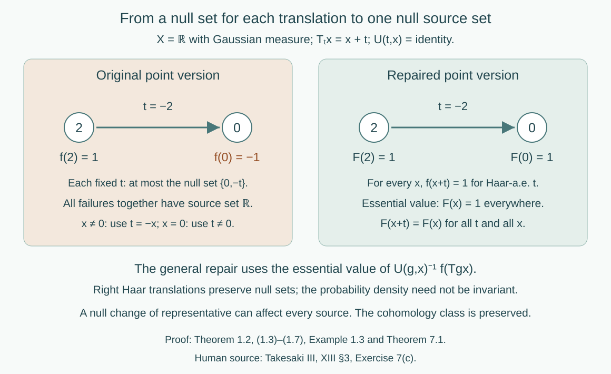

# Localizing factor actions and uniform cocycles

*Written by GPT-6.1 Sol (OpenAI), Ultra, September 2026. Author self-check in progress; not independently reviewed. New original text is public domain (CC0).*

## Introduction

An automorphism of a constant field of factors moves the base and applies a fibre automorphism. To obtain an action of the transformation groupoid, those fibre automorphisms must compose at every arrow on a common conull base. Choosing a measurable field separately for each group element does not ensure this.

The same issue occurs in cohomology. An identity that holds almost everywhere for each fixed group element can fail somewhere along the orbit of every source point. Haar integration repairs the representing section without taking an uncountable union of exceptional sets. We prove that repair first, then construct strict representatives for the action and its unitary cocycles.

The operator prerequisites are the constant-field standard form and fibre decomposition in [Ancillary actions and unitary corrections](ancillary-actions-and-unitary-corrections.md#2-decomposing-an-automorphism-over-the-centre), Lemma 2.1 and Theorem 2.2. Its Lemma 1.1 proves the Polish automorphism group using the exactly compared general canonical-implementation theorem. That same closed-implementer proof works for any von Neumann algebra with separable predual; only its inner-automorphism section requires factoriality. General standard-form theory retains its modular-theory ownership. We use the compact topological centre model in [Measurable actions and compact models](measurable-actions-and-compact-models.md), Proposition 2.4 and Theorem 4.1, and its explicit standard Borel measure prerequisites. The one-to-one Borel-image theorem supplies Borel inverses for standard Borel injections. The new path-space and closed-set constructions are proved below.

Let \(N\) be a factor with separable predual and let
\[
M=L^\infty(X,\mu)\overline\otimes N.
\tag{0.1}
\]
The nonzero standard sigma-finite base may be given an equivalent probability. Let \(G\) be a separable locally compact Hausdorff group and \(\alpha\) a continuous action on \(M\). Its centre has an associated continuous nonsingular point action \(T\) on a Polish model. The compact metrizable model supplied by the linked construction is one such choice. We may assume the probability has full support: its support is closed and conull, since a countable base covers its complement by null open sets, and is invariant because homeomorphisms preserve the null open sets by nonsingularity. Restricting to that support changes no measured algebra. In the compact-model construction a faithful state already gives full support. No freeness, ergodicity, invariant measure or unimodularity is assumed.

Our arrow \((g,x)\) has source \(x\) and range \(T_gx\). Products are
\[
(g,T_hx)(h,x)=(gh,x).
\tag{0.2}
\]
A **strict cocycle** takes its unit value everywhere and satisfies its composition law at every composable pair on its specified invariant base. All algebraic field formulas below represent identities in the measured algebra; an arbitrary choice of point representatives for an operator does not acquire an everywhere identity automatically.

## 1. Repairing an equivariant section

**Lemma 1.1 (a positive Haar probability).** A separable locally compact \(G\) is sigma-compact. It has a Borel \(q:G\to(0,\infty)\) with \(\int q(t)\,dt=1\). The probability \(q(t)dt\) and left Haar measure have the same null sets. Right translation preserves these null sets.

*Proof.* For a relatively compact open identity neighborhood \(V\) and a countable dense \(D\subset G\), every open \(gV^{-1}\) meets \(D\), so \(DV=G\). The translates of \(\overline V\) give a countable compact cover \((C_n)\). Disjointify it into Borel \(E_n=C_n\setminus\bigcup_{j<n}C_j\). Give \(E_n\) the positive constant \(2^{-n}/(1+|C_n|)\), then normalize the resulting positive finite integral. Its integral is nonzero since Haar measure is nonzero. Positivity at every point gives the null-set assertion. Right translation multiplies Haar integrals by the fixed positive scalar \(\Delta_G(h)^{-1}\); it therefore preserves null sets. This does not make \(q(t)dt\) translation invariant. \(\square\)

**Theorem 1.2 (one source set for every group element).** Let \(G\) be as in Lemma 1.1, acting strictly and nonsingularly on a standard Borel measured \(X\). Let \(Y\) be a standard Borel space and suppose
\(U(g,x):Y\to Y\) are Borel bijections with jointly Borel evaluation and
\[
U(e,x)=\operatorname{id},\qquad
U(gh,x)=U(g,T_hx)U(h,x).
\tag{1.1}
\]
If a Borel \(f:X\to Y\) satisfies
\[
f(T_gx)=U(g,x)f(x)
\quad\text{for almost every }x\text{ for each fixed }g,
\tag{1.2}
\]
there are an invariant conull Borel \(E\subset X\) and Borel \(F:E\to Y\), with \(F=f\) almost everywhere, such that (1.2) holds with \(F\) for every \(g\) and every \(x\in E\).

*Proof.* Set
\[
C(g,x)=U(g,x)^{-1}f(T_gx).
\tag{1.3}
\]
The inverse evaluation is Borel because \(U(g,x)^{-1}=U(g^{-1},T_gx)\). Choose a Borel injection \(b:Y\to[0,1]\) with Borel inverse on its image. Define
\[
v(x)=\int_G\int_G
|b(C(g,x))-b(C(k,x))|^2q(g)q(k)\,dg\,dk.
\tag{1.4}
\]
Parameter integration makes \(v\) Borel. Joint Borel maps with a standard Borel factor are measurable for the product sigma-field: give that factor a Polish realization and express open sets by its countable basis. The two occurrences of \(C\) in (1.4) are then explicitly product measurable, even when \(G\) is not second countable. Fubini applies to the finite probabilities here.

The condition \(v(x)=0\) says exactly that \(C(\cdot,x)\) has one essential value. Indeed, for a bounded real random variable \(Z\), the expectation of \(|Z-Z'|^2\) is twice its variance. Variance zero gives one scalar value almost surely. That value lies in \(b(Y)\), because it is attained almost surely by \(b(C(g,x))\); injectivity makes the value in \(Y\) unique. On the Borel set \(E=\{v=0\}\) it is the Borel function
\[
F(x)=b^{-1}\left(\int_Gb(C(g,x))q(g)\,dg\right).
\tag{1.5}
\]
For each fixed \(g\), (1.2) gives \(C(g,x)=f(x)\) almost everywhere. Fubini therefore gives \(E\) conull and \(F=f\) almost everywhere.

For every \(h\), the strict laws give the exact identity
\[
C(g,T_hx)=U(h,x)C(gh,x).
\tag{1.6}
\]
Right translation \(g\mapsto gh\) preserves Haar null sets. Composing with a bijection preserves essential constancy, in both directions. Thus \(x\in E\) if and only if \(T_hx\in E\). On that set (1.6) identifies the essential values:
\[
F(T_hx)=U(h,x)F(x).
\tag{1.7}
\]
These assertions hold for all \(h,x\), because their proof used the exact action law. No exceptional-set saturation or uncountable null union was taken. \(\square\)

**Example 1.3 (a bad point version at every source).** Take real translations on \(X=\mathbb R\), with Gaussian probability, \(Y=\{1,-1\}\), and the trivial fibre action. Set \(f(0)=-1\), \(f(x)=1\) otherwise. For each fixed \(t\), \(f(x+t)=f(x)\) except possibly at \(0,-t\), a null set. For every nonzero \(x\), however, \(t=-x\) makes it fail; it also fails at \(x=0\) for any nonzero \(t\). The sources of all failures fill \(\mathbb R\). In (1.3), \(f(x+t)=1\) for Haar-almost every \(t\) at every \(x\). The repaired section is \(F=1\) everywhere, with the same measured class.

*Figure 1. Example 1.3 and Theorem 1.2. The point version changes sign only at 0. A fixed translation has at most two exceptional sources, but each source has a translation hitting 0. Haar essential values give the constant representative 1 and an identity valid at every arrow. This is a section example; it does not refute the source's cohomology equivalence. Human source: Takesaki III, XIII §3, Exercise 7(c), whose formula quantifies over one null source set.*

## 2. Polish paths and closed constant orbits

For this section let \(G\) be second countable and locally compact, and let \(K\) be a Polish group. Give \(K\) a bounded complete compatible metric \(d\). With Lemma 1.1's Haar probability, write
\[
P=L^0(G,K),\qquad
d_P(p,v)=\int_Gd(p(t),v(t))q(t)\,dt.
\tag{2.1}
\]
The members are measurable functions modulo Haar null equality.

**Lemma 2.1 (path topology).** The metric in (2.1) makes \(P\) Polish, with convergence in measure. The maps
\[
R_hp(t)=p(th),\qquad p\mapsto pk
\tag{2.2}
\]
are jointly continuous in their variables. Also \(R_gR_h=R_{gh}\), and right translation commutes with constant right multiplication.

*Proof.* A subsequence with summable successive \(d_P\)-distances is pointwise Cauchy almost everywhere, by Tonelli. Completeness of \(K\) gives a measurable limit, and bounded convergence gives convergence in \(d_P\). A metric Cauchy sequence has such a subsequence and hence converges. A countable algebra generating the Borel sigma-field of \(G\), together with countably many dense values in \(K\), supplies a dense countable family of finite simple functions. To verify density, approximate a measurable function by countably valued close choices, truncate to finitely many values with small omitted probability, and approximate the resulting measurable sets in probability by that generating algebra. The last approximation follows from the monotone-class theorem for a finite measure. Thus \(P\) is separable and complete.

Convergence in measure has almost-everywhere subsequences. It follows that a continuous map between Polish value spaces induces a continuous map of their \(L^0\) spaces: every subsequence has a further pointwise convergent subsequence, whose continuous images converge in measure. In particular, \(p_n\to p\) and \(k_n\to k\) imply \(p_nk_n\to pk\).

For variable translations, the probability seen after \(t\mapsto th\) has Haar density
\[
q_h(u)=\Delta_G(h)^{-1}q(uh^{-1}).
\tag{2.3}
\]
If \(h_n\to h\), norm continuity of right translations in \(L^1(G)\) and continuity of \(\Delta_G\) give \(q_{h_n}\to q_h\) in \(L^1\). Since \(q_hdu\) is absolutely continuous with respect to \(qdu\), these probabilities are uniformly absolutely continuous for large \(n\). Therefore, if \(p_n\to p\) in measure, the errors between \(R_{h_n}p_n\) and \(R_{h_n}p\) tend to zero in measure.

For fixed \(p\), prove \(R_{h_n}p\to R_hp\) first for finite simple functions whose nonconstant level sets have finite Haar measure. Their translated indicators converge in Haar \(L^1\), by continuous compactly supported approximation, so also in \(qdu\)-measure. Such simple functions are dense in \(P\): use a compact exhaustion to truncate the sets in a finite probability approximation. Uniform absolute continuity of the densities in (2.3) controls the translated approximation errors. This proves joint continuity. Finally \(R_gR_hp(t)=p(tgh)\), proving the action and commutation identities. \(\square\)

**Lemma 2.2 (constant-orbit coordinates).** Every orbit \(pK=\{pk:k\in K\}\) is closed in \(P\). The map
\[
j:P\times K\longrightarrow P\times P,
\qquad j(p,k)=(p,pk)
\tag{2.4}
\]
is a homeomorphism onto a closed subset. The orbit field \(p\mapsto pK\) is Borel in the sigma-field of open-set hits on nonempty closed subsets of \(P\). This closed-set space is standard Borel, admits a Borel selector, and has a Borel action induced by \(R_h\).

*Proof.* The map \(j\) is continuous and injective, since equality \(pk=p\ell\) almost everywhere implies \(k=\ell\). Suppose \(p_n\to p\) and \(p_nk_n\to v\) in measure. Pass to a subsequence along which both converge pointwise almost everywhere. At any point in the common nonempty conull set,
\[
k_n=p_n(t)^{-1}(p_n(t)k_n)\longrightarrow p(t)^{-1}v(t)=k.
\]
Then \(v=pk\) in \(P\). This proves the image closed. The limit \(k\) is unique. Applying the same argument to every subsequence proves convergence of the whole sequence \(k_n\to k\), which proves continuity of the inverse on the image. Taking \(p_n=p\) also proves each orbit closed.

Let \((k_i)\) be dense in \(K\). An orbit hits an open \(W\subset P\) if and only if \(pk_i\in W\) for some \(i\), by continuity in \(k\). This makes the orbit field Borel for open hits.

Here is a complete selector construction, including standardness of the closed-set space. In any nonempty closed \(F\) in a complete separable metric space, choose successively the first ball from a fixed countable collection of rational-radius balls that hits \(F\), has diameter less than \(2^{-n}\), and has closure contained in the preceding ball. At the first step there is no preceding ball. Containment can be ensured by the fixed test that the distance of the centres plus the new radius is less than the old radius. Each stage exists by starting near a point of the old ball's intersection with \(F\). Its centre sequence is Cauchy; the limit belongs to \(F\), because the distances to \(F\) tend to zero and \(F\) is closed. All choices depend Borelly on the open-hit tests, so this is a Borel selector \(s_0(F)\).

For each member \(W_i\) of a countable base, if \(F\) hits \(W_i\), start with a ball whose closure lies inside \(W_i\); otherwise use \(s_0(F)\). The same construction gives \(s_i(F)\in F\cap W_i\) in the first case. The sequence \((s_i(F))\) is dense in \(F\). For any sequence \(z=(z_i)\), the closure \(F_z=\overline{\{z_i\}}\) hits an open set exactly when some \(z_i\) belongs to it. Thus each \(s_i(F_z)\) is Borel in \(z\). The set
\[
\mathcal C=\{z\in P^{\mathbb N}:s_i(F_z)=z_i\text{ for every }i\}
\tag{2.5}
\]
is Borel. The maps \(F\mapsto(s_i(F))\) and \(z\mapsto F_z\) are inverse Borel maps between the nonempty closed-set space and \(\mathcal C\): density gives \(F_{(s_i(F))}=F\), and (2.5) gives the other composite. This identifies that space with a Borel subset of a Polish space, proving it standard Borel. Membership \(p\in F_z\) is the Borel test \(\inf_i d_P(p,z_i)=0\). Finally the action sends \(F_z\) to the closure of \(\{R_hz_i\}\), then recodes by the \(s_i\)'s. Lemma 2.1 makes this a joint Borel action. \(\square\)

## 3. Making a measurable cocycle strict

**Theorem 3.1 (strict versions).** Suppose \(G\) is second countable locally compact and acts strictly and nonsingularly on standard measured \(X\). Let \(A:G\times X\to K\) be Borel, with \(K\) Polish, and suppose that for every fixed pair \(g,h\),
\[
A(gh,x)=A(g,T_hx)A(h,x)
\quad\text{for almost every }x.
\tag{3.1}
\]
There are an invariant conull Borel \(E\) and a strict Borel cocycle \(A'\) on \(G\ltimes E\) such that \(A'(g,\cdot)=A(g,\cdot)\) almost everywhere for each fixed \(g\).

*Proof.* Set \(p_x(t)=A(t,x)\) in the path space \(P\). The map \(x\mapsto p_x\) is Borel: its distances to countably many dense simple paths are Borel parameter integrals, and their open balls generate the path topology. For fixed \(h\), (3.1) and Fubini imply
\[
p_{T_hx}=R_hp_x\,A(h,x)^{-1}
\quad\text{in }P\text{ for almost every }x.
\tag{3.2}
\]
Let \(Q_0(x)=p_xK\), a Borel closed-set field by Lemma 2.2. Equation (3.2) says \(Q_0(T_hx)=R_hQ_0(x)\) almost everywhere for each \(h\). Apply Theorem 1.2 to this standard Borel closed-set target and its strict translation action. It gives an exactly equivariant \(Q\) on invariant conull \(E\), with \(Q=Q_0\) almost everywhere.

Every value \(Q(x)\) is still a constant \(K\)-orbit. Indeed it is the essential value of \(R_t^{-1}Q_0(T_tx)\), and each of those closed sets is such an orbit; an essential value is attained for almost every parameter. Use the selector to choose \(u(x)\in Q(x)\), taking \(u(x)=p_x\) whenever \(p_x\in Q(x)\). That membership condition is Borel and conull, so \(u=p\) almost everywhere.

Equivariance gives \(u(T_hx)\in(R_hu(x))K\). Define the unique \(A'(h,x)\) by
\[
u(T_hx)=R_hu(x)A'(h,x)^{-1}.
\tag{3.3}
\]
The inverse of (2.4) makes it jointly Borel. For every \(g,h,x\) in the reduction, using that \(R_g\) commutes with right constants gives
\[
\begin{aligned}
u(T_{gh}x)
&=R_g u(T_hx)A'(g,T_hx)^{-1}\\
&=R_{gh}u(x)A'(h,x)^{-1}A'(g,T_hx)^{-1}.
\end{aligned}
\]
Uniqueness in (3.3) proves the exact cocycle identity. Taking \(h=e\) gives its unit value. For fixed \(h\), outside the null exceptions of (3.2) and of \(u=p\) at \(x,T_hx\), (3.3) equals (3.2), so \(A'(h,x)=A(h,x)\). Nonsingularity makes that exceptional source set null. \(\square\)

**Proposition 3.2 (retaining an already strict component).** Suppose \(K=B\rtimes L\), with Polish groups and continuous action, and the \(L\)-component \(\theta(g,x)\) of \(A\) in Theorem 3.1 is already strict everywhere. The construction can keep that component exactly: the \(L\)-component of \(A'\) is \(\theta\) on its invariant conull reduction.

*Proof.* Let \(\rho:K\to L\) be projection and \(\iota:L\to K\) its canonical homomorphic section. Projection induces a continuous path map \(\rho_*:P\to L^0(G,L)\). Write \(p_x^L(t)=\theta(t,x)\). Since \(\theta\) is strict,
\[
p_{T_hx}^L=R_hp_x^L\theta(h,x)^{-1}
\tag{3.4}
\]
at every \(h,x\). The projection of any constant \(K\)-orbit is the corresponding constant \(L\)-orbit, since \(\rho\) is surjective. Therefore every closed-set candidate \(R_t^{-1}Q_0(T_tx)\) in the repair has projected set \(p_x^LL\), by (3.4). Its essential value \(Q(x)\), being an attained candidate, has that same projected set.

Consequently there is a unique \(b(x)\in L\) with \(\rho_*u(x)=p_x^Lb(x)\). Lemma 2.2 in the \(L\) path space makes \(b\) Borel. Replace \(u(x)\) by
\[
u_0(x)=u(x)\iota(b(x)^{-1}).
\tag{3.5}
\]
It remains in \(Q(x)\) and now has projection exactly \(p_x^L\). Where \(u=p\), one has \(b=e\), so \(u_0=p\) almost everywhere. Define \(A'\) by (3.3) using \(u_0\). Projecting that identity and comparing with (3.4) forces \(\rho(A'(h,x))=\theta(h,x)\). The version and strictness proofs are unchanged. \(\square\)

## 4. The full separable locally compact scope

**Lemma 4.1 (an effective Polish image).** If a separable locally compact Hausdorff group \(G\) has a continuous homomorphism \(\Phi\) into a Polish group, then \(G/\ker\Phi\) is second countable and locally compact. The induced homomorphism is injective and continuous. It need not be a topological embedding on the whole quotient.

*Proof.* The kernel \(D\) is closed and normal. The quotient map is open, and the quotient is Hausdorff; the image of a compact identity neighborhood is a compact neighborhood, so it is locally compact. It is separable because the image of a countable dense set is dense under the open quotient map. The induced homomorphism is continuous by the quotient topology. On a compact identity neighborhood \(C\) in the quotient it is a homeomorphism onto its image, since it is a continuous injection into a Hausdorff space. Thus \(C\) is metrizable. Its interior contains the identity, giving a countable local base for the quotient. Choose a symmetric local base \((V_n)\) and a countable dense \(D_0\). The sets \(dV_n\), for \(d\in D_0\), form a base: given \(x\in O\), choose \(V_n\) with \(xV_n^2\subset O\) and \(d\in D_0\cap xV_n\); then \(x\in dV_n\subset O\). This proves second countability. \(\square\)

**Lemma 4.2 (Borel group cocycles are continuous).** A Borel homomorphism from the \(G\) of Lemma 1.1 into a Polish group is continuous. In particular a Borel unitary \(\alpha\)-cocycle is strongly continuous when \(\alpha\) is continuous.

*Proof.* For an identity neighborhood \(W\) of the target choose an open \(V\) with \(VV^{-1}\subset W\). Countably many right translates \(Vc_i\) cover the target. Their Borel inverse images cover \(G\), so at least one has positive Haar measure. Take a positive finite-measure Borel subset \(F\) of that inverse image, using sigma-finiteness. Norm continuity of left translations in \(L^1\) gives \(|F\cap sF|>0\) for \(s\) in an identity neighborhood. Such \(s\) belongs to \(FF^{-1}\), whose image lies in \(VV^{-1}\subset W\). This proves continuity at the identity and hence everywhere.

For the cocycle claim use the Polish semidirect group \(\mathcal U(M)\rtimes\operatorname{Aut}(M)\), with product \((a,\theta)(b,\eta)=(a\theta(b),\theta\eta)\). The canonical implementers make the evaluation action on unitaries continuous, so this is a Polish topological group. The map \(g\mapsto(a_g,\alpha_g)\) is a Borel homomorphism, and is therefore continuous. \(\square\)

If an action is specified as point-ultraweakly continuous, its predual action is norm continuous as well. Here is the needed Banach-space argument. On separable \(M_*\), the predual maps are isometries with weakly continuous orbits. Their integrals against \(C_c(G)\) are Bochner integrals, by separability and weak measurability; translating the scalar test function gives norm-continuous orbits of these integrated vectors. Their span is dense: a continuous functional annihilating every such integral has all its continuous orbit coefficients zero, including at the identity, and hence is zero. Hahn–Banach gives density. Isometry and approximation extend norm continuity to every predual vector. Thus either usual continuity convention for the source action supplies the topology used here.

## 5. Localizing the automorphism action

**Lemma 5.1 (parameterized fields).** The centre-fixing automorphisms of \(M\) are homeomorphic, by fibre decomposition, to \(L^0(X,\operatorname{Aut}(N))\). A Borel map from a standard Borel parameter space into \(L^0(X,K)\), with \(K\) Polish, has a jointly Borel point representative for each parameter's class.

*Proof.* Work in the constant-field standard form on \(L^2(X;H_N)\), with \(\mu\) a probability. The ancillary fibre theorem gives the bijection of automorphisms and fields, whose canonical implementers are decomposable canonical fibre unitaries. For a sequence of such unitaries, strong convergence implies convergence in measure on each constant vector from a countable dense family in \(H_N\): their squared field errors have integrals tending to zero. Conversely convergence in measure of unitary fields in the strong topology gives norm convergence on those constant vectors, by boundedness, and then on all simple vector sections and all of \(L^2(X;H_N)\). The strong topology on canonical implementers is the automorphism topology. Continuous maps of Polish value spaces induce continuous maps in measure, as proved in Lemma 2.1. This proves the asserted homeomorphism; the relevant spaces are metrizable, so the sequential test suffices.

For representatives choose a bounded complete compatible metric on \(K\) and a countable dense family of Borel simple \(K\)-fields in \(L^0(X,K)\). For a class \(z\), let \(f_n(z,\cdot)\) be the first such field whose integral metric distance to \(z\) is less than \(2^{-2n}\). The index is Borel. The successive integral distances are summable, so Tonelli makes \(f_n(z,x)\) pointwise Cauchy for almost every \(x\), for each \(z\). Its limit is a representative of \(z\). Take that limit on the Borel Cauchy set and a fixed \(K\) value elsewhere. Completeness gives a jointly Borel limit. Composing with the given parameter map gives the required representative. This proves versions for each parameter; it does not yet give a strict cocycle. \(\square\)

**Theorem 5.2 (localization).** On an invariant conull Borel reduction there is a strict Borel action \(\Theta\) of \(G\ltimes X\) on \(N\), with
\[
(\alpha_g m)(T_gx)=\Theta(g,x)(m(x)).
\tag{5.1}
\]
For each fixed \(g,m\), this is an equality of measurable field classes. Representatives of the left side may be taken from the formula. The map satisfies
\[
\Theta(gh,x)=\Theta(g,T_hx)\Theta(h,x),\qquad
\Theta(e,x)=\operatorname{id}
\tag{5.2}
\]
at every point of that reduction.

*Proof.* First use the effective group \(Q=G/\ker\alpha\). The target \(\operatorname{Aut}(M)\) is Polish by canonical implementation, and Lemma 4.1 makes \(Q\) second countable locally compact. Every member of \(\ker\alpha\) fixes the centre algebra. It fixes the point model everywhere: pullbacks of bounded continuous functions agree almost everywhere, and continuity together with full support makes them agree everywhere. Bounded continuous functions separate points. Thus the continuous action on the model factors through \(Q\); its quotient action remains nonsingular and continuous. The algebra action also factors, continuously, by the quotient topology.

For \(g\in Q\), let \(\beta_g\) be the simple lifting of the centre action, so \((\beta_gm)(y)=m(T_g^{-1}y)\). Its scalar Koopman implementer, tensored with \(1\) on \(H_N\), is strongly continuous by the compact-model lesson. It preserves the constant-field standard form, so \(\beta\) is continuous in the automorphism topology. The map \(g\mapsto\delta_g=\alpha_g\beta_g^{-1}\) is continuous and fixes the centre. Lemma 5.1 supplies jointly Borel fields \(D(g,y)\in\operatorname{Aut}(N)\) with
\[
(\alpha_gm)(y)=D(g,y)(m(T_g^{-1}y)).
\tag{5.3}
\]
For each fixed pair \(g,h\), the action law gives
\[
D(gh,y)=D(g,y)D(h,T_g^{-1}y)
\quad\text{almost everywhere}.
\tag{5.4}
\]
One obtains equality as automorphisms by testing a countable strong dense family of constant operators, exactly as in the ancillary fibre theorem.

Set \(B(g,x)=D(g,T_gx)\). It is Borel, and (5.4) is (3.1) for \(B\). Theorem 3.1 gives a strict version \(\Theta_Q\) on an invariant conull set, retaining the field of each fixed group element. Pull it back along \(G\to Q\). This is jointly Borel and strict for the original group; its conull base is invariant under that group as well. Formula (5.3) and preservation of fixed-element classes give (5.1). Extend the fibre action trivially on the invariant null complement if an everywhere model is desired. This extension changes no measured-algebra identity. \(\square\)

The quotient step is a proof of the literal separable locally compact scope, not an extra assumption that \(G\) was second countable. It also uses the topological centre model: for an arbitrary point realization, individually null fixed-point exceptions for kernel elements would not justify pointwise quotienting by an uncountable kernel.

## 6. Localizing unitary cocycles

Let \(a_g\in\mathcal U(M)\) be a unitary group cocycle:
\[
a_{gh}=a_g\alpha_g(a_h),\qquad a_e=1.
\tag{6.1}
\]
It is enough that \(g\mapsto a_g\) be Borel; Lemma 4.2 supplies continuity.

**Theorem 6.1 (strict arrow representatives).** For the fixed localization \(\Theta\) in Theorem 5.2, there are jointly Borel representatives of the fields \(a_g\) on an invariant conull base such that
\[
\bar a(g,x)=a_g(T_gx)
\tag{6.2}
\]
is a strict unit-normalized \(\Theta\)-cocycle:
\[
\bar a(gh,x)=\bar a(g,T_hx)\,
\Theta(g,T_hx)(\bar a(h,x)).
\tag{6.3}
\]
Every fixed \(g\) retains its original unitary in \(M\).

*Proof.* The combined homomorphism \(g\mapsto(a_g,\alpha_g)\) into the Polish semidirect group is continuous. Its kernel \(D\) is closed and contained in \(\ker\alpha\). Lemma 4.1 makes \(Q_a=G/D\) second countable locally compact. Both \(a\) and \(\alpha\) factor continuously through it. The point model factors because \(D\) fixes it everywhere. The already strict \(\Theta\), constructed through \(G/\ker\alpha\), also factors through the continuous quotient homomorphism \(Q_a\to G/\ker\alpha\).

The strong topology on \(\mathcal U(M)\) agrees with convergence in measure of its \(\mathcal U(N)\)-valued fields, by the constant-vector test in Lemma 5.1. Its representative construction supplies a jointly Borel field \(v(g,y)\) of \(a_g\). Set \(w(g,x)=v(g,T_gx)\). The group law (6.1) and the localization formula give (6.3) almost everywhere for each fixed pair, with \(w\) in place of \(\bar a\).

Use the Polish group \(K=\mathcal U(N)\rtimes\operatorname{Aut}(N)\). Its evaluation action is continuous, since canonical implementers and multiplication of bounded unitaries are strongly continuous. The pair \((w(g,x),\Theta(g,x))\) is an almost cocycle into \(K\). Proposition 3.2 makes it strict while retaining its already strict automorphism component exactly. Let \(\bar a\) be the resulting unitary component. It satisfies (6.3) and equals \(w(g,\cdot)\) almost everywhere for each fixed \(g\). Pull back to \(G\) and define the point version of \(a_g(y)\) to be \(\bar a(g,T_g^{-1}y)\). This gives (6.2) exactly and the original field class, by nonsingularity. Unit normalization is part of strictness. Extend the unitary component by \(1\) on the invariant null complement, where \(\Theta\) was trivial. \(\square\)

The composable pair \((g,T_hx),(h,x)\) has range \(T_{gh}x\). This is why the first term of (6.3) is evaluated at \(T_hx\). The construction supplies an actual Borel arrow cocycle, beyond a fixed-pair almost-everywhere calculation. It makes no assertion that every arbitrary Borel arrow cocycle has a continuous group-valued lift.

## 7. Group cohomology and one uniform null source set

For two group cocycles, write \(a\sim b\) if there is \(f\in\mathcal U(M)\) with
\[
b_g=f^*a_g\alpha_g(f)\qquad(g\in G).
\tag{7.1}
\]
For their strict arrow representatives, the source's cohomology condition is the existence of Borel \(F:X\to\mathcal U(N)\) such that
\[
\bar b(g,x)=F(T_gx)^*\bar a(g,x)\Theta(g,x)(F(x))
\tag{7.2}
\]
outside one null set of sources, for every arrow. Equivalently the measure of the source projection of the failure set is zero, understood in the completed measure or by a null Borel cover.

**Theorem 7.1 (the full cohomology comparison).** The group cocycles in (7.1) are cohomologous if and only if their strict arrow versions are cohomologous in the uniform-source sense (7.2).

*Proof.* Intersect the invariant conull bases used for the two strict versions and the localization. Suppose first that (7.1) holds. Choose a Borel unitary field \(f(x)\) representing \(f\). Evaluating at \(T_gx\), using (5.1) and (6.2), gives (7.2) with this field for almost every \(x\) for each fixed \(g\). The field may still have failures over every source, as Example 1.3 warns.

For \(Y=\mathcal U(N)\) define the fibre bijections
\[
U(g,x)v=\bar a(g,x)\Theta(g,x)(v)\bar b(g,x)^*.
\tag{7.3}
\]
Their inverses exist, their evaluation is jointly Borel, and their unit maps are identity. The two strict unitary cocycle identities and (5.2) give
\[
U(g,T_hx)U(h,x)=U(gh,x).
\tag{7.4}
\]
To check the order, the left multiplication factors combine as \(\bar a(g,T_hx)\Theta(g,T_hx)(\bar a(h,x))=\bar a(gh,x)\); the right factors combine in reverse adjoint order to \(\bar b(gh,x)^*\). The middle automorphisms compose by (5.2).

The fixed-\(g\) form of (7.2) is precisely \(f(T_gx)=U(g,x)f(x)\) almost everywhere. Theorem 1.2, applied to the original separable locally compact \(G\), supplies an invariant conull Borel set and \(F=f\) almost everywhere with that identity at every \(g,x\). Rearranging gives (7.2) uniformly on the set. Extend \(F\) by \(1\) outside it. Every failure has source in its Borel null complement, proving the source's quantifier directly.

Conversely suppose a Borel \(F\) satisfies (7.2) outside a null source set. Its unitary field defines a unitary \(f\in M\) by the constant-field theorem. For each fixed \(g\), (7.2) holds almost everywhere in \(x\). Nonsingularity carries it to almost every \(y=T_gx\). Localization and (6.2) then give equality of the \(M\)-fields \(b_g=f^*a_g\alpha_g(f)\). This is (7.1) for every \(g\). \(\square\)

The proof also shows that different strict representative choices of the same group cocycle yield the same arrow cohomology class: apply it to the identity group cochain. It does not insist that those choices agree pointwise, or that a preselected bad point version of a cochain already gives (7.2).

## 8. Examples and exercises with solutions

**Example 8.1 (a nontrivial localization over a point).** Let \(X\) be one point, \(N=M_2(\mathbb C)\), \(D=\operatorname{diag}(1,-1)\), and \(\alpha_t=\operatorname{Ad}(e^{itD})\) for \(G=\mathbb R\). The centre action is trivial, but the transformation groupoid has all real isotropy loops. Its localization is \(\Theta(t,*)=\operatorname{Ad}(e^{itD})\). It is nontrivial, for example at \(t=\pi/4\) on the off-diagonal matrix unit. The principal endpoint relation over that point has only a unit, so it cannot encode this fibre action. Localization uses the full transformation groupoid and needs no freeness hypothesis.

Level 1 asks for a computation or a direct application. Level 2 asks for a proof using the lesson’s framework. Level 3 combines results or examines a hypothesis whose failure changes the conclusion.

**Exercise 8.1 (which endpoint evaluates the cochain).** *Level 1.* For real translations with Gaussian measure, \(N=M_2(\mathbb C)\), simple lifting \(\beta\), and \(D=\operatorname{diag}(1,-1)\), set \(a_t(y)=e^{itD}\) and \(f(y)=e^{iyD}\). Compute \(b_t=f^*a_t\beta_t(f)\) and check (7.2).

*Solution.* The simple lifting gives \(\beta_t(f)(y)=f(y-t)=e^{i(y-t)D}\). The three factors commute, and their exponents sum to \(-y+t+y-t=0\); thus \(b_t=1\). The localization of \(\beta\) is identity. Its arrow expression is \(f(x+t)^*e^{itD}f(x)=e^{i(-(x+t)+t+x)D}=1\). The left cochain must be evaluated at the range \(x+t\). Replacing it by \(f(x)^*\) would leave \(e^{itD}\), which is generally not the required identity.

**Exercise 8.2 (a null change can spoil a uniform formula).** *Level 2.* In Example 1.3 take both group unitary cocycles equal to1 and regard \(f\) as a scalar unitary cochain. Compute the source projection of the failure set in (7.2), and exhibit a valid representative.

*Solution.* The source formula becomes \(1=f(x+t)^*f(x)\). For each fixed \(t\), it fails only at the indicated finite null set. For every \(x\ne0\), the choice \(t=-x\) gives a factor \(-1\), so every nonzero point belongs to the source projection. At \(x=0\), every nonzero \(t\) also gives \(-1\). The projection is all of \(\mathbb R\), of full measure. The field \(F=1\) has the same class as \(f\) in \(L^\infty\) and gives the formula for all \(t,x\). This is the need for a representative repair, not a failure of cohomology equivalence.

**Exercise 8.3 (the affine density after right translation).** *Level 1.* In the affine group \((a,b)(c,d)=(ac,ad+b)\), with left Haar measure \(a^{-2}da\,db\) and \(\Delta(a,b)=a^{-1}\), take \(h=(2,0)\). Compute \(q_h\) in (2.3) and verify its integral is1. Which assertion is needed in Theorem 1.2?

*Solution.* Since \(h^{-1}=(1/2,0)\), one has \(q_h(u)=2q(uh^{-1})\). The right-translation integral of \(q(uh^{-1})\) is \(\Delta(h^{-1})^{-1}\int q=\tfrac12\). Thus \(\int q_h=2\cdot\tfrac12=1\). The positive multiplier and positive density preserve the Haar null class. Theorem 1.2 uses preservation of null sets under \(t\mapsto th\); it does not require \(q_h=q\).

**Exercise 8.4 (constant orbits without a finite mean).** *Level 2.* Let \(K=\mathbb R\) additively and \(p(t)=1/t\) on \((-1,1)\setminus\{0\}\), with any value at0. Explain why \(p\) belongs to \(L^0((-1,1),\mathbb R)\) under normalized Lebesgue measure, why its ordinary integral is unavailable, and why its constant orbit still has a Borel selector.

*Solution.* It is a finite Borel function almost everywhere, which suffices for \(L^0\); no integrability is required. Both its positive and negative parts have infinite integrals, so its Lebesgue integral is undefined. An average cannot select a translate. The proof of Lemma 2.2 uses only a nonzero probability measure and the complete separable \(L^0\) topology for its constant-orbit and selector assertions. If \(p+c_n\) converges in measure, an almost-everywhere subsequence at one point forces \(c_n\) to converge to a finite constant; the limit remains in the orbit. The complete closed-set selector therefore applies. No path-translation action on the interval is asserted.

**Exercise 8.5 (why the strict component can be preserved).** *Level 3.* In Proposition 3.2, prove that normalizing the selected path by (3.5) does not change its constant \(K\)-orbit or its almost-everywhere agreement with the original path. Explain why the strict \(L\)-component follows.

*Solution.* Right multiplication by the constant element \(\iota(b(x)^{-1})\) keeps the selected path in its orbit. Projection gives \(p_x^Lb(x)b(x)^{-1}=p_x^L\). On the conull set where \(u(x)=p_x\), both projected paths already equal \(p_x^L\), so the free constant \(L\)-action forces \(b(x)=e\); the normalization leaves that original path unchanged. In (3.3) for \(u_0\), projection gives \(p_{T_hx}^L=R_hp_x^L\rho(A'(h,x))^{-1}\). Equation (3.4) gives the same identity with \(\theta(h,x)\). Freeness of the constant action cancels the path and identifies these elements exactly, at every source in the invariant reduction. This retains the prescribed localization rather than merely a cohomologous automorphism component.

**Exercise 8.6 (localization retains isotropy).** *Level 2.* Compute \(\alpha_t(e_{12})\) in Example 8.1. Determine its effective group kernel and explain why the quotient construction does not replace the transformation groupoid by its endpoint relation.

*Solution.* The two diagonal entries of \(e^{itD}\) are \(e^{it}\) and \(e^{-it}\), so \(\alpha_t(e_{12})=e^{2it}e_{12}\). The automorphism is identity on all matrices exactly when \(e^{2it}=1\), namely \(t\in\pi\mathbb Z\). The effective group is therefore \(\mathbb R/\pi\mathbb Z\), a second-countable compact group. Its point base still has all of that group's isotropy loops, which carry the nontrivial automorphisms. Pullback along \(\mathbb R\to\mathbb R/\pi\mathbb Z\) restores the original arrow labels and localization. The endpoint relation would identify every loop with a unit and lose the displayed action.

## Bibliography and source comparison

Masamichi Takesaki, *Theory of Operator Algebras III*, Chapter XIII, §3, Exercise 7(a)–(c), printed page59, supplied PDF79. Its complete page image and formula were checked. The standing exercise separability appears on printed page56, PDF76. Theorem 5.2 proves part(a), Theorem 6.1 proves part(b) with strict Borel representatives, and Theorem 7.1 proves part(c) with the source's single null source set. The group is separable locally compact throughout; the factor has separable predual and the centre is standard sigma-finite. Second countability is proved for effective quotients where a Polish path space is needed. The Haar repair itself retains the original separable locally compact group. No free action, hyperfinite relation or dense inner-automorphism group is required for this exercise.

The general canonical standard-form implementation and its topology are exactly compared modular-course prerequisites, reused through the ancillary field theorem. Constant-field and compact-model application proofs are local course prerequisites. This lesson does not prove the real-flow cross-section theorem or the remaining ancillary cocycle-conjugacy application; those are separate course targets.
