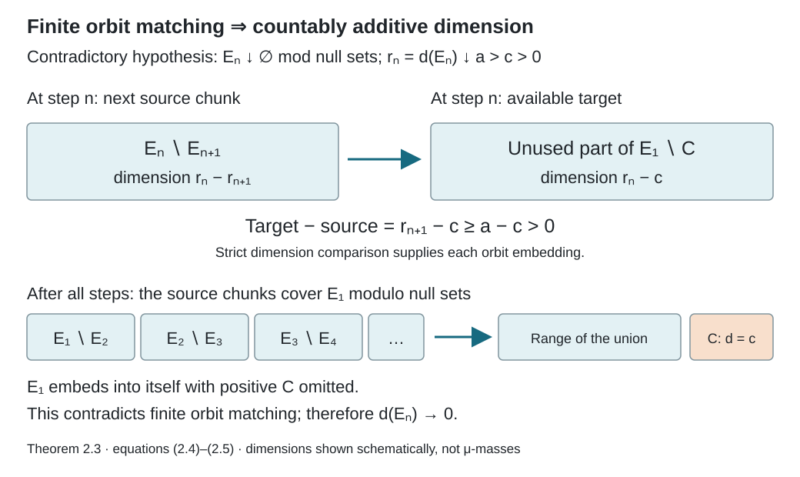

# Matching sets and nonsingular dyadic arrays

*Written by GPT-6.1 Sol (OpenAI), Ultra, September 2026. New original text is public domain (CC0).*

## Introduction

Uniform finite classes can approximate a nonsingular relation even when there is no invariant measure. Their points have equal status as matrix coordinates, but they need not have equal measure. The missing ingredient is a matching theorem: in type III, any two positive sets can be matched inside the relation.

We prove that theorem by constructing an invariant measure whenever a positive set is finite in the sense of orbit matching. The construction includes countable additivity; a merely finitely additive dimension would not suffice. We then build dyadic arrays in the finite invariant-measure case, the infinite invariant-measure case, and type III. Compatible refinement gives a binary tail model and a single nonsingular generator in all three nonatomic cases. The finite and infinite atomic cases are treated separately, so the dyadic characterization has its precise scope.

Read [Groupoids and measured orbit relations](groupoids-and-measured-orbit-relations.md), [Finite orbit classes and matrix blocks](finite-orbit-classes-and-matrix-blocks.md), Sections 1–2 of [Balanced arrays and the hyperfinite finite factor](balanced-arrays-and-the-hyperfinite-finite-factor.md), and Sections 1–4 of [Towers and odometer orbits](towers-and-odometer-orbits.md). We use their counting measures, finite selectors, finite-measure matching and nonsingular cyclic approximation. The first two sections of the balanced-array lesson require no hyperfinite exhaustion; its later classification is not a hypothesis of our balancing proof. The Borel one-to-one image theorem is the descriptive-set prerequisite. The arguments below prove the remaining matching and nonsingular balancing steps directly. The basic reference is [Takesaki].

Let \(R\) be an ergodic nonsingular Borel principal relation with countable classes on a standard probability space \((X,\mu)\). Section 1 and Propositions 3.3 and 3.5 also apply when this space has atoms, and to sigma-finite measures after an equivalent probability replacement. The matching dimension, balancing and coding arguments in Sections 2–5.3 assume nonatomicity; Proposition 5.4 supplies the atomic cases. [Theorem 1.3 and Corollary 1.4 of the orbit lesson](orbits-stabilizers-and-relation-algebras.md#1-two-ways-to-record-an-action) provide a countable nonsingular Borel presentation. Reductions to positive Borel sets retain a partial-bijection presentation by restricting all presenting graphs. We identify sets and maps modulo null sets. All countable constructions can be made on one invariant conull Borel space.

## 1. Comparison and orbit-preserving Schröder–Bernstein

Write \(A\sim B\) when a Borel partial orbit bijection takes \(A\) onto \(B\), and \(A\precsim B\) when such a bijection takes \(A\) onto a subset of \(B\). These maps are nonsingular. Composition and countable unions on disjoint domains and ranges preserve this property.

**Lemma 1.1 (comparison).** For measurable \(A,B\), either \(A\precsim B\) or \(B\precsim A\).

*Proof.* Enumerate partial bijections whose graphs cover \(R\). Successively match every currently unused point of \(A\) whose image under the next map is currently unused in \(B\). Remove the matched domain and range. The union is a Borel partial orbit bijection.

If the two unused sets \(A_\infty,B_\infty\) both had positive measure, the saturation of \(A_\infty\) would be conull by ergodicity. Some presenting graph would therefore take a positive subset of \(A_\infty\) into \(B_\infty\). That available set was removed at its visit, a contradiction. Thus one unused set is null, proving comparison. \(\square\)

**Lemma 1.2 (Schröder–Bernstein).** If \(A\precsim B\) and \(B\precsim A\), then \(A\sim B\).

*Proof.* Take injections \(i:A\to B\), \(j:B\to A\) along \(R\). Put
\[
A_0=A\setminus j(B),\qquad A_{n+1}=j(i(A_n)),\qquad D=\bigcup_{n\geq0}A_n.
\]
Define the map to be \(i\) on \(D\) and \(j^{-1}\) on \(A\setminus D\). The latter set lies in \(j(B)\). The identity \(j(i(D))=D\setminus A_0\) proves that the two pieces have disjoint ranges and together cover \(B\). Both pieces are Borel, nonsingular, and orbit preserving. Thus their union is the required bijection. \(\square\)

A set \(A\) is **finite for orbit matching** if every orbit bijection \(A\to B\subset A\) has conull range in \(A\). It is infinite if it admits such a bijection with a positive-measure omitted set. Every subset of a finite set is finite: a compression of the subset, extended by the identity on its complement, would compress the whole set.

## 2. A finite positive set gives an invariant measure

From this section through Corollary 5.3 the measured space is nonatomic. In particular, the halving step below is not asserted for an atomic orbit.

The reduction \(R|_A\) to any positive set is ergodic. Indeed the saturation of a positive reduced-invariant set is conull, and its intersection with \(A\) is that set. It is nonatomic as a measured space.

**Lemma 2.1 (halving).** Every positive \(A\) splits, modulo null sets, as \(A=A_0\sqcup A_1\) with \(A_0\sim A_1\).

*Proof.* Let \(C_j\) be countably many Borel sets separating points. Enumerate all pairs consisting of a presenting map \(g\) and a separator \(C_j\). Within the currently unused part \(V\subset A\), match
\[
D=V\cap C_j\cap g^{-1}(V\setminus C_j)
\]
to \(gD\). These sets are disjoint. Remove both and continue. The union of the domains is equivalent to the union of the ranges.

The remaining set contains at most one point from each reduced orbit: two distinct remaining related points are separated by some \(C_j\), and their presenting map would have matched them when visited. If this remaining set had positive measure, nonatomicity would split it into two positive sets. Their reduced saturations would be disjoint positive invariant sets, contrary to ergodicity of \(R|_A\). Thus the remainder is null. \(\square\)

**Lemma 2.2 (finite unions).** A finite disjoint union of finite sets is finite. The same holds for finitely many formal copies of a finite set, with orbit maps allowed between copies.

*Proof.* Suppose \(V=\bigsqcup_{i=1}^kV_i\) has a compression \(\theta:V\to V\setminus C\), with \(\mu(C)>0\). The sets \(C,\theta C,\theta^2C,\ldots\) are disjoint. Each trajectory from \(C\) visits at least one of the finitely many \(V_i\)'s infinitely often. For some \(i\), the set \(C'\subset C\) of trajectories with infinitely many visits to \(V_i\) has positive measure.

Let \(W\) consist of their visits to \(V_i\). The next-visit map is a Borel nonsingular injection of \(W\) onto \(W\) minus the first visits. Those first visits have positive measure: partition \(C'\) by its first hitting time, and use nonsingularity of the corresponding power of \(\theta\). Extending the next-visit map by the identity on \(V_i\setminus W\) compresses \(V_i\), a contradiction.

For formal copies, use the product with a finite set of labels and give labels counting measure. The same next-visit proof returns to a fixed label, where its maps are precisely orbit maps of the original set. \(\square\)

In particular, \(m\) copies of a positive finite set cannot embed into \(k\) copies when \(m>k\): the first \(k\) copies form a proper subset of the finite union of \(m\) copies, contradicting its finiteness.

**Theorem 2.3.** If a positive set \(A\) is finite for orbit matching, then \(R|_A\) has an invariant probability measure equivalent to \(\mu|_A\). Moreover \(R\) has an equivalent sigma-finite invariant measure on \(X\).

*Proof.* We first construct a dimension on the measurable subsets of \(A\).

Use Lemma 2.1 repeatedly to form compatible partitions of \(A\) into \(2^n\) equivalent positive cells. At each step halve one reference cell and transport its two halves to all the other cells by their existing orbit bijections. This makes the next partition refine the preceding one and keeps every cell at the new level equivalent to every other. Label the cells by binary words. Let \(B_{m,n}\) be the union of the first \(m\) cells at level \(n\), in binary order. Then
\[
B_{m,n}=B_{2m,n+1}.
\]
The finite-union lemma shows that \(B_{m,n}\) cannot embed into \(B_{k,n}\) for \(m>k\): both are unions of equivalent cells, and the former is finite.

For \(E\subset A\), define
\[
d(E)=\sup\{m2^{-n}:B_{m,n}\precsim E\}.
\tag{2.1}
\]
It lies in \([0,1]\), respects equivalence and inclusion, and gives
\(d(B_{m,n})=m2^{-n}\). For the last assertion, compare at a common finer level and apply the preceding finite-copy obstruction. Comparison also gives the useful strict-order rule
\[
d(E)<d(F)\quad\Longrightarrow\quad E\precsim F:
\tag{2.2}
\]
choose a dyadic number strictly between the two dimensions; comparison embeds \(E\) into its dyadic block and embeds that block into \(F\).

The dimension is finitely additive on disjoint sets. Here are both bounds. For dyadic \(r<d(E)\), \(s<d(F)\), take disjoint formal blocks of sizes \(r,s\) and embed them into the disjoint targets \(E,F\). The finite-copy obstruction forces \(r+s\leq1\). Relabel their cells as the first \((r+s)2^n\) cells at a common level to obtain \(d(E\sqcup F)\geq r+s\). For dyadic \(r>d(E)\), \(s>d(F)\) with \(r+s\leq1\), comparison embeds \(E,F\) into disjoint blocks of those sizes, giving the reverse inequality. If \(r+s>1\), that upper bound follows from \(d\leq1\). Taking limits, with zero and unit endpoints included by their trivial bounds, proves
\[
d(E\sqcup F)=d(E)+d(F).
\tag{2.3}
\]

It is faithful. If a positive \(E\) had dimension zero, (2.2) would embed it into the remaining part of \(A\) after any finite number of disjoint equivalent copies of \(E\) had been chosen: that remainder still has dimension one by (2.3). Choose countably many such copies. Their union is compressed by shifting each copy to the next and omitting the first positive copy. As a subset of finite \(A\), this is impossible. Thus \(d(E)=0\) exactly when \(E\) is null.

Now prove countable additivity. It suffices to prove continuity at zero for decreasing sets. Suppose \(E_n\downarrow\varnothing\) modulo null sets but \(d(E_n)\downarrow a>0\). Choose a positive dyadic block of dimension \(c<a\) and embed it in \(E_1\) using (2.2); call its image \(C\). We construct an injection
\[
E_1\longrightarrow E_1\setminus C
\tag{2.4}
\]
by matching successive chunks \(E_n\setminus E_{n+1}\).

After the first \(n-1\) chunks have been matched, their total dimension is \(d(E_1)-d(E_n)\). The available target in \(E_1\setminus C\) therefore has dimension \(d(E_n)-c\), while the next source chunk has dimension
\[
d(E_n)-d(E_{n+1})\leq d(E_n)-a<d(E_n)-c.
\tag{2.5}
\]
Rule (2.2) embeds that chunk into the available target. The countable union of these embeddings has domain \(E_1\), since the intersection of the \(E_n\)'s is null, and its range omits positive \(C\). This contradicts finiteness of \(E_1\). Consequently \(d(E_n)\to0\).

Finite additivity and this continuity give countable additivity: for a disjoint union, subtract the first finitely many pieces from the union and apply continuity to the decreasing tails. Hence \(\nu(E)=d(E)\) is a probability on \(A\), equivalent to \(\mu|_A\). It is invariant under every reduced partial orbit map because \(d\) respects equivalence.

*Figure 1. Theorem 2.3, equations (2.4)–(2.5). If \(r_n=d(E_n)\downarrow a>c>0\) while \(\bigcap_nE_n\) is null, each next chunk has dimension \(r_n-r_{n+1}\), less than the remaining target dimension \(r_n-c\). Their disjoint orbit embeddings cover the domain and omit \(C\), contradicting finiteness. The diagram depicts dimensions, not the original probability masses; its separated rectangles are schematic. The matching result completes the argument left to the reader in Takesaki, Chapter XIII, Proposition 3.13.*

To extend it, the saturation of \(A\) is conull. Map each point \(x\) to a point \(\pi(x)\in A\) along the first presenting graph that reaches \(A\), with \(\pi(x)=x\) on \(A\). This partitions \(X\) into countably many Borel pieces \(D_j\) on which \(\pi_j=\pi|_{D_j}\) is an injective partial orbit map. Define
\[
\eta(E)=\sum_j\nu(\pi_j(E\cap D_j)).
\tag{2.6}
\]
Each summand is a measure on its piece, so this is a measure. Each \(D_j\) has \(\eta\)-measure at most one, proving sigma-finiteness. Nonsingularity of \(\pi_j\) and \(\nu\sim\mu|_A\) prove \(\eta\sim\mu\).

For invariance, partition the domain of any partial orbit map \(T\) by \(D_j\cap T^{-1}D_k\). On each piece the map
\(\pi_kT\pi_j^{-1}\) is a partial orbit map of \(A\), and hence preserves \(\nu\). Sum the equalities over \(j,k\). Countable additivity gives \(\eta(TE)=\eta(E)\), completing the proof. \(\square\)

The extension (2.6) also proves a fact used below: an equivalent sigma-finite invariant measure on any positive reduction extends to such a measure on the whole relation. The reduced measure need not be finite; split each \(\pi_j(D_j)\) into finite-measure pieces to obtain a sigma-finite cover in that case.

## 3. Type III matching and two reduction formulas

Call \(R\) type III when it has no equivalent sigma-finite invariant measure.

**Theorem 3.1.** In type III, every positive set is infinite for orbit matching, and any two positive sets are equivalent inside \(R\).

*Proof.* A finite positive set would give the invariant measure in Theorem 2.3. Thus any positive \(A\) admits a compression \(\theta:A\to A\setminus C\), with \(C\) positive. The sets
\[
C_j=\theta^jC,\qquad j\geq0,
\tag{3.1}
\]
are disjoint equivalent subsets of \(A\).

The saturation of \(C\) is conull. As in the extension construction, partition \(X\) into Borel pieces \(D_j\) and choose injective partial orbit maps \(\pi_j:D_j\to C\). Map \(x\in D_j\) to \(\theta^j\pi_j(x)\). Its ranges lie in the disjoint \(C_j\)'s, so it is an injection of \(X\) into \(A\) along \(R\). Inclusion gives \(A\precsim X\); Lemma 1.2 yields \(A\sim X\). Apply this to each of two positive sets and compose their equivalences. \(\square\)

Every positive reduction of a type III relation is type III, by the invariant-measure extension following (2.6). This is essential when refining an array on one of its cells.

**Proposition 3.2.** If \(\eta\) is an equivalent sigma-finite invariant nonatomic measure, then
\[
A\precsim B\quad\Longleftrightarrow\quad\eta(A)\leq\eta(B),
\tag{3.2}
\]
and equal measures give equivalence, including when both are infinite.

*Proof.* Necessity follows from invariance. Two finite sets of equal measure can be matched by the greedy proof of Lemma 1.1: every matched piece preserves \(\eta\), so the two unused finite measures remain equal, and comparison exhausts both. If \(\eta(A)<\infty\) and \(\eta(A)\leq\eta(B)\), nonatomicity supplies a subset of \(B\) with measure \(\eta(A)\), giving an embedding. For two infinite sets, partition each into countably many sets of invariant measure one, match corresponding pairs by the finite case, and take the disjoint union. Such unit partitions follow by splitting a sigma-finite finite-measure cover into nonatomic pieces and accumulating their masses in order; a Borel injection into \([0,1]\) and continuous cumulative distributions perform each final fractional cut. Null sets give the zero case. \(\square\)

**Proposition 3.3 (product splitting).** If \(X=\bigsqcup_{n\geq0}A_n\) with all \(A_n\sim A_0\), choose transports \(v_n:A_0\to A_n\), \(v_0=\mathrm{id}\). Then
\[
(x,n)\longmapsto v_nx
\tag{3.3}
\]
is a measure-class isomorphism from \(A_0\times\mathbb N\) onto \(X\), taking
\((R|_{A_0})\times(\mathbb N\times\mathbb N)\) onto \(R\).

*Proof.* It is a Borel bijection. On each sheet the transported measure is equivalent to \(\mu|_{A_n}\), proving the measure-class assertion for \(\mu|_{A_0}\) times counting measure. Also \(v_nx\sim v_my\) exactly when \(x\sim y\), since both transports stay inside \(R\). \(\square\)

**Proposition 3.4 (induced transformation).** If \(R\) is the relation of one properly ergodic nonsingular transformation \(T\), its reduction to any positive set \(A\) is generated by the first-return transformation
\[
T_Ax=T^{n(x)}x,\qquad n(x)=\min\{n\geq1:T^nx\in A\}.
\tag{3.4}
\]

*Proof.* The recurrence argument in the tower lesson gives infinitely many forward and backward visits to \(A\) for almost every point of \(A\). Thus (3.4) is a Borel nonsingular bijection, whose inverse takes the preceding visit. Its iterates list precisely the visits of a \(T\)-orbit to \(A\). Its relation is therefore \(R|_A\). \(\square\)

**Proposition 3.5 (products).** The product of two ergodic nonsingular countable principal measured relations is ergodic and nonsingular for the product unit measure. This statement allows atoms and sigma-finite unit measures.

*Proof.* Use equivalent probabilities on the two unit spaces; their product has the same null sets as the original product. Countable nonsingular presentations act separately on the two coordinates. Each product map is nonsingular: Fubini sends a null product set to null sections, and a nonsingular map preserves their nullness. The resulting product relation has countable classes and precisely the separate-coordinate orbit relation.

Let \(C\) be invariant modulo null sets for this relation. The countably many first-coordinate invariance identities hold on almost every section. Ergodicity of the first relation makes \(\mathbf1_C(x,y)\) constant in \(x\), for almost every \(y\). Its constant is the Borel function \(f(y)=\int\mathbf1_C(x,y)\,d\mu_1(x)\), which is zero or one almost everywhere. The second-coordinate identities make \(f\) invariant under the second relation. Its ergodicity makes \(f\) constant, proving product ergodicity. For completeness, counting on the product arrows equals the product of the two source-counting measures: this holds on rectangles by multiplying fibre counts and Tonelli, then on all Borel arrow sets by the uniqueness of sigma-finite product measures. The same argument applies to range counting. Their equivalence also proves the quasi-invariance directly. \(\square\)

## 4. Balancing without equal probability masses

The balancing and refinement framework develops Takesaki, Chapter XIII, Lemmas 3.20–3.21. Theorem 5.2 combines the characterization in Theorem 3.17 with the coding argument in Theorem 3.22. Matching and reductions develop Proposition 3.13 and Lemma 3.14. The added measure construction and the separate atomic cases are proved at their stated scope in this lesson.

An **array of order \(q\)** is a partition \(X=\bigsqcup_{a<q}Z_a\) into positive sets, with partial orbit bijections \(U_{ab}:Z_b\to Z_a\) satisfying
\[
U_{aa}=\mathrm{id},\qquad U_{ab}U_{bc}=U_{ac}.
\tag{4.1}
\]
Its relation \(H\) has exactly \(q\) points in each class. No equality of the \(\mu(Z_a)\)'s is required.

More generally, the same equations define an array supported on any positive Borel subset \(Z=\bigsqcup_{a<q}Z_a\subset X\); its relation is a matrix relation on \(Z\). An array of order \(qr\) **refines** this array if its indices are \((a,i)\), \(i<r\), its cells partition each old \(Z_a\), and the new transports at equal second index restrict the corresponding old transports. A **subarray** is an array whose support is one old cell. The construction below uses full support, first on \(X\) and then on each reduced base.

**Lemma 4.0 (transporting a subarray).** A subarray of order \(r\) on \(Z_0\) gives a refinement of order \(qr\) on the entire old support. This is an algebraic statement; it needs no ergodicity or equal cell measures.

*Proof.* Write \(v_a=U_{a0}:Z_0\to Z_a\), with \(v_0=\mathrm{id}\). Let the subarray have cells \(Y_i\) and transports \(W_{il}:Y_l\to Y_i\). Define
\[
 Z'_{a,i}=v_aY_i,\qquad
 U'_{(a,i),(b,l)}=v_aW_{il}v_b^{-1}.
\tag{4.0}
\]
These maps have exactly the displayed cell domains and ranges. For composable indices their product cancels \(v_b^{-1}v_b\) and uses \(W_{il}W_{lh}=W_{ih}\), giving the required array law. The diagonal transports are identities and reversing the two index pairs gives the inverse. The cells partition every old cell. For equal second indices, \(W_{ii}=\mathrm{id}_{Y_i}\), so the new map is \(v_av_b^{-1}=U_{ab}\) on \(v_bY_i\). The union of these disjoint restrictions recovers \(U_{ab}\). Borelness and nonsingularity follow by composition when the original arrays have those properties. \(\square\)

Here the finite relation of an array has one point in each cell: for \(x\in Z_b\), its class is \(\{U_{ab}x:a<q\}\). Disjointness makes these \(q\) points distinct, and the array law shows that they exhaust its class. Conversely, the finite selector and sheet construction of the matrix-block lesson turns a constant-size finite measured relation into such an array on an invariant conull support.

**Theorem 4.1 (general balancing).** Let \(F\subset R\) be a full-unit finite Borel subrelation with classes of size at most \(N\). Given a finite Borel partition \(\mathcal P\) and \(\varepsilon>0\), there is a full-support array of order \(2^k\), with relation \(H\), such that
\[
\nu_s^\mu(F\setminus H)<\varepsilon,
\tag{4.2}
\]
and every member of \(\mathcal P\) is within \(\mu\)-measure \(\varepsilon\) of a union of array cells. The order can be required to be at least two.

*Proof.* Finite selectors sort each class-size part of \(F\) into a base and its sheets. The selectors apply to \(F\) by restricting the original presenting graphs to \(F\). Split each base according to the \(\mathcal P\)-membership of all its transported points. We obtain finitely many positive base pieces \(B_j\), with \(n_j\leq N\) sheets and maps
\(\theta_{j,i}:B_j\to X\), \(0\leq i<n_j\), where \(\theta_{j,0}=\mathrm{id}\). Each sheet lies in one member of \(\mathcal P\).

There are three cases.

If an equivalent finite invariant measure exists, normalize it to a probability \(\eta\). Use the balancing construction in the prerequisite balanced-array lesson, Lemma 2.1, with \(\eta\) and this same \(F\). Its construction uses only ergodicity, nonatomic invariance, and the given bounded finite relation; it does not use a finite exhaustion of \(R\). The common remainder can be made arbitrarily small in \(\eta\), and hence in \(\mu\) by absolute continuity of these finite measures. Outside that remainder all \(F\)-arrows are retained and every partition member is a union of selected cells. Thus (4.2) follows from \(\nu_s^\mu(F\setminus H)\leq N\mu(\text{remainder})\), and the partition error has the same control.

Suppose instead that \(R\) is type III. For each \(B_j\), choose a positive small set \(R_j\subset B_j\) such that \(D_j=B_j\setminus R_j\) is positive and
\[
R_*=\bigcup_{j,i}\theta_{j,i}(R_j)
\quad\text{satisfies}\quad
0<\mu(R_*)<\varepsilon/N.
\tag{4.3}
\]
This is possible by nonatomicity and absolute continuity of the finitely many transported finite measures \(B\mapsto\mu(\theta_{j,i}B)\). Keep the \(M=\sum_jn_j\) cells \(\theta_{j,i}(D_j)\). Their complement is \(R_*\). Partition that complement by \(\mathcal P\), discard null pieces, and split further until the total number of cells is a power \(2^k>M\). Choose this power large enough to accommodate every positive remainder piece. Nonatomicity allows arbitrarily many positive subdivisions.

All the cells are equivalent by Theorem 3.1. Choose one retained base cell as reference. Match it to each \(D_j\), then transport that common match to the \(n_j\) old sheets. Use the identity for the reference base, and match each additional remainder cell directly to the reference. Calling these maps \(w_a\), put \(U_{ab}=w_aw_b^{-1}\). Within each retained old block, the common base match cancels. Hence all \(F\)-arrows there are retained. Only sources in \(R_*\) can lose an \(F\)-arrow, so (4.2) follows from (4.3). Each \(\mathcal P\)-member is in fact an exact union of cells modulo null sets in this case.

Finally suppose there is an equivalent infinite sigma-finite invariant measure \(\eta\). Choose positive subsets \(D_j\subset B_j\) of finite \(\eta\)-measure, large enough that the complement of all their sheets,
\[
R_*=X\setminus\bigcup_{j,i}\theta_{j,i}(D_j),
\]
has \(\mu(R_*)<\varepsilon/N\). An increasing finite-\(\eta\) exhaustion of each base, followed by continuity of the finitely many sheet measures, supplies this choice. The kept sheets have finite total \(\eta\)-measure, so \(\eta(R_*)=\infty\).

Take a power \(q=2^k>M=\sum_jn_j\), and partition \(R_*\) into \(q\) sets \(P_a\), each of infinite \(\eta\)-measure. Unit-measure pieces distributed among the \(q\) labels give such a partition. Enlarge each retained cell by one \(P_a\), and use the remaining \(P_a\)'s as additional cells. All \(q\) cells now have infinite invariant measure.

Choose a retained base \(D_{j_0}\) as part of the reference cell \(Z_0=D_{j_0}\sqcup P_0\). Inside \(Z_0\), choose disjoint sets \(L_j\) of measures \(\eta(D_j)\), with \(L_{j_0}=D_{j_0}\); the remaining \(L_j\)'s fit into \(P_0\) since there are finitely many finite required masses. Match \(L_j\) to \(D_j\) by an invariant-measure orbit bijection \(\phi_j\). For the cell containing \(\theta_{j,i}(D_j)\), prescribe
\[
w_{j,i}|_{L_j}=\theta_{j,i}\phi_j.
\tag{4.4}
\]
Its remaining domain \(Z_0\setminus L_j\) and target padding have infinite \(\eta\)-measure. Proposition 3.2 matches them, extending (4.4) to a full bijection. For the reference cell take the identity everywhere. For a cell containing only padding, use Proposition 3.2 directly.

Again set \(U_{ab}=w_aw_b^{-1}\). Within a kept old block, (4.4) cancels \(\phi_j\), retaining exactly its original transports. Missing \(F\)-arrows have sources in \(R_*\), so (4.2) follows. Off \(R_*\), each cell has the prescribed \(\mathcal P\)-membership, giving the partition estimate. All three cases produce the required array. \(\square\)

In the infinite invariant-measure construction, padding is essential. Finite pieces with unequal invariant masses cannot be matched. Adding infinite-measure padding allows full cell bijections while retaining the prescribed maps on the finite pieces.

## 5. Exact refinement, binary coding, and one generator

For a partial orbit bijection \(T:D\to E\) and a Borel subrelation \(F\), define its source error by
\[
 e_\mu(T,F)=\nu_s^\mu(\operatorname{graph}T\setminus F)
 =\mu\{x\in D:(Tx,x)\notin F\}.
\tag{5.0}
\]
The equality holds because the graph has one arrow over each source. It is exactly the error in approximating \(T\) by a partial map of \(F\): restrict \(T\) to the Borel good set \(D_0=\{x\in D:(Tx,x)\in F\}\). This restriction has graph in \(F\) and disagrees only on \(D\setminus D_0\), counting an undefined value as a disagreement. Conversely, any partial map with graph in \(F\) that agrees with \(T\) at a source forces that arrow into \(F\). Thus its disagreement set contains the bad set in (5.0). No extension to the original whole domain is assumed.

**Bounded finite type** means that one integer \(N\) bounds every class size on the chosen conull support. A subgroupoid supported on only part of the unit space may be made full-unit by adding the missing diagonal; this adds singleton classes and changes the bound to at most \(\max(N,1)\).

Say that \(R\) has **finite local approximation** if every finite family of partial orbit maps can be approximated, to any prescribed source-measure error, by one bounded finite full-unit subrelation.

This property passes to a positive reduction: restrict the approximating finite relation to the positive set, keeping its diagonal, and scale the source error for its normalized probability measure.

**Lemma 5.1.** Assume finite local approximation. Given an array of order \(q=2^m\), finitely many partial orbit maps \(T_j\), a finite partition, and \(\varepsilon>0\), there is a refining array of order \(q2^k\) which contains the old array relation, approximates each \(T_j\) to source error below \(\varepsilon\), and approximates the partition by unions of cells to error below \(\varepsilon\).

*Proof.* Write the old transports \(v_a:Z_0\to Z_a\). On the base form the finitely many reduced maps
\[
T_j^{b,a}=v_b^{-1}T_jv_a
\tag{5.1}
\]
on their appropriate domains. Use normalized \(\mu_0=\mu|_{Z_0}/\mu(Z_0)\). Nonsingularity makes each finite measure \(B\mapsto\mu(v_aB)\) absolutely continuous with respect to \(\mu_0\). Choose a small reduced error \(\delta\) so that any base set of \(\mu_0\)-measure below \(\delta\) has each transported measure below \(\varepsilon/q^2\). Also require that its sum over \(a\) is below \(\varepsilon\).

Finite local approximation on the reduction supplies a bounded finite \(F\) which misses each reduced graph in (5.1) by less than \(\delta/2\). On the base use the finite partition recording every original partition membership of every \(v_ax\). Apply Theorem 4.1 with kernel error below \(\delta/2\), and with the individual partition errors small enough that their union is below \(\delta\). Let its cells be \(Y_i\) and maps \(w_i:Y_0\to Y_i\).

The lifted array has cells \(v_aY_i\) and transports
\[
U'_{(a,i),(b,l)}=v_aw_iw_l^{-1}v_b^{-1}.
\tag{5.2}
\]
Summing the equal-index pieces \(i=l\) recovers every old map \(v_av_b^{-1}\), so refinement is exact.

A reduced graph loses only its already missing arrows and arrows in \(F\) missed by the new array. Its source error is below \(\delta\). A source error for an original \(T_j\) is contained in the union of its \(q^2\) transported reduced errors, giving measure below \(\varepsilon\). The union of the reduced partition-error sets has measure below \(\delta\); its transported union has measure below \(\varepsilon\), proving the partition claim. \(\square\)

**Theorem 5.2.** For an ergodic nonsingular countably presented principal relation on a standard nonatomic probability space, the following are equivalent:

1. The relation is hyperfinite: it is the increasing union of finite Borel subrelations modulo counting-measure null sets.
2. It has finite local approximation.
3. It has an increasing full-unit exhaustion \(H_k\) with every class of \(H_k\) of size exactly \(2^k\).
4. It is generated by a single ergodic nonsingular transformation.

Under these conditions, it is isomorphic in measure class to the binary tail relation on \(\{0,1\}^{\mathbb N}\), with a nonatomic ergodic quasi-invariant probability \(\nu\). In the invariant probability case \(\nu\) can be chosen fair; in general it need not be fair.

*Proof.* (1) implies (2): an increasing finite exhaustion approximates each of finitely many graphs by monotone convergence. Cut a chosen finite stage off where its class size exceeds a sufficiently large bound, leaving singleton classes there. Those class-size cutoffs increase to the whole space, so this adds arbitrarily small source error.

Assume (2). Choose a countable separating Borel generating family \(B_j\) and presenting partial maps \(T_j\). Starting from the identity array, repeatedly apply Lemma 5.1. Obtain exactly refining arrays of orders \(2^{m_n}\), with \(m_n\) strictly increasing, such that their relations \(H_{m_n}\) miss the graphs of \(T_1,\ldots,T_n\) by less than \(2^{-n}\), and their cell partitions approximate \(B_1,\ldots,B_n\) to error below \(2^{-n}\).

The relations increase, and their union contains every presenting graph modulo null sets. Removing the countable union of exceptional source sets and its null saturation makes the union exactly \(R\) on an invariant conull Borel space.

Label each quotient refinement by binary words. Concatenation gives every point an infinite address \(\Phi(x)\). Each array map changes its current prefix and keeps every later quotient label fixed, by (5.2). For a fixed generator \(B_j\), the approximating cell unions have summable errors, so their indicators agree eventually with \(\mathbf1_{B_j}\) outside a null set. Remove all these exceptional sets and their saturation. If two remaining points have the same address, they have the same membership in every \(B_j\), and hence are equal. Thus \(\Phi\) is a Borel injection on an invariant conull space. Its image \(Y\) is Borel and its inverse is Borel, by the one-to-one image theorem.

The image is saturated for binary tail equivalence. Any finite-prefix change can be performed at a sufficiently long array stage, leaving the later address fixed. Conversely every relation arrow belongs to some array stage, so changes only finitely many address digits. Thus \(\Phi\) takes \(R\) precisely onto tail equivalence on \(Y\). Give the whole binary space the pushforward probability \(\nu=\Phi_*\mu\), which is concentrated on \(Y\). Its finite-prefix changes are nonsingular because the corresponding array transports are nonsingular; the complement of \(Y\) is invariant and null. It is nonatomic and ergodic because \(\mu\) and \(R\) are. This proves the binary model, including type III.

For (3) at every integer level, interpolate a jump from \(m_n\) to \(m_n+d\). In the fine array, group cells by their first \(m_n+i\) digits, and define transports by the disjoint union of fine transports that preserve the remaining \(d-i\) digits. This gives an array of order \(2^{m_n+i}\), for \(0\leq i\leq d\). The first is exactly the old array because refinement preserves equal quotient indices; the last is the fine array. These interpolations form the claimed chain. Clearly (3) implies (1).

To obtain (4), delete the two countable classes of eventually-zero and eventually-one binary sequences. They are \(\nu\)-null by nonatomicity. Binary addition by one is then a Borel bijection, with its inverse given by finite borrowing. It is nonsingular because its graph is a countable union of finite-prefix changes. The odometer calculation in the tower lesson proves that its orbits are exactly binary tail classes on this domain. Thus it is ergodic, and transport by \(\Phi\) gives the single generator.

Finally (4) implies (2) by the nonsingular cyclic tower approximation in the tower lesson. That proof controls both boundary bands and the moved remainder, and requires no invariant measure. Its finite cyclic relations approximate every finite collection of powers. A partial orbit map is a countable disjoint union of restrictions of powers; keep finitely many pieces to make the discarded domain small, and approximate those powers. This proves finite local approximation and completes all implications.

If an invariant probability exists, use it for the finite-measure balancing case throughout. Every order-\(2^{m_n}\) array then has cells of invariant measure \(2^{-m_n}\), so the address law is fair product measure. The general construction has no such equality of masses. \(\square\)

The nonatomic hypothesis matters. Finite atomic transitive relations require a separate finite-matrix treatment; they cannot have full-unit classes of size \(2^k\) for every \(k\). The theorem above concerns the properly ergodic measured case.

In the binary model, the acting group is \(G_0=\bigoplus_{j\geq1}\mathbb Z/2\mathbb Z\), acting on \(G_\infty=\prod_{j\geq1}\mathbb Z/2\mathbb Z\) by coordinatewise addition. It is countable, and its orbits are exactly tail classes. Its action is free, since \(x+g=x\) implies \(g=0\). Thus the endpoint map identifies its transformation groupoid with the principal tail relation, retaining every arrow. The product topology makes \(G_\infty\) a compact metrizable abelian group: a subsequence argument successively fixes each coordinate and proves compactness for the metric \(\sum_j2^{-j}|x_j-y_j|\). Finite-support sequences are dense because every finite cylinder contains one. Fair product measure is its Haar probability: translations preserve each finite cylinder's mass, cylinders determine the measure, and any translation-invariant probability must assign equal mass to all \(2^k\) length-\(k\) cylinders. The latter forces those masses to be \(2^{-k}\), proving uniqueness without a further classification theorem.

Consequently all nonatomic ergodic hyperfinite relations with invariant probability are isomorphic to this same fair model. The infinite invariant-measure case is also unique in measure class: [Balanced arrays and the hyperfinite finite factor](balanced-arrays-and-the-hyperfinite-finite-factor.md), Proposition 6.1, gives its full proof by equal finite-measure sheets, the product splitting of Proposition 3.3, and fair coding of the finite reduction. This does not identify different type III measure classes with Haar measure.

The dual pairing of these two binary groups is also explicit:
\[
 \chi_g(x)=(-1)^{\sum_j g_jx_j},\qquad g\in G_0,\ x\in G_\infty.
\]
The sum is finite. Every character of the discrete group \(G_0\) is specified by its values \(\pm1\) on the coordinate generators, hence by exactly one \(x\in G_\infty\). Conversely, a continuous character of \(G_\infty\) has values \(\pm1\); continuity at zero makes it identically one on some subgroup whose first finitely many coordinates vanish. It therefore factors through a finite binary group and is exactly one \(\chi_g\). The character topology of uniform convergence on compact sets is the product topology on the first dual, since compact subsets of the discrete \(G_0\) are finite. On the second dual it is discrete: uniform distance less than one from the trivial character on the compact whole \(G_\infty\) forces the character to be trivial. Thus this pairing identifies the two character groups with the stated topological groups.

**Corollary 5.3 (finite matrix algebras).** In the construction of Theorem 5.2, let \(\mathcal M(R)\) be the regular relation algebra. The array transports give unital subalgebras
\[
\mathcal D_n\cong M_{2^{m_n}}(\mathbb C),\qquad
\mathcal D_n\subset\mathcal D_{n+1},\qquad
\mathcal M(R)=\left(\bigcup_n\mathcal D_n\right)''.
\tag{5.3}
\]
Thus the relation algebra is approximately finite dimensional. In type III, this assertion requires no trace and imposes no equality of cell probabilities.

*Proof.* On the regular relation Hilbert space, move the first orbit coordinate by \(U_{ab}\) without a density factor. Its partial isometry \(e_{ab}\) satisfies
\(e_{ab}e_{cd}=\mathbf1_{b=c}e_{ad}\), \(e_{ab}^*=e_{ba}\), and
\(\sum_ae_{aa}=1\). The algebra they span is \(\mathcal D_n\). Exact refinement gives
\[
e_{ab}^{(n)}=\sum_i e_{(a,i),(b,i)}^{(n+1)},
\]
the ordinary tensor-multiplicity inclusion. The scalar matrix relations use counting measure inside each orbit, even though the base measure is nonsingular.

Let \(\mathcal Q=(\bigcup_n\mathcal D_n)''\). The cell partitions approximate every \(B_j\), so their diagonal projections converge strongly to \(M_{\mathbf1_{B_j}}\). To justify strong convergence with nonsingular base measure, for each vector \(\xi\) the finite measure
\[
\kappa_\xi(B)=\int_X\sum_{y\sim x}\mathbf1_B(y)|\xi(y,x)|^2\,d\mu(x)
\]
is absolutely continuous with respect to \(\mu\): a null \(B\) has null saturation, so contributes nothing. A symmetric-difference error tending to zero in \(\mu\) therefore tends to zero in \(\kappa_\xi\). This proves the stated strong convergence. The generating family \(B_j\) then gives the entire diagonal in \(\mathcal Q\) by bounded functional calculus and monotone limits.

For a presenting partial map \(g\), put
\(D_{g,n}=\{x\in\operatorname{dom}g:(gx,x)\in H_{m_n}\}\).
These domains increase to \(\operatorname{dom}g\) modulo null sets. On each source/target cell pair, \(g|_{D_{g,n}}\) equals the unique array transport restricted to a measurable subdomain. Its operator is consequently a matrix unit times a diagonal projection in \(\mathcal Q\). Their finite sum is \(V_gM_{\mathbf1_{D_{g,n}}}\), which converges strongly to \(V_g\). The diagonal and these partial orbit operators generate \(\mathcal M(R)\), proving (5.3). \(\square\)

The invariant-measure criterion in [Diagonal expectations and invariant measures](diagonal-expectations-and-invariant-measures.md) now determines whether this factor is of type \(II_1\), \(II_\infty\), or \(III\). Finer type-III distinctions still use modular data; equation (5.3) alone does not compute them.

**Proposition 5.4 (the atomic cases).** An ergodic nonsingular countable principal relation with a positive atom is concentrated on one countable orbit, whose points all have positive mass. If that orbit has \(n<\infty\) points, the relation is approximately finite and generated by one cyclic permutation, but it has neither the dyadic exhaustion of Theorem 5.2 nor an isomorphism to a binary tail relation. If the orbit is countably infinite, it does have a dyadic exhaustion and a dyadic groupoid model with an atomic quasi-invariant measure, and is generated by one bilateral permutation.

*Proof.* An atom on a standard measured space is a point modulo null sets. To see the point assertion directly, take a countable family separating points and generating the Borel field. Inside an atom, each family member has either full or zero measure. The countable intersection of its chosen full sides is conull in the atom and contains at most one point. The saturation of this point is a countable invariant positive set, hence conull by ergodicity. Nonsingularity of orbit maps makes every point of that orbit positive. Sigma-finiteness makes each such point's mass finite.

On a finite orbit the relation is the complete pair relation. Its constant exhaustion by itself has class size \(n\), and a cyclic permutation generates it and is nonsingular for any positive point masses. A class of size \(2^k\) cannot lie in this orbit once \(2^k>n\). Every binary tail class is infinite, so an isomorphism of relations is impossible. This is the finite exception to an unqualified dyadic characterization or model assertion.

For an infinite orbit, enumerate it by \(\mathbb N\). Map the integer \(a\) to its finite binary digit sequence, with the first digit least significant. These sequences form exactly the tail class of the zero sequence. Declare \(a\) and \(b\) equivalent at level \(k\) when
\[
 \left\lfloor a/2^k\right\rfloor=\left\lfloor b/2^k\right\rfloor.
\tag{5.4}
\]
Each class has \(2^k\) points; the levels increase and exhaust the complete relation because any fixed \(a,b\) lie in its first block for sufficiently large \(k\). Push an equivalent probability with positive point masses to the finite binary sequences, and give their complement measure zero. This is quasi-invariant under every finite coordinate change: the supported orbit is invariant, and within it every point is positive, so the only null subset is empty. It gives the required measured dyadic model on an invariant conull orbit. Finally, enumerate the original orbit instead by \(\mathbb Z\) and conjugate translation by one. This bilateral permutation is nonsingular and its orbit is the entire countable set. The finite-carry binary successor itself would not be onto the eventually-zero class; it is not the generator used in this atomic construction. \(\square\)

This completes the ergodic atomic alternatives as well as the nonatomic theorem. The finite case retains finite approximation and a single generator, while the infinite atomic case also retains dyadic coding. The normalized invariant finite measure and the infinite counting measure give respectively the matrix types \(I_n\) and \(I_\infty\), by the invariant-measure lesson's full type I proof. Neither case is properly ergodic.

## 6. Exercises with solutions

Level 1 asks for a computation or a direct application. Level 2 asks for a proof using the lesson’s framework. Level 3 combines results or examines a hypothesis whose failure changes the conclusion.

**Exercise 6.1 (the first visits).** *Level 2.* In Lemma 2.2, explain why the first visits to \(V_i\) have positive measure and why the next-visit map is nonsingular.

*Solution.* Partition positive \(C'\) by the finite first hitting time \(n\). Some part has positive measure. Its image under \(\theta^n\) is positive by nonsingularity, so the union of first visits is positive. Partition the visit set by the finite waiting time to the next visit. On each part the next-visit map is a restriction of a power of \(\theta\), hence nonsingular. Its inverse is partitioned by the preceding waiting times in the same way. Different trajectories from the disjoint hole iterates do not merge, proving injectivity.

**Exercise 6.2 (a dimension reservoir).** *Level 1.* Suppose a proposed finite dimension had decreasing sets \(E_n\) with null intersection and \(d(E_n)=1/4+2^{-n}/8\). Take \(c=1/8\). Compute the available target and next-source dimensions in (2.5), and explain the contradiction.

*Solution.* The available target dimension is \(1/8+2^{-n}/8\), while the next chunk has dimension \(2^{-n}/16\). The target exceeds it by at least \(1/8\). A dyadic block of dimension \(1/8\) embeds in \(E_1\), since \(d(E_1)=5/16\). The recursive chunk embeddings therefore produce a full injection of \(E_1\) into itself omitting that positive block, contradicting finiteness. Thus a countably additive finite dimension cannot have this decreasing sequence.

**Exercise 6.3 (two retained blocks).** *Level 2.* In the type III construction, suppose the two pattern-refined old blocks have sizes three and five, and \(\mathcal P\) has two members. Describe an array of order sixteen and bound its missing \(F\)-arrows when \(\mu(R_*)<\varepsilon/5\).

*Solution.* Keep the eight cells from the two trimmed bases. Partition the remainder by the two partition members, discarding null parts, and split the resulting one or two positive pieces into eight positive cells. This gives sixteen cells. Match one reference to each trimmed base, transport that match to its three or five sheets, and match the eight remainder cells separately. All matches exist by Theorem3.1. Old arrows survive on the kept blocks. Since each source has at most five old partners, \(\nu_s(F\setminus H)\leq5\mu(R_*)<\varepsilon\). Every partition member is an exact union of the cells modulo null sets.

**Exercise 6.4 (why infinite padding is necessary).** *Level 2.* In the infinite invariant-measure case, can two finite pieces of invariant measures one and two be the full cells of one array? Explain how (4.4) retains finite old maps despite this obstruction.

*Solution.* No: a full orbit bijection between the cells would preserve the invariant measure, contradicting their unequal masses. Add disjoint infinite-measure padding to both, making their complete masses infinite. The prescribed old maps act only on reference subpieces \(L_j\) of the appropriate finite masses. Their remaining domains and ranges both have infinite measure and can be matched separately. In a common old block the same \(\phi_j\) cancels, so its old maps are retained regardless of the padding maps.

**Exercise 6.5 (an address law need not be fair).** *Level 1.* Give binary product space probabilities \(1/3,2/3\) for digits zero and one. Compute the first-coordinate flip derivative and explain why the measure is nonsingular but not invariant under tail equivalence.

*Solution.* The derivative on an arrow changing zero to one is \((2/3)/(1/3)=2\); for one to zero it is \(1/2\). A change of finitely many coordinates has a finite positive product derivative, so it preserves null sets. The first-digit cylinders have different masses, however, and the flip bijects them. Thus the measure is quasi-invariant and not invariant. Cardinality-two array classes do not force equal cylinder masses.

**Exercise 6.6 (inducing the odometer).** *Level 2.* On the binary odometer domain, let \(A\) be the set whose first digit is zero. Compute its first-return transformation and identify its relation after deleting the first digit.

*Solution.* One addition changes the first zero digit to one. A second addition changes it back to zero and adds one to the remaining digits. Hence the return time is two and \(T_A=T^2|_A\). Deleting the first digit conjugates it to the same binary odometer on the remaining digits. The excluded eventually-constant classes remain excluded after deletion, and Proposition3.4 identifies its relation with the reduced tail relation.

**Exercise 6.7 (source error).** *Level 1.* Give \(a,b,c\) masses \(1/2,1/3,1/6\), let \(R\) be their complete relation, and let \(F\) have classes \(\{a,b\}\) and \(\{c\}\). For the cycle \(Ta=b,Tb=c,Tc=a\), compute (5.0) and a partial \(F\)-map attaining that error.

*Solution.* Only the arrow with source \(a\) lies in \(F\). The bad sources are \(b,c\), with mass \(1/3+1/6=1/2\). The restriction \(S:\{a\}\to\{b\}\), \(Sa=b\), has graph in \(F\). Counting its undefined values at \(b,c\) as disagreements gives error \(1/2\). Every \(F\)-map must disagree at those two sources, so this is the minimum. The source count uses the mass at the domain point, not the mass at its image.

**Exercise 6.8 (a transported subarray).** *Level 2.* Take the pair relation on \(\{0,1,2\}\times\{0,1\}\), with any positive masses. Let the old three cells be \(Z_a=\{a\}\times\{0,1\}\), with \(U_{ab}(b,i)=(a,i)\). Refine using the two singleton cells in \(Z_0\). Write every new transport and verify both refinement and the matrix law.

*Solution.* The new six cells are \(Z'_{a,i}=\{(a,i)\}\). Formula (4.0) gives \(U'_{(a,i),(b,l)}(b,l)=(a,i)\). Its composition with \(U'_{(b,l),(c,h)}\) takes \((c,h)\) to \((a,i)\), exactly \(U'_{(a,i),(c,h)}\). At equal second index, the new maps are the restrictions \((b,i)\mapsto(a,i)\) of \(U_{ab}\), and their disjoint union over \(i=0,1\) recovers that old map. All maps are nonsingular because every point has positive mass. Their existence and compatibility require no equality between the six masses.

**Exercise 6.9 (the finite exception).** *Level 2.* On three points with equal positive masses, take the complete principal relation. Test the four conditions of Theorem 5.2, the constant-size definition of approximate finiteness, and the binary tail-model assertion.

*Solution.* The relation itself is a finite full-unit stage, so the constant sequence equal to it is an approximately finite exhaustion of size three. It is hyperfinite and gives finite local approximation with zero error. A three-cycle is an ergodic nonsingular generator. An exhaustion whose \(k\)-th full-unit classes have size \(2^k\) is impossible already at \(k=2\), since four distinct points cannot lie in a three-point class. A binary tail orbit is infinite, so the three-point relation has no dyadic groupoid model. This does not contradict Theorem 5.2, whose nonatomic hypothesis excludes this space. It explains the finite qualification needed when the source's dyadic assertions are read beyond its reduction to the properly ergodic cases.

**Exercise 6.10 (an atomic dyadic model).** *Level 3.* On \(\mathbb N\) give \(a\) mass \(2^{-(a+1)}\) and take the complete relation. Describe its dyadic stages and the Radon–Nikodym modulus of the first-digit flip. Explain why binary successor is not a bijection here, and give a nonsingular bijective generator.

*Solution.* Use the stages (5.4). Their classes are the consecutive blocks of length \(2^k\), and they increase to the complete relation. The digit flip sends \(a\) to \(a\mathbin{\mathrm{xor}}1\). The range/source mass ratio is \(1/2\) at an even source and \(2\) at an odd source. It is positive, so the flip is nonsingular; the dyadic address law is atomic and is not Haar.

The finite binary successor is \(a\mapsto a+1\), which has no preimage of zero. Instead label the integers by \(h(0)=0\), \(h(t)=2t-1\) and \(h(-t)=2t\) for \(t\geq1\), and set \(S=h\circ(t\mapsto t+1)\circ h^{-1}\). Explicitly, \(S0=1\), \(S(2t-1)=2t+1\), and \(S(2t)=2t-2\). It is a bijection with one orbit, ordered
\[
 \cdots\longrightarrow6\longrightarrow4\longrightarrow2\longrightarrow0
 \longrightarrow1\longrightarrow3\longrightarrow5\longrightarrow\cdots.
\]
Its modulus is \(1/2\) at zero, \(1/4\) at odd sources, and \(4\) at positive even sources. Every value is finite and positive, proving nonsingularity. Counting measure is an equivalent invariant measure, with density \(2^{a+1}\) relative to the given probability. The relation factor is \(B(\ell^2(\mathbb N))\), of type \(I_\infty\); finiteness of the original probability does not make that factor finite.

## References

- [Takesaki] Masamichi Takesaki, *Theory of Operator Algebras III*, Encyclopaedia of Mathematical Sciences 127, Springer, 2003, Chapter XIII, Section 3, printed pp. 37–47: comparison and reductions, finite local approximation, arrays and refinement, dyadic coding, the nonsingular tower and the odometer. [Publisher record](https://doi.org/10.1007/978-3-662-10453-8). The finite atomic cases and the two exceptional odometer classes are stated explicitly here.
