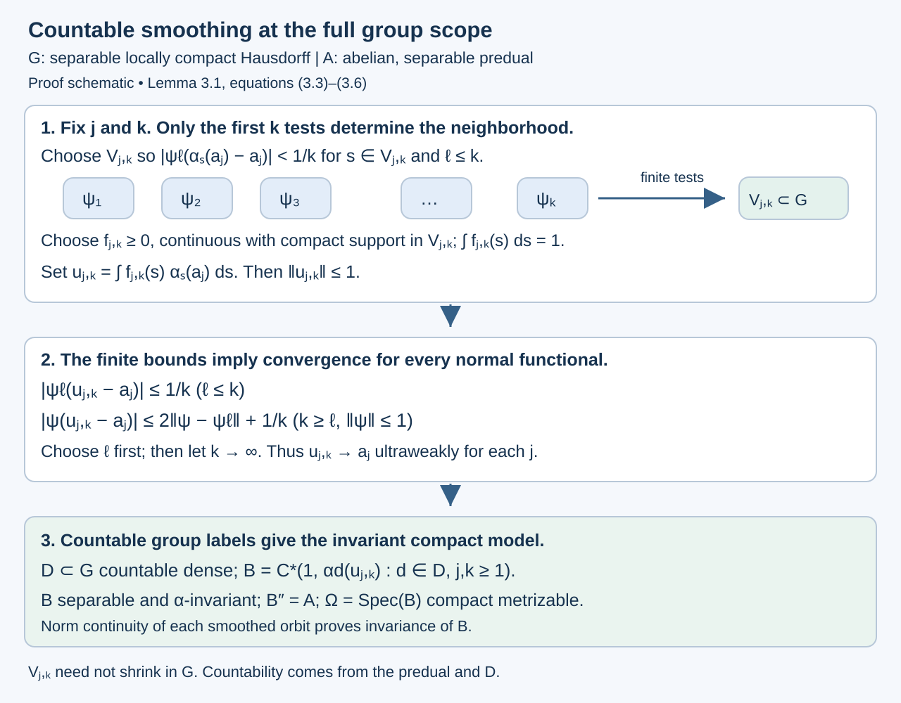

# Measurable actions and compact models

*Written by GPT-6.1 Sol (OpenAI), Ultra, September 2026. New original text is public domain (CC0).*

## Introduction

A measurable action need not move points continuously. Nevertheless it moves the functions in its abelian von Neumann algebra continuously in the appropriate operator topology. Conversely, a continuous action on an abelian von Neumann algebra with separable predual can be represented by homeomorphisms of a compact metrizable space. The measure on that space is nonsingular; it need not be invariant.

This lesson proves both assertions, including the measure derivative and the extension from continuous functions to the whole von Neumann algebra. We first prove the positive-measure Radon–Nikodym theorem and then construct the jointly measurable derivative using finite partitions. The elementary measure-theory background is integration, monotone convergence, and completeness of \(L^2\). Later sections use standard Borel measure theory, Haar integration, the Gelfand representation of a unital commutative C*-algebra, and the normal GNS representation of a faithful normal state. [Orbits, stabilizers, and relation algebras](orbits-stabilizers-and-relation-algebras.md) explains the distinction between nonsingularity and invariance. [Haar averages and compact translation control](haar-averages-and-compact-translation-control.md) uses the same translation and convolution conventions.

From Section 2 onward, \(G\) is a second countable locally compact Hausdorff group. The derivative construction in Section 1 only requires a measurable group and a countably generated probability space, with a jointly measurable nonsingular action. Haar measure is left Haar measure. Hilbert spaces arising from standard sigma-finite measure spaces are separable. Inner products are linear in the first variable.

## 0. Densities of positive measures

**Theorem 0.1 (Radon–Nikodym).** Let \(\mu,\nu\) be positive sigma-finite measures on the same sigma-field, with \(\nu\ll\mu\). There is a measurable \(g\geq0\), finite \(\mu\)-almost everywhere, such that
\[
\nu(E)=\int_E g\,d\mu
\quad\text{for every measurable }E.
\tag{0.1}
\]
It is unique up to \(\mu\)-null sets. If the measures are equivalent, then \(g>0\) almost everywhere. For measures on a Borel sigma-field, the representative can be chosen Borel.

*Proof.* First suppose both measures are finite and put \(\sigma=\mu+\nu\). On the real Hilbert space \(L^2(\sigma)\), the functional
\[
L(f)=\int f\,d\nu
\quad\text{satisfies}\quad
|L(f)|\leq\nu(X)^{1/2}\|f\|_{L^2(\sigma)}.
\tag{0.2}
\]
Here \(\nu\leq\sigma\), so the integral is independent of the \(\sigma\)-almost everywhere representative. We give the Hilbert-space representation argument. If \(L=0\), take \(h=0\). Otherwise the closed affine set \(\{z:L(z)=1\}\) has a positive infimum \(d\) of norms, by (0.2). A minimizing sequence is Cauchy: its midpoint remains in this set, and the parallelogram identity gives
\[
\|z_j-z_k\|^2
\leq2\|z_j\|^2+2\|z_k\|^2-4d^2\longrightarrow0.
\]
Completeness gives a minimizer \(z_0\). For \(w\in\ker L\), minimizing \(\|z_0+tw\|^2\) over real \(t\) shows \(z_0\perp w\). Since \(f-L(f)z_0\in\ker L\), the vector \(h=z_0/\|z_0\|^2\) satisfies \(L(f)=\langle f,h\rangle\).

Apply this identity to every indicator. We obtain \(\nu(E)=\int_E h\,d\sigma\). Since \(0\leq\nu(E)\leq\sigma(E)\), testing the sets where \(h<0\) or \(h>1\), and then their subsets bounded away from the endpoints, proves \(0\leq h\leq1\) almost everywhere. Choose such a representative. Subtracting the two finite measure identities gives
\[
d\nu=h\,d\sigma,\qquad d\mu=(1-h)\,d\sigma.
\tag{0.3}
\]
The set \(\{h=1\}\) is \(\mu\)-null, hence \(\nu\)-null by absolute continuity and therefore \(\sigma\)-null. Define \(g=h/(1-h)\) on \(\{h<1\}\) and zero on the remaining null set. Equation (0.3), extended from indicators to positive functions by monotone integration, proves (0.1). In particular \(g\) is finite almost everywhere.

For sigma-finite measures, intersect their two countable finite-measure covers and disjointify the resulting cover. This gives a measurable partition \((E_k)\) on which both measures are finite. Apply the finite result to their restrictions and paste the densities on the disjoint sets \(E_k\). Countable additivity proves (0.1), including sets of infinite measure.

If two densities give the same measure, restrict to \(E_k\) and test sets where one exceeds the other by at least \(1/m\); their integrals force these sets to be null. Their countable union proves uniqueness. Finally \(\nu(\{g=0\})=0\), so equivalence forces \(\mu(\{g=0\})=0\). All steps use the given sigma-field; for Borel measures all representatives and pasted sets can therefore be Borel. A completion-measurable representative can equally be replaced by a Borel one, by replacing its countably many rational level sets modulo null sets. \(\square\)

The Hilbert-space route to the Radon–Nikodym theorem is associated with John von Neumann. Sheldon Axler, *Measure, Integration & Real Analysis*, Theorem 9.36, printed pages 272–274 in the author’s 12 June 2026 version, gives this route for finite positive target measures and then real and complex measures. Theorem 0.1 supplies the positive-measure form needed here with both measures sigma-finite, including infinite target mass, and includes the Hilbert minimization argument. [Axler’s author-hosted text](https://measure.axler.net/MIRA.pdf) is available under CC BY-NC 4.0, subject to its stated third-party exceptions; it is supplementary reading, while the complete proof used here is above.

The finite proof has a useful bounded intermediate density: \(d\nu/d(\mu+\nu)\) lies in \([0,1]\). This avoids applying an unbounded-density convergence theorem in the parameter construction below. The same theorem supplies the derivatives of partial orbit maps and of the two counting measures in [Relation kernels and modular coordinates](relation-kernels-and-modular-coordinates.md).

## 1. A jointly measurable derivative

Let \(G\) be a measurable group: multiplication and inversion are measurable for its sigma-field and the corresponding product sigma-field. Let it act on a countably generated probability space \((X,\Sigma,\mu)\). Assume the action is jointly measurable and each \(s\) is a nonsingular measurable bijection. In the Borel setting all the measurable maps below are Borel. Set
\[
\mu_s=s_*\mu,\qquad
r_s=\frac{d\mu_s}{d\mu}.
\tag{1.1}
\]
This convention uses pushforward: \(\mu_s(B)=\mu(s^{-1}B)\).

**Lemma 1.1.** There is a positive finite jointly measurable function \(r(s,x)\) representing \(r_s(x)\) for every fixed \(s\); it is jointly Borel in the Borel setting. For each fixed pair \(s,t\),
\[
r_{st}(x)=r_s(x)r_t(s^{-1}x)
\quad\text{for almost every }x.
\tag{1.2}
\]

*Proof.* Choose a countable measurable generating family for \(\Sigma\), and let \(\mathcal P_n\) be its increasing finite partitions. For a cell \(C\in\mathcal P_n\), the function
\[
s\longmapsto\mu_s(C)=\int_X\mathbf1_C(sx)\,d\mu(x)
\]
is measurable by parameter integration. Therefore
\[
h_n(s,x)=\sum_{\substack{C\in\mathcal P_n\\\mu(C)+\mu_s(C)>0}}
\frac{\mu_s(C)}{\mu(C)+\mu_s(C)}\mathbf1_C(x)
\tag{1.3}
\]
is jointly measurable and lies in \([0,1]\). For fixed \(s\), let \(\sigma_s=\mu+\mu_s\) and let \(h_s=d\mu_s/d\sigma_s\), supplied by Theorem 0.1. The function \(h_n(s,\cdot)\) is the orthogonal projection of \(h_s\) onto the finite-dimensional space of \(\mathcal P_n\)-simple functions in \(L^2(\sigma_s)\): its average on every cell is the fraction in (1.3). These spaces have dense union. Indeed their closed linear span contains the indicators of the generating Boolean algebra; bounded monotone limits of such functions converge in \(L^2(\sigma_s)\), so the monotone-class theorem gives every measurable indicator, and then every \(L^2\) function by simple approximation. Orthogonal projections onto increasing dense spaces converge in norm: approximate the target by a vector in one space and use the contraction bound for the later projections. Thus \(h_n(s,\cdot)\to h_s\) in \(L^2(\sigma_s)\).

We select a pointwise convergent subsequence without making an unmeasurable choice of \(h_s\). For integers \(a,b\), the quantity
\[
d_{a,b}(s)=\|h_a(s,\cdot)-h_b(s,\cdot)\|_{L^2(\sigma_s)}^2
\tag{1.4}
\]
is measurable: evaluate the finite sum on the cells of \(\mathcal P_{\max(a,b)}\), whose weights are \(\mu(C)+\mu_s(C)\). Recursively choose \(N_m(s)>N_{m-1}(s)\) to be the least integer \(N\) such that
\[
d_{a,b}(s)\leq2^{-4m}\quad\text{for all integers }a,b\geq N,
\tag{1.5}
\]
starting with \(N_0=0\). It exists by the Cauchy property. The tests are countable intersections of measurable conditions, so every integer-valued \(N_m\) is measurable. Consequently \(h_{N_m(s)}(s,x)\) is jointly measurable.

For fixed \(s\), successive terms have \(L^2(\sigma_s)\) distance at most \(2^{-2m}\), hence \(L^1(\sigma_s)\) distance at most \(\sqrt2\,2^{-2m}\), since \(\sigma_s(X)=2\). Tonelli makes the sum of their absolute pointwise differences finite almost everywhere. Their pointwise limit therefore exists and equals \(h_s\), by their \(L^2\) convergence. Define \(h(s,x)\) to be this limit where it exists and zero otherwise; existence and the limit are measurable conditions. Equivalence of \(\mu_s\) and \(\mu\), together with (0.3), gives \(0<h_s<1\) almost everywhere. Set
\[
r(s,x)=\begin{cases}h(s,x)/(1-h(s,x)),&0<h(s,x)<1,\\1,&\text{otherwise}.\end{cases}
\tag{1.6}
\]
This is positive finite and jointly measurable everywhere, and represents \(d\mu_s/d\mu\) for each fixed \(s\). Its exceptional set is allowed to depend on \(s\).

For a bounded nonnegative measurable \(f\), pushforward and change of variables give
\[
\begin{aligned}
\int f(x)\,d\mu_{st}(x)
&=\int f(sy)\,d\mu_t(y)\\
&=\int f(sy)r_t(y)\,d\mu(y)\\
&=\int f(x)r_t(s^{-1}x)r_s(x)\,d\mu(x).
\end{aligned}
\]
Uniqueness of the derivative proves (1.2). This is a fixed-pair identity; it makes no claim about a single exceptional set valid for an uncountable group. \(\square\)

## 2. Why measurable unitary representations are continuous

Define on \(K=L^2(X,\mu)\)
\[
(U_s\xi)(x)=r_s(x)^{1/2}\xi(s^{-1}x).
\tag{2.1}
\]
Its norm is \(\|\xi\|_2\), by (1.1), and (1.2) gives \(U_sU_t=U_{st}\). Thus it is a unitary representation as an operator identity, independently of choices on the derivative's exceptional sets.

**Lemma 2.1.** A unitary representation \(s\mapsto U_s\) on a separable Hilbert space is strongly continuous if every matrix coefficient \(s\mapsto\langle U_s\xi,\eta\rangle\) is Borel.

*Proof.* Separability makes \(s\mapsto U_s\xi\) a Borel Hilbert-valued map: its coordinates in a countable orthonormal basis are Borel, and open balls can be detected by the countable sums of the squared coordinates. For \(f\in L^1(G)\), the Bochner integral
\[
U(f)\xi=\int_Gf(s)U_s\xi\,ds
\]
exists and has norm at most \(\|f\|_1\|\xi\|\). Left Haar change of variables gives
\[
U_tU(f)=U(L_tf),\qquad (L_tf)(s)=f(t^{-1}s).
\]
Translation is norm continuous in \(L^1(G)\). Indeed it is so for continuous compactly supported functions, by uniform continuity on a compact neighbourhood of their support and domination by a finite-measure compact set; their \(L^1\) density and isometry of translations give the general statement. Consequently \(t\mapsto U_t\zeta\) is continuous for every vector \(\zeta\) in the span of the ranges of \(U(f)\).

That span is dense. If \(\eta\) is orthogonal to it, then
\[
\int_Gf(s)\langle U_s\xi,\eta\rangle\,ds=0
\quad(f\in L^1(G),\ \xi\in K).
\]
For a countable dense family \(\xi_j\), every corresponding coefficient is zero outside a Haar null set. Outside their union, all \(U_s\xi_j\) are orthogonal to \(\eta\). Since \(U_s\) is onto and the family is dense, this forces \(\eta=0\). The common complement is nonempty because Haar measure is nonzero. Finally approximation by the dense span and \(\|U_t\|=1\) extend strong continuity to every vector. \(\square\)

**Theorem 2.2.** The action
\[
\alpha_s(f)(x)=f(s^{-1}x)
\tag{2.2}
\]
is a continuous action on \(L^\infty(X,\mu)\): each orbit is sigma-strong* continuous.

*Proof.* The coefficient of (2.1) is
\[
\int_Xr(s,x)^{1/2}\xi(s^{-1}x)\overline{\eta(x)}\,d\mu(x).
\]
It is Borel by Lemma 1.1 and parameter integration, using Borel representatives for \(\xi,\eta\). Absolute integrability for each parameter follows from Cauchy–Schwarz and unitarity. Lemma 2.1 gives strong continuity of \(U_s\). Multiplication operators satisfy
\[
M_{\alpha_s(f)}=U_sM_fU_s^*.
\tag{2.3}
\]
Thus these operators and their adjoints vary strongly continuously.

For completeness, this is intrinsic sigma-strong* continuity on the abelian algebra. Taking the vector one in (2.3) gives \(L^2(\mu)\) continuity of \(\alpha_s(f)\). Every positive normal functional is integration against some \(h\in L^1(\mu)_+\). Since the functions are uniformly bounded, truncating \(h\) to a bounded density shows
\[
\int h|\alpha_s(f)-\alpha_t(f)|^2\,d\mu\longrightarrow0
\quad(s\to t).
\]
The same holds for their complex conjugates. These are the defining seminorms. \(\square\)

For a sigma-finite base, replace \(\mu\) by an equivalent probability. This preserves \(L^\infty\) and its normal functionals as an abstract von Neumann algebra. The theorem consequently holds for every nonzero standard sigma-finite nonsingular action.

**Example 2.3.** On \(\mathbb R\), give the translation action the standard Gaussian probability. Its derivative is
\[
r_t(x)=\exp(tx-t^2/2),\qquad
(U_t\xi)(x)=\exp(tx/2-t^2/4)\xi(x-t).
\]
The action is nonsingular and strongly continuous, although the Gaussian measure is not translation invariant. The square-root factor is indispensable for unitarity.

**Proposition 2.4 (the separable locally compact convention).** The continuity result of Theorem 2.2 and the compact-model construction of Theorem 4.1 also hold when \(G\) is a separable locally compact Hausdorff group, without assuming second countability of \(G\).

*Proof.* Such a group has sigma-finite Haar measure. If \(D\) is a countable dense subset and \(V\) a relatively compact nonempty open neighborhood of the identity, then \(DV=G\): for \(x\in G\), the open set \(xV^{-1}\) meets \(D\). Thus countably many translates of \(\overline V\) cover the group.

In the jointly measurable derivative proof of Lemma 1.1, the finite partitions and their Borel subsequence limits come from the standard base \(X\), not from a countable basis of \(G\). Parameter integration remains Borel for a parameter in \(G\). To justify the product sigma-field if joint Borel measurability is stated topologically, give \(X\) a Polish realization: every open subset of \(G\times X\) is a countable union of rectangles with its second factor from a countable basis of \(X\), grouping their open first factors. Hence its Borel sigma-field is the product Borel sigma-field. The same simple-function parameter integration and Borel limits in Lemma 1.1 therefore give the joint derivative here.

The Hilbert space \(L^2(X)\) is still separable. Lemma 2.1's proof only uses this separability, Haar integration, and norm continuity of translations on \(L^1(G)\). The latter follows from \(C_c(G)\) density and continuity on compact neighborhoods for a locally compact group. The integrated-vector argument then proves strong continuity, and Theorem 2.2's functional truncation proves sigma-strong* continuity exactly as before.

Finally Lemma 3.1 uses a countable dense set of group elements and norm-continuous smoothed orbits to construct \(B\). Separability of \(G\) supplies that dense set. Its countable smoothing construction uses finitely many predual tests at a time, rather than a sequence of neighborhoods shrinking in \(G\). Thus its generation and compact-spectrum arguments, and all the steps in Theorem 4.1, apply here. The resulting compact space is metrizable because \(B\) is separable, regardless of the original group's topology. \(\square\)

## 3. Building a separable continuous-function algebra

Let \(A\ne0\) be an abelian von Neumann algebra with separable predual. Suppose \(\alpha:G\to\operatorname{Aut}(A)\) is pointwise sigma-strong* continuous. Define its norm-continuous part
\[
A_c=\{a\in A:\|\alpha_s(a)-a\|\to0\text{ as }s\to e\}.
\tag{3.1}
\]
It is a unital C*-subalgebra, invariant under \(\alpha\): the product estimate follows from
\[
\|\alpha_s(ab)-ab\|
\leq\|a\|\|\alpha_s(b)-b\|+\|\alpha_s(a)-a\|\|b\|,
\]
and limits, adjoints, and sums satisfy the same condition. Continuity at the identity implies continuity at every group element.

For \(f\in C_c(G)\) and \(a\in A\), define the ultraweak integral
\[
\alpha_f(a)=\int_G f(s)\alpha_s(a)\,ds.
\tag{3.2}
\]
It exists by pairing with the predual, and \(\|\alpha_f(a)\|\leq\|f\|_1\|a\|\).

**Lemma 3.1.** There is a separable unital \(\alpha\)-invariant C*-subalgebra \(B\subset A_c\) with \(B''=A\) in a faithful normal representation of \(A\).

*Proof.* We give this construction for every separable locally compact Hausdorff \(G\), so it also proves the model assertion in Proposition 2.4. Change of variables gives
\[
\alpha_t(\alpha_f(a))=\alpha_{L_tf}(a).
\]
The \(L^1\) translation estimate proves that every \(\alpha_f(a)\) lies in \(A_c\).

Choose a countable ultraweakly dense set \(a_j\) in the unit ball of \(A\); such a set exists because that ball is compact metrizable in the ultraweak topology. Choose also a norm-dense sequence \(\psi_\ell\) in the unit ball of \(A_*\). For every \(j,k\geq1\), continuity of the finitely many scalar functions \(s\mapsto\psi_\ell(\alpha_s(a_j))\), \(\ell\leq k\), gives an open identity neighborhood \(V_{j,k}\) such that
\[
|\psi_\ell(\alpha_s(a_j)-a_j)|<1/k
\quad(s\in V_{j,k},\ \ell\leq k).
\tag{3.4}
\]
Choose \(f_{j,k}\in C_c(G)_+\) with support in \(V_{j,k}\) and integral one. To obtain it, take a nonzero nonnegative continuous bump supported in that open neighborhood and divide by its positive Haar integral; local compactness and positivity of Haar measure on nonempty open sets supply these properties. Set \(u_{j,k}=\alpha_{f_{j,k}}(a_j)\). Then
\[
\|u_{j,k}\|\leq1,\qquad
|\psi_\ell(u_{j,k}-a_j)|\leq1/k\quad(\ell\leq k).
\tag{3.5}
\]
For every fixed \(\ell\) the second bound tends to zero. For an arbitrary unit-ball \(\psi\in A_*\), approximation by a \(\psi_\ell\) and the uniform bound give
\[
|\psi(u_{j,k}-a_j)|
\leq2\|\psi-\psi_\ell\|+1/k
\quad(k\geq\ell).
\tag{3.6}
\]
First choose \(\ell\) to make the first term small, then let \(k\) tend to infinity. Scaling covers every predual functional. Thus \(u_{j,k}\to a_j\) ultraweakly for each \(j\). The countable family \(u_{j,k}\) consequently generates \(A\) as a von Neumann algebra. No countable neighborhood basis in \(G\) was used.

Let \(D\) be a countable dense subset of \(G\), and take
\[
B=C^*(1,\ \alpha_d(u_{j,k}):d\in D,\ j,k\geq1).
\tag{3.3}
\]
It is separable. For any \(s\in G\), norm continuity of each orbit makes \(\alpha_s(u_{j,k})\) a norm limit of \(\alpha_d(u_{j,k})\)'s. The same applies to \(\alpha_s\alpha_d(u_{j,k})=\alpha_{sd}(u_{j,k})\). Thus \(\alpha_s(B)\subset B\); applying this to \(s^{-1}\) gives equality. It contains all the \(u_{j,k}\), and hence \(B''=A\). \(\square\)

*Figure 1.* For each \(a_j\), stage \(k\) controls the first \(k\) predual tests by (3.4)–(3.5). The bound (3.6) extends their convergence to every normal functional. The neighborhoods \(V_{j,k}\) are allowed to depend on both indices and need not shrink to the identity. The countable dense set \(D\subset G\) then supplies the invariant separable algebra (3.3). This is the exact construction in Lemma 3.1; it preserves Takesaki's separable locally compact group scope [Takesaki, XIII.1, Proposition 1.2, printed pp. 3–4].

## 4. The compact space and its nonsingular measure

**Theorem 4.1.** There are a compact metrizable space \(\Omega\), a finite Radon probability \(m\) of full support, a jointly continuous action \(T:G\times\Omega\to\Omega\) by homeomorphisms, and a normal isomorphism
\[
\pi:A\longrightarrow L^\infty(\Omega,m)
\]
such that every \(T_s\) is nonsingular and
\[
\pi(\alpha_s(a))(\omega)=\pi(a)(T_s^{-1}\omega)
\quad\text{almost everywhere},\qquad a\in A.
\tag{4.1}
\]

*Proof.* Take \(B\) from Lemma 3.1 and let \(\Omega=\operatorname{Spec}(B)\), the character space. The unital Gelfand theorem identifies \(B\) with \(C(\Omega)\). It is compact and Hausdorff; separability of \(B\) makes it metrizable. Define
\[
(T_s\omega)(b)=\omega(\alpha_{s^{-1}}(b)).
\tag{4.2}
\]
This is an action by homeomorphisms. It is jointly continuous: if \(s_i\to s\) and \(\omega_i\to\omega\), then for each \(b\in B\),
\[
\begin{aligned}
|(T_{s_i}\omega_i)(b)-(T_s\omega)(b)|
&\leq\|\alpha_{s_i^{-1}}(b)-\alpha_{s^{-1}}(b)\|\\
&\quad+|\omega_i(\alpha_{s^{-1}}(b))-\omega(\alpha_{s^{-1}}(b))|,
\end{aligned}
\]
which tends to zero.

Choose a faithful normal state \(\varphi\) on \(A\). Existence follows by summing a countable norm-dense family of positive normal functionals with positive summable coefficients and normalizing; Exercise 5.4 gives the details. Its restriction to \(B=C(\Omega)\) gives a Radon probability \(m\) by the Riesz representation theorem. It has full support: every nonempty open set contains a nonzero positive continuous function supported there, and faithfulness makes its integral positive.

We justify the extension to \(A\). In the normal GNS representation of \(\varphi\), write \(\Omega_\varphi\) for its cyclic vector. The subspace \(B\Omega_\varphi\) is dense. Indeed a vector orthogonal to it defines a normal vector functional vanishing on \(B\); ultraweak density makes the functional vanish on \(A\), and cyclicity makes the vector zero. The isometry
\[
b\Omega_\varphi\longmapsto\widehat b\in L^2(\Omega,m)
\tag{4.3}
\]
has dense target range because continuous functions are dense in \(L^2\) for a finite Radon measure on a compact metrizable space. Thus it extends to a unitary.

It conjugates multiplication by \(B\) to multiplication by \(C(\Omega)\). The generated von Neumann algebra on the latter side is \(L^\infty(\Omega,m)\): continuous functions generate the Borel sigma-field, and regularity supplies bounded measurable multiplication limits. On the former side it is the faithful normal image of \(A\), because \(B''=A\). This gives the normal isomorphism \(\pi\), rather than merely a representation of \(B\).

Finally, \((T_s)_*m\) agrees on continuous functions with the normal state \(\varphi\circ\alpha_{s^{-1}}\), transported by \(\pi\). The latter has an \(L^1(m)\) density, which is strictly positive almost everywhere because the state is faithful. Equality on continuous functions determines the finite Radon measure. Hence \((T_s)_*m\) and \(m\) are equivalent: \(T_s\) is nonsingular. Formula (4.1) follows first on \(B\) from (4.2), then on \(A\) by normality and ultraweak density. \(\square\)

The model is not unique. One may enlarge \(B\), changing its compact spectrum while preserving the measured von Neumann system. A normal algebra isomorphism initially intertwines each fixed group element almost everywhere. Theorem 4.4 below produces a common invariant conull set with simultaneous pointwise intertwining; it uses joint measurability and continuity of the compact target action.

**Proposition 4.2 (an invariant-measure obstruction).** Suppose a subgroup \(H\subset G\) preserves a nonzero sigma-finite base measure \(\mu\), and its only invariant bounded measurable functions are constants. Then every equivalent sigma-finite \(G\)-invariant measure is a positive scalar multiple of \(\mu\). In particular, if any element of \(G\) fails to preserve \(\mu\), no such measure exists.

*Proof.* An equivalent sigma-finite measure is \(q\mu\), with \(0<q<\infty\) almost everywhere. If both measures are invariant under \(h\in H\), change of variables gives \(q(hx)=q(x)\) almost everywhere. The bounded function \(q/(1+q)\) is therefore fixed by each \(h\) as an element of \(L^\infty\). The assumed invariant-algebra condition makes it constant, so \(q\) is a positive constant. This argument needs no common pointwise exceptional set over \(H\). \(\square\)

**Example 4.3 (affine dilations with dense translations).** Fix \(0<\lambda<1\) and let
\[
D_\lambda=\sum_{n\in\mathbb Z}\mathbb Q\lambda^n,
\qquad
\Gamma_\lambda=\{x\mapsto\lambda^n x+b:n\in\mathbb Z,\ b\in D_\lambda\}.
\tag{4.4}
\]
The sum is algebraic, so \(D_\lambda\) and \(\Gamma_\lambda\) are countable. Give the group the discrete topology and the line Lebesgue measure. It is a nonsingular action and is free after deleting a countable invariant null set: a nonidentity affine transformation has at most one fixed point. Its rational translations are already ergodic.

Here is a proof of that last assertion. If a bounded measurable function is invariant under all rational translations, convolution with any continuous compactly supported kernel is continuous and rational-translation invariant, hence constant by density of \(\mathbb Q\). Convolution with a positive approximate identity converges to the function in \(L^1\) on bounded intervals. The constant convolutions therefore make the original function constant almost everywhere. Applying this to invariant indicators proves ergodicity.

Rational translations preserve Lebesgue measure, while the dilation by \(\lambda\) changes it. Proposition 4.2 rules out any equivalent sigma-finite invariant measure. The countable relation factor is consequently type III by [Diagonal expectations and invariant measures](diagonal-expectations-and-invariant-measures.md), Theorem 5.4.

We can also compute the asymptotic ratio set defined in [Relation kernels and modular coordinates](relation-kernels-and-modular-coordinates.md). The arrow derivative for \(x\mapsto\lambda^n x+b\) is \(\lambda^n\). For every Borel set \(E\) of positive measure and every integer \(n\), some rational \(b\) satisfies
\[
\mu\{x\in E:\lambda^n x+b\in E\}>0.
\tag{4.5}
\]
To prove this, replace \(E\) by a bounded subset of finite positive measure. As a function of real \(b\), the left side is continuous: its translated indicator is paired with another \(L^2\) indicator, and translations are continuous in \(L^2(\mathbb R)\). Its integral over \(b\) equals \(\mu(E)^2>0\) by Tonelli. Hence it is positive on a nonempty open set, which contains a rational number. This proves (4.5).

Thus every reduced positive-measure relation has every \(\lambda^n\) in the essential range of its derivative. All derivative values belong to that same set. Taking closures gives
\[
r_\infty(R_{\Gamma_\lambda},\mu)=\{0\}\cup\{\lambda^n:n\in\mathbb Z\}.
\tag{4.6}
\]
Formula (4.6) computes the measured ratio set directly. [Ratio sets and intrinsic modular spectra](ratio-sets-and-intrinsic-modular-spectra.md), Theorem 3.1 and Corollary 4.1, identifies it with the intrinsic factor spectrum and proves this example has type \(III_\lambda\).

**Theorem 4.4 (simultaneous point realization).** Let a second countable locally compact group \(G\) act jointly Borel and nonsingularly on a standard sigma-finite measured space \(X\). Let it act continuously on a compact metrizable space \(\Omega\), with a finite nonsingular measure \(m\). If a normal isomorphism of their \(L^\infty\) algebras intertwines the actions, then it is realized by a measure-class Borel isomorphism
\[
\widetilde\phi:X_0\longrightarrow Y_0\subset\Omega
\tag{4.7}
\]
between invariant conull Borel sets, satisfying
\[
\widetilde\phi(sx)=s\widetilde\phi(x)
\quad\text{for every }s\in G\text{ and }x\in X_0.
\tag{4.8}
\]
Here \(m\) is taken in the measure class specified by the algebra isomorphism. In particular the compact model in Theorem 4.1 has this point realization.

*Proof.* The zero-measure case is empty. Otherwise use an equivalent probability on \(X\). By the normal \(L^\infty\) isomorphism theorem, choose a measure-class Borel isomorphism \(\phi\) between conull Borel subsets. Extend it to a Borel map on all of \(X\) by any fixed target value. For each fixed \(t\in G\), algebraic intertwining, tested on a countable family of continuous functions separating points of \(\Omega\), gives
\[
\phi(tx)=t\phi(x)\quad\text{for almost every }x.
\tag{4.9}
\]
Its exceptional set can depend on \(t\).

Choose a strictly positive Borel density \(k\) on \(G\) with \(\int k(t)\,dt=1\), possible because Haar measure is sigma-finite. Set
\[
F_x(t)=t^{-1}\phi(tx).
\tag{4.10}
\]
This is jointly Borel. Fubini applied to (4.9) says that, for almost every \(x\), \(F_x(t)=\phi(x)\) for Haar-almost every \(t\).

The set \(Z\) where \(F_x\) is essentially constant is Borel, and its constant is a Borel function of \(x\). Here are explicit tests. Choose continuous \(f_j:\Omega\to[0,1]\) separating points. Their coordinate map \(\kappa:\Omega\to[0,1]^{\mathbb N}\) is a homeomorphism onto a compact, hence closed, image. Define
\[
q_j(x)=\int k(t)f_j(F_x(t))\,dt.
\tag{4.11}
\]
Each \(q_j\) is Borel. Membership in \(Z\) is exactly the two Borel conditions
\[
q(x)\in\kappa(\Omega),\qquad
\int k(t)|f_j(F_x(t))-q_j(x)|^2\,dt=0\quad(j\geq1).
\tag{4.12}
\]
Indeed these conditions and countable separation make \(F_x(t)=\kappa^{-1}(q(x))\) almost everywhere; a constant plainly passes the tests. Put \(\widetilde\phi(x)=\kappa^{-1}(q(x))\) on \(Z\). The set is conull and \(\widetilde\phi=\phi\) almost everywhere.

For every \(s,t\) and \(x\) we have the exact identity
\[
F_{sx}(t)=sF_x(ts).
\tag{4.13}
\]
Right translation preserves the Haar measure class, even in a nonunimodular group. Hence if \(F_x\) is essentially constant with value \(\widetilde\phi(x)\), then \(F_{sx}\) is essentially constant with value \(s\widetilde\phi(x)\). Thus \(Z\) is invariant under every \(s\), and (4.8) holds there. This argument uses a change of variable in the Haar parameter, rather than a union of exceptional sets indexed by \(G\).

It remains to make the map injective on an invariant conull set. Choose a conull Borel \(E\subset Z\) where \(\widetilde\phi=\phi\) and the original \(\phi\) is injective. Define
\[
Z_E=\{x:tx\in E\text{ for Haar-almost every }t\}
=\left\{x:\int k(t)\mathbf1_E(tx)\,dt=1\right\}.
\tag{4.14}
\]
It is Borel and conull by Fubini and nonsingularity of each transformation. It is invariant: \(t(sx)=(ts)x\), and right translation preserves Haar null sets. Set \(X_0=Z\cap Z_E\).

If \(x,y\in X_0\) have equal \(\widetilde\phi\) values, then for Haar-almost every \(t\), both \(tx,ty\) lie in \(E\), and
\[
\phi(tx)=t\widetilde\phi(x)=t\widetilde\phi(y)=\phi(ty).
\]
There is such a \(t\), since Haar measure is nonzero. Injectivity of \(\phi\) on \(E\) gives \(tx=ty\), and hence \(x=y\). Therefore \(\widetilde\phi\) is Borel and injective on \(X_0\). The one-to-one Borel-image theorem makes \(Y_0=\widetilde\phi(X_0)\) Borel with Borel inverse. Equation (4.8) makes the image invariant. Since \(\widetilde\phi\) agrees with the measure-class isomorphism \(\phi\) almost everywhere, its pushforward measure has the prescribed class, and \(Y_0\) is conull. This proves every assertion. \(\square\)

## 5. Exercises with solutions

Level 1 asks for a computation or a direct application. Level 2 asks for a proof using the lesson’s framework. Level 3 combines results or examines a hypothesis whose failure changes the conclusion.

**Exercise 5.1 (Gaussian translations).** *Level 1.* Derive the density in Example 2.3 and verify \(U_tU_u=U_{t+u}\) directly.

*Solution.* The pushforward Gaussian has density \(\exp(-(x-t)^2/2)/\sqrt{2\pi}\) relative to Lebesgue measure. Dividing by the original density gives \(r_t(x)=\exp(tx-t^2/2)\). The square-root factor in the product is
\[
\exp\bigl(tx/2-t^2/4+u(x-t)/2-u^2/4\bigr)
=\exp\bigl((t+u)x/2-(t+u)^2/4\bigr).
\]
The translated argument is \(x-t-u\), proving the identity. The same density calculation verifies preservation of the \(L^2\) norm.

**Exercise 5.2 (norm continuity is stronger).** *Level 2.* On the circle with Haar probability, rotations act on \(L^\infty\). Show that the indicator of a proper arc is not a norm-continuous vector, and prove that the norm-continuous part is exactly the continuous functions, as equivalence classes.

*Solution.* A sufficiently small nonzero rotation changes the arc on a set of positive measure. Its indicator difference has essential supremum one, so the norm does not tend to zero. For any bounded measurable \(a\), convolution with a continuous Haar approximate identity has a continuous representative: translating the \(L^1\) convolution kernel controls the difference uniformly by \(\|a\|_\infty\). If \(a\) has a norm-continuous rotation orbit, these convolutions converge to \(a\) in \(L^\infty\) norm. Continuous functions are closed for that norm, since on continuous functions essential supremum equals supremum and a uniform limit is continuous. Thus \(a\) has a continuous representative. Conversely uniform continuity on the compact circle gives norm continuity for every continuous function.

**Exercise 5.3 (a finite compact model).** *Level 1.* Let \(A=\mathbb C^n\), with a group action permuting its coordinates. Construct \(\Omega,m,T\) explicitly for a faithful normal state with masses \(p_i>0\).

*Solution.* Take the discrete compact space \(\Omega=\{1,\ldots,n\}\), with \(m(\{i\})=p_i\), and the same permutation action. A continuous action on \(A\) makes the coordinate permutation locally constant in the group parameter: otherwise the norm of the difference on one coordinate projection is one. Thus \(T\) is jointly continuous. Every permutation preserves null sets, since the only null subset is empty. The identity identifies \(A\) with \(L^\infty(\Omega,m)\). The measure is invariant exactly when masses agree along each permutation orbit.

**Exercise 5.4 (a faithful normal state).** *Level 2.* Let \(A\ne0\) have separable predual. Choose a countable norm-dense sequence \(\psi_j\) in the positive unit ball of its predual. Show that \(\sum_j2^{-j}\psi_j\), after normalization, is a faithful normal state.

*Solution.* The series converges in predual norm, so it is a positive normal functional. If \(a\geq0\) is nonzero, some positive normal functional \(\psi\) has \(\psi(a)>0\); normal functionals separate positive elements. Scale \(\psi\) into the positive unit ball. A sufficiently close \(\psi_j\) still has \(\psi_j(a)>0\), since \(|\psi_j(a)-\psi(a)|\leq\|\psi_j-\psi\|\|a\|\). The sum is therefore positive on every nonzero positive element. Its value at one is positive finite, and division by that value gives the faithful normal state.

**Exercise 5.5 (why separability matters).** *Level 3.* On \(K=\ell^2(\mathbb R)\), let \(U_t\delta_x=\delta_{x+t}\), with \(\mathbb R\) carrying its usual topology. Show that all matrix coefficients are Borel but the representation is not strongly continuous. Locate the failed step of Lemma 2.1.

*Solution.* Every \(\ell^2\) vector has countable support. For \(\xi,\eta\), the coefficient is supported on the countable difference set \(\operatorname{supp}(\eta)-\operatorname{supp}(\xi)\); each value is the absolutely convergent sum \(\sum_x\xi(x)\overline{\eta(x+t)}\). Any function supported on a countable subset of \(\mathbb R\) is Borel, because every subset of that support is a countable union of singletons. Yet \(\|U_t\delta_0-\delta_0\|=\sqrt2\) whenever \(t\ne0\). The Hilbert space is nonseparable. The coefficient criterion no longer implies a strongly measurable Hilbert-valued orbit, nor is there a countable dense family allowing the single null-set removal in the proof.

**Exercise 5.6 (all positive rational slopes).** *Level 3.* Let the countable group \(\Gamma\) consist of \(x\mapsto ax+b\) with \(a\in\mathbb Q_{>0}\) and \(b\in\mathbb Q\). Prove that its nonsingular action on the Lebesgue line is ergodic and free almost everywhere, that no equivalent sigma-finite invariant measure exists, and that its asymptotic ratio set is \([0,\infty)\).

*Solution.* Every nonidentity element has either no fixed point or one fixed point; countably many fixed points and their saturations form an invariant null set. Rational translations give ergodicity by the convolution argument in Example 4.3. Proposition 4.2 applies to that subgroup and the dilation by two, ruling out an invariant measure. For any positive-measure \(E\) and fixed rational slope \(a>0\), the proof of (4.5), with \(a\) in place of \(\lambda^n\), supplies a rational translation whose graph meets \(E\times E\) in positive counting measure. Its derivative is \(a\). Every reduced derivative therefore has all positive rationals in its essential range. Their closure is \([0,\infty)\), and a positive derivative has no spectrum outside that set. Intersecting the ranges gives the asserted ratio set. The associated relation factor is type III by the invariant-measure criterion. Theorem 3.1 and Corollary 4.1 of [Ratio sets and intrinsic modular spectra](ratio-sets-and-intrinsic-modular-spectra.md) now identify its intrinsic spectrum and give the precise subtype \(III_1\).

**Exercise 5.7 (right translation of a conull Haar set).** *Level 2.* In Theorem 4.4, prove that \(Z_E\) is invariant even when \(G\) is nonunimodular and the chosen probability density \(k\) is not translation invariant.

*Solution.* Since \(k>0\), the equality in (4.14) is equivalent to the set \(\{t:tx\notin E\}\) being Haar-null. For \(sx\) this set is \(\{t:(ts)x\notin E\}\), a right translate of the original exceptional set. Right translation multiplies left Haar measure by a positive constant, so it preserves null sets. The new integral is therefore again one. The numerical density \(k\) need not be invariant; only its equivalence to Haar measure is used. Applying the same argument with \(s^{-1}\) proves equality of the translated sets \(sZ_E=Z_E\).

**Exercise 5.8 (a group without a shrinking neighborhood sequence).** *Level 3.* Give \(G=\{-1,1\}^{\mathbb R}\) its product topology and coordinatewise multiplication. Prove that it is a separable compact Hausdorff group, but that no sequence of identity neighborhoods has intersection \(\{e\}\). Explain how Lemma 3.1 still constructs a compact model, and give one for the trivial action on \(A=L^\infty([0,1],dx)\).

*Solution.* Each two-point factor is compact Hausdorff; the product theorem makes \(G\) compact Hausdorff, and its multiplication and inverse are continuous coordinatewise. In particular it is locally compact. For a finite union \(E\) of bounded open intervals with rational endpoints, define \(d_E(r)=-1\) on \(E\) and \(+1\) outside. There are countably many such unions, including the empty union. They yield a dense set: a basic cylinder prescribes signs at finitely many distinct real coordinates; around each coordinate requiring \(-1\), choose a rational-endpoint interval containing that coordinate and excluding all the coordinates requiring \(+1\). Their union realizes the prescribed signs.

For any proposed sequence \(V_n\) of identity neighborhoods, choose inside each \(V_n\) a basic identity cylinder restricting only finitely many coordinates \(F_n\). The set \(S=\bigcup_nF_n\) is countable. Choose \(r\in\mathbb R\setminus S\). The element which is \(-1\) at \(r\) and \(+1\) elsewhere belongs to every chosen cylinder and hence to every \(V_n\), but differs from \(e\). Thus the intersection cannot be \(\{e\}\); in particular \(G\) has no countable neighborhood basis and no shrinking neighborhood sequence of the kind excluded by Lemma 3.1.

That lemma instead chooses \(V_{j,k}\) to control only the first \(k\) predual tests for \(a_j\). The estimate (3.6) proves the required ultraweak convergence even for this \(G\). For the trivial action, take \(B=C([0,1])\subset A\), \(\Omega=[0,1]\), \(m=dx\), and the trivial continuous point action. Continuous functions generate the Borel sigma-field and their bounded multiplication limits generate \(A\), so \(B''=A\). The identity is the normal \(L^\infty\) isomorphism, and every group element preserves \(m\). All smoothing integrals simply return \(a_j\). The target model is metrizable although the acting group is not.

**Exercise 5.9 (an infinite-measure density).** *Level 1.* Let \(\mu\) be counting measure on \(\mathbb N=\{0,1,\ldots\}\), and give \(\nu\) masses \(2^n\). Compute \(h=d\nu/d(\mu+\nu)\) and \(g=d\nu/d\mu\). Are the measures finite or equivalent? Why is the finite-patch step of Theorem 0.1 needed?

*Solution.* At \(n\), the sum measure has mass \(1+2^n\), so \(h(n)=2^n/(1+2^n)\) and \(h(n)/(1-h(n))=2^n=g(n)\). Both measures have infinite total mass but are sigma-finite on their singleton partition. Every singleton has positive mass for both, so their null sets agree. The functional in (0.2) need not be bounded on the whole sum-measure \(L^2\): on the normalized indicator of \(\{n\}\) its value is \(2^n/\sqrt{1+2^n}\), which tends to infinity. The finite-patch proof applies on each singleton and pastes exactly the density above.

**Exercise 5.10 (a measurable subsequence).** *Level 2.* Explain why the integers \(N_m(s)\) in (1.5) are Borel and why \(L^2\) convergence alone would not justify taking the pointwise limit of the whole sequence. State exactly which exceptional-set assertion Lemma 1.1 proves.

*Solution.* For each fixed \(N\), the test in (1.5) is the intersection of the Borel sets \(\{s:d_{a,b}(s)\leq2^{-4m}\}\) over the countably many pairs \(a,b\geq N\). Its intersection with \(\{s:N>N_{m-1}(s)\}\) is Borel by induction. Removing all earlier successful integer tests gives the Borel set \(\{s:N_m(s)=N\}\). The selected successive differences have summable \(L^1(\sigma_s)\) norms, which yields almost everywhere convergence by Tonelli. Norm convergence by itself does not give whole-sequence pointwise convergence: on \([0,1)\), list successively the indicators of all dyadic intervals of length \(2^{-k}\), for \(k=1,2,\ldots\). Their \(L^2\) norms tend to zero, but at each point one indicator per level is one and many others are zero. The lemma proves that for each fixed \(s\), its constructed density is correct off a \(\mu\)-null set which may depend on \(s\). Its cocycle identity holds almost everywhere for each fixed pair \((s,t)\); no common exceptional set for an uncountable group is asserted.

## References

- [Takesaki] Masamichi Takesaki, *Theory of Operator Algebras III*, Encyclopaedia of Mathematical Sciences 127, Springer, 2003. [Publisher record](https://doi.org/10.1007/978-3-662-10453-8).
- The measurable-action and compact-model assertions compared here are Chapter XIII, Propositions 1.1–1.2, printed pp. 2–4 (PDF pp. 22–24 of the supplied edition). The standing group assumption on printed p. 1 is separable locally compact. Lemma 3.1's finite predual tests supply that full scope. The simultaneous point realization in Theorem 4.4 has its separately stated second-countability hypothesis.
