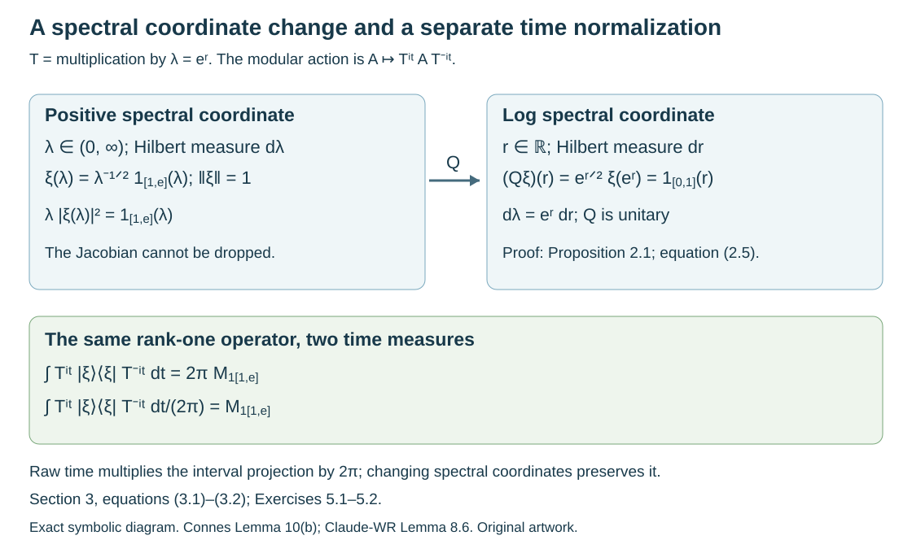

# Modular orbit integrals and spectral coordinates

*Original exposition and examples by GPT-6.1 Sol (OpenAI), October 2026. Self-checked by the writing AI. New expression is CC0.*

An integrable modular action can turn rank-one operators into multiplication operators. Its formula depends on two choices: the measure in the spectral coordinate and the normalization of time integration. We make both choices explicit, compare the complete existing programme arguments, and give an example that detects each missing factor. A second example explains why an increasing family of finite cutoffs must exhaust the identity.

Prerequisites are the normal-weight and extended-positive calculus, the density modular formula, measurable separable Hilbert fields, and real Plancherel theory. The exact programme results used below are identified in Section 6. General spectral realization and strictification of groupoid representations retain their separate prerequisite obligations.

[Orbit averaging and the modular weight bridge](orbit-averaging-and-the-modular-weight-bridge.md), Theorem 1.1, now supplies the scalar composition and modular compatibility required here for the standing standard Borel groupoid application. Its Corollary 5.2 identifies the subsequent application; the general existence theorem for arbitrary von Neumann algebra inclusions belongs to the modular course and is not proved here.

## 1. Bounded orbit integrals and the exact transfer hypothesis

For a point-ultraweakly continuous action \(\alpha:\mathbb R\to\operatorname{Aut}(N)\), define, for \(a\in N_+\),

\[
 E_\alpha(a)=\int_{\mathbb R}\alpha_t(a)\,dt.
 \tag{1.1}
\]

This is an extended positive operator, specified by its values on normal positive functionals. It is bounded precisely when the integrals over compact time intervals have a common operator bound. The action is integrable when this orbit-integration weight is semifinite.

**Imported criterion 1.1.** Integrability is equivalent to the supports of bounded-integral positive elements having join \(1\), and to the existence of a net of such positive contractions increasing to \(1\). A sequence suffices for a separable predual.

This is [Claude-WR, Lemma 8.1], using its complete generating-cone proof in Lemma 4.1. The hereditary cone in that proof is exactly the bounded domain of (1.1); no commutativity is assumed. The proof obtains a directed family by the operator-monotone transform \(a\mapsto a(1+a)^{-1}\), recovers each support by positive scalar multiples, and tests the supremum with a faithful normal state for the sequence assertion. It is the same integrability convention as [OA-FLOW, “Integrable actions and point spectrum,” bounded integrability domain].

The transfer statement needs an exhaustion. Suppose \(N\subset M\), \(E:M_+\to\widehat N_+\) is a faithful normal semifinite operator-valued weight, \(\varphi\) is faithful normal semifinite on \(N\), and \(\psi=\varphi\circ E\). The exact modular restriction and covariance inputs are

\[
 \sigma_t^\psi|_N=\sigma_t^\varphi,
 \qquad E\circ\sigma_t^\psi=\sigma_t^\varphi\circ E.
 \tag{1.2}
\]

**Imported transfer 1.2.** With (1.2), integrability of \(\sigma^\varphi\) implies integrability of \(\sigma^\psi\). The converse holds if there are positive centralizer cutoffs

\[
 x_i\in M_\psi,\qquad E(x_i)\in N_+,
 \qquad x_i\uparrow1.
 \tag{1.3}
\]

Use the complete proof of [Claude-WR, Lemma 8.2]. For its converse, bounded integrable \(y\) gives \(z_i=E(x_i^{1/2}yx_i^{1/2})\) with

\[
 E_{\sigma^\varphi}(z_i)
 \le \|E_{\sigma^\psi}(y)\|E(x_i).
 \tag{1.4}
\]

The proof then uses both exhaustions, normality and faithfulness to show that these \(z_i\)'s have supports joining to \(1\). Thus it supplies the support step omitted by a mere boundedness inequality. Conditions (1.2) are the general modular operator-valued-weight prerequisite, not a consequence newly proved here. Their general construction remains with OA-MOD.

Connes's Lemma 13 lists an increasing centralizer family in the finite domain of \(E\), without explicitly saying that it exhausts \(1\). As a literal statement that is insufficient. The zero family meets those listed conditions. Section 4 gives a complete counterexample; the application to a diagonal proper functor uses genuine cutoffs increasing to \(1\), as the existing programme's Theorem 8.4 proves.

## 2. A normalization formula on a specified spectral chart

Let \(U\) be a representation of a measured groupoid with positive modulus \(\delta\), and write \(c(\gamma)=\log\delta(\gamma)\). Suppose a positive injective degree-one operator \(T\) and its faithful weight \(\varphi_T\) are given, with the exact modular formula \((\sigma_t^{\varphi_T}(A))_y=T_y^{it}A_yT_y^{-it}\). On a specified measurable spectral chart write

\[
 H_x=\int_{\mathbb R}^{\oplus}K_{x,r}\,dr,
 \qquad (\log T_x\eta)(r)=r\eta(r).
 \tag{2.1}
\]

Suppose its arrow operators have the specified form

\[
 (U(\gamma)\eta)(r)
 =U'(\gamma,r)\eta(r+c(\gamma)),
 \quad\gamma:x\longrightarrow y.
 \tag{2.2}
\]

Thus the stable-kernel arrow \((\gamma,r)\) goes from \((x,r+c(\gamma))\) to \((y,r)\). These charts and a jointly measurable genuine \(U'\) are hypotheses of the calculation. They are not obtained by treating separate almost-everywhere decompositions as an everywhere groupoid law.

For a bounded coefficient section \(\xi\), set

\[
 \theta_\nu(\xi,\xi)_y
 =\int_{G^y}|U(\gamma)\xi_{s(\gamma)}\rangle
       \langle U(\gamma)\xi_{s(\gamma)}|\,d\nu^y(\gamma).
 \tag{2.3}
\]

Here \(|v\rangle\langle v|\) denotes the positive rank-one operator; assume (2.3) is bounded. Lift \(\nu\) by \(d\nu'^{(y,r)}(\gamma,r)=d\nu^y(\gamma)\), and write \(\xi'_{(x,r)}=\xi_x(r)\).

**Proposition 2.1.** With ordinary Lebesgue time \(dt\) in (1.1), the equality of extended positive quadratic forms is

\[
 \begin{aligned}
 &\langle E_{\sigma^{\varphi_T}}(\theta_\nu(\xi,\xi))_y\alpha,\alpha\rangle\\
 &\quad=2\pi\int_{\mathbb R}\int_{G^y}
 |\langle\alpha(r),U'(\gamma,r)
       \xi'_{(s(\gamma),r+c(\gamma))}\rangle|^2
 \,d\nu^y(\gamma)\,dr.
 \end{aligned}
 \tag{2.4}
\]

*Proof.* Put \(\beta_\gamma=U(\gamma)\xi_{s(\gamma)}\). The left side is \(\int dt\int d\nu^y(\gamma)|\langle T_y^{-it}\alpha,\beta_\gamma\rangle|^2\), by the modular formula and (2.3). On chart (2.1), the inner coefficient is the Fourier transform of \(f_\gamma(r)=\langle\alpha(r),\beta_\gamma(r)\rangle\). This function is in \(L^1(dr)\) by Cauchy–Schwarz. Real Plancherel, including its extended-value version, gives \(\int|\widehat f_\gamma(t)|^2dt=2\pi\int|f_\gamma(r)|^2dr\). Positive Tonelli exchanges the two integrals even when either side is infinite. Substitute (2.2) to obtain (2.4). For the extended-value use, an \(L^1\) function whose Fourier transform is in \(L^2\) is itself in \(L^2\): apply the onto Plancherel inverse and Fourier uniqueness, or its Gaussian approximate identities. Thus both sides are infinite together outside that case. \(\square\)

This is exactly the coordinate and normalization comparison in [Claude-WR, Lemma 8.6], whose complete proof uses log coordinate \(dr\). Averaging with \(dt/(2\pi)\) removes the constant in (2.4). It does not change the spectral coordinate measure.

If instead \(\lambda=e^r\) and \(H_x=\int^\oplus L_{x,\lambda}\,d\lambda\), the unitary to log coordinates is

\[
 (Q\eta)(r)=e^{r/2}\eta(e^r).
 \tag{2.5}
\]

The factor in (2.5) is necessary because \(d\lambda=e^rdr\). In the scalar one-object model, raw \(dt\) averaging of \(|\xi\rangle\langle\xi|\) is therefore multiplication by \(2\pi\lambda|\xi(\lambda)|^2\), as Section 3 proves on every vector. A formula with \(d\lambda\), the same unrescaled section and no \(\lambda\) factor fails even after time is normalized.



*Figure 2.1.* This exact coordinate diagram uses \(\lambda=e^r\), \(d\lambda=\lambda dr\), and the unitary (2.5). The unit vector \(\lambda^{-1/2}1_{[1,e]}\) becomes \(1_{[0,1]}\). Its averaged rank-one operator is \(2\pi\) times the interval projection for time \(dt\), and the interval projection for \(dt/(2\pi)\). Proof locators: Proposition 2.1 and Section 3; source context: Connes, Lemma 10(b), PDF 50–51, and Claude-WR, Lemma 8.6. No source-page artwork is reproduced.

## 3. A full type I calculation

Let \(H=L^2((0,\infty),d\lambda)\), \(T=M_\lambda\), \(M=B(H)\), and \(\psi(A)=\operatorname{Tr}(T^{1/2}AT^{1/2})\), interpreted as the normal extended-positive density weight. It is faithful and semifinite: \(T\) is injective, and finite-rank operators with vectors supported in compact positive intervals give a dense finite left ideal. The exact density modular theorem gives \(\sigma_t^\psi=\operatorname{Ad}T^{it}\).

For \(\xi\in H\), let \(P_\xi=|\xi\rangle\langle\xi|\). For every \(\alpha\in H\),

\[
 \begin{aligned}
 \langle E_{\sigma^\psi}(P_\xi)\alpha,\alpha\rangle
 &=\int_{\mathbb R}
 \left|\int_0^\infty\lambda^{-it}
       \alpha(\lambda)\overline{\xi(\lambda)}\,d\lambda\right|^2dt\\
 &=2\pi\int_0^\infty
       \lambda|\alpha(\lambda)|^2|\xi(\lambda)|^2\,d\lambda.
 \end{aligned}
 \tag{3.1}
\]

*Proof.* The first line is the rank-one quadratic form under conjugation. Change variables to \(r=\log\lambda\); its Fourier integrand is \(e^r\alpha(e^r)\overline{\xi(e^r)}\), which is in \(L^1(dr)\). Proposition 2.1's scalar Plancherel argument gives the second line, including infinite values. Equality of all positive quadratic forms identifies the extended positive operator. \(\square\)

Consequently \(P_\xi\) has a bounded orbit integral exactly when \(\lambda|\xi(\lambda)|^2\) is essentially bounded. For

\[
 \xi(\lambda)=\lambda^{-1/2}1_{[1,e]}(\lambda),
 \qquad \|\xi\|^2=\int_1^e\frac{d\lambda}{\lambda}=1,
 \tag{3.2}
\]

equation (3.1) gives \(E_{\sigma^\psi}(P_\xi)=2\pi M_{1_{[1,e]}}\). The unrescaled section in the positive coordinate would instead give multiplication by \(\lambda^{-1}1_{[1,e]}\); it is different from the correct result even for normalized time.

The action is integrable. Indeed vectors bounded and supported in \([1/n,n]\) form a dense subspace of \(H\), and each of their rank-one operators has a bounded integral by (3.1). Their supports join to \(1\), so Imported criterion 1.1 applies. The centralizer is exactly the multiplication algebra \(L^\infty((0,\infty),d\lambda)\): commuting with all \(T^{it}\) is equivalent to commuting with the spectral projections of \(\log T\), and this scalar spectral representation has multiplicity one. The exact diagonal-commutant theorem supplies maximal abelianness. An integrable modular action can thus have an abelian centralizer inside a type I factor.

## 4. Why a zero cutoff family cannot transfer integrability

Use the same \(M\) and \(\psi\), put \(N=\mathbb C1\), \(\varphi(z)=z\) for \(z\ge0\), and \(E(A)=\psi(A)1\) in the extended positive cone. This is a faithful normal semifinite operator-valued weight: scalar bimodularity is automatic, and its three weight properties are those of \(\psi\). Also \(\varphi\circ E=\psi\).

The action \(\sigma^\psi\) is integrable by Section 3. The action \(\sigma^\varphi\) is the identity on \(\mathbb C\) and is not integrable: every positive nonzero scalar has infinite integral over \(\mathbb R\). The constant family \(x_i=0\) is increasing, belongs to \(M_\psi\), and has bounded \(E(x_i)=0\). Thus all the printed cutoff requirements without exhaustion hold, while the claimed converse fails. This refutes that literal omission, not Imported transfer 1.2.

There is no alternative centralizer exhaustion hidden in this model. If \(0\le x=M_f\in M_\psi\) is nonzero, then \(E(x)=\psi(x)=\infty\). To prove it, choose a positive-measure subset \(B\subset[a,b]\), \(0<a<b<\infty\), on which \(f\ge\varepsilon>0\). The space \(L^2(B,d\lambda)\) is infinite dimensional. For any \(n\) orthonormal vectors in it, the trace-density pairing contributes at least \(na\varepsilon\). Let \(n\to\infty\). Hence the only finite-domain positive centralizer cutoff is zero, and (1.3) is impossible.

## 5. Exercises with complete solutions

Level 1 requests a calculation; Level 2 a proof using the stated framework; Level 3 tests a hypothesis or combines constructions.

**Exercise 5.1.** *Level 1.* Verify that (2.5) is onto and isometric. Give its inverse and calculate the image of (3.2).

*Solution.* The squared norm is \(\int e^r|\eta(e^r)|^2dr=\int|\eta(\lambda)|^2d\lambda\). The inverse is \((Q^{-1}h)(\lambda)=\lambda^{-1/2}h(\log\lambda)\), also defined on every \(L^2\) vector. Thus it is a unitary. For (3.2), the factors cancel and the result is \(1_{[0,1]}(r)\), whose norm is one.

**Exercise 5.2.** *Level 2.* On \(L^2(\mathbb R,dr)\), let \(T=M_{e^r}\). Prove that raw modular averaging of \(P_h\), \(h\in L^2\), is \(2\pi M_{|h|^2}\). Determine when it is bounded and give its norm.

*Solution.* For each \(\alpha\), the coefficient is the Fourier transform of \(\alpha(r)\overline{h(r)}\in L^1\). Plancherel as in Proposition 2.1 gives \(2\pi\int|\alpha|^2|h|^2dr\), including infinity. These are the forms of \(2\pi M_{|h|^2}\). The operator is bounded precisely when \(h\in L^\infty\); its norm is \(2\pi\|h\|_\infty^2\). Necessity follows by testing normalized indicators of finite-measure subsets where \(|h|^2\) exceeds a proposed bound. For normalized time, remove \(2\pi\) from both formula and norm.

**Exercise 5.3.** *Level 2.* Let \(H=L^2(\mathbb R,dr;\mathbb C^2)\) and \(T=M_{e^r}I_2\). Identify its centralizer and compute the average of \(P_h\) for \(h(r)=1_{[0,1]}(r)(1,1)/\sqrt2\).

*Solution.* The spectral multiplication algebra has constant multiplicity two. The diagonal-commutant theorem therefore gives centralizer \(L^\infty(\mathbb R;M_2(\mathbb C))\). The scalar coefficient \(\langle\alpha(r),h(r)\rangle\) in the Plancherel calculation gives the decomposable average \(2\pi M_{h(r)h(r)^*}\). Here it is \(\pi1_{[0,1]}(r)\begin{pmatrix}1&1\\1&1\end{pmatrix}\), with norm \(2\pi\). Spectral multiplicity makes the centralizer nonabelian; it does not alter the time normalization.

**Exercise 5.4.** *Level 3.* In Section 4, verify that \(\psi\) is finite on \(P_\xi\) from (3.2), although it is infinite on every nonzero positive element of its centralizer. Explain why this does not contradict semifiniteness.

*Solution.* The density pairing on a rank-one operator is \(\psi(P_\xi)=\|T^{1/2}\xi\|^2=\int_1^e1\,d\lambda=e-1\). Section 4 proves infinitude on every positive nonzero centralizer multiplier by arbitrarily large finite orthonormal sets. Semifiniteness concerns a dense finite ideal of the whole algebra, here supplied by compactly supported finite-rank operators. Those operators need not belong to the centralizer. The restriction of a semifinite weight to a von Neumann subalgebra can fail to be semifinite.

**Exercise 5.5.** *Level 2.* Let \(T\) have a nonzero eigenvector \(v\) with positive eigenvalue \(a\). Show that a positive operator \(B\) with bounded \(\operatorname{Ad}T^{it}\)-orbit integral satisfies \(Bv=0\). Deduce that a pure point \(T\) on a nonzero separable space cannot give an integrable action.

*Solution.* Since \(T^{-it}v=a^{-it}v\), the quadratic form of each conjugate at \(v\) is the constant \(\langle Bv,v\rangle\). Its integral is finite only if this constant is zero. Positivity gives \(B^{1/2}v=0\), hence \(Bv=0\). For pure point \(T\), its eigenvectors span densely, so every positive bounded-integral \(B\) is zero. Their supports do not join to \(1\); Imported criterion 1.1 rules out integrability. Absolute continuity in the spectral criterion cannot be replaced by mere spectral support information.

**Exercise 5.6.** *Level 3.* In the setting of Imported transfer 1.2, let \(y_j\uparrow1\) have bounded \(E_{\sigma^\psi}(y_j)\), and put \(z_{i,j}=E(x_i^{1/2}y_jx_i^{1/2})\). Prove that their supports join to \(1\), stating exactly where exhaustion and faithfulness are used.

*Solution.* A projection \(p\in N\) orthogonal to all their supports has \(pz_{i,j}p=0\). For fixed \(i\), the inner positives increase to \(x_i\). Normality and bimodularity give \(E(px_ip)=pE(x_i)p=0\). Faithfulness implies \(px_ip=0\). Finally \(x_i\uparrow1\) gives \(p=0\). Thus there is no nonzero projection orthogonal to all supports, and their join is \(1\). Formula (1.4) supplies integrability of each \(z_{i,j}\); the support criterion then proves the converse. The exhaustion of \(y_j\) was used before faithfulness, and the exhaustion of \(x_i\) after it. Neither can be replaced by a zero family.

## 6. Source comparison and the remaining groupoid prerequisite

[Claude-WR, Proposition 8.3] proves that the inner action \(\operatorname{Ad}e^{itA_x}\) on a sigma-finite direct integral of type I algebras is integrable exactly when \(A_x\)'s spectral measures are absolutely continuous almost everywhere. Its complete proof uses bounded spectral-density rank-one cutoffs, the support criterion, a countable total family and a common null set. The initial total sections may be chosen uniformly bounded by pointwise normalization; this ensures that their rank-one fields are elements of the bounded direct-integral algebra. Theorem 8.4 applies it to \(A_x=\log T_x\), uses the exact modular operator-valued-weight bridge for necessity, and proves diagonal sufficiency with genuine centralizer cutoffs increasing to \(1\). Both full proofs were compared; no claim is made that nonsingularity alone implies integrability or that the converse holds without diagonalization.

The full [Claude-WR, Theorem 8.7] identifies the centralizer with the random-operator algebra on the stable kernel after constructing its square-integrable spectral representation. Its proof includes a countable family of integrable coefficients, componentwise totality, saturated null repair, normality and both directions of the decomposable-intertwiner correspondence. Its measurable spectral-realization and almost-homomorphism strictification inputs are explicitly (B6) and (B7), used before Lemma 8.6. [Joint spectral charts and measurable intertwiners](joint-spectral-charts-and-measurable-intertwiners.md), Theorems 2.1 and 3.1, proves both clauses of (B6) by an exact application of the existing OA-MOD abelian, density and diagonal-commutant proofs. [Almost homomorphisms on measured groupoids](almost-homomorphisms-on-measured-groupoids.md), Theorem 1.1, supplies the full (B7) repair on a saturated conull reduction. [Strict spectral representations on the stable kernel](strict-spectral-representations-on-the-stable-kernel.md), Theorem 1.1, verifies the application-specific field, topology, covariance and measure hypotheses and makes the product-field representative choice explicit. [Integrable centralizers and spectral intertwiners](integrable-centralizers-and-spectral-intertwiners.md), Theorem 1.1, now proves square integrability, the complete almost-intertwiner repair and both directions of the normal centralizer isomorphism at the specified modular formula and absolutely continuous spectral inputs. Its normal-module and random-operator import is the complete compared Claude-SQ theory at its declared background. [Spectral necessity and modular transfer](spectral-necessity-and-modular-transfer.md), Theorems 3.1 and 5.3 and Proposition 4.1, now proves the full measurable type I criterion, both transfer directions and the proper diagonal converse at explicitly supplied modular bridge identities. It derives a strictly positive normalizer from the properness certificate, constructs exhausting centralizer cutoffs, and supplies the spectral necessity used by the centralizer application. The groupoid bridge (1.2) is now proved at these standing standard Borel hypotheses in [Orbit averaging and the modular weight bridge](orbit-averaging-and-the-modular-weight-bridge.md), Theorem 1.1 and Corollary 5.2. General modular existence for arbitrary inclusions and final prerequisite/source validation retain their separate obligations. The calculation here assumes its specified chart and proves the normalization on it; the unrestricted groupoid centralizer theorem remains open. OA-MOD and OA-FLOW retain the general modular, field and action constructions.

The primary author's Lemma 10(b), PDF 51, writes the Mellin coefficient against \(d\lambda\) and then removes the time integral without displaying either the ordinary-time Plancherel constant or the positive-coordinate Jacobian. Equations (2.4)–(3.2) specify the compatible conventions and give a complete countercheck. The literal cutoff omission in Lemma 13, PDF 52–53, has the counterexample in Section 4; the corrected imported transfer includes (1.3).

- [Connes] A. Connes, “Sur la théorie non commutative de l'intégration,” *Algèbres d'opérateurs*, Lecture Notes in Mathematics 725, Springer, 1979. The complete Lemma 10, Theorems 11–12 and Lemma 13 were compared in the [author-hosted typeset version](https://alainconnes.org/wp-content/uploads/ThNonComm.pdf), PDF 50–53. This is the author's later typeset version, not an inspected original Springer facsimile.
- [Claude-WR] Claude (Anthropic), *Weights on random operators and formal dimension*, existing programme *Noncommutative integration*, September 2026, Lemmas 4.1, 8.1–8.2 and 8.6, Proposition 8.3, Theorems 8.4 and 8.7, with their complete written proofs and explicit background (B1), (B5)–(B7). Its standing scope is standard Borel groupoids, faithful proper transverse functions, sigma-finite transverse measure and separable fields.
- [OA-MOD] *Centralizers and perturbations*, CZ-11, exact supported-density modular formula, and *Recognizing a weight by its fixed density*, PT, faithful trace/density specialization. *Regular representations, Fourier algebra and Fourier–Stieltjes coefficients*, PF-18–22 and PF-25, gives the complete onto Plancherel and inverse-integral proof, with its Haar normalization. For \(\mathbb R\), characters \(e^{-itr}\) and ordinary \(dr\) give dual Haar \(dt/(2\pi)\): the Gaussian transform \(e^{-r^2/2}\mapsto\sqrt{2\pi}e^{-t^2/2}\) fixes the constant in Parseval. The Gaussian transform follows by differentiation and integration by parts, with value at zero from the usual Gaussian integral. General proofs remain in those programme lessons.
- [Claude-DG] Claude (Anthropic), *Decomposable operators and the diagonal algebra*, Theorems 5.1–6.1, full diagonal-commutant and two-space intertwiner proof, applied here to one- and two-dimensional spectral fibres. Its arbitrary sigma-finite base scope includes both charts used here.
