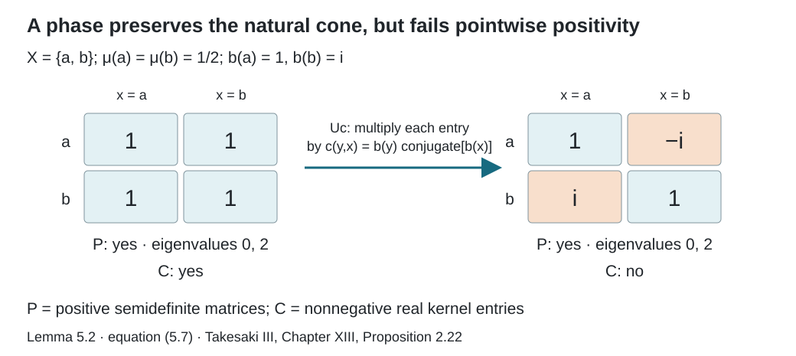

# Normalizers, phases, and orbit cocycles

*Written by GPT-6.1 Sol (OpenAI), Ultra, September 2026. Author self-check in progress; not independently reviewed. New original text is public domain (CC0).*

## Introduction

An operator can move points of a measured space and also multiply vectors by a phase. Its action on multiplication operators reveals the motion, but hides the phase. We will keep both pieces of information.

The prerequisite lesson [Orbits, stabilizers, and relation algebras](orbits-stabilizers-and-relation-algebras.md) constructs \(\mathcal M=\mathcal M(R,\mu)\) on \(L^2(R,\nu_s)\), with diagonal \(\mathcal A=\{M_f:f\in L^\infty(X)\}\), partial orbit operators \(V_\theta\), and a cyclic separating diagonal vector \(\Omega\). Use an equivalent probability measure throughout. The group presenting \(R\) is countable and acts nonsingularly on a standard Borel space.

The following measure-theoretic lemma supplies the spatial realization of abstract diagonal isomorphisms. Besides normality and bounded Borel functional calculus, it uses the one-to-one image theorem for standard Borel spaces.

**Lemma 0.1 (realizing a function-algebra isomorphism).** A normal isomorphism \(\alpha:L^\infty(X,\mu)\to L^\infty(Y,\eta)\) of standard probability-space algebras is induced by a measure-class preserving Borel isomorphism \(\rho:Y\to X\) on conull subsets:
\[
\alpha(f)=f\circ\rho.
\]

*Proof.* Choose a Borel injection \(b:X\to[0,1]\). Its image is Borel and its inverse on that image is Borel. Let \(c\) be a Borel representative of the bounded self-adjoint element \(\alpha(b)\). Normality and spectral functional calculus give
\[
\alpha(\mathbf1_{b^{-1}(B)})=\mathbf1_{c^{-1}(B)}
\]
for every Borel \(B\subset[0,1]\). In particular, \(c\in b(X)\) almost everywhere. Define \(\rho=b^{-1}\circ c\) there, with any fixed value on the remaining null set. Bounded Borel functions of \(b\) include every bounded Borel function on \(X\), so functional calculus gives \(\alpha(f)=f\circ\rho\) for all such functions, hence for all \(L^\infty\) classes.

A null-set indicator maps to zero, proving that \(\rho\) is nonsingular. Apply the same construction to \(\alpha^{-1}\) and obtain a nonsingular \(\sigma:X\to Y\). The two composition identities, applied to Borel injections of \(X\) and \(Y\) into \([0,1]\), give \(\rho\sigma=\mathrm{id}_X\) and \(\sigma\rho=\mathrm{id}_Y\) almost everywhere. Remove these exceptional sets and their preimages under the two nonsingular maps. The maps are then inverse Borel bijections of conull subsets. Their nonsingularity in both directions proves measure-class preservation. \(\square\)

Basic references are [Anantharaman–Popa] and [Takesaki].

Section 5 also uses the modular coordinates in [Relation kernels and modular coordinates](relation-kernels-and-modular-coordinates.md), together with the natural-cone implementation prerequisite stated in Section 5 below. Its topology argument keeps ordinary pointwise positivity separate from the natural cone.

## 1. A unitary has more information than its motion

The *full group* \([R]\) consists of nonsingular Borel automorphisms \(\theta\) satisfying \(\theta x\in[x]_R\), modulo equality almost everywhere. The *unitary normalizer* is

\[
\mathcal N_{\mathcal M}(\mathcal A)
=\{u\in\mathcal U(\mathcal M):u\mathcal A u^*=\mathcal A\}.
\]

For \(\theta\in[R]\), \(V_\theta\) is a unitary and normalizes \(\mathcal A\). So does every \(M_b\) with \(|b|=1\). The latter unitaries act trivially on \(\mathcal A\).

**Theorem 1.1.** Every unitary normalizer has a unique expression

\[
u=M_bV_\theta,\qquad \theta\in[R],\quad |b|=1\text{ almost everywhere}.
\tag{1.1}
\]

Uniqueness of \(\theta\) is modulo null sets. The multiplication law is

\[
(M_bV_\theta)(M_cV_\psi)
=M_{b(c\circ\theta^{-1})}V_{\theta\psi}.
\tag{1.2}
\]

*Proof.* Spatial realization of the induced normal automorphism of \(\mathcal A\) gives a nonsingular \(\theta\) with

\[
uM_fu^*=M_{f\circ\theta^{-1}}.
\tag{1.3}
\]

Initially we do not know that \(\theta\) preserves \(R\). Let \(\xi=u\Omega\). Right multiplication \(N_f\) commutes with \(u\), and \(M_f\Omega=N_f\Omega\). Consequently

\[
N_f\xi=M_{f\circ\theta^{-1}}\xi.
\]

Take a countable family of Borel sets separating points. This identity shows that \(\xi(z,x)\) is supported on \(z=\theta x\). Write its value there as \(c(x)\), and set \(c(x)=0\) where \((\theta x,x)\notin R\). For bounded \(h\), unitarity gives

\[
\int_X|h(x)|^2\,d\mu(x)
=\|uM_h\Omega\|^2
=\int_X|h(x)|^2|c(x)|^2\,d\mu(x).
\]

Thus \(|c(x)|=1\) almost everywhere. In particular, \(\theta x\in[x]_R\) almost everywhere. Discard the invariant saturation of the exceptional set and its countably many iterates under \(\theta\) and \(\theta^{-1}\); this is null, since the maps involved are nonsingular. The automorphism \(\theta\) then belongs to the full group on that conull space.

Set \(b(z)=c(\theta^{-1}z)\). The vectors \(u\Omega\) and \(M_bV_\theta\Omega\) agree. Their difference is in \(\mathcal M\) and kills its separating vector, so (1.1) follows.

Equation (1.3) determines \(\theta\) almost everywhere by countable separation. The vector on its graph then determines \(b\). Finally, \(V_\theta M_cV_\theta^*=M_{c\circ\theta^{-1}}\), giving (1.2). \(\square\)

In the proof, it is enough to remove the saturation of a null set and then close the removed set under \(\theta^{\pm1}\) and the presenting group repeatedly. This uses only countably many nonsingular maps.

**Example 1.2.** Let \(X=\{a,b\}\) with equal masses and \(R=X\times X\). In its \(2\times2\) matrix algebra, the diagonal unitary \(\operatorname{diag}(1,i)\) normalizes the diagonal. A full-group operator is either the identity or the permutation matrix exchanging the points. Neither is this diagonal unitary.

More generally, the scalar unitary \(i1\) is a normalizer for every nonzero relation algebra. It cannot be \(V_\theta\): equality of their actions on the diagonal would force \(\theta\) to be the identity, while \(V_{\mathrm{id}}=1\).

*Reference:* [Takesaki, Proposition XIII.2.17] omits the phase factor in (1.1); Example 1.2 shows why it is needed.

The last matrix step in the printed proof has the same defect. Intertwining the two diagonal actions forces every entry off the graph of the induced motion to vanish. Unitarity forces the remaining entry in each column to have modulus one; it does not force that entry to equal one. The functions \(c(x)\) and \(b(z)\) in the proof above retain exactly these entries. Thus the correction applies to the full statement and its proposed proof, including finite orbits and actions with stabilizers.

It follows that

\[
1\longrightarrow\mathcal U(\mathcal A)
\longrightarrow\mathcal N_{\mathcal M}(\mathcal A)
\longrightarrow[R]\longrightarrow1
\tag{1.4}
\]

is a split exact sequence. The splitting is \(\theta\mapsto V_\theta\). The full group describes the normalizer modulo diagonal phases.

## 2. Recognizing orbits from a diagonal pair

Suppose \((S,\eta)\) is another countable nonsingular orbit relation on a standard space \(Y\). Assume a normal isomorphism

\[
\Phi:\mathcal M(R,\mu)\longrightarrow\mathcal M(S,\eta)
\]

takes the diagonal algebra onto the diagonal algebra. Spatial realization of that restriction gives a measure-class preserving Borel map \(\phi:X\to Y\), on conull subsets, with

\[
\Phi(M_f)=M_{f\circ\phi^{-1}}.
\]

**Theorem 2.1.** The map \(\phi\) is an orbit equivalence.

*Proof.* For each element \(g\) of the group presenting \(R\), \(\Phi(V_g)\) normalizes the second diagonal. Theorem 1.1 makes its induced motion a member of \([S]\). Its action on multiplication functions is also conjugation of \(g\) by \(\phi\), so

\[
\phi(gx)\mathrel S\phi(x)
\]

almost everywhere. Remove the countable union of exceptional sets and its saturation. Every \(R\)-pair then becomes an \(S\)-pair. Apply the same argument to \(\Phi^{-1}\) and the countable group presenting \(S\) to get the reverse implication. \(\square\)

Together with the forward transport theorem in the prerequisite lesson, this recovers the measured relation from the algebra with its distinguished diagonal. The diagonal is part of the data.

## 3. Phases on journeys

A *circle-valued cocycle* is a measurable function \(c:R\to\mathbb T\) satisfying

\[
c(w,x)=c(w,z)c(z,x)
\tag{3.1}
\]

on composable arrows, outside one invariant null set. In particular \(c(x,x)=1\) and \(c(x,z)=\overline{c(z,x)}\). Because the presenting group is countable, identities given almost everywhere for each pair of group elements can be put on such a common conull set.

Define the unitary

\[
(U_c\xi)(z,x)=c(z,x)\xi(z,x).
\]

It commutes with every \(M_f\), and

\[
U_cV_gU_c^*=M_{b_g}V_g,\qquad b_g(z)=c(z,g^{-1}z).
\tag{3.2}
\]

Indeed the multiplier obtained by conjugation is
\(c(z,x)\overline{c(g^{-1}z,x)}=c(z,g^{-1}z)\).
Thus \(\alpha_c=\operatorname{Ad}(U_c)|_{\mathcal M}\) is an automorphism fixing \(\mathcal A\) pointwise.

This also gives the exact convolution formula in [Takesaki, Theorem XIII.2.21(ii)]. For a bounded left convolution kernel \(f\), write
\[
(T_f\xi)(y,x)=\sum_{z\in[x]_R}f(y,z)\xi(z,x).
\]
On one invariant conull set the cocycle identity holds for all composable arrows. Consequently
\[
\begin{aligned}
(U_cT_fU_c^*\xi)(y,x)
&=\sum_{z\in[x]_R}c(y,x)f(y,z)\overline{c(z,x)}\xi(z,x)\\
&=\sum_{z\in[x]_R}c(y,z)f(y,z)\xi(z,x)
=(T_{cf}\xi)(y,x).
\end{aligned}
\tag{3.2a}
\]
These sums converge by Cauchy–Schwarz: the row of a bounded fibre matrix belongs to \(\ell^2([x]_R)\), and the vector on that fibre belongs to the same space. Conjugation makes \(T_{cf}\) bounded with the same norm as \(T_f\); multiplication by \(c\) preserves every absolute row or column bound in the kernel algebra. Applying the inverse cocycle gives the reverse inclusion. Hence the formula covers the full bounded kernel algebra, rather than only the individual group generators.

**Theorem 3.1.** The correspondence \(c\mapsto\alpha_c\) is a group isomorphism from measurable circle-valued relation cocycles onto normal automorphisms of \(\mathcal M\) fixing \(\mathcal A\) pointwise.

*Proof.* Products of cocycles give products of their multiplication unitaries, so the map is a homomorphism. Formula (3.2) also shows injectivity: the graphs of the \(g\)'s cover \(R\).

Let \(\alpha\) fix \(\mathcal A\) pointwise. Both \(V_g\) and \(\alpha(V_g)\) implement the same motion \(g\) on the diagonal. Theorem 1.1, or maximal abelianness applied to \(\alpha(V_g)V_g^*\), gives unique functions \(b_g\in L^\infty(X,\mathbb T)\) such that

\[
\alpha(V_g)=M_{b_g}V_g.
\tag{3.3}
\]

The identity \(V_gV_h=V_{gh}\) implies

\[
b_{gh}(z)=b_g(z)b_h(g^{-1}z).
\tag{3.4}
\]

There is an additional compatibility imposed by stabilizers. On the Borel set \(D=\{x:gx=hx\}\), we have \(V_gM_{1_D}=V_hM_{1_D}\). Apply \(\alpha\), which fixes this projection. Evaluation of the resulting graph vectors gives

\[
b_g(gx)=b_h(hx)\quad\text{almost everywhere on }D.
\tag{3.5}
\]

All the identities (3.4) and (3.5) involve countably many choices. Remove their null sets and their saturation. Now define

\[
c(z,x)=b_g(z)\quad\text{when }z=gx.
\tag{3.6}
\]

Equation (3.5) makes the definition independent of the chosen \(g\). Choosing the first representative in an enumeration makes it measurable. If \(z=hx\) and \(w=gz\), then (3.4) gives

\[
c(w,x)=b_{gh}(w)=b_g(w)b_h(z)=c(w,z)c(z,x).
\]

Thus it is a relation cocycle. Equations (3.2) and (3.3) show that \(\alpha\) and \(\alpha_c\) agree on all generators. Normality makes them agree on \(\mathcal M\). \(\square\)

The stabilizer compatibility (3.5) distinguishes a cocycle on the relation from an arbitrary cocycle on the transformation groupoid.

## 4. Which phases are inner?

A cocycle is a *coboundary* if there is a measurable \(b:X\to\mathbb T\) with

\[
c(z,x)=b(z)\overline{b(x)}.
\tag{4.1}
\]

**Theorem 4.1.** The automorphism \(\alpha_c\) is inner exactly when \(c\) is a coboundary.

*Proof.* If (4.1) holds, then (3.2) identifies \(\alpha_c\) with \(\operatorname{Ad}(M_b)\) on every generator. Conversely, suppose \(\alpha_c=\operatorname{Ad}(u)\) for \(u\in\mathcal U(\mathcal M)\). Since it fixes \(\mathcal A\) pointwise, \(u\) commutes with \(\mathcal A\). Its maximal abelianness implies \(u=M_b\). Compare the conjugations of \(V_g\) to get (4.1) on every graph, hence on \(R\). \(\square\)

Consequently, quotienting these diagonal-fixing automorphisms by their inner ones gives the first measurable cohomology group \(H^1(R,\mathbb T)\). This concerns automorphisms that fix this diagonal pointwise; it does not classify all outer automorphisms of \(\mathcal M\).

## 5. Closed geometric symmetries

Let \(\operatorname{Aut}(R)\) consist of measure-class Borel automorphisms \(\phi\) of \(X\) carrying \(R\) onto itself, modulo equality almost everywhere. Equivalently, these are the automorphisms normalizing \([R]\): conjugation carries full-group maps to full-group maps, and the countable presenting group reconstructs every relation arrow. This group is larger than \([R]\).

Here is the full equivalence with [Takesaki, Definition XIII.2.18]. If \(\phi\) carries \(R\) onto itself, then \(\phi\theta\phi^{-1}\) and its inverse have graphs in \(R\) for every \(\theta\in[R]\), so they belong to \([R]\). Conversely, if \(\phi\) normalizes \([R]\), apply that condition to each element \(g\) of the countable presenting group. Outside a countable union of null sets,
\(\phi(gx)\mathrel R\phi(x)\) for every \(g\). Apply the same argument to \(\phi^{-1}\) to obtain the reverse implication. Close the removed null sets under the presenting group and \(\phi^{\pm1}\), repeating countably many times. All these maps are nonsingular, so their union is null. On the remaining conull domain the two implications hold simultaneously and \(\phi\) carries each orbit onto the corresponding orbit.

Each such \(\phi\) has a geometric implementation. Put
\[
h_\phi=\frac{d(\phi_*\mu)}{d\mu},\qquad
(W_\phi\xi)(y,x)=h_\phi(x)^{1/2}
\xi(\phi^{-1}y,\phi^{-1}x).
\tag{5.1}
\]
The Radon–Nikodym derivative here is defined for every measure-class symmetry. The expression \(\delta(\phi^{-1}x,x)\) in [Takesaki, equation (36′), p. 27] can replace it when \(\phi\in[R]\), by the partial-map change-of-variables formula. It is not defined for a general \(\phi\in\operatorname{Aut}(R)\): the modulus \(\delta\) has domain \(R\), whereas \(\phi^{-1}x\) need not be related to \(x\). For instance, the global complement of binary sequences in Exercise 6.7 preserves the fair measure and the tail relation, but the pair \((\phi^{-1}x,x)\) lies outside that relation for every \(x\). Its derivative in (5.1) is one. Thus (5.1) supplies the implementer at the entire scope of the geometric subgroup.

The source-coordinate factor is essential. Change of variables gives a unitary; it conjugates \(M_f\) to \(M_{f\circ\phi^{-1}}\) and \(V_\theta\) to \(V_{\phi\theta\phi^{-1}}\). Thus
\(\beta_\phi=\operatorname{Ad}(W_\phi)|_{\mathcal M}\) is an automorphism. Radon–Nikodym composition gives \(W_\phi W_\psi=W_{\phi\psi}\).

**Corollary 5.0 (exact extension criterion).** A normal automorphism of \(\mathcal A\) extends to a normal automorphism of \(\mathcal M\) if and only if its measure-class point map lies in \(\operatorname{Aut}(R)\).

*Proof.* An extension carries the diagonal onto itself, so Theorem 2.1 makes its point map an orbit equivalence. Conversely, for every such point map, the unitary \(W_\phi\) in (5.1) gives the required extension \(\beta_\phi\). This proves both directions of [Takesaki, Corollary XIII.2.19]. \(\square\)

**Proposition 5.1 (the algebraic splitting).** Every automorphism carrying \(\mathcal A\) onto itself has a unique expression
\[
\alpha=\alpha_c\beta_\phi,
\qquad c\in Z^1(R,\mathbb T),\quad \phi\in\operatorname{Aut}(R).
\tag{5.2}
\]
Conjugation by \(\beta_\phi\) sends \(c\) to
\((y,x)\mapsto c(\phi^{-1}y,\phi^{-1}x)\). Consequently the diagonal-preserving automorphism group is algebraically the corresponding semidirect product.

*Proof.* Lemma 0.1 realizes the restriction of \(\alpha\) as a measure-class map \(\phi\). Theorem 2.1 proves that it preserves \(R\). Therefore \(\alpha\beta_\phi^{-1}\) fixes \(\mathcal A\) pointwise and is \(\alpha_c\) for a unique cocycle by Theorem 3.1. The restriction determines \(\phi\), and then determines \(c\). Conjugate its kernel multiplier by (5.1) to obtain the asserted action on cocycles. \(\square\)

We use one precise general prerequisite for the topology: in the standard GNS form \((\mathcal M,H,J,P)\), each normal automorphism \(\alpha\) has a unique unitary \(U_\alpha\) normalizing \(\mathcal M\) and preserving the natural cone \(P\). These unitaries form a representation, commute with \(J\), and their strong topology equals the topology of pointwise norm convergence on the predual, also called the \(u\)-topology. The prerequisite *The positive cone of a standard representation*, in *Modular theory and weights*, proves the cone construction and this implementation theorem. We use those results here; their general modular proof is not repeated.

For our faithful diagonal state the natural cone has the useful description
\[
P=\overline{\{aJaJ\Omega:a\in\mathcal M\}},
\qquad aJaJ\,P\subset P.
\tag{5.3}
\]
Indeed the analytic kernel square \(q(a\Omega)=aJaJ\Omega\) generates the cone, and bounded strong-star approximation extends from the analytic algebra to \(\mathcal M\). This is the state case of the imported cone descriptions and standard-form axioms.

**Lemma 5.2 (which implementer is geometric).** In (5.2), the canonical standard implementer is
\[
U_\alpha=U_cW_\phi.
\tag{5.4}
\]
It preserves the cone
\[
C=\{\xi\in L^2(R,\nu_s):\xi(y,x)\geq0\text{ almost everywhere}\}
\tag{5.5}
\]
onto itself exactly when \(c=1\).

*Proof.* The multiplier \(U_c\) fixes \(\Omega\) and commutes with \(J\), since
\(c(y,x)=\overline{c(x,y)}\). It normalizes \(\mathcal M\). Equation (5.3), applied also to \(U_c^*\), proves that it preserves \(P\) onto itself, so it is the canonical implementer of \(\alpha_c\).

For \(W_\phi\), the modulus from the kernel lesson obeys
\[
\delta(\phi^{-1}y,\phi^{-1}x)
=\frac{h_\phi(y)}{h_\phi(x)}\delta(y,x).
\tag{5.6}
\]
This follows either by taking the ratio of the two pushed-forward counting measures, or by the partial-map change-of-variables formula. Substitution into \(J\xi(y,x)=\delta(y,x)^{1/2}\overline{\xi(x,y)}\) gives \(W_\phi J=JW_\phi\).

Also \(W_\phi\Omega=\sqrt{h_\phi}\,\Omega\in P\): truncate \(h_\phi\) and write the truncated vector as \(aJaJ\Omega\) with \(a=M_{(h_\phi\wedge n)^{1/4}}\). It converges in \(H\), since \(\int h_\phi\,d\mu=1\). Therefore
\[
W_\phi(aJaJ\Omega)
=\beta_\phi(a)J\beta_\phi(a)J\,W_\phi\Omega\in P.
\]
Apply the same argument to \(\phi^{-1}\). Hence \(W_\phi P=P\), and uniqueness makes it the standard implementer of \(\beta_\phi\). The representation property proves (5.4).

The geometric unitary \(W_\phi\) takes \(C\) onto itself by its positive density factor. Thus (5.4) preserves \(C\) precisely when multiplication by \(c\) does. Test that multiplier on the nonnegative indicators of a countable finite-measure cover of \(R\). It follows that \(c\) is nonnegative real almost everywhere. As \(|c|=1\), this is equivalent to \(c=1\). \(\square\)

The cones in (5.3) and (5.5) have different roles. For the full relation on two points with equal masses, \(H\) identifies with \(2\times2\) matrices. The natural cone consists of positive semidefinite matrices; \(C\) consists of matrices with nonnegative real entries. With \(b(a)=1\), \(b(b)=i\), the coboundary multiplier sends the positive-entry matrix of all ones to
\[
\begin{pmatrix}1&-i\\i&1\end{pmatrix}.
\tag{5.7}
\]
This is still positive semidefinite, but is outside \(C\). Its eigenvalues are zero and two. A cocycle phase respects the natural cone while failing the geometric test.

*Figure 1. Lemma 5.2 and equation (5.7). Rows and columns are ordered \(a,b\), with equal base masses. The coboundary \(c(y,x)=b(y)\overline{b(x)}\), \(b(a)=1,b(b)=i\), multiplies the two off-diagonal entries by \(-i,i\). Both displayed matrices lie in the natural cone \(P\); only the left one lies in the pointwise cone \(C\). The geometric test in Takesaki, Chapter XIII, Proposition 2.22 uses \(C\).*

**Theorem 5.3.** Suppose \(R\) is ergodic. The geometric subgroup
\(\mathcal G=\{\beta_\phi:\phi\in\operatorname{Aut}(R)\}\)
is closed in \(\operatorname{Aut}(\mathcal M)\) for the \(u\)-topology, and is Polish. Moreover
\[
\mathcal G\cap\operatorname{Int}(\mathcal M)
=\{\beta_\theta:\theta\in[R]\},
\tag{5.8}
\]
and this full-group image is a Borel subgroup of \(\mathcal G\).

*Proof.* First the diagonal-preserving automorphisms form a closed subgroup. If \(\alpha_n\) converges to \(\alpha\), their standard implementers and their adjoints converge strongly. For \(a\in\mathcal A\), the bounded operators \(\alpha_n(a)\) then converge strongly to \(\alpha(a)\). Strong closedness of \(\mathcal A\) gives \(\alpha(\mathcal A)\subset\mathcal A\); apply the same reasoning to the inverse automorphisms to get equality. The argument works for nets as well as sequences.

By Lemma 5.2, within that subgroup \(\mathcal G\) is characterized by
\(U_\alpha C=C\). The cone \(C\) is closed: an \(L^2\) limit has an almost-everywhere convergent subsequence, so retains pointwise nonnegativity. If both unitaries and their adjoints converge strongly, preservation onto a closed cone passes to the limit in both directions. Thus \(\mathcal G\) is closed.

For completeness of the Polish assertion, \(H\) is separable because the base is standard and the relation has a countable graph cover. On its unitary group choose a dense sequence of unit vectors \(\zeta_j\) and the complete metric
\[
d(U,V)=\sum_{j\geq1}2^{-j}
\bigl(\|(U-V)\zeta_j\|+\|(U^*-V^*)\zeta_j\|\bigr).
\tag{5.9}
\]
A Cauchy sequence gives limiting isometries for the maps and adjoints; passing to the bounded products gives mutually inverse limits. Thus the limit is unitary. This metric gives the strong topology on the unitary group. Separability follows by embedding the group in the countable product of copies of separable \(H\), which is second countable. Its subgroup of unitaries normalizing \(\mathcal M\) and preserving \(P\) is closed: strong limits and inverse limits preserve the strongly closed algebra and the closed cone. The imported implementation theorem therefore makes \(\operatorname{Aut}(\mathcal M)\) Polish. Its closed subgroup \(\mathcal G\) is Polish as well.

If \(\beta_\phi=\operatorname{Ad}(u)\), then \(u\) normalizes \(\mathcal A\). Theorem 1.1 shows that its diagonal motion belongs to \([R]\); that motion is \(\phi\). Conversely, for \(\theta\in[R]\), \(\operatorname{Ad}(V_\theta)\) and \(\beta_\theta\) agree on the diagonal and on every partial orbit operator, since both conjugate its motion by \(\theta\). They agree on \(\mathcal M\), proving (5.8).

Finally \(\operatorname{Int}(\mathcal M)\) is Borel here. The strong unitary group \(\mathcal U(\mathcal M)\) is Polish, as a closed subgroup of \(\mathcal U(H)\). Choose a countable list of continuous matrix coefficients separating its points. For each unitary take the first nonzero coefficient and multiply by the unique scalar phase that makes it positive real. The resulting representatives form a Borel subset \(S\) containing exactly one representative of each scalar coset. The map
\(u\mapsto\operatorname{Ad}(u)\) is continuous into the \(u\)-topology: its canonical implementer is \(uJuJ\), which varies strongly with \(u\). Since ergodicity makes \(\mathcal M\) a factor, two unitaries give the same inner automorphism exactly when they differ by a scalar. The map from \(S\) is therefore Borel and injective. The one-to-one Borel image theorem makes its image \(\operatorname{Int}(\mathcal M)\) Borel in the Polish automorphism group. Intersecting with closed \(\mathcal G\) proves the final assertion. \(\square\)

Closedness of \(\mathcal G\) does not imply closedness of its full-group subgroup. In the fair binary tail model, that subgroup has a concrete limit outside itself, as Exercise 6.7 shows. The distinguished diagonal and the topology remain part of the statement.

## 6. Exercises with solutions

Level 1 asks for a computation or a direct application. Level 2 asks for a proof using the lesson’s framework. Level 3 combines results or examines a hypothesis whose failure changes the conclusion.

**Exercise 6.1 (a finite pair).** *Level 1.* Write all normalizers of the diagonal in \(M_2(\mathbb C)\).

*Solution.* They are the diagonal unitaries
\(\begin{pmatrix}a&0\\0&b\end{pmatrix}\)
and the antidiagonal unitaries
\(\begin{pmatrix}0&a\\b&0\end{pmatrix}\),
with \(|a|=|b|=1\). Theorem 1.1 gives exactly these two motions and their two independent phases.

**Exercise 6.2 (one orbit).** *Level 2.* On a finite or countably infinite single orbit, prove that every relation cocycle is a coboundary.

*Solution.* Fix a point \(x_0\). Put \(b(x)=c(x,x_0)\). Then (3.1) gives \(c(z,x)=c(z,x_0)c(x,x_0)^{-1}\). On a countable orbit every function is measurable. For a general nonsmooth measured relation, choosing a basepoint in every orbit measurably is a separate issue, so this proof does not settle that case.

**Exercise 6.3 (descending through stabilizers).** *Level 2.* Let \(\Gamma=\mathbb Z\times C_2\) act by the shift of the first factor on the two-sided Bernoulli space. A transformation-groupoid cocycle is the character \(a((n,\varepsilon),x)=(-1)^\varepsilon\). Does it descend to the principal relation?

*Solution.* No. The arrows \(((0,0),x)\) and \(((0,1),x)\) have the same image \((x,x)\), but their values are \(1\) and \(-1\). Relation cocycles take the value \(1\) on unit arrows, so they must be trivial on every stabilizer when pulled back.

**Exercise 6.4 (gauges with the same effect).** *Level 2.* If \(b\) and \(d\) define the same coboundary, determine their ratio.

*Solution.* Equation (4.1) gives
\(b(z)\overline{d(z)}=b(x)\overline{d(x)}\)
on \(R\). Their ratio is an invariant circle-valued function. If \(R\) is ergodic, it is constant almost everywhere by the centre computation in the prerequisite lesson.

**Exercise 6.5 (transporting a cocycle).** *Level 3.* For an orbit equivalence \(\phi:X\to Y\), define a cocycle on the target relation and show that the transported automorphism has that cocycle.

*Solution.* Put \(d(y',y)=c(\phi^{-1}y',\phi^{-1}y)\). Composition of target arrows becomes composition of source arrows, so (3.1) is preserved. Under the relation-Hilbert-space unitary, multiplication by \(c\) becomes multiplication by \(d\). The measure-density factor depends only on the source coordinate and commutes with both. Thus the transported \(\alpha_c\) is \(\alpha_d\).

**Exercise 6.6 (two positivity tests).** *Level 2.* For \(0<\theta<2\pi\), take \(b(a)=1\), \(b(b)=e^{i\theta}\). Compute the image of the all-ones matrix under its coboundary multiplier. Determine its eigenvalues, and decide whether it lies in \(P\) and \(C\).

*Solution.* The image is \(\begin{pmatrix}1&e^{-i\theta}\\e^{i\theta}&1\end{pmatrix}=vv^*\) with \(v=(1,e^{i\theta})^t\). Hence it is positive semidefinite, with eigenvalues zero and two, and belongs to \(P\). To lie in \(C\), both off-diagonal entries would have to be nonnegative real. A complex number of modulus one with this property is one, which would require \(\theta=0\) modulo \(2\pi\). Thus it is outside \(C\) for the stated range. At \(\theta=\pi\), its off-diagonal entries are negative real, so that endpoint inside the range also fails the test.

**Exercise 6.7 (a Borel subgroup need not be closed).** *Level 3.* On fair binary product space let \(\phi_n\) complement the first \(n\) digits and let \(\phi\) complement every digit. For the tail relation prove \(\beta_{\phi_n}\to\beta_\phi\) in the \(u\)-topology, with every \(\beta_{\phi_n}\) inner and \(\beta_\phi\) outer.

*Solution.* All these maps preserve fair measure and the tail relation. Each \(\phi_n\) is itself a finite-coordinate change, so belongs to \([R]\); (5.8) makes its geometric automorphism inner. The global complement changes infinitely many coordinates of every sequence, so \(\phi x\) is never tail equivalent to \(x\). It lies outside \([R]\). Equation (5.8) therefore makes its geometric automorphism outer.

To verify convergence, let \(g\) change a fixed finite set of digits and let \(f\) depend on finitely many digits. Both \(\phi_n\) and \(\phi\) commute with \(g\), and for all sufficiently large \(n\), \(f\circ\phi_n^{-1}=f\circ\phi^{-1}\). Since the densities in (5.1) are one and the diagonal vector is fixed,
\(W_{\phi_n}(V_gM_f\Omega)=V_gM_{f\circ\phi_n^{-1}}\Omega\)
agrees eventually with \(W_\phi(V_gM_f\Omega)\). Finite sums of these vectors are dense: the countable graphs cover the relation and cylinder functions are dense in the base \(L^2\). The unitaries therefore converge strongly on all \(H\), and their adjoints do too. The standard implementation topology gives the claimed \(u\)-convergence. This proves nonclosedness of the full-group image inside the closed geometric group.

## References

- [Anantharaman–Popa] Claire Anantharaman and Sorin Popa, *An introduction to \(II_1\) factors*, author-hosted draft `IIunV15.pdf`. Sections 12.1–12.3 treat Cartan normalizers, orbit equivalence and full groups in the finite invariant-measure setting. [Read the authors’ draft](https://www.math.ucla.edu/~popa/Books/IIunV15.pdf). This is an accessible scholarly reference; no licence to reproduce or translate its text is assumed. The complete proofs used here are the owned and programme arguments identified above.
- [Takesaki] Masamichi Takesaki, *Theory of Operator Algebras III*, Encyclopaedia of Mathematical Sciences 127, Springer, 2003. [Publisher record](https://doi.org/10.1007/978-3-662-10453-8).
