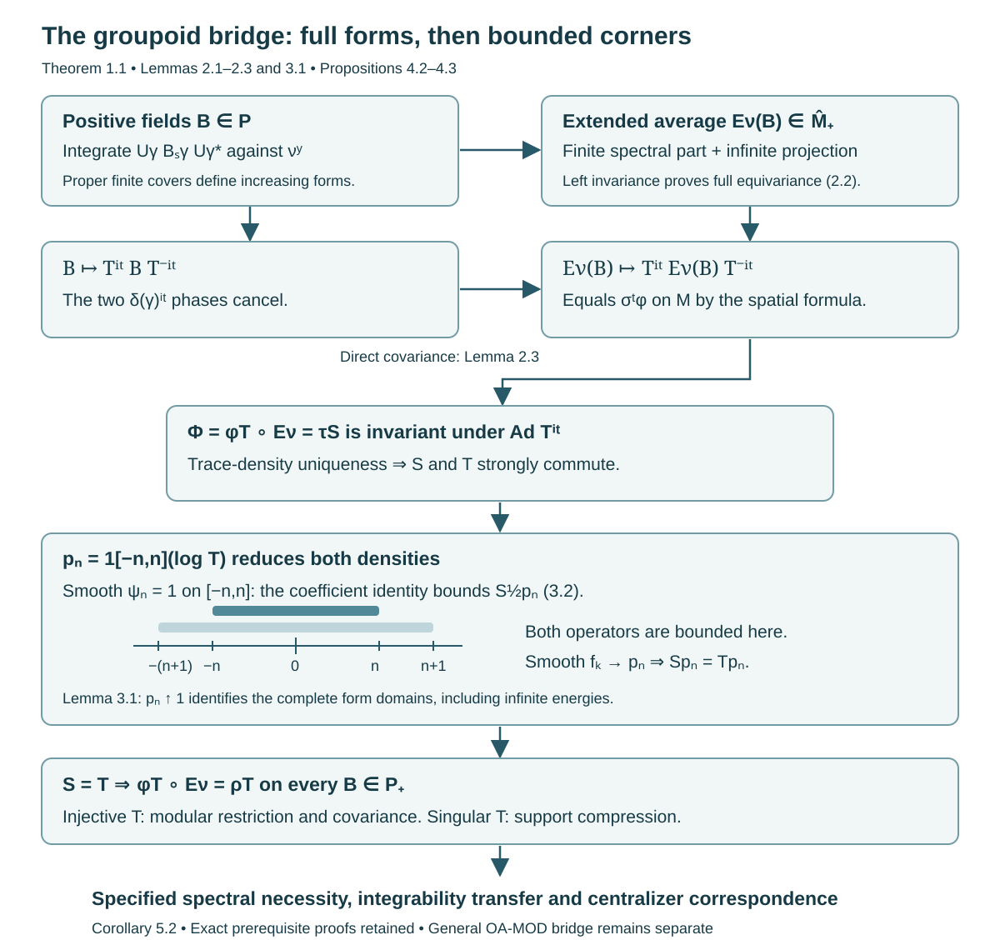

# Orbit averaging and the modular weight bridge

An orbit average can be infinite on an entire subspace. It therefore belongs to the extended positive cone, rather than necessarily being a densely defined operator. We construct that average directly and prove its scalar weight identity. The decisive step identifies two commuting densities on bounded spectral corners; agreement on a dense family of vectors alone would not suffice.

The standing scope is the standard Borel, sigma-finite, square-integrable random-Hilbert-space theory of [Claude-WR], stated precisely below. The argument proves the groupoid application of Connes's Section VII, Lemma 8. General modular existence and restriction theorems for arbitrary von Neumann algebra inclusions retain OA-MOD's ownership and proof obligations.

Prerequisites are normal weights and their extended-positive evaluations, measurable separable Hilbert fields, the spectral theorem, scalar trace-density theory, and the spatial weight correspondence. Section 7 identifies the exact existing full proofs used.

## Reading from transverse kernels to random-operator centralizers

The positive constructions below use standard Borel groupoids, proper transverse kernels and the stated sigma-finite measure hypotheses. The ergodicity/extremality theorem and the factor-support reduction have broader measurable scope, specified in their own lessons. Keep these hypotheses attached to each result: changing the measurable structure can change the random-operator algebra even when the underlying orbit is unchanged.

1. **Establish the measure and measurable-space scope.** Read [Semifinite transverse measures and operator completions](semifinite-transverse-measures-and-operator-completions.md) alongside [Principal groupoids with extra fibre information](principal-groupoids-with-extra-fibre-information.md) and [Countable generation and isotropy topologies](countable-generation-and-isotropy-topologies.md). The counterexamples distinguish semifiniteness from sigma-finiteness, measurable fields from their operator closure, and countable generation from standard Borel structure. They explain which source assertions need a corrected replacement.

2. **Build the fixed-fibre topology and Haar coordinates.** Read [Borel group measures and isotropy topologies](borel-group-measures-and-isotropy-topologies.md). A quasi-invariant probability supplies a faithful unitary model of an analytic Borel group. A positive compact set in that model gives local compactness. For a standard range fibre, a completed-measure section becomes Borel on one conull label set. Haar averaging then proves the product formula and sigma-finiteness of the label measure. The affine example fixes the modular sign under a change of section. All twelve exercises have complete solutions.

3. **Generate the isotropy commutant.** Read [Averaged coefficients and isotropy commutants](averaged-coefficients-and-isotropy-commutants.md). The regular Hilbert-algebra proof uses its exact modular commutation input. An invariant kernel in fixed-fibre coordinates descends to a Borel arrow function modulo an equivalent probability. Proper masks and a single countable algebra then recover the full commutant at every unit. The nonunital positive-sum argument gives weak linear density, which survives compression to a general square-integrable field. The six solutions explain why mere commutation or algebra generation would not suffice.

4. **Separate ergodicity, factor support and the two-copy construction.** Read [Ergodic transverse measures and extremal rays](ergodic-transverse-measures-and-extremal-rays.md), then [Commuting copies in principal groupoid factors](commuting-copies-in-principal-groupoid-factors.md). The first proves the ergodicity/extremal-ray equivalence for a nonzero semifinite transverse measure. The second obtains sigma-finiteness on the representation's factor support and proves joint generation by calculating the complete three-coordinate commutant. Its internal flip follows from the tensor field and projection equivalences. Together these lessons contain seventeen solved exercises. [Principal groupoids with hidden group factors](principal-groupoids-with-hidden-group-factors.md) tests particular pairs and their repairs at weaker measurable scope; those failures do not decide whether some different pair satisfies the full source conclusion.

5. **Construct the modular bridge before using spectral disintegration.** Continue with Sections 1–4 of the present lesson. The orbit integral is an extended positive form and can have an infinite projection. Its faithfulness, normality and semifiniteness are proved directly. Scalar trace-density uniqueness first gives commuting densities; bounded logarithmic corners then identify their complete form domains. [Modular orbit integrals and spectral coordinates](modular-orbit-integrals-and-spectral-coordinates.md) fixes the ordinary-time Fourier normalization and the Jacobian for positive spectral coordinates. [Spectral necessity and modular transfer](spectral-necessity-and-modular-transfer.md) tests the whole spectral measure and proves both transfer directions. The reverse direction requires centralizer cutoffs that exhaust the identity.

6. **Make the spectral representation and centralizer genuine.** Follow [Joint spectral charts and measurable intertwiners](joint-spectral-charts-and-measurable-intertwiners.md), [Almost homomorphisms on measured groupoids](almost-homomorphisms-on-measured-groupoids.md), [Strict spectral representations on the stable kernel](strict-spectral-representations-on-the-stable-kernel.md), and [Integrable centralizers and spectral intertwiners](integrable-centralizers-and-spectral-intertwiners.md). These supply the joint chart, saturated repair, lifted kernel and measure checks, square-integrable total family, and both directions of the normal centralizer isomorphism. The exact proof sequence in Corollary 5.2 below places spectral necessity before this application. Lemma 5.3 supplies the complete diagonal average and its exhausting cutoffs.

The supported source proofs and the corrections to unrestricted assertions have distinct scopes. The final whole-lesson author pass covers all fifteen Connes lessons and their one hundred twelve complete solutions, including the measurable counterexamples, topology and Haar product, globally averaged commutants, commuting copies, modular bridge, spectral charts and transfer, strictification, and normal centralizer correspondence. The six source-parent comparisons retain five complete supported or corrective dispositions; the broader existential two-copy assertion remains open. General normal-module, spatial-weight, scalar density and modular commutation inputs remain explicit prerequisites. The original atomless compact-extraction exercise and the broader two-copy question remain open, and full-course validation continues.

## 1. The exact input and conclusion

Let \(G\rightrightarrows X\) be a standard Borel groupoid with a faithful proper transverse kernel \(\nu\). Proper means that there are increasing Borel sets \(F_n\uparrow G\) and finite constants \(c_n\) with \(\sup_y\nu^y(F_n)\le c_n\). Left translation carries \(\nu^x\) to \(\nu^y\) along an arrow \(x\to y\). Faithful means \(\nu^x\ne0\) at every unit. Let \(\Lambda\) be a sigma-finite transverse measure, let \(\mu=\Lambda_\nu\), and put \(m=\mu\circ\nu\). The measure \(\mu\) is sigma finite and \(m\) is equivalent to its image under inversion. Its modulus is the positive Borel homomorphism \(\delta:G\to(0,\infty)\).

Let \(H_x\) be a measurable separable Hilbert field with a genuine Borel unitary representation \(U_\gamma:H_{s\gamma}\to H_{r\gamma}\). Write
\[
\mathcal H=\int_X^\oplus H_x\,d\mu(x),\qquad
P=\int_X^\oplus B(H_x)\,d\mu(x),\qquad
M=\operatorname{End}_\Lambda(H)\subseteq P.
\tag{1.1}
\]
Here \(M\) consists of classes of bounded genuine intertwining fields. The faithful normal field realization and its almost-intertwiner repair are those of the square-integrable random-operator theory. Zero fibres and the zero algebra are allowed. A saturated \(\mu\)-null unit set is negligible; statements about random operators are made after the corresponding conull reduction.

For a bounded Borel section \(\eta\), square integrability means that there is a finite \(C_\eta\) such that
\[
\int_{G^y}|\langle v,U_\gamma\eta_{s\gamma}\rangle|^2\,d\nu^y(\gamma)
\le C_\eta\|v\|^2\quad(y\in X,\ v\in H_y).
\tag{1.2}
\]
Denote these sections by \(D(U,\nu)\). We assume that a countable family in \(D(U,\nu)\) is total at every retained unit. Its bounded coefficient average is
\[
\theta_\nu(\eta,\eta)_y
=\int_{G^y}(U_\gamma\eta_{s\gamma})(U_\gamma\eta_{s\gamma})^*\,d\nu^y(\gamma)\in M_+.
\tag{1.3}
\]
Inner products are linear in the first variable, and \(\xi\xi^*(v)=\langle v,\xi\rangle\xi\).

We use the complete spatial weight correspondence [Claude-WR, Theorem 5.3, Corollary 5.4 and Proposition 5.5]. A positive random operator \(T\) of degree one has covariance, including its spectral domains,
\[
T_y^{it}\delta(\gamma)^{it}U_\gamma=U_\gamma T_{s\gamma}^{it}
\quad(t\in\mathbb R).
\tag{1.4}
\]
For a singular \(T\), the spectral convention is \(0^{it}=0\); (1.4) then concerns the supported partial unitaries. There is a normal semifinite weight \(\varphi_T\) on \(M\) satisfying
\[
\varphi_T(\theta_\nu(\eta,\eta))
=\int_X\|T_x^{1/2}\eta_x\|^2\,d\mu(x).
\tag{1.5}
\]
The integrand is infinity outside the form domain. This correspondence covers every normal semifinite weight on \(M\); it preserves support and compression by random isometries. For injective \(T\), \(\varphi_T\) is faithful and
\[
\sigma_t^{\varphi_T}(A)=T^{it}AT^{-it}.
\tag{1.6}
\]
These results precede the operator-valued bridge in their existing proof. Their normal-module and spatial-derivative prerequisites remain declared.

**Theorem 1.1 (the groupoid bridge).** There is a faithful normal semifinite operator-valued weight \(E_\nu:P_+\to\widehat M_+\) whose extended quadratic form is
\[
q_{E_\nu(B)_y}(v)
=\int_{G^y}\langle B_{s\gamma}U_\gamma^*v,U_\gamma^*v\rangle\,d\nu^y(\gamma).
\tag{1.7}
\]
For every positive degree-one \(T\), including singular \(T\), and every \(B\in P_+\),
\[
\widehat{\varphi_T}(E_\nu(B))
=\rho_T(B):=\int_X\operatorname{Tr}(T_x^{1/2}B_xT_x^{1/2})\,d\mu(x).
\tag{1.8}
\]
The trace expression means the extended trace-density pairing, with its full form domain. It does not presume that the displayed product is a bounded operator. For injective \(T\),
\[
\sigma_t^{\rho_T}|_M=\sigma_t^{\varphi_T},\qquad
E_\nu(\sigma_t^{\rho_T}(B))
=\sigma_t^{\varphi_T}(E_\nu(B)).
\tag{1.9}
\]
The map \(E_\nu\) is uniquely determined among normal operator-valued weights by (1.8) for any one faithful \(\varphi_T\). All equalities include infinite values.

## 2. Constructing the whole extended orbit average

**Lemma 2.1 (construction and null transport).** Formula (1.7) defines a normal \(M\)-bimodular map into \(\widehat M_+\).

*Proof.* Choose a bounded positive Borel representative of \(B\). Set
\[
C_{n,y}=\int_{G^y}\mathbf1_{F_n}(\gamma)
U_\gamma B_{s\gamma}U_\gamma^*\,d\nu^y(\gamma).
\tag{2.1}
\]
Weak integration against a countable measurable orthonormal family gives measurable positive bounded fields, with \(C_{n,y}\le c_n\|B\|1\). They increase in positive order. Their supremum in \(\widehat P_+\) exists by the extended spectral-cone theorem, including a possible infinite projection. Evaluation on a vector in a fibre gives the increasing integral in (1.7). Equivalently, the supremum form is lower semicontinuous, since it is the supremum of bounded continuous positive forms. Its finite-domain closure and its orthogonal infinite part give exactly this extended positive. Measurability can also be read from the monotone extended-cone supremum; the spectral cutoffs and resolvents are measurable fields.

Left invariance and the unitary law show, for every arrow \(\alpha:x\to y\),
\[
q_{E_\nu(B)_y}(U_\alpha v)=q_{E_\nu(B)_x}(v).
\tag{2.2}
\]
The substitution is \(\gamma=\alpha\beta\), with \(s\gamma=s\beta\). It applies to the full positive integral, regardless of finiteness. Thus both the finite spectral part and the infinite projection intertwine. The bounded spectral cutoffs are genuine intertwining fields, so the extended positive belongs to \(\widehat M_+\), not just \(\widehat P_+\). No equivariance of the partial sets \(F_n\) was required.

If two representatives agree outside a \(\mu\)-null set \(N\), then \(r^{-1}N\) is \(m\)-null by kernel integration. Inversion equivalence makes \(s^{-1}N\) \(m\)-null. Tonelli therefore shows that (1.7) agrees for \(\mu\)-almost every \(y\), on every vector by a countable total family and the positive-form representation. The construction is well defined on \(P\).

Additivity and nonnegative homogeneity follow from the positive integrals. For \(a\in M\), choose a genuine bounded representative; \(a_yU_\gamma=U_\gamma a_{s\gamma}\) gives
\[
E_\nu(a^*Ba)=a^*E_\nu(B)a.
\tag{2.3}
\]
The equality is the full extended-form equality, evaluated on \(v\) by replacing it with \(a_yv\).

To check normality without confusing a net with a sequence, first let \(B_j\uparrow B\) be a bounded increasing sequence. Fibre monotone convergence, followed by kernel monotone convergence, gives \(E_\nu(B_j)\uparrow E_\nu(B)\). The fibre qualification is simultaneous for this countable family, and source null transport just proved makes it valid under the arrow integral. For a bounded increasing net in \(P_+\), a faithful normal state on the separable-predual algebra \(P\) selects an increasing cofinal-in-value sequence: choose indices with state values tending to the state value of the supremum and enlarge them successively. Its supremum equals the net supremum by faithfulness. Sequence normality and monotonicity then give normality for the original net. On the zero algebra everything asserted is immediate. \(\square\)

**Lemma 2.2 (faithfulness and semifiniteness).** The map of Lemma 2.1 is faithful and semifinite.

*Proof.* If \(E_\nu(B)=0\), its nonnegative scalar integrands vanish for \(m\)-almost every arrow, on a countable measurable total vector family at the range. Hence \(U_\gamma B_{s\gamma}U_\gamma^*=0\), and \(B_{s\gamma}=0\), for almost every arrow. Inversion equivalence yields \(B_{r\gamma}=0\) almost everywhere. Consequently the saturated statement is not needed: for \(\mu\)-almost every \(y\), \(B_y=0\) whenever \(\nu^y\ne0\). Faithfulness of \(\nu\) gives \(B=0\).

Let \(\eta_j\in D(U,\nu)\) be countably total and put \(a_j=\eta_j\eta_j^*\in P_+\). Their support projections have join \(1\), and
\[
E_\nu(a_j)=\theta_\nu(\eta_j,\eta_j)\in M_+.
\tag{2.4}
\]
Rescale to positive contractions without changing supports; let \(K_j=\|E_\nu(a_j)\|\) after rescaling. Define
\[
b=\sum_{j\ge1}\frac{2^{-j}}{1+K_j}a_j,\qquad
u_n=b(b+n^{-1}1)^{-1}.
\tag{2.5}
\]
The series converges in norm, \(0\le b\le1\), \(s(b)=1\), and normality gives \(E_\nu(b)\le1\). Functional calculus gives \(0\le u_n\le1\), \(u_n\le nb\), and \(u_n\uparrow1\) strongly. Thus \(E_\nu(u_n)\le n1\). For any \(A\in P_+\),
\(u_n^{1/2}Au_n^{1/2}\le\|A\|u_n\), so these cutdowns have bounded output and converge strongly to \(A\). Their complex span is ultraweakly dense in \(P\). This is semifiniteness. The \(u_n\) need not be centralizer elements or belong to \(M\). \(\square\)

**Lemma 2.3 (covariance without a modular existence theorem).** For injective degree-one \(T\), let \(\alpha_t=\operatorname{Ad}T^{it}\) on \(P\). Then \(E_\nu\alpha_t=\alpha_tE_\nu\), and \(\Phi_T=\widehat{\varphi_T}\circ E_\nu\) is faithful normal semifinite and \(\alpha\)-invariant.

*Proof.* Rearranging (1.4) gives
\(U_\gamma T_{s\gamma}^{it}=\delta(\gamma)^{it}T_y^{it}U_\gamma\).
The two scalar phases cancel in
\(U_\gamma T_{s\gamma}^{it}B_{s\gamma}T_{s\gamma}^{-it}U_\gamma^*\).
Integration proves the covariance on the entire extended cone. Equation (1.6) identifies the restriction of \(\alpha\) to \(M\). The scalar composition theorem for faithful normal semifinite operator-valued weights, with the scalar algebra as final target, makes \(\Phi_T\) faithful normal semifinite. Its proof uses finite contractions and bimodularity, without a modular restriction theorem. Invariance follows from covariance and invariance of \(\varphi_T\) under its own modular group. \(\square\)

## 3. A density-identification lemma with full domains

We isolate the unbounded step. Let \(A\) and \(S\) be positive injective self-adjoint operators on a Hilbert space \(\mathcal K\), with commuting spectral projections. Let \(\mathcal D\subseteq\mathcal K\) be a dense linear subspace. Assume that, for every \(\eta\in\mathcal D\) and every \(f\in C_c^\infty(\mathbb R)\),
\[
\|S^{1/2}f(\log A)\eta\|^2
=\|A^{1/2}f(\log A)\eta\|^2<\infty.
\tag{3.1}
\]
This assumption places the vectors in both displayed form domains.

**Lemma 3.1 (bounded corners identify the density).** Under these hypotheses, \(S=A\), with equality of operator and form domains.

*Proof.* Put \(p_n=\mathbf1_{[-n,n]}(\log A)\). Choose \(\psi_n\in C_c^\infty(\mathbb R)\) identically \(1\) on \([-n,n]\). Strong commutation makes \(p_n\) commute with \(S^{1/2}\) on its domain. For \(\eta\in\mathcal D\), (3.1) gives
\[
\begin{aligned}
\|S^{1/2}p_n\eta\|^2
&=\|p_nS^{1/2}\psi_n(\log A)\eta\|^2\\
&\le \|A^{1/2}\psi_n(\log A)\|^2\|\eta\|^2.
\end{aligned}
\tag{3.2}
\]
The right-hand operator is bounded, since \(e^{r/2}\psi_n(r)\) has compact support. The operator \(S^{1/2}p_n\), with domain \(\{\eta:p_n\eta\in D(S^{1/2})\}\), is closed: \(p_n\) reduces \(S\), so this is the direct sum of the closed operator on \(p_n\mathcal K\) and zero on its orthogonal complement. Approximate any vector by vectors of \(\mathcal D\). Bound (3.2) makes their images Cauchy; closedness makes the operator defined and bounded on all of \(\mathcal K\). Thus \(S\) is bounded on \(p_n\mathcal K\), as is \(A\).

For fixed \(n\), choose smooth functions \(f_k\) with \(0\le f_k\le1\), equal to \(1\) on \([-n,n]\), supported in \([-n-1,n+1]\), and tending pointwise to \(\mathbf1_{[-n,n]}\). The endpoint values are \(1\); narrow the two smooth exterior transition regions to obtain such functions. Bounded spectral convergence gives \(f_k(\log A)\eta\to p_n\eta\). All vectors lie in \(p_{n+1}\mathcal K\), where both \(S\) and \(A\) are bounded by the preceding paragraph. Therefore (3.1) passes to the limit:
\[
\|S^{1/2}p_n\eta\|^2=\|A^{1/2}p_n\eta\|^2
\quad(\eta\in\mathcal D).
\tag{3.3}
\]
Continuity extends (3.3) to every vector; polarization identifies the bounded operators on this corner. Hence \(Sp_n=Ap_n\).

Injectivity of \(A\) gives \(p_n\uparrow1\). On the common increasing reducing corners, the operators agree. More explicitly, the energies of \(p_n\xi\) increase to the full \(S\)-energy and to the full \(A\)-energy, including infinity. Thus the form domains and forms agree, and their associated positive self-adjoint operators are equal. \(\square\)

There is no assertion that the original dense subspace \(\mathcal D\) is a form core. The commuting corners, the boundedness proof (3.2), and the limiting argument in both complete form domains supply that missing step.

## 4. Identifying the scalar composite

**Lemma 4.1 (smooth logarithmic cutoffs preserve coefficient bounds).** If \(\eta\in D(U,\nu)\), then \(f(\log T)\eta\in D(U,\nu)\) for every \(f\in C_c^\infty(\mathbb R)\), when \(T\) is injective.

*Proof.* Define
\[
g(t)=\frac1{2\pi}\int_{\mathbb R}f(r)e^{-itr}\,dr,\qquad
f(\log T_x)\eta_x=\int_{\mathbb R}g(t)T_x^{it}\eta_x\,dt.
\tag{4.1}
\]
Integration by parts shows that \(g\) decays faster than every power; in particular \(g\in L^1\). Fourier inversion, with ordinary \(dr\) and \(dt/(2\pi)\), gives the second identity as a Hilbert-norm integral. Joint measurability and separability give a Borel section. Its fibre norm is at most \(\|g\|_1\sup_x\|\eta_x\|\).

By (1.4), for each \(t\) the section \(T^{it}\eta\) has the same coefficient bound \(C_\eta\): the phase \(\delta(\gamma)^{it}\) has modulus one, and the test vector changes to \(T_y^{-it}v\). Minkowski's integral inequality in \(L^2(G^y,\nu^y)\) therefore gives coefficient norm at most
\(\|g\|_1 C_\eta^{1/2}\|v\|\) for the section in (4.1). This proves (1.2), with constant \(\|g\|_1^2C_\eta\). The argument uses the actual phase before taking its absolute value; it does not assert that logarithmic spectral projections preserve \(D(U,\nu)\). \(\square\)

**Proposition 4.2 (the scalar identity for injective densities).** For injective degree-one \(T\), \(\Phi_T=\rho_T\) on all of \(P_+\).

*Proof.* Equip \(P\) with its canonical faithful normal semifinite trace
\[
\tau(B)=\int_X\operatorname{Tr}(B_x)\,d\mu(x).
\tag{4.2}
\]
Finite-measure unit cutoffs and finite-rank field projections give a strong exhaustion in its finite ideal. The modular group of \(\tau\) is the identity. The exact scalar trace-density classification, namely OA-MOD PT-05 with reference trace \(\tau\), gives a unique positive injective operator \(S\) affiliated with \(P\) such that \(\Phi_T=\tau_S\). This classification includes densities which are not trace measurable. In the field realization, spectral projections of \(S\) are decomposable; its closed form is the integral of the fibre forms.

Lemma 2.3 makes \(\Phi_T\) invariant under conjugation by \(T^{it}\). The trace is invariant under this conjugation. Transport of the spectral regularizations in the definition of \(\tau_S\) gives
\[
\tau_S\circ\operatorname{Ad}T^{it}
=\tau_{\,T^{-it}ST^{it}}.
\tag{4.3}
\]
Density uniqueness yields \(T^{-it}ST^{it}=S\), including domains, for every \(t\). Its spectral projections commute with every \(T^{it}\), and thus with all spectral projections of \(T\). This is strong commutation.

Let \(\mathcal D=D(U,\nu)\cap\mathcal H\), interpreting bounded sections as vectors when their ordinary \(\mu\)-square norm is finite. It is a linear subspace dense in \(\mathcal H\). To verify density, multiply the countably total coefficient sections by indicators of increasing finite-\(\mu\) unit sets and by bounded Borel scalar functions. These operations preserve (1.2). Their linear span is dense: a vector orthogonal to it has all its fibre inner products with the total family zero, first on each finite-measure set and then almost everywhere.

For any bounded \(\zeta\in D(U,\nu)\), (2.4) and (1.5) give
\[
\Phi_T(\zeta\zeta^*)
=\varphi_T(\theta_\nu(\zeta,\zeta))
=\int_X\|T_x^{1/2}\zeta_x\|^2\,d\mu(x).
\tag{4.4}
\]
For \(\zeta\in\mathcal H\), the left side is also \(\|S^{1/2}\zeta\|^2\), including infinity, by the trace-density pairing on decomposable rank-one fields. The field \(\zeta\zeta^*\) belongs to \(P_+\) because \(\zeta\) is uniformly bounded; it is not being confused with the rank-one operator on the whole Hilbert integral.

Now take \(\eta\in\mathcal D\) and \(f\in C_c^\infty\). Lemma 4.1 makes \(\zeta=f(\log T)\eta\) a bounded coefficient section; it remains in \(\mathcal H\). Also
\[
\|T^{1/2}f(\log T)\eta\|
\le \|e^{r/2}f(r)\|_\infty\|\eta\|<\infty.
\tag{4.5}
\]
Equation (4.4) is exactly (3.1) with \(A=T\) on \(\mathcal H\). Strong commutation and Lemma 3.1 imply \(S=T\), including the complete form domains. Consequently \(\Phi_T=\tau_T=\rho_T\) on every bounded positive field, with no restriction to its finite ideal. \(\square\)

**Proposition 4.3 (singular densities and uniqueness).** Equation (1.8) holds for arbitrary positive degree-one \(T\). The uniqueness assertion in Theorem 1.1 also holds.

*Proof.* Let \(e=s(T)\in M\). On the square-integrable random subspace \((1-e)H\), choose a faithful normal state and its injective degree-one density \(R\) from the complete correspondence in Section 1. Put \(T_1=T|_{eH}\oplus R\). It is injective and has degree one. Compression transport of that correspondence gives
\(\varphi_T(A)=\varphi_{T_1}(eAe)\) on \(M_+\), and hence on \(\widehat M_+\) by normal extension. Bimodularity and Proposition 4.2 give
\[
\begin{aligned}
\widehat{\varphi_T}(E_\nu(B))
&=\widehat{\varphi_{T_1}}(eE_\nu(B)e)\\
&=\widehat{\varphi_{T_1}}(E_\nu(eBe))\\
&=\rho_{T_1}(eBe)=\rho_T(B).
\end{aligned}
\tag{4.6}
\]
The last equality is the fibre trace-density compression identity, since \(eT_1e=T\), and includes infinity. If the complement is zero, no auxiliary choice is needed; if \(T=0\), the assertion is the zero-weight identity with \(0\cdot\infty=0\).

For nonzero \(M\), its separable predual gives a faithful normal state, supplied by an injective degree-one density \(T_0\). If another normal operator-valued weight \(F\) has the same scalar composite with \(\varphi_{T_0}\), apply OA-MOD OR-02. That complete proof uses bimodularity, finite faithful scalar tests and both families of bounded spectral cutoffs; it identifies the full extended positive output, including its infinite projection. It assumes neither faithfulness nor semifiniteness of \(F\). Thus \(F=E_\nu\). If \(M=0\), its identity is the identity of \(P\), so \(P=0\) and uniqueness is immediate. \(\square\)

*Completion of Theorem 1.1.* Lemmas 2.1–2.2 construct the faithful normal semifinite map. Propositions 4.2–4.3 prove (1.8) and uniqueness. The scalar density modular formula gives \(\sigma_t^{\rho_T}=\operatorname{Ad}T^{it}\) for injective \(T\). Equations (1.6) and Lemma 2.3 then give both assertions in (1.9). The proof never invokes the general operator-valued modular existence, restriction or cocycle-lifting theorem. \(\square\)

## 5. A finite pair groupoid and the subsequent application

**Example 5.1 (weighted finite orbit).** Let \(X=\{1,2,3\}\), with masses \(b=(1,2,4)\), and use the pair groupoid. Let \(\nu^y(\{(y,x)\})=b_x\), \(\mu(\{x\})=b_x\), \(\delta=1\), \(H_x=\mathbb C^2\) and \(U=1\). These are the transverse data with \(\Lambda(\nu_\beta)=\beta(X)\). Then \(P=M_2(\mathbb C)^3\), \(M\) is its constant diagonal copy, and
\[
E_\nu(B)=B_1+2B_2+4B_3,\qquad
T_x=D=\begin{pmatrix}2&0\\0&5\end{pmatrix},\qquad
\varphi_T(A)=\operatorname{Tr}(DA).
\tag{5.1}
\]
For \(B_x=v_xv_x^*\), where \(v_1=(1,0)\), \(v_2=(0,1)\) and \(v_3=(1,1)\), the average is
\[
E_\nu(B)=\begin{pmatrix}5&4\\4&6\end{pmatrix},\qquad
\varphi_T(E_\nu(B))=40
=2+2\cdot5+4\cdot7=\rho_T(B).
\tag{5.2}
\]
Conjugation by \(D^{it}\) multiplies an upper off-diagonal entry by \((2/5)^{it}\); (1.9) holds before and after averaging. If instead \(D=\operatorname{diag}(2,0)\), the same average has weight \(10\); this illustrates (4.6) without assigning a modular unitary group to a singular density on the whole algebra.

**Corollary 5.2 (the specified spectral and centralizer bridge).** For the standing standard Borel random-Hilbert-space scope, the bridge assumptions (1.2) of [Modular orbit integrals and spectral coordinates](modular-orbit-integrals-and-spectral-coordinates.md) and Section 1 of [Spectral necessity and modular transfer](spectral-necessity-and-modular-transfer.md) hold with \(E_\nu\). Hence their proved spectral necessity and both integrability-transfer directions apply. Their proper diagonal converse and the subsequent [integrable centralizer correspondence](integrable-centralizers-and-spectral-intertwiners.md) apply at their stated additional hypotheses.

*Proof.* The proof can be followed without a general operator-valued modular theorem. The exact sequence is:

| Step | Complete proof and its output |
| --- | --- |
| Construct the bridge | Theorem 1.1 above constructs \(E_\nu:P_+\to\widehat M_+\), proves all scalar composites and supplies (1.9). |
| Obtain spectral absolute continuity | [Spectral necessity and modular transfer](spectral-necessity-and-modular-transfer.md#4-transfer-across-a-supplied-modular-bridge), Proposition 4.1, transfers an integrable action to \(P\). Its Theorem 3.1 tests the whole spectral measure of \(\log T_x\), and Theorem 5.3 gives a saturated negligible exclusion. |
| Choose the spectral chart on the original base | [Joint spectral charts and measurable intertwiners](joint-spectral-charts-and-measurable-intertwiners.md), Theorems 2.1 and 3.1, construct the joint field and both-space bounded intertwiner fields. |
| Repair the groupoid laws | [Almost homomorphisms on measured groupoids](almost-homomorphisms-on-measured-groupoids.md), Theorem 1.1, gives an actual Borel homomorphism on a saturated conull reduction, equal to the original almost homomorphism on almost every arrow. |
| Apply that repair to the stable kernel | [Strict spectral representations on the stable kernel](strict-spectral-representations-on-the-stable-kernel.md), Theorem 1.1, checks the lifted kernel, inverse measure, composable-pair measure, invariant dimensions and Polish unitary targets. |
| Obtain the random centralizer | [Integrable centralizers and spectral intertwiners](integrable-centralizers-and-spectral-intertwiners.md), Theorem 1.1, proves a countable square-integrable total family at every retained unit, repairs both intertwiner directions and gives the normal spatial isomorphism. |
| Prove the proper diagonal converse | Lemma 5.3 below supplies the multiplication identity and an exhausting centralizer family. The spectral-transfer lesson's Proposition 4.1 then applies in the reverse direction. |

Here an integrable \(\sigma^{\varphi_T}\) and nonsingular \(T\) are required for the spectral and centralizer steps. Their transverse-measure lift and normal-module foundations are exactly the declared inputs of the cited theorems. The stable arrow \((\gamma,s)\) goes from \((s\gamma,s+\log\delta(\gamma))\) to \((r\gamma,s)\), as proved in the stable-representation lesson. Thus the shift has the same sign as (1.4). Ordinary time is \(dt\); the coefficient identity is the \(2\pi\)-normalized formula of [Modular orbit integrals and spectral coordinates](modular-orbit-integrals-and-spectral-coordinates.md), Proposition 2.1. The complete existing OA-MOD PF-25 proof fixes the dual real Haar normalization by a Gaussian integral. Substituting \(u=-t/(2\pi)\) in its \(e^{-2\pi ius}\) Parseval formula gives exactly \(\int|\widehat f(t)|^2dt=2\pi\int|f(s)|^2ds\) for the \(e^{its}\) convention here. A passage to the positive spectral coordinate uses its stated Jacobian.

There is no dependency cycle between spectral necessity and square integrability. The support criterion used in the spectral-transfer proof is Lemma 2.1 and its converse in the centralizer lesson. That proof concerns a positive bounded-average cone in any separable-predual algebra; it uses only a faithful normal state, positive summation and scalar functional calculus. It does not use a spectral chart, absolute continuity, or the centralizer theorem. The spectral criterion supplies absolute continuity; the subsequent centralizer theorem uses that supplied conclusion.

For nontrivial isotropy, the independent input is [Averaged coefficients and isotropy commutants](averaged-coefficients-and-isotropy-commutants.md), Theorem 6.1. Its one countable family works at every unit. Its global kernel argument uses the fixed-unit topology and Haar-product results, not a jointly chosen field of Haar coordinates. These exact statements establish the combined standard Borel application. They neither prove generic modular existence for an arbitrary inclusion nor strengthen the broader measurable-space hypotheses. \(\square\)

**Lemma 5.3 (diagonal averages and exhausting cutoffs).** In the standing scope, suppose \(H_x=L^2(F_x,\alpha^x)\) comes from a supplied proper Borel measure functor. Its fibre measures are sigma finite, and each arrow acts by a measure-preserving Borel isomorphism of fibres. For a bounded nonnegative Borel function \(f\) on \(F=\bigcup_xF_x\), let \(M(f)\in P_+\) be fibre multiplication. Then, as extended positive fields,
\[
 E_\nu(M(f))=M(\nu*f),\qquad
 (\nu*f)(z)=\int_{G^{\pi(z)}}f(\gamma^{-1}z)\,d\nu^{\pi(z)}(\gamma).
 \tag{5.3}
\]
In particular this identity allows infinite output. If \(T=M(\rho)\), with \(\rho>0\), and a properness certificate gives \(\nu*f_0=1\) for some nonnegative Borel \(f_0\), there are centralizer contractions \(x_n\uparrow1\) with \(E_\nu(x_n)\le n1\).

*Proof.* Unitary transport of multiplication gives
\(U_\gamma M(f)_{s\gamma}U_\gamma^*=M(f\circ\gamma^{-1})_{r\gamma}\).
For \(y\in X\) and \(\eta\in L^2(F_y,\alpha^y)\), the defining extended orbit form of Lemma 2.1 is therefore
\[
\begin{aligned}
 q_{E_\nu(M(f))_y}(\eta)
 &=\int_{G^y}\int_{F_y}
       f(\gamma^{-1}z)|\eta(z)|^2\,d\alpha^y(z)\,d\nu^y(\gamma)\\
 &=\int_{F_y}(\nu*f)(z)|\eta(z)|^2\,d\alpha^y(z).
\end{aligned}
\tag{5.4}
\]
Positive Tonelli applies to the sigma-finite fibre measures and the Borel action. No finite value is assumed. The last integral is precisely the extended multiplication form: on the set where \(\nu*f=\infty\), its infinite projection is multiplication by that set's indicator. Left invariance makes \(\nu*f\) invariant under fibre transport, so this is an extended random operator. Equality of the full forms proves (5.3), including their finite domains and infinite parts. For an unbounded nonnegative \(f\), the increasing bounded functions \(\min(f,k)\) give the same identity for the normal extension, with no additional finite-domain assertion.

The supplied certificate and the faithful proper arrow kernel meet exactly [Spectral necessity and modular transfer](spectral-necessity-and-modular-transfer.md#5-proper-diagonal-cutoffs-and-the-groupoid-application), Lemma 5.1. That full proof constructs a finite, strictly positive Borel \(h\) with \(\nu*h=1\). Put
\[
 h_n=\min(nh,1),\qquad x_n=M(h_n).
 \tag{5.5}
\]
Pointwise \(h_n\uparrow1\) and dominated convergence give \(x_n\uparrow1\) strongly in every fibre and in the Hilbert integral. Multiplication commutes with \(T^{it}=M(\rho^{it})\), hence \(x_n\in P_{\rho_T}\). Finally \(h_n\le nh\) and (5.3) imply \(E_\nu(x_n)=M(\nu*h_n)\le n1\). This supplies the required exhausting family, rather than just an increasing family of bounded-domain elements. If all fibres are zero, every statement holds in the zero algebra. \(\square\)

*Figure 1.* The top arrow is the full positive integral (1.7), including an infinite projection. The middle square is proved in Lemma 2.3 by cancellation of the two \(\delta^{it}\) phases. Trace-density uniqueness produces \(S\) and its commutation with \(T\); (3.2) makes each logarithmic corner bounded. Equality (3.3) on those corners, followed by \(p_n\uparrow1\), yields the full scalar identity. The bottom arrows are exactly (1.9) and Corollary 5.2. The nested intervals show spectral cutoffs of \(\log T\), rather than pointwise unit sets or a claimed form core.

## 6. Graded exercises with complete solutions

**Exercise 6.1.** *Level 1.* Compute Example 5.1 with \(B_1=I_2\), \(B_2=0\) and \(B_3=\operatorname{diag}(1,3)\), for both stated densities.

*Solution.* The average is \(I_2+4\operatorname{diag}(1,3)=\operatorname{diag}(5,13)\). With \(D=\operatorname{diag}(2,5)\) its weight is \(10+65=75\). Directly the three weighted contributions are \(7,0,4(2+15)=68\), summing to \(75\). With \(D=\operatorname{diag}(2,0)\) the value is \(10\), and the direct contributions are \(2,0,4\cdot2=8\).

**Exercise 6.2.** *Level 2.* Why does the pointwise orbit integral respect \(\mu\)-almost-everywhere equality at the source, even though \(\nu^y\) need not be absolutely continuous with respect to any unit measure?

*Solution.* For a \(\mu\)-null unit set \(N\), kernel integration gives \(m(r^{-1}N)=0\); one can compute the integral of the possibly infinite row masses over the null set, using \(0\cdot\infty=0\). Inversion carries \(r^{-1}N\) to \(s^{-1}N\). Equivalence of \(m\) and its inverse therefore gives \(m(s^{-1}N)=0\). Tonelli makes \(\nu^y(s^{-1}N)=0\) for \(\mu\)-almost every \(y\). Thus changing \(B_x\) on \(N\) changes none of the fibre integrals at almost every retained range unit. This is an integrated null-transport argument, not absolute continuity of each individual orbit measure.

**Exercise 6.3.** *Level 2.* Verify the exhaustive bounded-output contractions in (2.5), including why the support of \(b\) is \(1\).

*Solution.* Every coefficient is strictly positive. For a vector \(\xi\), \(\langle b\xi,\xi\rangle=0\) holds precisely when \(a_j^{1/2}\xi=0\) for every \(j\). Their support join is \(1\), so only \(\xi=0\) has zero energy. Hence \(s(b)=1\). Positive monotone convergence gives \(E_\nu(b)\le\sum_j2^{-j}1=1\). The scalar functions \(t/(t+1/n)\) lie between \(0\) and \(1\), increase to \(1\) for \(t>0\), and are at most \(nt\). Functional calculus yields \(u_n\uparrow1\) strongly and \(E_\nu(u_n)\le n1\). Their finite-output cutdowns of every positive \(A\) prove semifiniteness as in Lemma 2.2.

**Exercise 6.4.** *Level 3.* Prove that invariance of \(\tau_S\) under \(\operatorname{Ad}T^{it}\) implies strong commutation of \(S\) and \(T\), and explain why equality of their modular groups would not be enough to identify their weights.

*Solution.* Trace invariance and unitary spectral transport give (4.3), including unbounded regularizations. Uniqueness in the scalar trace-density classification gives \(T^{-it}ST^{it}=S\) with its domain. Every spectral projection of \(S\) consequently commutes with every \(T^{it}\). The bounded spectral theorem for the unitary group generated by \(\log T\) gives commutation with all projections of \(T\), which is strong commutation. Equality of modular groups has weaker normalization information: on \(M_2(\mathbb C)\), the weights \(\operatorname{Tr}(D\,\cdot)\) and \(3\operatorname{Tr}(D\,\cdot)\) have the same modular conjugations, since the scalar \(3^{it}\) cancels, but take different values on \(I_2\). Equation (4.4), not merely modular invariance, fixes the scalar density.

**Exercise 6.5.** *Level 3.* Supply the domain step that makes (3.2) a bounded-operator statement on all of \(\mathcal K\).

*Solution.* Strong commutation makes \(p_n\) reduce \(S\). Thus \(S^{1/2}p_n\) is the direct sum of the closed restriction of \(S^{1/2}\) on \(p_n\mathcal K\) and the everywhere-defined zero operator on \((1-p_n)\mathcal K\); it is closed. Its domain contains the dense space \(\mathcal D\), because \(p_n\psi_n(\log A)=p_n\) and the smoothed vectors have finite \(S\)-energy. For \(\xi\in\mathcal K\), choose \(\eta_j\in\mathcal D\) tending to \(\xi\). Inequality (3.2), applied to differences, makes \(S^{1/2}p_n\eta_j\) Cauchy. Closedness puts \(\xi\) in the domain and gives the same bound. It follows that \(S\) is bounded on this corner. Approximating \(p_n\) by smooth cutoffs inside \(p_{n+1}\) is now legitimate for both energy forms.

**Exercise 6.6.** *Level 3.* Let \(G=\mathbb Z\) be a one-unit groupoid with counting kernel, \(H=\ell^2(\mathbb Z)\), \(U\) the left regular representation and \(T=1\). Compute \(E_\nu(P_{\varepsilon_0})\) and \(E_\nu(1)\), and describe the scalar identities.

*Solution.* The translates of \(\varepsilon_0\) are the standard orthonormal basis, so the first orbit average is \(\sum_{k\in\mathbb Z}P_{\varepsilon_k}=1\). Its coefficient bound is \(1\); every finite-support vector is square integrable, and these vectors are total. The second average sums \(1\) over infinitely many arrows: its extended form is infinity on every nonzero vector, with infinite projection \(1\). Here \(M\) is the commutant of the left shifts, and the correspondence gives its canonical trace with \(\varphi_1(1)=1\). Thus \(\widehat{\varphi_1}(E_\nu(P_{\varepsilon_0}))=1=\operatorname{Tr}(P_{\varepsilon_0})\), whereas \(\widehat{\varphi_1}(E_\nu(1))=\infty=\operatorname{Tr}(1)\). Semifiniteness of \(E_\nu\) is consistent with its infinite value at \(1\): the translates of the rank-one projection have bounded output and supports with join \(1\). This example requires the infinite part of the extended positive cone.

## 7. Source comparison, prerequisite boundaries and bibliography

Connes's complete Section VII, Theorem 2 and Corollary 5, gives the spatial weight correspondence and modular field formula; its Lemma 8 states the scalar identity and bounded orbit-average formula. In the author-hosted typeset text these occupy PDF pages 46–50. Its proof of Lemma 8 first invokes the general modular operator-valued-weight theorem. The present construction instead defines the entire extended average before scalar composition, proves its invariance directly, and uses scalar density uniqueness with the bounded-corner argument. Thus it proves this specific application without supplying or claiming the generic theorem.

The complete existing [Claude-WR] Lemmas 5.1–5.2, Theorem 5.3, Corollary 5.4 and Proposition 5.5 were compared, including finite-\(\mu\) section truncation, the exact phase in (1.4), support and compression. Their proofs use the previously declared normal-module and spatial-derivative foundations; they do not use the later B1 bridge. Its Lemma 6.1 and Theorem 6.3 were also compared. The latter supplies the antecedent, while its B1 existence and cocycle-lifting steps are replaced here by Lemmas 2.1–2.3 and Propositions 4.2–4.3.

The complete OA-MOD OVW-01–02 and OVW-04 finite calculus, extended evaluation and scalar composition proofs supply the cone and composition interfaces used here. Its PT-01–05 supplies faithful scalar density classification, including the trace specialization, spectral domains and unique normalization. Its complete OR-02 supplies uniqueness of the operator-valued output at infinity. None of these imports uses the conditional OR-03 general modular graph-transfer assertion in this proof. The familiar scalar density modular formula remains the exact CZ-11/Claude-WR B3 prerequisite. Fourier inversion in (4.1) uses the full PF-18–22 construction and PF-25 real-line normalization. Their current complete selected proofs were compared; the rescaling is explicit in Corollary 5.2.

The supported groupoid source comparison is now complete at its exact standard Borel and sigma-finite hypotheses, with the proof sequence in Corollary 5.2 and the diagonal multiplication identity in Lemma 5.3. This is a completed mixed source review: the positive replacement proofs and the previously proved counterexamples to broader countably generated assertions retain distinct scopes. It is not a proof of those unrestricted assertions, a generic B1 theorem, or a transitive certification of all course foundations. The standard-measure compact-subset exercise and the broader existential commuting-pair question remain open.

- Alain Connes, *Sur la théorie non commutative de l'intégration*, in *Algèbres d'opérateurs*, Lecture Notes in Mathematics 725, Springer, 1979, pp.19–143, Section VII, Theorem 2, Corollary 5 and Lemmas 8–10. The [author-hosted typeset text](https://alainconnes.org/wp-content/uploads/ThNonComm.pdf), PDF pp.46–50, was compared directly; its pagination is distinguished from the original volume.
- Claude (Anthropic), *Weights on random operators and formal dimension*, existing *Noncommutative integration* programme, September 2026, Section 1, Lemmas 5.1–5.2, Theorem 5.3, Corollary 5.4, Proposition 5.5, Lemma 6.1 and Theorem 6.3, with their complete written proofs and standing standard Borel hypotheses.
- OA-MOD programme, *Finite calculus and composition of operator-valued weights*, OVW-01–02, OVW-04; *Recognizing a weight by its fixed density*, PT-01–05; *Detecting and determining operator-valued weights*, OR-02; *Centralizers and perturbations*, CZ-11.
- Gert K. Pedersen and Masamichi Takesaki, [*The Radon–Nikodym theorem for von Neumann algebras*](https://projecteuclid.org/euclid.acta/1485889766), Acta Mathematica 130 (1973), 53–87, the original source of the scalar density theory. The proof used here is the one given in *Recognizing a weight by its fixed density*, listed above.
