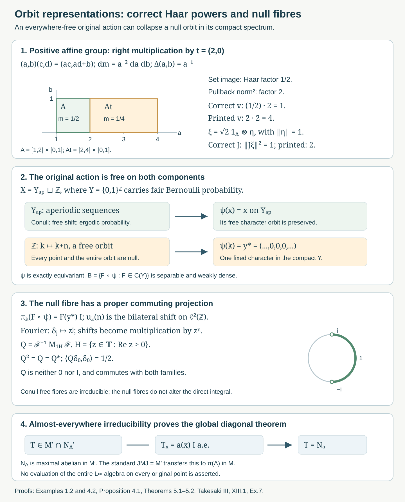

# Orbit representatives and null fibre exceptions

*Written by GPT-6.1 Sol (OpenAI), Ultra, October 2026. New original text is public domain (CC0).*

## Introduction

The regular crossed product disintegrates over the source variable. Its orbit representations are irreducible almost everywhere for a free action. This statement concerns a separable C*-algebra of chosen continuous representatives; evaluating the whole measured algebra at every orbit is not justified.

We give a complete corrected solution of Takesaki III, XIII.1, Exercise 7. Two corrections are needed. Its printed Haar powers in \(v(t)\) and \(J\) are reversed for a nonunimodular group. Its assertion of irreducibility at every original point also fails: an everywhere-free action may contain a null orbit that the chosen separable algebra collapses to a fixed character. Neither issue changes the maximal-diagonal conclusion, which follows from the corrected formulas and the conull orbit argument.

*Figure 1.* Panel 1 uses the positive affine group in (1.8) with the same Euclidean scale on both axes. For \(t=(2,0)\), \(A=[1,2]\times[0,1]\) maps to \(At=[2,4]\times[0,1]\), with Haar masses \(1/2\) and \(1/4\). The pullback factor is two; the corrected and printed squared \(v_t\)-norm factors are one and four. For \(\xi=\sqrt2\,\mathbf1_A\otimes\eta\), \(\|\eta\|=1\), the corrected and printed squared \(J\)-norms are one and two (Example 1.2 and Solution 6.1). Panel 2 is the exact equivariant map (4.3), schematically separating the conull aperiodic Bernoulli component and the free null integer orbit. Panel 3 draws the open right semicircle \(H\) on the unit circle at equal axis scales; its Fourier projection is proper and commutes with every null-fibre generator (Proposition 4.1 and Solution 6.5). Panel 4 records the operator-field argument of Theorems 5.1–5.2. The remaining panels depict maps and proof implications, not metric geometry on the Bernoulli space. Human source: Takesaki III, XIII.1, Exercise 7; Haar convention: Takesaki II, VII.3. Reproducible native source: work/make_orbit_figure.py; the complete arguments follow.

Read [Free actions and the crossed-product diagonal](free-actions-and-the-crossed-product-diagonal.md), Sections 1–3. We use its separable operator-field decomposition and its explicitly imported standard crossed-product conjugation theorem. The general identity \(JMJ=M'\) remains a crossed-product/modular-theory prerequisite. [Measurable actions and compact models](measurable-actions-and-compact-models.md), Lemma 3.1 and Theorems 4.1 and 4.4, supplies the separable continuous-function algebra and simultaneous conull point realization. [Compact fixed sets and free Polish models](compact-fixed-sets-and-free-polish-models.md), Theorem 3.3, supplies the invariant free restriction of its compact spectrum.

Throughout the source's ambient group convention is retained: \(G\) is separable locally compact Hausdorff, the nonzero base \(X\) is standard Borel with sigma-finite measure, and the action is jointly Borel and nonsingular. Absolute freeness means every point has trivial stabilizer. It forces faithfulness of the algebra action: if a nonidentity element acted trivially on \(L^\infty\), a countable separating family would make it fix almost every point. The compact-neighborhood injection argument in the free-action lesson, Theorem 3.3, then makes \(G\) second countable. Thus all Haar spaces and operator fields used below are separable and sigma-finite. Ergodicity is assumed by the source, but is unnecessary for the maximal-diagonal proof.

## 1. The regular formulas and their Haar powers

Let \(ds\) be left Haar measure, with the same convention as Takesaki II, VII.3, equations (2)–(3):
\[
\int_G F(st)\,ds=\Delta_G(t)^{-1}\int_G F(s)\,ds.
\tag{1.1}
\]
In particular the source's \(\delta_G\) equals this \(\Delta_G\), rather than its reciprocal. Write
\[
r_s(x)=\frac{d(s^{-1})_*\mu}{d\mu}(x)
=\frac{d(\mu\circ T_s)}{d\mu}(x).
\tag{1.2}
\]
The second notation uses \((\mu\circ T_s)(E)=\mu(T_sE)\). This is the \(\rho\) of Takesaki III, XIII.1, equation (2). The density is positive and finite almost everywhere, and for each fixed pair
\[
r_{st}(x)=r_s(tx)r_t(x).
\tag{1.3}
\]
The compact-model lesson gives jointly Borel versions; operator identities below are for every fixed label or pair, with no common uncountable exceptional set asserted.

On \(\mathcal H=L^2(G\times X,ds\,d\mu(x))\), put
\[
\begin{aligned}
(\pi(f)\xi)(s,x)&=f(sx)\xi(s,x),&
(N_f\xi)(s,x)&=f(x)\xi(s,x),\\
(u_t\xi)(s,x)&=\xi(t^{-1}s,x),\\
(v_t\xi)(s,x)&=\Delta_G(t)^{1/2}r_{t^{-1}}(x)^{1/2}
                   \xi(st,t^{-1}x),\\
(J\xi)(s,x)&=\Delta_G(s)^{-1/2}r_s(x)^{1/2}
                   \overline{\xi(s^{-1},sx)}.
\end{aligned}
\tag{1.4}
\]
Both multiplication families are faithful normal representations of \(L^\infty(X)\). This follows from nonsingularity and Fubini, as proved in the free-action lesson. The left translations \(u_t\) are unitary and
\[
u_t\pi(f)u_t^*=\pi(f\circ t^{-1}).
\tag{1.5}
\]
Their generated von Neumann algebra is \(M=L^\infty(X)\rtimes G\).

**Proposition 1.1.** The operators \(v_t\) in (1.4) form a unitary representation, commute with \(\pi(L^\infty(X))\) and all \(u_g\), and \(J\) is an antiunitary involution satisfying
\[
J\pi(f)J=N_{\overline f},\qquad Ju_tJ=v_t,\qquad JMJ=M'.
\tag{1.6}
\]
Consequently \(M'=(N_{L^\infty(X)}\cup v(G))''\).

*Proof.* In the squared norm of \(v_t\xi\), right translation of the Haar variable contributes \(\Delta_G(t)^{-1}\), canceled by the squared prefactor \(\Delta_G(t)\). The remaining base integral is unchanged because
\[
\int_X r_{t^{-1}}(x)F(t^{-1}x)\,d\mu(x)=\int_X F(y)\,d\mu(y).
\]
This proves unitarity. Formula (1.3), with labels \(h^{-1},t^{-1}\), gives
\[
r_{(th)^{-1}}(x)=r_{h^{-1}}(t^{-1}x)r_{t^{-1}}(x);
\]
substitution in (1.4) proves \(v_tv_h=v_{th}\). Strong continuity follows from the canonical change-of-variable representation on \(L^2(X)\) and the right regular representation on \(L^2(G)\), as in the continuity and standard-implementation prerequisites.

The transformation \((s,x)\mapsto(st,t^{-1}x)\) fixes \(sx\), so \(v_t\) commutes with \(\pi(f)\). It commutes with \(u_g\) because left and right group translations commute and its coefficient is independent of \(s\). The source multipliers \(N_f\) also commute with every generator of \(M\).

For \(J\), first change \(x\) to \(sx\), using
\(\int r_s(x)F(sx)\,d\mu(x)=\int F\,d\mu\), and then use Haar inversion:
\[
\int_G \Delta_G(s)^{-1}F(s^{-1})\,ds=\int_G F(t)\,dt.
\tag{1.7}
\]
This proves its conjugate-linear isometry. Equation (1.3) with \(t=s^{-1}\) gives \(r_s(x)r_{s^{-1}}(sx)=1\) almost everywhere, so \(J^2=1\).

Substitution gives \(J\pi(f)J=N_{\overline f}\). For \(Ju_tJ\), the group argument becomes \(st\), the base argument becomes \(t^{-1}x\), and the density coefficient is
\[
\Delta_G(t)^{1/2}
\bigl[r_s(x)r_{t^{-1}s^{-1}}(sx)\bigr]^{1/2}
=\Delta_G(t)^{1/2}r_{t^{-1}}(x)^{1/2}.
\]
Thus it is \(v_t\). The remaining identity \(JMJ=M'\) is the stated standard regular crossed-product theorem; isometry and the displayed generator calculations alone would not prove equality with the full commutant. The free-action lesson gives its exact use. In Takesaki II, X.1, Lemmas 1.13–1.15 construct this conjugation through the regular left Hilbert algebra. Applying it to the generating families gives the last assertion. \(\square\)

**Example 1.2 (the printed powers fail on the affine group).** Let \(G=\{(a,b):a>0,\ b\in\mathbb R\}\), with
\[
(a,b)(c,d)=(ac,ad+b),\quad
dm(a,b)=a^{-2}\,da\,db,\quad \Delta_G(a,b)=a^{-1}.
\tag{1.8}
\]
Let \(G\) act on \(X=G\) by left translation and use \(\mu=m\). This action is absolutely free, transitive, ergodic, and nonsingular; all \(r_s\) are one.

The printed \(v_t\) has coefficient \(\Delta_G(t)^{-1/2}\). Its squared norm is
\[
\|v_t^{\mathrm{print}}\xi\|^2
=\Delta_G(t)^{-2}\|\xi\|^2.
\tag{1.9}
\]
For \(t=(2,0)\), the factor is four. Right multiplication sends \((a,b)\) to \((2a,b)\), with Euclidean Jacobian two and Haar set-image factor \(1/2\); equivalently its pullback integral has factor two. The correct squared coefficient is \(1/2\), whereas the printed one is two.

The printed \(J\) has coefficient \(\Delta_G(s)^{1/2}\). After Haar inversion its squared norm is
\[
\|J^{\mathrm{print}}\xi\|^2
=\int_{G\times G}\Delta_G(t)^{-2}|\xi(t,y)|^2\,dm(t)\,dm(y).
\tag{1.10}
\]
Take \(A=\{(a,b):1\leq a\leq2,\ 0\leq b\leq1\}\) and a unit vector \(\eta\in L^2(G,m)\). Since \(m(A)=1/2\), the vector \(\xi(s,x)=\sqrt2\,\mathbf1_A(s)\eta(x)\) has norm one. The integral \(\int_A a^2\,dm=\int_1^2\int_0^1 1\,db\,da=1\) makes its printed \(J\)-image have squared norm two. In fact the printed operator is unbounded on its natural domain. The corrected powers in (1.4) have norm one in both tests. This compares the source's own Haar convention, not two different conventions for the modular function.

## 2. Endpoint coordinates and Haar measures on the orbits

**Proposition 2.1.** Absolute freeness is equivalent to injectivity of
\[
\Phi:G\times X\longrightarrow X\times X,\qquad
\Phi(s,x)=(sx,x).
\tag{2.1}
\]
Under it, the image \(R\) is Borel, \(\Phi^{-1}\) is Borel on \(R\), and
\[
\widetilde\mu=\Phi_*(ds\,d\mu)
\tag{2.2}
\]
is a sigma-finite Borel measure on \(R\).

*Proof.* Equality of two images gives equal sources \(x\) and \(s x=t x\). Thus \(t^{-1}s\) stabilizes \(x\); absolute freeness gives \(s=t\). Conversely a nonidentity stabilizer gives equal images of \((h,x)\) and \((e,x)\). The map is jointly Borel. Since \(G\times X\) and \(X\times X\) are standard Borel, the injective Borel image theorem gives a Borel image and inverse. Images of a countable cover by finite-product-measure Borel sets are Borel and cover \(R\); injectivity makes their pushforward measures finite. Thus (2.2) is sigma-finite. \(\square\)

For each \(x\), the orbit map is a Borel bijection of \(G\) with its Borel orbit \(Gx\). Give that orbit the Haar transport
\[
\nu_x(E)=\int_G\mathbf1_E(sx)\,ds.
\tag{2.3}
\]
It is sigma-finite and is not a counting measure when \(G\) is nondiscrete. For every nonnegative Borel \(F\) on \(R\), Tonelli gives
\[
\int_R F(y,x)\,d\widetilde\mu(y,x)
=\int_X\left[\int_{Gx}F(y,x)\,d\nu_x(y)\right]d\mu(x).
\tag{2.4}
\]

**Proposition 2.2 (the orbit Hilbert field).** There are canonical unitary identifications
\[
\mathcal H\cong L^2(R,\widetilde\mu)
\cong\int_X^\oplus L^2(Gx,\nu_x)\,d\mu(x).
\tag{2.5}
\]
They are given by \((Q\xi)(sx,x)=\xi(s,x)\). Pullback along each orbit map identifies every fibre with \(L^2(G)\).

*Proof.* Formula (2.4) proves preservation of the squared norm and surjectivity of \(Q\), since the joint inverse in Proposition 2.1 is Borel. The measurable field can be constructed explicitly rather than inferred from the notation \(L^2(Gx)\): choose a countable dense family \(\eta_j\) in \(L^2(G)\), with Borel representatives, and transport it by
\[
\eta_j^x(sx)=\eta_j(s).
\tag{2.6}
\]
The functions \((y,x)\mapsto\eta_j(\Phi^{-1}(y,x)_G)\) are Borel on \(R\). Their fibre inner products are the constant inner products of the \(\eta_j\)'s, and they are total in every fibre. They define a measurable separable Hilbert field; the transported trivialization identifies its measurable square-integrable sections with \(L^2(G\times X)\). The direct integral formula is consequently precisely (2.4), not an unproved choice of measures on the orbits. \(\square\)

These assertions concern every orbit as a Borel Haar space under absolute freeness. They do not say that the global measured algebra has a normal pointwise representation on every such fibre.

## 3. Continuous representatives on a conull invariant set

Let \(B\subset L^\infty(X,\mu)\) be separable, invariant, ultraweakly dense, and norm continuous under the action. The source does not require it to be unital. Set \(B^+=C^*(B,1)\). Adjoining the identity changes neither a representation's commutant nor the von Neumann algebra generated together with the group unitaries. We form the compact metrizable spectrum \(\Gamma=\operatorname{Spec}(B^+)\).

The compact-model theorem gives a normal covariant identification with \(L^\infty(\Gamma,m)\), where \(m\) can be chosen to be a probability measure in the represented measure class. If \(B\) is nonunital, discard the characters that vanish on \(B\). This is an invariant closed null subset: a sequential positive contractive approximate identity of \(B\) converges strongly to \(1\) in \(B''=L^\infty(X)\), and normality of the faithful-state integral makes its integrals converge to one. Its character values vanish on this closed subset and are at most one everywhere, so that subset must be null. On every remaining character the approximate identity tends to one. Existence of a sequential approximate identity for a separable C*-algebra is the usual C*-algebra prerequisite.

The simultaneous point theorem gives an equivariant measure-class Borel isomorphism \(\phi:X_0\to\Gamma_1\) between invariant conull Borel subsets. Intersect its image with the invariant free subset of the compact spectrum and with the nonvanishing-character set just described, and pull back; we continue to call the resulting invariant conull original subset \(X_0\).

Identify \(B^+\) with \(C(\Gamma)\). For \(f\in B\), choose its representative on \(X_0\) to be
\[
f^\#(x)=\widehat f(\phi(x)).
\tag{3.1}
\]
It represents the original measurable class. For every \(x\in X_0\), the map
\[
f_x(s)=\widehat f(s\phi(x))
\tag{3.2}
\]
is continuous. The equivariant \(\phi\) is injective, so these functions separate the group labels on each such orbit.

More generally, (3.2) is continuous at every point of any Borel model carrying characters \(\chi_x\in\Gamma\) with \(\chi_{tx}=t\chi_x\) exactly. Norm continuity of \(\alpha\) gives continuity after evaluation by the contractive character. What is not justified is evaluating an arbitrary \(L^\infty\) representative at every original point and inferring continuity from its class.

**Proposition 3.1 (covariant fibre representations).** For \(x\in X_0\), define on \(K=L^2(G)\)
\[
(\pi_x(f)\eta)(s)=\widehat f(s\phi(x))\eta(s),\qquad
(u_x(t)\eta)(s)=\eta(t^{-1}s).
\tag{3.3}
\]
This is a nondegenerate covariant representation of \((B,G,\alpha)\), and
\[
(\pi|_B,u)=\int_X^\oplus(\pi_x,u_x)\,d\mu(x)
\tag{3.4}
\]
as an almost-everywhere field. Fibre values off \(X_0\) can be assigned arbitrarily without changing the integral.

*Proof.* Evaluation along the orbit of \(B^+\) is a unital *-homomorphism into bounded multipliers and has norm at most \(\|f\|\). Restrict it to \(B\). The left regular representation is strongly continuous, and
\[
u_x(t)\pi_x(f)u_x(t)^*\eta(s)
=\widehat f(t^{-1}s\phi(x))\eta(s)
=\pi_x(\alpha_t f)\eta(s).
\]
Joint Borel measurability of the orbit action and \(\phi\) makes the field measurable when tested against a countable dense family of \(L^2(G)\) vectors. Formula (3.1), invariance of \(X_0\), and exact equivariance give \(f^\#(sx)=\widehat f(s\phi(x))\) there for every \(s\). Multiplication by this representative is the original normal \(\pi(f)\), by nonsingularity and Fubini. The left translations act identically in each source fibre. This proves (3.4). Under (2.5), the fibre shift is equivalently the Haar-measure-preserving map \(y\mapsto t^{-1}y\) on \(Gx\). \(\square\)

For a nonunital \(B\), the fibre restrictions are nondegenerate on \(X_0\): at every \(s\phi(x)\), its approximate identity tends to one, and dominated convergence against any Haar-square-integrable vector gives strong convergence to the identity. The fibre algebra in (3.3) is the C*-algebra \(B\). Normality of the global representation of \(L^\infty(X)\) does not imply normality of a proposed evaluation representation of that entire algebra on each fibre.

## 4. A free null orbit can have a reducible representation

Let \(Y=\{0,1\}^{\mathbb Z}\) with its compact product topology and fair product probability \(p\). Write
\[
(Sy)_j=y_{j-1},\qquad
Y_{\mathrm{ap}}=Y\setminus\bigcup_{k\ge1}\operatorname{Fix}(S^k),
\qquad y_*=(0)_{j\in\mathbb Z}.
\tag{4.1}
\]
Every \(\operatorname{Fix}(S^k)\) has only \(2^k\) points. Each point has probability zero because specifying \(N\) independent coordinates has probability \(2^{-N}\). Thus \(Y_{\mathrm{ap}}\) is an invariant conull Borel subset, and its shift action is free at every point.

**Proposition 4.1 (a null-fibre counterexample satisfying all the source hypotheses).** There is an everywhere-free ergodic probability-preserving action of \(\mathbb Z\) on a standard Borel space \(X\), and a separable unital invariant ultraweakly dense C*-algebra \(B\subset L^\infty(X)\), with strictly equivariant point representatives, for which the source's orbit representation is reducible at every point of a null orbit.

*Proof.* Put
\[
X=Y_{\mathrm{ap}}\sqcup\mathbb Z,\qquad
\mu(E)=p(E\cap Y_{\mathrm{ap}}),
\tag{4.2}
\]
and let \(T_n\) act by \(S^n\) on the first component and by \(k\mapsto k+n\) on the second. A countable disjoint union of standard Borel spaces is standard Borel. The action is jointly Borel, preserves \(\mu\), and is absolutely free on both components.

The Bernoulli shift is mixing and hence ergodic. Here is the argument. For cylinder sets \(C,D\) determined by finitely many coordinates, those coordinates and the coordinates determining \(S^{-n}D\) are disjoint for sufficiently large \(|n|\). Independence gives \(p(C\cap S^{-n}D)=p(C)p(D)\). The cylinder algebra approximates every measurable set in measure, because it generates the product sigma-field. Approximating two arbitrary sets by cylinders, and bounding the intersection error by the sum of their symmetric-difference measures, gives the same limit for arbitrary measurable sets. If a set \(E\) is invariant as a class, its return intersection has measure \(p(E)\); mixing makes this limit \(p(E)^2\). Therefore \(p(E)=0\) or \(1\). Deleting the null periodic set and adjoining a null component preserves this conclusion.

Define the Borel map
\[
\psi(x)=
\begin{cases}
x,&x\in Y_{\mathrm{ap}},\\
y_*,&x\in\mathbb Z.
\end{cases}
\tag{4.3}
\]
It is exactly equivariant, because \(Sy_*=y_*\). Realize
\[
B=\{F\circ\psi:F\in C(Y)\}
\tag{4.4}
\]
as a subalgebra of measurable classes, with the displayed chosen representatives. Fair product probability has full support: every nonempty cylinder has positive measure, and cylinders form a base. Thus a nonzero continuous function is nonzero on a set of positive measure. The map \(C(Y)\to B\) is an isometric unital *-isomorphism, even after the null periodic deletion. It is separable, since continuous cylinder functions with rational complex values are norm dense. Its action is norm continuous because \(\mathbb Z\) is discrete, and invariance follows from (4.3).

Cylinder functions generate the measured sigma-field on \(Y_{\mathrm{ap}}\), and the other component is null. Their multiplication projections generate \(L^\infty(X,\mu)\) by the monotone-class theorem. Hence \(B\) is ultraweakly dense. All source hypotheses, including ergodicity and absolute freeness of the original action, are satisfied.

For \(x=k\in\mathbb Z\), every \(T_nx\) belongs to the null component and \(\psi(T_nx)=y_*\). Therefore on \(\ell^2(\mathbb Z)\),
\[
\pi_k(F\circ\psi)=F(y_*)1,\qquad
(u_k(n)\eta)(j)=\eta(j-n).
\tag{4.5}
\]
These are genuine nondegenerate covariant representations, and their orbit functions are continuous in the discrete topology. They are reducible. Under the Fourier unitary \(\mathcal F:\ell^2(\mathbb Z)\to L^2(\mathbb T)\), \(\mathcal F\delta_j=z^j\), the shifts are multiplication by \(z^n\). For the open semicircle \(H=\{z:\operatorname{Re}z>0\}\),
\[
Q=\mathcal F^{-1}M_{\mathbf1_H}\mathcal F
\tag{4.6}
\]
is a nonzero proper projection commuting with every shift and every scalar operator in (4.5). Fourier unitarity follows from completeness of the trigonometric functions in \(L^2(\mathbb T)\), the standard Fourier/continuous-function density prerequisite. Since Haar probability of \(H\) is \(1/2\), \(\langle Q\delta_0,\delta_0\rangle=1/2\), which also proves it is nonzero and proper.

At points of \(Y_{\mathrm{ap}}\), the orbit in \(Y\) is injectively parametrized and the continuous functions separate its labels. Section 5 proves irreducibility there. The exceptional original orbit has measure zero, so it does not change the direct integral or the maximal-diagonal conclusion. \(\square\)

The full compact spectrum of \(B\) is \(Y\). Its fixed point \(y_*\) is a null character. Freeness of the original point action is therefore compatible with a nonfree character assigned to an entire null original orbit. Ultraweak density only controls the measured algebra.

**Example 4.2 (continuity depends on the representatives).** Let \(\mathbb R\) translate \(X=\mathbb R\) with Lebesgue measure, and take \(B=C_0(\mathbb R)+\mathbb C1\). This is separable, invariant, ultraweakly dense, and norm continuous under translation; continuous functions vanishing at infinity are uniformly continuous. Its spectrum is the one-point compactification \(\mathbb R\cup\{\infty\}\).

Choose representatives by evaluating at \(x\) when \(x\ne0\), and at the character \(\infty\) when \(x=0\). These are simultaneous unital *-homomorphic point evaluations of \(B\), represent the same measurable classes, and remain contractive. For \(f(x)=e^{-x^2}\), the chosen representative is
\[
f^\flat(x)=
\begin{cases}e^{-x^2},&x\ne0,\\0,&x=0.\end{cases}
\tag{4.7}
\]
For every \(x\), \(s\mapsto f^\flat(s+x)\) is discontinuous at \(s=-x\). Thus norm continuity of the algebra action alone does not make arbitrary chosen orbit representatives continuous. These point evaluations are not exactly equivariant, although the measurable classes intertwine correctly.

The corresponding Haar multiplication operator is unchanged by the single bad group label in each orbit. Continuous orbit versions exist, but pointwise continuity of all chosen representatives is a separate assertion. The conull strict compact-model choice in Section 3 supplies the correct versions for the fibre argument; it does not assign normal evaluations of all \(L^\infty\) classes to every original point.

## 5. The conull irreducibility proof gives the maximal diagonal

**Theorem 5.1 (irreducibility on the strict free model).** For every \(x\in X_0\) in Section 3, the covariant C*-representation \((\pi_x,u_x)\) is irreducible.

*Proof.* Choose a countable norm-dense family \(f_j\) in \(B^+\). It separates the characters of \(\Gamma\). The map
\[
s\longmapsto\bigl(\widehat f_j(s\phi(x))\bigr)_{j\ge1}
\tag{5.1}
\]
is a continuous injection: equality of its values gives equal characters, and the free point \(\phi(x)\) then gives equal group labels. The injective Borel image theorem shows that the coordinate sigma-field of (5.1) is the whole Borel sigma-field of \(G\). Hence the bounded orbit multipliers \(\pi_x(f_j)\) generate all Haar multiplication operators \(L^\infty(G)\).

An operator commuting with all these multipliers is itself a multiplier \(M_h\), by the scalar maximal-abelian lemma proved in the free-action lesson. If it also commutes with all left translations, then
\[
h(t^{-1}s)=h(s)\quad\text{for Haar-almost every }s,\text{ for every fixed }t.
\tag{5.2}
\]
Choose a bounded Borel representative of \(h\). The exceptional set in \((t,s)\) is product measurable, and every fixed-\(t\) section is null. Haar sigma-finiteness permits Fubini. Changing \(t\) to \(t^{-1}s\) for each fixed \(s\) preserves the Haar measure class. Thus \(h(r)=h(s)\) for Haar-almost every pair \((r,s)\), so \(h\) is essentially constant. The joint commutant is scalar, proving irreducibility. For a nonunital \(B\), adding the identity has not changed this commutant, and Section 3 proved nondegeneracy of the restriction. \(\square\)

**Theorem 5.2 (the corrected source conclusion).** For a jointly Borel nonsingular action that is free almost everywhere at the standing group and base scope, the source multiplication algebra \(N_{L^\infty(X)}\) is maximal abelian in \(M'\), and \(\pi(L^\infty(X))\) is maximal abelian in \(M\). If the action is ergodic, \(M\) is a factor. The proof requires fibre irreducibility only almost everywhere in the original base.

*Proof.* Almost-everywhere freeness still makes the algebra action faithful and the group second countable by the free-action lesson, Theorem 3.3. The simultaneous compact point model preserves stabilizers on invariant conull sets. Intersecting it with the invariant free compact restriction gives the strict free \(X_0\) needed in Section 3. Thus Theorem 5.1 applies to every point of this conull set.

Let \(T\in M'\) commute with every source multiplier \(N_f\). The separable field lemma in the free-action lesson decomposes it as a measurable bounded field \(T_x\) on \(L^2(G)\). Because \(T\in M'\), it commutes with \(\pi(B)\) and \(u(G)\). Test these identities on a countable norm-dense family in \(B^+\) and a countable dense family of group labels. Uniqueness of separable field decomposition makes the corresponding fibre commutations hold outside one null set. Norm continuity of the represented C*-algebra extends them to all \(B^+\); strong continuity of the left regular representation extends them to all group labels. By Theorem 5.1, \(T_x\) is scalar for almost every \(x\).

The scalar is measurable: choose a fixed unit vector \(\eta\in L^2(G)\) and put \(a(x)=\langle T_x\eta,\eta\rangle\). It is bounded by \(\|T\|\). Hence \(T=N_a\). Conversely every source multiplier already belongs to \(M'\), so this proves its maximal abelianness there. The identity \(JMJ=M'\), together with \(J\pi(f)J=N_{\overline f}\), transfers this conclusion to \(\pi(L^\infty(X))\subset M\).

A central element now lies in the diagonal. Covariance and faithfulness identify the centre with the fixed function classes. The invariant-representative argument in the free-action lesson, Proposition 4.7, equates their constancy with ergodicity. Thus ergodicity gives a factor. No assertion about the values of \(T_x\) or the irreducibility of its C*-orbit representation on the exceptional null base is needed. \(\square\)

This completes the corrected Exercise 7. Parts (b)–(c) hold exactly under absolute freeness. Part (a) uses the corrected Haar powers. Parts (d)–(e) are realized with coherent compact-model representatives on an invariant conull set. The every-original-point assertion in (f) is refuted by Proposition 4.1, while its intended maximal-diagonal conclusion is proved at the full measured scope.

## 6. Exercises with complete solutions

Level 1 asks for a computation. Level 2 asks for a proof with the lesson's framework. Level 3 combines representation, measure, and operator-algebra arguments.

**Exercise 6.1 (both printed Haar powers).** *Level 2.* In Example 1.2, verify the right-translation Jacobian and both norm failures. Explain why these tests meet the source's absolute-freeness and ergodicity hypotheses.

*Solution.* For \(t=(2,0)\), \(s=(a,b)\) gives \(st=(2a,b)\), with Euclidean Jacobian two. Its Haar set-image density is \((2a)^{-2}2=a^{-2}/2\), so \(\Delta_G(t)=1/2\). Pullback integration by \(s\mapsto st\) therefore multiplies the integral by two. The printed squared prefactor in \(v_t\) is \(\Delta_G(t)^{-1}=2\), producing squared norm factor four. The corrected prefactor is \(\Delta_G(t)=1/2\), producing factor one.

For \(J\), left translation of the base leaves its Haar integral unchanged, and inversion of the first variable contributes \(\Delta_G(t)^{-1}\). The printed \(\Delta_G(s)\) becomes another \(\Delta_G(t)^{-1}\), giving the multiplier \(\Delta_G(t)^{-2}=a^2\) in (1.10). On \(A=[1,2]\times[0,1]\), \(m(A)=\int_1^2a^{-2}\,da=1/2\) and \(\int_Aa^2\,dm=1\). The normalized vector \(\sqrt2\,\mathbf1_A\otimes\eta\) therefore has printed squared image norm two. The corrected \(\Delta_G(s)^{-1}\) becomes \(\Delta_G(t)\), canceling inversion and giving norm one. Unit vectors supported on \([L,L+1]\times[0,1]\) give printed squared \(J\)-norm at least \(L^2\), proving unboundedness.

Left translation on \(G\) is free at every point and transitive. An invariant Borel subset is empty or the whole group; equivalently invariant function classes are constants by the Haar/Fubini argument of Theorem 5.1. The action preserves left Haar measure, which is a nonzero standard sigma-finite measure. Thus the counterexample is at the full source scope, rather than an action lacking ergodicity or freeness.

**Exercise 6.2 (the right commuting representation).** *Level 2.* Derive the composition law for \(v_t\), prove its commutation with \(\pi(f)\) and \(u_g\), and identify the part of (1.6) requiring a general prerequisite.

*Solution.* The coefficient of \(v_tv_h\) is
\[
\Delta_G(t)^{1/2}\Delta_G(h)^{1/2}
r_{t^{-1}}(x)^{1/2}r_{h^{-1}}(t^{-1}x)^{1/2}.
\]
The modular function is multiplicative, and (1.3) makes the density product \(r_{h^{-1}t^{-1}}(x)=r_{(th)^{-1}}(x)\). The argument of the vector becomes \((sth,h^{-1}t^{-1}x)\), exactly the argument for \(v_{th}\). Thus \(v_tv_h=v_{th}\). Haar and base changes of variables in Proposition 1.1 prove norm preservation, and \(v_{t^{-1}}\) is the inverse.

The orbit position is unchanged: \((st)(t^{-1}x)=sx\). Therefore its multiplication by \(f(sx)\) commutes with \(v_t\). Left translation of \(s\) commutes with right translation, and the density coefficient is independent of \(s\), proving commutation with \(u_g\). Substitution and (1.3) prove \(J\pi(f)J=N_{\overline f}\) and \(Ju_tJ=v_t\). The full equality \(JMJ=M'\) uses the regular crossed-product standard-form theorem. Commutation, isometry, and generator calculations give an inclusion into the commutant; they do not by themselves prove the full equality.

**Exercise 6.3 (Haar measure rather than counting).** *Level 2.* For \(\mathbb R\) translating \(X=\mathbb R\) with Lebesgue measure, identify \(R,\widetilde\mu,\nu_x\) and \(Q\). Explain the measure-class difference from a countable discrete relation.

*Solution.* Every pair \((y,x)\in\mathbb R^2\) lies in the orbit relation, and \(\Phi(s,x)=(s+x,x)\) is a Borel bijection with inverse \((y,x)\mapsto(y-x,x)\). Its Euclidean Jacobian is one, so \(\widetilde\mu=dy\,dx\). For each \(x\), the orbit Haar transport is \(dy\), not counting measure. The unitary is
\[
(Q\xi)(y,x)=\xi(y-x,x),
\qquad
\|\xi\|^2=\int_{\mathbb R}\int_{\mathbb R}|Q\xi(y,x)|^2\,dy\,dx.
\]
A singleton in the orbit has zero Haar measure; its counting measure would be one. Counting all real orbit points would not give a sigma-finite measure. The direct integral is consequently \(\int^\oplus L^2(\mathbb R,dy)\,dx\), with the exact Haar fibre measure. For a countable discrete group, Haar measure can be normalized as counting, and a free orbit map transports it to counting distinct orbit points instead.

**Exercise 6.4 (check the null-orbit example).** *Level 2.* Verify absolute freeness, ergodicity, norm continuity, ultraweak density, and strict point covariance in Proposition 4.1. Identify which source claim fails.

*Solution.* On \(Y_{\mathrm{ap}}\), no nonzero integer shift fixes a point by its definition; on the adjoined \(\mathbb Z\), translation fixes no point. Thus the action is absolutely free. Periodic Bernoulli points form a countable null set. Independence of disjoint finite coordinate sets proves mixing for cylinders; approximation in measure proves it for all measurable sets; an invariant set then has mass equal to its squared mass. Adjoining the null component preserves ergodicity and the probability measure.

The compact Bernoulli space is metrizable, and rational cylinder functions are norm dense in \(C(Y)\), so \(B\) is separable. The discrete group makes its action norm continuous. The representatives \(F\circ\psi\) are strictly covariant because \(\psi(T_nx)=S^n\psi(x)\), including on the null orbit since \(y_*\) is fixed. Full support makes their inclusion in the measured algebra isometric and faithful. Cylinder projections generate the measured sigma-field on the conull component, giving ultraweak density.

At every point of the null component, \(B\) acts by \(F(y_*)1\), while the group acts by the bilateral shift. The proper commuting projection (4.6) proves reducibility. All source hypotheses and pointwise continuity of these orbit functions are present; the assertion in part (f) that every original point has an irreducible orbit representation fails. The conclusion about the measured diagonal remains true.

**Exercise 6.5 (a proper commuting projection).** *Level 1.* Compute the matrix entries of \(Q\) in (4.6), and check that it commutes with the bilateral shift.

*Solution.* Parametrize \(z=e^{i\theta}\) and use Haar probability \(d\theta/(2\pi)\). For \(d=j-k\),
\[
\langle Q\delta_j,\delta_k\rangle
=\frac1{2\pi}\int_{-\pi/2}^{\pi/2}e^{id\theta}\,d\theta
=\begin{cases}
1/2,&d=0,\\
\sin(d\pi/2)/(\pi d),&d\ne0.
\end{cases}
\]
The entries depend only on \(j-k\), so simultaneous translation of both indices leaves them unchanged. Equivalently, Fourier multiplication by \(\mathbf1_H\) commutes with multiplication by \(z^n\). It is a self-adjoint projection because \(\mathbf1_H^2=\mathbf1_H\). The diagonal value \(1/2\) makes it neither zero nor the identity. It commutes with the scalar coefficients in every null fibre as well.

**Exercise 6.6 (why normal evaluation cannot be assumed).** *Level 3.* At \(y\in Y_{\mathrm{ap}}\), prove that the C*-orbit representation of Proposition 4.1 cannot extend to a normal representation of \(L^\infty(Y,p)\) with the same values on \(C(Y)\).

*Solution.* Suppose such a normal extension \(\rho\) existed. Its vector functional at \(\delta_0\in\ell^2(\mathbb Z)\),
\(\omega(a)=\langle\rho(a)\delta_0,\delta_0\rangle\), would be normal. Formula (3.3) at the identity group label gives \(\omega(F)=F(y)\) for every continuous \(F\); in particular \(\omega(1)=1\). A normal positive functional on \(L^\infty(Y,p)\) has an \(L^1(p)\) density \(h\ge0\), so it would give the finite Borel measure \(h\,p\). Agreement with continuous functions and uniqueness in the Riesz representation theorem make this measure \(\delta_y\). But \(p(\{y\})=0\), whereas \(\delta_y(\{y\})=1\), contradicting absolute continuity. Thus no normal extension exists. This example uses the non-atomic Bernoulli base; a conull transitive Haar orbit has a different measured representation and is not excluded by this argument.

**Exercise 6.7 (a discontinuous chosen representative).** *Level 2.* Check Example 4.2. Why is \(B\) still a norm-continuous C*-subalgebra of the measured algebra, and why does the discontinuity not change the Haar multiplier on a fibre?

*Solution.* At each \(x\ne0\), evaluation at \(x\) is a contractive unital character of \(C_0(\mathbb R)+1\); at \(x=0\), evaluation at the compactification point \(\infty\) is also such a character. Thus the chosen representatives preserve all algebra operations pointwise and are uniformly bounded by their C*-norm. Changing only the value at zero changes no Lebesgue class. The original inclusion and norm-continuous translation action on the classes therefore remain unchanged, and \(C_0(\mathbb R)+1\) is weakly dense by continuous-function approximation for Lebesgue measure.

The representative of \(e^{-x^2}\) equals zero at zero and tends to one nearby. Hence its orbit function at any \(x\) jumps at \(s=-x\). The representatives are not exactly equivariant: translating the exceptional original point does not translate the chosen compactification character. On the Haar group coordinate, this changes one point only, so its multiplication operator equals that of the continuous \(s\mapsto e^{-(s+x)^2}\). The source's pointwise assertion and the operator identity are different statements. Section 3 chooses a common conull invariant strict model rather than inferring the former from the latter.

**Exercise 6.8 (almost everywhere is enough).** *Level 3.* Prove the maximal-diagonal conclusion using only almost-everywhere fibre irreducibility, retaining the nonunital \(B\) and nondiscrete group cases.

*Solution.* Adjoin the identity to \(B\); commutants are unchanged. Its compact normal model and simultaneous point realization give an invariant conull strict free original subset. The null characters vanishing on a nonunital \(B\) are discarded by its sequential approximate identity and the faithful normal integral. On this conull set the C*-orbit multipliers separate the group labels. Countably many continuous coordinates generate the Borel sigma-field of \(G\) by the injective image theorem, so they generate all Haar multipliers. Their commutant consists of multipliers, and commutation with the left regular group makes each multiplier constant by Haar Fubini and change of variables. Thus the fibre joint commutants are scalar almost everywhere, with no unimodularity or counting-measure assumption.

For \(T\in M'\cap N_{L^\infty(X)}'\), the separable field lemma gives \(T=\int^\oplus T_x\,d\mu\). Test commutation with a countable norm-dense family of \(B^+\) and countably many dense group labels. Remove one null set; norm and strong continuity extend the fibre commutations to all coefficients and group labels. Fibre irreducibility gives \(T_x=a(x)1\) almost everywhere, and its coefficient against a fixed unit vector makes \(a\) measurable and bounded. Hence \(T=N_a\), proving the source diagonal maximal abelian in \(M'\). The standard regular conjugation \(JMJ=M'\) and \(J\pi(f)J=N_{\overline f}\) give maximal abelianness of the coefficient diagonal in \(M\). The exceptional null fibres contribute nothing to the integral and require no irreducibility assertion.

## References and source disposition

[Takesaki III] Masamichi Takesaki, *Theory of Operator Algebras III*, Encyclopaedia of Mathematical Sciences 127, Springer, 2003. XIII.1, equation (2), the proof of Theorem 1.5, and Exercise 7 5–6, 12–13. [Publisher record](https://doi.org/10.1007/978-3-662-10453-8).

[Takesaki II] Masamichi Takesaki, *Theory of Operator Algebras II*, Encyclopaedia of Mathematical Sciences 125, Springer, 2003. VII.3, equations (2), (2′), and (3); X.1, Lemmas 1.13–1.15. [Publisher record](https://doi.org/10.1007/978-3-662-10451-4).

The Haar powers in Exercise 7(a) and the every-original-point irreducibility assertion in 7(f) receive a completed corrective disposition, not literal proof closure. The source's theorem proof already uses irreducibility almost everywhere. The representation-dependent continuity statement in 7(d) is made precise through a strict conull compact model; an arbitrary measurable representative need not have its stated pointwise continuity. The global maximal-diagonal conclusion is fully proved under the explicit standard crossed-product conjugation, Borel-image, Radon–Nikodym, C*-approximate-identity and Fourier prerequisites.
