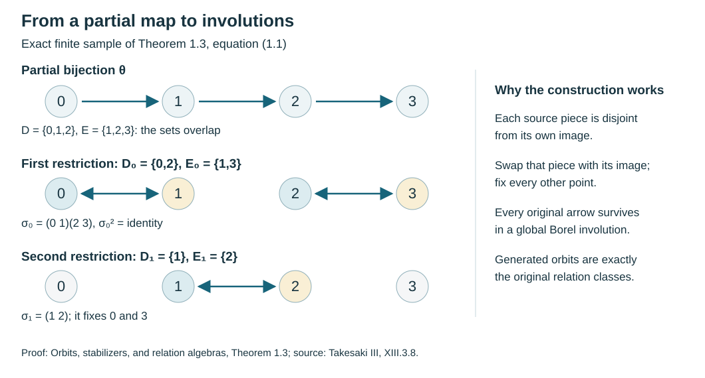

# Orbits, stabilizers, and relation algebras

*Written by GPT-6.1 Sol (OpenAI), Ultra, September 2026. New original text is public domain (CC0).*

## Introduction

A group action contains two kinds of information. It says which points can be reached from one another, and it records every group element that makes the journey. Those records coincide for a free action. A stabilizer makes them different: several group elements can describe the same journey.

We will construct an algebra that remembers the journeys between points. Its diagonal algebra consists of functions on the original space. We prove that this diagonal is maximal abelian, compute the centre, and explain why an ergodic orbit relation gives a factor even when the action has stabilizers. The proof uses concrete operators and one distinguished vector.

We assume measure theory through the Radon–Nikodym theorem and basic Hilbert space operator theory through the double commutant theorem. Useful preparatory lessons are [Polish spaces and standard Borel spaces](https://kokunoyumeto.github.io/open-math-courses-public/courses/foundations-of-von-neumann-algebras/polish-spaces-and-standard-borel-spaces.html), [Measurable fields of Hilbert spaces and their direct integrals](https://kokunoyumeto.github.io/open-math-courses-public/courses/OA-FOUND-REMAINDER/reader/supplements/measurable-fields-direct-integrals.html), and [The double commutant theorem](https://kokunoyumeto.github.io/open-math-courses-public/courses/foundations-of-von-neumann-algebras/the-double-commutant-theorem.html). [Measured groupoids and transverse measures](https://kokunoyumeto.github.io/open-math-courses-public/courses/NCG-FOLIATIONS/companions/measured-groupoids-and-transverse-measures.html) gives the wider setting, and [Square-integrable representations and random operators](https://kokunoyumeto.github.io/open-math-courses-public/courses/NCG-FOLIATIONS/companions/square-integrable-representations-and-random-operators.html) develops its representation theory.

Basic references are [Anantharaman–Popa], [Connes], and [Takesaki]. The arguments below are complete in the countable-action setting stated here.

## 1. Two ways to record an action

Let a countable group \(\Gamma\) act by Borel bijections on a standard Borel space \(X\). Let \(\mu\) be a nonzero sigma-finite measure such that every group element preserves its null sets. We call the action *nonsingular*. Equalities involving measurable functions are understood almost everywhere.

The transformation groupoid has arrows \((g,x)\), going from \(x\) to \(gx\). Its composition is

\[
(h,gx)(g,x)=(hg,x).
\]

The orbit relation is

\[
R=\{(z,x)\in X\times X:z=gx\text{ for some }g\in\Gamma\}.
\]

An arrow \((z,x)\) goes from \(x\) to \(z\), and

\[
(w,z)(z,x)=(w,x),\qquad (z,x)^{-1}=(x,z).
\]

There is just one arrow from \(x\) to \(z\) in \(R\). In particular, the only arrow from \(x\) to itself is \((x,x)\). A groupoid with this property is *principal*. The transformation groupoid has isotropy group

\[
\Gamma_x=\{g:gx=x\}.
\]

**Proposition 1.1.** The map \((g,x)\mapsto(gx,x)\) is a surjective groupoid homomorphism. Over an arrow \((z,x)\), its fibre is the left coset \(g\Gamma_x\), where \(gx=z\). It is injective exactly when every stabilizer is trivial.

*Proof.* The displayed composition laws show that the map respects composition. If \(gx=z\), then \(hx=z\) exactly when \(g^{-1}h\in\Gamma_x\), or \(h\in g\Gamma_x\). This gives all the assertions. \(\square\)

For a countable group, “almost everywhere trivial stabilizer” means that each set \(\{x:gx=x\}\), \(g\ne e\), is null. The union of these sets is null and invariant. Removing it makes the action free everywhere on the remaining space. Countability is essential to this particular argument.

**Example 1.2.** Let \(\Gamma=\mathbb Z\times C_3\) act on \(\{0,1\}^{\mathbb Z}\) by the shift of the first factor; the second factor acts trivially. Give the space the fair Bernoulli probability measure. The shift is free almost everywhere: for a fixed nonzero shift, its fixed sequences are periodic and have probability zero. The stabilizer of the \(\Gamma\)-action is nevertheless \(C_3\) almost everywhere. Each orbit point is recorded three times by the transformation groupoid, and once by the relation.

### Presenting every countable Borel relation

The countable-action hypothesis does not restrict the class of countable Borel principal groupoids. The precise descriptive-set prerequisite is **Lusin–Novikov**: if a Borel map between standard Borel spaces has countable fibres, its domain has a countable Borel partition on each piece of which the map is injective, with Borel images and Borel inverses. In relation form, a Borel subset of a product with countable vertical sections is a countable union of graphs of Borel partial functions with Borel domains. This is stronger than a section measurable only after completing a measure. We reuse the existing proof in *Transverse measures of foliations*, Lemmas 5.2–5.3 and Theorem 5.4: it gives a uniform well-founded-tree rank bound, closed branch coding, and Borel enumeration through the splitting derivative. Its prerequisites are Polish topology refinement and countable joins, continuous parametrization by Baire space, and the injective Borel image theorem. The last theorem also makes the images and inverses of the injections below Borel.

**Theorem 1.3 (countable Borel presentation).** Let \(R\subset X\times X\) be a Borel equivalence relation on a standard Borel space, with countable classes. There is a countable group \(\Gamma\) of Borel automorphisms of \(X\) whose orbit relation is exactly \(R\). The group can be generated by involutions with graphs in \(R\). If a sigma-finite measure on \(X\) has null saturation for every Borel null set, every element of \(\Gamma\) is nonsingular.

*Proof.* Apply Lusin–Novikov to the source projection \(s:R\to X\), \(s(y,x)=x\). It partitions \(R\) into Borel pieces on which \(s\) is injective. On each piece the inverse of \(s\), followed by the range projection \(r(y,x)=y\), gives a Borel partial function \(\theta:D\to X\). Each fibre of \(\theta\) is contained in an \(R\)-class, hence countable. Apply the same theorem to \(\theta\) and partition \(D\) into Borel pieces on which it is injective. Their images and inverse maps are Borel. We have therefore covered \(R\) by countably many graphs of Borel partial bijections \(\theta:D\to E\).

Discard the fixed points of each such map. Choose Borel sets \(A_m\) separating the points of \(X\). For every remaining \(x\), there is a first \(m\) for which \(x\) and \(\theta x\) have different membership in \(A_m\). Partition the domain by that first index and by the two orientations. Each resulting Borel piece \(D_j\) lies entirely in \(A_m\) or entirely in its complement, while \(E_j=\theta D_j\) lies in the other set. In particular \(D_j\cap E_j=\varnothing\). Define

\[
\sigma_j(x)=
\begin{cases}
\theta x,&x\in D_j,\\
\theta^{-1}x,&x\in E_j,\\
x,&x\notin D_j\cup E_j.
\end{cases}
\tag{1.1}
\]

The three domains are disjoint Borel sets. This defines a Borel involution, and its graph lies in \(R\). The collection over all partial bijections is countable. The group it generates is countable because its elements are finite words in countably many generators. Every generator preserves each \(R\)-class, so its group orbit is contained in that class. Conversely, if \(y\ne x\) and \(yRx\), a presenting map takes \(x\) to \(y\); one of its restrictions in (1.1) does the same. Thus the group orbit contains every point of the class. The identity supplies diagonal pairs. This also covers empty or singleton spaces.

If \(N\) is Borel and null, then \(\sigma_j(N)\subset[N]_R\), which is null by hypothesis. Since \(\sigma_j^{-1}=\sigma_j\), it preserves null sets in both directions. Finite products do likewise, proving nonsingularity. Completed null sets cause no change: each is contained in a Borel null set. \(\square\)

**Corollary 1.4 (principal groupoids).** An orbitally countable standard Borel principal groupoid is Borel-isomorphic, through its endpoints, to the orbit relation of a countable Borel automorphism group. If its unit measure is quasi-invariant in the counting sense, that presenting action is nonsingular.

*Proof.* The endpoint map \(\gamma\mapsto(r\gamma,s\gamma)\) is injective: two arrows with the same endpoints differ by an isotropy arrow, which is a unit in a principal groupoid. Its image is an equivalence relation by the groupoid laws. The injective Borel image theorem makes this image Borel and the inverse Borel. The source and range fibres are countable; hence its classes are countable. Apply Theorem 1.3.

For the measured assertion, cover the relation by its partial-bijection graphs. The counting functions and their coordinate projections are Borel on these graphs. For a Borel null set \(N\), the set \(r^{-1}(N)\) has range-counting measure zero. Equivalence of source and range counting measures makes its source-counting measure zero. Its source is exactly \([N]_R\), so this saturation is null. Theorem 1.3 now gives nonsingularity of the action. \(\square\)

This proves the presentation assertion of Takesaki XIII.3.8 at its full Borel generality. No ergodicity, freeness of the presenting action, probability measure, or finite bound on class size is required. The acting group may have stabilizers; the endpoint relation remains principal. The same presentation applies to every Borel reduction \(R|_B\), so a reduction need not be invariant under the original presenting group.

*Figure 1. A four-point instance of (1.1). The partial map \(0\mapsto1\mapsto2\mapsto3\) has overlapping domain and range. Restricting it to \(\{0,2\}\) and \(\{1\}\) gives disjoint source/range pairs and therefore the involutions \((0\,1)(2\,3)\) and \((1\,2)\). Their orbits recover the four-point relation. The coordinates are an illustrative finite sample; Theorem 1.3 proves the Borel construction for arbitrary countable classes.*

## 2. Counting distinct orbit points

For a nonnegative Borel function \(F\) on \(R\), define

\[
\int_R F\,d\nu_s
=\int_X\sum_{z\in[x]_R}F(z,x)\,d\mu(x),\qquad
\int_R F\,d\nu_r
=\int_X\sum_{x\in[z]_R}F(z,x)\,d\mu(z).
\tag{2.1}
\]

Here \([x]_R=\Gamma x\) is a set of distinct points. Summing over all \(g\in\Gamma\) would be a different formula in the presence of stabilizers.

**Lemma 2.1.** The set \(R\) is Borel, the counting functions in (2.1) are measurable, and both measures are sigma-finite.

*Proof.* Enumerate the group as \(g_0,g_1,\ldots\), with \(g_0=e\). Each graph

\[
G_n=\{(g_nx,x):x\in X\}
\]

is Borel. The union is \(R\). Make it disjoint by taking \(B_0=G_0\) and \(B_n=G_n\setminus\bigcup_{j<n}G_j\). Each \(B_n\) is the graph of the restriction of \(g_n\) to a Borel domain \(D_n\). Consequently

\[
\sum_{z\in[x]_R}F(z,x)
=\sum_{n\ge0}1_{D_n}(x)F(g_nx,x).
\]

This is a measurable increasing sum. Reversing coordinates gives the other counting function. Choose Borel sets \(X_k\uparrow X\) with \(\mu(X_k)<\infty\). The sets \(B_n\cap(X\times X_k)\) cover \(R\) and have \(\nu_s\)-measure at most \(\mu(X_k)\). Reverse coordinates to obtain a finite-measure cover for \(\nu_r\). \(\square\)

**Lemma 2.2.** The measures \(\nu_s\) and \(\nu_r\) have the same null sets exactly when the saturation \(\Gamma N\) of every \(\mu\)-null Borel set \(N\) is null. In particular, they are equivalent for a nonsingular action.

*Proof.* For a Borel subset \(C\) of \(R\), its counting function is positive precisely on its coordinate projection. These projections are Borel by the graph decomposition. Thus

\[
\nu_s(C)=0\ \Longleftrightarrow\ \mu(s(C))=0,
\qquad
\nu_r(C)=0\ \Longleftrightarrow\ \mu(r(C))=0.
\]

If null sets have null saturations, then \(r(C)\subset\Gamma s(C)\), and conversely \(s(C)\subset\Gamma r(C)\). This proves equivalence. Conversely, apply equivalence to \(C=r^{-1}(N)\cap R\). Its range is \(N\), while its source is \(\Gamma N\). Nonsingularity and countability imply the required saturation property. \(\square\)

A sigma-finite measure can be replaced by an equivalent probability measure. Indeed, partition \(X\) into Borel sets \(E_k\) of finite measure and choose positive constants \(c_k\) with \(\sum c_k\mu(E_k)<\infty\); normalize the strictly positive density \(\sum c_k1_{E_k}\). We use this replacement to make the diagonal vector square integrable. Proposition 5.1 below proves that it does not change the resulting algebra up to a specified unitary.

For Sections 3 and 4, therefore, assume \(\mu(X)=1\).

## 3. Moving the first coordinate

Set

\[
\mathcal H=L^2(R,\nu_s).
\]

For \(f\in L^\infty(X,\mu)\), let

\[
(M_f\xi)(z,x)=f(z)\xi(z,x).
\]

This depends only on the class of \(f\). A change on a null set changes \(M_f\) on its null saturation only. The map \(f\mapsto M_f\) is isometric: the diagonal of \(R\) already detects the essential supremum of \(f\).

It is also a normal representation, including for a sigma-finite base. To prove this, for \(\xi\in\mathcal H\) define the finite measure
\[
\lambda_\xi(B)=\int_X\sum_{z\in[x]_R}\mathbf1_B(z)|\xi(z,x)|^2\,d\mu(x).
\tag{3.6}
\]
Null saturation gives \(\lambda_\xi\ll\mu\). Theorem 0.1 of [Measurable actions and compact models](measurable-actions-and-compact-models.md) supplies \(k_\xi\in L^1(\mu)_+\), and hence
\(\langle M_f\xi,\xi\rangle=\int f k_\xi\,d\mu\).
This integral preserves bounded increasing suprema even for nets. Here is the reduction to monotone convergence for sequences. Use an equivalent probability \(p\). For a bounded increasing net \(0\leq f_i\leq C\), let \(a=\sup_i\int f_i\,dp\); choose an increasing sequence of indices \(i_n\) with these integrals tending to \(a\), using directedness. Put \(g=\sup_n f_{i_n}\). For any \(i\), an index dominating \(i\) and \(i_n\) gives \(\int\max(f_i,f_{i_n})\,dp\leq a\). Monotone convergence yields \(\int\max(f_i,g)\,dp\leq a=\int g\,dp\), so \(f_i\leq g\) almost everywhere. Thus \(g\) is the essential supremum of the net. Applying monotone convergence to \(f_{i_n}k_\xi\) proves that the supremum of the net of integrals is \(\int g k_\xi\,d\mu\). This proves normality of \(f\mapsto M_f\).

For a group element \(g\), first-coordinate counting gives a unitary \(V_g\), with \(V_gV_h=V_{gh}\) and
\(V_gM_fV_g^*=M_{f\circ g^{-1}}\).
In the direct-integral realization
\(\mathcal H=\int_X^\oplus\ell^2([x]_R)\,d\mu(x)\), these are exactly multiplication by \(f(z)\) and the permutation \(\xi(z,x)\mapsto\xi(g^{-1}z,x)\). Countability makes the fibre coordinates measurable by the distinct-graph enumeration in Lemma 2.1. These formulas supply a normal covariant representation on orbit points even when the action has stabilizers. Its generated algebra below is the Krieger relation algebra, in the convention of [Takesaki], Chapter XIII, Definition 2.1. All these formulas and the partial-map argument below hold for sigma-finite \(\mu\); the probability assumption is needed only for the unit vector in Section 4.

A *partial orbit map* is a Borel bijection \(\theta:D\to E\) whose graph lies in \(R\). Every such map is nonsingular. To see this, partition \(D\) according to the first \(g_n\) for which \(\theta x=g_nx\). On each piece it is a restriction of a nonsingular group element; the countable union preserves null sets in both directions.

Define

\[
(V_\theta\xi)(z,x)
=1_E(z)\xi(\theta^{-1}z,x).
\tag{3.1}
\]

The expression is taken as zero outside \(E\).

**Lemma 3.1.** The operator \(V_\theta\) is a partial isometry with

\[
V_\theta^*=V_{\theta^{-1}},\qquad
V_\theta^*V_\theta=M_{1_D},\qquad
V_\theta V_\theta^*=M_{1_E}.
\tag{3.2}
\]

It implements

\[
V_\theta M_fV_\theta^*=M_{1_E(f\circ\theta^{-1})}.
\tag{3.3}
\]

*Proof.* For each fixed \(x\), the map \(\theta\) is a bijection between \(D\cap[x]_R\) and \(E\cap[x]_R\). Reindex the counting sum in the norm of (3.1). It is the squared norm of \(M_{1_D}\xi\). The same reindexing in the inner product proves the adjoint formula. Equation (3.3) follows by applying both sides to a function. No density factor appears, because the measured coordinate \(x\) has stayed fixed. \(\square\)

Define the *relation algebra* by

\[
\mathcal M(R,\mu)=\{M_f,V_g:f\in L^\infty(X),\ g\in\Gamma\}''.
\tag{3.4}
\]

Every partial orbit map belongs to this algebra. In the partition of its domain used above, write \(\theta=g_n\) on \(D_n\). Then

\[
V_\theta=\sum_n V_{g_n}M_{1_{D_n}}
\tag{3.5}
\]

in the strong operator topology. The initial projections are orthogonal, as are the final projections: their ranges are the disjoint sets \(\theta D_n\). The tails in (3.5) therefore tend to zero on each vector.

Equation (3.5) shows that (3.4) depends on all partial orbit maps, rather than on a particular list of group elements generating \(R\).

## 4. A cyclic vector and a maximal abelian diagonal

Let \(\Omega=1_{\{(x,x):x\in X\}}\). Its norm is one.

To see that it is separating, we need operators moving the *second* coordinate. Put

\[
j_\theta(y)=\frac{d(\theta_*(\mu|_D))}{d(\mu|_E)}(y).
\]

This density is finite and strictly positive almost everywhere on \(E\). Define

\[
(W_\theta\xi)(z,x)
=1_E(x)j_\theta(x)^{1/2}\xi(z,\theta^{-1}x),
\qquad
(N_h\xi)(z,x)=h(x)\xi(z,x).
\tag{4.1}
\]

**Lemma 4.1.** Each \(W_\theta\) is a partial isometry from the second-coordinate domain \(D\) to \(E\). The operators \(W_\theta,N_h\) commute with \(\mathcal M(R,\mu)\). The vector \(\Omega\) is cyclic both for \(\mathcal M(R,\mu)\) and for the algebra generated by \(W_g,N_h\). Hence \(\Omega\) is separating for \(\mathcal M(R,\mu)\).

*Proof.* Reindexing does not change the set of orbit points, since \([x]_R=[\theta^{-1}x]_R\). The change-of-variables identity gives

\[
\begin{aligned}
\|W_\theta\xi\|^2
&=\int_E j_\theta(x)
\sum_{z\in[x]_R}|\xi(z,\theta^{-1}x)|^2\,d\mu(x)\\
&=\int_D\sum_{z\in[y]_R}|\xi(z,y)|^2\,d\mu(y).
\end{aligned}
\]

This proves the partial-isometry assertion; applying the inverse change of variables gives its adjoint. The first-coordinate operators do not change \(x\), and the second-coordinate operators do not change \(z\). Their formulas therefore commute, including all domain indicators and the density.

The vector \(V_g\Omega\) is the indicator of the graph \(\{(gx,x)\}\). Multiplication by \(N_h\), which equals \(M_h\) on \(\Omega\), supplies arbitrary bounded coefficients on that graph:

\[
V_gM_h\Omega(z,x)=h(x)1_{\{z=gx\}}.
\]

The disjoint graph decomposition in Lemma 2.1 and bounded truncation now prove left cyclicity.

Similarly, \(W_g\Omega\) is supported on the inverse graph, with a nonzero density factor. Multiplying by bounded second-coordinate functions and truncating both a desired coefficient and the reciprocal density yields a dense set of square-integrable functions on that graph. The inverse graphs cover \(R\), so right cyclicity follows. Finally, if \(T\in\mathcal M(R,\mu)\) and \(T\Omega=0\), then \(TS\Omega=ST\Omega=0\) for each right-algebra operator \(S\). Its cyclicity implies \(T=0\). \(\square\)

**Theorem 4.2.** The algebra \(\mathcal A=\{M_f:f\in L^\infty(X)\}\) is maximal abelian in \(\mathcal M(R,\mu)\). Moreover,

\[
Z(\mathcal M(R,\mu))
=\{M_f:f(gx)=f(x)\text{ almost everywhere for every }g\in\Gamma\}.
\tag{4.2}
\]

*Proof.* Let \(T\in\mathcal M(R,\mu)\) commute with \(\mathcal A\). Since \(M_f\Omega=N_f\Omega\), Lemma 4.1 gives

\[
M_fT\Omega=TM_f\Omega=TN_f\Omega=N_fT\Omega.
\]

A standard Borel space has a countable family of Borel sets separating its points. Apply the preceding identity to their indicators. Off one \(\nu_s\)-null set, \(T\Omega(z,x)\) can be nonzero only when every separating indicator takes the same value at \(z\) and \(x\). Thus \(T\Omega\) is supported on the diagonal. Write \(T\Omega=a\Omega\), initially with \(a\in L^2(X)\).

For each Borel set \(B\),

\[
\|1_Ba\|_2=\|M_{1_B}T\Omega\|
=\|TM_{1_B}\Omega\|\le\|T\|\mu(B)^{1/2}.
\]

If \(|a|>\|T\|+\varepsilon\) on a set of positive measure, this inequality fails on that set. Hence \(a\in L^\infty(X)\) and \(\|a\|_\infty\le\|T\|\). The operator \(T-M_a\) kills \(\Omega\), so Lemma 4.1 makes it zero. This proves maximal abelianness.

A central operator consequently has the form \(M_f\). It commutes with \(V_g\) exactly when \(f(gx)=f(x)\) almost everywhere, by (3.3). These conditions are also sufficient because the displayed operators generate \(\mathcal M(R,\mu)\). \(\square\)

The action is *ergodic* if every invariant measurable set is null or conull. Invariance modulo null sets gives the same condition here: intersect the translates of an almost invariant set over the countable group to obtain an exactly invariant representative.

**Corollary 4.3.** The relation algebra is a factor exactly when the action is ergodic. No freeness assumption is required.

*Proof.* In an ergodic action, the level sets of an invariant real-valued bounded function are null or conull. Rational levels show that it is constant almost everywhere. Apply this separately to real and imaginary parts in (4.2). Conversely, a nontrivial invariant set gives a nontrivial central projection. \(\square\)

This conclusion concerns the principal relation algebra. For the transformation groupoid, stabilizers can contribute additional operators. For example, if a finite group \(K\) acts trivially and another group \(\Gamma\) acts freely, the crossed product for \(\Gamma\times K\) is

\[
(L^\infty(X)\rtimes\Gamma)\,\bar\otimes\,L(K).
\]

To verify the factorization, rearrange the regular Hilbert space
\[
\ell^2(\Gamma\times K)\otimes L^2(X)
\cong\bigl(\ell^2(\Gamma)\otimes L^2(X)\bigr)\otimes\ell^2(K).
\]
The coefficient copy of \(f\in L^\infty(X)\) acts at coordinate \((g,k)\) by multiplication by \(\alpha_{g^{-1}}(f)\), independent of \(k\), because \(K\) acts trivially. Thus it becomes \(\pi_\Gamma(f)\otimes1\). The group generator for \((g,k)\) becomes \(\lambda_g\otimes\lambda_k\). In particular the choices \(k=e\) and \(g=e\) supply all generators of the first crossed product tensored with \(1\), and \(1\) tensored with \(L(K)\). Taking their generated von Neumann algebra is exactly the displayed spatial tensor product. This checks the claim in the faithful regular representation; it does not identify a nonfree transformation groupoid with its principal relation.

The relation algebra has forgotten the \(K\)-arrows. These are different constructions.

## 5. Changing coordinates and changing the measure

**Proposition 5.1.** Suppose \(\mu'=q\mu\), where \(0<q<\infty\) almost everywhere. The unitary

\[
U:L^2(R,\nu_s^{\mu'})\longrightarrow L^2(R,\nu_s^\mu),
\qquad
(U\xi)(z,x)=q(x)^{1/2}\xi(z,x)
\tag{5.1}
\]

intertwines all \(M_f\) and \(V_\theta\). It therefore identifies the relation algebras.

*Proof.* The norm identity follows immediately from (2.1). The inverse multiplies by \(q(x)^{-1/2}\), with its domain norm computed using \(\mu'\); hence it is defined on the whole target Hilbert space. Both generators leave \(x\) fixed, so they commute with this multiplication between the two Hilbert spaces. \(\square\)

An *orbit equivalence* is a Borel isomorphism \(\phi:X\to Y\), after discarding invariant null sets if necessary, that takes the relation \(R\) onto a relation \(S\) and takes the measure class of \(\mu\) onto that of \(\eta\).

**Theorem 5.2.** An orbit equivalence gives a spatial isomorphism of relation algebras taking their diagonal algebras onto one another.

*Proof.* First give \(Y\) the measure \(\phi_*\mu\). Pullback under

\[
(z,x)\longmapsto(\phi z,\phi x)
\]

is a unitary between the relation Hilbert spaces: it bijects each counting fibre and respects the outer integral. It transports multiplication functions and partial orbit maps exactly. Formula (3.5) shows that their generated algebras agree. Then use Proposition 5.1 to change \(\phi_*\mu\) to the equivalent measure \(\eta\). \(\square\)

The theorem is a forward implication. Reconstructing a measured relation from an abstract algebra with a distinguished diagonal requires further hypotheses and a separate argument.

## 6. Exercises with solutions

Level 1 asks for a computation or a direct application. Level 2 asks for a proof using the lesson’s framework. Level 3 combines results or examines a hypothesis whose failure changes the conclusion.

**Exercise 6.1 (first computations).** *Level 1.* A countable set \(I\) carries positive masses \(p_i\) with \(\sum p_i=1\). Let \(R=I\times I\). Identify its relation algebra and diagonal.

*Solution.* Identify \(\mathcal H\) with \(\ell^2(I)\otimes\ell^2(I,p)\), with the first factor indexed by the range. A partial map with domain \(\{j\}\) and range \(\{i\}\) gives \(V_\theta=|e_i\rangle\langle e_j|\otimes1\). These matrix units generate \(B(\ell^2(I))\otimes1\): finite-rank compressions of each bounded operator converge strongly to it. The diagonal is the bounded diagonal operators on the first factor. The second factor records the source and is representation multiplicity. In particular the algebra is type \(I_{|I|}\), even if the group producing the relation is infinite.

**Exercise 6.2 (why the density matters).** *Level 1.* On \(I=\{a,b\}\), take \(p_a=1/4\), \(p_b=3/4\). For the partial map \(\theta(a)=b\), compute \(W_\theta\) and verify its norm on a function supported over source \(a\).

*Solution.* The pushforward of \(\mu|_{\{a\}}\) gives mass \(1/4\) to \(b\); hence \(j_\theta(b)=1/3\). Therefore \(W_\theta\xi(z,b)=\xi(z,a)/\sqrt3\), and it vanishes over \(a\). Its squared norm is \((3/4)(1/3)\sum_z|\xi(z,a)|^2=(1/4)\sum_z|\xi(z,a)|^2\). Omitting the density would multiply the squared norm by three.

**Exercise 6.3 (orbit points versus group labels).** *Level 1.* A finite group \(K\) acts transitively on a set \(I\) of size \(n\), with stabilizer \(H\). Compare the dimensions of the two regular Hilbert spaces obtained by counting arrows of the transformation groupoid and of the relation, using uniform probability on \(I\).

*Solution.* Each transformation-groupoid source fibre has \(|K|=n|H|\) arrows, so the whole Hilbert space has dimension \(n^2|H|\). Each relation source fibre has \(n\) points, so its Hilbert space has dimension \(n^2\). The relation algebra is \(M_n(\mathbb C)\) with multiplicity \(n\). The extra factor \(|H|\) counts distinct arrows, not additional orbit points.

**Exercise 6.4 (a common conull set).** *Level 2.* Suppose \(f(gx)=f(x)\) almost everywhere for each \(g\in\Gamma\). Show that a representative of \(f\) is constant on every orbit outside an invariant null set.

*Solution.* Take the countable union \(N\) of all exceptional sets for the identities, using a Borel representative of \(f\). Its saturation \(\Gamma N\) is null by nonsingularity. Outside that saturation every required identity holds, and the complement is invariant. Changing \(f\) to zero on the saturation gives the desired representative.

**Exercise 6.5 (changing the presenting group).** *Level 2.* Suppose two countable nonsingular group actions on the same measured space have exactly the same orbit relation. Prove that their relation algebras agree in the relation Hilbert space.

*Solution.* A transformation from either group is a partial orbit map for the other relation. Partition its domain according to the first element of the other group with the same value. Formula (3.5) puts its operator in the algebra generated by that other group. Multiplication operators are already common. The two inclusions give equality.

**Exercise 6.6 (a reduction needs new generators).** *Level 2.* Let \(R\) be the full relation on \(\{0,1,2,3\}\), presented by the two involutions in Figure 1, and let \(B=\{0,2\}\). Show that neither restricted generator produces the full relation on \(B\). Construct a nonsingular presentation of \(R|_B\). Explain the corresponding construction for a Borel reduction of a countable nonsingular relation.

*Solution.* The involution \((0\,1)(2\,3)\) takes both points of \(B\) outside \(B\). The involution \((1\,2)\) fixes \(0\) and takes \(2\) outside \(B\). Restricting these generators to points whose images remain in \(B\) leaves only the identity arrow at \(0\); it misses the arrow from \(0\) to \(2\). The swap \((0\,2)\) presents the full reduced relation. For a general reduction, first cover \(R|_B\) by the restrictions of **all presenting group elements**, not just a generating list. Those graphs include every reduced arrow. They are nonsingular partial bijections. Split them by a countable separating family as in (1.1), obtaining Borel involutions of \(B\). Each is nonsingular because its pieces and inverse pieces are restrictions of nonsingular maps. Equivalently apply Theorem 1.3 to the reduced relation: its null saturations are contained in the original null saturations.

## References

- [Anantharaman–Popa] Claire Anantharaman and Sorin Popa, *An introduction to \(II_1\) factors*, author-hosted draft `IIunV15.pdf`. Sections 1.4–1.5 treat group-measure-space and equivalence-relation algebras for invariant probability measures. [Read the authors’ draft](https://www.math.ucla.edu/~popa/Books/IIunV15.pdf). This is an accessible scholarly reference; no licence to reproduce or translate its text is assumed. The complete proofs used here are the owned and programme arguments identified above.
- [Connes] Alain Connes, “Sur la théorie non commutative de l’intégration,” in *Algèbres d’opérateurs*, Lecture Notes in Mathematics 725, Springer, 1979, 19–143. [Publisher record](https://doi.org/10.1007/BFb0062614).
- [Takesaki] Masamichi Takesaki, *Theory of Operator Algebras III*, Encyclopaedia of Mathematical Sciences 127, Springer, 2003. [Publisher record](https://doi.org/10.1007/978-3-662-10453-8).
