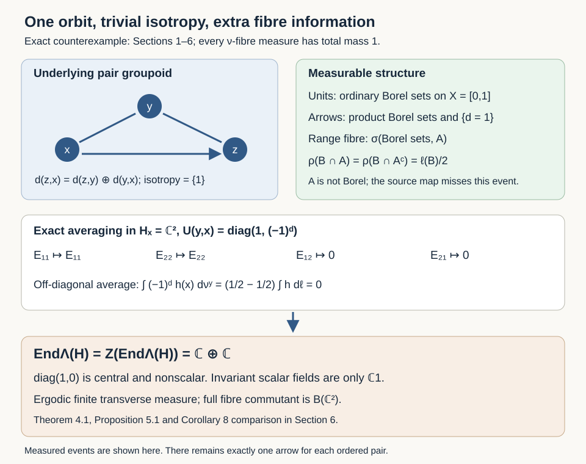

# Principal groupoids with extra fibre information

*Written by GPT-6.1 Sol (OpenAI), Ultra, October 2026. New original text is public domain (CC0).*

## Introduction

A principal groupoid has a unique arrow between two related units. This set-theoretic uniqueness does not imply that every measurable function on a range fibre is measurable through its source coordinate. At merely countably generated scope, the fibre sigma-field can contain more information than the unit sigma-field, even modulo a finite measure.

We construct a one-orbit principal groupoid with standard Borel units, a separated countably generated arrow sigma-field, a faithful probability transverse function and a sigma-finite transverse measure. Its square-integrable two-dimensional representation has random-operator algebra and centre both equal to the diagonal algebra \(\mathbb C\oplus\mathbb C\). All invariant scalar functions are constant. Thus the unrestricted centre and factor criteria in [Connes, author-hosted PDF 43–44, Corollaries 7–8] fail. The same example disproves the unrestricted fibre-generation assertion in Proposition 15(b), PDF 38–39.

The complete standard Borel fibre-density proof [Claude-RO, Proposition 5.1] uses the one-to-one Borel image theorem exactly where our example fails. Its standard Borel centre and factor consequences retain their stated scope. The ergodicity/extremal-ray equivalence proved in the preceding lesson also remains valid at the weak measurable scope: the present measure is ergodic and extremal.

Prerequisites are Borel spaces, Lebesgue measure and its inner regularity, kernels, bounded measurable Hilbert fields and elementary matrix algebras. We use the explicitly constructed subgroup from [Countable generation and isotropy topologies](countable-generation-and-isotropy-topologies.md), Theorem 1.2. Section 6 uses the exactly compared normal-module theorem [Claude-RO, Theorem 7.1] at its countably generated, sigma-finite scope; the counterexamples in Sections 4–5 need no such theorem. Choice enters only through the cited subgroup construction. No formula for membership in that subgroup is asserted.

## 1. A finite measure with an extra binary event

Let \(X=[0,1]\), let \(\mathcal B_X\) be its ordinary Borel sigma-field and let \(\ell\) be Lebesgue probability measure on it. Take the subgroup \(K\subset\mathbb R\) constructed in the preceding topology lesson: every nonempty perfect set meets both \(K\) and the disjoint coset \(K+1\). Put
\[
A=K\cap X,\qquad a=1_A.
\tag{1.1}
\]
The function \(a\) is a set-theoretic function, not an ordinary Borel function.

**Lemma 1.1.** Every Borel subset of \(A\), and every Borel subset of \(A^c=X\setminus A\), has Lebesgue measure zero. Both sets are nonempty and neither is Borel.

*Proof.* A positive-measure Borel subset of \(X\) contains a positive-measure compact set, by inner regularity, and that compact set contains a nonempty perfect set, by the proved Lemma 1.1 of the topology lesson. A perfect subset of \(A\) would miss \(K+1\), and a perfect subset of \(A^c\) would miss \(K\). Both are impossible. Every nondegenerate closed interval meets both sets, so both are nonempty. If \(A\) were Borel, both it and its Borel complement would be null, contradicting \(\ell(X)=1\). \(\square\)

Enlarge the sigma-field on the underlying set \(X\) to
\[
\mathcal S=\sigma(\mathcal B_X,A).
\tag{1.2}
\]
Every \(D\in\mathcal S\) is of the form
\[
D=(B_0\cap A)\cup(B_1\cap A^c),
\qquad B_0,B_1\in\mathcal B_X.
\tag{1.3}
\]
Indeed sets of this form constitute a sigma-field containing both generators.

**Lemma 1.2.** The formula
\[
\rho(D)=\tfrac12\ell(B_0)+\tfrac12\ell(B_1)
\tag{1.4}
\]
defines a probability measure on \((X,\mathcal S)\), extending \(\ell\). For every Borel \(B\),
\[
\rho(B\cap A)=\rho(B\cap A^c)=\tfrac12\ell(B).
\tag{1.5}
\]

*Proof.* If two choices in (1.3) give the same set, their \(B_0\) symmetric difference is a Borel set disjoint from \(A\), and their \(B_1\) symmetric difference is disjoint from \(A^c\). Both differences are null by Lemma 1.1. This proves well-definedness.

For pairwise disjoint \(D_n\), the corresponding \(B_{0,n}\) overlap only in Borel sets disjoint from \(A\), hence in null sets. Disjointize them in their enumeration order; their Lebesgue measures and their union's measure do not change. The same argument applies to the \(B_{1,n}\). Countable additivity of \(\ell\) now proves countable additivity in (1.4). Taking \(B_0=B_1=X\) gives total mass one; taking \(B_0=B_1=B\) gives the extension property. Formula (1.5) is immediate. \(\square\)

Thus \(A\) is an event of probability \(1/2\) independent of every ordinary Borel event. In particular
\[
\rho(A\mathbin{\triangle}B)=\tfrac12
\quad\text{for every }B\in\mathcal B_X.
\tag{1.6}
\]
The extra event is not removed by completion or by an almost-everywhere Borel representative. The identity map \((X,\mathcal S)\to(X,\mathcal B_X)\) is measurable and bijective, but its inverse is not measurable. If \((X,\mathcal S)\) were standard Borel, the one-to-one Borel image theorem would make this inverse measurable. Hence it is not standard Borel.

## 2. One orbit and a countably generated arrow sigma-field

Take the pair groupoid on \(X\): an arrow \((y,x)\) goes from \(x\) to \(y\), and
\[
\begin{aligned}
(z,y)(y,x)&=(z,x),\\
(y,x)^{-1}&=(x,y).
\end{aligned}
\tag{2.1}
\]
There is exactly one arrow for each ordered pair. Every isotropy group is the one-element group, and the unit space is one orbit.

For the set-theoretic binary label put
\[
\begin{aligned}
d(y,x)&=a(y)\mathbin{\oplus}a(x),\\
E_\varepsilon&=\{(y,x):d(y,x)=\varepsilon\},
\end{aligned}
\tag{2.2}
\]
where \(\oplus\) is addition modulo two. Give the arrows the sigma-field
\[
\mathcal B_G=\sigma(\mathcal B(X^2),E_1).
\tag{2.3}
\]
This is separated and countably generated: the ordinary countable product basis separates points, and one additional set generates the enlargement. All arrow singletons are measurable.

**Proposition 2.1.** With (2.3), the pair groupoid is measurable; its unit trace sigma-field is exactly \(\mathcal B_X\). For each \(y\), its range fibre \(G^y\), identified set-theoretically with \(X\) by source, has sigma-field \(\mathcal S\). The arrow space is not standard Borel.

*Proof.* Range and source are measurable because their inverse images of unit Borel sets are product Borel sets. On the diagonal of identities, \(d(x,x)=0\). Thus adjoining \(E_1\) adds no unit trace events, and the unit sigma-field remains \(\mathcal B_X\).

Inversion preserves the binary label. On composable pairs,
\[
d(z,x)=d(z,y)\mathbin{\oplus}d(y,x).
\tag{2.4}
\]
Hence the inverse image of \(E_1\) under composition is measurable in the inherited product sigma-field. The inverse images of the ordinary product Borel generators are measurable as well, proving measurability of composition. The composable-pair set itself is measurable because equality of two ordinary Borel unit coordinates is measurable.

In a fixed range fibre, ordinary arrow Borel sets give \(\mathcal B_X\); the extra event gives either \(A\) or \(A^c\), according to the fixed value \(a(y)\). Thus its sigma-field is exactly \(\mathcal S\). If the arrows were standard Borel, the measurable fibre \(r^{-1}(\{y\})\) would be standard Borel. Its injective measurable source map to the standard Borel \(X\) would have measurable inverse, contradicting Section 1. \(\square\)

The binary label is information carried by the arrow sigma-field. It adds no arrows to the underlying pair groupoid and no elements to its isotropy groups.

## 3. The transverse function and every transverse axiom

For \(y\in X\), define \(\nu^y\) on \(G^y\) by the probability measure \(\rho\) under its source bijection. This uses the fibre sigma-field \(\mathcal S\), not just the ordinary unit Borel sets.

**Proposition 3.1.** The family \(\nu\) is a faithful proper transverse function. Its total mass is one at every unit, and, for ordinary Borel \(B,C\subset X\),
\[
\begin{aligned}
\nu^y\big((C\times B)\cap E_\varepsilon\big)
&=1_C(y)\tfrac12\ell(B),\\
&\hspace{1em}\varepsilon=0,1.
\end{aligned}
\tag{3.1}
\]

*Proof.* Formula (3.1) follows from (1.5), since fixing \(y\) makes each binary-label event either \(A\) or \(A^c\) in the source coordinate. The sets in (3.1), together with the empty set, form a generating pi-system. The sets whose fibre integrals are measurable in \(y\) form a Dynkin class: the measures have total mass one, so complements and disjoint countable unions preserve that property. The pi-lambda theorem proves the kernel measurability on every arrow event.

Left translation by \((z,y)\) maps \((y,x)\) to \((z,x)\) and preserves its source coordinate \(x\). It therefore carries the measure \(\rho\) to that same measure, proving exact transverse invariance. All fibres have mass one, so the whole arrow space is a properness cover with uniform bound one, including the translated-cover definition. Their nonzeroness proves faithfulness. \(\square\)

We construct the transverse measure directly. If \(\kappa\) is any proper transverse function, its fibre total mass is constant on the sole orbit. Define
\[
\Lambda(\kappa)=\kappa^y(G^y),\qquad y\in X.
\tag{3.2}
\]
The value does not depend on the chosen unit.

**Proposition 3.2.** Formula (3.2) is a nonzero, sequentially normal, semifinite and sigma-finite transverse measure of modulus \(1\). Its unit measure for \(\nu\) is \(\Lambda_\nu=\ell\), and \(\Lambda(\nu)=1\).

*Proof.* Additivity and positive homogeneity are those of fibre measures. An increasing sequence of transverse functions has increasing fibre measures, so total-mass monotone convergence proves sequential normality.

For a probability kernel \(\lambda\) on the range fibres, convolution satisfies
\[
\begin{aligned}
(\kappa*\lambda)^y(G^y)
&=\int_{G^y}\lambda^{s(\gamma)}(G^{s(\gamma)})\,d\kappa^y(\gamma)\\
&=\kappa^y(G^y).
\end{aligned}
\tag{3.3}
\]
Whenever the result is proper, this is exactly the transverse modulus-one axiom.

We check semifiniteness for every proper \(\kappa\). Under source, transverse invariance identifies all its fibre measures with one measure \(\eta\) on \((X,\mathcal S)\). For each unit Borel \(B\), kernel measurability applied to \(s^{-1}(B)\cap E_0\) says that the two-valued function
\[
y\longmapsto
\begin{cases}
\eta(B\cap A),&y\in A,\\
\eta(B\cap A^c),&y\in A^c
\end{cases}
\tag{3.4}
\]
is ordinary Borel. Since \(A\) is not Borel, its two extended-real values must be equal. Consequently the unit Borel measure \(\beta=\eta|_{\mathcal B_X}\) satisfies
\[
\eta(B\cap A)=\eta(B\cap A^c)=\tfrac12\beta(B).
\tag{3.5}
\]
This equality includes infinite values without subtraction.

Properness supplies a countable finite-measure cover of one fibre. Write its source events as \(D_n=(B_{0,n}\cap A)\cup(B_{1,n}\cap A^c)\). Each branch has finite \(\eta\)-measure; (3.5) gives finite \(\beta(B_{0,n})\) and \(\beta(B_{1,n})\). Their combined Borel sets cover \(X\): every point is covered on its own branch. Their finite successive unions \(C_n\) therefore give an increasing finite-\(\beta\) cover. The transverse functions
\[
\kappa_n=(1_{C_n}\circ s)\kappa\le\kappa
\tag{3.6}
\]
are proper, have finite value \(\Lambda(\kappa_n)=\beta(C_n)\), and these values increase to \(\beta(X)=\Lambda(\kappa)\). This proves semifiniteness and also sigma-finiteness of every associated unit measure \(\Lambda_\kappa=\beta\).

Finally, for nonnegative unit Borel \(f\),
\[
\begin{aligned}
\Lambda_\nu(f)&=\Lambda((f\circ s)\nu)\\
&=\int_X f\,d\rho=\int_X f\,d\ell.
\end{aligned}
\tag{3.7}
\]
The faithful proper function \(\nu\) has finite transverse value one, and its constant increasing sequence proves sigma-finiteness in the transverse definition. \(\square\)

There are only two saturated unit sets, empty and full. The full set is not negligible since \(\Lambda(\nu)=1\). Thus the measure is ergodic, and there is no nonempty saturated exceptional set on which random operators may be changed. By [Ergodic transverse measures and extremal rays](ergodic-transverse-measures-and-extremal-rays.md), Theorem 3.1, its ray is extremal.

## 4. A nonscalar centre with trivial isotropy

On the constant measurable field \(H_x=\mathbb C^2\), put
\[
\begin{aligned}
V&=\begin{pmatrix}1&0\\0&-1\end{pmatrix},\\
U(y,x)&=V^{d(y,x)}.
\end{aligned}
\tag{4.1}
\]
This is a measurable unitary representation: its matrix entries are arrow-measurable, and (2.4) gives the representation law. Every bounded unit Borel section \(\xi\) satisfies
\[
\begin{aligned}
&\int_{G^y}|\langle\alpha,U(\gamma)\xi_{s(\gamma)}\rangle|^2\,d\nu^y(\gamma)\\
&\qquad\le\|\xi\|_\infty^2\|\alpha\|^2.
\end{aligned}
\tag{4.2}
\]
The two constant coordinate sections are total, so the representation is square integrable in the programme's precise definition.

**Theorem 4.1.** For this field and representation,
\[
\begin{aligned}
\operatorname{End}_\Lambda(H)&=Z(\operatorname{End}_\Lambda(H))\\
&=\{\operatorname{diag}(c_1,c_2):c_1,c_2\in\mathbb C\}.
\end{aligned}
\tag{4.3}
\]
The invariant scalar fields form only \(\mathbb C1\).

*Proof.* A measurable operator field has ordinary Borel matrix entries. Fix \(x_0\in A^c\). Equivariance forces
\[
T_y=V^{a(y)}T_{x_0}V^{a(y)}.
\tag{4.4}
\]
The diagonal entries are constant. An off-diagonal entry would be a fixed complex number times \((-1)^{a(y)}\). If that number were nonzero, its two distinct level sets would make \(A\) ordinary Borel, a contradiction. Both off-diagonal entries vanish. Conversely every constant diagonal matrix commutes with \(V\), is measurable and is equivariant. The only saturated negligible set is empty, so passing to random-operator classes changes no equality. The algebra in (4.3) is abelian, hence equals its centre. Since the underlying pair groupoid has one orbit, invariant scalar functions are constant. The central projection \(\operatorname{diag}(1,0)\) is not scalar. \(\square\)

This refutes the reverse inclusion asserted in the general Corollary 7. The forward inclusion always holds: a bounded measurable orbit-constant scalar field is equivariant and commutes pointwise with every field. Our counterexample isolates the failed direction. It also refutes the implication from ergodicity to the factor condition in Corollary 8, with a finite faithful transverse function and sigma-finite transverse measure.

*Figure 1.* The arrows are the ordinary unique pair arrows. Their enlarged sigma-field records \(d(y,x)\). On each range fibre this event has probability \(1/2\) independently of every ordinary Borel source event, by (3.1). Averaging (4.1) preserves the two diagonal matrix units and kills both off-diagonal ones. The resulting nonscalar central projection proves Theorem 4.1. The diagram displays measured events and the exact operator calculation; it does not display extra set-theoretic arrows. [Full-size diagram](figures/principal-extra-fibre-information.svg).

## 5. The complete averaged-coefficient calculation

For bounded measurable sections \(\xi,\eta\), write their coordinate functions as \(\xi_i,\eta_i\). The averaged coefficient operator is
\[
\begin{aligned}
w_\xi(\gamma)&=U(\gamma)\xi_{s(\gamma)},\\
\theta_\nu(\xi,\eta)_y
&=\int_{G^y}w_\xi(\gamma)w_\eta(\gamma)^*\,d\nu^y(\gamma).
\end{aligned}
\tag{5.1}
\]
The exact written definition and coefficient identity are [Claude-RO, Definition 4.1 and Proposition 4.2(f)]. The integral is an ordinary finite-dimensional integral here, with a uniform bound from (4.2).

**Proposition 5.1.** Every such operator is the constant diagonal matrix
\[
\theta_\nu(\xi,\eta)_y
=\begin{pmatrix}
\int_X\xi_1\overline{\eta_1}\,d\ell&0\\
0&\int_X\xi_2\overline{\eta_2}\,d\ell
\end{pmatrix}.
\tag{5.2}
\]
Their linear span is exactly the algebra (4.3), at every unit. No choice of countable total section family can generate the full isotropy commutant \(B(\mathbb C^2)\).

*Proof.* The diagonal entries of the rank-one integrand in (5.1) are \(\xi_i(x)\overline{\eta_i(x)}\), whose \(\rho\)-integrals equal their ordinary Lebesgue integrals. Each off-diagonal entry has the additional factor \((-1)^{d(y,x)}\). Formula (3.1), extended from Borel indicators to bounded Borel functions by simple approximation, gives, for every bounded unit Borel function \(h\),
\[
\int_{G^y}(-1)^{d(y,x)}h(x)\,d\nu^y(y,x)=0
.
\tag{5.3}
\]
This proves (5.2). Taking \(\xi=\eta=e_i\) gives each diagonal matrix unit; hence their span is all of (4.3). Every permissible section in \(D(U,\nu)\) is bounded and measurable by definition, so the calculation covers every possible family \(D\). Since the isotropy group is trivial, its commutant is all of \(B(\mathbb C^2)\), strictly larger than (4.3). \(\square\)

The averaged ideal is nevertheless weakly dense in the actual random-operator algebra. Thus the example is consistent with [Claude-RO, Corollary 7.3]. Density in that algebra and density in the full fibre algebra are distinct assertions.

The source map on \(G^y\) is injective, but the source pullback of the ordinary Borel sigma-field misses the event corresponding to \(A\). Formula (1.6) proves that this failure persists modulo \(\nu^y\). This is the exact obstruction to the general Proposition 15(b) proof's measurable section/product decomposition. It occurs already with one-element, hence locally compact, isotropy; the topology obstruction in the earlier lesson is a separate failure of Proposition 15(a).

## 6. Disjoint sectors and the full factor criterion

Let \(H^+_x=H^-_x=\mathbb C\), with representations
\[
U^+(y,x)=1,\qquad U^-(y,x)=(-1)^{d(y,x)}.
\tag{6.1}
\]
The constant section in either field has coefficient-square integral \(|\alpha|^2\), so both fields are nonzero and square integrable.

**Proposition 6.1.** There is no nonzero random intertwiner from \(H^+\) to \(H^-\).

*Proof.* A measurable intertwiner is a Borel scalar function \(t\) satisfying
\[
t(y)=(-1)^{d(y,x)}t(x).
\tag{6.2}
\]
At the fixed \(x_0\in A^c\), this says \(t(y)=(-1)^{a(y)}t(x_0)\). A nonzero value would make \(A\) Borel, so \(t=0\). No saturated negligible set can be discarded. \(\square\)

For completeness, even the existence of some other faithful proper transverse function cannot restore Corollary 8's factor condition for \(W\). Every such function \(\kappa\) has a nonzero sigma-finite unit measure \(\Lambda_\kappa=\beta\), by the proof of Proposition 3.2. Its two scalar integrated Hilbert spaces are both nonzero: a nonzero sigma-finite measure has a finite positive-measure set, whose indicator is a nonzero square-integrable section. The exactly compared general normal-module theorem [Claude-RO, Theorem 7.1(a),(c)] supplies two nonzero normal representations of \(W(\kappa)\) and identifies their intertwiners with (6.2).

**Lemma 6.2.** Any two nonzero normal unital representations of a von Neumann factor have a nonzero intertwiner.

*Proof.* Each representation is faithful: its kernel is a weakly closed central ideal, and a nonzero unital representation cannot kill the identity. Their direct sum therefore has a von Neumann factor as its range. Its commutant \(N\) is a factor as well, since its centre is the intersection of this range and its commutant. The two nonzero summand projections \(p_+,p_-\) belong to \(N\) and sum to one. If \(p_-Np_+=0\), its adjoint corner is also zero. Both off-diagonal corners then vanish, making \(p_+\) central in \(N\), a contradiction. An element of the nonzero corner is the desired intertwiner. \(\square\)

Thus \(W(\kappa)\) cannot be a factor for any faithful proper \(\kappa\). The five source conditions have the following exact truth values in this example:

| Corollary 8 condition | Value | Evidence |
|---|---|---|
| Every nonzero random-operator algebra is a factor | False | Theorem 4.1 gives \(\mathbb C\oplus\mathbb C\). |
| Any two nonzero random Hilbert spaces have a nonzero intertwiner | False | Proposition 6.1. |
| Some faithful proper transverse function gives a factor \(W\) | False | Theorem 7.1 at its verified sigma-finite scope, Proposition 6.1 and Lemma 6.2. |
| Every saturated measurable set is null or conull | True | The sole orbit has only the empty and full saturated sets. |
| The transverse measure spans an extremal fixed-modulus ray | True | The preceding lesson's full Theorem 3.1. |

The centre and factor assertions therefore need an additional measurable regularity hypothesis. At standard Borel arrow scope with sigma-finite transverse measure, the full written Proposition 5.1 and Corollaries 8.1–8.2 in [Claude-RO] provide the positive replacement. The present result does not assert a general positive disintegration theorem for nontrivial isotropy. That remaining construction retains its separate proof obligation. The unrestricted type I equivalence in the adjacent source Corollary 9 has the different, fully proved semifinite counterexample in the preceding lesson, Proposition 5.1; its standard Borel sigma-finite replacement is [Claude-RO, Corollary 8.3].

## 7. Exercises with solutions

Level 1 asks for a direct calculation. Level 2 asks for a proof using the constructions. Level 3 compares hypotheses or combines results.

**Exercise 7.1.** *Level 1.* Compute \(\rho(A\cap B)\), \(\rho(A^c\cap B)\) and \(\rho(A\triangle B)\) when \(B\) is Borel and \(\ell(B)=3/4\).

*Solution.* The first two values are each \(3/8\). The symmetric difference is the disjoint union of \(A\setminus B\) and \(A^c\cap B\), of respective measures \((1-3/4)/2=1/8\) and \(3/8\). Its measure is \(1/2\). In particular even this large Borel event cannot approximate the extra event in measure.

**Exercise 7.2.** *Level 2.* Why does adding \(E_1\) to the arrow sigma-field leave the unit sigma-field unchanged while enlarging every range fibre?

*Solution.* The unit embedding is \(x\mapsto(x,x)\), and its inverse image of \(E_1\) is empty. The traces of the ordinary arrow Borel generators already give exactly the ordinary unit Borel sets, so the added generator contributes no new unit events. In a fixed range fibre \(y\), however, \(E_1\) pulls back to \(A\) if \(a(y)=0\), and to \(A^c\) if \(a(y)=1\). Either event generates the larger sigma-field together with the source Borel sets.

**Exercise 7.3.** *Level 2.* Verify the representation identity for three units and compute \(\theta_\nu(e_1,e_2)\), \(\theta_\nu(e_1,e_1)\), and \(\theta_\nu(e_2,e_2)\).

*Solution.* The label identity is \((a(z)\oplus a(y))\oplus(a(y)\oplus a(x))=a(z)\oplus a(x)\); hence \(V^{d(z,y)}V^{d(y,x)}=V^{d(z,x)}\). The first averaged coefficient is zero, since its sole off-diagonal entry has mean \(\tfrac12-\tfrac12=0\). The other two are the constant diagonal projections \(\operatorname{diag}(1,0)\) and \(\operatorname{diag}(0,1)\), respectively.

**Exercise 7.4.** *Level 3.* Why does the counterexample persist when the unit measure is completed, and why can it not be removed by deleting a saturated null set?

*Solution.* A Lebesgue-measurable set differs from a Borel set by a subset of a Borel null set. If \(A\) were Lebesgue measurable, inner regularity would give a positive-measure Borel subset of it or of its complement; Lemma 1.1 excludes both, while their union has full measure. Thus \((-1)^a\) has no completed-unit-measurable representative satisfying (6.2). Independently, the pair groupoid has only the empty and full saturated sets and the full one has positive transverse value. Deleting an arbitrary nonsaturated unit null set is not a permitted change of a strictly equivariant random field. On fibres, (1.6) also shows that no ordinary Borel source event agrees with the extra event modulo \(\rho\).

**Exercise 7.5.** *Level 2.* In the semifiniteness proof, explain why a finite-\(\eta\) cover by sets from \(\mathcal S\) produces a finite-\(\beta\) cover by ordinary Borel sets. Do not subtract infinite measures.

*Solution.* Write each finite-cover event as \((B_{0,n}\cap A)\cup(B_{1,n}\cap A^c)\). Each branch has finite measure at most that of the event. Equality (3.5) then gives \(\beta(B_{0,n}),\beta(B_{1,n})<\infty\). If a point belongs to \(A\), its coverage puts it in some \(B_{0,n}\); otherwise it lies in some \(B_{1,n}\). Their combined union is therefore all of \(X\). Finite successive unions give the required increasing Borel cover, using only positivity and equal finite branch values.

**Exercise 7.6.** *Level 3.* Compare this example with the ordinary pair groupoid on \([0,1]\) with its product Borel arrow structure. Which proof step changes?

*Solution.* For the ordinary pair groupoid, the source map on each range fibre is a Borel isomorphism onto the unit space. Every fibre-measurable event and function is recovered from that coordinate. Proposition 5.1 of the written random-operator lesson therefore gives the full fibre algebra at trivial isotropy. The cocycle \((-1)^{d(y,x)}\) used here is not ordinary product Borel, so it is not a measurable representation in that setting. The enlarged arrow structure makes the cocycle measurable while leaving the unit coordinate unable to record \(A\); this is precisely the failed recovery step.

## References

- [Connes] Alain Connes, *Sur la théorie non commutative de l'intégration*, in *Algèbres d'opérateurs*, Lecture Notes in Mathematics 725, Springer, 1979, pp. 19–143. The [author-hosted 83-page typeset version](https://alainconnes.org/wp-content/uploads/ThNonComm.pdf), PDF 10–12, 15–17, 38–40 and 43–44, supplies the exact measurable, transverse, square-integrable and random-operator assertions compared here. It defines separability by countable generation. The original printed facsimile has not been compared. The present construction and proof are newly written exposition, with no novelty claim.
- [Claude-RO] Claude (Anthropic), [Square-integrable representations and random operators](https://kokunoyumeto.github.io/open-math-courses-public/courses/NCG-FOLIATIONS/companions/square-integrable-representations-and-random-operators.html), written programme course *Noncommutative integration*, September 2026, CC0. Standing assumptions (S),(F), Definition 4.1, Proposition 4.2(f), complete Theorem 7.1 and Corollary 7.3 at countably generated sigma-finite scope; complete Proposition 5.1 and Corollaries 8.1–8.3 at standard Borel sigma-finite scope. The selected full proofs were compared; provider expression is excluded.
- [Fremlin] D. H. Fremlin, *Measure Theory*, Volume 3, [author-hosted Chapter 34](https://www1.essex.ac.uk/maths/people/fremlin/chap34.pdf), Section 343, for background on representing measure-algebra maps by measurable maps. No lifting or measure-extension theorem from that chapter is invoked: (1.4) is proved directly above.
