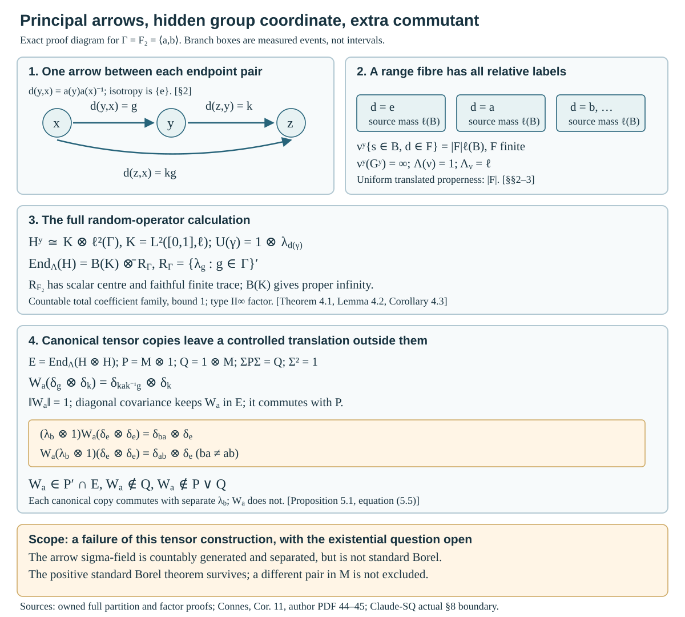
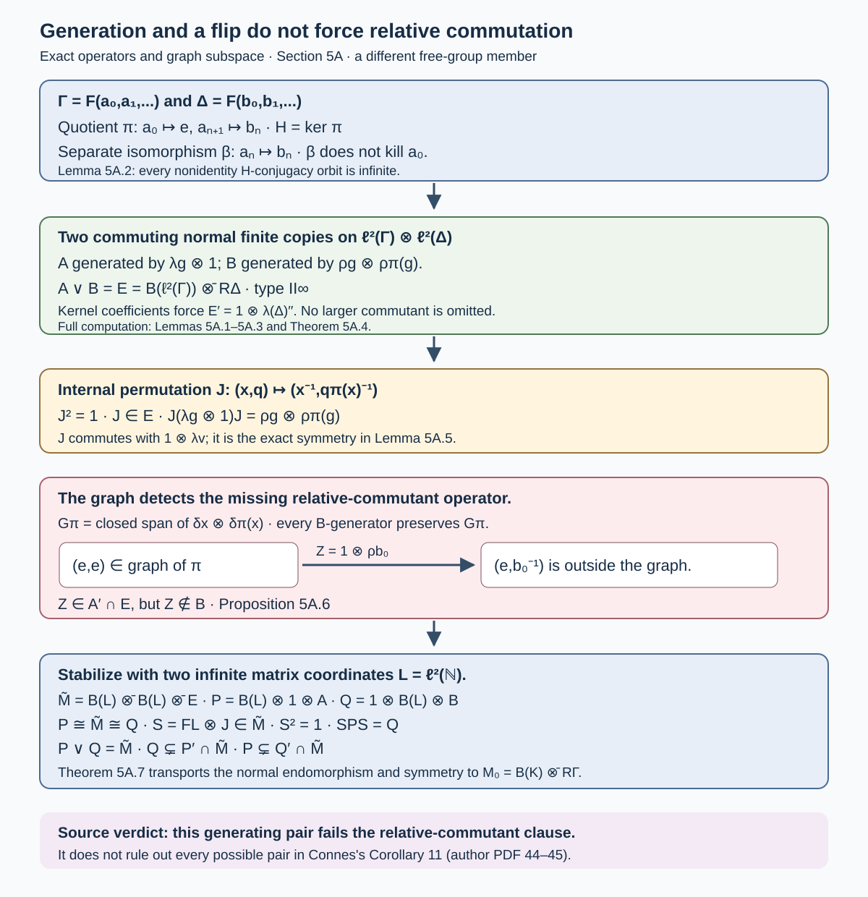
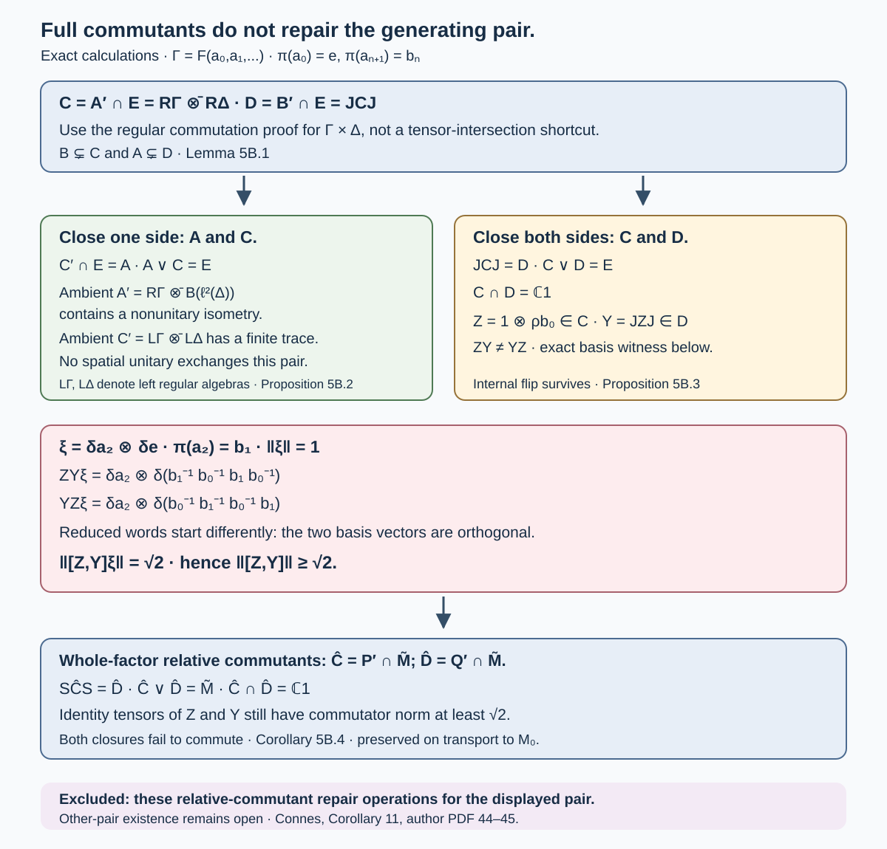
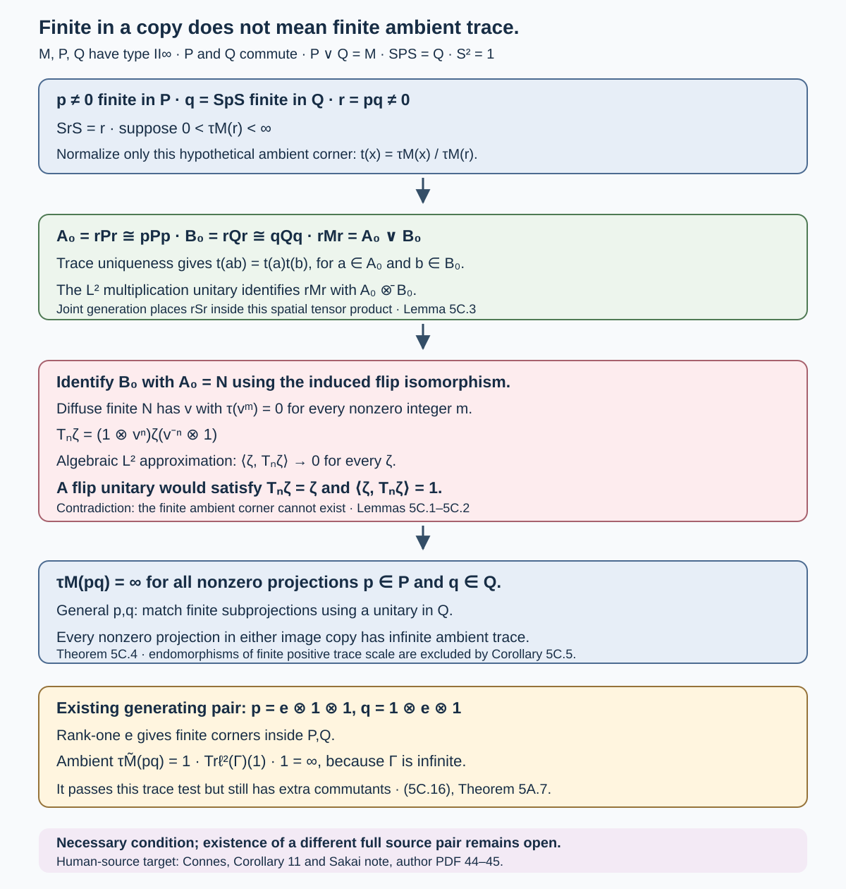
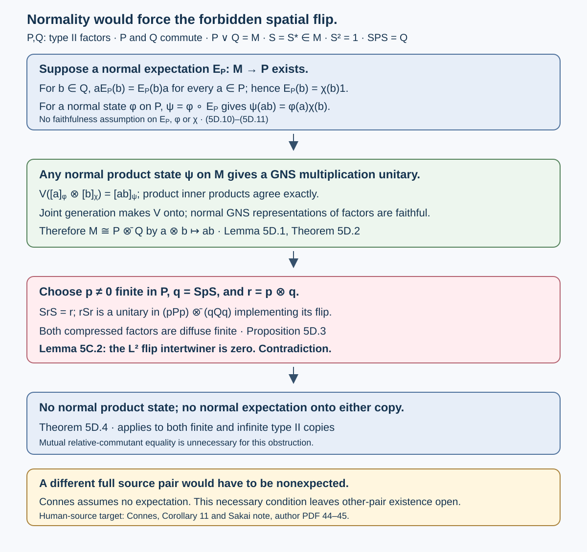
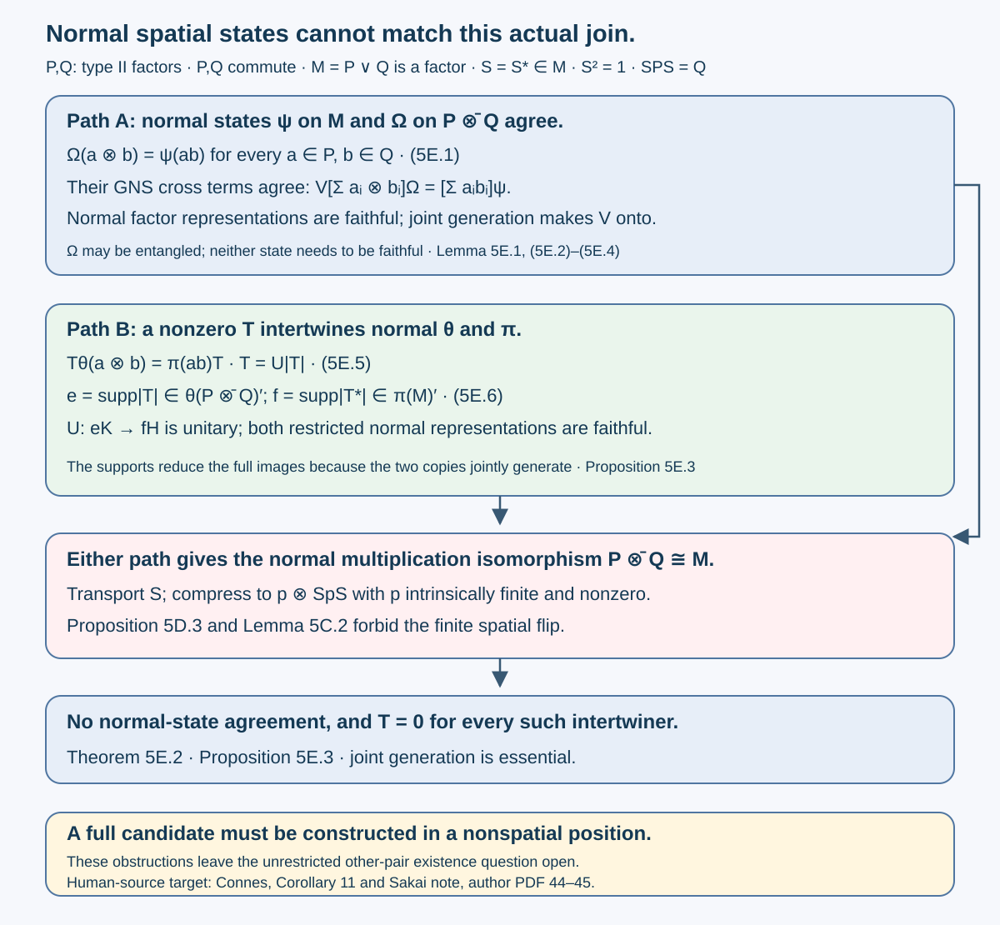
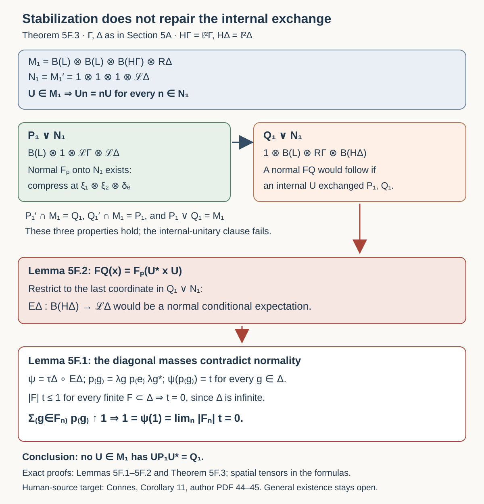
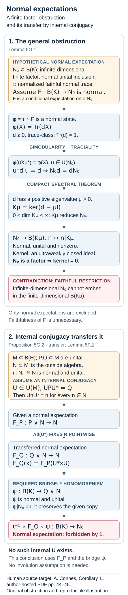

# Principal groupoids with hidden group factors

*Written by GPT-6.1 Sol (OpenAI), Ultra, October 2026. Author self-check in progress; not independently reviewed. New original text is public domain (CC0).*

A principal groupoid has no nonidentity isotropy arrows. Its measurable structure can nevertheless carry a group coordinate invisible to the unit sigma-field. The preceding binary example gives an abelian random-operator algebra. Here we construct the full countable-group version, classify all its proper transverse functions, and compute a properly infinite factor when the group is the free group on two generators.

The factor example also tests the usual tensor construction of two commuting copies. An explicit controlled translation lies in the relative commutant of one copy and outside the other; the two copies do not generate the tensor-field algebra. This is a failure of that particular construction at the weaker measurable scope. It does **not** prove that no other endomorphism and symmetry satisfy Connes's Corollary 11. That source assertion remains open at this scope.

We use the fully proved subgroup in [Countable generation and isotropy topologies](countable-generation-and-isotropy-topologies.md), Theorem 1.2, and its perfect-set lemma. [Principal groupoids with extra fibre information](principal-groupoids-with-extra-fibre-information.md) supplies the binary predecessor and the random-operator conventions. Ordinary sigma-finite integration, separable Hilbert spaces, the double commutant theorem and Hilbert tensor products are prerequisites. Every measure, kernel, covariance, commutant and factor calculation needed for the present construction is proved below. No group-factor classification, tensor primeness theorem or general modular bridge is imported.

## 1. A countable partition carrying no ordinary Borel information

Put \(X=[0,1]\), with ordinary Borel sigma-field \(\mathcal B_X\) and Lebesgue probability \(\ell\). Let \(D\subset\mathbb R\) be the rational vector subgroup from the cited full construction: \(1\notin D\), and every nonempty perfect subset of \(\mathbb R\) meets \(D\) and \(D+1\). In fact every integer translate \(D+n\) meets every perfect set, by applying the intersection property to its translate by \(-n\). Distinct integer translates are disjoint: a nonzero integer in \(D\) would put \(1\) in \(D\) by rational division.

Let \(\Gamma\) be a nonempty countable group, with identity \(e\). Choose distinct integers \(j(g)\), \(g\in\Gamma\). For \(g\ne e\) set \(A_g=X\cap(D+j(g))\), and set
\[
A_e=X\setminus\bigcup_{g\ne e}A_g,\qquad
a(x)=g\quad(x\in A_g).
\tag{1.1}
\]
Thus \(A_e\) contains \(X\cap(D+j(e))\). Every class is nonempty and meets every nonempty perfect subset of \(X\).

**Lemma 1.1 (all nontrivial unions).** Every Borel set disjoint from one \(A_g\) is Lebesgue-null. If \(\Gamma\) has at least two elements, every nonempty proper union of the classes \(A_g\) is neither Borel nor Lebesgue-measurable.

*Proof.* A positive-measure Borel set contains a nonempty perfect subset by the complete perfect-set lemma in the cited topology lesson. That subset meets \(A_g\), proving the first assertion. A nonempty proper union \(C\) and its complement each contain some class. A positive-measure Borel subset of either one would contain a perfect set missing a class in the other, which is impossible. Consequently both have inner Lebesgue measure zero. If either were Lebesgue-measurable, so would its complement, and their union would have measure zero instead of one. \(\square\)

In particular, if a scalar function \(q\) on the countable set \(\Gamma\) has \(q\circ a\) ordinary Borel, or even completion-measurable, then \(q\) is constant. Otherwise the inverse image of one of its attained values is a nonempty proper union in Lemma 1.1. This also applies to extended nonnegative values.

Give the underlying set \(X\) the enlarged sigma-field
\[
\mathcal S=\sigma(\mathcal B_X,(A_g)_{g\in\Gamma}).
\]
Its sets are exactly
\[
D_0=\bigcup_{g\in\Gamma}(B_g\cap A_g),\qquad B_g\in\mathcal B_X.
\tag{1.2}
\]
These sets form a sigma-field containing the generators. For any sigma-finite Borel measure \(\beta\) on \(X\) which vanishes on every Borel set disjoint from any \(A_g\), define
\[
\eta_\beta(D_0)=\sum_{g\in\Gamma}\beta(B_g).
\tag{1.3}
\]
The stated null condition makes this well-defined: two presentations have branchwise Borel symmetric differences disjoint from \(A_g\). For disjoint \(D_n\), their branchwise Borel representatives overlap only in such null sets; disjointizing in their enumeration order proves countable additivity, then summing the nonnegative branch values proves it for \(\eta_\beta\). A countable finite-\(\beta\) cover, intersected with the countably many \(A_g\), proves sigma-finiteness. The measure \(\ell\) satisfies the null condition by Lemma 1.1.

For \(\beta=\ell\), write \(\eta=\eta_\ell\). On every branch,
\[
\eta(B\cap A_g)=\ell(B)\quad(B\in\mathcal B_X).
\tag{1.4}
\]
Simple functions and monotone convergence give
\[
L^2(X,\mathcal S,\eta)\cong
K\otimes\ell^2(\Gamma),\qquad K=L^2(X,\ell).
\tag{1.5}
\]
Explicitly, a vector with branchwise Borel representatives \(f_g\) goes to \((f_g)_{g\in\Gamma}\). Formula (1.3) gives its norm; branchwise simple approximation proves both well-definedness and surjectivity. This is an isomorphism of measured vector spaces, not a pointwise bijection of \(X\) with \(X\times\Gamma\).

## 2. One pair arrow, with a measurable group label

Take the underlying pair groupoid \(G=X\times X\), with arrow \((y,x):x\to y\), inverse \((x,y)\) and product \((z,y)(y,x)=(z,x)\). Adjoin the labels
\[
d(y,x)=a(y)a(x)^{-1},\qquad
\mathcal B_G=\sigma\bigl(\mathcal B(X^2),\,d^{-1}(\{g\}):g\in\Gamma\bigr).
\tag{2.1}
\]
This sigma-field is separated and countably generated; all arrow singletons are measurable. Its trace on the identity diagonal is exactly \(\mathcal B_X\), since \(d(x,x)=e\).

**Proposition 2.1 (all groupoid operations).** The pair groupoid with (2.1) is measurable, principal and has one orbit. Its range-fibre sigma-field, under the source bijection, is \(\mathcal S\). If \(|\Gamma|>1\), the arrow space is not standard Borel.

*Proof.* Range and source are measurable through the ordinary product generators. Equality of two unit coordinates is product-Borel, so the composable-pair set is measurable. The identities
\[
d(x,y)=d(y,x)^{-1},\qquad
d(z,x)=d(z,y)d(y,x)
\tag{2.2}
\]
make inversion and composition measurable on each new generator; the ordinary generators are handled by the ordinary pair operations. Every endpoint pair has exactly one arrow, so isotropy is trivial and there is one orbit.

At fixed \(y\), the equation \(d(y,x)=g\) is \(a(x)=g^{-1}a(y)\). As \(g\) varies these are all the classes \(A_h\). This proves the fibre assertion. If the arrows were standard Borel, a measurable range fibre would be standard Borel and its injective measurable source map to the standard Borel \(X\) would have measurable inverse, by the exact Borel-image prerequisite used in the predecessor lesson. It would make all \(A_h\) ordinary Borel, contradicting Lemma 1.1. \(\square\)

Define \(\nu^y\) to be \(\eta\) under the source bijection \(G^y\to X\). For ordinary Borel \(B,C\) and finite \(F\subset\Gamma\),
\[
\nu^y\bigl((C\times B)\cap\{d\in F\}\bigr)
=1_C(y)|F|\ell(B).
\tag{2.3}
\]
Each relative label has mass one. In particular \(\nu^y(G^y)=|\Gamma|\), which is infinite when \(\Gamma\) is infinite.

**Proposition 2.2 (a faithful proper transverse function).** The family \(\nu\) is a measurable, faithful, proper transverse function, including the uniform translated-cover form of properness.

*Proof.* The events in (2.3), first with singleton \(F\), form a generating pi-system. Choose increasing finite \(F_n\uparrow\Gamma\). On the measurable cover \(\{d\in F_n\}\), every fibre measure is finite with total \(|F_n|\). The finite-measure pi-lambda argument on each cover and monotone convergence therefore prove kernel measurability for every arrow event, without complementing an infinite total mass.

Left translation preserves the actual source coordinate, hence preserves \(\eta\). This proves exact transverse invariance; nonzeroness gives faithfulness. The arrow sets \(E_n=\{d\in F_n\}\) exhaust \(G\). Translation by a label \(k\) replaces \(F_n\) by a translate of the same finite size. Consequently every translated range-fibre mass is \(|F_n|\), uniformly in the arrow used for translation. This proves properness. \(\square\)

## 3. Every proper transverse function and the transverse measure

We verify the measure on this example for **all** proper transverse functions, not just for \(\nu\). A transverse function \(\kappa\) identifies under source with a single measure \(\eta_0\) on \((X,\mathcal S)\), because left translations between every two range fibres preserve source and the measure.

For ordinary Borel \(B\), kernel measurability of the event \(\{d=e,\ s\in B\}\) says that
\[
y\longmapsto\eta_0(B\cap A_{a(y)})
\tag{3.1}
\]
is ordinary Borel. Lemma 1.1 forces its values to be the same for every group label. Thus there is a Borel measure \(\beta\) on \(X\) with
\[
\eta_0(B\cap A_g)=\beta(B)\quad(g\in\Gamma).
\tag{3.2}
\]
Countable additivity of \(\beta\) follows by evaluating disjoint Borel unions on one fixed branch. Any Borel set disjoint from one \(A_g\) has \(\beta\)-measure zero, by (3.2). Countable branch decomposition now shows \(\eta_0=\eta_\beta\) as in (1.3).

Properness makes \(\beta\) sigma-finite. Indeed, restrict a countable finite-mass properness cover to one fixed range fibre and write each term as \(\bigcup_g(B_{n,g}\cap A_g)\). Every \(\beta(B_{n,g})\) is finite, and the \(B_{n,g}\)'s together cover \(X\), since their branch intersections cover every actual point. Conversely, given a sigma-finite \(\beta\) satisfying the null condition above, choose increasing Borel \(C_n\uparrow X\) with \(\beta(C_n)<\infty\). The arrow cover
\[
\{s\in C_n,\ d\in F_n\}
\tag{3.3}
\]
has translated fibre mass \(|F_n|\beta(C_n)\). Its kernel property follows from the finite-stage pi-lambda proof above. It therefore defines a proper transverse function. This classifies all of them.

**Theorem 3.1 (the transverse measure).** For the proper function corresponding to \(\beta\), set
\[
\Lambda(\kappa)=\beta(X).
\tag{3.4}
\]
This is a nonzero, sequentially normal, semifinite and sigma-finite transverse measure of modulus \(1\). Moreover \(\Lambda(\nu)=1\) and \(\Lambda_\nu=\ell\).

*Proof.* Formula (3.2) gives additivity, homogeneity and continuity along increasing transverse functions, by ordinary measure monotone convergence on a fixed branch. We check the convolution axiom explicitly. Let \(\pi\) be any measurable probability kernel on range fibres. Write
\[
\pi_h^u(B)=\pi^u\{(u,v):v\in B,\ d(u,v)=h\}.
\]
For fixed \(h,B\) this is ordinary Borel in \(u\), and \(\sum_h\pi_h^u(X)=1\).

If \(u\in A_t\), then \(v\in A_l\) is equivalent to \(d(u,v)=tl^{-1}\). Integrating against the source measure \(\eta_\beta\) of \(\kappa\), countable branch decomposition and Tonelli give
\[
\begin{aligned}
(\kappa*\pi)^y\{s\in B,\ a(s)=l\}
&=\sum_{t\in\Gamma}\int_X\pi_{tl^{-1}}^u(B)\,d\beta(u)\\
&=\int_X\sum_{h\in\Gamma}\pi_h^u(B)\,d\beta(u)
=:\beta'(B).
\end{aligned}
\tag{3.5}
\]
The event on the left is interpreted in the source fibre sigma-field; no assertion that \(a\) is a unit Borel function is used. The result is independent of \(l\). If the convolution is proper, its classifying measure is \(\beta'\), and
\(\beta'(X)=\int 1\,d\beta=\beta(X)\). This is exactly the modulus-one axiom, including infinite values.

For semifiniteness, finite-\(\beta\) sets \(C_n\uparrow X\) give proper \(\kappa_n=(1_{C_n}\circ s)\kappa\le\kappa\) with finite \(\Lambda(\kappa_n)=\beta(C_n)\uparrow\beta(X)\). For sigma-finiteness in the transverse sense, the constant sequence \(\nu_n=\nu\) has finite transverse value one and faithful supremum. Finally \((f\circ s)\nu\) corresponds to \(f\ell\) for every nonnegative ordinary Borel \(f\). Hence \(\Lambda_\nu(f)=\int f\,d\ell\). \(\square\)

The integrated arrow measure has, in the relative-label coordinates, ordinary product values
\[
\int_G F(y,x,d(y,x))\,dm
=\sum_{g\in\Gamma}\int_{X^2}F(y,x,g)\,d\ell(y)d\ell(x).
\tag{3.6}
\]
This follows first for the generating rectangles and then for nonnegative measurable \(F\). It is sigma-finite. Inversion interchanges \(x,y\) and sends \(g\) to \(g^{-1}\), so it preserves \(m\), in agreement with modulus \(1\).

When \(\Gamma\) is infinite, every nonzero proper transverse function has infinite fibre total mass. Indeed (3.2) gives total \(\sum_g\beta(X)\). It can still have finite positive transverse value (3.4). Fibre mass, transverse value and unit measure are three different quantities.

## 4. The regular field and its factor

Use \(H_y=L^2(G^y,\nu^y)\). Under the measurable relative-label chart, (1.5) identifies every fibre with
\[
V=K\otimes\ell^2(\Gamma),\qquad
U(z,y)=1_K\otimes\lambda_{d(z,y)},\qquad
\lambda_h\delta_g=\delta_{hg}.
\tag{4.1}
\]
The chart uses \(d(y,x)\), rather than the non-Borel unit function \(a(y)\). If \(b_j\) is a countable Borel orthonormal basis of \(K\), its measurable fibre vectors are \(b_j(s)1_{\{d=g\}}\). They form an orthonormal basis at every unit. Equation (2.2) verifies (4.1) and the representation law.

The representation is square integrable, directly at the coefficient criterion. For the bounded measurable basis section \(e_{j,g}=b_j\otimes\delta_g\) and \(\zeta\in V\), (2.3) gives
\[
\int_{G^y}|\langle\zeta,U(\gamma)e_{j,g}\rangle|^2\,d\nu^y(\gamma)
=\sum_{h\in\Gamma}|\langle\zeta,b_j\otimes\delta_{hg}\rangle|^2
\le\|\zeta\|^2.
\tag{4.2}
\]
The countable family is total at every unit. Each associated coefficient map is a contraction; for any fixed \(g\), its Gram operators sum to the identity as \(j\) ranges over the basis. Thus this is the exact square-integrability notion of the programme, with explicit total sections.

Put \(R_\Gamma=\{\lambda_h:h\in\Gamma\}'\) on \(\ell^2(\Gamma)\). This notation means the commutant, not an assumed identification theorem for a group von Neumann algebra.

**Theorem 4.1 (the entire random-operator algebra).** In the chart (4.1),
\[
M=\operatorname{End}_\Lambda(H)
=B(K)\,\overline\otimes\,R_\Gamma .
\tag{4.3}
\]

*Proof.* A measurable bounded operator field has ordinary Borel matrix coefficients in the basis above. There are no nonempty saturated negligible sets: the underlying groupoid has one orbit and \(\Lambda(\nu)=1\).

Fix a unit \(y_0\). Exact covariance makes
\[
T_y=(1\otimes\lambda_{a(y)})C(1\otimes\lambda_{a(y)})^*,
\tag{4.4}
\]
where \(C=(1\otimes\lambda_{a(y_0)})^*T_{y_0}(1\otimes\lambda_{a(y_0)})\).
Each matrix coefficient of this field is \(q(a(y))\) for a function \(q\) on \(\Gamma\). Lemma 1.1 makes every such coefficient constant. Totality of the basis therefore makes all conjugates in (4.4) equal to \(C\); thus \(C\) commutes with \(1\otimes\lambda_h\) for every \(h\). Conversely every constant operator in this commutant is measurable and equivariant.

For completeness the commutant is precisely the tensor algebra in (4.3). Matrix coefficients in an orthonormal basis of \(K\) of any commuting operator lie in \(R_\Gamma\). Its finite \(K\)-matrix compressions therefore belong to \(B(K)\overline\otimes R_\Gamma\); they converge strongly to the operator. The converse commutation holds on elementary tensors and passes to the von Neumann closure. This proves both equality and the normal concrete realization. Completion-measurable coefficients would give the same result, by the completion assertion in Lemma 1.1. \(\square\)

Now take \(\Gamma=F_2=\langle a,b\rangle\), the group of reduced words in \(a,a^{-1},b,b^{-1}\).

**Lemma 4.2 (the free-group commutant is a finite factor).** The infinite-dimensional algebra \(R_{F_2}\) is a factor with normal faithful tracial state
\[
\tau(T)=\langle T\delta_e,\delta_e\rangle.
\tag{4.5}
\]

*Proof.* Right translations \(\rho_h\delta_g=\delta_{gh^{-1}}\) commute with every left translation, so belong to \(R_{F_2}\). If \(T\) is central in \(R_{F_2}\), it commutes with both left and right translations. Write \(c_g=\langle T\delta_e,\delta_g\rangle\). Conjugating \(\delta_g\) by the unitary \(\lambda_h\rho_h\) shows \(c_{hgh^{-1}}=c_g\).

Every nonidentity conjugacy class is infinite. Given a nonempty reduced word \(w\), choose a letter \(u\) which is neither the inverse of its first letter nor its last letter. At most two of the four letters are forbidden. All words \(u^nwu^{-n}\) are reduced with lengths \(2n+|w|\), so are distinct. A square-summable family constant on such a class has value zero there. Thus \(T\delta_e=c_e\delta_e\); commutation with \(\lambda_g\) gives \(T\delta_g=c_e\delta_g\) for every \(g\). The centre is scalar.

The vector functional (4.5) is normal and positive. For any \(T\in R_{F_2}\), its matrix entry in row \(g\), column \(h\), is \(c_{h^{-1}g}\), by commutation with left translations. Consequently \(T^*\delta_e\) has coefficients \(\overline{c_{g^{-1}}}\), and
\[
\tau(T^*T)=\|T\delta_e\|^2
=\|T^*\delta_e\|^2=\tau(TT^*).
\tag{4.6}
\]
Polarizing this equality gives \(\tau(ST)=\tau(TS)\) for arbitrary \(S,T\) in the algebra. If \(T\ge0\) and \(\tau(T)=0\), then \(T^{1/2}\delta_e=0\); its commutation with all \(\lambda_g\) makes it zero on every basis vector. This proves faithfulness. Finally the infinitely many \(\rho_h\) are linearly independent, by applying a finite linear combination to \(\delta_e\). The algebra is infinite-dimensional. \(\square\)

**Corollary 4.3 (a properly infinite principal random-operator factor).** For \(\Gamma=F_2\), (4.3) is a nonzero properly infinite semifinite factor. It has a finite faithful trace on every rank-one \(K\)-corner, and is of type \(\mathrm{II}_\infty\).

*Proof.* A central element first commutes with \(B(K)\otimes1\), so is \(1\otimes Z\); then Lemma 4.2 makes \(Z\) scalar. Split a countable basis of the infinite-dimensional \(K\) into two infinite subsets. The corresponding isometries on \(K\), tensored with \(1\), have orthogonal ranges summing to the identity. Hence the identity is properly infinite.

The usual positive diagonal sum \(\operatorname{Tr}_K\otimes\tau\) is a normal faithful semifinite trace: finite \(K\)-matrix corners have finite trace, and their increasing projections converge strongly to one. A rank-one corner is \(R_{F_2}\), a finite infinite-dimensional factor by Lemma 4.2, so is type \(\mathrm{II}_1\). Equivalence of the rank-one \(K\)-corners and their countable sum give type \(\mathrm{II}_\infty\). The positive diagonal trace construction and the finite-factor terminology are the stated basic von Neumann prerequisites, not a group-factor classification theorem. \(\square\)

Trivial set-theoretic isotropy, one orbit, sigma-finite transverse measure and a properly infinite factor therefore do not restore standard Borel fibre density. The missing group coordinate is a measurable phenomenon.

## 5. A controlled translation obstructs the canonical tensor copies

Retain \(\Gamma=F_2\). On \(H\otimes H\), the group coordinate is \(\ell^2(\Gamma)\otimes\ell^2(\Gamma)\), with diagonal transport \(\lambda_l\otimes\lambda_l\). The same coefficient argument as in (4.4) gives
\[
E=\operatorname{End}_\Lambda(H\otimes H)
=\{(1_K\otimes\lambda_l)\otimes(1_K\otimes\lambda_l):l\in\Gamma\}'.
\tag{5.1}
\]
Here the commutant is on \(V\otimes V\), in the constant chart.
The tensor field is also square integrable directly: for a product basis section \(b_i\otimes\delta_g\otimes b_j\otimes\delta_k\), its coefficient-square integral is the sum of the squared coefficients of a vector along the orthonormal family indexed by \((lg,lk)\), \(l\in\Gamma\). This sum is at most that vector's squared norm. All product basis sections are bounded, measurable and total. Put
\[
P=\{T\otimes1:T\in M\},\qquad Q=\{1\otimes T:T\in M\}.
\tag{5.2}
\]
They are normal unital copies of \(M\) in \(E\), commute, and the self-adjoint flip \(\Sigma\) belongs to \(E\), satisfies \(\Sigma^2=1\), and exchanges them.

For \(h\in\Gamma\), let \(p_k\) be projection onto \(\mathbb C\delta_k\) in the **second** group coordinate, and define, with the \(K\) identities suppressed,
\[
W_h=\sum_{k\in\Gamma}\lambda_{khk^{-1}}\otimes p_k,\qquad
W_h(\delta_g\otimes\delta_k)=\delta_{khk^{-1}g}\otimes\delta_k.
\tag{5.3}
\]
This is a norm-one unitary: on the orthogonal second-coordinate slices it is a unitary left translation, and its inverse is \(W_{h^{-1}}\).

**Proposition 5.1 (both failures are explicit).** For \(h=a\),
\[
W_a\in P'\cap E,\qquad W_a\notin Q,\qquad W_a\notin P\vee Q.
\tag{5.4}
\]
Thus these tensor copies are not mutual relative commutants and do not generate \(E\).

*Proof.* Simultaneous left translation sends \(k\) to \(lk\) and conjugates \(\lambda_{khk^{-1}}\) to \(\lambda_{lkhk^{-1}l^{-1}}\). Reindexing the orthogonal sum proves
\[
(\lambda_l\otimes\lambda_l)W_h(\lambda_l\otimes\lambda_l)^*=W_h.
\]
Thus \(W_h\in E\). Every coefficient \(\lambda_{khk^{-1}}\) commutes with the first copy of \(R_\Gamma\), and \(W_h\) is the identity on the first \(K\)-coordinate. The full tensor commutant calculation (4.3) therefore gives \(W_h\in P'\).

Both \(P\) and \(Q\) commute with the first-coordinate left translation \(\lambda_b\otimes1\). So does their generated von Neumann algebra. But on the second-coordinate slice \(k=e\),
\[
\begin{aligned}
(\lambda_b\otimes1)W_a(\delta_e\otimes\delta_e)
&=\delta_{ba}\otimes\delta_e,\\
W_a(\lambda_b\otimes1)(\delta_e\otimes\delta_e)
&=\delta_{ab}\otimes\delta_e.
\end{aligned}
\tag{5.5}
\]
The distinct reduced words \(ba,ab\) give orthogonal vectors. Hence \(W_a\) fails that commutation and lies in neither \(Q\) nor \(P\vee Q\). \(\square\)

Even the equivalence \(H\cong H\otimes H\) is available here; it does not repair (5.4). Explicitly the unitary
\[
C(\delta_g\otimes\delta_k)=\delta_g\otimes\delta_{g^{-1}k}
\tag{5.6}
\]
turns \(\lambda_l\otimes\lambda_l\) into \(\lambda_l\otimes1\). Rearrange the Hilbert tensor coordinates and choose a basis bijection between the countably infinite multiplicity spaces \(K\) and \(K\otimes K\otimes\ell^2(\Gamma)\). This gives a constant measurable unitary field \(J:H\to H\otimes H\) intertwining every arrow. Transporting (5.2) and the flip through \(J\) gives an endomorphism and symmetry inside \(M\), but transports the extra relative-commutant element \(W_a\) as well.

This pinpoints the hypothesis used by the positive standard Borel proof: commuting with all global random operators must imply commuting with the full first fibre algebra. Here the first fibre values give \(B(K)\overline\otimes R_\Gamma\), whose commutant still contains all \(1_K\otimes\lambda_h\). Proposition 5.1 uses precisely that surviving space.

*Figure 1. The branch boxes represent measured events, not intervals and not extra arrows. Equations (2.1)–(2.3) give the single pair arrow, label multiplication and equal branch masses. Equation (4.3) and Corollary 4.3 give the properly infinite factor despite trivial isotropy. The lower panel displays the exact action of \(W_a\) and the two different words in (5.5); its norm is one, it belongs to \(P'\cap E\), and it lies outside \(Q\) and \(P\vee Q\). Complete proof locators: Theorems 3.1 and 4.1, Corollary 4.3, Proposition 5.1. Compare Connes, Corollary 11, author-hosted PDF 44–45; the actual standard Borel boundary of Claude-SQ, Sections 5 and 8.* [Full-size diagram](figures/principal-hidden-group-factor.svg).

## 5A. Joint generation and an internal flip can still leave an extra commutant

We now take a different member of the countable-group family in Sections 1–4. Let
\[
 \Gamma=F(a_0,a_1,a_2,\ldots),\qquad
 \Delta=F(b_0,b_1,b_2,\ldots).
 \tag{5A.1}
\]
There are two distinct maps between these free groups:
\[
 \pi(a_0)=e,\quad \pi(a_{n+1})=b_n;\qquad
 \beta(a_n)=b_n\quad(n\ge0).
 \tag{5A.2}
\]
The first is a surjective homomorphism with nontrivial kernel \(H=\ker\pi\); the second is an isomorphism. The construction uses both maps for different purposes. Neither identifies the two-generator factor in Section 5 with the factor used here.

For a countable group \(G\), let \(\lambda_g\delta_x=\delta_{gx}\), \(\rho_g\delta_x=\delta_{xg^{-1}}\), and \(R_G=\{\lambda_g:g\in G\}'\).

**Lemma 5A.1 (the discrete regular commutation theorem, with proof).** For every countable group,
\[
 \{\lambda_g:g\in G\}'=\{\rho_g:g\in G\}'',\qquad
 \{\rho_g:g\in G\}'=\{\lambda_g:g\in G\}''.
 \tag{5A.3}
\]

*Proof.* Let \(T\) commute with all left translations and \(U\) with all right translations. If \(c=T\delta_e\) and \(d=U\delta_e\), their matrix entries, with output index first, are \(T_{x,z}=c_{z^{-1}x}\) and \(U_{x,z}=d_{xz^{-1}}\). For arbitrary \(x,z\),
\[
 \begin{aligned}
 (TU)_{x,z}
 &=\sum_y c_{y^{-1}x}d_{yz^{-1}}
   =\sum_k c_kd_{xk^{-1}z^{-1}},\\
 (UT)_{x,z}
 &=\sum_y d_{xy^{-1}}c_{z^{-1}y}
   =\sum_k d_{xk^{-1}z^{-1}}c_k .
 \end{aligned}
 \tag{5A.4}
\]
The first substitution is \(k=y^{-1}x\), the second \(k=z^{-1}y\). Each sum is absolutely convergent by Cauchy–Schwarz, since both coefficient sequences are in \(\ell^2(G)\) and the index maps are bijections. Thus \(TU=UT\). Every \(T\) in the left commutant therefore belongs to the double commutant of the right translations. The reverse inclusion follows from commutation of the translation generators. Taking commutants gives the second equality. \(\square\)

**Lemma 5A.2 (the kernel removes every nonscalar first coefficient).** We have
\[
 R_\Gamma\cap\{\rho_h:h\in H\}'=\mathbb C1.
 \tag{5A.5}
\]
Both \(R_\Gamma\) and \(R_\Delta\) are finite infinite-dimensional factors with the trace in (4.5).

*Proof.* Fix a nonidentity reduced word \(w\in\Gamma\), and choose \(j\ge1\) whose generator \(a_j\) does not occur in \(w\). Put \(h=a_ja_0a_j^{-1}\). Then \(h\in H\), and for \(m\ge1\),
\[
 h^mwh^{-m}=a_ja_0^ma_j^{-1}w a_ja_0^{-m}a_j^{-1}
 \tag{5A.6}
\]
is reduced, with length \(2m+4+|w|\). No cancellation reaches \(w\), because \(a_j\) does not occur there. These words are distinct, so every nonidentity \(H\)-conjugacy orbit is infinite.

If \(T\) belongs to the left side of (5A.5), it commutes with \(\lambda_h\rho_h\) for every \(h\in H\). This unitary fixes \(\delta_e\) and sends \(\delta_w\) to \(\delta_{hwh^{-1}}\). The coefficients of \(T\delta_e\) are consequently constant on those orbits. Square summability forces every nonidentity coefficient to vanish. Thus \(T\delta_e=c_e\delta_e\), and commutation with all \(\lambda_g\) gives \(T=c_e1\).

A central element of \(R_\Gamma\) satisfies this condition because every \(\rho_h\) belongs to \(R_\Gamma\); hence its centre is scalar. The trace proof in Lemma 4.2 uses only the translation matrix formula: \(\tau(T^*T)=\|T\delta_e\|^2=\|T^*\delta_e\|^2=\tau(TT^*)\), and polarization gives traciality. A positive operator of trace zero has square root zero on \(\delta_e\) and, by commutation, on every \(\delta_g\); it is zero. Thus the vector trace is faithful and normal. The right translations are linearly independent, so the factor is infinite-dimensional. The basis unitary \(\delta_g\mapsto\delta_{\beta(g)}\) carries \(R_\Gamma\) onto \(R_\Delta\), giving the same assertions for the latter. \(\square\)

On \(\mathcal V=\ell^2(\Gamma)\otimes\ell^2(\Delta)\), define
\[
 A=\{\lambda_g\otimes1:g\in\Gamma\}'',\qquad
 B=\{\rho_g\otimes\rho_{\pi(g)}:g\in\Gamma\}''.
 \tag{5A.7}
\]
The two algebras commute.

**Lemma 5A.3 (both copies are normal finite factors).** The algebras \(A\) and \(B\) are normal unital copies of \(R_\Gamma\). For \(B\), the unitary
\[
 D(\delta_x\otimes\delta_q)=
 \delta_x\otimes\delta_{q\pi(x)^{-1}}
 \tag{5A.8}
\]
conjugates every \(\rho_g\otimes\rho_{\pi(g)}\) to \(\rho_g\otimes1\).

*Proof.* The inverse of the basis permutation in (5A.8) sends \((x,q)\) to \((x,q\pi(x))\). Under the diagonal right action, its second transformed coordinate is
\[
 q\pi(x)\pi(g)^{-1}\pi(xg^{-1})^{-1}=q.
\]
This proves the asserted conjugation. Lemma 5A.1 identifies the algebra generated by the \(\rho_g\)'s with \(R_\Gamma\); tensoring its defining representation with an identity is a normal faithful unital representation. For \(A\), the inversion unitary \(I_\Gamma\delta_x=\delta_{x^{-1}}\) sends \(\rho_g\) to \(\lambda_g\), so gives a normal isomorphism from \(R_\Gamma\) to the left regular algebra. \(\square\)

**Theorem 5A.4 (the entire generated algebra).** The join is
\[
 E=A\vee B=B(\ell^2(\Gamma))\overline\otimes R_\Delta.
 \tag{5A.9}
\]
It is a properly infinite semifinite factor of type \(\mathrm{II}_\infty\).

*Proof.* If \(T\) commutes with \(A\), every \(\Delta\)-matrix coefficient of \(T\) belongs to \(R_\Gamma\). If it also commutes with \(B\), use \(h\in H\): the corresponding generator of \(B\) is \(\rho_h\otimes1\). Each coefficient then lies in (5A.5) and is scalar. Hence \(T=1\otimes C\), with \(C\) bounded; this follows by applying \(T\) to elementary tensors and its scalar matrix coefficients. Commutation with the remaining \(B\)-generators, and surjectivity of \(\pi\), give \(C\in\{\rho_q:q\in\Delta\}'\).

Conversely every such \(1\otimes C\) commutes with both sets of generators. Therefore
\[
 E'=1\otimes\{\rho_q:q\in\Delta\}'
    =1\otimes\{\lambda_q:q\in\Delta\}''.
 \tag{5A.10}
\]
Taking the commutant gives (5A.9). Explicitly, its \(\Gamma\)-matrix coefficients lie in \(R_\Delta\); finite matrix compressions belong to the displayed tensor algebra and converge strongly to the original operator. Lemma 5A.2 and the diagonal trace \(\operatorname{Tr}_{\ell^2(\Gamma)}\otimes\tau_\Delta\) give factoriality and semifiniteness exactly as in Corollary 4.3. The rank-one corner is a finite infinite-dimensional factor; splitting the countable \(\Gamma\)-basis into two infinite subsets gives the two isometries proving proper infiniteness. \(\square\)

**Lemma 5A.5 (an internal symmetry exchanging the generators).** The unitary
\[
 J(\delta_x\otimes\delta_q)=
 \delta_{x^{-1}}\otimes\delta_{q\pi(x)^{-1}}
 \tag{5A.11}
\]
belongs to \(E\), satisfies \(J=J^*=J^{-1}\), and gives \(JAJ=B\).

*Proof.* Applying the displayed basis permutation twice returns \((x,q)\); thus \(J^2=1\) and it is a self-adjoint unitary. It commutes with every \(1\otimes\lambda_v\), since replacing \(q\) by \(vq\) replaces its transformed value by \(vq\pi(x)^{-1}\). Equation (5A.10) then places \(J\) in \(E\). Direct substitution gives
\[
 J(\lambda_g\otimes1)J(\delta_x\otimes\delta_q)
   =\delta_{xg^{-1}}\otimes\delta_{q\pi(g)^{-1}}.
 \tag{5A.12}
\]
The operator on the right is the generator of \(B\) indexed by \(g\), proving the asserted equality. \(\square\)

**Proposition 5A.6 (generation has not removed the extra commutant).** Put
\[
 Z=1\otimes\rho_{b_0}.
 \tag{5A.13}
\]
This is a norm-one unitary in \(A'\cap E\) which does not belong to \(B\).

*Proof.* Membership of \(Z\) in \(E\) follows from (5A.9); it commutes with \(A\) because it acts only on the second coordinate. The closed span
\[
 \mathcal G_\pi=
 \overline{\operatorname{span}}\{
 \delta_x\otimes\delta_{\pi(x)}:x\in\Gamma\}
 \tag{5A.14}
\]
is reducing for every generator of \(B\): the graph point \((x,\pi(x))\) is sent to \((xg^{-1},\pi(xg^{-1}))\). Its orthogonal projection therefore commutes with all of \(B\). The vector \(\delta_e\otimes\delta_e\) lies in this graph subspace, whereas
\[
 Z(\delta_e\otimes\delta_e)=
 \delta_e\otimes\delta_{b_0^{-1}}\perp\mathcal G_\pi.
 \tag{5A.15}
\]
Thus \(Z\) cannot belong to \(B\). Conjugation by \(J\) also gives an extra element in \(B'\cap E\setminus A\). \(\square\)

The finite factors \(A,B\) are not yet copies of the properly infinite \(E\). The following step establishes that precise source requirement as well.

**Theorem 5A.7 (two generating stable copies with an internal flip).** On
\(\mathcal W=L\otimes L\otimes\mathcal V\), where \(L=\ell^2(\mathbb N)\), put
\[
 \begin{aligned}
 \widetilde M&=B(L)\overline\otimes B(L)\overline\otimes E,\\
 P&=B(L)\overline\otimes1_L\overline\otimes A,\qquad
 Q=1_L\overline\otimes B(L)\overline\otimes B.
 \end{aligned}
 \tag{5A.16}
\]
There are a normal injective unital endomorphism \(\sigma\) of \(\widetilde M\) and a self-adjoint unitary \(S\in\widetilde M\) with
\[
 \sigma(\widetilde M)=P,\quad S P S=Q,\quad
 S^2=1,\quad P\vee Q=\widetilde M,\quad
 Q\subsetneq P'\cap\widetilde M.
 \tag{5A.17}
\]
The reverse relative-commutant equality fails as well. This factor is normally isomorphic to the principal random-operator factor of Sections 1–4 for \(\Gamma=F_\infty\).

*Proof.* By (5A.9), \(\widetilde M=B(L\otimes L\otimes\ell^2(\Gamma))\overline\otimes R_\Delta\). Choose a basis unitary from the countably infinite first Hilbert space onto \(L\). The group isomorphism \(\beta\), followed by inversion on \(\Gamma\), gives the normal isomorphism \(R_\Delta\to A\) from Lemmas 5A.2–5A.3. Tensoring these maps gives a normal unital isomorphism from \(\widetilde M\) onto \(P\); composing with \(P\)'s inclusion defines \(\sigma\).

Let \(F_L\) exchange the two \(L\)-coordinates and set \(S=F_L\otimes J\). Both factors are self-adjoint unitaries of square one, on distinct coordinates. The first belongs to \(B(L\otimes L)\), and Lemma 5A.5 puts the second in \(E\), so \(S\in\widetilde M\). It sends \(P\) onto \(Q\). These algebras commute. Their join contains both \(L\)-matrix algebras and \(A\vee B=E\), so is exactly \(\widetilde M\).

The operator \(\widetilde Z=1_L\otimes1_L\otimes Z\) belongs to \(P'\cap\widetilde M\). If it belonged to \(Q\), taking a unit-vector matrix coefficient in its second \(L\)-coordinate would put \(Z\) in \(B\), contrary to Proposition 5A.6. Thus the inclusion in (5A.17) is strict. Conjugation by \(S\) proves strictness in the reverse direction.

Finally Theorem 4.1 for the countable \(\Gamma\) gives \(M_0=B(K)\overline\otimes R_\Gamma\), with \(K\) separable and infinite-dimensional. A basis unitary \(K\to L\otimes L\otimes\ell^2(\Gamma)\) and the group isomorphism \(\beta\) give a normal isomorphism \(M_0\to\widetilde M\). Transporting \(\sigma,S,\widetilde Z\) through it retains every assertion. All the faithful proper transverse and square-integrable field hypotheses are supplied by the full constructions of Sections 2–4 for this \(\Gamma\). \(\square\)

*Figure 2. The homomorphism \(\pi\) kills \(a_0\) and shifts the remaining generators; the separate isomorphism \(\beta\) matches the finite factors. The kernel-conjugacy argument gives the entire join (5A.9). The internal permutation \(J\) is exactly (5A.11), not the plain tensor flip. The graph vector in (5A.15) proves strict relative commutation even after stabilization. Complete proof locators: Lemmas 5A.1–5A.3 and 5A.5, Theorem 5A.4, Proposition 5A.6 and Theorem 5A.7. Source target: Connes, Corollary 11, author-hosted PDF 44–45. This is a generating pair that fails the relative-commutant clause; it does not exclude every possible pair in this factor.*

## 5B. Why closing the relative commutants does not repair this pair

Keep exactly the groups, quotient, representation and operators of Section 5A. The question here is whether replacing a copy by its full relative commutant repairs that construction. The product-group argument below supplies the complete commutant calculation without assuming a general tensor-intersection theorem.

Write \(\mathcal L_G=\{\lambda_g:g\in G\}''\), and take all unqualified commutants in \(B(\mathcal V)\). Here \(D\) denotes the second enlarged algebra; the earlier untwisting unitary in (5A.8) is not used in this section.

**Lemma 5B.1 (the full relative commutants).** Define
\[
 C=A'\cap E=R_\Gamma\overline\otimes R_\Delta,
 \qquad D=B'\cap E=JCJ.
 \tag{5B.1}
\]
These are finite factors, with \(B\subsetneq C\) and \(A\subsetneq D\).

*Proof.* Equation (5A.10) gives \(E=(1\otimes\mathcal L_\Delta)'\). Consequently \(A'\cap E\) is the commutant of all left translations in both coordinates. Identify \(\mathcal V\) with \(\ell^2(\Gamma\times\Delta)\) by its displayed basis. Then
\[
 \lambda_{(g,q)}=\lambda_g\otimes\lambda_q,\qquad
 \rho_{(g,q)}=\rho_g\otimes\rho_q.
 \tag{5B.2}
\]
Lemma 5A.1, now applied to this countable product group, says that the required commutant is the algebra generated by its right translations. This is precisely the spatial tensor algebra in (5B.1): the generators with \(q=e\) and \(g=e\) generate the two factors, and every product generator belongs to their join.

For completeness, the product group has infinite conjugacy classes away from the identity. A nonidentity first coordinate has infinitely many conjugates by Lemma 5A.2; if the first coordinate is the identity, use the nonidentity second one. The coefficient and trace proof of that lemma applies to the product group as well. It gives a scalar centre and the faithful normal tracial state at \(\delta_{(e,e)}\). Thus \(C\) is a finite factor. Conjugation by the internal involution \(J\) transports the relative commutant of \(A\) to that of \(JAJ=B\), proving the formula for \(D\) and its finiteness. The strict inclusions are Proposition 5A.6 and its conjugate. \(\square\)

**Proposition 5B.2 (one-sided closure gives mutual commutants and loses every spatial flip at this finite level).** We have
\[
 C'\cap E=A,\qquad A\vee C=E.
 \tag{5B.3}
\]
There is no unitary in \(B(\mathcal V)\), and hence none in \(E\), conjugating \(A\) onto \(C\). In particular the original \(J\) cannot exchange this repaired pair.

*Proof.* For \(T\in C'\cap E\), take matrix coefficients in the first coordinate. Membership in \(E=B(\ell^2(\Gamma))\overline\otimes R_\Delta\) puts each coefficient in \(R_\Delta\); commutation with \(1\otimes R_\Delta\subset C\) puts it in the centre of that factor. All these coefficients are scalar. Thus \(T=T_0\otimes1\), with \(T_0\) bounded, and commutation with \(R_\Gamma\otimes1\subset C\) gives \(T_0\in\mathcal L_\Gamma\) by Lemma 5A.1. This proves the first equality; the converse inclusion follows from the definitions. Since \(B\subset C\), (5A.9) proves the second.

The ambient commutants, rather than the relative ones, distinguish the two represented algebras:
\[
 A'=R_\Gamma\overline\otimes B(\ell^2(\Delta)),
 \qquad C'=\mathcal L_\Gamma\overline\otimes\mathcal L_\Delta.
 \tag{5B.4}
\]
The first formula follows by taking second-coordinate matrix coefficients in \(A'\): these belong to \(R_\Gamma\), and finite matrix compressions in the unrestricted second coordinate lie in the stated tensor algebra and converge strongly. The second follows by applying Lemma 5A.1 to the right translations of the product group in (5B.2).

The first algebra in (5B.4) is properly infinite. Split the countably infinite \(\Delta\)-basis into two infinite subsets; the associated basis isometries \(s_0,s_1\) have orthogonal ranges adding to the identity. Their tensors with \(1\) are isometries in \(A'\), and neither is unitary. The second algebra has the faithful normal tracial state
\[
 \tau_0(T)=
 \langle T(\delta_e\otimes\delta_e),\delta_e\otimes\delta_e\rangle.
 \tag{5B.5}
\]
Indeed inversion in the product group carries it to the finite right algebra of Lemma 5B.1 and fixes the identity vector. An isometry in an algebra with this faithful tracial state must be unitary: \(\tau_0(1-vv^*)=\tau_0(1-v^*v)=0\), so faithfulness gives \(vv^*=1\).

If a unitary \(U\) conjugated \(A\) onto \(C\), it would conjugate their ambient commutants as well. It would send a nonunitary isometry of \(A'\) to a nonunitary isometry of \(C'\), contradicting the preceding trace calculation. The original flip also fails directly, since \(JAJ=B\subsetneq C\). This argument concerns the displayed finite-level representation; it does not assert that every stabilized pair has the same ambient obstruction. \(\square\)

**Proposition 5B.3 (closing both sides produces an explicit nonzero commutator).** The algebras \(C,D\) are exchanged by \(J\), jointly generate \(E\), and have scalar intersection. They do not commute. Put \(Z=1\otimes\rho_{b_0}\) as before, and \(Y=JZJ\). The exact second-coordinate action is
\[
 Y(\delta_x\otimes\delta_q)=
 \delta_x\otimes
 \delta_{q\pi(x)^{-1}b_0^{-1}\pi(x)}.
 \tag{5B.6}
\]
For the unit vector \(\xi=\delta_{a_2}\otimes\delta_e\), it gives
\[
 \begin{aligned}
 ZY\xi&=\delta_{a_2}\otimes
 \delta_{b_1^{-1}b_0^{-1}b_1b_0^{-1}},\\
 YZ\xi&=\delta_{a_2}\otimes
 \delta_{b_0^{-1}b_1^{-1}b_0^{-1}b_1}.
 \end{aligned}
 \tag{5B.7}
\]
In particular,
\[
 \|[Z,Y]\xi\|=\sqrt2,\qquad
 C\cap D=\mathbb C1,\qquad C\vee D=E.
 \tag{5B.8}
\]

*Proof.* Apply \(J\), then \(Z\), then \(J\) using (5A.11). The last application restores \(x\) and multiplies the second coordinate on the right by \(\pi(x)\), proving (5B.6). Since \(\pi(a_2)=b_1\), the two compositions give (5B.7). Both displayed words are reduced and they start with different generators, so the resulting basis vectors are orthogonal. Their difference has norm \(\sqrt2\). We have \(Z\in C\) and \(Y\in JCJ=D\), so this is a concrete failure of commutation, with operator-norm lower bound \(\|[Z,Y]\|\ge\sqrt2\).

An element in \(C\cap D\) commutes with \(A\) and \(B\), hence with \(E=A\vee B\). Since it also belongs to \(E\), it is scalar by Theorem 5A.4. Conversely scalars belong to both. Finally \(D\) contains \(A\) and \(C\) contains \(B\), so their join is \(E\); \(J\) interchanges \(C,D\) because \(J^2=1\). Thus an internal flip, full generation and scalar intersection still do not imply commutation. \(\square\)

**Corollary 5B.4 (the simultaneous repair fails for the whole-factor copies).** For the properly infinite copies \(P,Q\) of (5A.16), their full relative commutants are
\[
 \begin{aligned}
 \widehat C&=P'\cap\widetilde M
       =1_L\overline\otimes B(L)\overline\otimes C,\\
 \widehat D&=Q'\cap\widetilde M
       =B(L)\overline\otimes1_L\overline\otimes D.
 \end{aligned}
 \tag{5B.9}
\]
They contain \(Q,P\) respectively, jointly generate \(\widetilde M\), are exchanged by the same internal \(S\), and have scalar intersection. They do not commute:
\[
 S\widehat C S=\widehat D,\qquad
 \|[\,1_L\otimes1_L\otimes Z,\,
        1_L\otimes1_L\otimes Y\,]\|\ge\sqrt2.
 \tag{5B.10}
\]

*Proof.* Commutation with the first full \(B(L)\)-coordinate of \(P\) forces that coordinate of an operator in its commutant to be an identity. Take matrix coefficients in the remaining \(L\)-coordinate. Membership in \(\widetilde M\) puts them in \(E\), and commutation with \(A\) puts them in \(C=A'\cap E\). Finite compressions in this unrestricted matrix coordinate converge strongly, proving the first formula of (5B.9); the reverse inclusion is immediate. Applying \(S=F_L\otimes J\), with \(SPS=Q\), gives the second formula and the stated exchange.

The inclusions follow because \(P,Q\) commute. Therefore their relative-commutant join contains \(P\vee Q=\widetilde M\). Their intersection is \((P\vee Q)'\cap\widetilde M=\mathbb C1\). The two displayed operators belong to \(\widehat C,\widehat D\) respectively. Evaluating their commutator on any two unit \(L\)-vectors tensored with \(\xi\) gives the norm \(\sqrt2\) of (5B.8). This failure persists under the normal isomorphism to \(M_0\) in Theorem 5A.7.

We have proved that taking both full relative commutants does not repair this pair, including at the source's whole-factor level. No isomorphism between either enlarged algebra and \(\widetilde M\) has been asserted or needed. The existence of some different endomorphism and symmetry satisfying every source clause remains open. \(\square\)

*Figure 3. Full relative-commutant closure has two distinct outcomes. The one-sided pair \(A,C\) is mutually commuting and generates \(E\), but no spatial unitary exchanges it in the displayed finite-level representation, because its ambient commutants are respectively properly infinite and finite. The two-sided pair \(C,D\) retains the internal involution and full generation but fails commutation on the exact two reduced words in (5B.7); the commutator has norm \(\sqrt2\) on the specified unit vector. Corollary 5B.4 carries this second failure to the copies of the entire properly infinite random factor. Complete proof locators: Lemma 5B.1, Propositions 5B.2–5B.3 and Corollary 5B.4. Human-source target: Connes, Corollary 11, author-hosted PDF 44–45. These computations exclude the indicated repair operations, not all possible pairs.*

## 5C. An internal flip forces infinite trace on every product projection

There is a necessary condition on **any** proposed generating pair in a sigma-finite type \(\mathrm{II}_\infty\) factor. A projection finite in one copy need not have finite trace in the containing factor. In fact, an internal symmetry exchanging the copies forces every nonzero product of their projections to have infinite ambient trace. This excludes attempts that begin by normalizing the ambient trace on such a product.

Throughout this section, \(\tau_M\) is a faithful normal semifinite trace on a sigma-finite type \(\mathrm{II}_\infty\) factor \(M\). Finite normal trace existence and uniqueness on finite factors are the exact programme inputs in *Traces on von Neumann algebras*, Theorems 5.2, 5.5 and 5.9. Equivalence of infinite projections in a sigma-finite factor is the programme *Projections and types of von Neumann algebras*, Proposition 15.2. Spectral calculus, polar decomposition, central support, the double commutant theorem and Kaplansky density are foundational inputs. We prove the Haar-unitary construction, the finite tensor obstruction and the passage from a finite product corner below. No solidity, primeness or Cartan classification theorem is used.

**Lemma 5C.1 (a Haar unitary in a diffuse finite algebra).** Let \(N\) have a faithful normal tracial state \(\tau\) and no nonzero minimal projection. There is a unitary \(v\in N\) with
\[
 \tau(v^m)=0\quad(m\in\mathbb Z\setminus\{0\}).
 \tag{5C.1}
\]

*Proof.* Every nonzero projection \(e\) has nonzero subprojections of arbitrarily small trace. Split it into two nonzero orthogonal projections and keep one of trace at most \(\tau(e)/2\); repeat. For \(0\le t\le\tau(e)\), order the projections \(f\le e\) with \(\tau(f)\le t\) by inclusion. An increasing chain has a projection supremum still of trace at most \(t\), by normality. Zorn's lemma gives a maximal \(f\). If \(\tau(f)<t\), the nonzero residue \(e-f\) has a nonzero subprojection of trace at most \(t-\tau(f)\); adding it contradicts maximality. Thus \(\tau(f)=t\).

Recursively split the identity into projections \(e_{n,k}\), \(0\le k<2^n\), each of trace \(2^{-n}\), with
\[
 e_{n,k}=e_{n+1,2k}+e_{n+1,2k+1}.
\]
They commute because the partitions refine. Put
\[
 h_n=\sum_{k=0}^{2^n-1}\frac{k}{2^n}e_{n,k}.
 \tag{5C.2}
\]
Then \(0\le h_{n+1}-h_n\le2^{-(n+1)}1\). Hence \(h_n\) converges in norm to \(h\), with \(0\le h-h_n\le2^{-n}1\). For every continuous \(f\) on \([0,1]\), continuous functional calculus and the Riemann sums give
\[
 \tau(f(h))=
 \lim_n2^{-n}\sum_{k=0}^{2^n-1}f(k/2^n)
 =\int_0^1f(t)\,dt.
 \tag{5C.3}
\]
Take \(v=\exp(2\pi i h)\). Equation (5C.1) follows by integrating \(\exp(2\pi i mt)\). \(\square\)

**Lemma 5C.2 (the finite tensor flip has no nonzero intertwiner).** Let \(N\) be a diffuse finite factor, with normalized trace \(\tau\). In \(L^2(N\overline\otimes N,\tau\otimes\tau)\), no nonzero vector \(\zeta\) satisfies
\[
 (1\otimes a)\zeta=\zeta(a\otimes1)
 \quad\text{for every }a\in N.
 \tag{5C.4}
\]
In particular no unitary in the spatial tensor product implements the flip.

*Proof.* Choose \(v\) from Lemma 5C.1. Its powers are orthonormal in \(L^2(N,\tau)\), so Bessel's inequality gives
\[
 \tau(c v^{-n})\longrightarrow0
 \quad(c\in N, n\longrightarrow\infty).
 \tag{5C.5}
\]
On the product \(L^2\)-space, the operators
\[
 T_n\xi=(1\otimes v^n)\xi(v^{-n}\otimes1)
 \tag{5C.6}
\]
are unitary. For a finite algebraic tensor sum \(A=\sum_{j=1}^k a_j\otimes b_j\),
\[
 \langle A,T_nA\rangle
 =\sum_{i,j=1}^k
 \tau(a_i^*a_jv^{-n})\,
 \tau(b_i^*v^n b_j)
 \longrightarrow0.
 \tag{5C.7}
\]
The first coefficient tends to zero by (5C.5); the second is bounded by \(\|b_i\|_2\|b_j\|_2\). Algebraic tensor sums are dense in the product \(L^2\)-space. For any \(\zeta\) and approximant \(A\), Cauchy–Schwarz gives, uniformly in \(n\),
\[
 \left|\langle\zeta,T_n\zeta\rangle-\langle A,T_nA\rangle\right|
 \le(\|\zeta\|_2+\|A\|_2)\|\zeta-A\|_2.
 \tag{5C.8}
\]
Therefore \(\langle\zeta,T_n\zeta\rangle\to0\) for every \(\zeta\). If (5C.4) holds, then \(T_n\zeta=\zeta\), forcing \(\|\zeta\|_2^2=0\). A flip unitary would be a nonzero \(L^2\)-vector satisfying (5C.4), so cannot exist. \(\square\)

**Lemma 5C.3 (a finite trace makes commuting factors a spatial product).** Suppose \(F=A\vee B\) has a faithful normal tracial state \(t\), and \(A,B\) are commuting unital finite factors. Multiplication extends to a normal isomorphism
\[
 A\overline\otimes B\ \longrightarrow F,
 \qquad a\otimes b\longmapsto ab.
 \tag{5C.9}
\]

*Proof.* Let \(t_A=t|_A\), \(t_B=t|_B\). For \(b\in B_+\), the functional \(a\mapsto t(ab)\) is a finite normal trace on \(A\): positivity uses commutation, and the trace identity follows from that of \(t\). Uniqueness of the normalized trace on the finite factor \(A\) gives
\[
 t(ab)=t_A(a)t_B(b),\qquad a\in A,\ b\in B.
 \tag{5C.10}
\]
Extend from positive \(b\) by linearity. Thus multiplication preserves the product \(L^2\)-inner product on algebraic tensor sums. It extends to an isometry
\[
 V:L^2(A,t_A)\otimes L^2(B,t_B)\longrightarrow L^2(F,t).
\]
The range is all of \(L^2(F,t)\): linear combinations of products form a unital star algebra whose von Neumann closure is \(F\), and Kaplansky density, applied to the trace vector, gives \(L^2\)-density. On algebraic vectors \(V\) intertwines left multiplication by \(a\otimes b\) with left multiplication by \(ab\). Taking von Neumann closures in these faithful normal trace representations proves (5C.9). We have derived spatiality from the finite trace; separate normality of two commuting representations alone would not supply this argument. \(\square\)

**Theorem 5C.4 (infinite ambient trace on every product projection).** Let \(P,Q\subset M\) be commuting unital type \(\mathrm{II}_\infty\) factors with
\[
 P\vee Q=M,\qquad S\in M,\quad S=S^*,\quad S^2=1,
 \quad SPS=Q.
 \tag{5C.11}
\]
Then, for every pair of nonzero projections \(p\in P\), \(q\in Q\),
\[
 pq\ne0,\qquad \tau_M(pq)=\infty.
 \tag{5C.12}
\]
Mutual relative-commutant equality is not needed for this necessary condition.

*Proof.* First, nonzero projections from commuting unital factors have nonzero product. If \(pq=0\), then \(q\) annihilates every \(upu^*\), \(u\in\mathcal U(P)\). Their projection supremum is the central support of \(p\) in \(P\), which is \(1\). Thus \(q=0\), a contradiction.

Start with a nonzero projection \(p\) finite **in \(P\)**, and put \(q=SpS\), \(r=pq\). It is finite in \(Q\) as well, but this says nothing yet about \(\tau_M(r)\). The product \(r\) is nonzero by the preceding paragraph and satisfies \(SrS=r\). Suppose \(\tau_M(r)<\infty\). The corner \(rMr\) then has the faithful normal tracial state \(t(x)=\tau_M(x)/\tau_M(r)\).

The map \(a\mapsto aq\) normally identifies \(pPp\) with \(rPr\): its kernel is a weakly closed ideal in the factor \(pPp\), and its identity has nonzero image \(r\). Likewise \(b\mapsto pb\) identifies \(qQq\) with \(rQr\). Both are diffuse finite factors. Since products from \(P,Q\) generate \(M\), the identity
\[
 rxy r=(pxp)(qyq),\qquad x\in P,\ y\in Q,
 \tag{5C.13}
\]
and strong closure give \(rMr=(rPr)\vee(rQr)\). Lemma 5C.3 makes this corner the spatial tensor product of these two finite factors. The self-adjoint unitary \(rSr\in rMr\) exchanges them. Use its induced isomorphism to identify the second factor with the first. It would then implement the finite tensor flip, contradicting Lemma 5C.2. Consequently \(\tau_M(pSpS)=\infty\) for every nonzero finite \(p\in P\).

Now let \(p,q\) in (5C.12) be arbitrary. Choose nonzero finite subprojections \(p_1\le p\) in \(P\) and \(q_1\le q\) in \(Q\), by semifiniteness of their intrinsic traces. In the factor \(Q\), the projection \(a=Sp_1S\) has central support one. Thus some \(x\in Q\) has \(q_1xa\ne0\); otherwise \(q_1\) annihilates all unitary translates of \(a\). Polar decomposition of \(q_1xa\) gives a partial isometry \(v\in Q\) with
\[
 0\ne v^*v=a_0\le a,\qquad vv^*=q_0\le q_1.
\]
These projections are finite in \(Q\). Their complements are infinite: a finite complement together with the finite projection would make the identity finite. Proposition 15.2 of the programme projection lesson makes the two complements equivalent. Extend \(v\) by a partial isometry between those complements to a unitary \(u\in Q\), with \(ua_0u^*=q_0\).

Set \(p_0=Sa_0S\le p_1\) and \(S'=uSu^*\). This is an internal self-adjoint unitary of square one. Since \(u\in Q\) commutes with \(P\), it still exchanges \(P,Q\), and
\[
 S'p_0S'=uSp_0Su^*=q_0.
 \tag{5C.14}
\]
Apply the preceding finite-projection argument with \(S'\) in place of \(S\). It gives \(\tau_M(p_0q_0)=\infty\). Since \(p_0q_0\le pq\), monotonicity proves (5C.12). \(\square\)

**Corollary 5C.5 (endomorphisms with a finite ambient-trace projection are excluded).** Suppose \(M\) is as above and \(\sigma:M\to M\) is a normal injective unital endomorphism. If some nonzero projection in \(\sigma(M)\) has finite \(\tau_M\)-trace, no symmetry can make \(\sigma(M)\) and its conjugate satisfy all of Connes's Corollary 11. In particular the source pair cannot be obtained from an endomorphism satisfying
\[
 \tau_M\circ\sigma=c\tau_M,
 \qquad 0<c<\infty.
 \tag{5C.15}
\]

*Proof.* A source pair has the hypotheses of Theorem 5C.4, with \(P=\sigma(M)\). Taking \(q=1\) there forces \(\tau_M(p)=\infty\) for every nonzero projection \(p\in P\). This contradicts the assumed finite-trace projection. For (5C.15), choose a nonzero finite-\(\tau_M\) projection \(e\in M\); then \(\sigma(e)\ne0\) and \(\tau_M(\sigma(e))=c\tau_M(e)<\infty\). \(\square\)

The condition does not exclude every endomorphism. In the pair of Theorem 5A.7, choose a rank-one projection \(e\in B(L)\), and take
\[
 p=e\otimes1_L\otimes1_{\mathcal V},\qquad
 q=1_L\otimes e\otimes1_{\mathcal V}.
\]
These projections are finite in \(P,Q\) respectively. Nevertheless the displayed ambient trace is
\[
 \tau_{\widetilde M}
 =\operatorname{Tr}_L\otimes\operatorname{Tr}_L
   \otimes\operatorname{Tr}_{\ell^2(\Gamma)}\otimes\tau_\Delta,
 \qquad \tau_{\widetilde M}(pq)=\infty.
 \tag{5C.16}
\]
Here \(\Gamma\) is countably infinite, so its identity has infinite matrix trace. This concrete pair passes the necessary trace test and still fails mutual relative-commutant equality. A hypothetical different pair in the hidden-group factor would have to pass both tests. Neither finite-corner normalization nor an abstract tensor-primeness assertion settles its existence.

*Figure 4. The top panel uses \(p\) finite in \(P\), \(q=SpS\) finite in \(Q\), and the nonzero actual product \(r=pq\). Hypothetical \(\tau_M(r)<\infty\) yields the product trace (5C.10), the spatial identification (5C.9) and a forbidden flip unitary. The Haar powers in (5C.1) give the exact limit \(0\) in (5C.7)–(5C.8), whereas a flip would give the constant squared norm \(1\). The lower panel shows the trace \(\infty\) in the existing generating example, (5C.16); passing this necessary condition does not repair its extra commutants. Complete proof locators: Lemmas 5C.1–5C.3, Theorem 5C.4 and Corollary 5C.5. Human-source target and finite-flip distinction: Connes, Corollary 11 and its Sakai note, author-hosted PDF 44–45.* [Full-size diagram](figures/finite-trace-two-copy-obstruction.svg).

## 5D. A generating internally flipped pair has no normal product state or expectation

The trace obstruction also rules out an expected inclusion. The point is normality: a normal state that factorizes across two commuting factors gives their actual spatial tensor product. For diffuse semifinite copies an internal flip cannot live in that product. This argument applies to the finite-level pair of Section 5A as well as its whole-factor copies; it does not need mutual relative-commutant equality.

We use the bounded GNS construction, ultraweakly closed ideals and weak compactness of a von Neumann algebra's unit ball as foundational inputs, alongside the spatial tensor product and Kaplansky density already used in Section 5C. We prove normality and faithfulness of the representations needed here rather than assuming the state is faithful. The finite-corner contradiction is the complete Lemma 5C.2.

**Lemma 5D.1 (a normal state gives a normal faithful representation of a factor).** Let \(F\) be a von Neumann factor and \(\omega\) a normal state. Its GNS representation \(\lambda_\omega:F\to B(H_\omega)\) is normal and faithful, even when \(\omega\) is not faithful as a functional. Its image is a von Neumann algebra.

*Proof.* Write \([x]\) for the GNS vector of \(x\), with \(\langle[x],[y]\rangle=\omega(x^*y)\). Left multiplication is bounded because
\[
 \|[ax]\|^2\le\|a\|^2\omega(x^*x).
 \tag{5D.1}
\]
For a bounded increasing net \(0\le a_i\uparrow a\) in \(F\), normality gives
\[
 \langle[x],\lambda_\omega(a_i)[x]\rangle
 =\omega(x^*a_i x)\uparrow\omega(x^*ax).
 \tag{5D.2}
\]
The uniform bound and density of these vectors extend this equality to every vector. Thus the supremum of the represented positive net is \(\lambda_\omega(a)\), proving normality. The kernel is consequently an ultraweakly closed two-sided ideal, so equals \(Fz\) for a central projection \(z\). Factoriality and \(\lambda_\omega(1)=1\ne0\) force \(z=0\).

A faithful star representation is isometric. Its unit-ball image is ultraweakly compact: it is the image of the ultraweakly compact unit ball of \(F\) under the normal representation. Kaplansky density then shows that the unit ball of its bicommutant is already this image. Hence the image is weakly closed. A nonfaithful state may have \([x]=0\) for a nonzero \(x\); faithfulness of the representation says that \(\lambda_\omega(x)\) is not the zero operator on all GNS vectors. These are different assertions. \(\square\)

**Theorem 5D.2 (a normal product state forces spatiality).** Suppose \(M=P\vee Q\) is a factor, where \(P,Q\) are commuting unital von Neumann factors. If a normal state \(\psi\) on \(M\) satisfies
\[
 \psi(ab)=\psi(a)\psi(b),\qquad a\in P,\ b\in Q,
 \tag{5D.3}
\]
then multiplication extends to a normal isomorphism
\[
 P\overline\otimes Q\longrightarrow M,
 \qquad a\otimes b\longmapsto ab.
 \tag{5D.4}
\]
The state \(\psi\) need not be faithful.

*Proof.* Put \(\phi=\psi|_P\), \(\chi=\psi|_Q\). All three normal states have faithful normal GNS representations by Lemma 5D.1. On algebraic GNS tensors define
\[
 V([a]_\phi\otimes[b]_\chi)=[ab]_\psi.
 \tag{5D.5}
\]
For finite sums, commutation and (5D.3) give
\[
 \psi\big((a_i b_i)^*a_jb_j\big)
 =\phi(a_i^*a_j)\chi(b_i^*b_j).
 \tag{5D.6}
\]
Thus the map is well-defined and isometric, including on vectors of zero seminorm. Its range is dense: the span of products is a unital star algebra generating \(M\); Kaplansky density and the normal GNS representation approximate every \([x]_\psi\). Consequently \(V\) extends to a unitary onto \(H_\psi\).

On the displayed dense vectors it intertwines \(\lambda_\phi(a)\otimes\lambda_\chi(b)\) with \(\lambda_\psi(ab)\). Taking von Neumann closures gives
\[
 V\bigl(\lambda_\phi(P)\overline\otimes\lambda_\chi(Q)\bigr)V^*
 =\lambda_\psi(M).
 \tag{5D.7}
\]
These faithful normal representations identify the abstract spatial product and \(M\), giving (5D.4). The equality onto the whole right side uses joint generation. Normality of each copy alone, without the product state, would not justify this passage. \(\square\)

**Proposition 5D.3 (a diffuse semifinite spatial product cannot contain its flip).** Let \(P,Q\) be isomorphic type \(\mathrm{II}_1\) or type \(\mathrm{II}_\infty\) factors, and let \(\alpha:P\to Q\) be a normal isomorphism. No self-adjoint unitary \(S\in P\overline\otimes Q\) of square one can satisfy
\[
 S(a\otimes1)S=1\otimes\alpha(a)\quad(a\in P).
 \tag{5D.8}
\]

*Proof.* Choose a nonzero projection \(p\) finite in \(P\); in type \(\mathrm{II}_1\) one may take \(p=1\). Let \(q=\alpha(p)\) and \(r=p\otimes q\). Equation (5D.8) and \(S^2=1\) give \(SrS=r\). Hence \(rSr\) is a self-adjoint unitary in
\[
 r(P\overline\otimes Q)r
 =(pPp)\overline\otimes(qQq).
 \tag{5D.9}
\]
The compressed factors are diffuse finite factors. Identify the second one with the first through \(\alpha\). The compressed unitary would implement their finite spatial flip, contradicting Lemma 5C.2. This proof uses intrinsic finite projections and the actual spatial corner; it assumes no finite ambient-trace projection for a nonspatial pair. \(\square\)

**Theorem 5D.4 (normal expectations and product states are excluded).** Suppose \(M=P\vee Q\) is a factor, \(P,Q\) are commuting unital type \(\mathrm{II}\) semifinite factors, and an internal self-adjoint unitary \(S\in M\), \(S^2=1\), exchanges them. Then no normal state on \(M\) factorizes as in (5D.3). There is no normal conditional expectation from \(M\) onto \(P\), and none onto \(Q\). A proposed expectation need not be faithful for this exclusion to apply.

*Proof.* A normal product state would give (5D.4) by Theorem 5D.2. Its isomorphism would carry \(S\) to a unitary implementing (5D.8), with \(\alpha=\operatorname{Ad}S|_P\), contradicting Proposition 5D.3.

Suppose instead that \(E_P:M\to P\) is a normal conditional expectation. It is a positive unital \(P\)-bimodular retraction. For \(b\in Q\), bimodularity and commutation give, for every \(a\in P\),
\[
 aE_P(b)=E_P(ab)=E_P(ba)=E_P(b)a.
 \tag{5D.10}
\]
Thus \(E_P(b)=\chi(b)1\), where \(\chi\) is a normal state on \(Q\). Choose any normal state \(\phi\) on \(P\). The normal state \(\psi=\phi\circ E_P\) on \(M\) satisfies
\[
 \psi(ab)=\phi(a)\chi(b),\qquad
 \psi|_P=\phi,\quad\psi|_Q=\chi.
 \tag{5D.11}
\]
It is the forbidden normal product state. Conjugating by \(S\), or repeating the argument with \(P,Q\) interchanged, excludes an expectation onto \(Q\). \(\square\)

For the generating pair of Section 5A, Theorem 5D.4 rules out normal expectations \(E\to A,B\) already at the finite level, and \(\widetilde M\to P,Q\) for the whole-factor copies. Those pairs still fail mutual relative-commutant equality by the existing explicit witnesses. For any different candidate in the source's type \(\mathrm{II}_\infty\) factor, Sections 5C–5D impose two simultaneous requirements: all nonzero projection products have infinite ambient trace, and neither copy is the range of a normal expectation. The source does not assume such an expectation. Excluding expected constructions therefore does not settle its unrestricted existential assertion.

*Figure 5. The expectation branch uses exactly (5D.10)–(5D.11), with no faithfulness assumption on the expectation. The normal-product branch uses the full GNS multiplication unitary (5D.5)–(5D.7); factoriality makes its normal representations faithful even for nonfaithful states. The spatial corner is (5D.9), formed from a projection finite inside the copy. Lemma 5C.2 supplies the exact finite-flip contradiction. Complete proof locators: Lemma 5D.1, Theorem 5D.2, Proposition 5D.3 and Theorem 5D.4. Human-source target: Connes, Corollary 11 and Sakai note, author-hosted PDF 44–45. These are necessary conditions on a proposed pair; the original other-pair question remains open.* [Full-size diagram](figures/normal-product-two-copy-obstruction.svg).

## 5E. Every normal spatial state is separated from the internally flipped join

Section 5D excludes normal product states. There is a stronger representation statement: allowing an entangled normal state on the spatial tensor product cannot repair the multiplication map. This distinguishes normality of each separate copy from normality on their spatial tensor product. We use the complete factor-GNS proof of Lemma 5D.1, the finite-corner flip obstruction of Proposition 5D.3, and the usual fact that the spatial tensor product of two factors is a factor. No maximal tensor norm or classification of correspondences is needed.

**Lemma 5E.1 (agreement of normal states forces the spatial multiplication map).** Let \(P,Q\) be commuting unital von Neumann factors and \(M=P\vee Q\) a factor. Put \(N=P\overline\otimes Q\). Suppose \(\psi\) is a normal state on \(M\), \(\Omega\) is a normal state on \(N\), and
\[
 \Omega(a\otimes b)=\psi(ab),\qquad a\in P,\ b\in Q.
 \tag{5E.1}
\]
Then multiplication extends to a normal isomorphism \(N\to M\). Neither state is assumed faithful, and \(\Omega\) need not be a product state.

*Proof.* Write \(\lambda_\Omega,\lambda_\psi\) for the two GNS representations. Both are faithful and normal with von Neumann algebra images by Lemma 5D.1. On the span of algebraic tensor GNS vectors, define
\[
 V\left[\sum_i a_i\otimes b_i\right]_\Omega
   =\left[\sum_i a_i b_i\right]_\psi.
 \tag{5E.2}
\]
For two such sums the inner products agree, because each cross term satisfies
\[
 \begin{aligned}
 \Omega(a_i^*a_j\otimes b_i^*b_j)
    &=\psi(a_i^*a_j b_i^*b_j)\\
    &=\psi((a_i b_i)^*a_j b_j).
 \end{aligned}
 \tag{5E.3}
\]
Thus the map is well defined on the GNS quotient and is isometric. The algebraic tensors generate \(N\); products \(ab\) span a unital star algebra generating \(M\). Kaplansky density and normality of the GNS representations therefore make both sets of displayed vectors dense. Explicitly, bounded strong approximations in each represented algebra converge on its cyclic vector, and elements of the norm closure can first be approximated in norm by the indicated spans. Hence \(V\) extends to a unitary. Left multiplication on these vectors gives
\[
 V\lambda_\Omega(a\otimes b)V^*=\lambda_\psi(ab).
 \tag{5E.4}
\]
Taking von Neumann closures identifies the two faithful normal images. Their inverse representations are normal: a faithful normal representation is an order isomorphism onto its von Neumann image, so it preserves suprema of bounded increasing positive nets in both directions. This gives the asserted normal multiplication isomorphism. The proof used the cross-term agreement (5E.3), not factorization of \(\Omega\). \(\square\)

**Theorem 5E.2 (no normal spatial state agrees with the internally flipped join).** Suppose \(P,Q\) are commuting unital semifinite type II factors, \(M=P\vee Q\) is a factor, and \(S=S^*\in M\), \(S^2=1\), exchanges \(P\) and \(Q\). No normal states \(\psi\) on \(M\) and \(\Omega\) on \(P\overline\otimes Q\) satisfy (5E.1).

*Proof.* Such agreement would give the isomorphism of Lemma 5E.1. Transporting \(S\) into the spatial product would give a self-adjoint unitary implementing the flip through \(\alpha=\operatorname{Ad}S|_P:P\to Q\). Proposition 5D.3 excludes that unitary by compressing to the diffuse finite corner. \(\square\)

There is also no nonzero bounded intertwiner between the actual normal representation and a normal spatial tensor representation. This rules out attempts to retain only a common reducing piece rather than matching whole representations.

**Proposition 5E.3 (the two normal representations have no common piece).** Under the hypotheses of Theorem 5E.2, let \(\pi:M\to B(\mathcal H)\) and \(\theta:N\to B(\mathcal K)\) be nonzero unital normal representations, with \(N=P\overline\otimes Q\). If a bounded operator \(T:\mathcal K\to\mathcal H\) satisfies
\[
 T\theta(a\otimes b)=\pi(ab)T\qquad(a\in P,\ b\in Q),
 \tag{5E.5}
\]
then \(T=0\).

*Proof.* Applying (5E.5) also to adjoints gives \(T^*T\in\theta(N)'\) and \(TT^*\in\pi(M)'\), first on the generators and then on their von Neumann closures. In the polar decomposition \(T=U|T|\), its support projections consequently satisfy
\[
 \begin{aligned}
 e&=\operatorname{supp}|T|\in\theta(N)',\\
 f&=\operatorname{supp}|T^*|\in\pi(M)'.
 \end{aligned}
 \tag{5E.6}
\]
If \(T\ne0\), both are nonzero. Polar decomposition gives a unitary \(U:e\mathcal K\to f\mathcal H\). Since \(|T|\) commutes with the spatial representation, (5E.5) implies that \(U\) intertwines its restriction with the actual representation on these subspaces. One may verify this first on the dense range of \(|T|\) in \(e\mathcal K\), then extend by continuity.

Each restricted representation is normal and unital on its nonzero reducing subspace. Its kernel is an ultraweakly closed ideal of a factor, so is zero by the same central-ideal argument as Lemma 5D.1. The unit-ball compactness argument of that lemma also shows that the images are von Neumann algebras. Joint generation now makes their entire images unitarily conjugate. As in Lemma 5E.1, this yields a normal multiplication isomorphism \(N\to M\). Proposition 5D.3 excludes the transported internal flip. Thus the proposed nonzero \(T\) cannot exist. \(\square\)

The conclusions concern **normal spatial** tensor states and representations. They assert neither the absence of arbitrary separately normal algebraic functionals nor a classification of all nonspatial factor representations. In particular, they do not identify \(M\) with its spatial tensor square or refute the source's unrestricted existence of some different full pair. A candidate pair satisfying all source clauses must be constructed in an actual nonspatial position, and its mutual relative commutants must still be calculated there. Exercise 6.21 shows why keeping the internal flip while dropping joint generation defeats this obstruction.

*Figure 6. The upper path is precisely (5E.1)–(5E.4), with no product-state or state-faithfulness assumption. The lower path is (5E.5)–(5E.6): supports lie in commutants, so the restricted normal factor representations remain faithful, and the polar partial isometry is a unitary between their reducing spaces. Both paths use joint generation to identify the full images, then Proposition 5D.3 and Lemma 5C.2 give the finite spatial flip contradiction. The bottom panel preserves the unrestricted nonspatial source question. Complete proof locators: Lemma 5E.1, Theorem 5E.2 and Proposition 5E.3. Human-source target: Connes, Corollary 11 and Sakai note, author-hosted PDF 44–45.* [Full-size diagram](figures/normal-spatial-state-separation.svg).

## 5F. The one-sided repair still has no internal exchange after stabilization

Proposition 5B.2 distinguishes the ambient commutants of the finite-level pair by finiteness. That distinction disappears after both copies receive an infinite matrix coordinate. A different obstruction survives: an internal unitary fixes the ambient commutant pointwise, and would transfer a normal conditional expectation to a position where normality is impossible. The proof below excludes this particular stabilized repair without assuming that its two factors are isomorphic to the whole ambient factor.

**Lemma 5F.1 (no normal expectation onto an infinite regular group algebra).** Let \(G\) be a countably infinite group and \(\mathcal L_G=\{\lambda_g:g\in G\}''\subset B(\ell^2(G))\). There is no normal conditional expectation
\[
 E_G:B(\ell^2(G))\longrightarrow\mathcal L_G.
 \tag{5F.1}
\]
Neither factoriality nor amenability of \(G\) is needed.

*Proof.* Inversion carries \(\mathcal L_G\) to \(R_G\), and fixes \(\delta_e\). The translation-matrix proof of Lemma 4.2 therefore gives the normal faithful tracial state \(\tau_G(y)=\langle y\delta_e,\delta_e\rangle\) on \(\mathcal L_G\), for an arbitrary countable group. That proof uses commutation with the opposite translations and square summability, not infinite conjugacy classes.

Suppose \(E_G\) exists and set \(\psi=\tau_G\circ E_G\), a normal state on \(B(\ell^2(G))\). Let \(p_g\) be the rank-one projection onto \(\mathbb C\delta_g\). Since \(p_g=\lambda_g p_e\lambda_g^*\), bimodularity and traciality give
\[
 \psi(p_g)=\tau_G(\lambda_gE_G(p_e)\lambda_g^*)
 =\tau_G(E_G(p_e))=:t.
 \tag{5F.2}
\]
Positivity gives \(t\ge0\). For every finite \(F\subset G\), the projection \(\sum_{g\in F}p_g\le1\) gives \(|F|t\le1\). Since \(G\) is infinite, \(t=0\). Enumerate \(G\) and let \(F_n\) be its increasing finite initial segments. Their projection sums increase strongly to \(1\). Normality would now give
\[
 1=\psi(1)=\lim_n\sum_{g\in F_n}\psi(p_g)=0,
 \tag{5F.3}
\]
which is impossible. \(\square\)

**Lemma 5F.2 (an internal conjugacy transfers expectations while fixing the outside algebra).** Let \(M\subset B(\mathcal H)\) be a von Neumann algebra, \(N\subset M'\) a unital von Neumann algebra, and \(P,Q\subset M\) unital von Neumann algebras. If a normal conditional expectation \(F_P:P\vee N\to N\) exists and \(U\in M\) is a unitary with \(UPU^*=Q\), then
\[
 F_Q(x)=F_P(U^*xU),\qquad x\in Q\vee N,
 \tag{5F.4}
\]
is a normal conditional expectation onto \(N\).

*Proof.* Every element of \(M\), including \(U\), commutes with \(N\). Thus conjugation by \(U^*\) is a normal isomorphism from \(Q\vee N\) onto \(P\vee N\) that fixes \(N\) pointwise. Its composition with \(F_P\) is normal, unital and completely positive, has range in \(N\), and fixes every element of \(N\). For \(n_1,n_2\in N\), moving them past \(U\) and using bimodularity gives \(F_Q(n_1xn_2)=n_1F_Q(x)n_2\). These are the required expectation properties. No involution, joint-generation hypothesis or faithful expectation is required for this lemma. \(\square\)

Keep \(A,C,E\) and the groups of Section 5B. Write \(H_\Gamma=\ell^2(\Gamma)\), \(H_\Delta=\ell^2(\Delta)\), and let \(L=\ell^2(\mathbb N)\). On \(L\otimes L\otimes H_\Gamma\otimes H_\Delta\), put
\[
 \begin{aligned}
 M_1&=B(L)\overline\otimes B(L)\overline\otimes E,\\
 P_1&=B(L)\overline\otimes1_L\overline\otimes A,\\
 Q_1&=1_L\overline\otimes B(L)\overline\otimes C.
 \end{aligned}
 \tag{5F.5}
\]

**Theorem 5F.3 (the stabilized one-sided repair has no internal exchange).** The pair in (5F.5) commutes, consists of type \(\mathrm{II}_\infty\) factors, and satisfies
\[
 \begin{aligned}
 P_1'\cap M_1&=Q_1,\\
 Q_1'\cap M_1&=P_1,\\
 P_1\vee Q_1&=M_1.
 \end{aligned}
 \tag{5F.6}
\]
Nevertheless there is no unitary \(U\in M_1\) with \(UP_1U^*=Q_1\). In particular there is no internal self-adjoint flip. The exclusion persists under any normal isomorphism of the ambient algebra.

*Proof.* The tensor coordinates of \(P_1,Q_1\) commute, since \(A,C\) commute. The finite infinite-dimensional factors \(A,C\) become type \(\mathrm{II}_\infty\) after their respective \(B(L)\) amplifications: the diagonal semifinite trace has their original finite factors as rank-one corners, and the two basis isometries prove proper infiniteness, as in Corollary 4.3.

For the first equality in (5F.6), commutation with the first full matrix coordinate forces that coordinate to be an identity. Matrix coefficients in the second \(L\)-coordinate then belong to \(A'\cap E=C\). Finite matrix compressions in that coordinate converge strongly and give precisely \(Q_1\). For the second equality, commute first with the second full matrix coordinate, and then use \(C'\cap E=A\), proved in (5B.3). The same compression argument gives \(P_1\). Both reverse inclusions follow from commutation. Finally \(P_1\vee Q_1\) contains both full matrix coordinates and \(A\vee C=E\), so it equals \(M_1\).

The ambient commutant, including all four represented coordinates, is
\[
 N_1=M_1'
 =1_L\otimes1_L\otimes1_{H_\Gamma}\otimes\mathcal L_\Delta.
 \tag{5F.7}
\]
Indeed commutation with the first three full matrix algebras makes them identities, and Lemma 5A.1 gives \(R_\Delta'=\mathcal L_\Delta\). The two joins with this outside algebra are
\[
 \begin{aligned}
 P_1\vee N_1
 &=B(L)\overline\otimes1_L
   \overline\otimes\mathcal L_\Gamma
   \overline\otimes\mathcal L_\Delta,\\
 Q_1\vee N_1
 &=1_L\overline\otimes B(L)
   \overline\otimes R_\Gamma
   \overline\otimes B(H_\Delta).
 \end{aligned}
 \tag{5F.8}
\]
For the last coordinate of the second join, \((R_\Delta\vee\mathcal L_\Delta)'=\mathcal L_\Delta\cap R_\Delta=Z(R_\Delta)=\mathbb C1\), by Lemmas 5A.1–5A.2. The double commutant theorem gives \(R_\Delta\vee\mathcal L_\Delta=B(H_\Delta)\). All other coordinates in (5F.8) follow directly from the displayed generators.

There is a normal conditional expectation \(F_P:P_1\vee N_1\to N_1\). Choose unit vectors \(\xi_1,\xi_2\in L\), and define the isometry \(V:H_\Delta\to L\otimes L\otimes H_\Gamma\otimes H_\Delta\) by
\[
 V\eta=\xi_1\otimes\xi_2\otimes\delta_e\otimes\eta.
 \tag{5F.9}
\]
Compression \(x\mapsto V^*xV\) is normal, unital and completely positive. On elementary tensors of the first algebra in (5F.8) it lies in \(\mathcal L_\Delta\); bounded strong approximation by their algebraic span and weak closure put its entire range there. Identify this range with \(N_1\). Compression fixes \(N_1\), and the intertwining identity \(nV=Vn_\Delta\), for the represented \(n\in N_1\), proves its bimodularity. Thus it is the asserted normal expectation. Neither the first-coordinate vector state nor the resulting expectation needs to be faithful.

If an internal \(U\in M_1\) conjugated \(P_1\) onto \(Q_1\), Lemma 5F.2 would give a normal expectation \(F_Q:Q_1\vee N_1\to N_1\). The second algebra in (5F.8) contains the unital last-coordinate algebra \(1\otimes1\otimes1\otimes B(H_\Delta)\). Restricting \(F_Q\) to it and removing the identity coordinates gives a normal conditional expectation \(B(H_\Delta)\to\mathcal L_\Delta\). This contradicts Lemma 5F.1, since \(\Delta\) is infinite.

A normal isomorphism of \(M_1\) would pull any proposed internal conjugating unitary in its image back to one just excluded. This proves the transport assertion. The argument concerns internal unitaries: an arbitrary unitary in the full Hilbert-space operator algebra need not fix \(N_1\), so Lemma 5F.2 would not apply to it. No exclusion of every ambient conjugacy after stabilization is claimed. \(\square\)

This completes the missing stabilized check for the one-sided closure operation. Its full relative commutants and join are correct, but its internal-exchange clause fails. The unrestricted existence of a different source pair remains open. In particular, this argument requires no identification of \(R_\Gamma\overline\otimes R_\Delta\) with \(R_\Gamma\), and supplies none.

*Figure 7. All algebras have the four coordinates of (5F.5). The outside algebra \(N_1=M_1'\) is fixed pointwise by an internal \(U\in M_1\). Vector compression gives a normal expectation \(P_1\vee N_1\to N_1\); internal exchange would transfer it to \(Q_1\vee N_1\to N_1\). Restriction to the last full matrix coordinate would give \(E_\Delta:B(\ell^2\Delta)\to\mathcal L_\Delta\). The diagonal projections \(p_g\) then have equal state mass \(t=0\), while their increasing sums reach the identity: normality gives the displayed contradiction \(1=0\). This excludes the stabilized one-sided repair, without deciding the general existential assertion. Exact proof locators: Lemmas 5F.1–5F.2 and Theorem 5F.3. Human-source target: Connes, Corollary 11, author-hosted PDF 44–45; the obstruction and illustration are original here.*

## 5G. A finite factor forbids a normal expectation in every represented position

The regular-basis proof in Lemma 5F.1 uses the group translations to assign equal state mass to all rank-one basis projections. For an infinite-dimensional finite factor, a trace-class density gives an obstruction in any normal unital representation, including a representation on a nonseparable Hilbert space. Combining this fact with Lemma 5F.2 yields a test for internal conjugacy whose hypotheses specify the actual outside algebra and its embedding.

**Lemma 5G.1 (no normal expectation onto an infinite-dimensional finite factor).** Let \(N_0\subset B(K)\) be an infinite-dimensional finite factor, represented normally and unitally, and let \(\tau\) be its normalized faithful normal trace. There is no normal conditional expectation
\[
 F:B(K)\longrightarrow N_0.
 \tag{5G.1}
\]
No faithfulness assumption on \(F\), and no separability assumption on \(K\), is required.

*Proof.* Suppose that \(F\) exists. The functional \(\omega=\tau\circ F\) is a normal state on \(B(K)\). The normal-functional/trace-class correspondence gives a positive trace-class operator \(d\) such that
\[
 \omega(X)=\operatorname{Tr}_K(dX),\qquad
 \operatorname{Tr}_K(d)=1.
 \tag{5G.2}
\]
This correspondence holds on an arbitrary Hilbert space. For every unitary \(u\in N_0\), bimodularity of \(F\) and traciality of \(\tau\) give
\[
 \begin{aligned}
 \omega(uXu^*)&=\tau\bigl(uF(X)u^*\bigr)\\
 &=\omega(X),\qquad X\in B(K).
 \end{aligned}
 \tag{5G.3}
\]
By cyclicity of the trace-class pairing, this says
\(\operatorname{Tr}_K((u^*du-d)X)=0\) for every \(X\in B(K)\). Nondegeneracy of that pairing yields \(u^*du=d\). Since elements of \(N_0\) are linear combinations of its unitaries, \(d\in N_0'\).

The operator \(d\) is nonzero, positive and compact. The compact spectral theorem supplies a positive eigenvalue \(\mu>0\) whose eigenspace \(K_\mu\) is nonzero and finite-dimensional. Its spectral projection \(e_\mu=1_{\{\mu\}}(d)\) commutes with \(N_0\). Thus \(K_\mu\) reduces \(N_0\), and restriction defines a normal unital representation
\[
 \pi_\mu:N_0\longrightarrow B(K_\mu),\qquad
 \pi_\mu(n)=n|_{K_\mu}.
 \tag{5G.4}
\]
Normality follows from normality of the original representation and compression to the reducing subspace. The kernel is an ultraweakly closed two-sided ideal, hence \(\ker\pi_\mu=N_0z\) for a central projection \(z\in N_0\). Factoriality makes \(z\) either zero or one. Since \(\pi_\mu(1)=1_{K_\mu}\ne0\), the kernel is zero. This injects the infinite-dimensional vector space \(N_0\) into the finite-dimensional algebra \(B(K_\mu)\), a contradiction. \(\square\)

The operator-algebra inputs in this proof are the trace on a finite factor, the trace-class description of normal functionals on \(B(K)\), the compact spectral theorem, and the central-projection description of ultraweakly closed ideals. No group action, amenability or transitive rank-one basis is used. Exercise 6.24 shows why finite-dimensional factors form a real boundary; Exercise 6.25 isolates the trace-class mechanism without a state normalization.

**Proposition 5G.2 (the finite-factor outside-algebra transfer obstruction).** Let \(M\subset B(\mathcal H)\) be a von Neumann algebra, let \(P,Q\subset M\) be unital von Neumann algebras, and let \(N\subset M'\) be a unital von Neumann algebra. Suppose that:

1. \(N_0\subset B(K)\) is a normally and unitally represented infinite-dimensional finite factor, and \(\iota:N_0\to N\) is a normal unital isomorphism, with normal inverse;
2. a normal conditional expectation \(F_P:P\vee N\to N\) exists;
3. a normal unital injective \(*\)-homomorphism
   \[
    \psi:B(K)\longrightarrow Q\vee N
   \]
   satisfies
   \[
    \begin{aligned}
    \psi(n)&=\iota(n)\quad(n\in N_0),\\
    \psi(1_{B(K)})&=1_{\mathcal H}.
    \end{aligned}
    \tag{5G.5}
   \]

Then no unitary \(U\in M\) satisfies \(UPU^*=Q\).

*Proof.* Such an internal \(U\) commutes with every element of \(N\), because \(N\subset M'\). Lemma 5F.2 gives the normal conditional expectation
\[
 F_Q:Q\vee N\longrightarrow N,\qquad
 F_Q(x)=F_P(U^*xU).
\]
With the domain and range in (5G.5), the composite
\[
 F_0=\iota^{-1}\circ F_Q\circ\psi:
 B(K)\longrightarrow N_0
 \tag{5G.6}
\]
is normal, unital and completely positive. Its range lies in \(N_0\), and \(F_0(n)=n\) for \(n\in N_0\), so it is a projection onto that algebra. For \(n_1,n_2\in N_0\) and \(X\in B(K)\), the \(*\)-homomorphism property, (5G.5), and \(N\)-bimodularity give
\[
 \begin{aligned}
 F_0(n_1Xn_2)
 &=\iota^{-1}\!\left(
   F_Q\bigl(\iota(n_1)\psi(X)\iota(n_2)\bigr)\right)\\
 &=n_1F_0(X)n_2.
 \end{aligned}
 \tag{5G.7}
\]
Thus \(F_0\) is a normal conditional expectation of the forbidden form (5G.1). Lemma 5G.1 proves the contradiction. \(\square\)

Neither commutation of \(P,Q\), mutual relative-commutant equality, joint generation nor an involution assumption is needed for this test. The normal maps and the matching restriction in (5G.5) are part of its hypotheses. An abstract copy of \(B(K)\) in \(Q\vee N\) does not suffice if its contained factor is not the given \(N\), or if its identity differs from \(1_{\mathcal H}\).

**Corollary 5G.3 (application at the established four-coordinate position).** The pair \(P_1,Q_1\subset M_1\) of (5F.5) meets the hypotheses of Proposition 5G.2 with
\[
 \begin{aligned}
 K&=H_\Delta,\qquad N_0=\mathcal L_\Delta,\qquad N=N_1,\\
 \iota(n)&=1_L\otimes1_L\otimes1_{H_\Gamma}\otimes n,\\
 \psi(T)&=1_L\otimes1_L\otimes1_{H_\Gamma}\otimes T,
       \qquad T\in B(H_\Delta).
 \end{aligned}
 \tag{5G.8}
\]
Consequently this pair has no internal conjugating unitary.

*Proof.* Lemma 5A.2 and inversion identify \(\mathcal L_\Delta\) as an infinite-dimensional finite factor. Its regular representation is normal and unital. Equation (5F.7) gives exactly \(N_1=\iota(\mathcal L_\Delta)\), and the second equality in (5F.8) puts the entire last-coordinate algebra \(\psi(B(H_\Delta))\) in \(Q_1\vee N_1\). The displayed maps are normal and unital, \(\iota\) has a normal inverse onto \(N_1\), and \(\psi|_{N_0}=\iota\). The vector compression in (5F.9) supplies \(F_P\). Proposition 5G.2 now applies. \(\square\)

This application uses the literal identities (5F.7)–(5F.9). For a different representation or a finite corner, the represented outside factor, the full \(B(K)\) embedding and its identity must be established there before Proposition 5G.2 applies. The proposition gives a necessary obstruction for candidates meeting these hypotheses. It supplies no identification of either displayed copy with the whole ambient factor, and Connes's unrestricted existential Corollary 11 remains open at the weaker measurable scope.

*Figure 8. The hypothetical internal \(U\in M\) fixes \(N\subset M'\) pointwise, so Lemma 5F.2 transfers \(F_P\) to \(F_Q\). The normal unital embedding \(\psi\) and normal isomorphism \(\iota\) satisfy the exact matching condition (5G.5); their composite (5G.6) would be an expectation \(B(K)\to N_0\). Equations (5G.2)–(5G.4) then produce a nonzero finite-dimensional reducing eigenspace and a normal representation with zero kernel, contradicting infinite-dimensionality of \(N_0\). The four-coordinate application is exactly (5G.8). Complete proof locators: Lemma 5G.1, Proposition 5G.2 and Corollary 5G.3. Human-source target: Connes, Corollary 11, [author-hosted PDF](https://alainconnes.org/wp-content/uploads/ThNonComm.pdf), 44–45. The obstruction is proved here; the unrestricted source existence question remains open.* [Full-size diagram](figures/finite-factor-normal-expectation.svg).

## 5H. Matrix coordinates preserve the infinite-trace obstruction

The source problem concerns two copies of the **entire** properly infinite factor, in their actual represented positions. Selecting the source’s rank-one matrix corner inside each copy recovers two copies of its specified finite group factor. The simultaneous matrix coordinates recover all the original source clauses, but their coefficient algebra has infinite ambient trace. We prove both directions of this reduction and then show that, in the notation defined below, compression by every projection \(0\ne h\le r\) with \(T(h)<\infty\) loses multiplicativity on each coefficient copy.

Fix the normal identification supplied by Sections 4 and 5A,
\[
 \begin{gathered}
 L=\ell^2(\mathbb N),\qquad N=L(F_\infty),\\
 M=B(L)\overline\otimes N,\\
 T=\operatorname{Tr}_L\otimes\tau_N.
 \end{gathered}
 \tag{5H.1}
\]
Here \(F_\infty\) is the free group on **countably** many generators, and \(\tau_N\) is its normalized group trace. The inversion unitary in Lemma 5A.3 normally identifies the course's right regular factor with this left regular factor. We select the rank-one matrix corner of this very \(N\); we assume no isomorphism between unspecified finite amplifications of group factors.

The trace input is the fully proved Theorem 5C.4, with precisely the finite-trace and projection-comparison prerequisites declared in Section 5C. We use the finite-normal-trace existence input already declared there, together with the complete Lemmas 5C.2–5C.3, to identify the corner's type. The additional foundational inputs are matrix units, normal representations and their ultraweakly closed central ideals, ultraweak unit-ball compactness and Kaplansky density as in Lemma 5D.1, nonzero corners of factors, Hilbert space direct sums, strong operator limits, the spatial tensor product, and the double commutant theorem. The matrix, corner-trace and compression arguments are proved below. No solidity theorem, classification of free-group factors, or normal spatial multiplication map for the two coefficient copies is an input.

**Theorem 5H.1 (exact simultaneous matrix reduction and its whole-copy converse).** Suppose a normal unital endomorphism \(\sigma:M\to M\) and an internal self-adjoint unitary \(S\in M\), \(S^2=1\), satisfy
\[
 \begin{gathered}
 P=\sigma(M),\qquad Q=SPS,\qquad [P,Q]=0,\\
 P'\cap M=Q,\qquad Q'\cap M=P,\\
 P\vee Q=M.
 \end{gathered}
 \tag{5H.2}
\]
Let \(E_{ij}\) be the usual matrix units of \(B(L)\), and put
\[
 \begin{gathered}
 e_{ij}=\sigma(E_{ij}\otimes1_N),\\
 f_{ij}=Se_{ij}S,\\
 p=e_{11},\quad q=f_{11},\quad r=pq.
 \end{gathered}
 \tag{5H.3}
\]
Then
\[
 0\ne r,\qquad T(r)=\infty,\qquad SrS=r.
 \tag{5H.4}
\]
The corner \(R=rMr\), with identity \(r\), is a sigma-finite type \(\mathrm{II}_\infty\) factor. The algebras
\[
 A=\{a q:a\in pPp\},\qquad
 B=\{p b:b\in qQq\}
 \tag{5H.5}
\]
are commuting normal unital copies of the specified \(N\), and
\[
 \begin{gathered}
 A\vee B=R,\\
 A'\cap R=B,\qquad B'\cap R=A.
 \end{gathered}
 \tag{5H.6}
\]
For every faithful normal Hilbert space realization \(M\subset B(\mathcal H)\), with no separability assumption on \(\mathcal H\), there is a unitary
\[
 \begin{aligned}
 U:L\otimes L\otimes r\mathcal H&\longrightarrow\mathcal H,\\
 U(\delta_i\otimes\delta_k\otimes\xi)&=e_{i1}f_{k1}\xi
 \qquad(\xi\in r\mathcal H)
 \end{aligned}
 \tag{5H.7}
\]
such that
\[
 \begin{aligned}
 U^*MU&=B(L)\overline\otimes B(L)\overline\otimes R,\\
 U^*PU&=B(L)\overline\otimes1_L\overline\otimes A,\\
 U^*QU&=1_L\overline\otimes B(L)\overline\otimes B,\\
 U^*SU&=F_L\otimes s,\qquad
 s=rSr\in R,
 \end{aligned}
 \tag{5H.8}
\]
where \(F_L(\delta_i\otimes\delta_k)=\delta_k\otimes\delta_i\). In particular \(s=s^*\), \(s^2=r\), and \(sAs=B\).

Conversely, suppose a sigma-finite factor \(R\), with identity \(1_R\), contains commuting normal unital copies \(A,B\) of this same \(N\), satisfies (5H.6), and has a self-adjoint unitary \(s\in R\) with \(s^2=1_R\), \(sAs=B\). Suppose also that a **normal ambient isomorphism** is supplied:
\[
 \Theta:B(L)\overline\otimes B(L)\overline\otimes R
       \longrightarrow M.
 \tag{5H.9}
\]
Then these data produce a normal unital endomorphism \(\sigma\) and an internal \(S\) satisfying every clause of (5H.2). Thus existence of a whole-copy source pair in this \(M\) is equivalent to existence of these reduced data **including** \(\Theta\).

*Proof.* The kernel of \(\sigma\) is an ultraweakly closed two-sided ideal in the factor \(M\), hence is zero or all of \(M\). Unitality rules out the latter. Thus \(\sigma\) is injective, and \(P,Q\) are normal copies of the entire type \(\mathrm{II}_\infty\) factor. A faithful normal homomorphism is a normal isomorphism onto its image: its isometry carries the ultraweakly compact unit ball onto the image unit ball, making the latter weakly closed, and preservation of increasing positive suprema gives normality of the inverse. This is also the unit-ball argument used in Lemma 5D.1.

Normality gives \(\sum_i e_{ii}=1\) strongly; conjugation gives \(\sum_k f_{kk}=1\) strongly. The two matrix-unit families commute because the whole algebras \(P,Q\) do. Conjugation by \(S\) interchanges the families, so \(SpS=q\), \(SqS=p\), and \(SrS=qp=r\). Theorem 5C.4 applied to the nonzero projections \(p\in P\), \(q\in Q\) gives the other two assertions of (5H.4). These conclusions hold in every faithful normal realization; the theorem concerns the actual ambient trace, not a trace in either copy.

The source corner \((E_{11}\otimes1_N)M(E_{11}\otimes1_N)\) is normally isomorphic to \(N\). Consequently \(pPp\cong N\) normally, and \(qQq\cong N\) by conjugation. For \(a\in pPp\), \(a\) commutes with \(q\), so \(a\mapsto aq\) is a normal star homomorphism into \(rMr\), with unit image \(r\). Its kernel is a central ideal of the factor \(pPp\), and \(r\ne0\); therefore it is injective. Its image is a von Neumann algebra by the same normal unit-ball argument. The identical argument for \(b\mapsto pb\) proves that \(A,B\) in (5H.5) are normal unital copies of precisely \(N\). They commute because their preimages belong to the commuting \(P,Q\).

The trace \(T|_R\) is faithful, normal and semifinite. To see semifiniteness directly, for a nonzero positive \(x\in rMr\) choose a nonzero positive \(y\le x\) of finite \(T\)-trace in \(M\); positivity and \(x=rxr\) force \(y=ryr\). A nonzero corner of a factor is a factor. If \(\phi\) is a faithful normal state on the sigma-finite \(M\), then \(\phi(r)>0\) and \(y\mapsto\phi(y)/\phi(r)\) is a faithful normal state on \(R\), proving its sigma-finiteness. For any projection \(e\le r\), \(eRe=eMe\). Thus a nonzero minimal projection of \(R\) would also be minimal in \(M\), which has none. We will exclude finiteness of \(R\) below after proving its join and internal symmetry.

Write \(u_{ik}=e_{i1}f_{k1}\). Matrix multiplication and commutation give
\[
 u_{ik}^*u_{jl}=\delta_{ij}\delta_{kl}r,\qquad
 u_{ik}u_{ik}^*=e_{ii}f_{kk}.
 \tag{5H.10}
\]
The range projections are mutually orthogonal. Put \(a_m=\sum_{i\le m}e_{ii}\), \(b_n=\sum_{k\le n}f_{kk}\). The finite rectangular sum of those projections is \(a_m b_n\). It tends strongly to \(1\): for each \(\eta\in\mathcal H\),
\[
 \begin{gathered}
 \|(1-a_m b_n)\eta\|\\
 \le \|(1-a_m)\eta\|+\|(1-b_n)\eta\|\\
 \longrightarrow0.
 \end{gathered}
 \tag{5H.11}
\]
We used commutation to write \(1-a_m b_n=(1-a_m)+a_m(1-b_n)\), and \(\|a_m\|\le1\). The net of sums over all finite subsets of \(\mathbb N^2\) has the same strong supremum: every finite set is contained in a rectangle. Hence the countable orthogonal sum is \(1\), independently of its enumeration. Equations (5H.10)–(5H.11) make (5H.7) isometric on finite elementary sums and give dense, indeed full, range. It extends to a unitary. No countability property of \(r\mathcal H\) was used.

For \(x\in M\), the \(((i,k),(j,l))\) matrix coefficient of \(U^*xU\) on \(r\mathcal H\) is
\[
 u_{ik}^*xu_{jl}\in R.
 \tag{5H.12}
\]
Let \(d_m=\sum_{i\le m}E_{ii}\in B(L)\), and \(D_{m,n}=d_m\otimes d_n\otimes r\). The finite compression \(D_{m,n}U^*xUD_{m,n}\) is exactly the finite matrix whose coefficients are (5H.12), and therefore belongs to \(B(L)\overline\otimes B(L)\overline\otimes R\). These compressions converge strongly to \(U^*xU\). For any bounded \(X\), this follows from
\[
 \begin{gathered}
 \|D_{m,n}XD_{m,n}\eta-X\eta\|\\
 \le \|X\|\,\|(D_{m,n}-1)\eta\|\\
 \qquad{}+\|(D_{m,n}-1)X\eta\|.
 \end{gathered}
\]
Conversely, for \(c\in R\), the elementary matrix tensor \(E_{ij}\otimes E_{kl}\otimes c\) is carried by \(U\) to \(u_{ik}c u_{jl}^*\in M\). Finite matrix tensors generate the displayed spatial tensor product strongly, while \(U^*MU\) is strongly closed. This proves the first equality of (5H.8), onto the entire ambient algebra.

For \(x\in P\), commuting \(x\) and all \(e\)'s through the \(f\)'s gives
\[
 u_{ik}^*xu_{jl}
 =\delta_{kl}(e_{1i}x e_{j1})q\in A.
 \tag{5H.13}
\]
Use the finite compressions in the **first** matrix coordinate to retain the identity in the second one:
\[
 U^*a_m x a_m U
 =\sum_{i,j\le m}E_{ij}\otimes1_L
       \otimes(e_{1i}x e_{j1})q.
 \tag{5H.14}
\]
They converge strongly to \(U^*xU\), proving its membership in the second line of (5H.8). For the reverse inclusion, \(E_{ij}\otimes1_L\otimes aq\), \(a\in pPp\), is carried to \(e_{i1}a e_{1j}\in P\), as can be checked in (5H.13). These tensors generate the whole indicated algebra. The same calculation with \(P,e\) and \(Q,f\) interchanged, using finite compressions in the second coordinate, gives the third line of (5H.8). Rectangular compressions were used for the ambient algebra; one-coordinate compressions prove these subalgebra identities.

The join of the two displayed algebras in (5H.8) is
\(B(L)\overline\otimes B(L)\overline\otimes(A\vee B)\): it contains both full matrix coordinates and the two coefficient algebras, and these generate precisely that tensor algebra. Since \(P\vee Q=M\), compressing this equality at \(E_{11}\otimes E_{11}\otimes r\) gives \(A\vee B=R\).

We spell out the relative-commutant calculation to preserve both source clauses. An operator in the ambient tensor algebra commuting with all \(E_{ij}\otimes1_L\otimes r\) has vanishing off-diagonal first-coordinate blocks and identical diagonal blocks. Thus it is \(1_L\otimes Y\), with \(Y\in B(L)\overline\otimes R\). Commuting additionally with \(1_L\otimes1_L\otimes A\) says that each \(R\)-coefficient of \(Y\) commutes with \(A\). Finite second-coordinate compressions, followed by their strong limit, prove
\[
 \begin{aligned}
 U^*(P'\cap M)U
 &=1_L\overline\otimes B(L)\overline\otimes(A'\cap R),\\
 U^*(Q'\cap M)U
 &=B(L)\overline\otimes1_L\overline\otimes(B'\cap R).
 \end{aligned}
 \tag{5H.15}
\]
The reverse inclusions follow directly by multiplication. Comparison with the known \(Q,P\) in (5H.8), and compression of the free matrix coordinate at \(E_{11}\), yield \(A'\cap R=B\) and \(B'\cap R=A\). Mere separate normality of two commuting representations would not supply these equalities.

Because \(S\) commutes with \(r\), the actual corner operator \(s=rSr\) is self-adjoint and satisfies \(s^2=r\). It is therefore a unitary for \(R\)'s identity. If \(a\in pPp\), then
\[
 s(aq)s=p(SaS)\in B,
\]
and conjugation in the other direction gives \(sAs=B\). Moreover \(S u_{ik}S=u_{ki}\). For \(\xi\in r\mathcal H\),
\[
 \begin{gathered}
 S U(\delta_i\otimes\delta_k\otimes\xi)\\
 =u_{ki}S\xi=u_{ki}s\xi\\
 =U(F_L\otimes s)(\delta_i\otimes\delta_k\otimes\xi).
 \end{gathered}
\]
Density proves the last line of (5H.8). This is the actual internal \(S\), including its coefficient involution, rather than only an abstract exchange of the two algebras.

If \(R\) were finite, the finite-normal-trace existence input of Section 5C would supply a faithful normal tracial state on it. Since the finite factors \(A,B\) commute and generate \(R\), Lemma 5C.3 would make multiplication a normal spatial isomorphism \(A\overline\otimes B\to R\). Identify \(B\) with \(A\) through \(\alpha=\operatorname{Ad}s|_A\). The resulting normal isomorphism
\[
 \Phi:A\overline\otimes A\longrightarrow R,\qquad
 \Phi(a\otimes a')=a\alpha(a')
\]
would take the self-adjoint unitary \(V=\Phi^{-1}(s)\) to \(s\), and
\[
 V(a\otimes1_A)V=1_A\otimes a\qquad(a\in A).
\]
This contradicts the complete finite tensor-flip obstruction of Lemma 5C.2, since \(A\cong N\) is diffuse. Thus \(R\) is not finite. It is a semifinite factor without nonzero minimal projections, so it is type \(\mathrm{II}_\infty\). This establishes the type using the existing finite-trace and finite-flip package; the separate ambient-trace identity \(T(r)=\infty\) remains the direct conclusion of Theorem 5C.4. Finally the inverse of \(x\mapsto U^*xU\) is a normal ambient isomorphism of the form (5H.9), proving the necessity of \(\Theta\).

For the converse, set
\[
 \begin{aligned}
 \mathcal D&=B(L)\overline\otimes B(L)\overline\otimes R,\\
 \mathcal P&=B(L)\overline\otimes1_L\overline\otimes A,\qquad
 \mathcal Q=1_L\overline\otimes B(L)\overline\otimes B,\\
 S_0&=F_L\otimes s.
 \end{aligned}
 \tag{5H.16}
\]
The flip \(F_L\) belongs to \(B(L\otimes L)=B(L)\overline\otimes B(L)\); finite matrix corners verify the latter equality by the same coefficient argument. Thus \(S_0\) is internal to \(\mathcal D\), self-adjoint and of square one, and it exchanges \(\mathcal P,\mathcal Q\). They commute. Their join is \(\mathcal D\) because \(A\vee B=R\). The matrix-unit proof of (5H.15), now inside \(\mathcal D\), and the two assumed relative commutants give \(\mathcal P'\cap\mathcal D=\mathcal Q\) and \(\mathcal Q'\cap\mathcal D=\mathcal P\).

Choose a normal unital isomorphism \(\alpha:N\to A\), as guaranteed by the specified copy assumption. The map
\[
 \begin{gathered}
 \psi:M\longrightarrow\mathcal P,\\
 \psi(E_{ij}\otimes n)\\
 =E_{ij}\otimes1_L\otimes\alpha(n)
 \end{gathered}
\]
extends normally to an onto unital isomorphism. It is the spatial tensor of the matrix identity and \(\alpha\), followed by the identity-coordinate embedding. If \(\iota:\mathcal P\hookrightarrow\mathcal D\) is inclusion, define
\[
 \sigma=\Theta\circ\iota\circ\psi:M\longrightarrow M,
 \qquad S=\Theta(S_0).
\]
These maps are normal, and \(\sigma\) is unital and injective. Its image is \(\Theta(\mathcal P)\), while its conjugate by \(S\) is \(\Theta(\mathcal Q)\). Applying \(\Theta\) to the commutation, join, two relative commutants and involution identities proves every clause of (5H.2). In particular the domain and ambient codomain of \(\sigma\) are the same whole \(M\). Without \(\Theta\), the displayed construction gives a map into \(\mathcal D\), and has not given an endomorphism of \(M\). \(\square\)

**Proposition 5H.2 (finite compression obstruction inside the coefficient corner).** In the forward reduction of Theorem 5H.1, let \(T_R=T|_R\). Every nonzero projection in either \(A\) or \(B\) has infinite \(T_R\)-trace. For **every** projection \(0\ne h\le r\) with \(T_R(h)<\infty\), \(h\) commutes with neither whole algebra, and neither of the normal compression maps
\[
 \begin{gathered}
 c_h:A\longrightarrow hRh,\quad a\longmapsto hah,\\
 c_h:B\longrightarrow hRh,\quad b\longmapsto hbh
 \end{gathered}
 \tag{5H.17}
\]
is multiplicative. For each of the two domains there is even a self-adjoint element \(x\) for which the following defect is a nonzero positive operator:
\[
 \begin{gathered}
 c_h(x^*x)-c_h(x)^*c_h(x)\\
 =h x^*(r-h)x h\\
 =\big((r-h)xh\big)^*\big((r-h)xh\big).
 \end{gathered}
 \tag{5H.18}
\]
For converse data with \(\Theta\), the same conclusions hold for the trace
\[
 T_R(y)=T\bigl(\Theta(E_{11}\otimes E_{11}\otimes y)\bigr),
 \qquad y\in R_+,
 \tag{5H.19}
\]
with \(1_R\) in place of \(r\).

*Proof.* By the isomorphisms in (5H.5), every nonzero projection \(z\in A\) is \(a_0q\) for a nonzero projection \(a_0\in pPp\), and every nonzero projection \(z\in B\) is \(pb_0\) for a nonzero projection \(b_0\in qQq\). Injectivity shows that the preimages are projections, and that they are nonzero. Theorem 5C.4 therefore gives
\[
 \begin{gathered}
 T_R(z)=\infty\\
 \bigl(0\ne z\in\operatorname{Proj}(A)\cup\operatorname{Proj}(B)\bigr).
 \end{gathered}
 \tag{5H.20}
\]
If a nonzero finite-\(T_R\) projection \(h\) commuted with all of \(A\), then \(h\in A'\cap R=B\) by (5H.6), contradicting (5H.20). If it commuted with all of \(B\), the other relative commutant would similarly place it in \(A\). This proves the two noncommutation statements for every such \(h\), with no special choice of its represented form.

For any unital star algebra \(D\subset R\), multiplication directly gives (5H.18) for every \(x\in D\). Suppose \(c_h|_D\) is multiplicative. The defect then vanishes for all \(x\in D\), so \((r-h)xh=0\) for all \(x\). Apply this conclusion to \(x^*\) and take adjoints to obtain \(hx(r-h)=0\). Since \(r\) is the identity of \(D\), these two equalities give \(xh=hxh=hx\). Conversely, if \(h\) commutes with every \(x\in D\), then
\[
 (hxh)(hyh)=hxyh\qquad(x,y\in D),
\]
so the compression is multiplicative. We have proved the exact equivalence
\[
 \begin{gathered}
 c_h|_D\text{ is a homomorphism}\\
 \quad\Longleftrightarrow\quad h\in D'\cap R.
 \end{gathered}
 \tag{5H.21}
\]
For \(D=A\) and for \(D=B\), noncommutation provides an element whose real or imaginary part is a self-adjoint \(x\in D\) with \([h,x]\ne0\). For self-adjoint \(x\), the two off-diagonal blocks \((r-h)xh\) and \(hx(r-h)\) are adjoints. Thus \([h,x]\ne0\) forces \((r-h)xh\ne0\), and (5H.18) is strictly nonzero and positive. This proves the advertised failure, with an actual defect in each copy rather than only a failure of a proposed normalization.

For the converse, use \(\sigma,S\) constructed in Theorem 5H.1. Its selected projections are \(p=\Theta(E_{11}\otimes1_L\otimes1_R)\), \(q=\Theta(1_L\otimes E_{11}\otimes1_R)\), and their product is \(r_0=\Theta(E_{11}\otimes E_{11}\otimes1_R)\). The map \(y\mapsto\Theta(E_{11}\otimes E_{11}\otimes y)\) is a normal isomorphism of \(R\) onto \(r_0Mr_0\), carrying \(A,B\) to the forward reduced copies. Pulling the faithful normal semifinite corner trace back gives exactly (5H.19). The assertions just proved transport through this isomorphism. \(\square\)

These statements identify the finite-corner obstruction exactly. The intrinsic units of \(A,B\) are finite in those copies, whereas the coefficient identity \(r\) has infinite ambient trace. Every projection \(0\ne h\le r\) with \(T_R(h)<\infty\) destroys the multiplication of both prescribed copies. The condition \(h\le r\) matters: if a projection \(h\in M\) is orthogonal to \(r\), then \(hAh=hBh=0\); these are multiplicative zero maps and give no unital copies. A compressed set \(hAh\) need not be an algebra, and closing it under multiplication does not make \(a\mapsto hah\) a homomorphism. Commutation of \(A,B\) alone also does not imply commutation of their separately compressed sets when \(h\) commutes with neither. An explicit finite counterexample appears in Exercise 6.28. A different proposed finite-corner construction would have to supply its own actual normal representations and verify their properties.

The reduced source problem is therefore to produce \(R,A,B,s,\Theta\) with all the hypotheses of Theorem 5H.1, or to exclude that exact infinite-trace position. The theorem does not construct those data. The normal-expectation exclusion in Theorem 5D.4 also applies to the finite copies \(A,B\subset R\), using their join and internal \(s\); its absence does not settle the source question, which asks for no such expectation. The unrestricted assertion of Connes's Corollary 11 remains open at the present measurable scope. The human source is [Connes's author-hosted typeset text](https://alainconnes.org/wp-content/uploads/ThNonComm.pdf), Corollary 11 and the following Sakai note, PDF 44–45. The simultaneous reduction, converse and compression proof here are new original arguments dedicated to CC0; no human proof has been copied into that dedication.

*Figure 9. The source panel retains the entire normal copies in (5H.2), with \(p=e_{11}\), \(q=f_{11}=SpS\) and \(r=pq\ne0\). The coordinate map is the actual \(U\) in (5H.7), and the symmetry becomes \(F_L\otimes s\), with \(s=rSr\), \(s^2=r\). The coefficient panel retains \(A\cong N\cong B\), both equalities \(A'\cap R=B\), \(B'\cap R=A\), and \(A\vee B=R\), where \(N=L(F_\infty)\) has countably many free generators. The converse panel requires the normal ambient \(\Theta\) in (5H.9). The lower panel applies to every projection \(0\ne h\le r\) with \(T_R(h)<\infty\): (5H.20) excludes commutation with either copy, and (5H.18) gives a nonzero positive defect for some self-adjoint element in each copy. Complete proof locators: Theorem 5H.1 and Proposition 5H.2; trace input: Theorem 5C.4. Human-source target and internal-flip distinction: Connes, Corollary 11 and Sakai note, author-hosted PDF 44–45. This is an exact conditional reduction and a finite-compression obstruction; the unrestricted existence assertion remains open.* [Full-size diagram](figures/hidden-factor-matrix-reduction.svg).

## 6. Exercises with complete solutions

Level 1 is a direct calculation. Level 2 proves part of the mechanism. Level 3 compares the full hypotheses or combines results.

**Exercise 6.1.** *Level 2.* Prove that an ordinary Borel scalar function of \(a(x)\) is constant. Does passing to the Lebesgue completion change the answer?

*Solution.* The range of the scalar function on \(\Gamma\) is countable. If two attained values differ, the inverse image of one value is the union of a nonempty proper collection of the classes \(A_g\). Measurability would make that union Borel. Lemma 1.1 forbids it. The same lemma forbids completion-measurability, because both that union and its complement have inner Lebesgue measure zero and cannot be measurable while covering \(X\). Thus the answer is unchanged by completion.

**Exercise 6.2.** *Level 1.* For \(\Gamma=F_2\), let \(F=\{e,a,b\}\), \(\ell(B)=2/5\), and \(C=X\). Calculate the fibre mass of \(\{s\in B,d\in F\}\), its mass after any left translation, \(\Lambda(\nu)\), and \(\Lambda_\nu(B)\).

*Solution.* Each label has source-\(B\) mass \(2/5\), so the first mass is \(6/5\). Left translation changes \(F\) to a three-element translate and preserves \(s\), so the mass is again \(6/5\). The transverse value is \(\Lambda(\nu)=1\), and the unit value is \(\Lambda_\nu(B)=2/5\). The full fibre mass is infinite. None of these four quantities should be substituted for another.

**Exercise 6.3.** *Level 2.* On the proper stage \(D_y=\{d(y,x)\in\{e,a\}\}\), compute the least squared \(L^2(\nu^y)\) distance from \(1_{\{d=e\}}\) to \(f(s)1_{D_y}\), over ordinary Borel \(f\in L^2(X,\ell)\). What does this say about source-coordinate density?

*Solution.* By (2.3) the squared distance is
\[
\int_X\bigl(|1-f|^2+|f|^2\bigr)\,d\ell
=2\|f-\tfrac12\|_2^2+\tfrac12.
\]
Its minimum is \(1/2\), attained by \(f=1/2\). Thus even on a finite proper stage the extra relative-label event cannot be approximated by source-coordinate functions. The failure is an \(L^2\) failure, not just the absence of a pointwise Borel inverse. Normalizing this stage to a probability divides the minimum by two, giving \(1/4\).

**Exercise 6.4.** *Level 2.* Prove faithfulness and traciality of (4.5) without assuming a group-factor classification theorem.

*Solution.* For \(T\) commuting with all \(\lambda_h\), its column at \(h\) is the left translate by \(h\) of its column \(c=T\delta_e\). Therefore the coefficients of \(T^*\delta_e\) are \(\overline{c_{g^{-1}}}\), and their squared sum equals that of \(c\). This proves \(\tau(T^*T)=\tau(TT^*)\). Polarization gives the trace identity for all products. If \(T\ge0\) has trace zero, then \(T^{1/2}\delta_e=0\); commutation gives zero on each \(\delta_h=\lambda_h\delta_e\). The square root and hence \(T\) are zero. Normality is the ordinary vector-functional property, so this is a normal faithful tracial state.

**Exercise 6.5.** *Level 3.* Verify the covariance of \(W_h\), then use \(h=a\) to prove failure of both relative-commutant equality and joint generation.

*Solution.* Conjugating its \(k\)-slice by simultaneous left translation replaces that slice with the \(lk\)-slice and its first translation with \(\lambda_{lkhk^{-1}l^{-1}}\). This is precisely the coefficient assigned to \(lk\) in (5.3), so the whole unitary is unchanged and belongs to \(E\). Its first translations commute with every member of the first \(R_\Gamma\); its identities on \(K\) give commutation with the whole \(P\). But \(Q\) and \(P\vee Q\) commute with the separate first \(\lambda_b\), whereas (5.5) gives \(\delta_{ba}\) and \(\delta_{ab}\). Thus \(W_a\in P'\cap E\setminus Q\) and \(W_a\notin P\vee Q\). The flip still exchanges \(P,Q\) and squares to one; those properties alone do not prove either of the failed assertions.

**Exercise 6.6.** *Level 3.* Which source conclusion has this factor example disproved: existence of some suitable pair in Connes's Corollary 11, or validity of the canonical tensor pair at the weaker measurable scope? Why is it consistent with Claude-SQ's actual Proposition 8.5?

*Solution.* The explicit unitary disproves the relative-commutant and generation claims for the particular canonical tensor pair at the weaker scope. It does not rule out a different endomorphism and symmetry in \(M\), so it does not refute the existential Corollary 11. Claude-SQ states a standard Borel arrow hypothesis for all of Sections 5 and 8, including Proposition 8.5. Our arrow space is not standard Borel by Proposition 2.1. Its proof uses the standard fibre-density Proposition 5.1; Exercise 6.3 shows that the required density is false here. The positive standard Borel theorem and the broader unresolved source comparison therefore remain separate.

**Exercise 6.7.** *Level 2.* Prove the discrete regular commutation theorem (5A.3) by matrix coefficients. Justify both changes of variable and absolute convergence, rather than assuming that a general convolution operator is a bounded finite-support limit.

*Solution.* For operators commuting with the left and right translations respectively, the columns at the identity give \(T_{x,z}=c_{z^{-1}x}\) and \(U_{x,z}=d_{xz^{-1}}\). The coefficient of \(TU\) is \(\sum_y c_{y^{-1}x}d_{yz^{-1}}\); set \(k=y^{-1}x\) to obtain \(\sum_k c_kd_{xk^{-1}z^{-1}}\). The coefficient of \(UT\) is \(\sum_y d_{xy^{-1}}c_{z^{-1}y}\); set \(k=z^{-1}y\) to obtain the same sum. Each is bounded absolutely by \(\|c\|_2\|d\|_2\), since the index permutations preserve the squared sums. Thus the operators commute. The left commutant is contained in the double commutant of the right generators; their commutation gives the opposite inclusion. Taking commutants gives the second assertion. \(\square\)

**Exercise 6.8.** *Level 2.* Distinguish \(\pi\) from \(\beta\) in (5A.2), prove the \(H\)-conjugacy assertion for each nonidentity word, and use it to eliminate all nonscalar coefficients in (5A.5). For \(w=a_1a_0\), choose \(h=a_2a_0a_2^{-1}\) and compute the lengths of \(h^mwh^{-m}\).

*Solution.* The map \(\pi\) is onto because \(b_n=\pi(a_{n+1})\), and has \(a_0\ne e\) in its kernel. The map \(\beta\) bijects the free generating sets, so is an isomorphism and sends \(a_0\) to \(b_0\ne e\). For an arbitrary word choose a generator \(a_j\) not occurring in it, with \(j\ge1\). Then \(a_ja_0a_j^{-1}\) is in \(H\), and the displayed conjugates (5A.6) are reduced with distinct lengths \(2m+4+|w|\). If a commuting operator has a coefficient constant on one of these infinite orbits, square summability makes that coefficient zero. Only the identity coefficient survives, and commutation with left translations makes the whole operator scalar. In the requested example \(|w|=2\), so the lengths are \(2m+6\), namely \(8,10,12,\ldots\). \(\square\)

**Exercise 6.9.** *Level 3.* Prove that \(B\) is a normal copy using \(D\), compute the entire \(A\vee B\) commutant, and verify \(J^2=1\), internality and (5A.12). Explain why this \(J\) is not the plain flip of the two Hilbert coordinates.

*Solution.* The inverse of \(D\) multiplies the second coordinate on the right by \(\pi(x)\). Applying a \(B\)-generator and then \(D\) leaves it unchanged because \(\pi(x)\pi(g)^{-1}\pi(xg^{-1})^{-1}=e\). The first coordinate becomes \(xg^{-1}\), so \(D B D^*=R_\Gamma\otimes1\). A member of \((A\vee B)'\) has first coefficients in \(R_\Gamma\); the kernel generators force them to be scalar by (5A.5). It is therefore \(1\otimes C\), and surjectivity of \(\pi\) forces \(C\) to commute with every right translation of \(\Delta\). The converse is immediate, giving (5A.10) and then (5A.9).

For \(J\), the second application multiplies \(q\pi(x)^{-1}\) by \(\pi(x^{-1})^{-1}=\pi(x)\), returning \(q\), and restores \(x\). It commutes with left multiplication on \(q\), so is in the computed generated algebra. Applying \(J\), then \(\lambda_g\otimes1\), then \(J\), gives \((xg^{-1},q\pi(g)^{-1})\), exactly the \(B\)-generator. This permutation inverts the first coordinate and modifies the second using the quotient; it does not exchange the two coordinates. \(\square\)

**Exercise 6.10.** *Level 3.* Prove (5A.15), carry the extra unitary through the stabilization, and state precisely which assertions of Connes's Corollary 11 hold for this pair. Does the calculation disprove the existence of a different pair?

*Solution.* The \(B\)-generators preserve the graph \(q=\pi(x)\) in both directions. Its span is therefore reducing, and its projection commutes with \(B\). The identity basis vector lies in that span. Applying \(1\otimes\rho_{b_0}\) gives \((e,b_0^{-1})\), which is outside the graph since \(\pi(e)=e\). Thus \(Z\in A'\cap E\setminus B\). In \(\widetilde M\), tensoring \(Z\) with the two \(L\)-identities gives an element commuting with \(P\). Membership in \(Q\) would, by a unit-vector matrix coefficient in the second \(L\)-coordinate, imply \(Z\in B\), a contradiction. The symmetry gives the reverse strict inclusion.

The normal unital endomorphism produces a copy of the whole properly infinite factor, its symmetry is internal and squares to one, the two copies commute, and they jointly generate the entire factor. Each relative commutant is nevertheless strictly larger than the other copy. This pair therefore fails that source clause. The existential conclusion remains open because the argument has not ruled out other endomorphisms and symmetries. \(\square\)

**Exercise 6.11.** *Level 2.* Compute \(A'\cap E\) by applying Lemma 5A.1 to the product group. Explain why finite matrix compressions alone would not justify a general tensor-intersection identity. Then prove \(C'\cap E=A\).

*Solution.* The group \(\Gamma\times\Delta\) acts by \(\lambda_g\otimes\lambda_q\) on the displayed basis. By (5A.10), membership in \(E\) is commutation with all second left translations, so imposing commutation with \(A\) imposes exactly all product left translations. Lemma 5A.1 gives the algebra of product right translations, which is \(R_\Gamma\overline\otimes R_\Delta=C\). A finite projection onto second-coordinate basis vectors need not belong to \(R_\Delta\). Compressing by it therefore need not retain a proposed tensor algebra with that restricted second factor; the product-group argument avoids this gap. To compute \(C'\cap E\), its first-coordinate matrix coefficients belong to \(R_\Delta\) and commute with \(R_\Delta\). The scalar centre makes them scalar, hence the operator is \(T_0\otimes1\). Commutation with \(R_\Gamma\otimes1\) makes \(T_0\in\mathcal L_\Gamma\). This gives \(A\), with the reverse inclusion immediate. \(\square\)

**Exercise 6.12.** *Level 3.* Derive both ambient commutants in (5B.4) and prove that no unitary on \(\mathcal V\) exchanges \(A,C\). Which part of that proof must not be silently transferred to the stabilized copies?

*Solution.* Commutation with \(A\) puts each second-coordinate matrix coefficient in \(R_\Gamma\). Finite compressions in the unrestricted second matrix factor give \(A'=R_\Gamma\overline\otimes B(\ell^2(\Delta))\). For \(C'\), use the right regular product-group generators and Lemma 5A.1 to obtain \(\mathcal L_\Gamma\overline\otimes\mathcal L_\Delta\). The first commutant contains a nonunitary isometry \(1\otimes s_0\) obtained by bijecting the \(\Delta\)-basis with a proper infinite subset. The second has the faithful tracial state at \(\delta_{(e,e)}\), obtained by inversion from the finite product-group right algebra. Any isometry \(v\) in it has \(\tau_0(1-vv^*)=0\), hence is unitary. A spatial conjugacy of \(A,C\) would conjugate their commutants and carry the nonunitary isometry to the finite one, which is impossible. This distinguishes their actual representations before stabilization. Additional infinite matrix coordinates change those ambient commutants; the calculation does not establish an obstruction for every new stabilized representation or every possible source pair. \(\square\)

**Exercise 6.13.** *Level 3.* Compute \(JZJ\) and the two compositions on \(\delta_{a_2}\otimes\delta_e\). Prove all three assertions about intersection, generation and failure of commutation for both \(C,D\) and \(\widehat C,\widehat D\). State the exact source conclusion.

*Solution.* The first \(J\) gives \((x^{-1},q\pi(x)^{-1})\); \(Z\) appends \(b_0^{-1}\) on the right, and the final \(J\) restores \(x\) and appends \(\pi(x)\). Thus \(Y=JZJ\) has (5B.6). For \(x=a_2,q=e\), use \(\pi(a_2)=b_1\). The outputs of \(ZY\) and \(YZ\) are the two reduced words in (5B.7), starting with \(b_1^{-1}\) and \(b_0^{-1}\) respectively. They are distinct orthogonal basis vectors, so their difference has norm \(\sqrt2\). Since \(Z\in C,Y\in D\), these algebras do not commute. Their intersection commutes with \(A\vee B=E\) and lies in \(E\), so is scalar. Their join contains \(B\) and \(A\), so is \(E\).

For the stabilized copies, the full matrix commutant calculation gives (5B.9). The original internal symmetry swaps them. Their join contains \(P,Q\), hence is \(\widetilde M\); their intersection is its centre and is scalar. Tensoring \(Z,Y\) with the two identity operators retains the same orthogonal-vector commutator and its lower bound \(\sqrt2\). Simultaneous closure therefore preserves the flip and generation but fails the source's commutation requirement. This rules out those repair operations for the displayed pair, including its transported whole-factor realization. It does not refute Connes's existential claim for all possible pairs. \(\square\)

**Exercise 6.14.** *Level 3.* In Lemma 5C.3, prove the product trace without assuming a product state in advance. Explain where joint generation is used to place a hypothetical compressed flip inside the spatial tensor product.

*Solution.* For \(b\ge0\) in \(B\), commutation makes \(ab\ge0\) when \(a\ge0\), so \(f_b(a)=t(ab)\) is positive and normal. For \(a_1,a_2\in A\), traciality and commutation give \(t(a_1a_2b)=t(a_2ba_1)=t(a_2a_1b)\). Thus \(f_b\) is a finite normal trace. Since \(A\) is a factor, trace uniqueness gives \(f_b=t(b)t_A\), with the scalar determined at \(1\). Linear decomposition into positive elements extends this to every \(b\).

For algebraic sums, applying this identity to \(a_i^*a_jb_i^*b_j\) proves that multiplication preserves the product \(L^2\)-inner product. Its range contains all products, and Kaplansky density makes their span dense in \(L^2(A\vee B,t)\). The resulting unitary intertwines the left regular representations, giving the normal spatial isomorphism onto the join. In Theorem 5C.4, joint generation supplies \(rMr=(rPr)\vee(rQr)\), via (5C.13). It therefore puts \(rSr\), already an element of \(rMr\), inside this spatial product. Without joint generation the join could be proper in \(rMr\); an exchanging unitary in the larger corner would not contradict Lemma 5C.2.

**Exercise 6.15.** *Level 2.* Prove (5C.7)–(5C.8) and explain why the same no-flip conclusion does not apply to \(N=M_k(\mathbb C)\), \(k\ge1\). Give its flip unitary explicitly.

*Solution.* Expanding \(A^*T_nA\) and taking the product trace gives exactly the sum in (5C.7). The orthonormal powers \(v^n\) make each first coefficient tend to zero by Bessel's inequality; Cauchy–Schwarz bounds each second coefficient by \(\|b_i\|_2\|b_j\|_2\). There are finitely many terms. Subtract the two inner products in (5C.8) as \(\langle\zeta-A,T_n\zeta\rangle+\langle A,T_n(\zeta-A)\rangle\); unitarity of \(T_n\) and Cauchy–Schwarz give the stated bound. Density extends the limit to every vector, contradicting any nonzero fixed vector.

For matrices,
\[
 F_k=\sum_{i,j=1}^k e_{ij}\otimes e_{ji},
 \qquad F_k(\xi_i\otimes\xi_j)=\xi_j\otimes\xi_i.
\]
Thus \(F_k=F_k^*\), \(F_k^2=1\), and \(F_k(a\otimes1)F_k=1\otimes a\). A finite-dimensional \(L^2\)-space cannot contain the infinite orthonormal family of powers used above. It has minimal projections, so Lemma 5C.1 does not apply. The type \(\mathrm{II}\) hypothesis in the finite-corner argument is essential.

**Exercise 6.16.** *Level 3.* For the pair in (5A.16), take the two projections before (5C.16). Show that each is finite in its own copy, compute the ambient trace of their product, and compare this calculation with the relative-commutant obstruction. Does Theorem 5C.4 rule out every possible source pair?

*Solution.* The corner of \(P\) cut by \(p\) is isomorphic to the finite factor \(A\); the corner of \(Q\) cut by \(q\) is isomorphic to \(B\). Thus these are finite projections in their respective copies. Their product is \(e\otimes e\otimes1_{\mathcal V}\). In the decomposition \(E=B(\ell^2(\Gamma))\overline\otimes R_\Delta\), its trace is
\[
 \operatorname{Tr}_L(e)^2\,
 \operatorname{Tr}_{\ell^2(\Gamma)}(1)\,
 \tau_\Delta(1)=1\cdot\infty\cdot1=\infty.
\]
The necessary trace condition is therefore satisfied. Proposition 5A.6 and Theorem 5A.7 still supply an extra relative-commutant unitary, so this pair fails a different source clause. Theorem 5C.4 excludes a finite ambient-trace product for **any** generating internally exchanged type \(\mathrm{II}_\infty\) pair; Corollary 5C.5 excludes finite trace-scaling endomorphisms. Endomorphisms with infinite ambient trace on every nonzero image projection have not been excluded. The existential source assertion remains open.

**Exercise 6.17.** *Level 2.* Why does Theorem 5D.2 not require faithful states? For the vector state \(\omega(x)=\langle\xi_1,x\xi_1\rangle\) on \(M_2(\mathbb C)\), identify its GNS space and representation, and exhibit a nonzero element with zero GNS vector.

*Solution.* The map \([x]\mapsto x\xi_1\) identifies the GNS space with \(\mathbb C^2\): it preserves the inner product, and the first columns of matrices give every vector. Left multiplication becomes the usual faithful representation of \(M_2\). The nonzero matrix \(e_{22}\) has \(e_{22}\xi_1=0\), so \([e_{22}]=0\), yet its represented operator acts nontrivially on \(\xi_2=[e_{21}]\). Lemma 5D.1 uses normality and the factor's central-ideal property to obtain faithful representations. Equation (5D.6) therefore gives a well-defined isometry on the quotient GNS spaces without requiring faithful vector functionals.

**Exercise 6.18.** *Level 3.* Derive the product state from a normal expectation in Theorem 5D.4. Compare the spatial pair \(P=N\otimes1\), \(Q=1\otimes N\) in \(N\overline\otimes N\), where \(N\) is a diffuse finite factor. Which hypothesis fails for this expected pair? Compare also \(N=M_k(\mathbb C)\).

*Solution.* Bimodularity gives \(aE_P(b)=E_P(ab)=E_P(ba)=E_P(b)a\), so \(E_P(b)=\chi(b)1\) in the scalar centre. Positivity, unitality and normality make \(\chi\) a normal state. Composing with any normal state \(\phi\) on \(P\) gives \(\psi(ab)=\phi(a)\chi(b)\). No faithfulness assumption on \(E_P\), \(\phi\) or \(\chi\) is used.

For the diffuse finite spatial pair, the slice map \(\mathrm{id}\otimes\tau\) is a normal expectation onto \(P\), and \(\tau\otimes\tau\) is a normal product state. The two copies commute and generate, but Lemma 5C.2 says that their flip is not implemented by a unitary inside their join. Thus the internal-symmetry hypothesis fails. For matrices the flip unitary \(F_k\) in Exercise 6.15 is internal and the expectation exists. The diffuse type \(\mathrm{II}\) hypothesis then fails. Neither example contradicts Theorem 5D.4.

**Exercise 6.19.** *Level 3.* Apply Theorem 5D.4 first to \(A,B\subset E\) in Section 5A and then to \(P,Q\subset\widetilde M\). List the source clauses these pairs satisfy and explain why the absence of normal expectations neither repairs their commutants nor refutes the existence of a different source pair.

*Solution.* Lemmas 5A.2–5A.3 give finite diffuse factors \(A,B\), Theorem 5A.4 gives their factorial join \(E\), and Lemma 5A.5 gives the internal self-adjoint involution \(J\) exchanging them. They commute, so Theorem 5D.4 excludes normal expectations from \(E\) onto either factor and normal states factorizing across them. After stabilization, Theorem 5A.7 gives commuting type \(\mathrm{II}_\infty\) copies of the entire factor, with the internal \(S\), normal endomorphism and joint generation. The same expectation and product-state exclusions apply.

The unitary \(Z\), and its stabilized version, still belongs to a relative commutant outside the other copy. Hence those pairs continue to fail mutual relative-commutant equality. Sections 5C–5D provide necessary conditions for every other proposed type \(\mathrm{II}_\infty\) source pair; they do not provide sufficiency. Connes's source assertion asks for no normal expectation, so the new exclusion leaves its unrestricted existential parent open.

**Exercise 6.20.** *Level 2.* Explain why replacing the product state in Theorem 5D.2 with an entangled normal spatial state does not avoid Theorem 5E.2. Compare the state of \(\xi=(e_1\otimes e_1+e_2\otimes e_2)/\sqrt2\) on \(M_2(\mathbb C)\overline\otimes M_2(\mathbb C)\).

*Solution.* Agreement on every \(a\otimes b\) includes agreement on each \(a_i^*a_j\otimes b_i^*b_j\). These are exactly the cross terms in the GNS inner product (5E.3), so the quotient isometry and its full dense range do not require a product state. Factoriality makes both normal GNS representations faithful even if the states are not faithful. Joint generation then gives the full spatial multiplication isomorphism, contradicting the finite flip obstruction in type II.

The displayed matrix vector state is normal and is not a product state: its value on \(e_{11}\otimes e_{22}\) is zero, while its two marginal values are each \(1/2\), whose product is \(1/4\). The actual algebra may be the spatial matrix tensor product itself, with multiplication the identity on its two legs and \(\psi=\Omega\). Its flip is the internal matrix flip \(F_2\) from Exercise 6.15. Here (5E.1) holds and the GNS conclusion is correct. The diffuse type II hypothesis of Theorem 5E.2 fails, so there is no contradiction.

**Exercise 6.21.** *Level 3.* Show that joint generation is indispensable in Theorem 5E.2 and Proposition 5E.3, even with diffuse finite copies and an internal self-adjoint flip. Use a diffuse finite factor \(D\), its trace Hilbert space \(H_D=L^2(D,\tau)\), \(H_0=H_D\otimes H_D\), and \(\mathcal H=H_0\oplus H_0\).

*Solution.* Let \(\lambda\) be faithful normal left multiplication on \(H_D\). On both summands of \(\mathcal H\) put \(P=\lambda(D)\otimes1\) and \(Q=1\otimes\lambda(D)\), acting diagonally with the same operator in each summand. They are commuting normal diffuse finite factors. Take the ambient factor \(M=B(\mathcal H)\). If \(F(\eta\otimes\zeta)=\zeta\otimes\eta\), then \(S=F\oplus F\) belongs to \(M\), is self-adjoint, has square one and exchanges \(P,Q\).

Their join is the diagonal normal spatial representation of \(D\overline\otimes D\). It is proper in \(M\): every operator in the join commutes with the projection onto the first summand, while the nonzero off-diagonal identity between the two copies of \(H_0\) does not. If \(\xi_\tau=[1]\in H_D\), the unit vector \((\xi_\tau\otimes\xi_\tau)\oplus0\) defines a normal state \(\psi\) on \(M\) agreeing with the normal spatial state \(\Omega=\tau\otimes\tau\) on every \(a\otimes b\). The inclusion \(T:H_0\to\mathcal H\), \(T\eta=\eta\oplus0\), is a nonzero bounded intertwiner for the two legs. The first-summand projection reduces the pair but does not commute with all of \(M\). Thus the step from generator commutation to the full ambient commutant in (5E.6) would be false without joint generation. The finite spatial flip remains outer in the pair's join; the displayed \(S\) lives in the larger ambient factor. This example leaves every hypothesis and limitation of the two propositions consistent.

**Exercise 6.22.** *Level 2.* (4 points: the finite-group boundary.) For a finite group \(G\) of order \(m\), construct a normal conditional expectation \(B(\ell^2G)\to\mathcal L_G\). Compute the state masses of every \(p_g\) in the proof of Lemma 5F.1, and identify the precise step of that proof that fails.

*Solution.* Define
\[
 E_G(x)=\frac1m\sum_{h\in G}\rho_hx\rho_h^*.
\]
This finite average is normal, unital and completely positive. Conjugating it by any \(\rho_k\) permutes its summands, so its range commutes with every right translation and lies in \(\mathcal L_G\), by Lemma 5A.1. It fixes that algebra, and the right translations commute with both factors in \(\mathcal L_G\)-bimodularity. Hence it is a normal conditional expectation. The right action sends \(\delta_g\) through the whole finite basis, and therefore \(E_G(p_g)=m^{-1}1\). Thus \((\tau_G\circ E_G)(p_g)=1/m\), and the sum of all \(m\) masses is one. The inequality \(|F|t\le1\) does not force \(t=0\) when \(|F|\le m\). That is exactly where the infinite-group argument ceases to apply. Award 2 points for the expectation and its range/bimodularity, 1 for the mass computation, and 1 for the failed inference.

**Exercise 6.23.** *Level 3.* (6 points: normality cannot be omitted.) Let \(G\) be the infinite group of finitary permutations of \(\mathbb N\), and let \(G_n\) be the permutations supported in \(\{1,\ldots,n\}\). Average conjugation by \(\rho_h\), \(h\in G_n\), on \(B(\ell^2G)\). Using a free ultrafilter on \(\mathbb N\) and ultraweak limits, construct a conditional expectation onto \(\mathcal L_G\). Prove that it is not normal. State the choice and compactness inputs used.

*Solution.* Put
\[
 E_n(x)=\frac1{|G_n|}\sum_{h\in G_n}\rho_hx\rho_h^*.
\]
Fix a free ultrafilter \(\mathcal U\) on \(\mathbb N\). Its existence uses the ultrafilter extension principle, available under the usual axiom of choice. For each fixed \(x\), the operators \(E_n(x)\) lie in the ultraweakly compact ball of radius \(\|x\|\), by Banach–Alaoglu. Compactness and the Hausdorff topology give their unique \(\mathcal U\)-limit. Define \(E(x)\) to be this limit. Ultraweak continuity of addition and scalar multiplication gives linearity. At every finite matrix level the averages preserve positive matrices and the positive cone is ultraweakly closed, so \(E\) is completely positive. Also \(E(1)=1\).

For fixed \(k\in G\), eventually \(k\in G_n\), and then \(\rho_kE_n(x)\rho_k^*=E_n(x)\). Taking the ultraweak limit gives the same equality for \(E(x)\). Lemma 5A.1 therefore puts its range in \(\mathcal L_G\). Every \(E_n\) fixes \(\mathcal L_G\), so \(E\) fixes it too. Multiplication by a fixed bounded operator is ultraweakly continuous, and all \(\rho_h\) commute with \(\mathcal L_G\). The bimodularity of every \(E_n\) consequently passes to \(E\). Thus \(E\) is a conditional expectation.

For the rank-one projection \(p_g\), the projections \(\rho_hp_g\rho_h^*=p_{gh^{-1}}\), \(h\in G_n\), are mutually orthogonal. Hence
\[
 \|E_n(p_g)\|=|G_n|^{-1}\longrightarrow0,
 \qquad E(p_g)=0.
\]
Finite sums of the \(p_g\)'s have image zero. Increasing such sums through an enumeration of \(G\) gives the identity strongly, whereas \(E(1)=1\). Therefore \(E\) is not normal. This supplies an actual expectation at an infinite-group scope while preserving the normality obstruction of Lemma 5F.1. Award 2 points for the justified pointwise ultrafilter limits and positivity, 2 for the range and expectation properties, and 2 for the explicit nonnormality computation.

**Exercise 6.24.** *Level 2.* (6 points: the finite-matrix boundary.) Let \(m\ge1\), let \(K\ne\{0\}\) be a Hilbert space, and put \(N=M_m(\mathbb C)\otimes1_K\subset B(\mathbb C^m\otimes K)\). Choose a normal state \(\phi\) on \(B(K)\). Construct the normal partial-trace conditional expectation onto \(N\), prove its expectation properties, and compute the trace-class density of its composition with the normalized trace on \(N\). Explain precisely why Lemma 5G.1 does not apply, even when \(K\) is infinite-dimensional.

*Solution.* Write \(V_i\eta=e_i\otimes\eta\) and \(X_{ij}=V_i^*XV_j\in B(K)\). Define
\[
 F_\phi(X)=\sum_{i,j=1}^m\phi(X_{ij})e_{ij}\otimes1_K.
\]
This is the slice map \((\mathrm{id}_{M_m}\otimes\phi)(X)\), re-embedded as \(N\). Every block map and \(\phi\) is normal, so the finite sum is normal. It is unital because the identity has blocks \(\delta_{ij}1_K\) and \(\phi(1_K)=1\). To check complete positivity, take any positive matrix \([X^{ab}]_{a,b=1}^r\). For scalars \(c_{ai}\), positivity gives the positive operator
\[
 \sum_{a,b=1}^r\sum_{i,j=1}^m
 \overline{c_{ai}}\,X^{ab}_{ij}\,c_{bj}\ \ge0
 \quad\hbox{on }K.
\]
Applying \(\phi\) shows that the scalar block matrix \([\phi(X^{ab}_{ij})]_{(a,i),(b,j)}\) is positive. Tensoring it with \(1_K\) proves positivity of \([F_\phi(X^{ab})]\) at every matrix level.

The range lies in \(N\), and \(F_\phi(a\otimes1_K)=a\otimes1_K\) for every \(a\in M_m(\mathbb C)\). Hence \(F_\phi\) is idempotent onto \(N\). Matrix multiplication gives
\[
 \begin{aligned}
 &F_\phi\bigl((a\otimes1_K)X(b\otimes1_K)\bigr)\\
 &\quad=(a\otimes1_K)F_\phi(X)(b\otimes1_K),
 \end{aligned}
\]
which proves bimodularity and completes the expectation check. The chosen state, and this expectation, need not be faithful.

Let \(d_\phi\ge0\) be the trace-class density of \(\phi\), so \(\operatorname{Tr}_K(d_\phi)=1\). For the normalized trace \(\tau_N(a\otimes1_K)=m^{-1}\operatorname{Tr}_m(a)\),
\[
 \begin{aligned}
 (\tau_N\circ F_\phi)(X)
 &=\frac1m\sum_{i=1}^m\operatorname{Tr}_K(d_\phi X_{ii})\\
 &=\operatorname{Tr}_{\mathbb C^m\otimes K}(dX),\\
 d&=m^{-1}1_m\otimes d_\phi.
 \end{aligned}
\]
Thus \(d=m^{-1}1_m\otimes d_\phi\) is a nonzero positive trace-class operator of trace one commuting with \(N\). The algebra \(N\) has vector-space dimension \(m^2\), irrespective of the dimension of \(K\); it fails the infinite-dimensional-factor hypothesis of Lemma 5G.1. A nonzero finite-dimensional eigenspace of \(d\) carries a faithful normal representation of this finite matrix algebra without contradiction. Award 2 points for the formula and normal unital complete positivity, 2 for the range, fixing and bimodularity checks, and 2 for the density computation and the exact failed hypothesis.

**Exercise 6.25.** *Level 2.* (6 points: every commuting positive trace-class operator vanishes.) Let \(N_0\subset B(K)\) be a normally and unitally represented infinite-dimensional finite factor, with no separability assumption on \(K\). Prove that a positive trace-class operator \(T\in N_0'\) must be zero. Treat every positive eigenvalue and explain why the compact spectral theorem finishes the argument without assuming \(\operatorname{Tr}_K(T)=1\).

*Solution.* For each positive eigenvalue \(\mu>0\) of \(T\), compactness makes \(K_\mu=\ker(T-\mu1)\) finite-dimensional. Its spectral projection \(e_\mu=1_{\{\mu\}}(T)\) commutes with \(N_0\), because \(T\) does. If \(K_\mu\ne\{0\}\), restriction is a nonzero normal unital representation
\[
 \pi_\mu:N_0\longrightarrow B(K_\mu).
\]
The kernel is an ultraweakly closed two-sided ideal \(N_0z_\mu\) for a central projection \(z_\mu\). Factoriality makes \(z_\mu\) zero or one, and unitality on the nonzero space rules out one. Thus \(\pi_\mu\) is injective, impossible because \(N_0\) is infinite-dimensional and \(B(K_\mu)\) is finite-dimensional. The same argument rules out every positive eigenvalue.

A positive compact operator on any Hilbert space has only finite-multiplicity nonzero eigenvalues, with at most countably many of them, and is the norm limit of the sums \(\sum_\mu\mu e_\mu\) over its nonzero eigenvalues. It is zero on the remaining kernel. Since no positive eigenvalue is possible and a positive operator has no negative eigenvalues, these sums are all zero and \(T=0\). Equivalently, a nonzero positive compact operator would have \(\|T\|>0\) as an eigenvalue, already excluded. Normalization of the trace was never used. Award 2 points for all positive spectral projections and their finite-dimensional reducing spaces, 2 for normality and the central-ideal proof of injectivity, and 2 for the compact spectral conclusion on arbitrary \(K\) without a trace-one assumption.

**Exercise 6.26.** *Level 2.* (6 points: finite matrices and a multiplicative compression.) Let \(k\ge2\), \(\mathcal H_k=\mathbb C^k\otimes\mathbb C^k\), \(\mathcal M_k=M_k(\mathbb C)\otimes M_k(\mathbb C)\), \(P_k=M_k(\mathbb C)\otimes1_k\), and \(Q_k=1_k\otimes M_k(\mathbb C)\), with the unnormalized ambient matrix trace \(T_k=\operatorname{Tr}_k\otimes\operatorname{Tr}_k\).

(a) Construct an explicit internal self-adjoint unitary \(F_k\) of square one exchanging \(P_k,Q_k\), and prove \(P_k'\cap\mathcal M_k=Q_k\), \(Q_k'\cap\mathcal M_k=P_k\), \(P_k\vee Q_k=\mathcal M_k\).

(b) For \(e_{ij}=E_{ij}\otimes1_k\), \(f_{ij}=1_k\otimes E_{ij}\), \(p=e_{11}\), \(q=f_{11}\), compute \(r=pq\), the corner \(R_k=r\mathcal M_k r\), the two coefficient copies from (5H.5), and \(s=rF_k r\). Verify the finite version of the coordinate map (5H.7) and compute \(T_k(r)\).

(c) Take \(h=1_k\otimes E_{11}\). Prove that \(x\mapsto hxh\) is a multiplicative normal unital isomorphism from \(P_k\) onto \(h\mathcal M_k h\), but fails multiplicativity on \(Q_k\). Compute the exact positive defect for \(x=1_k\otimes E_{21}\), and state why these finite-trace calculations do not contradict Proposition 5H.2.

*Solution.* (a) Set
\[
 F_k=\sum_{i,j=1}^k E_{ij}\otimes E_{ji}.
\]
On a basis vector \(\delta_a\otimes\delta_b\), only the summand \((i,j)=(b,a)\) is nonzero, and its image is \(\delta_b\otimes\delta_a\). Thus \(F_k\) exchanges the tensor coordinates, is unitary, has square one, and is self-adjoint. Directly on the same basis,
\[
 F_k(a\otimes1_k)F_k=1_k\otimes a\qquad(a\in M_k(\mathbb C)),
\]
so it exchanges the two copies. Every \(X\in\mathcal M_k\) has a first-coordinate block matrix. Commutation with the diagonal \(E_{ii}\otimes1_k\) kills its off-diagonal blocks; commutation with all \(E_{ij}\otimes1_k\) then makes its diagonal blocks equal. Thus \(X=1_k\otimes b\), proving the first relative commutant. Repeating in the other coordinate proves the second. The products \((E_{ij}\otimes1_k)(1_k\otimes E_{ab})=E_{ij}\otimes E_{ab}\) span \(\mathcal M_k\), proving generation.

(b) We have
\[
 \begin{gathered}
 r=E_{11}\otimes E_{11},\qquad R_k=\mathbb C r,\\
 A_k=B_k=\mathbb C r,\qquad s=rF_k r=r.
 \end{gathered}
\]
Indeed \(r\mathcal H_k=\mathbb C(\delta_1\otimes\delta_1)\), so its full operator algebra is the one-dimensional corner. The map \(a\mapsto aq\) sends \(pP_kp=\mathbb C p\) onto \(\mathbb C r\); the other coefficient map has the same image. The matrix-unit products are \(u_{ia}=E_{i1}\otimes E_{a1}\). They send \(\delta_1\otimes\delta_1\) to the mutually orthonormal complete basis \(\delta_i\otimes\delta_a\). Hence
\[
 U_k(\delta_i\otimes\delta_a\otimes
       c(\delta_1\otimes\delta_1))
       =c(\delta_i\otimes\delta_a)
\]
is a unitary onto \(\mathcal H_k\); its three-coordinate identities are the finite versions of (5H.8), with coefficient \(\mathbb C r\) and \(U_k^*F_kU_k=F_k\otimes r\). Finally \(T_k(r)=1\). This coefficient corner has a minimal projection, in fact its identity is minimal.

(c) For \(a\in M_k(\mathbb C)\),
\[
 h(a\otimes1_k)h=a\otimes E_{11}.
\]
These are all operators in \(h\mathcal M_kh\). The map is injective, preserves products and adjoints, and carries \(1_{P_k}\) to the corner identity \(h\). All maps between the displayed finite-dimensional von Neumann algebras are normal. Equivalently, \(h\) commutes with the whole \(P_k\), so (5H.21) proves multiplicativity and its defect vanishes there.

For \(x=1_k\otimes E_{21}\in Q_k\), \(hxh=0\), while \(x^*x=1_k\otimes E_{11}=h\). Consequently
\[
 c_h(x^*x)-c_h(x)^*c_h(x)=h,
\]
a nonzero positive operator. Directly \((1-h)xh=x\), and \(x^*x=h\), so the defect is exactly the one in (5H.18), with ambient identity \(1_{\mathcal M_k}\). Here \(T_k(h)=k<\infty\). The algebras are finite matrix factors and their coefficient corner is \(\mathbb C r\); they are neither the type \(\mathrm{II}_\infty\) whole-factor copies nor the specified diffuse coefficient copies \(L(F_\infty)\) required in Theorem 5H.1. The trace input Theorem 5C.4 therefore does not apply, and Proposition 5H.2 imposes no contradiction. Award 2 points for the explicit flip, both commutants and generation, 2 for the full corner/coordinate/symmetry and trace calculation, and 2 for the isomorphism on \(P_k\), the exact defect on \(Q_k\), and the failed hypotheses.

**Exercise 6.27.** *Level 3.* (6 points: the stable ambient isomorphism is indispensable.) Put \(G=F_\infty\), \(H_G=\ell^2(G)\), and
\[
 \begin{gathered}
 R_0=B(H_G),\\
 A_0=\{\lambda_g:g\in G\}'',\\
 B_0=\{\rho_g:g\in G\}'',\\
 I\delta_g=\delta_{g^{-1}}.
 \end{gathered}
\]
Use Lemmas 5A.1–5A.3 and the matrix argument of Theorem 5H.1.

(a) Prove that \(A_0,B_0\) are commuting normal unital copies of the specified \(N=L(F_\infty)\), with \(A_0'\cap R_0=B_0\), \(B_0'\cap R_0=A_0\), \(A_0\vee B_0=R_0\). Prove that \(I\in R_0\) is an internal self-adjoint involution exchanging them.

(b) For \(L=\ell^2(\mathbb N)\), set
\[
 \begin{aligned}
 \mathcal D_0&=B(L)\overline\otimes B(L)\overline\otimes R_0,\\
 \mathcal P_0&=B(L)\overline\otimes1_L\overline\otimes A_0,\\
 \mathcal Q_0&=1_L\overline\otimes B(L)\overline\otimes B_0.
 \end{aligned}
\]
Verify commutation, both relative commutants, generation and the internal symmetry \(F_L\otimes I\). Show that each of \(\mathcal P_0,\mathcal Q_0\) is normally isomorphic to the whole \(M\) of (5H.1).

(c) Prove that there is no normal isomorphism \(\Theta:\mathcal D_0\to M\). Explain the exact missing clause of the whole-copy converse and why this example settles no unrestricted existence question in \(M\).

*Solution.* (a) By definition \(A_0=N\) in its faithful normal left regular realization. Lemma 5A.1 gives the two full commutants in \(B(H_G)\); the generators commute. On the basis,
\[
 I\lambda_g I\delta_x=\delta_{xg^{-1}}=\rho_g\delta_x.
\]
Thus \(I\) conjugates \(A_0\) normally onto \(B_0\), proving the required specific-copy assertion. Inversion is an involutive basis permutation, so \(I=I^*=I^{-1}\), and it belongs to \(R_0=B(H_G)\). The factoriality proved in Lemma 5A.2, transported to the left regular factor by inversion, gives
\[
 \begin{gathered}
 (A_0\vee B_0)'=A_0'\cap B_0'\\
 =B_0\cap A_0=Z(A_0)=\mathbb C1.
 \end{gathered}
\]
For the middle equality, \(A_0'=B_0\) and \(B_0'=A_0\); an element in their intersection is precisely an element of \(A_0\) commuting with all of \(A_0\). Taking the double commutant proves \(A_0\vee B_0=B(H_G)=R_0\). The Hilbert space is separable because \(G\) is countable, so \(R_0\) is sigma-finite. All reduced copy, commutant, generation and internal-involution properties are satisfied in this type \(\mathrm{I}_\infty\) ambient algebra.

(b) The copies \(\mathcal P_0,\mathcal Q_0\) commute because both their matrix legs and their coefficient algebras commute. Their join contains the two complete matrix algebras and \(A_0\vee B_0=R_0\), so equals \(\mathcal D_0\). The coefficient proof of (5H.15) gives
\[
 \begin{aligned}
 \mathcal P_0'\cap\mathcal D_0
 &=1_L\overline\otimes B(L)\overline\otimes(A_0'\cap R_0)
   =\mathcal Q_0,\\
 \mathcal Q_0'\cap\mathcal D_0
 &=B(L)\overline\otimes1_L\overline\otimes(B_0'\cap R_0)
   =\mathcal P_0.
 \end{aligned}
\]
This calculation first commutes with the full appropriate matrix leg, then tests every coefficient against \(A_0\) or \(B_0\); finite compressions converge strongly as in the theorem. Thus it is a full ambient relative-commutant calculation. The operator \(F_L\otimes I\) is internal to \(\mathcal D_0\), self-adjoint and of square one, and exchanges the two displayed algebras. The map \(a\otimes n\mapsto a\otimes1_L\otimes n\), with \(n\in A_0=N\), is a normal onto isomorphism from \(M\) to \(\mathcal P_0\). Conjugating this map by \(F_L\otimes I\) gives a normal onto isomorphism from \(M\) to \(\mathcal Q_0\). Both are therefore copies of the specific whole \(M\), as required for that part of the converse.

(c) The full operator-algebra tensor identity proved by finite matrix coefficients gives
\[
 \mathcal D_0=B(L\otimes L\otimes H_G).
\]
This algebra has a nonzero rank-one projection \(z\), with \(z\mathcal D_0z=\mathbb C z\). If \(\Theta:\mathcal D_0\to M\) were an isomorphism, \(\Theta(z)\ne0\) and
\[
 \Theta(z)M\Theta(z)
 =\Theta(z\mathcal D_0z)=\mathbb C\Theta(z),
\]
making \(\Theta(z)\) a minimal projection. The type \(\mathrm{II}_\infty\) factor \(M=B(L)\overline\otimes N\) has no nonzero minimal projection. This is a contradiction; even an abstract star isomorphism cannot exist here, so in particular the required normal one cannot exist.

Thus (5H.9) is the missing clause. The maps in part (b) are maps from \(M\) into a different ambient algebra \(\mathcal D_0\); they are not endomorphisms of \(M\). They are also not whole-ambient copies of \(\mathcal D_0\), since those type \(\mathrm{II}_\infty\) copies differ from its type \(\mathrm{I}_\infty\) class. The example shows that the other reduced hypotheses do not imply \(\Theta\). It supplies neither a source pair nor an obstruction to every possible source pair in the original \(M\), and Connes's unrestricted assertion remains open at the stated scope. Award 2 points for the specified normal copies, both commutants, generation and involution in part (a), 2 for all stabilized identities and the two whole-\(M\) isomorphisms in part (b), and 2 for the minimal-projection contradiction and the exact domain/codomain and remaining-scope explanation in part (c).

**Exercise 6.28.** *Level 2.* (6 points: commuting operators can stop commuting after compression.) On \(\mathcal K=\mathbb C^2\otimes\mathbb C^2\), let \(e_0,e_1\) be the standard orthonormal basis of \(\mathbb C^2\). Put
\[
 \begin{aligned}
 \xi_0&=e_0\otimes e_0,\\
 \xi_1&=(e_0\otimes e_1+e_1\otimes e_0)/\sqrt2.
 \end{aligned}
\]
Let \(h\) be the orthogonal projection onto \(\operatorname{span}\{\xi_0,\xi_1\}\), and put \(P_2=M_2(\mathbb C)\otimes1\), \(Q_2=1\otimes M_2(\mathbb C)\). Compute the compression of a general matrix from either factor and prove that both compressed sets are already the full algebra \(B(h\mathcal K)\). For \(a=E_{00}\otimes1\) and \(b=1\otimes X\), where \(Xe_0=e_1\), \(Xe_1=e_0\), calculate the exact norm of their compressed commutator and both positive multiplication defects. Explain why closing the compressed sets under products does not repair the factor homomorphisms or their commutation.

*Solution.* The vectors \(\xi_0,\xi_1\) are orthonormal because the four elementary tensor vectors are orthonormal. For \(C=\begin{pmatrix}\alpha&\beta\\\gamma&\delta\end{pmatrix}\), taking the four inner products in this basis gives
\[
 c_h(C\otimes1)
 =\begin{pmatrix}
 \alpha&\beta/\sqrt2\\
 \gamma/\sqrt2&(\alpha+\delta)/2
 \end{pmatrix}.
\]
The finite tensor flip fixes both \(\xi_0,\xi_1\) pointwise, so \(hF=Fh=h\). Since \(F(C\otimes1)F=1\otimes C\), the same formula gives \(c_h(1\otimes C)=c_h(C\otimes1)\). Every target matrix \(\begin{pmatrix}u&v\\w&z\end{pmatrix}\) has the preimage
\[
 C=\begin{pmatrix}
 u&\sqrt2 v\\
 \sqrt2 w&2z-u
 \end{pmatrix}.
\]
Consequently \(hP_2h=hQ_2h=B(h\mathcal K)\) as sets. Each set is already a unital star algebra. This range assertion is a linear calculation, not a multiplicativity assertion.

The ambient operators \(a,b\) commute: \((E_{00}\otimes1)(1\otimes X)=E_{00}\otimes X=(1\otimes X)(E_{00}\otimes1)\). Their actions are
\[
 \begin{aligned}
 a\xi_0&=\xi_0,\\
 a\xi_1&=(e_0\otimes e_1)/\sqrt2,\\
 b\xi_0&=e_0\otimes e_1,\\
 b\xi_1&=(e_0\otimes e_0+e_1\otimes e_1)/\sqrt2.
 \end{aligned}
\]
The inner products with \(\xi_0,\xi_1\) therefore give
\[
 \begin{aligned}
 c_h(a)&=\begin{pmatrix}1&0\\0&1/2\end{pmatrix},\\
 c_h(b)&=\frac1{\sqrt2}\begin{pmatrix}0&1\\1&0\end{pmatrix}.
 \end{aligned}
\]
Multiplication of these two matrices gives the nonzero commutator
\[
 [c_h(a),c_h(b)]
 =\frac1{2\sqrt2}
 \begin{pmatrix}0&1\\-1&0\end{pmatrix}.
\]
The matrix multiplying \(1/(2\sqrt2)\) is unitary: its adjoint times itself is the identity. Hence \(\|[c_h(a),c_h(b)]\|=1/(2\sqrt2)\). Thus the two compressed full matrix algebras do not commute. Since \(a^2=a\) and \(b^2=1\), the defects are exactly
\[
 \begin{aligned}
 c_h(a^2)-c_h(a)^2
 &=\begin{pmatrix}0&0\\0&1/4\end{pmatrix},\\
 c_h(b^2)-c_h(b)^2
 &=\frac12\begin{pmatrix}1&0\\0&1\end{pmatrix}.
 \end{aligned}
\]
Both are nonzero positive operators, of norms \(1/4\) and \(1/2\), respectively. In this example the ambient identity is \(r=1_{\mathcal K}\), so each equals the positive defect \(h x^*(r-h)xh\) of Proposition 5H.2 with \(x=a\) or \(b\). The sets are already closed under products, and taking the algebras they generate changes neither set. That closure therefore repairs neither the nonmultiplicative maps nor the failure of commutation. This calculation is finite-dimensional and does not satisfy the proposition's infinite-trace source-pair hypotheses. The proposition proves a nonzero multiplication defect for some element of each reduced factor at every allowed finite-trace \(h\le r\). It does not say that compressed factors fail to commute at every such \(h\), or that the two defect witnesses coincide. A rank-one compressed corner would be scalar and could not exhibit a nonzero commutator. \(\square\)

*Grading: 2 points* for the general compression formula and both full ranges; *2 points* for the exact commutator and its norm; *2 points* for both positive defects and the precise closure and scope comparison.

## 7. Source comparison and remaining scope

Connes's author-hosted Corollary 11, PDF 44–45, assumes a properly infinite random-operator factor on a principal measurable groupoid and asks for two mutually commuting copies, each the relative commutant of the other, generating the factor and exchanged by a symmetry of square one. The source leaves the proof as an exercise and mentions the equivalence of the field with its tensor square.

The full current Claude-SQ Proposition 8.5 constructs the tensor pair and proves relative-commutant equality under the **actual standing standard Borel hypothesis of Section 8**. Its Remark 8.6 explicitly does not prove generation. [Commuting copies in principal groupoid factors](commuting-copies-in-principal-groupoid-factors.md), Sections 1–4, supplies the standard Borel generation proof and semifinite factor-support reduction. Neither proof is contradicted by the present construction.

The present full calculation supplies a properly infinite factor at the weaker countably generated, point-separated, faithful proper, sigma-finite scope. It demonstrates that the factor premise does not restore the missing fibre-density step, and exhibits the precise extra relative-commutant operator for the canonical tensor construction. An existential counterexample or a different full construction would still be needed to settle Connes's broader Corollary 11. Its source parent remains open; the other recorded source obligations and final prerequisite/source validation remain.

Bibliography:

- [Connes] A. Connes, *Sur la théorie non commutative de l'intégration*, in *Algèbres d'opérateurs*, Lecture Notes in Mathematics 725, Springer, 1979, pp. 19–143; [author-hosted later typeset version](https://alainconnes.org/wp-content/uploads/ThNonComm.pdf), Corollary 11, PDF 44–45. The later version and the original Springer facsimile are distinguished in the source records.
- [Claude-SQ] Claude (Anthropic), *Square-integrable representations and random operators*, existing programme *Noncommutative integration*, September 2026, standing hypotheses in Section 1.1, Sections 5 and 8, full Proposition 8.5 and Remark 8.6. Its standard Borel boundary is retained; provider sources remain read only.
- [Owned predecessors] The complete subgroup, perfect-set and binary-field proofs are in the two linked preceding lessons. The countable-label measures, full transverse classification, properly infinite factor and controlled-translation argument here are written out in full.
