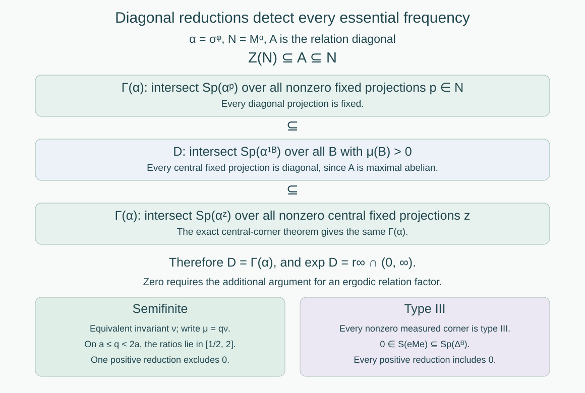

# Ratio sets and intrinsic modular spectra

*Written by GPT-6.1 Sol (OpenAI), Ultra, September 2026. New original text is public domain (CC0).*

## Introduction

The derivative along an orbit arrow gives a concrete modular operator. Its spectrum can contain frequencies that disappear after restricting to a smaller positive-measure set. The asymptotic ratio set retains precisely the frequencies that survive every such restriction. We prove that, for an ergodic countable measured relation, it is the factor's intrinsic modular spectrum. This identifies the exact type III subtypes of our affine examples.

Read [Relation kernels and modular coordinates](relation-kernels-and-modular-coordinates.md), especially Proposition 6.1, and [Diagonal expectations and invariant measures](diagonal-expectations-and-invariant-measures.md), especially Theorem 3.4. We use the maximal diagonal and factor criterion from [Orbits, stabilizers, and relation algebras](orbits-stabilizers-and-relation-algebras.md), Theorem 4.2 and Corollary 4.3. General action spectra and the flow of weights belong to the prerequisite course *Crossed products and duality*. The exact results needed here are:

| Prerequisite lesson | Result used |
| --- | --- |
| *An invariant weight realizes the action spectrum* | For an action preserving a faithful normal semifinite weight, its standard GNS implementation has the same spectrum as the action. |
| *Connes spectrum through fixed corners* | In the intersection defining the Connes spectrum, central projections of the fixed algebra suffice. Equivalent fixed corners have equal Connes spectra. |
| *Cocycle matrix actions and covariant representations* | A unitary cocycle perturbation preserves the Connes spectrum. |
| *The Connes spectrum as a dual-center kernel* | The Connes spectrum is a closed subgroup of the dual group. |
| *Continuous decompositions, modular invariants, and canonical extensions* | For a type III factor and any faithful normal semifinite weight, the intrinsic modular spectrum is zero together with the exponential of its modular action's Connes spectrum. The three resulting sets determine the type III subtype. |

The last result uses general continuous decomposition, modular cocycle comparison, and the fact that a nonzero corner of a type III factor is isomorphic to the factor. These remain prerequisites. Their general proofs are not part of the relation-specific argument below. The result includes zero; taking logarithms only detects its positive part. Takesaki II, XI.1.24, XI.2.2–2.3 and XII.1.5–1.6, gives the source locators for these imports.

## 1. The measured ratio set survives a change of density

Let a countable group act nonsingularly on a nonzero standard sigma-finite measured space \((X,\mu)\). Its orbit relation is
\[
R=\{(y,x):y\text{ lies in the orbit of }x\}.
\]
Freeness is unnecessary: each endpoint pair is counted once. The same argument covers any countable Borel principal relation with nonsingular counting measures, using the countable presentation theorem in the first lesson. Put
\[
\delta_\mu(y,x)=\frac{d\nu_r^\mu}{d\nu_s^\mu}(y,x),\qquad
R_B=R\cap(B\times B).
\tag{1.1}
\]
Choose the cocycle representative on an invariant conull set, as in the kernel lesson. The essential range below is closed in \([0,\infty)\), so it includes zero when positive values approach zero on sets of positive counting measure. Define
\[
r_\infty(R,\mu)=\bigcap_{\mu(B)>0}
\operatorname{ess\,range}_{R_B}\delta_\mu.
\tag{1.2}
\]

**Lemma 1.1.** If \(\mu'=q\mu\), with \(0<q<\infty\) almost everywhere and both measures sigma-finite, then
\[
r_\infty(R,\mu')=r_\infty(R,\mu).
\tag{1.3}
\]

*Proof.* The two source-counting measures are equivalent, and
\[
\delta_{\mu'}(y,x)=\frac{q(y)}{q(x)}\delta_\mu(y,x).
\tag{1.4}
\]
Fix \(\lambda\in r_\infty(R,\mu)\), a positive-measure Borel \(B\), and \(\varepsilon>0\). If \(\lambda>0\), choose \(\eta>0\) so small that \(\eta\lambda<\varepsilon/2\). The intervals \([(1+\eta)^k,(1+\eta)^{k+1})\), \(k\in\mathbb Z\), cover \((0,\infty)\). At least one of the sets obtained by intersecting their inverse images under \(q\) with \(B\) has positive measure. Denote it by \(C\), and its left endpoint by \(a\). On \(R_C\),
\[
(1+\eta)^{-1}\leq\frac{q(y)}{q(x)}\leq1+\eta.
\tag{1.5}
\]
Choose \(\rho>0\) with \((1+\eta)\rho<\varepsilon/2\). The set of arrows in \(R_C\) satisfying \(|\delta_\mu-\lambda|<\rho\) has positive source-counting measure. On this set, (1.4)–(1.5) give
\[
|\delta_{\mu'}-\lambda|
\leq(1+\eta)|\delta_\mu-\lambda|+\eta\lambda<\varepsilon.
\]
Its new counting measure is also positive. Hence \(\lambda\) is in the new essential range on \(R_B\).

If \(\lambda=0\), use the dyadic density bands instead. On one positive-measure \(C\subset B\), the density quotient is at most two. A positive-measure set where \(\delta_\mu<\varepsilon/2\) then gives \(\delta_{\mu'}<\varepsilon\). This proves the same conclusion at zero. Since \(B\) and \(\varepsilon\) were arbitrary, we have one inclusion in (1.3). Apply the argument to \(q^{-1}\) for the reverse inclusion. \(\square\)

We may therefore replace \(\mu\) by an equivalent probability for the modular calculation. The source-density unitary from the first lesson also identifies the relation algebras and their diagonals. We use a probability until Section 3 restores the original sigma-finite measure.

## 2. The diagonal detects every essential modular frequency

Write
\[
M=\mathcal M(R,\mu),\qquad A=L^\infty(X,\mu),\qquad
\varphi(T)=\int_X E(T)\,d\mu.
\]
Here \(\varphi\) is a faithful normal state and \(E:M\to A\) is the diagonal expectation. Its modular action \(\alpha_t=\sigma_t^\varphi\) fixes \(A\) pointwise, by the explicit kernel formula. Put \(N=M^\alpha\). Thus
\[
A\subset N\subset M,\qquad Z(N)\subset A.
\tag{2.1}
\]
For the second inclusion, an element of \(Z(N)\) commutes with \(A\subset N\), and maximal abelianness gives \(A'\cap M=A\).

For a nonzero fixed projection \(p\in N\), let \(\alpha^p\) be the action on \(pMp\). Under the character convention \(t\mapsto e^{its}\), the Connes spectrum is
\[
\Gamma(\alpha)=\bigcap_{0\ne p\in\operatorname{Proj}(N)}
\operatorname{Sp}(\alpha^p)\subset\mathbb R.
\tag{2.2}
\]
The fixed-corner prerequisite says that this equals the intersection over nonzero projections of \(Z(N)\).

**Theorem 2.1.** For the relation algebra above, whether or not it is a factor,
\[
\Gamma(\sigma^\varphi)
=\bigcap_{\mu(B)>0}\operatorname{Sp}(\alpha^{\mathbf1_B})
=\log\bigl(r_\infty(R,\mu)\cap(0,\infty)\bigr).
\tag{2.3}
\]

*Proof.* Let the middle intersection be \(D\). Every diagonal projection is fixed, and every central fixed projection is diagonal by (2.1). Intersecting over a larger family yields a smaller set. Consequently
\[
\Gamma(\alpha)\subset D
\subset\bigcap_{0\ne z\in\operatorname{Proj}(Z(N))}
\operatorname{Sp}(\alpha^z)=\Gamma(\alpha).
\tag{2.4}
\]
Thus all inclusions are equalities. This is the step that replaces arbitrary fixed corners by measured reductions. We have used maximal abelianness and central fixed corners; we have not asserted that \(N\) itself is a factor.

For \(e=\mathbf1_B\), the normalized restricted state is \(\varphi_B=\varphi|_{eMe}/\mu(B)\). Because \(e\in M_\varphi\), its modular action is \(\alpha^e\), by the spectral-corner restriction prerequisite in modular theory. The kernel lesson proves its GNS space is the reduced-relation space and its modular operator is
\[
(\Delta_B\xi)(y,x)=\delta_\mu(y,x)\xi(y,x),
\qquad (y,x)\in R_B.
\tag{2.5}
\]
The invariant-weight spectrum theorem identifies the spectrum of \(\alpha^e\) with that of \(\Delta_B^{it}\). Functional calculus for the positive injective multiplier in (2.5) therefore gives
\[
\operatorname{Sp}(\alpha^e)
=\operatorname{Sp}(\log\Delta_B)
=\log\bigl(\operatorname{ess\,range}_{R_B}\delta_\mu
\cap(0,\infty)\bigr).
\tag{2.6}
\]
For completeness, this last equality is pointwise at a finite real \(s\): neighborhoods of \(s\) under the exponential are precisely neighborhoods of the positive number \(e^s\), up to shrinking. A positive-measure approximate-eigenvector set for one multiplier supplies one for the other. No finite \(s\) represents zero. Intersect (2.6) over \(B\); the bijection \(s\mapsto e^s\) commutes with this intersection. Equations (1.2) and (2.4) yield (2.3). \(\square\)

*Figure 1. The three intersections in Theorem 2.1 coincide because \(Z(N)\subset A\subset N\). The lower branches summarize the separate zero argument in Theorem 3.1. They apply to an ergodic relation factor. This is an exact proof diagram, not a drawing of its Hilbert space. Source: Takesaki II, Lemma XI.2.2, and Takesaki III, Theorem XIII.2.13.*

## 3. Identification with the factor invariant, including zero

Assume now that \(R\) is ergodic. Then \(M\) is a factor. Define
\[
S(M)=\bigcap_{\psi\text{ faithful normal semifinite}}
\operatorname{Sp}(\Delta_\psi).
\tag{3.1}
\]
Weights on isomorphic algebras transport their GNS constructions unitarily, so this is an algebraic invariant. The intersection runs over weights on \(M\), not merely over the particular states on its measured corners.

**Theorem 3.1.** Every ergodic countable nonsingular relation on a nonzero standard sigma-finite measured space satisfies
\[
\boxed{r_\infty(R,\mu)=S\bigl(\mathcal M(R,\mu)\bigr).}
\tag{3.2}
\]
In particular, no freeness assumption on a presenting countable group is needed.

*Proof.* First use Lemma 1.1 and the source-density unitary to take \(\mu\) to be a probability.

Suppose \(M\) is semifinite. The invariant-measure criterion supplies an equivalent sigma-finite invariant measure \(\nu\). Its derivative is one on every reduced relation, so
\[
r_\infty(R,\nu)=\{1\}.
\tag{3.3}
\]
Every positive reduction has a positive-measure diagonal, ensuring its essential range is the nonempty set \(\{1\}\). Lemma 1.1 gives (3.3) for \(\mu\) as well.

On the algebra side, a faithful normal semifinite trace \(\tau\) has modular operator \(1\), hence \(S(M)\subset\{1\}\). For any faithful normal semifinite \(\psi\), the identity is a nonzero zero-frequency vector for \(\sigma^\psi\), so \(0\in\operatorname{Sp}(\sigma^\psi)\). The weight is invariant under its modular action. The invariant-weight spectrum theorem gives \(0\in\operatorname{Sp}(\log\Delta_\psi)\), or \(1\in\operatorname{Sp}(\Delta_\psi)\). Intersecting proves \(S(M)=\{1\}\), completing this case.

Suppose instead that \(M\) is type III. The general modular invariant prerequisite gives
\[
S(M)=\{0\}\cup\exp\Gamma(\sigma^\varphi).
\tag{3.4}
\]
Theorem 2.1 identifies its positive part with that of \(r_\infty\). We must still prove that zero lies in every reduced derivative spectrum. For \(\mu(B)>0\), the nonzero corner \(eMe\) is itself a type III factor: a nonzero finite projection in the corner would be a finite projection in \(M\). Apply the same general prerequisite to this corner. It gives \(0\in S(eMe)\), and therefore \(0\in\operatorname{Sp}(\Delta_B)\) for its faithful state \(\varphi_B\). The kernel multiplier formula (2.5) yields
\[
0\in\operatorname{ess\,range}_{R_B}\delta_\mu.
\tag{3.5}
\]
Since \(B\) was arbitrary, zero lies in \(r_\infty\). This and (3.4) prove (3.2). Finally Lemma 1.1 and the algebra's measure-class unitary restore any original sigma-finite \(\mu\). The factor alternatives are exhaustive, so these cases finish the proof. \(\square\)

There is also a useful concrete check on the exclusion of zero in the semifinite case. Write \(\mu=q\nu\), where \(\nu\) is invariant. On a positive set where \(a\leq q<2a\), every reduced derivative lies between \(1/2\) and \(2\). Thus zero is excluded by one measured corner. Finer density bands reduce the intersection to \(\{1\}\). Zero in the spectrum of the original probability-state operator alone would not contradict this.

## 4. Reading the type from essential ratios

The closed-subgroup prerequisite and Theorem 2.1 show that
\[
\log\bigl(r_\infty\cap(0,\infty)\bigr)
\quad\text{is a closed subgroup of }\mathbb R.
\tag{4.1}
\]
The possibilities are \(\{0\}\), \(T\mathbb Z\) for \(T>0\), and \(\mathbb R\). To verify this elementary classification, let \(L\) be a closed subgroup with a positive element and take the infimum \(T\) of its positive elements. If \(T>0\), closedness makes \(T\in L\); division with remainder shows \(L=T\mathbb Z\). If \(T=0\), positive elements approach zero, and their integer multiples approximate every real number. Closedness then gives \(L=\mathbb R\).

**Corollary 4.1.** The measured possibilities and their algebraic meanings are:

| Ratio set | Factor type |
| --- | --- |
| \(\{1\}\) | Semifinite: type I, \(II_1\), or \(II_\infty\), distinguished by the orbit and invariant-measure criteria. |
| \(\{0,1\}\) | \(III_0\). |
| \(\{0\}\cup\lambda^{\mathbb Z}\) | \(III_\lambda\), \(0<\lambda<1\); here \(T=-\log\lambda\). |
| \([0,\infty)\) | \(III_1\). |

*Proof.* Theorem 3.1 gives the invariant \(S(M)\). Its type III alternatives are exactly the three cases in the general subtype prerequisite, Takesaki II, Theorem XII.1.6(i)–(iii). The semifinite case is (3.3). \(\square\)

This table does not classify an aperiodic flow of weights up to conjugacy. Many type \(III_0\) factors share the same ratio set. The flow itself contains more information.

**Example 4.2 (one dilation scale).** For \(0<\lambda<1\), let
\[
D_\lambda=\sum_{n\in\mathbb Z}\mathbb Q\lambda^n,
\qquad
\Gamma_\lambda=\{x\mapsto\lambda^n x+b:b\in D_\lambda,\ n\in\mathbb Z\}.
\tag{4.2}
\]
The sum means finite sums. The compact-model lesson, Example 4.3, proves this countable discrete action is ergodic, free on an invariant conull set, and has
\[
r_\infty=\{0\}\cup\lambda^{\mathbb Z}.
\tag{4.3}
\]
Its overlap argument works on every positive-measure reduction: for each prescribed slope \(\lambda^n\), some rational translation sends a positive-measure piece back into that reduction. Corollary 4.1 now proves that its relation factor is type \(III_\lambda\). The free discrete crossed-product identification in the free-action lesson gives the same subtype for its crossed product. The use of Lebesgue measure is allowed by the sigma-finite assertion of Theorem 3.1.

**Example 4.3 (all rational slopes).** Let
\[
\Gamma=\{x\mapsto ax+b:a\in\mathbb Q_{>0},\ b\in\mathbb Q\}.
\tag{4.4}
\]
Exercise 5.6 of the compact-model lesson proves ergodicity, conull freeness, and \(r_\infty=[0,\infty)\): every positive rational slope occurs on a positive-measure arrow set inside every positive reduction, and these slopes are dense. The relation factor and its free discrete crossed product are therefore type \(III_1\).

## 5. Exercises with solutions

Level 1 asks for a computation or a direct application. Level 2 asks for a proof using the lesson’s framework. Level 3 combines results or examines a hypothesis whose failure changes the conclusion.

**Exercise 5.1 (a centralizer need not be a factor).** *Level 1.* Use the complete two-point relation with masses \(1/3\) and \(2/3\). Compute the probability-state modular spectrum, the modular action spectrum, the centralizer, and the asymptotic ratio set. Check that Theorem 2.1 does not require a factorial centralizer.

*Solution.* The relation algebra is \(M_2(\mathbb C)\), and the state has density \(\operatorname{diag}(1/3,2/3)\) relative to the matrix trace. On matrix units, \(\Delta\) has eigenvalues \(p_i/p_j\), so its spectrum is \(\{1/2,1,2\}\). The action has frequencies \(\{-\log2,0,\log2\}\). Its centralizer consists of the diagonal matrices because the two density eigenvalues are distinct. It is \(A\cong\mathbb C^2\), which is not a factor. Each singleton reduction has spectrum \(\{1\}\), so \(r_\infty=\{1\}\) and \(\Gamma=\{0\}\). Here \(Z(N)=A=N\), and the intersection argument applies exactly.

**Exercise 5.2 (zero disappears under reduction).** *Level 2.* On \(\mathbb N\), take masses \(p_n=2^{-n-1}\) and the complete relation. Its state modular spectrum is \(\{0\}\cup2^{\mathbb Z}\). Compute \(r_\infty\) and \(S(M)\), and explain why this does not produce type \(III_{1/2}\).

*Solution.* Every nonempty reduction contains diagonal arrows with derivative one. A singleton is a positive-measure reduction and its only arrow has derivative one. Thus the intersection is \(\{1\}\). The factor is \(B(\ell^2(\mathbb N))\), so Theorem 3.1 gives \(S(M)=\{1\}\). Its faithful semifinite counting trace also has modular operator one. The original state spectrum reflects the chosen unequal masses, whereas the intrinsic intersection permits other weights and the measured intersection permits singleton reductions. Zero and the powers of two disappear from these intersections. In particular the essential ratios of type \(III_{1/2}\) would have to persist on every positive reduction; here they do not.

**Exercise 5.3 (an unbounded density on a finite invariant base).** *Level 2.* Let an irrational rotation act on \([0,1)\) modulo one, with invariant Lebesgue probability \(\nu\). Replace it by \(d\mu(x)=(2\sqrt x)^{-1}d\nu(x)\) for \(x>0\), assigning any finite positive value to the density at zero. Show that the full probability-state modular spectrum contains zero, but \(r_\infty=\{1\}\). Determine the factor type.

*Solution.* The density \(q\) is positive finite almost everywhere and integrates to one. If the rotation parameter is \(\theta\in(0,1)\), then for small positive \(x\) the arrow \(x\mapsto x+\theta\) has derivative
\[
\frac{q(x+\theta)}{q(x)}=\sqrt{\frac{x}{x+\theta}}.
\]
It approaches zero on intervals of positive \(\mu\)-measure. Hence zero is in the full derivative essential range and in the state modular spectrum. Nevertheless Lemma 1.1 compares with the invariant probability \(\nu\), whose reduced derivatives are all one. Thus \(r_\infty=\{1\}\). The rotation is ergodic, has countable null orbits, and admits a finite invariant probability, so its relation factor is \(II_1\) by the invariant-measure classification. Explicitly, a positive density band \(a\leq q<2a\) excludes zero from its reduced spectrum.

**Exercise 5.4 (subtype parameters are determined).** *Level 1.* If the factors of Example 4.2 for parameters \(\lambda,\eta\in(0,1)\) are isomorphic, prove \(\lambda=\eta\). Does this establish that every pair of type \(III_0\) factors is isomorphic?

*Solution.* An isomorphism preserves \(S(M)\), so \(\lambda^{\mathbb Z}=\eta^{\mathbb Z}\). The largest element of \(\lambda^{\mathbb Z}\) strictly below one is \(\lambda\), and likewise for \(\eta\). Equality gives \(\lambda=\eta\). Type \(III_0\) instead has the common set \(\{0,1\}\); equality of one invariant is not a complete isomorphism criterion. In that case the flow of weights requires additional comparison.

**Exercise 5.5 (two incompatible scales).** *Level 3.* Suppose an ergodic countable measured relation has both two and three in its asymptotic ratio set. Prove that its factor is type \(III_1\).

*Solution.* By (4.1), the closed subgroup \(L=\log(r_\infty\cap(0,\infty))\) contains \(\log2\) and \(\log3\). Their ratio is irrational: a rational relation would give \(2^m=3^n\) for positive integers \(m,n\), contradicting unique prime factorization. Thus \(L\) cannot be \(T\mathbb Z\), since the ratio of any two nonzero members of such a group is rational. It is not \(\{0\}\), so the closed-subgroup classification gives \(L=\mathbb R\). Hence every positive real number is in \(r_\infty\); closedness also includes zero. Corollary 4.1 gives type \(III_1\).

**Exercise 5.6 (a nonfree presentation).** *Level 2.* Let \(\Gamma\) be the rational affine group of Example 4.3 and let \(\Gamma\times\mathbb Z\) act on the line through its first coordinate. Determine the relation factor. Why does the corresponding crossed product fail to be a factor?

*Solution.* The endpoint relation is unchanged because the second coordinate acts trivially. Its derivative and every reduced ratio set are unchanged, so its relation factor is still type \(III_1\). Every point has a stabilizer containing the infinite subgroup \(\{1\}\times\mathbb Z\); equality holds on the invariant conull free model of the affine action. In the crossed product, the unitaries of this central group coordinate commute with the coefficient algebra and with all group unitaries. Its regular representation gives a faithful copy of the nonscalar algebra \(L(\mathbb Z)\); equivalently, tensor separation of the two regular group coordinates gives \((L^\infty(\mathbb R)\rtimes\Gamma)\,\bar\otimes L(\mathbb Z)\). Its center is nontrivial. Theorem 3.1 concerns the endpoint relation factor even for this nonfree presentation; identifying it with a group crossed product requires the separate freeness condition.

**Exercise 5.7 (zero and logarithms).** *Level 2.* Compare the sets \(\{1\}\) and \(\{0,1\}\). Explain why a calculation of the Connes spectrum alone cannot distinguish them. Give a concrete measured criterion that settles the distinction in this lesson.

*Solution.* Both positive parts have logarithm \(\{0\}\). The spectral operator \(\log\Delta\) has no finite frequency corresponding to zero, so Theorem 2.1 yields the same Connes spectrum for both cases. The invariant-measure criterion supplies the additional test: an equivalent sigma-finite invariant measure makes every derivative one in that measure and gives \(r_\infty=\{1\}\). Without such a measure the factor is type III, every positive reduction has zero in its modular spectrum, and if its positive essential ratios are only one, the ratio set is \(\{0,1\}\). This is type \(III_0\). A single full-space state spectrum containing zero does not settle that test, as Exercises 5.2–5.3 demonstrate.

## References

- [Takesaki II] Masamichi Takesaki, *Theory of Operator Algebras II*, Encyclopaedia of Mathematical Sciences 125, Springer, 2003. XI.1.24, XI.2.1–2.3, XII.1.5–1.6. [Publisher record](https://doi.org/10.1007/978-3-662-10451-4).
- [Takesaki III] Masamichi Takesaki, *Theory of Operator Algebras III*, Encyclopaedia of Mathematical Sciences 127, Springer, 2003. XIII.2.12–2.14. [Publisher record](https://doi.org/10.1007/978-3-662-10453-8).
