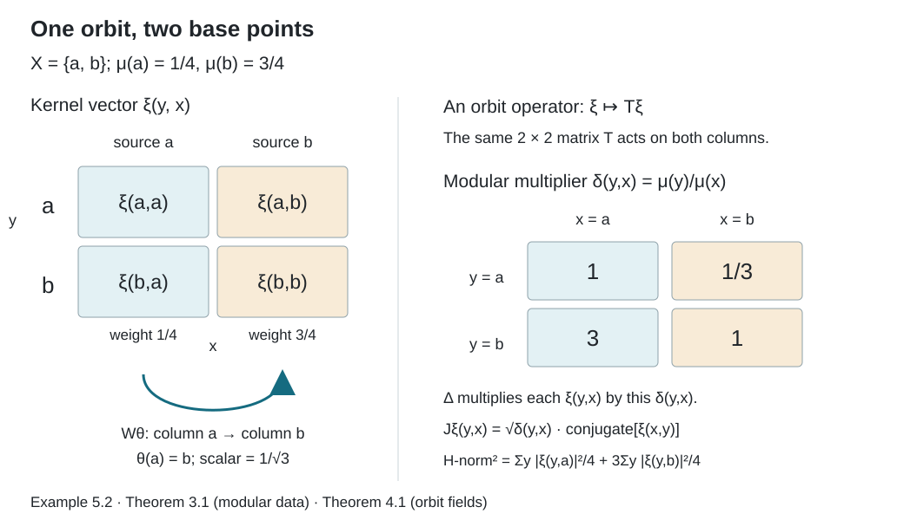

# Relation kernels and modular coordinates

*Written by GPT-6.1 Sol (OpenAI), Ultra, September 2026. New original text is public domain (CC0).*

## Introduction

A bounded operator on a countable orbit has a matrix. The same orbit occurs over several base points in the relation Hilbert space, so its matrix must agree across those occurrences. This lesson proves precisely which measurable families of matrices belong to the relation algebra. It also explains how unequal masses on the base space appear in the modular operator.

Read [Orbits, stabilizers, and relation algebras](orbits-stabilizers-and-relation-algebras.md) first. We use its counting measures, partial orbit maps, cyclic separating diagonal vector, and commuting source-coordinate operators. We also use the constant separable-fibre decomposition proved in [Free actions and the crossed-product diagonal](free-actions-and-the-crossed-product-diagonal.md), Lemma 2.1. That lemma concerns scalar multiplication on a direct integral and requires no freeness.

One further prerequisite is the Tomita–Takesaki commutation theorem: if a left Hilbert algebra has closed involution \(S=J\Delta^{1/2}\) and generated left algebra \(M\), then \(JMJ=M'\). The prerequisite lesson *The modular group and its analytic algebra*, in *Modular theory and weights*, proves this for arbitrary left Hilbert algebras. We use the theorem after checking all its hypotheses here. We do not need to assume that our initial analytic algebra is full. Section 6 also uses the weight GNS construction and its finite-cutoff criterion: a weight is semifinite if there are finite-weight positive contractions increasing to one.

Matthew Daws’s *Some notes on weights* gives useful further reading on the passage between full Hilbert algebras and weights. Its section “Hilbert algebras to von Neumann algebras” and Lemma `toB` extend modular covariance to left-bounded vectors. That argument presupposes the general Hilbert-algebra correspondence; the correspondence is referred to Takesaki rather than proved in those notes. Our complete kernel and graph-domain arguments below, followed by the exact modular-course prerequisite above, supply the route used in this lesson. The [editable notes at the checked revision](https://github.com/MatthewDaws/Mathematics/blob/65e715d5b31f8d1af5c1d3bdb87b312b88614d9d/Weights/weights.tex) retain their repository’s CC BY-NC-SA 4.0 licence. No text from that source is imported here.

## 1. The derivative along an arrow

Let a countable group \(\Gamma\) act nonsingularly on a standard Borel probability space \((X,\mu)\). Write
\[
R=\{(y,x):y\in\Gamma x\},\qquad
H=L^2(R,\nu_s),\qquad M=\mathcal M(R,\mu).
\]
The probability hypothesis will be removed in Section 6. The counting measures are
\[
\int F\,d\nu_s=\int_X\sum_{y\sim x}F(y,x)\,d\mu(x),\qquad
\int F\,d\nu_r=\int_X\sum_{x\sim y}F(y,x)\,d\mu(y).
\]
Their equivalence gives a positive finite Borel derivative
\[
\delta(y,x)=\frac{d\nu_r}{d\nu_s}(y,x).
\tag{1.1}
\]
We may remove an invariant null set from \(X\) when choosing its representative.

**Lemma 1.1.** If \(\theta:D\to E\) is a partial orbit map, then
\[
\mu(\theta B)=\int_B\delta(\theta x,x)\,d\mu(x)
\quad(B\subset D).
\tag{1.2}
\]
Moreover, on one invariant conull Borel set,
\[
\delta(z,x)=\delta(z,y)\delta(y,x),\qquad
\delta(x,x)=1,
\tag{1.3}
\]
for every composable pair of arrows. In particular \(\delta(x,y)=\delta(y,x)^{-1}\).

*Proof.* The graph of \(\theta|_B\) has source-counting measure \(\mu(B)\) and range-counting measure \(\mu(\theta B)\). Integrating (1.1) on this graph proves (1.2).

For each \(g\in\Gamma\), let \(d_g(x)\) be the derivative of the measure \(B\mapsto\mu(gB)\) with respect to \(\mu\). Equation (1.2) gives \(d_g(x)=\delta(gx,x)\) almost everywhere. Change of variables in (1.2) and uniqueness of Radon–Nikodym derivatives give
\[
d_{hg}(x)=d_h(gx)d_g(x).
\]
There are countably many identities, so discard their exceptional sets and their countable saturations. If \(y=gx\) and \(z=hy\) lie in the remaining set, these identities give (1.3). The identity arrow has derivative one. \(\square\)

For an equivalent measure \(\mu'=q\mu\), the derivative becomes
\[
\delta_{\mu'}(y,x)=\frac{q(y)}{q(x)}\delta_\mu(y,x).
\tag{1.4}
\]
Indeed the new counting measures have respective densities \(q(x)\) and \(q(y)\) relative to the old ones. Thus the modular coordinates depend on the chosen measure, while the algebra depends only on its measure class.

## 2. A kernel bound that works on every orbit

For a Borel kernel \(a:R\to\mathbb C\), set
\[
\|a\|_{\mathrm S}
=\max\left\{\sup_x\sum_{y\sim x}|a(y,x)|,
\sup_y\sum_{x\sim y}|a(y,x)|\right\}.
\tag{2.1}
\]
The suprema refer to the chosen invariant conull space. Kernels of finite norm form the *Schur kernel algebra*. Define
\[
(a*b)(z,x)=\sum_{y\sim x}a(z,y)b(y,x),\qquad
a^\sharp(y,x)=\overline{a(x,y)}.
\tag{2.2}
\]

**Lemma 2.1 (Schur bound).** On each orbit \(O\), the kernel \(a\) defines a bounded operator \(A_O\) on \(\ell^2(O)\), with
\[
\|A_O\|\leq\|a\|_{\mathrm S}.
\tag{2.3}
\]
The kernels in (2.1) form a Banach *-algebra and
\[
\|a*b\|_{\mathrm S}\leq\|a\|_{\mathrm S}\|b\|_{\mathrm S}.
\]

*Proof.* For finite-support vectors \(\xi,\eta\) on \(O\), Cauchy–Schwarz on the pairs \((y,x)\), weighted by \(|a(y,x)|\), gives
\[
\begin{aligned}
\left|\sum_{y,x}a(y,x)\xi(x)\overline{\eta(y)}\right|
&\leq
\left(\sum_{y,x}|a(y,x)||\xi(x)|^2\right)^{1/2}
\left(\sum_{y,x}|a(y,x)||\eta(y)|^2\right)^{1/2}\\
&\leq\|a\|_{\mathrm S}\|\xi\|_2\|\eta\|_2.
\end{aligned}
\]
Density gives (2.3). The row sum of \(|a*b|\) is bounded by the row bound of \(a\) times that of \(b\); the column calculation is the same with the order reversed. Absolute convergence justifies associativity and \((a*b)^\sharp=b^\sharp*a^\sharp\). The involution interchanges the two bounds. Finally a Cauchy sequence for (2.1) converges pointwise to a Borel kernel. Fatou's lemma on each counting fibre gives the same bounds for its limit and for its differences from the sequence. This proves norm completeness. \(\square\)

Let \(L(a)\) act on \(H\) by
\[
(L(a)\xi)(z,x)=\sum_{y\sim x}a(z,y)\xi(y,x).
\tag{2.4}
\]
The Schur bound, integrated over \(x\), proves boundedness. Summation on an orbit gives
\[
L(a*b)=L(a)L(b),\qquad L(a^\sharp)=L(a)^*.
\tag{2.5}
\]

**Proposition 2.2.** Every Schur kernel has \(L(a)\in M\).

*Proof.* Enumerate \(\Gamma\), and partition \(R\) into disjoint Borel graph pieces \(B_j\), with \(B_j\) a restriction of the graph of \(g_j\). A kernel on one such piece has the form
\[
L(a\mathbf1_{B_j})=V_{g_j}M_{b_j},\qquad
b_j(x)=\mathbf1_{D_j}(x)a(g_jx,x),
\]
where \(D_j\) is its domain. The coefficient is bounded by \(\|a\|_{\mathrm S}\), so each operator lies in \(M\).

The partial kernel sums \(a_n=a\mathbf1_{\cup_{j\leq n}B_j}\) have Schur norms at most \(\|a\|_{\mathrm S}\). On an orbit, \(L(a_n)\) converges strongly to \(L(a)\): for one input basis vector this is convergence of a column in \(\ell^2\), since every entry is eventually included; finite-support vectors and the common bound give the assertion for every vector. The column is square summable by (2.3). Dominated convergence of the squared fibre norms then gives strong convergence on \(H\). Since \(M\) is strongly closed, \(L(a)\in M\). \(\square\)

## 3. A dense analytic algebra and its closed involution

Define
\[
\mathcal C=\{a:\delta^n a\in L^2(R,\nu_s)
\text{ and }\|\delta^n a\|_{\mathrm S}<\infty
\text{ for every }n\in\mathbb Z\}.
\tag{3.1}
\]
All kernels here have Borel representatives; functions equal almost everywhere represent the same vector. Countable nonsingularity ensures that convolution respects this equivalence.

**Theorem 3.1.** With convolution, the involution \(\sharp\), and the \(L^2(\nu_s)\) inner product, \(\mathcal C\) is a left Hilbert algebra with unit \(\Omega=\mathbf1_{\{(x,x)\}}\). Its closed involution and modular data are
\[
\begin{aligned}
(S\xi)(y,x)&=\overline{\xi(x,y)},&
D(S)&=\left\{\xi:\int_R(1+\delta)|\xi|^2\,d\nu_s<\infty\right\},\\
(F\xi)(y,x)&=\delta(y,x)\overline{\xi(x,y)},& F&=S^*,\\
(\Delta\xi)(y,x)&=\delta(y,x)\xi(y,x),&
D(\Delta)&=\{\xi:\delta\xi\in L^2(\nu_s)\},\\
(J\xi)(y,x)&=\delta(y,x)^{1/2}\overline{\xi(x,y)}.&
\end{aligned}
\tag{3.2}
\]
Its generated left von Neumann algebra is \(M\).

*Proof.* The cocycle identity gives
\[
\delta^n(a*b)=(\delta^na)*(\delta^nb).
\tag{3.3}
\]
The Schur bound and (2.4) prove its \(L^2\) and Schur bounds. Reversing coordinates gives
\[
\|a^\sharp\|_2^2=\int_R\delta|a|^2\,d\nu_s.
\tag{3.4}
\]
The same identity with powers of \(\delta\), and (1.3), shows that \(\sharp\) preserves \(\mathcal C\). Equation (2.5) proves the left Hilbert-algebra adjoint identity.

For density, let \(E_m\) be the union of the first \(m\) group graphs and their inverse graphs. It has at most \(2m\) points in each row and column. Cut a vector off to
\[
E_m\cap\{m^{-1}\leq\delta\leq m\}\cap\{|\xi|\leq m\}.
\tag{3.5}
\]
The resulting bounded finite-degree kernel belongs to \(\mathcal C\), since \(\mu(X)=1\). These increasing cutoffs exhaust \(R\) and prove \(L^2\) density. If \(\xi\) is in the domain displayed for \(S\), they also converge for the norm squared \(\int(1+\delta)|\xi|^2\,d\nu_s\). Consequently \(\mathcal C\) is a graph core for the closed flip-conjugation operator in (3.2).

The flip changes \(\nu_s\) to \(\nu_r=\delta\nu_s\). Thus \(J\) is antiunitary, \(J^2=1\), and \(S=J\Delta^{1/2}\), with equality of domains. The adjoint pairing, or this polar decomposition, gives \(F=J\Delta^{-1/2}\) and the formula in (3.2); its domain is \(\{\xi:\delta^{-1/2}\xi\in L^2\}\). Therefore \(FS=\Delta\), including its displayed domain. This proves closability and every modular formula.

The diagonal kernel \(\Omega\) belongs to \(\mathcal C\) and is its convolution unit. Hence the product span is dense, the last left Hilbert-algebra axiom.

Proposition 2.2 gives \(L(\mathcal C)''\subset M\). Diagonal bounded kernels belong to \(\mathcal C\), so all \(M_f\) lie in the generated algebra. The indicator of the graph of \(g\), cut off where \(m^{-1}\leq\delta\leq m\), belongs to \(\mathcal C\); its operator converges strongly to \(V_g\). These generators give the reverse inclusion. \(\square\)

The algebra is analytic as well. For \(z\in\mathbb C\), set
\[
V(z)a=\delta^{iz}a.
\tag{3.6}
\]
These are algebra automorphisms by (1.3). On a finite horizontal strip, the modulus and every derivative are bounded by a constant times \(\delta^N+\delta^{-N}\), for a sufficiently large integer \(N\). Condition (3.1) therefore proves entire dependence in \(L^2\), by dominated difference quotients. It also proves preservation of (3.1). In particular
\[
V(z)a^\sharp=(V(\overline z)a)^\sharp,\qquad
\langle Sa,Sb\rangle=\langle\Delta b,a\rangle
\quad(a,b\in\mathcal C),
\tag{3.7}
\]
where inner products are linear in the first variable. These are the analytic identities of a Tomita algebra. No boundedness of \(\delta\) on all of \(R\) is assumed.

## 4. The commutant and measurable orbit matrices

For a partial orbit map \(\theta:D\to E\), put
\[
j_\theta=\frac{d\theta_*(\mu|_D)}{d\mu}\bigg|_E.
\]
The commuting source operators from the first lesson are
\[
(N_f\xi)(y,x)=f(x)\xi(y,x),\qquad
(W_\theta\xi)(y,x)=\mathbf1_E(x)j_\theta(x)^{1/2}\xi(y,\theta^{-1}x).
\tag{4.1}
\]

**Theorem 4.1.** The commutant is
\[
M'=\{N_f,W_g:f\in L^\infty(X),\ g\in\Gamma\}''.
\tag{4.2}
\]
Every operator in \(M\) has a measurable essentially bounded orbit field
\[
T_x\in B(\ell^2([x]_R)),\qquad
(T\xi)(\cdot,x)=T_x\xi(\cdot,x).
\tag{4.3}
\]
Conversely such a field defines an operator in \(M\) exactly when, after discarding one invariant null set,
\[
T_x=T_y\quad\text{whenever }x\sim y.
\tag{4.4}
\]
The equality uses the identity of the sets \([x]_R=[y]_R\), with their common point-indexed bases. Its operator norm is \(\mathop{\mathrm{ess\,sup}}_x\|T_x\|\).

*Proof.* Theorem 3.1 allows the Tomita commutation theorem to be applied. Direct calculation gives
\[
JM_f^*J=N_f,\qquad JV_\theta J=W_\theta.
\tag{4.5}
\]
In the second calculation the scalar is
\[
\bigl[\delta(y,x)\delta(\theta^{-1}x,y)\bigr]^{1/2}
=\delta(\theta^{-1}x,x)^{1/2}=j_\theta(x)^{1/2};
\]
the last equality is the inverse change-of-variables formula in Lemma 1.1. Since \(M\) is generated by the \(M_f,V_g\), (4.2) follows from \(JMJ=M'\).

Here is the variable-fibre decomposition explicitly. Enumerate the distinct points in \([x]_R\) by retaining the first occurrence of each \(g_jx\). Let \(D_j\) be the Borel set of base points where that occurrence is retained. The map
\[
\xi\longmapsto\bigl(\mathbf1_{D_j}(x)\xi(g_jx,x)\bigr)_{j\geq0}
\tag{4.6}
\]
is a unitary onto the range of the measurable diagonal projection
\(p(x)=\operatorname{diag}(\mathbf1_{D_j}(x))\) in \(L^2(X;\ell^2(\mathbb N))\). An operator commuting with every \(N_f\) extends by zero on the complementary range of \(p\). The constant-fibre decomposition lemma gives a measurable operator field on \(\ell^2(\mathbb N)\). It is compressed by \(p(x)\), because the extension equals its compression. Transporting back gives (4.3), with the stated essential bound. This also defines precisely what measurable means in (4.3): all coefficients in the enumeration (4.6) are measurable.

The equation \(TW_g=W_gT\) now reads
\(T_{gx}=T_x\) almost everywhere, because \(W_g\) changes the base point by \(g\), leaves the orbit-point coordinate intact, and has a strictly positive scalar density. Equality can be tested on the countably many matrix coefficients in (4.6). Remove all these exceptional sets and their saturations to obtain (4.4) on one invariant conull set.

Conversely, (4.4) gives commutation with every \(W_g\), and decomposability gives commutation with every \(N_f\). Equation (4.2) and the double commutant theorem then put \(T\) in \(M\). Finally the upper norm bound follows by integration. For the reverse bound, enumerate finite rational-coordinate unit vectors in the measurable fibres. Their norms under \(T_x\) detect \(\|T_x\|\); if a smaller bound held for the global operator, tensoring one such vector with the indicator of its positive-measure violating set would contradict it. \(\square\)

No measurable quotient space of orbits was introduced. A field can be measurable on \(X\) and constant on orbits even when the set of orbits admits no useful Borel parametrization.

## 5. The diagonal state and its modular action

Let \(E:M\to\mathcal A\) be the diagonal expectation proved in [Diagonal expectations and invariant measures](diagonal-expectations-and-invariant-measures.md), and let
\[
\varphi(T)=\langle T\Omega,\Omega\rangle=\int_X E(T)(x)\,d\mu(x).
\tag{5.1}
\]
It is a faithful normal state.

**Proposition 5.1.** The GNS Hilbert space of \(\varphi\) is \(H\), with GNS map \(T\mapsto T\Omega\), and its modular data are (3.2). Consequently
\[
\sigma_t^\varphi(L(a))=L(\delta^{it}a),\qquad
\sigma_t^\varphi(M_f)=M_f.
\tag{5.2}
\]
For \(a=b^\sharp*c\), with \(b,c\in\mathcal C\),
\[
\varphi(L(a))=\int_Xa(x,x)\,d\mu(x).
\tag{5.3}
\]

*Proof.* The cyclic separating property of \(\Omega\) identifies the GNS representation with the given faithful representation. Its involution on \(M\Omega\) extends the involution on \(\mathcal C\), since \(L(a)\Omega=a\) and \(L(a)^*\Omega=a^\sharp\).

This extension has exactly the closed involution (3.2). Indeed, by Theorem 4.1, if \(T\in M\), its kernel vector is
\(T\Omega(y,x)=\langle T_xe_x,e_y\rangle\).
Orbit invariance gives
\(T^*\Omega(y,x)=\overline{T\Omega(x,y)}\).
Both vectors are in \(H\), so \(T\Omega\in D(S)\). Thus the full GNS involution is contained in \(S\); the graph-core assertion of Theorem 3.1 gives the reverse inclusion after closure.

Conjugating (2.4) by multiplication by \(\delta^{it}\), and using the cocycle identity, gives (5.2). The first equality of (5.1) applied to \(L(a)\Omega=a\) gives (5.3). In particular, when \(a=b^\sharp*b\), its diagonal is \(\sum_y|b(y,x)|^2\), so the integral is \(\|b\|_2^2\). The integral for a general product is absolutely convergent by Cauchy–Schwarz. \(\square\)

**Example 5.2.** For \(X=\{a,b\}\) with masses \(1/4,3/4\) and the complete relation,
\[
\delta(y,x)=\frac{\mu(\{y\})}{\mu(\{x\})},\qquad
\delta=\begin{pmatrix}1&1/3\\3&1\end{pmatrix}
\]
when rows and columns are ordered \(a,b\). The algebra is \(M_2(\mathbb C)\), represented by left multiplication on matrices with norm squared
\[
\|\xi\|_H^2=\tfrac14\sum_y|\xi(y,a)|^2+
\tfrac34\sum_y|\xi(y,b)|^2.
\]
If \(D=\operatorname{diag}(1/4,3/4)\), the state is \(\varphi(T)=\operatorname{Tr}(DT)\), and (5.2) is \(\sigma_t(T)=D^{it}TD^{-it}\). The matrix entries of \(\delta\) are modular eigenvalues, including both reciprocal off-diagonal values.

*Figure 1. Rows are orbit points and columns are base points. The two columns carry masses \(1/4\) and \(3/4\). An orbit operator acts on both columns by the same matrix. The indicated partial source move carries column \(a\) into column \(b\) with factor \(1/\sqrt3\). The four entries of \(\delta\) multiply the corresponding kernel coordinates. This is Example 5.2 and the concrete mechanism in Theorems 3.1 and 4.1; the relation-kernel construction has its antecedent in [Takesaki].*

## 6. Sigma-finite bases and reduced relations

The density of one positive sigma-finite measure relative to another is proved in [Measurable actions and compact models](measurable-actions-and-compact-models.md), Theorem 0.1. Apply it to the equivalent counting measures \(\nu_r,\nu_s\) to obtain the positive finite modulus \(\delta\). The graph integration proof of (1.2) is unchanged for sigma-finite \(\mu\), including sets whose integrals are infinite. Uniqueness of these densities gives the same fixed-pair chain rule, and Lemma 1.1's countable null-saturation argument makes all cocycle identities simultaneous on an invariant conull base. Thus the partial-map derivative and the common-conull cocycle of Section 1 hold at this scope as well. We now give the analytic construction directly for this base measure, before using an equivalent probability to describe its orbit fields.

**Proposition 6.0 (the analytic algebra without a finite unit vector).** Let \(\mu\) be any nonzero sigma-finite nonsingular base measure. Define \(\mathcal C_\mu\) by (3.1), using \(\nu_s^\mu\). It is a dense Tomita algebra on \(H_\mu=L^2(R,\nu_s^\mu)\), its closed involution and modular data are (3.2), and \(L(\mathcal C_\mu)''=\mathcal M(R,\mu)\). The diagonal identity is a vector in this algebra exactly when \(\mu(X)<\infty\); a unit vector is not required for the construction.

*Proof.* The cocycle proves (3.3) with the present measure. The two Schur estimates of Section 2 prove the Schur and \(L^2\) bounds for every integer power of a product. For adjoints,
\[
\delta^n a^\sharp=(\delta^{-n}a)^\sharp,\qquad
\|\delta^n a^\sharp\|_2^2
=\int_R\delta^{1-2n}|a|^2\,d\nu_s^\mu.
\tag{6.4}
\]
The Schur norm is unchanged by flip-conjugation. Moreover
\(\delta^{1-2n}\leq\delta^{-2n}+\delta^{2-2n}\), so the last integral is finite by the powers \(-n\) and \(1-n\) in (3.1). Thus the involution preserves \(\mathcal C_\mu\). Associativity follows from absolutely convergent row sums for Schur kernels; the adjoint identity is (2.5). Left multiplication is bounded on \(H_\mu\) by the same Schur estimate.

Choose Borel sets \(X_m\uparrow X\) of finite measure. Let \(E_m\) be the first \(m\) group graphs together with their inverses; its row and column degrees are at most \(2m\). For \(\xi\in H_\mu\), use the increasing cutoffs
\[
\xi_m=\xi\,\mathbf1_{E_m\cap(X_m\times X_m)}
\mathbf1_{\{m^{-1}\leq\delta\leq m\}}
\mathbf1_{\{|\xi|\leq m\}}.
\tag{6.5}
\]
Their supports have \(\nu_s^\mu\)-measure at most \(2m\mu(X_m)\). Each integer power of \(\delta\) is bounded on the support, and the row and column degrees are finite. Hence \(\xi_m\in\mathcal C_\mu\). These cutoffs exhaust every arrow on the chosen conull relation, so dominated convergence proves \(\xi_m\to\xi\) in \(H_\mu\). For \(\xi\in D(S)\), the same argument with weight \(1+\delta\) proves convergence in the graph norm of flip-conjugation. This proves both density and the graph-core assertion.

Flip-conjugation on its displayed maximal domain is closed: convergence of a sequence and its flips in \(L^2\) has almost everywhere convergent subsequences, and the equivalent flipped measure identifies the limit with the flip of the original limit. Changing coordinates proves that \(J\) in (3.2) is antiunitary and \(J^2=1\). Thus \(S=J\Delta^{1/2}\), its adjoint is \(F=J\Delta^{-1/2}\), and \(FS=\Delta\), with precisely the domains in (3.2). These computations prove closability of the algebra involution and all the modular formulas without assuming finite \(\mu(X)\).

Put \(e_m(y,x)=\mathbf1_{\{y=x\in X_m\}}\). Since \(\delta(x,x)=1\), we have \(e_m\in\mathcal C_\mu\),
\[
(e_m*a)(y,x)=\mathbf1_{X_m}(y)a(y,x),\qquad
(a*e_m)(y,x)=\mathbf1_{X_m}(x)a(y,x).
\tag{6.6}
\]
Both tend to \(a\) in \(L^2\) by dominated convergence. Therefore the span of products is dense, completing the left Hilbert-algebra axioms in the absence of an identity vector.

The entire maps \(a\mapsto\delta^{iz}a\) preserve \(\mathcal C_\mu\). On any bounded horizontal strip, each difference quotient and each derivative is dominated in \(L^2\) by a constant times \((\delta^N+\delta^{-N})|a|\), for a sufficiently large integer \(N\). This follows from \(|\log t|^k\leq C_{k,\varepsilon}(t^\varepsilon+t^{-\varepsilon})\) for \(t>0\). Dominated difference quotients give entire \(H_\mu\)-valued dependence, while the same power bounds give every required Schur estimate. The cocycle and the flip identity give (3.7). Hence this is a Tomita algebra.

Every left Schur-kernel operator lies in \(\mathcal M(R,\mu)\) by Proposition 2.2, whose graph decomposition and strong-sum estimates use no probability assumption. This gives one inclusion. For bounded \(f\), the diagonal kernels \(f(y)e_m(y,x)\) belong to \(\mathcal C_\mu\), and their operators are \(M_fM_{\mathbf1_{X_m}}\), tending strongly to \(M_f\). For a group element \(g\), let
\[
D_m=\{x:x,gx\in X_m,\ m^{-1}\leq\delta(gx,x)\leq m\}.
\tag{6.7}
\]
The indicator of \(\{(gx,x):x\in D_m\}\) belongs to \(\mathcal C_\mu\): both degrees are one, its source measure is finite, and every modulus power is bounded there. Its operator is \(V_gM_{\mathbf1_{D_m}}\). Since \(D_m\uparrow X\) modulo a null set, these converge strongly to \(V_g\); null saturation justifies the first-coordinate multiplication. These are the generators of \(\mathcal M(R,\mu)\), proving the reverse inclusion. Finally the squared norm of the diagonal identity is \(\mu(X)\); when finite it satisfies (3.1), and when infinite it does not belong to \(H_\mu\). \(\square\)

For a sigma-finite base, choose an equivalent probability \(\mu'=q\mu\). The unitary
\[
U:H_{\mu'}\to H_\mu,\qquad (U\xi)(y,x)=q(x)^{1/2}\xi(y,x)
\]
leaves every orbit matrix unchanged. It transports the source multiplications and the corresponding \(W_g\)'s. Theorem 4.1 therefore holds for any nonzero sigma-finite \(\mu\), with the same measure-class interpretation.

If \(B\subset X\) has positive measure, set \(e=M_{\mathbf1_B}\) and
\(R_B=R\cap(B\times B)\). The relation algebra of \(R_B\) is the corner \(eMe\), as an abstract von Neumann algebra with its diagonal. This assertion does not say that the whole corner representation space \(eH\) equals \(L^2(R_B)\).

**Proposition 6.1.** If \(\mu\) is a probability, the normalized state on \(eMe\) is \(\varphi_B(T)=\varphi(T)/\mu(B)\). Its GNS Hilbert space is \(L^2(R_B,\nu_s)/\sqrt{\mu(B)}\) in the norm sense, its modular operator is multiplication by \(\delta|_{R_B}\), and
\[
\operatorname{Sp}(\Delta_B)
=\operatorname{ess\,range}_{R_B}\delta.
\tag{6.1}
\]
Here the essential range is a closed subset of \([0,\infty)\); it may include zero.

*Proof.* Compression of the field in (4.3) restricts its orbit matrix to \([x]_R\cap B\). Restrict \(eH\) further to the source-coordinate subspace \(N_{\mathbf1_B}eH=L^2(R_B)\), which is reducing for \(eMe\). The restriction is faithful: if a compressed orbit field vanishes for almost every base point in \(B\), invariance and null saturation make it vanish on every orbit meeting \(B\), while it is already zero on the other orbits. The corner is generated, on this subspace, by its diagonal and restricted partial orbit maps. To see generation, compress the Schur kernels used in Section 3, or compress finite words \(M_fV_g\); the latter words linearly span a strongly dense algebra. These are exactly the generators of \(\mathcal M(R_B,\mu|_B)\).

Their diagonal vector is \(\mathbf1_{\{(x,x):x\in B\}}/\sqrt{\mu(B)}\). It is cyclic separating by the same graph and source-operator argument as in the first lesson, so it realizes \(\varphi_B\). The derivative for \(R_B\), including normalization of \(\mu|_B\), is the restriction of \(\delta\). The proof of (3.2) applies to this reduced relation, using restrictions of the countably many presenting graphs. Hence its modular operator is the stated multiplier.

A real number \(\lambda\geq0\) outside the essential range has a neighbourhood avoided almost everywhere by \(\delta\), so multiplication by \((\delta-\lambda)^{-1}\) is a bounded inverse. If \(\lambda\) belongs to the essential range, every set \(\{|\delta-\lambda|<\varepsilon\}\) has positive measure. Sigma-finiteness supplies a finite positive-measure subset, whose normalized indicator is an approximate eigenvector. These two implications prove (6.1). \(\square\)

For an ergodic relation on any nonzero sigma-finite base, the *asymptotic ratio set* is
\[
r_\infty(R,\mu)=\bigcap_{\mu(B)>0}
\operatorname{ess\,range}_{R_B}\delta.
\tag{6.3}
\]
Here \(\delta\) is the modulus for the given measure \(\mu\), and the essential range is taken for \(\nu_s^\mu\) restricted to \(R_B\). Explicitly, \(\lambda\geq0\) belongs to it exactly when
\[
\nu_s^\mu\{(y,x)\in R_B:|\delta(y,x)-\lambda|<\varepsilon\}>0
\quad\text{for every }\varepsilon>0.
\]
The definition includes every Borel \(B\) of positive measure, whether its measure is finite or infinite. It needs no probability normalization and no diagonal unit vector. A positive modulus can have zero in its closed essential range.
For a probability base, intersecting (6.1) over positive-measure \(B\) gives precisely this set. For a general sigma-finite base, apply Theorem 6.2 below to \(R_B\) with its restricted measure: the resulting diagonal weight has the same multiplication modular operator, and the essential-range proof in Proposition 6.1 applies to that multiplier without a unit vector. [Ratio sets and intrinsic modular spectra](ratio-sets-and-intrinsic-modular-spectra.md), Theorems 2.1 and 3.1, proves the equality with the factor's intrinsic modular spectrum, using the exact fixed-corner prerequisite and a separate argument at zero. The explicit multiplication spectrum supplies the concrete corner calculation for that proof. An ergodic relation is called type \(III_\lambda\), \(II_1\), or \(II_\infty\) when its relation factor has that type; this terminology refers to the algebra, not to the presenting group.

**Theorem 6.2.** For any nonzero sigma-finite base measure, the formula
\[
\varphi_\mu(T)=\int_X E(T)(x)\,d\mu(x),\qquad T\in M_+,
\tag{6.2}
\]
defines a faithful normal semifinite weight. Its GNS representation is the relation representation on \(L^2(R,\nu_s^\mu)\), and its modular operator is multiplication by \(\delta_\mu\). In particular (5.2) holds without the probability assumption. For \(a=b^\sharp*c\) in the analytic kernel algebra, (5.3) holds with \(\varphi_\mu\).

*Proof.* Integration and the faithful normal expectation give a faithful normal weight. Choose \(X_n\uparrow X\) of finite measure and put \(e_n=M_{\mathbf1_{X_n}}\). For \(T\in M\),
\[
\varphi_\mu((Te_n)^*(Te_n))\leq\|T\|^2\mu(X_n)<\infty.
\]
In particular \(\varphi_\mu(e_n)=\mu(X_n)<\infty\), and \(e_n\uparrow1\). The stated finite-cutoff criterion proves semifiniteness. The displayed inequality also shows explicitly that its finite-square left ideal is ultraweakly dense, since \(Te_n\to T\) strongly.

For a bounded orbit field \(T_x\), diagonal compression gives
\[
E(T^*T)(x)=\|T_xe_x\|_2^2.
\]
This compression identity follows first on finite-measure diagonal corners from (5.1), with the corresponding diagonal test vectors; those corners exhaust \(X\). Consequently the GNS map is the kernel column
\[
\Lambda_{\varphi_\mu}(T)(y,x)=\langle T_xe_x,e_y\rangle,
\qquad
\|\Lambda_{\varphi_\mu}(T)\|_2^2=\varphi_\mu(T^*T).
\]
The field theorem makes left multiplication of operators agree with the represented action on these columns.

Proposition 6.0 proves density, the graph-core property, dense products, and generation of \(M\) for exactly this sigma-finite analytic kernel algebra. In particular, no infinite-measure diagonal identity has been treated as a GNS vector.

This dense analytic kernel algebra lies in the GNS image of the finite-square ideal and its adjoint ideal. Therefore the GNS map above has dense range and identifies the GNS Hilbert space with \(L^2(R,\nu_s^\mu)\). The kernel of \(T^*\) is again the flip-conjugate of the kernel of \(T\), by orbit invariance. The graph-core argument from Proposition 5.1 thus identifies the closed GNS involution with (3.2), now for \(\delta_\mu\). This proves the modular formulas. Finally the diagonal of \(b^\sharp*c\) is \(\sum_y\overline{b(y,x)}c(y,x)\), integrable by Cauchy–Schwarz. Its integral is the GNS pairing and hence the stated weight formula, using the linear extension of the weight to its finite definition algebra. \(\square\)

For clarity, the product formula in the weight theorem also covers kernels whose product is not positive.

**Corollary 6.3 (the weight of an arbitrary kernel product).** For \(g,h\in\mathcal C_\mu\), the operator \(L(g)L(h)=L(g*h)\) belongs to the finite definition algebra of \(\varphi_\mu\), and
\[
\varphi_\mu(L(g)L(h))
=\int_X\sum_{y\sim x}g(x,y)h(y,x)\,d\mu(x).
\tag{6.8}
\]
The integral is absolutely convergent; the weight is understood through its linear extension on this algebra.

*Proof.* Proposition 6.0 gives \(b=g^\sharp\in\mathcal C_\mu\), so \(g*h=b^\sharp*h\). The finite definition algebra is the linear span of products \(A^*B\) with \(A,B\) in the finite-square ideal. Theorem 6.2 places \(L(b),L(h)\) in that ideal and identifies their GNS vectors with \(b,h\). Its product formula therefore gives (6.8). Directly, the integral of the absolute values is at most \(\|g^\sharp\|_2\|h\|_2\), by Cauchy–Schwarz on \((R,\nu_s^\mu)\). This also justifies reading the diagonal convolution sum under the integral. \(\square\)

## 7. Exercises with solutions

Level 1 asks for a computation or a direct application. Level 2 asks for a proof using the lesson’s framework. Level 3 combines results or examines a hypothesis whose failure changes the conclusion.

**Exercise 7.1 (derivative convention).** *Level 1.* For positive masses \(p_i\) on a countable set, compute \(\delta(i,j)\), \(J\), and \(W_\theta\) when \(\theta(j)=i\). Verify that \(JV_\theta J=W_\theta\).

*Solution.* The arrow \((i,j)\) has source mass \(p_j\) and range mass \(p_i\), so \(\delta(i,j)=p_i/p_j\). Thus \((J\xi)(i,j)=\sqrt{p_i/p_j}\,\overline{\xi(j,i)}\). The source move sends column \(j\) to column \(i\), multiplying it by \(\sqrt{p_j/p_i}\), because its pushforward mass is \(p_j\). In the composition \(JV_\theta J\), the two square-root factors have product \(\sqrt{p_j/p_i}\); the point-indexed row remains fixed. This is exactly \(W_\theta\).

**Exercise 7.2 (the two Schur bounds).** *Level 1.* Explain why a uniform column-sum bound alone does not imply boundedness on \(\ell^2(\mathbb N)\).

*Solution.* Take \(a(0,j)=1\) for every \(j\), and all other entries zero. Each column sum is one. For \(\xi_N=N^{-1/2}\mathbf1_{\{0,\ldots,N-1\}}\), the output has its only nonzero coordinate equal to \(\sqrt N\), although \(\|\xi_N\|_2=1\). The row bound fails, and the operator is unbounded. The weighted Cauchy–Schwarz proof uses one bound for each of its two factors.

**Exercise 7.3 (a field which fails orbit invariance).** *Level 2.* On the complete two-point relation with uniform measure, set \(T_a=I\) and \(T_b=2I\). Does the decomposable field belong to the relation algebra? Identify the global operator and its failed commutation.

*Solution.* It is \(N_f\), where \(f(a)=1\) and \(f(b)=2\). It is bounded and decomposable, but its two orbit matrices differ. The unitary source swap \(W\) gives \(WN_f=N_{f\circ\mathrm{swap}}W\), which differs from \(N_fW\). Thus it fails (4.2). In the tensor model \(M_2\otimes1\), it acts on the multiplicity factor rather than on the matrix factor.

**Exercise 7.4 (a measure change can remove the derivative).** *Level 2.* Suppose \(\delta(y,x)=h(y)/h(x)\) with a positive finite Borel \(h\). Prove that \(h^{-1}\mu\) is sigma-finite and invariant. Conversely, derive such a formula from an equivalent sigma-finite invariant measure.

*Solution.* On the sets where \(h^{-1}\leq n\), the new measure is at most \(n\mu\), so these sets give a countable finite-measure cover. Equation (1.4) with \(q=h^{-1}\) makes the new derivative one. Formula (1.2) consequently gives invariance under all partial orbit maps. Conversely write the invariant measure as \(q\mu\), with \(0<q<\infty\) almost everywhere. Its derivative is one, so (1.4) gives \(\delta(y,x)=q(x)/q(y)\). Take \(h=q^{-1}\). The simultaneous cocycle representative is obtained by the same countable null-saturation removal as in Lemma 1.1.

**Exercise 7.5 (zero in a multiplication spectrum).** *Level 2.* Let \(X=\mathbb N\) have probability masses \(p_n=2^{-n-1}\), and use its complete relation. Compute the essential range of \(\delta\). Why does zero belong to the spectrum even though \(\Delta\) has zero kernel?

*Solution.* The values are \(p_i/p_j=2^{j-i}\). Every arrow has positive measure, so the essential range is \(\{2^k:k\in\mathbb Z\}\cup\{0\}\), the closure of these values in \([0,\infty)\). Positive values tend to zero; normalized indicators of the corresponding arrows are approximate zero-eigenvectors. Yet \(\delta>0\) on every arrow, so a vector annihilated by the multiplier is zero. An injective positive operator can have an unbounded inverse and zero in its continuous spectrum.

**Exercise 7.6 (finite cutoffs of an infinite diagonal).** *Level 2.* On \(X=\mathbb N=\{0,1,\ldots\}\) with counting measure, take the complete relation. Compute its modulus and identify its relation algebra on \(L^2(\mathbb N\times\mathbb N)\). For the diagonal indicators \(e_m\) of \(\{0,\ldots,m-1\}\), compare their vector norms with their left-operator norms and limits. Why does Proposition 6.0 use products with these vectors instead of a unit vector?

*Solution.* Both counting measures on the relation are counting measure on the pair set, so \(\delta=1\). The Hilbert space is \(\ell^2(\mathbb N)\otimes\ell^2(\mathbb N)\), with the first factor indexing rows. Each single-arrow kernel gives a row matrix unit on the first factor and the identity on the second. The von Neumann algebra they generate is \(B(\ell^2(\mathbb N))\otimes1\), since finite matrix corners approximate every bounded operator strongly. The diagonal identity has infinitely many entries equal to one and is not in this Hilbert space. In contrast, \(\|e_m\|_2^2=m\), whereas \(L(e_m)\) is a row projection of operator norm one for \(m\geq1\), converging strongly to the identity. For any \(a\in\mathcal C_\mu\), (6.6) cuts its rows or columns; the tails of the square-summable entries tend to zero. Thus \(e_m*a\to a\) and \(a*e_m\to a\) as vectors even though \(e_m\) itself has no vector limit. These products prove the required dense-product axiom.

**Exercise 7.7 (a complex value of the diagonal weight).** *Level 1.* On the complete relation \(X=\{a,b\}\), give the points masses \(2,3\). Let \(g\) be the single-arrow kernel \(e_{ab}\) and \(h=i e_{ba}\). Compute \(\varphi_\mu(L(g)L(h))\) and \(\varphi_\mu(L(h)L(g))\). Why are complex values legitimate, and what does their difference tell you?

*Solution.* All finite kernels belong to \(\mathcal C_\mu\), since there are only four arrows with positive finite modulus. The matrix products are \(g*h=i e_{aa}\) and \(h*g=i e_{bb}\). Formula (6.8) gives \(2i\) and \(3i\), respectively. These products are in the weight's finite definition algebra, where its linear extension can take complex values. Positivity is required only when evaluating the weight on positive operators. The unequal values show that this diagonal weight is not a trace; its underlying point masses are unequal. No probability normalization was used.

## References

- [Connes] Alain Connes, “Sur la théorie non commutative de l’intégration,” in *Algèbres d’opérateurs*, Lecture Notes in Mathematics 725, Springer, 1979, 19–143. [Author-hosted typeset version](https://alainconnes.org/wp-content/uploads/ThNonComm.pdf).
- [Takesaki] Masamichi Takesaki, *Theory of Operator Algebras III*, Encyclopaedia of Mathematical Sciences 127, Springer, 2003. [Publisher record](https://doi.org/10.1007/978-3-662-10453-8).
