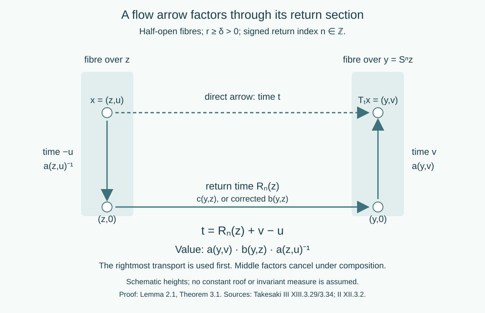

# Return arrows and factor-field flows

*Written by GPT-6.1 Sol (OpenAI), Ultra, September–October 2026. Author self-check only; not independently reviewed. New original text is public domain (CC0).*

## Introduction

A return section replaces a real orbit by a sequence of discrete returns. The continuous motion between returns still matters: it carries the fibre coordinates from the section to the actual source and range. Keeping those transports gives a precise formula for every flow arrow. It also allows a composition defect to be removed and a flow on a constant field of factors to be reduced to its centre flow.

We reuse the complete suspension construction in the flow course, **OA-FLOW-SUSPENSION-38**, “Building a suspension from a properly ergodic flow,” through the end of its suspension proof. That proof constructs a separated Borel section, removes first- and last-hit exceptions, and proves the product measure class by positive-density averaging. Its map from the half-open suspension to the retained flow is a Borel isomorphism intertwining every time. Its descriptive-set prerequisites are stated explicitly. The corresponding countable-enumeration and Borel-image contracts are also supplied by the exactly compared prerequisites used in [Orbits, stabilizers, and relation algebras](orbits-stabilizers-and-relation-algebras.md) and [Compatible lifts and cohomology reduction](compatible-lifts-and-cohomology-reduction.md). General flow machinery retains its flow-course ownership.

We also reuse **OA-FLOW-COCYCLE-37**, “Cohomology reduction for measurable flows,” through its complete reduction theorem. Its finite-marker lemma gives an exact finite exhaustion for a single aperiodic Borel transformation. Its simultaneous strictification and assembly prove the flow reduction theorem even when the cocycle law originally holds only almost everywhere for each fixed pair of times. **OA-FLOW-REDUCTION-36** supplies its full finite-relation reduction prerequisite. These are complete selected proofs, used by reference; the applications below add the flow-arrow and factor-field calculations needed here.

For local operator prerequisites read [Localizing factor actions and uniform cocycles](localizing-factor-actions-and-uniform-cocycles.md) and [Ancillary actions and unitary corrections](ancillary-actions-and-unitary-corrections.md). We use the Polish automorphism group, the Borel section of inner automorphisms, the constant-field theorem, strict localization, and continuity of Borel unitary group cocycles. The general canonical standard-form theorem remains an explicit modular-course prerequisite.

## Reading from finite corrections to flows and factor fields

The arguments below have two distinct starting points: finite orbit relations supply compatible corrections, while Haar averaging repairs identities that initially hold almost everywhere for each parameter. The following order connects them without assuming that a null return section inherits the ambient measure.

1. **Construct compatible finite data.** Read [Compatible lifts and cohomology reduction](compatible-lifts-and-cohomology-reduction.md), beginning with its general measured lift. Finite roots and transports produce compatible arrow lifts; completed-measurable selection, a Borel version and countable null saturation extend them to the measured relation. The [tower and odometer lesson](towers-and-odometer-orbits.md) supplies the principal transformation model and its exceptional-tail qualification. The target of the lift may be an arbitrary standard Borel groupoid, with uncountable isotropy and a non-Borel analytic endpoint image. For subgroup reduction, distinguish the closure-valued cochain from the subgroup-valued discrepancy. The extension preserves every old discrepancy exactly. The [four-point example](compatible-lifts-and-cohomology-reduction.md#a-four-point-correction-with-a-nonclosed-subgroup) shows why convergence alone would fail for the rational subgroup of the reals.

2. **Keep isotropy when passing to endpoints.** [Stabilizer fields and ancillary splittings](stabilizer-fields-and-ancillary-splittings.md) transports the full variable stabilizer field along a coherent lift. Its semidirect product records both the principal arrow and its loop. [Kernels and measurable groupoid splitting](kernels-and-measurable-groupoid-splitting.md) specializes this construction to countable abelian ergodic actions, including nonfaithful ones. A groupoid splitting does not require the acting group itself to split. The integer-action example computes the carry that distinguishes those assertions.

3. **Recover the continuous arrow from its returns.** Section 1 below uses the exact nonsingular suspension prerequisite to obtain the integer crossing number, including negative times. Section 2 expresses the cocycle as range transport, return cocycle and inverse source transport; the cancelling gauge is the inverse vertical transport. Read [Localizing factor actions and uniform cocycles](localizing-factor-actions-and-uniform-cocycles.md) for the preceding Haar repair. It retains every original fixed-parameter field as an almost-everywhere version, then produces identities on one invariant conull base. The imported flow reduction strictifies the two cocycles simultaneously. Each fixed-time conclusion therefore keeps its original measured meaning.

4. **Pass from algebra conjugacy to labelled fibre arrows.** Variable factor fields and measurable conjugacy explains the two-space diagonal-intertwiner calculation. [Strict variable fields and ancillary conjugacy](strict-variable-fields-and-ancillary-conjugacy.md) then proves the full varying-factor result: strict canonical transports, scalar-inclusive unitary corrections, a single conull source set, reverse continuous reconstruction and independence of strict choices. The group label and equivariant base identification remain part of the conjugacy. These results allow varying factor types and do not assume a free or ergodic centre. The dense-inner, free-centre theorem in Section 4 below is a subsequent specialization; its countable counterpart is proved in [Ancillary actions and unitary corrections](ancillary-actions-and-unitary-corrections.md). Classical central reduction and general canonical standard-form implementation are explicit prerequisites throughout.

5. **Check objects before multiplying arrows.** [Cocycle groupoids and semidirect products](cocycle-groupoids-and-semidirect-products.md) gives the full groupoid-fibre construction, its source, range, inverse and transported product. It repairs the printed cocycle-semiproduct source and distinguishes the unit-groupoid example from the pair groupoid. Its Polish conclusion states second-countability and separable-predual hypotheses explicitly; ordinary separability of a locally compact group is insufficient.

6. **Test the conclusions against periods and conjugation.** [Dense roof groups, periods and eigenfunctions](dense-roof-groups-periods-and-eigenfunctions.md) separates principal relations from labelled loops, free flows from periodic flows, and nonzero eigenfrequencies from the trivial character. The two-ceiling conclusion uses the exact free Borel cross-section theorem and the proved nonsingular passage to a product measure class. Periodic flows require the stated positive period sum. Finally, [Asymptotic ranges and groupoid cohomology](asymptotic-ranges-and-groupoid-cohomology.md) proves abelian cohomology invariance and gives a full noncommutative counterexample: a constant cochain conjugates the range and can change it.

The ten lessons in this sequence contain 72 exercises with complete solutions. The two field and ancillary prerequisites add fourteen.

## 1. A section and the integer carried by an arrow

The imported suspension theorem applies to every properly ergodic nonsingular Borel real flow on a standard sigma-finite measured space. Here properly ergodic means ergodic, with measure not concentrated on one orbit. After an invariant conull reduction, write its model as
\[
X_r=\{(z,u):z\in Z,\ 0\leq u<r(z)\},
\qquad [\mu_r]=[\nu(dz)\,du],\qquad r(z)\geq\delta>0.
\tag{1.1}
\]
The roof is finite and Borel. The base map \(S:Z\to Z\) is a nonsingular ergodic Borel automorphism. The flow \(T_t\) moves upward at speed one, carrying \((z,r(z))\) to \((Sz,0)\). We use half-open fibres, so each point has unique coordinates.

**Lemma 1.1 (an aperiodic base).** The base in (1.1) is aperiodic on an invariant conull Borel reduction. Its orbit relation has an exact increasing exhaustion by finite Borel relations.

*Proof.* The set of periodic points is Borel and invariant. If it were conull, ergodicity and the countable partition by least period would make one finite period conull. The finite classes have a Borel root selector. Pushing an equivalent probability to its roots gives an ergodic trivial measured relation, so its probability is concentrated at one root: an invariant zero-or-one probability on a standard Borel space is a point mass, by a countable separating code. Thus the base measure would be concentrated on one finite orbit. Its suspension is concentrated on one real orbit, contradicting proper ergodicity. Remove the null periodic part.

The finite exhaustion is the exact finite-marker lemma in OA-FLOW-COCYCLE-37. It constructs decreasing separated, bounded-gap marker sets. Off the saturation of their intersection, intervals between successive markers give increasing finite relations exhausting every adjacent pair. The intersection has at most one point per orbit; on its Borel saturation, centred finite intervals in the explicit integer coordinate give the other exhaustion. Thus no selector of all nonsmooth full orbits is assumed. \(\square\)

Define signed roof sums by
\[
R_n(z)=
\begin{cases}
\displaystyle\sum_{j=0}^{n-1}r(S^jz),&n>0,\\
0,&n=0,\\
\displaystyle-\sum_{j=n}^{-1}r(S^jz),&n<0.
\end{cases}
\tag{1.2}
\]
Direct splitting of the sums, including negative indices, gives
\[
R_{m+n}(z)=R_m(S^nz)+R_n(z).
\tag{1.3}
\]
They diverge to the appropriate infinities because \(r\geq\delta\). For \(x=(z,u)\) and any \(t\in\mathbb R\), there is therefore a unique integer \(n=n(t,x)\) with
\[
R_n(z)\leq u+t<R_{n+1}(z).
\tag{1.4}
\]
Put \(v=u+t-R_n(z)\). Then
\[
T_tx=(S^nz,v).
\tag{1.5}
\]
The countably many inequalities in (1.4) make \(n\) and \(v\) jointly Borel. Aperiodicity also makes the integer unique for the base endpoint pair \((S^nz,z)\).

**Proposition 1.2 (the return-arrow homomorphism).** The map
\[
\pi(t,(z,u))=(S^{n(t,(z,u))}z,z)
\tag{1.6}
\]
is a Borel homomorphism from the flow transformation groupoid onto the base orbit relation. Its unit map is \(\pi(z,u)=z\). Its kernel consists exactly of pairs in the same vertical fibre.

*Proof.* Suppose \(T_tx=(S^nz,v)\) and \(T_s(T_tx)=(S^{m+n}z,w)\). The two crossing equations give
\[
u+t=R_n(z)+v,\qquad
v+s=R_m(S^nz)+w.
\]
Adding and using (1.3) identifies the unique crossing integer for \(s+t\) as \(m+n\). Thus the base arrows compose exactly. Every base arrow \((S^nz,z)\) is the image of the arrow of time \(R_n(z)\) starting at \((z,0)\), proving surjectivity. Its image is a unit precisely when \(S^nz=z\), which by aperiodicity means \(n=0\). Such an arrow travels from \((z,u)\) to \((z,v)\) in time \(v-u\). Conversely every such pair has crossing number zero. \(\square\)

The flow on this reduction is free. A return to the same point forces \(S^nz=z\), hence \(n=0\), and then \(t=0\). Thus flow arrows can also be identified with their endpoint pairs. This conclusion follows from the suspension, rather than from an uncountable intersection of fixed-point exceptions.

## 2. Vertical transport and the measured reduction theorem

Let \(P\) be a Polish group and let \(\rho:\mathbb R\times X_r\to P\) be a **strict** Borel cocycle. For \(x=(z,u)\) define
\[
a(x)=\rho(u,(z,0)),\qquad
c(S^nz,z)=\rho(R_n(z),(z,0)).
\tag{2.1}
\]
The countable return label and strict law make \(c\) a Borel homomorphism on the base relation.

**Lemma 2.1 (three transports).** If \(T_tx=(y,v)\), then
\[
\rho(t,x)=a(y,v)c(y,z)a(z,u)^{-1}.
\tag{2.2}
\]
Consequently the gauge
\[
a(T_tx)^{-1}\rho(t,x)a(x)=c(\pi(t,x))
\tag{2.3}
\]
removes vertical transport exactly.

*Proof.* Concatenate the arrow down from \((z,u)\) to \((z,0)\), the return arrow from \((z,0)\) to \((y,0)\), and the arrow up to \((y,v)\). Their times sum to \(-u+R_n(z)+v=t\). The down arrow has value \(a(z,u)^{-1}\), by the strict inverse law. Multiplication in this order gives (2.2), and endpoint cancellation gives (2.3). The signed sums prove the same assertion for negative times. \(\square\)

This restriction to the section needs a strict cocycle. For a cocycle whose law holds almost everywhere for each fixed pair, the section itself is an ambient null set. The strict-version theorem in the localization lesson repairs fixed-element representatives; the imported flow theorem additionally repairs a pair simultaneously so that its subgroup condition is retained.

**Imported theorem 2.2 (flow reduction, exact scope).** Let \(H\) be a normal Borel subgroup of a Polish \(P\), and put \(K=\overline H\). Let \(\rho_1,\rho_2\) be jointly Borel measurable cocycles of a properly ergodic standard nonsingular flow, with their laws valid almost everywhere for each fixed pair of times. Suppose, for every fixed \(t\),
\[
\rho_2(t,x)\rho_1(t,x)^{-1}\in K
\quad\text{for almost every }x.
\tag{2.4}
\]
There are Borel \(f:X\to K\) and \(h:\mathbb R\times X\to H\) with
\[
\rho_2(t,x)=h(t,x)f(T_tx)\rho_1(t,x)f(x)^{-1}
\quad\text{for almost every }x\text{ for each fixed }t.
\tag{2.5}
\]

The complete proof is OA-FLOW-COCYCLE-37, from its setting through its concluding reduction theorem, using OA-FLOW-SUSPENSION-38 and OA-FLOW-REDUCTION-36. The pair is strictified in the closed Polish subgroup \(\{(p_1,p_2):p_2p_1^{-1}\in K\}\). An invariant conull set then contains whole vertical fibres over an invariant conull base. Finite-relation reduction on that base and the vertical assembly supply (2.5); the final gauges restore the original each-fixed-time meaning. These proof steps are essential to the exact import. In particular \(f\) lies in the **closure**, while \(h\) lies in \(H\) itself. This is the precise statement of Takesaki III, Corollary XIII.3.29.

**Example 2.3 (an irrational correction and integer crossings).** Take a unit-roof suspension of an aperiodic ergodic transformation. Use the additive targets \(P=\mathbb R\), \(H=\mathbb Q\), and cocycles \(\rho_1=0\), \(\rho_2(t,x)=t\). If \(x=(z,u)\), then \(n=\lfloor u+t\rfloor\) and \(v=u+t-n\). The choice
\[
f(z,u)=u,\qquad h(t,(z,u))=n
\tag{2.6}
\]
satisfies \(t=n+v-u\). The cochain is generally irrational, while the discrepancy is always rational. No rational value is asserted for a limit that only belongs to \(\overline{\mathbb Q}\).

## 3. Removing a flow composition defect

Let \(P\) be Polish and \(H\) a normal Borel subgroup. Suppose a jointly Borel map \(A:\mathbb R\times X_r\to P\) is unit normalized and is a homomorphism modulo \(H\):
\[
A(s,T_tx)A(t,x)=d(s,t,x)A(s+t,x),\qquad d(s,t,x)\in H
\tag{3.1}
\]
at every composable pair. This is the cross-homomorphism convention of the source. Associativity forces the twisted two-cocycle identity for \(d\).

**Theorem 3.1 (a true homomorphism with the same cosets).** There is a strict Borel cocycle \(B\) with \(B(t,x)H=A(t,x)H\). The Borel function \(V(t,x)=B(t,x)A(t,x)^{-1}\) takes values in \(H\), has unit value one, and satisfies
\[
d(s,t,x)=A(s,T_tx)V(t,x)^{-1}A(s,T_tx)^{-1}
\,V(s,T_tx)^{-1}V(s+t,x).
\tag{3.2}
\]

*Proof.* Put \(q(z)=A(r(z),(z,0))\). Define a Borel homomorphism \(b\) on the aperiodic base relation by
\[
b(S^nz,z)=q(S^{n-1}z)\cdots q(Sz)q(z)\quad(n>0),
\tag{3.3}
\]
with \(b(z,z)=1\) and inverse values for negative returns. Concatenating forward chains, cancelling reverse chains, and then splitting at an intermediate endpoint prove \(b(w,y)b(y,z)=b(w,z)\) for all integers, including chains of opposite signs. Alternatively these are the unique ordered products along the integer line, with each reversed edge assigned its inverse. Repeated use of (3.1), and normality for inverses and products, gives
\[
b(S^nz,z)H=A(R_n(z),(z,0))H.
\tag{3.4}
\]
No Borel quotient space \(P/H\) is required: (3.4) means that the discrepancy belongs to the Borel subgroup \(H\).

Let \(a(z,u)=A(u,(z,0))\). For \(T_tx=(y,v)\), set
\[
B(t,x)=a(y,v)b(y,z)a(z,u)^{-1}.
\tag{3.5}
\]
It is jointly Borel. When two arrows compose, the middle \(a^{-1}a\) cancels and the base \(b\)'s compose; hence \(B\) is strict and unit normalized. Applying (3.1) to the down-return-up decomposition shows
\(A(t,x)H=a(y,v)A(R_n(z),(z,0))a(z,u)^{-1}H\).
Together with (3.4) this gives the required coset equality. Thus \(V=BA^{-1}\) is Borel and \(H\)-valued. Substitute \(B=VA\) into its strict composition law and cancel in order. The resulting formula is (3.2), with no commuting of factors. \(\square\)

This proves the properly ergodic real-flow assertion of source XIII.3.34(ii) on its invariant conull suspension model. The countable AF assertion, including variable finite class sizes and arbitrary Borel normal subgroups, is proved by Theorem 3.1 of the compatible-lift lesson. The strict source cross-homomorphism hypothesis in (3.1) is retained. An almost-everywhere quotient law with a nonclosed subgroup is not silently substituted for it.

*Figure 1. Lemma 2.1 and Theorem 3.1. Starting at height \(u\), descend to the base, take the integer return arrow, and ascend to height \(v\). Their times give \(t=R_n(z)+v-u\). The rightmost transport is used first, giving \(a(y,v)b(y,z)a(z,u)^{-1}\). The middle transport can be corrected on the discrete base without losing the continuous source and range coordinates. Human sources: Takesaki III, XIII.3.29 and 3.34, and Takesaki II, XII.3.2.*

## 4. A factor-field action becomes its centre lifting

Let \(N\) be a factor with separable predual and assume \(\operatorname{Int}(N)\) is dense in \(\operatorname{Aut}(N)\). Put
\[
M=L^\infty(X,\mu)\overline\otimes N.
\tag{4.1}
\]
Let \(\alpha\) be a continuous real action on \(M\) with a free ergodic centre flow \(T\). The simple centre lifting is
\[
(\beta_tm)(y)=m(T_{-t}y).
\tag{4.2}
\]
The strict localization theorem supplies a jointly Borel automorphism cocycle \(\Theta(t,x)\), retaining every fixed-time field class, with
\[
(\alpha_tm)(T_tx)=\Theta(t,x)(m(x)).
\tag{4.3}
\]
All groupoid formulas in the following proof hold everywhere on a specified invariant conull model.

**Theorem 4.1 (real-flow ancillary application).** There are a centre-fixing normal automorphism \(\Psi\) of \(M\) and a strongly continuous unitary \(\beta\)-cocycle \(U_t\in M\) such that
\[
\Psi^{-1}\alpha_t\Psi=\operatorname{Ad}(U_t)\beta_t.
\tag{4.4}
\]
For a transitive free centre flow, the inner-density assumption is unnecessary and \(U_t\) may be taken equal to one.

*Proof in the properly ergodic case.* Use the imported suspension model. Strictness is preserved by its exact Borel equivariant isomorphism. The retained base is aperiodic by Lemma 1.1, and its relation is hyperfinite. Put
\[
a(z,u)=\Theta(u,(z,0)),\qquad
c(y,z)=\Theta(R_n(z),(z,0))\quad(y=S^nz).
\tag{4.5}
\]
These take values in the Polish \(G=\operatorname{Aut}(N)\). The ancillary Polish-group lemma proves that \(H=\operatorname{Int}(N)\) is normal Borel, with a Borel implementing-unitary section. Here \(\overline H=G\). The full countable cohomology reduction, compatible-lift Theorem 6.1 applied to \(p=1\) and \(q=c\), gives Borel \(g:Z\to G\), \(\ell:R_S\to H\) with
\[
c(y,z)=\ell(y,z)g(y)g(z)^{-1}.
\tag{4.6}
\]
If a measured reduction is needed, take it invariant under \(S\). Its complement lifts to a flow-invariant null set by the product class and finite roof. Thus every vertical point over the retained base remains available.

Set \(F(z,u)=a(z,u)g(z)\). The constant-field theorem gives a centre-fixing normal automorphism \(\Psi\) with fibre \(F(x)\). By Lemma 2.1, the localization of \(\gamma_t=\Psi^{-1}\alpha_t\Psi\) is
\[
\begin{aligned}
\Gamma(t,x)
&=F(T_tx)^{-1}\Theta(t,x)F(x)\\
&=g(y)^{-1}c(y,z)g(z)
=g(y)^{-1}\ell(y,z)g(y)\in H.
\end{aligned}
\tag{4.7}
\]
It is a strict automorphism cocycle, and it is inner at **every** arrow in this reduction. Normality of \(H\) gives the last inclusion. This pointwise conclusion comes from the explicit vertical assembly, rather than from an uncountable union of fixed-time exceptional sets.

Choose Borel unitaries \(W(t,x)\) implementing \(\Gamma(t,x)\), using the inner-automorphism section. Choose \(W(0,x)=1\). Strictness of \(\Gamma\) gives
\[
W(s,T_tx)W(t,x)W(s+t,x)^{-1}\in\mathbb T1.
\tag{4.8}
\]
Indeed its inner automorphism is identity, and factoriality makes its unitary central, hence scalar. The scalar subgroup is closed normal in the Polish strong unitary group \(\mathcal U(N)\). Apply Theorem 3.1 to \(A=W\), \(P=\mathcal U(N)\), \(H=\mathbb T1\). It produces a strict Borel unitary cocycle \(C\) with the same inner automorphisms:
\[
C(s+t,x)=C(s,T_tx)C(t,x),\qquad
\operatorname{Ad}C(t,x)=\Gamma(t,x).
\tag{4.9}
\]
This removes the scalar phase defect, rather than merely selecting implementing unitaries independently.

Define the measured unitary field
\[
U_t(y)=C(t,T_{-t}y).
\tag{4.10}
\]
For every fixed \(t\) it is a unitary in \(M\), by the constant-field theorem. Joint Borel fields give a Borel map into \(\mathcal U(M)\): for a bounded compatible field metric, distances to countably many dense simple unitary fields are Borel parameter integrals. The constant-vector test identifies that field topology with the strong unitary topology. Formula (4.9) yields
\[
U_{s+t}(y)=U_s(y)U_t(T_{-s}y),
\qquad U_{s+t}=U_s\beta_s(U_t).
\tag{4.11}
\]
The localization formula and (4.9) give (4.4) as identities of \(M\) fields for every \(t\). The Borel-cocycle continuity lemma in the localization lesson makes \(t\mapsto U_t\) strongly continuous. Thus (4.4) is cocycle conjugacy of the continuous algebra actions, not only a formal fibre relation. \(\square\)

*Proof in the transitive case.* There is a conull orbit. Its invariant intersection with the strict-localization model contains the whole orbit. Choose \(x_0\) on it. Freeness makes \(t\mapsto T_tx_0\) an injective Borel map from \(\mathbb R\); its orbit and inverse coordinate \(t(x)\) are Borel by the Borel-image theorem. Set \(F(x)=\Theta(t(x),x_0)\). The strict law gives
\[
F(T_sx)=\Theta(s,x)F(x).
\tag{4.12}
\]
The corresponding centre-fixing \(\Psi\) therefore has localization \(F(T_sx)^{-1}\Theta(s,x)F(x)=\operatorname{id}\). The constant-field theorem makes \(\Psi^{-1}\alpha_s\Psi=\beta_s\) in \(M\) for every \(s\). Extend the field on the invariant null complement arbitrarily. No inner-density or scalar correction is needed. \(\square\)

**Corollary 4.2 (classification by the centre).** For a fixed separable \(N\) with dense inner automorphisms, two continuous real actions on constant \(N\) fields, with free ergodic centre flows, are cocycle conjugate exactly when their centre flows are conjugate as measured covariant systems.

*Proof.* A measure-algebra conjugacy of the centres lifts to the corresponding constant-field isomorphism by acting on the scalar field coordinate and leaving \(N\) fixed. It intertwines the two simple liftings. Theorem 4.1 reduces each given action to that lifting by an automorphism and a continuous unitary cocycle, so it proves sufficiency. For necessity, inner conjugation by every \(U_t\) fixes the centre pointwise. Restricting a cocycle-conjugacy isomorphism to the centres therefore gives the required conjugacy. \(\square\)

The countable discrete analogue, with free hyperfinite centre, is the ancillary-action theorem already proved in the earlier lesson. Together these results provide the applications requested in source XIII.3.35. For real flows the theorem above supplies the stronger free ergodic assertion directly through a return section. It does not call the uncountable real orbit groupoid an orbitally discrete AF relation.

## 5. Examples and exercises with solutions

**Example 5.1 (phase removal at a return).** Let the roof be one, \(N=M_2(\mathbb C)\), and fix a self-adjoint \(D\). The fibre action \(\Theta(t,x)=\operatorname{Ad}(e^{itD})\) gives
\(a(z,u)=\operatorname{Ad}(e^{iuD})\) and \(c(S^nz,z)=\operatorname{Ad}(e^{inD})\). Taking \(g=\operatorname{id}\), (4.7) becomes \(\Gamma(t,x)=\operatorname{Ad}(e^{in(t,x)D})\). The crossing-number unitary \(C(t,x)=e^{in(t,x)D}\) is a strict arrow cocycle. Its group field \(U_t(y)=C(t,T_{-t}y)\) is strongly continuous even though a particular point's crossing number can jump. The jumps occur at moving roof boundaries, which are null for each fixed time in the product measure class.

Level 1 asks for a computation or a direct application. Level 2 asks for a proof using the lesson's framework. Level 3 combines results or examines a hypothesis whose failure changes the conclusion.

**Exercise 5.1 (a negative crossing).** *Level 1.* For a unit roof, take \(u=1/4\) and \(t=-1/2\). Find the return integer, the final base point and height, and the three arrow times in Lemma 2.1.

*Solution.* Since \(u+t=-1/4\), the unique integer is \(n=-1\). Thus \(T_tx=(S^{-1}z,3/4)\). The down arrow has time \(-1/4\), the return time is \(-1\), and the up arrow has time \(3/4\). Their sum is \(-1/2\). In multiplicative order the value is \(a(S^{-1}z,3/4)c(S^{-1}z,z)a(z,1/4)^{-1}\). Replacing the negative return by its absolute value would give the wrong arrow.

**Exercise 5.2 (two times and a carry).** *Level 2.* With unit roof and \(u=4/5\), apply first \(t=7/10\), then \(s=-9/10\). Check the composition of the two return arrows and the crossing integer of \(s+t\).

*Solution.* The first height sum is \(3/2\), so its crossing number is 1 and its new height is \(1/2\). The second height sum is \(-2/5\), so its crossing number is \(-1\) and final height is \(3/5\). The base returns cancel. Directly \(u+s+t=3/5\) has crossing number 0. The total time is \(-1/5\), and the integers add as \(-1+1=0\). This is the carry identity proved in Proposition 1.2; the second integer is computed at the intermediate point, not at the original height.

**Exercise 5.3 (an ambient null section).** *Level 2.* In a unit-roof suspension set \(Q=\{(z,0)\}\) and define the additive function \(\rho(t,x)=1\) when \(x\in Q\) and \(t\ne0\), and zero otherwise. Show it is a cocycle in the each-fixed-pair almost-everywhere sense, and identify its failure on the section.

*Solution.* For every fixed \(t\), the field is zero off the product-null set \(Q\), hence represents the zero cocycle. For the convention \(\rho(s+t,x)=\rho(s,T_tx)+\rho(t,x)\), failure at fixed \(s,t\) is contained in \(Q\cup T_{-t}Q\), a null set by nonsingularity. At \(s=t=1\) and \(x=(z,0)\), however, the left side is 1 and the right side is \(1+1=2\), since \(T_1x=(Sz,0)\). Arbitrary point representatives cannot be restricted to the section. A strict version equal to zero everywhere represents the same fixed-time measured fields.

**Exercise 5.4 (the correct vertical gauge).** *Level 1.* In additive notation let a vertical kernel cocycle be \(\rho(x_1,x_2)=a(x_1)-a(x_2)\). Compare the gauges using \(a\) and \(-a\).

*Solution.* The first gives \(a(x_1)+\rho(x_1,x_2)-a(x_2)=2(a(x_1)-a(x_2))\). The second gives \(-a(x_1)+\rho(x_1,x_2)+a(x_2)=0\). In multiplicative notation the cancelling gauge is \(a(x_1)^{-1}\rho(x_1,x_2)a(x_2)\), precisely (2.3). Endpoint inverses cannot be interchanged.

**Exercise 5.5 (a deliberately defective scalar implementer).** *Level 3.* For a unit roof and a fixed self-adjoint \(D\), let \(k(t,x)=n(t,x)\) and \(A(t,x)=e^{i\eta k(t,x)^2}e^{ik(t,x)D}\), with \(\eta\in\mathbb R\). Compute its scalar composition defect and remove it explicitly.

*Solution.* Let \(k_1=n(t,x)\) and \(k_2=n(s,T_tx)\), so \(n(s+t,x)=k_2+k_1\). The \(D\) factors commute with the scalars and with each other. Therefore
\[
A(s,T_tx)A(t,x)A(s+t,x)^{-1}
=e^{i\eta(k_2^2+k_1^2-(k_2+k_1)^2)}1
=e^{-2i\eta k_2k_1}1.
\]
Taking \(V(t,x)=e^{-i\eta k(t,x)^2}1\) gives \(B=VA=e^{ik(t,x)D}\). The carry identity makes \(B\) a strict cocycle. In (3.2), the scalar factors commute, so its right side is \(V(t,x)^{-1}V(s,T_tx)^{-1}V(s+t,x)\), which has exactly the same exponent \(-2\eta k_2k_1\). This checks both the sign and the factor order.

**Exercise 5.6 (why the group cocycle is continuous).** *Level 2.* In Example 5.1, prove strong continuity of \(U_t\) at a fixed \(t_0\) directly from the product measure class. Then explain why this does not assert pointwise continuity of all crossing numbers.

*Solution.* Use an equivalent probability on \(Z\) to realize the standard measure class. Its product with \(dv\) on \([0,1)\) is a probability, since the roof is one. This gives a unitarily equivalent \(L^2\) field representation. For \(y=(z,v)\), the integer for \(T_{-t}y\) is \(\lfloor v-t\rfloor\). The crossing number from that source back to \(y\) is its negative, by Proposition 1.2 and freeness. Thus \(U_t(y)=e^{-i\lfloor v-t\rfloor D}\). If \(t_j\to t_0\), the integers are eventually constant except on the finitely many roof-height boundaries \(v-t_0\in\mathbb Z\) in \(0\leq v<1\). Those boundaries are product-null. Hence the bounded unitary fields converge almost everywhere, and dominated convergence on constant vectors gives strong convergence on \(L^2(X;H_N)\); simple-vector density gives it on every vector. A point at a boundary can have a jump as time crosses that boundary. Strong operator continuity concerns the measured field class, so these null pointwise jumps cause no contradiction.

**Exercise 5.7 (the transitive case needs no inner density).** *Level 2.* Let \(X=\mathbb R\) with its Lebesgue measure class, and let \(\Theta\) be any strict Borel automorphism cocycle over translations on a separable factor \(N\). Show it is a coboundary even if \(\operatorname{Int}(N)\) is not dense.

*Solution.* Choose the base point 0 and set \(F(x)=\Theta(x,0)\). Since \(x=T_x0\), the strict law says \(\Theta(s,x)\Theta(x,0)=\Theta(s+x,0)\). Thus \(\Theta(s,x)=F(x+s)F(x)^{-1}\). The centre-fixing field automorphism with fibre \(F(x)\) conjugates the algebra action to the simple lifting. No passage through the inner subgroup or scalar implementers occurs.

## Bibliography and source comparison

Masamichi Takesaki, *Theory of Operator Algebras II*, Theorem XII.3.2 and its full proof supplied PDF 405–408; and *Theory of Operator Algebras III*, Corollary XIII.3.29 PDF 71–72, Proposition XIII.3.34 PDF 75–76, and Corollary XIII.3.35 PDF 76. The closure bars in 3.29 and the endpoint gauge in its proof were checked against page images.

The suspension and general flow reduction proofs are exact OA-FLOW imports. The source's printed uniform-gap test for the section is replaced there by countably many compact-time tests with separately positive gaps; the product measure class is proved by averaging. The source's vertical gauge must use the inverse at the range, as (2.3) shows. Strictification also resolves evaluation on the null section. These are proof-level qualifications, not a weakening of the suspension or flow-reduction statements.

Theorem 3.1 completes the strict real-flow cross-homomorphism application; its countable AF counterpart is already proved locally. Theorem 4.1 and Corollary 4.2 supply the real-flow factor-field application, including the transitive free case, and retain the separable factor/constant-field scope. The source's word AF has an explicitly orbitally discrete principal meaning in Definition XIII.3.11. We use the real-flow return relation and the proved stronger free ergodic application without redefining that word. The full strict variable-field ancillary comparison is now proved in [strict variable fields](strict-variable-fields-and-ancillary-conjugacy.md). The corrected dense-roof, two-ceiling, period and eigenfunction applications are supplied in [dense roof groups](dense-roof-groups-periods-and-eigenfunctions.md), with an explicit human cross-section prerequisite. Remaining source subsidiaries and supported Connes disintegration comparisons stay active.
