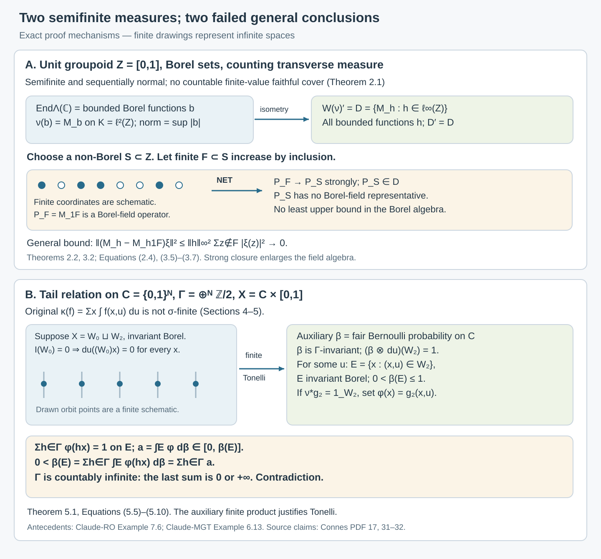

# Semifinite transverse measures and operator completions

*Written by GPT-6.1 Sol (OpenAI), Ultra, October 2026. New original text is public domain (CC0).*

## Introduction

Semifiniteness lets us test a positive quantity by finite pieces. It does not ensure that countably many such pieces cover the measured space. For random operators this distinction controls whether a measurable operator field can be recovered from an operator on its integrated Hilbert space.

We prove two counterexamples. On an uncountable unit groupoid, the random-operator algebra consists of bounded Borel functions. Its canonical representation has the strictly larger von Neumann closure consisting of all bounded functions. On the tail relation of binary sequences, an atomless random variable has no decomposition into a zero-integral part and a proper part, even though its transverse measure is semifinite.

The examples originate in [Claude-MGT, Example 6.13] and [Claude-RO, Example 7.6]. We give complete proofs from the transverse definitions, calculate the operator completion explicitly, and verify the properness and module conditions. These calculations complement [Isotropy and random-operator fibres](isotropy-and-random-operator-fibres.md), whose countable atomic unit spaces are σ-finite.

Prerequisites are standard Borel spaces, kernels, countable product probability measures, Tonelli's theorem for σ-finite measures, and elementary Hilbert space operator theory. We use the definitions of transverse functions and random variables in [Claude-MGT]. General direct-integral and square-integrable representation theorems are needed only for the explicitly cited σ-finite results in Section 6.

The supplied 63-page transcription and the author-hosted 83-page typeset version of [Connes] have now been compared at the full transverse-definition and random-operator passages relevant here. The latter retains semifiniteness in those statements. Its original Springer facsimile has not been compared. The counterexamples below concern the unrestricted semifinite assertions. For a nonzero random-operator factor, [Commuting copies in principal groupoid factors](commuting-copies-in-principal-groupoid-factors.md), Corollary 1.5, separately proves a sigma-finite reduction on its saturated conull support.

## 1. Sequential normality and finite pieces

A transverse function \(\nu\) on a measurable groupoid \(G\) is a kernel \(y\mapsto\nu^y\) on the range fibres \(G^y\), invariant under left translation:
\[
\gamma_*\nu^{s(\gamma)}=\nu^{r(\gamma)}.
\tag{1.1}
\]
It is proper if \(G\) has a countable measurable cover \(A_n\) with \(\sup_y\nu^y(A_n)<\infty\). Write \(\mathcal E^+\) for the proper positive transverse functions.

For module \(1\), a transverse measure is an additive, positively homogeneous map \(\Lambda:\mathcal E^+\to[0,\infty]\) with the following two further properties. First, it is sequentially normal:
\[
\nu_n\uparrow\nu\text{ in }\mathcal E^+
\quad\Longrightarrow\quad
\Lambda(\nu)=\sup_n\Lambda(\nu_n).
\tag{1.2}
\]
Second, \(\Lambda(\nu*\rho)=\Lambda(\nu)\) whenever \(\rho\) is a kernel on the range fibres of total mass one and \(\nu*\rho\) is proper. Here convolution composes an arrow in \(\nu\) with an arrow in \(\rho\) starting at its source. The supplied source's normality condition uses increasing sequences.

Semifiniteness means that \(\Lambda(\nu)\) is the supremum of the finite values \(\Lambda(\eta)\) with \(\eta\le\nu\). Sigma-finiteness means that some faithful transverse function is the increasing supremum of a sequence of proper functions of finite \(\Lambda\)-value. Faithful means that its support is the whole unit space. The unit measure associated with \(\nu\) is
\[
\Lambda_\nu(f)=\Lambda((f\circ s)\nu),\qquad f\ge0.
\tag{1.3}
\]
These are [Connes, PDF 12, Definition 1] and [Claude-MGT, Definition 3.1].

We will repeatedly use extended sums over an arbitrary index set \(J\):
\[
\sum_{j\in J}a_j
=\sup_{F\subset J,\ F\text{ finite}}\sum_{j\in F}a_j,
\qquad a_j\ge0.
\tag{1.4}
\]
This definition gives additivity and permits rearrangement of nonnegative double sums. Indeed, every finite set of pairs has finite coordinate projections, and conversely the sums over finite rectangles dominate every finite set of pairs. Taking these suprema in either order gives the same result. This is a statement about sums; it requires no uncountable-product Fubini theorem.

**Lemma 1.1.** If \(\sum_J a_j<\infty\), then \(\{j:a_j>0\}\) is countable. If \(a_{n,j}\uparrow a_j\), then
\[
\sup_n\sum_Ja_{n,j}=\sum_Ja_j.
\tag{1.5}
\]

*Proof.* For each positive integer \(k\), the set \(\{j:a_j\ge1/k\}\) is finite: arbitrarily large finite subsets would force the sum to be infinite. Their union contains every positive coordinate. For (1.5), the inequality from left to right is immediate. For every finite \(F\), finite-dimensional monotone convergence gives \(\sum_Fa_j=\sup_n\sum_Fa_{n,j}\le\sup_n\sum_Ja_{n,j}\). Take the supremum over \(F\). \(\square\)

## 2. An uncountable unit groupoid

Let \(Z=[0,1]\) with its Borel structure. Set \(G=Z\), with only identity arrows. Its range and source maps are the identity. It satisfies the countable measurability conditions used in [Claude-RO, (S)], and \(\nu^z=\varepsilon_z\) is faithful and proper.

Every transverse function is of the form
\[
\nu_a^z=a(z)\varepsilon_z.
\tag{2.1}
\]
It is proper exactly when \(a\) is finite, nonnegative and Borel. Necessity of finiteness follows by restricting a proper cover to the sole arrow over \(z\); measurability of the kernel gives measurability of \(a\). Conversely, \(A_n=\{a\le n\}\) cover \(G\) and have uniformly bounded fibre mass.

**Theorem 2.1.** The formula
\[
\Lambda(\nu_a)=\sum_{z\in Z}a(z)
\tag{2.2}
\]
defines a sequentially normal, semifinite transverse measure of module \(1\). It is not σ-finite.

*Proof.* Additivity and homogeneity follow from (1.4), and (1.2) follows from Lemma 1.1. The sole probability kernel over \(z\) is \(\varepsilon_z\), so convolution with such a kernel changes nothing. For semifiniteness, the functions \(a1_F\), with \(F\) finite, give finite values whose supremum is (2.2).

If \(\Lambda(\nu_{a_n})<\infty\), Lemma 1.1 makes the support of \(a_n\) countable. A countable union of these supports is countable. Thus no increasing sequence of such functions can have a faithful supremum on the uncountable \(Z\). This disproves σ-finiteness in the transverse definition itself. \(\square\)

For \(\nu=\nu_1\), (1.3) is counting measure \(\mu\) on the Borel sets of \(Z\). Its only null set is empty, so no nonempty unit set is \(\Lambda\)-negligible. Counting measure here is already complete: there is no nonempty null set whose subsets must be added.

Let \(H_z=\mathbb C\), with the identity representation of the unit groupoid. It is its regular representation for \(\nu_1\); the constant section \(1\) has square-integrable fibre coefficient of norm \(1\). Thus it is a square-integrable representation with separable fibres. A measurable operator field on this scalar field is a Borel function \(b\). Equivariance is automatic. Since no nonempty set is negligible, equality and boundedness are pointwise:
\[
\operatorname{End}_\Lambda(H)
=\mathcal B_b(Z),\qquad
\|b\|=\sup_{z\in Z}|b(z)|.
\tag{2.3}
\]
The algebra \(\mathcal B_b(Z)\) is a unital C*-algebra: its algebraic operations preserve Borel measurability, and uniform limits of Borel functions are Borel.

**Theorem 2.2.** The algebra in (2.3) is not a W*-algebra.

*Proof.* There are non-Borel subsets \(S\subset Z\): the Borel sets have cardinality at most the continuum, whereas the power set of \(Z\) has strictly larger cardinality. Direct the finite subsets \(F\subset S\) by inclusion. The projections \(p_F=1_F\) form an increasing net bounded above by \(1\).

Suppose they had a least self-adjoint upper bound \(a\in\mathcal B_b(Z)\). Since the empty set is included, \(a\ge0\); since each singleton in \(S\) is included, \(a(z)\ge1\) on \(S\). If \(a(z)>1\) at a point of \(S\), replace just that value by \(1\). If \(a(z)>0\) at a point outside \(S\), replace just that value by \(0\). A change at one Borel singleton preserves Borel measurability and produces a strictly smaller upper bound. Leastness therefore forces \(a=1_S\), which is not Borel.

Every von Neumann algebra has a supremum for a bounded increasing positive net. For completeness, in a concrete von Neumann algebra \(M\), if \(0\le A_i\uparrow\) and \(\|A_i\|\le C\), the limits \(q(\xi)=\lim_i\langle A_i\xi,\xi\rangle\) satisfy the parallelogram identity. Polarization and the Hilbert space representation theorem give a bounded positive \(A\) with quadratic form \(q\). It is the least upper bound, and
\[
\|(A-A_i)\xi\|^2
\le C\langle(A-A_i)\xi,\xi\rangle\longrightarrow0.
\tag{2.4}
\]
Hence \(A_i\to A\) strongly and \(A\in M\). A *-isomorphism preserves positivity and least upper bounds. Consequently \(\mathcal B_b(Z)\) cannot be isomorphic to a von Neumann algebra. \(\square\)

This establishes the failure of [Connes, PDF 31, Section 6, Theorem 2] at its stated semifinite scope. The failure uses a net indexed by finite subsets, as required by von Neumann monotone completeness. Sequential normality of \(\Lambda\) is compatible with it.

## 3. The canonical representation and its full commutant

The integrated scalar Hilbert space is
\[
K=L^2(Z,\mu)=\ell^2(Z).
\tag{3.1}
\]
Every vector \(\xi\in\ell^2(Z)\) has countable support, by Lemma 1.1 applied to \(|\xi(z)|^2\). Conversely every square-summable function is Borel, because its support is countable and all singletons are Borel. The equality in (3.1) therefore concerns exactly the original measurable sections.

For any bounded function \(h:Z\to\mathbb C\), even one that is not Borel, coordinate multiplication \(M_h\) is a bounded operator on \(K\) with
\[
\|M_h\|=\|h\|_\infty.
\tag{3.2}
\]
The upper bound follows by summing \(|h(z)\xi(z)|^2\); the lower bound follows by testing the coordinate vectors \(e_z\). Set
\[
D=\{M_h:h\in\ell^\infty(Z)\}.
\tag{3.3}
\]

**Lemma 3.1.** The commutant of all coordinate projections \(P_z=M_{1_{\{z\}}}\) is \(D\), and \(D'=D\).

*Proof.* If \(A\) commutes with \(P_z\), then \(Ae_z\in\mathbb Ce_z\). Write \(Ae_z=h(z)e_z\); then \(|h(z)|\le\|A\|\). Finite linear combinations of the \(e_z\) are dense in \(K\), so \(A=M_h\). Conversely, coordinate multiplications commute. Since \(D\) contains every \(P_z\), this also proves \(D'=D\). In particular \(D\), as a commutant, is a von Neumann algebra. \(\square\)

In this example the source's convolution left Hilbert algebra is particularly simple:
\[
\mathcal A_\nu=\ell^2(Z),\qquad
(fg)(z)=f(z)g(z),\qquad
f^\#(z)=\overline{f(z)}.
\tag{3.4}
\]
Indeed, \(\ell^2(Z)\subset\ell^\infty(Z)\), so pointwise multiplication is bounded on \(\ell^2(Z)\), and the source's two fibre Schur bounds are both bounded by \(\|f\|_\infty\). Conjugation preserves \(\ell^2\). Finite-support functions form a dense subalgebra, giving nondegeneracy. Every left multiplication is diagonal, and multiplication by \(e_z\) is \(P_z\). Lemma 3.1 thus gives
\[
W(\nu)=\lambda(\mathcal A_\nu)''
=D,\qquad W(\nu)'=D.
\tag{3.5}
\]
This calculates the algebra defined in [Connes, PDF 32, Notation 3], without a general direct-integral theorem.

**Theorem 3.2.** The canonical random-operator map is the faithful isometry
\[
\nu:\mathcal B_b(Z)\longrightarrow W(\nu)'=D,
\qquad b\longmapsto M_b.
\tag{3.6}
\]
It is not onto. Its image has strong operator closure \(D\).

*Proof.* Formula (3.2) proves the isometry and faithfulness. A non-Borel \(S\) gives \(M_{1_S}\in D\) outside the image: testing \(e_z\) shows that a Borel field representing this operator would have to equal \(1_S\) at every point.

For an arbitrary \(h\in\ell^\infty(Z)\), let \(F\) run over all finite subsets of \(Z\). The functions \(h1_F\) are Borel, and \(\|M_{h1_F}\|\le\|h\|_\infty\). For every \(\xi\in K\),
\[
\|(M_h-M_{h1_F})\xi\|^2
=\sum_{z\notin F}|h(z)|^2|\xi(z)|^2
\le\|h\|_\infty^2\sum_{z\notin F}|\xi(z)|^2
\longrightarrow0.
\tag{3.7}
\]
The last limit follows from the definition of the finite total sum: choose a finite set capturing all but an arbitrarily small tail of \(\sum_Z|\xi(z)|^2\). This single net converges strongly on every vector, although the particular finite set needed for a tolerance depends on that vector. Since \(D\) is strongly closed, the closure is exactly \(D\). \(\square\)

The faithful-ν surjectivity assertion in [Connes, PDF 32, Theorem 4(3)] therefore fails under these semifinite assumptions. The canonical representation of \(W(\nu)\) itself still exists here. The lost conclusion is the recovery of every commutant operator by a measurable random field.

One can regard the enlargement as replacing the original Borel σ-algebra by the full power set with counting measure. That replacement changes measurability. It is not the completion by subsets of null sets, which adds nothing in this example.

## 4. A semifinite transverse measure on the tail relation

Let \(C=\{0,1\}^{\mathbb N}\) with its product Borel structure. The countably infinite group
\[
\Gamma=\bigoplus_{\mathbb N}\mathbb Z/2
\tag{4.1}
\]
acts by changing finitely many coordinates. Its action is free: a nonempty set of flips changes those coordinates of every binary sequence. Its orbit relation \(E_0\) consists exactly of pairs of sequences that differ in finitely many coordinates.

The groupoid is \(G=\{(y,x):yE_0x\}\), with \(r(y,x)=y\), \(s(y,x)=x\), and \((z,y)(y,x)=(z,x)\). It is a Borel subset of \(C\times C\), being the countable union of the graphs of the finite flips. Its range fibres are countable.

**Lemma 4.1.** Proper transverse functions on \(G\) correspond exactly to finite nonnegative Borel functions \(c\) on \(C\), by
\[
\eta_c^y=\sum_{xE_0y}c(x)\varepsilon_{(y,x)}.
\tag{4.2}
\]

*Proof.* For a proper transverse \(\eta\), define \(c(x)=\eta^x(\{(x,x)\})\). The identity graph is Borel; integrating its indicator against the kernel makes \(c\) Borel. Properness forces every atom to be finite. Left translation by \((y,x)\) sends the unit \((x,x)\) to \((y,x)\), so (1.1) forces (4.2); countability of each fibre determines its measure by its atoms.

Conversely, enumerate \(\Gamma=\{h_1,h_2,\ldots\}\). The formula in (4.2) is a Borel kernel, since its integrals are countable sums of Borel functions along \(x=h_jy\). Left translation changes only the range coordinate and preserves every source weight \(c(x)\), giving (1.1). The sets
\[
A_n=\{(y,h_jy):1\le j\le n,\ c(h_jy)\le n\}
\tag{4.3}
\]
are Borel, cover \(G\), and have fibre mass at most \(n^2\). Thus the kernel is proper. \(\square\)

**Theorem 4.2.** The formula
\[
\Lambda(\eta_c)=\sum_{x\in C}c(x)
\tag{4.4}
\]
defines a sequentially normal, semifinite transverse measure of module \(1\), which is not σ-finite. For the faithful counting transverse function \(\nu=\eta_1\), \(\Lambda_\nu\) is counting measure on \(C\) and no nonempty saturated unit set is negligible.

*Proof.* Additivity, homogeneity, sequential normality and semifiniteness follow as in Theorem 2.1, using Lemma 4.1. For failure of σ-finiteness, a finite-value weight \(c\) has countable positive support. Its saturation under the countable \(\Gamma\) is also countable. A countable union of such saturations cannot cover \(C\), so a sequence of finite-value transverse functions cannot have a faithful supremum, even if faithfulness asks only for each range-fibre measure to be nonzero. For the module condition, write
\[
p(x,z)=\rho^x(\{(x,z)\}),\qquad
\sum_{zE_0x}p(x,z)=1.
\tag{4.5}
\]
The weight of \((y,z)\) in \((\eta_c*\rho)^y\) is
\[
c'(z)=\sum_{xE_0z}c(x)p(x,z).
\tag{4.6}
\]
If the convolution is proper, \(c'\) is finite and Borel by Lemma 4.1. Rearranging nonnegative extended sums by (1.4) gives
\[
\Lambda(\eta_c*\rho)
=\sum_{z\in C}\sum_{xE_0z}c(x)p(x,z)
=\sum_{x\in C}c(x)\sum_{zE_0x}p(x,z)
=\Lambda(\eta_c).
\tag{4.7}
\]
Thus all the transverse axioms hold. Formula (1.3) with \(c=1\) gives counting measure. Its only null set is empty, so a nonempty saturated set cannot be negligible. \(\square\)

The properness estimate \(n^2\) and the module computation ensure that the example meets the source's transverse definitions; uncountable counting measure alone would not establish that.

## 5. Failure of the zero-integral and proper decomposition

Put \(I=[0,1]\), with Lebesgue measure \(du\), and
\[
X=C\times I,\qquad \pi(x,u)=x,\qquad
(y,x)\cdot(x,u)=(y,u),\qquad \alpha^x=\varepsilon_x\otimes du.
\tag{5.1}
\]
This is a random variable of module \(1\): the fibres are standard atomless probability spaces, the total space is standard Borel, the kernel is Borel, and transport preserves \(du\). The uniform fibre bound is \(1\), so the countable bounded-fibre-cover requirement holds with the single set \(X\).

For \(f\ge0\) Borel, the averaging operation and the measured integral of \(f\) are
\[
(\nu*f)(x,u)=\sum_{zE_0x}f(z,u)
=\sum_{h\in\Gamma}f(hx,u),\qquad
\kappa(f)=\Lambda_\nu(\alpha(f))
=\sum_{x\in C}\int_I f(x,u)\,du.
\tag{5.2}
\]
The first equality with the group sum uses freeness. For an invariant Borel \(W\subset X\), its transverse integral is
\[
\mathcal I(W)=
\sup\{\kappa(f):f\ge0\text{ Borel, supported in }W,\ \nu*f\le1\}.
\tag{5.3}
\]
All three formulas are direct instances of [Connes, PDF 16, Section 3, Definition 1].

A proper part in the asserted decomposition has an averaging function \(g\ge0\) Borel with \(\nu*g=1\) there. Extending it by zero gives \(\nu*g=1_W\) on \(X\); invariance of \(W\) ensures the extension preserves the equation. This is the criterion in [Connes, PDF 17–18, Lemma 2] and [Claude-MGT, Lemma 6.7].

**Theorem 5.1.** There are no invariant Borel \(W_0,W_2\) such that
\[
X=W_0\sqcup W_2,\qquad
\mathcal I(W_0)=0,\qquad
\nu*g_2=1_{W_2}
\tag{5.4}
\]
for a nonnegative Borel \(g_2\). Consequently the zero-integral and proper decomposition asserted in [Connes, PDF 17, Lemma 1(2)] fails for this semifinite transverse measure.

*Proof.* Fix \(x_0\in C\), and write \(U_{x_0}=\{u:(x_0,u)\in W_0\}\), a Borel set. The test function
\[
f_{x_0}(x,u)=1_{\{x_0\}}(x)1_{U_{x_0}}(u)
\tag{5.5}
\]
is supported in \(W_0\). It has \(\nu*f_{x_0}=1_{[x_0]\times U_{x_0}}\le1\), where \([x_0]\) denotes the orbit. Its \(\kappa\)-integral is \(du(U_{x_0})\). Therefore (5.3) and \(\mathcal I(W_0)=0\) force
\[
du(U_x)=0\qquad\text{for every }x\in C.
\tag{5.6}
\]

Now introduce the auxiliary probability measure
\[
\beta=\bigotimes_{n\in\mathbb N}\tfrac12(\varepsilon_0+\varepsilon_1)
\tag{5.7}
\]
on \(C\). Every finite flip preserves it: it preserves the measures of cylinder sets, which determine the product probability measure. Tonelli for the finite product \(\beta\otimes du\), applied to (5.6), gives \((\beta\otimes du)(W_2)=1\). There is thus a \(u\in I\) for which
\[
E=\{x:(x,u)\in W_2\},\qquad 0<\beta(E)\le1.
\tag{5.8}
\]
The set \(E\) is Borel and \(\Gamma\)-invariant, because \(W_2\) is. Set \(\varphi(x)=g_2(x,u)\). Equation (5.4) gives
\[
\sum_{h\in\Gamma}\varphi(hx)=1\qquad(x\in E).
\tag{5.9}
\]
The identity term shows \(0\le\varphi\le1\) on \(E\). Put \(a=\int_E\varphi\,d\beta\), which is finite. Each flip preserves both \(E\) and \(\beta\), so countable nonnegative monotone convergence gives
\[
0<\beta(E)
=\sum_{h\in\Gamma}\int_E\varphi(hx)\,d\beta(x)
=\sum_{h\in\Gamma}a.
\tag{5.10}
\]
Since \(\Gamma\) is countably infinite, the last sum is \(0\) if \(a=0\), and \(+\infty\) if \(a>0\). Both contradict (5.8). \(\square\)

The same conclusion holds if the asserted decomposition is presented through an equivariant Borel fibre isomorphism: its two parts have invariant Borel images and the normalization transports to (5.4). There are no negligible base units to discard in this example.

The proof uses an auxiliary finite probability measure to obtain a slice and integrate its orbit sum. It makes no Fubini claim for the original \(\kappa\), which is not σ-finite. To see that directly, suppose Borel sets \(B_n\) of finite \(\kappa\)-measure covered \(X\). For each \(n\), only countably many \(x\) could have \(du((B_n)_x)>0\), by Lemma 1.1. Outside the countable union of these sets of \(x\), every vertical section \((B_n)_x\) would be null. Their countable union could not cover \(I\), a contradiction.

*Figure 5.1.* The upper panel shows Theorems 2.2 and 3.2: finite Borel coordinate projections converge along a net to the projection of a non-Borel set, which belongs to \(D=W(\nu)'\) but has no Borel random-field representative. The lower panel shows Theorem 5.1: zero transverse integral forces every vertical section of \(W_0\) to be Lebesgue null, and the auxiliary finite product measure gives an invariant slice of positive probability. Its normalized infinite orbit sum would have an integral equal to an infinite sum of equal terms. The drawn coordinates and orbit points are finite schematics, not a construction of a non-Borel set or a finite orbit. Exact spaces, constants and proof locators are labeled. Source antecedents: [Claude-RO, Example 7.6] and [Claude-MGT, Example 6.13].*

## 6. The valid σ-finite statements

The two counterexamples identify failures of the supplied semifinite claims. The σ-finite replacements are available in the existing lessons, whose general proofs we use by reference.

For [Claude-RO, Theorems 7.1–7.2], assume its standing hypotheses (S) and (F): the arrow σ-algebra is countably generated, unit singletons and the diagonal are measurable, and a faithful proper transverse function exists. Let \(\Lambda\) be a σ-finite transverse measure of modulus \(\delta\). Hilbert fields have separable fibres and a countable measurable fundamental family. If \(H\) is square-integrable and \(\nu\) proper, the integrated coefficients give a unique normal representation
\[
\pi_\nu^H:W(\nu)\longrightarrow B(\nu(H)),\qquad
\nu(H)=\int^\oplus H_x\,d\Lambda_\nu(x).
\tag{6.1}
\]
For faithful \(\nu\), integration is an isometric bijection onto the entire intertwiner space; in particular
\[
\operatorname{End}_\Lambda(H)
\cong\pi_\nu^H(W(\nu))'.
\tag{6.2}
\]
This is a von Neumann algebra with separable predual. Every normal representation of \(W(\nu)\) on a separable Hilbert space arises this way. The averaged rank-one operator ideal is σ-weakly dense for faithful \(\nu\), by [Claude-RO, Corollary 7.3]. These statements retain the full standing measurable-groupoid scope; no standard Borel assumption on all arrows is added to them.

The proof of (6.2) uses σ-finiteness to choose countably many integrable sections that remain total in the fibres, obtain a measurable field from a commutant operator, and repair equivariance on a saturated conull set. Its prerequisites include measurable Hilbert fields and decomposable operators, embedding a square-integrable representation in a countable amplification of a regular representation, the left Hilbert algebra construction, and normal representation amplification. We import those prerequisites through the cited proof; the elementary calculations in Sections 2–3 do not replace them.

For random variables, [Claude-MGT, Theorem 6.6(a)–(d)] supplies the averaging comparison, independence of faithful \(\nu\), and direct-sum additivity. Under σ-finiteness of \(\Lambda\), its part (e) gives invariant measurable \(X_1,X_2\) with
\[
X=X_1\sqcup X_2,\qquad
\int X_1\,d\Lambda=0,\qquad
\nu*g_2=1_{X_2}.
\tag{6.3}
\]
The random variable retains its source hypotheses: standard measurable fibres and total space, covariance with modulus \(\delta\), and a countable cover of uniformly bounded fibre measure. The decisive measure is \(\kappa=\Lambda_\nu\circ\alpha\). It is σ-finite under these assumptions, so an equivalent finite measure can be used to select a countable union of invariant sets admitting normalized averaging functions. The full proof of all five parts is [Claude-MGT, Theorem 6.6].

The supplied source's PDF 17 proof calls this \(\kappa\) σ-finite after assuming only semifiniteness of \(\Lambda\). In (5.1) the measure \(\kappa\) is explicitly not σ-finite, and Theorem 5.1 shows that its decomposition conclusion really fails. Thus adding σ-finiteness is a sufficient correction supported by a general proof. We do not infer that it is necessary in every individual groupoid.

## 7. Exercises with solutions

Level 1 asks for a computation or a direct application. Level 2 asks for a proof using the lesson’s framework. Level 3 combines results or examines a hypothesis whose failure changes the conclusion.

**Exercise 7.1.** *Level 1.* Let \(a:Z\to[0,\infty)\) be finite and \(\sum_Za<\infty\). Prove that its positive support is countable. Use this to disprove the transverse σ-finiteness of (2.2) without appealing only to the counting measure of \(\nu_1\).

*Solution.* Each level set \(E_k=\{a\ge1/k\}\) is finite, because a finite subset of \(N\) distinct points would contribute at least \(N/k\). The positive support is \(\bigcup_kE_k\). If a sequence of transverse functions has finite \(\Lambda\)-values, its weights all have countable support, and their supremum vanishes outside a countable union of countable sets. It cannot be faithful on the uncountable \(Z\), as required by the definition of transverse σ-finiteness.

**Exercise 7.2.** *Level 2.* On the unit groupoid, let \(H_z=\mathbb C^d\), \(1\le d<\infty\), with the identity representation. Calculate \(\operatorname{End}_\Lambda(H)\), its canonical representation, its full strong closure, and the commutant of the represented \(W(\nu)\).

*Solution.* A field is a matrix \(A(z)\in M_d(\mathbb C)\) with Borel entries. Its norm is \(\sup_z\|A(z)\|\), because there are no nonempty negligible sets. The representation acts coordinatewise on \(\ell^2(Z)\otimes\mathbb C^d\); testing \(e_z\otimes v\) proves that its norm equals the field norm. The representation of \(W(\nu)=D\) is \(M_h\otimes1_d\). An operator commuting with every \(P_z\otimes1_d\) preserves each \(d\)-dimensional coordinate summand, hence is an arbitrary bounded family \(B(z)\in M_d(\mathbb C)\). Such families commute with \(D\otimes1_d\), so the full commutant is the bounded product \(\prod_{z\in Z}M_d(\mathbb C)\). Every finite-coordinate truncation of \(B\) has Borel entries. For \(\xi=(\xi_z)\), the squared tail error is at most \((\sup_z\|B(z)\|)^2\sum_{z\notin F}\|\xi_z\|^2\), which tends to zero along finite \(F\). The strong closure is therefore this full product.

**Exercise 7.3.** *Level 2.* For a non-Borel \(S\subset Z\), prove that the finite-subset net \(1_F\), \(F\subset S\), has no supremum among all self-adjoint elements of \(\mathcal B_b(Z)\). Why is testing only Borel projections an avoidable restriction?

*Solution.* Every upper bound \(a\) is nonnegative and at least \(1\) on \(S\). If it is least, lowering one value to \(1\) on \(S\), or to \(0\) outside \(S\), must never decrease it. These changes preserve Borel measurability at a singleton. Thus leastness requires \(a=1_S\), impossible. This proves the failure directly in the full self-adjoint order, including upper bounds that are not projections, without needing a separate theorem that a supremum of projections must be a projection.

**Exercise 7.4.** *Level 3.* Prove that the net in (3.7) converges strongly for every bounded \(h\). Show that no sequence of finite-coordinate truncations can converge strongly to the identity when \(Z\) is uncountable.

*Solution.* Given \(\xi\) and \(\epsilon>0\), choose finite \(F_0\) with \(\sum_{z\notin F_0}|\xi(z)|^2<\epsilon^2/\|h\|_\infty^2\), if \(h\ne0\). Every \(F\supset F_0\) then has error below \(\epsilon\) by (3.7); for \(h=0\) the error is zero. This proves strong convergence of the full net. For any sequence of finite sets \(F_n\), their union is countable. Choose \(z\) outside it. Every \(M_{1_{F_n}}e_z\) is zero, so this sequence cannot converge strongly to \(1\). The countability of each vector's support does not produce one countable set containing the supports of all vectors.

**Exercise 7.5.** *Level 1.* Replace \(Z\) by a nonempty countable standard Borel space, with the same counting transverse measure. Verify σ-finiteness and the full commutant assertion.

*Solution.* Enumerate \(Z\) and let \(F_n\) be increasing finite subsets with union \(Z\). The functions \(1_{F_n}\) have finite \(\Lambda\)-value and increase to the faithful weight \(1\), so \(\Lambda\) is σ-finite. Every subset of \(Z\) is a countable union of Borel singletons and is Borel. Therefore \(\mathcal B_b(Z)=\ell^\infty(Z)\). Lemma 3.1 gives \(W(\nu)'=D\), and the map \(b\mapsto M_b\) is onto as well as isometric.

**Exercise 7.6.** *Level 3.* In the tail-relation example, choose positive finite Borel weights \(c\), and a probability kernel that sends \((x,z)\) to a deterministic Borel choice \(z=t(x)\) with \(t(x)E_0x\). Calculate the convolution weight. State the condition under which this convolution is proper and verify the module identity.

*Solution.* Set \(p(x,z)=1_{\{t(x)=z\}}\). Formula (4.6) becomes \(c'(z)=\sum_{x:t(x)=z}c(x)\). This is Borel: the preimages lie in the countable orbit of \(z\), and one can enumerate them by the Borel tests \(t(h_jz)=z\), with no repetitions because the flip action is free. By Lemma 4.1 the convolution is proper exactly when every \(c'(z)\) is finite. Under that condition, the extended sums rearrange to \(\sum_zc'(z)=\sum_xc(x)\), because each \(x\) contributes to exactly one \(z=t(x)\). If some fibre sum is infinite, the convolution is not proper, so the transverse module axiom has no requirement for that convolution.

**Exercise 7.7.** *Level 2.* Let an infinite countable group \(\Gamma\) preserve a finite measure \(\beta\), and let \(E\) be invariant with \(0<\beta(E)<\infty\). Prove that there is no nonnegative measurable \(\varphi\) satisfying \(\sum_{h\in\Gamma}\varphi(hx)=1\) on \(E\). Contrast a finite group of order \(m\).

*Solution.* The identity term forces \(\varphi\le1\) on \(E\). Each integral \(\int_E\varphi(hx)\,d\beta(x)\) equals the same finite number \(a=\int_E\varphi\,d\beta\). Countable monotone convergence would imply \(\beta(E)=\sum_{h\in\Gamma}a\), which is zero or infinite, a contradiction. For a finite group the function \(\varphi=1_E/m\) satisfies the group sum equation. If one wants an orbit sum with each orbit point counted only once, the constant is instead the reciprocal of the orbit size; the group and orbit sums coincide for a free action.

**Exercise 7.8.** *Level 3.* Prove that the measure \(\kappa\) in (5.2) is not σ-finite. Explain why completing its null sets does not repair this, and why the use of \(\beta\otimes du\) in Theorem 5.1 is legitimate.

*Solution.* If \(\kappa(B_n)<\infty\), the positive vertical masses \(du((B_n)_x)\) occur at only countably many \(x\). A countable proposed cover therefore leaves some \(x\) for which all these sections are null; their union cannot cover the unit interval. For a set in the completion, choose a Borel superset differing from it by a subset of a Borel \(\kappa\)-null set. This superset has the same measure. A finite-measure cover in the completion would thus give a Borel finite-measure cover, already disproved. In contrast, \(\beta\) and \(du\) are both probability measures, and \(W_0,W_2\) are Borel. Their finite product satisfies Tonelli, so its vertical and horizontal section integrals used in Theorem 5.1 are justified.

## References

- [Connes] A. Connes, “Sur la théorie non commutative de l'intégration,” in *Algèbres d'opérateurs*, Lecture Notes in Mathematics 725, Springer, 1979. Supplied transcription locators remain PDF 12, 16–18 and 31–33. The full corresponding transverse definition and random-operator statements/proof were also compared in the [author-hosted 83-page typeset version](https://alainconnes.org/wp-content/uploads/ThNonComm.pdf), PDF 15–17 and 40–42. The original printed facsimile has not been compared.
- [Claude-MGT] Claude (Anthropic), [Measured groupoids and transverse measures](https://kokunoyumeto.github.io/open-math-courses-public/courses/NCG-FOLIATIONS/companions/measured-groupoids-and-transverse-measures.html), September 2026, Definitions 3.1 and 6.2, Theorem 6.6, Lemma 6.7, Example 6.13. Exact selected statements and full proofs were compared for the uses above.
- [Claude-RO] Claude (Anthropic), [Square-integrable representations and random operators](https://kokunoyumeto.github.io/open-math-courses-public/courses/NCG-FOLIATIONS/companions/square-integrable-representations-and-random-operators.html), September 2026, standing hypotheses (S), (F), Definition 6.1, Theorems 7.1–7.2, Corollary 7.3, Example 7.6. The σ-finite general theorems are used by reference.
